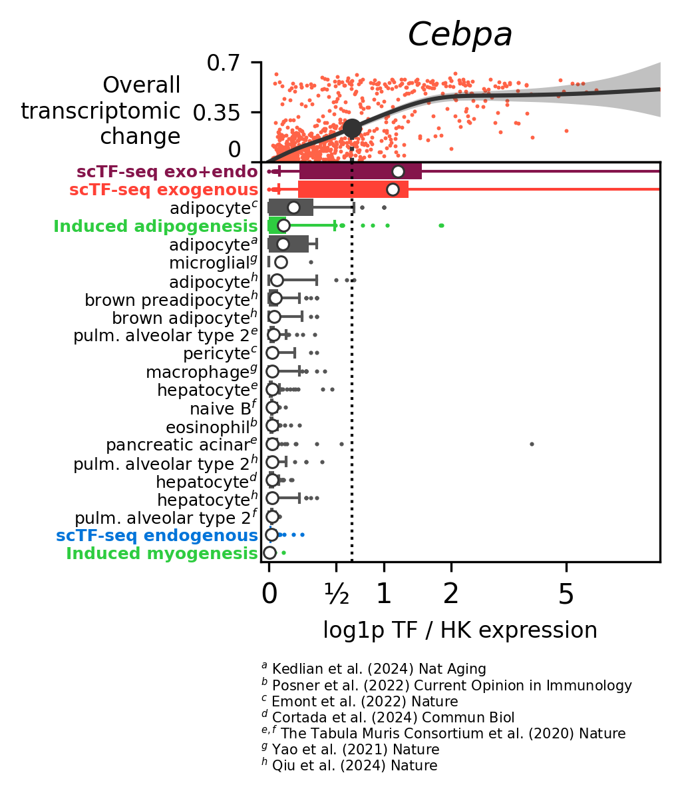
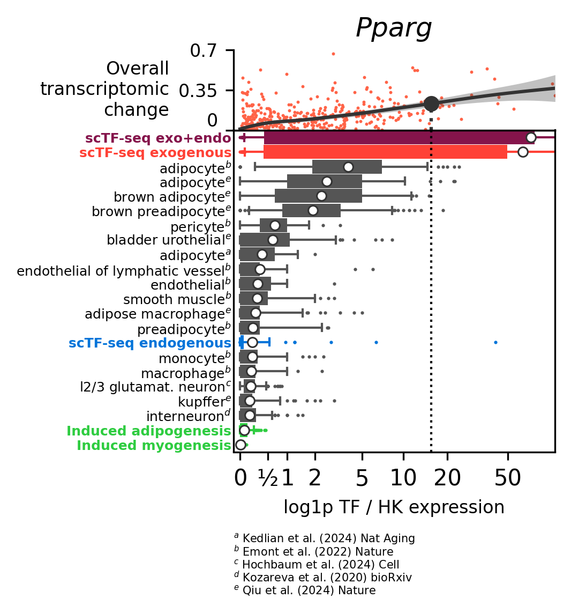
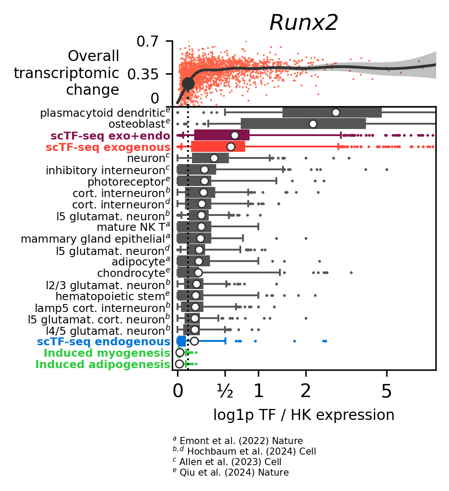
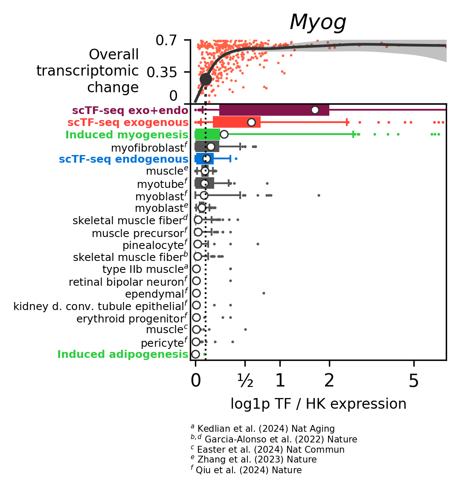
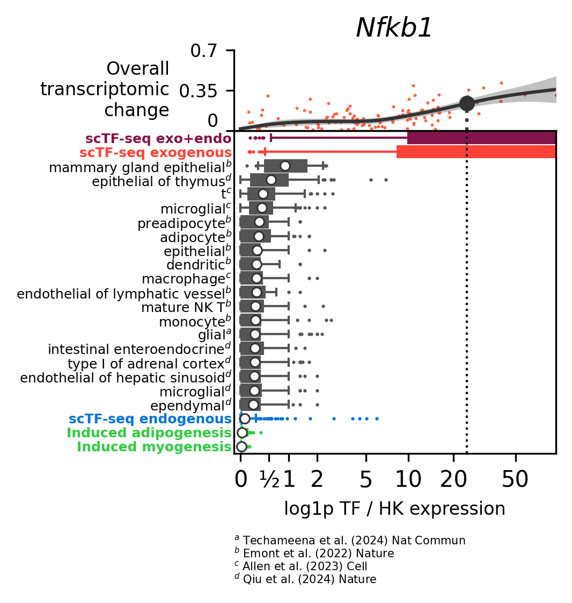
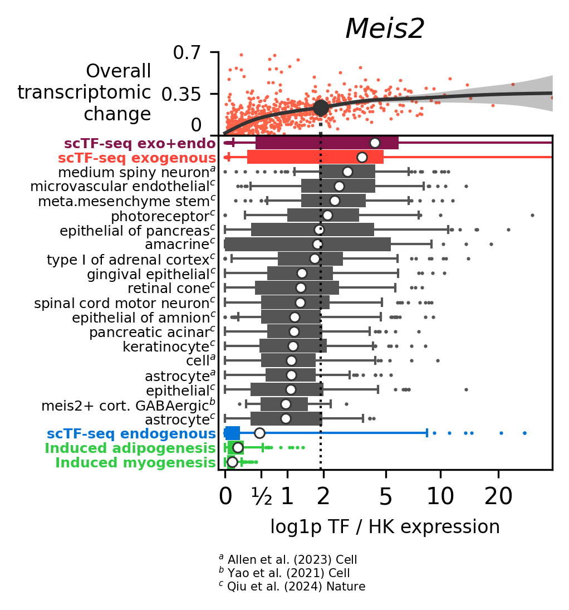
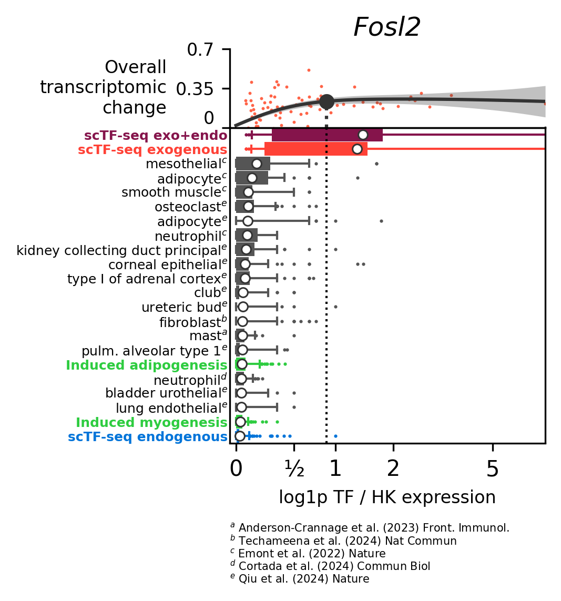
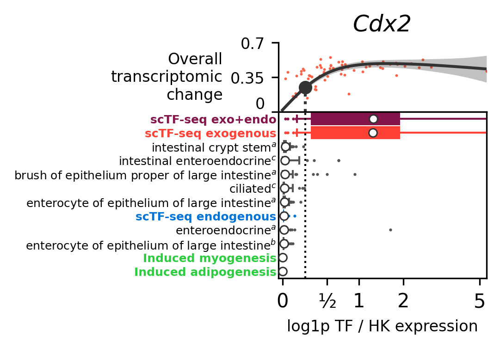
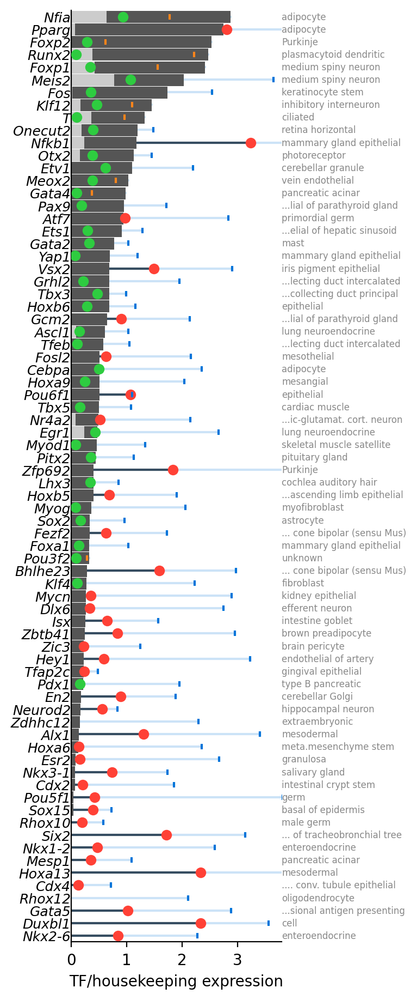

# Compare endogenous and exogenous overexpression

It is often asserted that overexpression leads to very high "non-physiological" levels of gene expression.
In this notebook we wanted to test this by comparing levels of gene expression in public single-cell datasets
with the levels of overexpression in the scTF-seq dataset. Of particular interest is the level of exogenous expression at which you
observe a significant change in gene expression.
Note the obvious limitations of this approach.
1. We may underestimate physiological levels if:
- Some states of interest may not be present in the public atlas
- Clusters are defined too broad in the public atlas
2. We may underestimate exogenous levels if:
- The overexpression leads to mRNAs that are more easily translated

First run [1-download_census.py](1-download_census.py) to download the data and create the adata object.
Then run this notebook [2-create_figures.py](2-create_figures.py) to combine the data with scTFseq data.


```python
import matplotlib as mpl
import matplotlib.pyplot as plt
import pandas as pd
import numpy as np
import scipy
import tqdm.auto as tqdm

import polyptich as pp

pp.setup_ipython()

import scanpy as sc

import pickle
```


```python
data_folder = pp.paths.get_data()
```


```python
obs_alltfs = (
    pd.read_csv(data_folder / "obs.csv").rename(columns={"Unnamed: 0": "cell"}).set_index("cell")
)
mtx = scipy.io.mmread("matrix.mtx").T.tocsr()
obs_alltfs["ix"] = range(obs_alltfs.shape[0])

var_alltfs = pd.read_csv(data_folder / "var.csv", index_col=0)
```


```python
obs_alltfs["activity_to_D0"] = (
    pd.read_csv(
        data_folder / "df_allG1Cells_PhaseCorrected_allTFs_D0regressed10pc_50pc_integrated.csv"
    )
    .set_index("cell")["Activity_TF_to_D0"]
    .reindex(obs_alltfs.index)
)
```

Define a set of housekeeping genes to compare against.
We explicitely chose a set of genes from different essential functions such as cytoskeleton, ribosomal proteins, glycolysis, ubiquitinilation, respiration, and translation.


```python
# housekeeping was defined in the 1-download_census script
housekeeping = pickle.load(open("housekeeping.pkl", "rb"))
tfs = obs_alltfs["TF"].unique().tolist()
```


```python
from plot_endogenous import extract_tf_dataset
```


```python
tfcapacity = pd.read_csv(
    data_folder / "TF_categories_on_potency_capacity_dosealigned.csv", index_col=0
)
tfcapacity.index.name = "TF"
```

# Load data


```python
datasets = pickle.load(open("datasets.pkl", "rb"))

adata = pickle.load(open("adata2.pkl", "rb"))
adata.var.index = adata.var.feature_name

adata.obs["dataset_ix"] = pd.Series(datasets.index, index = datasets["dataset_id"])[adata.obs["dataset_id"]].values

adata.obs["n_counts"] = adata.X.sum(axis=1).A1
adata.obs["norm"] = 1 / (adata[:, housekeeping].X.sum(1).A1 + 1)
adata = adata[adata.obs["norm"] < 0.5].copy() # remove cells with extremely low expression of housekeeping

adata.layers["norm"] = adata.X.copy()
adata.layers["norm"] = (
    adata.layers["norm"].multiply(adata.obs["norm"].values[:, None]).tocsr()
)
```

We extract the datasets for Myo_ref and Adipo_ref, to see how enodogenous TF expression changes during induction of myogenesis and adipogenesis in our C3H10T1/2 cells.


```python
adatamyo = extract_tf_dataset(mtx, obs_alltfs, var_alltfs, "Myo_ref", housekeeping=housekeeping)
adatamyo = adatamyo[adatamyo.obs["Phase_corrected"] == "G1"]
adatamyo = adatamyo[adatamyo.obs["TF"] == "Myo_ref"]
adatamyo = adatamyo[adatamyo.obs.index[:200]]

adataadipo = extract_tf_dataset(mtx, obs_alltfs, var_alltfs, "Adipo_ref", housekeeping=housekeeping)
adataadipo = adataadipo[adataadipo.obs["Phase_corrected"] == "G1"]
adataadipo = adataadipo[adataadipo.obs["TF"] == "Adipo_ref"]
adataadipo = adataadipo[adataadipo.obs.index[:200]]
```

## Individual


```python
gene = "Hnf4g"
# gene = "Zeb1"
# gene = "Hoxa9"
# gene = "Myod1"
# gene = "Myog"
# gene = "Pparg"
# gene = "Cebpa"
gene = "Runx2"
tf = gene
```


```python
from plot_endogenous import plot as plot_endogenous
```


```python
tf = "Runx2"
fig = plot_endogenous(
    mtx, obs_alltfs, var_alltfs, tf, tf, housekeeping, adata, datasets=datasets, adatamyo = adatamyo, adataadipo = adataadipo, n_top = 20, width = 1.5
)
fig.display()
```


    

    


```python
import pathlib
import tqdm

plot_folder = pathlib.Path("./plots_endogenous")
import shutil

# shutil.rmtree(plot_folder, ignore_errors=True)
plot_folder.mkdir(exist_ok=True)

tfs_oi = [tf for tf in tfs if tf in adata.var.index]
tfs_oi = ["Cebpa", "Pparg", "Runx2", "Myog", "Nfkb1", "Meis2", "Fosl2"]

for gene in tqdm.tqdm(tfs_oi):
    fig = plot_endogenous(
        mtx, obs_alltfs, var_alltfs, gene, gene, housekeeping, adata, datasets=datasets, adatamyo = adatamyo, adataadipo = adataadipo
    )
    fig.savefig(plot_folder / f"{gene}.pdf", display = False, transparent=True)
    fig.savefig(plot_folder / f"{gene}.png", display = True, transparent=True)
```

      0%|          | 0/7 [00:00<?, ?it/s]


    

    


     14%|█▍        | 1/7 [00:01<00:08,  1.37s/it]


    

    


     29%|██▊       | 2/7 [00:02<00:06,  1.33s/it]


    

    


     43%|████▎     | 3/7 [00:04<00:05,  1.49s/it]


    

    


     57%|█████▋    | 4/7 [00:05<00:04,  1.39s/it]


    

    


     71%|███████▏  | 5/7 [00:06<00:02,  1.34s/it]


    

    


     86%|████████▌ | 6/7 [00:08<00:01,  1.33s/it]


    

    


    100%|██████████| 7/7 [00:09<00:00,  1.34s/it]
    100%|██████████| 7/7 [00:09<00:00,  1.34s/it]


```python
citations = {}
fig = plot_endogenous(
        mtx, obs_alltfs, var_alltfs, "Cdx2", "Cdx2", housekeeping, adata, datasets=datasets, adatamyo = adatamyo, adataadipo = adataadipo, width = 1.5, n_top = 10, add_citations = False, citations = citations
    )
fig.display()
```


    

    


```python
datasets_oi = datasets.loc[citations.keys()]
datasets_oi["footnote_symbol"] = [citations[x] for x in datasets_oi.index]
plotdata = datasets_oi.groupby("collection_doi_label").agg(
    {"footnote_symbol": tuple}
)
plotdata = plotdata.sort_values("footnote_symbol", ascending=False)
plotdata["ix"] = range(plotdata.shape[0])

fig, ax = plt.subplots(figsize = (2, len(plotdata) * 0.15))
for label, dataset in plotdata.iterrows():
    label = label.replace("The Tabula Sapiens Consortium* et al.", "Tabula Sapiens")
    ax.text(
        0,
        dataset["ix"],
        f"$^{{{','.join(dataset['footnote_symbol'])}}}$ {label}",
        ha="left",
        va="center",
        fontsize=7,
    )
ax.set_ylim(-0.5, len(plotdata) - 0.5)
ax.axis("off")
fig.savefig(plot_folder / f"small_footnotes.pdf", transparent=True)
```


    

    


## Global


```python
from plot_endogenous import smooth_spline_fit_se, abbreviate_sentence

tfs_oi = ["Runx2"]
tfs_oi = tfcapacity.query("category != 'low-capacity'").index
tfs_oi = [x for x in tfcapacity.index if x not in ["Pparg1", "Spert"]]
tfs_oi = [x for x in tfs_oi if x in adata.var.index]

tfscores_exogenous = []
for gene in tqdm.tqdm(tfs_oi, mininterval = 2):
    adatatf = extract_tf_dataset(mtx, obs_alltfs, var_alltfs, gene, housekeeping)
    adatatf = adatatf[adatatf.obs["Phase_corrected"] == "G1"].copy()
    adatatf.obs["target"] = adatatf.obs["activity_to_D0"]

    plotdata = pd.DataFrame(
        {
            "expression": np.log(adatatf.obs["Vector_10X_norm"] + 1),
            "dataset_cell_type": "scTF-seq",
            "target": adatatf.obs["target"],
        }
    )
    plotdata_0 = plotdata.loc[plotdata["expression"] == 0]
    plotdata_non0 = plotdata.loc[plotdata["expression"] != 0]

    extent = plotdata_non0["expression"].max()
    extent_left = -extent * 0.02
    plotdata_smooth = pd.DataFrame(
        {
            "expression": np.linspace(0, extent, 100),
        }
    )
    plotdata_smooth["target"], plotdata_smooth["target_se"] = smooth_spline_fit_se(
        plotdata["expression"], plotdata["target"], plotdata_smooth["expression"]
    ).T

    cutoff = 0.23
    if plotdata_smooth["target"].max() < cutoff:
        target = plotdata_smooth["expression"].loc[
                plotdata_smooth["target"].argmax()
            ]
    else:
        target = plotdata_smooth["expression"][
            plotdata_smooth["target"] > cutoff
        ].iloc[0]


    tfscores_exogenous.append(
        {
            "tf": gene,
            "target_03": target,
            "max_dose": plotdata_smooth["expression"].max(),
            "never_reached": plotdata_smooth["target"].max() < cutoff,
        }
    )

tfscores_exogenous = pd.DataFrame(tfscores_exogenous)
```

    100%|██████████| 227/227 [00:21<00:00, 10.52it/s]


```python
tfscores_endogenous = []

for gene in tqdm.tqdm(tfs_oi, mininterval = 2):
    plotdata = pd.DataFrame(
        {
            "expression": np.log1p(sc.get.obs_df(adata, gene, layer="norm").values[:, 0]),
            "dataset_ix": adata.obs["dataset_ix"],
            "cell_type": adata.obs["cell_type"],
        }
    )
    plotdata["dataset_cell_type"] = (
        plotdata["cell_type"].astype(str).apply(abbreviate_sentence, max_length=50)
        + " "
        + plotdata["dataset_ix"].astype(str)
    )

    dataset_cell_type_oi = (
        plotdata.groupby("dataset_cell_type")["expression"]
        .mean()
        .sort_values(ascending=False)
        .index[0]
    )
    plotdata_oi = plotdata.query("dataset_cell_type == @dataset_cell_type_oi")

    tfscores_endogenous.append(
        {
            "q90": plotdata_oi["expression"].quantile(0.90),
            "q95": plotdata_oi["expression"].quantile(0.94),
            "q99": plotdata_oi["expression"].quantile(0.99),
            "q10": plotdata_oi["expression"].quantile(0.10),
            "q05": plotdata_oi["expression"].quantile(0.05),
            "mean": plotdata_oi["expression"].mean(),
            "tf": gene,
            "med": plotdata_oi["expression"].median(),
            "cell_type": ' '.join(dataset_cell_type_oi.split(" ")[:-1]),
        }
    )
tfscores_endogenous = pd.DataFrame(tfscores_endogenous)
```

    100%|██████████| 227/227 [01:10<00:00,  3.20it/s]


```python
tfscores = tfscores_exogenous.merge(tfscores_endogenous, on="tf")
```


```python
(tfscores["target_03"] < tfscores["q95"]).mean()
```


    np.float64(0.2555066079295154)


```python
tfscores.query("target_03 < q95").sort_values("target_03")
# tfscores.query("target_03 > q95")
```


<div>
<style scoped>
    .dataframe tbody tr th:only-of-type {
        vertical-align: middle;
    }

    .dataframe tbody tr th {
        vertical-align: top;
    }

    .dataframe thead th {
        text-align: right;
    }
</style>
<table border="1" class="dataframe">
  <thead>
    <tr style="text-align: right;">
      <th></th>
      <th>tf</th>
      <th>target_03</th>
      <th>max_dose</th>
      <th>never_reached</th>
      <th>q90</th>
      <th>q95</th>
      <th>q99</th>
      <th>q10</th>
      <th>q05</th>
      <th>mean</th>
      <th>med</th>
      <th>cell_type</th>
    </tr>
  </thead>
  <tbody>
    <tr>
      <th>155</th>
      <td>Yap1</td>
      <td>0.072797</td>
      <td>1.201152</td>
      <td>False</td>
      <td>0.693147</td>
      <td>0.700772</td>
      <td>0.828469</td>
      <td>0.012021</td>
      <td>0.000000</td>
      <td>0.350047</td>
      <td>0.318454</td>
      <td>mammary gland epithelial</td>
    </tr>
    <tr>
      <th>26</th>
      <td>Myod1</td>
      <td>0.080944</td>
      <td>1.335579</td>
      <td>False</td>
      <td>0.351850</td>
      <td>0.461144</td>
      <td>0.826536</td>
      <td>0.000000</td>
      <td>0.000000</td>
      <td>0.091071</td>
      <td>0.000000</td>
      <td>skeletal muscle satellite</td>
    </tr>
    <tr>
      <th>7</th>
      <td>Myog</td>
      <td>0.083126</td>
      <td>2.057374</td>
      <td>False</td>
      <td>0.293836</td>
      <td>0.366375</td>
      <td>0.471864</td>
      <td>0.000000</td>
      <td>0.000000</td>
      <td>0.126268</td>
      <td>0.095310</td>
      <td>myofibroblast</td>
    </tr>
    <tr>
      <th>148</th>
      <td>Runx2</td>
      <td>0.089475</td>
      <td>2.214504</td>
      <td>False</td>
      <td>2.297560</td>
      <td>2.469549</td>
      <td>3.152662</td>
      <td>0.604156</td>
      <td>0.388217</td>
      <td>1.354819</td>
      <td>1.280934</td>
      <td>plasmacytoid dendritic</td>
    </tr>
    <tr>
      <th>158</th>
      <td>Pou3f2</td>
      <td>0.094864</td>
      <td>0.284591</td>
      <td>False</td>
      <td>0.266785</td>
      <td>0.323203</td>
      <td>0.452526</td>
      <td>0.000000</td>
      <td>0.000000</td>
      <td>0.112960</td>
      <td>0.071038</td>
      <td>unknown</td>
    </tr>
    <tr>
      <th>179</th>
      <td>T</td>
      <td>0.097016</td>
      <td>0.960462</td>
      <td>False</td>
      <td>1.229361</td>
      <td>1.330191</td>
      <td>1.444994</td>
      <td>0.386110</td>
      <td>0.365783</td>
      <td>0.755934</td>
      <td>0.693147</td>
      <td>ciliated</td>
    </tr>
    <tr>
      <th>138</th>
      <td>Gata4</td>
      <td>0.101853</td>
      <td>0.373462</td>
      <td>False</td>
      <td>0.782097</td>
      <td>0.981183</td>
      <td>1.271637</td>
      <td>0.000000</td>
      <td>0.000000</td>
      <td>0.387520</td>
      <td>0.336472</td>
      <td>pancreatic acinar</td>
    </tr>
    <tr>
      <th>122</th>
      <td>Tfeb</td>
      <td>0.106412</td>
      <td>1.053480</td>
      <td>False</td>
      <td>0.510826</td>
      <td>0.583754</td>
      <td>0.847298</td>
      <td>0.000000</td>
      <td>0.000000</td>
      <td>0.204121</td>
      <td>0.182322</td>
      <td>kidney collecting duct intercalated</td>
    </tr>
    <tr>
      <th>169</th>
      <td>Klf4</td>
      <td>0.112454</td>
      <td>2.226584</td>
      <td>False</td>
      <td>0.256528</td>
      <td>0.275765</td>
      <td>0.422939</td>
      <td>0.021746</td>
      <td>0.013360</td>
      <td>0.131299</td>
      <td>0.121885</td>
      <td>fibroblast</td>
    </tr>
    <tr>
      <th>157</th>
      <td>Foxa1</td>
      <td>0.136052</td>
      <td>1.036092</td>
      <td>False</td>
      <td>0.287682</td>
      <td>0.326306</td>
      <td>0.455033</td>
      <td>0.000000</td>
      <td>0.000000</td>
      <td>0.098589</td>
      <td>0.000000</td>
      <td>mammary gland epithelial</td>
    </tr>
    <tr>
      <th>221</th>
      <td>Krba1</td>
      <td>0.138016</td>
      <td>0.546544</td>
      <td>True</td>
      <td>0.287682</td>
      <td>0.287682</td>
      <td>0.549113</td>
      <td>0.000000</td>
      <td>0.000000</td>
      <td>0.074853</td>
      <td>0.000000</td>
      <td>kidney d. conv. tubule epithelial</td>
    </tr>
    <tr>
      <th>171</th>
      <td>Ascl1</td>
      <td>0.145811</td>
      <td>1.031091</td>
      <td>False</td>
      <td>0.581701</td>
      <td>0.605166</td>
      <td>0.634497</td>
      <td>0.098541</td>
      <td>0.089642</td>
      <td>0.326500</td>
      <td>0.292447</td>
      <td>lung neuroendocrine</td>
    </tr>
    <tr>
      <th>119</th>
      <td>Zkscan1</td>
      <td>0.148801</td>
      <td>0.409203</td>
      <td>True</td>
      <td>0.287682</td>
      <td>0.315483</td>
      <td>0.455033</td>
      <td>0.000000</td>
      <td>0.000000</td>
      <td>0.089902</td>
      <td>0.000000</td>
      <td>mammary gland epithelial</td>
    </tr>
    <tr>
      <th>121</th>
      <td>Tgif2</td>
      <td>0.154046</td>
      <td>0.311236</td>
      <td>True</td>
      <td>0.161050</td>
      <td>0.287682</td>
      <td>0.385457</td>
      <td>0.000000</td>
      <td>0.000000</td>
      <td>0.039897</td>
      <td>0.000000</td>
      <td>primordial germ</td>
    </tr>
    <tr>
      <th>172</th>
      <td>Pdx1</td>
      <td>0.157709</td>
      <td>1.951646</td>
      <td>False</td>
      <td>0.126203</td>
      <td>0.221482</td>
      <td>0.479188</td>
      <td>0.000000</td>
      <td>0.000000</td>
      <td>0.063994</td>
      <td>0.030481</td>
      <td>type B pancreatic</td>
    </tr>
    <tr>
      <th>178</th>
      <td>Tbx5</td>
      <td>0.163624</td>
      <td>1.079920</td>
      <td>False</td>
      <td>0.367725</td>
      <td>0.502546</td>
      <td>0.791305</td>
      <td>0.000000</td>
      <td>0.000000</td>
      <td>0.119887</td>
      <td>0.000000</td>
      <td>cardiac muscle</td>
    </tr>
    <tr>
      <th>167</th>
      <td>Sox2</td>
      <td>0.165698</td>
      <td>0.964948</td>
      <td>False</td>
      <td>0.307908</td>
      <td>0.336472</td>
      <td>0.510826</td>
      <td>0.000000</td>
      <td>0.000000</td>
      <td>0.120792</td>
      <td>0.095310</td>
      <td>astrocyte</td>
    </tr>
    <tr>
      <th>211</th>
      <td>Zbtb33</td>
      <td>0.177042</td>
      <td>1.095448</td>
      <td>True</td>
      <td>0.108518</td>
      <td>0.193752</td>
      <td>0.485516</td>
      <td>0.000000</td>
      <td>0.000000</td>
      <td>0.031892</td>
      <td>0.000000</td>
      <td>mesothelial</td>
    </tr>
    <tr>
      <th>8</th>
      <td>Pax9</td>
      <td>0.191140</td>
      <td>1.720261</td>
      <td>False</td>
      <td>0.693147</td>
      <td>0.948560</td>
      <td>1.098612</td>
      <td>0.000000</td>
      <td>0.000000</td>
      <td>0.289472</td>
      <td>0.232153</td>
      <td>epithelial of parathyroid gland</td>
    </tr>
    <tr>
      <th>182</th>
      <td>Rogdi</td>
      <td>0.204452</td>
      <td>0.632523</td>
      <td>True</td>
      <td>0.669839</td>
      <td>0.781650</td>
      <td>1.074266</td>
      <td>0.000000</td>
      <td>0.000000</td>
      <td>0.187035</td>
      <td>0.000000</td>
      <td>microglial</td>
    </tr>
    <tr>
      <th>110</th>
      <td>Grhl2</td>
      <td>0.216725</td>
      <td>1.950526</td>
      <td>False</td>
      <td>0.587787</td>
      <td>0.693147</td>
      <td>0.754807</td>
      <td>0.000000</td>
      <td>0.000000</td>
      <td>0.245749</td>
      <td>0.223144</td>
      <td>kidney collecting duct intercalated</td>
    </tr>
    <tr>
      <th>87</th>
      <td>Hoxa9</td>
      <td>0.247128</td>
      <td>2.038804</td>
      <td>False</td>
      <td>0.458520</td>
      <td>0.510826</td>
      <td>0.651213</td>
      <td>0.000000</td>
      <td>0.000000</td>
      <td>0.129027</td>
      <td>0.000000</td>
      <td>mesangial</td>
    </tr>
    <tr>
      <th>137</th>
      <td>Tead2</td>
      <td>0.253186</td>
      <td>1.089802</td>
      <td>True</td>
      <td>0.447333</td>
      <td>0.509307</td>
      <td>0.691324</td>
      <td>0.000000</td>
      <td>0.000000</td>
      <td>0.179339</td>
      <td>0.174688</td>
      <td>iris pigment epithelial</td>
    </tr>
    <tr>
      <th>203</th>
      <td>Arnt2</td>
      <td>0.280690</td>
      <td>0.793952</td>
      <td>True</td>
      <td>0.747214</td>
      <td>0.805871</td>
      <td>1.156715</td>
      <td>0.064539</td>
      <td>0.000000</td>
      <td>0.373159</td>
      <td>0.321938</td>
      <td>inhibitory interneuron</td>
    </tr>
    <tr>
      <th>6</th>
      <td>Hoxb6</td>
      <td>0.281746</td>
      <td>1.162203</td>
      <td>False</td>
      <td>0.606136</td>
      <td>0.693147</td>
      <td>0.836988</td>
      <td>0.000000</td>
      <td>0.000000</td>
      <td>0.286272</td>
      <td>0.287682</td>
      <td>epithelial</td>
    </tr>
    <tr>
      <th>80</th>
      <td>Foxp2</td>
      <td>0.286871</td>
      <td>0.617395</td>
      <td>False</td>
      <td>2.332040</td>
      <td>2.531740</td>
      <td>3.008194</td>
      <td>0.000000</td>
      <td>0.000000</td>
      <td>1.340013</td>
      <td>1.420405</td>
      <td>Purkinje</td>
    </tr>
    <tr>
      <th>135</th>
      <td>Hoxd10</td>
      <td>0.288097</td>
      <td>0.559247</td>
      <td>False</td>
      <td>0.294581</td>
      <td>0.405465</td>
      <td>0.521072</td>
      <td>0.000000</td>
      <td>0.000000</td>
      <td>0.084409</td>
      <td>0.000000</td>
      <td>kidney d. conv. tubule epithelial</td>
    </tr>
    <tr>
      <th>214</th>
      <td>Dcun1d3</td>
      <td>0.288620</td>
      <td>0.952445</td>
      <td>True</td>
      <td>1.124428</td>
      <td>1.199922</td>
      <td>1.386294</td>
      <td>0.000000</td>
      <td>0.000000</td>
      <td>0.504067</td>
      <td>0.470004</td>
      <td>adipocyte</td>
    </tr>
    <tr>
      <th>12</th>
      <td>Ets1</td>
      <td>0.297916</td>
      <td>1.282333</td>
      <td>False</td>
      <td>0.693147</td>
      <td>0.916291</td>
      <td>1.299283</td>
      <td>0.000000</td>
      <td>0.000000</td>
      <td>0.361277</td>
      <td>0.287682</td>
      <td>endothelial of hepatic sinusoid</td>
    </tr>
    <tr>
      <th>164</th>
      <td>Etv6</td>
      <td>0.316011</td>
      <td>0.744883</td>
      <td>True</td>
      <td>1.568518</td>
      <td>1.690255</td>
      <td>1.934213</td>
      <td>0.463753</td>
      <td>0.304695</td>
      <td>1.021060</td>
      <td>0.990399</td>
      <td>mammary gland epithelial</td>
    </tr>
    <tr>
      <th>77</th>
      <td>Gata2</td>
      <td>0.324433</td>
      <td>1.036092</td>
      <td>False</td>
      <td>0.609121</td>
      <td>0.775114</td>
      <td>1.098612</td>
      <td>0.000000</td>
      <td>0.000000</td>
      <td>0.317286</td>
      <td>0.287682</td>
      <td>mast</td>
    </tr>
    <tr>
      <th>177</th>
      <td>Lhx3</td>
      <td>0.344928</td>
      <td>0.853698</td>
      <td>False</td>
      <td>0.312077</td>
      <td>0.405465</td>
      <td>0.693147</td>
      <td>0.000000</td>
      <td>0.000000</td>
      <td>0.130032</td>
      <td>0.075775</td>
      <td>cochlea auditory hair</td>
    </tr>
    <tr>
      <th>88</th>
      <td>Foxp1</td>
      <td>0.346856</td>
      <td>1.560854</td>
      <td>False</td>
      <td>2.327625</td>
      <td>2.411096</td>
      <td>2.755557</td>
      <td>0.845859</td>
      <td>0.421831</td>
      <td>1.540615</td>
      <td>1.531663</td>
      <td>medium spiny neuron</td>
    </tr>
    <tr>
      <th>149</th>
      <td>Pitx2</td>
      <td>0.353527</td>
      <td>1.129004</td>
      <td>False</td>
      <td>0.287682</td>
      <td>0.444379</td>
      <td>0.565369</td>
      <td>0.000000</td>
      <td>0.000000</td>
      <td>0.106693</td>
      <td>0.000000</td>
      <td>pituitary gland</td>
    </tr>
    <tr>
      <th>128</th>
      <td>Fos</td>
      <td>0.359276</td>
      <td>2.540597</td>
      <td>False</td>
      <td>1.615536</td>
      <td>1.733731</td>
      <td>2.159150</td>
      <td>0.067067</td>
      <td>0.022001</td>
      <td>0.879291</td>
      <td>0.868055</td>
      <td>keratinocyte stem</td>
    </tr>
    <tr>
      <th>41</th>
      <td>Otx2</td>
      <td>0.381766</td>
      <td>1.453647</td>
      <td>False</td>
      <td>1.055107</td>
      <td>1.130220</td>
      <td>1.265305</td>
      <td>0.202733</td>
      <td>0.154151</td>
      <td>0.613967</td>
      <td>0.649642</td>
      <td>photoreceptor</td>
    </tr>
    <tr>
      <th>17</th>
      <td>Meox2</td>
      <td>0.388429</td>
      <td>0.801136</td>
      <td>False</td>
      <td>0.854641</td>
      <td>1.029619</td>
      <td>1.498894</td>
      <td>0.000000</td>
      <td>0.000000</td>
      <td>0.314086</td>
      <td>0.168236</td>
      <td>vein endothelial</td>
    </tr>
    <tr>
      <th>145</th>
      <td>Onecut2</td>
      <td>0.390056</td>
      <td>1.485213</td>
      <td>False</td>
      <td>1.098612</td>
      <td>1.193846</td>
      <td>1.394299</td>
      <td>0.287682</td>
      <td>0.188647</td>
      <td>0.640803</td>
      <td>0.587787</td>
      <td>retina horizontal</td>
    </tr>
    <tr>
      <th>186</th>
      <td>Egr1</td>
      <td>0.429298</td>
      <td>2.656283</td>
      <td>False</td>
      <td>0.442853</td>
      <td>0.472550</td>
      <td>0.509672</td>
      <td>0.237715</td>
      <td>0.234438</td>
      <td>0.317721</td>
      <td>0.261314</td>
      <td>lung neuroendocrine</td>
    </tr>
    <tr>
      <th>202</th>
      <td>Arnt</td>
      <td>0.463743</td>
      <td>0.646627</td>
      <td>True</td>
      <td>0.772667</td>
      <td>0.847298</td>
      <td>1.098612</td>
      <td>0.000000</td>
      <td>0.000000</td>
      <td>0.378255</td>
      <td>0.287682</td>
      <td>adipocyte</td>
    </tr>
    <tr>
      <th>104</th>
      <td>Klf12</td>
      <td>0.466078</td>
      <td>1.098612</td>
      <td>False</td>
      <td>1.349071</td>
      <td>1.451965</td>
      <td>1.861387</td>
      <td>0.223144</td>
      <td>0.170172</td>
      <td>0.779011</td>
      <td>0.742407</td>
      <td>inhibitory interneuron</td>
    </tr>
    <tr>
      <th>131</th>
      <td>Tbx3</td>
      <td>0.472053</td>
      <td>0.994325</td>
      <td>False</td>
      <td>0.591457</td>
      <td>0.693147</td>
      <td>0.998457</td>
      <td>0.000000</td>
      <td>0.000000</td>
      <td>0.306270</td>
      <td>0.287682</td>
      <td>kidney collecting duct principal</td>
    </tr>
    <tr>
      <th>160</th>
      <td>Cebpa</td>
      <td>0.499775</td>
      <td>2.356083</td>
      <td>False</td>
      <td>0.447609</td>
      <td>0.510826</td>
      <td>0.693147</td>
      <td>0.000000</td>
      <td>0.000000</td>
      <td>0.148580</td>
      <td>0.000000</td>
      <td>adipocyte</td>
    </tr>
    <tr>
      <th>46</th>
      <td>Hmg20a</td>
      <td>0.521596</td>
      <td>1.324052</td>
      <td>True</td>
      <td>0.693147</td>
      <td>0.847298</td>
      <td>1.092401</td>
      <td>0.000000</td>
      <td>0.000000</td>
      <td>0.305195</td>
      <td>0.287682</td>
      <td>epithelial</td>
    </tr>
    <tr>
      <th>123</th>
      <td>Tbx15</td>
      <td>0.547133</td>
      <td>0.547133</td>
      <td>True</td>
      <td>0.693147</td>
      <td>0.846121</td>
      <td>1.430029</td>
      <td>0.000000</td>
      <td>0.000000</td>
      <td>0.223232</td>
      <td>0.000000</td>
      <td>fibroblast</td>
    </tr>
    <tr>
      <th>33</th>
      <td>Gata3</td>
      <td>0.613205</td>
      <td>1.517683</td>
      <td>False</td>
      <td>1.271078</td>
      <td>1.511091</td>
      <td>1.795766</td>
      <td>0.000000</td>
      <td>0.000000</td>
      <td>0.654521</td>
      <td>0.559616</td>
      <td>mammary gland epithelial</td>
    </tr>
    <tr>
      <th>142</th>
      <td>Zim1</td>
      <td>0.617815</td>
      <td>0.617815</td>
      <td>True</td>
      <td>0.591457</td>
      <td>0.693147</td>
      <td>0.975666</td>
      <td>0.000000</td>
      <td>0.000000</td>
      <td>0.188605</td>
      <td>0.060625</td>
      <td>intrahepatic cholangiocyte</td>
    </tr>
    <tr>
      <th>73</th>
      <td>Etv1</td>
      <td>0.620985</td>
      <td>2.195625</td>
      <td>False</td>
      <td>1.081210</td>
      <td>1.098612</td>
      <td>1.299283</td>
      <td>0.000000</td>
      <td>0.000000</td>
      <td>0.525133</td>
      <td>0.510826</td>
      <td>cerebellar granule</td>
    </tr>
    <tr>
      <th>30</th>
      <td>Sall3</td>
      <td>0.624030</td>
      <td>1.188057</td>
      <td>True</td>
      <td>0.693147</td>
      <td>0.713958</td>
      <td>1.109966</td>
      <td>0.000000</td>
      <td>0.000000</td>
      <td>0.232762</td>
      <td>0.182322</td>
      <td>kidney d. conv. tubule epithelial</td>
    </tr>
    <tr>
      <th>140</th>
      <td>Trerf1</td>
      <td>0.643550</td>
      <td>0.643550</td>
      <td>True</td>
      <td>1.697032</td>
      <td>1.805817</td>
      <td>2.386003</td>
      <td>0.000000</td>
      <td>0.000000</td>
      <td>0.789126</td>
      <td>0.693147</td>
      <td>monocyte</td>
    </tr>
    <tr>
      <th>139</th>
      <td>Tfap2b</td>
      <td>0.723630</td>
      <td>0.863126</td>
      <td>False</td>
      <td>1.098612</td>
      <td>1.098612</td>
      <td>1.307984</td>
      <td>0.154151</td>
      <td>0.000000</td>
      <td>0.575194</td>
      <td>0.510826</td>
      <td>retina horizontal</td>
    </tr>
    <tr>
      <th>40</th>
      <td>Tead1</td>
      <td>0.761400</td>
      <td>1.177790</td>
      <td>False</td>
      <td>2.436508</td>
      <td>2.527240</td>
      <td>2.732840</td>
      <td>0.000000</td>
      <td>0.000000</td>
      <td>1.224665</td>
      <td>1.299283</td>
      <td>adipocyte</td>
    </tr>
    <tr>
      <th>79</th>
      <td>Zfp800</td>
      <td>0.794269</td>
      <td>0.947381</td>
      <td>False</td>
      <td>0.801948</td>
      <td>0.862520</td>
      <td>1.005754</td>
      <td>0.000000</td>
      <td>0.000000</td>
      <td>0.307149</td>
      <td>0.223144</td>
      <td>mast</td>
    </tr>
    <tr>
      <th>3</th>
      <td>Nfia</td>
      <td>0.934744</td>
      <td>1.779609</td>
      <td>False</td>
      <td>2.761583</td>
      <td>2.879069</td>
      <td>3.056618</td>
      <td>0.947824</td>
      <td>0.638451</td>
      <td>1.886274</td>
      <td>1.945910</td>
      <td>adipocyte</td>
    </tr>
    <tr>
      <th>53</th>
      <td>Bach2</td>
      <td>1.029138</td>
      <td>1.756633</td>
      <td>True</td>
      <td>2.711835</td>
      <td>2.780516</td>
      <td>3.208268</td>
      <td>0.311239</td>
      <td>0.135593</td>
      <td>1.378633</td>
      <td>1.252763</td>
      <td>B</td>
    </tr>
    <tr>
      <th>185</th>
      <td>Meis2</td>
      <td>1.068696</td>
      <td>3.648308</td>
      <td>False</td>
      <td>1.898362</td>
      <td>2.030316</td>
      <td>2.414269</td>
      <td>0.890606</td>
      <td>0.772997</td>
      <td>1.362172</td>
      <td>1.336012</td>
      <td>medium spiny neuron</td>
    </tr>
    <tr>
      <th>47</th>
      <td>Zfp462</td>
      <td>1.420589</td>
      <td>1.435085</td>
      <td>False</td>
      <td>1.299283</td>
      <td>1.495538</td>
      <td>1.792492</td>
      <td>0.356675</td>
      <td>0.223144</td>
      <td>0.827878</td>
      <td>0.806638</td>
      <td>oligodendrocyte precursor</td>
    </tr>
    <tr>
      <th>52</th>
      <td>Rbpjl</td>
      <td>1.850600</td>
      <td>1.850600</td>
      <td>True</td>
      <td>2.696246</td>
      <td>2.991554</td>
      <td>4.729635</td>
      <td>0.000000</td>
      <td>0.000000</td>
      <td>1.098516</td>
      <td>0.829417</td>
      <td>pancreatic acinar</td>
    </tr>
  </tbody>
</table>
</div>


```python
# plotdata = tfscores.loc[~plotdata["never_reached"]]
plotdata = tfscores.loc[tfscores["tf"].isin(tfcapacity.query("category != 'low-capacity'").index)]

plotdata = plotdata.sort_values(["q95"])
plotdata["ix"] = range(len(plotdata))
fig, ax = plt.subplots(figsize = (2.5, len(plotdata) * 0.15))
for _, row in plotdata.iterrows():
    rect = plt.Rectangle(
        (row["q05"], row["ix"]),
        row["q95"] - row["q05"],
        0.95,
        color="#555",
        lw = 0,
    )
    ax.add_patch(rect)
    rect2 = plt.Rectangle(
        (0, row["ix"]),
        row["q05"],
        0.95,
        color="#CCC",
        lw = 0,
    )
    ax.add_patch(rect2)

    # med
    # plt.plot([row["mean"], row["mean"]], [row["ix"], row["ix"] + 1], color="#555")

    if not row["never_reached"]:
        color = "#2ECC40" if row["target_03"] < row["q95"] else "#FF4136"
        plt.scatter(row["target_03"], row["ix"]+0.5, color=color, marker = "o", zorder = 10)
        # connect dot to q95 if outside of range
        if row["target_03"] > row["q95"]:
            plt.plot(
                [row["q95"], row["target_03"]],
                [row["ix"] + 0.5, row["ix"] + 0.5],
                color="#444",linestyle = "-",
                zorder = -1
            )

    color = "#0074D9" if row["max_dose"] > row["q95"] else "#FF851B"
    # marker = "." if not row["never_reached"] else "x"
    marker = "|"
    ax.scatter(
        row["max_dose"], row["ix"] + 0.5, color=color, marker=marker, zorder=10, s = 15
    )
    ax.plot(
        [row["max_dose"], row["q95"]],
        [row["ix"] + 0.5, row["ix"] + 0.5],
        color="#0074D9",
        linestyle="-",
        alpha = 0.2,
        zorder=-1,
    )

    label = row["cell_type"]
    if len(label) > 27:
        label = "..." + label[-25:]
    ax.text(1, row["ix"] + 0.5, label, va="center", ha="left", transform=mpl.transforms.blended_transform_factory(ax.transAxes, ax.transData), fontsize = 6, color = "#888")
# for ix in plotdata["ix"].iloc[::2]:
#     plt.axhspan(ix, ix+1, color="#EEE", zorder=-10)

ax.set_yticks(plotdata["ix"] + 0.5)
ax.set_yticklabels(plotdata["tf"], fontstyle = "italic", fontsize = 9)
ax.tick_params(axis="y", which="major", pad=0.2, length=0)
ax.set_xlim(0, 3.8)
ax.set_ylim(0., len(plotdata))
ax.spines["right"].set_visible(False)
ax.spines["top"].set_visible(False)
ax.set_xlabel("TF/housekeeping expression")

import pathlib
plot_folder = pathlib.Path("plots_endogenous")
fig.savefig(plot_folder / "endogenous_global.pdf", bbox_inches="tight")
fig.savefig(plot_folder / "endogenous_global.png", bbox_inches="tight")
```


    

    


```python
tfscores_high_capacity = tfscores.loc[tfscores["tf"].isin(tfcapacity.query("category != 'low-capacity'").index)]
```


```python
print(f"""
Among all TFs (after pre-filtering, so 270), {(tfscores["target_03"] < tfscores["q95"]).mean():.0%}. Among all high-capacity TFs (76), {(tfscores_high_capacity["target_03"] < tfscores_high_capacity["q95"]).mean():.0%}.
""")
```

    
    Among all TFs (after pre-filtering, so 270), 26%. Among all high-capacity TFs (76), 47%.
    


```python
tfscores.query("target_03 < q95").sort_values("target_03")
```


<div>
<style scoped>
    .dataframe tbody tr th:only-of-type {
        vertical-align: middle;
    }

    .dataframe tbody tr th {
        vertical-align: top;
    }

    .dataframe thead th {
        text-align: right;
    }
</style>
<table border="1" class="dataframe">
  <thead>
    <tr style="text-align: right;">
      <th></th>
      <th>tf</th>
      <th>target_03</th>
      <th>max_dose</th>
      <th>never_reached</th>
      <th>q90</th>
      <th>q95</th>
      <th>q99</th>
      <th>q10</th>
      <th>q05</th>
      <th>mean</th>
      <th>med</th>
      <th>cell_type</th>
    </tr>
  </thead>
  <tbody>
    <tr>
      <th>155</th>
      <td>Yap1</td>
      <td>0.072797</td>
      <td>1.201152</td>
      <td>False</td>
      <td>0.693147</td>
      <td>0.700772</td>
      <td>0.828469</td>
      <td>0.012021</td>
      <td>0.000000</td>
      <td>0.350047</td>
      <td>0.318454</td>
      <td>mammary gland epithelial</td>
    </tr>
    <tr>
      <th>26</th>
      <td>Myod1</td>
      <td>0.080944</td>
      <td>1.335579</td>
      <td>False</td>
      <td>0.351850</td>
      <td>0.461144</td>
      <td>0.826536</td>
      <td>0.000000</td>
      <td>0.000000</td>
      <td>0.091071</td>
      <td>0.000000</td>
      <td>skeletal muscle satellite</td>
    </tr>
    <tr>
      <th>7</th>
      <td>Myog</td>
      <td>0.083126</td>
      <td>2.057374</td>
      <td>False</td>
      <td>0.293836</td>
      <td>0.366375</td>
      <td>0.471864</td>
      <td>0.000000</td>
      <td>0.000000</td>
      <td>0.126268</td>
      <td>0.095310</td>
      <td>myofibroblast</td>
    </tr>
    <tr>
      <th>148</th>
      <td>Runx2</td>
      <td>0.089475</td>
      <td>2.214504</td>
      <td>False</td>
      <td>2.297560</td>
      <td>2.469549</td>
      <td>3.152662</td>
      <td>0.604156</td>
      <td>0.388217</td>
      <td>1.354819</td>
      <td>1.280934</td>
      <td>plasmacytoid dendritic</td>
    </tr>
    <tr>
      <th>158</th>
      <td>Pou3f2</td>
      <td>0.094864</td>
      <td>0.284591</td>
      <td>False</td>
      <td>0.266785</td>
      <td>0.323203</td>
      <td>0.452526</td>
      <td>0.000000</td>
      <td>0.000000</td>
      <td>0.112960</td>
      <td>0.071038</td>
      <td>unknown</td>
    </tr>
    <tr>
      <th>179</th>
      <td>T</td>
      <td>0.097016</td>
      <td>0.960462</td>
      <td>False</td>
      <td>1.229361</td>
      <td>1.330191</td>
      <td>1.444994</td>
      <td>0.386110</td>
      <td>0.365783</td>
      <td>0.755934</td>
      <td>0.693147</td>
      <td>ciliated</td>
    </tr>
    <tr>
      <th>138</th>
      <td>Gata4</td>
      <td>0.101853</td>
      <td>0.373462</td>
      <td>False</td>
      <td>0.782097</td>
      <td>0.981183</td>
      <td>1.271637</td>
      <td>0.000000</td>
      <td>0.000000</td>
      <td>0.387520</td>
      <td>0.336472</td>
      <td>pancreatic acinar</td>
    </tr>
    <tr>
      <th>122</th>
      <td>Tfeb</td>
      <td>0.106412</td>
      <td>1.053480</td>
      <td>False</td>
      <td>0.510826</td>
      <td>0.583754</td>
      <td>0.847298</td>
      <td>0.000000</td>
      <td>0.000000</td>
      <td>0.204121</td>
      <td>0.182322</td>
      <td>kidney collecting duct intercalated</td>
    </tr>
    <tr>
      <th>169</th>
      <td>Klf4</td>
      <td>0.112454</td>
      <td>2.226584</td>
      <td>False</td>
      <td>0.256528</td>
      <td>0.275765</td>
      <td>0.422939</td>
      <td>0.021746</td>
      <td>0.013360</td>
      <td>0.131299</td>
      <td>0.121885</td>
      <td>fibroblast</td>
    </tr>
    <tr>
      <th>157</th>
      <td>Foxa1</td>
      <td>0.136052</td>
      <td>1.036092</td>
      <td>False</td>
      <td>0.287682</td>
      <td>0.326306</td>
      <td>0.455033</td>
      <td>0.000000</td>
      <td>0.000000</td>
      <td>0.098589</td>
      <td>0.000000</td>
      <td>mammary gland epithelial</td>
    </tr>
    <tr>
      <th>221</th>
      <td>Krba1</td>
      <td>0.138016</td>
      <td>0.546544</td>
      <td>True</td>
      <td>0.287682</td>
      <td>0.287682</td>
      <td>0.549113</td>
      <td>0.000000</td>
      <td>0.000000</td>
      <td>0.074853</td>
      <td>0.000000</td>
      <td>kidney d. conv. tubule epithelial</td>
    </tr>
    <tr>
      <th>171</th>
      <td>Ascl1</td>
      <td>0.145811</td>
      <td>1.031091</td>
      <td>False</td>
      <td>0.581701</td>
      <td>0.605166</td>
      <td>0.634497</td>
      <td>0.098541</td>
      <td>0.089642</td>
      <td>0.326500</td>
      <td>0.292447</td>
      <td>lung neuroendocrine</td>
    </tr>
    <tr>
      <th>119</th>
      <td>Zkscan1</td>
      <td>0.148801</td>
      <td>0.409203</td>
      <td>True</td>
      <td>0.287682</td>
      <td>0.315483</td>
      <td>0.455033</td>
      <td>0.000000</td>
      <td>0.000000</td>
      <td>0.089902</td>
      <td>0.000000</td>
      <td>mammary gland epithelial</td>
    </tr>
    <tr>
      <th>121</th>
      <td>Tgif2</td>
      <td>0.154046</td>
      <td>0.311236</td>
      <td>True</td>
      <td>0.161050</td>
      <td>0.287682</td>
      <td>0.385457</td>
      <td>0.000000</td>
      <td>0.000000</td>
      <td>0.039897</td>
      <td>0.000000</td>
      <td>primordial germ</td>
    </tr>
    <tr>
      <th>172</th>
      <td>Pdx1</td>
      <td>0.157709</td>
      <td>1.951646</td>
      <td>False</td>
      <td>0.126203</td>
      <td>0.221482</td>
      <td>0.479188</td>
      <td>0.000000</td>
      <td>0.000000</td>
      <td>0.063994</td>
      <td>0.030481</td>
      <td>type B pancreatic</td>
    </tr>
    <tr>
      <th>178</th>
      <td>Tbx5</td>
      <td>0.163624</td>
      <td>1.079920</td>
      <td>False</td>
      <td>0.367725</td>
      <td>0.502546</td>
      <td>0.791305</td>
      <td>0.000000</td>
      <td>0.000000</td>
      <td>0.119887</td>
      <td>0.000000</td>
      <td>cardiac muscle</td>
    </tr>
    <tr>
      <th>167</th>
      <td>Sox2</td>
      <td>0.165698</td>
      <td>0.964948</td>
      <td>False</td>
      <td>0.307908</td>
      <td>0.336472</td>
      <td>0.510826</td>
      <td>0.000000</td>
      <td>0.000000</td>
      <td>0.120792</td>
      <td>0.095310</td>
      <td>astrocyte</td>
    </tr>
    <tr>
      <th>211</th>
      <td>Zbtb33</td>
      <td>0.177042</td>
      <td>1.095448</td>
      <td>True</td>
      <td>0.108518</td>
      <td>0.193752</td>
      <td>0.485516</td>
      <td>0.000000</td>
      <td>0.000000</td>
      <td>0.031892</td>
      <td>0.000000</td>
      <td>mesothelial</td>
    </tr>
    <tr>
      <th>8</th>
      <td>Pax9</td>
      <td>0.191140</td>
      <td>1.720261</td>
      <td>False</td>
      <td>0.693147</td>
      <td>0.948560</td>
      <td>1.098612</td>
      <td>0.000000</td>
      <td>0.000000</td>
      <td>0.289472</td>
      <td>0.232153</td>
      <td>epithelial of parathyroid gland</td>
    </tr>
    <tr>
      <th>182</th>
      <td>Rogdi</td>
      <td>0.204452</td>
      <td>0.632523</td>
      <td>True</td>
      <td>0.669839</td>
      <td>0.781650</td>
      <td>1.074266</td>
      <td>0.000000</td>
      <td>0.000000</td>
      <td>0.187035</td>
      <td>0.000000</td>
      <td>microglial</td>
    </tr>
    <tr>
      <th>110</th>
      <td>Grhl2</td>
      <td>0.216725</td>
      <td>1.950526</td>
      <td>False</td>
      <td>0.587787</td>
      <td>0.693147</td>
      <td>0.754807</td>
      <td>0.000000</td>
      <td>0.000000</td>
      <td>0.245749</td>
      <td>0.223144</td>
      <td>kidney collecting duct intercalated</td>
    </tr>
    <tr>
      <th>87</th>
      <td>Hoxa9</td>
      <td>0.247128</td>
      <td>2.038804</td>
      <td>False</td>
      <td>0.458520</td>
      <td>0.510826</td>
      <td>0.651213</td>
      <td>0.000000</td>
      <td>0.000000</td>
      <td>0.129027</td>
      <td>0.000000</td>
      <td>mesangial</td>
    </tr>
    <tr>
      <th>137</th>
      <td>Tead2</td>
      <td>0.253186</td>
      <td>1.089802</td>
      <td>True</td>
      <td>0.447333</td>
      <td>0.509307</td>
      <td>0.691324</td>
      <td>0.000000</td>
      <td>0.000000</td>
      <td>0.179339</td>
      <td>0.174688</td>
      <td>iris pigment epithelial</td>
    </tr>
    <tr>
      <th>203</th>
      <td>Arnt2</td>
      <td>0.280690</td>
      <td>0.793952</td>
      <td>True</td>
      <td>0.747214</td>
      <td>0.805871</td>
      <td>1.156715</td>
      <td>0.064539</td>
      <td>0.000000</td>
      <td>0.373159</td>
      <td>0.321938</td>
      <td>inhibitory interneuron</td>
    </tr>
    <tr>
      <th>6</th>
      <td>Hoxb6</td>
      <td>0.281746</td>
      <td>1.162203</td>
      <td>False</td>
      <td>0.606136</td>
      <td>0.693147</td>
      <td>0.836988</td>
      <td>0.000000</td>
      <td>0.000000</td>
      <td>0.286272</td>
      <td>0.287682</td>
      <td>epithelial</td>
    </tr>
    <tr>
      <th>80</th>
      <td>Foxp2</td>
      <td>0.286871</td>
      <td>0.617395</td>
      <td>False</td>
      <td>2.332040</td>
      <td>2.531740</td>
      <td>3.008194</td>
      <td>0.000000</td>
      <td>0.000000</td>
      <td>1.340013</td>
      <td>1.420405</td>
      <td>Purkinje</td>
    </tr>
    <tr>
      <th>135</th>
      <td>Hoxd10</td>
      <td>0.288097</td>
      <td>0.559247</td>
      <td>False</td>
      <td>0.294581</td>
      <td>0.405465</td>
      <td>0.521072</td>
      <td>0.000000</td>
      <td>0.000000</td>
      <td>0.084409</td>
      <td>0.000000</td>
      <td>kidney d. conv. tubule epithelial</td>
    </tr>
    <tr>
      <th>214</th>
      <td>Dcun1d3</td>
      <td>0.288620</td>
      <td>0.952445</td>
      <td>True</td>
      <td>1.124428</td>
      <td>1.199922</td>
      <td>1.386294</td>
      <td>0.000000</td>
      <td>0.000000</td>
      <td>0.504067</td>
      <td>0.470004</td>
      <td>adipocyte</td>
    </tr>
    <tr>
      <th>12</th>
      <td>Ets1</td>
      <td>0.297916</td>
      <td>1.282333</td>
      <td>False</td>
      <td>0.693147</td>
      <td>0.916291</td>
      <td>1.299283</td>
      <td>0.000000</td>
      <td>0.000000</td>
      <td>0.361277</td>
      <td>0.287682</td>
      <td>endothelial of hepatic sinusoid</td>
    </tr>
    <tr>
      <th>164</th>
      <td>Etv6</td>
      <td>0.316011</td>
      <td>0.744883</td>
      <td>True</td>
      <td>1.568518</td>
      <td>1.690255</td>
      <td>1.934213</td>
      <td>0.463753</td>
      <td>0.304695</td>
      <td>1.021060</td>
      <td>0.990399</td>
      <td>mammary gland epithelial</td>
    </tr>
    <tr>
      <th>77</th>
      <td>Gata2</td>
      <td>0.324433</td>
      <td>1.036092</td>
      <td>False</td>
      <td>0.609121</td>
      <td>0.775114</td>
      <td>1.098612</td>
      <td>0.000000</td>
      <td>0.000000</td>
      <td>0.317286</td>
      <td>0.287682</td>
      <td>mast</td>
    </tr>
    <tr>
      <th>177</th>
      <td>Lhx3</td>
      <td>0.344928</td>
      <td>0.853698</td>
      <td>False</td>
      <td>0.312077</td>
      <td>0.405465</td>
      <td>0.693147</td>
      <td>0.000000</td>
      <td>0.000000</td>
      <td>0.130032</td>
      <td>0.075775</td>
      <td>cochlea auditory hair</td>
    </tr>
    <tr>
      <th>88</th>
      <td>Foxp1</td>
      <td>0.346856</td>
      <td>1.560854</td>
      <td>False</td>
      <td>2.327625</td>
      <td>2.411096</td>
      <td>2.755557</td>
      <td>0.845859</td>
      <td>0.421831</td>
      <td>1.540615</td>
      <td>1.531663</td>
      <td>medium spiny neuron</td>
    </tr>
    <tr>
      <th>149</th>
      <td>Pitx2</td>
      <td>0.353527</td>
      <td>1.129004</td>
      <td>False</td>
      <td>0.287682</td>
      <td>0.444379</td>
      <td>0.565369</td>
      <td>0.000000</td>
      <td>0.000000</td>
      <td>0.106693</td>
      <td>0.000000</td>
      <td>pituitary gland</td>
    </tr>
    <tr>
      <th>128</th>
      <td>Fos</td>
      <td>0.359276</td>
      <td>2.540597</td>
      <td>False</td>
      <td>1.615536</td>
      <td>1.733731</td>
      <td>2.159150</td>
      <td>0.067067</td>
      <td>0.022001</td>
      <td>0.879291</td>
      <td>0.868055</td>
      <td>keratinocyte stem</td>
    </tr>
    <tr>
      <th>41</th>
      <td>Otx2</td>
      <td>0.381766</td>
      <td>1.453647</td>
      <td>False</td>
      <td>1.055107</td>
      <td>1.130220</td>
      <td>1.265305</td>
      <td>0.202733</td>
      <td>0.154151</td>
      <td>0.613967</td>
      <td>0.649642</td>
      <td>photoreceptor</td>
    </tr>
    <tr>
      <th>17</th>
      <td>Meox2</td>
      <td>0.388429</td>
      <td>0.801136</td>
      <td>False</td>
      <td>0.854641</td>
      <td>1.029619</td>
      <td>1.498894</td>
      <td>0.000000</td>
      <td>0.000000</td>
      <td>0.314086</td>
      <td>0.168236</td>
      <td>vein endothelial</td>
    </tr>
    <tr>
      <th>145</th>
      <td>Onecut2</td>
      <td>0.390056</td>
      <td>1.485213</td>
      <td>False</td>
      <td>1.098612</td>
      <td>1.193846</td>
      <td>1.394299</td>
      <td>0.287682</td>
      <td>0.188647</td>
      <td>0.640803</td>
      <td>0.587787</td>
      <td>retina horizontal</td>
    </tr>
    <tr>
      <th>186</th>
      <td>Egr1</td>
      <td>0.429298</td>
      <td>2.656283</td>
      <td>False</td>
      <td>0.442853</td>
      <td>0.472550</td>
      <td>0.509672</td>
      <td>0.237715</td>
      <td>0.234438</td>
      <td>0.317721</td>
      <td>0.261314</td>
      <td>lung neuroendocrine</td>
    </tr>
    <tr>
      <th>202</th>
      <td>Arnt</td>
      <td>0.463743</td>
      <td>0.646627</td>
      <td>True</td>
      <td>0.772667</td>
      <td>0.847298</td>
      <td>1.098612</td>
      <td>0.000000</td>
      <td>0.000000</td>
      <td>0.378255</td>
      <td>0.287682</td>
      <td>adipocyte</td>
    </tr>
    <tr>
      <th>104</th>
      <td>Klf12</td>
      <td>0.466078</td>
      <td>1.098612</td>
      <td>False</td>
      <td>1.349071</td>
      <td>1.451965</td>
      <td>1.861387</td>
      <td>0.223144</td>
      <td>0.170172</td>
      <td>0.779011</td>
      <td>0.742407</td>
      <td>inhibitory interneuron</td>
    </tr>
    <tr>
      <th>131</th>
      <td>Tbx3</td>
      <td>0.472053</td>
      <td>0.994325</td>
      <td>False</td>
      <td>0.591457</td>
      <td>0.693147</td>
      <td>0.998457</td>
      <td>0.000000</td>
      <td>0.000000</td>
      <td>0.306270</td>
      <td>0.287682</td>
      <td>kidney collecting duct principal</td>
    </tr>
    <tr>
      <th>160</th>
      <td>Cebpa</td>
      <td>0.499775</td>
      <td>2.356083</td>
      <td>False</td>
      <td>0.447609</td>
      <td>0.510826</td>
      <td>0.693147</td>
      <td>0.000000</td>
      <td>0.000000</td>
      <td>0.148580</td>
      <td>0.000000</td>
      <td>adipocyte</td>
    </tr>
    <tr>
      <th>46</th>
      <td>Hmg20a</td>
      <td>0.521596</td>
      <td>1.324052</td>
      <td>True</td>
      <td>0.693147</td>
      <td>0.847298</td>
      <td>1.092401</td>
      <td>0.000000</td>
      <td>0.000000</td>
      <td>0.305195</td>
      <td>0.287682</td>
      <td>epithelial</td>
    </tr>
    <tr>
      <th>123</th>
      <td>Tbx15</td>
      <td>0.547133</td>
      <td>0.547133</td>
      <td>True</td>
      <td>0.693147</td>
      <td>0.846121</td>
      <td>1.430029</td>
      <td>0.000000</td>
      <td>0.000000</td>
      <td>0.223232</td>
      <td>0.000000</td>
      <td>fibroblast</td>
    </tr>
    <tr>
      <th>33</th>
      <td>Gata3</td>
      <td>0.613205</td>
      <td>1.517683</td>
      <td>False</td>
      <td>1.271078</td>
      <td>1.511091</td>
      <td>1.795766</td>
      <td>0.000000</td>
      <td>0.000000</td>
      <td>0.654521</td>
      <td>0.559616</td>
      <td>mammary gland epithelial</td>
    </tr>
    <tr>
      <th>142</th>
      <td>Zim1</td>
      <td>0.617815</td>
      <td>0.617815</td>
      <td>True</td>
      <td>0.591457</td>
      <td>0.693147</td>
      <td>0.975666</td>
      <td>0.000000</td>
      <td>0.000000</td>
      <td>0.188605</td>
      <td>0.060625</td>
      <td>intrahepatic cholangiocyte</td>
    </tr>
    <tr>
      <th>73</th>
      <td>Etv1</td>
      <td>0.620985</td>
      <td>2.195625</td>
      <td>False</td>
      <td>1.081210</td>
      <td>1.098612</td>
      <td>1.299283</td>
      <td>0.000000</td>
      <td>0.000000</td>
      <td>0.525133</td>
      <td>0.510826</td>
      <td>cerebellar granule</td>
    </tr>
    <tr>
      <th>30</th>
      <td>Sall3</td>
      <td>0.624030</td>
      <td>1.188057</td>
      <td>True</td>
      <td>0.693147</td>
      <td>0.713958</td>
      <td>1.109966</td>
      <td>0.000000</td>
      <td>0.000000</td>
      <td>0.232762</td>
      <td>0.182322</td>
      <td>kidney d. conv. tubule epithelial</td>
    </tr>
    <tr>
      <th>140</th>
      <td>Trerf1</td>
      <td>0.643550</td>
      <td>0.643550</td>
      <td>True</td>
      <td>1.697032</td>
      <td>1.805817</td>
      <td>2.386003</td>
      <td>0.000000</td>
      <td>0.000000</td>
      <td>0.789126</td>
      <td>0.693147</td>
      <td>monocyte</td>
    </tr>
    <tr>
      <th>139</th>
      <td>Tfap2b</td>
      <td>0.723630</td>
      <td>0.863126</td>
      <td>False</td>
      <td>1.098612</td>
      <td>1.098612</td>
      <td>1.307984</td>
      <td>0.154151</td>
      <td>0.000000</td>
      <td>0.575194</td>
      <td>0.510826</td>
      <td>retina horizontal</td>
    </tr>
    <tr>
      <th>40</th>
      <td>Tead1</td>
      <td>0.761400</td>
      <td>1.177790</td>
      <td>False</td>
      <td>2.436508</td>
      <td>2.527240</td>
      <td>2.732840</td>
      <td>0.000000</td>
      <td>0.000000</td>
      <td>1.224665</td>
      <td>1.299283</td>
      <td>adipocyte</td>
    </tr>
    <tr>
      <th>79</th>
      <td>Zfp800</td>
      <td>0.794269</td>
      <td>0.947381</td>
      <td>False</td>
      <td>0.801948</td>
      <td>0.862520</td>
      <td>1.005754</td>
      <td>0.000000</td>
      <td>0.000000</td>
      <td>0.307149</td>
      <td>0.223144</td>
      <td>mast</td>
    </tr>
    <tr>
      <th>3</th>
      <td>Nfia</td>
      <td>0.934744</td>
      <td>1.779609</td>
      <td>False</td>
      <td>2.761583</td>
      <td>2.879069</td>
      <td>3.056618</td>
      <td>0.947824</td>
      <td>0.638451</td>
      <td>1.886274</td>
      <td>1.945910</td>
      <td>adipocyte</td>
    </tr>
    <tr>
      <th>53</th>
      <td>Bach2</td>
      <td>1.029138</td>
      <td>1.756633</td>
      <td>True</td>
      <td>2.711835</td>
      <td>2.780516</td>
      <td>3.208268</td>
      <td>0.311239</td>
      <td>0.135593</td>
      <td>1.378633</td>
      <td>1.252763</td>
      <td>B</td>
    </tr>
    <tr>
      <th>185</th>
      <td>Meis2</td>
      <td>1.068696</td>
      <td>3.648308</td>
      <td>False</td>
      <td>1.898362</td>
      <td>2.030316</td>
      <td>2.414269</td>
      <td>0.890606</td>
      <td>0.772997</td>
      <td>1.362172</td>
      <td>1.336012</td>
      <td>medium spiny neuron</td>
    </tr>
    <tr>
      <th>47</th>
      <td>Zfp462</td>
      <td>1.420589</td>
      <td>1.435085</td>
      <td>False</td>
      <td>1.299283</td>
      <td>1.495538</td>
      <td>1.792492</td>
      <td>0.356675</td>
      <td>0.223144</td>
      <td>0.827878</td>
      <td>0.806638</td>
      <td>oligodendrocyte precursor</td>
    </tr>
    <tr>
      <th>52</th>
      <td>Rbpjl</td>
      <td>1.850600</td>
      <td>1.850600</td>
      <td>True</td>
      <td>2.696246</td>
      <td>2.991554</td>
      <td>4.729635</td>
      <td>0.000000</td>
      <td>0.000000</td>
      <td>1.098516</td>
      <td>0.829417</td>
      <td>pancreatic acinar</td>
    </tr>
  </tbody>
</table>
</div>


```python
(tfscores["target_03"] < tfscores["q95"]).mean()
```


    np.float64(0.2555066079295154)


```python

```
