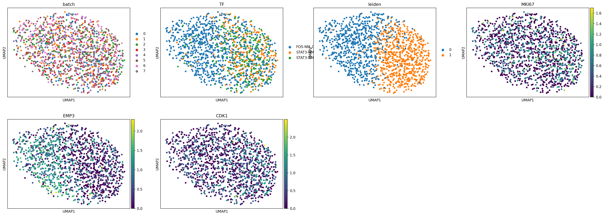

# Dose levels reached in scTF-seq compared to other overexpression datasets

In scTF-seq, we specifically chose a construct that can reach a variety of dose levels. A key challenge in many overexpression or CRISPRa studies is that dose levels are not high enough to reach physiological levels. To investigate this, we compare the dose levels reached in scTF-seq to those reached in other datasets, such as the MORF dataset (Joung et al. 2023).

Given that we are working in another context then Joung et al. (mESCs vs C3H10), this comparison is not straightforward. Moreover, the overlap between overexpressed genes at high-enough power levels between both datasets is sadly very small. In the end, only one TF led to a useful comparison: Fos, which has a strong response in both mESCs and C3H10 cells. We will focus on DE genes that are shared between both datasets, and compare their differential expression at various dose levels.


```python
import matplotlib as mpl
import matplotlib.pyplot as plt
import pandas as pd
import numpy as np
import scipy
import tqdm.auto as tqdm

import jax
import latenta as la
import polyptich as pp

pp.setup_ipython()

import eyck
import seaborn as sns
```


```python
import pathlib
plots_folder = pathlib.Path("plots")
if not plots_folder.exists():
    plots_folder.mkdir(parents=True)
data_folder = pp.paths.get_data()
```

## Download and load MORF

We use data from the MORF dataset (Joung et al. 2023) to compare exogenous TF expression.


```python
import scanpy as sc
```


```python
url = "https://ftp.ncbi.nlm.nih.gov/geo/series/GSE216nnn/GSE216595/suppl/GSE216595%5F180124%5Fperturb%2Eh5ad%2Egz"
if not pathlib.Path("GSE216481/GSE216595_180124_perturb.h5ad").exists():
    pathlib.Path("GSE216481").mkdir(exist_ok=True, parents=True)
    !wget {url} -O GSE216481/GSE216595_180124_perturb.h5ad.gz
    !gunzip GSE216481/GSE216595_180124_perturb.h5ad.gz
```


```python
adata_morf = sc.read_h5ad("GSE216481/GSE216595_180124_perturb.h5ad")
```


```python
adata2_morf = adata_morf[
    adata_morf.obs["TF"].str.contains("FOS-")
    | adata_morf.obs["TF"].str.contains("STAT3")
]
adata2_morf.obs["TF"].value_counts()
```


    TF
    FOS-NM_005252      990
    STAT3-NM_213662    301
    STAT3-NM_003150    264
    Name: count, dtype: int64


```python
eyck.m.t.plot_umap(adata2_morf, color=["batch", "TF", "MKI67", "EMP3"]).display()
```


    

    


```python
diffexp_morf = eyck.m.t.diffexp.compare_two_groups(
    adata2_morf, adata2_morf.obs["TF"].str.contains("FOS").values
)
# diffexp.loc["CAV1"]
diffexp_morf.loc["S100A6"]
```

    /srv/data/wouters/tools/eyck/src/eyck/modalities/transcriptome/diffexp.py:21: ImplicitModificationWarning: Trying to modify attribute `.obs` of view, initializing view as actual.
      adata.obs["oi"] = pd.Categorical(


    scores            1.327815e+01
    logfoldchanges    1.761460e+00
    pvals             3.570290e-38
    pvals_adj         8.929653e-35
    lfc               9.321628e-01
    pct.1             2.323232e-02
    pct.2             3.893805e-02
    scoreLM           6.330030e-01
    Name: S100A6, dtype: float64


Because not all cells that have high Fos barcode expression are acatually perturbed, we will only use the cells that cluster in a separate Fos-enriched cluster.


```python
sc.pp.pca(adata2_morf)
sc.pp.neighbors(adata2_morf)
sc.tl.umap(adata2_morf)
sc.tl.leiden(adata2_morf, resolution=0.5)
adata2_morf = adata2_morf[adata2_morf.obs["leiden"].isin(["0", "1"])]
```

    2025-08-08 16:10:40.981711: E external/local_xla/xla/stream_executor/cuda/cuda_fft.cc:467] Unable to register cuFFT factory: Attempting to register factory for plugin cuFFT when one has already been registered
    WARNING: All log messages before absl::InitializeLog() is called are written to STDERR
    E0000 00:00:1754662240.990966 3949708 cuda_dnn.cc:8579] Unable to register cuDNN factory: Attempting to register factory for plugin cuDNN when one has already been registered
    E0000 00:00:1754662240.993745 3949708 cuda_blas.cc:1407] Unable to register cuBLAS factory: Attempting to register factory for plugin cuBLAS when one has already been registered
    W0000 00:00:1754662241.001471 3949708 computation_placer.cc:177] computation placer already registered. Please check linkage and avoid linking the same target more than once.
    W0000 00:00:1754662241.001477 3949708 computation_placer.cc:177] computation placer already registered. Please check linkage and avoid linking the same target more than once.
    W0000 00:00:1754662241.001478 3949708 computation_placer.cc:177] computation placer already registered. Please check linkage and avoid linking the same target more than once.
    W0000 00:00:1754662241.001479 3949708 computation_placer.cc:177] computation placer already registered. Please check linkage and avoid linking the same target more than once.


    /tmp/ipykernel_3949708/1067945886.py:4: FutureWarning: In the future, the default backend for leiden will be igraph instead of leidenalg.
    
     To achieve the future defaults please pass: flavor="igraph" and n_iterations=2.  directed must also be False to work with igraph's implementation.
      sc.tl.leiden(adata2_morf, resolution=0.5)


```python
sc.pp.pca(adata2_morf)
sc.pp.neighbors(adata2_morf)
sc.tl.umap(adata2_morf)
```

    /srv/data/allUsers/wouters/miniconda3/envs/crispyKC/lib/python3.12/site-packages/scanpy/preprocessing/_pca/__init__.py:383: ImplicitModificationWarning: Setting element `.obsm['X_pca']` of view, initializing view as actual.
      adata.obsm[key_obsm] = X_pca


```python
sc.pl.umap(adata2_morf, color=["batch", "TF", "leiden", "MKI67", "EMP3", "CDK1"])
```


    

    


```python
adata2_morf.obs["TF2"] = ["FOS" if x == "0" else "mCherry" for x in adata2_morf.obs["leiden"]]
```


```python
diffexp_morf2 = eyck.m.t.diffexp.compare_two_groups(
    adata2_morf,
    adata2_morf.obs["TF2"].isin(["FOS"]),
    adata2_morf.obs["TF2"].isin(["mCherry"]),
)
diffexp_morf2["lfc"] = (
    np.array(
        np.array(adata2_morf.raw.to_adata().X[adata2_morf.obs["leiden"].isin(["0"]).values].mean(0))[0]
    )
    - np.array(
        np.array(adata2_morf.raw.to_adata().X[adata2_morf.obs["leiden"].isin(["1"]).values].mean(0))[0]
    )
)
diffexp_morf2 = diffexp_morf2.groupby("gene").first()
```

## Load scTF-seq data


```python
obs = pd.read_csv(data_folder / "obs.csv").rename(columns={"Unnamed: 0": "cell"}).set_index("cell")
mtx = scipy.io.mmread(data_folder / "matrix.mtx").T.tocsr()
obs["ix"] = range(obs.shape[0])

var = pd.read_csv(data_folder / "var.csv", index_col=0)
```


```python
def extract_tf_dataset(mtx, obs, tf, batches=None):
    if isinstance(tf, str):
        tf = [tf]
    obs_oi = obs[obs["TF"].isin(tf)]
    if batches is not None:
        obs_oi = obs_oi[obs_oi["batch_overall"].isin(batches)]
    batches = obs_oi["batch_overall"].unique()
    obs_ref = obs[
        (obs["batch_overall"].isin(batches)) & (obs["TF"].isin(["D0_confluent"]))
    ]

    obs = pd.concat([obs_ref, obs_oi])
    obs = obs.loc[obs["Phase_corrected"] == "G1"]
    counts = mtx.tocsr()[obs["ix"].values, :]

    return counts, obs
```


```python
import scanpy as sc

counts_oi, obs_oi = extract_tf_dataset(mtx, obs, ["Fos"], batches=["batch6"])

genes_oi = np.array(counts_oi.sum(0))[0] > 5
counts_oi = counts_oi[:, genes_oi]
var_oi = var.iloc[genes_oi]
len(var_oi), len(obs_oi)
```


    (14291, 609)


```python
adata = sc.AnnData(X=counts_oi, obs=obs_oi, var=var_oi)
```


```python
counts = adata.X.copy()
sc.pp.normalize_total(adata)
sc.pp.log1p(adata)
sc.pp.pca(adata)
sc.pp.neighbors(adata)
sc.tl.umap(adata)
```


```python
oi = adata.obs["TF"] == "Fos"
noi = ~oi
diffexp = eyck.m.t.diffexp.compare_two_groups(adata, oi)
diffexp["lfc"] = np.array(adata.X[oi.values].mean(0))[0] - np.array(adata.X[noi.values].mean(0))[0]
diffexp = diffexp.groupby("symbol").first()
```

## Compare fold-changes


```python
fig, ax = plt.subplots()
sns.histplot(diffexp.query("pvals_adj < 0.05")["logfoldchanges"])
sns.histplot(diffexp_morf.query("pvals_adj < 0.05")["logfoldchanges"])
ax.set_xlim(-5, 5)
```


    (-5.0, 5.0)


    

    


```python
fig, ax = plt.subplots()
sns.histplot(diffexp.query("pvals_adj < 0.05")["lfc"], bins=np.linspace(-5, 5, 100))
sns.histplot(
    diffexp_morf2.query("pvals_adj < 0.05")["lfc"], bins=np.linspace(-5, 5, 100)
)
ax.set_xlim(-5, 5)
```


    (-5.0, 5.0)


    

    


## Extract shared DE genes

Given that we work in different contexts, we cannot simply compare one set of DE genes with another. Instead, we will focus on the intersection of DE genes.


```python
gene_mapping = pd.DataFrame({"gene_mouse": diffexp.index})
gene_mapping["gene_human"] = gene_mapping["gene_mouse"].str.upper()
gene_mapping["shared"] = gene_mapping["gene_human"].isin(diffexp_morf2.index)
gene_mapping = gene_mapping.loc[gene_mapping["shared"]]

diffexp_shared = pd.concat(
    [
        diffexp
        .loc[gene_mapping["gene_mouse"]]
        .rename(
            columns={
                "logfoldchanges": "logfoldchanges_mouse",
                "pvals_adj": "pvals_adj_mouse",
                "scores": "scores_mouse",
            }
        )[["logfoldchanges_mouse", "pvals_adj_mouse", "scores_mouse"]]
        .reset_index(),
        diffexp_morf2.loc[gene_mapping["gene_human"]]
        .rename(
            columns={
                "logfoldchanges": "logfoldchanges_human",
                "pvals_adj": "pvals_adj_human",
                "scores": "scores_human",
            }
        )[["logfoldchanges_human", "pvals_adj_human", "scores_human"]]
        .reset_index(),
    ],
    axis=1,
    ignore_index=True,
)
diffexp_shared.columns = [
    "gene_mouse",
    "logfoldchanges_mouse",
    "pvals_adj_mouse",
    "scores_mouse",
    "gene_human",
    "logfoldchanges_human",
    "pvals_adj_human",
    "scores_human",
]
diffexp_shared_diff = diffexp_shared.query(
    "abs(scores_mouse) > 5 & abs(scores_human) > 5"
).dropna()
diffexp_shared_diff.shape
```


    (90, 8)


```python
fig, ax = plt.subplots()
ax.scatter(
    diffexp_shared_diff["scores_mouse"],
    diffexp_shared_diff["scores_human"],
    s=1,
)
```


    <matplotlib.collections.PathCollection at 0x7f2716434bc0>


    

    


Shared DE gene fold-changes are moderately correlated.


```python
np.corrcoef(
    diffexp_shared_diff["scores_mouse"],
    diffexp_shared_diff["scores_human"],
)
```


    array([[1.        , 0.45818273],
           [0.45818273, 1.        ]])


```python
adata.obs["nCount_RNA"].mean(), adata2_morf.obs["n_counts"].mean()
```


    (np.float64(18269.69786535304), np.float32(11938.384))


```python
diffexp_shared.query("abs(logfoldchanges_mouse) > log(2) & pvals_adj_mouse < 0.05").shape, diffexp_shared.query("abs(logfoldchanges_human) > log(2) & pvals_adj_human < 0.05").shape
```


    ((1733, 8), (259, 8))


```python
diffexp_shared_diff.sort_values("pvals_adj_human", ascending = True).query("logfoldchanges_human > 1").query("logfoldchanges_mouse > 1")
```


<div>
<style scoped>
    .dataframe tbody tr th:only-of-type {
        vertical-align: middle;
    }

    .dataframe tbody tr th {
        vertical-align: top;
    }

    .dataframe thead th {
        text-align: right;
    }
</style>
<table border="1" class="dataframe">
  <thead>
    <tr style="text-align: right;">
      <th></th>
      <th>gene_mouse</th>
      <th>logfoldchanges_mouse</th>
      <th>pvals_adj_mouse</th>
      <th>scores_mouse</th>
      <th>gene_human</th>
      <th>logfoldchanges_human</th>
      <th>pvals_adj_human</th>
      <th>scores_human</th>
    </tr>
  </thead>
  <tbody>
    <tr>
      <th>1180</th>
      <td>Cav1</td>
      <td>3.490770</td>
      <td>1.748995e-99</td>
      <td>26.541584</td>
      <td>CAV1</td>
      <td>2.187641</td>
      <td>3.318404e-42</td>
      <td>14.812400</td>
    </tr>
    <tr>
      <th>7777</th>
      <td>S100a6</td>
      <td>1.739482</td>
      <td>1.917336e-78</td>
      <td>25.240650</td>
      <td>S100A6</td>
      <td>1.802289</td>
      <td>1.597741e-32</td>
      <td>12.834143</td>
    </tr>
    <tr>
      <th>7775</th>
      <td>S100a4</td>
      <td>1.078565</td>
      <td>8.033047e-50</td>
      <td>17.990761</td>
      <td>S100A4</td>
      <td>1.186990</td>
      <td>5.474215e-25</td>
      <td>11.148396</td>
    </tr>
    <tr>
      <th>445</th>
      <td>Anxa1</td>
      <td>1.255735</td>
      <td>3.058271e-33</td>
      <td>14.091554</td>
      <td>ANXA1</td>
      <td>2.607457</td>
      <td>1.462568e-24</td>
      <td>11.131300</td>
    </tr>
    <tr>
      <th>9054</th>
      <td>Tgfb1</td>
      <td>1.805635</td>
      <td>1.460995e-15</td>
      <td>8.726941</td>
      <td>TGFB1</td>
      <td>1.101220</td>
      <td>8.216615e-17</td>
      <td>9.081751</td>
    </tr>
    <tr>
      <th>1792</th>
      <td>Col6a1</td>
      <td>1.606840</td>
      <td>1.400182e-56</td>
      <td>19.810778</td>
      <td>COL6A1</td>
      <td>1.390559</td>
      <td>5.186148e-12</td>
      <td>7.653912</td>
    </tr>
    <tr>
      <th>1395</th>
      <td>Cdh13</td>
      <td>1.370028</td>
      <td>1.453160e-14</td>
      <td>8.451538</td>
      <td>CDH13</td>
      <td>2.896582</td>
      <td>7.013349e-12</td>
      <td>7.643512</td>
    </tr>
    <tr>
      <th>1181</th>
      <td>Cav2</td>
      <td>2.900094</td>
      <td>6.239628e-78</td>
      <td>22.783649</td>
      <td>CAV2</td>
      <td>1.993731</td>
      <td>1.749500e-08</td>
      <td>6.424320</td>
    </tr>
    <tr>
      <th>1795</th>
      <td>Col7a1</td>
      <td>4.316538</td>
      <td>1.252555e-12</td>
      <td>7.836739</td>
      <td>COL7A1</td>
      <td>3.239167</td>
      <td>6.040168e-07</td>
      <td>5.811240</td>
    </tr>
    <tr>
      <th>269</th>
      <td>Ahnak2</td>
      <td>1.531924</td>
      <td>1.602081e-09</td>
      <td>6.672202</td>
      <td>AHNAK2</td>
      <td>2.477698</td>
      <td>1.896207e-06</td>
      <td>5.582208</td>
    </tr>
    <tr>
      <th>4327</th>
      <td>Kcnn4</td>
      <td>3.913247</td>
      <td>4.625726e-22</td>
      <td>10.645463</td>
      <td>KCNN4</td>
      <td>3.543320</td>
      <td>1.311556e-05</td>
      <td>5.191486</td>
    </tr>
    <tr>
      <th>3277</th>
      <td>Fxyd3</td>
      <td>2.575244</td>
      <td>4.826074e-09</td>
      <td>6.479055</td>
      <td>FXYD3</td>
      <td>5.236089</td>
      <td>1.625057e-05</td>
      <td>5.150339</td>
    </tr>
  </tbody>
</table>
</div>


```python
# label = ["Cav1", "S100a6", "Rspo2"]
label = ["Emp3", "Cav1", "S100a6", "S100a4", "Anxa1", "Tgfb1"]

fig = pp.Figure()
ax = fig.main.add_right(pp.Panel((3, 2)))
plotdata = diffexp_shared.copy()
plotdata["x"] = plotdata["logfoldchanges_mouse"]
plotdata["y"] = -np.log(plotdata["pvals_adj_mouse"])
ax.scatter(
    plotdata["x"], plotdata["y"],
    s=1,
)
texts = []
for gene in label:
    ix = diffexp_shared["gene_mouse"] == gene
    texts.append(ax.text(
        plotdata["x"][ix],
        plotdata["y"][ix],
        gene,
        fontstyle = "italic",
        # bbox=dict(facecolor='white', pad=0.4),
    ))
    texts[-1].set_path_effects([mpl.patheffects.withStroke(linewidth=2, foreground='white')])
ax.set_xlim(-5, 5)
ax.set_xticks(np.log([1/16, 1/4, 1, 4, 16]))
ax.set_xticklabels(["1/16", "1/4", 1, 4, 16], fontsize = 10, rotation = 90)
ax.set_ylabel("-log(q-value)")
ax.set_ylim(0, 250)
# ax.axhline(-np.log(0.05), color='grey', linestyle='--')
ax.set_xlabel("fold-change")

fig.plot()
import adjustText
adjustText.adjust_text(texts, arrowprops=dict(arrowstyle="->", color='red'), ax = ax, min_arrow_len =0)


ax = fig.main.add_right(pp.Panel((3, 2)))
plotdata = diffexp_shared.copy()
plotdata["x"] = plotdata["logfoldchanges_human"]
plotdata["y"] = -np.log(plotdata["pvals_adj_human"])
s = ax.scatter(
    plotdata["x"], plotdata["y"],
    s=1,
)
texts = []
for gene in label:
    ix = diffexp_shared["gene_human"] == gene.upper()
    texts.append(ax.text(
        plotdata["x"][ix],
        plotdata["y"][ix],
        gene.upper(),
        fontstyle = "italic",
        # bbox=dict(facecolor='white', pad=0.4),
    ))
    texts[-1].set_path_effects([mpl.patheffects.withStroke(linewidth=2, foreground='white')])
ax.set_xticks(np.log([1/16, 1/4, 1, 4, 16]))
ax.set_xticklabels(["1/16", "1/4", 1, 4, 16], fontsize = 10, rotation = 90)
ax.set_xlim(-5, 5)
ax.set_ylim(0, 250)
# ax.axhline(-np.log(0.05), color='grey', linestyle='--')

fig.plot()
import adjustText
adjustText.adjust_text(texts, arrowprops=dict(arrowstyle="->", color='red'), ax = ax, min_arrow_len =0)

# ax = fig.main.add_right(pp.Panel((2, 2)))
# plotdata = diffexp_shared_diff.copy()
# plotdata["x"] = plotdata["scores_human"]
# plotdata["y"] = plotdata["scores_mouse"]
# s = ax.scatter(
#     plotdata["x"], plotdata["y"],
#     s=1,
# )
# texts = []
# for gene in label:
#     ix = diffexp_shared["gene_human"] == gene.upper()
#     texts.append(ax.text(
#         plotdata["x"][ix],
#         plotdata["y"][ix],
#         gene,
#         # bbox=dict(facecolor='white', pad=0.4),
#     ))
#     texts[-1].set_path_effects([mpl.patheffects.withStroke(linewidth=2, foreground='white')])
# ax.set_xticks(np.log([1/16, 1/4, 1, 4, 16]))
# ax.set_xticklabels(["1/16", "1/4", 1, 4, 16], fontsize = 10, rotation = 90)
# ax.axhline(-np.log(0.05), color='grey', linestyle='--')

# fig.plot()
# import adjustText
# adjustText.adjust_text(texts, arrowprops=dict(arrowstyle="->", color='red'), ax = ax, min_arrow_len =0)
fig.display()

fig.savefig(plots_folder / "dose_diffexp_comparison.pdf")
```

    /srv/data/allUsers/wouters/miniconda3/envs/crispyKC/lib/python3.12/site-packages/matplotlib/text.py:762: FutureWarning: Calling float on a single element Series is deprecated and will raise a TypeError in the future. Use float(ser.iloc[0]) instead
      posx = float(self.convert_xunits(x))
    /srv/data/allUsers/wouters/miniconda3/envs/crispyKC/lib/python3.12/site-packages/matplotlib/text.py:763: FutureWarning: Calling float on a single element Series is deprecated and will raise a TypeError in the future. Use float(ser.iloc[0]) instead
      posy = float(self.convert_yunits(y))
    /srv/data/allUsers/wouters/miniconda3/envs/crispyKC/lib/python3.12/site-packages/matplotlib/text.py:905: FutureWarning: Calling float on a single element Series is deprecated and will raise a TypeError in the future. Use float(ser.iloc[0]) instead
      x = float(self.convert_xunits(self._x))
    /srv/data/allUsers/wouters/miniconda3/envs/crispyKC/lib/python3.12/site-packages/matplotlib/text.py:906: FutureWarning: Calling float on a single element Series is deprecated and will raise a TypeError in the future. Use float(ser.iloc[0]) instead
      y = float(self.convert_yunits(self._y))
    /srv/data/allUsers/wouters/miniconda3/envs/crispyKC/lib/python3.12/site-packages/matplotlib/text.py:762: FutureWarning: Calling float on a single element Series is deprecated and will raise a TypeError in the future. Use float(ser.iloc[0]) instead
      posx = float(self.convert_xunits(x))
    /srv/data/allUsers/wouters/miniconda3/envs/crispyKC/lib/python3.12/site-packages/matplotlib/text.py:763: FutureWarning: Calling float on a single element Series is deprecated and will raise a TypeError in the future. Use float(ser.iloc[0]) instead
      posy = float(self.convert_yunits(y))
    /srv/data/allUsers/wouters/miniconda3/envs/crispyKC/lib/python3.12/site-packages/matplotlib/text.py:905: FutureWarning: Calling float on a single element Series is deprecated and will raise a TypeError in the future. Use float(ser.iloc[0]) instead
      x = float(self.convert_xunits(self._x))
    /srv/data/allUsers/wouters/miniconda3/envs/crispyKC/lib/python3.12/site-packages/matplotlib/text.py:906: FutureWarning: Calling float on a single element Series is deprecated and will raise a TypeError in the future. Use float(ser.iloc[0]) instead
      y = float(self.convert_yunits(self._y))


    

    


```python
fig = pp.Figure(pp.grid.Grid(padding_width = 0.1, padding_height = 0.4))

ax = fig.main.add_right(pp.Panel((1, 1)), row = 0)
adata.obs["TF2"] = ["FOS" if x == "Fos" else "mCherry" for x in adata.obs["TF"]]
eyck.m.t.plot_umap(adata, color="Dose", ax=ax, legend = False, cmap = "viridis", show_norm = False)
ax.set_title("scTF-seq")

ax = fig.main.add_right(pp.Panel((1, 1)), row = 1)
eyck.m.t.plot_umap(adata2_morf, color="TF2", ax=ax, legend = False)
ax.set_title("Joung et al. 2023")

for symbol in ["Emp3", "Cav1", "S100a6", "S100a4", "Anxa1", "Tgfb1"]:
# for symbol in ["Cav1", "Serpine1", "Marcks", "Kcnn4"]:
    ax = fig.main.add_right(pp.Panel((1, 1)), row = 0)
    eyck.m.t.plot_umap(adata, color=symbol, ax=ax, norms = ("q.05", "q.98"), show_norm = False)
    ax.set_title(f"{symbol}", fontstyle = "italic")
    ax = fig.main.add_right(pp.Panel((1, 1)), row = 1)
    eyck.m.t.plot_umap(adata2_morf.raw.to_adata(), color=symbol.upper(), ax=ax, norms = ("q.05", "q.98"), show_norm = False)
    ax.set_title(f"{symbol.upper()}", fontstyle = "italic")
fig.display()


fig.savefig(plots_folder / "dose_diffexp_examples.pdf")
```


    

    


```python
(
    np.exp(diffexp_shared_diff["logfoldchanges_mouse"].abs().mean()),
    np.exp(diffexp_shared_diff["logfoldchanges_human"].abs().mean()),
)
```


    (np.float32(2.742537), np.float32(2.1950657))


```python
diffexp_shared_diff.sort_values("scores_human")
```


<div>
<style scoped>
    .dataframe tbody tr th:only-of-type {
        vertical-align: middle;
    }

    .dataframe tbody tr th {
        vertical-align: top;
    }

    .dataframe thead th {
        text-align: right;
    }
</style>
<table border="1" class="dataframe">
  <thead>
    <tr style="text-align: right;">
      <th></th>
      <th>gene_mouse</th>
      <th>logfoldchanges_mouse</th>
      <th>pvals_adj_mouse</th>
      <th>scores_mouse</th>
      <th>gene_human</th>
      <th>logfoldchanges_human</th>
      <th>pvals_adj_human</th>
      <th>scores_human</th>
    </tr>
  </thead>
  <tbody>
    <tr>
      <th>8007</th>
      <td>Sfrp1</td>
      <td>-1.315872</td>
      <td>1.228012e-05</td>
      <td>-5.015422</td>
      <td>SFRP1</td>
      <td>-2.389278</td>
      <td>2.758517e-135</td>
      <td>-28.457169</td>
    </tr>
    <tr>
      <th>4556</th>
      <td>Ldhb</td>
      <td>-1.278595</td>
      <td>1.510813e-06</td>
      <td>-5.464599</td>
      <td>LDHB</td>
      <td>-0.605824</td>
      <td>3.705444e-59</td>
      <td>-17.612982</td>
    </tr>
    <tr>
      <th>3339</th>
      <td>Gapdh</td>
      <td>0.430586</td>
      <td>2.343036e-06</td>
      <td>5.367544</td>
      <td>GAPDH</td>
      <td>-0.325133</td>
      <td>1.145417e-45</td>
      <td>-15.309468</td>
    </tr>
    <tr>
      <th>6961</th>
      <td>Psma4</td>
      <td>-0.654659</td>
      <td>5.848934e-09</td>
      <td>-6.523051</td>
      <td>PSMA4</td>
      <td>-0.838883</td>
      <td>1.466417e-40</td>
      <td>-14.348627</td>
    </tr>
    <tr>
      <th>5082</th>
      <td>Mfge8</td>
      <td>1.524807</td>
      <td>5.246222e-21</td>
      <td>10.317881</td>
      <td>MFGE8</td>
      <td>-1.051513</td>
      <td>5.822670e-40</td>
      <td>-14.236427</td>
    </tr>
    <tr>
      <th>...</th>
      <td>...</td>
      <td>...</td>
      <td>...</td>
      <td>...</td>
      <td>...</td>
      <td>...</td>
      <td>...</td>
      <td>...</td>
    </tr>
    <tr>
      <th>7666</th>
      <td>Rps2</td>
      <td>0.358461</td>
      <td>2.847991e-09</td>
      <td>6.630730</td>
      <td>RPS2</td>
      <td>0.193241</td>
      <td>9.266454e-43</td>
      <td>14.773083</td>
    </tr>
    <tr>
      <th>1180</th>
      <td>Cav1</td>
      <td>3.490770</td>
      <td>1.748995e-99</td>
      <td>26.541584</td>
      <td>CAV1</td>
      <td>2.187641</td>
      <td>3.318404e-42</td>
      <td>14.812400</td>
    </tr>
    <tr>
      <th>4575</th>
      <td>Lgals1</td>
      <td>0.637781</td>
      <td>9.660449e-18</td>
      <td>9.553288</td>
      <td>LGALS1</td>
      <td>1.562922</td>
      <td>7.233328e-47</td>
      <td>15.589577</td>
    </tr>
    <tr>
      <th>7770</th>
      <td>S100a10</td>
      <td>0.562456</td>
      <td>3.802713e-16</td>
      <td>9.024160</td>
      <td>S100A10</td>
      <td>0.988102</td>
      <td>1.165688e-49</td>
      <td>16.013687</td>
    </tr>
    <tr>
      <th>2710</th>
      <td>Emp3</td>
      <td>0.829785</td>
      <td>3.898533e-23</td>
      <td>11.289702</td>
      <td>EMP3</td>
      <td>1.734639</td>
      <td>3.810708e-56</td>
      <td>17.145578</td>
    </tr>
  </tbody>
</table>
<p>90 rows × 8 columns</p>
</div>


## Kinetic over various dose levels


```python
distributions = []
ns = []
genes_oi = diffexp_shared_diff["gene_mouse"]
# genes_oi = diffexp.query("pvals_adj < 0.05 & abs(logfoldchanges) > log(2)").index
for dose_cutoff in tqdm.tqdm(np.arange(2.5, 8, 0.25)):
    oi = (adata.obs["TF"] == "Fos") & (np.log1p(adata.obs["Vector_UMI"]) < dose_cutoff)
    noi = adata.obs["TF"] != "Fos"
    diffexp_oi = eyck.m.t.diffexp.compare_two_groups(adata, oi)
    distributions.append(
        diffexp_oi.set_index("symbol").loc[genes_oi, "logfoldchanges"].values
    )
    ns.append(diffexp_oi.query("pvals_adj < 0.05 & abs(logfoldchanges) > log(2)").shape[0])
```


      0%|          | 0/22 [00:00<?, ?it/s]


```python
fig, ax = plt.subplots(figsize = (6, 2))

means = []
for x, dist in enumerate(distributions):
    dist_oi = np.abs(np.clip(dist, -3, 7))
    # vln = ax.violinplot(dist_oi, positions=[x], showextrema=False, showmedians = True)
    # for pc in vln['bodies']:
    #     pc.set_facecolor('#333')
    sns.boxplot(x=x, y=dist_oi, ax=ax, color = "tomato", showfliers = False, )
    sns.stripplot(x=x, y=dist_oi, ax=ax, s=1, color = "grey", zorder = 10, alpha = 0.5)
    means.append(np.median(dist_oi))
# ax.plot(means, color = "red")
ax.set_ylim(0, 2)

ax.set_yticks(np.log([1, 2, 4, 8]))
ax.set_yticklabels(["1", "2", "4", "8"], fontsize = 10)

x = x+1
dist = diffexp_shared_diff["logfoldchanges_human"].values
dist_oi = np.abs(np.clip(dist, -3, 7))
# ax.violinplot(dist_oi, positions=[x], showextrema=False, showmedians = True)
sns.boxplot(x=x+3, y=dist_oi, ax=ax, color = "cyan", showfliers = False)
sns.stripplot(x=x+3, y=dist_oi, ax=ax, s=1, zorder = 10, color = "grey", alpha = 0.5)
ax.axhline(np.median(dist_oi), zorder = 10, color = "cyan")
# ax.set_xlabel("scTF-seq", color = "tomato")

ticks = pd.DataFrame({"x": np.arange(0, len(means) + 1)})
ticks["label"] = (np.arange(2.5, 8, 0.25)).tolist() + ["Joung\n2023"]
ticks = ticks.iloc[::2]
ax.set_xticks(ticks["x"])
ax.set_xticklabels(ticks["label"], fontsize = 10)
ax.get_xticklabels()[-1].set_color("cyan")
ax.get_xticklabels()[-1].set_rotation(90)

fig.savefig(plots_folder / "dose_diffexp_kinetics.pdf", bbox_inches = "tight")
```


    

    


```python

```
