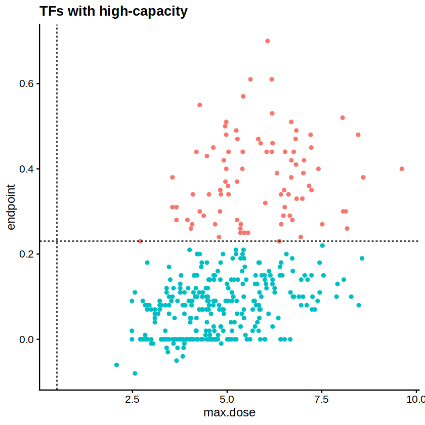
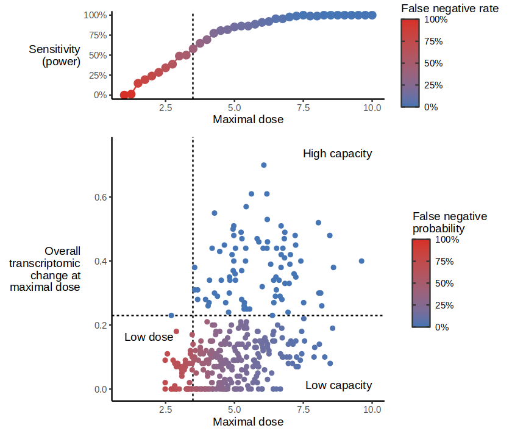
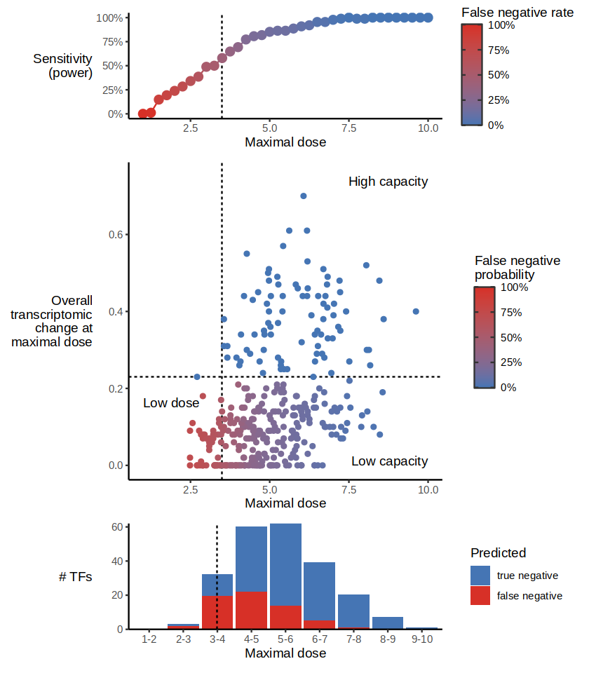

# Power analysis of TF capacity

For not every TF do we detect the same amount of cells. Moreover, the dose levels that each TF reaches differ by several order of magnitudes. This can lead to differences in interpretation, particularly when classifying cells as being high- or low capacity. A TF may be classified as low capacity simply because it does not reach a high-enough dose. To investigate this, we perform a power analysis to determine the minimum dose required to detect a TF as high capacity. We use TFs with high dose levels as reference, and reduce their maximal dose levels to simulate how their capacity classification would change with lower doses.

We use this to ultimately calculate the sensitivity of classifying TFs correctly as low capacity. The cutoff if minimal dose was set at 3.8 to align with a power of approx. 80%.


```R
library(dplyr)
library(Seurat)
library(readr)
library(ggplot2)
library("org.Mm.eg.db")

library(Seurat)
library(ggplot2)
library(cowplot)
library(tidyverse)
library(dplyr)
# convert symbols to ensembl ids
convert_to_ensembl <- function(symbols) {
    ensembl_ids <- mapIds(org.Mm.eg.db, keys = symbols, keytype = "SYMBOL", column = "ENSEMBL")
    return(ensembl_ids)
}
convert_to_symbol <- function(ensembl_ids) {
    symbols <- mapIds(org.Mm.eg.db, keys = ensembl_ids, keytype = "ENSEMBL", column = "SYMBOL")
    return(symbols)
}
library(purrr)

plots_folder <- path.expand("plots")
if (!dir.exists(plots_folder)) {
    dir.create(plots_folder, recursive = TRUE)
}
```

    
    Attaching package: ‘dplyr’
    
    
    The following objects are masked from ‘package:stats’:
    
        filter, lag
    
    
    The following objects are masked from ‘package:base’:
    
        intersect, setdiff, setequal, union
    
    
    Loading required package: SeuratObject
    
    Loading required package: sp
    
    The following objects are masked from ‘package:stats’:
    
        filter, lag
    
    
    The following objects are masked from ‘package:base’:
    
        intersect, setdiff, setequal, union
    
    
    Loading required package: SeuratObject
    
    Loading required package: sp
    
    
    Attaching package: ‘SeuratObject’
    
    
    The following objects are masked from ‘package:base’:
    
        intersect, t
    
    
    Warning message:
    “package ‘ggplot2’ was built under R version 4.3.3”
    Loading required package: AnnotationDbi
    
    Loading required package: stats4
    
    Loading required package: BiocGenerics
    
    
    Attaching package: ‘BiocGenerics’
    
    
    The following object is masked from ‘package:SeuratObject’:
    
        intersect
    
    
    The following objects are masked from ‘package:dplyr’:
    
        combine, intersect, setdiff, union
    
    
    The following objects are masked from ‘package:stats’:
    
        IQR, mad, sd, var, xtabs
    
    
    The following objects are masked from ‘package:base’:
    
        anyDuplicated, aperm, append, as.data.frame, basename, cbind,
        colnames, dirname, do.call, duplicated, eval, evalq, Filter, Find,
        get, grep, grepl, intersect, is.unsorted, lapply, Map, mapply,
        match, mget, order, paste, pmax, pmax.int, pmin, pmin.int,
        Position, rank, rbind, Reduce, rownames, sapply, setdiff, sort,
        table, tapply, union, unique, unsplit, which.max, which.min
    
    
    Loading required package: Biobase
    
    Welcome to Bioconductor
    
        Vignettes contain introductory material; view with
        'browseVignettes()'. To cite Bioconductor, see
        'citation("Biobase")', and for packages 'citation("pkgname")'.
    
    
    Loading required package: IRanges
    
    Loading required package: S4Vectors
    
    
    Attaching package: ‘S4Vectors’
    
    
    The following objects are masked from ‘package:dplyr’:
    
        first, rename
    
    
    The following object is masked from ‘package:utils’:
    
        findMatches
    
    
    The following objects are masked from ‘package:base’:
    
        expand.grid, I, unname
    
    
    
    Attaching package: ‘IRanges’
    
    
    The following object is masked from ‘package:sp’:
    
        %over%
    
    
    The following objects are masked from ‘package:dplyr’:
    
        collapse, desc, slice
    
    
    
    Attaching package: ‘AnnotationDbi’
    
    
    The following object is masked from ‘package:dplyr’:
    
        select
    
    
    
    
    Warning message:
    “package ‘tidyverse’ was built under R version 4.3.3”
    ── Attaching core tidyverse packages ──────────────────────── tidyverse 2.0.0 ──
    ✔ forcats   1.0.0     ✔ stringr   1.5.1
    ✔ lubridate 1.9.3     ✔ tibble    3.2.1
    ✔ purrr     1.0.2     ✔ tidyr     1.3.0
    ── Conflicts ────────────────────────────────────────── tidyverse_conflicts() ──
    ✖ lubridate::%within%()    masks IRanges::%within%()
    ✖ IRanges::collapse()      masks dplyr::collapse()
    ✖ Biobase::combine()       masks BiocGenerics::combine(), dplyr::combine()
    ✖ IRanges::desc()          masks dplyr::desc()
    ✖ tidyr::expand()          masks S4Vectors::expand()
    ✖ dplyr::filter()          masks stats::filter()
    ✖ S4Vectors::first()       masks dplyr::first()
    ✖ dplyr::lag()             masks stats::lag()
    ✖ BiocGenerics::Position() masks ggplot2::Position(), base::Position()
    ✖ purrr::reduce()          masks IRanges::reduce()
    ✖ S4Vectors::rename()      masks dplyr::rename()
    ✖ lubridate::second()      masks S4Vectors::second()
    ✖ lubridate::second<-()    masks S4Vectors::second<-()
    ✖ AnnotationDbi::select()  masks dplyr::select()
    ✖ IRanges::slice()         masks dplyr::slice()
    ✖ lubridate::stamp()       masks cowplot::stamp()
    ℹ Use the conflicted package (<http://conflicted.r-lib.org/>) to force all conflicts to become errors


```R
data_folder <- path.expand("../../data")
```


```R
seu <- read_rds(file.path(data_folder, "C3H10_10X_all_exps_D0regressed10pc_50pc_integrated_dosealigned.rds"))
```


```R
df <- read_rds(file.path(data_folder, "df_allG1Cells_PhaseCorrected_allTFs_D0regressed10pc_50pc_integrated.rds"))
```


```R
## -------------------------------------functions for utils ----------------##

mod.nls.nostart <- function(data, TFoi){
  mod.nls <- nls(Overall_transcriptomic_change ~ SSlogis(Dose,  Asym, xmid, scal), 
                 data = data, trace = T)
  return(mod.nls)
}

mod.nls.start.range <- function(data, TFoi, init, upper.value, lower.value){
  mod.nls <- nls(Overall_transcriptomic_change ~ SSlogis(Dose,  Asym, xmid, scal), 
                 data = data,
                #  data = subset(df, TF == TFoi),
                 start = init,
                 upper = upper.value,
                 lower = lower.value,
                 algorithm = "port", trace = T)
  return(mod.nls)
}


plot.TF.activities <- function(tfoi, data, col.TFs = NULL, model = NULL, alpha_given = 0.5){
  df.sub <- data[data$TF %in% tfoi,]
  if (length(tfoi) == 1){
    p <- ggplot(df.sub, mapping = aes(x = Dose, y = Overall_transcriptomic_change, col = TF)) + 
      geom_hline(yintercept = 0, linetype = "dashed") +
      # geom_hline(yintercept = 0.479387, linetype = "dashed")+ # 0.479387 get from lm fit of MatureAdipo
      geom_point(size =1, alpha = alpha_given)+
      theme_cowplot()# + # when use a group of TFs, to set colours for each TF, use scale_color_manual()
    #scale_color_manual(values = col) # +
    # geom_smooth(method = "lm",se = F, formula = y ~ log(x))
    if (is.null(model) == F){
      p <- p+geom_line(data = df.sub, mapping = aes(x = Dose, y = predict(model, data.frame(x = Dose)), col = TF), size =1)
    }
  } else {
    p <- ggplot(df.sub, mapping = aes(x = Dose, y = Overall_transcriptomic_change, col = TF)) + 
      geom_hline(yintercept = 0, linetype = "dashed") +
      # geom_hline(yintercept = 0.479387, linetype = "dashed")+ # 0.479387 get from lm fit of MatureAdipo
      geom_point(size =1, alpha = alpha_given)+
      theme_cowplot()+ggtitle(label = "TF regulatory activities")+ # when use a group of TFs, to set colours for each TF, use scale_color_manual()
      scale_color_manual(values = col.TFs) # +
    # geom_smooth(method = "lm",se = F, formula = y ~ log(x))
    if (is.null(model) == F){
      p <- p+geom_line(data = df.sub[df.sub$TF == tfoi[1],], mapping = aes(x = Dose, y = predict(model, data.frame(x = Dose))), size =1 )
    }
  }
  return(p)
}
```


```R
colnames(df)
colnames(df)[4] <- "Dose_unaligned"
df$Dose <- seu$Dose_aligned[rownames(df)]
df$TF[df$TF %in% c("D0","D0_confluent")] <- "D0"
df$Dose_unaligned[df$TF %in% c("D0")] <- 0
df$cell_barcode <- rownames(df)
df$TF <- as.character(df$TF)
df$batch <- seu$batch_overall[rownames(df)]
```


<style>
.list-inline {list-style: none; margin:0; padding: 0}
.list-inline>li {display: inline-block}
.list-inline>li:not(:last-child)::after {content: "\00b7"; padding: 0 .5ex}
</style>
<ol class=list-inline><li>'TF'</li><li>'correlation'</li><li>'VectorUMI'</li><li>'Vector'</li><li>'Activity'</li><li>'Activity_TF_to_D0'</li></ol>


```R
df <- subset(df, !TF %in% c("Mycn-Runx2","Mycn-Myog","Pparg-Runx2",
                            "Cebpa-Pparg","Cebpa-Myog","Cebpa-Mycn",
                            "Mycn-Pparg",
                            "Myo_ref",
                            "Adipo_ref",
                            "D0"
))

length(table(df$TF)) # 384
length(table(df$TF)) # 437
all_TFs <- names(table(df$TF))
```


384


384


```R
df$Overall_transcriptomic_change <- df$Activity_TF_to_D0
```


```R
# 4) run logistic model
df <- df[order(df$Dose),]
TFois <- unique(df$TF) # 268
model_list <- list()
plot_list <- list()
NotApplic <- c()

for (i in seq_along(TFois)){ 
  df.tfoi <- df[df$TF == TFois[i],]
  Init <- list(Asym = median(df.tfoi$Overall_transcriptomic_change), xmid = median(df.tfoi$Dose), scal = 0.1)
  Upper.value <- list(Asym = max(df.tfoi$Overall_transcriptomic_change), xmid = max(df.tfoi$Dose), scal = 10)
  Lower.value <- list(Asym = min(df.tfoi$Overall_transcriptomic_change), xmid = 0, scal = 0.001)
  model_i <- try(mod.nls.start.range(df.tfoi, TFois[i], Init, Upper.value, Lower.value))
  # check if the model was successful
  if(inherits(model_i, "try-error")){
    model_list[[i]] <- FALSE
    plot_list[[i]] <- NULL
    NotApplic <- c(NotApplic, TFois[i])
  } else {
    model_list[[i]] <- model_i
  }
}
names(model_list) <- TFois
```

      0:     9.2645151: 0.384645  3.61092 0.100000
      1:     6.0250466: 0.438188  3.34502 0.352427
      2:     2.4137628: 0.468616  2.75512 0.905758
      3:     1.3691548: 0.471450  1.96412  1.33205
      4:     1.3206724: 0.438372  1.53572  1.08654
      5:     1.3165865: 0.446120  1.61432  1.09683
      6:     1.3165834: 0.446201  1.61396  1.09612
      7:     1.3165834: 0.446202  1.61395  1.09614
      0:     3.3713646: 0.0905202  4.15888 0.100000
      1:     2.5493869: 0.189541  4.18911 0.598909
      2:     2.3779528: 0.341951  5.42131  1.52751
      3:     2.3734399: 0.516593  6.78106  1.56911
      4:     2.2874192: 0.516593  6.05153  1.28637
      5:     2.2817260: 0.516593  6.12716  1.27876
      6:     2.2810100: 0.516593  6.09716  1.23955
      7:     2.2809658: 0.516593  6.08583  1.22347
      8:     2.2809619: 0.516593  6.08843  1.22694
      9:     2.2809619: 0.516593  6.08844  1.22697
     10:     2.2809619: 0.516593  6.08849  1.22703
     11:     2.2809619: 0.516593  6.08850  1.22705
      0:     5.4868590: 0.322845  2.63906 0.100000
      1:     3.7933803: 0.365696  2.43709 0.373733
      2:     1.7461158: 0.398222  1.98893  1.07577
      3:     1.3610907: 0.413269  1.40712  1.65600
      4:     1.3380742: 0.414697  1.12293  1.86349
      5:     1.3378716: 0.413743  1.08384  1.86715
      6:     1.3378714: 0.413623  1.08308  1.86495
      7:     1.3378714: 0.413622  1.08305  1.86496
      0:     1.4921911: 0.154598  2.19722 0.100000
      1:    0.98337346: 0.239205  2.16624 0.422414
      2:    0.74070693: 0.288509  2.21076  1.11609
      3:    0.69791076: 0.425659  3.33968  2.35888
      4:    0.68674330: 0.446332  3.73290  2.24330
      5:    0.68621570: 0.446332  3.66079  2.14211
      6:    0.68621063: 0.446332  3.66778  2.15019
      7:    0.68621062: 0.446332  3.66747  2.14975
      8:    0.68621062: 0.446332  3.66742  2.14977
      9:    0.68621062: 0.446332  3.66742  2.14977
      0:    0.23193823: 0.0779224  1.94591 0.100000
      1:    0.21875952: 0.117926  2.10322 0.235854
      2:    0.21636281: 0.107357  1.76412 0.194989
      3:    0.20403084: 0.122998  1.92111 0.535247
      4:    0.18278946: 0.140447  1.70196  1.16133
      5:    0.17722373: 0.180737  2.08215  2.36903
      6:    0.17634059: 0.203013  2.86721  3.35619
      7:    0.17609696: 0.234508  4.17439  4.12511
      8:    0.17606098: 0.232118  4.17439  4.08121
      9:    0.17606098: 0.232152  4.17439  4.07891
     10:    0.17606098: 0.232154  4.17439  4.07879
      0:    0.49697284: 0.111573  1.79176 0.100000
      1:    0.29958385: 0.219940  1.92892 0.452761
      2:    0.25841460: 0.318867  2.40784 0.944390
      3:    0.25383598: 0.410345  3.06266  1.16687
      4:    0.25264183: 0.422130  3.03447  1.09240
      5:    0.25264100: 0.421912  3.03454  1.09465
      6:    0.25264100: 0.421943  3.03475  1.09481
      7:    0.25264100: 0.421937  3.03471  1.09480
      0:    0.38318920: -0.00944890  1.60944 0.100000
      1:    0.37753837: 0.0103294 0.797187  1.92533
    Error in qr.default(.swts * gr) : 
      NA/NaN/Inf in foreign function call (arg 1)
      0:    0.18537107: 0.106319  1.60944 0.100000
      1:    0.14654675: 0.112028  1.38314 0.404562
      2:    0.12300959: 0.106093 0.603522 0.826303
      3:    0.11482882: 0.108551  0.00000 0.769248
      4:    0.11243897: 0.0914825  0.00000 0.00100000
      5:    0.11122716: 0.0998039  0.00000 0.00100000
      6:    0.11122716: 0.0998039  0.00000 0.00100000
      0:    0.19490426: 0.0757780  1.70060 0.100000
      1:    0.16773140: 0.103266  1.54591 0.266246
      2:    0.13131137: 0.168194  1.56728  1.16982
      3:    0.12762982: 0.188840  1.78084  2.25717
      4:    0.12676581: 0.196308  2.17242  3.31401
      5:    0.12657370: 0.208363  2.81518  4.21205
      6:    0.12651616: 0.221142  3.40120  4.38870
      7:    0.12650994: 0.217549  3.40120  4.66571
      8:    0.12650946: 0.217029  3.40120  4.74285
      9:    0.12650945: 0.216897  3.40120  4.75846
     10:    0.12650945: 0.216872  3.40120  4.76133
     11:    0.12650945: 0.216867  3.40120  4.76185
      0:    0.18619937: 0.0472388  1.38629 0.100000
      1:    0.17068418: 0.0955342  1.37096 0.819514
      2:    0.16971673: 0.106947  1.59661 0.604449
      3:    0.16966169: 0.105455  1.53663 0.552824
      4:    0.16966017: 0.106040  1.55061 0.553657
      5:    0.16966009: 0.105229  1.53837 0.541017
      6:    0.16965945: 0.105629  1.54573 0.544782
      7:    0.16965943: 0.105725  1.54720 0.544895
      8:    0.16965943: 0.105640  1.54593 0.543574
      9:    0.16965943: 0.105687  1.54674 0.544037
     10:    0.16965943: 0.105686  1.54675 0.543923
     11:    0.16965943: 0.105689  1.54680 0.543911
     12:    0.16965943: 0.105686  1.54676 0.543859
     13:    0.16965943: 0.105686  1.54676 0.543859
      0:    0.78329727: 0.341291  2.30259 0.100000
      1:    0.60351015: 0.439636  2.29184 0.262844
      2:    0.47213675: 0.488761  2.21409 0.541372
      3:    0.43128660: 0.516303  2.15153 0.794620
      4:    0.42757621: 0.528274  2.15173 0.919049
      5:    0.42744760: 0.530183  2.15216 0.946229
      6:    0.42744554: 0.530143  2.15077 0.948878
      7:    0.42744552: 0.530200  2.15090 0.949356
      8:    0.42744552: 0.530192  2.15084 0.949364
      9:    0.42744552: 0.530195  2.15086 0.949376
      0:     26.331639: 0.588672  2.63906 0.100000
      1:     18.659766: 0.609063  2.42566 0.302429
      2:     8.6530588: 0.683368  1.96580 0.856306
      3:     5.9942702: 0.751341  1.50811  1.49086
      4:     5.5499428: 0.772511  1.07658  2.15771
      5:     5.5056552: 0.832294  1.06845  2.92552
      6:     5.4963975: 0.850285  1.20733  3.17452
      7:     5.4962706: 0.850285  1.21771  3.17843
      8:     5.4962706: 0.850285  1.21774  3.17837
      0:     5.2433686: 0.292896  2.19722 0.100000
      1:     2.8709687: 0.368164  2.00479 0.444247
      2:     2.0055544: 0.424829  1.75282 0.947812
      3:     1.9245123: 0.477343  1.78900  1.43684
      4:     1.9190499: 0.536622  2.17461  1.82799
      5:     1.9174799: 0.577534  2.50967  1.98055
      6:     1.9174212: 0.587149  2.57710  1.99914
      7:     1.9174209: 0.587837  2.58152  2.00105
      8:     1.9174209: 0.587878  2.58181  2.00120
      9:     1.9174209: 0.587881  2.58183  2.00121
      0:    0.41959232: 0.0795546  2.39790 0.100000
      1:    0.40460712: 0.0803050  2.23353 0.358926
      2:    0.34999817: 0.102577  1.98010  1.29202
      3:    0.32344878: 0.194099  3.19739  5.47241
      4:    0.32078330: 0.110993 0.943704  10.0000
      5:    0.30967615: 0.138317  0.00000  10.0000
      6:    0.30966394: 0.137286  0.00000  10.0000
      7:    0.30966394: 0.137286  0.00000  10.0000
      0:    0.28861834: 0.0691337  1.94591 0.100000
      1:    0.25974708: 0.0622585  1.45944 0.115093
      2:    0.23595172: 0.0768917  1.03632 0.402112
      3:    0.23061740: 0.0675300 0.303262 0.271053
      4:    0.22951022: 0.0747992 0.386416 0.333263
      5:    0.22939841: 0.0743704 0.461366 0.243090
      6:    0.22931794: 0.0746091 0.565564 0.195589
      7:    0.22931782: 0.0748045 0.561286 0.204738
      8:    0.22931744: 0.0747481 0.564587 0.198449
      9:    0.22931742: 0.0747712 0.564539 0.200083
     10:    0.22931741: 0.0747611 0.565150 0.198945
     11:    0.22931741: 0.0747649 0.565151 0.199219
     12:    0.22931741: 0.0747645 0.565299 0.199017
     13:    0.22931741: 0.0747640 0.565244 0.199088
     14:    0.22931741: 0.0747638 0.565282 0.199035
     15:    0.22931741: 0.0747638 0.565282 0.199035
      0:    0.39657878: 0.135282  1.79176 0.100000
      1:    0.30529275: 0.223833  1.54767 0.123059
      2:    0.27587988: 0.238996  1.54653 0.320261
      3:    0.23766390: 0.267088  1.45127 0.750786
      4:    0.22669938: 0.350677  1.79782  1.56000
      5:    0.22439672: 0.473447  3.12985  2.40969
      6:    0.22303745: 0.473416  3.12985  2.12052
      7:    0.22302673: 0.473447  3.13012  2.09965
      8:    0.22302218: 0.473447  3.11204  2.07373
      9:    0.22302215: 0.473447  3.11343  2.07548
     10:    0.22302215: 0.473447  3.11334  2.07537
     11:    0.22302215: 0.473447  3.11335  2.07538
      0:    0.95647681: 0.300257  2.83321 0.100000
      1:    0.60932643: 0.392996  2.68394 0.357940
      2:    0.32333075: 0.479680  2.55557 0.886471
      3:    0.26388407: 0.498621  2.40827  1.29886
      4:    0.25954608: 0.498621  2.32269  1.46130
      5:    0.25944525: 0.498621  2.30420  1.48733
      6:    0.25944459: 0.498621  2.30258  1.48935
      7:    0.25944458: 0.498621  2.30247  1.48950
      8:    0.25944458: 0.498621  2.30246  1.48951
      0:     6.5120085: 0.105052  4.95038 0.100000
      1:     4.5339707: 0.219695  5.14974 0.499880
      2:     3.9875309: 0.309443  5.97879  1.46452
      3:     3.8657453: 0.522547  8.18788  2.36713
      4:     3.7669303: 0.522547  7.43292  1.90791
      5:     3.7612738: 0.515866  7.43292  1.84274
      6:     3.7581888: 0.522547  7.52205  1.85716
      7:     3.7581733: 0.522547  7.51734  1.85165
    Error in qr.default(.swts * gr) : 
      NA/NaN/Inf in foreign function call (arg 1)
      0:    0.26060804: 0.0895780  1.94591 0.100000
      1:    0.19139828: 0.111748  1.68169 0.406006
      2:    0.16072067: 0.130220  1.29096 0.994182
      3:    0.15627402: 0.145393  1.01444  1.70831
      4:    0.15617821: 0.169529  1.36375  2.63198
      5:    0.15596512: 0.207056  2.69420  3.53044
      6:    0.15588705: 0.239787  3.90129  3.84020
      7:    0.15585985: 0.238321  3.75876  3.72924
      8:    0.15585980: 0.238179  3.75757  3.72973
      9:    0.15585980: 0.238200  3.75820  3.72995
      0:    0.22817050: 0.0718719  2.52493 0.100000
      1:    0.21372984: 0.108502  2.53783 0.278998
      2:    0.19845784: 0.119139  2.39961 0.589845
      3:    0.18017650: 0.165265  2.46705  1.73618
      4:    0.17718592: 0.158725  2.41863  2.78838
      5:    0.17690547: 0.154310  2.24391  3.21386
      6:    0.17680134: 0.151307  2.04191  3.62562
      7:    0.17679423: 0.134688  1.16758  3.49640
      8:    0.17677749: 0.121654 0.436892  2.94606
      9:    0.17677592: 0.114622 0.191460  2.57592
     10:    0.17677514: 0.117555 0.317604  2.71822
     11:    0.17677512: 0.117080 0.306392  2.68842
     12:    0.17677511: 0.117283 0.314045  2.69859
     13:    0.17677511: 0.117226 0.311957  2.69569
     14:    0.17677511: 0.117243 0.312583  2.69654
      0:    0.36470800: 0.0660265  1.79176 0.100000
      1:    0.31401875: 0.0690106  1.39651 0.488078
      2:    0.28658949: 0.0601656  0.00000  1.03652
      3:    0.26923080: 0.0686295  0.00000 0.00100000
      4:    0.26920064: 0.0696081  0.00000 0.00100000
      5:    0.26920064: 0.0696081  0.00000 0.00100000
      0:    0.42442110: 0.107265  1.94591 0.100000
      1:    0.39509929: 0.130593  1.84312 0.279710
      2:    0.34860664: 0.152552  1.61103 0.808188
      3:    0.32769350: 0.210880  1.69266  2.20333
      4:    0.32429655: 0.216774  1.87083  3.58637
      5:    0.32359394: 0.223108  2.21500  4.99013
      6:    0.32346484: 0.236613  2.98989  6.16605
      7:    0.32341534: 0.248238  3.76120  6.72550
      8:    0.32341363: 0.247370  3.76120  6.77302
      9:    0.32341363: 0.247352  3.76120  6.77683
     10:    0.32341363: 0.247351  3.76120  6.77710
      0:    0.86664999: 0.150371  1.86883 0.100000
      1:    0.66827629: 0.291420  2.11893 0.388489
      2:    0.60971632: 0.365538  2.17144 0.644863
      3:    0.58790778: 0.415081  2.35913 0.977108
      4:    0.58170860: 0.483445  2.77784  1.34117
      5:    0.58101376: 0.483445  2.85645  1.43784
      6:    0.58099095: 0.483445  2.86759  1.45938
      7:    0.58099020: 0.483445  2.86923  1.46328
      8:    0.58099018: 0.483445  2.86952  1.46396
      9:    0.58099018: 0.483445  2.86957  1.46408
     10:    0.58099018: 0.483445  2.86957  1.46410
      0:    0.16980536: 0.0901781  1.60944 0.100000
      1:    0.12681504: 0.114154  1.22368 0.300659
      2:    0.11958856: 0.120569 0.941327 0.443577
      3:    0.11838512: 0.127096 0.905313 0.627439
      4:    0.11488693: 0.148621  1.04797  1.17828
      5:    0.11185387: 0.195952  1.87033  2.05121
      6:    0.10869837: 0.238768  2.99439  1.91586
      7:    0.10659241: 0.303590  3.80864  2.11049
      8:    0.10633060: 0.303590  3.56862  1.91110
      9:    0.10631366: 0.303590  3.61867  1.95883
     10:    0.10631337: 0.303590  3.61195  1.95178
     11:    0.10631337: 0.303590  3.61302  1.95284
     12:    0.10631337: 0.303590  3.61285  1.95268
     13:    0.10631337: 0.303590  3.61288  1.95270
      0:    0.24577797: 0.0784916  2.07944 0.100000
      1:    0.20024726: 0.0726631  1.67281 0.481090
      2:    0.18303641: 0.0592780 0.250973 0.351991
      3:    0.18111066: 0.0918002  0.00000 0.957347
      4:    0.17801145: 0.0724117 0.937878 0.00100000
      5:    0.17686714: 0.0729902 0.877242 0.0733638
      6:    0.17434415: 0.0764765 0.886231 0.340161
      7:    0.17386836: 0.0767230 0.930276 0.238524
      8:    0.17383226: 0.0781037 0.919292 0.260705
      9:    0.17382542: 0.0778955 0.918198 0.249411
     10:    0.17382541: 0.0779196 0.918876 0.250480
     11:    0.17382539: 0.0779069 0.918891 0.249748
     12:    0.17382539: 0.0779105 0.919034 0.249864
     13:    0.17382539: 0.0779090 0.919039 0.249776
     14:    0.17382539: 0.0779095 0.919061 0.249790
     15:    0.17382539: 0.0779095 0.919061 0.249790
      0:     1.2417581: 0.0802500  3.91202 0.100000
      1:     1.1542020: 0.113158  3.77581 0.328740
      2:     1.0318110: 0.130523  3.46736 0.884003
      3:    0.96908107: 0.185909  3.80062  2.29877
      4:    0.96304398: 0.232248  5.20218  3.67441
      5:    0.95961979: 0.274207  6.95750  4.39243
      6:    0.95949164: 0.275750  6.95750  4.23658
      7:    0.95949089: 0.276288  6.95750  4.22302
      8:    0.95949088: 0.276335  6.95750  4.22145
      9:    0.95949088: 0.276340  6.95750  4.22127
      0:    0.31572101: 0.0980475  2.19722 0.100000
      1:    0.27052249: 0.141333  2.01792 0.0931720
      2:    0.26566297: 0.148297  2.03651 0.184725
      3:    0.26014556: 0.148005  1.95008 0.259413
      4:    0.25259284: 0.160020  1.42590 0.841530
      5:    0.25043181: 0.161203  1.59532 0.926570
      6:    0.24985042: 0.167185  1.79164 0.858727
      7:    0.24978796: 0.161511  1.71528 0.779592
      8:    0.24978002: 0.162187  1.73344 0.774088
      9:    0.24977918: 0.161655  1.72860 0.765791
     10:    0.24977908: 0.161636  1.72939 0.764118
     11:    0.24977906: 0.161589  1.72912 0.763179
     12:    0.24977906: 0.161580  1.72914 0.762892
     13:    0.24977906: 0.161575  1.72913 0.762769
     14:    0.24977906: 0.161573  1.72912 0.762726
     15:    0.24977906: 0.161572  1.72912 0.762709
      0:    0.26363308: 0.100488  2.63906 0.100000
      1:    0.25968805: 0.105606  2.62411 0.173244
      2:    0.20420981: 0.113150  2.31191 0.597551
      3:    0.17080753: 0.0954919 0.935977  1.13390
      4:    0.16934875: 0.0776677  0.00000 0.00100000
      5:    0.16276496: 0.0934298 3.59887e-294 0.00100000
      6:    0.16276496: 0.0934298 5.83508e-287 0.00100000
    Error in nls(Overall_transcriptomic_change ~ SSlogis(Dose, Asym, xmid,  : 
      Convergence failure: singular convergence (7)
      0:    0.33725178: 0.105281  2.85851 0.100000
      1:    0.26998203: 0.123093  2.44719 0.360429
      2:    0.22090056: 0.132129  1.70093 0.887137
      3:    0.21024828: 0.143558  1.01040  1.56755
      4:    0.20891785: 0.155457 0.549889  2.47976
      5:    0.20882585: 0.164394 0.538277  3.19415
      6:    0.20880693: 0.161019 0.466277  3.10851
      7:    0.20880688: 0.162627 0.515666  3.17952
      8:    0.20880686: 0.161419 0.478689  3.12514
      9:    0.20880684: 0.162351 0.507721  3.16671
     10:    0.20880684: 0.161639 0.485845  3.13478
     11:    0.20880683: 0.162187 0.502854  3.15922
     12:    0.20880683: 0.161768 0.489946  3.14046
     13:    0.20880683: 0.162090 0.499924  3.15483
     14:    0.20880683: 0.161844 0.492320  3.14380
     15:    0.20880683: 0.162033 0.498179  3.15226
     16:    0.20880683: 0.161888 0.493702  3.14577
     17:    0.20880683: 0.161999 0.497144  3.15074
     18:    0.20880683: 0.161914 0.494511  3.14693
     19:    0.20880683: 0.161979 0.496533  3.14985
     20:    0.20880683: 0.161929 0.494984  3.14761
     21:    0.20880683: 0.161967 0.496173  3.14933
     22:    0.20880683: 0.161938 0.495262  3.14801
     23:    0.20880683: 0.161961 0.495961  3.14902
     24:    0.20880683: 0.161943 0.495425  3.14825
      0:    0.23138967: 0.104539  2.07944 0.100000
      1:    0.17567823: 0.108279  1.77950 0.283600
      2:    0.15291196: 0.107918  1.16948 0.476466
      3:    0.14977570: 0.0993194  1.12069 0.00100000
      4:    0.14967079: 0.104110  1.11843 0.0654647
      5:    0.14754989: 0.105560  1.19552 0.167341
      6:    0.14643999: 0.107491  1.29662 0.0870607
      7:    0.14641675: 0.108291  1.30258 0.0956131
      8:    0.14641387: 0.108136  1.30286 0.0903968
      9:    0.14641314: 0.108221  1.30411 0.0921040
     10:    0.14641299: 0.108187  1.30414 0.0909889
     11:    0.14641296: 0.108205  1.30438 0.0913633
     12:    0.14641296: 0.108198  1.30438 0.0911314
     13:    0.14641296: 0.108201  1.30442 0.0912141
     14:    0.14641296: 0.108200  1.30442 0.0911660
     15:    0.14641296: 0.108201  1.30443 0.0911841
     16:    0.14641296: 0.108200  1.30443 0.0911741
     17:    0.14641296: 0.108200  1.30443 0.0911781
      0:    0.91052054: 0.100863  2.77259 0.100000
      1:    0.80631339: 0.135861  2.72805 0.577883
      2:    0.65920273: 0.262738  3.43039  3.04619
      3:    0.65414614: 0.369718  6.11796  6.17957
      4:    0.64794538: 0.333447  6.45834  6.89221
      5:    0.64762502: 0.315790  6.45834  8.14394
      6:    0.64752712: 0.315461  6.45834  8.52166
      7:    0.64748524: 0.309775  6.45834  9.19804
      8:    0.64747777: 0.308079  6.45834  9.50140
      9:    0.64747704: 0.307423  6.45834  9.61053
     10:    0.64747697: 0.307200  6.45834  9.64590
     11:    0.64747696: 0.307129  6.45834  9.65690
     12:    0.64747696: 0.307108  6.45834  9.66028
     13:    0.64747696: 0.307101  6.45834  9.66131
      0:    0.73695263: 0.0807620  1.60944 0.100000
      1:    0.52661703: 0.199577  1.79065 0.729708
      2:    0.49760774: 0.422468  3.67864  1.54657
      3:    0.48967029: 0.517390  3.09522 0.664475
      4:    0.46222426: 0.472475  3.09626 0.876059
      5:    0.46080681: 0.512020  3.28721 0.987652
      6:    0.46074387: 0.517390  3.32395  1.00326
      7:    0.46074378: 0.517390  3.32498  1.00429
      8:    0.46074375: 0.517390  3.32516  1.00409
      9:    0.46074375: 0.517390  3.32516  1.00409
      0:    0.24945142: 0.108468  1.94591 0.100000
      1:    0.21105559: 0.110065  1.63817 0.300655
      2:    0.19557019: 0.116695  1.36254 0.505306
      3:    0.19281109: 0.111131  1.07786 0.556372
      4:    0.19261091: 0.113954 0.997280 0.664664
      5:    0.19257153: 0.112202 0.975649 0.626771
      6:    0.19256902: 0.111690 0.967036 0.618182
      7:    0.19256892: 0.111866 0.961962 0.628032
      8:    0.19256851: 0.111662 0.960685 0.622689
      9:    0.19256851: 0.111663 0.960660 0.622765
     10:    0.19256851: 0.111661 0.960642 0.622745
     11:    0.19256851: 0.111662 0.960631 0.622769
      0:     6.9954224: 0.629691  1.94591 0.100000
      1:     4.6661705: 0.630815  1.71445 0.282777
      2:     2.4610544: 0.641270  1.22550 0.586950
      3:     1.8958284: 0.624079 0.612988 0.830533
      4:     1.7967918: 0.611237 0.106951 0.954172
      5:     1.7893949: 0.606199  0.00000 0.913367
      6:     1.7893498: 0.611086  0.00000 0.947869
      7:     1.7893380: 0.607810  0.00000 0.922428
      8:     1.7893276: 0.610295  0.00000 0.941728
      9:     1.7893234: 0.608445  0.00000 0.927375
     10:     1.7893203: 0.609842  0.00000 0.938222
     11:     1.7893189: 0.608798  0.00000 0.930118
     12:     1.7893179: 0.609585  0.00000 0.936227
     13:     1.7893175: 0.608995  0.00000 0.931651
     14:     1.7893172: 0.609439  0.00000 0.935095
     15:     1.7893170: 0.609106  0.00000 0.932513
     16:     1.7893169: 0.609356  0.00000 0.934455
     17:     1.7893169: 0.609168  0.00000 0.932997
     18:     1.7893169: 0.609309  0.00000 0.934093
     19:     1.7893168: 0.609203  0.00000 0.933270
     20:     1.7893168: 0.609283  0.00000 0.933888
     21:     1.7893168: 0.609223  0.00000 0.933424
     22:     1.7893168: 0.609268  0.00000 0.933773
     23:     1.7893168: 0.609235  0.00000 0.933511
     24:     1.7893168: 0.609260  0.00000 0.933708
     25:     1.7893168: 0.609241  0.00000 0.933560
     26:     1.7893168: 0.609255  0.00000 0.933671
     27:     1.7893168: 0.609244  0.00000 0.933588
     28:     1.7893168: 0.609252  0.00000 0.933650
     29:     1.7893168: 0.609246  0.00000 0.933603
     30:     1.7893168: 0.609251  0.00000 0.933639
      0:    0.42097822: 0.0906630  1.94591 0.100000
      1:    0.33166791: 0.122681  1.64311 0.586825
      2:    0.30066710: 0.171619  1.37808  1.52733
      3:    0.29946923: 0.210338  1.95524  2.23173
      4:    0.29850951: 0.246030  2.84264  2.42092
      5:    0.29790589: 0.296188  3.72404  2.60292
      6:    0.29744650: 0.372231  4.89035  2.89251
      7:    0.29729153: 0.387944  4.89035  2.78570
      8:    0.29728520: 0.391916  4.89035  2.74814
      9:    0.29728516: 0.392240  4.89035  2.74534
     10:    0.29728516: 0.392264  4.89035  2.74509
     11:    0.29728516: 0.392266  4.89035  2.74506
      0:    0.62287215: 0.0911538  2.74032 0.100000
      1:    0.54912596: 0.143582  2.52371 0.122071
      2:    0.51708087: 0.151067  2.43384 0.317387
      3:    0.48015435: 0.147455  2.06694 0.540958
      4:    0.46033965: 0.145458  1.59299 0.817292
      5:    0.45422753: 0.135104  1.02436 0.856126
      6:    0.45358319: 0.140824 0.785951  1.13124
      7:    0.45333400: 0.137861 0.744854  1.03902
      8:    0.45332609: 0.134983 0.713791 0.941753
      9:    0.45329007: 0.136281 0.710413 0.997111
     10:    0.45328804: 0.136131 0.691581  1.00348
     11:    0.45328796: 0.136068 0.690349  1.00165
     12:    0.45328795: 0.136078 0.687896  1.00370
     13:    0.45328794: 0.136054 0.687919  1.00248
     14:    0.45328793: 0.136054 0.687693  1.00286
     15:    0.45328793: 0.136049 0.687726  1.00259
     16:    0.45328793: 0.136050 0.687709  1.00267
     17:    0.45328793: 0.136049 0.687714  1.00263
     18:    0.45328793: 0.136049 0.687714  1.00263
      0:     4.3037220: 0.0937836  3.76120 0.100000
      1:     3.6749035: 0.151279  3.51204 0.548395
      2:     3.2762005: 0.220674  3.93151  1.72169
      3:     3.2063113: 0.412641  7.29048  3.69290
      4:     3.1730959: 0.487747  8.06621  3.20197
      5:     3.1546113: 0.542494  8.06621  2.99075
      6:     3.1499971: 0.578689  8.06621  2.77851
      7:     3.1495284: 0.591589  8.06621  2.72767
      8:     3.1494945: 0.594805  8.06621  2.71224
    Error in qr.default(.swts * gr) : 
      NA/NaN/Inf in foreign function call (arg 1)
      0:    0.17249390: 0.0517681  1.60944 0.100000
      1:    0.14527890: 0.0541759  1.14506 0.672072
      2:    0.12481261: 0.0937735  0.00000  2.54596
      3:    0.12396992: 0.111106  0.00000  4.08859
      4:    0.12362705: 0.114362  0.00000  5.32613
      5:    0.12339948: 0.118088  0.00000  6.87784
      6:    0.12320894: 0.122094  0.00000  9.30521
      7:    0.12320295: 0.121084  0.00000  9.30521
      8:    0.12316662: 0.121884  0.00000  10.0000
      9:    0.12316662: 0.121859  0.00000  10.0000
     10:    0.12316662: 0.121859  0.00000  10.0000
      0:    0.30528186: 0.0754901  1.79176 0.100000
      1:    0.23198430: 0.0817558  1.34214 0.898935
      2:    0.19537869: 0.122341  0.00000  4.15499
      3:    0.19178701: 0.156432  0.00000  9.53055
      4:    0.19091912: 0.145478  0.00000  9.53055
      5:    0.19074949: 0.146108  0.00000  10.0000
      6:    0.19074947: 0.146162  0.00000  10.0000
      7:    0.19074947: 0.146162  0.00000  10.0000
      0:    0.42236622: 0.0743585  1.38629 0.100000
      1:    0.39930219: 0.0858333  1.45787 0.418068
      2:    0.36263573: 0.225584  2.89037  2.80372
      3:    0.35816408: 0.161794  2.89037  4.07213
      4:    0.35644611: 0.160277  2.65260  5.41407
      5:    0.35580507: 0.155442  2.37554  6.74409
      6:    0.35524623: 0.144631  1.71332  9.63412
      7:    0.35505494: 0.142539 0.822962  10.0000
      8:    0.35501108: 0.137247  0.00000  10.0000
      9:    0.35501078: 0.137490  0.00000  10.0000
     10:    0.35501078: 0.137490  0.00000  10.0000
      0:    0.36393779: 0.0967712  2.39790 0.100000
      1:    0.32176968: 0.100806  1.94724 0.137072
      2:    0.27152999: 0.115459  1.28806 0.277333
      3:    0.24866619: 0.122945 0.847742 0.762618
      4:    0.24072777: 0.112648  0.00000 0.793451
      5:    0.23970599: 0.109518  0.00000 0.358022
      6:    0.23969061: 0.110348  0.00000 0.372899
      7:    0.23968222: 0.110622  0.00000 0.389865
      8:    0.23967311: 0.110926  0.00000 0.408307
      9:    0.23966461: 0.111240  0.00000 0.427006
     10:    0.23965800: 0.111536  0.00000 0.444380
     11:    0.23965379: 0.111789  0.00000 0.458964
     12:    0.23965159: 0.111982  0.00000 0.469974
     13:    0.23965062: 0.112114  0.00000 0.477507
     14:    0.23965025: 0.112198  0.00000 0.482264
     15:    0.23965013: 0.112249  0.00000 0.485100
     16:    0.23965008: 0.112278  0.00000 0.486729
     17:    0.23965007: 0.112294  0.00000 0.487642
     18:    0.23965007: 0.112303  0.00000 0.488148
     19:    0.23965007: 0.112308  0.00000 0.488426
     20:    0.23965007: 0.112310  0.00000 0.488578
     21:    0.23965007: 0.112312  0.00000 0.488660
     22:    0.23965007: 0.112313  0.00000 0.488706
      0:    0.20609274: 0.0790752  2.30259 0.100000
      1:    0.18982066: 0.0846841  1.76862 0.253306
      2:    0.18476854: 0.104449  1.82326 0.595356
      3:    0.17968785: 0.0738885 0.892807 0.464811
      4:    0.17664918: 0.0999253 0.435836  1.67667
      5:    0.17606637: 0.0913378 0.186187  1.29692
      6:    0.17590902: 0.0883174 0.157103  1.11745
      7:    0.17585562: 0.0859900 0.191404 0.950404
      8:    0.17582114: 0.0866630 0.348742 0.896187
      9:    0.17581927: 0.0870908 0.359696 0.909582
     10:    0.17581844: 0.0870676 0.373101 0.899195
     11:    0.17581786: 0.0872171 0.389404 0.896942
     12:    0.17581782: 0.0872049 0.392576 0.894072
     13:    0.17581780: 0.0872692 0.395443 0.895803
     14:    0.17581779: 0.0872347 0.395750 0.893638
     15:    0.17581779: 0.0872540 0.396854 0.894001
     16:    0.17581779: 0.0872467 0.397023 0.893401
     17:    0.17581779: 0.0872520 0.397291 0.893596
     18:    0.17581779: 0.0872466 0.397408 0.893187
     19:    0.17581779: 0.0872495 0.397420 0.893402
     20:    0.17581779: 0.0872490 0.397445 0.893325
     21:    0.17581779: 0.0872490 0.397445 0.893325
      0:    0.39336017: 0.0984628  1.38629 0.100000
      1:    0.32108276: 0.153256  1.06051 0.672378
      2:    0.31257389: 0.239054  1.85829  1.42753
      3:    0.31065446: 0.322607  2.79877 0.935414
      4:    0.29379731: 0.512166  3.36730  1.14482
      5:    0.29273879: 0.550309  3.36730  1.12464
      6:    0.29265810: 0.561715  3.36730  1.09707
      7:    0.29265496: 0.563954  3.36730  1.09185
      8:    0.29265481: 0.564382  3.36730  1.09073
      9:    0.29265480: 0.564474  3.36730  1.09048
     10:    0.29265480: 0.564494  3.36730  1.09043
     11:    0.29265480: 0.564499  3.36730  1.09041
      0:    0.49302445: 0.136985  1.38629 0.100000
      1:    0.37529122: 0.171153  1.26245 0.401453
      2:    0.28480039: 0.234082  1.08410  1.50652
      3:    0.27644981: 0.279306  1.22956  2.77568
      4:    0.27485331: 0.303869  1.80764  3.83562
      5:    0.27418804: 0.332153  2.71656  4.40012
      6:    0.27388763: 0.370268  3.72459  4.60893
      7:    0.27373486: 0.394924  4.20469  4.64835
      8:    0.27371808: 0.398369  4.20469  4.56427
      9:    0.27371045: 0.401609  4.20469  4.45366
     10:    0.27371019: 0.402257  4.20469  4.43565
     11:    0.27371018: 0.402366  4.20469  4.43220
     12:    0.27371018: 0.402387  4.20469  4.43153
     13:    0.27371018: 0.402391  4.20469  4.43139
      0:    0.10371801: 0.00320470  1.79176 0.100000
      1:    0.10099618: 0.0287024  0.00000 0.00100000
      2:   0.099326659: 0.0187925 2.51922e-290 0.00100000
      3:   0.099326659: 0.0187925 5.50035e-282 0.00100000
    Error in nls(Overall_transcriptomic_change ~ SSlogis(Dose, Asym, xmid,  : 
      Convergence failure: singular convergence (7)
      0:    0.14959602: 0.0227339  1.60944 0.100000
      1:    0.14925540: 0.0285672  1.98933 0.523224
      2:    0.14848847: 0.0236648  1.86412 0.779239
      3:    0.14763602: 0.0218804  1.58226  1.50446
      4:    0.14722265: 0.0242560  1.29097  2.23495
      5:    0.14706922: 0.0244674 0.977685  2.95639
      6:    0.14693013: 0.0236810 0.257769  4.54191
      7:    0.14685040: 0.0254069  0.00000  7.08119
      8:    0.14681399: 0.0263229  0.00000  9.80967
      9:    0.14681208: 0.0262704  0.00000  10.0000
     10:    0.14681208: 0.0262729  0.00000  10.0000
     11:    0.14681208: 0.0262729  0.00000  10.0000
      0:    0.32421159: 0.0838845  1.79176 0.100000
      1:    0.24953005: 0.118922  1.29061 0.198227
      2:    0.23659136: 0.148690  1.33128 0.512162
      3:    0.23273470: 0.168383  1.31903 0.880911
      4:    0.23246110: 0.188333  1.52522  1.19995
      5:    0.23242115: 0.179979  1.45121  1.08603
      6:    0.23241265: 0.184806  1.51707  1.13438
      7:    0.23241242: 0.184013  1.50752  1.12561
      8:    0.23241215: 0.184042  1.50749  1.13160
      9:    0.23241215: 0.183788  1.50408  1.12888
     10:    0.23241214: 0.183974  1.50651  1.13109
     11:    0.23241214: 0.183830  1.50463  1.12939
     12:    0.23241214: 0.183941  1.50608  1.13070
     13:    0.23241214: 0.183856  1.50497  1.12969
     14:    0.23241214: 0.183922  1.50583  1.13047
     15:    0.23241214: 0.183871  1.50516  1.12987
     16:    0.23241214: 0.183910  1.50568  1.13033
     17:    0.23241214: 0.183880  1.50528  1.12997
     18:    0.23241214: 0.183903  1.50559  1.13025
     19:    0.23241214: 0.183885  1.50535  1.13004
     20:    0.23241214: 0.183899  1.50553  1.13020
     21:    0.23241214: 0.183888  1.50539  1.13008
     22:    0.23241214: 0.183897  1.50550  1.13017
      0:    0.45621871: 0.120024  2.30259 0.100000
      1:    0.35796689: 0.129057  2.08921 0.413241
      2:    0.25220917: 0.148897  1.24383  1.43316
      3:    0.22398173: 0.216466 0.00616052  4.76089
      4:    0.22011127: 0.225445  0.00000  7.39386
      5:    0.21957343: 0.218069  0.00000  7.39386
      6:    0.21880501: 0.229379  0.00000  10.0000
      7:    0.21875554: 0.227050  0.00000  10.0000
      8:    0.21875554: 0.227050  0.00000  10.0000
      0:    0.29695959: 0.0800733  1.79176 0.100000
      1:    0.26184407: 0.104527  1.67033 0.566185
      2:    0.24014242: 0.0886864 0.427303 0.862828
      3:    0.23258800: 0.0856148  0.00000 0.0106284
      4:    0.23225695: 0.0942659  0.00000 0.0177231
      5:    0.23207413: 0.0910349  0.00000 0.0177231
      6:    0.23207413: 0.0910337  0.00000 0.00100000
      7:    0.23207413: 0.0910337  0.00000 0.00100000
      0:    0.41978548: 0.0890257  2.19722 0.100000
      1:    0.35697820: 0.145456  2.26196 0.523291
      2:    0.29415005: 0.214281  2.70348  1.97402
      3:    0.29123708: 0.341217  5.27811  4.33643
      4:    0.28687166: 0.291786  5.27811  4.66466
      5:    0.28684709: 0.291434  5.27811  4.76501
      6:    0.28684302: 0.289383  5.27811  4.85506
      7:    0.28684278: 0.288933  5.27811  4.87737
      8:    0.28684277: 0.288825  5.27811  4.88242
      9:    0.28684277: 0.288800  5.27811  4.88353
     10:    0.28684277: 0.288795  5.27811  4.88377
      0:    0.33399410: 0.0607818  1.38629 0.100000
      1:    0.32577092: 0.0923358  1.25699 0.00100000
      2:    0.32356639: 0.0868632  1.26060 0.766448
      3:    0.31387033: 0.0989733 0.752816 0.350659
      4:    0.31192513: 0.0937898 0.918532 0.312364
      5:    0.31192068: 0.0934718 0.919471 0.292682
      6:    0.31191526: 0.0941274 0.929030 0.304833
      7:    0.31191518: 0.0939650 0.925745 0.298596
      8:    0.31191447: 0.0940843 0.927375 0.301717
      9:    0.31191445: 0.0943149 0.929521 0.303433
     10:    0.31191437: 0.0942450 0.928627 0.301999
     11:    0.31191437: 0.0942565 0.928991 0.302516
     12:    0.31191436: 0.0942367 0.928721 0.302137
     13:    0.31191436: 0.0942406 0.928822 0.302295
     14:    0.31191436: 0.0942336 0.928729 0.302167
     15:    0.31191436: 0.0942344 0.928759 0.302212
     16:    0.31191436: 0.0942344 0.928759 0.302212
      0:    0.22915479: 0.0707376  1.94591 0.100000
      1:    0.18939812: 0.0947057  1.50237 0.562682
      2:    0.18409274: 0.0965759 0.991728 0.673189
      3:    0.18387166: 0.0859511 0.887101 0.326526
      4:    0.18377819: 0.0885802 0.932253 0.392087
      5:    0.18377008: 0.0895077 0.960193 0.394684
      6:    0.18376996: 0.0897018 0.960118 0.399624
      7:    0.18376995: 0.0896781 0.960908 0.398428
      8:    0.18376995: 0.0896894 0.960718 0.398871
      9:    0.18376995: 0.0896859 0.960787 0.398727
     10:    0.18376995: 0.0896871 0.960765 0.398776
      0:    0.35762206: 0.0722749  2.07944 0.100000
      1:    0.30314040: 0.0708156  1.29149 0.0396790
      2:    0.27489651: 0.0877303  0.00000 0.630744
      3:    0.27450516: 0.0874057  0.00000 0.456461
      4:    0.27434237: 0.0872115 0.416762 0.259522
      5:    0.27431368: 0.0871141 0.466201 0.201457
      6:    0.27429497: 0.0870707 0.488301 0.181045
      7:    0.27424236: 0.0869649 0.532136 0.143013
      8:    0.27421752: 0.0869965 0.550637 0.129335
      9:    0.27416888: 0.0869831 0.584724 0.100825
     10:    0.27415323: 0.0870497 0.598502 0.0916075
     11:    0.27413243: 0.0870632 0.621359 0.0708901
     12:    0.27412369: 0.0870886 0.664993 0.0291647
     13:    0.27412356: 0.0871234 0.667546 0.0262075
     14:    0.27412355: 0.0871234 0.670287 0.0234322
     15:    0.27412355: 0.0871234 0.673010 0.0206379
     16:    0.27412355: 0.0871234 0.675735 0.0178456
    Error in nls(Overall_transcriptomic_change ~ SSlogis(Dose, Asym, xmid,  : 
      Convergence failure: singular convergence (7)
      0:    0.27047727: 0.0889867  2.07157 0.100000
      1:    0.18726099: 0.120368  1.24205 0.429253
      2:    0.17545226: 0.139654  1.09632  1.08315
      3:    0.17412582: 0.159683  1.09177  1.75551
      4:    0.17404116: 0.171778  1.35114  2.14816
      5:    0.17402905: 0.170041  1.34293  2.11176
      6:    0.17402904: 0.170242  1.34845  2.11490
      7:    0.17402904: 0.170146  1.34603  2.11294
      8:    0.17402904: 0.170189  1.34712  2.11379
      9:    0.17402904: 0.170170  1.34663  2.11341
     10:    0.17402904: 0.170178  1.34685  2.11358
      0:    0.38776505: 0.104541  1.60944 0.100000
      1:    0.26230747: 0.136675  1.17864 0.425853
      2:    0.23801114: 0.131321 0.542702 0.438808
      3:    0.23587757: 0.137914 0.601685 0.356103
      4:    0.23533786: 0.136701 0.666614 0.288982
      5:    0.23533786: 0.136701 0.666614 0.288982
    Error in nls(Overall_transcriptomic_change ~ SSlogis(Dose, Asym, xmid,  : 
      Convergence failure: false convergence (8)
      0:   0.088671507: 0.0488783  1.38629 0.100000
      1:   0.070502941: 0.0712928  1.18624 0.620139
      2:   0.067443163: 0.0849070 0.929892  1.26007
      3:   0.067258255: 0.0928535 0.962134  1.76161
      4:   0.067218108: 0.100379  1.24253  2.13414
      5:   0.067190258: 0.108241  1.62215  2.31861
      6:   0.067150104: 0.130869  2.61359  2.77121
      7:   0.067127586: 0.152118  3.43399  2.92197
      8:   0.067118251: 0.155099  3.43399  2.86623
      9:   0.067117680: 0.156178  3.43399  2.81877
     10:   0.067117679: 0.156227  3.43399  2.81758
     11:   0.067117679: 0.156229  3.43399  2.81752
      0:    0.17257438: 0.0789078  1.49787 0.100000
      1:    0.15482802: 0.0868593  1.38708 0.478513
      2:    0.14866082: 0.111446  1.21061  1.14119
      3:    0.14832761: 0.108411  1.03608  1.22810
      4:    0.14806880: 0.0995871 0.704710  1.26409
      5:    0.14791282: 0.0876152 0.297546  1.04346
      6:    0.14789844: 0.0864958 0.278091 0.967043
      7:    0.14789454: 0.0848443 0.277074 0.889013
      8:    0.14789444: 0.0848265 0.287945 0.880815
      9:    0.14789442: 0.0849372 0.288130 0.885838
     10:    0.14789442: 0.0849323 0.288048 0.885659
     11:    0.14789442: 0.0849331 0.287988 0.885757
      0:    0.18056989: 0.0833823  1.38629 0.100000
      1:    0.15465058: 0.0810573 0.884214 0.307908
      2:    0.15279774: 0.0696646 0.338341 0.00100000
      3:    0.15257824: 0.0733685 0.338341 0.00100000
      4:    0.15257824: 0.0733685 0.338341 0.00100000
    Error in nls(Overall_transcriptomic_change ~ SSlogis(Dose, Asym, xmid,  : 
      Convergence failure: singular convergence (7)
      0:    0.29264078: 0.0768985  2.63906 0.100000
      1:    0.26504232: 0.0917514  2.58641 0.378743
      2:    0.18703489: 0.136183  2.50373  2.05030
      3:    0.18091083: 0.254531  5.32345  6.52453
      4:    0.17257251: 0.206104  5.32345  7.53761
      5:    0.17242249: 0.218996  6.22164  8.27901
      6:    0.17235592: 0.215602  6.25575  8.86289
      7:    0.17235560: 0.215858  6.25575  8.86289
      8:    0.17229408: 0.209839  6.25575  10.0000
      9:    0.17229079: 0.210640  6.25575  10.0000
     10:    0.17229079: 0.210640  6.25575  10.0000
      0:     1.0183542: 0.0533136  1.38629 0.100000
      1:    0.89636321: 0.158948  1.30964 0.915717
      2:    0.88608309: 0.303952  2.70805  1.67162
      3:    0.87945393: 0.375832  2.70805 0.985877
      4:    0.87469705: 0.445262  2.70805 0.913234
      5:    0.87456285: 0.459157  2.70805 0.880920
      6:    0.87454948: 0.463017  2.70805 0.870355
      7:    0.87454770: 0.464307  2.70805 0.866523
      8:    0.87454745: 0.464779  2.70805 0.865094
      9:    0.87454742: 0.464955  2.70805 0.864557
     10:    0.87454741: 0.465021  2.70805 0.864355
     11:    0.87454741: 0.465046  2.70805 0.864278
     12:    0.87454741: 0.465055  2.70805 0.864249
      0:    0.28816202: 0.0544854  1.60944 0.100000
      1:    0.25065123: 0.0367277  1.05494 0.979324
      2:    0.19429473: 0.127834  0.00000  7.12697
      3:    0.19235053: 0.138944  0.00000  10.0000
      4:    0.19234969: 0.139340  0.00000  10.0000
      5:    0.19234969: 0.139340  0.00000  10.0000
      0:    0.46937383: 0.0900534  1.60944 0.100000
      1:    0.42186146: 0.150770  1.78486 0.314254
      2:    0.38680717: 0.194343  1.81400 0.721592
      3:    0.37842100: 0.228964  2.04372  1.20653
      4:    0.37755679: 0.277586  2.67758  1.67791
      5:    0.37741032: 0.323504  3.32083  1.90963
      6:    0.37740165: 0.324313  3.30443  1.87975
      7:    0.37740160: 0.321927  3.27617  1.87028
      8:    0.37740159: 0.322527  3.28294  1.87214
      9:    0.37740159: 0.322344  3.28083  1.87152
     10:    0.37740159: 0.322396  3.28143  1.87169
      0:     1.0810932: 0.237628  2.39790 0.100000
      1:    0.78382690: 0.297184  2.25174 0.393349
      2:    0.58240717: 0.361756  2.04751 0.973196
      3:    0.52966009: 0.496179  2.48202  2.23551
      4:    0.52027485: 0.592756  3.64423  3.43606
      5:    0.51458776: 0.677440  5.03695  4.13706
      6:    0.51422160: 0.671853  5.03695  4.07023
      7:    0.51422140: 0.672301  5.03695  4.06319
      8:    0.51422140: 0.672348  5.03695  4.06241
      9:    0.51422140: 0.672353  5.03695  4.06233
      0:    0.16724796: 0.133117  1.60944 0.100000
      1:    0.10878981: 0.171434  1.47449 0.506815
      2:   0.071702086: 0.280732  1.67881  1.97601
      3:   0.069066586: 0.295637  2.04092  2.89586
      4:   0.068523344: 0.295637  2.19882  3.46223
      5:   0.068318944: 0.295637  2.30452  4.35228
      6:   0.068313480: 0.295637  2.31304  4.55242
      7:   0.068313450: 0.295637  2.31049  4.55638
      8:   0.068313449: 0.295637  2.31054  4.55721
      9:   0.068313449: 0.295637  2.31052  4.55719
      0:    0.34523055: 0.0762530  2.07944 0.100000
      1:    0.28940963: 0.0937836  1.67331 0.507902
      2:    0.26814837: 0.0829914 0.538033 0.605112
      3:    0.26434680: 0.0901584 0.586078 0.277928
      4:    0.26419122: 0.0911287 0.659203 0.306032
      5:    0.26417787: 0.0917843 0.650629 0.338103
      6:    0.26417710: 0.0919603 0.653262 0.343967
      7:    0.26417710: 0.0919737 0.653878 0.344162
      8:    0.26417710: 0.0919755 0.653846 0.344265
      9:    0.26417710: 0.0919754 0.653866 0.344248
      0:    0.13550734: 0.0842933  1.79176 0.100000
      1:    0.13472634: 0.0723821  1.69929 0.131082
      2:    0.13319847: 0.0789920  1.74103 0.223831
      3:    0.12106271: 0.106758  1.81073 0.761034
      4:    0.11214015: 0.180077  2.64160  2.85613
      5:    0.10929063: 0.175944  4.00022  6.41965
      6:    0.10893269: 0.157077  3.72128  7.51580
      7:    0.10870393: 0.144499  3.03434  10.0000
      8:    0.10859446: 0.131159 0.682347  10.0000
      9:    0.10856917: 0.128470  0.00000  10.0000
     10:    0.10856913: 0.128584  0.00000  10.0000
     11:    0.10856913: 0.128584  0.00000  10.0000
      0:    0.23269276: 0.0979034  1.79176 0.100000
      1:    0.14998849: 0.130205  1.13670 0.310700
      2:    0.14912112: 0.139548 0.857872 0.140568
      3:    0.14079753: 0.146698 0.907249 0.307848
      4:    0.14058565: 0.147059 0.949839 0.308294
      5:    0.14055810: 0.147817 0.963769 0.292677
      6:    0.14055411: 0.148120 0.966608 0.297948
      7:    0.14055374: 0.148183 0.968135 0.295991
      8:    0.14055369: 0.148229 0.968395 0.296956
      9:    0.14055368: 0.148213 0.968621 0.296127
     10:    0.14055367: 0.148233 0.968677 0.296608
     11:    0.14055366: 0.148232 0.968785 0.296418
     12:    0.14055366: 0.148237 0.968806 0.296537
     13:    0.14055366: 0.148236 0.968809 0.296481
     14:    0.14055366: 0.148237 0.968828 0.296499
     15:    0.14055366: 0.148236 0.968839 0.296465
     16:    0.14055366: 0.148237 0.968841 0.296485
     17:    0.14055366: 0.148237 0.968845 0.296475
      0:    0.17209470: 0.0926403  1.79176 0.100000
      1:    0.11052729: 0.110797  1.65569 0.701096
      2:   0.077223289: 0.196473  1.89744  2.52120
      3:   0.075575156: 0.205252  2.26949  3.87466
      4:   0.075242068: 0.217270  2.96858  5.06411
      5:   0.075141234: 0.235915  4.05787  5.85386
      6:   0.075117662: 0.243192  4.48864  6.00673
      7:   0.075117514: 0.243650  4.48864  5.95999
      8:   0.075117512: 0.243703  4.48864  5.95512
      9:   0.075117512: 0.243708  4.48864  5.95457
     10:   0.075117512: 0.243709  4.48864  5.95451
      0:    0.15794935: 0.0725395  1.60944 0.100000
      1:    0.11445550: 0.105540  1.39141 0.670593
      2:    0.10902722: 0.227784  2.74841  2.83785
      3:    0.10434781: 0.196259  2.74841  2.39784
      4:    0.10415588: 0.227784  3.50478  2.53574
      5:    0.10411149: 0.227784  3.32595  2.36518
      6:    0.10411082: 0.227784  3.34303  2.37891
      7:    0.10411082: 0.227784  3.34217  2.37802
      8:    0.10411082: 0.227784  3.34220  2.37803
      0:    0.10745731: 0.0666369  1.60944 0.100000
      1:   0.088392239: 0.102677  1.40596 0.133971
      2:   0.088272008: 0.100976  1.36980 0.131491
      3:   0.088254924: 0.100340  1.36968 0.116458
      4:   0.088250623: 0.100069  1.36035 0.119150
      5:   0.088247636: 0.100004  1.36110 0.116733
      6:   0.088245086: 0.0997032  1.36200 0.110166
      7:   0.088243777: 0.0995308  1.35569 0.112219
      8:   0.088243395: 0.0992872  1.35949 0.103912
      9:   0.088243395: 0.0992872  1.35949 0.103912
    Error in nls(Overall_transcriptomic_change ~ SSlogis(Dose, Asym, xmid,  : 
      Convergence failure: false convergence (8)
      0:   0.097173849: 0.0903439  1.70060 0.100000
      1:   0.071415792: 0.104044  1.62530 0.461369
      2:   0.043926699: 0.168816  1.66979  2.45758
      3:   0.042159788: 0.133266 0.351572  7.76664
      4:   0.039121146: 0.161778  0.00000  8.49822
      5:   0.038893545: 0.167033  0.00000  10.0000
      6:   0.038893531: 0.166958  0.00000  10.0000
      7:   0.038893531: 0.166958  0.00000  10.0000
      0:    0.27239678: 0.0507336  1.79176 0.100000
      1:    0.23612173: 0.0966275  1.66315 0.483613
      2:    0.23020762: 0.104178  1.30753 0.827630
      3:    0.22986843: 0.0827906 0.818222 0.540212
      4:    0.22970175: 0.0843648 0.997569 0.395768
      5:    0.22965889: 0.0845791 0.942322 0.434735
      6:    0.22965813: 0.0843211 0.936608 0.436864
      7:    0.22965542: 0.0837879 0.930833 0.422595
      8:    0.22965384: 0.0833632 0.927100 0.411884
      9:    0.22965279: 0.0830316 0.924117 0.403495
     10:    0.22965202: 0.0827591 0.921740 0.396502
     11:    0.22965142: 0.0825254 0.919715 0.390455
     12:    0.22965092: 0.0823181 0.917941 0.385038
     13:    0.22965048: 0.0821285 0.916334 0.380046
     14:    0.22965007: 0.0819505 0.914839 0.375321
     15:    0.22964967: 0.0817793 0.913413 0.370740
     16:    0.22964926: 0.0816108 0.912021 0.366195
     17:    0.22964883: 0.0814413 0.910630 0.361585
     18:    0.22964835: 0.0812669 0.909211 0.356803
     19:    0.22964780: 0.0810837 0.907729 0.351730
     20:    0.22964712: 0.0808867 0.906147 0.346223
     21:    0.22964624: 0.0806699 0.904418 0.340093
     22:    0.22964503: 0.0804252 0.902479 0.333084
     23:    0.22964327: 0.0801414 0.900243 0.324828
     24:    0.22964049: 0.0798023 0.897578 0.314767
     25:    0.22963563: 0.0793829 0.894281 0.302013
     26:    0.22962613: 0.0788443 0.890000 0.285063
     27:    0.22960450: 0.0781236 0.884065 0.261205
     28:    0.22954495: 0.0771238 0.874968 0.225236
     29:    0.22934830: 0.0757534 0.858361 0.167212
     30:    0.22911759: 0.0745480 0.793357 0.00100000
     31:    0.22894329: 0.0751034 0.792716 0.0810352
     32:    0.22889938: 0.0745758 0.724144 0.0233667
     33:    0.22887897: 0.0750802 0.726745 0.0214055
     34:    0.22887862: 0.0751034 0.724279 0.0192223
     35:    0.22887862: 0.0751034 0.721187 0.0173662
     36:    0.22887862: 0.0751034 0.718147 0.0154781
     37:    0.22887862: 0.0751034 0.715102 0.0135933
    Error in nls(Overall_transcriptomic_change ~ SSlogis(Dose, Asym, xmid,  : 
      Convergence failure: singular convergence (7)
      0:    0.45121404: 0.104101  1.86883 0.100000
      1:    0.41433337: 0.107922  1.68014 0.306611
      2:    0.32665329: 0.146627  1.01571  1.64244
      3:    0.30246709: 0.202791  0.00000  4.80794
      4:    0.29899380: 0.227029  0.00000  9.09296
      5:    0.29836091: 0.216035  0.00000  9.09296
      6:    0.29792020: 0.218150  0.00000  10.0000
      7:    0.29792020: 0.218174  0.00000  10.0000
      8:    0.29792020: 0.218174  0.00000  10.0000
      0:    0.20818727: 0.0859300  1.79176 0.100000
      1:    0.19395934: 0.0746789  1.74129 0.275141
      2:    0.15695039: 0.0918664  1.43803  1.38830
      3:    0.13763424: 0.147015 0.490004  6.40463
      4:    0.13685182: 0.131088  0.00000  7.35022
      5:    0.13587687: 0.142440  0.00000  10.0000
      6:    0.13587478: 0.141819  0.00000  10.0000
      7:    0.13587478: 0.141819  0.00000  10.0000
      0:    0.12774968: 0.104353  1.94591 0.100000
      1:   0.081693880: 0.180946  1.64352 0.613523
      2:   0.078075373: 0.298531  2.43236  1.39042
      3:   0.077707630: 0.345802  2.89037  1.36670
      4:   0.077589476: 0.357724  2.89037  1.33900
      5:   0.077589426: 0.357996  2.89037  1.33735
      6:   0.077589426: 0.358005  2.89037  1.33726
      7:   0.077589426: 0.358005  2.89037  1.33726
      0:    0.40544222: 0.0784943  1.60944 0.100000
      1:    0.33119139: 0.0922238  1.23268 0.557638
      2:    0.30236249: 0.0852104  0.00000 0.895969
      3:    0.29118881: 0.0848333  0.00000 0.00100000
      4:    0.29063449: 0.0891681  0.00000 0.00100000
      5:    0.29063449: 0.0891681  0.00000 0.00100000
      0:   0.057468013: 0.0811127  1.60944 0.100000
      1:   0.055192022: 0.0466834  1.24421 0.133705
      2:   0.044430639: 0.0846290 0.949493 0.676026
      3:   0.040884365: 0.100681  0.00000  2.13917
      4:   0.040556040: 0.115588  0.00000  3.43619
      5:   0.040370233: 0.118957  0.00000  4.49013
      6:   0.040249035: 0.123084  0.00000  5.79769
      7:   0.040165742: 0.126093  0.00000  7.27168
      8:   0.040082122: 0.130324  0.00000  10.0000
      9:   0.040079410: 0.129249  0.00000  10.0000
     10:   0.040079410: 0.129249  0.00000  10.0000
      0:    0.15228301: 0.0640677  1.60944 0.100000
      1:    0.13790963: 0.0582047  1.40142 0.504404
      2:    0.12954448: 0.0557377 0.745412 0.484060
      3:    0.12727885: 0.0569251 0.701601 0.294068
      4:    0.12549449: 0.0538752 0.846756 0.00100000
      5:    0.12528144: 0.0555602 0.846440 0.0645412
      6:    0.12524044: 0.0573029 0.960011 0.126018
      7:    0.12505680: 0.0568655  1.00168 0.0403730
      8:    0.12490062: 0.0574641  1.01148 0.0471260
      9:    0.12482403: 0.0587896  1.05519 0.0420085
     10:    0.12479281: 0.0588349  1.05400 0.0348677
     11:    0.12479171: 0.0588277  1.05962 0.0311706
     12:    0.12479139: 0.0588375  1.06564 0.0263891
     13:    0.12479133: 0.0588413  1.07165 0.0216063
     14:    0.12479132: 0.0588423  1.07765 0.0168054
     15:    0.12479132: 0.0588424  1.08364 0.0120035
     16:    0.12479132: 0.0588424  1.08963 0.00720146
    Error in nls(Overall_transcriptomic_change ~ SSlogis(Dose, Asym, xmid,  : 
      Convergence failure: singular convergence (7)
      0:    0.17114581: 0.102103  2.19101 0.100000
      1:    0.13844308: 0.127935  2.03558 0.321583
      2:    0.11223567: 0.146882  1.73602 0.858623
      3:    0.10896243: 0.200164  2.12097  1.85489
      4:    0.10849564: 0.278552  3.82885  2.79449
      5:    0.10821017: 0.283419  3.92153  2.41035
      6:    0.10807925: 0.283419  3.79394  2.37140
      7:    0.10807911: 0.283419  3.79966  2.37699
      8:    0.10807911: 0.283419  3.79956  2.37688
      9:    0.10807911: 0.283419  3.79956  2.37688
      0:    0.20701054: 0.0848342  1.60944 0.100000
      1:    0.19222315: 0.0790285  1.44311 0.255264
      2:    0.17887914: 0.100835  1.32124 0.709247
      3:    0.17743524: 0.169420  1.86632  2.47345
      4:    0.17305765: 0.167185  2.99573  5.71864
      5:    0.17195768: 0.133097  2.99573  10.0000
      6:    0.17158291: 0.120762  0.00000  10.0000
      7:    0.17156676: 0.122450  0.00000  10.0000
      8:    0.17156676: 0.122450  0.00000  10.0000
      0:    0.24272712: 0.0465631  2.48491 0.100000
      1:    0.19636505: 0.0879330  2.15904 0.763253
      2:    0.18527861: 0.196201  3.54193  2.99997
      3:    0.18194306: 0.196162  4.20469  2.81231
      4:    0.18191901: 0.200379  4.20469  2.69071
      5:    0.18191827: 0.201213  4.20469  2.66645
      6:    0.18191826: 0.201254  4.20469  2.66522
      7:    0.18191826: 0.201256  4.20469  2.66514
      0:    0.22249691: 0.0554486  2.48491 0.100000
      1:    0.18906226: 0.0530827  1.92501 0.814794
      2:    0.15424119: 0.0944918  0.00000  4.12073
      3:    0.15144472: 0.131223  0.00000  10.0000
      4:    0.15054349: 0.120010  0.00000  10.0000
      5:    0.15054349: 0.120008  0.00000  10.0000
      6:    0.15054349: 0.120008  0.00000  10.0000
      0:    0.26046643: 0.0682491  2.60200 0.100000
      1:    0.24974791: 0.0870237  2.51761 0.0127826
      2:    0.24965001: 0.0860207  2.51004 0.0178488
      3:    0.24964228: 0.0859655  2.50988 0.0157835
      4:    0.24964224: 0.0859612  2.50964 0.0157960
      5:    0.24964223: 0.0859571  2.50947 0.0156976
      6:    0.24964223: 0.0859545  2.50934 0.0156411
      7:    0.24964223: 0.0859544  2.50934 0.0156418
      0:    0.23665025: 0.151094  2.39790 0.100000
      1:    0.14075399: 0.202829  2.21425 0.289891
      2:   0.099930570: 0.205489  1.91339 0.542078
      3:   0.089030453: 0.209843  1.67335 0.762446
      4:   0.088295931: 0.211123  1.59025 0.848366
      5:   0.088280221: 0.211367  1.57833 0.865453
      6:   0.088280076: 0.211354  1.57685 0.866856
      7:   0.088280075: 0.211357  1.57677 0.867018
      8:   0.088280075: 0.211356  1.57676 0.867024
      0:    0.31225224: 0.0916148  2.19722 0.100000
      1:    0.25512253: 0.121442  2.06221 0.216626
      2:    0.21330892: 0.129127  1.79083 0.584510
      3:    0.19571239: 0.155437  1.45577  1.39647
      4:    0.19381866: 0.167180  1.39045  2.04091
      5:    0.19369790: 0.200260  2.00666  3.18546
      6:    0.19297116: 0.225629  3.07474  3.71097
      7:    0.19288326: 0.259735  4.20697  4.02426
      8:    0.19283010: 0.277717  4.65396  4.09727
      9:    0.19282666: 0.279011  4.65396  4.06786
     10:    0.19282645: 0.279428  4.65396  4.04863
     11:    0.19282645: 0.279457  4.65396  4.04740
     12:    0.19282645: 0.279458  4.65396  4.04732
      0:    0.96628358: 0.157623  2.30259 0.100000
      1:    0.81294337: 0.208650  2.29461 0.343439
      2:    0.65594828: 0.267021  2.27425  1.00307
      3:    0.64292463: 0.399385  3.32930  2.09193
      4:    0.63487101: 0.451806  4.04650  2.08658
      5:    0.63486395: 0.461391  4.12812  2.05982
      6:    0.63419206: 0.461391  4.05035  2.04205
      7:    0.63412825: 0.461391  4.00841  1.99620
      8:    0.63412802: 0.461391  4.01081  1.99844
      9:    0.63412802: 0.461391  4.01072  1.99835
     10:    0.63412802: 0.461391  4.01072  1.99836
      0:    0.38036116: 0.0664553  3.66356 0.100000
      1:    0.35091668: 0.0787327  3.33173 0.307160
      2:    0.29453779: 0.0920156  2.72788  1.06231
      3:    0.26996003: 0.131011  2.34252  3.26965
      4:    0.26875506: 0.141309  2.77250  4.76087
      5:    0.26844662: 0.154793  3.89360  5.73899
      6:    0.26831224: 0.171752  5.27068  6.17169
      7:    0.26821493: 0.194785  6.82655  6.59851
      8:    0.26819914: 0.197112  6.82655  6.45953
      9:    0.26819678: 0.198244  6.82655  6.33654
     10:    0.26819677: 0.198314  6.82655  6.33180
     11:    0.26819677: 0.198316  6.82655  6.33152
      0:    0.54779226: 0.0823543  3.87120 0.100000
      1:    0.48890644: 0.108645  3.81671 0.451254
      2:    0.41383501: 0.168591  3.98960  1.69692
      3:    0.40589495: 0.285879  6.25383  4.08867
      4:    0.39751731: 0.233401  6.25383  4.87569
      5:    0.39724464: 0.233895  6.25383  5.23448
      6:    0.39723160: 0.232663  6.25383  5.37324
      7:    0.39723019: 0.232088  6.25383  5.43339
      8:    0.39723018: 0.232030  6.25383  5.43991
      9:    0.39723018: 0.232024  6.25383  5.44054
     10:    0.39723018: 0.232023  6.25383  5.44060
      0:    0.57742014: 0.159051  3.43399 0.100000
      1:    0.16984323: 0.320753  3.36980 0.545653
      2:    0.13625356: 0.438383  3.83408 0.844472
      3:    0.13172316: 0.468491  3.91843 0.794516
      4:    0.13169889: 0.468491  3.91012 0.794063
      5:    0.13169888: 0.468491  3.91021 0.794306
      6:    0.13169888: 0.468491  3.91021 0.794304
      0:    0.19246505: 0.0628247  2.67355 0.100000
      1:    0.17960553: 0.0841147  2.51152 0.383505
      2:    0.15708893: 0.0934552  2.02665 0.987356
      3:    0.14930125: 0.117363  1.84218  2.24426
      4:    0.14853646: 0.126240  1.93092  3.37614
      5:    0.14850228: 0.153282  3.42164  4.88482
      6:    0.14834904: 0.172831  4.96981  5.42338
      7:    0.14834649: 0.174151  4.96981  5.26183
      8:    0.14834648: 0.174185  4.96981  5.26312
      9:    0.14834648: 0.174184  4.96981  5.26315
      0:    0.68522120: 0.164110  2.77259 0.100000
      1:    0.40084921: 0.250111  2.69541 0.482378
      2:    0.27501237: 0.325246  2.71844  1.24377
      3:    0.26817203: 0.405034  3.32695  1.96693
      4:    0.26729763: 0.444747  3.84010  2.16510
      5:    0.26727707: 0.425675  3.63685  2.06130
      6:    0.26727393: 0.436600  3.74940  2.10542
      7:    0.26727335: 0.431277  3.69450  2.08228
      8:    0.26727319: 0.434058  3.72279  2.09367
      9:    0.26727315: 0.432671  3.70862  2.08784
     10:    0.26727314: 0.433378  3.71582  2.09077
     11:    0.26727313: 0.433022  3.71219  2.08928
     12:    0.26727313: 0.433202  3.71403  2.09003
     13:    0.26727313: 0.433111  3.71310  2.08965
     14:    0.26727313: 0.433157  3.71357  2.08984
     15:    0.26727313: 0.433134  3.71333  2.08975
      0:    0.13623509: 0.0383205  2.77259 0.100000
      1:    0.12349682: 0.0548750  2.37058 0.135030
      2:    0.12283697: 0.0563181  2.26509 0.158770
      3:    0.12224049: 0.0582553  2.28592 0.312535
      4:    0.12140165: 0.0522512  1.89842 0.228542
      5:    0.12134997: 0.0579557  1.81159 0.695959
      6:    0.11993415: 0.0530646  1.55005 0.478994
      7:    0.11975074: 0.0533584  1.58441 0.407776
      8:    0.11973241: 0.0530893  1.60503 0.385689
      9:    0.11972568: 0.0534947  1.62895 0.404011
     10:    0.11972477: 0.0534243  1.64432 0.383335
     11:    0.11972114: 0.0535561  1.64480 0.395493
     12:    0.11972104: 0.0535927  1.64889 0.394286
     13:    0.11972101: 0.0536070  1.64913 0.395410
     14:    0.11972100: 0.0536129  1.64976 0.395322
     15:    0.11972100: 0.0536145  1.64983 0.395425
     16:    0.11972100: 0.0536152  1.64990 0.395408
     17:    0.11972100: 0.0536154  1.64991 0.395424
     18:    0.11972100: 0.0536155  1.64992 0.395423
      0:     2.7343955: 0.388636  3.93183 0.100000
      1:     1.5047776: 0.476935  3.69403 0.308665
      2:    0.76053900: 0.520383  3.40175 0.685201
      3:    0.46310404: 0.604082  3.22112  1.37219
      4:    0.43400738: 0.661602  3.34275  1.93189
      5:    0.43244169: 0.661602  3.37718  2.01265
      6:    0.43244124: 0.661602  3.37828  2.01309
      7:    0.43244123: 0.661602  3.37828  2.01306
      8:    0.43244123: 0.661602  3.37828  2.01306
      0:    0.18453816: 0.0939366  3.04452 0.100000
      1:    0.16207581: 0.119295  2.96736 0.403043
      2:    0.14430705: 0.137208  2.79799 0.908667
      3:    0.13752533: 0.149683  2.63331  1.48370
      4:    0.13651815: 0.158615  2.67984  1.94609
      5:    0.13643165: 0.162383  2.75893  2.15778
      6:    0.13642832: 0.161537  2.73169  2.17651
      7:    0.13642825: 0.162582  2.76151  2.19928
      8:    0.13642824: 0.161713  2.73520  2.18470
      9:    0.13642821: 0.162147  2.74832  2.19212
     10:    0.13642821: 0.162124  2.74754  2.19188
     11:    0.13642821: 0.162149  2.74829  2.19234
     12:    0.13642821: 0.162126  2.74761  2.19195
     13:    0.13642821: 0.162137  2.74795  2.19214
     14:    0.13642821: 0.162136  2.74792  2.19213
      0:   0.058329800: 0.0455194  1.58903 0.100000
      1:   0.046302714: 0.0473999 0.712332 0.396738
      2:   0.042399854: 0.0507771  0.00000 0.00100000
      3:   0.041600655: 0.0614622  0.00000 0.00100000
      4:   0.041600655: 0.0614622  0.00000 0.00100000
      5:   0.041600655: 0.0614622  0.00000 0.00100000
      0:    0.27430124: 0.0534791  3.46574 0.100000
      1:    0.25485449: 0.0752569  3.26927 0.266395
      2:    0.24263400: 0.0797468  2.98259 0.580507
      3:    0.22529965: 0.0977676  2.72066  1.49146
      4:    0.22493163: 0.170703  4.63260  4.39565
      5:    0.21911529: 0.159927  5.76336  5.72281
      6:    0.21891800: 0.153976  5.84064  6.03622
      7:    0.21890549: 0.152837  5.84064  6.24490
      8:    0.21889639: 0.150953  5.84064  6.60368
      9:    0.21889597: 0.150714  5.84064  6.67948
     10:    0.21889596: 0.150667  5.84064  6.69063
     11:    0.21889596: 0.150660  5.84064  6.69214
     12:    0.21889596: 0.150659  5.84064  6.69234
      0:    0.46484885: 0.0430306  5.23593 0.100000
      1:    0.41270616: 0.0768221  5.51722 0.946337
      2:    0.39221947: 0.191097  7.89058  3.10095
      3:    0.39091426: 0.187538  7.89058  2.73866
      4:    0.39090480: 0.189870  7.89058  2.70101
      5:    0.39090404: 0.190542  7.89058  2.68436
      6:    0.39090401: 0.190673  7.89058  2.68113
      7:    0.39090401: 0.190698  7.89058  2.68048
      8:    0.39090401: 0.190703  7.89058  2.68035
      9:    0.39090401: 0.190704  7.89058  2.68032
      0:    0.78116113: 0.106192  5.31812 0.100000
      1:    0.54543234: 0.198540  5.40487 0.419496
      2:    0.47161846: 0.307884  5.97282  1.12116
      3:    0.46175282: 0.414535  6.83859  1.45456
      4:    0.46059646: 0.414535  6.71822  1.35026
      5:    0.46053294: 0.414535  6.71448  1.33036
      6:    0.46052643: 0.414535  6.71026  1.32277
      7:    0.46052566: 0.414535  6.70897  1.32023
      8:    0.46052557: 0.414535  6.70853  1.31936
      9:    0.46052556: 0.414535  6.70837  1.31906
     10:    0.46052556: 0.414535  6.70832  1.31896
     11:    0.46052556: 0.414535  6.70830  1.31892
     12:    0.46052556: 0.414535  6.70830  1.31891
      0:    0.47042428: 0.189415  2.89037 0.100000
      1:    0.33115327: 0.257409  2.70431 0.482826
      2:    0.24859909: 0.320698  2.73061  1.24615
      3:    0.23567078: 0.398247  3.24764  2.10530
      4:    0.23522120: 0.398247  3.33583  2.20522
      5:    0.23520953: 0.398247  3.34121  2.23694
      6:    0.23520949: 0.398247  3.34069  2.23837
      7:    0.23520949: 0.398247  3.34068  2.23848
      8:    0.23520949: 0.398247  3.34068  2.23848
      0:    0.30034517: 0.114677  2.74032 0.100000
      1:    0.20552080: 0.152348  2.52351 0.646482
      2:    0.18197742: 0.218551  2.79155  1.53591
      3:    0.18107220: 0.267187  3.61248  1.86106
      4:    0.18083999: 0.267187  3.53006  1.71532
      5:    0.18083752: 0.267187  3.53806  1.72780
      6:    0.18083752: 0.267187  3.53782  1.72746
      7:    0.18083752: 0.267187  3.53783  1.72748
      0:    0.12587200: 0.0429912  1.94591 0.100000
      1:    0.11939020: 0.0479986  1.43949 0.238580
      2:    0.11899560: 0.0559206  1.60141 0.482215
      3:    0.11799113: 0.0533619  1.32029 0.586757
      4:    0.11769562: 0.0513807  1.12243 0.639606
      5:    0.11758230: 0.0504734 0.966167 0.700978
      6:    0.11755271: 0.0510485 0.870816 0.821084
      7:    0.11753727: 0.0502942 0.817660 0.800188
      8:    0.11753671: 0.0493837 0.771444 0.764204
      9:    0.11753403: 0.0498947 0.761588 0.835117
     10:    0.11753232: 0.0497176 0.756378 0.797143
     11:    0.11753208: 0.0499420 0.750278 0.832882
     12:    0.11753141: 0.0497782 0.746329 0.812572
     13:    0.11753138: 0.0498518 0.737867 0.832021
     14:    0.11753112: 0.0497650 0.736343 0.821286
     15:    0.11753101: 0.0496790 0.731406 0.821843
     16:    0.11753100: 0.0496900 0.729316 0.824966
     17:    0.11753099: 0.0496524 0.727936 0.822275
     18:    0.11753099: 0.0496675 0.727417 0.824963
     19:    0.11753098: 0.0496577 0.727336 0.824080
     20:    0.11753098: 0.0496580 0.727244 0.824315
     21:    0.11753098: 0.0496563 0.727200 0.824233
     22:    0.11753098: 0.0496560 0.727143 0.824336
     23:    0.11753098: 0.0496547 0.727122 0.824241
     24:    0.11753098: 0.0496551 0.727108 0.824310
      0:    0.37549916: 0.117650  2.70805 0.100000
      1:    0.26347858: 0.154325  2.42880 0.360178
      2:    0.23776668: 0.161813  2.11409 0.553357
      3:    0.23187910: 0.172416  1.98280 0.833208
      4:    0.22976227: 0.188835  1.99430  1.22934
      5:    0.22926407: 0.210813  2.24119  1.65303
      6:    0.22913734: 0.230774  2.60051  1.93011
      7:    0.22912757: 0.238254  2.74620  1.99888
      8:    0.22912755: 0.238270  2.74598  1.99791
      9:    0.22912755: 0.238240  2.74546  1.99755
     10:    0.22912755: 0.238237  2.74542  1.99751
      0:    0.94843181: 0.194036  3.86023 0.100000
      1:    0.44511756: 0.330206  3.84864 0.433925
      2:    0.31835646: 0.403019  3.86396 0.917541
      3:    0.29322146: 0.512206  4.39607  1.51264
      4:    0.29174986: 0.518403  4.49368  1.48668
      5:    0.29174535: 0.518403  4.49067  1.48093
      6:    0.29174534: 0.518403  4.49081  1.48098
      7:    0.29174534: 0.518403  4.49081  1.48097
      0:    0.84300287: 0.187475  5.66296 0.100000
      1:    0.60681049: 0.262961  5.67196 0.414151
      2:    0.44595333: 0.325235  5.70607  1.18599
      3:    0.40635019: 0.504115  6.99282  2.46012
      4:    0.40539637: 0.493657  6.99282  2.42167
      5:    0.40492789: 0.504115  7.09654  2.43686
      6:    0.40488561: 0.504115  7.12398  2.45179
      7:    0.40488559: 0.504115  7.12362  2.45197
      8:    0.40488559: 0.504115  7.12365  2.45205
      9:    0.40488559: 0.504115  7.12366  2.45206
      0:     1.9474817: 0.420679  3.04452 0.100000
      1:     1.2344846: 0.466557  2.75427 0.344105
      2:    0.44991124: 0.532136  2.24130 0.901299
      3:    0.23968552: 0.549324  1.58773  1.48664
      4:    0.22069538: 0.549324  1.16579  1.81078
      5:    0.22005075: 0.549324  1.05375  1.89647
      6:    0.21995796: 0.514026 0.839591  1.61251
      7:    0.21987189: 0.527016 0.921725  1.71689
      8:    0.21986868: 0.524456 0.915118  1.68723
      9:    0.21986853: 0.525220 0.918953  1.69423
     10:    0.21986852: 0.525023 0.918048  1.69238
     11:    0.21986852: 0.525075 0.918292  1.69286
     12:    0.21986852: 0.525061 0.918229  1.69273
     13:    0.21986852: 0.525065 0.918245  1.69276
      0:    0.66971784: 0.208691  4.20469 0.100000
      1:    0.28062913: 0.324788  4.17164 0.538676
      2:    0.18781764: 0.427309  4.37780  1.17536
      3:    0.18303958: 0.465074  4.56850  1.39509
      4:    0.18303582: 0.465074  4.56376  1.39512
      5:    0.18303581: 0.465074  4.56381  1.39548
      6:    0.18303581: 0.465074  4.56379  1.39550
      7:    0.18303581: 0.465074  4.56379  1.39550
      0:     8.5876107: 0.215832  4.03282 0.100000
      1:     4.6335016: 0.358868  4.00944 0.390616
      2:     3.8162537: 0.427168  4.09616 0.810079
      3:     3.5942315: 0.502884  4.41876  1.22014
      4:     3.5649899: 0.562358  4.77507  1.46011
      5:     3.5638514: 0.580421  4.88371  1.51942
      6:     3.5638154: 0.580793  4.88546  1.52508
      7:     3.5638137: 0.581360  4.88894  1.52732
      8:     3.5638136: 0.581385  4.88909  1.52762
      9:     3.5638136: 0.581411  4.88925  1.52773
     10:     3.5638136: 0.581412  4.88926  1.52774
      0:    0.26606265: 0.169449  3.42559 0.100000
      1:    0.19427562: 0.226260  3.27971 0.218197
      2:    0.16444035: 0.248238  3.17242 0.501119
      3:    0.15162104: 0.265580  2.97795 0.806910
      4:    0.15026090: 0.272241  2.93159 0.961118
      5:    0.15019741: 0.276684  2.95745  1.01398
      6:    0.15019580: 0.277409  2.96181  1.02276
      7:    0.15019577: 0.277483  2.96207  1.02387
      8:    0.15019577: 0.277499  2.96215  1.02404
      9:    0.15019577: 0.277500  2.96216  1.02407
      0:    0.41184589: 0.0677663  5.03044 0.100000
      1:    0.36970270: 0.0588440  4.41472 0.116705
      2:    0.34682191: 0.0730786  3.91949 0.274609
      3:    0.33565801: 0.0746614  3.39897 0.499523
      4:    0.31644723: 0.0807752  2.51128  1.32178
      5:    0.30552759: 0.100023 0.572910  3.88372
      6:    0.30393946: 0.106710  0.00000  6.04759
      7:    0.30335036: 0.111417  0.00000  7.78153
      8:    0.30296587: 0.117065  0.00000  10.0000
      9:    0.30294636: 0.115991  0.00000  10.0000
     10:    0.30294636: 0.115991  0.00000  10.0000
      0:    0.14111922: 0.0716560  1.38629 0.100000
      1:    0.10521575: 0.102660  1.06528 0.490730
      2:   0.094654567: 0.0933121 0.711715 0.221528
      3:   0.094483653: 0.0918198 0.986207 0.00100000
      4:   0.094086299: 0.0910442 0.986496 0.0540580
      5:   0.093880225: 0.0944735 0.917600 0.0935300
      6:   0.093867968: 0.0945905 0.891156 0.109504
      7:   0.093867525: 0.0944860 0.893382 0.106712
      8:   0.093867497: 0.0945115 0.893004 0.107349
      9:   0.093867496: 0.0945059 0.893117 0.107197
     10:   0.093867496: 0.0945073 0.893094 0.107231
     11:   0.093867496: 0.0945070 0.893100 0.107223
      0:    0.34693175: 0.118785  2.63906 0.100000
      1:    0.27457960: 0.162219  2.45030 0.444534
      2:    0.22342827: 0.212027  2.47056  1.41959
      3:    0.22227876: 0.388240  4.77249  3.70688
      4:    0.21514128: 0.356279  4.82831  3.38162
      5:    0.21498367: 0.364891  4.82831  3.11600
      6:    0.21498113: 0.366096  4.82831  3.10707
      7:    0.21498110: 0.366227  4.82831  3.10376
      8:    0.21498110: 0.366244  4.82831  3.10332
      9:    0.21498110: 0.366247  4.82831  3.10326
      0:    0.52298190: 0.203609  2.07944 0.100000
      1:    0.28992695: 0.271448  2.02848 0.465649
      2:    0.16469081: 0.359608  2.04494  1.24257
      3:    0.15951231: 0.462120  2.74049  2.05603
      4:    0.15828606: 0.462120  2.85481  1.99882
      5:    0.15828539: 0.462120  2.85144  1.99495
      6:    0.15828539: 0.462120  2.85150  1.99505
      7:    0.15828539: 0.462120  2.85150  1.99505
      0:    0.47311840: 0.0760308  4.58497 0.100000
      1:    0.37087099: 0.0929667  3.99788 0.213981
      2:    0.35681500: 0.0935120  3.36965 0.166707
      3:    0.35115567: 0.103916  3.49120 0.373322
      4:    0.35080173: 0.103335  3.45157 0.365047
      5:    0.34844426: 0.103562  3.28852 0.445573
      6:    0.34315411: 0.106323  3.07014 0.702377
      7:    0.33737101: 0.106778  2.59442  1.01645
      8:    0.33356822: 0.114025  2.10047  1.69350
      9:    0.33229177: 0.123115  1.66057  2.64293
     10:    0.33209691: 0.136132  1.75004  3.81089
     11:    0.33199524: 0.147060  2.35176  4.60502
     12:    0.33198199: 0.144398  2.25609  4.49504
     13:    0.33198199: 0.145287  2.31308  4.53165
     14:    0.33198198: 0.144532  2.26637  4.49745
     15:    0.33198198: 0.145118  2.30279  4.52360
     16:    0.33198198: 0.144659  2.27433  4.50300
     17:    0.33198198: 0.145018  2.29659  4.51904
     18:    0.33198198: 0.144737  2.27920  4.50646
     19:    0.33198198: 0.144956  2.29280  4.51626
     20:    0.33198198: 0.144785  2.28217  4.50858
     21:    0.33198198: 0.144919  2.29048  4.51458
     22:    0.33198198: 0.144814  2.28398  4.50988
     23:    0.33198198: 0.144896  2.28907  4.51355
     24:    0.33198198: 0.144832  2.28509  4.51068
     25:    0.33198198: 0.144882  2.28820  4.51292
     26:    0.33198198: 0.144843  2.28577  4.51117
      0:    0.17719349: 0.0391617  1.94591 0.100000
      1:    0.13941301: 0.0999239  2.21366 0.803092
      2:    0.13044515: 0.224498  3.78419  2.15701
      3:    0.12903840: 0.236391  3.78419  1.67931
      4:    0.12840592: 0.267905  3.78419  1.34013
      5:    0.12807443: 0.284547  3.78419  1.32084
      6:    0.12801797: 0.295460  3.78419  1.26539
      7:    0.12801032: 0.299280  3.78419  1.24565
      8:    0.12800904: 0.300720  3.78419  1.23767
      9:    0.12800881: 0.301314  3.78419  1.23431
     10:    0.12800877: 0.301567  3.78419  1.23287
     11:    0.12800876: 0.301675  3.78419  1.23225
     12:    0.12800876: 0.301722  3.78419  1.23199
     13:    0.12800876: 0.301742  3.78419  1.23187
     14:    0.12800876: 0.301750  3.78419  1.23182
     15:    0.12800876: 0.301754  3.78419  1.23180
      0:   0.083278410: 0.118327  2.89037 0.100000
      1:   0.049315984: 0.160747  2.57352 0.365009
      2:   0.046953456: 0.167868  2.47627 0.537694
      3:   0.046379302: 0.179264  2.44371 0.893010
      4:   0.046317297: 0.178261  2.49148 0.826048
      5:   0.046316712: 0.178225  2.48606 0.830785
      6:   0.046316711: 0.178224  2.48622 0.830488
      7:   0.046316711: 0.178223  2.48620 0.830485
      0:    0.23384733: 0.128890  2.24990 0.100000
      1:    0.18319309: 0.190843  2.12020 0.699036
      2:    0.16074103: 0.307670  2.49984  2.16490
      3:    0.15861248: 0.347196  3.27593  3.52550
      4:    0.15807467: 0.420075  5.23644  4.98141
      5:    0.15774658: 0.405433  5.23644  4.91600
      6:    0.15774653: 0.405775  5.23644  4.90215
      7:    0.15774653: 0.405849  5.23644  4.89956
      8:    0.15774653: 0.405863  5.23644  4.89907
      9:    0.15774653: 0.405865  5.23644  4.89898
      0:    0.36216243: 0.201878  1.79176 0.100000
      1:    0.19182529: 0.278610  1.65526 0.382287
      2:    0.14885091: 0.337896  1.62438 0.856015
      3:    0.14476951: 0.404770  1.91075  1.35761
      4:    0.14444740: 0.404770  1.97102  1.34641
      5:    0.14444607: 0.404770  1.97088  1.33841
      6:    0.14444607: 0.404770  1.97104  1.33837
      7:    0.14444607: 0.404770  1.97104  1.33836
      0:    0.66466859: 0.0780169  3.72562 0.100000
      1:    0.62097150: 0.0758549  3.38515 0.290555
      2:    0.52180736: 0.0933105  2.54874  1.18560
      3:    0.46262554: 0.154065  0.00000  6.11544
      4:    0.45985450: 0.140969  0.00000  6.11544
      5:    0.45658025: 0.159662  0.00000  10.0000
      6:    0.45625131: 0.154735  0.00000  10.0000
      7:    0.45625131: 0.154734  0.00000  10.0000
      0:    0.39887921: 0.0859497  3.81620 0.100000
      1:    0.37568401: 0.121704  3.85632 0.193688
      2:    0.33645206: 0.136739  3.79768 0.521018
      3:    0.28347687: 0.212161  4.08409  1.61841
      4:    0.27986518: 0.301108  5.73979  2.89879
      5:    0.27645653: 0.268559  5.73979  3.06348
      6:    0.27644894: 0.268518  5.73979  3.09483
      7:    0.27644888: 0.268378  5.73979  3.09967
      8:    0.27644888: 0.268372  5.73979  3.09987
      9:    0.27644888: 0.268372  5.73979  3.09988
      0:    0.89598058: 0.194717  3.80666 0.100000
      1:    0.48278340: 0.269499  3.56308 0.368368
      2:    0.30391600: 0.308763  3.24310 0.833333
      3:    0.27365706: 0.345093  3.20505  1.32031
      4:    0.27031552: 0.389062  3.56692  1.72424
      5:    0.26965868: 0.429494  3.99646  1.94482
      6:    0.26959063: 0.448528  4.17992  2.00993
      7:    0.26958775: 0.452742  4.21744  2.02457
      8:    0.26958772: 0.453371  4.22339  2.02662
      9:    0.26958772: 0.453259  4.22245  2.02642
     10:    0.26958770: 0.453526  4.22484  2.02790
     11:    0.26958770: 0.453577  4.22533  2.02812
     12:    0.26958770: 0.453586  4.22542  2.02816
      0:    0.15654663: 0.0496463  2.19722 0.100000
      1:    0.12021655: 0.0954613  1.69507 0.642089
      2:    0.11716758: 0.171589  2.74322  1.90460
      3:    0.11514626: 0.185099  3.09947  1.29790
      4:    0.11459938: 0.231869  3.60751  1.43629
      5:    0.11445782: 0.279888  4.11480  1.55462
      6:    0.11445151: 0.287305  4.18356  1.55946
      7:    0.11442810: 0.287305  4.13649  1.54775
      8:    0.11442810: 0.287305  4.13716  1.54773
      9:    0.11442810: 0.287305  4.13713  1.54770
      0:    0.26360603: 0.0658356  1.86883 0.100000
      1:    0.22966509: 0.0590799  1.43296 0.156484
      2:    0.21880956: 0.0637498 0.867581 0.0914202
      3:    0.21709454: 0.0728572  1.19323 0.236537
      4:    0.21526609: 0.0723818  1.14317 0.181415
      5:    0.21474939: 0.0708496  1.08202 0.0580058
      6:    0.21447155: 0.0724742  1.09238 0.0937079
      7:    0.21442164: 0.0729041  1.10080 0.110853
      8:    0.21441045: 0.0729440  1.10962 0.0968323
      9:    0.21440458: 0.0731310  1.11022 0.109999
     10:    0.21440293: 0.0730975  1.11040 0.104222
     11:    0.21440269: 0.0731079  1.11044 0.106107
     12:    0.21440267: 0.0731052  1.11052 0.105106
     13:    0.21440263: 0.0731056  1.11052 0.105884
     14:    0.21440261: 0.0731062  1.11055 0.105581
     15:    0.21440259: 0.0731090  1.11060 0.106013
     16:    0.21440258: 0.0731085  1.11064 0.105332
     17:    0.21440257: 0.0731093  1.11065 0.106100
     18:    0.21440255: 0.0731013  1.11067 0.105487
     19:    0.21440255: 0.0731018  1.11068 0.106007
     20:    0.21440254: 0.0730978  1.11069 0.105683
     21:    0.21440253: 0.0730986  1.11070 0.105824
     22:    0.21440253: 0.0730995  1.11071 0.105668
     23:    0.21440252: 0.0731007  1.11072 0.105759
     24:    0.21440249: 0.0731059  1.11077 0.105707
     25:    0.21440239: 0.0731180  1.11098 0.105930
     26:    0.21440196: 0.0731548  1.11243 0.105980
     27:    0.21440194: 0.0731618  1.11286 0.105758
     28:    0.21440193: 0.0731612  1.11287 0.105928
     29:    0.21440193: 0.0731613  1.11287 0.105874
     30:    0.21440193: 0.0731622  1.11287 0.105900
     31:    0.21440193: 0.0731629  1.11287 0.105861
     32:    0.21440193: 0.0731630  1.11287 0.105894
     33:    0.21440193: 0.0731633  1.11287 0.105876
     34:    0.21440193: 0.0731634  1.11287 0.105897
     35:    0.21440193: 0.0731635  1.11287 0.105886
     36:    0.21440193: 0.0731636  1.11287 0.105891
     37:    0.21440193: 0.0731637  1.11287 0.105884
     38:    0.21440193: 0.0731638  1.11287 0.105895
     39:    0.21440193: 0.0731638  1.11287 0.105881
     40:    0.21440193: 0.0731638  1.11287 0.105889
     41:    0.21440193: 0.0731638  1.11287 0.105887
     42:    0.21440193: 0.0731639  1.11287 0.105892
     43:    0.21440193: 0.0731638  1.11288 0.105883
     44:    0.21440193: 0.0731639  1.11288 0.105891
     45:    0.21440193: 0.0731639  1.11288 0.105885
     46:    0.21440193: 0.0731639  1.11288 0.105885
      0:    0.43893521: 0.0764504  5.54711 0.100000
      1:    0.37270585: 0.106878  5.18170 0.401456
      2:    0.37015191: 0.106181  5.00565 0.413396
      3:    0.36848132: 0.113401  5.02013 0.586755
      4:    0.36740392: 0.115411  4.95155 0.709754
      5:    0.36686985: 0.119398  4.94291 0.846499
      6:    0.36672312: 0.118198  4.88038 0.898343
      7:    0.36664410: 0.122023  4.93053 0.963225
      8:    0.36659908: 0.125518  4.97904  1.03998
      9:    0.36658700: 0.126006  4.97662  1.06643
     10:    0.36658350: 0.126972  4.99028  1.08872
     11:    0.36658252: 0.127183  4.99102  1.09732
     12:    0.36658224: 0.127457  4.99495  1.10370
     13:    0.36658216: 0.127522  4.99527  1.10619
     14:    0.36658214: 0.127599  4.99638  1.10800
     15:    0.36658213: 0.127618  4.99648  1.10870
     16:    0.36658213: 0.127639  4.99679  1.10921
     17:    0.36658213: 0.127644  4.99682  1.10940
     18:    0.36658213: 0.127651  4.99691  1.10955
     19:    0.36658213: 0.127652  4.99692  1.10960
      0:    0.53165033: 0.0706903  4.59004 0.100000
      1:    0.46368601: 0.109696  4.61745 0.446318
      2:    0.40882575: 0.177754  4.94131  1.44001
      3:    0.40450008: 0.298311  7.12528  2.92143
      4:    0.40062703: 0.276223  7.12528  2.81410
      5:    0.40062233: 0.277399  7.12528  2.78594
      6:    0.40062215: 0.277712  7.12528  2.78026
      7:    0.40062214: 0.277776  7.12528  2.77906
      8:    0.40062214: 0.277789  7.12528  2.77880
      9:    0.40062214: 0.277792  7.12528  2.77875
      0:    0.22209973: 0.0403126  2.30259 0.100000
      1:    0.13025341: 0.150647  2.60091 0.816647
      2:    0.12692101: 0.300609  5.60580  1.92145
      3:   0.092952506: 0.423571  4.83205 0.693334
      4:   0.087435327: 0.343384  4.55842 0.835165
      5:   0.086044930: 0.284024  4.10864 0.660738
    Error in qr.default(.swts * gr) : 
      NA/NaN/Inf in foreign function call (arg 1)
      0:     1.2895063: 0.136386  2.56495 0.100000
      1:    0.77287792: 0.248302  2.86951 0.533995
      2:    0.69436477: 0.356956  3.68885  1.03719
      3:    0.66798101: 0.440615  4.08797  1.02226
      4:    0.66533762: 0.415580  3.86020 0.947990
      5:    0.66524056: 0.417497  3.87058 0.937634
      6:    0.66523519: 0.415570  3.85899 0.931511
      7:    0.66523465: 0.415188  3.85681 0.929799
      8:    0.66523460: 0.415035  3.85592 0.929202
      9:    0.66523459: 0.414987  3.85564 0.929008
     10:    0.66523459: 0.414971  3.85554 0.928943
     11:    0.66523459: 0.414965  3.85551 0.928921
      0:     3.1183025: 0.227946  3.58830 0.100000
      1:     1.7556285: 0.359889  3.51401 0.439660
      2:     1.2944655: 0.426437  3.51635 0.959440
      3:     1.1901859: 0.493553  3.74867  1.49425
      4:     1.1870874: 0.519087  3.93896  1.67184
      5:     1.1870678: 0.515493  3.91341  1.66287
      6:     1.1870669: 0.516427  3.92067  1.66668
      7:     1.1870668: 0.516181  3.91872  1.66571
      8:     1.1870668: 0.516215  3.91898  1.66586
      9:     1.1870668: 0.516228  3.91909  1.66590
     10:     1.1870668: 0.516224  3.91906  1.66589
      0:    0.19877132: 0.0761727  1.38629 0.100000
      1:    0.15982504: 0.0800857  1.07132  1.48978
      2:    0.13785215: 0.164055  0.00000  7.92397
      3:    0.13755207: 0.155149  0.00000  7.92397
      4:    0.13728339: 0.158826  0.00000  10.0000
      5:    0.13728259: 0.158358  0.00000  10.0000
      6:    0.13728259: 0.158358  0.00000  10.0000
      0:   0.049240759: 0.00430498  1.73287 0.100000
      1:   0.042039815: 0.0237904  0.00000 0.00100000
      2:   0.041078897: 0.0355068  0.00000 0.00100000
      3:   0.041078897: 0.0355068  0.00000 0.00100000
      0:   0.067920271: 0.0205035  1.94591 0.100000
      1:   0.054498008: 0.109469 0.753322 0.00100000
    Error in qr.default(.swts * gr) : 
      NA/NaN/Inf in foreign function call (arg 1)
      0:     2.2948086: 0.419412  4.20190 0.100000
      1:     1.7247599: 0.461689  3.94365 0.235703
      2:    0.63107657: 0.521546  3.42713 0.729998
      3:    0.22509525: 0.521546  2.58327  1.33891
      4:    0.16707093: 0.521546  1.89203  1.70560
      5:    0.16470720: 0.521546  1.68902  1.79493
      6:    0.16446702: 0.470255  1.38626  1.33785
      7:    0.16371744: 0.488756  1.51226  1.49744
      8:    0.16369017: 0.487180  1.52185  1.46095
      9:    0.16368993: 0.487620  1.52436  1.46532
     10:    0.16368992: 0.487537  1.52403  1.46443
     11:    0.16368992: 0.487552  1.52410  1.46459
     12:    0.16368992: 0.487550  1.52409  1.46456
      0:    0.54822834: 0.239622  2.48491 0.100000
      1:    0.35004202: 0.320716  2.34703 0.513353
      2:    0.27723503: 0.360579  1.98781 0.996990
      3:    0.27470017: 0.380344  1.96183  1.21825
      4:    0.27459158: 0.393435  2.05856  1.31588
      5:    0.27456048: 0.401912  2.12717  1.36749
      6:    0.27455247: 0.406696  2.16553  1.39611
      7:    0.27455042: 0.409241  2.18598  1.41129
      8:    0.27454990: 0.410555  2.19655  1.41912
      9:    0.27454977: 0.411223  2.20192  1.42311
     10:    0.27454974: 0.411560  2.20463  1.42511
     11:    0.27454973: 0.411728  2.20599  1.42611
     12:    0.27454973: 0.411812  2.20667  1.42662
     13:    0.27454973: 0.411855  2.20701  1.42687
     14:    0.27454973: 0.411876  2.20718  1.42699
     15:    0.27454973: 0.411886  2.20726  1.42706
      0:    0.35158743: 0.0573131  3.25810 0.100000
    Error in qr.default(.swts * gr) : 
      NA/NaN/Inf in foreign function call (arg 1)
      0:    0.59707717: 0.0556722  5.03695 0.100000
      1:    0.56069476: 0.0669784  4.99785 0.651750
      2:    0.50038815: 0.175730  6.36029  4.25099
      3:    0.49238360: 0.155860  7.31322  7.11170
      4:    0.49193780: 0.150291  7.15334  7.83734
      5:    0.49136976: 0.134448  6.22107  10.0000
      6:    0.49104637: 0.123597  4.04534  10.0000
      7:    0.49093014: 0.109428  1.44779  10.0000
      8:    0.49081954: 0.104611  0.00000  10.0000
      9:    0.49081731: 0.104983  0.00000  10.0000
     10:    0.49081731: 0.104983  0.00000  10.0000
      0:    0.24739316: 0.102672  3.55535 0.100000
      1:    0.19156756: 0.134327  3.29730 0.388287
      2:    0.14630377: 0.127396  2.46783 0.730033
      3:    0.14505462: 0.104689  1.56506 0.304846
      4:    0.13872640: 0.121471  2.18546 0.389435
      5:    0.13730620: 0.128137  2.02038 0.346038
      6:    0.13382830: 0.118208  1.97084 0.196789
    Error in qr.default(.swts * gr) : 
      NA/NaN/Inf in foreign function call (arg 1)
      0:    0.11225857: 0.0826474  2.41814 0.100000
      1:   0.065485538: 0.105481  1.10791 0.712125
      2:   0.059213860: 0.127214 0.292088  1.03942
      3:   0.058423495: 0.157066 0.157399  2.35506
    Error in qr.default(.swts * gr) : 
      NA/NaN/Inf in foreign function call (arg 1)
      0:    0.39855661: 0.146566  5.18178 0.100000
      1:    0.24629991: 0.208402  4.86512 0.371575
      2:    0.18240686: 0.212592  4.21596 0.684382
      3:    0.16579574: 0.222267  3.84316 0.979088
      4:    0.16258549: 0.233472  3.80524  1.26378
      5:    0.16218673: 0.240743  3.85185  1.42026
      6:    0.16216577: 0.242522  3.86501  1.46019
      7:    0.16216506: 0.242749  3.86553  1.46671
      8:    0.16216503: 0.242807  3.86592  1.46801
      9:    0.16216503: 0.242813  3.86592  1.46820
     10:    0.16216503: 0.242815  3.86594  1.46824
      0:    0.46994321: 0.0887299  6.80272 0.100000
      1:    0.39313894: 0.143821  6.82428 0.379180
      2:    0.35702766: 0.224990  7.27208  1.10010
      3:    0.34928623: 0.343359  8.56484  1.64183
      4:    0.34739817: 0.366315  8.56484  1.51345
      5:    0.34619952: 0.384370  8.56484  1.37381
      6:    0.34617167: 0.384370  8.56484  1.35929
      7:    0.34616366: 0.384370  8.55199  1.34626
      8:    0.34616225: 0.384370  8.54821  1.34109
      9:    0.34616193: 0.384370  8.54423  1.33623
     10:    0.34616191: 0.384370  8.54486  1.33668
     11:    0.34616191: 0.384370  8.54494  1.33682
     12:    0.34616191: 0.384370  8.54496  1.33686
     13:    0.34616191: 0.384370  8.54504  1.33692
     14:    0.34616191: 0.384370  8.54506  1.33695
      0:    0.44815332: 0.0762685  5.03357 0.100000
      1:    0.34037674: 0.122593  4.66406 0.575088
      2:    0.32261315: 0.176577  4.91504  1.33905
      3:    0.32170684: 0.284417  6.93049  1.98993
      4:    0.31304895: 0.345186  6.93049  1.52634
      5:    0.31232850: 0.361707  6.93049  1.50899
      6:    0.31232730: 0.362448  6.93049  1.50381
      7:    0.31232727: 0.362549  6.93049  1.50298
      8:    0.31232727: 0.362564  6.93049  1.50285
      9:    0.31232727: 0.362567  6.93049  1.50282
      0:    0.13776215: 0.0379111  2.70805 0.100000
      1:    0.12922433: 0.0436864  2.09719 0.533019
      2:    0.11685107: 0.0492364 0.637095  1.45351
      3:    0.11378393: 0.0674868  0.00000  3.14167
      4:    0.11297906: 0.0798863  0.00000  5.67442
      5:    0.11250293: 0.0812669  0.00000  7.69993
      6:    0.11222682: 0.0836535  0.00000  10.0000
      7:    0.11222554: 0.0832139  0.00000  10.0000
      8:    0.11222554: 0.0832140  0.00000  10.0000
      0:    0.23581227: 0.0689221  3.79543 0.100000
      1:    0.21937252: 0.0851487  3.57350 0.263649
      2:    0.21683265: 0.0859461  3.35383 0.324527
      3:    0.21222193: 0.0906355  3.20619 0.582034
      4:    0.20170140: 0.101241  2.85841  1.30327
      5:    0.19843696: 0.115202  2.71726  2.31724
      6:    0.19808195: 0.127857  3.13205  3.24193
      7:    0.19801554: 0.136237  3.68027  3.68409
      8:    0.19801313: 0.134131  3.59353  3.63469
      9:    0.19801313: 0.134912  3.63719  3.65473
     10:    0.19801312: 0.134504  3.61426  3.64384
     11:    0.19801312: 0.134719  3.62634  3.64951
     12:    0.19801312: 0.134606  3.62000  3.64652
     13:    0.19801312: 0.134666  3.62334  3.64809
     14:    0.19801312: 0.134635  3.62158  3.64726
      0:    0.16368981: 0.0413909  3.36192 0.100000
      1:    0.14737649: 0.0728411  2.50291 0.672657
      2:    0.14429288: 0.114076  3.82646  2.13995
      3:    0.14324027: 0.160926  5.50533  1.37530
      4:    0.13634196: 0.243357  5.50533  1.18412
      5:    0.13605442: 0.258728  5.50533  1.09929
      6:    0.13592956: 0.267491  5.50533  1.02566
      7:    0.13589758: 0.272002  5.50533 0.991235
      8:    0.13588829: 0.275138  5.50533 0.948919
      9:    0.13588426: 0.277193  5.50533 0.949918
     10:    0.13588425: 0.277122  5.50533 0.950482
     11:    0.13588425: 0.277075  5.50533 0.950604
     12:    0.13588425: 0.277104  5.50533 0.950541
     13:    0.13588425: 0.277078  5.50533 0.950839
     14:    0.13588425: 0.277057  5.50533 0.951009
     15:    0.13588425: 0.277045  5.50533 0.951106
     16:    0.13588425: 0.277038  5.50533 0.951161
     17:    0.13588425: 0.277034  5.50533 0.951193
     18:    0.13588425: 0.277032  5.50533 0.951211
      0:    0.28844679: 0.0878555  3.80666 0.100000
      1:    0.25418439: 0.0729675  3.27445 0.120833
      2:    0.23263347: 0.0777815  2.85024 0.304637
      3:    0.20566365: 0.0805655  1.87064 0.809249
      4:    0.19377904: 0.0747728  0.00000  1.10547
      5:    0.19004492: 0.0740260  0.00000 0.00100000
      6:    0.18938520: 0.0785314  0.00000 0.00100000
      7:    0.18938520: 0.0785314  0.00000 0.00100000
      0:    0.14996567: 0.0256715  4.08594 0.100000
    Error in qr.default(.swts * gr) : 
      NA/NaN/Inf in foreign function call (arg 1)
      0:   0.034922413: 0.0506278  2.07944 0.100000
      1:   0.032626781: 0.0177118  1.22296 0.205892
      2:   0.025316086: 0.0523968  0.00000 0.433850
      3:   0.025305724: 0.0514382  0.00000 0.298704
      4:   0.025302021: 0.0521312 0.0954183 0.385206
      5:   0.025287845: 0.0524859 0.170856 0.319086
      6:   0.025278273: 0.0518366 0.275725 0.246589
      7:   0.025264749: 0.0522846 0.398802 0.251484
      8:   0.025259083: 0.0519874 0.493200 0.159676
      9:   0.025256622: 0.0522799 0.615560 0.101292
     10:   0.025254874: 0.0523677 0.582967 0.125412
     11:   0.025254579: 0.0522454 0.563454 0.138834
     12:   0.025254574: 0.0522342 0.566554 0.134478
     13:   0.025254574: 0.0522391 0.564950 0.136215
     14:   0.025254574: 0.0522373 0.565593 0.135531
     15:   0.025254574: 0.0522380 0.565338 0.135803
     16:   0.025254574: 0.0522377 0.565439 0.135695
      0:    0.20938477: 0.0836871  2.77259 0.100000
      1:    0.19337797: 0.127130  2.80707 0.346285
      2:    0.17534489: 0.142151  2.57148 0.782626
      3:    0.16500822: 0.200446  2.83735  2.02598
      4:    0.16496330: 0.290193  4.99721  3.71631
      5:    0.16330744: 0.265701  4.99721  3.57911
      6:    0.16330721: 0.265952  4.99721  3.56187
      7:    0.16330721: 0.265983  4.99721  3.56075
      8:    0.16330721: 0.265985  4.99721  3.56068
      0:    0.55676267: 0.104266  4.99043 0.100000
      1:    0.29126975: 0.263586  5.27451 0.422961
      2:    0.25765876: 0.420534  5.88966 0.842616
      3:    0.25396736: 0.488328  6.16341 0.856265
      4:    0.24853457: 0.488328  5.98658 0.784137
      5:    0.24840553: 0.488328  6.00186 0.774271
      6:    0.24839765: 0.488328  6.00011 0.768805
      7:    0.24839658: 0.488328  5.99979 0.766865
      8:    0.24839642: 0.488328  5.99961 0.765840
      9:    0.24839642: 0.488328  5.99959 0.765769
     10:    0.24839642: 0.488328  5.99959 0.765758
     11:    0.24839642: 0.488328  5.99958 0.765735
     12:    0.24839642: 0.488328  5.99958 0.765727
      0:    0.16607613: 0.0417702  3.47827 0.100000
      1:    0.15376800: 0.0585389  3.53018 0.696497
      2:    0.14841177: 0.129879  5.27931  2.28547
      3:    0.14774926: 0.154312  5.72685  1.86843
      4:    0.14743755: 0.170612  5.72685  1.72831
      5:    0.14742798: 0.173585  5.72685  1.69100
      6:    0.14742728: 0.174244  5.72685  1.68010
      7:    0.14742721: 0.174437  5.72685  1.67667
      8:    0.14742720: 0.174498  5.72685  1.67558
      9:    0.14742720: 0.174518  5.72685  1.67523
     10:    0.14742720: 0.174524  5.72685  1.67512
     11:    0.14742720: 0.174526  5.72685  1.67508
      0:    0.26578450: 0.0769326  4.17439 0.100000
      1:    0.22752720: 0.116143  3.99574 0.290524
      2:    0.20264526: 0.137372  3.91977 0.854547
      3:    0.19389393: 0.232669  5.01925  2.41501
      4:    0.19129040: 0.274301  6.25810  2.60155
      5:    0.19109882: 0.283984  6.28396  2.52152
      6:    0.19107401: 0.286334  6.30648  2.50205
      7:    0.19107121: 0.286334  6.29090  2.48998
      8:    0.19106394: 0.286334  6.26899  2.44705
      9:    0.19106390: 0.286334  6.26729  2.44385
     10:    0.19106390: 0.286334  6.26714  2.44357
     11:    0.19106390: 0.286334  6.26713  2.44354
      0:    0.18223330: 0.0355430  3.56943 0.100000
      1:    0.17934627: 0.0307296  2.99777 0.630339
      2:    0.17479359: 0.0547065  4.08517  2.65990
      3:    0.17445041: 0.0795618  6.35263  3.86079
      4:    0.17433889: 0.0862208  6.35263  3.11716
      5:    0.17432024: 0.0895087  6.35263  2.99690
      6:    0.17431500: 0.0909361  6.35263  2.90029
      7:    0.17431355: 0.0916865  6.35263  2.85246
      8:    0.17431312: 0.0920815  6.35263  2.82712
      9:    0.17431299: 0.0922974  6.35263  2.81325
     10:    0.17431295: 0.0924177  6.35263  2.80552
     11:    0.17431294: 0.0924853  6.35263  2.80119
     12:    0.17431293: 0.0925235  6.35263  2.79874
     13:    0.17431293: 0.0925451  6.35263  2.79735
     14:    0.17431293: 0.0925574  6.35263  2.79656
     15:    0.17431293: 0.0925643  6.35263  2.79612
     16:    0.17431293: 0.0925683  6.35263  2.79586
     17:    0.17431293: 0.0925706  6.35263  2.79572
      0:    0.14300298: 0.0683002  2.30259 0.100000
      1:    0.11055525: 0.0685887  1.76680 0.689374
      2:   0.099688709: 0.0616356  0.00000 0.801342
      3:   0.097737223: 0.0674761  0.00000 0.00100000
      4:   0.097589371: 0.0705646 1.56505e-292 0.00100000
      5:   0.097589371: 0.0705646 4.81753e-284 0.00100000
    Error in nls(Overall_transcriptomic_change ~ SSlogis(Dose, Asym, xmid,  : 
      Convergence failure: singular convergence (7)
      0:   0.041894171: -0.00705303  1.60944 0.100000
      1:   0.038274858: 0.0326474  1.24774  5.95738
    Error in qr.default(.swts * gr) : 
      NA/NaN/Inf in foreign function call (arg 1)
      0:    0.14523128: 0.107857  1.79176 0.100000
      1:   0.099616463: 0.121705  1.45838 0.386798
      2:   0.087746584: 0.119799 0.942110 0.431100
      3:   0.087252022: 0.126102 0.866013 0.539002
      4:   0.087131378: 0.127436 0.794488 0.635600
      5:   0.086991643: 0.130210 0.729644 0.774112
      6:   0.086679773: 0.136592 0.653597  1.05127
      7:   0.086128265: 0.157519 0.644517  1.85948
      8:   0.085555790: 0.177061  1.20547  2.37926
      9:   0.085199043: 0.198931  1.91087  2.64515
     10:   0.084947644: 0.231153  2.80998  3.05397
     11:   0.084915335: 0.231153  2.74208  2.82015
     12:   0.084914169: 0.231153  2.75355  2.85784
     13:   0.084914159: 0.231153  2.75241  2.85418
     14:   0.084914159: 0.231153  2.75253  2.85458
     15:   0.084914159: 0.231153  2.75252  2.85453
      0:    0.32553136: 0.0537878  4.96981 0.100000
      1:    0.29204175: 0.0715876  4.60673 0.932896
      2:    0.27850272: 0.163954  6.09357  3.81913
      3:    0.27220598: 0.110884  6.09357  6.65775
      4:    0.27055607: 0.115073  5.55452  8.89771
      5:    0.27038374: 0.109792  4.57251  10.0000
      6:    0.27031926: 0.0996005  2.49915  10.0000
      7:    0.27025628: 0.0895297  0.00000  10.0000
      8:    0.27023816: 0.0907305  0.00000  10.0000
      9:    0.27023816: 0.0907305  0.00000  10.0000
      0:     1.1344944: 0.0370512  2.39790 0.100000
      1:    0.98520527: 0.0931739  2.25304 0.358853
      2:    0.95368194: 0.118716  2.44897 0.926562
      3:    0.94468704: 0.224390  4.65450  2.25416
      4:    0.92535122: 0.248947  4.70744  1.65347
      5:    0.91730479: 0.285443  4.46079  1.21243
      6:    0.91366395: 0.323045  4.89926  1.37625
      7:    0.91164096: 0.367486  5.25548  1.43733
      8:    0.91030892: 0.410585  5.39359  1.43037
      9:    0.91020464: 0.409790  5.39359  1.41662
     10:    0.91016148: 0.410585  5.39877  1.41083
     11:    0.91016148: 0.410585  5.39877  1.41083
    Error in nls(Overall_transcriptomic_change ~ SSlogis(Dose, Asym, xmid,  : 
      Convergence failure: false convergence (8)
      0:    0.37676479: 0.0787052  4.82803 0.100000
      1:    0.30525133: 0.102849  4.44139 0.601799
      2:    0.25895994: 0.100610  3.20944  1.17048
      3:    0.23683964: 0.137377  2.76644  3.00424
      4:    0.23166636: 0.146915  2.29966  5.12893
      5:    0.23040677: 0.167956  2.48059  9.74543
      6:    0.22906687: 0.143212 0.458361  10.0000
      7:    0.22893589: 0.143141  0.00000  10.0000
      8:    0.22893588: 0.143161  0.00000  10.0000
      9:    0.22893588: 0.143161  0.00000  10.0000
      0:    0.54229184: 0.207861  2.70805 0.100000
      1:    0.34688185: 0.263989  2.49608 0.281328
      2:    0.20321355: 0.283108  2.18828 0.657343
      3:    0.16584511: 0.334027  2.15000  1.24505
      4:    0.16431639: 0.466271  3.13300  2.33166
      5:    0.16070917: 0.465126  3.31726  2.20120
      6:    0.16058206: 0.481993  3.48058  2.24060
      7:    0.16057553: 0.481993  3.46987  2.23147
      8:    0.16057553: 0.481993  3.46996  2.23148
      9:    0.16057553: 0.481993  3.46996  2.23147
      0:    0.27005558: 0.0541883  3.68888 0.100000
      1:    0.24869152: 0.0883599  3.86588 0.248370
      2:    0.22900118: 0.122851  4.17637 0.725415
      3:    0.22182842: 0.253841  6.14204  2.09030
      4:    0.21948514: 0.262980  6.14204  1.69087
      5:    0.21887217: 0.262980  5.83936  1.46607
      6:    0.21883695: 0.262980  5.84483  1.44014
      7:    0.21883424: 0.262980  5.83487  1.42759
      8:    0.21883391: 0.262980  5.83215  1.42348
      9:    0.21883387: 0.262980  5.83115  1.42202
     10:    0.21883387: 0.262980  5.83081  1.42151
     11:    0.21883387: 0.262980  5.83068  1.42133
     12:    0.21883387: 0.262980  5.83064  1.42126
     13:    0.21883387: 0.262980  5.83062  1.42124
      0:    0.85459822: 0.196691  3.25810 0.100000
      1:    0.56395363: 0.248908  3.00829 0.332971
      2:    0.37185597: 0.281164  2.53622 0.865187
      3:    0.34828645: 0.276169  2.06569  1.12678
      4:    0.34726235: 0.271098  1.89339  1.12057
      5:    0.34725828: 0.271813  1.89716  1.12230
      6:    0.34725828: 0.271813  1.89710  1.12234
      7:    0.34725828: 0.271813  1.89711  1.12235
      0:    0.57010541: 0.192332  3.91182 0.100000
      1:    0.31558415: 0.299610  3.74778 0.530786
      2:    0.17823622: 0.374020  3.51328  1.56819
      3:    0.16761898: 0.466096  4.42822  2.38284
      4:    0.16612338: 0.466096  4.44426  2.11544
      5:    0.16608872: 0.466096  4.45583  2.15175
      6:    0.16608836: 0.466096  4.45382  2.14843
      7:    0.16608835: 0.466096  4.45402  2.14885
      8:    0.16608835: 0.466096  4.45400  2.14880
      9:    0.16608835: 0.466096  4.45400  2.14881
      0:    0.58351704: 0.0407914  2.74032 0.100000
      1:    0.52326012: 0.0875668  2.41507 0.521852
      2:    0.49682381: 0.0798584  0.00000  2.06937
      3:    0.47597471: 0.104634  0.00000 0.00100000
      4:    0.47564122: 0.0997534 1.44028e-293 0.00100000
      5:    0.47564122: 0.0997534 2.55759e-285 0.00100000
    Error in nls(Overall_transcriptomic_change ~ SSlogis(Dose, Asym, xmid,  : 
      Convergence failure: singular convergence (7)
      0:    0.39264767: 0.208475  4.75359 0.100000
      1:    0.16034449: 0.301792  4.59497 0.370803
      2:    0.12840479: 0.345949  4.55664 0.632566
      3:    0.12604945: 0.361270  4.56487 0.750731
      4:    0.12596471: 0.361914  4.55814 0.771052
      5:    0.12596295: 0.361517  4.55420 0.772489
      6:    0.12596224: 0.362558  4.55967 0.776818
      7:    0.12596217: 0.362239  4.55768 0.775830
      8:    0.12596217: 0.362358  4.55838 0.776261
      9:    0.12596216: 0.362316  4.55813 0.776121
     10:    0.12596216: 0.362331  4.55822 0.776173
     11:    0.12596216: 0.362326  4.55818 0.776155
     12:    0.12596216: 0.362328  4.55820 0.776161
      0:    0.42783443: 0.0668233  5.76205 0.100000
      1:    0.39853644: 0.101807  5.68649 0.0521559
      2:    0.39832022: 0.100519  5.69688 0.0442897
      3:    0.39826383: 0.101004  5.70253 0.0539410
      4:    0.39821059: 0.101169  5.71003 0.0507545
      5:    0.39820549: 0.101402  5.71230 0.0536096
      6:    0.39820299: 0.101368  5.71318 0.0520669
      7:    0.39820233: 0.101491  5.71539 0.0527463
      8:    0.39820212: 0.101487  5.71496 0.0530929
      9:    0.39820209: 0.101483  5.71498 0.0529931
     10:    0.39820202: 0.101461  5.71469 0.0528162
     11:    0.39820201: 0.101460  5.71459 0.0528655
     12:    0.39820201: 0.101456  5.71455 0.0528212
     13:    0.39820201: 0.101457  5.71454 0.0528415
     14:    0.39820201: 0.101456  5.71454 0.0528376
     15:    0.39820201: 0.101456  5.71452 0.0528353
     16:    0.39820201: 0.101456  5.71452 0.0528338
      0:   0.061982052: 0.0544522  2.70805 0.100000
      1:   0.051324962: 0.0543177  2.11503 0.140474
      2:   0.045825767: 0.0577260  1.54038 0.363620
    Error in qr.default(.swts * gr) : 
      NA/NaN/Inf in foreign function call (arg 1)
      0:    0.29456866: 0.0734113  3.94116 0.100000
      1:    0.27948771: 0.0975494  3.76248 0.208348
      2:    0.27440016: 0.100440  3.63785 0.314681
      3:    0.25934359: 0.118936  3.63403 0.728612
      4:    0.24887435: 0.182358  4.24636  1.95965
      5:    0.24708988: 0.235241  5.85507  3.20048
      6:    0.24579854: 0.211515  5.85507  3.38511
      7:    0.24579515: 0.211313  5.85507  3.42707
      8:    0.24579506: 0.211080  5.85507  3.43877
      9:    0.24579506: 0.211057  5.85507  3.43993
     10:    0.24579506: 0.211055  5.85507  3.44004
      0:   0.041332839: 0.0254733  1.79176 0.100000
      1:   0.034705984: 0.0386740  1.25683 0.572936
      2:   0.032378048: 0.0524431 0.552222  1.88664
      3:   0.032113237: 0.0545303  0.00000  2.92836
      4:   0.032013481: 0.0592620  0.00000  4.23758
      5:   0.031932672: 0.0619891  0.00000  5.89885
      6:   0.031865280: 0.0646927  0.00000  8.56813
      7:   0.031861963: 0.0638080  0.00000  8.56813
      8:   0.031839769: 0.0647748  0.00000  10.0000
      9:   0.031839739: 0.0646900  0.00000  10.0000
     10:   0.031839739: 0.0646900  0.00000  10.0000
      0:     6.4527707: 0.199531  2.56495 0.100000
      1:     3.2324752: 0.381882  2.60837 0.527433
      2:     3.0119505: 0.467440  2.86114 0.830236
      3:     2.9988120: 0.498199  3.00828 0.865920
      4:     2.9986998: 0.499971  3.01091 0.864743
      5:     2.9986998: 0.499983  3.01095 0.864808
      6:     2.9986998: 0.499983  3.01096 0.864809
      0:    0.25179880: 0.0715707  4.31749 0.100000
      1:    0.22591896: 0.0921688  4.18930 0.304253
      2:    0.19716439: 0.106003  3.95729 0.766872
      3:    0.18205262: 0.138235  4.03499  1.78309
      4:    0.18041700: 0.168233  4.89685  2.86802
      5:    0.17979185: 0.212786  6.76734  3.83678
      6:    0.17965390: 0.208865  6.76734  3.78777
      7:    0.17965390: 0.208914  6.76734  3.78508
      8:    0.17965390: 0.208917  6.76734  3.78496
      0:    0.19630978: 0.0444704  3.13170 0.100000
      1:    0.17777775: 0.0411012  1.98773  1.18455
      2:    0.15880986: 0.0942482  0.00000  3.46356
      3:    0.15840905: 0.144371  0.00000  10.0000
      4:    0.15731818: 0.125110  0.00000  10.0000
      5:    0.15731818: 0.125104  0.00000  10.0000
      6:    0.15731818: 0.125104  0.00000  10.0000
      7:    0.15731818: 0.125104  0.00000  10.0000
      0:     1.8340422: 0.303437  4.69135 0.100000
      1:     1.1478510: 0.337539  4.46811 0.427909
      2:    0.40290835: 0.413172  3.90432  1.35743
      3:    0.19183106: 0.467094  3.12924  2.74722
      4:    0.16059117: 0.467094  2.28018  4.10973
      5:    0.15361782: 0.467094  1.42106  5.46451
      6:    0.15244647: 0.467094 0.709259  6.60943
      7:    0.15241317: 0.467094 0.535513  6.88414
      8:    0.15241314: 0.467094 0.529430  6.89319
      9:    0.15241314: 0.467094 0.529466  6.89312
      0:    0.35289367: 0.0846862  3.79543 0.100000
      1:    0.29800624: 0.124190  3.94484 0.844197
      2:    0.27765149: 0.196818  4.43039  1.53348
      3:    0.27757391: 0.229383  4.94832  1.76219
      4:    0.27757042: 0.215997  4.72739  1.68980
      5:    0.27756910: 0.226900  4.89883  1.74085
      6:    0.27756874: 0.218213  4.76070  1.69791
      7:    0.27756828: 0.225233  4.87066  1.73111
      8:    0.27756814: 0.219678  4.78282  1.70400
      9:    0.27756798: 0.224143  4.85278  1.72521
     10:    0.27756792: 0.220602  4.79695  1.70805
     11:    0.27756786: 0.223439  4.84142  1.72156
     12:    0.27756783: 0.221186  4.80595  1.71069
     13:    0.27756781: 0.222987  4.83421  1.71929
     14:    0.27756780: 0.221555  4.81168  1.71239
     15:    0.27756779: 0.222699  4.82963  1.71786
     16:    0.27756779: 0.221788  4.81532  1.71348
     17:    0.27756779: 0.222515  4.82672  1.71696
     18:    0.27756778: 0.221936  4.81763  1.71418
     19:    0.27756778: 0.222398  4.82487  1.71639
     20:    0.27756778: 0.222030  4.81910  1.71463
     21:    0.27756778: 0.222323  4.82370  1.71603
     22:    0.27756778: 0.222090  4.82003  1.71491
     23:    0.27756778: 0.222276  4.82296  1.71581
     24:    0.27756778: 0.222128  4.82063  1.71509
     25:    0.27756778: 0.222246  4.82248  1.71566
     26:    0.27756778: 0.222152  4.82100  1.71521
     27:    0.27756778: 0.222227  4.82218  1.71557
     28:    0.27756778: 0.222167  4.82124  1.71528
     29:    0.27756778: 0.222215  4.82199  1.71551
     30:    0.27756778: 0.222177  4.82139  1.71533
     31:    0.27756778: 0.222207  4.82187  1.71547
      0:    0.20350412: 0.0591691  2.30259 0.100000
      1:    0.18817158: 0.0531658  1.92567 0.458379
      2:    0.16580641: 0.0745550  1.48375  1.97140
      3:    0.15919839: 0.107244  1.09410  5.53398
      4:    0.15799786: 0.100391 0.0251884  8.94798
      5:    0.15798247: 0.101098  0.00000  9.01208
      6:    0.15787704: 0.102596  0.00000  10.0000
      7:    0.15787701: 0.102544  0.00000  10.0000
      8:    0.15787701: 0.102544  0.00000  10.0000
      0:    0.96223542: 0.0338781  3.09104 0.100000
      1:    0.86749047: 0.0809003  2.90338 0.413430
      2:    0.84585778: 0.115107  3.31357  1.39213
      3:    0.84300895: 0.218767  6.43133  2.09266
      4:    0.80633273: 0.327603  6.22874  1.41674
      5:    0.79389169: 0.460888  6.43133  1.21280
      6:    0.79102773: 0.516903  6.43133  1.17763
      7:    0.79070581: 0.539006  6.43133  1.13220
      8:    0.79067708: 0.545813  6.43133  1.11940
      9:    0.79067422: 0.548072  6.43133  1.11500
     10:    0.79067405: 0.548219  6.43133  1.11431
     11:    0.79067399: 0.548484  6.43133  1.11375
     12:    0.79067398: 0.548569  6.43133  1.11356
     13:    0.79067398: 0.548596  6.43133  1.11350
     14:    0.79067398: 0.548605  6.43133  1.11348
      0:    0.50703610: 0.147290  1.94591 0.100000
      1:    0.35823323: 0.217434  2.18194 0.590495
      2:    0.30459699: 0.391371  3.08419  1.51727
      3:    0.30399345: 0.429745  3.38039  1.54132
      4:    0.30355096: 0.429745  3.29380  1.49943
      5:    0.30354991: 0.429745  3.29707  1.49978
      6:    0.30354991: 0.429745  3.29694  1.49959
      7:    0.30354991: 0.429745  3.29694  1.49957
      0:     3.6204106: 0.302903  4.49410 0.100000
      1:     2.3640411: 0.368451  4.24632 0.352874
      2:     1.4851484: 0.410448  3.91906 0.831426
      3:    0.97867543: 0.510978  3.88513  1.81911
      4:    0.93377348: 0.557037  4.23340  2.43220
      5:    0.93132517: 0.557037  4.29295  2.52046
      6:    0.93128349: 0.557037  4.29330  2.54123
      7:    0.93128345: 0.557037  4.29306  2.54167
      8:    0.93128345: 0.557037  4.29305  2.54168
      0:    0.17129503: 0.0822335  2.88883 0.100000
      1:    0.12925576: 0.143075  3.03221 0.642384
      2:    0.12191773: 0.199745  3.40870  1.21174
      3:    0.12176353: 0.183701  3.04883  1.06539
      4:    0.12171735: 0.201572  3.33646  1.22396
      5:    0.12170918: 0.188289  3.13019  1.10857
      6:    0.12168902: 0.193067  3.20680  1.14538
      7:    0.12168476: 0.195479  3.23367  1.15284
      8:    0.12168468: 0.194238  3.21408  1.14148
      9:    0.12168458: 0.194420  3.21797  1.14304
     10:    0.12168454: 0.195098  3.22773  1.14858
     11:    0.12168453: 0.194581  3.21954  1.14423
     12:    0.12168452: 0.195009  3.22631  1.14786
     13:    0.12168451: 0.194656  3.22072  1.14486
     14:    0.12168450: 0.194948  3.22534  1.14734
     15:    0.12168450: 0.194707  3.22152  1.14528
     16:    0.12168450: 0.194907  3.22468  1.14698
     17:    0.12168450: 0.194741  3.22207  1.14558
     18:    0.12168450: 0.194878  3.22423  1.14674
     19:    0.12168450: 0.194765  3.22244  1.14578
     20:    0.12168450: 0.194858  3.22392  1.14657
     21:    0.12168450: 0.194781  3.22270  1.14591
     22:    0.12168450: 0.194845  3.22371  1.14646
     23:    0.12168450: 0.194792  3.22287  1.14601
     24:    0.12168450: 0.194836  3.22357  1.14638
     25:    0.12168450: 0.194800  3.22299  1.14607
     26:    0.12168450: 0.194830  3.22347  1.14633
     27:    0.12168450: 0.194805  3.22308  1.14612
     28:    0.12168450: 0.194825  3.22340  1.14629
     29:    0.12168450: 0.194808  3.22313  1.14615
     30:    0.12168450: 0.194823  3.22335  1.14627
     31:    0.12168450: 0.194811  3.22317  1.14617
     32:    0.12168450: 0.194821  3.22332  1.14625
     33:    0.12168450: 0.194813  3.22320  1.14618
     34:    0.12168450: 0.194819  3.22330  1.14624
     35:    0.12168450: 0.194814  3.22321  1.14619
      0:     43.425766: 0.188926  2.94444 0.100000
      1:     29.302556: 0.334186  2.88795 0.449946
      2:     26.046313: 0.416535  2.99147 0.975564
      3:     25.602836: 0.515135  3.52845  1.44920
      4:     25.562204: 0.599053  4.08019  1.65740
      5:     25.556174: 0.615101  4.14317  1.65634
      6:     25.556140: 0.612477  4.12612  1.65012
      7:     25.556140: 0.612635  4.12698  1.65024
      8:     25.556140: 0.612611  4.12684  1.65019
      0:    0.23009170: 0.0243772  1.70060 0.100000
      1:    0.21460939: 0.0146599 0.0334060 0.431726
      2:    0.18946500: 0.0489213 0.376767 0.00100000
      3:    0.18945539: 0.0482450  0.00000 0.00100000
      4:    0.18945539: 0.0482450  0.00000 0.00100000
      0:     1.4681493: 0.0209032  2.30259 0.100000
      1:     1.3029138: 0.108001  3.24886 0.589314
      2:     1.2397552: 0.193026  3.30459 0.478610
      3:     1.2392619: 0.187577  3.24053 0.489714
      4:     1.2392443: 0.190016  3.25644 0.502517
      5:     1.2392437: 0.189692  3.25353 0.502726
      6:     1.2392436: 0.189804  3.25440 0.503298
      7:     1.2392436: 0.189783  3.25422 0.503282
      8:     1.2392436: 0.189789  3.25427 0.503310
      0:     2.9232540: 0.0665562  1.60944 0.100000
      1:     2.0878926: 0.300124  1.64215 0.897137
    Error in qr.default(.swts * gr) : 
      NA/NaN/Inf in foreign function call (arg 1)
      0:    0.33739405: -0.0332977  1.79176 0.100000
      1:    0.33005074: -0.0211962  1.88840 0.724401
      2:    0.32926413: -0.0385783  2.99573  3.19069
      3:    0.32909943: -0.0266245  2.99573  5.49616
      4:    0.32901163: -0.0275277  2.40821  7.73516
      5:    0.32898660: -0.0268073  1.70819  9.93360
      6:    0.32898577: -0.0263262  1.42269  10.0000
      7:    0.32898086: -0.0254193 0.262608  10.0000
      8:    0.32898005: -0.0251673  0.00000  10.0000
      9:    0.32898005: -0.0251744  0.00000  10.0000
     10:    0.32898005: -0.0251744  0.00000  10.0000
      0:    0.32478846: 0.0509512  2.19722 0.100000
      1:    0.28277575: 0.122568  2.77782  1.18299
      2:    0.27258762: 0.259629  4.46591  1.65522
      3:    0.26613930: 0.354026  4.46591  1.40600
      4:    0.26592521: 0.356683  4.46591  1.46045
      5:    0.26592479: 0.356683  4.46487  1.46267
      6:    0.26592478: 0.356683  4.46527  1.46305
      7:    0.26592478: 0.356683  4.46532  1.46310
      8:    0.26592478: 0.356683  4.46533  1.46311
      0:    0.29108535: 0.0420040  1.79176 0.100000
      1:    0.26591021: 0.0877744  1.71989 0.246681
      2:    0.25673133: 0.0947377  1.44260 0.579231
      3:    0.25616103: 0.0848941  1.13423 0.504969
      4:    0.25611783: 0.0863768  1.15818 0.480039
      5:    0.25611777: 0.0863037  1.15569 0.479501
      6:    0.25611777: 0.0863008  1.15565 0.479415
      7:    0.25611777: 0.0863005  1.15565 0.479406
      0:     2.0358998: 0.354662  3.17805 0.100000
      1:     1.1348132: 0.400062  2.91652 0.340113
      2:    0.45981192: 0.440815  2.38646 0.851461
      3:    0.29813566: 0.458813  1.69600  1.40595
      4:    0.28877392: 0.414400  1.11996  1.25489
      5:    0.28704062: 0.410761  1.16042  1.08605
      6:    0.28703073: 0.409301  1.15226  1.07753
      7:    0.28703044: 0.409055  1.15172  1.07458
      8:    0.28703042: 0.408989  1.15150  1.07386
      9:    0.28703042: 0.408972  1.15145  1.07367
     10:    0.28703042: 0.408967  1.15143  1.07362
     11:    0.28703042: 0.408966  1.15143  1.07361
      0:    0.19189333: 0.114206  1.79176 0.100000
      1:    0.14599181: 0.160248  1.70371 0.274354
      2:    0.12457165: 0.160408  1.39353 0.537576
      3:    0.12280122: 0.153591  1.21919 0.419936
      4:    0.12263546: 0.151615  1.22209 0.364911
      5:    0.12260624: 0.150370  1.20529 0.353223
      6:    0.12259847: 0.149958  1.20298 0.345060
      7:    0.12259150: 0.149256  1.19685 0.335102
      8:    0.12258960: 0.148478  1.18761 0.327998
      9:    0.12258872: 0.148576  1.19023 0.325724
     10:    0.12258866: 0.148529  1.18933 0.325523
     11:    0.12258864: 0.148506  1.18922 0.325090
     12:    0.12258863: 0.148487  1.18903 0.324824
     13:    0.12258862: 0.148473  1.18891 0.324616
     14:    0.12258862: 0.148462  1.18882 0.324463
     15:    0.12258862: 0.148455  1.18875 0.324349
     16:    0.12258862: 0.148449  1.18870 0.324264
     17:    0.12258862: 0.148445  1.18866 0.324200
     18:    0.12258862: 0.148441  1.18863 0.324153
     19:    0.12258862: 0.148439  1.18861 0.324118
     20:    0.12258862: 0.148437  1.18859 0.324091
     21:    0.12258862: 0.148436  1.18858 0.324072
     22:    0.12258862: 0.148435  1.18857 0.324057
     23:    0.12258862: 0.148434  1.18856 0.324046
      0:    0.12441770: 0.0321766  3.27554 0.100000
      1:    0.12183423: 0.0440137  2.79347 0.326938
      2:    0.12154566: 0.0452407  2.98126 0.241684
      3:    0.12152529: 0.0448386  2.95555 0.211173
      4:    0.12152526: 0.0448487  2.95461 0.212271
      5:    0.12152525: 0.0448313  2.95363 0.211921
      6:    0.12152525: 0.0448416  2.95367 0.212624
      7:    0.12152525: 0.0448367  2.95357 0.212367
      8:    0.12152525: 0.0448394  2.95378 0.212391
      9:    0.12152525: 0.0448384  2.95375 0.212324
     10:    0.12152525: 0.0448387  2.95378 0.212330
      0:    0.26480036: 0.0146236  4.16664 0.100000
      1:    0.26454059: 0.0181611  4.23677 0.155780
    Error in qr.default(.swts * gr) : 
      NA/NaN/Inf in foreign function call (arg 1)
      0:     1.8535599: 0.0313143  3.91202 0.100000
      1:     1.7845550: 0.0605887  4.17807 0.339067
      2:     1.7659974: 0.0770214  4.46284 0.702160
      3:     1.7454768: 0.140830  6.11702  1.68722
      4:     1.7429327: 0.221190  7.54697  1.80780
      5:     1.7347848: 0.276302  7.54697  1.63860
      6:     1.7343336: 0.293319  7.54697  1.57321
      7:     1.7342801: 0.304238  7.54697  1.51935
      8:     1.7342763: 0.303064  7.54697  1.52648
      9:     1.7342760: 0.302753  7.54697  1.52786
     10:     1.7342757: 0.302455  7.54697  1.52960
     11:     1.7342757: 0.302318  7.54697  1.53030
     12:     1.7342757: 0.302262  7.54697  1.53059
     13:     1.7342757: 0.302239  7.54697  1.53071
     14:     1.7342757: 0.302230  7.54697  1.53076
      0:    0.68296012: 0.145206  2.07944 0.100000
      1:    0.41671275: 0.286357  2.27858 0.504172
      2:    0.37437482: 0.379532  2.61816 0.938174
      3:    0.36973544: 0.473357  3.18264  1.23171
      4:    0.36913949: 0.498641  3.28726  1.23054
      5:    0.36913353: 0.498641  3.28043  1.22669
      6:    0.36913353: 0.498641  3.28044  1.22651
      7:    0.36913353: 0.498641  3.28043  1.22650
      0:   0.078972726: 0.0194860  1.60944 0.100000
      1:   0.077354887: 0.0443594  2.76595 0.787333
    Error in qr.default(.swts * gr) : 
      NA/NaN/Inf in foreign function call (arg 1)
      0:    0.38681057: 0.0563336  2.07944 0.100000
      1:    0.37469113: 0.0764334  1.97495 0.253075
      2:    0.34375294: 0.0902981  1.85181 0.948683
      3:    0.33154453: 0.205982  3.94989  4.58741
      4:    0.32295504: 0.198495  5.43808  5.20425
      5:    0.32275086: 0.198879  5.43808  4.71879
      6:    0.32274276: 0.201903  5.43808  4.57778
      7:    0.32274172: 0.202941  5.43808  4.52642
      8:    0.32274154: 0.203340  5.43808  4.50587
      9:    0.32274152: 0.203503  5.43808  4.49738
     10:    0.32274151: 0.203571  5.43808  4.49384
     11:    0.32274151: 0.203600  5.43808  4.49235
     12:    0.32274151: 0.203612  5.43808  4.49172
     13:    0.32274151: 0.203617  5.43808  4.49146
      0:   0.075676720: 0.0144387  1.38629 0.100000
      1:   0.075142682: 0.0258517  1.92528 0.355373
      2:   0.074874488: 0.0208925  1.62152 0.193603
    Error in qr.default(.swts * gr) : 
      NA/NaN/Inf in foreign function call (arg 1)
      0:    0.28033364: 0.0586308  1.79176 0.100000
      1:    0.25343260: 0.0807175  2.03246 0.798991
      2:    0.24156120: 0.161201  3.17805  2.79639
      3:    0.23980991: 0.123261  3.17805  4.09807
      4:    0.23913673: 0.119270  2.82151  5.39629
      5:    0.23890769: 0.115133  2.41617  6.67733
      6:    0.23879102: 0.111924  1.97480  7.94372
      7:    0.23872102: 0.109391  1.50516  9.19748
      8:    0.23869038: 0.104661 0.0751977  10.0000
      9:    0.23867078: 0.102595  0.00000  10.0000
     10:    0.23867078: 0.102602  0.00000  10.0000
     11:    0.23867078: 0.102602  0.00000  10.0000
      0:    0.17885494: 0.00866025  1.60944 0.100000
      1:    0.17665479: 0.0128177  2.47775  2.08596
      2:    0.17485185: 0.0175830  0.00000  3.14415
      3:    0.17420468: 0.0328584  0.00000  10.0000
      4:    0.17417308: 0.0303778  0.00000  10.0000
      5:    0.17417308: 0.0303776  0.00000  10.0000
      0:    0.41455575: -0.0202161  2.01268 0.100000
      1:    0.41263536: 0.0400295 0.625979 0.00100000
      2:    0.39373310: 0.0124794 0.637036 0.790112
      3:    0.39243106: 0.0258594  3.18302  1.15233
      4:    0.39139091: 0.0229204  2.55217 0.826834
    Error in qr.default(.swts * gr) : 
      NA/NaN/Inf in foreign function call (arg 1)
      0:    0.12837195: -0.00102527  1.60944 0.100000
      1:    0.12765820: 0.0141111  3.93183  3.28099
    Error in qr.default(.swts * gr) : 
      NA/NaN/Inf in foreign function call (arg 1)
      0:    0.17550296: 0.0391296  1.79176 0.100000
      1:    0.15598363: 0.0444537  1.43384 0.645086
      2:    0.14112173: 0.0772993 0.577496  3.15892
      3:    0.14074095: 0.0709738  0.00000  4.41872
      4:    0.13977411: 0.0916522  0.00000  10.0000
      5:    0.13953820: 0.0858774  0.00000  10.0000
      6:    0.13953820: 0.0858770  0.00000  10.0000
      0:    0.26832189: 0.0141169  1.79176 0.100000
      1:    0.26510834: 0.0246940  1.86933  1.57041
      2:    0.26437233: 0.0357757  3.43399  1.21516
    Error in qr.default(.swts * gr) : 
      NA/NaN/Inf in foreign function call (arg 1)
      0:    0.20897609: -0.0144811  1.79176 0.100000
    Error in qr.default(.swts * gr) : 
      NA/NaN/Inf in foreign function call (arg 1)
      0:     6.6135054: 0.237510  3.40120 0.100000
      1:     4.1908366: 0.295581  3.18280 0.347056
      2:     2.6201495: 0.329433  2.81767 0.800521
      3:     2.3352681: 0.350548  2.58810  1.21494
      4:     2.3226477: 0.358500  2.56516  1.39108
      5:     2.3224897: 0.360936  2.58250  1.42344
      6:     2.3224895: 0.361082  2.58379  1.42491
      7:     2.3224895: 0.361083  2.58379  1.42493
      0:    0.23771761: 0.00500764  1.79176 0.100000
      1:    0.22452901: 0.0797763  3.33220  1.17745
      2:    0.22162202: 0.0828289  2.94261  1.07493
      3:    0.20904101: 0.0892971  2.35694 0.430419
    Error in qr.default(.swts * gr) : 
      NA/NaN/Inf in foreign function call (arg 1)
      0:    0.14192394: 0.0336871  2.13833 0.100000
      1:    0.14138261: 0.0286911  2.33501 0.219059
      2:    0.14073061: 0.0243073  2.18007 0.0534125
      3:    0.14037405: 0.0261778  2.30189 0.134420
      4:    0.13984609: 0.0253667  2.25328 0.0784671
    Error in qr.default(.swts * gr) : 
      NA/NaN/Inf in foreign function call (arg 1)
      0:    0.28763413: 0.0563697  1.94591 0.100000
      1:    0.24115115: 0.0973294  2.21018 0.666921
      2:    0.21818832: 0.249271  4.52432  2.77840
      3:    0.21618398: 0.271818  4.64439  2.13652
      4:    0.21573286: 0.292474  4.64439  2.04587
      5:    0.21569280: 0.299258  4.64439  1.98178
      6:    0.21569010: 0.301063  4.64439  1.96631
      7:    0.21568990: 0.301509  4.64439  1.96206
      8:    0.21568989: 0.301633  4.64439  1.96085
      9:    0.21568989: 0.301668  4.64439  1.96051
     10:    0.21568989: 0.301678  4.64439  1.96041
     11:    0.21568989: 0.301680  4.64439  1.96038
      0:    0.19469102: 0.0879104  1.79176 0.100000
      1:    0.15281857: 0.109231  1.46386 0.258212
      2:    0.12470660: 0.110111 0.834698 0.609796
      3:    0.11747272: 0.107086  0.00000 0.731504
      4:    0.11658245: 0.104439  0.00000 0.343110
      5:    0.11652071: 0.106109  0.00000 0.420948
      6:    0.11651971: 0.106425  0.00000 0.430781
      7:    0.11651971: 0.106428  0.00000 0.430882
      8:    0.11651971: 0.106428  0.00000 0.430881
      0:    0.38707629: 0.0862801  1.60944 0.100000
      1:    0.30565666: 0.166049  1.62275 0.341466
      2:    0.27984567: 0.204697  1.98548 0.770959
      3:    0.26951286: 0.346086  3.59248  1.73945
      4:    0.25532319: 0.392230  3.66968  1.29209
      5:    0.25365834: 0.418218  3.73229  1.27030
      6:    0.25343454: 0.418218  3.67080  1.20497
      7:    0.25343259: 0.418218  3.67697  1.20640
      8:    0.25343258: 0.418218  3.67652  1.20600
      9:    0.25343258: 0.418218  3.67655  1.20600
     10:    0.25343258: 0.418218  3.67655  1.20599
      0:    0.29516589: 0.0684724  1.79176 0.100000
      1:    0.27037060: 0.0859979  1.49547 0.277660
      2:    0.26465957: 0.0819923  1.16607 0.300789
      3:    0.26313623: 0.0894847  1.08681 0.527668
      4:    0.26264259: 0.0844030 0.962761 0.452746
      5:    0.26253844: 0.0846433 0.894585 0.511753
      6:    0.26251953: 0.0837145 0.875155 0.490177
      7:    0.26251440: 0.0836830 0.856307 0.505237
      8:    0.26251329: 0.0834381 0.849524 0.499658
      9:    0.26251321: 0.0834329 0.848804 0.501620
     10:    0.26251320: 0.0834065 0.847984 0.501115
     11:    0.26251319: 0.0834063 0.847773 0.501464
     12:    0.26251319: 0.0834016 0.847618 0.501377
     13:    0.26251319: 0.0834016 0.847579 0.501443
     14:    0.26251319: 0.0834007 0.847550 0.501427
     15:    0.26251319: 0.0834007 0.847550 0.501427
      0:    0.60564160: 0.154432  3.25810 0.100000
      1:    0.39359230: 0.228062  3.10654 0.357559
      2:    0.30952975: 0.264113  3.04513  1.05525
      3:    0.29975769: 0.344310  3.67544  1.74938
      4:    0.29830613: 0.391340  4.23883  1.82855
      5:    0.29804798: 0.381939  4.08278  1.74211
      6:    0.29804333: 0.388901  4.15691  1.77446
      7:    0.29804284: 0.386422  4.13120  1.76228
      8:    0.29804277: 0.387403  4.14125  1.76678
      9:    0.29804276: 0.387041  4.13753  1.76508
     10:    0.29804275: 0.387178  4.13893  1.76572
     11:    0.29804275: 0.387126  4.13841  1.76548
     12:    0.29804275: 0.387146  4.13860  1.76557
     13:    0.29804275: 0.387138  4.13853  1.76554
      0:    0.48926899: 0.103347  1.60944 0.100000
      1:    0.44584205: 0.132013  1.47800 0.286990
      2:    0.39157784: 0.151187  1.15657 0.923466
      3:    0.38160043: 0.248340  1.44108  3.19730
      4:    0.37940343: 0.298385  3.40120  6.26354
      5:    0.37339899: 0.247377  3.40120  8.18262
      6:    0.37330422: 0.241853  2.79100  8.18262
      7:    0.37328367: 0.249425  3.40120  9.31973
      8:    0.37327737: 0.247004  3.40120  10.0000
      9:    0.37327729: 0.247133  3.40120  10.0000
     10:    0.37327729: 0.247133  3.40120  10.0000
      0:   0.082420469: 0.0202042  2.07944 0.100000
      1:   0.073476532: 0.0489284  2.10867  1.14198
      2:   0.072634652: 0.0936272  4.11087  1.31167
      3:   0.069964140: 0.193121  4.11087 0.466906
      4:   0.066530366: 0.193121  3.72942 0.530218
      5:   0.066206648: 0.193121  3.82849 0.614280
      6:   0.066124726: 0.193121  3.83621 0.651935
      7:   0.066099584: 0.193121  3.85257 0.688624
      8:   0.066099178: 0.193121  3.85890 0.692235
      9:   0.066099169: 0.193121  3.85855 0.692288
     10:   0.066099158: 0.193121  3.85887 0.692849
     11:   0.066099155: 0.193121  3.85900 0.693096
     12:   0.066099155: 0.193121  3.85906 0.693204
     13:   0.066099155: 0.193121  3.85909 0.693251
     14:   0.066099155: 0.193121  3.85910 0.693272
     15:   0.066099155: 0.193121  3.85910 0.693281
      0:    0.10135797: 0.00540749  1.38629 0.100000
      1:    0.10083594: 0.00978879  0.00000  3.06454
      2:    0.10063065: 0.0127057  0.00000  1.31195
      3:    0.10043633: 0.0109939  0.00000 0.714257
      4:    0.10034810: 0.0107856 0.0808881 0.437136
      5:    0.10021871: 0.0113066 0.362938 0.484041
      6:   0.097479188: 0.0113536 0.849220 0.00100000
      7:   0.096112637: 0.0222509 0.849220 0.00100000
    Error in qr.default(.swts * gr) : 
      NA/NaN/Inf in foreign function call (arg 1)
      0:    0.65258672: 0.0716831  1.79176 0.100000
      1:    0.52510602: 0.142336  1.78461 0.494255
      2:    0.49165112: 0.259757  2.69680  1.82229
      3:    0.48981616: 0.354327  4.00733  1.83424
      4:    0.48476843: 0.415710  4.00733  1.64468
      5:    0.48474985: 0.416297  4.00733  1.65259
      6:    0.48472870: 0.416297  3.97149  1.62493
      7:    0.48472848: 0.416297  3.96980  1.62219
      8:    0.48472848: 0.416297  3.96943  1.62174
      9:    0.48472848: 0.416297  3.96938  1.62167
     10:    0.48472848: 0.416297  3.96937  1.62166
      0:    0.44635694: 0.122816  3.58352 0.100000
      1:    0.33860068: 0.194671  3.58182 0.416386
      2:    0.29355129: 0.320962  4.13350  1.19639
      3:    0.28777086: 0.443953  5.11799  1.60308
      4:    0.28738669: 0.457475  5.11799  1.54768
      5:    0.28724680: 0.464484  5.11799  1.49639
      6:    0.28721870: 0.467732  5.11799  1.47461
    Error in qr.default(.swts * gr) : 
      NA/NaN/Inf in foreign function call (arg 1)
      0:    0.55306714: 0.0434431  2.07944 0.100000
      1:    0.54867202: 0.0558618  2.11970 0.251652
      2:    0.54109570: 0.0555448  1.93581 0.417459
      3:    0.51837158: 0.0672857  1.80398  1.25589
      4:    0.50745831: 0.100947  2.30370  3.94784
      5:    0.50468396: 0.0939994  2.45266  6.73986
      6:    0.50421824: 0.0904055  2.07203  9.52159
      7:    0.50413557: 0.0876888  1.24396  10.0000
      8:    0.50410162: 0.0828413  0.00000  10.0000
      9:    0.50410009: 0.0831428  0.00000  10.0000
     10:    0.50410009: 0.0831428  0.00000  10.0000
      0:    0.20660185: 0.0205699  1.79176 0.100000
      1:    0.19478285: 0.0542620  2.01094  1.29590
      2:    0.18841322: 0.0728200  2.32800 0.587443
      3:    0.18781704: 0.0923543  2.80455 0.561588
      4:    0.18726064: 0.0763445  2.40469 0.398191
      5:    0.18589892: 0.0824045  2.63257 0.292481
    Error in qr.default(.swts * gr) : 
      NA/NaN/Inf in foreign function call (arg 1)
      0:    0.16104128: 0.0695562  2.66877 0.100000
      1:    0.14184800: 0.0946812  2.59103 0.399597
      2:    0.11354480: 0.161730  2.76312  1.94144
      3:    0.11316224: 0.224934  4.48864  2.88498
      4:    0.11294753: 0.230325  4.48864  2.50417
      5:    0.11294182: 0.231110  4.48864  2.52393
      6:    0.11294178: 0.230978  4.48864  2.52823
      7:    0.11294178: 0.230971  4.48864  2.52847
      8:    0.11294178: 0.230970  4.48864  2.52848
      0:   0.088022610: 0.0347283  1.09861 0.100000
      1:   0.086304883: 0.0682966  2.16666  1.65162
    Error in qr.default(.swts * gr) : 
      NA/NaN/Inf in foreign function call (arg 1)
      0:    0.23909316: 0.0484348  2.28217 0.100000
      1:    0.20537921: 0.0570777  1.01739 0.978234
      2:    0.19886941: 0.0596933  0.00000 0.777105
      3:    0.19796139: 0.0554814  0.00000 0.141081
      4:    0.19784772: 0.0571455  0.00000 0.00100000
      5:    0.19784727: 0.0572857  0.00000 0.00100000
      6:    0.19784727: 0.0572857  0.00000 0.00100000
      0:     1.9368817: 0.133397  1.60944 0.100000
      1:     1.3979380: 0.250415  1.45242 0.453871
      2:     1.2508735: 0.339319  1.45389  1.23133
      3:     1.2422452: 0.419326  2.02160  1.94432
      4:     1.2354549: 0.494796  2.86771  2.14736
      5:     1.2340902: 0.532741  3.14552  2.12865
      6:     1.2335760: 0.532741  3.03736  2.04125
      7:     1.2335713: 0.532741  3.04800  2.05273
      8:     1.2335713: 0.532741  3.04746  2.05214
      9:     1.2335713: 0.532741  3.04749  2.05217
      0:    0.18157484: 0.0119494  2.07944 0.100000
      1:    0.18083519: 0.0282573  4.38203 0.154362
    Error in qr.default(.swts * gr) : 
      NA/NaN/Inf in foreign function call (arg 1)
      0:    0.58868737: 0.107030  2.30259 0.100000
      1:    0.41915699: 0.177869  2.05616 0.338862
      2:    0.37692060: 0.188192  1.64297 0.702538
      3:    0.36805752: 0.165419  1.36347 0.313021
      4:    0.36713828: 0.165603  1.35755 0.250121
      5:    0.36681644: 0.163974  1.32977 0.226121
      6:    0.36666528: 0.163074  1.32099 0.205417
      7:    0.36660642: 0.162491  1.31335 0.194135
      8:    0.36658592: 0.162162  1.30951 0.187355
      9:    0.36657949: 0.161976  1.30724 0.183682
     10:    0.36657758: 0.161876  1.30604 0.181693
     11:    0.36657704: 0.161822  1.30539 0.180639
     12:    0.36657689: 0.161794  1.30505 0.180082
     13:    0.36657684: 0.161779  1.30487 0.179789
     14:    0.36657683: 0.161771  1.30477 0.179636
     15:    0.36657683: 0.161767  1.30472 0.179555
     16:    0.36657683: 0.161764  1.30470 0.179513
     17:    0.36657683: 0.161763  1.30468 0.179491
     18:    0.36657683: 0.161763  1.30468 0.179479
     19:    0.36657683: 0.161762  1.30467 0.179473
      0:    0.14625380: 0.0634452  1.60944 0.100000
      1:    0.11822302: 0.0813984  1.26215 0.500480
      2:    0.11017253: 0.0835603 0.392869  1.00498
      3:    0.10867545: 0.109272  0.00000  2.11323
      4:    0.10849027: 0.114829 0.0472313  2.80839
      5:    0.10846349: 0.114051  0.00000  2.99530
      6:    0.10842702: 0.123505 0.396790  3.52286
      7:    0.10839691: 0.132362 0.944230  3.83602
      8:    0.10834521: 0.162248  2.70079  4.78770
      9:    0.10833261: 0.189290  4.20469  4.92848
     10:    0.10829941: 0.194699  4.20469  4.77022
     11:    0.10829828: 0.196555  4.20469  4.63191
     12:    0.10829827: 0.196689  4.20469  4.62689
     13:    0.10829827: 0.196694  4.20469  4.62654
      0:    0.19874338: 0.0203104  1.79176 0.100000
    Error in qr.default(.swts * gr) : 
      NA/NaN/Inf in foreign function call (arg 1)
      0:    0.37539993: 0.0411228  2.07944 0.100000
      1:    0.35394982: 0.0973268  2.64026 0.932550
      2:    0.34432460: 0.110857  2.50426  1.22024
      3:    0.34028949: 0.114871  2.38820  1.57902
      4:    0.33862095: 0.113141  2.28078  1.94732
      5:    0.33724544: 0.105350  2.04231  2.71071
      6:    0.33659594: 0.103286  1.76080  3.46410
      7:    0.33629740: 0.101132  1.45764  4.20707
      8:    0.33604628: 0.0963859 0.784678  5.73227
      9:    0.33590907: 0.0950278 0.0661016  7.26211
     10:    0.33583950: 0.0986530  0.00000  9.51894
     11:    0.33583700: 0.0980944  0.00000  9.51894
     12:    0.33582736: 0.0985407  0.00000  10.0000
     13:    0.33582736: 0.0985274  0.00000  10.0000
     14:    0.33582736: 0.0985274  0.00000  10.0000
      0:    0.14712186: 0.0180343  1.38629 0.100000
      1:    0.14434633: 0.0266450  1.15723  1.06278
      2:    0.14363137: 0.0597899 0.999374  8.63128
      3:    0.14303805: 0.0478740  1.38757  10.0000
      4:    0.14303662: 0.0441177  0.00000  10.0000
      5:    0.14303641: 0.0443666  0.00000  10.0000
      6:    0.14303641: 0.0443666  0.00000  10.0000
      0:    0.26793259: 0.00805251  2.07944 0.100000
      1:    0.26305122: 0.0217267  2.69346 0.311426
      2:    0.26146355: 0.0665384  4.31749 0.832112
    Error in qr.default(.swts * gr) : 
      NA/NaN/Inf in foreign function call (arg 1)
      0:    0.23757017: 0.0132962  2.39790 0.100000
      1:    0.23616724: 0.00584031 0.448031 0.00100000
      2:    0.23157601: 0.0198178  0.00000 0.00100000
      3:    0.23157601: 0.0198178  0.00000 0.00100000
      0:   0.092736050: 0.0265510  2.30259 0.100000
      1:   0.091935313: 0.0385036  2.78229 0.388274
    Error in qr.default(.swts * gr) : 
      NA/NaN/Inf in foreign function call (arg 1)
      0:    0.16816015: -0.00335780  2.30259 0.100000
    Error in qr.default(.swts * gr) : 
      NA/NaN/Inf in foreign function call (arg 1)
      0:    0.23095594: 0.0587824  1.94591 0.100000
    Error in qr.default(.swts * gr) : 
      NA/NaN/Inf in foreign function call (arg 1)
      0:    0.17998942: 0.00998564  1.94591 0.100000
    Error in qr.default(.swts * gr) : 
      NA/NaN/Inf in foreign function call (arg 1)
      0:   0.073490695: 0.0141497  1.94591 0.100000
    Error in qr.default(.swts * gr) : 
      NA/NaN/Inf in foreign function call (arg 1)
      0:    0.17953484: 0.0226361  1.38629 0.100000
      1:    0.16744225: 0.0516769  1.66670  1.65476
      2:    0.16710405: 0.125874  4.63473  3.75991
      3:    0.16586081: 0.121336  4.63473  2.76801
      4:    0.16563374: 0.135821  4.48421  2.16645
      5:    0.16556769: 0.148743  4.63473  2.14333
      6:    0.16555703: 0.153821  4.63473  2.06221
      7:    0.16555642: 0.155058  4.63473  2.04450
      8:    0.16555639: 0.155331  4.63473  2.03993
      9:    0.16555638: 0.155402  4.63473  2.03870
     10:    0.16555638: 0.155420  4.63473  2.03837
     11:    0.16555638: 0.155426  4.63473  2.03829
      0:    0.22450808: -0.00420838  1.38629 0.100000
      1:    0.22067017: 0.0158271  0.00000  5.91950
      2:    0.22061208: 0.0181993  0.00000  5.39904
      3:    0.21977775: 0.0201442  2.78105 0.175060
      4:    0.21843254: 0.0205377  2.44995 0.326290
      5:    0.21718237: 0.0211308  2.11862 0.191916
    Error in qr.default(.swts * gr) : 
      NA/NaN/Inf in foreign function call (arg 1)
      0:    0.37353557: -0.0391292  1.60944 0.100000
      1:    0.36171238: -0.0190660  1.19127 0.278581
      2:    0.35548965: -0.0270265 0.761363 0.00100000
      3:    0.35520975: -0.0307208 0.761363 0.00100000
      4:    0.35520975: -0.0307216 0.747043 0.938732
    Error in nls(Overall_transcriptomic_change ~ SSlogis(Dose, Asym, xmid,  : 
      Convergence failure: singular convergence (7)
      0:    0.20785583: -0.00779205  1.94591 0.100000
    Error in qr.default(.swts * gr) : 
      NA/NaN/Inf in foreign function call (arg 1)
      0:   0.040596910: -0.0424944  1.38629 0.100000
      1:   0.035927501: -0.103578  1.83080 0.687240
      2:   0.034596708: -0.0675347  1.56053  1.11805
      3:   0.033197832: -0.104949  2.43402  3.47159
      4:   0.033065468: -0.0865304  1.63880  3.55774
      5:   0.032955151: -0.0902667  2.02476  6.07198
      6:   0.032915607: -0.0836038  1.63880  9.82982
      7:   0.032899163: -0.0788168  0.00000  10.0000
      8:   0.032898181: -0.0794506  0.00000  10.0000
      9:   0.032898181: -0.0794506  0.00000  10.0000
      0:    0.60419004: 0.0249873  1.60944 0.100000
      1:    0.54736154: 0.128569  2.29834 0.993147
      2:    0.53398973: 0.210507  2.48491  1.06723
      3:    0.53389429: 0.218613  2.48491  1.04810
      4:    0.53389427: 0.218755  2.48491  1.04763
      5:    0.53389427: 0.218759  2.48491  1.04759
      0:   0.036057649: -0.0461453  1.09861 0.100000
      1:   0.035983582: -0.0706487  1.75854 0.849453
    Error in qr.default(.swts * gr) : 
      NA/NaN/Inf in foreign function call (arg 1)
      0:    0.30813891: -0.00353274  2.19722 0.100000
      1:    0.30438002: 0.00503308 0.825307 0.00100000
      2:    0.30254533: 0.0149174 0.110370  10.0000
      3:    0.30128611: 0.0269236  0.00000  10.0000
      4:    0.30128609: 0.0268750  0.00000  10.0000
      5:    0.30128609: 0.0268750  0.00000  10.0000
      0:    0.37959002: 0.00822330  2.39790 0.100000
      1:    0.37770956: -0.00699914  1.27823 0.930490
      2:    0.37557569: 0.00345131  1.84287 0.782752
      3:    0.37473132: 0.00507427  1.46144  2.57936
      4:    0.37299002: 0.0167858 2.22045e-16  9.34744
      5:    0.37298995: 0.0167002  0.00000  9.34744
      6:    0.37294962: 0.0168269  0.00000  10.0000
      7:    0.37294948: 0.0169496  0.00000  10.0000
      8:    0.37294948: 0.0169496  0.00000  10.0000
      0:    0.50963255: 0.0167263  2.13833 0.100000
      1:    0.47543388: 0.0772157  2.88714 0.593442
      2:    0.45760847: 0.216494  5.03988  2.56880
      3:    0.45511282: 0.286832  5.55296  1.23284
      4:    0.44017136: 0.323406  4.82542  1.07202
      5:    0.43468124: 0.457342  5.55296  1.21113
      6:    0.43428330: 0.457342  5.30230  1.13147
      7:    0.43421363: 0.457342  5.39414  1.16432
      8:    0.43420825: 0.457342  5.36938  1.15474
      9:    0.43420810: 0.457342  5.37208  1.15572
     10:    0.43420804: 0.457342  5.37387  1.15692
     11:    0.43420803: 0.457342  5.37395  1.15716
     12:    0.43420803: 0.457342  5.37415  1.15731
     13:    0.43420803: 0.457342  5.37418  1.15735
     14:    0.43420803: 0.457342  5.37420  1.15737
      0:     1.0494621: 0.171453  2.39790 0.100000
      1:    0.64374396: 0.314544  2.40212 0.369744
      2:    0.47565285: 0.377082  2.46932  1.06208
      3:    0.44560275: 0.553694  3.71057  2.02089
      4:    0.43477473: 0.553694  3.58060  1.49620
      5:    0.43352108: 0.553694  3.62246  1.59030
      6:    0.43350512: 0.553694  3.63622  1.60910
      7:    0.43349891: 0.553694  3.62868  1.60452
      8:    0.43349883: 0.553694  3.62930  1.60547
      9:    0.43349883: 0.553694  3.62921  1.60536
     10:    0.43349883: 0.553694  3.62922  1.60537
      0:    0.30338132: 0.0205671  1.60944 0.100000
    Error in qr.default(.swts * gr) : 
      NA/NaN/Inf in foreign function call (arg 1)
      0:   0.022145023: -0.0211534  1.94591 0.100000
      1:   0.019631010: -0.0185651 0.978760 0.759645
      2:   0.018704053: -0.0184640  0.00000 0.00100000
      3:   0.018409419: -0.0237612  0.00000 0.00100000
      4:   0.018409419: -0.0237612  0.00000 0.00100000
      0:    0.18386138: 0.0199268  1.86883 0.100000
      1:    0.17813293: 0.00220398 0.942562 0.990583
      2:    0.15853055: 0.0400779  0.00000  8.97001
      3:    0.15614195: 0.0579282  0.00000  10.0000
      4:    0.15613883: 0.0585971  0.00000  10.0000
      5:    0.15613883: 0.0585971  0.00000  10.0000
      0:    0.28223590: -0.0101528  2.51848 0.100000
      1:    0.27908737: -0.00441874  3.50310  1.99514
      2:    0.27746443: -0.0112445 0.999465  9.35038
      3:    0.27716290: -0.0158899  0.00000  10.0000
      4:    0.27716202: -0.0161895  0.00000  10.0000
      5:    0.27716202: -0.0161895  0.00000  10.0000
      0:    0.14036513: -0.00152014  1.79176 0.100000
      1:    0.13965730: 0.0113752  0.00000 0.00100000
      2:    0.13906054: 0.00638869 3.42278e-290 0.00100000
      3:    0.13906054: 0.00638869 1.50988e-281 0.00100000
    Error in nls(Overall_transcriptomic_change ~ SSlogis(Dose, Asym, xmid,  : 
      Convergence failure: singular convergence (7)
      0:    0.23231339: -0.0165489  1.38629 0.100000
    Error in qr.default(.swts * gr) : 
      NA/NaN/Inf in foreign function call (arg 1)
      0:    0.27332462: 0.0979973  1.70060 0.100000
      1:    0.21627124: 0.131583  1.42513 0.335660
      2:    0.20203994: 0.130124 0.971750 0.520476
      3:    0.20015972: 0.116410 0.773110 0.230847
    Error in qr.default(.swts * gr) : 
      NA/NaN/Inf in foreign function call (arg 1)
      0:     63.423693: 0.361947  2.48491 0.100000
      1:     39.068294: 0.423456  2.24020 0.348653
      2:     17.088770: 0.473859  1.74064 0.909079
      3:     13.459301: 0.463456  1.10140  1.26518
      4:     13.139796: 0.448359 0.730181  1.28101
      5:     13.134290: 0.449558 0.714520  1.27498
      6:     13.134289: 0.449716 0.714936  1.27668
      7:     13.134289: 0.449695 0.714883  1.27646
      8:     13.134289: 0.449698 0.714890  1.27649
      0:    0.30899733: -0.0342473  1.94591 0.100000
    Error in qr.default(.swts * gr) : 
      NA/NaN/Inf in foreign function call (arg 1)
      0:    0.17487561: -0.0123338  1.60944 0.100000
    Error in qr.default(.swts * gr) : 
      NA/NaN/Inf in foreign function call (arg 1)
      0:   0.055974703: 0.00148004  1.38629 0.100000
      1:   0.048434363: 0.0616395  2.70805  4.35863
      2:   0.047742533: 0.0696010 8.88178e-16  3.05753
      3:   0.047652262: 0.0848272  2.70805  3.05753
      4:   0.047619090: 0.0498824  0.00000  1.97515
      5:   0.047339571: 0.0500758  0.00000  1.25190
      6:   0.047312825: 0.0502061  0.00000  1.17462
      7:   0.047057922: 0.0494186 0.277861 0.787322
      8:   0.043860279: 0.0459311  1.02113 0.00100000
      9:   0.043829829: 0.0466941  1.02871 0.00100000
     10:   0.043764697: 0.0503033  1.02871 0.00100000
     11:   0.043764697: 0.0503033 0.808719 0.00100000
    Error in nls(Overall_transcriptomic_change ~ SSlogis(Dose, Asym, xmid,  : 
      Convergence failure: singular convergence (7)
      0:    0.17881633: 0.0101066  2.07157 0.100000
    Error in qr.default(.swts * gr) : 
      NA/NaN/Inf in foreign function call (arg 1)
      0:     1.1707205: 0.181612  2.94444 0.100000
      1:    0.80919882: 0.284213  2.90074 0.345441
      2:    0.61455760: 0.353790  2.86278 0.908940
      3:    0.59290190: 0.443869  3.33702  1.43045
      4:    0.59155006: 0.538781  4.05606  1.71082
      5:    0.59108551: 0.575081  4.24316  1.72375
      6:    0.59106382: 0.570126  4.20226  1.71033
      7:    0.59106380: 0.570938  4.20711  1.71160
      8:    0.59106380: 0.570839  4.20651  1.71143
      9:    0.59106380: 0.570851  4.20658  1.71145
      0:    0.31982736: -0.0279552  1.94591 0.100000
      1:    0.31050023: -0.0400046  3.11771  1.61721
      2:    0.30931420: -0.0202505  3.58352  2.80829
      3:    0.30920802: -0.0208217  3.47250  3.52144
      4:    0.30910617: -0.0176882  3.10350  5.49729
      5:    0.30902965: -0.0182560  2.57938  7.45538
      6:    0.30899221: -0.0160370 0.538101  10.0000
      7:    0.30898216: -0.0166852  0.00000  10.0000
      8:    0.30898216: -0.0166807  0.00000  10.0000
      9:    0.30898216: -0.0166807  0.00000  10.0000
      0:    0.18636436: 0.0292011  1.24245 0.100000
      1:    0.17335753: 0.0789660  1.41791  1.46656
      2:    0.17288606: 0.0504094  0.00000 0.625405
      3:    0.17094629: 0.0797061  0.00000  1.42132
      4:    0.17091210: 0.0799912  0.00000  1.27316
      5:    0.17084634: 0.0816438 0.327965  1.09336
      6:    0.17083312: 0.0817660 0.386959  1.00956
      7:    0.17082488: 0.0805251 0.422559 0.897594
      8:    0.17082397: 0.0801288 0.440259 0.860667
      9:    0.17082396: 0.0800672 0.446160 0.851891
     10:    0.17082395: 0.0801901 0.445432 0.859865
     11:    0.17082395: 0.0801671 0.446354 0.856994
     12:    0.17082395: 0.0801778 0.446242 0.857889
     13:    0.17082395: 0.0801769 0.446315 0.857693
     14:    0.17082395: 0.0801769 0.446315 0.857693
      0:   0.090888096: 0.0106594  1.38629 0.100000
      1:   0.084724794: 0.0455378 0.683057 0.338585
      2:   0.082945369: 0.0582608  1.18114  1.37253
      3:   0.082601973: 0.0894799  3.52636  1.15571
      4:   0.080167880: 0.181953  3.52636 0.581187
      5:   0.078946216: 0.180564  3.52636 0.865189
      6:   0.078931580: 0.185373  3.52636 0.871856
      7:   0.078931580: 0.185352  3.52636 0.871932
      8:   0.078931580: 0.185351  3.52636 0.871934
      0:    0.15736322: -0.0649446  1.60944 0.100000
      1:    0.15526793: 0.0445978 0.874156 0.149882
      2:    0.13454699: -0.00310048  1.21323 0.477242
      3:    0.13411256: -0.00179645 0.425395 0.127244
      4:    0.13175544: -0.0197916 0.141728 0.00100000
      5:    0.13175478: -0.0200984 0.141728 0.00100000
      6:    0.13175478: -0.0200984 0.141728 0.00100000
    Error in nls(Overall_transcriptomic_change ~ SSlogis(Dose, Asym, xmid,  : 
      Convergence failure: singular convergence (7)
      0:    0.22135170: 0.0132220  2.19722 0.100000
      1:    0.21931998: 0.0135715 0.934118 0.00100000
      2:    0.21818535: 0.0177729  0.00000 0.00100000
      3:    0.21818511: 0.0178700  0.00000 0.00100000
      4:    0.21818511: 0.0178700  0.00000 0.00100000
      0:    0.72648267: 0.178077  2.70582 0.100000
      1:    0.48384226: 0.210425  2.24051 0.386263
      2:    0.28673584: 0.234659  1.46151  1.04451
      3:    0.26153882: 0.248884 0.645850  1.70326
      4:    0.25994592: 0.275233 0.312285  2.62594
      5:    0.25958076: 0.286962 0.533446  2.98631
      6:    0.25941237: 0.306120 0.904446  3.38637
      7:    0.25922322: 0.355169  1.95395  4.29290
      8:    0.25898645: 0.405186  3.27663  4.81777
      9:    0.25886340: 0.463505  4.62329  5.27746
     10:    0.25878262: 0.504074  5.45104  5.49756
     11:    0.25877376: 0.506500  5.45104  5.45571
     12:    0.25877373: 0.506678  5.45104  5.44957
     13:    0.25877373: 0.506678  5.45104  5.44956
      0:    0.58555580: 0.0268969  1.60944 0.100000
      1:    0.48929935: 0.181733  3.41299  1.29770
    Error in qr.default(.swts * gr) : 
      NA/NaN/Inf in foreign function call (arg 1)
      0:   0.079312476: -0.0529101  1.49787 0.100000
      1:   0.072755259: -0.0655816  1.22133 0.327793
      2:   0.068911619: -0.104876  1.19780  1.10681
      3:   0.068492526: -0.101268  1.13163  1.82358
      4:   0.068423810: -0.0992293 0.979848  2.55944
      5:   0.068410800: -0.103632  1.08317  3.33878
      6:   0.068408842: -0.112342  1.66984  3.98535
      7:   0.068406865: -0.117143  2.07944  4.21771
      8:   0.068406846: -0.117092  2.07944  4.19839
      9:   0.068406846: -0.117093  2.07944  4.19832
      0:   0.093980761: 0.0588263  2.48491 0.100000
      1:   0.091661167: 0.0815244  2.52609 0.449063
      2:   0.089862216: 0.0694492  2.04627 0.604996
      3:   0.089460389: 0.0750030  1.93129 0.820689
      4:   0.089410289: 0.0777019  1.92762 0.989403
      5:   0.089405028: 0.0785098  1.92748  1.05665
      6:   0.089404668: 0.0787464  1.92823  1.07608
      7:   0.089404649: 0.0787910  1.92798  1.08038
      8:   0.089404648: 0.0788094  1.92819  1.08155
      9:   0.089404647: 0.0788083  1.92806  1.08168
     10:   0.089404647: 0.0788114  1.92815  1.08180
      0:    0.42151993: -0.0147147  1.79176 0.100000
    Error in qr.default(.swts * gr) : 
      NA/NaN/Inf in foreign function call (arg 1)
      0:    0.39130582: 0.0621055  1.94591 0.100000
      1:    0.36730301: 0.0878533  1.92312 0.536614
      2:    0.36134576: 0.103065  1.80408 0.908054
      3:    0.35992766: 0.141921  2.54347  1.73206
      4:    0.35912466: 0.210715  4.44265  2.38122
      5:    0.35838329: 0.237830  4.44265  1.94927
      6:    0.35828311: 0.244736  4.44265  1.94672
      7:    0.35828310: 0.244826  4.44265  1.94569
      8:    0.35828310: 0.244834  4.44265  1.94558
      9:    0.35828310: 0.244835  4.44265  1.94557
      0:    0.27799522: -0.00451287  2.07944 0.100000
      1:    0.27232312: 0.00993648  1.70187 0.702744
    Error in qr.default(.swts * gr) : 
      NA/NaN/Inf in foreign function call (arg 1)
      0:    0.37242565: 0.0125554  1.94591 0.100000
    Error in qr.default(.swts * gr) : 
      NA/NaN/Inf in foreign function call (arg 1)
      0:    0.27397656: 0.0126767  2.86179 0.100000
    Error in qr.default(.swts * gr) : 
      NA/NaN/Inf in foreign function call (arg 1)
      0:   0.074199184: 0.0959970  1.79176 0.100000
    Error in qr.default(.swts * gr) : 
      NA/NaN/Inf in foreign function call (arg 1)
      0:    0.50698991: 0.0115007  2.39790 0.100000
      1:    0.49754069: 0.0497905  3.23686  1.20211
      2:    0.48506289: 0.121788  4.55388 0.959801
    Error in qr.default(.swts * gr) : 
      NA/NaN/Inf in foreign function call (arg 1)
      0:   0.024671019: -0.0781130  1.60944 0.100000
      1:   0.015663330: -0.0800415  1.21661 0.625128
      2:   0.010770471: -0.0861384 0.507310 0.165939
      3:  0.0074176976: -0.0963725  1.32152 0.00100000
      4:  0.0074169012: -0.0968495  1.23514 0.00100000
      5:  0.0074169012: -0.0968495  1.14870 0.00100000
    Error in nls(Overall_transcriptomic_change ~ SSlogis(Dose, Asym, xmid,  : 
      Convergence failure: singular convergence (7)
      0:    0.20551156: 0.0403904  2.39790 0.100000
      1:    0.20113854: 0.0568044  2.09991 0.440095
      2:    0.19932346: 0.0930902  3.22618 0.956753
      3:    0.19589450: 0.118837  3.24788 0.497017
      4:    0.19569715: 0.111740  3.09880 0.471520
      5:    0.19568273: 0.122983  3.21813 0.522285
      6:    0.19568063: 0.115277  3.13565 0.491448
      7:    0.19567599: 0.118042  3.16317 0.500473
      8:    0.19567585: 0.119395  3.17748 0.505102
      9:    0.19567580: 0.118395  3.16698 0.501078
     10:    0.19567576: 0.119124  3.17459 0.503822
     11:    0.19567575: 0.118596  3.16906 0.501772
     12:    0.19567574: 0.118980  3.17308 0.503240
     13:    0.19567573: 0.118701  3.17016 0.502165
     14:    0.19567573: 0.118904  3.17228 0.502942
     15:    0.19567573: 0.118757  3.17074 0.502376
     16:    0.19567573: 0.118864  3.17186 0.502786
     17:    0.19567573: 0.118786  3.17104 0.502488
     18:    0.19567573: 0.118843  3.17163 0.502704
     19:    0.19567573: 0.118802  3.17121 0.502547
     20:    0.19567573: 0.118832  3.17152 0.502661
     21:    0.19567573: 0.118810  3.17129 0.502578
     22:    0.19567573: 0.118826  3.17146 0.502639
     23:    0.19567573: 0.118814  3.17134 0.502595
     24:    0.19567573: 0.118823  3.17142 0.502627
      0:   0.067794983: -0.0438958  1.99449 0.100000
      1:   0.060926874: -0.0254320  1.98965  1.18823
      2:   0.060795413: -0.00951595  1.27266  1.55662
      3:   0.060710513: -0.0133354 0.274951  1.78333
      4:   0.060700757: -0.0137438  0.00000  1.82466
      5:   0.060691207: -0.0128503  0.00000  1.25780
      6:   0.060649865: -0.00972751  0.00000 0.00100000
      7:   0.060643451: -0.0111899 9.18683e-291 0.00100000
      8:   0.060643451: -0.0111897 1.05679e-284 0.00100000
    Error in nls(Overall_transcriptomic_change ~ SSlogis(Dose, Asym, xmid,  : 
      Convergence failure: singular convergence (7)
      0:   0.079383852: 0.0107052  1.86883 0.100000
    Error in qr.default(.swts * gr) : 
      NA/NaN/Inf in foreign function call (arg 1)
      0:    0.18780791: -0.0123145  1.79176 0.100000
    Error in qr.default(.swts * gr) : 
      NA/NaN/Inf in foreign function call (arg 1)
      0:    0.18757084: -0.0156966  1.09861 0.100000
      1:    0.18717612: -0.0151546  2.48491  2.59270
      2:    0.18527581: 0.0189826  2.48491  1.66751
      3:    0.18466810: 0.0141837  2.31292  3.39092
      4:    0.18393838: 0.0273885  2.04934  5.11799
      5:    0.18373820: 0.0293893  1.75965  6.92690
      6:    0.18357397: 0.0282337 0.529236  10.0000
      7:    0.18355448: 0.0296653  0.00000  10.0000
      8:    0.18355448: 0.0296939  0.00000  10.0000
      9:    0.18355448: 0.0296939  0.00000  10.0000
      0:    0.38721373: 0.0175580  2.39790 0.100000
    Error in qr.default(.swts * gr) : 
      NA/NaN/Inf in foreign function call (arg 1)
      0:    0.10811920: -0.00891333  1.94591 0.100000
      1:    0.10719317: -0.000467761  1.04534 0.374069
      2:    0.10654533: -0.00739108 0.686146 0.00100000
    Error in qr.default(.swts * gr) : 
      NA/NaN/Inf in foreign function call (arg 1)
      0:     1.9714083: 0.342124  2.19722 0.100000
      1:     1.3683642: 0.357702  1.97960 0.437549
      2:    0.72655070: 0.405597  1.25233  1.35292
      3:    0.57706857: 0.439050 0.191897  2.51137
      4:    0.55447077: 0.495597  0.00000  3.73371
      5:    0.54198093: 0.537260  0.00000  5.44847
      6:    0.53248976: 0.565278  0.00000  7.78163
      7:    0.53164073: 0.555939  0.00000  7.78163
      8:    0.52725844: 0.576177  0.00000  10.0000
      9:    0.52714532: 0.572668  0.00000  10.0000
     10:    0.52714532: 0.572668  0.00000  10.0000
      0:    0.87289192: 0.196711  1.79176 0.100000
      1:    0.46708475: 0.342924  1.79921 0.398859
      2:    0.40075624: 0.436475  2.03644 0.771044
      3:    0.39333365: 0.501492  2.32839 0.970689
      4:    0.39306587: 0.501492  2.31854 0.934734
      5:    0.39306530: 0.501492  2.31988 0.935405
      6:    0.39306530: 0.501492  2.31984 0.935345
      7:    0.39306530: 0.501492  2.31984 0.935346
      0:    0.22459629: 0.00709094  2.55297 0.100000
    Error in qr.default(.swts * gr) : 
      NA/NaN/Inf in foreign function call (arg 1)
      0:    0.34875355: 0.00593578  2.48491 0.100000
    Error in qr.default(.swts * gr) : 
      NA/NaN/Inf in foreign function call (arg 1)
      0:     1.4655705: 0.278568  2.01268 0.100000
      1:    0.76385329: 0.415126  1.80713 0.381291
      2:    0.66492904: 0.436227  1.56039 0.546208
      3:    0.66278532: 0.422862  1.46494 0.497007
      4:    0.66270452: 0.426712  1.48064 0.509869
      5:    0.66270277: 0.426253  1.47893 0.507309
      6:    0.66270271: 0.426348  1.47928 0.507746
      7:    0.66270271: 0.426340  1.47925 0.507706
      8:    0.66270271: 0.426332  1.47925 0.507671
      9:    0.66270271: 0.426333  1.47925 0.507676
      0:    0.52183863: 0.179198  1.60944 0.100000
      1:    0.31272731: 0.348707  1.77925 0.765282
      2:    0.30304826: 0.356238  1.48827 0.240479
      3:    0.27101628: 0.364052  1.57474 0.456559
      4:    0.26913629: 0.390807  1.70472 0.498493
      5:    0.26908686: 0.392620  1.70846 0.490467
      6:    0.26908657: 0.392972  1.70952 0.491850
      7:    0.26908657: 0.392926  1.70939 0.491666
      8:    0.26908657: 0.392933  1.70941 0.491691
      9:    0.26908657: 0.392932  1.70940 0.491687
      0:    0.30586793: 0.0469757  3.25810 0.100000
      1:    0.29774779: 0.0599501  3.12912 0.422679
      2:    0.29083088: 0.0682989  2.71500 0.983939
      3:    0.29046064: 0.0716281  2.55072  1.29711
      4:    0.29037953: 0.0631744  2.24116 0.948042
      5:    0.29036739: 0.0625116  2.16192 0.974711
      6:    0.29036191: 0.0612458  2.12384 0.904948
      7:    0.29035978: 0.0609391  2.08949 0.912260
      8:    0.29035877: 0.0604490  2.07533 0.884296
      9:    0.29035832: 0.0603092  2.05960 0.887192
     10:    0.29035811: 0.0600919  2.05347 0.874564
     11:    0.29035801: 0.0600268  2.04602 0.875935
     12:    0.29035796: 0.0599250  2.04322 0.869934
     13:    0.29035793: 0.0598943  2.03962 0.870637
     14:    0.29035792: 0.0598453  2.03830 0.867716
     15:    0.29035792: 0.0598308  2.03655 0.868089
     16:    0.29035791: 0.0598069  2.03592 0.866651
     17:    0.29035791: 0.0598000  2.03506 0.866850
     18:    0.29035791: 0.0597884  2.03477 0.866138
     19:    0.29035791: 0.0597851  2.03435 0.866245
     20:    0.29035791: 0.0597793  2.03420 0.865892
     21:    0.29035791: 0.0597778  2.03400 0.865949
     22:    0.29035791: 0.0597750  2.03393 0.865773
     23:    0.29035791: 0.0597742  2.03383 0.865803
      0:    0.17128901: -0.000577999  1.60944 0.100000
      1:    0.17070157: 0.00482119  1.43264  1.24001
    Error in qr.default(.swts * gr) : 
      NA/NaN/Inf in foreign function call (arg 1)
      0:    0.31325643: 0.0694145  1.38629 0.100000
      1:    0.23530420: 0.180144 0.875909  1.05998
      2:    0.23422632: 0.174596 0.913303 0.942596
      3:    0.23226182: 0.169323 0.959187 0.685534
      4:    0.23226074: 0.168962 0.960298 0.686199
      5:    0.23222578: 0.168962 0.962552 0.681727
      6:    0.23208249: 0.170030  1.00993 0.676487
      7:    0.23184214: 0.173142  1.05013 0.652452
      8:    0.23149210: 0.171431  1.05619 0.556380
      9:    0.23147322: 0.173626  1.08606 0.554843
     10:    0.23147243: 0.173480  1.08594 0.550345
     11:    0.23147240: 0.173587  1.08701 0.550947
     12:    0.23147240: 0.173563  1.08707 0.550246
     13:    0.23147240: 0.173628  1.08754 0.550887
     14:    0.23147239: 0.173608  1.08735 0.550537
     15:    0.23147239: 0.173610  1.08739 0.550643
     16:    0.23147239: 0.173607  1.08737 0.550607
     17:    0.23147239: 0.173606  1.08737 0.550614
      0:    0.31179296: 0.0125529  2.48491 0.100000
      1:    0.30677394: 0.0335054  3.21113 0.813728
      2:    0.30235519: 0.0741140  4.82831  2.05658
      3:    0.30136873: 0.0664673  4.82831  2.81642
      4:    0.30133418: 0.0433423  2.97562  2.81642
      5:    0.30026704: 0.0425904  2.17853  4.01389
      6:    0.29962125: 0.0491138  2.64978  6.72927
      7:    0.29934559: 0.0466239  2.14365  10.0000
      8:    0.29929668: 0.0427077  0.00000  10.0000
      9:    0.29929449: 0.0431455  0.00000  10.0000
     10:    0.29929449: 0.0431455  0.00000  10.0000
      0:    0.27572746: 0.00195628  2.19722 0.100000
      1:    0.27252789: 0.00978076 0.784179 0.00100000
      2:    0.27194638: 0.0145544 0.784179 0.00100000
      3:    0.27048785: 0.0145561 0.781654 0.320484
      4:    0.26993731: 0.0167139  1.11971 0.806701
      5:    0.26772527: 0.0182287  1.25226 0.163320
    Error in qr.default(.swts * gr) : 
      NA/NaN/Inf in foreign function call (arg 1)
      0:    0.33074187: 0.00622787  2.56495 0.100000
      1:    0.33030363: 0.0186753  0.00000 0.00100000
      2:    0.32939718: 0.0132689 1.51092e-295 0.00100000
      3:    0.32939718: 0.0132678 2.89140e-288 0.00100000
      4:    0.32939718: 0.0132678 2.20929e-278 0.00100000
    Error in nls(Overall_transcriptomic_change ~ SSlogis(Dose, Asym, xmid,  : 
      Convergence failure: singular convergence (7)
      0:    0.28572352: 0.0445583  2.13833 0.100000
      1:    0.26619512: 0.0552498  1.07800 0.700851
      2:    0.26270972: 0.0939953  2.20758  2.15869
      3:    0.25940421: 0.105452  2.65237  1.54546
      4:    0.25738565: 0.158569  4.15895  1.45049
      5:    0.25218579: 0.234141  4.46591  1.29028
      6:    0.25098172: 0.266170  4.46591  1.20971
    Error in qr.default(.swts * gr) : 
      NA/NaN/Inf in foreign function call (arg 1)
      0:    0.17438987: 0.0143244  1.79176 0.100000
      1:    0.16239168: 0.0658444  2.32299 0.578555
      2:    0.15774944: 0.0707305  2.00813 0.816144
      3:    0.15629572: 0.0725260  1.62645 0.976103
      4:    0.15614948: 0.0645030  1.30075 0.829264
      5:    0.15558580: 0.0440651 0.763626 0.272697
      6:    0.15083389: 0.0433907 0.935065 0.00100000
      7:    0.15057165: 0.0476433 0.935065 0.00100000
      8:    0.15057165: 0.0476433 0.935065 0.00100000
    Error in nls(Overall_transcriptomic_change ~ SSlogis(Dose, Asym, xmid,  : 
      Convergence failure: singular convergence (7)
      0:     20.542325: 0.124823  2.19722 0.100000
      1:     10.151713: 0.349479  2.46411 0.709208
      2:     9.1066643: 0.620074  3.80419  1.39689
      3:     8.4808327: 0.620074  3.13673 0.757895
      4:     8.2110784: 0.620074  3.33814 0.878137
      5:     8.2109695: 0.620074  3.33911 0.882036
      6:     8.2109650: 0.620074  3.33902 0.882730
      7:     8.2109648: 0.620074  3.33901 0.882833
      8:     8.2109648: 0.620074  3.33902 0.882905
      9:     8.2109648: 0.620074  3.33902 0.882917
     10:     8.2109648: 0.620074  3.33902 0.882920
      0:     1.6926479: 0.193403  4.99368 0.100000
      1:    0.90922852: 0.255775  4.69518 0.480477
      2:    0.55041651: 0.302557  4.19546  1.19237
      3:    0.53375563: 0.276057  3.65037  1.21369
      4:    0.52917478: 0.259189  3.45648 0.937972
      5:    0.52911640: 0.258913  3.43073 0.949970
      6:    0.52911115: 0.258441  3.43032 0.940683
      7:    0.52911067: 0.258394  3.42787 0.941603
      8:    0.52911062: 0.258350  3.42781 0.940761
      9:    0.52911062: 0.258345  3.42758 0.940833
     10:    0.52911062: 0.258340  3.42757 0.940755
     11:    0.52911062: 0.258340  3.42755 0.940761
      0:    0.68383268: 0.0976130  1.94591 0.100000
      1:    0.43856263: 0.210620  2.00874 0.550245
      2:    0.40728644: 0.272351  2.54864 0.532570
      3:    0.40218587: 0.269153  2.38601 0.478747
      4:    0.40211883: 0.272809  2.41362 0.490515
      5:    0.40211757: 0.272487  2.41169 0.487717
      6:    0.40211751: 0.272592  2.41234 0.488350
      7:    0.40211751: 0.272569  2.41219 0.488207
      8:    0.40211751: 0.272574  2.41223 0.488239
      9:    0.40211751: 0.272573  2.41222 0.488232
      0:    0.38014013: 0.0323463  1.79176 0.100000
      1:    0.33626746: 0.0921343  2.17963 0.517722
      2:    0.31750258: 0.240080  3.93183  1.63797
      3:    0.31037638: 0.284361  3.93183  1.19248
    Error in qr.default(.swts * gr) : 
      NA/NaN/Inf in foreign function call (arg 1)
      0:    0.67525387: 0.371004  1.38629 0.100000
      1:    0.21264952: 0.474990  1.20998 0.591747
      2:   0.090989464: 0.515989 0.715365 0.922347
      3:   0.084899371: 0.518171 0.469646  1.04738
      4:   0.084817172: 0.518337 0.434853  1.06146
      5:   0.084817155: 0.518303 0.434826  1.06079
      6:   0.084817155: 0.518298 0.434827  1.06074
      7:   0.084817155: 0.518297 0.434827  1.06073
      0:    0.35250543: 0.00783267  3.36730 0.100000
      1:    0.31354747: 0.0552199  3.89080  5.51608
      2:    0.30693251: 0.100101  5.38907  5.93480
      3:    0.30674597: 0.0988557  5.38907  5.44603
      4:    0.30641039: 0.104627  5.38907  3.49783
      5:    0.30621040: 0.111366  5.38907  3.38484
      6:    0.30620118: 0.112883  5.38907  3.31206
      7:    0.30619830: 0.113970  5.38907  3.23341
      8:    0.30619820: 0.114159  5.38907  3.21918
      9:    0.30619820: 0.114194  5.38907  3.21618
     10:    0.30619820: 0.114202  5.38907  3.21554
     11:    0.30619820: 0.114204  5.38907  3.21540
      0:    0.17594565: 0.0159697  2.39790 0.100000
    Error in qr.default(.swts * gr) : 
      NA/NaN/Inf in foreign function call (arg 1)
      0:    0.25184882: 0.0577943  1.49787 0.100000
      1:    0.23675817: 0.0429210  1.13919 0.193950
      2:    0.22091689: 0.0528225 0.236909 0.902802
      3:    0.21390899: 0.0528978  0.00000 0.126417
      4:    0.21369164: 0.0556431  0.00000 0.00100000
      5:    0.21369132: 0.0557676  0.00000 0.00100000
      6:    0.21369132: 0.0557676  0.00000 0.00100000
      0:    0.23067076: 0.0820485  2.07944 0.100000
      1:    0.20115368: 0.154160  2.87901 0.494826
      2:    0.19679704: 0.317626  3.66356 0.487702
      3:    0.18471540: 0.317626  2.94311 0.273248
      4:    0.17313707: 0.281502  3.09200 0.241093
      5:    0.17308818: 0.291722  3.12300 0.244685
      6:    0.17308763: 0.292650  3.12467 0.244478
      7:    0.17308763: 0.292808  3.12504 0.244704
      8:    0.17308763: 0.292759  3.12494 0.244614
      9:    0.17308763: 0.292781  3.12499 0.244653
     10:    0.17308763: 0.292771  3.12497 0.244636
      0:   0.048267153: -0.0247134  1.60944 0.100000
      1:   0.041192392: -0.0471943  1.11880 0.00100000
    Error in qr.default(.swts * gr) : 
      NA/NaN/Inf in foreign function call (arg 1)
      0:    0.68711025: 0.122972  2.24990 0.100000
      1:    0.43798102: 0.248800  2.31211 0.381789
      2:    0.40682361: 0.311692  2.69269 0.750517
      3:    0.39839937: 0.431540  3.42113  1.10468
      4:    0.39547787: 0.539655  3.91201  1.18560
      5:    0.39449812: 0.539655  3.82526  1.14793
      6:    0.39449682: 0.539655  3.82727  1.14736
      7:    0.39449682: 0.539655  3.82727  1.14736
      0:    0.29321939: 0.0463110  2.70805 0.100000
      1:    0.26255314: 0.0785265  2.65750 0.376724
      2:    0.25116503: 0.105074  2.76111  1.11426
      3:    0.25016497: 0.214208  5.64869  2.50764
      4:    0.24447233: 0.289244  5.28296  1.71393
      5:    0.23959928: 0.289244  5.28296  1.38945
      6:    0.23958060: 0.289244  5.24269  1.37299
      7:    0.23958046: 0.289244  5.24743  1.37566
      8:    0.23958045: 0.289244  5.24634  1.37500
      9:    0.23958045: 0.289244  5.24640  1.37502
     10:    0.23958045: 0.289244  5.24639  1.37501
      0:     2.1927453: 0.179053  1.94591 0.100000
      1:     1.5136370: 0.296823  1.98088 0.391812
      2:     1.3291845: 0.409745  2.33891 0.913622
      3:     1.3031025: 0.559386  3.13998  1.27417
      4:     1.2946569: 0.559386  3.00345  1.09763
      5:     1.2945168: 0.559386  3.02055  1.11052
      6:     1.2945167: 0.559386  3.02016  1.11050
      7:     1.2945167: 0.559386  3.02018  1.11053
      8:     1.2945167: 0.559386  3.02018  1.11053
      0:    0.35928743: 0.101637  2.48491 0.100000
      1:    0.30076075: 0.112715  2.52707  1.38092
      2:    0.24823201: 0.244131  2.67923  8.04932
      3:    0.24661407: 0.221892  1.19773  10.0000
      4:    0.24617230: 0.216632  0.00000  10.0000
      5:    0.24617130: 0.217223  0.00000  10.0000
      6:    0.24617130: 0.217223  0.00000  10.0000
      0:    0.31981482: 0.0183317  2.07944 0.100000
      1:    0.30647773: 0.0359643  1.98006 0.405844
      2:    0.29820744: 0.0670952  2.57403  2.03776
      3:    0.29781880: 0.102362  4.86753  2.50826
      4:    0.29704619: 0.131015  4.86753  1.81875
      5:    0.29678718: 0.141502  4.86753  1.83404
      6:    0.29678712: 0.141257  4.86753  1.83772
      7:    0.29678712: 0.141202  4.86753  1.83874
      8:    0.29678711: 0.141187  4.86753  1.83902
      9:    0.29678711: 0.141183  4.86753  1.83909
      0:     13.755905: 0.399387  2.63906 0.100000
      1:     8.2832049: 0.510814  2.46610 0.375494
      2:     4.5487202: 0.568685  2.21149 0.887275
      3:     4.0653180: 0.619288  2.16738  1.26537
      4:     4.0528440: 0.642361  2.25593  1.40900
      5:     4.0527767: 0.645516  2.27431  1.42268
      6:     4.0527766: 0.645373  2.27351  1.42216
      7:     4.0527766: 0.645382  2.27356  1.42219
      0:    0.46805715: 0.0327361  2.39375 0.100000
      1:    0.45142484: 0.0699240  3.28836 0.679421
      2:    0.43402270: 0.201688  5.41610  2.00379
      3:    0.43310733: 0.245384  5.41610  1.68453
      4:    0.43297848: 0.256835  5.41610  1.67466
      5:    0.43297843: 0.257177  5.41610  1.67269
      6:    0.43297843: 0.257245  5.41610  1.67222
      7:    0.43297843: 0.257262  5.41610  1.67210
      8:    0.43297843: 0.257266  5.41610  1.67207
      0:    0.18152465: 0.0276494  2.56495 0.100000
      1:    0.17776835: 0.0511933  3.48947 0.994857
    Error in qr.default(.swts * gr) : 
      NA/NaN/Inf in foreign function call (arg 1)
      0:    0.29486506: -0.0203142  1.94591 0.100000
      1:    0.28626982: -0.0512512  2.21255  1.73407
    Error in qr.default(.swts * gr) : 
      NA/NaN/Inf in foreign function call (arg 1)
      0:   0.072530742: -0.0531756  1.09861 0.100000
      1:   0.070988562: -0.0473653 0.862636 0.00100000
    Error in qr.default(.swts * gr) : 
      NA/NaN/Inf in foreign function call (arg 1)
      0:     1.4886667: 0.198993  2.19722 0.100000
      1:    0.76543708: 0.431486  2.15769 0.461384
      2:    0.72498052: 0.558753  2.46821 0.752788
      3:    0.72188214: 0.618746  2.63830 0.801470
      4:    0.72176120: 0.613151  2.60786 0.783433
      5:    0.72176034: 0.614205  2.61166 0.784196
      6:    0.72176032: 0.614001  2.61099 0.783866
      7:    0.72176032: 0.614024  2.61106 0.783888
      8:    0.72176032: 0.614020  2.61105 0.783883
      0:     1.3684823: 0.375804  2.89037 0.100000
      1:    0.89095879: 0.445542  2.64041 0.345083
      2:    0.32194046: 0.472008  1.93674 0.882157
      3:    0.28145520: 0.382909  1.02286 0.633754
      4:    0.25418072: 0.425170  1.30368 0.644560
      5:    0.25365719: 0.422303  1.26543 0.598181
      6:    0.25363310: 0.423839  1.27347 0.610706
      7:    0.25363200: 0.423635  1.27236 0.608694
      8:    0.25363198: 0.423600  1.27236 0.608271
      9:    0.25363198: 0.423608  1.27241 0.608348
     10:    0.25363198: 0.423607  1.27240 0.608330
     11:    0.25363198: 0.423607  1.27240 0.608334
      0:     8.6864188: 0.459388  3.61092 0.100000
      1:     5.2134470: 0.490916  3.35247 0.312322
      2:     1.6057712: 0.523945  2.67482 0.844316
      3:    0.78174024: 0.516662  1.85989  1.09408
      4:    0.68873190: 0.432257  1.08963 0.576326
      5:    0.59394325: 0.467306  1.51359 0.579258
      6:    0.59046092: 0.468120  1.44413 0.574234
      7:    0.59044724: 0.467865  1.44682 0.567953
      8:    0.59044703: 0.467888  1.44599 0.568662
      9:    0.59044702: 0.467884  1.44611 0.568547
     10:    0.59044702: 0.467885  1.44609 0.568564
     11:    0.59044702: 0.467884  1.44609 0.568561
      0:    0.28445200: 0.0517903  2.63906 0.100000
      1:    0.26230881: 0.0392774  2.29417 0.477243
      2:    0.22502324: 0.0666882 0.342853  3.71637
      3:    0.21973666: 0.0852578  0.00000  4.21886
      4:    0.21795140: 0.113429  0.00000  10.0000
      5:    0.21711335: 0.103176  0.00000  10.0000
      6:    0.21711335: 0.103174  0.00000  10.0000
      0:    0.23112953: 0.122666  1.38629 0.100000
      1:    0.13731554: 0.201420  1.33019 0.467081
      2:    0.12802326: 0.257651  1.55826  1.03127
      3:    0.12758781: 0.245294  1.42022 0.875636
      4:    0.12756250: 0.247056  1.45582 0.880089
      5:    0.12756023: 0.245966  1.44615 0.868297
      6:    0.12756009: 0.246113  1.44829 0.872078
      7:    0.12756000: 0.245896  1.44619 0.869815
      8:    0.12756000: 0.245926  1.44658 0.870596
      9:    0.12755999: 0.245882  1.44618 0.870158
     10:    0.12755999: 0.245885  1.44620 0.870267
     11:    0.12755999: 0.245879  1.44615 0.870220
     12:    0.12755999: 0.245879  1.44615 0.870228
      0:    0.38022383: 0.0283340  2.63906 0.100000
      1:    0.37195253: 0.0560504  3.26881 0.338145
      2:    0.36016029: 0.0678995  2.93535 0.798454
      3:    0.35420647: 0.115789  4.11835  2.23184
      4:    0.35359049: 0.140488  5.44242  2.82593
      5:    0.35355997: 0.139894  5.44242  2.74588
      6:    0.35355962: 0.140375  5.44242  2.72884
      7:    0.35355960: 0.140480  5.44242  2.72501
      8:    0.35355960: 0.140504  5.44242  2.72413
      9:    0.35355960: 0.140510  5.44242  2.72392
     10:    0.35355960: 0.140511  5.44242  2.72387
      0:    0.20249126: 0.0106040  1.94591 0.100000
      1:    0.19978483: 0.0256257  1.39019 0.00100000
    Error in qr.default(.swts * gr) : 
      NA/NaN/Inf in foreign function call (arg 1)
      0:    0.43681009: 0.119878  2.19722 0.100000
      1:    0.29011728: 0.208226  2.12171 0.262593
      2:    0.25766200: 0.245131  2.22322 0.578556
      3:    0.24771100: 0.343715  2.86736  1.00596
      4:    0.24492153: 0.385321  3.12275 0.956371
      5:    0.24340349: 0.385321  3.02205 0.917864
      6:    0.24339747: 0.385321  3.02796 0.920613
      7:    0.24339747: 0.385321  3.02782 0.920505
      8:    0.24339747: 0.385321  3.02782 0.920504
      0:    0.24224563: 0.0237098  3.55535 0.100000
      1:    0.23785564: 0.0178585  3.96717 0.0743091
    Error in qr.default(.swts * gr) : 
      NA/NaN/Inf in foreign function call (arg 1)
      0:     1.0420420: 0.281333  2.19722 0.100000
      1:    0.69377564: 0.369979  2.13125 0.345305
      2:    0.47801648: 0.440287  2.06797 0.890113
      3:    0.44849677: 0.532305  2.31765  1.56539
      4:    0.44741425: 0.532305  2.38096  1.66601
      5:    0.44741397: 0.532305  2.38228  1.66669
      6:    0.44741397: 0.532305  2.38227  1.66660
      7:    0.44741397: 0.532305  2.38227  1.66660
      0:    0.10655286: 0.0778579  2.19722 0.100000
    Error in qr.default(.swts * gr) : 
      NA/NaN/Inf in foreign function call (arg 1)
      0:    0.26628192: -0.0292345  1.38629 0.100000
      1:    0.26595952: 0.00945600 0.489505 0.354676
      2:    0.26552688: 0.00366167 0.0439335 0.00100000
      3:    0.26515017: 0.00781498 0.0621271 0.00100000
      4:    0.26508974: 0.0102728 0.0621271 0.00100000
      5:    0.26508974: 0.0102734 0.0621271 0.00100000
    Error in nls(Overall_transcriptomic_change ~ SSlogis(Dose, Asym, xmid,  : 
      Convergence failure: singular convergence (7)
      0:     2.4201212: 0.253860  2.39790 0.100000
      1:     1.2689756: 0.394172  2.19944 0.621667
      2:     1.0282835: 0.511078  2.14067  1.23882
      3:     1.0256807: 0.562835  2.36629  1.51746
      4:     1.0255801: 0.572193  2.43776  1.53865
      5:     1.0255799: 0.572268  2.43789  1.53756
      6:     1.0255799: 0.572322  2.43821  1.53776
      7:     1.0255799: 0.572316  2.43817  1.53774
      0:    0.39599908: 0.0129762  3.52636 0.100000
      1:    0.37159301: 0.0704109  5.21845  1.38472
      2:    0.35594411: 0.118045  4.53226 0.688454
      3:    0.35491427: 0.120166  4.73389 0.813773
      4:    0.35412852: 0.163515  5.45404  1.07923
      5:    0.35354522: 0.230255  6.19848  1.17948
      6:    0.35304508: 0.255135  6.19848  1.13303
      7:    0.35297146: 0.266587  6.19848  1.07429
      8:    0.35296890: 0.269048  6.19848  1.06506
      9:    0.35296881: 0.269421  6.19848  1.06320
     10:    0.35296881: 0.269496  6.19848  1.06281
     11:    0.35296881: 0.269512  6.19848  1.06273
     12:    0.35296881: 0.269515  6.19848  1.06271
      0:    0.36422513: 0.0690702  3.93183 0.100000
      1:    0.31532349: 0.122753  4.06952 0.312998
      2:    0.30124864: 0.147926  4.07143 0.592084
      3:    0.29169083: 0.169904  4.01854  1.18769
      4:    0.29050622: 0.194765  4.52597  1.35523
      5:    0.29013138: 0.229495  5.02425  1.48254
      6:    0.29002820: 0.270220  5.51461  1.60929
      7:    0.28998847: 0.271797  5.48814  1.58874
      8:    0.28998847: 0.271908  5.48971  1.58912
      9:    0.28998847: 0.271887  5.48947  1.58905
      0:    0.35090636: 0.0566411  2.30259 0.100000
      1:    0.30862090: 0.0813825  1.82551 0.327585
      2:    0.30281793: 0.0839275  1.48659 0.371019
      3:    0.30059087: 0.0931288  1.33063 0.748767
      4:    0.29980859: 0.0794814 0.834393 0.658331
      5:    0.29953157: 0.0917026 0.482716  1.31999
      6:    0.29946100: 0.0878341 0.433376  1.20050
      7:    0.29943184: 0.0852549 0.429476  1.06054
      8:    0.29943167: 0.0835676 0.478498 0.930965
      9:    0.29942633: 0.0849322 0.490123  1.00013
     10:    0.29942588: 0.0845705 0.494088 0.977762
     11:    0.29942578: 0.0847202 0.503105 0.980142
     12:    0.29942577: 0.0845998 0.506665 0.971287
     13:    0.29942575: 0.0846780 0.507130 0.975378
     14:    0.29942575: 0.0846652 0.507097 0.974572
     15:    0.29942575: 0.0846678 0.507147 0.974705
     16:    0.29942575: 0.0846678 0.507147 0.974705
      0:    0.10998384: -0.0488571  2.44140 0.100000
      1:    0.10434668: -0.0198273  2.59795 0.171025
      2:   0.096082299: -0.0588676  3.79916  2.01103
      3:   0.093501920: -0.0290806 0.0294783  2.18867
      4:   0.088643433: -0.0738622  0.00000  8.42267
      5:   0.088483440: -0.0739735  0.00000  10.0000
      6:   0.088483418: -0.0740584  0.00000  10.0000
      7:   0.088483418: -0.0740584  0.00000  10.0000
      0:    0.20760397: 0.0200692  3.52636 0.100000
      1:    0.19580679: 0.0191757  2.34616  1.04050
      2:    0.18440380: 0.0481202  0.00000  7.26238
      3:    0.18434122: 0.0460299  0.00000  7.26238
      4:    0.18397623: 0.0492005  0.00000  10.0000
      5:    0.18397406: 0.0487907  0.00000  10.0000
      6:    0.18397406: 0.0487907  0.00000  10.0000
      0:    0.61649719: 0.0670372  3.17805 0.100000
      1:    0.53314940: 0.0951582  2.91934 0.932235
      2:    0.48000226: 0.176891  3.65068  3.72516
      3:    0.47903529: 0.214659  5.54162  5.23673
      4:    0.47834966: 0.262691  8.08302  5.93240
      5:    0.47823193: 0.272129  8.08302  5.62991
      6:    0.47821976: 0.273924  8.08302  5.55193
      7:    0.47821374: 0.275452  8.08302  5.52349
      8:    0.47820718: 0.277566  8.08302  5.44554
      9:    0.47820589: 0.278803  8.08302  5.40252
     10:    0.47820584: 0.279039  8.08302  5.39462
     11:    0.47820584: 0.279083  8.08302  5.39309
     12:    0.47820584: 0.279091  8.08302  5.39280
     13:    0.47820584: 0.279093  8.08302  5.39274
      0:    0.16626858: 0.147806  4.40672 0.100000
      1:    0.11801496: 0.221433  4.25888  1.97570
      2:   0.097714268: 0.205413  1.76785  2.03474
      3:   0.095324682: 0.196596  1.78132 0.961770
      4:   0.095104336: 0.197538  2.04886  1.03989
      5:   0.095062119: 0.196291  2.15522 0.930050
      6:   0.095057730: 0.198627  2.24461 0.956796
      7:   0.095056483: 0.196757  2.22525 0.913249
      8:   0.095055806: 0.198382  2.26252 0.939542
      9:   0.095055469: 0.197120  2.24206 0.914930
     10:   0.095055229: 0.198149  2.26237 0.932802
     11:   0.095055097: 0.197348  2.24816 0.917936
     12:   0.095055006: 0.197990  2.26024 0.929349
     13:   0.095054953: 0.197487  2.25110 0.920181
     14:   0.095054918: 0.197887  2.25851 0.927348
     15:   0.095054898: 0.197573  2.25275 0.921655
     16:   0.095054884: 0.197822  2.25735 0.926133
     17:   0.095054876: 0.197626  2.25375 0.922589
     18:   0.095054871: 0.197781  2.25660 0.925383
     19:   0.095054868: 0.197659  2.25435 0.923175
     20:   0.095054866: 0.197756  2.25613 0.924917
     21:   0.095054865: 0.197680  2.25473 0.923541
     22:   0.095054864: 0.197740  2.25584 0.924627
     23:   0.095054863: 0.197692  2.25497 0.923770
     24:   0.095054863: 0.197730  2.25566 0.924446
     25:   0.095054863: 0.197700  2.25511 0.923912
     26:   0.095054863: 0.197724  2.25554 0.924334
     27:   0.095054863: 0.197705  2.25520 0.924001
     28:   0.095054863: 0.197720  2.25547 0.924264
     29:   0.095054863: 0.197708  2.25526 0.924056
     30:   0.095054863: 0.197717  2.25543 0.924220
     31:   0.095054863: 0.197710  2.25529 0.924091
     32:   0.095054863: 0.197716  2.25540 0.924193
     33:   0.095054863: 0.197711  2.25532 0.924112
     34:   0.095054863: 0.197715  2.25538 0.924176
     35:   0.095054863: 0.197712  2.25533 0.924125
      0:    0.29695603: 0.00734506  3.43347 0.100000
      1:    0.28552024: 0.0226199  2.55329 0.144832
    Error in qr.default(.swts * gr) : 
      NA/NaN/Inf in foreign function call (arg 1)
      0:     8.2436135: 0.165393  4.38066 0.100000
      1:     5.6949851: 0.254225  4.21623 0.471127
      2:     4.9035846: 0.303338  4.11961  1.02582
      3:     4.7444665: 0.368008  4.52462  1.65267
      4:     4.7250272: 0.441557  5.33523  2.07500
      5:     4.7229592: 0.483739  5.74141  2.17457
      6:     4.7227125: 0.483829  5.72127  2.16119
      7:     4.7227124: 0.483565  5.71880  2.16000
      8:     4.7227124: 0.483556  5.71870  2.15993
      9:     4.7227124: 0.483554  5.71869  2.15993
      0:     5.0306698: 0.173794  3.00424 0.100000
      1:     3.1819645: 0.290348  2.93644 0.403458
      2:     2.6454896: 0.364240  3.19965 0.978432
      3:     2.5768271: 0.460422  3.88785  1.38922
      4:     2.5670135: 0.495370  4.08565  1.38738
      5:     2.5666920: 0.487015  4.01418  1.35506
      6:     2.5666828: 0.489283  4.02968  1.36034
      7:     2.5666825: 0.488824  4.02651  1.35904
      8:     2.5666825: 0.488915  4.02713  1.35927
      9:     2.5666825: 0.488897  4.02700  1.35922
     10:     2.5666825: 0.488900  4.02703  1.35923
      0:    0.24408641: 0.0596830  2.56495 0.100000
      1:    0.23391089: 0.0679970  2.52960 0.335422
      2:    0.21803630: 0.0754149  2.16898 0.910173
      3:    0.21552039: 0.0714920  1.54403  1.20457
      4:    0.21516366: 0.0596383  1.01022 0.667725
      5:    0.21478914: 0.0580063  1.33964 0.286494
      6:    0.21326241: 0.0544867  1.07219 0.135911
      7:    0.20984420: 0.0566168  1.30657 0.00100000
      8:    0.20983668: 0.0570979  1.17591 0.00100000
      9:    0.20983668: 0.0570979  1.17384 0.297287
    Error in nls(Overall_transcriptomic_change ~ SSlogis(Dose, Asym, xmid,  : 
      Convergence failure: singular convergence (7)
      0:    0.75198118: 0.188019  4.03420 0.100000
      1:    0.41891278: 0.255990  3.83598 0.334728
      2:    0.29752223: 0.267633  3.48678 0.657405
      3:    0.25770093: 0.289001  3.22412  1.06833
      4:    0.25423768: 0.299365  3.17989  1.30284
      5:    0.25416478: 0.301506  3.19110  1.35037
      6:    0.25416458: 0.301466  3.19009  1.35191
      7:    0.25416458: 0.301473  3.19013  1.35202
      8:    0.25416458: 0.301473  3.19012  1.35202
      0:    0.18385958: 0.0878560  4.04305 0.100000
      1:    0.14103300: 0.118697  3.69055 0.292235
      2:    0.13725311: 0.125841  3.56860 0.446355
      3:    0.13525354: 0.140070  3.50335 0.854964
      4:    0.13520465: 0.141340  3.56298 0.888778
      5:    0.13519837: 0.139033  3.52718 0.853634
      6:    0.13519713: 0.139935  3.54574 0.860550
      7:    0.13519699: 0.139654  3.53976 0.858242
      8:    0.13519697: 0.139701  3.54071 0.858585
      9:    0.13519689: 0.139613  3.54039 0.856199
     10:    0.13519688: 0.139616  3.54081 0.855758
     11:    0.13519688: 0.139605  3.54072 0.855482
     12:    0.13519688: 0.139607  3.54079 0.855453
     13:    0.13519688: 0.139605  3.54077 0.855419
      0:    0.47279974: 0.0660336  3.33220 0.100000
      1:    0.42393896: 0.101477  3.17024 0.292838
      2:    0.37662083: 0.137527  3.26777  1.05086
      3:    0.37244979: 0.272865  5.47735  2.72989
      4:    0.36788422: 0.284878  5.75257  2.28630
      5:    0.36759343: 0.298017  5.75257  2.21466
      6:    0.36758512: 0.300689  5.75257  2.18640
      7:    0.36758496: 0.301046  5.75257  2.18261
      8:    0.36758496: 0.301093  5.75257  2.18205
      9:    0.36758496: 0.301101  5.75257  2.18197
     10:    0.36758496: 0.301102  5.75257  2.18196
      0:    0.26640781: 0.0963882  2.56495 0.100000
      1:    0.21490581: 0.0892301  2.18164 0.458791
      2:    0.15198836: 0.126600  1.22277  2.09346
      3:    0.14064482: 0.168782  0.00000  6.03197
      4:    0.13858044: 0.174469  0.00000  9.33104
      5:    0.13843248: 0.169851  0.00000  9.33104
      6:    0.13824072: 0.171288  0.00000  10.0000
      7:    0.13824072: 0.171287  0.00000  10.0000
      8:    0.13824072: 0.171287  0.00000  10.0000
      0:    0.21542742: 0.0600794  2.63906 0.100000
      1:    0.16325349: 0.108164  2.60911 0.514958
      2:    0.15695264: 0.149563  3.01158  1.04540
      3:    0.15687036: 0.222641  4.18555  1.51482
      4:    0.15621054: 0.265872  4.51086  1.43059
      5:    0.15603559: 0.265872  4.43413  1.41850
      6:    0.15603542: 0.260740  4.38348  1.40605
      7:    0.15603540: 0.262734  4.40309  1.41021
      8:    0.15603540: 0.261832  4.39396  1.40816
      9:    0.15603540: 0.262230  4.39794  1.40904
     10:    0.15603540: 0.262053  4.39617  1.40864
     11:    0.15603540: 0.262131  4.39695  1.40882
     12:    0.15603540: 0.262097  4.39660  1.40874
      0:    0.16530031: 0.0615929  3.17805 0.100000
      1:    0.16477157: 0.0601145  3.10651 0.0629193
      2:    0.16443347: 0.0642433  3.12247 0.142554
      3:    0.16263163: 0.0555905  2.90799 0.133364
      4:    0.15599216: 0.0666881  2.87396 0.435013
      5:    0.12867789: 0.112203  2.63294  2.12536
      6:    0.12193677: 0.121394  2.57287  5.02207
      7:    0.12011174: 0.119339  2.40389  7.88408
      8:    0.11940568: 0.115387  1.58279  10.0000
      9:    0.11920926: 0.108508  0.00000  10.0000
     10:    0.11920630: 0.109153  0.00000  10.0000
     11:    0.11920630: 0.109153  0.00000  10.0000
      0:     3.3170790: 0.337386  4.55388 0.100000
      1:     1.6706758: 0.390924  4.30215 0.303735
      2:    0.68543559: 0.421880  3.83671 0.705596
      3:    0.42107633: 0.433898  3.28852  1.13654
      4:    0.39743734: 0.429432  2.95774  1.31242
      5:    0.39683709: 0.430440  2.90326  1.34973
      6:    0.39683477: 0.430973  2.90332  1.35646
      7:    0.39683477: 0.430977  2.90312  1.35670
      8:    0.39683477: 0.430979  2.90313  1.35673
      0:    0.10905666: 0.0630558  2.07157 0.100000
      1:   0.089319569: 0.0773479  1.89955 0.634273
      2:   0.077312118: 0.108882  1.18461  2.04252
      3:   0.075820051: 0.125422  0.00000  5.36635
      4:   0.075745794: 0.121104  0.00000  5.36635
      5:   0.075652674: 0.138243  0.00000  10.0000
      6:   0.075500678: 0.131547  0.00000  10.0000
      7:   0.075500678: 0.131546  0.00000  10.0000
      0:    0.13654572: 0.0244720  1.60944 0.100000
      1:    0.12380545: 0.0691190  1.86541 0.258450
      2:    0.12198090: 0.0686102  1.67778 0.249683
      3:    0.12193235: 0.0675647  1.64807 0.220158
      4:    0.12189386: 0.0673093  1.65647 0.203212
      5:    0.12182758: 0.0663949  1.65269 0.173456
      6:    0.12170342: 0.0667200  1.66888 0.151365
      7:    0.12147999: 0.0655695  1.66109 0.105986
      8:    0.12117553: 0.0670707  1.68943 0.0867715
      9:    0.12099371: 0.0662588  1.67091 0.0504871
     10:    0.12098225: 0.0669589  1.68185 0.0546085
     11:    0.12098150: 0.0668496  1.67932 0.0527593
     12:    0.12098147: 0.0668704  1.67975 0.0528238
     13:    0.12098147: 0.0668657  1.67965 0.0527531
     14:    0.12098147: 0.0668665  1.67967 0.0527557
     15:    0.12098147: 0.0668664  1.67967 0.0527555
      0:    0.32886971: 0.0854162  2.74032 0.100000
      1:    0.23301264: 0.117744  2.21321 0.693131
      2:    0.21018192: 0.118783  1.53523 0.555675
      3:    0.20854892: 0.119756  1.53691 0.453247
      4:    0.20777947: 0.118020  1.56400 0.355551
      5:    0.20746502: 0.119597  1.64988 0.340636
      6:    0.20745972: 0.119475  1.66115 0.322080
      7:    0.20744861: 0.119791  1.66475 0.331710
      8:    0.20744812: 0.119815  1.66740 0.329143
      9:    0.20744793: 0.119868  1.66855 0.330152
     10:    0.20744792: 0.119865  1.66864 0.329933
     11:    0.20744792: 0.119871  1.66885 0.329997
     12:    0.20744792: 0.119869  1.66884 0.329918
     13:    0.20744792: 0.119870  1.66888 0.329917
     14:    0.20744792: 0.119870  1.66888 0.329917
      0:    0.34683614: 0.0968447  2.39790 0.100000
      1:    0.29477029: 0.156367  2.48967 0.474911
      2:    0.26217660: 0.198418  2.40608 0.971827
      3:    0.25387034: 0.258367  2.93220  1.89349
      4:    0.25377534: 0.384770  5.13418  3.26865
      5:    0.25161306: 0.373474  5.22426  3.09600
      6:    0.25156671: 0.386589  5.35659  3.06060
      7:    0.25156255: 0.389449  5.35659  3.02688
      8:    0.25156255: 0.389449  5.35659  3.02672
      9:    0.25156255: 0.389449  5.35659  3.02672
      0:    0.69779244: 0.0982543  4.09434 0.100000
      1:    0.54987350: 0.132343  4.01013 0.490423
      2:    0.44433130: 0.223048  4.23300  1.72653
      3:    0.44312323: 0.316134  5.91350  2.94728
      4:    0.43893630: 0.298850  5.91350  2.80489
      5:    0.43893595: 0.299072  5.91350  2.79702
      6:    0.43893595: 0.299083  5.91350  2.79674
      7:    0.43893595: 0.299083  5.91350  2.79673
      0:   0.094482958: 0.0607474  2.19722 0.100000
      1:   0.083477886: 0.111422  2.29727 0.0274045
      2:   0.080017739: 0.110918  2.23461 0.0663651
      3:   0.079032854: 0.110763  2.18972 0.0211877
    Error in qr.default(.swts * gr) : 
      NA/NaN/Inf in foreign function call (arg 1)
      0:    0.62081023: 0.223983  5.10287 0.100000
      1:    0.42144919: 0.303916  5.01674 0.319103
      2:    0.23804670: 0.413523  4.99479 0.973551
      3:    0.20705647: 0.426051  4.95644  1.50655
      4:    0.19993129: 0.426051  4.88934  1.97535
      5:    0.19908735: 0.426051  4.84683  2.20778
      6:    0.19903949: 0.426051  4.83333  2.27160
      7:    0.19903797: 0.426051  4.83075  2.28340
      8:    0.19903793: 0.426051  4.83033  2.28531
      9:    0.19903793: 0.426051  4.83026  2.28561
     10:    0.19903793: 0.426051  4.83025  2.28566
     11:    0.19903793: 0.426051  4.83025  2.28567
      0:    0.23192739: 0.0713178  4.21951 0.100000
      1:    0.21326940: 0.0878974  4.22753 0.426622
      2:    0.20471506: 0.152306  5.01603  1.21499
      3:    0.20316781: 0.208099  5.87493  1.42009
      4:    0.20236805: 0.229310  5.87493  1.28188
      5:    0.20217259: 0.236401  5.87493  1.21096
      6:    0.20216609: 0.236401  5.87493  1.20019
      7:    0.20215600: 0.236401  5.84932  1.17752
      8:    0.20215366: 0.236401  5.84113  1.16704
      9:    0.20215301: 0.236401  5.83661  1.16151
     10:    0.20215282: 0.236401  5.83425  1.15861
     11:    0.20215277: 0.236401  5.83302  1.15709
     12:    0.20215276: 0.236401  5.83237  1.15629
     13:    0.20215276: 0.236401  5.83203  1.15587
     14:    0.20215276: 0.236401  5.83185  1.15565
     15:    0.20215275: 0.236401  5.83176  1.15553
     16:    0.20215275: 0.236401  5.83171  1.15547
     17:    0.20215275: 0.236401  5.83168  1.15544
      0:    0.49655899: 0.163088  3.46525 0.100000
      1:    0.36477784: 0.196299  3.24993 0.342492
      2:    0.27428237: 0.206316  2.78201 0.776710
      3:    0.26081668: 0.169192  1.98324 0.622224
      4:    0.25601468: 0.178615  2.17497 0.424766
      5:    0.25583674: 0.177657  2.11919 0.441199
      6:    0.25583651: 0.177746  2.12112 0.441007
      7:    0.25583651: 0.177748  2.12104 0.441106
      8:    0.25583651: 0.177750  2.12106 0.441134
      9:    0.25583651: 0.177750  2.12106 0.441144
      0:    0.43677253: 0.123400  4.32411 0.100000
      1:    0.30050900: 0.163896  3.93728 0.417376
      2:    0.24093101: 0.181299  3.38910 0.855834
      3:    0.23707285: 0.167110  2.94487 0.767849
      4:    0.23672419: 0.164659  2.94505 0.619984
      5:    0.23666585: 0.166139  2.92845 0.676857
    Error in qr.default(.swts * gr) : 
      NA/NaN/Inf in foreign function call (arg 1)
      0:    0.56431688: 0.0439216  4.43082 0.100000
    Error in qr.default(.swts * gr) : 
      NA/NaN/Inf in foreign function call (arg 1)
      0:    0.27839673: 0.0635416  2.67355 0.100000
      1:    0.23240808: 0.0990467  2.63256 0.520378
      2:    0.21714309: 0.205353  3.63477  1.77404
      3:    0.21331411: 0.246581  4.54329  1.75154
      4:    0.21272309: 0.259784  4.54329  1.68960
      5:    0.21253053: 0.259784  4.34715  1.50531
      6:    0.21252720: 0.259784  4.36017  1.50940
      7:    0.21252719: 0.259784  4.35868  1.50798
      8:    0.21252719: 0.259784  4.35864  1.50788
      9:    0.21252719: 0.259784  4.35863  1.50786
      0:    0.46319226: 0.0518109  4.68106 0.100000
      1:    0.39314883: 0.135774  4.83123 0.669874
      2:    0.37773186: 0.289533  6.51915  1.57891
      3:    0.36228780: 0.367078  6.51915  1.14291
    Error in qr.default(.swts * gr) : 
      NA/NaN/Inf in foreign function call (arg 1)
      0:    0.14867847: 0.0540810  2.48491 0.100000
      1:    0.11769753: 0.0492659  1.55309 0.324420
      2:    0.11070384: 0.0583108 0.920992 0.210347
      3:    0.10963199: 0.0615684  1.26246 0.215130
      4:    0.10951019: 0.0607351  1.16715 0.132202
      5:    0.10943753: 0.0614274  1.19634 0.166325
      6:    0.10943724: 0.0614436  1.19469 0.162945
      7:    0.10943717: 0.0614570  1.19603 0.164653
      8:    0.10943715: 0.0614438  1.19547 0.163751
      9:    0.10943714: 0.0614506  1.19567 0.164051
     10:    0.10943714: 0.0614485  1.19561 0.163959
     11:    0.10943714: 0.0614491  1.19563 0.163992
     12:    0.10943714: 0.0614490  1.19562 0.163979
      0:    0.30350158: 0.0526701  2.80290 0.100000
      1:    0.29598445: 0.0716278  2.74650 0.0288639
      2:    0.29331563: 0.0727292  2.79903 0.0359458
    Error in qr.default(.swts * gr) : 
      NA/NaN/Inf in foreign function call (arg 1)
      0:    0.19468463: 0.0596792  3.11327 0.100000
    Error in qr.default(.swts * gr) : 
      NA/NaN/Inf in foreign function call (arg 1)
      0:    0.19232141: 0.0316445  3.13549 0.100000
    Error in qr.default(.swts * gr) : 
      NA/NaN/Inf in foreign function call (arg 1)
      0:   0.069394965: 0.0448731  3.93585 0.100000
    Error in qr.default(.swts * gr) : 
      NA/NaN/Inf in foreign function call (arg 1)
      0:    0.34080065: 0.0753528  4.28356 0.100000
      1:    0.28234226: 0.118056  4.42855 0.554879
      2:    0.23651939: 0.209841  5.32494  1.98527
      3:    0.23305112: 0.296156  7.04925  2.87448
      4:    0.23291746: 0.300172  7.04925  2.73816
      5:    0.23290605: 0.302807  7.04925  2.69791
      6:    0.23290501: 0.303271  7.04925  2.68656
      7:    0.23290495: 0.303339  7.04925  2.68518
      8:    0.23290474: 0.303738  7.04925  2.68090
      9:    0.23290472: 0.303823  7.04925  2.67942
     10:    0.23290472: 0.303853  7.04925  2.67890
     11:    0.23290472: 0.303863  7.04925  2.67872
     12:    0.23290472: 0.303867  7.04925  2.67866
      0:    0.18236566: 0.0559284  4.04305 0.100000
      1:    0.17341309: 0.0724624  3.77043 0.333418
      2:    0.16862568: 0.0874642  3.93746 0.659927
      3:    0.15870885: 0.186927  5.67862  2.53726
      4:    0.15681456: 0.161610  5.85507  3.03340
      5:    0.15659982: 0.155572  5.85507  3.46513
      6:    0.15650960: 0.152255  5.85507  3.81608
      7:    0.15647666: 0.150155  5.85507  4.06726
      8:    0.15646072: 0.147859  5.85507  4.34358
      9:    0.15645851: 0.147149  5.85507  4.45782
     10:    0.15645829: 0.146888  5.85507  4.49658
     11:    0.15645827: 0.146803  5.85507  4.50865
     12:    0.15645827: 0.146777  5.85507  4.51229
     13:    0.15645827: 0.146769  5.85507  4.51337
     14:    0.15645827: 0.146767  5.85507  4.51370
      0:    0.52732893: 0.118608  5.33513 0.100000
      1:    0.39261292: 0.161086  5.16350 0.642807
      2:    0.34717214: 0.216412  5.05340  1.47060
      3:    0.34453924: 0.341357  6.79326  3.08769
      4:    0.33766969: 0.322202  7.22839  3.55052
      5:    0.33747335: 0.311261  7.22839  3.83621
      6:    0.33745690: 0.310371  7.22839  3.90752
      7:    0.33745259: 0.309130  7.22839  3.96362
      8:    0.33745228: 0.308815  7.22839  3.97893
      9:    0.33745226: 0.308730  7.22839  3.98289
     10:    0.33745226: 0.308708  7.22839  3.98391
     11:    0.33745226: 0.308702  7.22839  3.98417
     12:    0.33745226: 0.308701  7.22839  3.98423
      0:    0.24877484: 0.0948864  3.76120 0.100000
      1:    0.19199061: 0.146619  3.62308 0.431313
      2:    0.19054587: 0.157361  3.63923 0.429675
      3:    0.19054544: 0.157212  3.63641 0.428659
    Error in qr.default(.swts * gr) : 
      NA/NaN/Inf in foreign function call (arg 1)
      0:    0.33753169: 0.0396501  4.80402 0.100000
      1:    0.30853205: 0.0854169  5.38124  1.03397
      2:    0.28930353: 0.224740  7.91535  2.88099
      3:    0.28877872: 0.248173  7.91535  2.48475
      4:    0.28866405: 0.261673  7.91535  2.36197
      5:    0.28865336: 0.266254  7.91535  2.31553
    Error in qr.default(.swts * gr) : 
      NA/NaN/Inf in foreign function call (arg 1)
      0:    0.16846711: 0.0550717  3.95124 0.100000
      1:    0.15294275: 0.0658052  3.72581 0.538440
      2:    0.12374382: 0.0929419  3.17467  2.44923
      3:    0.12045245: 0.0866050  1.48665  4.25450
      4:    0.11961350: 0.0890835  0.00000  5.84621
      5:    0.11957771: 0.0966131  0.00000  7.75240
      6:    0.11956203: 0.0969545  0.00000  8.33436
      7:    0.11956108: 0.0978245  0.00000  8.78599
      8:    0.11956104: 0.0979455  0.00000  8.86724
      9:    0.11956104: 0.0979657  0.00000  8.87837
     10:    0.11956104: 0.0979685  0.00000  8.87981
      0:    0.14289486: 0.0325370  3.40672 0.100000
    Error in qr.default(.swts * gr) : 
      NA/NaN/Inf in foreign function call (arg 1)
      0:    0.49473309: 0.0463012  3.04452 0.100000
      1:    0.42340475: 0.0826903  2.46587 0.415976
      2:    0.40584898: 0.103818  2.61319  1.11273
      3:    0.39649228: 0.172209  4.44425  2.30881
      4:    0.38468510: 0.196109  4.68956  1.67513
      5:    0.37784731: 0.287929  5.80301  1.57658
      6:    0.36802938: 0.423764  6.37843  1.50476
      7:    0.36687353: 0.431693  6.37843  1.53689
      8:    0.36619852: 0.431693  6.21778  1.46851
      9:    0.36610845: 0.431693  6.15032  1.42028
     10:    0.36610361: 0.431693  6.14515  1.41249
     11:    0.36610327: 0.431693  6.14247  1.40994
     12:    0.36610325: 0.431693  6.14186  1.40928
     13:    0.36610325: 0.431693  6.14168  1.40910
     14:    0.36610325: 0.431693  6.14163  1.40905
     15:    0.36610325: 0.431693  6.14162  1.40904
      0:   0.018663549: 0.0619036  1.90333 0.100000
      1:   0.013018452: 0.112090  0.00000 0.00100000
      2:   0.012785900: 0.101307  0.00000 0.00100000
      3:   0.012785900: 0.101307  0.00000 0.00100000
    Error in nls(Overall_transcriptomic_change ~ SSlogis(Dose, Asym, xmid,  : 
      Convergence failure: singular convergence (7)
      0:  0.0078321134: -0.0459691  1.70060 0.100000
      1:  0.0043687041: -0.0544879  1.31277 0.422124
      2:  0.0043481675: -0.0391534 0.447827 0.415846
      3:  0.0038906470: -0.0509013 0.277350 0.538889
      4:  0.0037880367: -0.0528339 0.673396 0.431964
      5:  0.0021047710: -0.0519349  1.33394 0.00100000
      6:  0.0020454750: -0.0560510  1.20049 0.00100000
      7:  0.0020454750: -0.0560510  1.34094 0.00100000
    Error in nls(Overall_transcriptomic_change ~ SSlogis(Dose, Asym, xmid,  : 
      Convergence failure: singular convergence (7)
      0:    0.22380645: 0.0641806  2.56495 0.100000
      1:    0.21830701: 0.0820781  2.64589 0.212676
      2:    0.20760595: 0.127815  3.04922 0.618730
      3:    0.20343253: 0.209765  3.80666  1.07966
      4:    0.20342760: 0.210501  3.80666  1.08747
      5:    0.20342717: 0.210038  3.80666  1.09219
      6:    0.20342701: 0.209762  3.80666  1.09505
      7:    0.20342696: 0.209595  3.80666  1.09678
      8:    0.20342694: 0.209495  3.80666  1.09782
      9:    0.20342693: 0.209435  3.80666  1.09844
     10:    0.20342693: 0.209400  3.80666  1.09881
     11:    0.20342692: 0.209378  3.80666  1.09903
     12:    0.20342692: 0.209365  3.80666  1.09917
     13:    0.20342692: 0.209357  3.80666  1.09925
     14:    0.20342692: 0.209353  3.80666  1.09930
     15:    0.20342692: 0.209350  3.80666  1.09933
      0:     1.9797536: 0.387191  4.22734 0.100000
      1:    0.93905683: 0.465798  3.85110 0.405719
      2:    0.27071064: 0.529399  3.37638  1.03518
      3:    0.12855055: 0.571509  2.85243  1.78569
      4:    0.11484444: 0.594814  2.58206  2.42329
      5:    0.11412585: 0.595993  2.49701  2.62860
      6:    0.11412194: 0.595993  2.48935  2.64512
      7:    0.11412194: 0.595993  2.48924  2.64530
      8:    0.11412194: 0.595993  2.48923  2.64530
      0:    0.23180459: 0.0566648  4.03420 0.100000
      1:    0.19683817: 0.0927473  3.80564 0.742243
      2:    0.18777889: 0.253372  6.94601  3.15840
      3:    0.18065503: 0.265198  6.94601  2.41403
      4:    0.17433288: 0.315295  6.94601  1.75333
      5:    0.17148368: 0.315295  5.58865 0.923508
      6:    0.16858587: 0.280661  5.58865 0.876208
      7:    0.16685368: 0.315295  5.92260 0.986159
      8:    0.16684101: 0.315295  5.90175 0.969387
    Error in qr.default(.swts * gr) : 
      NA/NaN/Inf in foreign function call (arg 1)
      0:   0.014066999: -0.0442013  1.60944 0.100000
      1:   0.012396665: -0.0743203  1.23064 0.00100000
      2:   0.011615434: -0.0606727  1.23281 0.444600
      3:   0.010484121: -0.0811738  1.52430 0.286271
      4:  0.0099307505: -0.0865719  1.53246 0.203405
      5:  0.0088782582: -0.0859674  1.48830 0.106634
      6:  0.0087760144: -0.0766482  1.45404 0.00100000
      7:  0.0087323005: -0.0796894  1.45382 0.0147399
      8:  0.0087008458: -0.0799514  1.44954 0.0176522
      9:  0.0085803444: -0.0797583  1.42174 0.0221014
     10:  0.0085610787: -0.0802864  1.45480 0.0423464
     11:  0.0085447808: -0.0812868  1.46911 0.0510680
     12:  0.0085407155: -0.0829847  1.48369 0.0580006
     13:  0.0085396312: -0.0826074  1.47985 0.0546295
     14:  0.0085395220: -0.0828081  1.48111 0.0557816
     15:  0.0085395089: -0.0827441  1.48063 0.0553902
     16:  0.0085395074: -0.0827664  1.48079 0.0555238
     17:  0.0085395073: -0.0827589  1.48073 0.0554783
     18:  0.0085395072: -0.0827614  1.48075 0.0554938
     19:  0.0085395072: -0.0827606  1.48075 0.0554886
     20:  0.0085395072: -0.0827609  1.48075 0.0554904
      0:   0.030597796: -0.0117299  2.48491 0.100000
      1:   0.030461368: -0.0130296  2.55892 0.455950
    Error in qr.default(.swts * gr) : 
      NA/NaN/Inf in foreign function call (arg 1)
      0:    0.28500423: 0.0496300  5.13580 0.100000
    Error in qr.default(.swts * gr) : 
      NA/NaN/Inf in foreign function call (arg 1)
      0:    0.98866752: 0.198142  4.76643 0.100000
      1:    0.78328119: 0.250502  4.53485 0.329569
      2:    0.53283657: 0.327703  4.33692  1.20408
      3:    0.49781107: 0.485738  5.11150  2.78825
      4:    0.48747536: 0.577344  6.65544  3.45232
      5:    0.48706581: 0.576791  6.65544  3.30246
      6:    0.48706522: 0.576752  6.65544  3.30845
      7:    0.48706522: 0.576756  6.65544  3.30838
      0:    0.78651193: 0.352082  4.31749 0.100000
      1:    0.44435196: 0.438920  4.13441 0.336853
      2:    0.20424609: 0.490334  3.79391 0.879598
      3:   0.091611657: 0.561442  3.37302  1.92017
      4:   0.077569995: 0.561442  2.89251  2.80775
      5:   0.076563875: 0.561442  2.63150  3.21388
      6:   0.076551362: 0.561442  2.59542  3.25404
      7:   0.076551351: 0.561442  2.59503  3.25348
      8:   0.076551351: 0.561442  2.59499  3.25357
      9:   0.076551351: 0.561442  2.59499  3.25356
      0:    0.25680986: 0.0627859  5.15614 0.100000
      1:    0.23465191: 0.0759196  4.97428 0.346767
      2:    0.19656980: 0.107044  4.62321  1.34401
      3:    0.18261938: 0.146604  4.61378  3.85344
      4:    0.17895908: 0.128326  3.89459  6.24989
      5:    0.17780011: 0.128236  2.99234  8.57833
      6:    0.17735871: 0.121537  1.39237  10.0000
      7:    0.17720550: 0.116310  0.00000  10.0000
      8:    0.17720359: 0.116730  0.00000  10.0000
      9:    0.17720359: 0.116730  0.00000  10.0000
      0:    0.28594974: 0.101906  4.51086 0.100000
      1:    0.19238262: 0.231902  4.66650 0.643429
      2:    0.16146779: 0.364893  5.40512  1.72211
      3:    0.15909657: 0.344523  5.40512  2.05148
      4:    0.15803148: 0.360864  5.66069  2.41598
      5:    0.15784688: 0.359499  5.71631  2.57374
      6:    0.15771768: 0.364893  5.86027  2.71669
      7:    0.15769877: 0.364893  5.91036  2.81776
      8:    0.15769837: 0.364893  5.91429  2.83139
      9:    0.15769836: 0.364893  5.91487  2.83335
     10:    0.15769836: 0.364893  5.91495  2.83362
     11:    0.15769836: 0.364893  5.91496  2.83365
      0:   0.060054785: 0.0592706  4.17439 0.100000
    Error in qr.default(.swts * gr) : 
      NA/NaN/Inf in foreign function call (arg 1)
      0:    0.14081715: 0.100752  5.55296 0.100000
      1:   0.094222166: 0.171672  5.28569 0.418643
      2:   0.078540850: 0.286142  5.22865  1.37457
      3:   0.077850356: 0.358180  6.08677  2.42754
      4:   0.076480453: 0.319100  6.08677  2.75837
      5:   0.076476222: 0.319278  6.08677  2.84494
      6:   0.076476214: 0.319246  6.08677  2.85003
      7:   0.076476214: 0.319244  6.08677  2.85018


```R
#  not applicable to run self-start logistic model
TFs.notapplic  <- model_list[sapply(model_list, isFALSE)] %>% names()
# lapply(TFs.notapplic, function(x){plot.TF.activities(x, df)}) 


# rerun model for TFs with new init scal -> 1
model_list_2 <- list()
NotApplic_2 <- c()
for (i in seq_along(TFs.notapplic)){
  df.tfoi <- df[df$TF == TFs.notapplic[i],]
  Init <- list(Asym = median(df.tfoi$Overall_transcriptomic_change), xmid = median(df.tfoi$Dose), scal = 1)
  Upper.value <- list(Asym = max(df.tfoi$Overall_transcriptomic_change), xmid = max(df.tfoi$Dose), scal = 10)
  Lower.value <- list(Asym = min(df.tfoi$Overall_transcriptomic_change), xmid = 0, scal = 0.001)
  model_i <- try(mod.nls.start.range(df.tfoi, TFs.notapplic[i], Init, Upper.value, Lower.value))
  # check if the model was successful
  if(inherits(model_i, "try-error")){
    model_list_2[[i]] <- FALSE
    NotApplic_2 <- c(NotApplic_2, TFs.notapplic[i])
  } else {
    model_list_2[[i]] <- model_i
    
    # generate predicted values
    pred_data <- data.frame(Dose = df[df$TF == TFs.notapplic[i],]$Dose)
    pred_data$Overall_transcriptomic_change <- predict(model_i, newdata = pred_data)
  }
}
names(model_list_2) <- TFs.notapplic
```

      0:    0.37818895: -0.00944890  1.60944  1.00000
      1:    0.37613493: -0.00512915  2.43361  6.37867
      2:    0.37593504: -0.000144887  1.60192  10.0000
      3:    0.37592562: -0.000996817  0.00000  10.0000
      4:    0.37592562: -0.000983142  0.00000  10.0000
      5:    0.37592562: -0.000983142  0.00000  10.0000
      0:     6.5729488: 0.105052  4.95038  1.00000
      1:     4.6893637: 0.404459  9.61644  4.62686
      2:     4.2067012: 0.522547  9.61644  3.72791
      3:     3.9952057: 0.522547  8.66074  3.28943
      4:     3.8221080: 0.522547  7.92274  2.48162
      5:     3.7625060: 0.522547  7.53239  1.97128
      6:     3.7586753: 0.522547  7.53777  1.89709
      7:     3.7582424: 0.522547  7.52322  1.86652
      8:     3.7581739: 0.522547  7.51660  1.84636
      9:     3.7581716: 0.522547  7.51572  1.84762
     10:     3.7581714: 0.522547  7.51619  1.84821
     11:     3.7581714: 0.522547  7.51616  1.84823
     12:     3.7581713: 0.522547  7.51617  1.84850
     13:     3.7581713: 0.522547  7.51622  1.84861
     14:     3.7581713: 0.522547  7.51624  1.84865
     15:     3.7581713: 0.522547  7.51625  1.84867
      0:    0.22144438: 0.100488  2.63906  1.00000
      1:    0.18370344: 0.0802271  0.00000  1.75223
      2:    0.16299798: 0.0963951  0.00000 0.00100000
      3:    0.16276496: 0.0934298 2.50521e-291 0.00100000
      4:    0.16276496: 0.0934298 4.95740e-284 0.00100000
    Error in nls(Overall_transcriptomic_change ~ SSlogis(Dose, Asym, xmid,  : 
      Convergence failure: singular convergence (7)
      0:     4.2423476: 0.0937836  3.76120  1.00000
      1:     3.2747169: 0.345944  7.71839  4.80418
      2:     3.1988453: 0.368917  6.75998  3.30815
      3:     3.1799579: 0.471458  7.79156  2.97224
      4:     3.1525542: 0.554465  8.06621  2.87857
      5:     3.1506153: 0.571303  8.06621  2.83463
      6:     3.1496024: 0.588091  8.06621  2.74377
      7:     3.1495018: 0.593782  8.06621  2.71733
      8:     3.1494917: 0.595465  8.06621  2.70889
      9:     3.1494906: 0.596005  8.06621  2.70611
     10:     3.1494905: 0.596183  8.06621  2.70519
     11:     3.1494905: 0.596242  8.06621  2.70489
     12:     3.1494905: 0.596261  8.06621  2.70479
     13:     3.1494905: 0.596268  8.06621  2.70475
      0:    0.10406606: 0.00320470  1.79176  1.00000
    Error in qr.default(.swts * gr) : 
      NA/NaN/Inf in foreign function call (arg 1)
      0:    0.33781569: 0.0722749  2.07944  1.00000
      1:    0.28171790: 0.104595  0.00000  2.95749
      2:    0.28042025: 0.174212  0.00000  9.14990
      3:    0.27582145: 0.150579  0.00000  9.14990
      4:    0.27575907: 0.152125  0.00000  10.0000
      5:    0.27575900: 0.152035  0.00000  10.0000
      6:    0.27575900: 0.152035  0.00000  10.0000
      0:    0.35421030: 0.104541  1.60944  1.00000
      1:    0.23909584: 0.201507 0.804045  2.02000
      2:    0.23890613: 0.201449 0.901881  1.79124
      3:    0.23885414: 0.195863 0.849388  1.60501
      4:    0.23872930: 0.179263 0.608411  1.34160
      5:    0.23841657: 0.161894 0.444639 0.987130
      6:    0.23751548: 0.148252 0.479778 0.627277
      7:    0.23659472: 0.143137 0.570458 0.469802
      8:    0.23636784: 0.132424 0.741872 0.151524
      9:    0.23522410: 0.137164 0.736686 0.273597
     10:    0.23516015: 0.136137 0.727637 0.235779
     11:    0.23514411: 0.137300 0.725490 0.260445
     12:    0.23514021: 0.136651 0.727489 0.245567
     13:    0.23513828: 0.137073 0.726375 0.254827
     14:    0.23513731: 0.136944 0.726740 0.252183
     15:    0.23513727: 0.136895 0.726888 0.250825
     16:    0.23513725: 0.136933 0.726784 0.251666
     17:    0.23513725: 0.136910 0.726848 0.251148
     18:    0.23513725: 0.136924 0.726808 0.251467
     19:    0.23513724: 0.136915 0.726833 0.251271
     20:    0.23513724: 0.136921 0.726818 0.251392
     21:    0.23513724: 0.136918 0.726827 0.251317
     22:    0.23513724: 0.136920 0.726821 0.251363
     23:    0.23513724: 0.136918 0.726825 0.251335
     24:    0.23513724: 0.136919 0.726822 0.251352
      0:    0.16812868: 0.0833823  1.38629  1.00000
      1:    0.15323694: 0.0889325 0.0261739  1.37804
      2:    0.15170828: 0.0929463  0.00000  1.00473
      3:    0.15104753: 0.0859676  0.00000 0.673823
      4:    0.15065433: 0.0841724 0.139133 0.513933
      5:    0.14957861: 0.0816655 0.505152 0.212686
      6:    0.14944599: 0.0819201 0.539104 0.218227
      7:    0.14925812: 0.0826063 0.622117 0.150705
      8:    0.14925146: 0.0835073 0.625996 0.159497
      9:    0.14925087: 0.0834006 0.627965 0.153410
     10:    0.14925084: 0.0834389 0.628157 0.154813
     11:    0.14925083: 0.0834149 0.628553 0.153553
     12:    0.14925082: 0.0834267 0.628479 0.154069
     13:    0.14925082: 0.0834241 0.628494 0.153940
     14:    0.14925082: 0.0834248 0.628488 0.153977
     15:    0.14925082: 0.0834248 0.628488 0.153977
      0:    0.11514457: 0.0666369  1.60944  1.00000
      1:   0.093015820: 0.0866938  0.00000 0.292171
      2:   0.090587419: 0.0852224  1.21291 0.292171
      3:   0.087044628: 0.108959  1.22826 0.465778
      4:   0.086648164: 0.103829  1.05844 0.476122
      5:   0.086565048: 0.108841  1.07461 0.583892
      6:   0.086552715: 0.105253  1.00484 0.550550
      7:   0.086548855: 0.108218  1.03878 0.603804
    Error in qr.default(.swts * gr) : 
      NA/NaN/Inf in foreign function call (arg 1)
      0:    0.27341529: 0.0507336  1.79176  1.00000
      1:    0.23509031: 0.0952219  0.00000 0.838605
    Error in qr.default(.swts * gr) : 
      NA/NaN/Inf in foreign function call (arg 1)
      0:    0.13882671: 0.0640677  1.60944  1.00000
      1:    0.13254256: 0.0665232 0.822977  1.35645
      2:    0.13073575: 0.0614477 0.0184026  1.17665
      3:    0.12963316: 0.0548109  0.00000 0.533597
    Error in qr.default(.swts * gr) : 
      NA/NaN/Inf in foreign function call (arg 1)
      0:    0.22481429: 0.0403126  2.30259  1.00000
      1:    0.16776664: 0.198015  5.60580  1.47059
    Error in qr.default(.swts * gr) : 
      NA/NaN/Inf in foreign function call (arg 1)
      0:   0.070909237: 0.0205035  1.94591  1.00000
      1:   0.058833088: 0.0455385 0.113847 0.00100000
      2:   0.057609647: 0.0592531 0.113847 0.00100000
      3:   0.057609647: 0.0592579 0.113847 0.00100000
      4:   0.057609647: 0.0592579 0.113847 0.00100000
    Error in nls(Overall_transcriptomic_change ~ SSlogis(Dose, Asym, xmid,  : 
      Convergence failure: singular convergence (7)
      0:    0.35070676: 0.0573131  3.25810  1.00000
      1:    0.31823328: 0.149056  5.01425  4.03893
      2:    0.31787698: 0.155655  5.34214  3.61580
      3:    0.31772936: 0.164983  5.63220  3.58482
      4:    0.31750622: 0.183168  6.32739  3.72421
      5:    0.31735077: 0.198103  6.73934  3.73724
      6:    0.31731726: 0.203707  6.73934  3.57021
      7:    0.31731714: 0.203790  6.73934  3.57069
      8:    0.31731695: 0.203885  6.73934  3.56673
      9:    0.31731590: 0.205074  6.73934  3.53822
     10:    0.31731589: 0.205102  6.73934  3.53701
     11:    0.31731588: 0.205131  6.73934  3.53486
     12:    0.31731588: 0.205147  6.73934  3.53436
     13:    0.31731588: 0.205151  6.73934  3.53424
      0:    0.23630392: 0.102672  3.55535  1.00000
      1:    0.20589787: 0.0663291  0.00000  1.01919
      2:    0.15815648: 0.145238  0.00000  5.47122
      3:    0.15511182: 0.147694  0.00000  4.66473
      4:    0.15274861: 0.145802  0.00000  3.24992
    Error in qr.default(.swts * gr) : 
      NA/NaN/Inf in foreign function call (arg 1)
      0:   0.094956881: 0.0826474  2.41814  1.00000
      1:   0.057804789: 0.271832  5.00395  5.52348
      2:   0.057474697: 0.271832  4.61353  5.03649
      3:   0.056830920: 0.271832  4.07367  3.87692
      4:   0.056830920: 0.271832  4.07367  3.87692
    Error in nls(Overall_transcriptomic_change ~ SSlogis(Dose, Asym, xmid,  : 
      Convergence failure: false convergence (8)
      0:    0.15024226: 0.0256715  4.08594  1.00000
      1:    0.14606588: 0.0285685  3.00433  1.62617
      2:    0.14366727: 0.0321101  1.96442  1.33007
      3:    0.14293888: 0.0316965  1.81988 0.847387
    Error in qr.default(.swts * gr) : 
      NA/NaN/Inf in foreign function call (arg 1)
      0:    0.11993052: 0.0683002  2.30259  1.00000
      1:    0.10013254: 0.0880766 0.475543  2.78736
      2:   0.097896456: 0.0931122  0.00000  2.34961
      3:   0.097413593: 0.0761362  0.00000 0.318486
      4:   0.096126433: 0.0744816 0.378216 0.514246
    Error in qr.default(.swts * gr) : 
      NA/NaN/Inf in foreign function call (arg 1)
      0:   0.040972991: -0.00705303  1.60944  1.00000
      1:   0.038221054: 0.0228301  2.91235  7.98145
    Error in qr.default(.swts * gr) : 
      NA/NaN/Inf in foreign function call (arg 1)
      0:     1.1416080: 0.0370512  2.39790  1.00000
      1:     1.0083379: 0.170674  6.00141  2.99960
    Error in qr.default(.swts * gr) : 
      NA/NaN/Inf in foreign function call (arg 1)
      0:    0.56774000: 0.0407914  2.74032  1.00000
      1:    0.47881375: 0.154206  0.00000  9.48983
      2:    0.47703286: 0.174577  0.00000  10.0000
      3:    0.47703280: 0.174698  0.00000  10.0000
      4:    0.47703280: 0.174698  0.00000  10.0000
      0:   0.053254380: 0.0544522  2.70805  1.00000
      1:   0.047703519: 0.0963465  2.95571  2.23941
      2:   0.047557715: 0.0956804  2.96803  1.65452
      3:   0.047524199: 0.0891781  2.69475  1.67416
      4:   0.047506101: 0.0829387  2.40803  1.47885
      5:   0.047440638: 0.0720583  1.94315  1.15910
      6:   0.046877366: 0.0614512  1.53803 0.636153
    Error in qr.default(.swts * gr) : 
      NA/NaN/Inf in foreign function call (arg 1)
      0:     3.0714246: 0.0665562  1.60944  1.00000
    Error in qr.default(.swts * gr) : 
      NA/NaN/Inf in foreign function call (arg 1)
      0:    0.26379064: 0.0146236  4.16664  1.00000
      1:    0.25662685: 0.0138302  0.00000  9.07208
      2:    0.24110079: 0.0522423  0.00000  10.0000
      3:    0.24109262: 0.0531404  0.00000  10.0000
      4:    0.24109262: 0.0531404  0.00000  10.0000
      0:   0.081456053: 0.0194860  1.60944  1.00000
    Error in qr.default(.swts * gr) : 
      NA/NaN/Inf in foreign function call (arg 1)
      0:   0.075843149: 0.0144387  1.38629  1.00000
      1:   0.075736605: 0.0340407  3.21888  1.24181
      2:   0.075244265: 0.0501005  2.71643  1.00552
      3:   0.075222344: 0.0473798  2.72695  1.02067
      4:   0.075210614: 0.0401609  2.45977 0.949714
      5:   0.075189296: 0.0315396  1.99132 0.764858
      6:   0.075152228: 0.0307565  1.75235 0.440001
      7:   0.075041239: 0.0208508  1.49650 0.156538
      8:   0.074839242: 0.0274001  1.90757 0.174033
    Error in qr.default(.swts * gr) : 
      NA/NaN/Inf in foreign function call (arg 1)
      0:    0.41069622: -0.0202161  2.01268  1.00000
      1:    0.39899468: 0.0465738  0.00000  4.04709
      2:    0.39683647: 0.0586446  3.66356  5.94237
    Error in qr.default(.swts * gr) : 
      NA/NaN/Inf in foreign function call (arg 1)
      0:    0.12819834: -0.00102527  1.60944  1.00000
      1:    0.12780004: 0.00933253  2.32239  5.51673
      2:    0.12775944: 0.00716106  1.60944  4.08439
      3:    0.12754701: 0.0111871  3.93183 0.527260
      4:    0.12669552: 0.00675560  1.25438 0.00100000
    Error in qr.default(.swts * gr) : 
      NA/NaN/Inf in foreign function call (arg 1)
      0:    0.26532075: 0.0141169  1.79176  1.00000
      1:    0.26465995: 0.0424848  3.43399  1.75698
    Error in qr.default(.swts * gr) : 
      NA/NaN/Inf in foreign function call (arg 1)
      0:    0.21001511: -0.0144811  1.79176  1.00000
      1:    0.20953051: 0.00812912 0.940877 0.0539858
      2:    0.20909798: 0.000138602  0.00000 0.0173013
      3:    0.20899986: 0.00288599  0.00000 0.00100000
      4:    0.20899986: 0.00288599  0.00000 0.00100000
      0:    0.23928772: 0.00500764  1.79176  1.00000
    Error in qr.default(.swts * gr) : 
      NA/NaN/Inf in foreign function call (arg 1)
      0:    0.13613845: 0.0336871  2.13833  1.00000
      1:    0.13179564: 0.0279183  0.00000  3.96138
      2:    0.12864260: 0.0521286  0.00000  10.0000
      3:    0.12863660: 0.0512157  0.00000  10.0000
      4:    0.12863660: 0.0512157  0.00000  10.0000
      0:    0.10122391: 0.00540749  1.38629  1.00000
      1:    0.10066118: 0.00915389  0.00000 0.00100000
      2:    0.10066103: 0.00905195 4.52123e-287 0.00100000
      3:    0.10066103: 0.00905195 3.98767e-277 0.00100000
    Error in nls(Overall_transcriptomic_change ~ SSlogis(Dose, Asym, xmid,  : 
      Convergence failure: singular convergence (7)
      0:    0.44698295: 0.122816  3.58352  1.00000
      1:    0.30513473: 0.340835  5.11799  2.12580
      2:    0.28876223: 0.426675  5.11799  1.69246
      3:    0.28753583: 0.452042  5.11799  1.58189
    Error in qr.default(.swts * gr) : 
      NA/NaN/Inf in foreign function call (arg 1)
      0:    0.20796509: 0.0205699  1.79176  1.00000
    Error in qr.default(.swts * gr) : 
      NA/NaN/Inf in foreign function call (arg 1)
      0:   0.087826259: 0.0347283  1.09861  1.00000
      1:   0.086068221: 0.0832642  3.36730  1.21137
    Error in qr.default(.swts * gr) : 
      NA/NaN/Inf in foreign function call (arg 1)
      0:    0.17904165: 0.0119494  2.07944  1.00000
      1:    0.17072550: 0.0466337  3.38567  2.93050
      2:    0.16929534: 0.0498589  1.93689  3.34514
      3:    0.16885399: 0.0556014  2.44514  4.90171
      4:    0.16865836: 0.0521954  1.93689  6.16807
      5:    0.16851277: 0.0557696  2.44514  8.10806
      6:    0.16842552: 0.0547161  2.22787  10.0000
      7:    0.16841487: 0.0527697  1.30476  10.0000
      8:    0.16839976: 0.0493219  0.00000  10.0000
      9:    0.16839941: 0.0495495  0.00000  10.0000
     10:    0.16839941: 0.0495495  0.00000  10.0000
      0:    0.19386137: 0.0203104  1.79176  1.00000
      1:    0.18977203: 0.0151649  0.00000  8.65185
      2:    0.18943196: 0.0215849  0.00000  10.0000
      3:    0.18943112: 0.0219429  0.00000  10.0000
      4:    0.18943112: 0.0219429  0.00000  10.0000
      0:    0.26905064: 0.00805251  2.07944  1.00000
      1:    0.26703092: 0.0332882  4.31749  1.69014
    Error in qr.default(.swts * gr) : 
      NA/NaN/Inf in foreign function call (arg 1)
      0:   0.094614140: 0.0265510  2.30259  1.00000
    Error in qr.default(.swts * gr) : 
      NA/NaN/Inf in foreign function call (arg 1)
      0:    0.16899225: -0.00335780  2.30259  1.00000
    Error in qr.default(.swts * gr) : 
      NA/NaN/Inf in foreign function call (arg 1)
      0:    0.21310424: 0.0587824  1.94591  1.00000
      1:    0.19034291: 0.117337  1.93170  3.47691
      2:    0.19000679: 0.127214  2.39903  5.16449
      3:    0.18989964: 0.118457  1.93170  6.21329
      4:    0.18986971: 0.125221  2.45645  7.57803
      5:    0.18986422: 0.137012  3.98522  8.52745
      6:    0.18986328: 0.136773  4.01833  8.58837
      7:    0.18986317: 0.136838  4.04849  8.69088
      8:    0.18986313: 0.137021  4.08000  8.73733
      9:    0.18986309: 0.137240  4.10899  8.75362
     10:    0.18986297: 0.138077  4.21519  8.79762
     11:    0.18986284: 0.139011  4.33073  8.83805
     12:    0.18986284: 0.139040  4.33073  8.82529
     13:    0.18986284: 0.139040  4.33073  8.82532
      0:    0.18197014: 0.00998564  1.94591  1.00000
    Error in qr.default(.swts * gr) : 
      NA/NaN/Inf in foreign function call (arg 1)
      0:   0.073551142: 0.0141497  1.94591  1.00000
      1:   0.069742508: 0.0560981  4.53260  7.68406
      2:   0.069583345: 0.0473893  4.53260  10.0000
      3:   0.069575394: 0.0365472  0.00000  10.0000
      4:   0.069548646: 0.0387251  0.00000  10.0000
      5:   0.069548646: 0.0387251  0.00000  10.0000
      0:    0.22384276: -0.00420838  1.38629  1.00000
      1:    0.22184529: 0.00524239  3.14590  8.07619
      2:    0.22065283: 0.0178477 0.822410  6.70713
    Error in qr.default(.swts * gr) : 
      NA/NaN/Inf in foreign function call (arg 1)
      0:    0.36303227: -0.0391292  1.60944  1.00000
      1:    0.35900174: -0.0385278 0.989598  1.97010
      2:    0.35741331: -0.0403129 0.171921  2.78336
      3:    0.35627153: -0.0512660  0.00000  5.68056
      4:    0.35571237: -0.0560717  0.00000  10.0000
      5:    0.35570161: -0.0547637  0.00000  10.0000
      6:    0.35570161: -0.0547637  0.00000  10.0000
      0:    0.20913928: -0.00779205  1.94591  1.00000
      1:    0.20897523: -0.0223041  4.21951  1.73873
    Error in qr.default(.swts * gr) : 
      NA/NaN/Inf in foreign function call (arg 1)
      0:   0.037376567: -0.0461453  1.09861  1.00000
      1:   0.036248851: -0.0832068  2.39790 0.519883
      2:   0.033689202: -0.0966417  1.84292 0.554749
    Error in qr.default(.swts * gr) : 
      NA/NaN/Inf in foreign function call (arg 1)
      0:    0.31091276: 0.0205671  1.60944  1.00000
      1:    0.29927206: 0.0895869  3.55535  1.63365
    Error in qr.default(.swts * gr) : 
      NA/NaN/Inf in foreign function call (arg 1)
      0:    0.14051296: -0.00152014  1.79176  1.00000
      1:    0.13925238: 0.00557807  1.26303  10.0000
      2:    0.13688476: 0.0116675  1.36542 0.00100000
      3:    0.13687668: 0.0118239  1.36537 0.00100000
      4:    0.13684458: 0.0130751  1.35853 0.00100000
      5:    0.13684450: 0.0131272  1.35852 0.00100000
      6:    0.13684449: 0.0131429  1.22150 0.00100000
      7:    0.13684449: 0.0131429  1.36465 0.00100000
    Error in nls(Overall_transcriptomic_change ~ SSlogis(Dose, Asym, xmid,  : 
      Convergence failure: singular convergence (7)
      0:    0.23220522: -0.0165489  1.38629  1.00000
      1:    0.23214425: -0.0272796  3.09104  2.02484
    Error in qr.default(.swts * gr) : 
      NA/NaN/Inf in foreign function call (arg 1)
      0:    0.26036994: 0.0979973  1.70060  1.00000
      1:    0.20646857: 0.130164  0.00000 0.816146
    Error in qr.default(.swts * gr) : 
      NA/NaN/Inf in foreign function call (arg 1)
      0:    0.30737406: -0.0342473  1.94591  1.00000
      1:    0.30507853: -0.0267745  2.24777  1.38789
      2:    0.30410715: -0.0186671  2.39869  1.85999
      3:    0.30385223: -0.0117593  2.14955  2.46942
      4:    0.30382179: -0.00910495  1.07473  3.52624
      5:    0.30380559: -0.00900020  0.00000  3.83176
      6:    0.30377974: -0.00840461  0.00000  2.12463
      7:    0.30369976: -0.00731052  0.00000  1.22009
      8:    0.30362593: -0.00699691 0.0312784 0.806120
      9:    0.30356761: -0.00696617 0.188983 0.560361
     10:    0.30337707: -0.00740291 0.727105 0.523707
    Error in qr.default(.swts * gr) : 
      NA/NaN/Inf in foreign function call (arg 1)
      0:    0.17513289: -0.0123338  1.60944  1.00000
      1:    0.17405136: 0.00854766  0.00000  10.0000
      2:    0.17360312: 0.00155659  3.33220  2.92322
    Error in qr.default(.swts * gr) : 
      NA/NaN/Inf in foreign function call (arg 1)
      0:   0.056044173: 0.00148004  1.38629  1.00000
      1:   0.054171515: 0.0702147  0.00000 0.116863
    Error in qr.default(.swts * gr) : 
      NA/NaN/Inf in foreign function call (arg 1)
      0:    0.18106114: 0.0101066  2.07157  1.00000
    Error in qr.default(.swts * gr) : 
      NA/NaN/Inf in foreign function call (arg 1)
      0:    0.14516535: -0.0649446  1.60944  1.00000
      1:    0.13551024: -0.0475614  1.25456  2.82789
      2:    0.13316630: -0.0274865 0.653076  4.62283
      3:    0.13281152: -0.0243475  0.00000  6.64396
      4:    0.13257456: -0.0292233  0.00000  8.90664
      5:    0.13249600: -0.0312073  0.00000  10.0000
      6:    0.13249532: -0.0317804  0.00000  10.0000
      7:    0.13249532: -0.0317804  0.00000  10.0000
      0:    0.59826576: 0.0268969  1.60944  1.00000
      1:    0.47796219: 0.219039  3.66356  1.61950
    Error in qr.default(.swts * gr) : 
      NA/NaN/Inf in foreign function call (arg 1)
      0:    0.41653220: -0.0147147  1.79176  1.00000
      1:    0.40421861: 0.00242945  3.61092  7.37812
      2:    0.39623727: 0.0365256  3.38339  7.13525
      3:    0.39515342: 0.0462618  3.61092  5.01239
      4:    0.39442458: 0.0473798  3.61092  3.78920
      5:    0.39440805: 0.0485982  3.16164  3.84714
    Error in qr.default(.swts * gr) : 
      NA/NaN/Inf in foreign function call (arg 1)
      0:    0.27631137: -0.00451287  2.07944  1.00000
      1:    0.27477094: -0.00107994  1.63962  8.25649
      2:    0.27454355: 0.00470591  0.00000  10.0000
      3:    0.27419508: 0.00440078  3.64730  3.18675
    Error in qr.default(.swts * gr) : 
      NA/NaN/Inf in foreign function call (arg 1)
      0:    0.37707937: 0.0125554  1.94591  1.00000
    Error in qr.default(.swts * gr) : 
      NA/NaN/Inf in foreign function call (arg 1)
      0:    0.27395806: 0.0126767  2.86179  1.00000
      1:    0.26513093: 0.0523297  4.93447  8.00706
      2:    0.26490086: 0.0479263  4.93447  10.0000
      3:    0.26482867: 0.0356969  0.00000  10.0000
      4:    0.26475035: 0.0384447  0.00000  10.0000
      5:    0.26475035: 0.0384447  0.00000  10.0000
      0:   0.095003031: 0.0959970  1.79176  1.00000
      1:   0.078007752: 0.148448  1.15403 0.00100000
      2:   0.071377134: 0.143095  1.06031 0.0819262
      3:   0.064895109: 0.139316  1.10031 0.282171
      4:   0.062648417: 0.149091  1.14668 0.372649
      5:   0.057090965: 0.180035  1.37182 0.459641
      6:   0.049099210: 0.227415  1.88635 0.398715
      7:   0.046600848: 0.272212  2.01392 0.319706
      8:   0.046215856: 0.216167  1.80822 0.226119
      9:   0.043859624: 0.221043  1.87135 0.138865
    Error in qr.default(.swts * gr) : 
      NA/NaN/Inf in foreign function call (arg 1)
      0:    0.51135972: 0.0115007  2.39790  1.00000
      1:    0.49950838: 0.0602325  4.55388 0.897878
    Error in qr.default(.swts * gr) : 
      NA/NaN/Inf in foreign function call (arg 1)
      0:   0.019605383: -0.0781130  1.60944  1.00000
      1:   0.019521950: -0.0397515  0.00000 0.231457
      2:   0.014978118: -0.0741017 0.473413  1.09607
      3:   0.013176650: -0.0766993  0.00000 0.00100000
      4:   0.013173283: -0.0775644 5.74867e-290 0.00100000
      5:   0.013173283: -0.0775644 3.18136e-282 0.00100000
    Error in nls(Overall_transcriptomic_change ~ SSlogis(Dose, Asym, xmid,  : 
      Convergence failure: singular convergence (7)
      0:   0.061611652: -0.0438958  1.99449  1.00000
      1:   0.060701753: -0.0167634  1.65133  4.57155
      2:   0.060691621: -0.0145004  0.00000  5.26344
      3:   0.060664037: -0.0199926  0.00000  10.0000
      4:   0.060664018: -0.0198474  0.00000  10.0000
      5:   0.060664018: -0.0198474  0.00000  10.0000
      0:   0.078782206: 0.0107052  1.86883  1.00000
      1:   0.075026314: 0.0670018  3.43399  1.87141
      2:   0.074627389: 0.0894667  3.43399  1.87141
    Error in qr.default(.swts * gr) : 
      NA/NaN/Inf in foreign function call (arg 1)
      0:    0.18686492: -0.0123145  1.79176  1.00000
      1:    0.18185269: -0.0386644  1.89712  3.96214
      2:    0.18163287: -0.0418449  1.79176  5.16489
      3:    0.18145042: -0.0399477  1.07587  8.57792
      4:    0.18140771: -0.0409836 0.943938  10.0000
      5:    0.18139731: -0.0392724  0.00000  10.0000
      6:    0.18139725: -0.0393722  0.00000  10.0000
      7:    0.18139725: -0.0393722  0.00000  10.0000
      8:    0.18139725: -0.0393722  0.00000  10.0000
      0:    0.38179116: 0.0175580  2.39790  1.00000
      1:    0.37576032: 0.0362817  2.04476  2.83554
      2:    0.37548058: 0.0419153  2.39790  4.41274
      3:    0.37539028: 0.0397670  2.04476  5.58368
      4:    0.37533863: 0.0418465  2.39790  7.06990
      5:    0.37528918: 0.0391206  1.48244  10.0000
      6:    0.37527479: 0.0372307  0.00000  10.0000
      7:    0.37527452: 0.0373769  0.00000  10.0000
      8:    0.37527452: 0.0373769  0.00000  10.0000
      0:    0.10726095: -0.00891333  1.94591  1.00000
      1:    0.10682879: -0.00819332  1.27618  2.41268
      2:    0.10672321: -0.00803282 0.347257  3.67278
      3:    0.10664806: -0.00961722  0.00000  6.69945
      4:    0.10661273: -0.0108090  0.00000  10.0000
      5:    0.10661262: -0.0109482  0.00000  10.0000
      6:    0.10661262: -0.0109480  0.00000  10.0000
      0:    0.22417204: 0.00709094  2.55297  1.00000
      1:    0.22332004: 0.0121058 0.602457  3.50438
      2:    0.22330596: 0.0114471  0.00000  2.97638
      3:    0.22329977: 0.0120905  0.00000  3.02266
      4:    0.22329972: 0.0122473  0.00000  3.18305
      5:    0.22329941: 0.0126585  0.00000  3.63489
      6:    0.22329898: 0.0132130  0.00000  4.36481
      7:    0.22329893: 0.0131524  0.00000  4.36481
      8:    0.22329879: 0.0134814  0.00000  4.88100
      9:    0.22329877: 0.0135490  0.00000  5.04573
     10:    0.22329877: 0.0135631  0.00000  5.07670
     11:    0.22329877: 0.0135655  0.00000  5.08143
      0:    0.34786878: 0.00593578  2.48491  1.00000
      1:    0.34150348: 0.0232340  1.70475  2.37961
      2:    0.34028676: 0.0341518  2.48491  4.75282
      3:    0.33999611: 0.0313449  1.70475  5.84120
      4:    0.33961390: 0.0290110  0.00000  10.0000
      5:    0.33955241: 0.0313992  0.00000  10.0000
      6:    0.33955241: 0.0313992  0.00000  10.0000
      0:    0.17124048: -0.000577999  1.60944  1.00000
      1:    0.17108803: 0.00148297  0.00000  5.43033
    Error in qr.default(.swts * gr) : 
      NA/NaN/Inf in foreign function call (arg 1)
      0:    0.27640770: 0.00195628  2.19722  1.00000
      1:    0.27606412: 0.0251451  0.00000 0.00100000
      2:    0.27217886: 0.0134810 9.51712e-294 0.00100000
      3:    0.27217885: 0.0134693 1.46004e-286 0.00100000
      4:    0.27217885: 0.0134693 8.70954e-278 0.00100000
    Error in nls(Overall_transcriptomic_change ~ SSlogis(Dose, Asym, xmid,  : 
      Convergence failure: singular convergence (7)
      0:    0.33128688: 0.00622787  2.56495  1.00000
      1:    0.32532519: 0.0426775  4.70953  1.91298
      2:    0.32390616: 0.0666569  4.70953  1.91298
    Error in qr.default(.swts * gr) : 
      NA/NaN/Inf in foreign function call (arg 1)
      0:    0.27752713: 0.0445583  2.13833  1.00000
      1:    0.26221283: 0.134437  4.46591  2.71228
    Error in qr.default(.swts * gr) : 
      NA/NaN/Inf in foreign function call (arg 1)
      0:    0.17462862: 0.0143244  1.79176  1.00000
      1:    0.16232651: 0.0575331  0.00000 0.0628073
      2:    0.15782447: 0.0420073 0.0867416  1.26057
    Error in qr.default(.swts * gr) : 
      NA/NaN/Inf in foreign function call (arg 1)
      0:    0.37455647: 0.0323463  1.79176  1.00000
      1:    0.32757607: 0.168158  3.93183  2.38148
    Error in qr.default(.swts * gr) : 
      NA/NaN/Inf in foreign function call (arg 1)
      0:    0.17655184: 0.0159697  2.39790  1.00000
      1:    0.17641702: 0.0284432  3.84085  2.64247
      2:    0.17637775: 0.0273356  4.43082  3.41031
      3:    0.17637696: 0.0268919  4.43082  3.46508
      4:    0.17637398: 0.0263119  4.40304  3.71990
      5:    0.17637189: 0.0257873  4.39655  3.99985
      6:    0.17637061: 0.0255070  4.43082  4.27242
      7:    0.17637001: 0.0252436  4.43082  4.46571
      8:    0.17636985: 0.0251661  4.43082  4.53487
      9:    0.17636944: 0.0248391  4.43082  4.78555
     10:    0.17636926: 0.0245646  4.43082  5.03712
     11:    0.17636923: 0.0244601  4.43082  5.15328
     12:    0.17636923: 0.0244359  4.43082  5.18079
     13:    0.17636923: 0.0244303  4.43082  5.18661
     14:    0.17636923: 0.0244292  4.43082  5.18780
      0:   0.051715767: -0.0247134  1.60944  1.00000
    Error in qr.default(.swts * gr) : 
      NA/NaN/Inf in foreign function call (arg 1)
      0:    0.18171511: 0.0276494  2.56495  1.00000
      1:    0.17990559: 0.0505300  3.60324 0.264652
      2:    0.17685218: 0.0608595  3.26384  1.01911
      3:    0.17589899: 0.0527264  2.95722 0.580736
    Error in qr.default(.swts * gr) : 
      NA/NaN/Inf in foreign function call (arg 1)
      0:    0.29299474: -0.0203142  1.94591  1.00000
    Error in qr.default(.swts * gr) : 
      NA/NaN/Inf in foreign function call (arg 1)
      0:   0.077757634: -0.0531756  1.09861  1.00000
      1:   0.076105948: -0.0536370  1.22966 0.00100000
      2:   0.076083966: -0.0524905  1.22966 0.00100000
      3:   0.076071186: -0.0513440  1.22966 0.00100000
      4:   0.075040709: -0.0503247  1.22932 0.0662082
      5:   0.072819191: -0.0519728  1.02612 0.154843
      6:   0.070839574: -0.0519514  1.00850 0.0186606
      7:   0.070824022: -0.0526850 0.983128 0.0122750
      8:   0.070822987: -0.0531064 0.964971 0.00100000
      9:   0.070822986: -0.0531199 0.928273 0.00100000
     10:   0.070822986: -0.0531199 0.928273 0.00100000
    Error in nls(Overall_transcriptomic_change ~ SSlogis(Dose, Asym, xmid,  : 
      Convergence failure: singular convergence (7)
      0:    0.20421722: 0.0106040  1.94591  1.00000
      1:    0.19967312: 0.0158401  0.00000 0.840651
      2:    0.19829391: 0.0193497  0.00000 0.00100000
      3:    0.19825878: 0.0204775  0.00000 0.00100000
      4:    0.19825855: 0.0205764  0.00000 0.00100000
      5:    0.19825855: 0.0205764  0.00000 0.00100000
      0:    0.23604378: 0.0237098  3.55535  1.00000
      1:    0.23364787: 0.0302511  3.38156  1.97953
      2:    0.23295688: 0.0232052  1.70603  2.95718
      3:    0.23224409: 0.0391109  3.38156  6.74589
      4:    0.23213849: 0.0323178  1.70603  7.89627
      5:    0.23206493: 0.0353421  2.13385  10.0000
      6:    0.23204170: 0.0316881  0.00000  10.0000
      7:    0.23204006: 0.0320862  0.00000  10.0000
      8:    0.23204006: 0.0320862  0.00000  10.0000
      0:    0.10757166: 0.0778579  2.19722  1.00000
      1:    0.10083349: 0.0900500  1.01013 0.839600
      2:    0.10059418: 0.103193  1.60821  1.03765
      3:    0.10056995: 0.0984220  1.41426 0.806479
      4:    0.10050601: 0.0951236  1.45101 0.774193
      5:    0.10050589: 0.0956895  1.46621 0.776751
      6:    0.10050586: 0.0955836  1.46515 0.773374
      7:    0.10050585: 0.0954340  1.46258 0.771296
      8:    0.10050585: 0.0953938  1.46173 0.771025
      9:    0.10050585: 0.0954013  1.46182 0.771229
     10:    0.10050585: 0.0953955  1.46170 0.771147
     11:    0.10050585: 0.0953955  1.46170 0.771147
      0:    0.26906069: -0.0292345  1.38629  1.00000
    Error in qr.default(.swts * gr) : 
      NA/NaN/Inf in foreign function call (arg 1)
      0:    0.29877259: 0.00734506  3.43347  1.00000
    Error in qr.default(.swts * gr) : 
      NA/NaN/Inf in foreign function call (arg 1)
      0:    0.23157968: 0.0596830  2.56495  1.00000
      1:    0.21555923: 0.0820545  1.77985  1.72519
      2:    0.21544683: 0.0790366  1.62380  1.45964
      3:    0.21528436: 0.0697898  1.31139  1.09924
      4:    0.21494257: 0.0597055  1.12277 0.558244
      5:    0.21480010: 0.0594809  1.16954 0.465329
      6:    0.21446706: 0.0581056  1.25326 0.317063
      7:    0.21433264: 0.0590554  1.18652 0.298247
      8:    0.21424311: 0.0591302  1.18316 0.280500
      9:    0.21238605: 0.0568452  1.18691 0.149009
     10:    0.20990333: 0.0556657  1.15884 0.00100000
     11:    0.20987163: 0.0560607  1.15884 0.00100000
     12:    0.20983866: 0.0568508  1.15884 0.00100000
     13:    0.20971015: 0.0570979  1.15838 0.0306807
     14:    0.20969699: 0.0570946  1.14853 0.0216358
     15:    0.20969630: 0.0570977  1.13126 0.0149771
     16:    0.20969627: 0.0570979  1.11561 0.00751774
     17:    0.20969610: 0.0570979  1.11397 0.00692874
     18:    0.20969610: 0.0570979  1.11395 0.00690634
     19:    0.20969610: 0.0570979  1.11395 0.00690608
    Error in nls(Overall_transcriptomic_change ~ SSlogis(Dose, Asym, xmid,  : 
      Convergence failure: singular convergence (7)
      0:   0.092344732: 0.0607474  2.19722  1.00000
      1:   0.068835497: 0.200093  4.59512  2.22331
      2:   0.061650395: 0.253349  4.59512  1.92205
      3:   0.059905655: 0.253349  4.33430  1.84054
      4:   0.056836742: 0.253349  3.90792  1.46852
      5:   0.056836742: 0.253349  3.90792  1.46852
    Error in nls(Overall_transcriptomic_change ~ SSlogis(Dose, Asym, xmid,  : 
      Convergence failure: false convergence (8)
      0:    0.41009951: 0.123400  4.32411  1.00000
      1:    0.24628160: 0.204493  3.05141  1.69824
    Error in qr.default(.swts * gr) : 
      NA/NaN/Inf in foreign function call (arg 1)
      0:    0.56660328: 0.0439216  4.43082  1.00000
      1:    0.48059117: 0.178704  6.57228  4.55655
      2:    0.47962737: 0.188793  6.57228  3.68217
      3:    0.47955887: 0.192463  6.57228  3.68217
      4:    0.47925672: 0.203794  6.57228  3.04734
      5:    0.47921781: 0.205619  6.57228  3.08603
      6:    0.47921778: 0.205511  6.57228  3.09016
      7:    0.47921778: 0.205500  6.57228  3.09061
      8:    0.47921778: 0.205498  6.57228  3.09066
      0:    0.47428948: 0.0518109  4.68106  1.00000
      1:    0.39085082: 0.231103  6.51915  1.81343
      2:    0.36629200: 0.358283  6.51915 0.846282
      3:    0.34228013: 0.527061  6.51915 0.739208
      4:    0.34032730: 0.559020  6.51915 0.703502
      5:    0.33998362: 0.559020  6.51915 0.667396
    Error in qr.default(.swts * gr) : 
      NA/NaN/Inf in foreign function call (arg 1)
      0:    0.30320798: 0.0526701  2.80290  1.00000
      1:    0.28112447: 0.119369  3.74395  2.24367
      2:    0.28081257: 0.162400  5.04986  2.54518
      3:    0.28059709: 0.147024  4.30707  2.27271
      4:    0.28059402: 0.164209  4.85239  2.42707
      5:    0.28059173: 0.156289  4.60409  2.34911
    Error in qr.default(.swts * gr) : 
      NA/NaN/Inf in foreign function call (arg 1)
      0:    0.19053199: 0.0596792  3.11327  1.00000
      1:    0.16366349: 0.157055  4.32563  3.52665
      2:    0.16352267: 0.174028  5.17615  3.43849
      3:    0.16350100: 0.175254  5.17615  3.50858
      4:    0.16349730: 0.177265  5.17615  3.41072
      5:    0.16349728: 0.177293  5.17615  3.41248
      6:    0.16349728: 0.177293  5.17615  3.41250
      0:    0.18894815: 0.0316445  3.13549  1.00000
      1:    0.17336325: 0.104290  5.09987  6.06250
      2:    0.17231170: 0.0797449  5.09987  10.0000
      3:    0.17208146: 0.0800813  4.12293  10.0000
      4:    0.17203340: 0.0645640  0.00000  10.0000
      5:    0.17198841: 0.0656581  0.00000  10.0000
      6:    0.17196451: 0.0667522  0.00000  10.0000
      7:    0.17196027: 0.0674456  0.00000  10.0000
      8:    0.17196027: 0.0674456  0.00000  10.0000
      0:   0.070974117: 0.0448731  3.93585  1.00000
      1:   0.065239306: 0.0500498  2.43202 0.990885
    Error in qr.default(.swts * gr) : 
      NA/NaN/Inf in foreign function call (arg 1)
      0:    0.27642335: 0.0948864  3.76120  1.00000
      1:    0.20014781: 0.205141  4.41218 0.953865
      2:    0.19409906: 0.154371  3.49775 0.724041
      3:    0.19190723: 0.190500  3.98439 0.856169
      4:    0.19144734: 0.184607  3.87476 0.820911
      5:    0.19105905: 0.180944  3.80027 0.735354
      6:    0.19091040: 0.177526  3.78014 0.683201
      7:    0.19081097: 0.174062  3.75355 0.639714
    Error in qr.default(.swts * gr) : 
      NA/NaN/Inf in foreign function call (arg 1)
      0:    0.33834875: 0.0396501  4.80402  1.00000
      1:    0.29282009: 0.166994  7.91535  4.35677
      2:    0.29194835: 0.183209  7.91535  4.35677
      3:    0.29125362: 0.186220  7.91535  3.84200
      4:    0.29058305: 0.193848  7.84163  3.44941
      5:    0.29001028: 0.208175  7.11690  2.70750
      6:    0.28897253: 0.226746  7.63026  2.49859
      7:    0.28871157: 0.254145  7.91535  2.42746
      8:    0.28867523: 0.259759  7.91535  2.39295
      9:    0.28865416: 0.265541  7.91535  2.32248
     10:    0.28865279: 0.267169  7.91535  2.30604
     11:    0.28865270: 0.267551  7.91535  2.30177
     12:    0.28865269: 0.267651  7.91535  2.30063
     13:    0.28865269: 0.267677  7.91535  2.30032
     14:    0.28865269: 0.267684  7.91535  2.30024
      0:    0.13861249: 0.0325370  3.40672  1.00000
      1:    0.12771556: 0.104097  5.79909  7.90089
      2:    0.12644883: 0.0831926  5.79909  10.0000
      3:    0.12633757: 0.0750479  3.73824  10.0000
      4:    0.12616682: 0.0625787  0.00000  10.0000
      5:    0.12613394: 0.0648843  0.00000  10.0000
      6:    0.12613394: 0.0648843  0.00000  10.0000
      0:   0.021927597: 0.0619036  1.90333  1.00000
      1:   0.010464268: 0.205477  1.71734 0.629527
      2:   0.010134655: 0.183224  1.68420 0.565518
      3:  0.0099307409: 0.165468  1.56537 0.460713
      4:  0.0098086624: 0.155290  1.51403 0.396384
      5:  0.0097270925: 0.150426  1.47794 0.331921
      6:  0.0096935202: 0.147941  1.49282 0.295060
      7:  0.0096820906: 0.149640  1.52883 0.293330
      8:  0.0096807900: 0.145600  1.51727 0.260402
      9:  0.0096759551: 0.148534  1.53543 0.282822
     10:  0.0096735324: 0.147590  1.53214 0.275390
     11:  0.0096732703: 0.147175  1.53061 0.272184
     12:  0.0096732647: 0.147154  1.53107 0.272172
     13:  0.0096723180: 0.147280  1.53326 0.271365
     14:  0.0096650894: 0.148936  1.54667 0.263816
     15:  0.0096611389: 0.148336  1.55125 0.250151
     16:  0.0096572988: 0.149265  1.56995 0.251679
     17:  0.0096532328: 0.148712  1.56661 0.237398
     18:  0.0096481652: 0.149591  1.58692 0.238245
     19:  0.0096411675: 0.149180  1.58453 0.224931
     20:  0.0096258405: 0.149525  1.60304 0.215226
     21:  0.0096048480: 0.146691  1.60188 0.171827
     22:  0.0095271177: 0.149528  1.66642 0.176599
     23:  0.0093961413: 0.148960  1.64604 0.133414
     24:  0.0091071263: 0.149070  1.67266 0.0608286
     25:  0.0090964769: 0.149734  1.66680 0.0609391
     26:  0.0090874291: 0.151681  1.66017 0.0533095
     27:  0.0090860341: 0.152540  1.63784 0.0296599
     28:  0.0090859914: 0.152729  1.63978 0.0317553
     29:  0.0090859914: 0.152729  1.63865 0.0305709
     30:  0.0090859914: 0.152729  1.63978 0.0317576
     31:  0.0090859914: 0.152729  1.63916 0.0311041
     32:  0.0090859914: 0.152729  1.63932 0.0312693
     33:  0.0090859914: 0.152729  1.63932 0.0312693
    Error in nls(Overall_transcriptomic_change ~ SSlogis(Dose, Asym, xmid,  : 
      Convergence failure: singular convergence (7)
      0:  0.0063521218: -0.0459691  1.70060  1.00000
      1:  0.0041287359: -0.0549397 0.0907880  1.41012
      2:  0.0039413692: -0.0515108  0.00000 0.534157
      3:  0.0038884099: -0.0515136 0.283604 0.548714
      4:  0.0038213068: -0.0506218 0.527464 0.345650
    Error in qr.default(.swts * gr) : 
      NA/NaN/Inf in foreign function call (arg 1)
      0:    0.22431853: 0.0566648  4.03420  1.00000
      1:    0.19001441: 0.196632  6.94601  3.17660
      2:    0.18750726: 0.211138  6.94601  2.83946
      3:    0.18166627: 0.225803  5.71718  2.05870
      4:    0.17250172: 0.262519  6.05024  1.19168
      5:    0.16697805: 0.315295  5.97071  1.04680
      6:    0.16686553: 0.315295  5.91522 0.993703
      7:    0.16684442: 0.315295  5.90756 0.975996
      8:    0.16683857: 0.315295  5.89914 0.958933
      9:    0.16683827: 0.315295  5.89572 0.958136
     10:    0.16683826: 0.315295  5.89611 0.958404
     11:    0.16683826: 0.315295  5.89640 0.958548
     12:    0.16683826: 0.315295  5.89639 0.958565
     13:    0.16683826: 0.315295  5.89640 0.958580
      0:   0.030698314: -0.0117299  2.48491  1.00000
      1:   0.030675833: -0.0137900  3.04452  1.14699
    Error in qr.default(.swts * gr) : 
      NA/NaN/Inf in foreign function call (arg 1)
      0:    0.27979412: 0.0496300  5.13580  1.00000
      1:    0.23341724: 0.162558  7.39142  4.56314
      2:    0.23249920: 0.168450  7.39142  2.89535
      3:    0.23196881: 0.169175  7.39142  3.17733
      4:    0.23193371: 0.170269  7.39142  3.24259
      5:    0.23193358: 0.170068  7.39142  3.25383
      6:    0.23193358: 0.170056  7.39142  3.25451
      7:    0.23193358: 0.170056  7.39142  3.25455
      0:   0.061175158: 0.0592706  4.17439  1.00000
      1:   0.053354353: 0.0672232  3.07580  1.35076
      2:   0.049286099: 0.0711343  1.81484 0.962994
      3:   0.049051261: 0.0674787  1.66082 0.476877
      4:   0.049045354: 0.0690056  1.50531 0.645050
      5:   0.049042500: 0.0685895  1.57180 0.552752
      6:   0.049041352: 0.0687897  1.75363 0.531672
      7:   0.049041128: 0.0688940  1.71438 0.551323
      8:   0.049041115: 0.0689095  1.71657 0.549227
      9:   0.049041114: 0.0689404  1.71476 0.551794
     10:   0.049041111: 0.0689394  1.71946 0.549599
     11:   0.049041111: 0.0689401  1.71987 0.549724
     12:   0.049041111: 0.0689404  1.72032 0.549572
     13:   0.049041111: 0.0689407  1.72023 0.549649
     14:   0.049041111: 0.0689407  1.72023 0.549649


```R
length(NotApplic_2)
TFs.notapplic_2 <- model_list_2[sapply(model_list_2, isFALSE)] %>% names()
TFs.notapplic_2 # 36 TFs
# [1] "Zmat2"   "Toe1"    "Zfp467"  "Olig3"   "Zfp819"  "Zbed4"   "Bhlhe40" "Zbtb12"  "Myc"     "Zfp60"   "Zfp472"  "Zfp93"   "Zbtb5"  
# [14] "Zfp410"  "Zfp46"   "Zbtb9"   "Atf1"    "Rfx5"    "Zscan26" "Zfp69"   "Zfp335"  "Cebpe"   "Barx1"   "Zfp687"  "Lzts1"   "Zfp809" 
# [27] "Zdhhc14" "Zc2hc1a" "Zfp14"   "Rbm10"   "Zdhhc9"  "Rbm22"   "Zfp414"  "Hoxb2"   "Zbtb48"  "Hey2"
```


70


<style>
.list-inline {list-style: none; margin:0; padding: 0}
.list-inline>li {display: inline-block}
.list-inline>li:not(:last-child)::after {content: "\00b7"; padding: 0 .5ex}
</style>
<ol class=list-inline><li>'Zmat2'</li><li>'Toe1'</li><li>'Tox'</li><li>'Zfp521'</li><li>'Zfp467'</li><li>'Zfp263'</li><li>'Zfp810'</li><li>'Olig3'</li><li>'Elf4'</li><li>'Zfp819'</li><li>'Zbed4'</li><li>'Zfp867'</li><li>'Bhlhe40'</li><li>'Zbtb12'</li><li>'Myc'</li><li>'Zfp60'</li><li>'Zfp655'</li><li>'Zfp472'</li><li>'Zfp93'</li><li>'Thra'</li><li>'Zfp189'</li><li>'Zfp54'</li><li>'Mafb'</li><li>'Zbtb5'</li><li>'St18'</li><li>'Zfp410'</li><li>'Zfp46'</li><li>'Zbtb9'</li><li>'Atf1'</li><li>'Gmeb2'</li><li>'Rfx5'</li><li>'Zfp791'</li><li>'Zfp69'</li><li>'Zfp335'</li><li>'Smarcc1'</li><li>'Rhox11'</li><li>'Zbtb18'</li><li>'Zscan20'</li><li>'Zfp85'</li><li>'Mnt'</li><li>'Cebpe'</li><li>'Barx1'</li><li>'Zfp687'</li><li>'Dmbx1'</li><li>'Mitf'</li><li>'Lzts1'</li><li>'Zfp955a'</li><li>'Mbnl2'</li><li>'Zfp809'</li><li>'Zdhhc14'</li><li>'Zc2hc1a'</li><li>'Zfp14'</li><li>'Pogz'</li><li>'Rbm10'</li><li>'Tsc22d3'</li><li>'Zdhhc9'</li><li>'Rbm22'</li><li>'Trmt1'</li><li>'Msgn1'</li><li>'Zfp414'</li><li>'Hoxb2'</li><li>'Zfp366'</li><li>'Mafg'</li><li>'Stat3'</li><li>'Zbtb48'</li><li>'Zbtb39'</li><li>'Hey2'</li><li>'Mbnl3'</li><li>'Batf3'</li><li>'Foxn1'</li></ol>


```R
# 6) extract model parameters for all "functional TFs"
model_list <- model_list[!sapply(model_list, isFALSE)]
model_list_2 <- model_list_2[!sapply(model_list_2, isFALSE)]


model_list.com <- c(model_list, model_list_2)
names(model_list.com) <- c(names(model_list), names(model_list_2)) # 232 TFs (= 268 - 36 TFs.notapplic_2)
```


```R

## extract model parameters
nls.Par <- lapply(names(model_list.com), function(x){
  nls.Par.tfoi <- data.frame(round(coef(model_list.com[[x]]), 3))
  colnames(nls.Par.tfoi) <- x
  nls.Par.tfoi <- t(nls.Par.tfoi) %>% as.data.frame()
  nls.Par.tfoi$TF <- x
  nls.Par.tfoi$Dose.max <- max(df$Dose[df$TF == x]) %>% round(digits = 3)
  nls.Par.tfoi$Dose.min <- min(df$Dose[df$TF == x]) %>% round(digits = 3)
  nls.Par.tfoi$startpoint <- fitted(model_list.com[[x]])[1] %>% round(digits = 2)
  nls.Par.tfoi$endpoint <- fitted(model_list.com[[x]]) %>% tail(1) %>% round(digits = 2)
  return(nls.Par.tfoi)
})
names(nls.Par) <- names(model_list.com)
nls.Par <- data.table::rbindlist(nls.Par) %>% as.data.frame()
rownames(nls.Par) <- nls.Par$TF
```


```R
functionality_all <- seu@meta.data |> filter(!TF %in% c("Mycn-Runx2","Mycn-Myog","Pparg-Runx2",
                            "Cebpa-Pparg","Cebpa-Myog","Cebpa-Mycn",
                            "Mycn-Pparg",
                            "Myo_ref",
                            "Adipo_ref",
                            "D0", "D0_confluent"
)) |> group_by(TF) |> summarize(max.dose = max(Dose_aligned))
functionality <- left_join(functionality_all, nls.Par)
functionality$endpoint <- ifelse(is.na(functionality$endpoint), 0., functionality$endpoint)
```

    Joining with `by = join_by(TF)`


```R
functionality$category <- "-"
functionality$category[(functionality$endpoint >= 0.23)] <- "high-capacity"
functionality$category[(functionality$endpoint < 0.23)] <- "low-capacity"
```


```R
ggplot(functionality, aes(x = max.dose, y = endpoint, col = category)) + geom_point() + theme_cowplot() + geom_hline(yintercept = 0.23, linetype = "dashed") + geom_vline(xintercept = 0.5, linetype = "dashed") + ggtitle("TFs with high-capacity") + theme(legend.position = "none")
```


    

    


```R
get_capacity <- function(df.tfoi, TFoi) {
  Init <- list(Asym = median(df.tfoi$Overall_transcriptomic_change), xmid = median(df.tfoi$Dose), scal = 0.1)
  Upper.value <- list(Asym = max(df.tfoi$Overall_transcriptomic_change), xmid = max(df.tfoi$Dose), scal = 10)
  Lower.value <- list(Asym = min(df.tfoi$Overall_transcriptomic_change), xmid = 0, scal = 0.001)
  model_i <- try(mod.nls.start.range(df.tfoi, TFoi, Init, Upper.value, Lower.value))
  if(inherits(model_i, "try-error")){
    Init <- list(Asym = median(df.tfoi$Overall_transcriptomic_change), xmid = median(df.tfoi$Dose), scal = 1)
    Upper.value <- list(Asym = max(df.tfoi$Overall_transcriptomic_change), xmid = max(df.tfoi$Dose), scal = 10)
    Lower.value <- list(Asym = min(df.tfoi$Overall_transcriptomic_change), xmid = 0, scal = 0.001)
    model_i <- try(mod.nls.start.range(df.tfoi, TFoi, Init, Upper.value, Lower.value))
    # check if the model was successful
    if(inherits(model_i, "try-error")){
        endpoint <- 0.
    } else {
        endpoint <- fitted(model_i) %>% tail(1) %>% round(digits = 2)
    }
  } else {
    endpoint <- fitted(model_i) %>% tail(1) %>% round(digits = 2)
  }

  return(endpoint)
}

df.tfoi <- df[df$TF == "Runx2",] |> filter(Dose <= 1.5)
print(dim(df.tfoi))
get_capacity(df.tfoi, "Runx2")
```

    [1] 508  10
      0:     9.7384058: 0.269531  1.09861 0.100000
      1:     4.6119855: 0.613631  1.16609 0.950362
      2:     4.0501680: 0.517809  1.16609  1.45732
      3:     4.0236174: 0.556398  1.38629  2.17012
      4:     4.0155669: 0.539150  1.38629  2.58412
      5:     4.0153340: 0.539252  1.38629  2.68715
      6:     4.0153322: 0.539137  1.38629  2.70082
      7:     4.0153322: 0.539128  1.38629  2.70168
      8:     4.0153322: 0.539128  1.38629  2.70168


0.27


```R
cutoffs <- seq(1., 10., by = 0.25)
design <- expand.grid(TF = functionality |> filter(category != "low-capacity") |> pull(TF), cutoff = cutoffs)
capacities <- design |> pmap_dfr(function(TF_oi, cutoff) {
  df.tfoi <- df[df$TF == TF_oi,] |> filter(Dose <= cutoff)
  if (nrow(df.tfoi) < 4) {
    return(tibble(cutoff = cutoff, capacity = 0, TF = TF_oi))
  }
  tibble(cutoff = cutoff, capacity = get_capacity(df.tfoi, TF_oi), TF = TF_oi)
})
```

    Error in nlsModel(formula, mf, start, wts, upper, scaleOffset = scOff,  : 
      singular gradient matrix at initial parameter estimates
    Error in nlsModel(formula, mf, start, wts, upper, scaleOffset = scOff,  : 
      singular gradient matrix at initial parameter estimates
    Error in nlsModel(formula, mf, start, wts, upper, scaleOffset = scOff,  : 
      singular gradient matrix at initial parameter estimates
    Error in nlsModel(formula, mf, start, wts, upper, scaleOffset = scOff,  : 
      singular gradient matrix at initial parameter estimates
    Error in nlsModel(formula, mf, start, wts, upper, scaleOffset = scOff,  : 
      singular gradient matrix at initial parameter estimates
    Error in nlsModel(formula, mf, start, wts, upper, scaleOffset = scOff,  : 
      singular gradient matrix at initial parameter estimates
      0:    0.37271723: 0.120888 0.693147 0.100000
      1:    0.30029734: 0.354396 0.876879 0.676622
      2:    0.28797932: 0.254343 0.876879  1.19952
      3:    0.28632343: 0.273003 0.876879  1.18421
      4:    0.28583710: 0.254273 0.802847  1.88725
      5:    0.28522830: 0.252931 0.695031  2.63522
      6:    0.28505843: 0.243437 0.433161  3.33247
      7:    0.28485630: 0.237506  0.00000  4.74450
      8:    0.28477541: 0.243919  0.00000  6.27320
      9:    0.28476651: 0.246703  0.00000  7.11083
     10:    0.28476452: 0.246764  0.00000  7.16056
     11:    0.28470234: 0.246654  0.00000  8.56587
     12:    0.28467577: 0.247834  0.00000  9.95234
     13:    0.28467559: 0.247636  0.00000  9.95234
     14:    0.28467482: 0.247676  0.00000  10.0000
     15:    0.28467482: 0.247676  0.00000  10.0000
    Error in nlsModel(formula, mf, start, wts, upper, scaleOffset = scOff,  : 
      singular gradient matrix at initial parameter estimates
    Error in nlsModel(formula, mf, start, wts, upper, scaleOffset = scOff,  : 
      singular gradient matrix at initial parameter estimates
    Error in nlsModel(formula, mf, start, wts, upper, scaleOffset = scOff,  : 
      singular gradient matrix at initial parameter estimates
    Error in nlsModel(formula, mf, start, wts, upper, scaleOffset = scOff,  : 
      singular gradient matrix at initial parameter estimates
    Error in nlsModel(formula, mf, start, wts, upper, scaleOffset = scOff,  : 
      singular gradient matrix at initial parameter estimates
    Error in nlsModel(formula, mf, start, wts, upper, scaleOffset = scOff,  : 
      singular gradient matrix at initial parameter estimates
    Error in nlsModel(formula, mf, start, wts, upper, scaleOffset = scOff,  : 
      singular gradient matrix at initial parameter estimates
    Error in nlsModel(formula, mf, start, wts, upper, scaleOffset = scOff,  : 
      singular gradient matrix at initial parameter estimates
    Error in nlsModel(formula, mf, start, wts, upper, scaleOffset = scOff,  : 
      singular gradient matrix at initial parameter estimates
    Error in nlsModel(formula, mf, start, wts, upper, scaleOffset = scOff,  : 
      singular gradient matrix at initial parameter estimates
    Error in nlsModel(formula, mf, start, wts, upper, scaleOffset = scOff,  : 
      singular gradient matrix at initial parameter estimates
    Error in nlsModel(formula, mf, start, wts, upper, scaleOffset = scOff,  : 
      singular gradient matrix at initial parameter estimates
    Error in nlsModel(formula, mf, start, wts, upper, scaleOffset = scOff,  : 
      singular gradient matrix at initial parameter estimates
    Error in nlsModel(formula, mf, start, wts, upper, scaleOffset = scOff,  : 
      singular gradient matrix at initial parameter estimates
    Error in nlsModel(formula, mf, start, wts, upper, scaleOffset = scOff,  : 
      singular gradient matrix at initial parameter estimates
    Error in nlsModel(formula, mf, start, wts, upper, scaleOffset = scOff,  : 
      singular gradient matrix at initial parameter estimates
    Error in nlsModel(formula, mf, start, wts, upper, scaleOffset = scOff,  : 
      singular gradient matrix at initial parameter estimates
    Error in nlsModel(formula, mf, start, wts, upper, scaleOffset = scOff,  : 
      singular gradient matrix at initial parameter estimates
      0:    0.32366305: 0.130602 0.693147 0.100000
      1:    0.24139642: 0.328619 0.735752 0.514631
      2:    0.23961041: 0.340496 0.842683 0.996728
      3:    0.23871136: 0.316303 0.876879  1.71848
      4:    0.23863007: 0.311020 0.876879  2.83382
      5:    0.23857824: 0.310717 0.876879  4.17637
      6:    0.23857094: 0.310543 0.876879  5.24276
      7:    0.23857036: 0.310384 0.876879  5.76753
      8:    0.23857032: 0.310289 0.876879  5.95861
      9:    0.23857031: 0.310247 0.876879  6.02787
     10:    0.23857031: 0.310230 0.876879  6.05384
     11:    0.23857031: 0.310203 0.876879  6.09506
     12:    0.23857031: 0.310203 0.876879  6.09550
    Error in nlsModel(formula, mf, start, wts, upper, scaleOffset = scOff,  : 
      singular gradient matrix at initial parameter estimates
    Error in nlsModel(formula, mf, start, wts, upper, scaleOffset = scOff,  : 
      singular gradient matrix at initial parameter estimates
    Error in nlsModel(formula, mf, start, wts, upper, scaleOffset = scOff,  : 
      singular gradient matrix at initial parameter estimates
    Error in nlsModel(formula, mf, start, wts, upper, scaleOffset = scOff,  : 
      singular gradient matrix at initial parameter estimates
    Error in nlsModel(formula, mf, start, wts, upper, scaleOffset = scOff,  : 
      singular gradient matrix at initial parameter estimates
    Error in nlsModel(formula, mf, start, wts, upper, scaleOffset = scOff,  : 
      singular gradient matrix at initial parameter estimates
    Error in nlsModel(formula, mf, start, wts, upper, scaleOffset = scOff,  : 
      singular gradient matrix at initial parameter estimates
    Error in nlsModel(formula, mf, start, wts, upper, scaleOffset = scOff,  : 
      singular gradient matrix at initial parameter estimates
    Error in nlsModel(formula, mf, start, wts, upper, scaleOffset = scOff,  : 
      singular gradient matrix at initial parameter estimates
    Error in nlsModel(formula, mf, start, wts, upper, scaleOffset = scOff,  : 
      singular gradient matrix at initial parameter estimates
    Error in nlsModel(formula, mf, start, wts, upper, scaleOffset = scOff,  : 
      singular gradient matrix at initial parameter estimates
    Error in nlsModel(formula, mf, start, wts, upper, scaleOffset = scOff,  : 
      singular gradient matrix at initial parameter estimates
    Error in nlsModel(formula, mf, start, wts, upper, scaleOffset = scOff,  : 
      singular gradient matrix at initial parameter estimates
    Error in nlsModel(formula, mf, start, wts, upper, scaleOffset = scOff,  : 
      singular gradient matrix at initial parameter estimates
    Error in nlsModel(formula, mf, start, wts, upper, scaleOffset = scOff,  : 
      singular gradient matrix at initial parameter estimates
    Error in nlsModel(formula, mf, start, wts, upper, scaleOffset = scOff,  : 
      singular gradient matrix at initial parameter estimates
    Error in nlsModel(formula, mf, start, wts, upper, scaleOffset = scOff,  : 
      singular gradient matrix at initial parameter estimates
    Error in nlsModel(formula, mf, start, wts, upper, scaleOffset = scOff,  : 
      singular gradient matrix at initial parameter estimates
    Error in nlsModel(formula, mf, start, wts, upper, scaleOffset = scOff,  : 
      singular gradient matrix at initial parameter estimates
    Error in nlsModel(formula, mf, start, wts, upper, scaleOffset = scOff,  : 
      singular gradient matrix at initial parameter estimates
    Error in nlsModel(formula, mf, start, wts, upper, scaleOffset = scOff,  : 
      singular gradient matrix at initial parameter estimates
    Error in nlsModel(formula, mf, start, wts, upper, scaleOffset = scOff,  : 
      singular gradient matrix at initial parameter estimates
    Error in nlsModel(formula, mf, start, wts, upper, scaleOffset = scOff,  : 
      singular gradient matrix at initial parameter estimates
    Error in nlsModel(formula, mf, start, wts, upper, scaleOffset = scOff,  : 
      singular gradient matrix at initial parameter estimates
    Error in nlsModel(formula, mf, start, wts, upper, scaleOffset = scOff,  : 
      singular gradient matrix at initial parameter estimates
    Error in nlsModel(formula, mf, start, wts, upper, scaleOffset = scOff,  : 
      singular gradient matrix at initial parameter estimates
    Error in nlsModel(formula, mf, start, wts, upper, scaleOffset = scOff,  : 
      singular gradient matrix at initial parameter estimates
    Error in nlsModel(formula, mf, start, wts, upper, scaleOffset = scOff,  : 
      singular gradient matrix at initial parameter estimates
    Error in nlsModel(formula, mf, start, wts, upper, scaleOffset = scOff,  : 
      singular gradient matrix at initial parameter estimates
    Error in nlsModel(formula, mf, start, wts, upper, scaleOffset = scOff,  : 
      singular gradient matrix at initial parameter estimates
    Error in nlsModel(formula, mf, start, wts, upper, scaleOffset = scOff,  : 
      singular gradient matrix at initial parameter estimates
    Error in nlsModel(formula, mf, start, wts, upper, scaleOffset = scOff,  : 
      singular gradient matrix at initial parameter estimates
    Error in nlsModel(formula, mf, start, wts, upper, scaleOffset = scOff,  : 
      singular gradient matrix at initial parameter estimates
    Error in nlsModel(formula, mf, start, wts, upper, scaleOffset = scOff,  : 
      singular gradient matrix at initial parameter estimates
    Error in nlsModel(formula, mf, start, wts, upper, scaleOffset = scOff,  : 
      singular gradient matrix at initial parameter estimates
    Error in nlsModel(formula, mf, start, wts, upper, scaleOffset = scOff,  : 
      singular gradient matrix at initial parameter estimates
    Error in nlsModel(formula, mf, start, wts, upper, scaleOffset = scOff,  : 
      singular gradient matrix at initial parameter estimates
    Error in nlsModel(formula, mf, start, wts, upper, scaleOffset = scOff,  : 
      singular gradient matrix at initial parameter estimates
    Error in nlsModel(formula, mf, start, wts, upper, scaleOffset = scOff,  : 
      singular gradient matrix at initial parameter estimates
    Error in nlsModel(formula, mf, start, wts, upper, scaleOffset = scOff,  : 
      singular gradient matrix at initial parameter estimates
    Error in nlsModel(formula, mf, start, wts, upper, scaleOffset = scOff,  : 
      singular gradient matrix at initial parameter estimates
    Error in nlsModel(formula, mf, start, wts, upper, scaleOffset = scOff,  : 
      singular gradient matrix at initial parameter estimates
    Error in nlsModel(formula, mf, start, wts, upper, scaleOffset = scOff,  : 
      singular gradient matrix at initial parameter estimates
    Error in nlsModel(formula, mf, start, wts, upper, scaleOffset = scOff,  : 
      singular gradient matrix at initial parameter estimates
    Error in nlsModel(formula, mf, start, wts, upper, scaleOffset = scOff,  : 
      singular gradient matrix at initial parameter estimates
    Error in nlsModel(formula, mf, start, wts, upper, scaleOffset = scOff,  : 
      singular gradient matrix at initial parameter estimates
    Error in nlsModel(formula, mf, start, wts, upper, scaleOffset = scOff,  : 
      singular gradient matrix at initial parameter estimates
    Error in nlsModel(formula, mf, start, wts, upper, scaleOffset = scOff,  : 
      singular gradient matrix at initial parameter estimates
    Error in nlsModel(formula, mf, start, wts, upper, scaleOffset = scOff,  : 
      singular gradient matrix at initial parameter estimates
    Error in nlsModel(formula, mf, start, wts, upper, scaleOffset = scOff,  : 
      singular gradient matrix at initial parameter estimates
    Error in nlsModel(formula, mf, start, wts, upper, scaleOffset = scOff,  : 
      singular gradient matrix at initial parameter estimates
    Error in nlsModel(formula, mf, start, wts, upper, scaleOffset = scOff,  : 
      singular gradient matrix at initial parameter estimates
    Error in nlsModel(formula, mf, start, wts, upper, scaleOffset = scOff,  : 
      singular gradient matrix at initial parameter estimates
    Error in nlsModel(formula, mf, start, wts, upper, scaleOffset = scOff,  : 
      singular gradient matrix at initial parameter estimates
    Error in nlsModel(formula, mf, start, wts, upper, scaleOffset = scOff,  : 
      singular gradient matrix at initial parameter estimates
    Error in nlsModel(formula, mf, start, wts, upper, scaleOffset = scOff,  : 
      singular gradient matrix at initial parameter estimates
    Error in nlsModel(formula, mf, start, wts, upper, scaleOffset = scOff,  : 
      singular gradient matrix at initial parameter estimates
    Error in nlsModel(formula, mf, start, wts, upper, scaleOffset = scOff,  : 
      singular gradient matrix at initial parameter estimates
    Error in nlsModel(formula, mf, start, wts, upper, scaleOffset = scOff,  : 
      singular gradient matrix at initial parameter estimates
    Error in nlsModel(formula, mf, start, wts, upper, scaleOffset = scOff,  : 
      singular gradient matrix at initial parameter estimates
    Error in nlsModel(formula, mf, start, wts, upper, scaleOffset = scOff,  : 
      singular gradient matrix at initial parameter estimates
    Error in nlsModel(formula, mf, start, wts, upper, scaleOffset = scOff,  : 
      singular gradient matrix at initial parameter estimates
      0:    0.15164776: 0.0383812 0.693147 0.100000
      1:    0.14469501: 0.164013 0.552187 0.00100000
      2:    0.12412882: 0.104828 0.429234 0.119470
      3:    0.12329679: 0.135259 0.585775 0.200216
      4:    0.12111086: 0.160141 0.694078 0.0668097
      5:    0.11980790: 0.159603 0.667874 0.0309375
      6:    0.11923020: 0.151474 0.675656 0.0241839
      7:    0.11920283: 0.147778 0.692485 0.00100000
      8:    0.11918772: 0.148357 0.692435 0.00100000
      9:    0.11918766: 0.147932 0.690480 0.00373482
     10:    0.11918759: 0.147932 0.690835 0.00321634
     11:    0.11918759: 0.147932 0.690882 0.00315372
     12:    0.11918759: 0.147932 0.690832 0.00322450
    Error in nls(Overall_transcriptomic_change ~ SSlogis(Dose, Asym, xmid,  : 
      Convergence failure: singular convergence (7)
      0:    0.15335562: 0.0383812 0.693147  1.00000
      1:    0.15126158: 0.178539 0.183731 0.193486
      2:    0.12588934: 0.184576 0.876879 0.438512
      3:    0.12337664: 0.189565 0.678126 0.339947
      4:    0.12237883: 0.208591 0.778652 0.207701
      5:    0.12216093: 0.213574 0.728676 0.223969
      6:    0.12139539: 0.208212 0.715769 0.163891
      7:    0.12097930: 0.207532 0.719361 0.136304
      8:    0.12047436: 0.199940 0.703830 0.0878765
      9:    0.12000120: 0.144693 0.647429 0.0370005
     10:    0.11927508: 0.142594 0.665079 0.0344473
     11:    0.11919675: 0.145461 0.677097 0.0213499
     12:    0.11918824: 0.147405 0.682795 0.0143715
     13:    0.11918761: 0.147924 0.687994 0.00719445
     14:    0.11918759: 0.147932 0.688430 0.00656734
     15:    0.11918759: 0.147932 0.688874 0.00595091
     16:    0.11918759: 0.147932 0.689317 0.00533353
    Error in nls(Overall_transcriptomic_change ~ SSlogis(Dose, Asym, xmid,  : 
      Convergence failure: singular convergence (7)
    Error in nlsModel(formula, mf, start, wts, upper, scaleOffset = scOff,  : 
      singular gradient matrix at initial parameter estimates
    Error in nlsModel(formula, mf, start, wts, upper, scaleOffset = scOff,  : 
      singular gradient matrix at initial parameter estimates
    Error in nlsModel(formula, mf, start, wts, upper, scaleOffset = scOff,  : 
      singular gradient matrix at initial parameter estimates
    Error in nlsModel(formula, mf, start, wts, upper, scaleOffset = scOff,  : 
      singular gradient matrix at initial parameter estimates
    Error in nlsModel(formula, mf, start, wts, upper, scaleOffset = scOff,  : 
      singular gradient matrix at initial parameter estimates
    Error in nlsModel(formula, mf, start, wts, upper, scaleOffset = scOff,  : 
      singular gradient matrix at initial parameter estimates
    Error in nlsModel(formula, mf, start, wts, upper, scaleOffset = scOff,  : 
      singular gradient matrix at initial parameter estimates
    Error in nlsModel(formula, mf, start, wts, upper, scaleOffset = scOff,  : 
      singular gradient matrix at initial parameter estimates
    Error in nlsModel(formula, mf, start, wts, upper, scaleOffset = scOff,  : 
      singular gradient matrix at initial parameter estimates
    Error in nlsModel(formula, mf, start, wts, upper, scaleOffset = scOff,  : 
      singular gradient matrix at initial parameter estimates
    Error in nlsModel(formula, mf, start, wts, upper, scaleOffset = scOff,  : 
      singular gradient matrix at initial parameter estimates
    Error in nlsModel(formula, mf, start, wts, upper, scaleOffset = scOff,  : 
      singular gradient matrix at initial parameter estimates
    Error in nlsModel(formula, mf, start, wts, upper, scaleOffset = scOff,  : 
      singular gradient matrix at initial parameter estimates
    Error in nlsModel(formula, mf, start, wts, upper, scaleOffset = scOff,  : 
      singular gradient matrix at initial parameter estimates
    Error in nlsModel(formula, mf, start, wts, upper, scaleOffset = scOff,  : 
      singular gradient matrix at initial parameter estimates
    Error in nlsModel(formula, mf, start, wts, upper, scaleOffset = scOff,  : 
      singular gradient matrix at initial parameter estimates
    Error in nlsModel(formula, mf, start, wts, upper, scaleOffset = scOff,  : 
      singular gradient matrix at initial parameter estimates
    Error in nlsModel(formula, mf, start, wts, upper, scaleOffset = scOff,  : 
      singular gradient matrix at initial parameter estimates
      0:    0.47622140: 0.129939 0.693147 0.100000
      1:    0.40880019: 0.180442 0.582053 0.423140
      2:    0.39573835: 0.208834 0.412730 0.725708
      3:    0.39470901: 0.218400 0.285947  1.08734
      4:    0.39449211: 0.229140 0.253528  1.49186
      5:    0.39438044: 0.232374 0.271495  1.70055
      6:    0.39436760: 0.241738 0.388360  1.87803
      7:    0.39435536: 0.263162 0.721310  2.10945
      8:    0.39434432: 0.286556  1.10650  2.29304
      9:    0.39434387: 0.286858  1.10650  2.26018
     10:    0.39434383: 0.286957  1.10650  2.24756
     11:    0.39434383: 0.286959  1.10650  2.24739
    Error in nlsModel(formula, mf, start, wts, upper, scaleOffset = scOff,  : 
      singular gradient matrix at initial parameter estimates
    Error in nlsModel(formula, mf, start, wts, upper, scaleOffset = scOff,  : 
      singular gradient matrix at initial parameter estimates
      0:    0.39487351: 0.0669958 0.868421 0.100000
      1:    0.34385542: 0.0859630 0.653878 0.117419
      2:    0.34159876: 0.0818197 0.661969 0.00100000
      3:    0.34104126: 0.0862228 0.661969 0.00100000
      4:    0.34003663: 0.0874433 0.662681 0.0285629
      5:    0.33952926: 0.0890987 0.722965 0.0252178
      6:    0.33948878: 0.0893523 0.718063 0.0274318
      7:    0.33946816: 0.0892470 0.712572 0.0268571
      8:    0.33945909: 0.0891507 0.707506 0.0252071
      9:    0.33945608: 0.0890521 0.705671 0.0223353
     10:    0.33945462: 0.0889922 0.704043 0.0192627
     11:    0.33945406: 0.0889544 0.701161 0.0143082
     12:    0.33945403: 0.0889695 0.696794 0.00651376
     13:    0.33945403: 0.0889736 0.693706 0.00100000
     14:    0.33945403: 0.0889736 0.693707 0.00100000
     15:    0.33945403: 0.0889736 0.693707 0.00100000
    Error in nlsModel(formula, mf, start, wts, upper, scaleOffset = scOff,  : 
      singular gradient matrix at initial parameter estimates
    Error in nlsModel(formula, mf, start, wts, upper, scaleOffset = scOff,  : 
      singular gradient matrix at initial parameter estimates
    Error in nlsModel(formula, mf, start, wts, upper, scaleOffset = scOff,  : 
      singular gradient matrix at initial parameter estimates
    Error in nlsModel(formula, mf, start, wts, upper, scaleOffset = scOff,  : 
      singular gradient matrix at initial parameter estimates
    Error in nlsModel(formula, mf, start, wts, upper, scaleOffset = scOff,  : 
      singular gradient matrix at initial parameter estimates
    Error in nlsModel(formula, mf, start, wts, upper, scaleOffset = scOff,  : 
      singular gradient matrix at initial parameter estimates
    Error in nlsModel(formula, mf, start, wts, upper, scaleOffset = scOff,  : 
      singular gradient matrix at initial parameter estimates
    Error in nlsModel(formula, mf, start, wts, upper, scaleOffset = scOff,  : 
      singular gradient matrix at initial parameter estimates
    Error in nlsModel(formula, mf, start, wts, upper, scaleOffset = scOff,  : 
      singular gradient matrix at initial parameter estimates
    Error in nlsModel(formula, mf, start, wts, upper, scaleOffset = scOff,  : 
      singular gradient matrix at initial parameter estimates
    Error in nlsModel(formula, mf, start, wts, upper, scaleOffset = scOff,  : 
      singular gradient matrix at initial parameter estimates
    Error in nlsModel(formula, mf, start, wts, upper, scaleOffset = scOff,  : 
      singular gradient matrix at initial parameter estimates
    Error in nlsModel(formula, mf, start, wts, upper, scaleOffset = scOff,  : 
      singular gradient matrix at initial parameter estimates
    Error in nlsModel(formula, mf, start, wts, upper, scaleOffset = scOff,  : 
      singular gradient matrix at initial parameter estimates
    Error in nlsModel(formula, mf, start, wts, upper, scaleOffset = scOff,  : 
      singular gradient matrix at initial parameter estimates
    Error in nlsModel(formula, mf, start, wts, upper, scaleOffset = scOff,  : 
      singular gradient matrix at initial parameter estimates
    Error in nlsModel(formula, mf, start, wts, upper, scaleOffset = scOff,  : 
      singular gradient matrix at initial parameter estimates
    Error in nlsModel(formula, mf, start, wts, upper, scaleOffset = scOff,  : 
      singular gradient matrix at initial parameter estimates
    Error in nlsModel(formula, mf, start, wts, upper, scaleOffset = scOff,  : 
      singular gradient matrix at initial parameter estimates
    Error in nlsModel(formula, mf, start, wts, upper, scaleOffset = scOff,  : 
      singular gradient matrix at initial parameter estimates
    Error in nlsModel(formula, mf, start, wts, upper, scaleOffset = scOff,  : 
      singular gradient matrix at initial parameter estimates
    Error in nlsModel(formula, mf, start, wts, upper, scaleOffset = scOff,  : 
      singular gradient matrix at initial parameter estimates
    Error in nlsModel(formula, mf, start, wts, upper, scaleOffset = scOff,  : 
      singular gradient matrix at initial parameter estimates
    Error in nlsModel(formula, mf, start, wts, upper, scaleOffset = scOff,  : 
      singular gradient matrix at initial parameter estimates
    Error in nlsModel(formula, mf, start, wts, upper, scaleOffset = scOff,  : 
      singular gradient matrix at initial parameter estimates
    Error in nlsModel(formula, mf, start, wts, upper, scaleOffset = scOff,  : 
      singular gradient matrix at initial parameter estimates
      0:    0.57655035: 0.232332 0.876879 0.100000
      1:    0.43557979: 0.371125 0.924309 0.327465
      2:    0.42603050: 0.371125 0.908967 0.458812
      3:    0.42526447: 0.371125 0.901581 0.525762
      4:    0.42525085: 0.371125 0.900206 0.537126
      5:    0.42525083: 0.371125 0.900139 0.537491
      6:    0.42525083: 0.371125 0.900138 0.537496
    Error in nlsModel(formula, mf, start, wts, upper, scaleOffset = scOff,  : 
      singular gradient matrix at initial parameter estimates
    Error in nlsModel(formula, mf, start, wts, upper, scaleOffset = scOff,  : 
      singular gradient matrix at initial parameter estimates
    Error in nlsModel(formula, mf, start, wts, upper, scaleOffset = scOff,  : 
      singular gradient matrix at initial parameter estimates
    Error in nlsModel(formula, mf, start, wts, upper, scaleOffset = scOff,  : 
      singular gradient matrix at initial parameter estimates
    Error in nlsModel(formula, mf, start, wts, upper, scaleOffset = scOff,  : 
      singular gradient matrix at initial parameter estimates
    Error in nlsModel(formula, mf, start, wts, upper, scaleOffset = scOff,  : 
      singular gradient matrix at initial parameter estimates
    Error in nlsModel(formula, mf, start, wts, upper, scaleOffset = scOff,  : 
      singular gradient matrix at initial parameter estimates
    Error in nlsModel(formula, mf, start, wts, upper, scaleOffset = scOff,  : 
      singular gradient matrix at initial parameter estimates
    Error in nlsModel(formula, mf, start, wts, upper, scaleOffset = scOff,  : 
      singular gradient matrix at initial parameter estimates
    Error in nlsModel(formula, mf, start, wts, upper, scaleOffset = scOff,  : 
      singular gradient matrix at initial parameter estimates
    Error in nlsModel(formula, mf, start, wts, upper, scaleOffset = scOff,  : 
      singular gradient matrix at initial parameter estimates
    Error in nlsModel(formula, mf, start, wts, upper, scaleOffset = scOff,  : 
      singular gradient matrix at initial parameter estimates
    Error in nlsModel(formula, mf, start, wts, upper, scaleOffset = scOff,  : 
      singular gradient matrix at initial parameter estimates
    Error in nlsModel(formula, mf, start, wts, upper, scaleOffset = scOff,  : 
      singular gradient matrix at initial parameter estimates
    Error in nlsModel(formula, mf, start, wts, upper, scaleOffset = scOff,  : 
      singular gradient matrix at initial parameter estimates
    Error in nlsModel(formula, mf, start, wts, upper, scaleOffset = scOff,  : 
      singular gradient matrix at initial parameter estimates
    Error in nlsModel(formula, mf, start, wts, upper, scaleOffset = scOff,  : 
      singular gradient matrix at initial parameter estimates
    Error in nlsModel(formula, mf, start, wts, upper, scaleOffset = scOff,  : 
      singular gradient matrix at initial parameter estimates
    Error in nlsModel(formula, mf, start, wts, upper, scaleOffset = scOff,  : 
      singular gradient matrix at initial parameter estimates
    Error in nlsModel(formula, mf, start, wts, upper, scaleOffset = scOff,  : 
      singular gradient matrix at initial parameter estimates
    Error in nlsModel(formula, mf, start, wts, upper, scaleOffset = scOff,  : 
      singular gradient matrix at initial parameter estimates
    Error in nlsModel(formula, mf, start, wts, upper, scaleOffset = scOff,  : 
      singular gradient matrix at initial parameter estimates
    Error in nlsModel(formula, mf, start, wts, upper, scaleOffset = scOff,  : 
      singular gradient matrix at initial parameter estimates
    Error in nlsModel(formula, mf, start, wts, upper, scaleOffset = scOff,  : 
      singular gradient matrix at initial parameter estimates
    Error in nlsModel(formula, mf, start, wts, upper, scaleOffset = scOff,  : 
      singular gradient matrix at initial parameter estimates
    Error in nlsModel(formula, mf, start, wts, upper, scaleOffset = scOff,  : 
      singular gradient matrix at initial parameter estimates
    Error in nlsModel(formula, mf, start, wts, upper, scaleOffset = scOff,  : 
      singular gradient matrix at initial parameter estimates
    Error in nlsModel(formula, mf, start, wts, upper, scaleOffset = scOff,  : 
      singular gradient matrix at initial parameter estimates
    Error in nlsModel(formula, mf, start, wts, upper, scaleOffset = scOff,  : 
      singular gradient matrix at initial parameter estimates
    Error in nlsModel(formula, mf, start, wts, upper, scaleOffset = scOff,  : 
      singular gradient matrix at initial parameter estimates
    Error in nlsModel(formula, mf, start, wts, upper, scaleOffset = scOff,  : 
      singular gradient matrix at initial parameter estimates
    Error in nlsModel(formula, mf, start, wts, upper, scaleOffset = scOff,  : 
      singular gradient matrix at initial parameter estimates
    Error in nlsModel(formula, mf, start, wts, upper, scaleOffset = scOff,  : 
      singular gradient matrix at initial parameter estimates
    Error in nlsModel(formula, mf, start, wts, upper, scaleOffset = scOff,  : 
      singular gradient matrix at initial parameter estimates
    Error in nlsModel(formula, mf, start, wts, upper, scaleOffset = scOff,  : 
      singular gradient matrix at initial parameter estimates
    Error in nlsModel(formula, mf, start, wts, upper, scaleOffset = scOff,  : 
      singular gradient matrix at initial parameter estimates
    Error in nlsModel(formula, mf, start, wts, upper, scaleOffset = scOff,  : 
      singular gradient matrix at initial parameter estimates
    Error in nlsModel(formula, mf, start, wts, upper, scaleOffset = scOff,  : 
      singular gradient matrix at initial parameter estimates
    Error in nlsModel(formula, mf, start, wts, upper, scaleOffset = scOff,  : 
      singular gradient matrix at initial parameter estimates
    Error in nlsModel(formula, mf, start, wts, upper, scaleOffset = scOff,  : 
      singular gradient matrix at initial parameter estimates
    Error in nlsModel(formula, mf, start, wts, upper, scaleOffset = scOff,  : 
      singular gradient matrix at initial parameter estimates
    Error in nlsModel(formula, mf, start, wts, upper, scaleOffset = scOff,  : 
      singular gradient matrix at initial parameter estimates
    Error in nlsModel(formula, mf, start, wts, upper, scaleOffset = scOff,  : 
      singular gradient matrix at initial parameter estimates
    Error in nlsModel(formula, mf, start, wts, upper, scaleOffset = scOff,  : 
      singular gradient matrix at initial parameter estimates
    Error in nlsModel(formula, mf, start, wts, upper, scaleOffset = scOff,  : 
      singular gradient matrix at initial parameter estimates
    Error in nlsModel(formula, mf, start, wts, upper, scaleOffset = scOff,  : 
      singular gradient matrix at initial parameter estimates
      0:   0.012617845: 0.0779672 0.868421 0.100000
      1:  0.0091536371: 0.0616869 0.564990 0.275702
      2:  0.0063393730: 0.0567725  0.00000 0.0401783
      3:  0.0051369346: 0.0823260  0.00000 0.685805
      4:  0.0037274592: 0.0823143  0.00000 0.00100000
      5:  0.0037274586: 0.0823260 2.94253e-290 0.00100000
      6:  0.0037274586: 0.0823260 5.15087e-281 0.00100000
    Error in nls(Overall_transcriptomic_change ~ SSlogis(Dose, Asym, xmid,  : 
      Convergence failure: singular convergence (7)
      0:   0.011312927: 0.0779672 0.868421  1.00000
      1:  0.0045962128: 0.0880720  0.00000 0.691773
      2:  0.0037336569: 0.0810812  0.00000 0.00100000
      3:  0.0037274586: 0.0823260 3.94817e-289 0.00100000
      4:  0.0037274586: 0.0823260 2.92770e-280 0.00100000
    Error in nls(Overall_transcriptomic_change ~ SSlogis(Dose, Asym, xmid,  : 
      Convergence failure: singular convergence (7)
    Error in nlsModel(formula, mf, start, wts, upper, scaleOffset = scOff,  : 
      singular gradient matrix at initial parameter estimates
    Error in nlsModel(formula, mf, start, wts, upper, scaleOffset = scOff,  : 
      singular gradient matrix at initial parameter estimates
    Error in nlsModel(formula, mf, start, wts, upper, scaleOffset = scOff,  : 
      singular gradient matrix at initial parameter estimates
    Error in nlsModel(formula, mf, start, wts, upper, scaleOffset = scOff,  : 
      singular gradient matrix at initial parameter estimates
    Error in nlsModel(formula, mf, start, wts, upper, scaleOffset = scOff,  : 
      singular gradient matrix at initial parameter estimates
    Error in nlsModel(formula, mf, start, wts, upper, scaleOffset = scOff,  : 
      singular gradient matrix at initial parameter estimates
    Error in nlsModel(formula, mf, start, wts, upper, scaleOffset = scOff,  : 
      singular gradient matrix at initial parameter estimates
    Error in nlsModel(formula, mf, start, wts, upper, scaleOffset = scOff,  : 
      singular gradient matrix at initial parameter estimates
    Error in nlsModel(formula, mf, start, wts, upper, scaleOffset = scOff,  : 
      singular gradient matrix at initial parameter estimates
    Error in nlsModel(formula, mf, start, wts, upper, scaleOffset = scOff,  : 
      singular gradient matrix at initial parameter estimates
    Error in nlsModel(formula, mf, start, wts, upper, scaleOffset = scOff,  : 
      singular gradient matrix at initial parameter estimates
    Error in nlsModel(formula, mf, start, wts, upper, scaleOffset = scOff,  : 
      singular gradient matrix at initial parameter estimates
    Error in nlsModel(formula, mf, start, wts, upper, scaleOffset = scOff,  : 
      singular gradient matrix at initial parameter estimates
    Error in nlsModel(formula, mf, start, wts, upper, scaleOffset = scOff,  : 
      singular gradient matrix at initial parameter estimates
    Error in nlsModel(formula, mf, start, wts, upper, scaleOffset = scOff,  : 
      singular gradient matrix at initial parameter estimates
    Error in nlsModel(formula, mf, start, wts, upper, scaleOffset = scOff,  : 
      singular gradient matrix at initial parameter estimates
    Error in nlsModel(formula, mf, start, wts, upper, scaleOffset = scOff,  : 
      singular gradient matrix at initial parameter estimates
    Error in nlsModel(formula, mf, start, wts, upper, scaleOffset = scOff,  : 
      singular gradient matrix at initial parameter estimates
    Error in nlsModel(formula, mf, start, wts, upper, scaleOffset = scOff,  : 
      singular gradient matrix at initial parameter estimates
    Error in nlsModel(formula, mf, start, wts, upper, scaleOffset = scOff,  : 
      singular gradient matrix at initial parameter estimates
    Error in nlsModel(formula, mf, start, wts, upper, scaleOffset = scOff,  : 
      singular gradient matrix at initial parameter estimates
    Error in nlsModel(formula, mf, start, wts, upper, scaleOffset = scOff,  : 
      singular gradient matrix at initial parameter estimates
    Error in nlsModel(formula, mf, start, wts, upper, scaleOffset = scOff,  : 
      singular gradient matrix at initial parameter estimates
    Error in nlsModel(formula, mf, start, wts, upper, scaleOffset = scOff,  : 
      singular gradient matrix at initial parameter estimates
    Error in nlsModel(formula, mf, start, wts, upper, scaleOffset = scOff,  : 
      singular gradient matrix at initial parameter estimates
    Error in nlsModel(formula, mf, start, wts, upper, scaleOffset = scOff,  : 
      singular gradient matrix at initial parameter estimates
    Error in nlsModel(formula, mf, start, wts, upper, scaleOffset = scOff,  : 
      singular gradient matrix at initial parameter estimates
    Error in nlsModel(formula, mf, start, wts, upper, scaleOffset = scOff,  : 
      singular gradient matrix at initial parameter estimates
    Error in nlsModel(formula, mf, start, wts, upper, scaleOffset = scOff,  : 
      singular gradient matrix at initial parameter estimates
    Error in nlsModel(formula, mf, start, wts, upper, scaleOffset = scOff,  : 
      singular gradient matrix at initial parameter estimates
      0:    0.25209038: 0.0504864 0.785013 0.100000
      1:    0.20165020: 0.110225 0.0686806 0.00100000
      2:    0.20161634: 0.108285 0.0686806 0.00100000
      3:    0.20161634: 0.108285 0.0686806 0.00100000
    Error in nls(Overall_transcriptomic_change ~ SSlogis(Dose, Asym, xmid,  : 
      Convergence failure: singular convergence (7)
      0:    0.26099648: 0.0504864 0.785013  1.00000
      1:    0.21129284: 0.197069 0.313599 0.491402
      2:    0.19831127: 0.180622 0.492355 0.598164
      3:    0.19693906: 0.175042 0.659640 0.435693
      4:    0.19636418: 0.139511 0.517227 0.185812
      5:    0.19488501: 0.124204 0.678149 0.00100000
      6:    0.19465865: 0.122563 0.678153 0.00108137
      7:    0.19434231: 0.119282 0.678177 0.00152603
      8:    0.19434231: 0.119282 0.678177 0.00152603
    Error in nls(Overall_transcriptomic_change ~ SSlogis(Dose, Asym, xmid,  : 
      Convergence failure: false convergence (8)
      0:    0.13024768: 0.0893254 0.868421 0.100000
      1:    0.11316026: 0.103346 0.742719 0.322531
      2:    0.11087231: 0.109402 0.654772 0.409690
      3:    0.11008728: 0.109158 0.566979 0.501824
      4:    0.10934590: 0.104994 0.359143 0.698976
      5:    0.10899611: 0.102716 0.132822 0.870087
      6:    0.10882062: 0.109908  0.00000  1.22025
      7:    0.10873396: 0.116681  0.00000  1.59204
      8:    0.10864480: 0.123380  0.00000  2.12211
      9:    0.10856031: 0.129769  0.00000  2.92845
     10:    0.10848549: 0.135346  0.00000  4.19927
     11:    0.10842293: 0.139762  0.00000  6.25692
     12:    0.10837382: 0.142951  0.00000  9.67603
     13:    0.10835949: 0.141197  0.00000  9.67603
     14:    0.10835686: 0.141410  0.00000  10.0000
     15:    0.10835686: 0.141405  0.00000  10.0000
     16:    0.10835686: 0.141405  0.00000  10.0000
    Error in nlsModel(formula, mf, start, wts, upper, scaleOffset = scOff,  : 
      singular gradient matrix at initial parameter estimates
    Error in nlsModel(formula, mf, start, wts, upper, scaleOffset = scOff,  : 
      singular gradient matrix at initial parameter estimates
      0:   0.071331789: 0.0762106  1.09861 0.100000
      1:   0.045111911: 0.301528  1.24471  1.28504
      2:   0.041319952: 0.276611  1.35810 0.992677
      3:   0.040157848: 0.286454  1.37188 0.589798
      4:   0.039980794: 0.232354  1.09786 0.478161
      5:   0.039957627: 0.174278 0.841012 0.341542
      6:   0.039894563: 0.170836 0.852434 0.271218
      7:   0.039869500: 0.167822 0.822602 0.275463
      8:   0.039869424: 0.167705 0.821308 0.274575
      9:   0.039869424: 0.167706 0.821314 0.274577
      0:  0.0049017893: 0.0621007  1.09861 0.100000
      1:  0.0039003807: 0.0751115  1.14521 0.546776
      2:  0.0036880624: 0.0751115  1.02876  1.23884
      3:  0.0036202503: 0.0751115 0.687057  3.16902
      4:  0.0036038519: 0.0751115  0.00000  6.99957
      5:  0.0036026094: 0.0751115  0.00000  5.30948
      6:  0.0036024672: 0.0751115  0.00000  5.62340
      7:  0.0036024668: 0.0751115  0.00000  5.64103
      8:  0.0036024668: 0.0751115  0.00000  5.64099
    Error in nlsModel(formula, mf, start, wts, upper, scaleOffset = scOff,  : 
      singular gradient matrix at initial parameter estimates
    Error in nlsModel(formula, mf, start, wts, upper, scaleOffset = scOff,  : 
      singular gradient matrix at initial parameter estimates
      0:    0.18017343: 0.240025  1.09861 0.100000
      1:   0.068878346: 0.403369  1.18880 0.939185
      2:   0.045465201: 0.403369 0.647470  2.35246
      3:   0.035640690: 0.403369  0.00000  2.17558
      4:   0.035064984: 0.403369  0.00000  1.69219
      5:   0.035036186: 0.403369  0.00000  1.73148
      6:   0.035026576: 0.403369  0.00000  1.77131
      7:   0.035026569: 0.403369  0.00000  1.77246
      8:   0.035026569: 0.403369  0.00000  1.77247
      0:    0.19292275: 0.109739  1.09861 0.100000
      1:    0.13979412: 0.234282 0.811114  1.10341
      2:    0.13801829: 0.144763  0.00000  1.74015
      3:    0.13327553: 0.211020  0.00000  3.68629
      4:    0.13269957: 0.211560  0.00000  5.21668
      5:    0.13256710: 0.214931  0.00000  6.92187
      6:    0.13249715: 0.217605  0.00000  8.73133
      7:    0.13249512: 0.216816  0.00000  8.73133
      8:    0.13246441: 0.218709  0.00000  10.0000
      9:    0.13246428: 0.218505  0.00000  10.0000
     10:    0.13246428: 0.218505  0.00000  10.0000
      0:     1.6410983: 0.0787636  1.09861 0.100000
      1:     1.4507379: 0.267274  1.28529  1.36238
      2:     1.4058148: 0.0812621 0.101004 0.725328
      3:     1.3359268: 0.149656 0.766593  1.61224
      4:     1.3295731: 0.155133 0.730212  1.52708
      5:     1.3259210: 0.158855 0.735443  1.22651
      6:     1.3239196: 0.157268 0.802166 0.889466
      7:     1.3236698: 0.150559 0.758510 0.760362
      8:     1.3235254: 0.141916 0.679292 0.694807
      9:     1.3232096: 0.127560 0.548595 0.566323
     10:     1.3230771: 0.124252 0.540293 0.518163
     11:     1.3227982: 0.117372 0.507902 0.433671
     12:     1.3226501: 0.114395 0.503257 0.393706
     13:     1.3223633: 0.108863 0.495919 0.317095
     14:     1.3223633: 0.108863 0.495919 0.317095
    Error in nls(Overall_transcriptomic_change ~ SSlogis(Dose, Asym, xmid,  : 
      Convergence failure: false convergence (8)
      0:     1.6207146: 0.0787636  1.09861  1.00000
      1:     1.4612177: 0.140158 0.0173047 0.479046
      2:     1.3235201: 0.118490 0.493794 0.512473
      3:     1.3227592: 0.116140 0.496619 0.419912
      4:     1.3223655: 0.108202 0.488964 0.309413
      5:     1.3223192: 0.108805 0.512082 0.299589
      6:     1.3222996: 0.108387 0.512818 0.300042
      7:     1.3222837: 0.107968 0.509462 0.296910
      8:     1.3221855: 0.106047 0.513383 0.266949
      9:     1.3221846: 0.106171 0.516028 0.267053
     10:     1.3221827: 0.106140 0.516133 0.266422
     11:     1.3221789: 0.106105 0.516753 0.265130
     12:     1.3221060: 0.101573 0.541981 0.184368
     13:     1.3220591: 0.102592 0.546249 0.195633
     14:     1.3220589: 0.102611 0.547340 0.194983
     15:     1.3220589: 0.102611 0.547336 0.194986
    Error in nlsModel(formula, mf, start, wts, upper, scaleOffset = scOff,  : 
      singular gradient matrix at initial parameter estimates
    Error in nlsModel(formula, mf, start, wts, upper, scaleOffset = scOff,  : 
      singular gradient matrix at initial parameter estimates
      0:    0.56176805: 0.0827527  1.09861 0.100000
      1:    0.47848314: 0.0827340 0.810252 0.487406
      2:    0.46929647: 0.0944719 0.663747 0.681831
      3:    0.46452175: 0.0901896 0.338810 0.834381
      4:    0.46194411: 0.0875561  0.00000  1.02273
      5:    0.46103755: 0.101172  0.00000  1.54013
      6:    0.46074092: 0.108270  0.00000  1.84228
      7:    0.46070474: 0.108728  0.00000  1.87085
      8:    0.46015529: 0.108475  0.00000  2.07461
      9:    0.45977201: 0.108687  0.00000  2.31335
     10:    0.45879500: 0.115902  0.00000  3.27891
     11:    0.45781450: 0.133037  0.00000  6.89139
     12:    0.45729214: 0.125674  0.00000  6.89139
     13:    0.45682590: 0.129794  0.00000  10.0000
     14:    0.45681631: 0.128758  0.00000  10.0000
     15:    0.45681631: 0.128757  0.00000  10.0000
      0:   0.017636510: 0.111048  1.09861 0.100000
      1:   0.012359408: 0.133353 0.966320 0.307123
      2:   0.011595846: 0.133353 0.805106 0.327156
      3:   0.011588964: 0.133353 0.801900 0.309795
      4:   0.011588950: 0.133353 0.801949 0.310573
      5:   0.011588950: 0.133353 0.801950 0.310558
      6:   0.011588950: 0.133353 0.801950 0.310559
      0:    0.80396273: 0.185235  1.09861 0.100000
      1:    0.50037683: 0.440235  1.25351 0.734235
      2:    0.48420545: 0.451379  1.43013 0.749459
      3:    0.48404712: 0.455320  1.43013 0.718698
      4:    0.48404667: 0.455680  1.43013 0.717606
      5:    0.48404667: 0.455693  1.43013 0.717522
      6:    0.48404667: 0.455694  1.43013 0.717516
      0:    0.14124677: 0.165135  1.09861 0.100000
      1:   0.051620005: 0.313115 0.812257  1.04912
      2:   0.050032625: 0.313115 0.846778  1.36122
      3:   0.048481618: 0.313115 0.731392  1.88132
      4:   0.047783062: 0.313115 0.623112  2.35876
      5:   0.047284191: 0.313115 0.494250  2.97378
      6:   0.046812827: 0.313115 0.269313  4.12401
      7:   0.046566580: 0.313115 0.0352028  5.30864
      8:   0.046487842: 0.313115  0.00000  6.05347
      9:   0.046454149: 0.313115  0.00000  7.10737
     10:   0.046453270: 0.313115  0.00000  7.33878
     11:   0.046453268: 0.313115  0.00000  7.34971
     12:   0.046453268: 0.313115  0.00000  7.34987
      0:    0.64707416: 0.0754609  1.09861 0.100000
      1:    0.52664092: 0.188433  1.34889 0.717855
      2:    0.51975575: 0.194046  1.28910 0.910509
      3:    0.51794144: 0.191090  1.24606  1.12010
      4:    0.51716522: 0.187319  1.19969  1.32846
      5:    0.51678408: 0.184102  1.14829  1.53537
      6:    0.51659030: 0.181422  1.09291  1.74092
      7:    0.51649301: 0.179154  1.03420  1.94513
      8:    0.51648329: 0.167165 0.743639  2.22736
      9:    0.51643136: 0.156367 0.382089  2.12197
     10:    0.51642958: 0.144449 0.0662740  1.86942
     11:    0.51642778: 0.140531  0.00000  1.75507
     12:    0.51642762: 0.140162  0.00000  1.73903
     13:    0.51642762: 0.140071  0.00000  1.73399
     14:    0.51642762: 0.140067  0.00000  1.73375
      0:   0.084385324: 0.145012  1.38629 0.100000
      1:   0.034234509: 0.335066  1.38629 0.819082
      2:   0.033680613: 0.335066  1.34810 0.764456
      3:   0.032614183: 0.335066  1.28802 0.628294
      4:   0.032614183: 0.335066  1.28802 0.628294
    Error in nls(Overall_transcriptomic_change ~ SSlogis(Dose, Asym, xmid,  : 
      Convergence failure: false convergence (8)
      0:   0.072536210: 0.145012  1.38629  1.00000
      1:   0.067859701: 0.252151 8.88178e-16 0.314455
      2:   0.037419596: 0.216453 0.872333 0.660635
      3:   0.036519288: 0.248035  1.00882 0.151174
      4:   0.031633000: 0.226043 0.907679 0.218992
      5:   0.031182378: 0.205731 0.841216 0.208127
      6:   0.031035519: 0.190862 0.781976 0.148457
      7:   0.030990110: 0.190627 0.771435 0.122278
      8:   0.030989310: 0.191231 0.772022 0.123639
      9:   0.030989310: 0.191233 0.772018 0.123635
     10:   0.030989310: 0.191233 0.772018 0.123635
      0:    0.54630614: 0.0824928  1.09861 0.100000
      1:    0.45479907: 0.262326  1.30962 0.911071
      2:    0.44886014: 0.235380  1.38629  1.02819
      3:    0.44883591: 0.232111  1.38629  1.07226
      4:    0.44883569: 0.231997  1.38629  1.07805
      5:    0.44883569: 0.231983  1.38629  1.07849
      6:    0.44883569: 0.231982  1.38629  1.07853
      0:   0.041034495: 0.123655  1.38629 0.100000
      1:   0.034989010: 0.183173  1.38629 0.320359
      2:   0.029839280: 0.176175  1.37410 0.813644
      3:   0.027720538: 0.191592  1.31560  1.31282
      4:   0.026974400: 0.194774  1.24846  1.81521
      5:   0.026371823: 0.190523  1.09667  2.86101
      6:   0.025958403: 0.187837 0.761197  4.93897
      7:   0.025784745: 0.189150 0.389367  7.03478
      8:   0.025700294: 0.188857 0.00572403  9.12457
      9:   0.025700160: 0.190023 0.00550965  9.12486
     10:   0.025699888: 0.189571 0.00525904  9.12632
     11:   0.025677827: 0.190618  0.00000  10.0000
     12:   0.025677824: 0.190561  0.00000  10.0000
     13:   0.025677824: 0.190561  0.00000  10.0000
      0:    0.33634681: 0.154297  1.09861 0.100000
      1:    0.31699260: 0.417799  1.31354 0.950588
      2:    0.29012467: 0.354371  1.38629 0.531361
      3:    0.28951005: 0.365113  1.38629 0.571800
      4:    0.28950861: 0.364689  1.38629 0.576290
      5:    0.28950861: 0.364659  1.38629 0.576547
      6:    0.28950861: 0.364657  1.38629 0.576560
      0:   0.044973680: 0.143571  1.09861 0.100000
      1:   0.027789370: 0.162451 0.887740 0.138622
      2:   0.021036074: 0.156177 0.842472 0.00100000
      3:   0.019766420: 0.176749  1.06130 0.00100000
      4:   0.019766420: 0.176749 0.835090 0.00100000
    Error in nls(Overall_transcriptomic_change ~ SSlogis(Dose, Asym, xmid,  : 
      Convergence failure: singular convergence (7)
      0:   0.055635826: 0.143571  1.09861  1.00000
      1:   0.031996190: 0.172610 0.628642 0.154060
      2:   0.019814230: 0.172757  1.07598 0.00100000
      3:   0.019766420: 0.176749  1.00897 0.00100000
      4:   0.019766420: 0.176749 0.872327 0.00100000
    Error in nls(Overall_transcriptomic_change ~ SSlogis(Dose, Asym, xmid,  : 
      Convergence failure: singular convergence (7)
      0:   0.071101125: 0.127274  1.09861 0.100000
      1:   0.041048827: 0.257777  1.26657  1.36078
      2:   0.038110399: 0.257777  1.17247  5.94756
      3:   0.037051623: 0.257777  0.00000  10.0000
      4:   0.037025016: 0.257777  0.00000  6.36953
      5:   0.037013077: 0.257777  0.00000  7.19746
      6:   0.037012907: 0.257777  0.00000  7.32259
      7:   0.037012907: 0.257777  0.00000  7.32539
      8:   0.037012907: 0.257777  0.00000  7.32540
      0:    0.16363791: 0.144108  1.38629 0.100000
      1:   0.057075222: 0.287567  1.38629 0.884173
      2:   0.056445894: 0.287567 0.982162 0.415344
      3:   0.050429060: 0.238665 0.939283 0.421020
      4:   0.049604302: 0.210438 0.828417 0.341698
      5:   0.048765896: 0.198660 0.814269 0.262396
      6:   0.046382390: 0.168269 0.729791 0.140902
      7:   0.045965986: 0.178459 0.729214 0.109622
      8:   0.045280934: 0.173631 0.737002 0.0470223
      9:   0.045114606: 0.172998 0.732501 0.0515067
     10:   0.045049490: 0.171976 0.728471 0.0533462
     11:   0.045021498: 0.170499 0.724120 0.0499833
     12:   0.045016882: 0.170194 0.720061 0.0439251
     13:   0.045015437: 0.170176 0.716397 0.0380702
     14:   0.045015042: 0.170173 0.712750 0.0321630
     15:   0.045014981: 0.170173 0.709121 0.0262269
     16:   0.045014978: 0.170173 0.705498 0.0202801
     17:   0.045014978: 0.170173 0.701875 0.0143321
     18:   0.045014978: 0.170173 0.698253 0.00838418
    Error in nls(Overall_transcriptomic_change ~ SSlogis(Dose, Asym, xmid,  : 
      Convergence failure: singular convergence (7)
      0:    0.11856203: 0.144108  1.38629  1.00000
      1:   0.068421698: 0.202590 6.66134e-16 0.399592
      2:   0.054675193: 0.189165 0.203979 0.515718
      3:   0.051616731: 0.194736 0.658846 0.476013
      4:   0.045141106: 0.173557 0.734108 0.0693531
      5:   0.045032728: 0.171466 0.725067 0.0499212
      6:   0.045015556: 0.170156 0.708053 0.0251391
      7:   0.045014986: 0.170173 0.706844 0.0224196
      8:   0.045014978: 0.170173 0.705369 0.0200761
      9:   0.045014978: 0.170173 0.703921 0.0176893
     10:   0.045014978: 0.170173 0.702469 0.0153070
     11:   0.045014978: 0.170173 0.700051 0.0113356
    Error in nls(Overall_transcriptomic_change ~ SSlogis(Dose, Asym, xmid,  : 
      Convergence failure: singular convergence (7)
      0:    0.51586697: 0.133397  1.09861 0.100000
      1:    0.36585456: 0.493889  1.38629  1.67133
      2:    0.30781592: 0.359461  1.38629  2.03893
      3:    0.30769674: 0.359657  1.38629  2.32270
      4:    0.30769400: 0.359425  1.38629  2.38916
      5:    0.30769399: 0.359377  1.38629  2.39603
      6:    0.30769399: 0.359376  1.38629  2.39613
      0:   0.010348249: 0.0914197  1.09861 0.100000
      1:  0.0041843442: 0.167490  1.19678  1.01392
      2:  0.0031638069: 0.167490 0.707691  1.27659
      3:  0.0031185368: 0.167490 0.568615  1.29071
      4:  0.0031185184: 0.167490 0.565070  1.29256
      5:  0.0031185184: 0.167490 0.565026  1.29264
      6:  0.0031185184: 0.167490 0.565026  1.29264
      0:   0.015708664: 0.0610749  1.38629 0.100000
      1:  0.0087735194: 0.154864  1.38629 0.398572
      2:  0.0087104712: 0.154864  1.38629 0.479056
      3:  0.0086916608: 0.151921  1.38629 0.540312
      4:  0.0086881225: 0.151225  1.38629 0.572902
      5:  0.0086876501: 0.150921  1.38629 0.586080
      6:  0.0086875978: 0.150809  1.38629 0.590646
      7:  0.0086875924: 0.150771  1.38629 0.592124
      8:  0.0086875919: 0.150759  1.38629 0.592590
      9:  0.0086875919: 0.150756  1.38629 0.592737
     10:  0.0086875919: 0.150754  1.38629 0.592782
     11:  0.0086875919: 0.150754  1.38629 0.592797
      0:    0.61735788: 0.0351422 0.868421 0.100000
      1:    0.60838721: 0.0757243 0.987862  1.48699
      2:    0.60727516: 0.0838751  1.01060  1.37316
      3:    0.60501412: 0.0901210  1.23157 0.802760
      4:    0.60431412: 0.0941832  1.22892 0.728940
      5:    0.60313138: 0.0987002  1.25272 0.559756
      6:    0.60313113: 0.0989366  1.24961 0.561547
      7:    0.60286390: 0.102588  1.26804 0.529801
      8:    0.60253258: 0.115872  1.38629 0.485714
      9:    0.60245272: 0.119849  1.38629 0.466694
     10:    0.60245115: 0.120230  1.38629 0.461158
     11:    0.60245115: 0.120244  1.38629 0.460967
     12:    0.60245115: 0.120245  1.38629 0.460958
      0:    0.11194618: 0.0913822  1.09861 0.100000
      1:   0.088490162: 0.341261  1.38629  1.75856
      2:   0.073185556: 0.215050  1.38629  3.12697
      3:   0.072668262: 0.215913  1.38629  7.20471
      4:   0.072534438: 0.220508  1.19805  8.38276
      5:   0.072521145: 0.218185  1.00647  9.55956
      6:   0.072516467: 0.212568 0.343285  10.0000
      7:   0.072513457: 0.208092  0.00000  10.0000
      8:   0.072513445: 0.208169  0.00000  10.0000
      9:   0.072513445: 0.208169  0.00000  10.0000
     10:   0.072513445: 0.208169  0.00000  10.0000
      0:    0.14355659: 0.0978734 0.693147 0.100000
      1:    0.14111698: 0.123838 0.707731 0.517634
      2:    0.13834402: 0.128239 0.706105 0.433544
      3:    0.13433854: 0.137109 0.764613 0.276406
      4:    0.13433854: 0.137109 0.764613 0.276406
    Error in nls(Overall_transcriptomic_change ~ SSlogis(Dose, Asym, xmid,  : 
      Convergence failure: false convergence (8)
      0:    0.15887911: 0.0978734 0.693147  1.00000
      1:    0.14165724: 0.223823  1.38629  1.32530
      2:    0.13715712: 0.225439  1.38629 0.891547
      3:    0.13253504: 0.233513  1.32240 0.607043
      4:    0.12900556: 0.290724  1.38629 0.344771
      5:    0.12776103: 0.311948  1.38629 0.361982
      6:    0.12760085: 0.311948  1.38629 0.384715
      7:    0.12759839: 0.311948  1.38629 0.385954
      8:    0.12759477: 0.311948  1.38629 0.389575
      9:    0.12759467: 0.311948  1.38629 0.390168
     10:    0.12759467: 0.311948  1.38629 0.390262
     11:    0.12759467: 0.311948  1.38629 0.390276
     12:    0.12759467: 0.311948  1.38629 0.390279
      0:    0.27591174: 0.351764  1.09861 0.100000
      1:   0.082846459: 0.529633  1.00987 0.429371
      2:   0.057246402: 0.529633 0.790424 0.624860
      3:   0.054859634: 0.529633 0.666360 0.721102
      4:   0.054808345: 0.529633 0.642652 0.738695
      5:   0.054808282: 0.529633 0.641779 0.739340
      6:   0.054808282: 0.529633 0.641769 0.739348
      7:   0.054808282: 0.529633 0.641769 0.739348
      0:   0.085909078: -0.0143831  1.09861 0.100000
      1:   0.082530578: -0.0285380 0.0357210  5.14376
      2:   0.082314478: -0.0188464  0.00000  5.31255
      3:   0.082247821: -0.0205485  0.00000  10.0000
      4:   0.082247799: -0.0206507  0.00000  10.0000
      5:   0.082247799: -0.0206507  0.00000  10.0000
      0:    0.13728370: 0.107453  1.09861 0.100000
      1:    0.10006574: 0.370531  1.38629 0.469728
      2:   0.085954023: 0.449226  1.38629 0.144900
      3:   0.077486727: 0.449226  1.28868 0.115788
      4:   0.077141932: 0.426380  1.28868 0.111241
      5:   0.077110003: 0.448638  1.30455 0.115442
      6:   0.077109216: 0.449226  1.30480 0.115481
      7:   0.077109145: 0.449226  1.30489 0.115295
      8:   0.077109144: 0.449226  1.30489 0.115272
      9:   0.077109144: 0.449226  1.30489 0.115270
     10:   0.077109144: 0.449226  1.30490 0.115269
      0:   0.042298635: 0.222653  1.09861 0.100000
      1:   0.011034115: 0.294837 0.864099 0.570311
      2:  0.0042659149: 0.294837 0.264367 0.860601
      3:  0.0033237239: 0.294837  0.00000 0.812794
      4:  0.0033205664: 0.294837  0.00000 0.796787
      5:  0.0033177514: 0.293338  0.00000 0.796787
      6:  0.0032692947: 0.283522  0.00000 0.689073
      7:  0.0031376624: 0.262182  0.00000 0.491150
      8:  0.0030626060: 0.248522 0.0372743 0.362237
      9:  0.0029892062: 0.247733 0.130813 0.319741
     10:  0.0028989481: 0.237690 0.469900 0.0928823
     11:  0.0024898299: 0.242564 0.484682 0.137320
     12:  0.0023883404: 0.245701 0.526425 0.126722
     13:  0.0022889449: 0.244051 0.589339 0.0775374
     14:  0.0022365718: 0.245921 0.628098 0.0601526
     15:  0.0022315493: 0.246445 0.657688 0.0306715
     16:  0.0022293898: 0.246714 0.661642 0.0285732
     17:  0.0022293681: 0.246714 0.664870 0.0255342
     18:  0.0022293674: 0.246714 0.668174 0.0225628
     19:  0.0022293674: 0.246714 0.671469 0.0195840
     20:  0.0022293674: 0.246714 0.674766 0.0166060
     21:  0.0022293674: 0.246714 0.680260 0.0116425
     22:  0.0022293674: 0.246714 0.685754 0.00667911
    Error in nls(Overall_transcriptomic_change ~ SSlogis(Dose, Asym, xmid,  : 
      Convergence failure: singular convergence (7)
      0:   0.033075445: 0.222653  1.09861  1.00000
      1:   0.010745432: 0.220368  0.00000 0.854365
      2:  0.0038320925: 0.259887  0.00000 0.297918
      3:  0.0031402041: 0.253606 0.0752566 0.326110
      4:  0.0029492316: 0.251121 0.189488 0.324355
      5:  0.0028550137: 0.249343 0.266150 0.272423
      6:  0.0025334398: 0.241330 0.501467 0.109511
      7:  0.0023871380: 0.244592 0.527852 0.118942
      8:  0.0023265410: 0.246004 0.556611 0.110116
      9:  0.0022504161: 0.244351 0.626614 0.0530565
     10:  0.0022334302: 0.245612 0.631661 0.0543312
     11:  0.0022300947: 0.246172 0.645494 0.0426664
     12:  0.0022293842: 0.246679 0.659467 0.0304890
     13:  0.0022293702: 0.246714 0.673277 0.0179241
     14:  0.0022293674: 0.246714 0.675462 0.0159796
     15:  0.0022293674: 0.246714 0.677629 0.0140189
     16:  0.0022293674: 0.246714 0.679798 0.0120600
     17:  0.0022293674: 0.246714 0.683412 0.00879480
    Error in nls(Overall_transcriptomic_change ~ SSlogis(Dose, Asym, xmid,  : 
      Convergence failure: singular convergence (7)
      0:   0.040169140: 0.125933  1.38629 0.100000
      1:   0.014229952: 0.200456  1.38629  1.07691
      2:   0.010179867: 0.200456 0.738436  2.94656
      3:  0.0082279162: 0.200456  0.00000  1.60230
      4:  0.0081366992: 0.200456  0.00000  1.84166
      5:  0.0081345814: 0.200456  0.00000  1.88811
      6:  0.0081345760: 0.200456  0.00000  1.89057
      7:  0.0081345759: 0.200456  0.00000  1.89065
      8:  0.0081345759: 0.200456  0.00000  1.89065
      0:   0.080999550: 0.153284  1.09861 0.100000
      1:   0.042466933: 0.316248  1.04886 0.865511
      2:   0.042278931: 0.312748  1.03752 0.873663
      3:   0.041412531: 0.300813  1.03134 0.967117
      4:   0.040452155: 0.295758 0.963716  1.31371
      5:   0.039985404: 0.295181 0.891467  1.65851
      6:   0.039501445: 0.292878 0.718939  2.46007
      7:   0.039289940: 0.292815 0.545575  3.26131
      8:   0.039096714: 0.291373 0.166806  4.99702
      9:   0.039022833: 0.306519  0.00000  8.56115
     10:   0.038970547: 0.300990  0.00000  8.56115
     11:   0.038946889: 0.304191  0.00000  10.0000
     12:   0.038946607: 0.303780  0.00000  10.0000
     13:   0.038946607: 0.303780  0.00000  10.0000
      0:    0.98381286: 0.266595  1.09861 0.100000
      1:    0.65005267: 0.424113  1.07227 0.438578
      2:    0.63869788: 0.417924  1.05569 0.573280
      3:    0.63812784: 0.422964  1.06488 0.629624
      4:    0.63812272: 0.427379  1.07937 0.641331
      5:    0.63812271: 0.427372  1.07944 0.641393
      6:    0.63812271: 0.427371  1.07943 0.641392
      0:    0.15503132: 0.101104  1.09861 0.100000
      1:    0.13734178: 0.197432  1.06526 0.410113
      2:    0.13642334: 0.176505  1.02189 0.141283
      3:    0.13473042: 0.161168 0.991335 0.159361
      4:    0.13458579: 0.154384 0.964880 0.166408
      5:    0.13458488: 0.154041 0.962221 0.165053
      6:    0.13458488: 0.154047 0.962246 0.165060
      7:    0.13458488: 0.154047 0.962246 0.165060
      0:   0.029198102: 0.184524  1.09861 0.100000
      1:  0.0095927192: 0.220942 0.894548 0.571669
      2:  0.0038048926: 0.220942 0.180807  1.05457
      3:  0.0024223178: 0.220942  0.00000 0.654553
      4:  0.0021413415: 0.192036 0.129588 0.267128
      5:  0.0020153360: 0.183432 0.181738 0.222949
      6:  0.0019851497: 0.184708 0.242760 0.222010
      7:  0.0019774603: 0.180195 0.472862 0.0813902
      8:  0.0018948937: 0.184952 0.588319 0.103429
      9:  0.0017535028: 0.182960 0.593260 0.0680753
     10:  0.0017511707: 0.183030 0.594890 0.0655042
     11:  0.0017510560: 0.183041 0.594876 0.0654492
     12:  0.0017437817: 0.184109 0.599517 0.0630728
     13:  0.0017405418: 0.184703 0.609745 0.0571239
     14:  0.0017389047: 0.184966 0.626790 0.0458843
     15:  0.0017385924: 0.185041 0.657130 0.0250537
     16:  0.0017385892: 0.185047 0.657180 0.0249760
     17:  0.0017385884: 0.185065 0.660641 0.0225832
     18:  0.0017385883: 0.185065 0.665959 0.0188876
     19:  0.0017385883: 0.185065 0.671278 0.0151927
     20:  0.0017385883: 0.185065 0.680143 0.00903429
    Error in nls(Overall_transcriptomic_change ~ SSlogis(Dose, Asym, xmid,  : 
      Convergence failure: singular convergence (7)
      0:   0.021301028: 0.184524  1.09861  1.00000
      1:   0.013938206: 0.139420  0.00000 0.812221
      2:  0.0024135984: 0.220942  0.00000 0.812221
      3:  0.0023572681: 0.220942  0.00000 0.733550
      4:  0.0023048705: 0.211855  0.00000 0.604537
      5:  0.0022376006: 0.203720  0.00000 0.526946
      6:  0.0020926157: 0.188372  0.00000 0.350487
      7:  0.0020889564: 0.183465  0.00000 0.260864
      8:  0.0020471263: 0.184564 0.104773 0.276313
      9:  0.0020095842: 0.184913 0.192362 0.240948
     10:  0.0018098997: 0.184739 0.502137 0.124914
     11:  0.0017817154: 0.184377 0.526069 0.102302
     12:  0.0017579080: 0.184476 0.561467 0.0853613
     13:  0.0017406008: 0.184122 0.662477 0.0212655
     14:  0.0017399739: 0.185065 0.691765 0.00100000
     15:  0.0017385887: 0.185065 0.691709 0.00100000
     16:  0.0017385883: 0.185065 0.691708 0.00100000
     17:  0.0017385883: 0.185065 0.691708 0.00100000
      0:     2.8634966: 0.194649  1.09861 0.100000
      1:     1.8539316: 0.565248  1.33188  1.34209
      2:     1.6262399: 0.435868  1.33188  1.46051
      3:     1.6261027: 0.443871  1.38629  1.53836
      4:     1.6261013: 0.443412  1.38629  1.54511
      5:     1.6261013: 0.443409  1.38629  1.54522
      6:     1.6261013: 0.443409  1.38629  1.54523
      0:   0.071792900: 0.0465039  1.09861 0.100000
      1:   0.069179993: 0.186127  1.38629  1.99573
      2:   0.059787344: 0.0908387  1.38629  5.44151
      3:   0.059206272: 0.0903246  0.00000  10.0000
      4:   0.058852112: 0.102226  0.00000  10.0000
      5:   0.058852112: 0.102227  0.00000  10.0000
      0:    0.35541142: 0.0571535  1.09861 0.100000
      1:    0.31639390: 0.234386  1.38629  1.64929
      2:    0.30962211: 0.159554  1.38629  4.04609
      3:    0.30815281: 0.169366  1.04761  6.34965
      4:    0.30797288: 0.168415 0.692423  8.65113
      5:    0.30791185: 0.164627 0.0916816  10.0000
      6:    0.30790946: 0.165445 0.0846775  10.0000
      7:    0.30790896: 0.165165 0.0523994  10.0000
      8:    0.30790815: 0.164731  0.00000  10.0000
      9:    0.30790815: 0.164727  0.00000  10.0000
     10:    0.30790815: 0.164727  0.00000  10.0000
      0:    0.41284214: 0.0638157 0.868421 0.100000
      1:    0.37912271: 0.0618148 0.533419 0.00100000
      2:    0.37332535: 0.0759538  0.00000 0.00100000
      3:    0.37332535: 0.0759538  0.00000 0.00100000
    Error in nls(Overall_transcriptomic_change ~ SSlogis(Dose, Asym, xmid,  : 
      Convergence failure: singular convergence (7)
      0:    0.42420252: 0.0638157 0.868421  1.00000
      1:    0.37706667: 0.0822750  0.00000 0.577008
      2:    0.37533428: 0.0676307  0.00000 0.00100000
      3:    0.37332535: 0.0759538  0.00000 0.00100000
      4:    0.37332535: 0.0759538  0.00000 0.00100000
    Error in nls(Overall_transcriptomic_change ~ SSlogis(Dose, Asym, xmid,  : 
      Convergence failure: singular convergence (7)
      0:    0.30425245: 0.116493  1.09861 0.100000
      1:    0.24080053: 0.464081  1.38629  1.77594
      2:    0.20156150: 0.267575  1.38629  4.39726
      3:    0.19698297: 0.276292 0.613692  9.60958
      4:    0.19608512: 0.285080  0.00000  10.0000
      5:    0.19608222: 0.286102  0.00000  10.0000
      6:    0.19608222: 0.286102  0.00000  10.0000
      0:    0.10210572: -0.0148522  1.09861 0.100000
      1:    0.10116012: 0.0209969 0.674836 0.00100000
      2:   0.098449283: 0.00732376  0.00000 0.00100000
      3:   0.098449283: 0.00732379  0.00000 0.00100000
      0:     4.9653279: 0.0635016  1.09861 0.100000
      1:     4.3203865: 0.287542  1.38629  2.01108
      2:     4.0325162: 0.177901  1.38629  4.06702
      3:     4.0177313: 0.163861  0.00000  4.06702
      4:     4.0157627: 0.173466  0.00000  5.72714
      5:     4.0147353: 0.175492  0.00000  7.20923
      6:     4.0138592: 0.179282  0.00000  9.95796
      7:     4.0137897: 0.178146  0.00000  9.95796
      8:     4.0137797: 0.178183  0.00000  10.0000
      9:     4.0137797: 0.178183  0.00000  10.0000
      0:     2.5483127: 0.468362  1.09861 0.100000
      1:     1.2646872: 0.779992  1.08196 0.700619
      2:     1.0561237: 0.779992 0.880457  1.95184
      3:     1.0059754: 0.779992 0.385426  4.13073
      4:    0.99514067: 0.779992  0.00000  6.15307
      5:    0.99512929: 0.779992  0.00000  6.11897
      6:    0.99509192: 0.779992  0.00000  5.88225
      7:    0.99509188: 0.779992  0.00000  5.88906
      8:    0.99509188: 0.779992  0.00000  5.88913
      0:     3.8511587: 0.429816  1.09861 0.100000
      1:     1.8149378: 0.711564  1.01664 0.608856
      2:     1.6319937: 0.711564 0.771787  1.08547
      3:     1.5975981: 0.711564 0.461812  1.67333
      4:     1.5929919: 0.711564 0.201702  2.16522
      5:     1.5927362: 0.711564 0.100662  2.35640
      6:     1.5927344: 0.711564 0.0907145  2.37528
      7:     1.5927319: 0.697155  0.00000  2.30153
      8:     1.5927318: 0.696880  0.00000  2.29786
      9:     1.5927318: 0.696853  0.00000  2.29737
     10:     1.5927318: 0.696853  0.00000  2.29737
      0:   0.084101904: 0.122151 0.895880 0.100000
      1:   0.057523457: 0.0900394 0.115144 0.201977
      2:   0.045142776: 0.138216 0.499098 0.00100000
      3:   0.045128702: 0.137103 0.499853 0.0366671
      4:   0.045119237: 0.137474 0.504803 0.0430144
      5:   0.045104922: 0.138935 0.514947 0.0537790
      6:   0.045103944: 0.139057 0.518459 0.0515567
      7:   0.045102915: 0.139624 0.530119 0.0500206
      8:   0.045102854: 0.139693 0.544279 0.0457183
      9:   0.045102832: 0.139698 0.558656 0.0413216
     10:   0.045102822: 0.139700 0.573013 0.0369186
     11:   0.045102819: 0.139700 0.587361 0.0325127
     12:   0.045102818: 0.139701 0.601704 0.0281054
     13:   0.045102818: 0.139701 0.616046 0.0236976
     14:   0.045102818: 0.139701 0.630387 0.0192897
     15:   0.045102818: 0.139701 0.644728 0.0148818
    Error in nls(Overall_transcriptomic_change ~ SSlogis(Dose, Asym, xmid,  : 
      Convergence failure: singular convergence (7)
      0:   0.073893565: 0.122151 0.895880  1.00000
      1:   0.046062736: 0.159991  0.00000 0.635768
      2:   0.045570004: 0.127792  0.00000 0.00100000
      3:   0.045136576: 0.137103  0.00000 0.00100000
      4:   0.045136576: 0.137103 3.86577e-278 0.00100000
    Error in nls(Overall_transcriptomic_change ~ SSlogis(Dose, Asym, xmid,  : 
      Convergence failure: singular convergence (7)
      0:    0.10054535: 0.0644101  1.09861 0.100000
      1:   0.086730051: 0.176629  1.12438 0.959858
      2:   0.086101522: 0.0695370 0.261919 0.289822
      3:   0.084992016: 0.0821718 0.322265 0.442854
      4:   0.084693356: 0.0949375 0.428205 0.423790
      5:   0.082925904: 0.0906406 0.746932 0.201916
      6:   0.082875562: 0.0925893 0.732774 0.140691
      7:   0.082749104: 0.0857980 0.703491 0.112913
      8:   0.082744579: 0.0860748 0.706408 0.103943
      9:   0.082744560: 0.0860864 0.706114 0.103826
     10:   0.082744560: 0.0860864 0.706114 0.103826
    Error in nlsModel(formula, mf, start, wts, upper, scaleOffset = scOff,  : 
      singular gradient matrix at initial parameter estimates
    Error in nlsModel(formula, mf, start, wts, upper, scaleOffset = scOff,  : 
      singular gradient matrix at initial parameter estimates
    Error in nlsModel(formula, mf, start, wts, upper, scaleOffset = scOff,  : 
      singular gradient matrix at initial parameter estimates
    Error in nlsModel(formula, mf, start, wts, upper, scaleOffset = scOff,  : 
      singular gradient matrix at initial parameter estimates
      0:    0.24342624: 0.122422  1.09861 0.100000
      1:    0.17036663: 0.348342  1.34653  1.25897
      2:    0.15284071: 0.281858  1.34653  1.14355
      3:    0.15282871: 0.287080  1.38629  1.13533
      4:    0.15282852: 0.287406  1.38629  1.13027
      5:    0.15282852: 0.287414  1.38629  1.13008
      6:    0.15282852: 0.287414  1.38629  1.13007
      0:   0.020750902: 0.0160335  1.09861 0.100000
      1:   0.015994506: 0.127417  1.38629  2.60799
      2:   0.015655518: 0.117670  1.38629  2.49718
      3:   0.015470528: 0.108496  1.38629  2.32118
      4:   0.015400279: 0.104361  1.38629  1.92332
      5:   0.015270617: 0.108616  1.38629 0.963027
      6:   0.015217310: 0.120954  1.38629 0.696269
      7:   0.015212314: 0.122669  1.38629 0.721778
      8:   0.015212264: 0.122447  1.38629 0.728330
      9:   0.015212264: 0.122433  1.38629 0.728787
     10:   0.015212264: 0.122431  1.38629 0.728815
      0:    0.14988826: 0.0500458  1.09861 0.100000
      1:    0.13162116: 0.147069  1.12372 0.996983
      2:    0.13114035: 0.0656301 0.262572 0.330153
      3:    0.13067424: 0.0883238 0.607658 0.724690
      4:    0.13007866: 0.0919756 0.619492 0.607878
      5:    0.12930275: 0.0830722 0.753322 0.136289
      6:    0.12868744: 0.0737391 0.722828 0.128587
      7:    0.12868607: 0.0737620 0.720798 0.124392
      8:    0.12868607: 0.0737657 0.720832 0.124336
      9:    0.12868607: 0.0737657 0.720832 0.124336
      0:   0.061179182: 0.0865915  1.09861 0.100000
      1:   0.036955150: 0.184434  1.34146  1.28303
      2:   0.036615489: 0.137186  1.34146  3.36826
      3:   0.035076795: 0.165964  1.38629  4.09776
      4:   0.034940335: 0.160271  1.23393  5.16568
      5:   0.034791948: 0.154000 0.859082  7.65323
      6:   0.034707047: 0.149372 0.0635932  10.0000
      7:   0.034698228: 0.150905  0.00000  10.0000
      8:   0.034698228: 0.150905  0.00000  10.0000
      0:    0.34080165: 0.158595  1.24245 0.100000
      1:    0.23367466: 0.423612  1.38629 0.639478
      2:    0.21790500: 0.238525  1.38629  2.49018
      3:    0.17585164: 0.445865  0.00000  5.36755
      4:    0.16661519: 0.394113  0.00000  7.85075
      5:    0.16656137: 0.387998  0.00000  7.85075
      6:    0.16571643: 0.394808  0.00000  10.0000
      7:    0.16571590: 0.394191  0.00000  10.0000
      8:    0.16571590: 0.394191  0.00000  10.0000
      9:    0.16571590: 0.394191  0.00000  10.0000
      0:    0.93214234: 0.138736  1.09861 0.100000
      1:    0.78839467: 0.558953  1.35282  1.99276
      2:    0.54026339: 0.388619  1.38629  4.34011
      3:    0.52712555: 0.335462  1.38629  8.82692
      4:    0.52668352: 0.340829  1.38629  8.82692
      5:    0.52617222: 0.325967 0.501404  10.0000
      6:    0.52604589: 0.320823  0.00000  10.0000
      7:    0.52604573: 0.320966  0.00000  10.0000
      8:    0.52604573: 0.320966  0.00000  10.0000
      0:    0.15652636: 0.132007 0.895880 0.100000
      1:    0.10192704: 0.158102 0.168699 0.102916
      2:    0.10154937: 0.167918 0.412769 0.400497
      3:   0.092859088: 0.200586 0.480576 0.308104
      4:   0.089038739: 0.194222 0.642850 0.0984654
      5:   0.088864799: 0.196153 0.648371 0.0901448
      6:   0.088734702: 0.197545 0.654613 0.0829777
      7:   0.088526314: 0.198441 0.675647 0.0439869
      8:   0.088508105: 0.199655 0.676602 0.0447073
      9:   0.088502278: 0.200594 0.678499 0.0412199
     10:   0.088501460: 0.200686 0.680098 0.0368311
     11:   0.088501187: 0.200701 0.681685 0.0324095
     12:   0.088501120: 0.200707 0.683264 0.0279648
     13:   0.088501110: 0.200709 0.685890 0.0205393
     14:   0.088501110: 0.200710 0.690264 0.00815852
     15:   0.088501110: 0.200710 0.692452 0.00196825
    Error in nls(Overall_transcriptomic_change ~ SSlogis(Dose, Asym, xmid,  : 
      Convergence failure: singular convergence (7)
      0:    0.16461199: 0.132007 0.895880  1.00000
      1:    0.10901480: 0.281520 0.490415 0.452813
      2:    0.10267446: 0.151728 0.449726 0.00100000
      3:    0.10221508: 0.159306 0.449771 0.0157463
      4:    0.10017074: 0.159307 0.453273 0.0769621
      5:   0.092928004: 0.179698 0.539265 0.203696
      6:   0.088963505: 0.191100 0.658693 0.0739700
      7:   0.088685405: 0.195738 0.660850 0.0725408
      8:   0.088571625: 0.198634 0.666054 0.0663933
      9:   0.088525432: 0.200183 0.671063 0.0590001
     10:   0.088505185: 0.200429 0.676251 0.0466412
     11:   0.088501266: 0.200643 0.681174 0.0338869
     12:   0.088501110: 0.200705 0.685859 0.0206096
     13:   0.088501110: 0.200710 0.687064 0.0172171
     14:   0.088501110: 0.200710 0.688266 0.0138137
     15:   0.088501110: 0.200710 0.689468 0.0104122
    Error in nls(Overall_transcriptomic_change ~ SSlogis(Dose, Asym, xmid,  : 
      Convergence failure: singular convergence (7)
      0:    0.23087656: 0.0580403  1.09861 0.100000
      1:    0.19926297: 0.230676  1.38629  1.13418
      2:    0.19819958: 0.221266  1.38629 0.871440
      3:    0.19762481: 0.227740  1.38629 0.597518
      4:    0.19755808: 0.233168  1.38629 0.570156
      5:    0.19752484: 0.235617  1.38629 0.530136
      6:    0.19752102: 0.236530  1.38629 0.518230
      7:    0.19752045: 0.236832  1.38629 0.513809
      8:    0.19752036: 0.236948  1.38629 0.512062
      9:    0.19752035: 0.236994  1.38629 0.511358
     10:    0.19752035: 0.237013  1.38629 0.511071
     11:    0.19752035: 0.237021  1.38629 0.510953
     12:    0.19752035: 0.237024  1.38629 0.510905
     13:    0.19752035: 0.237025  1.38629 0.510886
      0:    0.15334638: 0.109861  1.09861 0.100000
      1:    0.12238936: 0.316425  1.38629 0.262996
      2:    0.10521768: 0.510251  1.38629 0.100774
      3:   0.099621029: 0.533073  1.38629 0.152916
      4:   0.099615381: 0.531047  1.38629 0.154586
      5:   0.099615311: 0.530944  1.38629 0.154787
      6:   0.099615310: 0.530931  1.38629 0.154810
      7:   0.099615310: 0.530930  1.38629 0.154812
      8:   0.099615310: 0.530930  1.38629 0.154813
      0:   0.088143750: 0.0793103  1.37642 0.100000
      1:   0.043325848: 0.196440  1.38629 0.423951
      2:   0.038643441: 0.189433  1.38629 0.825490
      3:   0.037585615: 0.189674  1.38629  1.35610
      4:   0.037425013: 0.189618  1.38629  1.86301
      5:   0.037412063: 0.189576  1.38629  2.12290
      6:   0.037411825: 0.189556  1.38629  2.16902
      7:   0.037411825: 0.189553  1.38629  2.17105
      8:   0.037411825: 0.189553  1.38629  2.17106
      0:   0.077115502: 0.00404226  1.09861 0.100000
      1:   0.059367597: 0.0950057  1.38629 0.0852039
      2:   0.051776762: 0.110975  1.28354 0.0875011
      3:   0.051215211: 0.0903912  1.18311 0.0324477
      4:   0.050521262: 0.106959  1.17897 0.0320134
      5:   0.050521222: 0.106814  1.17141 0.0287906
      6:   0.050521218: 0.106791  1.16354 0.0257004
      7:   0.050521217: 0.106789  1.15570 0.0225966
      8:   0.050521217: 0.106793  1.14787 0.0194939
      9:   0.050521217: 0.106795  1.14003 0.0163912
     10:   0.050521217: 0.106796  1.13219 0.0132886
    Error in nls(Overall_transcriptomic_change ~ SSlogis(Dose, Asym, xmid,  : 
      Convergence failure: singular convergence (7)
      0:   0.077940313: 0.00404226  1.09861  1.00000
      1:   0.067063075: 0.0774650  1.38629  1.07262
      2:   0.058447087: 0.102095  1.38629 0.00100000
      3:   0.050915780: 0.150415  1.38506 0.00100000
      4:   0.050677411: 0.137814  1.38506 0.00100000
      5:   0.050677411: 0.168241  1.38604 0.00100000
    Error in nls(Overall_transcriptomic_change ~ SSlogis(Dose, Asym, xmid,  : 
      Convergence failure: singular convergence (7)
      0:    0.74403001: 0.0667451  1.09861 0.100000
      1:    0.61215468: 0.277093  1.33956  2.51933
      2:    0.55690880: 0.170300  1.25197  4.34474
      3:    0.55366069: 0.168203 0.750898  7.50436
      4:    0.55262070: 0.179877 0.931741  10.0000
      5:    0.55246532: 0.168999  0.00000  10.0000
      6:    0.55246299: 0.169527  0.00000  10.0000
      7:    0.55246299: 0.169527  0.00000  10.0000
      0:    0.11753248: 0.0811580  1.09861 0.100000
      1:   0.093606438: 0.313357  1.38629  1.64010
      2:   0.076617812: 0.198980  1.38629  2.91774
      3:   0.076008654: 0.201907  1.38629  6.08647
      4:   0.075913722: 0.205343  1.28152  6.79652
      5:   0.075885136: 0.198533 0.896853  9.43067
      6:   0.075867907: 0.195360 0.377444  10.0000
      7:   0.075866159: 0.192184  0.00000  10.0000
      8:   0.075866149: 0.192245  0.00000  10.0000
      9:   0.075866149: 0.192245  0.00000  10.0000
      0:   0.043082633: -0.0102000  1.09861 0.100000
      1:   0.042783876: -0.0102886 0.586029 0.438358
      2:   0.042690660: -0.0117698 0.576729 0.328287
      3:   0.042460143: -0.0119736 0.669316 0.0676229
      4:   0.042018171: -0.0145118 0.935415 0.00693910
      5:   0.041971996: -0.0174093 0.912080 0.00100000
      6:   0.041971996: -0.0174093 0.0289479 0.00100000
    Error in nls(Overall_transcriptomic_change ~ SSlogis(Dose, Asym, xmid,  : 
      Convergence failure: singular convergence (7)
      0:   0.042991691: -0.0102000  1.09861  1.00000
      1:   0.042794005: -0.00933813  0.00000 0.479892
      2:   0.042769082: -0.00986089 0.0909639 0.373693
      3:   0.042728198: -0.0118736 0.435202 0.426662
      4:   0.042186978: -0.0115034 0.719291 0.0103237
      5:   0.042126552: -0.0121376 0.830179 0.0262778
      6:   0.042058771: -0.0134372 0.930978 0.00100000
      7:   0.041979426: -0.0162470 0.930978 0.00100000
      8:   0.041971996: -0.0174093 0.930978 0.00100000
      9:   0.041971996: -0.0174093 0.785341 0.00100000
    Error in nls(Overall_transcriptomic_change ~ SSlogis(Dose, Asym, xmid,  : 
      Convergence failure: singular convergence (7)
      0:     9.7384058: 0.269531  1.09861 0.100000
      1:     4.6119855: 0.613631  1.16609 0.950362
      2:     4.0501680: 0.517809  1.16609  1.45732
      3:     4.0236174: 0.556398  1.38629  2.17012
      4:     4.0155669: 0.539150  1.38629  2.58412
      5:     4.0153340: 0.539252  1.38629  2.68715
      6:     4.0153322: 0.539137  1.38629  2.70082
      7:     4.0153322: 0.539128  1.38629  2.70168
      8:     4.0153322: 0.539128  1.38629  2.70168
    Error in nlsModel(formula, mf, start, wts, upper, scaleOffset = scOff,  : 
      singular gradient matrix at initial parameter estimates
    Error in nlsModel(formula, mf, start, wts, upper, scaleOffset = scOff,  : 
      singular gradient matrix at initial parameter estimates
      0:   0.049411344: 0.0487400  1.09861 0.100000
      1:   0.033692128: 0.131199 0.492529  1.19461
      2:   0.033371588: 0.0927111 0.0206361 0.725203
      3:   0.033313629: 0.0959535 0.157057 0.687520
      4:   0.033213045: 0.0937003 0.219504 0.558043
      5:   0.032838721: 0.0883785 0.375791 0.323793
      6:   0.032668256: 0.0876070 0.435919 0.278650
      7:   0.032214813: 0.0849263 0.526872 0.160720
      8:   0.031901980: 0.0855408 0.583661 0.149024
      9:   0.031157372: 0.0866734 0.684702 0.0828183
     10:   0.031155868: 0.0868012 0.682057 0.0824098
     11:   0.031128893: 0.0886666 0.678605 0.0809925
     12:   0.031085711: 0.0893999 0.683728 0.0759760
     13:   0.031001737: 0.0898989 0.698080 0.0302828
     14:   0.030990119: 0.0912015 0.696898 0.0331358
     15:   0.030989192: 0.0908366 0.695939 0.0316396
     16:   0.030989155: 0.0908280 0.695418 0.0259641
     17:   0.030989152: 0.0908269 0.694919 0.0202867
     18:   0.030989152: 0.0908269 0.694423 0.0146059
     19:   0.030989152: 0.0908269 0.693927 0.00893101
    Error in nls(Overall_transcriptomic_change ~ SSlogis(Dose, Asym, xmid,  : 
      Convergence failure: singular convergence (7)
      0:   0.049182355: 0.0487400  1.09861  1.00000
      1:   0.034090769: 0.0983637  0.00000 0.498221
      2:   0.032969839: 0.0919334 0.465480 0.399742
      3:   0.031539292: 0.0855040 0.662230 0.125732
      4:   0.031374113: 0.0863547 0.663047 0.109361
      5:   0.031199889: 0.0869005 0.667925 0.0702726
      6:   0.031046228: 0.0886986 0.685821 0.0586986
      7:   0.031030787: 0.0890812 0.687723 0.0549742
      8:   0.030996728: 0.0902668 0.693605 0.0458992
      9:   0.030990559: 0.0902691 0.695413 0.0338247
     10:   0.030989615: 0.0907004 0.695376 0.0333274
     11:   0.030989610: 0.0906956 0.695374 0.0332391
     12:   0.030989171: 0.0908167 0.695476 0.0255675
     13:   0.030989153: 0.0908275 0.695025 0.0216319
     14:   0.030989152: 0.0908269 0.694343 0.0136389
     15:   0.030989152: 0.0908269 0.694230 0.0124041
     16:   0.030989152: 0.0908269 0.694228 0.0123698
    Error in nls(Overall_transcriptomic_change ~ SSlogis(Dose, Asym, xmid,  : 
      Convergence failure: singular convergence (7)
      0:    0.37758242: 0.108822  1.09861 0.100000
      1:    0.34953628: 0.353803  1.38629  1.34738
      2:    0.29027048: 0.232182  1.38629  1.69156
      3:    0.29003949: 0.232705  1.38629  2.03250
      4:    0.29002297: 0.232009  1.38629  2.19589
      5:    0.29002210: 0.231789  1.38629  2.24115
      6:    0.29002207: 0.231722  1.38629  2.25170
      7:    0.29002207: 0.231719  1.38629  2.25217
      8:    0.29002207: 0.231719  1.38629  2.25219
      0:    0.17927233: 0.115042  1.09861 0.100000
      1:    0.12546530: 0.193279 0.830466 0.366112
      2:    0.12258794: 0.195133 0.771680 0.287963
      3:    0.12089350: 0.179627 0.749458 0.198387
      4:    0.11834910: 0.164574 0.748162 0.0993255
      5:    0.11822081: 0.157482 0.755025 0.00100000
      6:    0.11788855: 0.163923 0.755025 0.00100000
      7:    0.11753053: 0.163927 0.754766 0.0532785
      8:    0.11746330: 0.163833 0.755595 0.0400724
      9:    0.11746056: 0.163908 0.740591 0.0310083
     10:    0.11746043: 0.163925 0.726099 0.0215940
     11:    0.11746043: 0.163927 0.711676 0.0121348
     12:    0.11746043: 0.163927 0.710230 0.0111913
     13:    0.11746043: 0.163927 0.710137 0.0111299
    Error in nls(Overall_transcriptomic_change ~ SSlogis(Dose, Asym, xmid,  : 
      Convergence failure: singular convergence (7)
      0:    0.20210047: 0.115042  1.09861  1.00000
      1:    0.12475794: 0.174413  0.00000 0.428561
      2:    0.12378114: 0.174578 0.212754 0.471033
      3:    0.12312572: 0.176485 0.397715 0.378742
      4:    0.12090774: 0.176854 0.761854 0.196097
      5:    0.11752202: 0.162707 0.784604 0.0528545
      6:    0.11748261: 0.163658 0.773821 0.0490954
      7:    0.11746817: 0.163937 0.763485 0.0444677
      8:    0.11746254: 0.163927 0.753884 0.0392306
      9:    0.11746079: 0.163923 0.744739 0.0336621
     10:    0.11746046: 0.163925 0.735664 0.0277984
     11:    0.11746043: 0.163927 0.723001 0.0195686
     12:    0.11746043: 0.163927 0.710400 0.0112973
     13:    0.11746043: 0.163927 0.708895 0.0103165
     14:    0.11746043: 0.163927 0.708836 0.0102776
    Error in nls(Overall_transcriptomic_change ~ SSlogis(Dose, Asym, xmid,  : 
      Convergence failure: singular convergence (7)
      0:    0.14646153: 0.0234343  1.09861 0.100000
      1:    0.13513184: 0.138153  1.38629  2.88772
      2:    0.13113762: 0.0804472  1.38629  10.0000
      3:    0.13055203: 0.0894587  0.00000  10.0000
      4:    0.13055105: 0.0888934  0.00000  10.0000
      5:    0.13055105: 0.0888934  0.00000  10.0000
      0:    0.21634686: 0.191738  1.38629 0.100000
      1:   0.097095857: 0.524672  1.38629 0.357535
      2:   0.095462289: 0.497723  1.38629 0.445351
      3:   0.094990498: 0.495860  1.38629 0.494668
      4:   0.094535568: 0.489060  1.38629 0.581691
      5:   0.094388902: 0.485847  1.38629 0.646724
      6:   0.094354161: 0.484096  1.38629 0.684898
      7:   0.094347668: 0.483252  1.38629 0.703202
      8:   0.094346627: 0.482887  1.38629 0.710892
      9:   0.094346473: 0.482740  1.38629 0.713912
     10:   0.094346451: 0.482684  1.38629 0.715063
     11:   0.094346447: 0.482662  1.38629 0.715496
     12:   0.094346447: 0.482654  1.38629 0.715659
     13:   0.094346447: 0.482651  1.38629 0.715720
     14:   0.094346447: 0.482650  1.38629 0.715743
      0:   0.072835831: 0.112296  1.09861 0.100000
      1:   0.033035096: 0.217551  1.01424 0.907531
      2:   0.031999110: 0.202477 0.994478  1.11373
      3:   0.031724506: 0.193896 0.930336  1.32383
      4:   0.031510260: 0.195122 0.872475  1.57002
      5:   0.031420099: 0.193980 0.817998  1.81867
      6:   0.031373215: 0.192706 0.759625  2.06473
      7:   0.031348721: 0.191458 0.696147  2.30720
      8:   0.031336074: 0.183318 0.433106  2.65470
      9:   0.031328666: 0.173848 0.0868201  2.62407
     10:   0.031327098: 0.171094  0.00000  2.53089
     11:   0.031327031: 0.170780  0.00000  2.50620
     12:   0.031326965: 0.170182  0.00000  2.45135
     13:   0.031326964: 0.170079  0.00000  2.44318
     14:   0.031326963: 0.170063  0.00000  2.44180
     15:   0.031326963: 0.170061  0.00000  2.44157
      0:    0.12169468: 0.224488  1.09861 0.100000
      1:   0.075560220: 0.367146  1.01743 0.605129
      2:   0.074841371: 0.367146 0.954703 0.291440
      3:   0.073625560: 0.338561 0.920249 0.326098
      4:   0.073264532: 0.309960 0.852915 0.302701
      5:   0.072932977: 0.289145 0.806585 0.262359
      6:   0.072430307: 0.244331 0.709839 0.185612
      7:   0.072108774: 0.235284 0.709779 0.130839
      8:   0.072062738: 0.230135 0.702946 0.104736
      9:   0.072054924: 0.225302 0.696169 0.0710536
     10:   0.072049500: 0.225047 0.695373 0.0306819
     11:   0.072042258: 0.226131 0.695249 0.0309619
     12:   0.072041809: 0.226498 0.695036 0.0277700
     13:   0.072041809: 0.226498 0.694820 0.0246016
     14:   0.072041808: 0.226498 0.694461 0.0193173
     15:   0.072041808: 0.226498 0.694101 0.0140329
    Error in nls(Overall_transcriptomic_change ~ SSlogis(Dose, Asym, xmid,  : 
      Convergence failure: singular convergence (7)
      0:    0.11010899: 0.224488  1.09861  1.00000
      1:   0.082220977: 0.263277 0.664601 0.764010
      2:   0.075760863: 0.278445 0.605893 0.450733
      3:   0.072749345: 0.271306 0.794044 0.194525
      4:   0.072307686: 0.250788 0.738317 0.177670
      5:   0.072121343: 0.231373 0.700886 0.124435
      6:   0.072109254: 0.232246 0.699172 0.121752
      7:   0.072054476: 0.228024 0.700991 0.0924261
      8:   0.072047654: 0.225650 0.696533 0.0647792
      9:   0.072042829: 0.225998 0.696015 0.0406687
     10:   0.072041817: 0.226498 0.695638 0.0367685
     11:   0.072041809: 0.226495 0.695200 0.0301853
     12:   0.072041809: 0.226498 0.694757 0.0236826
     13:   0.072041808: 0.226498 0.694020 0.0128335
     14:   0.072041808: 0.226498 0.693282 0.00198553
    Error in nls(Overall_transcriptomic_change ~ SSlogis(Dose, Asym, xmid,  : 
      Convergence failure: singular convergence (7)
      0:    0.41869694: 0.384574  1.09861 0.100000
      1:    0.17847643: 0.437913 0.956638 0.521623
      2:   0.097730279: 0.437913 0.338661  1.04424
      3:   0.076142357: 0.437913  0.00000 0.822514
      4:   0.076085519: 0.437913  0.00000 0.797525
      5:   0.076085363: 0.437913  0.00000 0.796645
      6:   0.076085332: 0.437913  0.00000 0.796084
      7:   0.076085332: 0.437913  0.00000 0.796042
      8:   0.076085332: 0.437913  0.00000 0.796038
      0:    0.13086570: 0.0110586  1.09861 0.100000
      1:    0.11784593: 0.0828094  1.38629  4.25276
      2:    0.11665092: 0.0621133  1.38629  10.0000
      3:    0.11657159: 0.0617849  0.00000  10.0000
      4:    0.11657158: 0.0618423  0.00000  10.0000
      5:    0.11657158: 0.0618423  0.00000  10.0000
    Error in nlsModel(formula, mf, start, wts, upper, scaleOffset = scOff,  : 
      singular gradient matrix at initial parameter estimates
    Error in nlsModel(formula, mf, start, wts, upper, scaleOffset = scOff,  : 
      singular gradient matrix at initial parameter estimates
      0:    0.37937696: 0.0426280  1.09861 0.100000
      1:    0.30435852: 0.240044  1.06234  2.62924
      2:    0.30143429: 0.147372  0.00000  3.73143
      3:    0.29917425: 0.187257  0.00000  7.01166
      4:    0.29908936: 0.186345  0.00000  9.34328
      5:    0.29908508: 0.185958  0.00000  10.0000
      6:    0.29908508: 0.185915  0.00000  10.0000
      7:    0.29908508: 0.185915  0.00000  10.0000
      0:    0.25950759: 0.0893254  1.09861 0.100000
      1:    0.20579990: 0.155713  1.16277 0.549844
      2:    0.20130283: 0.187471  1.38629  1.14262
      3:    0.19972232: 0.161731  1.38629  1.83908
      4:    0.19928809: 0.161943  1.38629  2.72959
      5:    0.19923704: 0.161793  1.38629  3.40199
      6:    0.19923422: 0.161699  1.38629  3.65383
      7:    0.19923419: 0.161668  1.38629  3.69165
      8:    0.19923419: 0.161661  1.38629  3.69619
      9:    0.19923419: 0.161661  1.38629  3.69623
      0:   0.096895751: 0.0950181  1.09861 0.100000
      1:   0.082760848: 0.316773  1.38629  1.38130
      2:   0.070177832: 0.233948  1.38629  1.29531
      3:   0.070176972: 0.233995  1.38629  1.27045
      4:   0.070176972: 0.234009  1.38629  1.27007
      5:   0.070176972: 0.234010  1.38629  1.27006
      0:    0.10352212: 0.0762106  1.38629 0.100000
      1:   0.055216853: 0.252478  1.26961  1.07503
      2:   0.051568831: 0.212124  1.23251  1.29341
      3:   0.051460420: 0.195472  1.00630  1.47545
      4:   0.051390764: 0.182145 0.737180  1.42951
      5:   0.051310563: 0.165329 0.476176  1.20832
      6:   0.050980778: 0.121650  0.00000 0.497135
      7:   0.050737918: 0.120981 0.141991 0.476827
      8:   0.050480707: 0.118775 0.257199 0.366499
      9:   0.050299196: 0.118720 0.328517 0.332238
     10:   0.049848730: 0.117310 0.454829 0.238969
     11:   0.049651151: 0.117578 0.500626 0.220085
     12:   0.049079560: 0.116192 0.607912 0.128874
     13:   0.048974731: 0.117182 0.624565 0.130038
     14:   0.048865517: 0.117668 0.644912 0.114550
     15:   0.048781938: 0.117790 0.663177 0.0914829
     16:   0.048771669: 0.117550 0.692125 0.0253966
     17:   0.048761814: 0.117876 0.691825 0.0246671
     18:   0.048747137: 0.118278 0.691117 0.0222286
     19:   0.048743145: 0.118278 0.689930 0.0121902
     20:   0.048735552: 0.118255 0.690403 0.0139814
     21:   0.048735437: 0.118255 0.690979 0.0117321
     22:   0.048735433: 0.118255 0.690965 0.0116878
     23:   0.048735433: 0.118255 0.691407 0.00932130
    Error in nls(Overall_transcriptomic_change ~ SSlogis(Dose, Asym, xmid,  : 
      Convergence failure: singular convergence (7)
      0:   0.096162391: 0.0762106  1.38629  1.00000
      1:   0.050945976: 0.120131  0.00000 0.494056
      2:   0.050758423: 0.120723 0.129919 0.482362
      3:   0.050295912: 0.120072 0.341761 0.352632
      4:   0.049451360: 0.116691 0.736485 0.0844333
      5:   0.049040644: 0.116878 0.713847 0.0891787
      6:   0.048771966: 0.117872 0.667770 0.0730880
      7:   0.048752838: 0.117957 0.672246 0.0766882
      8:   0.048743687: 0.118118 0.676507 0.0718792
      9:   0.048735780: 0.118104 0.684484 0.0447737
     10:   0.048735700: 0.118235 0.691323 0.0105633
     11:   0.048735437: 0.118255 0.691389 0.00932498
     12:   0.048735433: 0.118255 0.691401 0.00935134
     13:   0.048735433: 0.118255 0.691404 0.00933771
    Error in nls(Overall_transcriptomic_change ~ SSlogis(Dose, Asym, xmid,  : 
      Convergence failure: singular convergence (7)
      0:  0.0090457505: 0.0624162  1.38629 0.100000
      1:  0.0070908530: 0.113965  1.41798 0.290707
      2:  0.0069662999: 0.113965  1.39925 0.362305
      3:  0.0069040451: 0.113965  1.38726 0.432402
      4:  0.0068799168: 0.113965  1.37860 0.489164
      5:  0.0068729734: 0.113965  1.37312 0.525892
      6:  0.0068714339: 0.113965  1.37023 0.545228
      7:  0.0068711500: 0.113965  1.36891 0.554011
      8:  0.0068711028: 0.113965  1.36836 0.557682
      9:  0.0068710953: 0.113965  1.36814 0.559158
     10:  0.0068710941: 0.113965  1.36805 0.559742
     11:  0.0068710940: 0.113965  1.36801 0.559971
     12:  0.0068710939: 0.113965  1.36800 0.560061
     13:  0.0068710939: 0.113965  1.36800 0.560096
     14:  0.0068710939: 0.113965  1.36799 0.560110
      0:   0.025578301: 0.0581270  1.38629 0.100000
      1:   0.017368438: 0.180570  1.60944 0.250424
      2:   0.016616463: 0.180570  1.57379 0.237352
      3:   0.015167271: 0.180570  1.51222 0.187343
      4:   0.015167271: 0.180570  1.51222 0.187343
    Error in nls(Overall_transcriptomic_change ~ SSlogis(Dose, Asym, xmid,  : 
      Convergence failure: false convergence (8)
      0:   0.028841160: 0.0581270  1.38629  1.00000
      1:   0.021927944: 0.145962  1.60944 0.0409588
      2:   0.017456124: 0.180570  1.60944 0.275965
      3:   0.014351200: 0.180570  1.49037 0.151413
      4:   0.011035016: 0.180570  1.42756 0.0199086
      5:   0.011018689: 0.171072  1.44516 0.0285835
      6:   0.011001310: 0.176578  1.46370 0.0380510
      7:   0.010996855: 0.180570  1.47294 0.0423176
      8:   0.010996503: 0.180570  1.47141 0.0416381
      9:   0.010996502: 0.180570  1.47137 0.0416003
     10:   0.010996502: 0.180570  1.47137 0.0415982
     11:   0.010996502: 0.180570  1.47137 0.0415981
      0:    0.17357260: 0.283206  1.09861 0.100000
      1:   0.063753501: 0.435100  1.05750 0.611672
      2:   0.047408523: 0.435100 0.736768 0.888044
      3:   0.045278004: 0.435100 0.496094  1.10368
      4:   0.045158454: 0.435100 0.410783  1.17620
      5:   0.045157468: 0.435100 0.403641  1.18052
      6:   0.045157467: 0.435100 0.403210  1.18107
      7:   0.045157467: 0.435100 0.403251  1.18099
      8:   0.045157467: 0.435100 0.403240  1.18101
      0:    0.28121362: 0.111796  1.38629 0.100000
      1:    0.17183920: 0.336081  1.60944  1.03737
      2:    0.16443222: 0.239801  1.60944  1.85032
      3:    0.16407796: 0.208978  1.11840  3.20896
      4:    0.16217564: 0.219248  1.06495  3.06437
      5:    0.16164895: 0.199452  0.00000  4.13020
      6:    0.16114792: 0.219905  0.00000  5.79052
      7:    0.16112637: 0.219377  0.00000  6.25067
      8:    0.16112584: 0.220084  0.00000  6.52121
      9:    0.16112569: 0.220510  0.00000  6.68212
     10:    0.16112564: 0.220983  0.00000  6.85960
     11:    0.16112563: 0.221018  0.00000  6.87779
     12:    0.16112563: 0.221022  0.00000  6.87920
      0:     2.0743778: 0.0843926  1.09861 0.100000
      1:     1.7663554: 0.148091 0.961732 0.617384
      2:     1.7636122: 0.109989 0.436811 0.510826
      3:     1.7543204: 0.117776 0.570494 0.369593
      4:     1.7541652: 0.117440 0.540247 0.393656
      5:     1.7541642: 0.117754 0.538731 0.399565
      6:     1.7541642: 0.117841 0.538879 0.400841
      7:     1.7541642: 0.117860 0.538909 0.401128
      8:     1.7541642: 0.117865 0.538915 0.401192
      0:   0.021428900: 0.173499  1.03972 0.100000
      1:   0.013865127: 0.232582 0.321099 0.387512
      2:  0.0085376874: 0.246313  1.07232 0.329991
      3:  0.0057914741: 0.241059 0.814580 0.338375
      4:  0.0056878072: 0.239809 0.817642 0.280159
      5:  0.0056866823: 0.241291 0.820673 0.289337
      6:  0.0056866816: 0.241351 0.820846 0.289520
      7:  0.0056866816: 0.241351 0.820846 0.289520
      0:    0.72174209: 0.0677609  1.37642 0.100000
      1:    0.61959076: 0.131601  1.48607  1.24510
      2:    0.60528077: 0.118122  1.73684  4.85294
      3:    0.60325371: 0.121761  1.38637  6.21112
      4:    0.60220950: 0.114670 0.551268  9.23162
      5:    0.60189886: 0.113735  0.00000  10.0000
      6:    0.60186130: 0.115432  0.00000  10.0000
      7:    0.60186130: 0.115432  0.00000  10.0000
      0:   0.045859589: 0.125072  1.38629 0.100000
      1:   0.021775074: 0.284485  1.44728 0.459088
      2:   0.021698283: 0.280749  1.44728 0.493822
      3:   0.021689756: 0.284438  1.46105 0.502495
      4:   0.021689352: 0.284485  1.46184 0.502161
      5:   0.021688861: 0.284485  1.46412 0.503516
      6:   0.021688861: 0.284485  1.46410 0.503485
      7:   0.021688861: 0.284485  1.46410 0.503485
      0:    0.82244423: 0.187188  1.09861 0.100000
      1:    0.50002925: 0.356892  1.14223 0.556634
      2:    0.49676278: 0.520909  1.65975 0.859073
      3:    0.49601627: 0.524068  1.65975 0.806439
      4:    0.49601406: 0.524773  1.65975 0.806246
      5:    0.49601406: 0.524781  1.65975 0.806215
      6:    0.49601406: 0.524781  1.65975 0.806213
      0:    0.19499649: 0.165135  1.24245 0.100000
      1:   0.088974017: 0.250151 0.972922 0.541628
      2:   0.075797023: 0.243160 0.628167 0.778621
      3:   0.071592347: 0.228391 0.193151 0.953433
      4:   0.070476241: 0.231546  0.00000  1.06135
      5:   0.070182622: 0.252418  0.00000  1.40848
      6:   0.069716955: 0.274086  0.00000  1.95094
      7:   0.069271555: 0.289494  0.00000  2.61247
      8:   0.068923175: 0.302814  0.00000  3.49214
      9:   0.068628770: 0.313115  0.00000  4.78994
     10:   0.068558702: 0.313115  0.00000  5.34804
     11:   0.068548696: 0.313115  0.00000  5.68630
     12:   0.068548652: 0.313115  0.00000  5.71149
     13:   0.068548652: 0.313115  0.00000  5.71179
      0:    0.82697300: 0.0766643  1.37642 0.100000
      1:    0.64160726: 0.248769  1.49722  1.88801
      2:    0.61986454: 0.209067  1.65501  2.34675
      3:    0.61978985: 0.201680  1.58302  2.54735
      4:    0.61978685: 0.192819  1.34930  2.47302
      5:    0.61978669: 0.190277  1.28062  2.43571
      6:    0.61978669: 0.189698  1.26586  2.42801
      7:    0.61978669: 0.189548  1.26199  2.42607
      0:   0.084689511: 0.163180  1.38629 0.100000
      1:   0.045843810: 0.335066  1.32238 0.604720
      2:   0.042496541: 0.295093  1.27766 0.725609
      3:   0.042272664: 0.273343  1.14695 0.763539
      4:   0.042072338: 0.254507  1.02082 0.697809
      5:   0.041530993: 0.170811 0.549109 0.364586
      6:   0.039756908: 0.172486 0.621312 0.224854
      7:   0.038192775: 0.167945 0.715391 0.0981347
      8:   0.038085072: 0.170787 0.717869 0.0952846
      9:   0.037985040: 0.171689 0.725965 0.0782510
     10:   0.037971136: 0.171794 0.716394 0.0446797
     11:   0.037966733: 0.171963 0.709363 0.0354016
     12:   0.037966589: 0.171964 0.703038 0.0206095
     13:   0.037966451: 0.171965 0.701695 0.0182067
     14:   0.037966449: 0.171965 0.701387 0.0175029
     15:   0.037966449: 0.171965 0.701066 0.0168236
     16:   0.037966449: 0.171965 0.700532 0.0156897
    Error in nls(Overall_transcriptomic_change ~ SSlogis(Dose, Asym, xmid,  : 
      Convergence failure: singular convergence (7)
      0:   0.084510628: 0.163180  1.38629  1.00000
      1:   0.045149097: 0.176832  0.00000 0.412427
    Error in qr.default(.swts * gr) : 
      NA/NaN/Inf in foreign function call (arg 1)
      0:    0.64038472: 0.0834039  1.09861 0.100000
      1:    0.56941629: 0.125122 0.959161 0.267235
      2:    0.54741060: 0.136541 0.722974 0.521769
      3:    0.54434980: 0.133499 0.433834 0.749340
      4:    0.54388901: 0.133080 0.213689 0.913278
      5:    0.54386603: 0.132394 0.135460 0.955673
      6:    0.54386583: 0.132820 0.131971 0.968753
      7:    0.54386583: 0.132561 0.129864 0.963588
      8:    0.54386583: 0.132553 0.129839 0.963412
      0:   0.054376670: 0.0957331  1.38629 0.100000
      1:   0.045346506: 0.160948  1.34126 0.425149
      2:   0.039426185: 0.196285  1.52707  1.45872
      3:   0.038155968: 0.167754  1.45064  5.88094
      4:   0.038013577: 0.155005  0.00000  10.0000
      5:   0.037185431: 0.177942  0.00000  10.0000
      6:   0.037185431: 0.177943  0.00000  10.0000
      7:   0.037185431: 0.177943  0.00000  10.0000
      0:    0.33639581: 0.161128  1.09861 0.100000
      1:    0.29654394: 0.350907  1.21311 0.723150
      2:    0.29159089: 0.409373  1.60944 0.630021
      3:    0.29027478: 0.317154  1.25301 0.535897
      4:    0.28991488: 0.429306  1.60944 0.648018
      5:    0.28955527: 0.452751  1.60944 0.611223
      6:    0.28955395: 0.453878  1.60944 0.610811
      7:    0.28955395: 0.453891  1.60944 0.610772
      8:    0.28955395: 0.453891  1.60944 0.610770
      0:    0.10740200: 0.137469  1.38629 0.100000
      1:   0.062236231: 0.349456  1.55276  1.03562
      2:   0.060874766: 0.293906  1.45006  1.07492
      3:   0.060760449: 0.274202  1.28323  1.01313
      4:   0.059873800: 0.191905 0.663658 0.656411
      5:   0.059266766: 0.184961 0.663353 0.527665
      6:   0.056452485: 0.162600 0.658791 0.277035
      7:   0.045059959: 0.142465 0.812800 0.00100000
      8:   0.043820038: 0.162631 0.795213 0.00100000
      9:   0.043772460: 0.159380 0.876882 0.00100000
     10:   0.043772460: 0.159380 0.876882 0.00100000
    Error in nls(Overall_transcriptomic_change ~ SSlogis(Dose, Asym, xmid,  : 
      Convergence failure: singular convergence (7)
      0:   0.087466992: 0.137469  1.38629  1.00000
      1:   0.071441001: 0.0984177  0.00000 0.409012
      2:   0.062308801: 0.191024  0.00000  1.83837
      3:   0.061558057: 0.195765  0.00000  1.53114
      4:   0.061248396: 0.185605  0.00000  1.06984
      5:   0.060936557: 0.185578 0.203557 0.995400
      6:   0.059438825: 0.183988 0.618173 0.556981
      7:   0.044422340: 0.147362 0.749482 0.00100000
    Error in qr.default(.swts * gr) : 
      NA/NaN/Inf in foreign function call (arg 1)
      0:    0.14999851: 0.149115  1.38629 0.100000
      1:   0.080874686: 0.368901  1.47958 0.548588
      2:   0.077064533: 0.350369  1.47958 0.773250
      3:   0.075296576: 0.365283  1.56349  1.12866
      4:   0.074794797: 0.357743  1.58674  1.45830
      5:   0.074650085: 0.356737  1.60944  1.73585
      6:   0.074616586: 0.354445  1.60944  1.91229
      7:   0.074608733: 0.353437  1.60944  2.01259
      8:   0.074606650: 0.352590  1.60944  2.09178
      9:   0.074606585: 0.352467  1.60944  2.10663
     10:   0.074606584: 0.352445  1.60944  2.10880
     11:   0.074606584: 0.352442  1.60944  2.10909
     12:   0.074606584: 0.352442  1.60944  2.10913
      0:    0.16889234: 0.144641  1.38629 0.100000
      1:   0.057093900: 0.287567  1.29833 0.644033
      2:   0.054141698: 0.287567  1.13983 0.704463
      3:   0.054100453: 0.287567  1.13390 0.661363
      4:   0.053810109: 0.260323  1.00730 0.602111
      5:   0.052489139: 0.206581 0.757793 0.396062
      6:   0.051848489: 0.200210 0.760420 0.328167
      7:   0.049015190: 0.162352 0.697056 0.102128
      8:   0.048034669: 0.167699 0.710549 0.0868133
      9:   0.047491856: 0.169936 0.722675 0.0609961
     10:   0.047437023: 0.170876 0.724112 0.0548191
     11:   0.047423248: 0.171256 0.723297 0.0479074
     12:   0.047420730: 0.171281 0.720023 0.0431155
     13:   0.047419665: 0.171272 0.716840 0.0381676
     14:   0.047419314: 0.171269 0.713691 0.0331644
     15:   0.047419237: 0.171268 0.710560 0.0281307
     16:   0.047419228: 0.171268 0.707435 0.0230866
     17:   0.047419227: 0.171268 0.704312 0.0180404
     18:   0.047419227: 0.171268 0.701189 0.0129942
     19:   0.047419227: 0.171268 0.698066 0.00794789
    Error in nls(Overall_transcriptomic_change ~ SSlogis(Dose, Asym, xmid,  : 
      Convergence failure: singular convergence (7)
      0:    0.13438666: 0.144641  1.38629  1.00000
      1:    0.11110739: 0.251663 0.223144 0.394316
      2:   0.054129774: 0.210252 0.591808 0.559782
      3:   0.050599210: 0.192939 0.813328 0.200574
      4:   0.048673738: 0.178065 0.767731 0.148027
      5:   0.047656235: 0.166284 0.728295 0.0546678
      6:   0.047500809: 0.168493 0.727578 0.0547567
      7:   0.047432691: 0.170411 0.725057 0.0511338
      8:   0.047420468: 0.171237 0.719335 0.0418067
      9:   0.047419300: 0.171265 0.713396 0.0327184
     10:   0.047419228: 0.171268 0.707614 0.0233675
     11:   0.047419227: 0.171268 0.701826 0.0140263
     12:   0.047419227: 0.171268 0.700670 0.0121544
     13:   0.047419227: 0.171268 0.699512 0.0102845
    Error in nls(Overall_transcriptomic_change ~ SSlogis(Dose, Asym, xmid,  : 
      Convergence failure: singular convergence (7)
      0:    0.58524873: 0.131971  1.09861 0.100000
      1:    0.44143500: 0.181837 0.843089 0.440371
      2:    0.41395742: 0.149923  0.00000 0.701787
      3:    0.38802196: 0.148197  0.00000 0.00100000
      4:    0.38647455: 0.156312  0.00000 0.00100000
      5:    0.38647455: 0.156312  0.00000 0.00100000
      0:   0.021988401: 0.100124  1.38629 0.100000
      1:  0.0062591801: 0.167490  1.20937 0.415333
      2:  0.0044084035: 0.167490 0.954026 0.656069
      3:  0.0041683912: 0.167490 0.765063 0.805257
      4:  0.0041583253: 0.167490 0.708534 0.848292
      5:  0.0041582773: 0.167490 0.704094 0.851842
      6:  0.0041582772: 0.167490 0.703999 0.851922
      7:  0.0041582772: 0.167490 0.703997 0.851923
      0:   0.018037821: 0.0610749  1.38629 0.100000
      1:   0.014516029: 0.0526180  1.02683 0.343647
      2:   0.013586811: 0.0396782  0.00000 0.263913
      3:   0.011837627: 0.0606889  0.00000 0.409421
      4:   0.011831395: 0.0619323  0.00000 0.409704
      5:   0.011831395: 0.0619310  0.00000 0.409631
      6:   0.011831395: 0.0619313  0.00000 0.409649
      0:    0.82391450: 0.0370969  1.37642 0.100000
      1:    0.76325659: 0.0752735  1.11095 0.326867
      2:    0.76131501: 0.0704981 0.934646 0.268206
      3:    0.76123842: 0.0711813 0.954158 0.248804
      4:    0.76123839: 0.0713314 0.955574 0.250213
      5:    0.76123838: 0.0712403 0.954645 0.249105
      6:    0.76123838: 0.0713066 0.955329 0.249900
      7:    0.76123837: 0.0712586 0.954834 0.249322
      8:    0.76123837: 0.0712935 0.955193 0.249741
      9:    0.76123837: 0.0712682 0.954933 0.249437
     10:    0.76123837: 0.0712865 0.955122 0.249657
     11:    0.76123837: 0.0712732 0.954985 0.249497
     12:    0.76123837: 0.0712829 0.955085 0.249613
     13:    0.76123837: 0.0712759 0.955013 0.249529
     14:    0.76123837: 0.0712810 0.955065 0.249590
     15:    0.76123837: 0.0712773 0.955027 0.249546
      0:    0.20976051: 0.117533  1.38629 0.100000
      1:    0.13063388: 0.354808  1.60944 0.666170
      2:    0.12887960: 0.331720  1.60944 0.856191
      3:    0.12869092: 0.331948  1.60944 0.926337
      4:    0.12865936: 0.330107  1.60944 0.973404
      5:    0.12865862: 0.329887  1.60944 0.981188
      6:    0.12865861: 0.329852  1.60944 0.982090
      7:    0.12865861: 0.329848  1.60944 0.982188
      8:    0.12865861: 0.329848  1.60944 0.982198
      0:    0.18674871: 0.0968142  1.09861 0.100000
      1:    0.18531471: 0.102264  1.06996 0.0727352
      2:    0.18409083: 0.110553  1.07581 0.131591
      3:    0.17330439: 0.113198 0.930201 0.234218
      4:    0.16867851: 0.100889 0.705333 0.237942
      5:    0.16837256: 0.102146 0.681577 0.210294
      6:    0.16829291: 0.100808 0.654506 0.212314
      7:    0.16828693: 0.100247 0.644874 0.211316
      8:    0.16828680: 0.100340 0.644829 0.213310
      9:    0.16828680: 0.100320 0.644792 0.212717
     10:    0.16828680: 0.100330 0.644767 0.213000
     11:    0.16828680: 0.100336 0.644766 0.213100
     12:    0.16828680: 0.100332 0.644764 0.213008
     13:    0.16828680: 0.100335 0.644763 0.213078
     14:    0.16828680: 0.100333 0.644761 0.213038
     15:    0.16828680: 0.100336 0.644757 0.213101
     16:    0.16828680: 0.100331 0.644755 0.213002
     17:    0.16828680: 0.100336 0.644753 0.213118
     18:    0.16828680: 0.100333 0.644752 0.213040
     19:    0.16828680: 0.100336 0.644749 0.213104
     20:    0.16828680: 0.100330 0.644746 0.212996
     21:    0.16828680: 0.100333 0.644745 0.213063
     22:    0.16828679: 0.100333 0.644742 0.213061
     23:    0.16828679: 0.100333 0.644724 0.213075
     24:    0.16828679: 0.100328 0.644666 0.213044
     25:    0.16828678: 0.100323 0.644276 0.213385
     26:    0.16828678: 0.100309 0.644276 0.213070
     27:    0.16828678: 0.100311 0.644274 0.213137
     28:    0.16828678: 0.100310 0.644272 0.213135
      0:    0.27591174: 0.351764  1.09861 0.100000
      1:   0.082846459: 0.529633  1.00987 0.429371
      2:   0.057246402: 0.529633 0.790424 0.624860
      3:   0.054859634: 0.529633 0.666360 0.721102
      4:   0.054808345: 0.529633 0.642652 0.738695
      5:   0.054808282: 0.529633 0.641779 0.739340
      6:   0.054808282: 0.529633 0.641769 0.739348
      7:   0.054808282: 0.529633 0.641769 0.739348
      0:   0.086353370: -0.0143831  1.09861 0.100000
      1:   0.082898479: -0.0259590  0.00000  5.05353
      2:   0.082703133: -0.0173715  0.00000  5.05353
      3:   0.082633102: -0.0191141  0.00000  10.0000
      4:   0.082633100: -0.0190878  0.00000  10.0000
      5:   0.082633100: -0.0190878  0.00000  10.0000
      0:    0.19360442: 0.117551  1.24245 0.100000
      1:    0.11176756: 0.449226  1.47601 0.173564
      2:   0.081002039: 0.449226  1.25414 0.137723
      3:   0.077289483: 0.449226  1.30660 0.121338
      4:   0.077165773: 0.449226  1.30381 0.113680
      5:   0.077165122: 0.449226  1.30438 0.113324
      6:   0.077165118: 0.449226  1.30439 0.113280
      7:   0.077165118: 0.449226  1.30440 0.113276
      8:   0.077165118: 0.449226  1.30440 0.113275
      0:   0.042298635: 0.222653  1.09861 0.100000
      1:   0.011034115: 0.294837 0.864099 0.570311
      2:  0.0042659149: 0.294837 0.264367 0.860601
      3:  0.0033237239: 0.294837  0.00000 0.812794
      4:  0.0033205664: 0.294837  0.00000 0.796787
      5:  0.0033177514: 0.293338  0.00000 0.796787
      6:  0.0032692947: 0.283522  0.00000 0.689073
      7:  0.0031376624: 0.262182  0.00000 0.491150
      8:  0.0030626060: 0.248522 0.0372743 0.362237
      9:  0.0029892062: 0.247733 0.130813 0.319741
     10:  0.0028989481: 0.237690 0.469900 0.0928823
     11:  0.0024898299: 0.242564 0.484682 0.137320
     12:  0.0023883404: 0.245701 0.526425 0.126722
     13:  0.0022889449: 0.244051 0.589339 0.0775374
     14:  0.0022365718: 0.245921 0.628098 0.0601526
     15:  0.0022315493: 0.246445 0.657688 0.0306715
     16:  0.0022293898: 0.246714 0.661642 0.0285732
     17:  0.0022293681: 0.246714 0.664870 0.0255342
     18:  0.0022293674: 0.246714 0.668174 0.0225628
     19:  0.0022293674: 0.246714 0.671469 0.0195840
     20:  0.0022293674: 0.246714 0.674766 0.0166060
     21:  0.0022293674: 0.246714 0.680260 0.0116425
     22:  0.0022293674: 0.246714 0.685754 0.00667911
    Error in nls(Overall_transcriptomic_change ~ SSlogis(Dose, Asym, xmid,  : 
      Convergence failure: singular convergence (7)
      0:   0.033075445: 0.222653  1.09861  1.00000
      1:   0.010745432: 0.220368  0.00000 0.854365
      2:  0.0038320925: 0.259887  0.00000 0.297918
      3:  0.0031402041: 0.253606 0.0752566 0.326110
      4:  0.0029492316: 0.251121 0.189488 0.324355
      5:  0.0028550137: 0.249343 0.266150 0.272423
      6:  0.0025334398: 0.241330 0.501467 0.109511
      7:  0.0023871380: 0.244592 0.527852 0.118942
      8:  0.0023265410: 0.246004 0.556611 0.110116
      9:  0.0022504161: 0.244351 0.626614 0.0530565
     10:  0.0022334302: 0.245612 0.631661 0.0543312
     11:  0.0022300947: 0.246172 0.645494 0.0426664
     12:  0.0022293842: 0.246679 0.659467 0.0304890
     13:  0.0022293702: 0.246714 0.673277 0.0179241
     14:  0.0022293674: 0.246714 0.675462 0.0159796
     15:  0.0022293674: 0.246714 0.677629 0.0140189
     16:  0.0022293674: 0.246714 0.679798 0.0120600
     17:  0.0022293674: 0.246714 0.683412 0.00879480
    Error in nls(Overall_transcriptomic_change ~ SSlogis(Dose, Asym, xmid,  : 
      Convergence failure: singular convergence (7)
      0:   0.044897876: 0.152750  1.38629 0.100000
      1:   0.022746608: 0.252382  1.48768 0.572463
      2:   0.016147007: 0.252382  1.22217  1.00478
      3:   0.014928361: 0.252382 0.937207  1.31950
      4:   0.014852477: 0.252382 0.823610  1.42997
      5:   0.014851922: 0.252382 0.812017  1.44160
      6:   0.014851922: 0.252382 0.811816  1.44187
      7:   0.014851922: 0.252382 0.811816  1.44186
      0:    0.11568088: 0.153284  1.09861 0.100000
      1:   0.084890728: 0.192766 0.884831 0.430820
      2:   0.075990402: 0.222500 0.509927 0.857104
      3:   0.074794342: 0.232819 0.157043  1.35770
      4:   0.074467848: 0.253905  0.00000  2.08277
      5:   0.074220716: 0.263576  0.00000  2.68718
      6:   0.074079464: 0.271975  0.00000  3.33233
      7:   0.073950861: 0.283161  0.00000  4.38916
      8:   0.073835638: 0.293682  0.00000  6.07849
      9:   0.073739327: 0.302497  0.00000  8.82650
     10:   0.073714887: 0.299005  0.00000  8.82650
     11:   0.073689768: 0.301574  0.00000  10.0000
     12:   0.073689633: 0.301312  0.00000  10.0000
     13:   0.073689633: 0.301312  0.00000  10.0000
      0:     1.0557995: 0.268779  1.10650 0.100000
      1:    0.76396021: 0.319582 0.993529 0.305926
      2:    0.70843604: 0.292614 0.753008 0.385407
      3:    0.70241781: 0.280303 0.642011 0.338484
      4:    0.70226941: 0.288799 0.664523 0.364462
      5:    0.70226235: 0.286657 0.662498 0.352725
      6:    0.70226152: 0.287560 0.664177 0.356646
      7:    0.70226143: 0.287252 0.663674 0.355264
      8:    0.70226142: 0.287361 0.663863 0.355744
      9:    0.70226142: 0.287323 0.663799 0.355576
     10:    0.70226142: 0.287336 0.663821 0.355635
     11:    0.70226142: 0.287332 0.663813 0.355614
      0:    0.22813477: 0.102508  1.38629 0.100000
      1:    0.17078787: 0.254124  1.32415 0.712153
      2:    0.16730424: 0.223406  1.31387 0.532453
      3:    0.16673150: 0.195154  1.17160 0.479821
      4:    0.16620728: 0.183087  1.10467 0.416417
      5:    0.16462891: 0.155086 0.967591 0.310803
    Error in qr.default(.swts * gr) : 
      NA/NaN/Inf in foreign function call (arg 1)
      0:    0.21260392: 0.102508  1.38629  1.00000
      1:    0.21044906: 0.169752 0.223144 0.332619
      2:    0.17112264: 0.146669  1.07695 0.438778
      3:    0.16791389: 0.113510 0.639936 0.109395
      4:    0.16241969: 0.121065 0.790861 0.140012
      5:    0.16143599: 0.128774 0.879765 0.130859
      6:    0.16142070: 0.128546 0.875895 0.122725
      7:    0.16141948: 0.128931 0.878038 0.125328
      8:    0.16141937: 0.128822 0.877405 0.124538
      9:    0.16141936: 0.128857 0.877598 0.124782
     10:    0.16141936: 0.128846 0.877539 0.124707
     11:    0.16141936: 0.128849 0.877557 0.124730
     12:    0.16141936: 0.128848 0.877551 0.124723
      0:   0.078949072: 0.137946  1.49787 0.100000
      1:   0.043138331: 0.220942  1.60944 0.490656
      2:   0.022985886: 0.220942  1.60944  1.94696
      3:   0.017314739: 0.220942 0.823366  4.28540
      4:   0.015990721: 0.220942  0.00000  6.32377
      5:   0.015913723: 0.220942  0.00000  3.78265
      6:   0.015873956: 0.220942  0.00000  4.32715
      7:   0.015872855: 0.220942  0.00000  4.44364
      8:   0.015872850: 0.220942  0.00000  4.45214
      9:   0.015872850: 0.220942  0.00000  4.45254
     10:   0.015872850: 0.220942  0.00000  4.45256
      0:     3.1816909: 0.200412  1.09861 0.100000
      1:     2.0177666: 0.360219  1.03999 0.758274
      2:     1.9917583: 0.301588 0.653946  1.02515
      3:     1.9694042: 0.274978 0.185110  1.03935
      4:     1.9673887: 0.290161 0.229010  1.11692
      5:     1.9673882: 0.285604 0.204081  1.07430
      6:     1.9673880: 0.288449 0.221049  1.09859
      7:     1.9673879: 0.286825 0.211929  1.08443
      8:     1.9673879: 0.287778 0.217499  1.09259
      9:     1.9673879: 0.287229 0.214355  1.08785
     10:     1.9673879: 0.287549 0.216209  1.09059
     11:     1.9673879: 0.287364 0.215144  1.08900
     12:     1.9673879: 0.287471 0.215765  1.08992
     13:     1.9673879: 0.287409 0.215406  1.08939
      0:    0.10157716: 0.0464723  1.09861 0.100000
      1:   0.090693240: 0.0774672 0.886532 0.879667
      2:   0.089461624: 0.110483 0.716302  3.03445
      3:   0.088800114: 0.108181 0.893136  5.71692
      4:   0.088670355: 0.101600 0.599210  7.54757
      5:   0.088635044: 0.100984 0.270000  9.36863
      6:   0.088634788: 0.101316 0.269866  9.36865
      7:   0.088626175: 0.100998 0.155345  9.98749
      8:   0.088626014: 0.100854  0.00000  10.0000
      9:   0.088625021: 0.100327  0.00000  10.0000
     10:   0.088625019: 0.100299  0.00000  10.0000
     11:   0.088625019: 0.100299  0.00000  10.0000
      0:    0.38802744: 0.0430432  1.38629 0.100000
      1:    0.37403023: 0.0502027  1.19478 0.147122
      2:    0.36761622: 0.0655701  1.02027 0.110143
      3:    0.35239450: 0.0765441  1.00965 0.401016
      4:    0.33574408: 0.142719  1.15815  1.06725
      5:    0.33076577: 0.137268  1.00326  2.39557
      6:    0.32892550: 0.138508 0.648534  4.58871
      7:    0.32811254: 0.139474 0.0278626  8.19234
      8:    0.32808570: 0.141092  0.00000  8.28969
      9:    0.32793935: 0.143230  0.00000  10.0000
     10:    0.32793934: 0.143228  0.00000  10.0000
     11:    0.32793923: 0.143057  0.00000  10.0000
     12:    0.32793923: 0.143057  0.00000  10.0000
      0:    0.67013513: 0.0624884  1.37642 0.100000
      1:    0.55511197: 0.175475  1.54014  1.89554
      2:    0.54422166: 0.134279  1.37415  2.85356
      3:    0.54207521: 0.144338  1.65811  4.05101
      4:    0.54097496: 0.138571  1.35358  5.25396
      5:    0.53999782: 0.131630 0.689114  7.63532
      6:    0.53993143: 0.125049  0.00000  9.87858
      7:    0.53937323: 0.131968  0.00000  10.0000
      8:    0.53937323: 0.131981  0.00000  10.0000
      9:    0.53937323: 0.131981  0.00000  10.0000
      0:    0.34753178: 0.0849535  1.09861 0.100000
      1:    0.27753840: 0.128972 0.784549 0.515288
      2:    0.25152551: 0.256722  0.00000  2.98929
      3:    0.24609181: 0.283092  0.00000  8.17797
      4:    0.24474111: 0.278057  0.00000  7.92487
      5:    0.23839538: 0.253690 0.482166  9.22028
      6:    0.23796064: 0.241512 0.0786915  10.0000
      7:    0.23795212: 0.240895  0.00000  10.0000
      8:    0.23795212: 0.240904  0.00000  10.0000
      9:    0.23795212: 0.240904  0.00000  10.0000
      0:    0.14971597: -0.00956581  1.09861 0.100000
      1:    0.14858114: 0.0381557 0.00205276 0.00100000
      2:    0.14005107: 0.0160957 0.00205276 0.00100000
      3:    0.14005107: 0.0160778 0.00205276 0.00100000
      4:    0.14005107: 0.0160778 0.00205276 0.00100000
    Error in nls(Overall_transcriptomic_change ~ SSlogis(Dose, Asym, xmid,  : 
      Convergence failure: singular convergence (7)
      0:    0.14809877: -0.00956581  1.09861  1.00000
      1:    0.14231384: 0.00953767  1.60944  5.85374
      2:    0.13684023: 0.0334604  1.26973 0.00100000
      3:    0.13682867: 0.0331185  1.26656 0.00156597
      4:    0.13679853: 0.0311773  1.26656 0.00156597
      5:    0.13679853: 0.0311773  1.27806  3.83545
    Error in nls(Overall_transcriptomic_change ~ SSlogis(Dose, Asym, xmid,  : 
      Convergence failure: singular convergence (7)
      0:     6.5976185: 0.0702337  1.09861 0.100000
      1:     5.4957076: 0.195771  1.15432  1.25407
      2:     5.4858144: 0.242370  1.60944  1.74749
      3:     5.4849192: 0.238228  1.60944  1.73707
      4:     5.4849191: 0.238243  1.60944  1.73611
      5:     5.4849191: 0.238244  1.60944  1.73603
      0:     2.6204843: 0.468362  1.09861 0.100000
      1:     1.3183539: 0.779992  1.06606 0.774826
      2:     1.1192310: 0.779992 0.810107  2.02615
      3:     1.0783305: 0.779992 0.397140  3.67126
      4:     1.0655241: 0.779992  0.00000  5.30125
      5:     1.0648612: 0.779992  0.00000  5.96266
      6:     1.0648522: 0.779992  0.00000  6.05927
      7:     1.0648522: 0.779992  0.00000  6.06150
      8:     1.0648522: 0.779992  0.00000  6.06152
      0:     4.1779500: 0.446013  1.09861 0.100000
      1:     2.3827248: 0.629014 0.972008 0.540310
      2:     2.0605569: 0.696367 0.737924  1.04709
      3:     2.0199046: 0.711564 0.561139  1.48869
      4:     2.0122643: 0.711564 0.479535  1.67865
      5:     2.0075003: 0.711564 0.406191  1.85506
      6:     2.0037366: 0.711564 0.323301  2.05811
      7:     2.0007824: 0.711564 0.225464  2.29794
      8:     1.9985673: 0.711564 0.109524  2.58145
      9:     1.9983720: 0.711564 0.109524  2.64646
     10:     1.9971564: 0.711564  0.00000  2.91114
     11:     1.9971562: 0.711564  0.00000  2.90827
     12:     1.9971562: 0.711564  0.00000  2.90826
      0:    0.11460659: 0.114166  1.09861 0.100000
      1:   0.072684485: 0.138332 0.777848  1.17562
      2:   0.058485812: 0.221741  0.00000  4.94420
      3:   0.058227178: 0.211230  0.00000  4.94420
      4:   0.057679301: 0.233498  0.00000  9.98199
      5:   0.057479583: 0.223745  0.00000  9.98199
      6:   0.057478213: 0.223764  0.00000  10.0000
      7:   0.057478213: 0.223766  0.00000  10.0000
      0:    0.10814983: 0.0587218  1.09861 0.100000
      1:   0.090015052: 0.0948195 0.817427 0.419032
      2:   0.089128774: 0.0948983 0.736217 0.332338
      3:   0.088567128: 0.0857951 0.704443 0.215908
      4:   0.088433241: 0.0878880 0.701854 0.171132
      5:   0.088313430: 0.0868899 0.710526 0.137944
      6:   0.088169861: 0.0799083 0.681598 0.0497668
      7:   0.088130437: 0.0800200 0.683743 0.0576703
      8:   0.088082012: 0.0811598 0.690037 0.0671053
      9:   0.088071913: 0.0814272 0.694712 0.0373280
     10:   0.088070662: 0.0815708 0.694187 0.0377736
     11:   0.088070538: 0.0816189 0.693852 0.0325853
     12:   0.088070532: 0.0816207 0.693747 0.0269483
     13:   0.088070532: 0.0816208 0.693619 0.0213406
     14:   0.088070532: 0.0816208 0.693493 0.0156331
     15:   0.088070532: 0.0816208 0.693283 0.00615526
    Error in nls(Overall_transcriptomic_change ~ SSlogis(Dose, Asym, xmid,  : 
      Convergence failure: singular convergence (7)
      0:    0.11212466: 0.0587218  1.09861  1.00000
      1:   0.097493715: 0.118991 0.510826 0.417455
      2:   0.092866449: 0.0699071 0.658968 0.00100000
      3:   0.092862910: 0.0693997 0.657078 0.00100000
      4:   0.089589831: 0.0693950 0.657707 0.101022
      5:   0.089429953: 0.0696949 0.679517 0.0337338
      6:   0.089168644: 0.0708861 0.687626 0.0243919
      7:   0.089163300: 0.0708973 0.686633 0.0220497
      8:   0.088337416: 0.0764020 0.687590 0.0295329
      9:   0.088073437: 0.0814478 0.692307 0.0391503
     10:   0.088071328: 0.0814500 0.693196 0.0394252
     11:   0.088070691: 0.0815053 0.693879 0.0376504
     12:   0.088070544: 0.0816012 0.693880 0.0334114
     13:   0.088070533: 0.0816203 0.693764 0.0277639
     14:   0.088070532: 0.0816208 0.693636 0.0220770
     15:   0.088070532: 0.0816208 0.693509 0.0163498
     16:   0.088070532: 0.0816208 0.693366 0.00986904
    Error in nls(Overall_transcriptomic_change ~ SSlogis(Dose, Asym, xmid,  : 
      Convergence failure: singular convergence (7)
    Error in nlsModel(formula, mf, start, wts, upper, scaleOffset = scOff,  : 
      singular gradient matrix at initial parameter estimates
    Error in nlsModel(formula, mf, start, wts, upper, scaleOffset = scOff,  : 
      singular gradient matrix at initial parameter estimates
      0:   0.090321358: 0.139383  1.38629 0.100000
      1:   0.045398933: 0.317626  1.54587  1.81749
      2:   0.044147075: 0.275911  1.37733  2.54111
      3:   0.043452498: 0.272498  1.16392  3.26742
      4:   0.042939401: 0.257326 0.698390  4.73417
      5:   0.042498963: 0.259096  0.00000  7.71030
      6:   0.042383737: 0.264049  0.00000  10.0000
      7:   0.042382936: 0.263143  0.00000  10.0000
      8:   0.042382936: 0.263143  0.00000  10.0000
      0:    0.29965819: 0.124269  1.09861 0.100000
      1:    0.21887846: 0.195092  1.02265 0.541995
      2:    0.20946379: 0.257317  1.13388  1.00132
      3:    0.20912328: 0.310059  1.60944  1.44469
      4:    0.20854832: 0.297944  1.60944  1.46504
      5:    0.20854831: 0.297937  1.60944  1.46640
      6:    0.20854831: 0.297936  1.60944  1.46644
      0:   0.023095335: 0.00330904  1.09861 0.100000
      1:   0.018082140: 0.0367970  0.00000 0.00100000
      2:   0.018082070: 0.0369287  0.00000 0.00100000
      3:   0.018082070: 0.0369287 6.67374e-278 0.00100000
    Error in nls(Overall_transcriptomic_change ~ SSlogis(Dose, Asym, xmid,  : 
      Convergence failure: singular convergence (7)
      0:   0.023076606: 0.00330904  1.09861  1.00000
      1:   0.020119872: 0.0668912  0.00000 0.520748
      2:   0.018150194: 0.0328019 0.352733 0.00100000
    Error in qr.default(.swts * gr) : 
      NA/NaN/Inf in foreign function call (arg 1)
      0:    0.28120247: 0.0336021  1.09861 0.100000
      1:    0.24423600: 0.0805590 0.717340 0.519746
      2:    0.24263761: 0.0805511 0.672479 0.300366
      3:    0.24191158: 0.0714167 0.694390 0.127006
      4:    0.24185907: 0.0713900 0.713562 0.0915522
      5:    0.24185423: 0.0715457 0.708803 0.0932603
      6:    0.24185423: 0.0715427 0.708706 0.0931352
      7:    0.24185423: 0.0715429 0.708709 0.0931460
      0:   0.074023438: 0.0921377  1.09861 0.100000
      1:   0.050773095: 0.184434  1.32263 0.982341
      2:   0.049158033: 0.168191  1.32263  1.80525
      3:   0.048436176: 0.180329  1.60944  3.66344
      4:   0.048295940: 0.170198  1.60944  6.11160
      5:   0.048219448: 0.166808  1.30921  8.52517
      6:   0.048191653: 0.163424 0.786013  10.0000
      7:   0.048186553: 0.158012  0.00000  10.0000
      8:   0.048186440: 0.158224  0.00000  10.0000
      9:   0.048186440: 0.158224  0.00000  10.0000
      0:    0.35793133: 0.171452  1.38629 0.100000
      1:    0.24100134: 0.466736  1.60944 0.759160
      2:    0.21717560: 0.303049  1.60944  1.94258
      3:    0.19552920: 0.287188 0.663912  6.06829
      4:    0.17729359: 0.359480  0.00000  8.10174
      5:    0.17601451: 0.381725  0.00000  10.0000
      6:    0.17601438: 0.381463  0.00000  10.0000
      7:    0.17601438: 0.381463  0.00000  10.0000
      8:    0.17601438: 0.381463  0.00000  10.0000
      0:     1.4921704: 0.176708  1.38629 0.100000
      1:    0.87843518: 0.537245  1.60944 0.748449
      2:    0.82898814: 0.412812  1.60944  1.18435
      3:    0.81364758: 0.420441  1.60944  1.65984
      4:    0.81163138: 0.416091  1.60944  2.05574
      5:    0.81126631: 0.413263  1.60944  2.33020
      6:    0.81122514: 0.412173  1.60944  2.44906
      7:    0.81122176: 0.411632  1.60944  2.49704
      8:    0.81122175: 0.411611  1.60944  2.49971
      9:    0.81122175: 0.411610  1.60944  2.49980
      0:    0.22098214: 0.143620  1.09861 0.100000
      1:    0.10927094: 0.356354 0.920522  1.06628
      2:    0.10586340: 0.341104 0.983131 0.833374
      3:    0.10461369: 0.340226  1.01246 0.570029
      4:    0.10443640: 0.307118 0.886222 0.539042
      5:    0.10421120: 0.276728 0.766064 0.441644
      6:    0.10420913: 0.277308 0.765946 0.438203
      7:    0.10420017: 0.277121 0.770007 0.436654
      8:    0.10418781: 0.276230 0.769636 0.431760
      9:    0.10415031: 0.272993 0.760687 0.418216
     10:    0.10381041: 0.249155 0.686666 0.332039
     11:    0.10332974: 0.235559 0.666180 0.254754
     12:    0.10260294: 0.223414 0.658136 0.175968
     13:    0.10223363: 0.221489 0.666363 0.145533
     14:    0.10167032: 0.216336 0.674099 0.0811235
     15:    0.10163264: 0.217703 0.678264 0.0831720
     16:    0.10157341: 0.217684 0.679754 0.0687889
     17:    0.10153901: 0.217817 0.682965 0.0566678
     18:    0.10152812: 0.217739 0.688109 0.0329454
     19:    0.10152483: 0.218290 0.687986 0.0326236
     20:    0.10152470: 0.218240 0.689196 0.0243174
     21:    0.10152468: 0.218242 0.690138 0.0186959
     22:    0.10152468: 0.218242 0.690872 0.0140957
     23:    0.10152468: 0.218242 0.691611 0.00952705
     24:    0.10152468: 0.218242 0.691611 0.00952541
     25:    0.10152468: 0.218242 0.691481 0.0103324
    Error in nls(Overall_transcriptomic_change ~ SSlogis(Dose, Asym, xmid,  : 
      Convergence failure: singular convergence (7)
      0:    0.21233769: 0.143620  1.09861  1.00000
      1:    0.17828567: 0.322492 0.510826 0.261274
      2:    0.11189061: 0.206984 0.727660 0.0491989
      3:    0.10542083: 0.210309 0.714868 0.0671477
      4:    0.10198084: 0.216852 0.693611 0.0713908
      5:    0.10166882: 0.217879 0.681689 0.0415208
      6:    0.10154651: 0.217545 0.684025 0.0439358
      7:    0.10152558: 0.218205 0.686460 0.0417188
      8:    0.10152476: 0.218219 0.687853 0.0325124
      9:    0.10152469: 0.218238 0.689506 0.0226324
     10:    0.10152468: 0.218242 0.690350 0.0173255
     11:    0.10152468: 0.218242 0.691202 0.0120663
     12:    0.10152468: 0.218242 0.691375 0.0109888
     13:    0.10152468: 0.218242 0.691376 0.0109832
    Error in nls(Overall_transcriptomic_change ~ SSlogis(Dose, Asym, xmid,  : 
      Convergence failure: singular convergence (7)
      0:    0.28319156: 0.0725570  1.38629 0.100000
      1:    0.24460429: 0.0902589 0.914755 0.413765
      2:    0.23801472: 0.0784768 0.130922 0.382828
      3:    0.23520541: 0.0980366  0.00000 0.577199
      4:    0.23519833: 0.0972606  0.00000 0.532168
      5:    0.23519808: 0.0980841  0.00000 0.555847
      6:    0.23519806: 0.0977695  0.00000 0.546736
      7:    0.23519805: 0.0979195  0.00000 0.551003
      8:    0.23519805: 0.0978540  0.00000 0.549129
      9:    0.23519805: 0.0978838  0.00000 0.549978
     10:    0.23519805: 0.0978705  0.00000 0.549598
     11:    0.23519805: 0.0978765  0.00000 0.549769
      0:    0.19395452: 0.0826284  1.09861 0.100000
      1:    0.18184594: 0.154605  1.07506 0.00100000
      2:    0.17424941: 0.125698  1.07761 0.178795
      3:    0.16580347: 0.133159  1.02199 0.0930466
      4:    0.16083590: 0.154293  1.13676 0.0619222
      5:    0.16011859: 0.155228  1.13169 0.0528003
      6:    0.15908929: 0.160136  1.12149 0.0413976
      7:    0.15865779: 0.164113  1.10993 0.0290722
      8:    0.15864776: 0.164534  1.10591 0.0202265
      9:    0.15864768: 0.164493  1.10229 0.0100982
     10:    0.15864766: 0.164492  1.10195 0.00921312
     11:    0.15864766: 0.164492  1.10193 0.00914545
     12:    0.15864766: 0.164492  1.10160 0.00823677
    Error in nls(Overall_transcriptomic_change ~ SSlogis(Dose, Asym, xmid,  : 
      Convergence failure: singular convergence (7)
      0:    0.22004070: 0.0826284  1.09861  1.00000
      1:    0.20469131: 0.176608 0.510826 0.258701
      2:    0.17277824: 0.162206 0.988644 0.390738
      3:    0.16900159: 0.172358  1.07319 0.258287
      4:    0.16643374: 0.160580  1.00194 0.192604
      5:    0.16490573: 0.156076  1.00830 0.140541
      6:    0.16340417: 0.153298  1.04295 0.102976
      7:    0.16239180: 0.153260  1.05987 0.0831793
      8:    0.15990959: 0.153453  1.09292 0.0365836
      9:    0.15990959: 0.153453  1.09292 0.0365836
    Error in nls(Overall_transcriptomic_change ~ SSlogis(Dose, Asym, xmid,  : 
      Convergence failure: false convergence (8)
      0:    0.16944017: 0.0904854  1.37642 0.100000
      1:   0.099738286: 0.224790  1.44825 0.901860
      2:   0.099173676: 0.264099  1.73684 0.800809
      3:   0.098562291: 0.278524  1.73684 0.766512
      4:   0.098561069: 0.279061  1.73684 0.760174
      5:   0.098561049: 0.279112  1.73684 0.759351
      6:   0.098561049: 0.279119  1.73684 0.759237
      7:   0.098561049: 0.279120  1.73684 0.759221
      0:   0.088226269: -0.000623713  1.09861 0.100000
      1:   0.084114115: 0.0406443 0.700328  2.63787
      2:   0.083972444: 0.0369511 0.909110  2.06969
      3:   0.079706470: 0.0372878  1.12694 0.00100000
      4:   0.079371477: 0.0464339  1.12693 0.00107688
      5:   0.079367677: 0.0464392  1.12652 0.00452258
      6:   0.079359080: 0.0464392  1.12351 0.00501034
      7:   0.079306844: 0.0464398  1.11805 0.00611015
      8:   0.079306844: 0.0464398  1.11805 0.00611015
    Error in nls(Overall_transcriptomic_change ~ SSlogis(Dose, Asym, xmid,  : 
      Convergence failure: false convergence (8)
      0:   0.088133759: -0.000623713  1.09861  1.00000
      1:   0.084109633: 0.0406687 0.510826  1.27937
      2:   0.083498811: 0.0368170  1.09861 0.783268
      3:   0.081738079: 0.0376726  1.04839 0.00100000
      4:   0.081558030: 0.0346110  1.04839 0.00100000
      5:   0.081499804: 0.0316210  1.04839 0.00100000
      6:   0.080749069: 0.0316181  1.04861 0.0433835
      7:   0.080377019: 0.0341836  1.10712 0.0821447
      8:   0.079773467: 0.0364133  1.10837 0.00100000
      9:   0.079564665: 0.0391503  1.10295 0.00100000
     10:   0.079435413: 0.0400908  1.10178 0.00126971
     11:   0.079226333: 0.0455324  1.10081 0.00167311
     12:   0.079215296: 0.0464389  1.10102 0.00150936
     13:   0.079215286: 0.0464392  1.10019 0.00100000
     14:   0.079215282: 0.0464392  1.10020 0.00100000
     15:   0.079215282: 0.0464392  1.10020 0.00100000
      0:    0.82160445: 0.0667451  1.09861 0.100000
      1:    0.64765452: 0.140657 0.885206  1.77971
      2:    0.63298520: 0.171453 0.724232  5.66728
      3:    0.63280237: 0.149573  0.00000  9.72056
      4:    0.63063094: 0.163967  0.00000  10.0000
      5:    0.63063092: 0.164015  0.00000  10.0000
      6:    0.63063092: 0.164015  0.00000  10.0000
      0:    0.11111127: 0.102633  1.09861 0.100000
      1:   0.079225296: 0.214455  1.17859 0.857526
      2:   0.077927547: 0.258027  1.60944  1.76851
      3:   0.076692599: 0.207956  1.60944  3.08427
      4:   0.076146149: 0.210586  1.60944  5.17136
      5:   0.076139504: 0.180752  0.00000  5.17136
      6:   0.076064252: 0.191399  0.00000  7.05213
      7:   0.076050360: 0.192573  0.00000  8.35215
      8:   0.076049906: 0.192184  0.00000  8.35215
      9:   0.076044568: 0.194589  0.00000  10.0000
     10:   0.076044169: 0.194220  0.00000  10.0000
     11:   0.076044169: 0.194220  0.00000  10.0000
      0:   0.060101923: -0.00648787  1.09861 0.100000
      1:   0.059037995: 0.00178360 0.491637 0.317811
      2:   0.058989835: 0.00483859 0.732142  1.46983
      3:   0.058647981: 0.00622335  1.06805 0.221436
      4:   0.057716226: 0.0139457  1.60944 0.0256184
      5:   0.055113075: 0.0300097  1.37617 0.0857363
    Error in qr.default(.swts * gr) : 
      NA/NaN/Inf in foreign function call (arg 1)
      0:   0.059531230: -0.00648787  1.09861  1.00000
      1:   0.059216915: -0.00318228  1.60944  6.58281
      2:   0.059052189: 0.00468267  1.59837  9.23306
      3:   0.059012937: 0.00515904  1.60944  2.46455
    Error in qr.default(.swts * gr) : 
      NA/NaN/Inf in foreign function call (arg 1)
      0:     10.563373: 0.274800  1.09861 0.100000
      1:     5.5881762: 0.405845 0.997272 0.598577
      2:     5.0542994: 0.535233  1.10959  1.26123
      3:     4.9683942: 0.599785  1.52386  2.02247
      4:     4.8934708: 0.572950  1.60944  2.39566
      5:     4.8928241: 0.568832  1.60944  2.54740
      6:     4.8928183: 0.568865  1.60944  2.55688
      7:     4.8928182: 0.568817  1.60944  2.55945
      8:     4.8928182: 0.568817  1.60944  2.55947
      0:   0.015728230: 0.0745706  1.09861 0.100000
      1:   0.010757642: 0.130262 0.995703 0.551133
      2:   0.010125132: 0.142900 0.969512 0.350115
      3:  0.0099851294: 0.124385 0.937777 0.180207
      4:  0.0099524119: 0.123614 0.948337 0.194962
      5:  0.0099523275: 0.123825 0.949810 0.196286
      6:  0.0099523275: 0.123827 0.949821 0.196293
      7:  0.0099523275: 0.123827 0.949821 0.196293
      0:   0.094177035: 0.0741559  1.38629 0.100000
      1:   0.080195806: 0.249141  1.60944  1.10195
      2:   0.069321745: 0.162463  1.60944  1.57247
      3:   0.069223911: 0.159711  1.43738  1.48071
      4:   0.069163366: 0.155100  1.34989  1.60354
      5:   0.069113265: 0.147070  1.17520  1.86240
      6:   0.069094879: 0.138912 0.912482  1.93315
      7:   0.069082449: 0.130939 0.661610  1.81021
      8:   0.069026777: 0.105668  0.00000  1.25947
      9:   0.069022194: 0.104747  0.00000  1.25947
     10:   0.068990572: 0.100779  0.00000  1.07761
     11:   0.068878309: 0.0919615 0.0225782 0.703957
     12:   0.068790855: 0.0810823  0.00000 0.390709
     13:   0.068508321: 0.0836435 0.311774 0.370808
     14:   0.068377067: 0.0830368 0.330322 0.303690
     15:   0.068205067: 0.0827846 0.404916 0.259683
     16:   0.068065547: 0.0822328 0.441815 0.216762
     17:   0.067718528: 0.0816040 0.528457 0.152105
     18:   0.067677237: 0.0816663 0.538493 0.161097
     19:   0.067618738: 0.0821495 0.548738 0.154322
     20:   0.067464233: 0.0829196 0.581778 0.148332
     21:   0.066816524: 0.0827557 0.700714 0.0428067
     22:   0.066716998: 0.0853052 0.691218 0.0542684
     23:   0.066712152: 0.0850240 0.690870 0.0489264
     24:   0.066709984: 0.0850228 0.691180 0.0434219
     25:   0.066708914: 0.0850264 0.691646 0.0343840
     26:   0.066708874: 0.0850376 0.691714 0.0329592
     27:   0.066708831: 0.0850219 0.691962 0.0249322
     28:   0.066708814: 0.0850305 0.692338 0.0192819
     29:   0.066708813: 0.0850308 0.692457 0.0159201
     30:   0.066708813: 0.0850308 0.692683 0.0108052
     31:   0.066708813: 0.0850308 0.692719 0.00993017
     32:   0.066708813: 0.0850308 0.692719 0.00992759
    Error in nls(Overall_transcriptomic_change ~ SSlogis(Dose, Asym, xmid,  : 
      Convergence failure: singular convergence (7)
      0:   0.086152306: 0.0741559  1.38629  1.00000
      1:   0.075177535: 0.0563360  0.00000 0.488258
      2:   0.068920015: 0.0802886  0.00000 0.304178
    Error in qr.default(.swts * gr) : 
      NA/NaN/Inf in foreign function call (arg 1)
      0:    0.61489644: 0.106139  1.38629 0.100000
      1:    0.46055675: 0.223334  1.32573 0.586241
      2:    0.44596849: 0.270476  1.60944  1.24853
      3:    0.44051959: 0.223894  1.60944  2.05797
      4:    0.43875264: 0.224475  1.60944  3.22756
      5:    0.43850800: 0.224268  1.60944  4.28068
      6:    0.43848844: 0.224086  1.60944  4.81001
      7:    0.43848794: 0.224005  1.60944  4.92661
      8:    0.43848794: 0.223988  1.60944  4.93914
      9:    0.43848794: 0.223986  1.60944  4.94037
      0:    0.62302107: 0.115042  1.38629 0.100000
      1:    0.41072930: 0.506108  1.60944 0.913331
      2:    0.40655900: 0.493969  1.60944 0.406110
      3:    0.40057976: 0.500061  1.60944 0.513855
      4:    0.40027280: 0.497111  1.60944 0.553604
      5:    0.40026308: 0.495798  1.60944 0.563288
      6:    0.40026306: 0.495760  1.60944 0.563660
      7:    0.40026306: 0.495758  1.60944 0.563668
      0:    0.14668419: 0.0564231  1.09861 0.100000
      1:    0.13772112: 0.143809  1.33935  1.30084
      2:    0.13475702: 0.122324  1.60944  2.23188
      3:    0.13464554: 0.106838  1.60944  4.11723
      4:    0.13458014: 0.0903929  0.00000  4.11723
      5:    0.13453044: 0.0969851  0.00000  5.54434
      6:    0.13452096: 0.0982519  0.00000  6.74408
      7:    0.13451572: 0.0993365  0.00000  7.97318
      8:    0.13451110: 0.100845  0.00000  10.0000
      9:    0.13451074: 0.100524  0.00000  10.0000
     10:    0.13451074: 0.100524  0.00000  10.0000
      0:    0.23770348: 0.191738  1.38629 0.100000
      1:    0.16009327: 0.203701  1.05224 0.322833
      2:    0.12482643: 0.345183 0.941752 0.768596
      3:    0.12384527: 0.344262 0.863716 0.996329
      4:    0.12344847: 0.346734 0.785607  1.22411
      5:    0.12325678: 0.349119 0.711129  1.45510
      6:    0.12316230: 0.351624 0.643943  1.69014
      7:    0.12313363: 0.373798 0.710287  2.20685
      8:    0.12310225: 0.399605  1.00918  2.61514
      9:    0.12308423: 0.427220  1.40642  2.84858
     10:    0.12308242: 0.441956  1.60944  2.92854
     11:    0.12308240: 0.442096  1.60944  2.92173
     12:    0.12308240: 0.442162  1.60944  2.91361
     13:    0.12308240: 0.442165  1.60944  2.91320
      0:   0.085893723: 0.116398  1.09861 0.100000
      1:   0.045954123: 0.183135 0.947776 0.775060
      2:   0.044814767: 0.228926  1.14998  1.36332
      3:   0.044478797: 0.219589  1.14998  1.59642
      4:   0.044476046: 0.228921  1.28754  1.72019
      5:   0.044475811: 0.228632  1.28761  1.71817
      6:   0.044475785: 0.228926  1.29206  1.72015
      7:   0.044475784: 0.228926  1.29234  1.72057
      8:   0.044475784: 0.228926  1.29234  1.72056
      0:    0.12263404: 0.255211  1.09861 0.100000
      1:   0.080255722: 0.389665  1.04551 0.563241
      2:   0.077007482: 0.389665  1.01423 0.423107
      3:   0.076224597: 0.389665  1.00394 0.312265
      4:   0.076116871: 0.389665  1.00683 0.331791
      5:   0.076112697: 0.389665  1.00599 0.337203
      6:   0.076112675: 0.389665  1.00597 0.336801
      7:   0.076112675: 0.389665  1.00598 0.336837
      8:   0.076112675: 0.389665  1.00598 0.336834
      0:    0.48593553: 0.361889  1.09861 0.100000
      1:    0.21734137: 0.437913 0.938841 0.626632
      2:    0.14922774: 0.437913 0.226339  1.47924
      3:    0.13769571: 0.437913  0.00000  1.36968
      4:    0.13611890: 0.437913  0.00000  1.14633
      5:    0.13611890: 0.437913  0.00000  1.14659
      6:    0.13611890: 0.437913  0.00000  1.14666
      7:    0.13611890: 0.437913  0.00000  1.14667
      0:    0.16929936: 0.0315041  1.09861 0.100000
      1:    0.15544114: 0.108617  1.60944  1.90077
      2:    0.15429819: 0.0775620  1.60944  3.66215
      3:    0.15401277: 0.0676571  0.00000  3.66215
      4:    0.15394021: 0.0738776  0.00000  5.45961
      5:    0.15391071: 0.0747316  0.00000  7.03402
      6:    0.15389130: 0.0761653  0.00000  9.42859
      7:    0.15389047: 0.0757673  0.00000  9.42859
      8:    0.15388734: 0.0760201  0.00000  10.0000
      9:    0.15388734: 0.0760103  0.00000  10.0000
     10:    0.15388734: 0.0760103  0.00000  10.0000
      0:   0.032538316: 0.0145995  1.38629 0.100000
      1:   0.029732913: 0.0631632  1.60944  3.22000
      2:   0.028808257: 0.0383625  1.60944  10.0000
      3:   0.028750868: 0.0401638  0.00000  10.0000
      4:   0.028750846: 0.0400685  0.00000  10.0000
      5:   0.028750846: 0.0400685  0.00000  10.0000
      0:    0.38236148: 0.0504864  1.09861 0.100000
      1:    0.30278470: 0.224698 0.999044  2.14711
      2:    0.30105521: 0.174213 0.492914  1.97292
      3:    0.30099327: 0.155054  0.00000  1.56087
      4:    0.30097518: 0.151321  0.00000  1.46197
      5:    0.30096681: 0.142863  0.00000  1.10566
      6:    0.30094214: 0.137945  0.00000 0.999657
      7:    0.30091861: 0.133280  0.00000 0.872847
      8:    0.30080665: 0.122932  0.00000 0.622494
      9:    0.30072141: 0.117815  0.00000 0.537149
     10:    0.30052554: 0.109737 0.0480961 0.351292
     11:    0.29518389: 0.105478 0.667690 0.00100000
     12:    0.29517241: 0.105345 0.667784 0.00418064
     13:    0.29517139: 0.103397 0.672668 0.00699476
     14:    0.29509494: 0.105977 0.669790 0.00601122
     15:    0.29499373: 0.106959 0.672854 0.00731021
     16:    0.29499372: 0.106979 0.672826 0.00730819
     17:    0.29497987: 0.107344 0.673464 0.00769765
     18:    0.29496989: 0.108393 0.674085 0.00790476
     19:    0.29496981: 0.108494 0.675576 0.00733685
     20:    0.29496981: 0.108494 0.677930 0.00634963
     21:    0.29496981: 0.108494 0.681866 0.00470777
     22:    0.29496981: 0.108494 0.685801 0.00306548
    Error in nls(Overall_transcriptomic_change ~ SSlogis(Dose, Asym, xmid,  : 
      Convergence failure: singular convergence (7)
      0:    0.37112711: 0.0504864  1.09861  1.00000
      1:    0.30831926: 0.152368  0.00000 0.626969
      2:    0.30238543: 0.0921993 0.203593 0.00100000
      3:    0.30112279: 0.0996776  0.00000 0.190827
    Error in qr.default(.swts * gr) : 
      NA/NaN/Inf in foreign function call (arg 1)
      0:    0.37917218: 0.0763934  1.37642 0.100000
      1:    0.30185111: 0.0926400  1.13704 0.471753
      2:    0.27551934: 0.112313 0.805110  1.01078
      3:    0.27160671: 0.117617 0.480776  1.59021
      4:    0.27046729: 0.118163 0.156704  2.17192
      5:    0.26996651: 0.122553  0.00000  2.82524
      6:    0.26964712: 0.127785  0.00000  3.64379
      7:    0.26933992: 0.133325  0.00000  4.97576
      8:    0.26907754: 0.138022  0.00000  7.08945
      9:    0.26904880: 0.136389  0.00000  7.08945
     10:    0.26888050: 0.140847  0.00000  10.0000
     11:    0.26886682: 0.139693  0.00000  10.0000
     12:    0.26886682: 0.139693  0.00000  10.0000
      0:    0.17297841: 0.0871665  1.38629 0.100000
      1:    0.14660381: 0.0733325  1.18843 0.452030
      2:    0.13118654: 0.111866  1.00936 0.781664
      3:    0.12694694: 0.124021 0.804197  1.19631
      4:    0.12541470: 0.126920 0.596006  1.61713
      5:    0.12408566: 0.125398 0.134130  2.52289
      6:    0.12331809: 0.141363  0.00000  4.44288
      7:    0.12294197: 0.144217  0.00000  6.29430
      8:    0.12264644: 0.149236  0.00000  9.64573
      9:    0.12263693: 0.147399  0.00000  9.64573
     10:    0.12261650: 0.147713  0.00000  10.0000
     11:    0.12261650: 0.147727  0.00000  10.0000
     12:    0.12261650: 0.147727  0.00000  10.0000
      0:  0.0080310319: 0.0776628  1.60944 0.100000
      1:  0.0055759185: 0.0913354  1.64079 0.486091
      2:  0.0032528759: 0.0913354  1.34444  2.63526
      3:  0.0028157107: 0.0913354  0.00000  7.75338
      4:  0.0028055611: 0.0913354  0.00000  6.68039
      5:  0.0027899254: 0.0913354  0.00000  4.53443
      6:  0.0027898950: 0.0913354  0.00000  4.47010
      7:  0.0027898950: 0.0913354  0.00000  4.46746
      8:  0.0027898950: 0.0913354  0.00000  4.46731
      0:    0.16838684: 0.100374  1.60944 0.100000
      1:   0.088553217: 0.246227  1.66317 0.665537
      2:   0.084271202: 0.226191  1.46440  1.02178
      3:   0.083378192: 0.229466  1.33834  1.14082
      4:   0.083347996: 0.216160  1.18658  1.09315
      5:   0.083238213: 0.172059 0.726005 0.816766
      6:   0.083230555: 0.173405 0.725070 0.815161
      7:   0.083212282: 0.173098 0.741059 0.794641
      8:   0.083138978: 0.166316 0.727408 0.679473
      9:   0.082893034: 0.145786 0.607807 0.458049
    Error in qr.default(.swts * gr) : 
      NA/NaN/Inf in foreign function call (arg 1)
      0:    0.14828254: 0.100374  1.60944  1.00000
      1:   0.087328046: 0.115181  0.00000 0.534015
      2:   0.084510070: 0.162623  0.00000  1.41557
      3:   0.084326396: 0.160281  0.00000  1.21713
      4:   0.083662931: 0.168317 0.859828 0.734246
      5:   0.083038357: 0.153089 0.617737 0.571903
      6:   0.082587529: 0.135103 0.605623 0.290963
      7:   0.082244010: 0.128233 0.720713 0.112080
      8:   0.082110150: 0.130093 0.696502 0.120873
      9:   0.082109856: 0.130033 0.694965 0.118732
     10:   0.082109851: 0.130049 0.694999 0.119390
     11:   0.082109851: 0.130044 0.694995 0.119174
     12:   0.082109851: 0.130046 0.694997 0.119244
     13:   0.082109851: 0.130045 0.694996 0.119221
     14:   0.082109851: 0.130045 0.694996 0.119229
      0:   0.027708168: 0.0621007  1.60944 0.100000
      1:   0.021942480: 0.113343  1.56190 0.633058
      2:   0.021822401: 0.146133  1.94591  1.02308
      3:   0.021770580: 0.136484  1.94591  1.10314
      4:   0.021770081: 0.136233  1.94591  1.12588
      5:   0.021770050: 0.136075  1.94591  1.13305
      6:   0.021770049: 0.136049  1.94591  1.13424
      7:   0.021770049: 0.136044  1.94591  1.13443
      8:   0.021770049: 0.136044  1.94591  1.13446
      0:   0.031415540: 0.0785526  1.38629 0.100000
      1:   0.023139363: 0.170422  1.62234 0.186804
      2:   0.021658942: 0.194374  1.64245 0.230084
      3:   0.020088843: 0.201244  1.56885 0.229670
      4:   0.019529035: 0.170005  1.47198 0.173597
      5:   0.019305852: 0.181645  1.46695 0.102840
      6:   0.016640664: 0.137613  1.42312 0.0304048
      7:   0.016456673: 0.152499  1.40522 0.00100000
      8:   0.016455122: 0.153284  1.40455 0.00147852
      9:   0.015862936: 0.153276  1.40346 0.0107188
     10:   0.015822747: 0.153276  1.40342 0.00907572
     11:   0.015822538: 0.153276  1.40327 0.00909752
     12:   0.015822538: 0.153276  1.40113 0.00794994
     13:   0.015822538: 0.153276  1.39899 0.00680271
    Error in nls(Overall_transcriptomic_change ~ SSlogis(Dose, Asym, xmid,  : 
      Convergence failure: singular convergence (7)
      0:   0.042339749: 0.0785526  1.38629  1.00000
      1:   0.027712460: 0.204174  1.94591 0.569126
      2:   0.025884997: 0.204174  1.84600 0.573291
      3:   0.022527443: 0.204174  1.68495 0.390381
      4:   0.022527443: 0.204174  1.68495 0.390381
    Error in nls(Overall_transcriptomic_change ~ SSlogis(Dose, Asym, xmid,  : 
      Convergence failure: false convergence (8)
      0:    0.15167981: 0.335646  1.09861 0.100000
      1:   0.067903007: 0.430389  1.06098 0.528546
      2:   0.048890814: 0.435100 0.779398 0.703448
      3:   0.047246349: 0.435100 0.626216 0.806051
      4:   0.047187464: 0.435100 0.588623 0.829993
      5:   0.047187082: 0.435100 0.585607 0.831661
      6:   0.047187081: 0.435100 0.585424 0.831801
      7:   0.047187081: 0.435100 0.585421 0.831797
      0:    0.33529029: 0.128184  1.38629 0.100000
      1:    0.22285752: 0.260612  1.47895 0.762538
      2:    0.21780116: 0.350993  1.94591  1.44067
      3:    0.21593721: 0.313830  1.94591  1.71984
      4:    0.21588144: 0.314285  1.94591  1.81057
      5:    0.21588118: 0.314121  1.94591  1.82071
      6:    0.21588118: 0.314105  1.94591  1.82134
      7:    0.21588118: 0.314105  1.94591  1.82133
      0:     3.4490916: 0.0813672  1.38629 0.100000
      1:     2.8047312: 0.139741  1.16047 0.526827
      2:     2.7359997: 0.131373 0.712761 0.713737
      3:     2.7324340: 0.106478 0.293428 0.397586
      4:     2.7267790: 0.115254 0.555893 0.404513
      5:     2.7259605: 0.115540 0.514219 0.398938
      6:     2.7259590: 0.115370 0.516386 0.393525
      7:     2.7259590: 0.115315 0.516674 0.392287
      8:     2.7259590: 0.115301 0.516746 0.391978
      9:     2.7259590: 0.115298 0.516763 0.391900
    Error in nlsModel(formula, mf, start, wts, upper, scaleOffset = scOff,  : 
      singular gradient matrix at initial parameter estimates
    Error in nlsModel(formula, mf, start, wts, upper, scaleOffset = scOff,  : 
      singular gradient matrix at initial parameter estimates
      0:   0.060575883: 0.207323  1.49787 0.100000
      1:   0.023718319: 0.348719  1.37569 0.249661
      2:   0.015977715: 0.409693  1.31320 0.482503
      3:   0.015772508: 0.406513  1.32656 0.514408
      4:   0.015771920: 0.403585  1.31819 0.512971
      5:   0.015771911: 0.404488  1.32090 0.514200
      6:   0.015771910: 0.404151  1.31986 0.513747
      7:   0.015771910: 0.404280  1.32026 0.513920
      8:   0.015771910: 0.404231  1.32011 0.513854
      9:   0.015771910: 0.404250  1.32016 0.513879
     10:   0.015771910: 0.404243  1.32014 0.513869
      0:   0.010825190: -0.000472475  1.38629 0.100000
      1:  0.0090008445: 0.0245099  0.00000  10.0000
      2:  0.0079246887: 0.0632146  0.00000  10.0000
      3:  0.0079246887: 0.0632146  0.00000  10.0000
      0:    0.75097531: 0.0731927  1.37642 0.100000
      1:    0.64588779: 0.140879  1.50509  1.19968
      2:    0.63591269: 0.153842  1.94591  3.25523
      3:    0.63349831: 0.132899  1.94591  6.16567
      4:    0.63227308: 0.128846  1.21064  9.15392
      5:    0.63190230: 0.125417 0.135611  10.0000
      6:    0.63188456: 0.125443  0.00000  10.0000
      7:    0.63188456: 0.125446  0.00000  10.0000
      8:    0.63188456: 0.125446  0.00000  10.0000
      0:    0.10291860: 0.125490  1.60944 0.100000
      1:   0.053291854: 0.199876  1.40689 0.476006
      2:   0.050933163: 0.210076  1.33837 0.558048
      3:   0.050342363: 0.207834  1.26667 0.628000
      4:   0.050140092: 0.197251  1.16461 0.635491
      5:   0.049982626: 0.185876  1.07417 0.582804
      6:   0.049893103: 0.137982 0.744609 0.316543
      7:   0.049257420: 0.147382 0.875303 0.284865
      8:   0.049248336: 0.146789 0.858208 0.279364
      9:   0.049248155: 0.147160 0.859874 0.283061
     10:   0.049248131: 0.147026 0.859121 0.281695
     11:   0.049248127: 0.147079 0.859412 0.282223
     12:   0.049248127: 0.147059 0.859301 0.282020
     13:   0.049248126: 0.147066 0.859344 0.282098
     14:   0.049248126: 0.147063 0.859328 0.282068
     15:   0.049248126: 0.147065 0.859334 0.282080
      0:    0.94844681: 0.195081  1.10650 0.100000
      1:    0.63780035: 0.292127  1.07410 0.381534
      2:    0.59851277: 0.335227  1.05428 0.573569
      3:    0.59700106: 0.373154  1.18536 0.722709
      4:    0.59685632: 0.398491  1.30256 0.783691
      5:    0.59685325: 0.401234  1.31407 0.785515
      6:    0.59685323: 0.400716  1.31183 0.784439
      7:    0.59685323: 0.400744  1.31195 0.784479
      8:    0.59685323: 0.400741  1.31194 0.784473
      0:    0.22147075: 0.182309  1.38629 0.100000
      1:    0.12175611: 0.266721  1.31497 0.527276
      2:   0.084603534: 0.313115  1.08918  1.26300
      3:   0.079238954: 0.313115 0.732854  2.43379
      4:   0.078037219: 0.313115 0.129997  4.39893
      5:   0.077962400: 0.313115  0.00000  4.86439
      6:   0.077962295: 0.313115  0.00000  4.84325
      7:   0.077962295: 0.313115  0.00000  4.84325
      0:    0.85156971: 0.0775454  1.37642 0.100000
      1:    0.65798057: 0.256124  1.51506  1.89524
      2:    0.63589780: 0.241347  1.94591  1.75948
      3:    0.63588825: 0.243224  1.94591  1.69781
      4:    0.63588820: 0.243286  1.94591  1.69826
      5:    0.63588820: 0.243286  1.94591  1.69827
      0:    0.28563410: 0.161724  1.60944 0.100000
      1:    0.16580441: 0.365254  1.66401 0.605049
      2:    0.16391530: 0.459042  1.94591 0.920908
      3:    0.16346707: 0.442383  1.94591 0.932985
      4:    0.16346706: 0.442417  1.94591 0.933192
      5:    0.16346706: 0.442417  1.94591 0.933186
      0:    0.88393756: 0.113659  1.38629 0.100000
      1:    0.72351714: 0.167050  1.20031 0.474305
      2:    0.70579947: 0.227871  1.34966 0.942674
      3:    0.70490778: 0.294016  1.98338  1.42241
      4:    0.70426646: 0.294189  1.98338  1.32142
      5:    0.70392946: 0.291150  1.98338  1.30327
      6:    0.70371440: 0.286404  1.98338  1.34209
      7:    0.70365679: 0.282587  1.98338  1.39596
      8:    0.70365654: 0.282627  1.98338  1.39779
      9:    0.70365647: 0.282534  1.98338  1.40003
     10:    0.70365647: 0.282532  1.98338  1.40009
      0:   0.066967949: 0.153381  1.60944 0.100000
      1:   0.051777405: 0.238608  1.68651 0.355323
      2:   0.049744172: 0.238608  1.67757 0.500444
      3:   0.048267584: 0.238608  1.68705 0.727075
      4:   0.047446463: 0.238608  1.70731  1.05103
      5:   0.047129948: 0.238608  1.73484  1.44239
      6:   0.047044775: 0.238608  1.76220  1.80704
      7:   0.047029816: 0.238608  1.78051  2.04000
      8:   0.047028269: 0.238608  1.78819  2.13430
      9:   0.047028170: 0.238608  1.79036  2.16027
     10:   0.047028165: 0.238608  1.79085  2.16618
     11:   0.047028165: 0.238608  1.79096  2.16744
     12:   0.047028165: 0.238608  1.79098  2.16771
     13:   0.047028165: 0.238608  1.79098  2.16777
      0:    0.57048533: 0.181096  1.38629 0.100000
      1:    0.40610867: 0.320793  1.30900 0.433130
      2:    0.39868634: 0.374974  1.35178 0.489213
      3:    0.39867838: 0.372443  1.34010 0.483759
      4:    0.39867822: 0.374357  1.34597 0.486481
      5:    0.39867818: 0.373427  1.34313 0.485134
      6:    0.39867817: 0.373884  1.34452 0.485785
      7:    0.39867817: 0.373661  1.34384 0.485465
      8:    0.39867817: 0.373770  1.34417 0.485621
      9:    0.39867817: 0.373717  1.34401 0.485545
     10:    0.39867817: 0.373743  1.34409 0.485582
     11:    0.39867817: 0.373730  1.34405 0.485564
      0:    0.11074000: 0.130883  1.38629 0.100000
      1:   0.068629483: 0.190455  1.12352 0.660217
      2:   0.066259982: 0.198809 0.936145 0.799591
      3:   0.065612726: 0.186257 0.719325 0.839729
      4:   0.064961596: 0.169623 0.526172 0.714209
      5:   0.064238592: 0.158556 0.467626 0.563619
      6:   0.061945386: 0.135341 0.430483 0.237315
      7:   0.061037952: 0.138054 0.505389 0.218719
      8:   0.058143244: 0.136972 0.632332 0.123330
      9:   0.048570941: 0.142570 0.996604 0.00100000
     10:   0.048469194: 0.146871 0.902590 0.00100000
     11:   0.048469194: 0.146871 0.807662 0.00100000
    Error in nls(Overall_transcriptomic_change ~ SSlogis(Dose, Asym, xmid,  : 
      Convergence failure: singular convergence (7)
      0:   0.090628980: 0.130883  1.38629  1.00000
      1:   0.082646895: 0.0799893  0.00000 0.456737
      2:   0.065461131: 0.132079  0.00000 0.182025
    Error in qr.default(.swts * gr) : 
      NA/NaN/Inf in foreign function call (arg 1)
      0:    0.24461435: 0.151360  1.60944 0.100000
      1:    0.12659697: 0.256981  1.42182 0.466571
      2:    0.11012509: 0.368901  1.59248  1.05508
      3:    0.10704715: 0.342877  1.59248  1.55098
      4:    0.10653678: 0.368276  1.83113  2.20381
      5:    0.10638250: 0.358524  1.83910  2.56389
      6:    0.10636471: 0.364841  1.94591  2.79434
      7:    0.10636317: 0.363541  1.94591  2.87520
      8:    0.10636315: 0.363472  1.94591  2.88436
      9:    0.10636315: 0.363464  1.94591  2.88510
     10:    0.10636315: 0.363463  1.94591  2.88516
      0:    0.16477326: 0.164435  1.38629 0.100000
      1:   0.072628678: 0.239136  1.24257 0.519627
      2:   0.062919649: 0.263942  1.14264 0.613637
      3:   0.061402453: 0.255274  1.01791 0.686369
      4:   0.060709847: 0.238425 0.883320 0.655611
      5:   0.058906746: 0.202975 0.694025 0.449958
      6:   0.058610687: 0.169576  1.01831 0.00100000
      7:   0.058608559: 0.177836  1.01831 0.00100000
      8:   0.058422011: 0.173722  1.01831 0.00100000
      9:   0.058422011: 0.173717  1.01798 0.00100000
     10:   0.058422011: 0.173717 0.984839 0.00100000
    Error in nls(Overall_transcriptomic_change ~ SSlogis(Dose, Asym, xmid,  : 
      Convergence failure: singular convergence (7)
      0:    0.14036488: 0.164435  1.38629  1.00000
      1:   0.082557577: 0.128314  0.00000 0.350418
      2:   0.067478671: 0.201975  0.00000  1.45746
      3:   0.065092462: 0.197557  0.00000 0.656180
    Error in qr.default(.swts * gr) : 
      NA/NaN/Inf in foreign function call (arg 1)
      0:     1.0059024: 0.130869  1.38629 0.100000
      1:    0.66035885: 0.244333  1.14736 0.686232
      2:    0.62324147: 0.240636 0.632677  1.31825
      3:    0.61335704: 0.260765  0.00000  2.49678
      4:    0.61295457: 0.271719  0.00000  3.01687
      5:    0.61264714: 0.279526  0.00000  3.59917
      6:    0.61241990: 0.286912  0.00000  4.32062
      7:    0.61230471: 0.290275  0.00000  4.83923
      8:    0.61221744: 0.294754  0.00000  5.51778
      9:    0.61216844: 0.297450  0.00000  6.07683
     10:    0.61213784: 0.299729  0.00000  6.60116
     11:    0.61210597: 0.303714  0.00000  7.59788
     12:    0.61209027: 0.306193  0.00000  8.51532
     13:    0.61208484: 0.308146  0.00000  9.37130
     14:    0.61208404: 0.308671  0.00000  9.69737
     15:    0.61208401: 0.308809  0.00000  9.77508
     16:    0.61208401: 0.308856  0.00000  9.79889
     17:    0.61208401: 0.308856  0.00000  9.79908
      0:   0.029727657: 0.0957717  1.38629 0.100000
      1:   0.022448172: 0.0583097 0.917822 0.201741
      2:   0.013616433: 0.0792526  0.00000 0.190624
      3:   0.012801937: 0.0925861  0.00000 0.0558489
      4:   0.012800343: 0.0931799 0.00238986 0.104331
      5:   0.012800180: 0.0932472 0.00745051 0.152604
      6:   0.012799940: 0.0933064 0.0416115 0.128629
      7:   0.012799788: 0.0932719 0.0807879 0.131936
      8:   0.012799544: 0.0932926 0.178372 0.110196
      9:   0.012798927: 0.0933680 0.383266 0.0830720
     10:   0.012798808: 0.0934104 0.427703 0.0676594
     11:   0.012798801: 0.0933812 0.439668 0.0665366
     12:   0.012798771: 0.0934229 0.476821 0.0563086
     13:   0.012798763: 0.0934289 0.515643 0.0464777
     14:   0.012798761: 0.0934302 0.559107 0.0351034
     15:   0.012798761: 0.0934307 0.602576 0.0237332
     16:   0.012798761: 0.0934307 0.645999 0.0123511
     17:   0.012798761: 0.0934307 0.689336 0.00100000
    Error in nls(Overall_transcriptomic_change ~ SSlogis(Dose, Asym, xmid,  : 
      Convergence failure: singular convergence (7)
      0:   0.022427212: 0.0957717  1.38629  1.00000
      1:   0.021499007: 0.0523893  0.00000 0.577007
      2:   0.012802187: 0.0925357  0.00000 0.00100000
      3:   0.012800530: 0.0931793 1.41407e-290 0.00100000
      4:   0.012800530: 0.0931793 3.99436e-282 0.00100000
    Error in nls(Overall_transcriptomic_change ~ SSlogis(Dose, Asym, xmid,  : 
      Convergence failure: singular convergence (7)
      0:   0.018037821: 0.0610749  1.38629 0.100000
      1:   0.014516029: 0.0526180  1.02683 0.343647
      2:   0.013586811: 0.0396782  0.00000 0.263913
      3:   0.011837627: 0.0606889  0.00000 0.409421
      4:   0.011831395: 0.0619323  0.00000 0.409704
      5:   0.011831395: 0.0619310  0.00000 0.409631
      6:   0.011831395: 0.0619313  0.00000 0.409649
      0:     1.0775596: 0.0426977  1.37642 0.100000
      1:     1.0031181: 0.200157  1.74147  2.08236
      2:    0.97781532: 0.177612  1.94591  1.97064
    Error in qr.default(.swts * gr) : 
      NA/NaN/Inf in foreign function call (arg 1)
      0:     1.1110527: 0.0426977  1.37642  1.00000
      1:    0.95969154: 0.171314  1.94591  1.19082
    Error in qr.default(.swts * gr) : 
      NA/NaN/Inf in foreign function call (arg 1)
      0:    0.41687693: 0.118713  1.60944 0.100000
      1:    0.27276850: 0.161220  1.20859 0.151651
      2:    0.24314628: 0.233346  1.20837 0.439986
      3:    0.23855738: 0.275134  1.23851 0.702444
      4:    0.23794164: 0.272615  1.21885 0.817269
      5:    0.23791910: 0.278949  1.25178 0.871229
      6:    0.23791842: 0.274886  1.22535 0.862311
      7:    0.23791838: 0.276150  1.23355 0.866642
      8:    0.23791838: 0.276089  1.23312 0.866487
      9:    0.23791838: 0.276089  1.23312 0.866487
      0:    0.19497281: 0.0966048  1.09861 0.100000
      1:    0.19412526: 0.0970502  1.07465 0.0698553
      2:    0.19398845: 0.0973270  1.08074 0.0432459
      3:    0.19377969: 0.0985445  1.09169 0.0486813
      4:    0.19363763: 0.0986144  1.09724 0.0209327
      5:    0.19361789: 0.0988814  1.09797 0.0222330
      6:    0.19356955: 0.0997637  1.10190 0.0228906
      7:    0.19356833: 0.0998369  1.10215 0.0211980
      8:    0.19356819: 0.0998824  1.10199 0.0190536
      9:    0.19356817: 0.0998825  1.10169 0.0174798
     10:    0.19356817: 0.0998819  1.10140 0.0158284
     11:    0.19356817: 0.0998817  1.10110 0.0141741
     12:    0.19356817: 0.0998817  1.10081 0.0125174
     13:    0.19356817: 0.0998817  1.10052 0.0108604
    Error in nls(Overall_transcriptomic_change ~ SSlogis(Dose, Asym, xmid,  : 
      Convergence failure: singular convergence (7)
      0:    0.19031818: 0.0966048  1.09861  1.00000
      1:    0.17848442: 0.0986220  0.00000 0.926890
      2:    0.17832634: 0.0962513  0.00000 0.772725
      3:    0.17796402: 0.0993977 0.376983 0.626896
      4:    0.17761378: 0.0954414 0.328741 0.508219
      5:    0.17681222: 0.0888663 0.442650 0.265803
      6:    0.17663897: 0.0890840 0.483095 0.258089
      7:    0.17634152: 0.0886331 0.571133 0.174589
      8:    0.17628966: 0.0900279 0.583389 0.191238
      9:    0.17627628: 0.0901409 0.598902 0.170753
     10:    0.17627142: 0.0905138 0.599654 0.180071
     11:    0.17627084: 0.0905978 0.601649 0.177127
     12:    0.17627070: 0.0906633 0.602058 0.178268
     13:    0.17627067: 0.0906809 0.602838 0.177295
     14:    0.17627066: 0.0907018 0.602815 0.177926
     15:    0.17627065: 0.0907050 0.602858 0.177793
     16:    0.17627065: 0.0907075 0.602869 0.177836
     17:    0.17627065: 0.0907084 0.602883 0.177819
     18:    0.17627065: 0.0907084 0.602883 0.177819
      0:    0.63837179: 0.353310  1.38629 0.100000
      1:    0.19194391: 0.480608  1.20471 0.619687
      2:    0.10097540: 0.406866 0.393152 0.747557
      3:   0.082349517: 0.389495 0.238187 0.282034
      4:   0.077461911: 0.414464  0.00000 0.649758
      5:   0.077076727: 0.426949 0.538606 0.440294
      6:   0.075293432: 0.438021 0.436548 0.519438
      7:   0.075111982: 0.427627 0.375151 0.509322
      8:   0.075109708: 0.429394 0.371783 0.518505
      9:   0.075109662: 0.428931 0.372404 0.515576
     10:   0.075109656: 0.429093 0.372203 0.516600
     11:   0.075109655: 0.429037 0.372277 0.516243
     12:   0.075109655: 0.429057 0.372251 0.516368
     13:   0.075109655: 0.429050 0.372260 0.516324
     14:   0.075109655: 0.429052 0.372257 0.516339
      0:   0.086353370: -0.0143831  1.09861 0.100000
      1:   0.082898479: -0.0259590  0.00000  5.05353
      2:   0.082703133: -0.0173715  0.00000  5.05353
      3:   0.082633102: -0.0191141  0.00000  10.0000
      4:   0.082633100: -0.0190878  0.00000  10.0000
      5:   0.082633100: -0.0190878  0.00000  10.0000
      0:    0.33184264: 0.349442  1.70060 0.100000
      1:    0.16444412: 0.463878  1.41392 0.406449
      2:    0.16402857: 0.463878  1.39604 0.385744
    Error in qr.default(.swts * gr) : 
      NA/NaN/Inf in foreign function call (arg 1)
      0:    0.29070091: 0.349442  1.70060  1.00000
      1:    0.24856767: 0.298249 0.245311 0.0222527
      2:    0.24577985: 0.268962 0.276436  1.02282
      3:    0.22739199: 0.308370 0.685648 0.122543
      4:    0.19969457: 0.299341 0.763197 0.500620
      5:    0.18245583: 0.299486 0.971540 0.306297
      6:    0.17230099: 0.375533  1.41071 0.200929
      7:    0.15432777: 0.379520  1.32871 0.137274
      8:    0.14156287: 0.334742  1.20074 0.0773118
      9:    0.14096249: 0.345289  1.22451 0.0830540
     10:    0.14094551: 0.344933  1.22256 0.0801554
     11:    0.14094529: 0.345053  1.22295 0.0804671
     12:    0.14094529: 0.345040  1.22291 0.0804298
     13:    0.14094529: 0.345042  1.22291 0.0804343
     14:    0.14094529: 0.345041  1.22291 0.0804337
      0:   0.091057222: 0.206274  1.38629 0.100000
      1:   0.034737689: 0.255873  1.24753 0.920744
      2:   0.010942740: 0.276098  0.00000  1.84188
      3:  0.0085923246: 0.294837  0.00000  1.93564
      4:  0.0068841966: 0.294837  0.00000  1.01003
      5:  0.0065311664: 0.282294  0.00000  1.01003
      6:  0.0058860798: 0.210273  0.00000 0.00100000
      7:  0.0049141698: 0.226937 6.08685e-294 0.00100000
      8:  0.0049141698: 0.226937 3.83539e-286 0.00100000
    Error in nls(Overall_transcriptomic_change ~ SSlogis(Dose, Asym, xmid,  : 
      Convergence failure: singular convergence (7)
      0:   0.058346944: 0.206274  1.38629  1.00000
      1:   0.016402519: 0.253127 0.615225 0.938671
      2:   0.011345466: 0.200936  0.00000 0.519416
      3:  0.0054830424: 0.214188  0.00000 0.00100000
      4:  0.0049141698: 0.226937 1.86653e-291 0.00100000
      5:  0.0049141698: 0.226937 1.41019e-283 0.00100000
    Error in nls(Overall_transcriptomic_change ~ SSlogis(Dose, Asym, xmid,  : 
      Convergence failure: singular convergence (7)
      0:   0.090042385: 0.159768  1.49787 0.100000
      1:   0.060501036: 0.169982  1.28620 0.195093
      2:   0.046548849: 0.255906  1.11480 0.722210
      3:   0.044206515: 0.269461  1.18567  1.31816
      4:   0.044046488: 0.269461  1.18567  1.60961
      5:   0.043976539: 0.269461  1.08362  1.98756
      6:   0.043974270: 0.269461  1.05583  2.08322
      7:   0.043974267: 0.269461  1.05469  2.08583
      8:   0.043974267: 0.269461  1.05469  2.08581
      0:    0.29304656: 0.142150  1.38629 0.100000
      1:    0.15980890: 0.308724  1.38724 0.801071
      2:    0.15217560: 0.464670  1.94591  1.25147
      3:    0.15207274: 0.471936  1.94591  1.14301
      4:    0.15207149: 0.473026  1.94591  1.14113
      5:    0.15207149: 0.473047  1.94591  1.14092
      6:    0.15207149: 0.473049  1.94591  1.14090
      0:     1.8224008: 0.259050  1.38629 0.100000
      1:     1.0640759: 0.284783  1.14938 0.347953
      2:    0.92009679: 0.207956 0.484696 0.369053
      3:    0.81035052: 0.253126 0.510005 0.307019
      4:    0.80778483: 0.249742 0.579525 0.239085
      5:    0.80777887: 0.250704 0.579363 0.245651
      6:    0.80761111: 0.250811 0.590168 0.239569
      7:    0.80754846: 0.250108 0.605577 0.223533
      8:    0.80754107: 0.251224 0.601787 0.235402
      9:    0.80753785: 0.250298 0.604786 0.225563
     10:    0.80753452: 0.251079 0.602306 0.233793
     11:    0.80752999: 0.250536 0.603961 0.228131
     12:    0.80752823: 0.250729 0.603551 0.229801
     13:    0.80752820: 0.250756 0.603417 0.230285
     14:    0.80752819: 0.250718 0.603540 0.229879
     15:    0.80752818: 0.250733 0.603504 0.230017
     16:    0.80752818: 0.250739 0.603473 0.230101
     17:    0.80752818: 0.250732 0.603494 0.230032
     18:    0.80752818: 0.250738 0.603476 0.230090
     19:    0.80752818: 0.250733 0.603491 0.230042
     20:    0.80752818: 0.250737 0.603479 0.230082
     21:    0.80752818: 0.250734 0.603489 0.230049
     22:    0.80752818: 0.250736 0.603481 0.230077
     23:    0.80752818: 0.250734 0.603488 0.230053
     24:    0.80752818: 0.250736 0.603482 0.230073
     25:    0.80752818: 0.250734 0.603487 0.230056
      0:    0.25830013: 0.112051  1.38629 0.100000
      1:    0.19565376: 0.176740  1.15703 0.498267
      2:    0.19359916: 0.175527  1.06880 0.429145
      3:    0.19243573: 0.161786  1.00245 0.345513
      4:    0.19077073: 0.148981 0.949005 0.251522
      5:    0.18988921: 0.131604 0.875084 0.112088
      6:    0.18927292: 0.138275 0.917384 0.146260
      7:    0.18926103: 0.138577 0.913385 0.142982
      8:    0.18926101: 0.138605 0.913579 0.143198
      9:    0.18926101: 0.138604 0.913569 0.143188
     10:    0.18926101: 0.138604 0.913569 0.143188
      0:   0.099007937: 0.139420  1.60944 0.100000
      1:   0.072086371: 0.194969  1.55355 0.282779
      2:   0.044786311: 0.231187  1.63867 0.886473
      3:   0.032247571: 0.231187  1.22576  2.50043
      4:   0.028234994: 0.231187  0.00000  5.23360
      5:   0.027976281: 0.231187  0.00000  3.04793
      6:   0.027811726: 0.231187  0.00000  3.41617
      7:   0.027787624: 0.231187  0.00000  3.64022
      8:   0.027787481: 0.231187  0.00000  3.65959
      9:   0.027787481: 0.231187  0.00000  3.66006
     10:   0.027787481: 0.231187  0.00000  3.66007
      0:     3.5789212: 0.205869  1.09861 0.100000
      1:     2.5053967: 0.296391 0.971055 0.595371
      2:     2.3563329: 0.367287 0.914919  1.08243
      3:     2.3498507: 0.393817  1.02886  1.45855
      4:     2.3485105: 0.419207  1.25499  1.66350
      5:     2.3483235: 0.445348  1.48163  1.76818
      6:     2.3482324: 0.491324  1.84896  1.92042
      7:     2.3482007: 0.504964  1.94591  1.94277
      8:     2.3481999: 0.505292  1.94591  1.93969
      9:     2.3481999: 0.505302  1.94591  1.93950
     10:     2.3481999: 0.505302  1.94591  1.93950
      0:    0.12209888: 0.0552618  1.38629 0.100000
      1:    0.10028344: 0.128777  1.52493 0.751656
      2:   0.099399202: 0.170949  1.94591  1.17288
      3:   0.099346380: 0.164471  1.94591  1.21514
      4:   0.099345912: 0.164096  1.94591  1.22922
      5:   0.099345883: 0.163977  1.94591  1.23293
      6:   0.099345881: 0.163947  1.94591  1.23385
      7:   0.099345881: 0.163939  1.94591  1.23408
      8:   0.099345881: 0.163937  1.94591  1.23414
      0:    0.39979924: 0.0354806  1.38629 0.100000
      1:    0.38600516: 0.0362004  1.06257 0.183523
      2:    0.35324145: 0.0668478  0.00000  1.09441
      3:    0.34811323: 0.111793  0.00000  2.74392
      4:    0.34680949: 0.119504  0.00000  4.51320
      5:    0.34619047: 0.121052  0.00000  6.05524
      6:    0.34577561: 0.123561  0.00000  7.88930
      7:    0.34547583: 0.125601  0.00000  10.0000
      8:    0.34547568: 0.125414  0.00000  10.0000
      9:    0.34547568: 0.125414  0.00000  10.0000
      0:    0.66993443: 0.0634865  1.37642 0.100000
      1:    0.55458128: 0.173019  1.52925  1.85156
      2:    0.54435771: 0.134141  1.36441  2.78572
      3:    0.54200343: 0.137041  1.33113  4.03257
      4:    0.54051218: 0.139235  1.58135  6.55756
      5:    0.53966595: 0.134452 0.879539  9.14902
      6:    0.53944764: 0.129449  0.00000  10.0000
      7:    0.53937387: 0.131954  0.00000  10.0000
      8:    0.53937387: 0.131954  0.00000  10.0000
      0:    0.41846370: 0.0849535  1.38629 0.100000
      1:    0.32122720: 0.0955848 0.788750 0.700681
      2:    0.29639000: 0.281066  0.00000  5.45692
      3:    0.26657114: 0.204201  0.00000  5.45692
      4:    0.26460701: 0.222362  0.00000  10.0000
      5:    0.26440700: 0.215734  0.00000  10.0000
      6:    0.26440700: 0.215732  0.00000  10.0000
      0:    0.19118835: 0.0258733  1.38629 0.100000
      1:    0.19116894: 0.0965778  1.94591 0.146312
      2:    0.17645188: 0.0940891  1.65980 0.437432
      3:    0.16810911: 0.122463  1.71330 0.270310
      4:    0.16454855: 0.126621  1.67370 0.179579
      5:    0.16397675: 0.115119  1.56428 0.0674451
      6:    0.16247477: 0.104205  1.57076 0.0880843
      7:    0.16247113: 0.102484  1.56656 0.0839437
      8:    0.16246997: 0.103236  1.56924 0.0864763
      9:    0.16246940: 0.102964  1.56828 0.0855047
     10:    0.16246940: 0.102977  1.56833 0.0855230
     11:    0.16246940: 0.102972  1.56832 0.0855026
     12:    0.16246940: 0.102974  1.56833 0.0855066
     13:    0.16246940: 0.102975  1.56833 0.0855127
      0:     8.6444404: 0.0703482  1.38629 0.100000
      1:     7.1579853: 0.150185  1.14535 0.456138
      2:     6.9560986: 0.238789  1.42022  1.19354
      3:     6.9260417: 0.269854  1.94591  1.88150
      4:     6.9111522: 0.247233  1.94591  2.15930
      5:     6.9109925: 0.247980  1.94591  2.19364
      6:     6.9109531: 0.246960  1.94591  2.25417
      7:     6.9109529: 0.246913  1.94591  2.25901
      8:     6.9109529: 0.246909  1.94591  2.25925
      0:     3.6888760: 0.573698  1.38629 0.100000
      1:     2.0438943: 0.708787  1.32048 0.440295
      2:     1.4777167: 0.779992  1.16732 0.742601
      3:     1.2946586: 0.779992 0.881558  1.33122
      4:     1.2565504: 0.779992 0.487919  2.06592
      5:     1.2512877: 0.779992 0.155034  2.65092
      6:     1.2510274: 0.779992 0.0444586  2.82882
      7:     1.2510261: 0.779992 0.0398749  2.83225
      8:     1.2510261: 0.779992 0.0397143  2.83256
      9:     1.2510261: 0.779992 0.0397235  2.83253
      0:     7.4736219: 0.495634  1.38629 0.100000
      1:     3.9152225: 0.598218  1.21646 0.481137
      2:     2.9042022: 0.802939  1.11165  1.16261
      3:     2.7872676: 0.802939 0.991162  1.87383
      4:     2.7660780: 0.802939 0.890223  2.47421
      5:     2.7603678: 0.802939 0.764980  3.11533
      6:     2.7598170: 0.802939 0.702465  3.42685
      7:     2.7597976: 0.802939 0.686546  3.50470
      8:     2.7597976: 0.802939 0.686234  3.50616
      9:     2.7597976: 0.802939 0.686235  3.50615
      0:    0.17763063: 0.122151  1.49787 0.100000
      1:    0.10397046: 0.299364  1.58549 0.636480
      2:   0.091491116: 0.325346  1.73589  1.18299
      3:   0.088415377: 0.304759  1.79202  1.85303
      4:   0.087472564: 0.309493  1.94591  2.72007
      5:   0.087319884: 0.301548  1.94591  3.41081
      6:   0.087286921: 0.300446  1.94591  3.78925
      7:   0.087282142: 0.299370  1.94591  3.99923
      8:   0.087281668: 0.299090  1.94591  4.05921
      9:   0.087281524: 0.298771  1.94591  4.11535
     10:   0.087281523: 0.298759  1.94591  4.11826
     11:   0.087281523: 0.298758  1.94591  4.11837
      0:    0.14269147: 0.0651975  1.38629 0.100000
      1:    0.10208369: 0.136761  1.23722 0.742280
      2:    0.10167450: 0.114734 0.865497 0.616243
      3:    0.10147847: 0.0950790 0.668462 0.343112
    Error in qr.default(.swts * gr) : 
      NA/NaN/Inf in foreign function call (arg 1)
      0:    0.13422377: 0.0651975  1.38629  1.00000
      1:    0.10717226: 0.0843125 0.484741 0.893610
      2:    0.10258025: 0.0916521 0.389495 0.498217
      3:    0.10155659: 0.0959379 0.751643 0.371345
      4:    0.10120411: 0.0893341 0.687731 0.229473
      5:    0.10100559: 0.0867645 0.717421 0.143001
      6:    0.10098160: 0.0861577 0.706492 0.118626
      7:    0.10097910: 0.0860224 0.706509 0.108342
      8:    0.10097895: 0.0859559 0.705854 0.104873
      9:    0.10097895: 0.0859566 0.705885 0.104698
     10:    0.10097895: 0.0859558 0.705880 0.104664
     11:    0.10097895: 0.0859557 0.705879 0.104658
      0:   0.037428216: 0.0697861 0.693147 0.100000
      1:   0.028154694: 0.303641  1.05368  5.80347
    Error in qr.default(.swts * gr) : 
      NA/NaN/Inf in foreign function call (arg 1)
      0:   0.040821145: 0.0697861 0.693147  1.00000
      1:   0.021381902: 0.289381  1.79176  1.55784
      2:   0.020255373: 0.303641  1.79176  1.33742
      3:   0.019458296: 0.303641  1.70455  1.18720
      4:   0.017405277: 0.303641  1.53586 0.894954
      5:   0.016367989: 0.303641  1.47532 0.776296
      6:   0.013991272: 0.303641  1.34006 0.550523
      7:   0.013991272: 0.303641  1.34006 0.550523
    Error in nls(Overall_transcriptomic_change ~ SSlogis(Dose, Asym, xmid,  : 
      Convergence failure: false convergence (8)
      0:   0.042494141: 0.156116  1.79176 0.100000
      1:   0.035369164: 0.314581  1.94591 0.127625
      2:   0.025399246: 0.314581  1.76519 0.0759523
      3:   0.021075173: 0.314581  1.82086 0.0940326
      4:   0.020710952: 0.314581  1.82166 0.0774818
      5:   0.020684931: 0.314581  1.82432 0.0747140
      6:   0.020682344: 0.314581  1.82468 0.0736141
      7:   0.020682071: 0.314581  1.82485 0.0732868
      8:   0.020682042: 0.314581  1.82490 0.0731762
      9:   0.020682038: 0.314581  1.82492 0.0731400
     10:   0.020682038: 0.314581  1.82492 0.0731280
     11:   0.020682038: 0.314581  1.82492 0.0731241
     12:   0.020682038: 0.314581  1.82492 0.0731228
     13:   0.020682038: 0.314581  1.82493 0.0731223
      0:    0.11391918: 0.0824683  1.38629 0.100000
      1:   0.099716538: 0.0323767 0.519338  1.16343
      2:   0.074668194: 0.150032  0.00000  5.78789
      3:   0.073630873: 0.174046  0.00000  10.0000
      4:   0.073624189: 0.171879  0.00000  10.0000
      5:   0.073624189: 0.171879  0.00000  10.0000
      0:    0.49825648: 0.118952  1.38629 0.100000
      1:    0.33418775: 0.162946  1.07105 0.444749
      2:    0.30466963: 0.182824 0.731184 0.830697
      3:    0.30207452: 0.194749 0.512465  1.27557
      4:    0.30182937: 0.195566 0.423069  1.48544
      5:    0.30181135: 0.205789 0.516643  1.70940
      6:    0.30180120: 0.226133 0.849390  1.98652
      7:    0.30179276: 0.266268  1.57371  2.40533
      8:    0.30178610: 0.286592  1.94591  2.49232
      9:    0.30178165: 0.287559  1.94591  2.47868
     10:    0.30178165: 0.287579  1.94591  2.47735
     11:    0.30178165: 0.287579  1.94591  2.47735
      0:   0.027548736: 0.0406704  1.38629 0.100000
      1:   0.022201443: 0.0844009  1.23975 0.955235
      2:   0.022088505: 0.123116  1.94591  1.51310
      3:   0.022082743: 0.122375  1.94591  1.42966
      4:   0.022082738: 0.122406  1.94591  1.43152
      5:   0.022082738: 0.122405  1.94591  1.43155
      0:    0.33336916: 0.0472361  1.38629 0.100000
      1:    0.27534997: 0.124400  1.20177 0.805143
      2:    0.27526101: 0.167866  1.76218  1.05222
      3:    0.27517908: 0.188597  1.94591  1.02367
      4:    0.27515622: 0.191042  1.94591  1.02655
      5:    0.27515622: 0.191047  1.94591  1.02642
      6:    0.27515622: 0.191047  1.94591  1.02643
      0:    0.18117331: 0.133251  1.38629 0.100000
      1:    0.13740896: 0.247205  1.48542 0.344539
      2:    0.12939539: 0.418575  1.94591 0.594172
      3:    0.12824466: 0.445362  1.94591 0.575974
      4:    0.12819851: 0.445362  1.93055 0.558550
      5:    0.12819474: 0.445362  1.92869 0.553908
      6:    0.12819431: 0.445362  1.92789 0.552288
      7:    0.12819425: 0.445362  1.92762 0.551730
      8:    0.12819425: 0.445362  1.92752 0.551536
      9:    0.12819425: 0.445362  1.92749 0.551469
     10:    0.12819425: 0.445362  1.92748 0.551445
     11:    0.12819425: 0.445362  1.92748 0.551437
      0:    0.49455635: 0.174961  1.60944 0.100000
      1:    0.40550052: 0.298267  1.56345 0.386042
      2:    0.32598278: 0.505906  1.94591  1.17999
      3:    0.31522021: 0.308830  1.94591  3.12495
      4:    0.27975770: 0.367900  1.27935  5.37615
      5:    0.27658420: 0.361336 0.477079  7.57916
      6:    0.27523831: 0.369499  0.00000  9.76252
      7:    0.27521118: 0.366637  0.00000  9.76252
      8:    0.27512693: 0.367202  0.00000  10.0000
      9:    0.27512693: 0.367224  0.00000  10.0000
     10:    0.27512693: 0.367224  0.00000  10.0000
      0:     2.1644725: 0.202528  1.60944 0.100000
      1:     1.3755746: 0.326305  1.43180 0.305883
      2:     1.1607426: 0.567417  1.78403 0.873489
      3:     1.1003758: 0.541339  1.94591  1.17237
      4:     1.0948579: 0.512985  1.94591  1.39581
      5:     1.0944368: 0.512857  1.94591  1.45965
      6:     1.0944162: 0.511780  1.94591  1.48200
      7:     1.0944160: 0.511694  1.94591  1.48396
      8:     1.0944160: 0.511686  1.94591  1.48411
      9:     1.0944160: 0.511686  1.94591  1.48412
      0:    0.25872371: 0.175382  1.09861 0.100000
      1:    0.14639258: 0.311853 0.893504 0.780460
      2:    0.14291500: 0.346042  1.08060 0.497050
      3:    0.14142273: 0.360100  1.07504 0.610598
      4:    0.14141130: 0.362006  1.08207 0.626984
      5:    0.14141127: 0.362612  1.08466 0.628153
      6:    0.14141127: 0.362909  1.08581 0.628824
      7:    0.14141127: 0.363036  1.08630 0.629106
      8:    0.14141127: 0.363090  1.08651 0.629227
      9:    0.14141127: 0.363113  1.08660 0.629279
     10:    0.14141127: 0.363123  1.08664 0.629301
      0:    0.30585650: 0.0989629  1.38629 0.100000
      1:    0.26685898: 0.141708  1.16707 0.469937
      2:    0.26667922: 0.266856  1.85261  1.32302
      3:    0.26340234: 0.248507  1.94591  1.21761
      4:    0.26335537: 0.253072  1.94591  1.11330
      5:    0.26335477: 0.253650  1.94591  1.11137
      6:    0.26335477: 0.253662  1.94591  1.11116
      7:    0.26335477: 0.253663  1.94591  1.11114
      0:    0.29394786: 0.110999  1.38629 0.100000
      1:    0.21930576: 0.259643  1.04636 0.688567
      2:    0.20714694: 0.248584  1.16622 0.499784
      3:    0.20308873: 0.290818  1.49292 0.289636
      4:    0.19649663: 0.386745  1.63907 0.480258
      5:    0.19571379: 0.478573  1.88605 0.530376
      6:    0.19548213: 0.512162  1.94591 0.543582
      7:    0.19503410: 0.533282  1.94591 0.517516
      8:    0.19497401: 0.541736  1.94591 0.501106
      9:    0.19497376: 0.541585  1.94591 0.502003
     10:    0.19497376: 0.541596  1.94591 0.501980
     11:    0.19497376: 0.541595  1.94591 0.501981
      0:    0.16944017: 0.0904854  1.37642 0.100000
      1:   0.099738286: 0.224790  1.44825 0.901860
      2:   0.099173676: 0.264099  1.73684 0.800809
      3:   0.098562291: 0.278524  1.73684 0.766512
      4:   0.098561069: 0.279061  1.73684 0.760174
      5:   0.098561049: 0.279112  1.73684 0.759351
      6:   0.098561049: 0.279119  1.73684 0.759237
      7:   0.098561049: 0.279120  1.73684 0.759221
      0:    0.12817621: 0.0108875  1.38629 0.100000
      1:    0.12331029: 0.0400192  0.00000  2.59638
      2:    0.12314462: 0.0483604  1.94591  2.59638
      3:    0.12310161: 0.0325010 8.88178e-16  1.55611
      4:    0.12264661: 0.0318332 0.486841 0.814532
    Error in qr.default(.swts * gr) : 
      NA/NaN/Inf in foreign function call (arg 1)
      0:    0.12857281: 0.0108875  1.38629  1.00000
      1:    0.12526790: 0.0436557 0.559616 0.306663
      2:    0.11926793: 0.0313745  1.26130 0.00100000
      3:    0.11906409: 0.0344390  1.26130 0.00100000
      4:    0.11903601: 0.0360734  1.26130 0.00100000
      5:    0.11903601: 0.0360743  1.02676 0.00100000
    Error in nls(Overall_transcriptomic_change ~ SSlogis(Dose, Asym, xmid,  : 
      Convergence failure: singular convergence (7)
      0:    0.95893320: 0.0667451  1.38629 0.100000
      1:    0.81994301: 0.113690  1.41141 0.698327
      2:    0.74398457: 0.197974  1.94591  2.74630
      3:    0.73535775: 0.158159  1.94591  5.55777
      4:    0.73006256: 0.158756  1.22341  8.26124
      5:    0.72886245: 0.151500  0.00000  10.0000
      6:    0.72868469: 0.155027  0.00000  10.0000
      7:    0.72868469: 0.155027  0.00000  10.0000
      0:    0.11491638: 0.103105  1.09861 0.100000
      1:   0.081109836: 0.189812  1.12749 0.728819
      2:   0.079169638: 0.246248  1.41641  1.39499
      3:   0.078627154: 0.269844  1.88381  1.91346
      4:   0.078479439: 0.264677  1.94591  1.98127
      5:   0.078477829: 0.263015  1.94591  2.03502
      6:   0.078477789: 0.262835  1.94591  2.04372
      7:   0.078477788: 0.262806  1.94591  2.04486
      8:   0.078477788: 0.262803  1.94591  2.04500
      9:   0.078477788: 0.262802  1.94591  2.04502
      0:   0.082647925: -0.00277569  1.38629 0.100000
      1:   0.081494335: 0.0101643  1.12506  10.0000
      2:   0.081452890: 0.0114638  1.94591  5.26731
    Error in qr.default(.swts * gr) : 
      NA/NaN/Inf in foreign function call (arg 1)
      0:   0.082155757: -0.00277569  1.38629  1.00000
      1:   0.081740299: 0.00187552  1.94591  3.08246
      2:   0.081737138: 0.00953256 0.988842 0.00100000
      3:   0.081579309: 0.00563361 0.988842 0.00100000
      4:   0.081578998: 0.00544612 0.988842 0.00100000
      5:   0.081550101: 0.00545233  1.94591  2.59177
      6:   0.080348757: 0.00556620  1.11373 0.00100000
    Error in qr.default(.swts * gr) : 
      NA/NaN/Inf in foreign function call (arg 1)
      0:     16.958852: 0.290109  1.38629 0.100000
      1:     8.5719368: 0.408171  1.24640 0.437929
      2:     6.4722984: 0.588405  1.37916  1.04531
      3:     6.3095862: 0.711964  1.94591  1.72438
      4:     6.1254180: 0.646695  1.94591  1.96601
      5:     6.1238558: 0.647630  1.94591  2.01477
      6:     6.1237717: 0.646469  1.94591  2.03973
      7:     6.1237716: 0.646445  1.94591  2.04057
      8:     6.1237716: 0.646444  1.94591  2.04059
      0:   0.036858834: 0.119671  1.60944 0.100000
      1:   0.021724857: 0.185179  1.41909 0.413176
      2:   0.020636883: 0.182885  1.35865 0.531828
      3:   0.020407069: 0.173274  1.25020 0.587653
      4:   0.020336626: 0.161374  1.14131 0.536950
      5:   0.020271238: 0.152596  1.07799 0.472812
      6:   0.020093334: 0.134286 0.957751 0.337591
      7:   0.020091058: 0.135591 0.957414 0.336159
      8:   0.020072263: 0.135191 0.962024 0.323008
      9:   0.020000974: 0.131314 0.960800 0.271842
     10:   0.019999208: 0.132110 0.968824 0.262986
     11:   0.019987042: 0.130994 0.967140 0.257011
     12:   0.019951997: 0.127734 0.957856 0.224252
     13:   0.019944666: 0.126369 0.958724 0.201345
     14:   0.019944616: 0.126497 0.959463 0.202340
     15:   0.019944616: 0.126499 0.959466 0.202379
     16:   0.019944616: 0.126499 0.959466 0.202380
      0:    0.13012854: 0.0320790  1.60944 0.100000
      1:    0.11908441: 0.0213914 0.770492 0.865592
      2:   0.093814348: 0.0874360  0.00000  2.72841
      3:   0.093160159: 0.103283  0.00000  4.83620
      4:   0.092845225: 0.110047  0.00000  7.90155
      5:   0.092824984: 0.107799  0.00000  7.90155
      6:   0.092707954: 0.110128  0.00000  10.0000
      7:   0.092707574: 0.109810  0.00000  10.0000
      8:   0.092707574: 0.109810  0.00000  10.0000
      0:    0.83299437: 0.108822  1.38629 0.100000
      1:    0.70360843: 0.141052  1.13682 0.372395
      2:    0.66273085: 0.156854 0.777861 0.757283
      3:    0.65683895: 0.153107 0.287645  1.17312
      4:    0.65597869: 0.170880  0.00000  1.90935
      5:    0.65566100: 0.178906  0.00000  2.47506
      6:    0.65557958: 0.178349  0.00000  2.57697
      7:    0.65557951: 0.178380  0.00000  2.58347
      8:    0.65557951: 0.178382  0.00000  2.58366
      0:    0.92868000: 0.128382  1.60944 0.100000
      1:    0.54576635: 0.322374  1.29693 0.571535
      2:    0.54293399: 0.272867 0.995442 0.482970
      3:    0.54240914: 0.275111  1.02459 0.422021
      4:    0.54239702: 0.278383  1.02601 0.445504
      5:    0.54239670: 0.278187  1.02725 0.443274
      6:    0.54239669: 0.278320  1.02744 0.444023
      7:    0.54239669: 0.278314  1.02746 0.443958
      8:    0.54239669: 0.278318  1.02747 0.443977
      0:    0.15955353: 0.0805366  1.38629 0.100000
      1:    0.15396237: 0.107080  1.41599 0.264067
      2:    0.14824853: 0.192216  1.87481 0.709302
      3:    0.14720232: 0.172428  1.94591 0.918134
      4:    0.14698177: 0.164854  1.94591  1.07521
      5:    0.14692488: 0.161814  1.94591  1.17752
      6:    0.14691493: 0.160490  1.94591  1.22384
      7:    0.14691187: 0.159260  1.94591  1.26058
      8:    0.14691161: 0.158929  1.94591  1.27177
      9:    0.14691159: 0.158833  1.94591  1.27483
     10:    0.14691159: 0.158807  1.94591  1.27563
     11:    0.14691159: 0.158800  1.94591  1.27584
     12:    0.14691159: 0.158798  1.94591  1.27590
      0:    0.30952369: 0.191738  1.38629 0.100000
      1:    0.21692888: 0.237743  1.09050 0.345243
      2:    0.19659396: 0.232017 0.605264 0.483104
      3:    0.19201284: 0.261594 0.0753550 0.914154
      4:    0.19184494: 0.250223  0.00000 0.846018
      5:    0.19180132: 0.226219  0.00000 0.512713
      6:    0.19178189: 0.230401  0.00000 0.572248
      7:    0.19178074: 0.231691  0.00000 0.588591
      8:    0.19178072: 0.231857  0.00000 0.590814
      9:    0.19178072: 0.231873  0.00000 0.591041
     10:    0.19178072: 0.231874  0.00000 0.591063
      0:    0.16673203: 0.112939  1.38629 0.100000
      1:    0.13169339: 0.114558  1.13618 0.295635
      2:    0.10913898: 0.0921478 0.263940 0.520380
      3:   0.099929017: 0.0964453 0.0783879 0.00100000
      4:   0.099220544: 0.102998 0.0783879 0.00100000
      5:   0.099220544: 0.102998 0.0783879 0.00100000
    Error in nls(Overall_transcriptomic_change ~ SSlogis(Dose, Asym, xmid,  : 
      Convergence failure: singular convergence (7)
      0:    0.13852577: 0.112939  1.38629  1.00000
      1:    0.10465521: 0.140319 0.387773  1.99204
      2:    0.10009523: 0.165172  0.00000  2.84046
      3:   0.099924731: 0.187245  0.00000  4.84520
      4:   0.099545808: 0.187032  0.00000  6.26477
      5:   0.099454080: 0.190172  0.00000  7.85910
      6:   0.099401196: 0.192279  0.00000  9.41446
      7:   0.099400506: 0.191904  0.00000  9.41446
      8:   0.099386405: 0.192708  0.00000  10.0000
      9:   0.099386399: 0.192671  0.00000  10.0000
     10:   0.099386399: 0.192671  0.00000  10.0000
      0:    0.15078755: 0.208005  1.09861 0.100000
      1:    0.11113873: 0.244722 0.887535 0.380646
      2:   0.096825114: 0.234318 0.641705 0.194874
      3:   0.096444815: 0.232012 0.650000 0.173889
      4:   0.095797858: 0.228298 0.669842 0.135260
      5:   0.095594545: 0.232567 0.718966 0.0867087
      6:   0.095431447: 0.223605 0.686675 0.0505251
      7:   0.095370670: 0.223951 0.688568 0.0535875
      8:   0.095339821: 0.223674 0.689960 0.0618069
      9:   0.095277113: 0.225466 0.696581 0.0536412
     10:   0.095276219: 0.225402 0.694697 0.0283673
     11:   0.095276009: 0.225576 0.694690 0.0253989
     12:   0.095276007: 0.225576 0.694570 0.0236864
     13:   0.095276007: 0.225576 0.694425 0.0212592
     14:   0.095276007: 0.225576 0.694279 0.0188427
     15:   0.095276007: 0.225576 0.694037 0.0148133
    Error in nls(Overall_transcriptomic_change ~ SSlogis(Dose, Asym, xmid,  : 
      Convergence failure: singular convergence (7)
      0:    0.15235740: 0.208005  1.09861  1.00000
      1:    0.11785634: 0.163043  0.00000 0.375466
      2:    0.10627165: 0.260737  0.00000  1.22184
      3:    0.10521900: 0.259980  0.00000 0.960036
      4:    0.10407115: 0.260866 0.284247 0.765163
      5:    0.10334012: 0.259165 0.360414 0.646470
      6:    0.10113963: 0.249124 0.488367 0.415643
      7:   0.098565243: 0.213195 0.693911 0.00100000
      8:   0.095335765: 0.225576 0.693095 0.00100000
      9:   0.095276007: 0.225576 0.693207 0.00100000
     10:   0.095276007: 0.225576 0.693824 0.0112518
     11:   0.095276007: 0.225576 0.693207 0.00100007
    Error in nls(Overall_transcriptomic_change ~ SSlogis(Dose, Asym, xmid,  : 
      Convergence failure: singular convergence (7)
      0:    0.83186613: 0.383924  1.38629 0.100000
      1:    0.36285523: 0.468365  1.20314 0.509269
      2:    0.23666257: 0.468365 0.708681  1.07882
      3:    0.20956928: 0.468365  0.00000  1.78994
      4:    0.20755601: 0.468365  0.00000  1.51030
      5:    0.20753164: 0.468365  0.00000  1.53369
      6:    0.20753159: 0.468365  0.00000  1.53477
      7:    0.20753159: 0.468365  0.00000  1.53481
      8:    0.20753159: 0.468365  0.00000  1.53481
      0:    0.23594131: 0.0398150  1.38629 0.100000
      1:    0.22909001: 0.0659298  1.38749 0.00100000
      2:    0.22889855: 0.0685980  1.41795 0.0273984
      3:    0.22814743: 0.0687632  1.40117 0.0365084
      4:    0.22811973: 0.0684794  1.39058 0.0219058
      5:    0.22811221: 0.0685951  1.39202 0.0205503
      6:    0.22811212: 0.0685982  1.39145 0.0188022
      7:    0.22811209: 0.0685981  1.39097 0.0170350
      8:    0.22811208: 0.0685980  1.39049 0.0152692
      9:    0.22811208: 0.0685980  1.39000 0.0135032
     10:    0.22811208: 0.0685980  1.38952 0.0117372
     11:    0.22811208: 0.0685980  1.38903 0.00997119
     12:    0.22811208: 0.0685980  1.38855 0.00820520
    Error in nls(Overall_transcriptomic_change ~ SSlogis(Dose, Asym, xmid,  : 
      Convergence failure: singular convergence (7)
      0:    0.23678760: 0.0398150  1.38629  1.00000
      1:    0.22213328: 0.0758318 0.559616  1.27245
      2:    0.22185912: 0.0871674 0.855360  2.23851
      3:    0.22163417: 0.0936710  1.45032  2.78230
      4:    0.22160517: 0.100515  1.94591  2.82811
      5:    0.22160240: 0.101386  1.94591  2.74037
      6:    0.22160101: 0.102085  1.94591  2.59871
      7:    0.22160098: 0.102217  1.94591  2.58172
      8:    0.22160098: 0.102234  1.94591  2.57869
      9:    0.22160098: 0.102237  1.94591  2.57813
     10:    0.22160098: 0.102238  1.94591  2.57803
      0:   0.054211572: 0.0145995  1.38629 0.100000
      1:   0.050655774: 0.0350791  1.28082  2.69081
      2:   0.050454804: 0.0346021 0.380453  5.55015
      3:   0.050409883: 0.0355997  0.00000  6.58256
      4:   0.050364088: 0.0387083  0.00000  10.0000
      5:   0.050363513: 0.0383135  0.00000  10.0000
      6:   0.050363513: 0.0383099  0.00000  10.0000
      7:   0.050363513: 0.0383099  0.00000  10.0000
      0:  0.0082065504: 0.0392419  1.86883 0.100000
      1:  0.0065573863: 0.102899  1.94591 0.403715
      2:  0.0065214246: 0.0936975  1.94591 0.436635
      3:  0.0065120274: 0.0811043  1.82455 0.391793
      4:  0.0064918594: 0.0560494  1.56701 0.306820
      5:  0.0064509812: 0.0574601  1.55018 0.264542
      6:  0.0064015887: 0.0536945  1.53045 0.204819
      7:  0.0059922393: 0.0362905  1.38644 0.00100000
      8:  0.0050040734: 0.0498980  1.39158 0.00100000
      9:  0.0049981928: 0.0498980  1.48541 0.00100000
     10:  0.0049981928: 0.0498980  1.53233 0.00100000
    Error in nls(Overall_transcriptomic_change ~ SSlogis(Dose, Asym, xmid,  : 
      Convergence failure: singular convergence (7)
      0:  0.0078959181: 0.0392419  1.86883  1.00000
      1:  0.0071873784: 0.0464701 0.0770753 0.0934301
      2:  0.0069160317: 0.0377416 0.0873523 0.772526
      3:  0.0068544546: 0.0404535 0.575140 0.692933
      4:  0.0050221907: 0.0467998  1.54988 0.00100000
      5:  0.0050055534: 0.0481821  1.54988 0.00100000
      6:  0.0049981965: 0.0498598  1.54988 0.00100000
      7:  0.0049981928: 0.0498980  1.53398 0.00100000
      8:  0.0049981928: 0.0498980  1.51768 0.00100000
    Error in nls(Overall_transcriptomic_change ~ SSlogis(Dose, Asym, xmid,  : 
      Convergence failure: singular convergence (7)
      0:    0.43948582: 0.0446810  1.09861 0.100000
      1:    0.40972411: 0.0445829 0.0678816  1.11469
      2:    0.38288195: 0.121343  0.00000  3.69871
      3:    0.38099575: 0.142741  0.00000  8.04059
      4:    0.38077738: 0.136018  0.00000  8.04059
      5:    0.38039022: 0.138203  0.00000  10.0000
      6:    0.38039015: 0.138082  0.00000  10.0000
      7:    0.38039015: 0.138082  0.00000  10.0000
      0:   0.010331239: 0.106623  1.70060 0.100000
      1:  0.0079126355: 0.171996  1.81954 0.340808
      2:  0.0070473750: 0.171996  1.72219 0.320935
      3:  0.0066483744: 0.171996  1.67091 0.226827
      4:  0.0066483744: 0.171996  1.67091 0.226827
    Error in nls(Overall_transcriptomic_change ~ SSlogis(Dose, Asym, xmid,  : 
      Convergence failure: false convergence (8)
      0:   0.012055638: 0.106623  1.70060  1.00000
      1:  0.0096994543: 0.126792  1.26297 0.00100000
      2:  0.0082927285: 0.102632  1.26297 0.00100000
      3:  0.0081184229: 0.100156  1.26299 0.118178
      4:  0.0080635714: 0.113872  1.52873 0.236786
      5:  0.0071745327: 0.128594  1.52385 0.143133
      6:  0.0069408907: 0.145049  1.54864 0.225165
      7:  0.0067166453: 0.166773  1.64704 0.246022
      8:  0.0066424157: 0.171996  1.66755 0.219750
      9:  0.0066391333: 0.171996  1.67187 0.205206
     10:  0.0066387255: 0.171996  1.67222 0.209930
     11:  0.0066386726: 0.171996  1.67209 0.208160
     12:  0.0066386646: 0.171996  1.67214 0.208841
     13:  0.0066386634: 0.171996  1.67212 0.208582
     14:  0.0066386632: 0.171996  1.67213 0.208681
     15:  0.0066386632: 0.171996  1.67212 0.208643
     16:  0.0066386632: 0.171996  1.67213 0.208657
     17:  0.0066386632: 0.171996  1.67212 0.208652
     18:  0.0066386632: 0.171996  1.67212 0.208654
      0:    0.42245815: 0.0790177  1.37642 0.100000
      1:    0.33494507: 0.112096  1.20159 0.541184
      2:    0.32181462: 0.215158  1.86249  1.70479
      3:    0.31386855: 0.170559  1.94591  2.59836
      4:    0.31326983: 0.166670  1.94591  3.77410
      5:    0.31312914: 0.166012  1.94591  4.74648
      6:    0.31311836: 0.165672  1.94591  5.19913
      7:    0.31311802: 0.165537  1.94591  5.31202
      8:    0.31311801: 0.165491  1.94591  5.33762
      9:    0.31311801: 0.165490  1.94591  5.33805
      0:    0.22232706: 0.0871665  1.38629 0.100000
      1:    0.17848055: 0.134930  1.18205 0.992602
      2:    0.17609002: 0.228059  1.94591  3.23235
      3:    0.17373275: 0.158115  1.94591  7.90619
      4:    0.17220343: 0.158169  0.00000  10.0000
      5:    0.17209744: 0.163749  0.00000  10.0000
      6:    0.17209744: 0.163749  0.00000  10.0000
      0:   0.012879869: 0.0776628  1.79176 0.100000
      1:  0.0091904976: 0.123438  1.99532 0.584870
      2:  0.0074925210: 0.149394  2.19722  1.20216
      3:  0.0068050533: 0.149394  2.19722  2.26358
      4:  0.0066099697: 0.149394  2.19722  4.00173
      5:  0.0065514158: 0.133845  2.19722  9.36401
      6:  0.0065365697: 0.135130  2.19722  9.36401
      7:  0.0065085486: 0.138904  2.19073  9.36592
      8:  0.0065029356: 0.141125  2.16545  9.42720
      9:  0.0064983530: 0.134907  1.37323  10.0000
     10:  0.0064953916: 0.126416  0.00000  10.0000
     11:  0.0064950573: 0.126986  0.00000  10.0000
     12:  0.0064950573: 0.126986  0.00000  10.0000
      0:    0.20504244: 0.111509  1.60944 0.100000
      1:    0.12242082: 0.233164  1.62478 0.572396
      2:    0.11456382: 0.370838  2.16831  1.13899
      3:    0.11417723: 0.354166  2.16831  1.16693
      4:    0.11417525: 0.358701  2.19722  1.17766
      5:    0.11417525: 0.358745  2.19722  1.17725
      6:    0.11417525: 0.358745  2.19722  1.17725
      0:   0.037536612: 0.0453574  2.07944 0.100000
      1:   0.035430483: 0.0664785  2.19722 0.0494113
    Error in qr.default(.swts * gr) : 
      NA/NaN/Inf in foreign function call (arg 1)
      0:   0.037393857: 0.0453574  2.07944  1.00000
      1:   0.035540624: 0.0616403  2.18108  6.50876
      2:   0.034996327: 0.0733362  0.00000  10.0000
      3:   0.034957173: 0.0806456  0.00000  10.0000
      4:   0.034957173: 0.0806456  0.00000  10.0000
      0:   0.038486953: 0.0621007  1.60944 0.100000
      1:   0.030038680: 0.130803  1.62882 0.670560
      2:   0.029913078: 0.189481  2.19722 0.771889
      3:   0.029604676: 0.208337  2.19722 0.726885
      4:   0.029574877: 0.208337  2.13867 0.669256
      5:   0.029574432: 0.208337  2.13893 0.664576
      6:   0.029574421: 0.208337  2.13831 0.663428
      7:   0.029574421: 0.208337  2.13820 0.663199
      8:   0.029574421: 0.208337  2.13817 0.663153
      9:   0.029574421: 0.208337  2.13817 0.663143
      0:   0.048239371: 0.0768002  1.60944 0.100000
      1:   0.042378048: 0.0764904 0.937087 0.00100000
      2:   0.042295304: 0.0798119 0.937087 0.00100000
      3:   0.042295304: 0.0798119 0.962679  5.42420
    Error in nls(Overall_transcriptomic_change ~ SSlogis(Dose, Asym, xmid,  : 
      Convergence failure: singular convergence (7)
      0:   0.053021265: 0.0768002  1.60944  1.00000
      1:   0.037329491: 0.0947482 0.973377 0.390555
      2:   0.030345363: 0.108717  1.53480 0.00100000
    Error in qr.default(.swts * gr) : 
      NA/NaN/Inf in foreign function call (arg 1)
      0:    0.34620719: 0.346389  1.38629 0.100000
      1:    0.13030526: 0.402328  1.16641 0.351982
      2:   0.080747139: 0.432718 0.923136 0.620431
      3:   0.072214905: 0.435100 0.657940 0.884102
      4:   0.071166709: 0.435100 0.476134  1.05341
      5:   0.071119862: 0.435100 0.422217  1.10228
      6:   0.071119505: 0.435100 0.417051  1.10697
      7:   0.071119504: 0.435100 0.416813  1.10719
      8:   0.071119504: 0.435100 0.416803  1.10720
      0:    0.37363973: 0.130433  1.38629 0.100000
      1:    0.25324323: 0.251195  1.46003 0.728461
      2:    0.24492921: 0.382677  2.19722  1.42021
      3:    0.24486227: 0.382677  2.19722  1.36941
      4:    0.24486227: 0.382677  2.19722  1.36973
      5:    0.24486227: 0.382677  2.19722  1.36974
      0:     4.5174462: 0.0878428  1.60944 0.100000
      1:     3.6096683: 0.144718  1.36125 0.476648
      2:     3.4515701: 0.171430  1.15908 0.911953
      3:     3.4488400: 0.139367 0.673423 0.925858
      4:     3.4430257: 0.130497 0.487305 0.690325
      5:     3.4426999: 0.129742 0.544166 0.650400
      6:     3.4426984: 0.129461 0.539237 0.647717
      7:     3.4426983: 0.129369 0.539005 0.645877
      8:     3.4426983: 0.129331 0.538874 0.645149
      9:     3.4426983: 0.129316 0.538821 0.644852
     10:     3.4426983: 0.129309 0.538799 0.644731
    Error in nlsModel(formula, mf, start, wts, upper, scaleOffset = scOff,  : 
      singular gradient matrix at initial parameter estimates
    Error in nlsModel(formula, mf, start, wts, upper, scaleOffset = scOff,  : 
      singular gradient matrix at initial parameter estimates
      0:   0.097031900: 0.211370  1.60944 0.100000
      1:   0.044419418: 0.283524  1.35879 0.161385
      2:   0.032599665: 0.305546  1.14844 0.342746
      3:   0.031831575: 0.277620 0.832623 0.351320
      4:   0.031040920: 0.295205 0.977461 0.380494
      5:   0.030999253: 0.292136 0.961651 0.349577
      6:   0.030997516: 0.293873 0.969268 0.357368
      7:   0.030997426: 0.293510 0.967602 0.355524
      8:   0.030997421: 0.293603 0.968019 0.355956
      9:   0.030997421: 0.293581 0.967922 0.355854
     10:   0.030997421: 0.293586 0.967945 0.355878
     11:   0.030997421: 0.293585 0.967940 0.355872
      0:   0.010149692: 0.0168112  1.58903 0.100000
    Error in qr.default(.swts * gr) : 
      NA/NaN/Inf in foreign function call (arg 1)
      0:   0.010132414: 0.0168112  1.58903  1.00000
      1:  0.0084338670: 0.0485866 0.490415  1.27177
      2:  0.0082931006: 0.0821988  1.58903  3.95909
      3:  0.0080635796: 0.0548797 0.490415  4.50930
      4:  0.0079414296: 0.0700103  1.11751  10.0000
      5:  0.0079251191: 0.0625171  0.00000  10.0000
      6:  0.0079249442: 0.0629652  0.00000  10.0000
      7:  0.0079249442: 0.0629652  0.00000  10.0000
      0:     1.1405262: 0.0843264  1.73684 0.100000
      1:     1.0405845: 0.154183  1.83375 0.463443
      2:     1.0042908: 0.237298  2.24484 0.947137
      3:    0.99885434: 0.205425  2.24484  1.20942
      4:    0.99753881: 0.204569  2.24484  1.36520
      5:    0.99721384: 0.201528  2.24484  1.47651
      6:    0.99709234: 0.198735  2.24484  1.58238
      7:    0.99708003: 0.197997  2.24484  1.62010
      8:    0.99707919: 0.197762  2.24484  1.63066
      9:    0.99707914: 0.197699  2.24484  1.63336
     10:    0.99707913: 0.197683  2.24484  1.63403
     11:    0.99707913: 0.197679  2.24484  1.63419
     12:    0.99707913: 0.197678  2.24484  1.63423
      0:    0.11208709: 0.125908  1.60944 0.100000
      1:   0.068384626: 0.157659  1.32221 0.388170
      2:   0.060695133: 0.157982 0.999421 0.481378
      3:   0.059455979: 0.132425 0.734837 0.266810
      4:   0.058856847: 0.139394 0.827533 0.235776
      5:   0.058853492: 0.139903 0.822771 0.245205
      6:   0.058853216: 0.139585 0.820458 0.240112
      7:   0.058853085: 0.139795 0.821532 0.243682
      8:   0.058853029: 0.139654 0.820786 0.241268
      9:   0.058853002: 0.139751 0.821295 0.242910
     10:   0.058852990: 0.139686 0.820951 0.241796
     11:   0.058852985: 0.139730 0.821186 0.242553
     12:   0.058852982: 0.139700 0.821027 0.242039
     13:   0.058852981: 0.139721 0.821135 0.242388
     14:   0.058852980: 0.139707 0.821062 0.242151
     15:   0.058852980: 0.139716 0.821112 0.242312
     16:   0.058852980: 0.139710 0.821078 0.242203
     17:   0.058852980: 0.139714 0.821101 0.242277
     18:   0.058852980: 0.139711 0.821085 0.242227
     19:   0.058852980: 0.139713 0.821096 0.242261
     20:   0.058852980: 0.139712 0.821088 0.242238
     21:   0.058852980: 0.139713 0.821093 0.242254
     22:   0.058852980: 0.139712 0.821090 0.242243
      0:     1.4372801: 0.200056  1.38629 0.100000
      1:    0.79082958: 0.287698  1.18324 0.413414
      2:    0.69873192: 0.317192  1.00623 0.570610
      3:    0.69752619: 0.319752 0.977569 0.610064
      4:    0.69751948: 0.321262 0.982816 0.618382
      5:    0.69751777: 0.321018 0.980170 0.618707
      6:    0.69751776: 0.321129 0.980611 0.619156
      7:    0.69751776: 0.321111 0.980532 0.619101
      8:    0.69751776: 0.321114 0.980546 0.619112
      0:    0.28283271: 0.197939  1.60944 0.100000
      1:    0.17571048: 0.291032  1.51532 0.334015
      2:    0.11642200: 0.346472  1.62812 0.914971
      3:   0.097458068: 0.346472  1.29722  1.39540
      4:   0.095260024: 0.346472  1.06671  1.66619
      5:   0.095192662: 0.346472  1.01102  1.72746
      6:   0.095192491: 0.346472  1.00799  1.73091
      7:   0.095192491: 0.346472  1.00794  1.73097
      8:   0.095192491: 0.346472  1.00794  1.73097
      0:    0.99419992: 0.0758747  1.37642 0.100000
      1:    0.83227178: 0.114532  1.14338 0.701115
      2:    0.79622422: 0.0956146  0.00000 0.928570
      3:    0.77898041: 0.0921267  0.00000 0.00100000
      4:    0.77832255: 0.0953328 3.33383e-293 0.00100000
      5:    0.77832255: 0.0953328 9.78203e-285 0.00100000
    Error in nls(Overall_transcriptomic_change ~ SSlogis(Dose, Asym, xmid,  : 
      Convergence failure: singular convergence (7)
      0:    0.97561552: 0.0758747  1.37642  1.00000
      1:    0.80528084: 0.0825720  0.00000 0.610943
      2:    0.77847531: 0.0936265  0.00000 0.124665
    Error in qr.default(.swts * gr) : 
      NA/NaN/Inf in foreign function call (arg 1)
      0:    0.30211198: 0.147845  1.60944 0.100000
      1:    0.18585681: 0.294993  1.54468 0.551215
      2:    0.17933121: 0.306437  1.44776 0.715193
      3:    0.17803637: 0.296644  1.32271 0.855710
      4:    0.17774362: 0.274136  1.14203 0.844246
      5:    0.17712643: 0.227925 0.840234 0.621654
      6:    0.17559112: 0.190518 0.779696 0.139935
      7:    0.17494487: 0.181543 0.748900 0.105378
      8:    0.17492988: 0.181708 0.740118 0.0827920
      9:    0.17492954: 0.181790 0.737449 0.0791926
     10:    0.17492953: 0.181799 0.737999 0.0801259
     11:    0.17492953: 0.181797 0.737816 0.0797979
     12:    0.17492953: 0.181797 0.737877 0.0799060
     13:    0.17492953: 0.181797 0.737856 0.0798696
      0:     1.3878638: 0.122752  1.60944 0.100000
      1:     1.1934713: 0.171446  1.44405 0.335252
      2:     1.1261133: 0.213796  1.36002 0.716034
      3:     1.1208275: 0.254427  1.59720  1.13162
      4:     1.1194330: 0.310540  2.19722  1.48988
      5:     1.1191105: 0.306571  2.19722  1.45632
      6:     1.1191105: 0.306594  2.19722  1.45603
      7:     1.1191105: 0.306594  2.19722  1.45603
      0:   0.084370560: 0.153381  1.60944 0.100000
      1:   0.068664221: 0.205618  1.64042 0.338864
      2:   0.063188821: 0.306284  2.00134 0.725793
      3:   0.062963111: 0.306284  1.96560 0.761617
      4:   0.062947575: 0.306284  1.97033 0.787633
      5:   0.062945087: 0.306284  1.97229 0.798591
      6:   0.062944717: 0.306284  1.97307 0.802909
      7:   0.062944664: 0.306284  1.97337 0.804560
      8:   0.062944657: 0.306284  1.97348 0.805184
      9:   0.062944656: 0.306284  1.97352 0.805418
     10:   0.062944656: 0.306284  1.97354 0.805506
     11:   0.062944656: 0.306284  1.97354 0.805539
     12:   0.062944656: 0.306284  1.97355 0.805552
      0:    0.66188517: 0.194560  1.38629 0.100000
      1:    0.46236578: 0.335075  1.33225 0.429022
      2:    0.44971619: 0.444033  1.54771 0.567317
      3:    0.44898464: 0.485493  1.63827 0.584217
      4:    0.44896154: 0.481690  1.62188 0.576748
      5:    0.44896152: 0.482069  1.62294 0.576962
      6:    0.44896152: 0.482010  1.62278 0.576900
      7:    0.44896152: 0.482014  1.62279 0.576903
      0:    0.11736441: 0.131367  1.38629 0.100000
      1:   0.071014500: 0.211622  1.16539 0.702473
      2:   0.069438114: 0.219974  1.00560 0.827829
      3:   0.069154466: 0.202357 0.814553 0.783769
      4:   0.068966507: 0.194861 0.761983 0.698555
      5:   0.068226320: 0.176261 0.677340 0.512249
      6:   0.067460363: 0.167496 0.665456 0.410449
      7:   0.064174628: 0.151768 0.666676 0.214245
      8:   0.053296648: 0.161741 0.793694 0.00100000
      9:   0.053041142: 0.154642 0.714619 0.00100000
     10:   0.053039326: 0.155192 0.796595 0.00100000
     11:   0.053039326: 0.155192 0.878625 0.00100000
    Error in nls(Overall_transcriptomic_change ~ SSlogis(Dose, Asym, xmid,  : 
      Convergence failure: singular convergence (7)
      0:    0.10310891: 0.131367  1.38629  1.00000
      1:   0.083074180: 0.0978375  0.00000 0.344883
      2:   0.072599424: 0.173026  0.00000  1.72385
      3:   0.069806248: 0.177657  0.00000 0.995231
      4:   0.069678322: 0.175943  1.00513 0.309034
      5:   0.065760522: 0.160779 0.739683 0.287791
      6:   0.065616172: 0.156059 0.682497 0.280615
      7:   0.065600235: 0.155646 0.685021 0.279493
      8:   0.065363880: 0.158205 0.727567 0.271094
      9:   0.065077690: 0.158094 0.710153 0.259686
     10:   0.062381961: 0.155819 0.786483 0.183448
     11:   0.053808022: 0.143873 0.825537 0.00100000
    Error in qr.default(.swts * gr) : 
      NA/NaN/Inf in foreign function call (arg 1)
      0:    0.24381046: 0.161385  1.60944 0.100000
      1:    0.13456049: 0.236422  1.40208 0.419644
      2:    0.11260544: 0.347444  1.50093 0.994391
      3:    0.10947154: 0.359660  1.63191  1.51295
      4:    0.10878224: 0.359128  1.71447  1.93349
      5:    0.10870366: 0.365953  1.82225  2.19473
      6:    0.10869421: 0.367396  1.85798  2.27874
      7:    0.10869246: 0.368658  1.87667  2.30308
      8:    0.10869208: 0.368901  1.88228  2.30763
      9:    0.10869200: 0.368901  1.88412  2.32022
     10:    0.10869200: 0.368901  1.88419  2.32092
     11:    0.10869200: 0.368901  1.88420  2.32096
      0:    0.19495000: 0.164435  1.38629 0.100000
      1:    0.11932727: 0.193480  1.17899 0.442650
      2:   0.099340311: 0.214026 0.958167 0.535663
      3:   0.092173009: 0.173512 0.607273 0.386895
      4:   0.089233677: 0.173730 0.601014 0.282246
      5:   0.086127166: 0.164023 0.663987 0.111983
      6:   0.084691800: 0.169405 0.709011 0.101002
      7:   0.084061766: 0.167371 0.728554 0.0438104
      8:   0.083955219: 0.168433 0.724881 0.0478464
      9:   0.083942205: 0.168451 0.719857 0.0448164
     10:   0.083940378: 0.168438 0.716490 0.0391814
     11:   0.083939803: 0.168436 0.713093 0.0335861
     12:   0.083939691: 0.168435 0.709724 0.0279429
     13:   0.083939681: 0.168435 0.706364 0.0222849
     14:   0.083939680: 0.168435 0.703007 0.0166232
     15:   0.083939680: 0.168435 0.699649 0.0109618
    Error in nls(Overall_transcriptomic_change ~ SSlogis(Dose, Asym, xmid,  : 
      Convergence failure: singular convergence (7)
      0:    0.17173496: 0.164435  1.38629  1.00000
      1:   0.097660901: 0.196727  0.00000  1.30009
      2:   0.095280499: 0.187851  0.00000 0.744583
      3:   0.091551669: 0.173510 0.404926 0.347323
      4:   0.090534120: 0.171996 0.480048 0.307336
      5:   0.085223277: 0.166116 0.697517 0.118840
      6:   0.084592325: 0.166867 0.705075 0.0871573
      7:   0.084276077: 0.167273 0.709183 0.0668084
      8:   0.084103067: 0.167575 0.711150 0.0533530
      9:   0.083957796: 0.168080 0.714173 0.0414070
     10:   0.083943137: 0.168431 0.711139 0.0284450
     11:   0.083940425: 0.168435 0.704392 0.0195586
     12:   0.083939748: 0.168435 0.702117 0.0149851
     13:   0.083939680: 0.168435 0.702070 0.0150442
     14:   0.083939680: 0.168435 0.699565 0.0108209
    Error in nls(Overall_transcriptomic_change ~ SSlogis(Dose, Asym, xmid,  : 
      Convergence failure: singular convergence (7)
      0:     1.3258762: 0.130869  1.38629 0.100000
      1:    0.92508583: 0.253465  1.16613 0.704476
      2:    0.91200557: 0.479423  2.05715  2.01204
      3:    0.88514084: 0.422753  2.19722  2.30214
      4:    0.88507553: 0.417126  2.19722  2.42019
      5:    0.88507484: 0.417035  2.19722  2.43118
      6:    0.88507483: 0.416983  2.19722  2.43307
      7:    0.88507483: 0.416981  2.19722  2.43314
      0:   0.045919718: 0.101954  1.60944 0.100000
      1:   0.024073044: 0.138810  1.43554 0.666374
      2:   0.020440238: 0.173702  1.64275  1.53869
      3:   0.018204766: 0.173702 0.967935  2.28953
      4:   0.017952038: 0.173702 0.517798  2.70543
      5:   0.017945338: 0.173702 0.418390  2.79152
      6:   0.017945330: 0.173702 0.414759  2.79465
      7:   0.017945330: 0.173702 0.414747  2.79466
      0:   0.026335209: 0.0610749  1.38629 0.100000
      1:   0.022810027: 0.0441489  1.11914 0.218669
      2:   0.020857117: 0.0455300 0.820399 0.0868157
      3:   0.020224435: 0.0525053 0.587075 0.358104
      4:   0.019933882: 0.0413490 0.238177 0.00100000
      5:   0.019509834: 0.0501295 0.238177 0.00100000
      6:   0.019509834: 0.0501297 0.238177 0.00100000
    Error in nls(Overall_transcriptomic_change ~ SSlogis(Dose, Asym, xmid,  : 
      Convergence failure: singular convergence (7)
      0:   0.022594609: 0.0610749  1.38629  1.00000
      1:   0.020870867: 0.0662292 0.827347  1.72454
      2:   0.020115734: 0.0736385 0.214208  2.40888
      3:   0.019867486: 0.0850083  0.00000  4.11388
      4:   0.019754301: 0.0913402  0.00000  6.55410
      5:   0.019693442: 0.0924773  0.00000  8.73334
      6:   0.019671066: 0.0929499  0.00000  10.0000
      7:   0.019671061: 0.0928921  0.00000  10.0000
      8:   0.019671061: 0.0928921  0.00000  10.0000
      0:     1.6182018: 0.0599879  1.37642 0.100000
      1:     1.4632146: 0.139552  1.43059 0.762153
      2:     1.4248402: 0.157412  1.47337 0.462054
      3:     1.4196196: 0.182582  1.68082 0.459146
      4:     1.4180970: 0.214467  1.83844 0.510850
      5:     1.4176552: 0.246946  1.99205 0.555776
      6:     1.4175023: 0.280581  2.13553 0.592732
      7:     1.4174477: 0.306463  2.23218 0.614078
      8:     1.4174379: 0.311116  2.24484 0.615774
      9:     1.4174379: 0.311157  2.24484 0.615753
     10:     1.4174379: 0.311157  2.24484 0.615753
      0:    0.43535816: 0.122762  1.60944 0.100000
      1:    0.27840148: 0.184494  1.26678 0.190272
      2:    0.25672610: 0.219639  1.15508 0.377291
      3:    0.25198611: 0.249186 0.802081 0.991632
      4:    0.25057277: 0.282679  1.35079  1.02770
      5:    0.25031714: 0.217940 0.789198 0.702555
      6:    0.25012558: 0.267718  1.14966 0.998248
      7:    0.25000112: 0.249247  1.03802 0.799618
      8:    0.24996654: 0.260382  1.12775 0.863367
      9:    0.24996583: 0.253685  1.08283 0.829518
     10:    0.24996551: 0.257506  1.10978 0.847024
     11:    0.24996544: 0.255337  1.09479 0.836561
     12:    0.24996541: 0.256580  1.10345 0.842348
     13:    0.24996540: 0.255874  1.09857 0.839001
     14:    0.24996540: 0.256277  1.10136 0.840888
     15:    0.24996540: 0.256048  1.09977 0.839808
     16:    0.24996540: 0.256178  1.10068 0.840421
     17:    0.24996540: 0.256104  1.10016 0.840072
     18:    0.24996540: 0.256146  1.10046 0.840270
     19:    0.24996540: 0.256122  1.10029 0.840157
      0:    0.22776020: 0.0968651  1.38629 0.100000
      1:    0.19028972: 0.0848968 0.889226 0.464243
      2:    0.18862890: 0.0616741  0.00000 0.00100000
      3:    0.18307713: 0.0794855 4.05866e-293 0.00100000
      4:    0.18307713: 0.0794855 2.66979e-285 0.00100000
    Error in nls(Overall_transcriptomic_change ~ SSlogis(Dose, Asym, xmid,  : 
      Convergence failure: singular convergence (7)
      0:    0.20108312: 0.0968651  1.38629  1.00000
      1:    0.19973563: 0.0522800  0.00000 0.490872
      2:    0.18016168: 0.0929693  0.00000 0.773648
      3:    0.17979684: 0.0941895  0.00000 0.673369
      4:    0.17906510: 0.0958400 0.331089 0.539228
      5:    0.17904303: 0.0960330 0.269802 0.510395
      6:    0.17893206: 0.0954591 0.297273 0.459637
      7:    0.17870063: 0.0921012 0.368266 0.331434
      8:    0.17821493: 0.0954949 0.478231 0.345561
      9:    0.17789621: 0.0934197 0.533721 0.234198
     10:    0.17768109: 0.0940154 0.636412 0.165951
     11:    0.17763436: 0.0955210 0.622766 0.211419
     12:    0.17762291: 0.0953337 0.621742 0.195489
     13:    0.17762262: 0.0953799 0.621256 0.198549
     14:    0.17762260: 0.0953694 0.621229 0.198009
     15:    0.17762260: 0.0953720 0.621034 0.198291
     16:    0.17762259: 0.0953644 0.621023 0.198114
     17:    0.17762259: 0.0953643 0.620956 0.198185
     18:    0.17762259: 0.0953622 0.620951 0.198137
     19:    0.17762259: 0.0953625 0.620941 0.198156
     20:    0.17762259: 0.0953615 0.620929 0.198144
     21:    0.17762259: 0.0953623 0.620920 0.198173
     22:    0.17762259: 0.0953616 0.620919 0.198156
     23:    0.17762259: 0.0953615 0.620915 0.198159
      0:    0.63900098: 0.355205  1.38629 0.100000
      1:    0.20075280: 0.471106  1.19965 0.610966
      2:   0.088228619: 0.451400 0.509809 0.807757
      3:   0.079174726: 0.393834 0.170533 0.395843
      4:   0.076422093: 0.434630 0.104582 0.725236
      5:   0.075636570: 0.426744 0.474609 0.424884
      6:   0.075161326: 0.434415 0.386116 0.530525
      7:   0.075154762: 0.434997 0.374569 0.544501
      8:   0.075154737: 0.434712 0.374606 0.542923
      9:   0.075154736: 0.434766 0.374543 0.543268
     10:   0.075154736: 0.434755 0.374556 0.543198
     11:   0.075154736: 0.434757 0.374553 0.543213
      0:    0.10124934: -0.00177264  1.09861 0.100000
      1:    0.10058765: 0.00723659  0.00000  5.55849
    Error in qr.default(.swts * gr) : 
      NA/NaN/Inf in foreign function call (arg 1)
      0:    0.10080943: -0.00177264  1.09861  1.00000
      1:    0.10059403: 0.00341179  0.00000  10.0000
      2:    0.10052546: 0.00418387  2.07944  3.68400
    Error in qr.default(.swts * gr) : 
      NA/NaN/Inf in foreign function call (arg 1)
      0:    0.57846116: 0.372940  1.94591 0.100000
      1:    0.30636772: 0.468106  1.80838 0.323442
      2:    0.23025912: 0.468106  1.52548 0.603278
      3:    0.22489452: 0.468106  1.42622 0.543835
      4:    0.22247005: 0.431924  1.35390 0.474247
      5:    0.21535063: 0.371215  1.21030 0.326975
      6:    0.21530819: 0.381434  1.20997 0.322807
      7:    0.21464496: 0.376491  1.21055 0.316133
      8:    0.21132040: 0.363672  1.20664 0.266592
      9:    0.19864168: 0.319900  1.16067 0.0716557
     10:    0.19423175: 0.340845  1.22367 0.0953393
     11:    0.19358283: 0.339853  1.21633 0.0752664
     12:    0.19356227: 0.340508  1.21860 0.0784830
     13:    0.19356200: 0.340442  1.21809 0.0781610
     14:    0.19356199: 0.340450  1.21814 0.0782014
     15:    0.19356199: 0.340449  1.21813 0.0781968
     16:    0.19356199: 0.340449  1.21813 0.0781973
      0:    0.10990099: 0.225560  1.66610 0.100000
      1:   0.017484156: 0.294837 0.974478 0.526063
      2:  0.0079537854: 0.294837 0.358192  1.02439
      3:  0.0066579706: 0.294837  0.00000  1.22699
      4:  0.0066252718: 0.294837  0.00000  1.17156
      5:  0.0066249736: 0.294837  0.00000  1.16654
      6:  0.0066249691: 0.294837  0.00000  1.16593
      7:  0.0066249690: 0.294837  0.00000  1.16585
      8:  0.0066249690: 0.294837  0.00000  1.16585
      9:  0.0066249690: 0.294837  0.00000  1.16584
      0:    0.12009634: 0.152750  1.60944 0.100000
      1:   0.070727597: 0.167574  1.36617 0.367804
      2:   0.053690930: 0.177995 0.797564 0.883159
      3:   0.049884417: 0.189201  0.00000  1.57124
      4:   0.049729347: 0.199737  0.00000  1.62776
      5:   0.049671448: 0.202673  0.00000  1.79165
      6:   0.049553614: 0.219878  0.00000  2.40899
      7:   0.049416795: 0.235931  0.00000  3.35657
      8:   0.049281363: 0.247611  0.00000  4.63077
      9:   0.049180974: 0.256833  0.00000  6.38634
     10:   0.049110608: 0.264103  0.00000  8.86023
     11:   0.049094447: 0.261399  0.00000  8.86023
     12:   0.049077040: 0.264039  0.00000  10.0000
     13:   0.049076890: 0.263776  0.00000  10.0000
     14:   0.049076890: 0.263776  0.00000  10.0000
     15:   0.049076890: 0.263776  0.00000  10.0000
      0:    0.31212832: 0.140807  1.38629 0.100000
      1:    0.21103683: 0.228071  1.23569 0.681620
      2:    0.19264252: 0.254612 0.847411  1.16009
      3:    0.19015219: 0.252943 0.431832  1.62375
      4:    0.18940506: 0.247993  0.00000  2.02764
      5:    0.18920139: 0.270338  0.00000  2.72852
      6:    0.18905149: 0.276197  0.00000  3.19722
      7:    0.18896725: 0.282428  0.00000  3.67264
      8:    0.18888155: 0.291153  0.00000  4.43799
      9:    0.18881566: 0.297965  0.00000  5.33204
     10:    0.18878403: 0.300650  0.00000  5.91006
     11:    0.18875789: 0.304794  0.00000  6.71468
     12:    0.18873960: 0.307990  0.00000  7.54024
     13:    0.18873070: 0.309621  0.00000  8.09166
     14:    0.18871883: 0.313355  0.00000  9.30705
     15:    0.18871820: 0.312900  0.00000  9.30705
     16:    0.18871378: 0.314598  0.00000  10.0000
     17:    0.18871375: 0.314491  0.00000  10.0000
     18:    0.18871375: 0.314491  0.00000  10.0000
      0:     1.9059796: 0.260179  1.38629 0.100000
      1:     1.1591688: 0.279144  1.14438 0.341454
      2:    0.93447138: 0.250355 0.606475 0.443693
      3:    0.89537562: 0.255603 0.537989 0.291470
      4:    0.89414040: 0.252707 0.625077 0.218229
      5:    0.89382250: 0.255601 0.605140 0.256100
      6:    0.89377209: 0.254521 0.608253 0.244503
      7:    0.89377136: 0.254709 0.608379 0.245207
      8:    0.89377135: 0.254687 0.608431 0.245002
      9:    0.89377135: 0.254692 0.608423 0.245042
     10:    0.89377135: 0.254691 0.608427 0.245030
      0:    0.32600522: 0.143867  1.60944 0.100000
      1:    0.24442214: 0.175753  1.42054 0.343249
      2:    0.22886962: 0.154452  1.01325 0.483596
      3:    0.22526873: 0.160072 0.973747 0.393044
      4:    0.22375921: 0.150306 0.939762 0.300083
      5:    0.22289655: 0.149691 0.908351 0.199891
      6:    0.22191363: 0.145334 0.930275 0.177140
      7:    0.22144893: 0.139838 0.916463 0.149593
      8:    0.22144066: 0.139126 0.915088 0.144915
      9:    0.22144065: 0.139137 0.915303 0.144891
     10:    0.22144065: 0.139137 0.915305 0.144886
      0:    0.13858135: 0.139420  1.79176 0.100000
      1:   0.082983667: 0.189960  1.59143 0.285426
      2:   0.046599772: 0.231187  1.35504 0.826790
      3:   0.038359381: 0.231187 0.807452  1.84077
      4:   0.036614943: 0.231187  0.00000  3.30391
      5:   0.036572766: 0.231187  0.00000  3.08037
      6:   0.036572597: 0.231187  0.00000  3.09277
      7:   0.036572597: 0.231187  0.00000  3.09286
      8:   0.036572597: 0.231187  0.00000  3.09286
      0:     4.8916489: 0.221111  1.38629 0.100000
      1:     3.0394696: 0.327646  1.23515 0.502571
      2:     2.6831013: 0.511843  1.57129  1.16361
      3:     2.6648703: 0.546480  1.84471  1.38367
      4:     2.6634007: 0.559704  1.94455  1.42967
      5:     2.6632252: 0.565108  1.97289  1.43890
      6:     2.6632081: 0.565248  1.97746  1.44202
      7:     2.6632057: 0.565248  1.97915  1.44628
      8:     2.6632057: 0.565248  1.97915  1.44634
      9:     2.6632057: 0.565248  1.97915  1.44634
      0:    0.13209210: 0.0639881  1.38629 0.100000
      1:    0.11637636: 0.0967692  1.37748 0.533575
      2:    0.11358786: 0.185342  2.19722  1.53957
      3:    0.11220887: 0.155031  2.19722  1.79358
      4:    0.11218609: 0.154743  2.19722  1.91819
      5:    0.11218533: 0.154327  2.19722  1.95265
      6:    0.11218530: 0.154210  2.19722  1.96081
      7:    0.11218530: 0.154197  2.19722  1.96170
      8:    0.11218530: 0.154195  2.19722  1.96179
      0:   0.066921773: 0.272744  2.01268 0.100000
      1:   0.055376799: 0.339710  2.04968 0.351238
      2:   0.026855516: 0.339710  1.62571  1.80822
      3:   0.015964827: 0.339710 0.249032  2.46537
      4:   0.014560277: 0.339710  0.00000  2.15457
      5:   0.014322582: 0.339710  0.00000  1.76219
      6:   0.014320813: 0.339710  0.00000  1.78702
      7:   0.014320799: 0.339710  0.00000  1.78925
      8:   0.014320799: 0.339710  0.00000  1.78942
      9:   0.014320799: 0.339710  0.00000  1.78944
      0:    0.80772248: 0.0430432  1.38629 0.100000
      1:    0.73571986: 0.109393  1.03718 0.814415
      2:    0.73370263: 0.247497  2.19722  3.21559
      3:    0.72470605: 0.196243  2.19722  3.40309
      4:    0.72470426: 0.196186  2.19722  3.47718
      5:    0.72470406: 0.195903  2.19722  3.52106
      6:    0.72470405: 0.195852  2.19722  3.52940
      7:    0.72470405: 0.195843  2.19722  3.53087
      8:    0.72470405: 0.195841  2.19722  3.53113
      0:    0.94976199: 0.0624884  1.73684 0.100000
      1:    0.83951545: 0.101330  1.67658 0.672414
      2:    0.78953739: 0.178038  2.24484  2.28576
      3:    0.78676061: 0.121473  2.24484  5.61638
      4:    0.77579657: 0.134127  1.34916  8.28261
      5:    0.77544771: 0.125053  0.00000  10.0000
      6:    0.77509812: 0.128860  0.00000  10.0000
      7:    0.77509150: 0.129461  0.00000  10.0000
      8:    0.77509150: 0.129461  0.00000  10.0000
      0:    0.57593506: 0.0959004  1.60944 0.100000
      1:    0.43571709: 0.188281  1.70497 0.889094
      2:    0.38820915: 0.294733  2.19722  2.44917
      3:    0.38292611: 0.252367  2.19722  4.35797
      4:    0.37987315: 0.244425  1.65300  6.20727
      5:    0.37865314: 0.239538  1.02595  8.02446
      6:    0.37807877: 0.234697 0.344191  9.81581
      7:    0.37799712: 0.232017  0.00000  10.0000
      8:    0.37799145: 0.232983  0.00000  10.0000
      9:    0.37799145: 0.232983  0.00000  10.0000
      0:    0.24433924: 0.0312970  1.38629 0.100000
      1:    0.21769393: 0.111838  1.98767 0.255946
      2:    0.20678859: 0.0883956  1.72652 0.202307
      3:    0.19350486: 0.111652  1.49005 0.0538927
      4:    0.18835487: 0.113983  1.60157 0.112346
      5:    0.18810521: 0.119585  1.60865 0.107276
      6:    0.18810487: 0.119506  1.60757 0.107467
      7:    0.18810487: 0.119502  1.60758 0.107413
      8:    0.18810487: 0.119500  1.60757 0.107408
      0:     10.136482: 0.0713584  1.38629 0.100000
      1:     8.6599882: 0.130954  1.07780 0.377314
      2:     8.3823207: 0.151809 0.779600 0.794353
      3:     8.3487114: 0.177662 0.637399  1.52214
      4:     8.3376008: 0.173100 0.513479  1.86430
      5:     8.3368108: 0.181263 0.554787  2.28236
      6:     8.3365944: 0.190631 0.792609  2.52221
      7:     8.3365236: 0.203560  1.14716  2.73146
      8:     8.3364820: 0.218539  1.55578  2.93368
      9:     8.3364532: 0.234566  1.98696  3.12217
     10:     8.3364404: 0.242699  2.19722  3.19584
     11:     8.3364400: 0.242811  2.19722  3.19128
     12:     8.3364400: 0.242816  2.19722  3.19077
     13:     8.3364400: 0.242816  2.19722  3.19076
      0:     3.8214022: 0.607627  1.38629 0.100000
      1:     2.3600823: 0.648434  1.29937 0.395471
      2:     1.5665198: 0.779992  1.13452 0.857701
      3:     1.4241747: 0.779992 0.813283  1.41550
      4:     1.3996216: 0.779992 0.469135  1.96179
      5:     1.3974975: 0.779992 0.283598  2.23636
      6:     1.3974618: 0.779992 0.255933  2.27127
      7:     1.3974617: 0.779992 0.255573  2.27119
      8:     1.3974617: 0.779992 0.255538  2.27126
      0:     10.122039: 0.457577  1.60944 0.100000
      1:     5.5688446: 0.571240  1.37612 0.388100
      2:     3.6177070: 0.725461  1.13280 0.997801
      3:     3.3999909: 0.645752 0.544984  1.65118
      4:     3.3008392: 0.701100  0.00000  2.76979
      5:     3.2973017: 0.713970  0.00000  3.11972
      6:     3.2957890: 0.723615  0.00000  3.54025
      7:     3.2936781: 0.757721  0.00000  4.38052
      8:     3.2929668: 0.763257  0.00000  4.77649
      9:     3.2929442: 0.764452  0.00000  4.86613
     10:     3.2929439: 0.764720  0.00000  4.88052
     11:     3.2929439: 0.764767  0.00000  4.88283
     12:     3.2929439: 0.764767  0.00000  4.88284
      0:    0.24128527: 0.128187  1.60944 0.100000
      1:    0.13248378: 0.451620  2.04307 0.665767
      2:    0.12850325: 0.473447  2.10395 0.768924
      3:    0.12614124: 0.473447  2.16089 0.945252
      4:    0.12590965: 0.473447  2.19722  1.00657
      5:    0.12575921: 0.473447  2.19722  1.05175
      6:    0.12575412: 0.473447  2.19722  1.06057
      7:    0.12575400: 0.473447  2.19722  1.06198
      8:    0.12575399: 0.473447  2.19722  1.06219
      9:    0.12575399: 0.473447  2.19722  1.06223
     10:    0.12575399: 0.473447  2.19722  1.06223
      0:    0.14526655: 0.0658829  1.38629 0.100000
      1:    0.10654502: 0.113802  1.15130 0.641388
      2:    0.10422267: 0.114729 0.880567 0.688726
      3:    0.10384388: 0.0995262 0.686697 0.472058
      4:    0.10384383: 0.0995946 0.686646 0.471848
      5:    0.10384321: 0.0995810 0.686709 0.471567
      6:    0.10382546: 0.0995721 0.689717 0.462458
      7:    0.10371833: 0.0988665 0.719006 0.408287
      8:    0.10330250: 0.0906021 0.696443 0.255046
      9:    0.10303765: 0.0866503 0.711615 0.151034
     10:    0.10300492: 0.0856677 0.702201 0.102096
     11:    0.10300196: 0.0861301 0.706593 0.107646
     12:    0.10300194: 0.0860937 0.706479 0.107048
     13:    0.10300194: 0.0860914 0.706461 0.106929
     14:    0.10300194: 0.0860909 0.706458 0.106906
      0:   0.037428216: 0.0697861 0.693147 0.100000
      1:   0.028154694: 0.303641  1.05368  5.80347
    Error in qr.default(.swts * gr) : 
      NA/NaN/Inf in foreign function call (arg 1)
      0:   0.040821145: 0.0697861 0.693147  1.00000
      1:   0.021381902: 0.289381  1.79176  1.55784
      2:   0.020255373: 0.303641  1.79176  1.33742
      3:   0.019458296: 0.303641  1.70455  1.18720
      4:   0.017405277: 0.303641  1.53586 0.894954
      5:   0.016367989: 0.303641  1.47532 0.776296
      6:   0.013991272: 0.303641  1.34006 0.550523
      7:   0.013991272: 0.303641  1.34006 0.550523
    Error in nls(Overall_transcriptomic_change ~ SSlogis(Dose, Asym, xmid,  : 
      Convergence failure: false convergence (8)
      0:   0.051672041: 0.175283  1.86883 0.100000
      1:   0.037777157: 0.181212  1.61292 0.0337488
      2:   0.033965040: 0.199646  1.65233 0.159900
      3:   0.029821282: 0.227680  1.69271 0.125066
      4:   0.028480454: 0.245597  1.72557 0.0995158
      5:   0.028100214: 0.244392  1.73065 0.0884220
      6:   0.026605434: 0.237330  1.76923 0.0802350
      7:   0.026427937: 0.229923  1.76554 0.0577372
      8:   0.026228189: 0.232733  1.77470 0.0561705
      9:   0.026094826: 0.234463  1.78457 0.0525426
     10:   0.025912797: 0.230625  1.78607 0.0357504
     11:   0.025852857: 0.230869  1.78765 0.0336931
     12:   0.025657794: 0.231231  1.79219 0.0194395
     13:   0.025657794: 0.231231  1.79219 0.0194395
    Error in nls(Overall_transcriptomic_change ~ SSlogis(Dose, Asym, xmid,  : 
      Convergence failure: false convergence (8)
      0:   0.066260279: 0.175283  1.86883  1.00000
      1:   0.036842929: 0.216774  1.29131 0.793340
      2:   0.032108765: 0.267257  1.72642 0.427599
      3:   0.030437133: 0.314581  1.83632 0.440624
      4:   0.030120096: 0.314581  1.81780 0.375386
      5:   0.029997213: 0.314581  1.83086 0.346773
      6:   0.029914756: 0.314581  1.83541 0.323362
      7:   0.029853748: 0.314581  1.83952 0.305167
      8:   0.029807786: 0.314581  1.84264 0.290439
      9:   0.029773636: 0.314581  1.84510 0.278466
     10:   0.029749041: 0.314581  1.84700 0.268779
     11:   0.029732017: 0.314581  1.84845 0.261028
     12:   0.029720715: 0.314581  1.84955 0.254907
     13:   0.029713502: 0.314581  1.85037 0.250138
     14:   0.029709056: 0.314581  1.85098 0.246466
     15:   0.029706394: 0.314581  1.85143 0.243667
     16:   0.029687364: 0.302456  1.83015 0.229920
     17:   0.029545112: 0.282316  1.79737 0.199765
     18:   0.028590636: 0.242886  1.73986 0.132068
     19:   0.026823621: 0.227355  1.74851 0.0671990
     20:   0.026491419: 0.238040  1.77797 0.0747158
     21:   0.026461570: 0.228540  1.76750 0.0515839
     22:   0.026245131: 0.232663  1.77524 0.0599713
     23:   0.026110012: 0.233577  1.78187 0.0523630
     24:   0.025924203: 0.232041  1.78687 0.0402950
     25:   0.025724302: 0.229188  1.79367 0.0115450
     26:   0.025678592: 0.230530  1.79353 0.0123860
     27:   0.025637112: 0.233258  1.79324 0.0138789
     28:   0.025634640: 0.233396  1.79265 0.0113179
     29:   0.025634595: 0.233379  1.79236 0.00720355
     30:   0.025634584: 0.233379  1.79221 0.00554825
     31:   0.025634583: 0.233379  1.79207 0.00376227
     32:   0.025634583: 0.233379  1.79207 0.00376836
     33:   0.025634583: 0.233379  1.79192 0.00200727
    Error in nls(Overall_transcriptomic_change ~ SSlogis(Dose, Asym, xmid,  : 
      Convergence failure: singular convergence (7)
      0:    0.14415198: 0.0641258  1.49787 0.100000
      1:    0.13874926: -0.0284346 0.679556 0.839725
      2:    0.11476646: 0.0507053 0.942214 0.775094
      3:    0.10840189: 0.0603687  0.00000  1.79871
      4:    0.10604241: 0.0891180  0.00000  3.21666
      5:    0.10451765: 0.106609  0.00000  6.25759
      6:    0.10386050: 0.109971  0.00000  9.30747
      7:    0.10376283: 0.110591  0.00000  10.0000
      8:    0.10376275: 0.110809  0.00000  10.0000
      9:    0.10376275: 0.110809  0.00000  10.0000
      0:    0.63287064: 0.120890  1.60944 0.100000
      1:    0.41922963: 0.166030  1.34406 0.498301
      2:    0.38051737: 0.128144 0.494897 0.841153
      3:    0.35734003: 0.112483  0.00000 0.390080
      4:    0.34692829: 0.129650  0.00000 0.404053
      5:    0.34685450: 0.129137 0.0861180 0.353073
      6:    0.34676081: 0.128356 0.262447 0.260521
      7:    0.34675332: 0.128753 0.270041 0.267350
      8:    0.34675296: 0.128679 0.277990 0.261653
      9:    0.34675294: 0.128707 0.277592 0.262616
     10:    0.34675294: 0.128703 0.277871 0.262381
     11:    0.34675294: 0.128700 0.278295 0.262125
     12:    0.34675294: 0.128699 0.278644 0.261925
     13:    0.34675294: 0.128699 0.278660 0.261932
      0:   0.058090186: 0.0910565  1.70060 0.100000
      1:   0.051427303: 0.153923  1.85005 0.195256
      2:   0.048884624: 0.243907  2.03793 0.347709
      3:   0.048174740: 0.303932  2.19722 0.458321
      4:   0.048088163: 0.283290  2.19722 0.524617
      5:   0.048054888: 0.288525  2.19722 0.526951
      6:   0.048053746: 0.289956  2.19722 0.524731
      7:   0.048053718: 0.290079  2.19722 0.523977
      8:   0.048053714: 0.290121  2.19722 0.523716
      9:   0.048053714: 0.290136  2.19722 0.523625
     10:   0.048053714: 0.290141  2.19722 0.523594
     11:   0.048053714: 0.290142  2.19722 0.523583
      0:    0.35925677: 0.0472361  1.38629 0.100000
      1:    0.30741677: 0.0891680 0.990455 0.611269
      2:    0.30538443: 0.0936748 0.848989 0.632238
      3:    0.30466073: 0.0843165 0.658446 0.535387
      4:    0.30430736: 0.0813662 0.629244 0.447672
      5:    0.30349685: 0.0743260 0.613973 0.260757
      6:    0.30349121: 0.0752652 0.617286 0.257704
      7:    0.30344332: 0.0750924 0.623834 0.250150
      8:    0.30325747: 0.0731389 0.630299 0.179205
      9:    0.30295515: 0.0722469 0.674387 0.143525
     10:    0.30295515: 0.0722469 0.674387 0.143525
    Error in nls(Overall_transcriptomic_change ~ SSlogis(Dose, Asym, xmid,  : 
      Convergence failure: false convergence (8)
      0:    0.35779084: 0.0472361  1.38629  1.00000
      1:    0.30627572: 0.0676501  0.00000 0.366322
    Error in qr.default(.swts * gr) : 
      NA/NaN/Inf in foreign function call (arg 1)
      0:    0.25067179: 0.133251  1.38629 0.100000
      1:    0.21170049: 0.215507  1.41645 0.280024
      2:    0.20626374: 0.267313  1.51487 0.422895
      3:    0.20422905: 0.326991  1.71314 0.594084
      4:    0.20374465: 0.414996  2.06892 0.765213
      5:    0.20372106: 0.449783  2.19722 0.808653
      6:    0.20371991: 0.449735  2.19722 0.811658
      7:    0.20371990: 0.449668  2.19722 0.811997
      8:    0.20371990: 0.449660  2.19722 0.812034
      9:    0.20371990: 0.449659  2.19722 0.812039
      0:    0.52921871: 0.185726  1.70060 0.100000
      1:    0.45020823: 0.246352  1.54529 0.305237
      2:    0.36180694: 0.561849  2.13095  1.45755
      3:    0.31580467: 0.383399  2.19722  2.69805
      4:    0.30619476: 0.336920  1.51242  5.21467
      5:    0.29561131: 0.362926 0.762032  7.14378
      6:    0.29419569: 0.354837  0.00000  8.89139
      7:    0.29367175: 0.362131  0.00000  10.0000
      8:    0.29367166: 0.361977  0.00000  10.0000
      9:    0.29367166: 0.361977  0.00000  10.0000
      0:     2.3042852: 0.213864  1.60944 0.100000
      1:     1.5400413: 0.311106  1.42210 0.276914
      2:     1.2720609: 0.420452  1.44192 0.674703
      3:     1.2583037: 0.618281  2.11822  1.33854
      4:     1.2242508: 0.559572  2.11822  1.39762
      5:     1.2240021: 0.574828  2.19722  1.44421
      6:     1.2240016: 0.574531  2.19722  1.44635
      7:     1.2240016: 0.574518  2.19722  1.44651
      8:     1.2240016: 0.574517  2.19722  1.44652
      0:    0.23870672: 0.204549  1.09861 0.100000
      1:    0.14518724: 0.307742 0.918062 0.673994
      2:    0.14194911: 0.303142 0.849557 0.421951
      3:    0.14153226: 0.306033 0.869372 0.477766
      4:    0.14151947: 0.311605 0.891614 0.498297
      5:    0.14151850: 0.313439 0.898791 0.503999
      6:    0.14151845: 0.313880 0.900467 0.505435
      7:    0.14151844: 0.313977 0.900836 0.505755
      8:    0.14151844: 0.313998 0.900915 0.505825
      9:    0.14151844: 0.314002 0.900932 0.505840
      0:    0.31509438: 0.0992648  1.38629 0.100000
      1:    0.27891174: 0.128239  1.13476 0.431247
      2:    0.27443926: 0.176724  1.18238 0.933372
      3:    0.27404239: 0.198624  1.45602  1.25164
      4:    0.27390379: 0.221334  1.80462  1.40431
      5:    0.27386749: 0.247806  2.13625  1.50218
      6:    0.27385632: 0.254816  2.19722  1.50383
      7:    0.27385594: 0.255445  2.19722  1.49256
      8:    0.27385593: 0.255472  2.19722  1.49202
      9:    0.27385593: 0.255474  2.19722  1.49199
      0:    0.33435669: 0.144615  1.38629 0.100000
      1:    0.25079605: 0.251826  1.11079 0.538796
      2:    0.24735525: 0.294802  1.58067 0.313000
      3:    0.23713064: 0.324528  1.56277 0.426480
      4:    0.23624957: 0.286373  1.39547 0.378693
      5:    0.23616122: 0.288825  1.39564 0.367793
      6:    0.23616008: 0.289806  1.39831 0.371707
      7:    0.23616002: 0.289716  1.39825 0.371064
      8:    0.23616002: 0.289770  1.39840 0.371271
      9:    0.23616002: 0.289765  1.39839 0.371236
     10:    0.23616002: 0.289767  1.39840 0.371247
      0:    0.32977508: 0.0983000  1.73684 0.100000
      1:    0.15513770: 0.184821  1.50677 0.663577
      2:    0.14148377: 0.195073  1.23333 0.726486
      3:    0.14145465: 0.207357  1.31949 0.792461
      4:    0.14145404: 0.204675  1.29869 0.774364
      5:    0.14145399: 0.205599  1.30639 0.779068
      6:    0.14145398: 0.205258  1.30365 0.777174
      7:    0.14145398: 0.205379  1.30463 0.777823
      8:    0.14145398: 0.205336  1.30428 0.777589
      9:    0.14145398: 0.205351  1.30441 0.777672
     10:    0.14145398: 0.205345  1.30436 0.777642
      0:    0.15351234: 0.00870824  1.60944 0.100000
      1:    0.14942077: 0.0328905  1.19666  2.28395
      2:    0.14937005: 0.0298533  1.04742  2.50792
      3:    0.14934225: 0.0275352 0.505797  3.05189
      4:    0.14932351: 0.0278364 0.0744049  4.15979
      5:    0.14931609: 0.0290966  0.00000  5.60141
      6:    0.14931009: 0.0300316  0.00000  7.55451
      7:    0.14930969: 0.0297722  0.00000  7.55451
      8:    0.14930536: 0.0306244  0.00000  10.0000
      9:    0.14930518: 0.0304460  0.00000  10.0000
     10:    0.14930518: 0.0304446  0.00000  10.0000
      0:    0.99788570: 0.0650249  1.38629 0.100000
      1:    0.87356442: 0.0965386  1.33662 0.632137
      2:    0.79894892: 0.222223  2.19722  3.03654
      3:    0.77696144: 0.151689  2.19722  6.12602
      4:    0.76889360: 0.155716  1.33381  9.36492
      5:    0.76788166: 0.151775 0.159100  10.0000
      6:    0.76783417: 0.151560  0.00000  10.0000
      7:    0.76783417: 0.151569  0.00000  10.0000
      8:    0.76783417: 0.151569  0.00000  10.0000
      0:    0.11833198: 0.102869  1.09861 0.100000
      1:   0.092317293: 0.155323  1.05646 0.552290
      2:   0.085453401: 0.159761 0.714558  1.11671
      3:   0.083841830: 0.181850 0.366721  2.39174
      4:   0.083578969: 0.177909 0.252834  2.84633
      5:   0.083421671: 0.181789 5.55112e-17  4.05009
      6:   0.083374495: 0.185986  0.00000  4.92714
      7:   0.083340683: 0.189780  0.00000  6.02735
      8:   0.083318020: 0.192789  0.00000  7.31633
      9:   0.083303735: 0.195142  0.00000  8.76089
     10:   0.083303039: 0.194692  0.00000  8.76089
     11:   0.083296179: 0.196503  0.00000  10.0000
     12:   0.083296036: 0.196297  0.00000  10.0000
     13:   0.083296036: 0.196297  0.00000  10.0000
      0:   0.095802544: -0.00277569  1.38629 0.100000
      1:   0.094368780: 0.00958123  1.17728  10.0000
      2:   0.094316624: 0.0130154  2.19722  6.73090
    Error in qr.default(.swts * gr) : 
      NA/NaN/Inf in foreign function call (arg 1)
      0:   0.095265967: -0.00277569  1.38629  1.00000
      1:   0.094557790: 0.0184834  0.00000  8.46644
      2:   0.094363047: 0.0157900  2.19722  8.80903
    Error in qr.default(.swts * gr) : 
      NA/NaN/Inf in foreign function call (arg 1)
      0:     23.788946: 0.301992  1.60944 0.100000
      1:     12.122321: 0.411149  1.44202 0.383015
      2:     7.6117151: 0.594849  1.50099 0.976817
      3:     7.3184745: 0.722623  1.99191  1.64286
      4:     7.0971742: 0.671734  2.02651  1.87583
      5:     7.0941526: 0.699903  2.19722  2.01505
      6:     7.0940704: 0.698625  2.19722  2.02092
      7:     7.0940704: 0.698618  2.19722  2.02106
      8:     7.0940704: 0.698618  2.19722  2.02106
      0:   0.050842406: 0.120466  1.79176 0.100000
      1:   0.028749204: 0.192160  1.67404 0.342536
      2:   0.022737925: 0.221547  1.58465 0.645334
      3:   0.022638198: 0.221547  1.56934 0.722942
      4:   0.022638122: 0.221547  1.56861 0.725369
      5:   0.022637771: 0.216295  1.53112 0.707659
      6:   0.022637717: 0.214492  1.51782 0.701326
      7:   0.022637708: 0.213760  1.51246 0.698815
      8:   0.022637706: 0.213448  1.51018 0.697742
      9:   0.022637706: 0.213312  1.50918 0.697277
     10:   0.022637706: 0.213253  1.50875 0.697074
     11:   0.022637706: 0.213227  1.50856 0.696985
     12:   0.022637706: 0.213216  1.50847 0.696946
      0:    0.17618218: 0.0687786  1.60944 0.100000
      1:    0.14653278: 0.100298  1.50004 0.693633
      2:    0.14097196: 0.189390  2.19722  2.16016
      3:    0.13881500: 0.150866  2.19722  3.16015
      4:    0.13865606: 0.151860  2.19722  4.12383
      5:    0.13864614: 0.151459  2.19722  4.62947
      6:    0.13864561: 0.151240  2.19722  4.79647
      7:    0.13864560: 0.151165  2.19722  4.83868
      8:    0.13864560: 0.151165  2.19722  4.83894
      0:     1.1754587: 0.115863  1.60944 0.100000
      1:    0.92317458: 0.193310  1.49588 0.461707
      2:    0.88109831: 0.369736  2.19722  1.28730
      3:    0.86737080: 0.319957  2.19722  1.42175
      4:    0.86729067: 0.319934  2.19722  1.46069
      5:    0.86728441: 0.319091  2.19722  1.47927
      6:    0.86728433: 0.319003  2.19722  1.48141
      7:    0.86728433: 0.318993  2.19722  1.48162
      8:    0.86728433: 0.318992  2.19722  1.48165
      0:     1.0296272: 0.171831  1.60944 0.100000
      1:    0.64765982: 0.348196  1.41791 0.478523
      2:    0.63869157: 0.510575  1.79008 0.845933
      3:    0.63817280: 0.624224  2.19722 0.919065
      4:    0.63738666: 0.646397  2.19722 0.891520
      5:    0.63738614: 0.646457  2.19722 0.892822
      6:    0.63738614: 0.646452  2.19722 0.892848
      7:    0.63738614: 0.646452  2.19722 0.892848
      0:    0.16190077: 0.0819615  1.38629 0.100000
      1:    0.15444608: 0.114728  1.43838 0.284935
      2:    0.14884043: 0.211906  1.98950 0.760105
      3:    0.14836312: 0.223908  2.19722 0.881782
      4:    0.14834551: 0.218260  2.19722 0.907841
      5:    0.14834525: 0.217394  2.19722 0.911628
      6:    0.14834397: 0.217045  2.19722 0.919434
      7:    0.14834388: 0.216737  2.19722 0.922147
      8:    0.14834387: 0.216631  2.19722 0.923076
      9:    0.14834386: 0.216595  2.19722 0.923391
     10:    0.14834386: 0.216583  2.19722 0.923497
     11:    0.14834386: 0.216579  2.19722 0.923534
      0:    0.57514929: 0.228889  1.79176 0.100000
      1:    0.31692705: 0.397422  1.74096 0.583037
      2:    0.28013433: 0.532305  2.11437  1.36992
      3:    0.27334256: 0.462738  2.11437  2.11357
      4:    0.27100940: 0.470818  2.19722  3.02397
      5:    0.27079816: 0.465414  2.19722  3.64580
      6:    0.27077399: 0.464474  2.19722  3.90868
      7:    0.27077302: 0.464093  2.19722  3.97640
      8:    0.27077299: 0.463974  2.19722  3.99276
      9:    0.27077299: 0.463972  2.19722  3.99305
      0:    0.24847827: 0.112296  1.60944 0.100000
      1:    0.21276093: 0.0638152  1.15703 0.227639
      2:    0.15439553: 0.0942949  0.00000 0.672390
      3:    0.14905939: 0.0894251  0.00000 0.00100000
      4:    0.14814513: 0.0964550  0.00000 0.00100000
      5:    0.14814513: 0.0964550 1.88239e-277 0.00100000
    Error in nls(Overall_transcriptomic_change ~ SSlogis(Dose, Asym, xmid,  : 
      Convergence failure: singular convergence (7)
      0:    0.19295989: 0.112296  1.60944  1.00000
      1:    0.16256488: 0.128596 0.931976  1.77599
      2:    0.15222971: 0.146300 0.221212  2.53437
      3:    0.15072388: 0.159387  0.00000  3.60796
      4:    0.15005403: 0.169681  0.00000  5.07401
      5:    0.14950704: 0.176679  0.00000  7.23839
      6:    0.14948138: 0.174556  0.00000  7.23839
      7:    0.14912355: 0.180619  0.00000  10.0000
      8:    0.14911368: 0.179312  0.00000  10.0000
      9:    0.14911366: 0.179257  0.00000  10.0000
     10:    0.14911366: 0.179257  0.00000  10.0000
      0:    0.16290340: 0.255211  1.09861 0.100000
      1:    0.12696286: 0.301227 0.972972 0.429031
      2:    0.12047183: 0.292632 0.749118 0.329919
      3:    0.11981623: 0.289882 0.815598 0.248822
      4:    0.11978533: 0.287724 0.801125 0.245763
      5:    0.11978476: 0.287492 0.801247 0.243824
      6:    0.11978472: 0.287403 0.801144 0.243321
      7:    0.11978471: 0.287379 0.801119 0.243182
      8:    0.11978471: 0.287372 0.801112 0.243143
      9:    0.11978471: 0.287370 0.801110 0.243132
     10:    0.11978471: 0.287370 0.801110 0.243130
      0:  0.0025997079: 0.0365893  1.49787 0.100000
      1:  0.0019585119: 0.0390134  1.44503 0.0156012
    Error in qr.default(.swts * gr) : 
      NA/NaN/Inf in foreign function call (arg 1)
      0:  0.0028263734: 0.0365893  1.49787  1.00000
      1:  0.0020918109: 0.0496437  0.00000  2.31485
      2:  0.0020716037: 0.0756861  0.00000  6.24260
      3:  0.0020279656: 0.0673293  0.00000  6.24260
      4:  0.0020274012: 0.0715743  0.00000  10.0000
      5:  0.0020261859: 0.0701224  0.00000  10.0000
      6:  0.0020261859: 0.0701224  0.00000  10.0000
      0:     1.0904625: 0.361889  1.60944 0.100000
      1:    0.76696771: 0.358807  1.39755 0.289910
      2:    0.40194143: 0.387977 0.794701 0.846568
      3:    0.32079412: 0.435609  0.00000  1.71912
      4:    0.31558477: 0.468365  0.00000  2.16861
      5:    0.31533410: 0.468365  0.00000  2.28903
      6:    0.31532985: 0.468365  0.00000  2.30620
      7:    0.31532981: 0.468365  0.00000  2.30780
      8:    0.31532981: 0.468365  0.00000  2.30793
      9:    0.31532981: 0.468365  0.00000  2.30795
      0:    0.26578418: 0.0388548  1.38629 0.100000
      1:    0.26190134: 0.0586482  1.33686 0.00100000
      2:    0.26088580: 0.0527465  1.60837  10.0000
      3:    0.25073336: 0.0931373  2.19722  10.0000
    Error in qr.default(.swts * gr) : 
      NA/NaN/Inf in foreign function call (arg 1)
      0:    0.26865409: 0.0388548  1.38629  1.00000
      1:    0.25055549: 0.104718  2.19722  2.89538
      2:    0.25054536: 0.102763  2.19722  3.23370
      3:    0.25054514: 0.102966  2.19722  3.23370
      4:    0.25054468: 0.102599  2.19722  3.32463
      5:    0.25054467: 0.102562  2.19722  3.33732
      6:    0.25054467: 0.102557  2.19722  3.33870
      7:    0.25054467: 0.102557  2.19722  3.33884
      0:   0.070978218: 0.0119349  1.49787 0.100000
      1:   0.066915045: 0.0366670  2.19722  1.41290
      2:   0.065854000: 0.0259605  0.00000  1.41290
      3:   0.065492539: 0.0377018  0.00000  2.58147
      4:   0.065460215: 0.0412461  0.00000  3.83445
      5:   0.065440659: 0.0420559  0.00000  4.80176
      6:   0.065424449: 0.0438695  0.00000  6.52787
      7:   0.065410452: 0.0455378  0.00000  9.41783
      8:   0.065409143: 0.0449746  0.00000  9.41783
      9:   0.065407226: 0.0451923  0.00000  10.0000
     10:   0.065407226: 0.0451858  0.00000  10.0000
     11:   0.065407226: 0.0451858  0.00000  10.0000
      0:   0.036138506: 0.0438202  1.94591 0.100000
      1:   0.021921343: 0.233395  2.19722 0.0920785
      2:   0.016612099: 0.275191  2.19722 0.174348
      3:   0.015040786: 0.275191  2.16665 0.164070
      4:   0.011585492: 0.275191  2.10940 0.124167
      5:   0.011506395: 0.272509  2.11936 0.102429
      6:  0.0078119682: 0.275191  2.05125 0.0647947
      7:  0.0074253816: 0.275191  2.01581 0.0480953
      8:  0.0073755860: 0.275191  1.99715 0.0338131
      9:  0.0073697477: 0.275191  1.99176 0.0307664
     10:  0.0073663215: 0.275191  1.98638 0.0271475
     11:  0.0073629235: 0.275191  1.97311 0.0182776
     12:  0.0073628032: 0.275191  1.97096 0.0168472
     13:  0.0073627233: 0.275185  1.96796 0.0148194
     14:  0.0073627030: 0.275191  1.96607 0.0135554
     15:  0.0073626949: 0.275191  1.96436 0.0124041
     16:  0.0073626923: 0.275191  1.96304 0.0115202
     17:  0.0073626913: 0.275191  1.96193 0.0107691
     18:  0.0073626909: 0.275191  1.96098 0.0101320
     19:  0.0073626907: 0.275191  1.96015 0.00957141
     20:  0.0073626907: 0.275191  1.95940 0.00907377
     21:  0.0073626906: 0.275191  1.95874 0.00862696
     22:  0.0073626906: 0.275191  1.95814 0.00822520
     23:  0.0073626906: 0.275191  1.95761 0.00786355
     24:  0.0073626906: 0.275191  1.95712 0.00753669
     25:  0.0073626906: 0.275191  1.95668 0.00723907
      0:    0.49397808: 0.0513445  1.38629 0.100000
      1:    0.44898085: 0.0553008 0.927248 0.828825
      2:    0.41590561: 0.155790  0.00000  6.43247
      3:    0.41200865: 0.130976  0.00000  6.43247
      4:    0.41107987: 0.138141  0.00000  10.0000
      5:    0.41106521: 0.137189  0.00000  10.0000
      6:    0.41106113: 0.136356  0.00000  10.0000
      7:    0.41106113: 0.136356  0.00000  10.0000
      0:   0.018829865: 0.102708  1.86883 0.100000
      1:   0.013936078: 0.0667280  1.40295 0.0867888
      2:   0.010546846: 0.113712  0.00000 0.837393
      3:   0.010511790: 0.113463 0.0393584 0.880622
      4:   0.010488695: 0.123183 0.591797  1.00576
      5:   0.010434323: 0.118216 0.927886 0.474211
      6:   0.010300737: 0.111301  1.56910 0.0794383
      7:   0.010278857: 0.113721  1.47203 0.211294
      8:   0.010145957: 0.111378  1.46984 0.117400
      9:   0.010142814: 0.113328  1.43854 0.176313
     10:   0.010127103: 0.111325  1.44652 0.149827
     11:   0.010118103: 0.110722  1.46712 0.134250
     12:   0.010113962: 0.111243  1.47924 0.132916
     13:   0.010113299: 0.111292  1.48521 0.128702
     14:   0.010113225: 0.111650  1.48609 0.131336
     15:   0.010113136: 0.111445  1.48733 0.128492
     16:   0.010113110: 0.111525  1.48753 0.129305
     17:   0.010113105: 0.111508  1.48806 0.128701
     18:   0.010113103: 0.111532  1.48809 0.128965
     19:   0.010113103: 0.111524  1.48834 0.128667
     20:   0.010113103: 0.111540  1.48829 0.128879
     21:   0.010113103: 0.111535  1.48832 0.128782
     22:   0.010113103: 0.111538  1.48831 0.128822
     23:   0.010113103: 0.111537  1.48832 0.128809
     24:   0.010113103: 0.111537  1.48832 0.128814
     25:   0.010113103: 0.111537  1.48832 0.128814
      0:    0.50867338: 0.0741019  1.38629 0.100000
      1:    0.44116359: 0.0773140  1.10789 0.395101
      2:    0.41873949: 0.0578735  0.00000 0.589503
      3:    0.39522911: 0.0701702  0.00000 0.00100000
      4:    0.39471007: 0.0734416  0.00000 0.00100000
      5:    0.39471007: 0.0734416 1.82427e-280 0.00100000
    Error in nls(Overall_transcriptomic_change ~ SSlogis(Dose, Asym, xmid,  : 
      Convergence failure: singular convergence (7)
      0:    0.46352462: 0.0741019  1.38629  1.00000
      1:    0.46035718: 0.0430935  0.00000 0.729734
      2:    0.39488818: 0.0715253  0.00000 0.00100000
      3:    0.39471007: 0.0734416  0.00000 0.00100000
      4:    0.39471007: 0.0734416 2.22721e-278 0.00100000
    Error in nls(Overall_transcriptomic_change ~ SSlogis(Dose, Asym, xmid,  : 
      Convergence failure: singular convergence (7)
      0:    0.23260410: 0.0812220  1.38629 0.100000
      1:    0.19153340: 0.114183  1.10893 0.985446
      2:    0.18780522: 0.234186  2.07944  3.74434
      3:    0.18297906: 0.160643  2.07944  8.72431
      4:    0.18178937: 0.175499  2.07944  8.72621
      5:    0.18168919: 0.158177  0.00000  10.0000
      6:    0.18161379: 0.162597  0.00000  10.0000
      7:    0.18161379: 0.162597  0.00000  10.0000
      0:   0.015779125: 0.0831147  1.79176 0.100000
      1:   0.011402751: 0.130262  2.00369 0.568381
      2:   0.010594609: 0.157250  2.23936 0.852111
      3:  0.0093508501: 0.157250  1.86499 0.910756
      4:  0.0092706502: 0.157250  1.83004  1.09103
      5:  0.0092504312: 0.157250  1.79780  1.20322
      6:  0.0092471032: 0.157250  1.78170  1.25582
      7:  0.0092467099: 0.157250  1.77569  1.27517
      8:  0.0092466710: 0.157250  1.77374  1.28141
      9:  0.0092466674: 0.157250  1.77315  1.28332
     10:  0.0092466671: 0.157250  1.77297  1.28389
     11:  0.0092466671: 0.157250  1.77291  1.28407
     12:  0.0092466671: 0.157250  1.77290  1.28412
     13:  0.0092466671: 0.157250  1.77289  1.28413
      0:    0.31919531: 0.141714  1.60944 0.100000
      1:    0.20398991: 0.272726  1.69573 0.540399
      2:    0.19000281: 0.495711  2.48491  1.00495
      3:    0.18409794: 0.553506  2.48491 0.806742
      4:    0.18332706: 0.575455  2.48491 0.776258
      5:    0.18287330: 0.593355  2.48491 0.723419
      6:    0.18285605: 0.597770  2.48491 0.715008
      7:    0.18285529: 0.598499  2.48491 0.713128
      8:    0.18285525: 0.598664  2.48491 0.712684
      9:    0.18285525: 0.598702  2.48491 0.712577
     10:    0.18285525: 0.598712  2.48491 0.712552
     11:    0.18285525: 0.598714  2.48491 0.712546
      0:   0.043816836: 0.0499714  2.30259 0.100000
    Error in qr.default(.swts * gr) : 
      NA/NaN/Inf in foreign function call (arg 1)
      0:   0.043660824: 0.0499714  2.30259  1.00000
      1:   0.039789188: 0.0451273 0.182322  1.06919
      2:   0.038723685: 0.0757346  0.00000  3.13417
      3:   0.038577081: 0.0852209  0.00000  5.18567
      4:   0.038494781: 0.0872682  0.00000  6.91828
      5:   0.038447547: 0.0891874  0.00000  8.72626
      6:   0.038424366: 0.0902768  0.00000  10.0000
      7:   0.038424344: 0.0901679  0.00000  10.0000
      8:   0.038424344: 0.0901679  0.00000  10.0000
      0:   0.041353715: 0.0627318  1.60944 0.100000
      1:   0.030666453: 0.126224  1.60969 0.645472
      2:   0.030322883: 0.198849  2.30259 0.816840
      3:   0.029925917: 0.208337  2.30259 0.851777
      4:   0.029601444: 0.208337  2.10257 0.640082
      5:   0.029582105: 0.203924  2.10257 0.645954
      6:   0.029575931: 0.208293  2.13103 0.655965
      7:   0.029575872: 0.208337  2.13131 0.656000
      8:   0.029575402: 0.208337  2.13596 0.660111
      9:   0.029575399: 0.208337  2.13611 0.660595
     10:   0.029575399: 0.208337  2.13614 0.660670
     11:   0.029575399: 0.208337  2.13614 0.660681
      0:   0.048239371: 0.0768002  1.60944 0.100000
      1:   0.042378048: 0.0764904 0.937087 0.00100000
      2:   0.042295304: 0.0798119 0.937087 0.00100000
      3:   0.042295304: 0.0798119 0.962679  5.42420
    Error in nls(Overall_transcriptomic_change ~ SSlogis(Dose, Asym, xmid,  : 
      Convergence failure: singular convergence (7)
      0:   0.053021265: 0.0768002  1.60944  1.00000
      1:   0.037329491: 0.0947482 0.973377 0.390555
      2:   0.030345363: 0.108717  1.53480 0.00100000
    Error in qr.default(.swts * gr) : 
      NA/NaN/Inf in foreign function call (arg 1)
      0:    0.51150728: 0.337653  1.60944 0.100000
      1:    0.22253747: 0.359968  1.26521 0.325544
      2:    0.12036759: 0.363624 0.801304 0.497914
      3:    0.10547063: 0.383229 0.434159 0.776848
      4:    0.10378521: 0.393300 0.134433  1.05447
      5:    0.10367947: 0.392198 0.0122835  1.14016
      6:    0.10367803: 0.391558  0.00000  1.14109
      7:    0.10367802: 0.391858  0.00000  1.14449
      8:    0.10367802: 0.391852  0.00000  1.14443
      0:    0.51991954: 0.142670  1.38629 0.100000
      1:    0.35338255: 0.273489  1.49122 0.724442
      2:    0.34393153: 0.442688  2.39432  1.22697
      3:    0.33908565: 0.442688  1.94413 0.738201
      4:    0.33613474: 0.414668  1.94413 0.794479
      5:    0.33513423: 0.442688  2.07725 0.869681
      6:    0.33513149: 0.442688  2.07671 0.865013
      7:    0.33513145: 0.442688  2.07666 0.864378
      8:    0.33513145: 0.442688  2.07661 0.864379
      9:    0.33513145: 0.442688  2.07661 0.864385
      0:     5.0714974: 0.0894580  1.60944 0.100000
      1:     4.2283282: 0.127461  1.30877 0.423901
      2:     4.0286314: 0.128357 0.778330 0.702865
      3:     4.0064430: 0.122269 0.467296 0.641150
      4:     4.0040633: 0.117502 0.430227 0.507806
      5:     4.0031834: 0.114356 0.495545 0.388063
      6:     4.0031168: 0.114167 0.522480 0.367630
      7:     4.0031166: 0.114167 0.521348 0.368150
      8:     4.0031166: 0.114167 0.521349 0.368160
    Error in nlsModel(formula, mf, start, wts, upper, scaleOffset = scOff,  : 
      singular gradient matrix at initial parameter estimates
    Error in nlsModel(formula, mf, start, wts, upper, scaleOffset = scOff,  : 
      singular gradient matrix at initial parameter estimates
      0:   0.062638444: 0.297686  2.07944 0.100000
      1:   0.019904966: 0.400830  1.89194 0.380330
      2:  0.0060887391: 0.400830  1.44540 0.628920
      3:  0.0047083001: 0.400830  1.26588 0.591002
      4:  0.0045713180: 0.383921  1.25276 0.505496
      5:  0.0042138279: 0.348663  1.21782 0.331570
      6:  0.0042087996: 0.352063  1.23054 0.304744
      7:  0.0041348945: 0.346190  1.23286 0.294564
      8:  0.0040730435: 0.342064  1.24083 0.263853
      9:  0.0040235415: 0.325843  1.28435 0.132722
     10:  0.0040133254: 0.330983  1.36547 0.0657921
     11:  0.0039396265: 0.332098  1.36388 0.0612314
     12:  0.0038553164: 0.332629  1.36035 0.0515267
     13:  0.0038531034: 0.332067  1.36386 0.0415436
     14:  0.0038529698: 0.332067  1.36856 0.0333707
     15:  0.0038529622: 0.332067  1.37306 0.0248020
     16:  0.0038529614: 0.332067  1.37760 0.0163179
     17:  0.0038529611: 0.332067  1.37760 0.0163132
     18:  0.0038529611: 0.332067  1.37586 0.0195842
    Error in nls(Overall_transcriptomic_change ~ SSlogis(Dose, Asym, xmid,  : 
      Convergence failure: singular convergence (7)
      0:   0.056630283: 0.297686  2.07944  1.00000
      1:  0.0077249583: 0.312410  0.00000 0.707889
    Error in qr.default(.swts * gr) : 
      NA/NaN/Inf in foreign function call (arg 1)
      0:    0.20438726: 0.220485  1.94591 0.100000
      1:   0.052672896: 0.384957  1.67907 0.561510
      2:   0.043292902: 0.403524  1.54246 0.705771
      3:   0.041452760: 0.374797  1.34280 0.732930
      4:   0.039451161: 0.315925  1.04518 0.545454
      5:   0.039355968: 0.324887  1.04291 0.540396
      6:   0.038925598: 0.319876  1.05926 0.492271
      7:   0.038208283: 0.300927 0.994332 0.411796
      8:   0.038202208: 0.302006 0.994431 0.410974
      9:   0.038187411: 0.301790 0.994335 0.408248
     10:   0.038057297: 0.298131 0.986919 0.379621
     11:   0.037995956: 0.290688 0.953177 0.337612
     12:   0.037989312: 0.292789 0.962946 0.348843
     13:   0.037989002: 0.292429 0.961015 0.346062
     14:   0.037988984: 0.292528 0.961524 0.346729
     15:   0.037988983: 0.292505 0.961404 0.346568
     16:   0.037988983: 0.292511 0.961433 0.346607
     17:   0.037988983: 0.292509 0.961426 0.346597
     18:   0.037988983: 0.292510 0.961427 0.346599
      0:   0.012310643: 0.0372504  2.01268 0.100000
      1:   0.011238220: 0.0575455  2.10985 0.539929
      2:   0.010290210: 0.0935602  2.48491  1.20583
      3:  0.0099071123: 0.0743398  2.48491  2.44033
      4:  0.0096420626: 0.0774030  2.26109  3.68597
      5:  0.0095645273: 0.0760513  1.96028  4.91256
      6:  0.0095243499: 0.0747372  1.60896  6.12204
      7:  0.0094822395: 0.0709117 0.679738  9.04576
      8:  0.0094715543: 0.0693881  0.00000  10.0000
      9:  0.0094679533: 0.0709372  0.00000  10.0000
     10:  0.0094679533: 0.0709372  0.00000  10.0000
      0:     1.4387464: 0.0905133  1.73684 0.100000
      1:     1.3205189: 0.153807  1.82609 0.435098
      2:     1.2762281: 0.281920  2.48491 0.994441
      3:     1.2752491: 0.269074  2.48491  1.03050
      4:     1.2752257: 0.267993  2.48491  1.04601
      5:     1.2752229: 0.267548  2.48491  1.05159
      6:     1.2752226: 0.267392  2.48491  1.05351
      7:     1.2752226: 0.267338  2.48491  1.05417
      8:     1.2752226: 0.267319  2.48491  1.05439
      9:     1.2752226: 0.267313  2.48491  1.05447
     10:     1.2752226: 0.267311  2.48491  1.05449
      0:    0.19450000: 0.127926  1.94591 0.100000
      1:    0.10058562: 0.182842  1.72542 0.392567
      2:   0.074302365: 0.214347  1.43861 0.840674
      3:   0.073451007: 0.208786  1.28649 0.925922
      4:   0.073134576: 0.195514  1.11656 0.880905
      5:   0.072602222: 0.147405 0.673745 0.460977
      6:   0.071768654: 0.148464 0.948253 0.242118
      7:   0.071417155: 0.149357 0.884775 0.293637
      8:   0.071408781: 0.149611 0.872709 0.303322
      9:   0.071408733: 0.149643 0.871979 0.304307
     10:   0.071408733: 0.149645 0.871934 0.304365
     11:   0.071408733: 0.149645 0.871931 0.304369
      0:     1.5761045: 0.213195  1.38629 0.100000
      1:    0.94577169: 0.284348  1.19210 0.390355
      2:    0.83814932: 0.309960 0.991908 0.557847
      3:    0.83602762: 0.313810 0.954321 0.609385
      4:    0.83600521: 0.315670 0.958067 0.623245
      5:    0.83600499: 0.315936 0.958997 0.624923
      6:    0.83600499: 0.315956 0.959056 0.625059
      7:    0.83600499: 0.315958 0.959062 0.625071
      0:    0.29549415: 0.197939  1.60944 0.100000
      1:    0.21666894: 0.232663  1.43404 0.262512
      2:    0.13052804: 0.289909  1.17516 0.806447
      3:    0.11819403: 0.251360 0.502618  1.23805
      4:    0.11288559: 0.276420  0.00000  1.90357
      5:    0.11274452: 0.291214  0.00000  2.33278
      6:    0.11267664: 0.295620  0.00000  2.54927
      7:    0.11263064: 0.305987  0.00000  2.97917
      8:    0.11262032: 0.306367  0.00000  3.05177
      9:    0.11261693: 0.309404  0.00000  3.20963
     10:    0.11261680: 0.309690  0.00000  3.23157
     11:    0.11261680: 0.309729  0.00000  3.23386
     12:    0.11261680: 0.309733  0.00000  3.23409
      0:     1.0357495: 0.0758747  1.38629 0.100000
      1:    0.88337129: 0.107081  1.16350 0.533857
      2:    0.84643792: 0.0803602  0.00000 0.593110
      3:    0.81515001: 0.0918034  0.00000 0.0625400
      4:    0.81444146: 0.0948957 0.00329473 0.124531
      5:    0.81315470: 0.0969156 0.146633 0.316520
      6:    0.81314819: 0.0989239 0.146053 0.313752
      7:    0.81307705: 0.0986159 0.204464 0.326514
      8:    0.81299499: 0.0982545 0.237469 0.290723
      9:    0.81288693: 0.0980074 0.338167 0.244638
     10:    0.81265238: 0.0976344 0.507243 0.164154
     11:    0.81242802: 0.0975349 0.595736 0.122132
     12:    0.81210883: 0.0972236 0.771906 0.0356413
     13:    0.81182781: 0.0971705 0.723529 0.0562158
     14:    0.81181971: 0.0971862 0.730625 0.0549995
     15:    0.81181969: 0.0971848 0.730547 0.0549338
     16:    0.81181969: 0.0971847 0.730553 0.0549305
      0:    0.29373507: 0.175603  1.60944 0.100000
      1:    0.19789539: 0.261318  1.50347 0.431633
      2:    0.18275611: 0.295413  1.33490 0.786575
      3:    0.18259720: 0.237183 0.945932 0.665485
      4:    0.18202909: 0.234228 0.947749 0.536539
      5:    0.18201704: 0.232377 0.935733 0.538212
      6:    0.18201690: 0.232019 0.935299 0.534801
      7:    0.18201688: 0.231858 0.934505 0.533800
      8:    0.18201687: 0.231786 0.934234 0.533290
      9:    0.18201687: 0.231754 0.934101 0.533070
     10:    0.18201687: 0.231740 0.934043 0.532970
     11:    0.18201687: 0.231734 0.934017 0.532926
     12:    0.18201687: 0.231731 0.934005 0.532906
      0:     1.7081254: 0.139219  1.79176 0.100000
      1:     1.4716491: 0.174535  1.60665 0.284489
      2:     1.3488063: 0.212618  1.43872 0.655201
      3:     1.3373564: 0.236588  1.47701 0.988494
      4:     1.3362845: 0.265021  1.73944  1.24833
      5:     1.3361153: 0.282013  1.93406  1.33491
      6:     1.3361143: 0.279689  1.91082  1.32024
      7:     1.3361143: 0.280074  1.91461  1.32164
      8:     1.3361143: 0.279968  1.91358  1.32122
      9:     1.3361143: 0.279995  1.91384  1.32132
      0:    0.10879676: 0.139207  1.60944 0.100000
      1:   0.096194659: 0.168338  1.57716 0.310211
      2:   0.090618282: 0.183103  1.45175 0.473465
      3:   0.087945902: 0.248752  1.66946  1.03774
      4:   0.087199511: 0.299182  2.19136  1.60772
      5:   0.086699685: 0.289169  2.27451  1.74875
      6:   0.086676216: 0.304901  2.48229  1.86850
      7:   0.086675845: 0.304787  2.48491  1.87083
      8:   0.086675843: 0.304740  2.48491  1.87228
      9:   0.086675843: 0.304732  2.48491  1.87250
     10:   0.086675843: 0.304731  2.48491  1.87254
      0:    0.69321817: 0.202081  1.38629 0.100000
      1:    0.49090535: 0.326797  1.32412 0.405017
      2:    0.47914520: 0.362443  1.29964 0.438504
      3:    0.47914218: 0.364037  1.30395 0.443660
      4:    0.47914210: 0.363725  1.30277 0.443140
      5:    0.47914210: 0.363812  1.30306 0.443344
      6:    0.47914210: 0.363790  1.30299 0.443298
      7:    0.47914210: 0.363796  1.30301 0.443310
      0:    0.23448250: 0.146984  1.60944 0.100000
      1:    0.14197228: 0.274620  1.66376 0.650702
      2:    0.13046202: 0.495273  2.48491  1.28333
      3:    0.12960941: 0.526655  2.48491  1.03102
      4:    0.12949563: 0.527137  2.48491  1.07295
      5:    0.12949552: 0.527110  2.48491  1.07445
      6:    0.12949552: 0.527109  2.48491  1.07446
      0:    0.24541662: 0.161385  1.60944 0.100000
      1:    0.14281958: 0.215408  1.36867 0.386479
      2:    0.11689903: 0.225557 0.983506 0.667328
      3:    0.11213941: 0.266671 0.727175  1.31451
      4:    0.11138246: 0.259253 0.591047  1.52713
      5:    0.11118148: 0.260237 0.460577  1.74716
      6:    0.11108822: 0.262811 0.355991  1.98507
      7:    0.11105372: 0.269090 0.331192  2.25145
      8:    0.11104241: 0.279663 0.446743  2.50597
      9:    0.11103437: 0.302865 0.837914  2.86374
     10:    0.11102619: 0.348863  1.72065  3.40670
     11:    0.11102074: 0.368268  2.11673  3.50578
     12:    0.11102006: 0.368901  2.11452  3.50045
     13:    0.11101992: 0.368901  2.11773  3.49767
     14:    0.11101991: 0.368901  2.11658  3.48815
     15:    0.11101991: 0.368901  2.11655  3.48789
      0:    0.29206666: 0.165989  1.60944 0.100000
      1:    0.14438331: 0.187526  1.29398 0.374080
      2:    0.10690479: 0.166715 0.593175 0.494574
      3:   0.096194814: 0.175087 0.565867 0.266437
      4:   0.092233333: 0.171443 0.720530 0.131889
      5:   0.091606347: 0.172814 0.730237 0.103478
      6:   0.091225242: 0.171654 0.738147 0.0742518
      7:   0.091160491: 0.171837 0.725803 0.0480166
      8:   0.091151830: 0.171985 0.709247 0.0272428
      9:   0.091149139: 0.172011 0.708260 0.0239864
     10:   0.091149093: 0.172011 0.706595 0.0215166
     11:   0.091149092: 0.172011 0.704996 0.0189396
     12:   0.091149092: 0.172011 0.703389 0.0163738
     13:   0.091149092: 0.172011 0.701784 0.0138066
    Error in nls(Overall_transcriptomic_change ~ SSlogis(Dose, Asym, xmid,  : 
      Convergence failure: singular convergence (7)
      0:    0.21249104: 0.165989  1.60944  1.00000
      1:    0.10635779: 0.210215 0.320141  1.43111
      2:    0.10566142: 0.175545  0.00000 0.320810
    Error in qr.default(.swts * gr) : 
      NA/NaN/Inf in foreign function call (arg 1)
      0:     1.5206534: 0.119184  1.60944 0.100000
      1:     1.1244759: 0.205616  1.33189 0.412317
      2:     1.0246260: 0.161133 0.487105 0.700566
      3:    0.97675787: 0.145837  0.00000 0.303009
      4:    0.95506940: 0.169500  0.00000 0.266472
      5:    0.95506684: 0.169627  0.00000 0.273830
      6:    0.95506684: 0.169625  0.00000 0.273623
      7:    0.95506684: 0.169625  0.00000 0.273630
      0:   0.064767271: 0.101039  2.07944 0.100000
      1:   0.042242392: 0.130554  1.80730 0.300251
      2:   0.023803289: 0.173702  1.56104 0.868996
      3:   0.020760834: 0.173702  1.22306  1.67012
      4:   0.020130862: 0.173702 0.715941  2.86606
      5:   0.020016623: 0.173702 0.106450  4.29497
      6:   0.020011044: 0.173702  0.00000  4.54739
      7:   0.020011042: 0.173702  0.00000  4.54367
      8:   0.020011042: 0.173702  0.00000  4.54367
      0:   0.026335209: 0.0610749  1.38629 0.100000
      1:   0.022810027: 0.0441489  1.11914 0.218669
      2:   0.020857117: 0.0455300 0.820399 0.0868157
      3:   0.020224435: 0.0525053 0.587075 0.358104
      4:   0.019933882: 0.0413490 0.238177 0.00100000
      5:   0.019509834: 0.0501295 0.238177 0.00100000
      6:   0.019509834: 0.0501297 0.238177 0.00100000
    Error in nls(Overall_transcriptomic_change ~ SSlogis(Dose, Asym, xmid,  : 
      Convergence failure: singular convergence (7)
      0:   0.022594609: 0.0610749  1.38629  1.00000
      1:   0.020870867: 0.0662292 0.827347  1.72454
      2:   0.020115734: 0.0736385 0.214208  2.40888
      3:   0.019867486: 0.0850083  0.00000  4.11388
      4:   0.019754301: 0.0913402  0.00000  6.55410
      5:   0.019693442: 0.0924773  0.00000  8.73334
      6:   0.019671066: 0.0929499  0.00000  10.0000
      7:   0.019671061: 0.0928921  0.00000  10.0000
      8:   0.019671061: 0.0928921  0.00000  10.0000
      0:     1.9104254: 0.0758437  1.73684 0.100000
      1:     1.5883181: 0.178425  1.64707 0.511399
      2:     1.5821926: 0.254013  2.10632 0.602513
      3:     1.5734923: 0.257779  1.98840 0.531057
      4:     1.5733686: 0.261837  2.01948 0.543095
      5:     1.5733686: 0.261448  2.01781 0.542462
      6:     1.5733686: 0.261487  2.01798 0.542515
      7:     1.5733686: 0.261483  2.01796 0.542509
      0:    0.43618705: 0.137801  1.60944 0.100000
      1:    0.29617922: 0.185780  1.30638 0.182078
      2:    0.27503691: 0.201339  1.13777 0.304049
      3:    0.26675087: 0.229223 0.710173 0.812342
      4:    0.26545287: 0.194618 0.706135 0.466950
      5:    0.26498526: 0.213491 0.761779 0.694408
      6:    0.26493669: 0.204258 0.761906 0.564563
      7:    0.26490645: 0.211530 0.795280 0.637728
      8:    0.26490265: 0.207053 0.778635 0.592565
      9:    0.26489955: 0.210033 0.792684 0.620184
     10:    0.26489877: 0.208203 0.785021 0.602561
     11:    0.26489836: 0.209379 0.790398 0.613486
     12:    0.26489822: 0.208649 0.787225 0.606573
     13:    0.26489816: 0.209111 0.789304 0.610890
     14:    0.26489814: 0.208822 0.788032 0.608171
     15:    0.26489813: 0.209004 0.788844 0.609875
     16:    0.26489813: 0.208890 0.788339 0.608804
     17:    0.26489813: 0.208961 0.788658 0.609476
     18:    0.26489813: 0.208917 0.788458 0.609054
     19:    0.26489813: 0.208945 0.788584 0.609319
     20:    0.26489813: 0.208927 0.788505 0.609152
     21:    0.26489813: 0.208938 0.788555 0.609257
     22:    0.26489813: 0.208931 0.788524 0.609191
     23:    0.26489813: 0.208936 0.788543 0.609232
      0:    0.24053769: 0.0968651  1.38629 0.100000
      1:    0.20998171: 0.0650016 0.840919 0.401162
      2:    0.19743315: 0.0610765  0.00000 0.00100000
      3:    0.19321825: 0.0761688 1.41060e-295 0.00100000
      4:    0.19321825: 0.0761706 4.47870e-285 0.00100000
      5:    0.19321825: 0.0761706 1.05998e-276 0.00100000
    Error in nls(Overall_transcriptomic_change ~ SSlogis(Dose, Asym, xmid,  : 
      Convergence failure: singular convergence (7)
      0:    0.21041809: 0.0968651  1.38629  1.00000
      1:    0.19400279: 0.107711 0.464234  1.51863
      2:    0.19240209: 0.105673  0.00000  1.30417
      3:    0.19232838: 0.0860143  0.00000 0.318928
    Error in qr.default(.swts * gr) : 
      NA/NaN/Inf in foreign function call (arg 1)
      0:    0.65023981: 0.357100  1.38629 0.100000
      1:    0.22323560: 0.455204  1.19054 0.597905
      2:   0.091797926: 0.455668 0.506914 0.799579
      3:   0.084080067: 0.406950 0.223548 0.441054
      4:   0.081575086: 0.436256 0.272209 0.628132
      5:   0.081287481: 0.441272 0.395535 0.560299
      6:   0.081246441: 0.435265 0.380965 0.539046
      7:   0.081246125: 0.435914 0.380345 0.543183
      8:   0.081246120: 0.435834 0.380577 0.542538
      9:   0.081246120: 0.435846 0.380548 0.542631
     10:   0.081246120: 0.435845 0.380553 0.542618
      0:    0.11466330: -0.00807789  1.38629 0.100000
      1:    0.11309883: 0.0106166  2.39790  2.97507
    Error in qr.default(.swts * gr) : 
      NA/NaN/Inf in foreign function call (arg 1)
      0:    0.11283497: -0.00807789  1.38629  1.00000
      1:    0.11266103: 0.00172259  1.01160  1.70814
    Error in qr.default(.swts * gr) : 
      NA/NaN/Inf in foreign function call (arg 1)
      0:    0.59595777: 0.372940  1.94591 0.100000
      1:    0.33118696: 0.447207  1.79430 0.316968
      2:    0.24653912: 0.455085  1.48018 0.578721
      3:    0.24221102: 0.442521  1.38428 0.531293
      4:    0.23639891: 0.393495  1.25355 0.399024
      5:    0.23530469: 0.391481  1.20922 0.370150
      6:    0.23375082: 0.387993  1.24126 0.343548
      7:    0.22746664: 0.365658  1.28368 0.215028
      8:    0.21732264: 0.340656  1.18252 0.100232
      9:    0.21345760: 0.351166  1.23101 0.0863186
     10:    0.21343172: 0.350983  1.22863 0.0830337
     11:    0.21343156: 0.351027  1.22894 0.0832700
     12:    0.21343155: 0.351023  1.22891 0.0832503
     13:    0.21343155: 0.351024  1.22892 0.0832519
      0:    0.14571148: 0.260309  1.94591 0.100000
      1:    0.11490215: 0.330473  1.85330 0.188261
      2:   0.033838791: 0.433889  1.60518 0.778098
      3:   0.022200617: 0.433889  1.34331  1.28433
      4:   0.020676203: 0.433889  1.11501  1.69124
      5:   0.020593226: 0.433889  1.02435  1.83994
      6:   0.020592699: 0.433889  1.01588  1.85105
      7:   0.020592699: 0.433889  1.01579  1.85102
      8:   0.020592699: 0.433889  1.01579  1.85103
      0:    0.14883617: 0.125933  1.60944 0.100000
      1:    0.10497732: 0.108138  1.18973 0.344363
      2:   0.084056431: 0.0978223  0.00000 0.379170
      3:   0.073195911: 0.123934  0.00000 0.00100000
      4:   0.073063763: 0.127481 1.16891e-293 0.00100000
      5:   0.073063763: 0.127481 3.08113e-285 0.00100000
    Error in nls(Overall_transcriptomic_change ~ SSlogis(Dose, Asym, xmid,  : 
      Convergence failure: singular convergence (7)
      0:    0.11951957: 0.125933  1.60944  1.00000
      1:   0.086488369: 0.150173 0.510868  1.90676
      2:   0.077548727: 0.185353  0.00000  2.77649
      3:   0.076169254: 0.214927  0.00000  4.42565
      4:   0.075471719: 0.221685  0.00000  5.84046
      5:   0.074911134: 0.229338  0.00000  7.81445
      6:   0.074525039: 0.234189  0.00000  10.0000
      7:   0.074521411: 0.233109  0.00000  10.0000
      8:   0.074521411: 0.233109  0.00000  10.0000
      0:    0.50079183: 0.142150  1.60944 0.100000
      1:    0.32270446: 0.282510  1.51317 0.506033
      2:    0.29378567: 0.540560  2.38629  1.51504
      3:    0.29208127: 0.524178  2.38629  1.39116
      4:    0.29197978: 0.540560  2.47051  1.38949
      5:    0.29197167: 0.540560  2.46328  1.39296
      6:    0.29197166: 0.540560  2.46384  1.39407
      7:    0.29197166: 0.540560  2.46385  1.39412
      8:    0.29197166: 0.540560  2.46385  1.39412
      0:     2.4163421: 0.265776  1.55317 0.100000
      1:     1.3340421: 0.287004  1.27268 0.361375
      2:    0.98656752: 0.294064 0.785421 0.625070
      3:    0.96868661: 0.244401 0.357101 0.341618
      4:    0.95167448: 0.264228 0.691099 0.295307
      5:    0.94605069: 0.262676 0.611342 0.286296
      6:    0.94603919: 0.263108 0.611767 0.285936
      7:    0.94603919: 0.263108 0.611786 0.285928
      8:    0.94603919: 0.263108 0.611787 0.285927
      0:    0.55516631: 0.147671  1.79176 0.100000
      1:    0.45284749: 0.146959  1.56512 0.352784
      2:    0.40614306: 0.173072  1.13314 0.794453
      3:    0.40488748: 0.170647  1.00634 0.761671
      4:    0.40411820: 0.160791 0.913223 0.663931
      5:    0.40248043: 0.121226 0.651825 0.173444
      6:    0.39603356: 0.132595 0.941987 0.161813
      7:    0.39521535: 0.131544 0.885486 0.120958
      8:    0.39517343: 0.132510 0.892383 0.132089
      9:    0.39517229: 0.132424 0.891276 0.130053
     10:    0.39517224: 0.132445 0.891464 0.130474
     11:    0.39517224: 0.132441 0.891424 0.130392
     12:    0.39517224: 0.132442 0.891431 0.130408
     13:    0.39517224: 0.132442 0.891430 0.130405
      0:    0.15687580: 0.144380  1.86883 0.100000
      1:   0.082330534: 0.209306  1.68454 0.365989
      2:   0.049413373: 0.231187  1.41831 0.898307
      3:   0.041264585: 0.231187 0.852666  1.84803
      4:   0.039433017: 0.231187  0.00000  3.19349
      5:   0.039358583: 0.231187  0.00000  2.93938
      6:   0.039358096: 0.231187  0.00000  2.95704
      7:   0.039358096: 0.231187  0.00000  2.95708
      0:     5.1966901: 0.234541  1.38629 0.100000
      1:     3.3498156: 0.330036  1.24639 0.482497
      2:     2.9544607: 0.473425  1.43038  1.05804
      3:     2.9424226: 0.560607  1.88287  1.40302
      4:     2.9396792: 0.557874  1.90754  1.38100
      5:     2.9393252: 0.565248  1.94758  1.39128
      6:     2.9393211: 0.565248  1.94623  1.38677
      7:     2.9393211: 0.565248  1.94624  1.38672
      8:     2.9393211: 0.565248  1.94624  1.38672
      0:    0.16997550: 0.0820350  1.60944 0.100000
      1:    0.14893803: 0.129197  1.67863 0.358041
      2:    0.14055219: 0.262408  2.48491 0.994522
      3:    0.14038275: 0.264827  2.48491 0.922831
      4:    0.14037779: 0.266895  2.48491 0.910323
      5:    0.14037757: 0.267191  2.48491 0.907630
      6:    0.14037756: 0.267249  2.48491 0.907063
      7:    0.14037756: 0.267262  2.48491 0.906943
      8:    0.14037756: 0.267264  2.48491 0.906917
      9:    0.14037756: 0.267265  2.48491 0.906911
      0:    0.12426016: 0.272744  2.29756 0.100000
      1:   0.059644189: 0.339710  2.05488 0.277739
      2:   0.039890631: 0.339710  1.72560 0.561145
      3:   0.019583290: 0.339710 0.760982  1.40466
      4:   0.016351358: 0.339710  0.00000  1.86070
      5:   0.016170182: 0.339710  0.00000  1.68156
      6:   0.016169944: 0.339710  0.00000  1.68726
      7:   0.016169944: 0.339710  0.00000  1.68745
      8:   0.016169944: 0.339710  0.00000  1.68746
      0:     1.0235209: 0.0494738  1.38629 0.100000
      1:    0.89579500: 0.162427  1.31922 0.997268
      2:    0.88474296: 0.284695  2.48491  1.40162
      3:    0.87256726: 0.369795  2.48491 0.816255
      4:    0.86681513: 0.441501  2.48491 0.732254
      5:    0.86601893: 0.467016  2.48491 0.673142
      6:    0.86579345: 0.479649  2.48491 0.644820
      7:    0.86571689: 0.486417  2.48491 0.629155
      8:    0.86568858: 0.490387  2.48491 0.619938
      9:    0.86567772: 0.492804  2.48491 0.614342
     10:    0.86567347: 0.494302  2.48491 0.610884
     11:    0.86567179: 0.495239  2.48491 0.608724
     12:    0.86567112: 0.495830  2.48491 0.607365
     13:    0.86567085: 0.496203  2.48491 0.606508
     14:    0.86567074: 0.496439  2.48491 0.605965
     15:    0.86567069: 0.496589  2.48491 0.605621
     16:    0.86567068: 0.496684  2.48491 0.605403
     17:    0.86567067: 0.496744  2.48491 0.605264
     18:    0.86567067: 0.496783  2.48491 0.605176
     19:    0.86567067: 0.496807  2.48491 0.605120
     20:    0.86567067: 0.496823  2.48491 0.605085
     21:    0.86567066: 0.496832  2.48491 0.605062
     22:    0.86567066: 0.496839  2.48491 0.605048
      0:     1.0176418: 0.0614903  1.73684 0.100000
      1:    0.91588819: 0.0909494  1.63365 0.612581
      2:    0.86286021: 0.192816  2.43797  2.38367
      3:    0.85285089: 0.126224  2.43797  5.20113
      4:    0.84211897: 0.137318  1.69752  7.43073
      5:    0.84130975: 0.133278 0.903415  9.64243
      6:    0.84112912: 0.128529  0.00000  10.0000
      7:    0.84109664: 0.129782  0.00000  10.0000
      8:    0.84109664: 0.129782  0.00000  10.0000
      0:    0.67896060: 0.0959004  1.60944 0.100000
      1:    0.51549442: 0.200029  1.73943 0.923070
      2:    0.46989239: 0.338425  2.39790  2.08013
      3:    0.46694721: 0.283840  2.39790  3.38183
      4:    0.46443230: 0.290560  2.39790  4.58287
      5:    0.46406825: 0.287182  2.39790  5.71189
      6:    0.46391821: 0.284753  2.39790  6.75933
      7:    0.46390897: 0.272204  1.80484  6.75933
      8:    0.46381648: 0.280207  2.22891  8.78938
      9:    0.46380294: 0.282231  2.39790  9.18738
     10:    0.46377864: 0.279756  2.39790  10.0000
     11:    0.46377858: 0.279859  2.39790  10.0000
     12:    0.46377858: 0.279859  2.39790  10.0000
      0:    0.29775869: 0.0422015  1.60944 0.100000
      1:    0.24658819: 0.102999  1.48783 0.0417383
      2:    0.24337542: 0.103633  1.61860 0.109935
      3:    0.24229959: 0.102657  1.57347 0.0857136
      4:    0.24225228: 0.104354  1.57144 0.0853398
      5:    0.24225221: 0.104388  1.57159 0.0858392
      6:    0.24225220: 0.104370  1.57143 0.0856823
      7:    0.24225220: 0.104375  1.57146 0.0857288
      8:    0.24225220: 0.104375  1.57146 0.0857348
      0:     12.577406: 0.0824102  1.60944 0.100000
      1:     10.368951: 0.147581  1.27101 0.514308
      2:     10.018162: 0.212245  1.32164  1.20599
      3:     10.002093: 0.241693  1.66083  1.73773
      4:     9.9955944: 0.266134  2.12231  2.03426
      5:     9.9944680: 0.288470  2.48491  2.14324
      6:     9.9944199: 0.289529  2.48491  2.12535
      7:     9.9944162: 0.289807  2.48491  2.11602
      8:     9.9944162: 0.289819  2.48491  2.11564
      9:     9.9944162: 0.289819  2.48491  2.11563
      0:     4.7876655: 0.624212  1.60944 0.100000
      1:     3.0186595: 0.675265  1.46564 0.300019
      2:     1.7504370: 0.779992  1.28973 0.697385
      3:     1.4712728: 0.779992 0.974784  1.13984
      4:     1.4223168: 0.779992 0.653308  1.54349
      5:     1.4181186: 0.779992 0.488933  1.73239
      6:     1.4180448: 0.779992 0.464205  1.75601
      7:     1.4180447: 0.779992 0.463441  1.75648
      8:     1.4180447: 0.779992 0.463409  1.75652
      0:     12.181362: 0.495634  1.79176 0.100000
      1:     7.9827766: 0.547284  1.58115 0.320792
      2:     4.4145829: 0.717079  1.29802 0.932067
      3:     3.9414527: 0.775335  1.04832  1.77532
      4:     3.8578119: 0.802939 0.861712  2.85691
      5:     3.8408850: 0.802939 0.705276  3.73959
      6:     3.8398759: 0.802939 0.640248  4.09665
      7:     3.8398648: 0.802939 0.630895  4.14338
      8:     3.8398648: 0.802939 0.630443  4.14523
      9:     3.8398648: 0.802939 0.630444  4.14523
      0:    0.28811368: 0.116116  1.60944 0.100000
      1:    0.22830036: 0.239930  1.68339 0.243752
      2:    0.18622407: 0.304267  1.69945 0.596071
      3:    0.17110520: 0.473447  2.38418  1.35532
      4:    0.16650526: 0.400661  2.38418  1.64612
      5:    0.16606918: 0.409818  2.48491  1.87181
      6:    0.16604998: 0.405865  2.48491  1.94042
      7:    0.16604963: 0.405543  2.48491  1.94956
      8:    0.16604963: 0.405501  2.48491  1.95041
      9:    0.16604963: 0.405497  2.48491  1.95049
     10:    0.16604963: 0.405496  2.48491  1.95049
      0:    0.20943692: 0.0858678  1.49787 0.100000
      1:    0.15209885: 0.144417  1.46591 0.446018
      2:    0.14426678: 0.239173  2.00491  1.05970
      3:    0.14342509: 0.292874  2.48491  1.02754
      4:    0.14302332: 0.298628  2.48491  1.05728
      5:    0.14286002: 0.298628  2.40628 0.984476
      6:    0.14285853: 0.298628  2.41267 0.989296
      7:    0.14285853: 0.298628  2.41255 0.989225
      8:    0.14285853: 0.298628  2.41256 0.989228
      0:   0.056619253: 0.0508590  1.44519 0.100000
      1:   0.041087840: 0.0960421  0.00000 0.00100000
      2:   0.040882705: 0.0888808  0.00000 0.00100000
      3:   0.040882705: 0.0888808  0.00000 0.00100000
      0:   0.067802470: 0.176551  1.94591 0.100000
      1:   0.036565449: 0.184216  1.61022 0.145171
      2:   0.034392102: 0.245383  1.81227 0.202102
      3:   0.031172415: 0.221176  1.74640 0.136648
      4:   0.028168456: 0.219860  1.73951 0.0696045
      5:   0.027841667: 0.224651  1.76569 0.0703690
      6:   0.027795025: 0.219406  1.76352 0.0491246
      7:   0.027639356: 0.225600  1.77909 0.0593639
      8:   0.027520127: 0.221590  1.77361 0.0455843
      9:   0.027417307: 0.222814  1.77793 0.0447111
     10:   0.027088798: 0.222224  1.78896 0.0301494
     11:   0.027052805: 0.222818  1.78929 0.0271867
     12:   0.027023402: 0.223046  1.78987 0.0240985
     13:   0.026981991: 0.223227  1.79156 0.0124525
     14:   0.026980341: 0.223782  1.79170 0.0123453
     15:   0.026980166: 0.223901  1.79177 0.0111265
     16:   0.026980149: 0.223907  1.79177 0.00978384
     17:   0.026980146: 0.223907  1.79177 0.00846255
     18:   0.026980146: 0.223907  1.79176 0.00717564
     19:   0.026980146: 0.223907  1.79176 0.00583284
     20:   0.026980146: 0.223907  1.79176 0.00449004
    Error in nls(Overall_transcriptomic_change ~ SSlogis(Dose, Asym, xmid,  : 
      Convergence failure: singular convergence (7)
      0:   0.070745826: 0.176551  1.94591  1.00000
      1:   0.065840645: 0.314581  2.39790 0.495266
      2:   0.033617329: 0.314581  1.92988 0.704266
      3:   0.032581282: 0.314581  1.80231 0.591826
      4:   0.032554742: 0.310178  1.80231 0.577224
      5:   0.032536881: 0.314581  1.82637 0.578183
      6:   0.032536444: 0.314581  1.82617 0.574453
      7:   0.032536374: 0.314581  1.82646 0.572993
      8:   0.032536361: 0.314581  1.82658 0.572355
      9:   0.032536358: 0.314581  1.82663 0.572075
     10:   0.032536358: 0.314581  1.82665 0.571953
     11:   0.032536358: 0.314581  1.82666 0.571899
     12:   0.032536358: 0.314581  1.82667 0.571876
     13:   0.032536357: 0.314581  1.82667 0.571865
      0:    0.15518129: 0.0641258  1.70060 0.100000
      1:    0.12970848: 0.0126477  1.63593 0.864936
      2:    0.11365167: 0.0802361  0.00000  8.11553
      3:    0.11292275: 0.0960791  0.00000  10.0000
      4:    0.11292158: 0.0968369  0.00000  10.0000
      5:    0.11292158: 0.0968369  0.00000  10.0000
      0:    0.65323198: 0.126593  1.60944 0.100000
      1:    0.45220438: 0.155961  1.33427 0.460306
      2:    0.38107181: 0.172316 0.797043 0.988148
      3:    0.37373046: 0.157601  0.00000  1.36198
      4:    0.37203773: 0.198537  0.00000  2.43513
      5:    0.37110182: 0.204981  0.00000  3.15508
      6:    0.37098247: 0.205252  0.00000  3.37491
      7:    0.37098173: 0.205557  0.00000  3.41680
      8:    0.37098173: 0.205578  0.00000  3.41973
      9:    0.37098173: 0.205617  0.00000  3.42278
     10:    0.37098173: 0.205619  0.00000  3.42288
      0:   0.062445141: 0.0910565  1.79176 0.100000
      1:   0.055184729: 0.124128  1.71952 0.0524310
      2:   0.054861918: 0.124268  1.75710 0.0363329
      3:   0.054850066: 0.124120  1.75840 0.0333930
    Error in qr.default(.swts * gr) : 
      NA/NaN/Inf in foreign function call (arg 1)
      0:   0.072306541: 0.0910565  1.79176  1.00000
      1:   0.055785502: 0.114332  1.13838 0.637336
      2:   0.054213855: 0.151445  1.73127 0.592879
      3:   0.053081314: 0.205252  2.02947 0.649634
      4:   0.052880295: 0.219364  2.04569 0.643461
      5:   0.052879946: 0.215027  2.01804 0.634610
      6:   0.052879923: 0.215164  2.01867 0.633798
      7:   0.052879922: 0.214541  2.01484 0.632481
      8:   0.052879920: 0.214816  2.01651 0.632856
      9:   0.052879920: 0.214755  2.01613 0.632766
     10:   0.052879920: 0.214813  2.01649 0.632867
     11:   0.052879920: 0.214790  2.01635 0.632836
     12:   0.052879920: 0.214797  2.01639 0.632846
      0:    0.40315196: 0.0595169  1.49787 0.100000
      1:    0.34006411: 0.108848  1.29017 0.470627
      2:    0.33576558: 0.186679  1.84520  1.18064
      3:    0.33441069: 0.222260  2.39790  1.13410
      4:    0.33389470: 0.239011  2.39790  1.07798
      5:    0.33389250: 0.240407  2.39790  1.06966
      6:    0.33389249: 0.240479  2.39790  1.06902
      7:    0.33389249: 0.240484  2.39790  1.06897
      8:    0.33389249: 0.240485  2.39790  1.06896
      0:    0.31164802: 0.123526  1.60944 0.100000
      1:    0.26500234: 0.168755  1.32538 0.0176240
      2:    0.26187285: 0.175742  1.12992 0.134828
      3:    0.26065302: 0.175022  1.14283 0.135561
      4:    0.25490919: 0.173391  1.19036 0.172452
      5:    0.24970254: 0.188632  1.28558 0.292141
      6:    0.24700115: 0.197722  1.24447 0.373114
      7:    0.24552447: 0.203554  1.21650 0.464078
      8:    0.24522781: 0.208239  1.23809 0.549801
      9:    0.24500884: 0.198046  1.11532 0.519140
     10:    0.24497177: 0.219588  1.24832 0.651621
     11:    0.24496455: 0.200012  1.12548 0.544451
     12:    0.24491163: 0.209906  1.18630 0.601016
     13:    0.24490586: 0.207041  1.16606 0.580987
     14:    0.24490410: 0.209922  1.18125 0.595011
     15:    0.24490280: 0.208669  1.17191 0.588761
     16:    0.24490280: 0.208573  1.17132 0.588458
     17:    0.24490280: 0.208664  1.17188 0.589026
     18:    0.24490280: 0.208588  1.17141 0.588556
     19:    0.24490279: 0.208642  1.17174 0.588882
     20:    0.24490279: 0.208607  1.17153 0.588679
     21:    0.24490279: 0.208632  1.17169 0.588828
     22:    0.24490279: 0.208617  1.17159 0.588737
     23:    0.24490279: 0.208622  1.17162 0.588768
     24:    0.24490279: 0.208623  1.17164 0.588768
      0:    0.58497205: 0.198559  1.79176 0.100000
      1:    0.49598020: 0.252479  1.65084 0.272793
      2:    0.38901005: 0.382490  1.72997 0.872381
      3:    0.36216137: 0.561467  2.48491  2.16116
      4:    0.34240599: 0.390708  2.48491  4.28455
      5:    0.32791151: 0.405513  1.93749  6.35461
      6:    0.32604849: 0.395445  1.28133  8.38617
      7:    0.32535989: 0.374083  0.00000  10.0000
      8:    0.32519702: 0.379862  0.00000  10.0000
      9:    0.32519702: 0.379862  0.00000  10.0000
      0:     3.0982101: 0.216920  1.79176 0.100000
      1:     1.8566341: 0.300844  1.52466 0.325363
      2:     1.4898091: 0.349112  1.28945 0.652749
      3:     1.4426970: 0.386716  1.22853  1.03861
      4:     1.4388989: 0.442197  1.48982  1.45497
      5:     1.4367515: 0.494336  1.90370  1.70171
      6:     1.4366398: 0.486729  1.86415  1.66254
      7:     1.4366398: 0.486552  1.86315  1.66146
      8:     1.4366398: 0.486532  1.86301  1.66139
      0:    0.37537406: 0.235461  1.38629 0.100000
      1:    0.17854260: 0.386368  1.37467 0.535563
      2:    0.16061247: 0.481916  1.48921 0.754811
      3:    0.16054134: 0.481916  1.48317 0.732070
      4:    0.16054094: 0.481916  1.48379 0.733612
      5:    0.16054094: 0.481916  1.48376 0.733534
      6:    0.16054094: 0.481916  1.48376 0.733538
      0:    0.40798088: 0.103114  1.60944 0.100000
      1:    0.32279917: 0.184234  1.65959 0.628508
      2:    0.31237866: 0.331393  2.48491  1.28983
      3:    0.31186736: 0.339074  2.48491  1.12282
      4:    0.31185599: 0.340548  2.48491  1.12809
      5:    0.31185598: 0.340477  2.48491  1.12877
      6:    0.31185598: 0.340472  2.48491  1.12883
      7:    0.31185598: 0.340471  2.48491  1.12883
      0:    0.43018412: 0.170517  1.60944 0.100000
      1:    0.28815223: 0.350562  1.79082 0.801996
      2:    0.24970947: 0.424928  1.79933 0.477615
      3:    0.24828881: 0.512176  2.01186 0.591788
      4:    0.24790521: 0.544144  2.08146 0.595162
      5:    0.24789049: 0.544144  2.07575 0.588687
      6:    0.24789042: 0.544144  2.07605 0.589203
      7:    0.24789042: 0.544144  2.07603 0.589169
      8:    0.24789042: 0.544144  2.07603 0.589171
      0:    0.48134478: 0.104894  1.73684 0.100000
      1:    0.28930979: 0.191354  1.53555 0.645030
      2:    0.27208899: 0.265918  1.75786 0.945538
      3:    0.27203373: 0.320101  2.15646  1.11075
      4:    0.27198192: 0.344552  2.30322  1.13520
      5:    0.27197612: 0.342686  2.28322  1.12689
      6:    0.27197611: 0.342595  2.28264  1.12660
      7:    0.27197611: 0.342586  2.28259  1.12658
      0:    0.20774758: 0.0132619  1.79176 0.100000
      1:    0.19964633: 0.0423489  1.95249 0.311059
      2:    0.19666665: 0.0942087  2.48491  1.07711
      3:    0.19610357: 0.0915165  2.48491 0.777284
      4:    0.19609209: 0.0930561  2.48491 0.790974
      5:    0.19609206: 0.0929493  2.48491 0.793298
      6:    0.19609206: 0.0929318  2.48491 0.793695
      7:    0.19609206: 0.0929289  2.48491 0.793762
      8:    0.19609206: 0.0929284  2.48491 0.793773
      0:     1.1181020: 0.0601275  1.60944 0.100000
      1:     1.0598443: 0.0712715  1.32765 0.216704
      2:    0.91341162: 0.104774 0.924656  1.15231
      3:    0.87973746: 0.117115  0.00000  2.75248
      4:    0.87371656: 0.138795  0.00000  4.68288
      5:    0.87102794: 0.141239  0.00000  6.27820
      6:    0.86922655: 0.144955  0.00000  8.31451
      7:    0.86826214: 0.146602  0.00000  10.0000
      8:    0.86826119: 0.146380  0.00000  10.0000
      9:    0.86826119: 0.146380  0.00000  10.0000
      0:    0.16809114: 0.103105  1.38629 0.100000
      1:    0.11015062: 0.158294  1.21860 0.462793
      2:   0.096850704: 0.237006  1.42289  1.23802
      3:   0.096188481: 0.273079  1.91091  1.78692
      4:   0.095866880: 0.306607  2.48491  2.04871
      5:   0.095854783: 0.307884  2.48491  1.98386
      6:   0.095854730: 0.308190  2.48491  1.97958
      7:   0.095854729: 0.308210  2.48491  1.97916
      8:   0.095854729: 0.308212  2.48491  1.97912
      0:    0.12473953: 0.0192148  1.60944 0.100000
      1:    0.12234320: 0.0269199  1.45000 0.112697
    Error in qr.default(.swts * gr) : 
      NA/NaN/Inf in foreign function call (arg 1)
      0:    0.12789749: 0.0192148  1.60944  1.00000
    Error in qr.default(.swts * gr) : 
      NA/NaN/Inf in foreign function call (arg 1)
      0:     24.842537: 0.309918  1.60944 0.100000
      1:     13.911528: 0.382365  1.41977 0.354281
      2:     8.7784615: 0.470619  1.20386 0.825634
      3:     8.2954436: 0.535792  1.22107  1.37149
      4:     8.2273100: 0.590196  1.51166  1.81878
      5:     8.2067587: 0.635098  1.85969  2.02927
      6:     8.2054726: 0.720608  2.42383  2.26125
      7:     8.2050953: 0.724514  2.43288  2.24306
      8:     8.2050594: 0.728203  2.45340  2.24513
      9:     8.2050550: 0.728773  2.45685  2.24602
     10:     8.2050549: 0.728773  2.45702  2.24678
     11:     8.2050549: 0.728773  2.45702  2.24679
      0:   0.053110137: 0.120466  1.79176 0.100000
      1:   0.037134997: 0.142326  1.57806 0.249210
      2:   0.026853963: 0.148611  1.14842 0.518365
      3:   0.026359363: 0.146921  1.05274 0.459382
      4:   0.026103792: 0.138615 0.991949 0.368964
      5:   0.026102717: 0.139362 0.992058 0.368198
      6:   0.026099305: 0.139196 0.991722 0.366844
      7:   0.026086205: 0.138682 0.990259 0.361309
      8:   0.025966602: 0.134647 0.974454 0.304375
      9:   0.025966305: 0.134932 0.974614 0.304073
     10:   0.025965345: 0.134886 0.974537 0.303550
     11:   0.025961592: 0.134732 0.974223 0.301450
     12:   0.025942541: 0.134039 0.972609 0.290111
     13:   0.025887278: 0.131492 0.968644 0.244221
     14:   0.025877089: 0.130517 0.973066 0.217078
     15:   0.025877065: 0.130591 0.972928 0.217924
     16:   0.025877065: 0.130594 0.972949 0.217962
     17:   0.025877065: 0.130594 0.972950 0.217966
      0:    0.22086969: 0.0687786  1.60944 0.100000
      1:    0.19024825: 0.0995046  1.49707 0.690282
      2:    0.18433390: 0.204657  2.39790  2.18544
      3:    0.18169784: 0.172780  2.39790  2.47315
      4:    0.18168986: 0.172816  2.39790  2.57683
      5:    0.18168968: 0.172605  2.39790  2.60390
      6:    0.18168968: 0.172595  2.39790  2.60541
      7:    0.18168968: 0.172594  2.39790  2.60547
      0:     1.2401751: 0.118044  1.60944 0.100000
      1:     1.0033397: 0.181236  1.46920 0.427978
      2:    0.94466126: 0.269144  1.64215  1.03367
      3:    0.94249116: 0.361472  2.48491  1.72408
      4:    0.93709480: 0.333879  2.48491  1.76239
      5:    0.93709402: 0.333859  2.48491  1.76686
      6:    0.93709397: 0.333749  2.48491  1.76905
      7:    0.93709397: 0.333742  2.48491  1.76919
      8:    0.93709397: 0.333742  2.48491  1.76920
      0:     1.1405468: 0.176193  1.70060 0.100000
      1:    0.69114331: 0.347710  1.49944 0.465505
      2:    0.67199920: 0.346953  1.30475 0.562276
      3:    0.67152004: 0.335198  1.22821 0.531026
      4:    0.67151573: 0.338010  1.23802 0.538197
      5:    0.67151567: 0.337644  1.23703 0.536543
      6:    0.67151567: 0.337735  1.23729 0.536913
      7:    0.67151567: 0.337715  1.23723 0.536830
      8:    0.67151567: 0.337719  1.23725 0.536849
      0:    0.17932726: 0.0819615  1.38629 0.100000
      1:    0.17238104: 0.109606  1.42303 0.268898
      2:    0.16726715: 0.143159  1.57302 0.554705
      3:    0.16602901: 0.242841  2.47915  1.17758
      4:    0.16539531: 0.226857  2.48491  1.14573
      5:    0.16539410: 0.227837  2.48491  1.13414
      6:    0.16539406: 0.228060  2.48491  1.13212
      7:    0.16539406: 0.228099  2.48491  1.13175
      8:    0.16539406: 0.228107  2.48491  1.13168
      9:    0.16539406: 0.228108  2.48491  1.13167
      0:    0.64405918: 0.242220  1.79176 0.100000
      1:    0.44104246: 0.281609  1.62175 0.417119
      2:    0.35715123: 0.352472  1.36147  1.03290
      3:    0.35165458: 0.433228  1.46139  2.19738
      4:    0.34755474: 0.477001  2.05268  3.76705
      5:    0.34364419: 0.470640  2.48491  5.01663
      6:    0.34346183: 0.460688  2.48491  5.58489
      7:    0.34346063: 0.460707  2.48491  5.66722
      8:    0.34346063: 0.460671  2.48491  5.67575
      9:    0.34346063: 0.460671  2.48491  5.67581
      0:    0.29400205: 0.112618  1.60944 0.100000
      1:    0.24273582: 0.101035  1.24948 0.307263
      2:    0.20238165: 0.116099 0.407080 0.853707
      3:    0.19802395: 0.152562  0.00000  1.91238
      4:    0.19737710: 0.154168  0.00000  2.30075
      5:    0.19699358: 0.164120  0.00000  3.02269
      6:    0.19667641: 0.172872  0.00000  4.02274
      7:    0.19645297: 0.179638  0.00000  5.31335
      8:    0.19631314: 0.184586  0.00000  6.88253
      9:    0.19624978: 0.186338  0.00000  8.01835
     10:    0.19624880: 0.185944  0.00000  8.01835
     11:    0.19619937: 0.190035  0.00000  10.0000
     12:    0.19619617: 0.189312  0.00000  10.0000
     13:    0.19619617: 0.189311  0.00000  10.0000
      0:    0.39814429: 0.304715  1.94591 0.100000
      1:    0.35850169: 0.326134  1.77893 0.146541
      2:    0.21250615: 0.389849  1.58931 0.534569
      3:    0.17611235: 0.403176  1.26106 0.835734
      4:    0.17502481: 0.401349  1.16856 0.875484
      5:    0.17458022: 0.378868  1.03976 0.806505
      6:    0.17422825: 0.364063 0.974804 0.724910
      7:    0.17339299: 0.333361 0.856524 0.551432
      8:    0.17263636: 0.312962 0.829618 0.370594
      9:    0.17256112: 0.313055 0.845827 0.345216
     10:    0.17255445: 0.312274 0.843370 0.338206
     11:    0.17255293: 0.311937 0.843229 0.334498
     12:    0.17255256: 0.311770 0.843085 0.332735
     13:    0.17255247: 0.311689 0.843019 0.331873
     14:    0.17255245: 0.311649 0.842986 0.331451
     15:    0.17255245: 0.311629 0.842970 0.331243
     16:    0.17255245: 0.311620 0.842962 0.331141
     17:    0.17255245: 0.311615 0.842958 0.331091
     18:    0.17255245: 0.311613 0.842956 0.331066
     19:    0.17255245: 0.311611 0.842955 0.331054
      0:  0.0025997079: 0.0365893  1.49787 0.100000
      1:  0.0019585119: 0.0390134  1.44503 0.0156012
    Error in qr.default(.swts * gr) : 
      NA/NaN/Inf in foreign function call (arg 1)
      0:  0.0028263734: 0.0365893  1.49787  1.00000
      1:  0.0020918109: 0.0496437  0.00000  2.31485
      2:  0.0020716037: 0.0756861  0.00000  6.24260
      3:  0.0020279656: 0.0673293  0.00000  6.24260
      4:  0.0020274012: 0.0715743  0.00000  10.0000
      5:  0.0020261859: 0.0701224  0.00000  10.0000
      6:  0.0020261859: 0.0701224  0.00000  10.0000
      0:     1.3011386: 0.378234  1.79176 0.100000
      1:     1.0006334: 0.328539  1.56825 0.236313
      2:    0.45575528: 0.427756  1.07337 0.883340
      3:    0.35622898: 0.468365 0.397606  1.74572
      4:    0.34397262: 0.468365  0.00000  2.27154
      5:    0.34397124: 0.468365  0.00000  2.26343
      6:    0.34397124: 0.468365  0.00000  2.26299
      7:    0.34397124: 0.468365  0.00000  2.26296
      0:    0.36847752: 0.0388548  1.60944 0.100000
      1:    0.35065133: 0.0631511  1.06849 0.139403
      2:    0.33777855: 0.0765613  1.23956 0.730071
      3:    0.33689883: 0.146899  2.48491  1.98647
      4:    0.33568081: 0.141762  2.48491  1.50011
      5:    0.33566340: 0.143541  2.48491  1.50597
      6:    0.33566336: 0.143462  2.48491  1.50906
      7:    0.33566336: 0.143449  2.48491  1.50958
      8:    0.33566336: 0.143446  2.48491  1.50967
      0:    0.12534299: 0.0186053  1.79176 0.100000
      1:    0.11477528: 0.0779245  2.48491 0.581734
      2:    0.10737283: 0.154064  2.48491 0.429720
      3:    0.10717757: 0.132404  2.32867 0.419243
      4:    0.10715819: 0.125712  2.26952 0.393360
      5:    0.10713911: 0.121292  2.23772 0.371130
      6:    0.10711915: 0.105162  2.12966 0.326432
      7:    0.10710493: 0.118180  2.22469 0.329396
      8:    0.10702883: 0.0964163  2.07580 0.279728
      9:    0.10682250: 0.101074  2.11351 0.250568
     10:    0.10627309: 0.0827574  1.99635 0.167634
     11:    0.10466199: 0.0760367  2.01301 0.0543017
     12:    0.10427243: 0.0810466  2.06514 0.0909830
     13:    0.10368015: 0.0861937  2.12734 0.0604963
     14:    0.10278030: 0.0805624  2.09274 0.0162513
    Error in qr.default(.swts * gr) : 
      NA/NaN/Inf in foreign function call (arg 1)
      0:    0.12839461: 0.0186053  1.79176  1.00000
      1:    0.11072145: 0.0918562  2.48491  1.32887
    Error in qr.default(.swts * gr) : 
      NA/NaN/Inf in foreign function call (arg 1)
      0:   0.036138506: 0.0438202  1.94591 0.100000
      1:   0.021921343: 0.233395  2.19722 0.0920785
      2:   0.016612099: 0.275191  2.19722 0.174348
      3:   0.015040786: 0.275191  2.16665 0.164070
      4:   0.011585492: 0.275191  2.10940 0.124167
      5:   0.011506395: 0.272509  2.11936 0.102429
      6:  0.0078119682: 0.275191  2.05125 0.0647947
      7:  0.0074253816: 0.275191  2.01581 0.0480953
      8:  0.0073755860: 0.275191  1.99715 0.0338131
      9:  0.0073697477: 0.275191  1.99176 0.0307664
     10:  0.0073663215: 0.275191  1.98638 0.0271475
     11:  0.0073629235: 0.275191  1.97311 0.0182776
     12:  0.0073628032: 0.275191  1.97096 0.0168472
     13:  0.0073627233: 0.275185  1.96796 0.0148194
     14:  0.0073627030: 0.275191  1.96607 0.0135554
     15:  0.0073626949: 0.275191  1.96436 0.0124041
     16:  0.0073626923: 0.275191  1.96304 0.0115202
     17:  0.0073626913: 0.275191  1.96193 0.0107691
     18:  0.0073626909: 0.275191  1.96098 0.0101320
     19:  0.0073626907: 0.275191  1.96015 0.00957141
     20:  0.0073626907: 0.275191  1.95940 0.00907377
     21:  0.0073626906: 0.275191  1.95874 0.00862696
     22:  0.0073626906: 0.275191  1.95814 0.00822520
     23:  0.0073626906: 0.275191  1.95761 0.00786355
     24:  0.0073626906: 0.275191  1.95712 0.00753669
     25:  0.0073626906: 0.275191  1.95668 0.00723907
      0:    0.53092984: 0.0601255  1.79176 0.100000
      1:    0.48309342: 0.104705  1.97714 0.799939
      2:    0.44215683: 0.174059  2.48491  2.71301
      3:    0.44052660: 0.130678  1.92747  4.96724
      4:    0.43553729: 0.142469  1.12796  7.15109
      5:    0.43479192: 0.138947 0.237888  9.30774
      6:    0.43466967: 0.138214  0.00000  9.82914
      7:    0.43461893: 0.140144  0.00000  10.0000
      8:    0.43461893: 0.140157  0.00000  10.0000
      9:    0.43461893: 0.140157  0.00000  10.0000
      0:   0.030426203: 0.0611836  1.94591 0.100000
      1:   0.020572713: 0.0591215  1.48264 0.190906
      2:   0.016760102: 0.0744084  1.28091 0.00100000
      3:   0.016561617: 0.0819390 0.810343 0.00100000
      4:   0.016561617: 0.0819390 0.810343 0.00100000
    Error in nls(Overall_transcriptomic_change ~ SSlogis(Dose, Asym, xmid,  : 
      Convergence failure: singular convergence (7)
      0:   0.026575646: 0.0611836  1.94591  1.00000
      1:   0.023383828: 0.0380990  0.00000 0.373830
      2:   0.016563452: 0.0812150  0.00000 0.00100000
      3:   0.016561617: 0.0819390  0.00000 0.00100000
      4:   0.016561617: 0.0819390  0.00000 0.00100000
    Error in nls(Overall_transcriptomic_change ~ SSlogis(Dose, Asym, xmid,  : 
      Convergence failure: singular convergence (7)
      0:    0.53476460: 0.0735281  1.38629 0.100000
      1:    0.46989898: 0.0728500  1.09064 0.375294
      2:    0.43921269: 0.0604232  0.00000 0.585150
      3:    0.42130394: 0.0684113  0.00000 0.00100000
      4:    0.42050727: 0.0722884  0.00000 0.00100000
      5:    0.42050727: 0.0722884  0.00000 0.00100000
      0:    0.35382667: 0.0790617  1.38629 0.100000
      1:    0.29045240: 0.150129  1.20500  1.14837
      2:    0.28391219: 0.264012  2.48491  2.02464
      3:    0.28243507: 0.295905  2.48491  1.24038
      4:    0.28170797: 0.316129  2.48491  1.23492
      5:    0.28170751: 0.316713  2.48491  1.22956
    Error in qr.default(.swts * gr) : 
      NA/NaN/Inf in foreign function call (arg 1)
      0:    0.34752915: 0.0790617  1.38629  1.00000
      1:    0.28333620: 0.268802  2.48491  1.67454
      2:    0.28187874: 0.305263  2.48491  1.25154
      3:    0.28170821: 0.315985  2.48491  1.23654
      4:    0.28170753: 0.316670  2.48491  1.23001
    Error in qr.default(.swts * gr) : 
      NA/NaN/Inf in foreign function call (arg 1)
      0:   0.015779125: 0.0831147  1.79176 0.100000
      1:   0.011402751: 0.130262  2.00369 0.568381
      2:   0.010594609: 0.157250  2.23936 0.852111
      3:  0.0093508501: 0.157250  1.86499 0.910756
      4:  0.0092706502: 0.157250  1.83004  1.09103
      5:  0.0092504312: 0.157250  1.79780  1.20322
      6:  0.0092471032: 0.157250  1.78170  1.25582
      7:  0.0092467099: 0.157250  1.77569  1.27517
      8:  0.0092466710: 0.157250  1.77374  1.28141
      9:  0.0092466674: 0.157250  1.77315  1.28332
     10:  0.0092466671: 0.157250  1.77297  1.28389
     11:  0.0092466671: 0.157250  1.77291  1.28407
     12:  0.0092466671: 0.157250  1.77290  1.28412
     13:  0.0092466671: 0.157250  1.77289  1.28413
      0:    0.35368553: 0.134920  1.60944 0.100000
      1:    0.26208837: 0.238806  1.63310 0.499766
      2:    0.25119622: 0.324796  1.80903 0.824019
      3:    0.25119349: 0.286113  1.60900 0.748087
      4:    0.25114549: 0.304376  1.70706 0.797538
      5:    0.25114410: 0.307522  1.72388 0.801395
      6:    0.25114402: 0.305720  1.71338 0.797118
      7:    0.25114397: 0.306558  1.71819 0.798744
      8:    0.25114396: 0.306414  1.71736 0.798450
      9:    0.25114396: 0.306437  1.71750 0.798497
     10:    0.25114396: 0.306432  1.71747 0.798486
      0:   0.048044537: 0.0575300  2.35024 0.100000
      1:   0.043885200: 0.104803  2.29718 0.321361
      2:   0.043832626: 0.117961  2.45464 0.227499
    Error in qr.default(.swts * gr) : 
      NA/NaN/Inf in foreign function call (arg 1)
      0:   0.049995723: 0.0575300  2.35024  1.00000
      1:   0.042628737: 0.0842629  1.14159  1.10663
      2:   0.042300680: 0.115325  1.49747  2.57269
      3:   0.041761504: 0.100071  1.14159  3.31449
      4:   0.041686116: 0.110666  1.49747  4.53866
      5:   0.041626669: 0.107319  1.14159  5.82613
      6:   0.041597714: 0.113312  1.49747  7.45672
      7:   0.041567121: 0.110452 0.980886  10.0000
      8:   0.041563391: 0.105950  0.00000  10.0000
      9:   0.041563270: 0.106172  0.00000  10.0000
     10:   0.041563270: 0.106172  0.00000  10.0000
      0:    0.12972247: 0.102842  1.94591 0.100000
      1:   0.091099518: 0.206603  2.00761 0.297306
      2:   0.087504535: 0.355653  2.54424 0.636230
      3:   0.085072140: 0.449873  2.70805 0.526288
      4:   0.084326222: 0.483851  2.70805 0.523856
      5:   0.084326209: 0.483995  2.70805 0.523604
    Error in qr.default(.swts * gr) : 
      NA/NaN/Inf in foreign function call (arg 1)
      0:    0.14804847: 0.102842  1.94591  1.00000
      1:    0.14139971: 0.273630  2.70805 0.244311
      2:   0.084724147: 0.482814  2.70805 0.571502
      3:   0.084332705: 0.480993  2.70805 0.530842
      4:   0.084326386: 0.483577  2.70805 0.524768
      5:   0.084326214: 0.483941  2.70805 0.523763
      6:   0.084326209: 0.484000  2.70805 0.523588
      7:   0.084326208: 0.484011  2.70805 0.523557
      8:   0.084326208: 0.484013  2.70805 0.523552
      0:   0.052242114: 0.0803051  1.60944 0.100000
      1:   0.045527324: 0.0969282  1.04288 0.0280087
      2:   0.044931330: 0.101345  0.00000 0.622563
      3:   0.042146911: 0.110337 0.735715 0.862529
      4:   0.040242728: 0.142998  1.58345 0.741426
      5:   0.038619427: 0.123554  1.14490 0.184673
      6:   0.036455152: 0.127718  1.33862 0.302087
      7:   0.035422970: 0.126199  1.36601 0.207667
      8:   0.035050025: 0.124542  1.35075 0.176478
      9:   0.034740972: 0.122607  1.35386 0.144766
     10:   0.034623374: 0.123751  1.38834 0.141019
     11:   0.034382554: 0.123108  1.38383 0.121403
     12:   0.033943678: 0.126562  1.44154 0.102219
     13:   0.031641173: 0.119297  1.40901 0.0280804
     14:   0.031099458: 0.125411  1.41854 0.0157148
     15:   0.031042269: 0.125712  1.41617 0.0176788
     16:   0.031040691: 0.125551  1.40834 0.0136557
     17:   0.031040580: 0.125551  1.40126 0.00912325
     18:   0.031040576: 0.125551  1.39396 0.00472268
     19:   0.031040547: 0.125551  1.39398 0.00471095
     20:   0.031040547: 0.125551  1.40094 0.00897236
    Error in nls(Overall_transcriptomic_change ~ SSlogis(Dose, Asym, xmid,  : 
      Convergence failure: singular convergence (7)
      0:   0.059903424: 0.0803051  1.60944  1.00000
      1:   0.044299793: 0.102870 0.711188 0.249961
      2:   0.042924905: 0.131060 0.508606  1.20504
      3:   0.041265295: 0.136021  1.07894  1.08635
      4:   0.039754274: 0.152270  1.48413 0.885555
      5:   0.039698807: 0.152648  1.41231 0.881951
      6:   0.039147476: 0.156535  1.36307 0.683594
      7:   0.037480608: 0.149768  1.49226 0.404084
      8:   0.036485083: 0.135354  1.38333 0.299481
      9:   0.035613409: 0.132690  1.36609 0.206106
     10:   0.035399539: 0.117377  1.31805 0.106833
     11:   0.034752653: 0.118391  1.38837 0.139433
     12:   0.034541042: 0.120757  1.37684 0.131391
     13:   0.034021372: 0.121382  1.38995 0.0967570
     14:   0.031384605: 0.121966  1.43740 0.0416930
     15:   0.031109929: 0.125631  1.42938 0.0206186
     16:   0.031053177: 0.125641  1.42585 0.0221343
     17:   0.031042553: 0.125565  1.42151 0.0215463
     18:   0.031041307: 0.125554  1.41849 0.0196699
     19:   0.031040780: 0.125552  1.41542 0.0178275
     20:   0.031040601: 0.125552  1.41237 0.0159711
     21:   0.031040556: 0.125551  1.40932 0.0141103
     22:   0.031040548: 0.125551  1.40628 0.0122476
     23:   0.031040547: 0.125551  1.40324 0.0103845
     24:   0.031040547: 0.125551  1.40020 0.00852122
     25:   0.031040547: 0.125551  1.39716 0.00665799
    Error in nls(Overall_transcriptomic_change ~ SSlogis(Dose, Asym, xmid,  : 
      Convergence failure: singular convergence (7)
      0:    0.65036088: 0.337653  1.79176 0.100000
      1:    0.29923541: 0.372733  1.46642 0.364526
      2:    0.13086823: 0.400381 0.930560 0.677254
      3:    0.11181266: 0.422581 0.541922  1.02489
      4:    0.11049691: 0.469396 0.399356  1.59004
      5:    0.11001851: 0.472486 0.417942  1.72991
      6:    0.11001609: 0.472486 0.422202  1.73410
      7:    0.11001609: 0.472486 0.422257  1.73403
      8:    0.11001609: 0.472486 0.422257  1.73403
      0:    0.61298793: 0.146856  1.60944 0.100000
      1:    0.39574999: 0.279595  1.61251 0.345642
      2:    0.35371706: 0.424194  1.97670 0.839259
      3:    0.35315371: 0.439538  2.05623 0.866203
      4:    0.35305249: 0.442688  2.07718 0.871242
      5:    0.35305157: 0.442688  2.07911 0.871772
      6:    0.35305157: 0.442688  2.07905 0.871656
      7:    0.35305157: 0.442688  2.07905 0.871648
      0:     5.9692940: 0.0904389  1.79176 0.100000
      1:     4.8750631: 0.139788  1.53516 0.426277
      2:     4.5492399: 0.176723  1.31018 0.974692
      3:     4.5307856: 0.177473  1.14873  1.32071
      4:     4.5299110: 0.174978  1.04956  1.41775
      5:     4.5299001: 0.172510  1.00213  1.39180
      6:     4.5298992: 0.171121 0.980236  1.37276
      7:     4.5298989: 0.170398 0.968937  1.36304
      8:     4.5298988: 0.170014 0.962933  1.35786
      9:     4.5298988: 0.169806 0.959691  1.35506
     10:     4.5298988: 0.169693 0.957927  1.35353
     11:     4.5298988: 0.169632 0.956962  1.35269
     12:     4.5298988: 0.169598 0.956433  1.35224
      0:   0.054800097: 0.187475  1.94591 0.100000
      1:   0.037232354: 0.151203  1.76104  6.42306
      2:   0.030417713: 0.230044  1.75114  10.0000
      3:   0.030339196: 0.230044  1.56001  10.0000
      4:   0.029921228: 0.230044  0.00000  10.0000
      5:   0.029921228: 0.230044  0.00000  10.0000
      0:    0.12125505: 0.297686  2.23867 0.100000
      1:   0.046529841: 0.260773  1.77566 0.257564
      2:   0.023361193: 0.246223 0.817467 0.345441
      3:   0.017203381: 0.289235 0.681927 0.356786
      4:   0.016948071: 0.291682 0.786742 0.343208
      5:   0.016354137: 0.296826  1.08452 0.291215
      6:   0.015985804: 0.296344  1.12165 0.215556
      7:   0.015662282: 0.296122  1.21724 0.162789
      8:   0.015594751: 0.296206  1.24194 0.148297
      9:   0.015513059: 0.296233  1.28108 0.113230
     10:   0.015487599: 0.296170  1.32074 0.0725593
     11:   0.015486677: 0.296146  1.32637 0.0669249
     12:   0.015483031: 0.297141  1.34392 0.0493632
     13:   0.015482890: 0.297242  1.36084 0.0291851
     14:   0.015482832: 0.297216  1.35978 0.0305538
     15:   0.015482829: 0.297243  1.36432 0.0253707
     16:   0.015482829: 0.297243  1.36883 0.0201580
     17:   0.015482829: 0.297243  1.36884 0.0201392
     18:   0.015482829: 0.297243  1.38138 0.00567165
    Error in nls(Overall_transcriptomic_change ~ SSlogis(Dose, Asym, xmid,  : 
      Convergence failure: singular convergence (7)
      0:   0.075029560: 0.297686  2.23867  1.00000
      1:   0.069074999: 0.160851  0.00000 0.723936
      2:   0.017849781: 0.296567  0.00000 0.651055
      3:   0.017695050: 0.298214 0.205278 0.652866
      4:   0.017529025: 0.298078 0.384690 0.567491
      5:   0.016550302: 0.291490 0.974124 0.242728
      6:   0.016231538: 0.291733  1.06045 0.246375
      7:   0.015796370: 0.292312  1.18572 0.177754
      8:   0.015706493: 0.292513  1.21605 0.163405
      9:   0.015579856: 0.293109  1.26262 0.119714
     10:   0.015495184: 0.295466  1.31138 0.0864421
     11:   0.015484415: 0.296821  1.36018 0.0291502
     12:   0.015483351: 0.296788  1.36040 0.0296387
     13:   0.015482829: 0.297243  1.36264 0.0273200
     14:   0.015482829: 0.297243  1.36272 0.0272080
     15:   0.015482829: 0.297243  1.36625 0.0231304
    Error in nls(Overall_transcriptomic_change ~ SSlogis(Dose, Asym, xmid,  : 
      Convergence failure: singular convergence (7)
      0:    0.24912806: 0.216184  2.07944 0.100000
      1:    0.10887457: 0.266928  1.68806 0.294571
      2:   0.067865560: 0.219536 0.882301 0.345527
      3:   0.051152704: 0.252967 0.776616 0.113054
      4:   0.050099015: 0.259383 0.829489 0.215539
      5:   0.049953525: 0.263538 0.846059 0.256085
      6:   0.049950486: 0.263593 0.845294 0.247391
      7:   0.049950384: 0.264103 0.849877 0.255440
      8:   0.049950384: 0.264103 0.849877 0.255440
    Error in nls(Overall_transcriptomic_change ~ SSlogis(Dose, Asym, xmid,  : 
      Convergence failure: false convergence (8)
      0:    0.21409399: 0.216184  2.07944  1.00000
      1:   0.067923852: 0.294909 0.665548  1.27802
      2:   0.060233822: 0.301579 0.645404 0.912775
      3:   0.055727260: 0.293739 0.792088 0.588934
      4:   0.054016024: 0.279291 0.908319 0.509641
      5:   0.050186176: 0.257067 0.821385 0.229738
      6:   0.050013710: 0.264959 0.860158 0.277922
      7:   0.050000429: 0.261894 0.834089 0.227143
      8:   0.049953637: 0.263888 0.847496 0.257764
      9:   0.049949947: 0.263780 0.844463 0.251863
     10:   0.049949017: 0.263854 0.847477 0.251404
     11:   0.049949016: 0.263870 0.847686 0.251602
     12:   0.049949016: 0.263858 0.847578 0.251408
     13:   0.049949016: 0.263859 0.847578 0.251408
     14:   0.049949016: 0.263857 0.847587 0.251424
     15:   0.049949016: 0.263855 0.847596 0.251441
     16:   0.049949016: 0.263855 0.847595 0.251440
      0:    0.11275430: 0.0404059  2.07944 0.100000
      1:   0.096044175: 0.164941  2.56495 0.978985
      2:   0.081294515: 0.256877  2.56495 0.204537
    Error in qr.default(.swts * gr) : 
      NA/NaN/Inf in foreign function call (arg 1)
      0:    0.11915734: 0.0404059  2.07944  1.00000
      1:   0.094233839: 0.193905  2.56495  1.15081
      2:   0.081513816: 0.256792  2.56495 0.0157705
      3:   0.045035227: 0.488328  2.56495 0.0622717
    Error in qr.default(.swts * gr) : 
      NA/NaN/Inf in foreign function call (arg 1)
      0:     1.6398049: 0.0951204  1.79176 0.100000
      1:     1.5594263: 0.139733  1.84242 0.276214
      2:     1.5068073: 0.183756  1.93901 0.563214
      3:     1.4901151: 0.224684  2.09507  1.41254
      4:     1.4801526: 0.254647  2.70805  1.45546
      5:     1.4794313: 0.263497  2.70805  1.38251
      6:     1.4792935: 0.267248  2.70805  1.32460
      7:     1.4792897: 0.267970  2.70805  1.31604
      8:     1.4792896: 0.268080  2.70805  1.31441
      9:     1.4792895: 0.268101  2.70805  1.31409
     10:     1.4792895: 0.268105  2.70805  1.31402
     11:     1.4792895: 0.268106  2.70805  1.31401
      0:    0.21656995: 0.130639  1.94591 0.100000
      1:    0.11569008: 0.192565  1.75055 0.402412
      2:   0.090986254: 0.262228  1.69760 0.948122
      3:   0.090059422: 0.231073  1.47674  1.00827
      4:   0.089851346: 0.212225  1.26194 0.883509
      5:   0.089717587: 0.190337  1.08214 0.704124
      6:   0.089669780: 0.182290  1.04286 0.611456
      7:   0.089663793: 0.179884  1.03013 0.586530
      8:   0.089662409: 0.178846  1.02407 0.575577
      9:   0.089662056: 0.178341  1.02114 0.570235
     10:   0.089661964: 0.178088  1.01967 0.567553
     11:   0.089661940: 0.177959  1.01892 0.566185
     12:   0.089661934: 0.177893  1.01853 0.565483
     13:   0.089661932: 0.177858  1.01834 0.565121
     14:   0.089661931: 0.177841  1.01823 0.564934
     15:   0.089661931: 0.177832  1.01818 0.564837
     16:   0.089661931: 0.177827  1.01815 0.564787
     17:   0.089661931: 0.177824  1.01814 0.564762
      0:     1.6661836: 0.225173  1.38629 0.100000
      1:     1.0166593: 0.293703  1.21212 0.385506
      2:    0.90788108: 0.324355  1.05274 0.584386
      3:    0.90478879: 0.337269  1.05410 0.686051
      4:    0.90466577: 0.343979  1.08275 0.724153
      5:    0.90466006: 0.345763  1.09151 0.732471
      6:    0.90465991: 0.346061  1.09290 0.733940
      7:    0.90465991: 0.346109  1.09312 0.734183
      8:    0.90465991: 0.346117  1.09315 0.734222
      9:    0.90465991: 0.346118  1.09316 0.734229
      0:    0.38690488: 0.187644  1.79176 0.100000
      1:    0.25142735: 0.231214  1.52990 0.314347
      2:    0.15594513: 0.277536  1.16786 0.860853
      3:    0.14084341: 0.254269 0.445834  1.32422
      4:    0.13660230: 0.282792  0.00000  2.06334
      5:    0.13648503: 0.306861  0.00000  2.85792
      6:    0.13630217: 0.307877  0.00000  3.11832
      7:    0.13629864: 0.309389  0.00000  3.21640
      8:    0.13629842: 0.310039  0.00000  3.25318
      9:    0.13629842: 0.310095  0.00000  3.25650
     10:    0.13629842: 0.310100  0.00000  3.25677
      0:     1.2583129: 0.0770401  1.73684 0.100000
      1:    0.97484149: 0.116020  1.34144 0.675989
      2:    0.91631836: 0.102600 0.220916  1.05981
      3:    0.89603368: 0.106428  0.00000 0.771300
      4:    0.89406683: 0.103263  0.00000 0.550428
      5:    0.89376759: 0.0986332  0.00000 0.369590
      6:    0.89351698: 0.100039 0.198909 0.346253
      7:    0.89315297: 0.0987001 0.551314 0.140541
      8:    0.89302445: 0.0989168 0.594456 0.133151
      9:    0.89254418: 0.0988996 0.704212 0.0755751
     10:    0.89244765: 0.0987166 0.738200 0.0556457
     11:    0.89244417: 0.0986915 0.733791 0.0579775
     12:    0.89244416: 0.0986942 0.733579 0.0581251
     13:    0.89244416: 0.0986944 0.733569 0.0581322
      0:    0.32847252: 0.173539  1.70060 0.100000
      1:    0.22180193: 0.238338  1.54562 0.298919
      2:    0.19119325: 0.246002  1.24194 0.589123
      3:    0.19014980: 0.183260 0.675759 0.422956
      4:    0.18572891: 0.199519 0.904465 0.263193
      5:    0.18536317: 0.197201 0.811473 0.289571
      6:    0.18535934: 0.197236 0.818988 0.283589
      7:    0.18535880: 0.197004 0.817390 0.281392
      8:    0.18535855: 0.196863 0.817215 0.279641
      9:    0.18535844: 0.196762 0.816972 0.278453
     10:    0.18535838: 0.196692 0.816817 0.277613
     11:    0.18535835: 0.196643 0.816705 0.277019
     12:    0.18535833: 0.196607 0.816625 0.276595
     13:    0.18535832: 0.196582 0.816568 0.276293
     14:    0.18535832: 0.196564 0.816527 0.276075
     15:    0.18535832: 0.196551 0.816497 0.275920
     16:    0.18535832: 0.196542 0.816476 0.275807
     17:    0.18535832: 0.196535 0.816461 0.275727
     18:    0.18535832: 0.196530 0.816450 0.275669
     19:    0.18535832: 0.196527 0.816442 0.275627
     20:    0.18535832: 0.196524 0.816436 0.275597
     21:    0.18535832: 0.196522 0.816432 0.275575
     22:    0.18535832: 0.196521 0.816429 0.275559
      0:     2.0001123: 0.144889  1.98338 0.100000
      1:     1.6045000: 0.188103  1.75818 0.336901
      2:     1.4511865: 0.235571  1.61175 0.765784
      3:     1.4393679: 0.258697  1.68343  1.10695
      4:     1.4382039: 0.287307  1.96594  1.34855
      5:     1.4380717: 0.306697  2.17716  1.43445
      6:     1.4380698: 0.308637  2.19343  1.43554
      7:     1.4380698: 0.308348  2.19059  1.43443
      8:     1.4380698: 0.308364  2.19074  1.43448
      0:    0.17654081: 0.155417  2.01268 0.100000
      1:    0.12916833: 0.173262  1.71453 0.302106
      2:    0.11818213: 0.186353  1.51239 0.464258
      3:    0.11425402: 0.237626  1.64650 0.965583
      4:    0.11374799: 0.306284  2.24234  1.54503
      5:    0.11337989: 0.296241  2.24234  1.46517
      6:    0.11333963: 0.306284  2.34364  1.48891
      7:    0.11333930: 0.306284  2.34567  1.48505
      8:    0.11333930: 0.306284  2.34557  1.48442
      9:    0.11333930: 0.306284  2.34556  1.48436
     10:    0.11333930: 0.306284  2.34556  1.48435
      0:    0.87287279: 0.214272  1.49787 0.100000
      1:    0.57141024: 0.348490  1.41924 0.298855
      2:    0.54578037: 0.390854  1.39599 0.448756
      3:    0.54434907: 0.415409  1.45605 0.529423
      4:    0.54422355: 0.427761  1.49735 0.557941
      5:    0.54421650: 0.431149  1.50847 0.565018
      6:    0.54421619: 0.431837  1.51071 0.566602
      7:    0.54421618: 0.431978  1.51117 0.566939
      8:    0.54421618: 0.432007  1.51127 0.567009
      9:    0.54421618: 0.432013  1.51129 0.567023
      0:    0.23831846: 0.150398  1.60944 0.100000
      1:    0.14293380: 0.273291  1.66023 0.636486
      2:    0.13057363: 0.487145  2.44616  1.28673
      3:    0.12976094: 0.524761  2.51727  1.06853
      4:    0.12963382: 0.530631  2.53943  1.11249
      5:    0.12962086: 0.530631  2.52653  1.10952
      6:    0.12962086: 0.530631  2.52662  1.10960
      7:    0.12962086: 0.530631  2.52662  1.10960
      0:    0.24079286: 0.189102  1.60944 0.100000
      1:    0.15369208: 0.222342  1.41337 0.353876
      2:    0.12500282: 0.244804  1.12300 0.661387
      3:    0.12042732: 0.297058  1.03921  1.32324
      4:    0.11933723: 0.315325  1.16514  1.79894
      5:    0.11911790: 0.340749  1.49128  2.13562
      6:    0.11905670: 0.368901  1.88301  2.34203
      7:    0.11905583: 0.368901  1.88463  2.32429
      8:    0.11905572: 0.368901  1.88408  2.31422
      9:    0.11905572: 0.368901  1.88408  2.31397
     10:    0.11905572: 0.368901  1.88408  2.31397
      0:    0.30512833: 0.166170  1.60944 0.100000
      1:    0.16204419: 0.178025  1.27515 0.362170
      2:    0.12144724: 0.155824 0.515115 0.429852
      3:    0.11070334: 0.163304 0.745266 0.00100000
      4:    0.11025079: 0.169516 0.741600 0.251607
      5:    0.10624021: 0.162651 0.733361 0.112624
      6:    0.10485947: 0.169055 0.736928 0.0879723
      7:    0.10466440: 0.169163 0.729054 0.0525658
      8:    0.10464225: 0.169471 0.709223 0.0289428
      9:    0.10463723: 0.169516 0.708426 0.0250427
     10:    0.10463712: 0.169516 0.708493 0.0254405
     11:    0.10463712: 0.169516 0.706726 0.0225190
     12:    0.10463712: 0.169516 0.704962 0.0195927
     13:    0.10463712: 0.169516 0.703198 0.0166668
     14:    0.10463712: 0.169516 0.700257 0.0117902
    Error in nls(Overall_transcriptomic_change ~ SSlogis(Dose, Asym, xmid,  : 
      Convergence failure: singular convergence (7)
      0:    0.22534255: 0.166170  1.60944  1.00000
      1:    0.12518069: 0.201511 0.436259  1.39942
      2:    0.11653450: 0.189189  0.00000 0.839284
      3:    0.11533973: 0.180555 0.0998886 0.648197
      4:    0.11220537: 0.170314 0.398491 0.304888
      5:    0.11003005: 0.169181  1.07382 0.00100000
      6:    0.11002809: 0.169516 0.969372 0.00100000
      7:    0.11002809: 0.169516 0.864886 0.00100000
    Error in nls(Overall_transcriptomic_change ~ SSlogis(Dose, Asym, xmid,  : 
      Convergence failure: singular convergence (7)
      0:     1.6085290: 0.130869  1.60944 0.100000
      1:     1.1906235: 0.231113  1.40944 0.427809
      2:     1.0532211: 0.294567  1.21030  1.06767
      3:     1.0392042: 0.310326  1.09410  1.72147
      4:     1.0367672: 0.327334  1.15476  2.42629
      5:     1.0362768: 0.349823  1.50283  2.98601
      6:     1.0360557: 0.377227  2.03447  3.30250
      7:     1.0359727: 0.409389  2.60581  3.50338
      8:     1.0359565: 0.416572  2.70805  3.51493
      9:     1.0359563: 0.416992  2.70805  3.49927
     10:     1.0359563: 0.417002  2.70805  3.49888
     11:     1.0359563: 0.417002  2.70805  3.49887
      0:   0.067864619: 0.101954  2.07944 0.100000
      1:   0.048912253: 0.113169  1.77524 0.247357
      2:   0.027997847: 0.148469  1.40204 0.750841
      3:   0.024480514: 0.135961 0.667561  1.31300
      4:   0.023462051: 0.157206  0.00000  2.49158
      5:   0.023388615: 0.173702  0.00000  3.86022
      6:   0.023341607: 0.171509  0.00000  3.76505
      7:   0.023269296: 0.169660  0.00000  3.99025
      8:   0.023250148: 0.173702  0.00000  4.57678
      9:   0.023248926: 0.173702  0.00000  4.66002
     10:   0.023248922: 0.173702  0.00000  4.66514
     11:   0.023248922: 0.173702  0.00000  4.66517
      0:   0.026335209: 0.0610749  1.38629 0.100000
      1:   0.022810027: 0.0441489  1.11914 0.218669
      2:   0.020857117: 0.0455300 0.820399 0.0868157
      3:   0.020224435: 0.0525053 0.587075 0.358104
      4:   0.019933882: 0.0413490 0.238177 0.00100000
      5:   0.019509834: 0.0501295 0.238177 0.00100000
      6:   0.019509834: 0.0501297 0.238177 0.00100000
    Error in nls(Overall_transcriptomic_change ~ SSlogis(Dose, Asym, xmid,  : 
      Convergence failure: singular convergence (7)
      0:   0.022594609: 0.0610749  1.38629  1.00000
      1:   0.020870867: 0.0662292 0.827347  1.72454
      2:   0.020115734: 0.0736385 0.214208  2.40888
      3:   0.019867486: 0.0850083  0.00000  4.11388
      4:   0.019754301: 0.0913402  0.00000  6.55410
      5:   0.019693442: 0.0924773  0.00000  8.73334
      6:   0.019671066: 0.0929499  0.00000  10.0000
      7:   0.019671061: 0.0928921  0.00000  10.0000
      8:   0.019671061: 0.0928921  0.00000  10.0000
      0:     2.0273044: 0.0821217  1.73684 0.100000
      1:     1.6691607: 0.184900  1.67212 0.508377
      2:     1.6595577: 0.269369  2.17797 0.628766
      3:     1.6469282: 0.293096  2.13797 0.566609
      4:     1.6468845: 0.291597  2.13756 0.572570
      5:     1.6468845: 0.291724  2.13811 0.572874
      6:     1.6468845: 0.291722  2.13810 0.572873
      0:    0.59107286: 0.142919  1.79176 0.100000
      1:    0.36305732: 0.182778  1.39513 0.417897
      2:    0.31627077: 0.169071 0.704245 0.467314
      3:    0.31025292: 0.179985 0.637058 0.403296
      4:    0.31022760: 0.184498 0.619994 0.495821
      5:    0.31019911: 0.184018 0.618679 0.485604
      6:    0.31017057: 0.183086 0.618810 0.469871
      7:    0.31016452: 0.181448 0.634485 0.433202
      8:    0.31016393: 0.183120 0.630920 0.464007
      9:    0.31015472: 0.182206 0.631520 0.447772
     10:    0.31015437: 0.182363 0.634528 0.448788
     11:    0.31015437: 0.182263 0.635322 0.446624
     12:    0.31015433: 0.182335 0.635250 0.447944
     13:    0.31015433: 0.182302 0.635247 0.447323
     14:    0.31015433: 0.182318 0.635234 0.447635
     15:    0.31015433: 0.182320 0.635169 0.447674
     16:    0.31015433: 0.182318 0.635167 0.447652
      0:    0.24053769: 0.0968651  1.38629 0.100000
      1:    0.20998171: 0.0650016 0.840919 0.401162
      2:    0.19743315: 0.0610765  0.00000 0.00100000
      3:    0.19321825: 0.0761688 1.41060e-295 0.00100000
      4:    0.19321825: 0.0761706 4.47870e-285 0.00100000
      5:    0.19321825: 0.0761706 1.05998e-276 0.00100000
    Error in nls(Overall_transcriptomic_change ~ SSlogis(Dose, Asym, xmid,  : 
      Convergence failure: singular convergence (7)
      0:    0.21041809: 0.0968651  1.38629  1.00000
      1:    0.19400279: 0.107711 0.464234  1.51863
      2:    0.19240209: 0.105673  0.00000  1.30417
      3:    0.19232838: 0.0860143  0.00000 0.318928
    Error in qr.default(.swts * gr) : 
      NA/NaN/Inf in foreign function call (arg 1)
      0:    0.65023981: 0.357100  1.38629 0.100000
      1:    0.22323560: 0.455204  1.19054 0.597905
      2:   0.091797926: 0.455668 0.506914 0.799579
      3:   0.084080067: 0.406950 0.223548 0.441054
      4:   0.081575086: 0.436256 0.272209 0.628132
      5:   0.081287481: 0.441272 0.395535 0.560299
      6:   0.081246441: 0.435265 0.380965 0.539046
      7:   0.081246125: 0.435914 0.380345 0.543183
      8:   0.081246120: 0.435834 0.380577 0.542538
      9:   0.081246120: 0.435846 0.380548 0.542631
     10:   0.081246120: 0.435845 0.380553 0.542618
      0:    0.14364713: 0.00114349  1.38629 0.100000
      1:    0.14253070: 0.0173172  0.00000 0.00100000
      2:    0.14229166: 0.0129453 6.18150e-294 0.00100000
      3:    0.14229166: 0.0129442 4.79279e-287 0.00100000
      4:    0.14229166: 0.0129442 7.85780e-277 0.00100000
    Error in nls(Overall_transcriptomic_change ~ SSlogis(Dose, Asym, xmid,  : 
      Convergence failure: singular convergence (7)
      0:    0.14400347: 0.00114349  1.38629  1.00000
    Error in qr.default(.swts * gr) : 
      NA/NaN/Inf in foreign function call (arg 1)
      0:    0.98973809: 0.408512  2.19722 0.100000
      1:    0.49166380: 0.481416  2.03297 0.310734
      2:    0.30153440: 0.492692  1.71848 0.609008
      3:    0.28405472: 0.492692  1.50986 0.688977
      4:    0.28373357: 0.492692  1.50872 0.661266
      5:    0.28267703: 0.390474  1.21136 0.392011
      6:    0.27804849: 0.401025  1.30851 0.324349
      7:    0.27767717: 0.396206  1.27605 0.312844
      8:    0.27749071: 0.393434  1.27523 0.293477
      9:    0.27731515: 0.390746  1.27045 0.276986
     10:    0.27711051: 0.388246  1.26688 0.260114
     11:    0.27682847: 0.385694  1.26327 0.241670
     12:    0.27636424: 0.382937  1.25958 0.219776
     13:    0.27545317: 0.379845  1.25561 0.191808
     14:    0.27350024: 0.376518  1.25146 0.154925
     15:    0.27073882: 0.373974  1.24825 0.114389
     16:    0.27002368: 0.373279  1.24707 0.0936273
     17:    0.27002342: 0.373366  1.24717 0.0935631
     18:    0.27001856: 0.373362  1.24935 0.0934134
     19:    0.27001854: 0.373358  1.24934 0.0933426
     20:    0.27001854: 0.373357  1.24934 0.0933358
     21:    0.27001854: 0.373357  1.24934 0.0933350
      0:    0.19706364: 0.262536  2.07944 0.100000
      1:    0.12112089: 0.347382  1.90317 0.211320
      2:   0.049075098: 0.433889  1.74253 0.682255
      3:   0.030679908: 0.433889  1.42265  1.12649
      4:   0.028203054: 0.433889  1.16159  1.45750
      5:   0.028068765: 0.433889  1.06462  1.57020
      6:   0.028067794: 0.433889  1.05550  1.57884
      7:   0.028067794: 0.433889  1.05531  1.57895
      8:   0.028067794: 0.433889  1.05530  1.57896
      0:    0.14883617: 0.125933  1.60944 0.100000
      1:    0.10497732: 0.108138  1.18973 0.344363
      2:   0.084056431: 0.0978223  0.00000 0.379170
      3:   0.073195911: 0.123934  0.00000 0.00100000
      4:   0.073063763: 0.127481 1.16891e-293 0.00100000
      5:   0.073063763: 0.127481 3.08113e-285 0.00100000
    Error in nls(Overall_transcriptomic_change ~ SSlogis(Dose, Asym, xmid,  : 
      Convergence failure: singular convergence (7)
      0:    0.11951957: 0.125933  1.60944  1.00000
      1:   0.086488369: 0.150173 0.510868  1.90676
      2:   0.077548727: 0.185353  0.00000  2.77649
      3:   0.076169254: 0.214927  0.00000  4.42565
      4:   0.075471719: 0.221685  0.00000  5.84046
      5:   0.074911134: 0.229338  0.00000  7.81445
      6:   0.074525039: 0.234189  0.00000  10.0000
      7:   0.074521411: 0.233109  0.00000  10.0000
      8:   0.074521411: 0.233109  0.00000  10.0000
      0:    0.63377529: 0.158993  1.79176 0.100000
      1:    0.43284653: 0.280404  1.57211 0.308396
      2:    0.37525774: 0.368453  1.61902 0.787303
      3:    0.37113181: 0.540560  2.41056  1.53826
      4:    0.36951719: 0.528299  2.41056  1.39457
      5:    0.36943149: 0.540560  2.47519  1.39932
      6:    0.36943041: 0.540560  2.47309  1.40128
      7:    0.36943041: 0.540560  2.47318  1.40154
      8:    0.36943041: 0.540560  2.47318  1.40155
      0:     2.6191145: 0.267660  1.60944 0.100000
      1:     1.4463918: 0.295852  1.34991 0.408041
      2:     1.0556606: 0.305661 0.834937 0.724863
      3:     1.0346079: 0.248848 0.299941 0.423381
      4:     1.0247359: 0.267590 0.766748 0.274559
      5:     1.0081755: 0.266216 0.631768 0.301510
      6:     1.0079267: 0.266454 0.612916 0.305087
      7:     1.0079262: 0.266525 0.611965 0.306303
      8:     1.0079261: 0.266533 0.611859 0.306463
      9:     1.0079261: 0.266534 0.611846 0.306482
     10:     1.0079261: 0.266534 0.611844 0.306485
      0:    0.63346374: 0.147671  1.79176 0.100000
      1:    0.53532857: 0.134788  1.54250 0.332414
      2:    0.48477495: 0.139752 0.882917 0.662133
      3:    0.47844626: 0.139879 0.760543 0.489155
      4:    0.47366954: 0.128837 0.746729 0.264500
      5:    0.47329127: 0.139879 0.894784 0.212524
      6:    0.47225370: 0.132557 0.900470 0.0632515
      7:    0.47044470: 0.131940 0.937235 0.0976675
      8:    0.46977529: 0.129236 0.879239 0.130833
      9:    0.46975916: 0.128926 0.877047 0.121994
     10:    0.46975759: 0.129035 0.878262 0.124518
     11:    0.46975748: 0.129008 0.877920 0.123846
     12:    0.46975747: 0.129015 0.878008 0.124031
     13:    0.46975747: 0.129013 0.877983 0.123981
     14:    0.46975747: 0.129014 0.877990 0.123995
     15:    0.46975747: 0.129013 0.877988 0.123991
      0:    0.18640462: 0.149340  1.94591 0.100000
      1:   0.094605655: 0.217677  1.78874 0.385779
      2:   0.056856860: 0.276424  1.69764 0.962211
      3:   0.050132388: 0.276424  1.49070  1.64786
      4:   0.048899104: 0.276424  1.23881  2.38889
      5:   0.048768522: 0.276424  1.06991  2.85057
      6:   0.048764776: 0.276424  1.02956  2.94982
      7:   0.048764767: 0.276424  1.02782  2.95247
      8:   0.048764767: 0.276424  1.02778  2.95257
      0:     5.4166253: 0.242712  1.38629 0.100000
      1:     3.5189398: 0.334596  1.25588 0.475089
      2:     3.1120786: 0.450171  1.34870 0.991653
      3:     3.1037812: 0.596039  2.04854  1.53465
      4:     3.0942592: 0.587002  2.04854  1.42196
      5:     3.0938954: 0.596039  2.09326  1.43138
      6:     3.0938948: 0.596039  2.09353  1.43279
      7:     3.0938948: 0.596039  2.09353  1.43281
      0:   0.051943424: 0.287618  2.07157 0.100000
      1:  0.0055828743: 0.345554  1.81328 0.268026
      2: 0.00089756194: 0.345554  1.58613 0.332985
      3: 0.00057605143: 0.345554  1.49994 0.343566
      4: 0.00057353898: 0.345554  1.48850 0.346904
      5: 0.00057353588: 0.345554  1.48876 0.346484
      6: 0.00057353571: 0.345554  1.48856 0.346663
      7: 0.00057353569: 0.345554  1.48863 0.346597
      8: 0.00057353569: 0.345554  1.48860 0.346621
      9: 0.00057353569: 0.345554  1.48861 0.346612
     10: 0.00057353569: 0.345554  1.48861 0.346616
     11: 0.00057353569: 0.345554  1.48861 0.346614
      0:    0.21567162: 0.0846852  1.60944 0.100000
      1:    0.17956263: 0.144077  1.72611 0.390861
      2:    0.17090308: 0.267373  2.47300 0.944120
      3:    0.16963478: 0.324547  2.70805 0.857262
      4:    0.16927437: 0.336358  2.70805 0.856208
      5:    0.16926306: 0.336358  2.69131 0.842720
      6:    0.16926289: 0.336358  2.69038 0.840962
      7:    0.16926288: 0.336358  2.69015 0.840621
      8:    0.16926288: 0.336358  2.69011 0.840558
      9:    0.16926288: 0.336358  2.69010 0.840546
      0:    0.15833887: 0.259331  2.39790 0.100000
      1:   0.065854421: 0.339710  2.10842 0.423840
      2:   0.034537011: 0.339710  1.51353  1.14634
      3:   0.023479780: 0.339710 0.416899  2.13549
      4:   0.021657597: 0.339710  0.00000  2.23116
      5:   0.021535468: 0.339710  0.00000  2.05493
      6:   0.021535409: 0.339710  0.00000  2.05837
      7:   0.021535409: 0.339710  0.00000  2.05851
      8:   0.021535409: 0.339710  0.00000  2.05852
      0:     1.0183542: 0.0533136  1.38629 0.100000
      1:    0.89636321: 0.158948  1.30964 0.915717
      2:    0.88608309: 0.303952  2.70805  1.67162
      3:    0.87945393: 0.375832  2.70805 0.985877
      4:    0.87469705: 0.445262  2.70805 0.913234
      5:    0.87456285: 0.459157  2.70805 0.880920
      6:    0.87454948: 0.463017  2.70805 0.870355
      7:    0.87454770: 0.464307  2.70805 0.866523
      8:    0.87454745: 0.464779  2.70805 0.865094
      9:    0.87454742: 0.464955  2.70805 0.864557
     10:    0.87454741: 0.465021  2.70805 0.864355
     11:    0.87454741: 0.465046  2.70805 0.864278
     12:    0.87454741: 0.465055  2.70805 0.864249
      0:     1.0874837: 0.0641730  1.73684 0.100000
      1:    0.98466953: 0.0916567  1.64071 0.595914
      2:    0.93392857: 0.207501  2.63906  2.40904
      3:    0.91657514: 0.143376  2.63906  4.29576
      4:    0.91234936: 0.112735  0.00000  4.29576
      5:    0.90994392: 0.132742  0.00000  7.11854
      6:    0.90964927: 0.129320  0.00000  7.11854
      7:    0.90934709: 0.135002  0.00000  10.0000
      8:    0.90929889: 0.133562  0.00000  10.0000
      9:    0.90929889: 0.133562  0.00000  10.0000
      0:    0.75282192: 0.125352  1.60944 0.100000
      1:    0.57340161: 0.230697  1.77708 0.794187
      2:    0.52600429: 0.430343  2.70805  1.55869
      3:    0.52568781: 0.444510  2.70805  1.44695
    Error in qr.default(.swts * gr) : 
      NA/NaN/Inf in foreign function call (arg 1)
      0:    0.71109371: 0.125352  1.60944  1.00000
      1:    0.53302672: 0.356172  2.70805  2.33598
      2:    0.52780276: 0.415321  2.70805  1.48007
      3:    0.52566911: 0.446306  2.70805  1.43553
      4:    0.52563876: 0.450457  2.70805  1.40517
    Error in qr.default(.swts * gr) : 
      NA/NaN/Inf in foreign function call (arg 1)
      0:    0.33124335: 0.0422015  1.60944 0.100000
      1:    0.26554475: 0.108934  1.52967 0.0715108
      2:    0.26419138: 0.109160  1.57808 0.0981074
      3:    0.26416374: 0.109284  1.58147 0.0910950
      4:    0.26416343: 0.109372  1.58252 0.0914940
      5:    0.26416342: 0.109359  1.58244 0.0913342
      6:    0.26416342: 0.109362  1.58247 0.0913498
      7:    0.26416342: 0.109362  1.58247 0.0913532
      8:    0.26416342: 0.109362  1.58247 0.0913533
      0:     13.982292: 0.0845524  1.60944 0.100000
      1:     11.595299: 0.149480  1.28584 0.509427
      2:     11.231439: 0.204132  1.26363  1.14731
      3:     11.215905: 0.232165  1.53243  1.62818
      4:     11.210122: 0.258001  1.97510  1.90006
      5:     11.208321: 0.288839  2.45159  2.06282
      6:     11.207520: 0.308562  2.70805  2.12791
      7:     11.207482: 0.309524  2.70805  2.11645
      8:     11.207480: 0.309690  2.70805  2.11184
      9:     11.207480: 0.309697  2.70805  2.11166
     10:     11.207480: 0.309697  2.70805  2.11165
      0:     4.7945936: 0.625607  1.60944 0.100000
      1:     3.0333927: 0.671357  1.46385 0.298044
      2:     1.7553038: 0.779992  1.29045 0.701232
      3:     1.4773673: 0.779992 0.973138  1.12255
      4:     1.4322536: 0.779992 0.674208  1.46450
      5:     1.4290822: 0.779992 0.546286  1.59425
      6:     1.4290438: 0.779992 0.531632  1.60571
      7:     1.4290438: 0.779992 0.531111  1.60611
      8:     1.4290438: 0.779992 0.531096  1.60612
      0:     14.381904: 0.508741  1.94591 0.100000
      1:     9.6272375: 0.557251  1.74637 0.320828
      2:     4.9094256: 0.763140  1.50005  1.00124
      3:     4.3223045: 0.802939  1.28639  1.74990
      4:     4.2101395: 0.793209  1.01030  2.48863
      5:     4.1924206: 0.802939 0.865271  3.07200
      6:     4.1903224: 0.802939 0.784401  3.35234
      7:     4.1901935: 0.802939 0.759167  3.43294
      8:     4.1901874: 0.802939 0.751981  3.45525
      9:     4.1901874: 0.802939 0.751959  3.45528
      0:    0.30130361: 0.128187  1.60944 0.100000
      1:    0.23370572: 0.247403  1.68928 0.246160
      2:    0.19333757: 0.300204  1.69149 0.578161
      3:    0.17745878: 0.471684  2.35264  1.33115
      4:    0.17389732: 0.423808  2.36392  1.49233
      5:    0.17360776: 0.470277  2.70805  1.68460
      6:    0.17360509: 0.468609  2.70805  1.69004
      7:    0.17360508: 0.468557  2.70805  1.69065
      8:    0.17360508: 0.468551  2.70805  1.69071
      9:    0.17360508: 0.468551  2.70805  1.69072
      0:    0.25079613: 0.0889681  1.60944 0.100000
      1:    0.17107898: 0.170036  1.65478 0.556168
      2:    0.16169777: 0.328056  2.63906  1.19868
      3:    0.15851986: 0.354116  2.63906 0.973105
      4:    0.15774534: 0.354116  2.48862 0.850597
      5:    0.15771970: 0.354116  2.50825 0.861471
      6:    0.15771968: 0.354116  2.50765 0.861104
      7:    0.15771968: 0.354116  2.50767 0.861114
      8:    0.15771968: 0.354116  2.50767 0.861113
      0:   0.061628116: 0.0697861  1.79176 0.100000
      1:   0.047077807: 0.0830208 0.288341  2.50963
      2:   0.041371888: 0.167592  0.00000  7.86318
      3:   0.041243101: 0.157892  0.00000  7.86318
      4:   0.041178749: 0.161889  0.00000  10.0000
      5:   0.041178225: 0.161258  0.00000  10.0000
      6:   0.041178225: 0.161258  0.00000  10.0000
      0:    0.11310117: 0.176491  2.07944 0.100000
      1:   0.055247188: 0.195683  1.75014 0.361995
      2:   0.049652658: 0.171303  1.29360 0.218016
      3:   0.044714166: 0.217776  1.27295 0.717328
      4:   0.044417436: 0.224914  1.25657 0.719808
      5:   0.044417305: 0.226362  1.26163 0.734696
      6:   0.044417282: 0.225440  1.25590 0.727690
      7:   0.044417269: 0.226195  1.25983 0.734177
      8:   0.044417262: 0.225627  1.25670 0.729459
      9:   0.044417258: 0.226067  1.25909 0.733149
     10:   0.044417256: 0.225729  1.25725 0.730313
     11:   0.044417254: 0.225990  1.25868 0.732494
     12:   0.044417253: 0.225789  1.25758 0.730810
     13:   0.044417253: 0.225944  1.25843 0.732104
     14:   0.044417252: 0.225824  1.25778 0.731106
     15:   0.044417252: 0.225916  1.25828 0.731874
     16:   0.044417252: 0.225846  1.25790 0.731282
     17:   0.044417252: 0.225900  1.25819 0.731737
     18:   0.044417252: 0.225858  1.25796 0.731386
     19:   0.044417252: 0.225890  1.25814 0.731656
     20:   0.044417252: 0.225865  1.25800 0.731448
     21:   0.044417252: 0.225885  1.25811 0.731608
     22:   0.044417252: 0.225870  1.25803 0.731485
     23:   0.044417252: 0.225881  1.25809 0.731580
     24:   0.044417252: 0.225872  1.25804 0.731507
     25:   0.044417252: 0.225879  1.25808 0.731563
      0:    0.15447721: 0.0682875  1.79176 0.100000
      1:    0.13294089: 0.0287114  2.06829 0.581263
      2:    0.12178384: 0.0449732  2.30075  6.54986
      3:    0.11325350: 0.0985617  0.00000  10.0000
      4:    0.11324720: 0.100254  0.00000  10.0000
      5:    0.11324720: 0.100254  0.00000  10.0000
      6:    0.11324720: 0.100254  0.00000  10.0000
      0:    0.77556693: 0.126675  1.79176 0.100000
      1:    0.55677636: 0.167393  1.61963 0.377036
      2:    0.41982669: 0.245755  1.53425  1.16769
      3:    0.40972491: 0.276667  1.75924  2.01526
      4:    0.40693937: 0.295227  2.20594  2.75809
      5:    0.40631740: 0.313350  2.70805  3.15436
      6:    0.40627800: 0.311085  2.70805  3.16666
      7:    0.40627800: 0.311082  2.70805  3.16699
      8:    0.40627800: 0.311082  2.70805  3.16699
      0:   0.088823082: 0.0962792  2.01268 0.100000
      1:   0.064492019: 0.133939  1.69566 0.216197
      2:   0.062879746: 0.154271  1.72225 0.328302
      3:   0.061892053: 0.176184  1.72250 0.562325
      4:   0.061583862: 0.197570  1.93273 0.653664
      5:   0.061471551: 0.224941  2.13867 0.716339
      6:   0.061419718: 0.255529  2.33508 0.779177
      7:   0.061396830: 0.290692  2.54441 0.841846
      8:   0.061386129: 0.321685  2.70805 0.881930
      9:   0.061383940: 0.323386  2.70805 0.879347
     10:   0.061383940: 0.323385  2.70805 0.879369
     11:   0.061383940: 0.323385  2.70805 0.879369
      0:    0.41387290: 0.0603937  1.60944 0.100000
      1:    0.34257547: 0.121199  1.52357 0.631828
      2:    0.33630458: 0.207633  2.22082  1.29056
      3:    0.33599931: 0.245281  2.70805  1.32929
      4:    0.33591746: 0.250091  2.70805  1.32929
      5:    0.33591087: 0.253165  2.70805  1.30492
      6:    0.33591085: 0.253212  2.70805  1.30510
      7:    0.33591085: 0.253212  2.70805  1.30510
      0:    0.37183354: 0.137493  1.79176 0.100000
      1:    0.27038787: 0.169809  1.26629 0.207000
      2:    0.26307775: 0.200102  1.33475 0.336675
      3:    0.26010104: 0.201192  1.23483 0.396300
      4:    0.25882681: 0.211473  1.24608 0.510223
      5:    0.25848088: 0.215955  1.23793 0.576890
      6:    0.25841880: 0.219467  1.24659 0.617702
      7:    0.25841108: 0.220493  1.24790 0.631807
      8:    0.25841027: 0.220931  1.24910 0.636989
      9:    0.25841019: 0.221033  1.24918 0.638435
     10:    0.25841018: 0.221080  1.24933 0.638960
     11:    0.25841018: 0.221088  1.24932 0.639090
     12:    0.25841018: 0.221093  1.24934 0.639144
     13:    0.25841018: 0.221093  1.24934 0.639155
      0:    0.67249674: 0.198150  1.94591 0.100000
      1:    0.54949602: 0.208534  1.66269 0.231543
      2:    0.45878641: 0.229116  1.33038 0.485630
      3:    0.37931530: 0.349084 0.983366  1.86238
      4:    0.35497661: 0.320017 0.150263  3.70911
      5:    0.35120595: 0.344323  0.00000  5.54596
      6:    0.34920927: 0.353448  0.00000  7.24504
      7:    0.34752779: 0.365736  0.00000  10.0000
      8:    0.34746375: 0.362329  0.00000  10.0000
      9:    0.34746375: 0.362329  0.00000  10.0000
      0:     3.1408210: 0.232128  1.79176 0.100000
      1:     1.9820238: 0.299142  1.54016 0.309013
      2:     1.5902339: 0.333261  1.26445 0.604947
      3:     1.5313752: 0.362802  1.12494 0.948291
      4:     1.5266359: 0.399656  1.22845  1.29127
      5:     1.5255977: 0.427847  1.43874  1.47254
      6:     1.5255480: 0.426150  1.43815  1.45935
      7:     1.5255480: 0.425724  1.43523  1.45727
      8:     1.5255480: 0.425852  1.43614  1.45779
      9:     1.5255480: 0.425808  1.43583  1.45761
      0:    0.40395676: 0.236040  1.38629 0.100000
      1:    0.18294538: 0.395815  1.38490 0.547224
      2:    0.16410552: 0.481916  1.47783 0.724358
      3:    0.16394543: 0.481916  1.46723 0.694128
      4:    0.16394320: 0.481916  1.46860 0.697377
      5:    0.16394318: 0.481916  1.46848 0.697102
      6:    0.16394318: 0.481916  1.46849 0.697126
      7:    0.16394318: 0.481916  1.46849 0.697124
      0:    0.42870639: 0.103482  1.60944 0.100000
      1:    0.33651457: 0.183366  1.65705 0.624822
      2:    0.32487898: 0.317638  2.39634  1.27029
      3:    0.32445840: 0.362504  2.70805  1.21924
      4:    0.32427338: 0.371961  2.70805  1.21113
      5:    0.32427338: 0.372015  2.70805  1.21093
      6:    0.32427338: 0.372017  2.70805  1.21091
      0:    0.45772675: 0.171573  1.60944 0.100000
      1:    0.30553679: 0.340605  1.77374 0.781026
      2:    0.30441652: 0.372017  1.55889 0.241595
      3:    0.26659078: 0.375938  1.63089 0.458757
      4:    0.26609572: 0.401454  1.73499 0.511013
      5:    0.26606624: 0.407200  1.75342 0.511209
      6:    0.26606601: 0.408350  1.75675 0.512902
      7:    0.26606600: 0.408319  1.75668 0.512762
      8:    0.26606600: 0.408334  1.75672 0.512793
      9:    0.26606600: 0.408333  1.75672 0.512789
      0:    0.48683313: 0.103106  1.73684 0.100000
      1:    0.30224308: 0.178464  1.50277 0.613638
      2:    0.28277959: 0.166881  1.01601 0.534660
      3:    0.28203689: 0.189292  1.16555 0.690324
      4:    0.28196027: 0.181860  1.13294 0.585519
      5:    0.28193941: 0.187206  1.17180 0.631345
      6:    0.28193736: 0.185092  1.15635 0.614013
      7:    0.28193682: 0.185569  1.16001 0.617378
      8:    0.28193672: 0.185543  1.16032 0.618212
      9:    0.28193630: 0.185481  1.16174 0.615553
     10:    0.28193626: 0.185576  1.16303 0.615694
     11:    0.28193626: 0.185524  1.16274 0.615204
     12:    0.28193626: 0.185550  1.16292 0.615415
     13:    0.28193626: 0.185537  1.16283 0.615305
     14:    0.28193626: 0.185544  1.16288 0.615360
     15:    0.28193626: 0.185540  1.16285 0.615332
      0:    0.37577792: 0.0167263  1.79176 0.100000
      1:    0.33656781: 0.0927742  2.64972  1.04882
      2:    0.32351109: 0.109003  2.30054 0.821502
    Error in qr.default(.swts * gr) : 
      NA/NaN/Inf in foreign function call (arg 1)
      0:    0.38150975: 0.0167263  1.79176  1.00000
      1:    0.33101660: 0.114015  2.70805  1.32817
    Error in qr.default(.swts * gr) : 
      NA/NaN/Inf in foreign function call (arg 1)
      0:     1.1704251: 0.0578231  1.70060 0.100000
      1:     1.0991024: 0.0639135  1.32995 0.241702
      2:    0.95641873: 0.0866826 0.593265  1.21874
      3:    0.92321186: 0.121172  0.00000  3.05403
      4:    0.91658724: 0.136504  0.00000  5.48880
      5:    0.91163789: 0.142612  0.00000  9.33107
      6:    0.91124352: 0.138401  0.00000  9.33107
      7:    0.91080298: 0.139203  0.00000  10.0000
      8:    0.91080297: 0.139226  0.00000  10.0000
      9:    0.91080297: 0.139226  0.00000  10.0000
      0:    0.17961451: 0.104512  1.38629 0.100000
      1:    0.11294536: 0.172704  1.25413 0.482255
      2:    0.10149483: 0.285016  1.74495  1.37854
      3:    0.10012429: 0.350032  2.56495  1.68874
      4:   0.099950651: 0.362186  2.56495  1.51190
      5:   0.099946316: 0.362855  2.56495  1.51862
      6:   0.099946302: 0.362855  2.56495  1.51939
      7:   0.099946302: 0.362855  2.56495  1.51943
      8:   0.099946302: 0.362855  2.56495  1.51943
      0:    0.13489417: 0.0209029  1.94591 0.100000
      1:    0.13147420: 0.0468316  1.97151 0.621130
    Error in qr.default(.swts * gr) : 
      NA/NaN/Inf in foreign function call (arg 1)
      0:    0.13806620: 0.0209029  1.94591  1.00000
    Error in qr.default(.swts * gr) : 
      NA/NaN/Inf in foreign function call (arg 1)
      0:     31.324405: 0.317447  1.79176 0.100000
      1:     17.447886: 0.386454  1.55466 0.328829
      2:     10.138884: 0.460775  1.28046 0.780486
      3:     9.2397237: 0.494850  1.10401  1.23671
      4:     9.1708444: 0.539597  1.21557  1.67239
      5:     9.1566666: 0.583465  1.52318  1.93580
      6:     9.1553282: 0.593330  1.60980  1.96414
      7:     9.1553268: 0.590941  1.59331  1.95457
      8:     9.1553268: 0.591354  1.59612  1.95599
      9:     9.1553268: 0.591282  1.59563  1.95573
      0:   0.061390632: 0.120069  1.79176 0.100000
      1:   0.049607670: 0.107231  1.51001 0.176470
      2:   0.035997483: 0.111239 0.768183 0.412442
      3:   0.034810300: 0.112768 0.784686 0.204852
      4:   0.034453677: 0.116011 0.941695 0.174707
      5:   0.034435428: 0.116001 0.930812 0.159379
      6:   0.034433250: 0.116249 0.927103 0.169316
      7:   0.034432999: 0.116145 0.928549 0.165399
      8:   0.034432940: 0.116193 0.927984 0.167156
      9:   0.034432930: 0.116173 0.928247 0.166392
     10:   0.034432928: 0.116182 0.928134 0.166729
     11:   0.034432927: 0.116178 0.928184 0.166581
     12:   0.034432927: 0.116180 0.928163 0.166646
     13:   0.034432927: 0.116179 0.928172 0.166617
     14:   0.034432927: 0.116179 0.928168 0.166630
     15:   0.034432927: 0.116179 0.928170 0.166624
      0:    0.22086969: 0.0687786  1.60944 0.100000
      1:    0.19024825: 0.0995046  1.49707 0.690282
      2:    0.18433390: 0.204657  2.39790  2.18544
      3:    0.18169784: 0.172780  2.39790  2.47315
      4:    0.18168986: 0.172816  2.39790  2.57683
      5:    0.18168968: 0.172605  2.39790  2.60390
      6:    0.18168968: 0.172595  2.39790  2.60541
      7:    0.18168968: 0.172594  2.39790  2.60547
      0:     1.3974005: 0.121789  1.60944 0.100000
      1:     1.1130603: 0.194619  1.50452 0.447800
      2:     1.0554363: 0.314999  1.90479  1.15028
      3:     1.0488628: 0.402991  2.70805  1.50896
      4:     1.0479931: 0.410958  2.70805  1.37741
      5:     1.0479801: 0.412638  2.70805  1.37383
      6:     1.0479799: 0.412885  2.70805  1.37172
      7:     1.0479799: 0.412916  2.70805  1.37146
      8:     1.0479799: 0.412919  2.70805  1.37142
      0:     1.2263198: 0.176617  1.79176 0.100000
      1:    0.73383429: 0.322818  1.51671 0.399026
      2:    0.69489411: 0.273256  1.10055 0.410518
      3:    0.68849604: 0.285190  1.07964 0.360782
      4:    0.68843599: 0.290152  1.08505 0.397697
      5:    0.68842473: 0.286985  1.08449 0.374442
      6:    0.68841380: 0.288529  1.08526 0.385417
      7:    0.68841347: 0.288376  1.08540 0.383919
      8:    0.68841343: 0.288355  1.08576 0.383695
      9:    0.68841343: 0.288372  1.08578 0.383806
     10:    0.68841343: 0.288361  1.08578 0.383733
     11:    0.68841343: 0.288368  1.08578 0.383780
     12:    0.68841343: 0.288364  1.08578 0.383750
      0:    0.18843001: 0.0819615  1.38629 0.100000
      1:    0.18309050: 0.102411  1.40144 0.246125
      2:    0.17903949: 0.112213  1.38022 0.429020
      3:    0.17678419: 0.125042  1.41748 0.715617
      4:    0.17625461: 0.141716  1.60518  1.05118
      5:    0.17616749: 0.154410  1.85333  1.28306
      6:    0.17615729: 0.150060  1.81019  1.29178
      7:    0.17615701: 0.153852  1.87722  1.32469
      8:    0.17615700: 0.153267  1.86714  1.32198
      9:    0.17615700: 0.153458  1.87052  1.32337
     10:    0.17615700: 0.153446  1.87032  1.32336
     11:    0.17615700: 0.153446  1.87032  1.32336
      0:    0.78496995: 0.247470  1.94591 0.100000
      1:    0.55349722: 0.299627  1.78809 0.328169
      2:    0.41858796: 0.446667  1.81097  1.01183
      3:    0.40754064: 0.529822  2.22156  1.73624
      4:    0.40133778: 0.493717  2.24218  2.08480
      5:    0.40095979: 0.530706  2.57548  2.43680
      6:    0.40090801: 0.527950  2.59046  2.48718
      7:    0.40089439: 0.531915  2.63116  2.51604
      8:    0.40089258: 0.532305  2.63785  2.51993
      9:    0.40089164: 0.532305  2.64427  2.54104
     10:    0.40089163: 0.532305  2.64437  2.54161
     11:    0.40089163: 0.532305  2.64437  2.54162
      0:    0.31504006: 0.105829  1.70060 0.100000
      1:    0.25590318: 0.0950349  1.33027 0.371436
      2:    0.21002420: 0.110240 0.271433  1.06815
      3:    0.20504582: 0.112272  0.00000 0.933825
      4:    0.20231661: 0.0919346  0.00000 0.00100000
      5:    0.20102331: 0.0996018  0.00000 0.00100000
      6:    0.20102331: 0.0996018 2.90480e-278 0.00100000
    Error in nls(Overall_transcriptomic_change ~ SSlogis(Dose, Asym, xmid,  : 
      Convergence failure: singular convergence (7)
      0:    0.26008663: 0.105829  1.70060  1.00000
      1:    0.20443852: 0.176558  1.23442  3.22773
      2:    0.20345089: 0.180772  1.04261  3.51699
      3:    0.20254854: 0.178333 0.644458  4.69755
      4:    0.20210480: 0.176559 0.209132  5.86081
      5:    0.20172981: 0.182364  0.00000  8.29547
      6:    0.20172034: 0.181176  0.00000  8.29547
      7:    0.20158453: 0.184473  0.00000  10.0000
      8:    0.20158317: 0.184028  0.00000  10.0000
      9:    0.20158317: 0.184013  0.00000  10.0000
     10:    0.20158317: 0.184013  0.00000  10.0000
      0:    0.60998272: 0.332318  2.35024 0.100000
      1:    0.34236175: 0.473988  2.15595 0.442193
      2:    0.21298787: 0.473988  1.81430 0.957747
      3:    0.20178980: 0.473988  1.57880  1.21887
      4:    0.20157129: 0.473988  1.53010  1.25207
      5:    0.20134320: 0.452192  1.41016  1.18070
      6:    0.20046612: 0.380980  1.00909 0.906839
      7:    0.20043958: 0.386102  1.00852 0.905816
      8:    0.20026736: 0.384218  1.02856 0.884640
      9:    0.19959118: 0.360453 0.948432 0.723748
     10:    0.19959118: 0.360470 0.948434 0.723724
     11:    0.19958761: 0.360430 0.948387 0.722741
     12:    0.19957233: 0.360001 0.948072 0.718926
     13:    0.19949443: 0.357469 0.943366 0.700007
     14:    0.19888372: 0.323199 0.826114 0.462865
     15:    0.19859864: 0.325395 0.871996 0.423676
     16:    0.19859103: 0.324715 0.864611 0.420011
     17:    0.19859005: 0.324405 0.864604 0.416226
     18:    0.19858978: 0.324234 0.864320 0.414350
     19:    0.19858970: 0.324142 0.864189 0.413333
     20:    0.19858967: 0.324093 0.864116 0.412783
     21:    0.19858967: 0.324066 0.864077 0.412485
     22:    0.19858966: 0.324051 0.864056 0.412323
     23:    0.19858966: 0.324043 0.864044 0.412235
     24:    0.19858966: 0.324039 0.864038 0.412187
     25:    0.19858966: 0.324037 0.864035 0.412161
     26:    0.19858966: 0.324036 0.864033 0.412146
      0:  0.0025997079: 0.0365893  1.49787 0.100000
      1:  0.0019585119: 0.0390134  1.44503 0.0156012
    Error in qr.default(.swts * gr) : 
      NA/NaN/Inf in foreign function call (arg 1)
      0:  0.0028263734: 0.0365893  1.49787  1.00000
      1:  0.0020918109: 0.0496437  0.00000  2.31485
      2:  0.0020716037: 0.0756861  0.00000  6.24260
      3:  0.0020279656: 0.0673293  0.00000  6.24260
      4:  0.0020274012: 0.0715743  0.00000  10.0000
      5:  0.0020261859: 0.0701224  0.00000  10.0000
      6:  0.0020261859: 0.0701224  0.00000  10.0000
      0:     1.3529135: 0.343834  1.79176 0.100000
      1:     1.0331558: 0.302411  1.52678 0.235300
      2:    0.51036125: 0.363054 0.849029 0.828320
      3:    0.40068216: 0.410931  0.00000  1.60663
      4:    0.39056102: 0.468365  0.00000  2.38576
      5:    0.38883023: 0.468365  0.00000  2.65170
      6:    0.38872438: 0.468365  0.00000  2.73734
      7:    0.38872341: 0.468365  0.00000  2.74599
      8:    0.38872341: 0.468365  0.00000  2.74661
      9:    0.38872341: 0.468365  0.00000  2.74666
      0:    0.40091578: 0.0422271  1.60944 0.100000
      1:    0.37483344: 0.0718928  1.17419 0.187083
      2:    0.36577274: 0.0838012  1.39688 0.538160
      3:    0.36254099: 0.158001  2.46117  1.53777
      4:    0.36153299: 0.169311  2.70805  1.34948
      5:    0.36141680: 0.173808  2.70805  1.31849
      6:    0.36132563: 0.179432  2.70805  1.22338
      7:    0.36132284: 0.180573  2.70805  1.21056
      8:    0.36132274: 0.180733  2.70805  1.20790
      9:    0.36132274: 0.180766  2.70805  1.20732
     10:    0.36132274: 0.180774  2.70805  1.20719
     11:    0.36132274: 0.180775  2.70805  1.20716
      0:    0.14183968: 0.0166024  1.94591 0.100000
    Error in qr.default(.swts * gr) : 
      NA/NaN/Inf in foreign function call (arg 1)
      0:    0.14483109: 0.0166024  1.94591  1.00000
      1:    0.13046484: 0.0383709  0.00000 0.118232
      2:    0.13012592: 0.0344449  0.00000 0.00100000
      3:    0.13012592: 0.0344480  0.00000 0.00100000
      4:    0.13012592: 0.0344480  0.00000 0.00100000
    Error in nls(Overall_transcriptomic_change ~ SSlogis(Dose, Asym, xmid,  : 
      Convergence failure: singular convergence (7)
      0:   0.036138506: 0.0438202  1.94591 0.100000
      1:   0.021921343: 0.233395  2.19722 0.0920785
      2:   0.016612099: 0.275191  2.19722 0.174348
      3:   0.015040786: 0.275191  2.16665 0.164070
      4:   0.011585492: 0.275191  2.10940 0.124167
      5:   0.011506395: 0.272509  2.11936 0.102429
      6:  0.0078119682: 0.275191  2.05125 0.0647947
      7:  0.0074253816: 0.275191  2.01581 0.0480953
      8:  0.0073755860: 0.275191  1.99715 0.0338131
      9:  0.0073697477: 0.275191  1.99176 0.0307664
     10:  0.0073663215: 0.275191  1.98638 0.0271475
     11:  0.0073629235: 0.275191  1.97311 0.0182776
     12:  0.0073628032: 0.275191  1.97096 0.0168472
     13:  0.0073627233: 0.275185  1.96796 0.0148194
     14:  0.0073627030: 0.275191  1.96607 0.0135554
     15:  0.0073626949: 0.275191  1.96436 0.0124041
     16:  0.0073626923: 0.275191  1.96304 0.0115202
     17:  0.0073626913: 0.275191  1.96193 0.0107691
     18:  0.0073626909: 0.275191  1.96098 0.0101320
     19:  0.0073626907: 0.275191  1.96015 0.00957141
     20:  0.0073626907: 0.275191  1.95940 0.00907377
     21:  0.0073626906: 0.275191  1.95874 0.00862696
     22:  0.0073626906: 0.275191  1.95814 0.00822520
     23:  0.0073626906: 0.275191  1.95761 0.00786355
     24:  0.0073626906: 0.275191  1.95712 0.00753669
     25:  0.0073626906: 0.275191  1.95668 0.00723907
      0:    0.57063228: 0.0546667  1.94591 0.100000
    Error in qr.default(.swts * gr) : 
      NA/NaN/Inf in foreign function call (arg 1)
      0:    0.54309484: 0.0546667  1.94591  1.00000
      1:    0.48503382: 0.125757  2.08276  6.91729
      2:    0.48416497: 0.125977  1.72012  7.87585
      3:    0.48357585: 0.121812  1.04893  8.72288
      4:    0.48357116: 0.123272  1.02163  8.72743
      5:    0.48311556: 0.112918  0.00000  10.0000
      6:    0.48291763: 0.117558  0.00000  10.0000
      7:    0.48291763: 0.117558  0.00000  10.0000
      0:   0.036238514: 0.0772605  2.07944 0.100000
      1:   0.023789400: 0.0724372  1.53938 0.678435
      2:   0.017957937: 0.105585 0.767571  1.12328
      3:   0.017592552: 0.101429  0.00000  1.45115
      4:   0.017492140: 0.0950304  0.00000  1.05683
      5:   0.017099614: 0.0852929  0.00000 0.173164
      6:   0.017099614: 0.0852929  0.00000 0.173164
    Error in nls(Overall_transcriptomic_change ~ SSlogis(Dose, Asym, xmid,  : 
      Convergence failure: false convergence (8)
      0:   0.027455747: 0.0772605  2.07944  1.00000
      1:   0.018607162: 0.114173 0.511568  3.90030
      2:   0.017480510: 0.128137  0.00000  3.76617
      3:   0.017353741: 0.146233  0.00000  5.74771
      4:   0.017291852: 0.150468  0.00000  7.57539
      5:   0.017247896: 0.154902  0.00000  10.0000
      6:   0.017245877: 0.153712  0.00000  10.0000
      7:   0.017245876: 0.153691  0.00000  10.0000
      8:   0.017245876: 0.153691  0.00000  10.0000
      0:    0.67384713: 0.0761788  1.60944 0.100000
      1:    0.54872204: 0.100809  1.36206 0.517888
      2:    0.51089967: 0.178376  1.71470  1.75844
      3:    0.50820320: 0.212007  2.70805  2.83066
      4:    0.50602058: 0.192990  2.70805  3.09080
      5:    0.50601399: 0.193254  2.70805  3.12348
      6:    0.50601267: 0.192633  2.70805  3.17415
      7:    0.50601267: 0.192638  2.70805  3.17387
      8:    0.50601266: 0.192659  2.70805  3.17528
      9:    0.50601266: 0.192658  2.70805  3.17539
      0:    0.39882370: 0.0931110  1.60944 0.100000
      1:    0.32290673: 0.195158  2.00744 0.689058
      2:    0.29687713: 0.364141  2.70805  1.14750
      3:    0.29569886: 0.395142  2.70805  1.08040
      4:    0.29558787: 0.403920  2.70805  1.03274
      5:    0.29557982: 0.406332  2.70805  1.02095
      6:    0.29557913: 0.406954  2.70805  1.01750
      7:    0.29557907: 0.407138  2.70805  1.01645
      8:    0.29557906: 0.407194  2.70805  1.01612
      9:    0.29557906: 0.407212  2.70805  1.01603
     10:    0.29557906: 0.407217  2.70805  1.01599
     11:    0.29557906: 0.407219  2.70805  1.01598
      0:   0.038757360: 0.0994941  2.34107 0.100000
      1:   0.018611132: 0.163809  2.13416 0.237209
      2:   0.017369342: 0.177771  2.12234 0.353535
      3:   0.016652423: 0.216296  2.30362 0.585032
      4:   0.016597399: 0.216296  2.22231 0.652942
      5:   0.016538763: 0.213557  2.22231 0.675545
      6:   0.016515274: 0.215031  2.24265 0.689003
      7:   0.016507027: 0.216296  2.25199 0.695129
      8:   0.016501568: 0.216296  2.26524 0.693137
      9:   0.016501412: 0.216296  2.26536 0.690489
     10:   0.016501386: 0.216296  2.26562 0.689472
     11:   0.016501382: 0.216296  2.26572 0.689048
     12:   0.016501381: 0.216296  2.26577 0.688872
     13:   0.016501381: 0.216296  2.26579 0.688799
     14:   0.016501381: 0.216296  2.26579 0.688769
     15:   0.016501381: 0.216296  2.26580 0.688756
     16:   0.016501381: 0.216296  2.26580 0.688751
      0:    0.78638724: 0.160581  1.94591 0.100000
      1:    0.46996218: 0.346625  1.95726 0.481688
      2:    0.44859862: 0.542368  2.51735 0.899144
      3:    0.44598678: 0.707838  2.99573 0.936573
      4:    0.44399157: 0.722289  2.99573 0.960965
      5:    0.44289852: 0.722289  2.91554 0.896133
      6:    0.44289699: 0.722289  2.91554 0.894211
      7:    0.44289419: 0.722289  2.91907 0.896885
      8:    0.44289418: 0.722289  2.91914 0.897021
      9:    0.44289418: 0.722289  2.91914 0.897030
      0:   0.072095303: 0.0823515  2.48491 0.100000
      1:   0.066023048: 0.0873346  2.32111 0.181485
    Error in qr.default(.swts * gr) : 
      NA/NaN/Inf in foreign function call (arg 1)
      0:   0.072951890: 0.0823515  2.48491  1.00000
      1:   0.064939466: 0.154572  2.99573  2.22957
      2:   0.064737260: 0.141419  2.99573  3.35025
      3:   0.064674422: 0.142479  2.93973  3.73217
      4:   0.064648891: 0.142359  2.99573  4.31958
      5:   0.064641224: 0.141823  2.99573  4.59776
      6:   0.064635197: 0.141279  2.99573  4.89485
      7:   0.064630857: 0.140806  2.99573  5.18961
      8:   0.064627945: 0.140417  2.99573  5.46244
      9:   0.064626038: 0.140101  2.99573  5.70645
     10:   0.064622892: 0.138992  2.99573  6.58453
     11:   0.064622774: 0.139108  2.99573  6.62742
     12:   0.064622592: 0.138843  2.99573  6.90767
     13:   0.064622586: 0.138809  2.99573  6.96068
     14:   0.064622586: 0.138802  2.99573  6.96831
     15:   0.064622586: 0.138801  2.99573  6.96934
      0:    0.15523104: 0.0889767  2.13833 0.100000
      1:    0.11603421: 0.155560  1.84803 0.371216
      2:    0.11478999: 0.151961  1.73557 0.315230
      3:    0.11474151: 0.150077  1.71045 0.299363
      4:    0.11473732: 0.150051  1.70581 0.305246
      5:    0.11473694: 0.149723  1.70144 0.303970
      6:    0.11473672: 0.149897  1.70267 0.305701
      7:    0.11473668: 0.149842  1.70175 0.305659
      8:    0.11473668: 0.149894  1.70200 0.306286
      9:    0.11473668: 0.149849  1.70153 0.305985
     10:    0.11473668: 0.149865  1.70171 0.306077
     11:    0.11473668: 0.149859  1.70165 0.306047
     12:    0.11473668: 0.149861  1.70167 0.306056
     13:    0.11473668: 0.149861  1.70167 0.306056
      0:   0.096138267: 0.0819102  1.86883 0.100000
      1:   0.066248673: 0.108239  1.35247 0.547094
      2:   0.062329677: 0.110718  1.19721 0.325436
      3:   0.061471610: 0.108953  1.20862 0.253679
      4:   0.060935131: 0.105488  1.25071 0.115032
      5:   0.060171873: 0.110535  1.32710 0.166177
      6:   0.059856259: 0.110291  1.33758 0.133953
      7:   0.059662798: 0.110048  1.35453 0.106423
      8:   0.059313187: 0.112185  1.40728 0.102145
      9:   0.058321978: 0.111482  1.40489 0.0661001
     10:   0.057351469: 0.111049  1.41830 0.00100000
     11:   0.057294516: 0.113804  1.41830 0.00100002
     12:   0.057157597: 0.113805  1.41823 0.00828317
     13:   0.056904340: 0.113833  1.41407 0.0106572
     14:   0.056724353: 0.113981  1.40350 0.0146924
     15:   0.056715404: 0.113805  1.39801 0.00610353
     16:   0.056661966: 0.113805  1.39657 0.00685143
     17:   0.056661892: 0.113805  1.39575 0.00624119
     18:   0.056661891: 0.113805  1.39570 0.00621611
     19:   0.056661891: 0.113805  1.39483 0.00563992
    Error in nls(Overall_transcriptomic_change ~ SSlogis(Dose, Asym, xmid,  : 
      Convergence failure: singular convergence (7)
      0:   0.089262594: 0.0819102  1.86883  1.00000
      1:   0.068313488: 0.102363 0.163562 0.589953
      2:   0.066625095: 0.101672 0.427837 0.703201
      3:   0.066095876: 0.105228 0.804942 0.772497
      4:   0.065820815: 0.102197 0.827773 0.665163
      5:   0.060459669: 0.106188  1.34101 0.168450
      6:   0.060116048: 0.106347  1.32542 0.148848
      7:   0.059983083: 0.106950  1.32357 0.117895
      8:   0.059844166: 0.108567  1.34635 0.130699
      9:   0.059644841: 0.109841  1.35608 0.101823
     10:   0.059308170: 0.112530  1.41586 0.101204
     11:   0.057409862: 0.110326  1.40307 0.0322119
     12:   0.057295024: 0.113544  1.41232 0.00100000
     13:   0.056662154: 0.113805  1.41215 0.0172674
     14:   0.056661915: 0.113804  1.40481 0.0121742
     15:   0.056661902: 0.113805  1.39722 0.00724284
     16:   0.056661891: 0.113805  1.39595 0.00638036
     17:   0.056661891: 0.113805  1.39593 0.00636676
     18:   0.056661891: 0.113805  1.39465 0.00551975
    Error in nls(Overall_transcriptomic_change ~ SSlogis(Dose, Asym, xmid,  : 
      Convergence failure: singular convergence (7)
      0:    0.79235350: 0.347393  1.94591 0.100000
      1:    0.40212274: 0.397540  1.69919 0.411762
      2:    0.16194053: 0.456481  1.18122 0.932681
      3:    0.13838499: 0.445625 0.646874  1.30656
      4:    0.13546136: 0.460941 0.379765  1.65003
      5:    0.13539159: 0.472486 0.366428  1.83889
      6:    0.13538812: 0.472486 0.368316  1.84739
      7:    0.13538812: 0.472486 0.368303  1.84744
      8:    0.13538812: 0.472486 0.368302  1.84744
      0:    0.60440621: 0.151160  1.60944 0.100000
      1:    0.41084545: 0.266535  1.58667 0.322968
      2:    0.37281717: 0.341056  1.70929 0.686125
      3:    0.37044624: 0.372151  1.82271 0.868707
      4:    0.37033944: 0.353408  1.73511 0.854504
      5:    0.37033546: 0.372170  1.83356 0.908227
      6:    0.37032292: 0.363724  1.78730 0.885339
      7:    0.37032280: 0.361933  1.77767 0.879232
      8:    0.37032265: 0.362892  1.78293 0.881655
      9:    0.37032265: 0.362863  1.78274 0.881555
     10:    0.37032265: 0.362882  1.78284 0.881605
     11:    0.37032265: 0.362882  1.78284 0.881605
      0:     6.5038022: 0.0917005  1.79176 0.100000
      1:     5.3384742: 0.143751  1.55111 0.431993
      2:     5.0147369: 0.187244  1.40325  1.01807
      3:     5.0095778: 0.245779  1.97545  1.79112
      4:     4.9966245: 0.301021  2.99573  2.22255
      5:     4.9960267: 0.303437  2.99573  2.10948
      6:     4.9960233: 0.303500  2.99573  2.11374
      7:     4.9960233: 0.303493  2.99573  2.11391
      8:     4.9960233: 0.303493  2.99573  2.11391
      0:   0.054800097: 0.187475  1.94591 0.100000
      1:   0.037232354: 0.151203  1.76104  6.42306
      2:   0.030417713: 0.230044  1.75114  10.0000
      3:   0.030339196: 0.230044  1.56001  10.0000
      4:   0.029921228: 0.230044  0.00000  10.0000
      5:   0.029921228: 0.230044  0.00000  10.0000
      0:    0.21209033: 0.332389  2.67355 0.100000
      1:    0.13928414: 0.400830  2.52962 0.207459
      2:   0.052143873: 0.400830  2.15425 0.541306
      3:   0.026064652: 0.400830  1.52131 0.963732
      4:   0.022225556: 0.400830  1.04057  1.13883
      5:   0.022097283: 0.400830 0.963546  1.13396
      6:   0.022051036: 0.386770 0.914184  1.02484
      7:   0.021914464: 0.360644 0.874347 0.781560
      8:   0.021914464: 0.360644 0.874347 0.781560
    Error in nls(Overall_transcriptomic_change ~ SSlogis(Dose, Asym, xmid,  : 
      Convergence failure: false convergence (8)
      0:    0.15582932: 0.332389  2.67355  1.00000
      1:    0.10177917: 0.400830  2.85237  3.09041
      2:   0.045734203: 0.400830  0.00000  5.09933
      3:   0.034313980: 0.400830  0.00000  3.53462
      4:   0.026593008: 0.400830  0.00000  2.62296
      5:   0.023478221: 0.400830  0.00000  1.67256
      6:   0.023385356: 0.372989  1.31641 0.533305
      7:   0.022070985: 0.317655  1.04250 0.370611
      8:   0.021096331: 0.324426  1.25566 0.252755
      9:   0.020940187: 0.319935  1.30577 0.0912482
     10:   0.020745726: 0.323116  1.31442 0.100632
     11:   0.020708539: 0.324343  1.32763 0.0976647
     12:   0.020705499: 0.324349  1.33527 0.0847187
     13:   0.020704239: 0.324357  1.34319 0.0719227
     14:   0.020703905: 0.324365  1.35102 0.0589536
     15:   0.020703861: 0.324370  1.35883 0.0459418
     16:   0.020703859: 0.324371  1.36663 0.0329023
     17:   0.020703859: 0.324371  1.37442 0.0198644
     18:   0.020703859: 0.324371  1.38221 0.00682575
    Error in nls(Overall_transcriptomic_change ~ SSlogis(Dose, Asym, xmid,  : 
      Convergence failure: singular convergence (7)
      0:    0.35257652: 0.218335  2.24990 0.100000
      1:    0.16846654: 0.269893  1.88538 0.319470
      2:   0.083281868: 0.302844  1.19086 0.734196
      3:   0.077774253: 0.305418  1.04208 0.651749
      4:   0.074937892: 0.287136 0.941672 0.515420
      5:   0.074930006: 0.290839 0.941451 0.513451
      6:   0.074821965: 0.289837 0.940317 0.508609
      7:   0.074541354: 0.286837 0.920844 0.498671
      8:   0.073122617: 0.277672 0.873171 0.417739
      9:   0.073114896: 0.278742 0.873258 0.417543
     10:   0.073097398: 0.278655 0.873359 0.416438
     11:   0.073027030: 0.278337 0.873748 0.411944
     12:   0.072657018: 0.276700 0.875444 0.387114
     13:   0.071761108: 0.270247 0.873523 0.287447
     14:   0.071741740: 0.270579 0.873259 0.272290
     15:   0.071740098: 0.271021 0.877148 0.279726
     16:   0.071739651: 0.270806 0.875077 0.275913
     17:   0.071739537: 0.270920 0.876119 0.277851
     18:   0.071739507: 0.270863 0.875584 0.276861
     19:   0.071739500: 0.270893 0.875856 0.277365
     20:   0.071739498: 0.270878 0.875717 0.277108
     21:   0.071739497: 0.270885 0.875788 0.277239
     22:   0.071739497: 0.270881 0.875752 0.277172
     23:   0.071739497: 0.270883 0.875770 0.277206
     24:   0.071739497: 0.270882 0.875761 0.277189
     25:   0.071739497: 0.270883 0.875766 0.277198
      0:    0.11275430: 0.0404059  2.07944 0.100000
      1:   0.096044175: 0.164941  2.56495 0.978985
      2:   0.081294515: 0.256877  2.56495 0.204537
    Error in qr.default(.swts * gr) : 
      NA/NaN/Inf in foreign function call (arg 1)
      0:    0.11915734: 0.0404059  2.07944  1.00000
      1:   0.094233839: 0.193905  2.56495  1.15081
      2:   0.081513816: 0.256792  2.56495 0.0157705
      3:   0.045035227: 0.488328  2.56495 0.0622717
    Error in qr.default(.swts * gr) : 
      NA/NaN/Inf in foreign function call (arg 1)
      0:     1.7798991: 0.0979813  2.01641 0.100000
      1:     1.6648091: 0.130872  1.85601 0.184352
      2:     1.6376663: 0.135413  1.77142 0.280948
      3:     1.5791679: 0.180968  1.52431  1.11973
      4:     1.5640274: 0.212953  2.21213  1.56229
      5:     1.5622168: 0.257570  2.96002  1.70423
      6:     1.5615950: 0.269157  2.99573  1.65353
      7:     1.5615768: 0.270952  2.99573  1.62862
      8:     1.5615766: 0.271120  2.99573  1.62614
      9:     1.5615766: 0.271137  2.99573  1.62585
     10:     1.5615766: 0.271139  2.99573  1.62582
      0:    0.31948364: 0.127926  2.19722 0.100000
      1:    0.19866104: 0.158530  1.86653 0.327431
      2:    0.14368413: 0.170592  1.29423 0.719369
      3:    0.13789431: 0.170909  1.02453 0.722618
      4:    0.13538246: 0.154548 0.813123 0.533508
      5:    0.13535048: 0.158088 0.812583 0.531217
      6:    0.13524827: 0.156584 0.811474 0.524622
      7:    0.13506781: 0.155787 0.808731 0.500403
      8:    0.13441379: 0.151586 0.808780 0.408595
      9:    0.13441379: 0.151586 0.808780 0.408595
    Error in nls(Overall_transcriptomic_change ~ SSlogis(Dose, Asym, xmid,  : 
      Convergence failure: false convergence (8)
      0:    0.27169973: 0.127926  2.19722  1.00000
      1:    0.14985437: 0.149014  0.00000  1.62095
      2:    0.14713178: 0.136807  0.00000 0.00100000
      3:    0.14712637: 0.136327 1.22090e-289 0.00100000
      4:    0.14712637: 0.136327 2.30451e-280 0.00100000
    Error in nls(Overall_transcriptomic_change ~ SSlogis(Dose, Asym, xmid,  : 
      Convergence failure: singular convergence (7)
      0:     2.1649250: 0.239672  1.60944 0.100000
      1:     1.0891589: 0.315794  1.35887 0.408395
      2:    0.92362694: 0.352544  1.19177 0.673163
      3:    0.91853694: 0.371752  1.21436 0.811182
      4:    0.91829295: 0.383973  1.27623 0.869752
      5:    0.91827016: 0.388565  1.30122 0.886856
      6:    0.91826898: 0.389711  1.30724 0.891274
      7:    0.91826892: 0.389967  1.30858 0.892303
      8:    0.91826892: 0.390023  1.30887 0.892532
      9:    0.91826892: 0.390036  1.30894 0.892583
     10:    0.91826892: 0.390038  1.30895 0.892594
      0:    0.41975467: 0.192791  1.79176 0.100000
      1:    0.28086981: 0.240083  1.55004 0.317423
      2:    0.18671147: 0.282963  1.21323 0.849589
      3:    0.16963278: 0.307493 0.840695  1.51556
      4:    0.16798016: 0.338262 0.771511  2.35516
      5:    0.16777636: 0.384495  1.37728  3.20910
      6:    0.16742800: 0.413898  2.01597  3.53110
      7:    0.16742555: 0.402571  1.83080  3.40933
      8:    0.16742552: 0.407315  1.91324  3.44793
      9:    0.16742552: 0.405217  1.87733  3.43015
     10:    0.16742552: 0.406156  1.89336  3.43786
     11:    0.16742552: 0.405741  1.88627  3.43441
     12:    0.16742552: 0.405925  1.88942  3.43594
      0:     1.4786692: 0.0790242  2.01641 0.100000
      1:     1.1772091: 0.113602  1.69499 0.587225
      2:     1.0310448: 0.146013  1.09920  1.48498
      3:     1.0203750: 0.131504  0.00000  2.33839
      4:     1.0155224: 0.158803  0.00000  3.67769
      5:     1.0148354: 0.158730  0.00000  4.09003
      6:     1.0145005: 0.167646  0.00000  5.43170
      7:     1.0143163: 0.168234  0.00000  5.97364
      8:     1.0142545: 0.171213  0.00000  6.82231
      9:     1.0142357: 0.172457  0.00000  7.35028
     10:     1.0142324: 0.173104  0.00000  7.63442
     11:     1.0142320: 0.173350  0.00000  7.74444
     12:     1.0142319: 0.173457  0.00000  7.79061
     13:     1.0142319: 0.173459  0.00000  7.79154
      0:    0.45090001: 0.177639  1.94591 0.100000
      1:    0.26188015: 0.227919  1.69515 0.450018
      2:    0.20544495: 0.250298  1.19642 0.787998
      3:    0.20340279: 0.196117 0.627311 0.414964
      4:    0.20038197: 0.215589 0.929359 0.434759
      5:    0.20010023: 0.218385 0.875400 0.454519
      6:    0.20009870: 0.218113 0.880598 0.447216
      7:    0.20009866: 0.218050 0.879545 0.447054
      8:    0.20009866: 0.218037 0.879621 0.446837
      9:    0.20009866: 0.218034 0.879597 0.446815
     10:    0.20009866: 0.218033 0.879597 0.446807
      0:     2.3806574: 0.150178  2.19722 0.100000
      1:     1.8663232: 0.190874  1.96070 0.310825
      2:     1.6040527: 0.223635  1.68103 0.708296
      3:     1.5745516: 0.215346  1.38824 0.933102
      4:     1.5724881: 0.210052  1.22973 0.966001
      5:     1.5724610: 0.211635  1.23382 0.980520
      6:     1.5724609: 0.211556  1.23291 0.980008
      7:     1.5724609: 0.211570  1.23304 0.980137
      8:     1.5724609: 0.211568  1.23302 0.980117
      0:    0.26750375: 0.160333  2.19722 0.100000
      1:    0.17099961: 0.245924  2.07544 0.559080
      2:    0.15626974: 0.403987  2.76448  1.16865
      3:    0.15544176: 0.403987  2.63155  1.03917
      4:    0.15543961: 0.403987  2.63155  1.03361
      5:    0.15542565: 0.403987  2.64512  1.04396
      6:    0.15542564: 0.403987  2.64504  1.04431
      7:    0.15542564: 0.403987  2.64505  1.04437
      8:    0.15542564: 0.403987  2.64505  1.04438
      0:     1.2069831: 0.248318  1.79176 0.100000
      1:    0.61800545: 0.419705  1.59529 0.483932
      2:    0.59684039: 0.490743  1.68309 0.646442
      3:    0.59600461: 0.525043  1.79832 0.706448
      4:    0.59592819: 0.537535  1.83867 0.723545
      5:    0.59592548: 0.540327  1.84770 0.727909
      6:    0.59592539: 0.540855  1.84947 0.728806
      7:    0.59592538: 0.540953  1.84980 0.728976
      8:    0.59592538: 0.540971  1.84987 0.729008
      9:    0.59592538: 0.540975  1.84988 0.729014
      0:    0.26767631: 0.152851  1.86883 0.100000
      1:    0.17290249: 0.270186  1.85631 0.343706
      2:    0.13867869: 0.309470  1.66879 0.628273
      3:    0.13532357: 0.282975  1.39983 0.694293
      4:    0.13510529: 0.275937  1.30986 0.649828
      5:    0.13510276: 0.282606  1.34181 0.692188
      6:    0.13509779: 0.279854  1.33127 0.670477
      7:    0.13509771: 0.280132  1.33166 0.673755
      8:    0.13509771: 0.279647  1.32930 0.670653
      9:    0.13509768: 0.279888  1.33047 0.672211
     10:    0.13509768: 0.279872  1.33039 0.672106
     11:    0.13509768: 0.279894  1.33054 0.672179
     12:    0.13509768: 0.279884  1.33049 0.672111
     13:    0.13509768: 0.279889  1.33051 0.672146
     14:    0.13509768: 0.279889  1.33051 0.672143
      0:    0.30278601: 0.191503  1.70060 0.100000
      1:    0.17815529: 0.252362  1.57345 0.365989
      2:    0.13861861: 0.301971  1.44408 0.793271
      3:    0.13530032: 0.404770  1.85390  1.57682
      4:    0.13322834: 0.382080  1.85390  1.54054
      5:    0.13303244: 0.404741  2.04412  1.63256
      6:    0.13302507: 0.404770  2.05077  1.61889
      7:    0.13302452: 0.404770  2.05010  1.61041
      8:    0.13302452: 0.404770  2.05018  1.61031
      9:    0.13302452: 0.404770  2.05018  1.61030
      0:    0.37577134: 0.174501  1.79176 0.100000
      1:    0.18306707: 0.204448  1.44251 0.439766
      2:    0.13289709: 0.229471 0.963821 0.896080
      3:    0.12975069: 0.199971 0.418359 0.804708
      4:    0.12406756: 0.176401 0.682002 0.0725324
      5:    0.12297723: 0.177277 0.703656 0.0789847
      6:    0.12228547: 0.177843 0.724559 0.0678863
      7:    0.12220269: 0.178102 0.727891 0.0630373
      8:    0.12215897: 0.178166 0.730261 0.0566298
      9:    0.12215448: 0.178191 0.727620 0.0502457
     10:    0.12215300: 0.178186 0.723890 0.0451405
     11:    0.12215236: 0.178182 0.720266 0.0398742
     12:    0.12215213: 0.178181 0.716651 0.0345938
     13:    0.12215208: 0.178181 0.713046 0.0292983
     14:    0.12215207: 0.178181 0.709445 0.0239979
     15:    0.12215207: 0.178181 0.705844 0.0186963
     16:    0.12215207: 0.178181 0.702244 0.0133947
     17:    0.12215207: 0.178181 0.698643 0.00809308
    Error in nls(Overall_transcriptomic_change ~ SSlogis(Dose, Asym, xmid,  : 
      Convergence failure: singular convergence (7)
      0:    0.26856980: 0.174501  1.79176  1.00000
      1:    0.12997952: 0.309878  1.42883  2.08025
      2:    0.12994855: 0.309878  1.40371  2.03937
      3:    0.12993497: 0.299306  1.26310  1.95452
      4:    0.12985120: 0.258074 0.723616  1.58140
      5:    0.12977895: 0.248720 0.683314  1.38175
      6:    0.12950819: 0.222011 0.454058  1.04130
      7:    0.12931597: 0.216288 0.486039 0.909794
      8:    0.12867127: 0.203568 0.513796 0.664094
      9:    0.12363991: 0.178222 0.699503 0.151383
     10:    0.12269667: 0.178280 0.784580 0.0783980
     11:    0.12240158: 0.177668 0.713180 0.0542909
     12:    0.12226214: 0.177684 0.717837 0.0522113
     13:    0.12215528: 0.178054 0.723485 0.0427651
     14:    0.12215223: 0.178176 0.716302 0.0344310
     15:    0.12215209: 0.178180 0.709967 0.0246670
     16:    0.12215208: 0.178181 0.703435 0.0151862
     17:    0.12215207: 0.178181 0.701793 0.0127249
     18:    0.12215207: 0.178181 0.701784 0.0127173
     19:    0.12215207: 0.178181 0.699208 0.00892468
    Error in nls(Overall_transcriptomic_change ~ SSlogis(Dose, Asym, xmid,  : 
      Convergence failure: singular convergence (7)
      0:     1.7061920: 0.130869  1.60944 0.100000
      1:     1.2849575: 0.221477  1.38950 0.411426
      2:     1.1441911: 0.251982  1.00208 0.956001
      3:     1.1290983: 0.328999  1.01487  2.15846
      4:     1.1218561: 0.339973  1.29231  2.95628
      5:     1.1210040: 0.366357  1.86952  3.49702
      6:     1.1208145: 0.399457  2.56361  3.79218
      7:     1.1207658: 0.422967  2.99573  3.92537
      8:     1.1207636: 0.423796  2.99573  3.90529
      9:     1.1207635: 0.424076  2.99573  3.89193
     10:     1.1207635: 0.424083  2.99573  3.89165
      0:    0.12179746: 0.115559  2.30259 0.100000
      1:   0.075160127: 0.169846  2.27092 0.516041
      2:   0.050449188: 0.294801  2.96458  1.54911
      3:   0.049569889: 0.294801  2.95782  1.86152
      4:   0.049531924: 0.294801  2.96537  1.96205
      5:   0.049531389: 0.294801  2.96831  1.97755
      6:   0.049531385: 0.294801  2.96863  1.97899
      7:   0.049531385: 0.294801  2.96866  1.97911
      8:   0.049531385: 0.294801  2.96866  1.97912
      0:   0.048893357: 0.0847985  1.49787 0.100000
      1:   0.038153957: 0.110832  1.47659 0.400318
      2:   0.035912004: 0.201744  2.31813  1.74925
      3:   0.035503454: 0.224122  2.70759 0.614429
      4:   0.032849160: 0.224122  2.47827 0.735389
      5:   0.032638783: 0.224122  2.47718 0.821107
      6:   0.032624758: 0.224122  2.48477 0.892226
      7:   0.032616103: 0.224122  2.46790 0.859636
      8:   0.032615754: 0.224122  2.47197 0.859962
      9:   0.032615739: 0.224122  2.47290 0.861050
     10:   0.032615739: 0.224122  2.47274 0.861058
     11:   0.032615739: 0.224122  2.47276 0.861098
     12:   0.032615739: 0.224122  2.47276 0.861101
      0:     2.3755594: 0.0973946  1.79176 0.100000
      1:     1.9122637: 0.192718  1.77262 0.386332
      2:     1.8923217: 0.235538  1.90458 0.515792
      3:     1.8915633: 0.250661  1.98003 0.541798
      4:     1.8915493: 0.252614  1.98795 0.544540
      5:     1.8915493: 0.252732  1.98855 0.544872
      6:     1.8915493: 0.252743  1.98861 0.544906
      7:     1.8915493: 0.252744  1.98861 0.544909
      0:    0.68124694: 0.155064  1.86883 0.100000
      1:    0.40347466: 0.216586  1.59584 0.532093
      2:    0.34815061: 0.251264  1.21333 0.932999
      3:    0.34647439: 0.241892 0.964178  1.00549
      4:    0.34641245: 0.238837 0.916050 0.970778
      5:    0.34641105: 0.237305 0.908316 0.951878
      6:    0.34641078: 0.236611 0.904391 0.943928
      7:    0.34641073: 0.236305 0.902653 0.940397
      8:    0.34641072: 0.236167 0.901870 0.938812
      9:    0.34641071: 0.236104 0.901517 0.938097
     10:    0.34641071: 0.236076 0.901356 0.937773
     11:    0.34641071: 0.236064 0.901284 0.937627
     12:    0.34641071: 0.236058 0.901251 0.937560
      0:    0.37927022: 0.0978734  1.38629 0.100000
      1:    0.31620754: 0.141376  1.03000 0.638433
      2:    0.31468650: 0.287017  2.43881  2.05627
      3:    0.30841429: 0.325118  2.78350 0.916582
      4:    0.29432564: 0.453691  2.99573  1.01625
      5:    0.29413301: 0.466198  2.99573  1.01813
      6:    0.29413197: 0.466277  2.99573  1.02039
      7:    0.29413193: 0.466102  2.99573  1.02102
      8:    0.29413192: 0.466054  2.99573  1.02119
      9:    0.29413192: 0.466041  2.99573  1.02124
     10:    0.29413192: 0.466037  2.99573  1.02125
      0:    0.65023981: 0.357100  1.38629 0.100000
      1:    0.22323560: 0.455204  1.19054 0.597905
      2:   0.091797926: 0.455668 0.506914 0.799579
      3:   0.084080067: 0.406950 0.223548 0.441054
      4:   0.081575086: 0.436256 0.272209 0.628132
      5:   0.081287481: 0.441272 0.395535 0.560299
      6:   0.081246441: 0.435265 0.380965 0.539046
      7:   0.081246125: 0.435914 0.380345 0.543183
      8:   0.081246120: 0.435834 0.380577 0.542538
      9:   0.081246120: 0.435846 0.380548 0.542631
     10:   0.081246120: 0.435845 0.380553 0.542618
      0:    0.17694112: 0.0229406  1.60944 0.100000
      1:    0.16459462: 0.0883287  2.32415  1.49264
      2:    0.14152269: 0.0854149  1.20856 0.00100000
    Error in qr.default(.swts * gr) : 
      NA/NaN/Inf in foreign function call (arg 1)
      0:    0.18480108: 0.0229406  1.60944  1.00000
    Error in qr.default(.swts * gr) : 
      NA/NaN/Inf in foreign function call (arg 1)
      0:     1.4345813: 0.412680  2.39790 0.100000
      1:    0.69406983: 0.493033  2.22284 0.311189
      2:    0.35903613: 0.493033  1.84560 0.584983
      3:    0.30879346: 0.493033  1.52951 0.712300
      4:    0.30730358: 0.493033  1.50436 0.679716
      5:    0.30500924: 0.433186  1.33778 0.480227
      6:    0.30438052: 0.437754  1.37225 0.462249
      7:    0.30437269: 0.438056  1.36751 0.466785
      8:    0.30437252: 0.438136  1.36843 0.466716
      9:    0.30437251: 0.438173  1.36843 0.466944
     10:    0.30437251: 0.438187  1.36848 0.467002
     11:    0.30437251: 0.438193  1.36849 0.467031
     12:    0.30437251: 0.438196  1.36850 0.467041
      0:    0.24814679: 0.269582  2.23867 0.100000
      1:   0.096254912: 0.365232  1.79745 0.317118
      2:   0.037532973: 0.433889  1.56345 0.825344
      3:   0.029244028: 0.433889  1.29147  1.22874
      4:   0.028467902: 0.433889  1.12009  1.45047
      5:   0.028449178: 0.433889  1.08335  1.48995
      6:   0.028449137: 0.433889  1.08187  1.49070
      7:   0.028449137: 0.433889  1.08182  1.49076
      8:   0.028449137: 0.433889  1.08182  1.49075
      0:    0.21920698: 0.159768  1.86883 0.100000
      1:    0.14720895: 0.158016  1.65681 0.401331
      2:    0.10426960: 0.252565  1.56663  1.54014
      3:    0.10181803: 0.282061  1.66296  2.67866
      4:    0.10109181: 0.295010  1.97224  3.81270
      5:    0.10094234: 0.319772  2.76374  4.79369
      6:    0.10087747: 0.322490  2.99573  4.97778
      7:    0.10087705: 0.321806  2.99573  5.04616
      8:    0.10087705: 0.321788  2.99573  5.05003
      9:    0.10087705: 0.321787  2.99573  5.05019
      0:    0.74077458: 0.166980  1.86883 0.100000
      1:    0.45057264: 0.318958  1.65455 0.384515
      2:    0.39561333: 0.499436  2.06050  1.04497
      3:    0.39409655: 0.539525  2.24615  1.08903
      4:    0.39396881: 0.540560  2.25945  1.05501
      5:    0.39396396: 0.540560  2.25479  1.05540
      6:    0.39396394: 0.540560  2.25495  1.05598
      7:    0.39396394: 0.540560  2.25493  1.05601
      8:    0.39396394: 0.540560  2.25493  1.05601
      0:     3.1407162: 0.270963  1.79176 0.100000
      1:     1.8965751: 0.301833  1.57867 0.388861
      2:     1.1867827: 0.344355  1.12201 0.896763
      3:     1.1516307: 0.265632 0.299703 0.742490
      4:     1.1117952: 0.270873 0.680152 0.247760
      5:     1.1080527: 0.270679 0.633138 0.311968
      6:     1.1077047: 0.272188 0.614432 0.340276
      7:     1.1076659: 0.272804 0.609088 0.350862
      8:     1.1076613: 0.273023 0.607310 0.354608
      9:     1.1076608: 0.273099 0.606684 0.355917
     10:     1.1076607: 0.273125 0.606466 0.356374
     11:     1.1076607: 0.273134 0.606389 0.356532
     12:     1.1076607: 0.273137 0.606363 0.356587
     13:     1.1076607: 0.273138 0.606354 0.356606
      0:    0.72483521: 0.147949  2.01268 0.100000
      1:    0.57569119: 0.163356  1.81618 0.422443
      2:    0.51006108: 0.216925  1.60313  1.12454
      3:    0.50829882: 0.209547  1.48547  1.25745
      4:    0.50764874: 0.201732  1.31223  1.33281
      5:    0.50735435: 0.191251  1.13181  1.26726
      6:    0.50590587: 0.147993 0.570936 0.731732
      7:    0.50062058: 0.129938 0.971098 0.00100000
      8:    0.49997999: 0.131760 0.971346 0.0346298
      9:    0.49736112: 0.134607 0.969071 0.106352
     10:    0.49677807: 0.135089 0.903286 0.142911
     11:    0.49675780: 0.134876 0.900071 0.134431
     12:    0.49675740: 0.134926 0.900669 0.135536
     13:    0.49675740: 0.134921 0.900603 0.135405
     14:    0.49675740: 0.134922 0.900611 0.135421
     15:    0.49675740: 0.134922 0.900610 0.135419
      0:    0.30228774: 0.149312  2.07944 0.100000
      1:    0.17102609: 0.231769  1.95488 0.371654
      2:    0.11958996: 0.359626  2.16525  1.05612
      3:    0.11556162: 0.474181  2.94444  1.79895
      4:    0.11236641: 0.428547  2.94444  2.00585
      5:    0.11232108: 0.428286  2.94444  2.06186
      6:    0.11231453: 0.426656  2.94444  2.09968
      7:    0.11231436: 0.426417  2.94444  2.10600
      8:    0.11231436: 0.426378  2.94444  2.10693
      9:    0.11231436: 0.426372  2.94444  2.10706
     10:    0.11231436: 0.426371  2.94444  2.10708
      0:     6.7425514: 0.252686  1.60944 0.100000
      1:     4.1854131: 0.366739  1.49037 0.415791
      2:     3.4131499: 0.466159  1.48778 0.896175
      3:     3.3744372: 0.596039  2.00380  1.41706
      4:     3.3663286: 0.583075  2.00380  1.36400
      5:     3.3655034: 0.596039  2.06796  1.38997
      6:     3.3654836: 0.596039  2.07163  1.39093
      7:     3.3654836: 0.596039  2.07160  1.39085
      8:     3.3654836: 0.596039  2.07160  1.39085
      0:   0.051943424: 0.287618  2.07157 0.100000
      1:  0.0055828743: 0.345554  1.81328 0.268026
      2: 0.00089756194: 0.345554  1.58613 0.332985
      3: 0.00057605143: 0.345554  1.49994 0.343566
      4: 0.00057353898: 0.345554  1.48850 0.346904
      5: 0.00057353588: 0.345554  1.48876 0.346484
      6: 0.00057353571: 0.345554  1.48856 0.346663
      7: 0.00057353569: 0.345554  1.48863 0.346597
      8: 0.00057353569: 0.345554  1.48860 0.346621
      9: 0.00057353569: 0.345554  1.48861 0.346612
     10: 0.00057353569: 0.345554  1.48861 0.346616
     11: 0.00057353569: 0.345554  1.48861 0.346614
      0:    0.21939584: 0.0979741  1.79176 0.100000
      1:    0.19270496: 0.139252  1.74966 0.252226
      2:    0.18559282: 0.156782  1.76406 0.442167
      3:    0.18291812: 0.174285  1.82324 0.638710
      4:    0.18244450: 0.189641  1.94046 0.788351
      5:    0.18240530: 0.194977  1.99301 0.841692
      6:    0.18240332: 0.195053  1.99378 0.849252
      7:    0.18240322: 0.195913  2.00218 0.854420
      8:    0.18240321: 0.195461  1.99761 0.852810
      9:    0.18240321: 0.195864  2.00164 0.854587
     10:    0.18240321: 0.195555  1.99854 0.853288
     11:    0.18240321: 0.195801  2.00100 0.854335
     12:    0.18240320: 0.195607  1.99906 0.853511
     13:    0.18240320: 0.195760  2.00060 0.854162
     14:    0.18240320: 0.195639  1.99938 0.853647
     15:    0.18240320: 0.195735  2.00034 0.854054
     16:    0.18240320: 0.195660  1.99959 0.853732
     17:    0.18240320: 0.195719  2.00018 0.853986
     18:    0.18240320: 0.195672  1.99971 0.853786
     19:    0.18240320: 0.195709  2.00008 0.853944
     20:    0.18240320: 0.195680  1.99979 0.853819
     21:    0.18240320: 0.195703  2.00002 0.853918
     22:    0.18240320: 0.195685  1.99984 0.853840
     23:    0.18240320: 0.195699  1.99998 0.853901
      0:    0.17387317: 0.259075  2.44140 0.100000
      1:   0.072526337: 0.339710  2.20175 0.477579
      2:   0.036676304: 0.339710  1.58323  1.30404
      3:   0.024233616: 0.339710 0.421325  2.32799
      4:   0.022056053: 0.339710  0.00000  2.36315
      5:   0.021894203: 0.339710  0.00000  2.15628
      6:   0.021894059: 0.339710  0.00000  2.16166
      7:   0.021894059: 0.339710  0.00000  2.16189
      8:   0.021894059: 0.339710  0.00000  2.16190
      0:     1.0183542: 0.0533136  1.38629 0.100000
      1:    0.89636321: 0.158948  1.30964 0.915717
      2:    0.88608309: 0.303952  2.70805  1.67162
      3:    0.87945393: 0.375832  2.70805 0.985877
      4:    0.87469705: 0.445262  2.70805 0.913234
      5:    0.87456285: 0.459157  2.70805 0.880920
      6:    0.87454948: 0.463017  2.70805 0.870355
      7:    0.87454770: 0.464307  2.70805 0.866523
      8:    0.87454745: 0.464779  2.70805 0.865094
      9:    0.87454742: 0.464955  2.70805 0.864557
     10:    0.87454741: 0.465021  2.70805 0.864355
     11:    0.87454741: 0.465046  2.70805 0.864278
     12:    0.87454741: 0.465055  2.70805 0.864249
      0:     1.2748157: 0.0686395  2.01641 0.100000
      1:     1.1550243: 0.102619  1.87453 0.419761
      2:     1.0675088: 0.209462  2.57430  1.65838
      3:     1.0517659: 0.196901  2.94444  2.42979
      4:     1.0499007: 0.179883  2.94444  3.22546
      5:     1.0493788: 0.179974  2.94444  3.65761
      6:     1.0493360: 0.178925  2.94444  3.86982
      7:     1.0493303: 0.178316  2.94444  3.98085
      8:     1.0493302: 0.178246  2.94444  3.99626
      9:     1.0493302: 0.178237  2.94444  3.99792
     10:     1.0493302: 0.178236  2.94444  3.99810
      0:    0.81506118: 0.138316  1.70060 0.100000
      1:    0.62532036: 0.269261  2.06192 0.616559
      2:    0.55496968: 0.483445  2.83321  1.10706
      3:    0.54368823: 0.483445  2.47334 0.967366
      4:    0.54356287: 0.479231  2.47334 0.958372
      5:    0.54297323: 0.483445  2.51603 0.975329
      6:    0.54287685: 0.483445  2.54330  1.00149
      7:    0.54287211: 0.483445  2.54422  1.00688
      8:    0.54287142: 0.483445  2.54522  1.00934
      9:    0.54287132: 0.483445  2.54556  1.01027
     10:    0.54287130: 0.483445  2.54570  1.01063
     11:    0.54287130: 0.483445  2.54575  1.01077
     12:    0.54287130: 0.483445  2.54577  1.01082
     13:    0.54287130: 0.483445  2.54578  1.01084
      0:    0.39613649: 0.0487331  1.60944 0.100000
      1:    0.30523121: 0.124369  1.63464 0.142640
      2:    0.30512810: 0.126730  1.63905 0.137559
      3:    0.30512613: 0.126530  1.63650 0.136692
      4:    0.30512551: 0.126437  1.63591 0.135657
      5:    0.30512519: 0.126336  1.63503 0.134806
      6:    0.30512514: 0.126312  1.63489 0.134506
      7:    0.30512512: 0.126297  1.63474 0.134400
      8:    0.30512511: 0.126286  1.63466 0.134272
      9:    0.30512511: 0.126278  1.63459 0.134199
     10:    0.30512511: 0.126273  1.63455 0.134152
     11:    0.30512511: 0.126270  1.63452 0.134123
     12:    0.30512511: 0.126268  1.63451 0.134105
     13:    0.30512511: 0.126267  1.63450 0.134094
     14:    0.30512511: 0.126266  1.63449 0.134087
      0:     17.287539: 0.0927832  1.94591 0.100000
      1:     13.968619: 0.174781  1.70734 0.528671
      2:     13.251012: 0.248872  1.79808  1.21038
      3:     13.247713: 0.362589  2.99573  2.13386
      4:     13.207256: 0.344780  2.99573  2.04094
      5:     13.207252: 0.344966  2.99573  2.03586
      6:     13.207252: 0.344975  2.99573  2.03567
      7:     13.207252: 0.344976  2.99573  2.03566
      0:     5.6274409: 0.627251  1.79176 0.100000
      1:     3.5548450: 0.678363  1.58762 0.282134
      2:     1.9001731: 0.779992  1.36732 0.655467
      3:     1.5100705: 0.779992  1.03791  1.07273
      4:     1.4426590: 0.779992 0.712154  1.42929
      5:     1.4371893: 0.779992 0.555262  1.58454
      6:     1.4371001: 0.779992 0.532415  1.60362
      7:     1.4370999: 0.779992 0.531561  1.60419
      8:     1.4370999: 0.779992 0.531530  1.60422
      0:     16.460921: 0.517878  2.07944 0.100000
      1:     10.992122: 0.572747  1.88147 0.327996
      2:     5.3904842: 0.781297  1.63965  1.02972
      3:     4.6371411: 0.802939  1.36888  1.76567
      4:     4.5009098: 0.802939  1.05488  2.58043
      5:     4.4873409: 0.802939 0.851333  3.09436
      6:     4.4869805: 0.802939 0.803716  3.21158
      7:     4.4869801: 0.802939 0.801974  3.21552
      8:     4.4869801: 0.802939 0.801975  3.21550
      0:    0.33365324: 0.135282  1.70060 0.100000
      1:    0.27596064: 0.217348  1.59749 0.0963626
      2:    0.27074474: 0.225671  1.62735 0.170156
      3:    0.25101691: 0.231445  1.56790 0.321581
      4:    0.21453593: 0.263553  1.44979 0.742920
      5:    0.20618859: 0.309215  1.52029  1.30977
      6:    0.20558432: 0.379784  2.16141  1.99081
      7:    0.20496187: 0.428114  2.83321  2.29975
      8:    0.20494694: 0.426842  2.83321  2.27514
      9:    0.20494694: 0.426875  2.83321  2.27459
     10:    0.20494694: 0.426876  2.83321  2.27457
      0:    0.27131402: 0.101106  1.60944 0.100000
      1:    0.19687668: 0.168183  1.64422 0.497802
      2:    0.18656289: 0.274523  2.25045  1.05502
      3:    0.18520896: 0.317682  2.51811 0.973739
      4:    0.18479654: 0.354116  2.68919  1.02579
      5:    0.18478759: 0.354116  2.67622  1.01790
      6:    0.18478759: 0.354116  2.67639  1.01792
      7:    0.18478759: 0.354116  2.67639  1.01791
      0:   0.061628116: 0.0697861  1.79176 0.100000
      1:   0.047077807: 0.0830208 0.288341  2.50963
      2:   0.041371888: 0.167592  0.00000  7.86318
      3:   0.041243101: 0.157892  0.00000  7.86318
      4:   0.041178749: 0.161889  0.00000  10.0000
      5:   0.041178225: 0.161258  0.00000  10.0000
      6:   0.041178225: 0.161258  0.00000  10.0000
      0:    0.18418283: 0.176491  2.29756 0.100000
      1:   0.088019166: 0.195941  1.90334 0.476828
      2:   0.073437349: 0.212536  1.64316 0.584041
      3:   0.069267771: 0.198950  1.35652 0.613784
      4:   0.067101001: 0.180678  1.08925 0.505669
      5:   0.066748909: 0.178055  1.02608 0.444824
      6:   0.066666783: 0.177469 0.940190 0.472953
      7:   0.066639683: 0.177568 0.858451 0.512814
      8:   0.066634905: 0.176689 0.850318 0.499575
      9:   0.066633847: 0.176780 0.836630 0.507659
     10:   0.066633493: 0.176509 0.829134 0.505959
     11:   0.066633421: 0.176675 0.826610 0.510322
     12:   0.066633381: 0.176592 0.825764 0.509099
     13:   0.066633366: 0.176606 0.823902 0.510255
     14:   0.066633365: 0.176567 0.823454 0.509693
     15:   0.066633362: 0.176592 0.823085 0.510367
     16:   0.066633362: 0.176577 0.822953 0.510127
     17:   0.066633362: 0.176583 0.822905 0.510266
     18:   0.066633362: 0.176589 0.822701 0.510469
     19:   0.066633362: 0.176584 0.822682 0.510379
     20:   0.066633362: 0.176585 0.822666 0.510411
     21:   0.066633362: 0.176585 0.822666 0.510411
      0:    0.16642307: 0.0682875  1.79176 0.100000
      1:    0.14591398: 0.0608882  2.19354 0.709868
      2:    0.13190262: 0.119194  2.89037  2.54956
      3:    0.12875523: 0.104553  2.40323  4.82222
      4:    0.12643349: 0.105374 0.960838  9.33892
      5:    0.12591693: 0.111606  0.00000  10.0000
      6:    0.12590916: 0.113359  0.00000  10.0000
      7:    0.12590916: 0.113359  0.00000  10.0000
      0:    0.78482254: 0.126675  1.79176 0.100000
      1:    0.57467876: 0.161312  1.60635 0.366211
      2:    0.43454052: 0.208948  1.30718  1.05020
      3:    0.42031615: 0.227768  1.12387  1.86164
      4:    0.42009374: 0.266941  1.59686  2.99684
      5:    0.41809569: 0.274106  2.00869  3.48902
      6:    0.41802555: 0.293043  2.55474  3.76961
      7:    0.41802255: 0.310088  2.99573  3.93345
      8:    0.41802224: 0.310370  2.99573  3.92427
      9:    0.41802224: 0.310380  2.99573  3.92353
     10:    0.41802224: 0.310380  2.99573  3.92353
     11:    0.41802224: 0.310380  2.99573  3.92353
      0:    0.11505617: 0.0867233  2.07944 0.100000
      1:   0.087749871: 0.102183  1.61611 0.274168
      2:   0.085246460: 0.105149  1.32176 0.183017
      3:   0.084416859: 0.116729  1.39915 0.469976
      4:   0.084228926: 0.123609  1.32435 0.467626
      5:   0.083788269: 0.115414  1.29199 0.408226
      6:   0.083721239: 0.113422  1.27391 0.363667
      7:   0.083717895: 0.113037  1.28100 0.359711
      8:   0.083717634: 0.113101  1.28439 0.358893
      9:   0.083717599: 0.113058  1.28489 0.357423
     10:   0.083717581: 0.113096  1.28554 0.357958
     11:   0.083717577: 0.113089  1.28576 0.357569
     12:   0.083717575: 0.113099  1.28603 0.357650
     13:   0.083717575: 0.113095  1.28604 0.357535
     14:   0.083717575: 0.113099  1.28612 0.357578
     15:   0.083717575: 0.113098  1.28611 0.357566
     16:   0.083717575: 0.113099  1.28612 0.357566
      0:    0.45933579: 0.0642597  1.60944 0.100000
      1:    0.36921142: 0.141027  1.60676 0.673540
      2:    0.36237518: 0.273881  2.77259  1.34765
      3:    0.35933391: 0.324787  2.77259 0.911206
      4:    0.35761929: 0.354585  2.77259 0.914862
      5:    0.35761927: 0.354433  2.77259 0.915434
      6:    0.35761927: 0.354405  2.77259 0.915548
      7:    0.35761927: 0.354399  2.77259 0.915570
      0:    0.37014849: 0.141145  1.79176 0.100000
      1:    0.27007264: 0.173162  1.28657 0.209867
      2:    0.26341819: 0.199693  1.32890 0.316567
      3:    0.26051963: 0.202151  1.25229 0.384694
      4:    0.25900163: 0.210690  1.24922 0.492777
      5:    0.25852495: 0.216209  1.24388 0.570124
      6:    0.25851753: 0.216052  1.24349 0.572367
      7:    0.25844750: 0.217891  1.23978 0.599980
      8:    0.25842298: 0.220435  1.24950 0.625828
      9:    0.25841930: 0.222563  1.26269 0.647383
     10:    0.25841764: 0.222209  1.25617 0.644460
     11:    0.25841760: 0.222514  1.25847 0.646225
     12:    0.25841760: 0.222434  1.25777 0.645882
     13:    0.25841760: 0.222466  1.25801 0.646065
     14:    0.25841760: 0.222457  1.25794 0.646027
     15:    0.25841760: 0.222460  1.25796 0.646046
      0:    0.76575388: 0.205091  2.01268 0.100000
      1:    0.60163434: 0.238636  1.75146 0.295691
      2:    0.48926488: 0.281012  1.48731 0.720373
      3:    0.46582763: 0.502573  2.01698  2.63117
      4:    0.41205873: 0.447050  2.33357  4.80124
      5:    0.40870122: 0.396294  1.74219  6.91203
      6:    0.40679031: 0.390252 0.980830  8.97443
      7:    0.40677827: 0.371026  0.00000  10.0000
      8:    0.40629016: 0.379579  0.00000  10.0000
      9:    0.40629016: 0.379588  0.00000  10.0000
     10:    0.40629016: 0.379588  0.00000  10.0000
      0:     3.8585892: 0.250673  1.94591 0.100000
      1:     2.2840976: 0.317253  1.71474 0.352630
      2:     1.6962688: 0.368516  1.43486 0.738796
      3:     1.6340585: 0.414818  1.39700  1.16537
      4:     1.6312096: 0.494434  1.83642  1.66464
      5:     1.6279342: 0.618281  2.77771  2.09755
      6:     1.6276312: 0.618281  2.77771  2.04685
      7:     1.6273483: 0.618281  2.73952  1.98632
      8:     1.6273483: 0.618217  2.73952  1.98667
      9:     1.6273481: 0.618280  2.73992  1.98681
     10:     1.6273481: 0.618281  2.73992  1.98681
     11:     1.6273481: 0.618281  2.74054  1.98779
     12:     1.6273481: 0.618281  2.74054  1.98779
      0:    0.50831672: 0.257560  1.60944 0.100000
      1:    0.22157419: 0.407546  1.46855 0.329590
      2:    0.16881632: 0.479956  1.48976 0.657689
      3:    0.16817437: 0.481916  1.47055 0.697119
      4:    0.16817271: 0.481916  1.46832 0.697522
      5:    0.16817271: 0.481916  1.46829 0.697604
      6:    0.16817271: 0.481916  1.46829 0.697601
      0:    0.51368363: 0.109320  1.94591 0.100000
      1:    0.39853199: 0.165491  1.70908 0.373680
      2:    0.37265148: 0.178018  1.45166 0.617096
      3:    0.37034281: 0.178444  1.29848 0.740285
      4:    0.37023987: 0.180695  1.27523 0.800308
      5:    0.37023835: 0.180591  1.26951 0.805891
      6:    0.37023833: 0.180677  1.26985 0.807361
      7:    0.37023833: 0.180640  1.26948 0.807030
      8:    0.37023833: 0.180658  1.26964 0.807219
      9:    0.37023833: 0.180650  1.26956 0.807131
      0:    0.47448632: 0.172155  1.60944 0.100000
      1:    0.30867983: 0.342224  1.77578 0.781472
      2:    0.30540118: 0.368300  1.54014 0.236331
      3:    0.26682951: 0.369840  1.60989 0.454213
      4:    0.26611863: 0.399173  1.72881 0.509900
      5:    0.26606876: 0.405240  1.74765 0.508779
      6:    0.26606853: 0.406151  1.75024 0.510338
      7:    0.26606853: 0.406099  1.75010 0.510170
      8:    0.26606853: 0.406111  1.75014 0.510199
      9:    0.26606853: 0.406110  1.75013 0.510195
      0:    0.73078995: 0.105246  1.73684 0.100000
      1:    0.52574637: 0.175309  1.50046 0.592786
      2:    0.50522413: 0.155869 0.933547 0.421214
      3:    0.50206936: 0.178909  1.05519 0.653772
      4:    0.50185381: 0.170734  1.08441 0.449726
      5:    0.50150664: 0.178477  1.11537 0.560398
      6:    0.50148796: 0.175120  1.10797 0.511276
      7:    0.50147514: 0.176478  1.11150 0.528645
      8:    0.50147476: 0.176379  1.11217 0.529519
      9:    0.50147413: 0.176467  1.11339 0.528727
     10:    0.50147375: 0.176529  1.11510 0.528237
     11:    0.50147366: 0.176555  1.11627 0.527663
     12:    0.50147366: 0.176551  1.11637 0.527522
     13:    0.50147366: 0.176554  1.11639 0.527550
      0:    0.38367954: 0.0151221  1.86883 0.100000
      1:    0.34995310: 0.0846415  2.64429  1.00447
    Error in qr.default(.swts * gr) : 
      NA/NaN/Inf in foreign function call (arg 1)
      0:    0.38858887: 0.0151221  1.86883  1.00000
      1:    0.38319323: 0.0988052  2.89037 0.220888
      2:    0.35504689: 0.103666  2.79175 0.461586
      3:    0.33723751: 0.191439  2.55551 0.543653
      4:    0.33461003: 0.100259  2.19425 0.394191
      5:    0.33330558: 0.121185  2.31111 0.397670
    Error in qr.default(.swts * gr) : 
      NA/NaN/Inf in foreign function call (arg 1)
      0:     1.2631733: 0.0598655  1.79176 0.100000
      1:     1.1659258: 0.0748808  1.48601 0.338856
      2:     1.0163291: 0.105824 0.897773  1.52327
      3:    0.98928301: 0.117423 0.0115077  3.06385
      4:    0.98459570: 0.130576  0.00000  4.47170
      5:    0.98131378: 0.137321  0.00000  6.30419
      6:    0.97866260: 0.143455  0.00000  9.25007
      7:    0.97856297: 0.141489  0.00000  9.25007
      8:    0.97812914: 0.142503  0.00000  10.0000
      9:    0.97812914: 0.142494  0.00000  10.0000
     10:    0.97812914: 0.142494  0.00000  10.0000
      0:    0.19076782: 0.118513  1.38629 0.100000
      1:    0.11638142: 0.189808  1.30458 0.462616
      2:    0.10352570: 0.285867  1.73432  1.24188
      3:    0.10217527: 0.359556  2.46895  1.45862
      4:    0.10208827: 0.362855  2.49448  1.40048
      5:    0.10175067: 0.362855  2.37261  1.29557
      6:    0.10174791: 0.362855  2.37569  1.29352
      7:    0.10174707: 0.362855  2.37687  1.28973
      8:    0.10174707: 0.362855  2.37671  1.28926
      9:    0.10174707: 0.362855  2.37670  1.28924
     10:    0.10174707: 0.362855  2.37670  1.28923
      0:    0.15633173: 0.0221479  2.19722 0.100000
      1:    0.15054509: 0.0355992  1.74579 0.0892027
      2:    0.14972909: 0.0372625  1.67704 0.306591
      3:    0.14914814: 0.0348064  1.63325 0.143426
      4:    0.14909566: 0.0348035  1.62265 0.147619
      5:    0.14846122: 0.0353035  1.48865 0.122928
    Error in qr.default(.swts * gr) : 
      NA/NaN/Inf in foreign function call (arg 1)
      0:    0.15978052: 0.0221479  2.19722  1.00000
      1:    0.15305852: 0.0434081  1.15535 0.00100000
    Error in qr.default(.swts * gr) : 
      NA/NaN/Inf in foreign function call (arg 1)
      0:     37.237708: 0.329091  1.94591 0.100000
      1:     20.939085: 0.393072  1.69075 0.336323
      2:     11.390097: 0.456453  1.34745 0.789431
      3:     10.132964: 0.475205  1.05191  1.19892
      4:     10.034485: 0.489431 0.946581  1.48787
      5:     10.031298: 0.499000 0.977048  1.60061
      6:     10.031245: 0.499572 0.982394  1.60712
      7:     10.031245: 0.499458 0.981684  1.60651
      8:     10.031245: 0.499473 0.981781  1.60659
      0:   0.079197692: 0.130772  1.86883 0.100000
      1:   0.060624529: 0.143664  1.66221 0.240035
      2:   0.047087367: 0.158346  1.24806 0.613969
      3:   0.046626858: 0.152234  1.03724 0.587292
      4:   0.046534502: 0.146376  1.01900 0.466598
      5:   0.046491964: 0.142522  1.00499 0.402369
      6:   0.046471350: 0.140443 0.999173 0.362742
      7:   0.046462450: 0.139228 0.995623 0.338782
      8:   0.046458821: 0.138509 0.993562 0.324203
      9:   0.046457399: 0.138078 0.992323 0.315358
     10:   0.046456857: 0.137820 0.991576 0.309998
     11:   0.046456654: 0.137664 0.991125 0.306755
     12:   0.046456578: 0.137569 0.990852 0.304793
     13:   0.046456550: 0.137513 0.990687 0.303606
     14:   0.046456540: 0.137478 0.990587 0.302889
     15:   0.046456536: 0.137457 0.990527 0.302456
     16:   0.046456535: 0.137445 0.990491 0.302194
     17:   0.046456534: 0.137437 0.990469 0.302036
     18:   0.046456534: 0.137433 0.990455 0.301940
     19:   0.046456534: 0.137430 0.990447 0.301883
     20:   0.046456534: 0.137428 0.990442 0.301848
     21:   0.046456534: 0.137427 0.990439 0.301827
     22:   0.046456534: 0.137427 0.990438 0.301814
      0:    0.36090406: 0.0741559  1.79176 0.100000
      1:    0.28618219: 0.178805  2.25121 0.722709
      2:    0.26558201: 0.340163  2.99573 0.878837
      3:    0.25243065: 0.455799  2.99573 0.712124
      4:    0.25001892: 0.506797  2.99573 0.647242
      5:    0.24906030: 0.539655  2.99573 0.561468
      6:    0.24893864: 0.539655  2.99573 0.572275
      7:    0.24891315: 0.539655  2.99573 0.578217
      8:    0.24891120: 0.539655  2.99573 0.579869
      9:    0.24891106: 0.539655  2.99573 0.580283
     10:    0.24891105: 0.539655  2.99573 0.580355
     11:    0.24891104: 0.539655  2.99573 0.580454
     12:    0.24891104: 0.539655  2.99573 0.580481
     13:    0.24891104: 0.539655  2.99573 0.580489
     14:    0.24891104: 0.539655  2.99573 0.580491
      0:     1.6380433: 0.138182  1.79176 0.100000
      1:     1.1997203: 0.237323  1.73073 0.426757
      2:     1.1178259: 0.368221  2.16804  1.04788
      3:     1.1100375: 0.473243  2.86708  1.28659
      4:     1.1097102: 0.480523  2.90300  1.25008
      5:     1.1085113: 0.480523  2.81050  1.17757
      6:     1.1085034: 0.480523  2.81522  1.17859
      7:     1.1085034: 0.480523  2.81502  1.17835
      8:     1.1085034: 0.480523  2.81502  1.17833
      0:     1.3108013: 0.194278  1.86883 0.100000
      1:    0.81633586: 0.293189  1.55552 0.296238
      2:    0.72919681: 0.286562  1.19720 0.406463
      3:    0.72281441: 0.278096  1.05744 0.340561
      4:    0.72262240: 0.284716  1.06829 0.381491
      5:    0.72259796: 0.282406  1.07396 0.356257
      6:    0.72258683: 0.283974  1.07264 0.370955
      7:    0.72258229: 0.283553  1.07361 0.366329
      8:    0.72258221: 0.283387  1.07341 0.365248
      9:    0.72258219: 0.283455  1.07334 0.365897
     10:    0.72258218: 0.283416  1.07337 0.365523
     11:    0.72258218: 0.283439  1.07335 0.365739
     12:    0.72258218: 0.283425  1.07336 0.365614
     13:    0.72258218: 0.283433  1.07336 0.365686
     14:    0.72258218: 0.283429  1.07336 0.365645
     15:    0.72258218: 0.283431  1.07336 0.365669
      0:    0.18853169: 0.0843649  1.38629 0.100000
      1:    0.18345093: 0.102239  1.40051 0.241434
      2:    0.17947920: 0.109229  1.36371 0.411349
      3:    0.17708258: 0.119158  1.36316 0.680963
      4:    0.17647907: 0.134801  1.51017  1.01682
      5:    0.17640395: 0.152765  1.82920  1.30284
      6:    0.17639114: 0.155738  1.91570  1.35085
      7:    0.17639113: 0.152263  1.85402  1.32522
      8:    0.17639106: 0.153972  1.88496  1.33785
      9:    0.17639106: 0.154066  1.88667  1.33906
     10:    0.17639106: 0.154026  1.88596  1.33882
     11:    0.17639106: 0.154050  1.88640  1.33901
     12:    0.17639106: 0.154049  1.88639  1.33901
      0:    0.82607119: 0.242220  2.01268 0.100000
      1:    0.56332057: 0.301901  1.83759 0.363435
      2:    0.42421918: 0.427051  1.79121  1.02897
      3:    0.41503905: 0.532305  2.25049  1.98618
      4:    0.40526708: 0.482566  2.25049  2.47063
      5:    0.40501637: 0.531793  2.76688  3.00505
      6:    0.40491634: 0.526169  2.77287  3.05758
      7:    0.40491139: 0.532123  2.83587  3.07368
      8:    0.40491077: 0.531925  2.83803  3.08034
      9:    0.40491007: 0.532305  2.84522  3.08867
     10:    0.40490971: 0.532305  2.85053  3.10708
     11:    0.40490971: 0.532305  2.85063  3.10751
     12:    0.40490971: 0.532305  2.85064  3.10752
      0:    0.42490140: 0.116121  1.79176 0.100000
      1:    0.31846427: 0.164148  1.69378 0.570053
      2:    0.29054206: 0.376964  2.99573  2.17505
      3:    0.27965226: 0.351356  2.99573  1.65358
      4:    0.27955742: 0.358612  2.99573  1.62595
      5:    0.27955022: 0.360452  2.99573  1.60487
      6:    0.27954973: 0.360934  2.99573  1.59950
      7:    0.27954970: 0.361059  2.99573  1.59806
      8:    0.27954970: 0.361092  2.99573  1.59767
      9:    0.27954970: 0.361101  2.99573  1.59756
     10:    0.27954970: 0.361104  2.99573  1.59753
      0:    0.65525941: 0.339644  2.39790 0.100000
      1:    0.44690647: 0.396847  2.22878 0.313782
      2:    0.23075529: 0.473988  1.88257 0.833062
      3:    0.20701149: 0.473988  1.62395  1.19539
      4:    0.20613738: 0.473988  1.53948  1.30878
      5:    0.20588766: 0.456990  1.44109  1.25082
      6:    0.20493954: 0.403318  1.12544  1.02414
      7:    0.20492418: 0.405752  1.12520  1.02368
      8:    0.20487628: 0.405023  1.13227  1.01361
      9:    0.20457793: 0.394713  1.09716 0.938331
     10:    0.20410839: 0.337112 0.824920 0.600932
     11:    0.20329741: 0.340879 0.916298 0.533398
     12:    0.20327633: 0.340620 0.900677 0.539579
     13:    0.20327616: 0.340480 0.901147 0.537620
     14:    0.20327614: 0.340413 0.900908 0.537004
     15:    0.20327614: 0.340382 0.900830 0.536702
     16:    0.20327614: 0.340367 0.900792 0.536564
     17:    0.20327614: 0.340361 0.900774 0.536500
     18:    0.20327614: 0.340358 0.900766 0.536470
     19:    0.20327614: 0.340356 0.900763 0.536457
      0:  0.0061682499: 0.0365893  1.90333 0.100000
      1:  0.0040470932: 0.0374406  0.00000 0.906747
      2:  0.0039469469: 0.0349648  0.00000 0.00100000
      3:  0.0039338002: 0.0370582  0.00000 0.00100000
      4:  0.0039338002: 0.0370582  0.00000 0.00100000
      0:     1.3564275: 0.371194  1.79176 0.100000
      1:     1.0464180: 0.319005  1.55758 0.234214
      2:    0.52228161: 0.376534 0.949100 0.829351
      3:    0.40792576: 0.417954 0.182402  1.52015
      4:    0.39150055: 0.468365  0.00000  2.38071
      5:    0.39058513: 0.468365  0.00000  2.57957
      6:    0.39057265: 0.468365  0.00000  2.60597
      7:    0.39057260: 0.468365  0.00000  2.60761
      8:    0.39057260: 0.468365  0.00000  2.60770
      9:    0.39057260: 0.468365  0.00000  2.60770
      0:    0.47414083: 0.0391708  1.86883 0.100000
      1:    0.42352373: 0.0790128  1.43246 0.819667
      2:    0.42060583: 0.119684  2.01908  1.60760
      3:    0.42048334: 0.150239  2.94444  2.01682
      4:    0.42046920: 0.151878  2.94444  1.93279
      5:    0.42046915: 0.152006  2.94444  1.93081
      6:    0.42046915: 0.152009  2.94444  1.93068
      0:    0.15415066: 0.0192244  2.01268 0.100000
      1:    0.14449495: 0.0483628  1.75850 0.00100000
      2:    0.14360622: 0.0423543  1.76882 0.365657
      3:    0.14261152: 0.0434181  1.63197 0.338175
      4:    0.14209184: 0.0500321  1.60864 0.475711
      5:    0.14206591: 0.0499235  1.60395 0.625630
      6:    0.14182748: 0.0509238  1.49576 0.655099
      7:    0.14173969: 0.0494097  1.36729 0.669677
      8:    0.14169335: 0.0481818  1.24585 0.725093
      9:    0.14167942: 0.0505316  1.23013 0.894739
     10:    0.14167371: 0.0482300  1.12940 0.836362
     11:    0.14167279: 0.0491908  1.13520 0.903820
     12:    0.14167277: 0.0483761  1.10701 0.867479
     13:    0.14167252: 0.0488263  1.11398 0.898211
     14:    0.14167251: 0.0486916  1.11021 0.890833
     15:    0.14167251: 0.0487826  1.11176 0.895822
     16:    0.14167251: 0.0487714  1.11148 0.894871
     17:    0.14167251: 0.0487770  1.11162 0.895222
     18:    0.14167251: 0.0487770  1.11162 0.895222
      0:   0.054232318: 0.0428539  1.94591 0.100000
      1:   0.049577847: 0.0469052  1.53890 0.00100000
      2:   0.049264792: 0.0552460  1.40463 0.00100000
      3:   0.049264792: 0.0552460  1.55983 0.00100000
      4:   0.049264792: 0.0552460  1.48223 0.00100000
    Error in nls(Overall_transcriptomic_change ~ SSlogis(Dose, Asym, xmid,  : 
      Convergence failure: singular convergence (7)
      0:   0.055374046: 0.0428539  1.94591  1.00000
      1:   0.052878498: 0.0498581 0.655271  1.69209
      2:   0.052066260: 0.0564354  0.00000  1.45745
      3:   0.051803718: 0.0446828  0.00000 0.0437704
      4:   0.051771039: 0.0464852 2.14220e-12 0.0437704
      5:   0.051761929: 0.0473971 0.00373249 0.224332
      6:   0.051743430: 0.0474271 0.0147448 0.318527
      7:   0.051724559: 0.0476779 0.0533857 0.501589
      8:   0.051703887: 0.0479827 0.246579 0.373337
      9:   0.051631228: 0.0488421 0.680814 0.417346
     10:   0.049399964: 0.0497653  1.41946 0.00100000
    Error in qr.default(.swts * gr) : 
      NA/NaN/Inf in foreign function call (arg 1)
      0:    0.65390352: 0.0490657  2.19722 0.100000
      1:    0.63940983: 0.0401391  1.70901 0.197995
      2:    0.57694177: 0.0649996 0.752453  1.55556
      3:    0.56036803: 0.118439  0.00000  6.07485
      4:    0.55760902: 0.104005  0.00000  6.07485
      5:    0.55564528: 0.113334  0.00000  10.0000
      6:    0.55558027: 0.111683  0.00000  10.0000
      7:    0.55557192: 0.110842  0.00000  10.0000
      8:    0.55557192: 0.110842  0.00000  10.0000
      0:   0.036238514: 0.0772605  2.07944 0.100000
      1:   0.023789400: 0.0724372  1.53938 0.678435
      2:   0.017957937: 0.105585 0.767571  1.12328
      3:   0.017592552: 0.101429  0.00000  1.45115
      4:   0.017492140: 0.0950304  0.00000  1.05683
      5:   0.017099614: 0.0852929  0.00000 0.173164
      6:   0.017099614: 0.0852929  0.00000 0.173164
    Error in nls(Overall_transcriptomic_change ~ SSlogis(Dose, Asym, xmid,  : 
      Convergence failure: false convergence (8)
      0:   0.027455747: 0.0772605  2.07944  1.00000
      1:   0.018607162: 0.114173 0.511568  3.90030
      2:   0.017480510: 0.128137  0.00000  3.76617
      3:   0.017353741: 0.146233  0.00000  5.74771
      4:   0.017291852: 0.150468  0.00000  7.57539
      5:   0.017247896: 0.154902  0.00000  10.0000
      6:   0.017245877: 0.153712  0.00000  10.0000
      7:   0.017245876: 0.153691  0.00000  10.0000
      8:   0.017245876: 0.153691  0.00000  10.0000
      0:    0.75392837: 0.0735851  1.73684 0.100000
      1:    0.64389581: 0.0966971  1.60996 0.489268
      2:    0.57601620: 0.136978  1.44061  1.44476
      3:    0.56881474: 0.140969  1.20194  2.47726
      4:    0.56741144: 0.139343 0.880576  3.48743
      5:    0.56709484: 0.143705 0.786950  4.64972
      6:    0.56706767: 0.153122  1.31361  5.65223
      7:    0.56704034: 0.174758  2.99573  6.70895
      8:    0.56702586: 0.174227  2.99573  6.52834
      9:    0.56702586: 0.174235  2.99573  6.52973
     10:    0.56702586: 0.174235  2.99573  6.52975
      0:    0.40383254: 0.106813  1.60944 0.100000
      1:    0.32614697: 0.196062  1.95907 0.615106
      2:    0.30027722: 0.398662  2.99573  1.35597
      3:    0.29894466: 0.431155  2.99573  1.21533
      4:    0.29882912: 0.440823  2.99573  1.17600
      5:    0.29881812: 0.443671  2.99573  1.16127
      6:    0.29881777: 0.444166  2.99573  1.15867
      7:    0.29881775: 0.444254  2.99573  1.15818
      8:    0.29881775: 0.444270  2.99573  1.15808
      9:    0.29881775: 0.444273  2.99573  1.15807
      0:   0.059334398: 0.0913354  2.48491 0.100000
      1:   0.034245874: 0.137003  2.12023 0.257036
      2:   0.032307938: 0.134180  1.88395 0.271606
      3:   0.031906636: 0.144038  1.91902 0.398835
      4:   0.031626556: 0.148890  1.88447 0.484531
      5:   0.031295022: 0.162521  1.93743 0.665624
      6:   0.031016127: 0.188691  2.12712 0.950225
      7:   0.031005268: 0.186603  2.13285 0.967697
      8:   0.030967569: 0.189583  2.13141  1.02086
      9:   0.030952851: 0.192097  2.14770  1.06830
     10:   0.030936039: 0.199257  2.22838  1.13329
     11:   0.030912476: 0.216296  2.43984  1.24485
     12:   0.030912307: 0.216296  2.43646  1.24620
     13:   0.030912306: 0.216296  2.43645  1.24662
     14:   0.030912306: 0.216296  2.43644  1.24669
     15:   0.030912306: 0.216296  2.43644  1.24671
      0:    0.92368020: 0.162711  1.94591 0.100000
      1:    0.55793184: 0.348382  1.96016 0.479432
      2:    0.53535179: 0.504110  2.38687 0.834217
      3:    0.53234959: 0.611675  2.72133 0.885720
      4:    0.53151495: 0.722289  3.00124 0.959406
      5:    0.53132525: 0.722289  2.97436 0.946206
      6:    0.53132518: 0.722289  2.97450 0.945905
      7:    0.53132518: 0.722289  2.97451 0.945902
      0:   0.099038011: 0.0836780  2.56495 0.100000
      1:   0.080008819: 0.143136  2.53984 0.294775
      2:   0.079421366: 0.182066  2.70433 0.399665
      3:   0.079223784: 0.221358  2.88920 0.466299
      4:   0.079198859: 0.221358  2.87329 0.453082
      5:   0.079198729: 0.221358  2.87333 0.451825
      6:   0.079198727: 0.221358  2.87327 0.451644
      7:   0.079198727: 0.221358  2.87327 0.451620
      8:   0.079198727: 0.221358  2.87327 0.451616
      0:    0.15485672: 0.108403  2.24990 0.100000
      1:    0.12179964: 0.157999  2.02622 0.310800
      2:    0.12168923: 0.123840  1.54428 0.158497
      3:    0.11702378: 0.146485  1.62660 0.400914
      4:    0.11642496: 0.147921  1.66366 0.290963
      5:    0.11639375: 0.153647  1.72329 0.344277
      6:    0.11631185: 0.151344  1.70467 0.313121
      7:    0.11631040: 0.150968  1.70524 0.306727
      8:    0.11631033: 0.151410  1.71004 0.310268
      9:    0.11630980: 0.151197  1.70846 0.307622
     10:    0.11630980: 0.151214  1.70880 0.307824
     11:    0.11630980: 0.151199  1.70867 0.307669
     12:    0.11630980: 0.151202  1.70873 0.307673
     13:    0.11630980: 0.151199  1.70872 0.307632
     14:    0.11630980: 0.151202  1.70874 0.307648
     15:    0.11630980: 0.151201  1.70873 0.307639
      0:    0.11907011: 0.0835153  2.07944 0.100000
      1:   0.091563091: 0.106978  2.01993  1.02168
      2:   0.077865355: 0.135978  1.27837  1.34821
      3:   0.076573895: 0.106712 0.729525 0.691965
      4:   0.069485330: 0.0999913  1.42798 0.00100000
      5:   0.068745780: 0.105747  1.42835 0.00100000
      6:   0.068582446: 0.110004  1.42835 0.00100000
      7:   0.068017031: 0.110007  1.42777 0.0322960
      8:   0.067958815: 0.109962  1.42097 0.0216355
      9:   0.067952494: 0.109987  1.41841 0.0211132
     10:   0.067949900: 0.110007  1.40769 0.0146571
     11:   0.067949873: 0.110007  1.39768 0.00767867
     12:   0.067949822: 0.110007  1.39664 0.00703699
     13:   0.067949821: 0.110007  1.39657 0.00698305
     14:   0.067949821: 0.110007  1.39559 0.00631383
    Error in nls(Overall_transcriptomic_change ~ SSlogis(Dose, Asym, xmid,  : 
      Convergence failure: singular convergence (7)
      0:    0.10446704: 0.0835153  2.07944  1.00000
      1:   0.078465681: 0.105959 0.751522  1.11285
      2:   0.076797537: 0.108191 0.730359 0.782506
      3:   0.075626777: 0.106312 0.875193 0.485637
      4:   0.069306836: 0.101036  1.49029 0.00100000
      5:   0.069154901: 0.102032  1.49065 0.00100000
      6:   0.068582446: 0.110002  1.49065 0.00100000
      7:   0.068582446: 0.110007  1.49063 0.00315414
      8:   0.068582446: 0.110007  1.49057 0.00531012
      9:   0.068581208: 0.110007  1.49005 0.0139201
     10:   0.068328844: 0.110029  1.46460 0.0355473
     11:   0.068175544: 0.110074  1.45407 0.0334869
     12:   0.068003376: 0.110018  1.43543 0.0287635
     13:   0.067952242: 0.109994  1.41881 0.0218541
     14:   0.067949823: 0.110003  1.40489 0.0126341
     15:   0.067949821: 0.110007  1.39114 0.00329186
     16:   0.067949821: 0.110007  1.39801 0.00796233
     17:   0.067949821: 0.110007  1.39572 0.00640294
     18:   0.067949821: 0.110007  1.39342 0.00484268
    Error in nls(Overall_transcriptomic_change ~ SSlogis(Dose, Asym, xmid,  : 
      Convergence failure: singular convergence (7)
      0:    0.97897629: 0.366422  2.19722 0.100000
      1:    0.51857243: 0.451316  1.99427 0.443064
      2:    0.18719421: 0.549324  1.62363  1.11957
      3:    0.16038489: 0.549324  1.28260  1.58144
      4:    0.15829161: 0.549324  1.10554  1.80118
      5:    0.15825983: 0.549324  1.07775  1.83162
      6:    0.15825981: 0.549324  1.07718  1.83188
      7:    0.15825981: 0.549324  1.07718  1.83189
      0:    0.63721444: 0.169346  1.60944 0.100000
      1:    0.43130127: 0.283556  1.61908 0.317275
      2:    0.38619369: 0.360509  1.77440 0.681658
      3:    0.38205135: 0.465284  2.21984  1.02328
      4:    0.38178096: 0.465284  2.23033 0.987709
      5:    0.38178053: 0.465284  2.22947 0.985793
      6:    0.38178053: 0.465284  2.22946 0.985690
      7:    0.38178053: 0.465284  2.22946 0.985683
      0:     7.9891022: 0.0935036  1.79176 0.100000
      1:     6.4089856: 0.165175  1.62161 0.479754
      2:     6.0893131: 0.268731  2.04127  1.34745
      3:     6.0570397: 0.368595  3.21888  1.75663
      4:     6.0428319: 0.390017  3.21888  1.58982
      5:     6.0390245: 0.405231  3.21888  1.46927
      6:     6.0389514: 0.407400  3.21888  1.46285
      7:     6.0389511: 0.407519  3.21888  1.46197
      8:     6.0389511: 0.407535  3.21888  1.46184
      9:     6.0389511: 0.407537  3.21888  1.46182
      0:   0.054800097: 0.187475  1.94591 0.100000
      1:   0.037232354: 0.151203  1.76104  6.42306
      2:   0.030417713: 0.230044  1.75114  10.0000
      3:   0.030339196: 0.230044  1.56001  10.0000
      4:   0.029921228: 0.230044  0.00000  10.0000
      5:   0.029921228: 0.230044  0.00000  10.0000
      0:    0.27846133: 0.329161  2.77259 0.100000
      1:    0.17977218: 0.326697  2.54754 0.205072
      2:   0.059601613: 0.400830  2.09252 0.651994
      3:   0.038803760: 0.400830  1.40311  1.21120
      4:   0.035727740: 0.400830 0.645272  1.78340
      5:   0.035382986: 0.400830 0.0842054  2.21164
      6:   0.035371575: 0.400830  0.00000  2.27106
      7:   0.035284056: 0.379582  0.00000  1.83638
      8:   0.034949973: 0.343098  0.00000  1.20542
      9:   0.034949973: 0.343098  0.00000  1.20542
    Error in nls(Overall_transcriptomic_change ~ SSlogis(Dose, Asym, xmid,  : 
      Convergence failure: false convergence (8)
      0:    0.20353922: 0.329161  2.77259  1.00000
      1:    0.11355123: 0.277545 0.620571  2.01230
      2:   0.034922341: 0.340367  0.00000  1.15548
      3:   0.034757859: 0.335618 0.210477  1.00953
      4:   0.034320002: 0.322758 0.477788 0.686387
      5:   0.034280904: 0.321636 0.528243 0.679985
      6:   0.034205840: 0.321227 0.557908 0.643713
      7:   0.033928399: 0.317717 0.695976 0.531250
      8:   0.032960303: 0.305952  1.36553 0.0753835
      9:   0.032671741: 0.306719  1.36211 0.0665982
     10:   0.032158082: 0.309914  1.35691 0.0521311
     11:   0.032082152: 0.310281  1.35547 0.0398100
     12:   0.032047553: 0.312344  1.35686 0.0414778
     13:   0.032047547: 0.312344  1.36342 0.0323280
     14:   0.032047547: 0.312344  1.36992 0.0231126
     15:   0.032047547: 0.312344  1.37644 0.0139133
     16:   0.032047547: 0.312344  1.37644 0.0139119
     17:   0.032047547: 0.312344  1.37585 0.0147459
    Error in nls(Overall_transcriptomic_change ~ SSlogis(Dose, Asym, xmid,  : 
      Convergence failure: singular convergence (7)
      0:    0.51450683: 0.250779  2.44140 0.100000
      1:    0.22021633: 0.384159  2.36729 0.595557
      2:    0.11560258: 0.513382  2.21627  1.23788
      3:    0.11457240: 0.513382  2.15775  1.39628
      4:    0.11457108: 0.513382  2.15457  1.39435
      5:    0.11457108: 0.513382  2.15454  1.39449
      6:    0.11457108: 0.513382  2.15454  1.39447
      0:    0.12075482: 0.0340948  2.39790 0.100000
    Error in qr.default(.swts * gr) : 
      NA/NaN/Inf in foreign function call (arg 1)
      0:    0.12412187: 0.0340948  2.39790  1.00000
      1:    0.10726789: 0.0642201  0.00000 0.119886
      2:    0.10721007: 0.0668305  0.00000 0.00100000
      3:    0.10721002: 0.0669144  0.00000 0.00100000
      4:    0.10721002: 0.0669144  0.00000 0.00100000
      5:    0.10721002: 0.0669144  0.00000 0.00100000
      0:     1.9883381: 0.106899  2.01641 0.100000
      1:     1.8543144: 0.144185  1.90355 0.211751
      2:     1.8138189: 0.152958  1.83999 0.351812
      3:     1.7642548: 0.181177  1.91274 0.680098
      4:     1.7484462: 0.272109  2.67615  1.35761
      5:     1.7441715: 0.316392  3.21888  1.47847
      6:     1.7438607: 0.323050  3.21888  1.43364
      7:     1.7438540: 0.323945  3.21888  1.42492
      8:     1.7438540: 0.324031  3.21888  1.42396
      9:     1.7438540: 0.324041  3.21888  1.42385
     10:     1.7438540: 0.324042  3.21888  1.42383
      0:    0.32767281: 0.127926  2.19722 0.100000
      1:    0.20801885: 0.155792  1.85998 0.322682
      2:    0.15255122: 0.164687  1.25433 0.693178
      3:    0.14537186: 0.161637 0.935192 0.638232
      4:    0.14277484: 0.143110 0.750944 0.332641
      5:    0.14215513: 0.146474 0.875304 0.261537
      6:    0.14213510: 0.146870 0.860908 0.278835
      7:    0.14213478: 0.146784 0.858743 0.276924
      8:    0.14213477: 0.146802 0.858787 0.277482
      9:    0.14213477: 0.146798 0.858758 0.277361
     10:    0.14213477: 0.146799 0.858764 0.277389
     11:    0.14213477: 0.146799 0.858763 0.277383
      0:     2.6897019: 0.257197  1.87589 0.100000
      1:     1.5317307: 0.334789  1.68719 0.374126
      2:     1.0339219: 0.388363  1.44248 0.775781
      3:     1.0157932: 0.386318  1.30201 0.867073
      4:     1.0156535: 0.383619  1.27455 0.859840
      5:     1.0156533: 0.383423  1.27357 0.858476
      6:     1.0156533: 0.383409  1.27349 0.858405
      7:     1.0156533: 0.383408  1.27348 0.858400
      0:    0.51964036: 0.217828  1.94591 0.100000
      1:    0.34491850: 0.275133  1.75718 0.318096
      2:    0.22044608: 0.342684  1.61081 0.888938
      3:    0.20175584: 0.469632  2.06201  1.84665
      4:    0.19885658: 0.446805  2.06201  1.92191
      5:    0.19851866: 0.469632  2.26620  2.04707
      6:    0.19850733: 0.469632  2.27836  2.04298
      7:    0.19850695: 0.469632  2.27808  2.03652
      8:    0.19850695: 0.469632  2.27815  2.03648
      9:    0.19850695: 0.469632  2.27815  2.03648
      0:     1.6899826: 0.0811046  2.07944 0.100000
      1:     1.4501705: 0.103787  1.79160 0.410381
      2:     1.2429018: 0.123042 0.998209  1.16032
      3:     1.2140721: 0.128454  0.00000  2.06818
      4:     1.2120612: 0.140809  0.00000  2.63364
      5:     1.2102159: 0.153233  0.00000  3.66508
      6:     1.2092121: 0.155419  0.00000  4.20155
      7:     1.2081661: 0.170633  0.00000  6.47834
      8:     1.2069812: 0.171289  0.00000  7.90262
      9:     1.2066707: 0.174038  0.00000  9.35782
     10:     1.2066626: 0.173551  0.00000  9.35782
     11:     1.2065734: 0.174727  0.00000  10.0000
     12:     1.2065733: 0.174667  0.00000  10.0000
     13:     1.2065733: 0.174667  0.00000  10.0000
      0:    0.45884616: 0.171475  1.94591 0.100000
      1:    0.28185561: 0.205635  1.65392 0.442021
      2:    0.21843919: 0.196817 0.866836 0.603775
      3:    0.21064257: 0.178647 0.708851 0.0541466
      4:    0.20837763: 0.189459 0.738037 0.0916311
      5:    0.20826480: 0.189845 0.769374 0.132051
      6:    0.20821241: 0.190558 0.785582 0.151954
      7:    0.20816622: 0.191144 0.793923 0.169867
      8:    0.20811589: 0.191813 0.800270 0.188058
      9:    0.20806620: 0.192572 0.805207 0.206230
     10:    0.20802629: 0.193345 0.808654 0.222972
     11:    0.20800154: 0.194020 0.810799 0.236655
     12:    0.20798972: 0.194523 0.812048 0.246446
     13:    0.20798521: 0.194848 0.812758 0.252661
     14:    0.20798374: 0.195038 0.813152 0.256263
     15:    0.20798331: 0.195142 0.813365 0.258231
     16:    0.20798319: 0.195197 0.813477 0.259270
     17:    0.20798315: 0.195225 0.813535 0.259807
     18:    0.20798315: 0.195239 0.813565 0.260083
     19:    0.20798314: 0.195247 0.813580 0.260223
     20:    0.20798314: 0.195251 0.813588 0.260295
     21:    0.20798314: 0.195253 0.813591 0.260331
     22:    0.20798314: 0.195254 0.813593 0.260349
     23:    0.20798314: 0.195254 0.813594 0.260358
      0:     2.8471848: 0.169743  2.39110 0.100000
      1:     2.1141784: 0.217344  2.17251 0.355480
      2:     1.7645890: 0.283609  2.05869 0.885384
      3:     1.7418452: 0.348363  2.43282  1.41225
      4:     1.7364625: 0.431625  3.24092  1.79723
      5:     1.7360269: 0.432293  3.24092  1.73779
      6:     1.7360266: 0.432339  3.24092  1.73881
      7:     1.7360266: 0.432338  3.24092  1.73882
      0:    0.34450892: 0.163213  2.48491 0.100000
      1:    0.25538951: 0.237725  2.35280 0.316336
      2:    0.20160153: 0.285501  2.16952 0.725199
      3:    0.19649251: 0.275064  2.00294 0.924223
      4:    0.19593058: 0.312977  2.22672  1.18651
      5:    0.19587445: 0.352198  2.56037  1.37056
      6:    0.19587365: 0.356875  2.59901  1.37911
      7:    0.19587358: 0.352278  2.56198  1.36466
      8:    0.19587356: 0.354568  2.58026  1.37119
      9:    0.19587356: 0.353261  2.56976  1.36727
     10:    0.19587356: 0.353961  2.57536  1.36932
     11:    0.19587356: 0.353576  2.57227  1.36817
     12:    0.19587355: 0.353785  2.57395  1.36879
     13:    0.19587355: 0.353671  2.57303  1.36845
     14:    0.19587355: 0.353733  2.57353  1.36863
     15:    0.19587355: 0.353699  2.57326  1.36853
      0:     1.2200809: 0.263510  1.79176 0.100000
      1:    0.62296346: 0.427823  1.61366 0.471254
      2:    0.59813478: 0.501003  1.71021 0.656711
      3:    0.59667085: 0.543302  1.85449 0.733360
      4:    0.59651127: 0.560097  1.90884 0.754619
      5:    0.59650639: 0.563733  1.92038 0.759858
      6:    0.59650627: 0.564343  1.92241 0.760846
      7:    0.59650627: 0.564442  1.92275 0.761011
      8:    0.59650627: 0.564458  1.92280 0.761038
      9:    0.59650627: 0.564460  1.92281 0.761042
      0:    0.26767631: 0.152851  1.86883 0.100000
      1:    0.17290249: 0.270186  1.85631 0.343706
      2:    0.13867869: 0.309470  1.66879 0.628273
      3:    0.13532357: 0.282975  1.39983 0.694293
      4:    0.13510529: 0.275937  1.30986 0.649828
      5:    0.13510276: 0.282606  1.34181 0.692188
      6:    0.13509779: 0.279854  1.33127 0.670477
      7:    0.13509771: 0.280132  1.33166 0.673755
      8:    0.13509771: 0.279647  1.32930 0.670653
      9:    0.13509768: 0.279888  1.33047 0.672211
     10:    0.13509768: 0.279872  1.33039 0.672106
     11:    0.13509768: 0.279894  1.33054 0.672179
     12:    0.13509768: 0.279884  1.33049 0.672111
     13:    0.13509768: 0.279889  1.33051 0.672146
     14:    0.13509768: 0.279889  1.33051 0.672143
      0:    0.35503429: 0.193211  1.79176 0.100000
      1:    0.18600972: 0.272853  1.63931 0.389514
      2:    0.14373714: 0.346077  1.64294 0.899667
      3:    0.14026525: 0.404770  1.92268  1.34952
      4:    0.14015265: 0.399602  1.92268  1.33382
      5:    0.14002629: 0.404770  1.97467  1.35121
      6:    0.14002559: 0.404770  1.97580  1.34580
      7:    0.14002558: 0.404770  1.97591  1.34570
      8:    0.14002558: 0.404770  1.97591  1.34568
      0:    0.43484132: 0.180864  1.94591 0.100000
      1:    0.22909838: 0.226423  1.71617 0.468267
      2:    0.14594292: 0.307164  1.57742  1.22325
      3:    0.14314205: 0.354910  1.82792  1.87541
      4:    0.14264207: 0.346598  1.82792  1.93310
      5:    0.14261623: 0.354898  1.92384  1.98688
      6:    0.14261554: 0.354910  1.92730  1.98305
      7:    0.14261553: 0.354910  1.92738  1.98124
      8:    0.14261553: 0.354910  1.92738  1.98134
      9:    0.14261553: 0.354910  1.92738  1.98133
      0:     1.7143169: 0.129570  1.60944 0.100000
      1:     1.3046866: 0.213943  1.37154 0.401589
      2:     1.1649495: 0.226594 0.864868 0.872545
      3:     1.1393706: 0.232066 0.181497  1.45420
      4:     1.1367609: 0.247808  0.00000  1.87155
      5:     1.1361139: 0.267646  0.00000  2.51017
      6:     1.1356705: 0.273076  0.00000  2.87705
      7:     1.1354920: 0.282915  0.00000  3.42506
      8:     1.1354401: 0.287310 0.0188275  3.75839
      9:     1.1354357: 0.296289 0.236595  3.98052
     10:     1.1354336: 0.305544 0.482494  4.15995
     11:     1.1354320: 0.316988 0.790824  4.36791
     12:     1.1354306: 0.339694  1.41490  4.75454
     13:     1.1354287: 0.362139  2.05324  5.06687
     14:     1.1354281: 0.399684  3.10482  5.54411
     15:     1.1354274: 0.404414  3.21888  5.54634
     16:     1.1354274: 0.404472  3.21888  5.54533
     17:     1.1354274: 0.404472  3.21888  5.54533
      0:    0.13041757: 0.117400  2.30259 0.100000
      1:   0.081711844: 0.167361  2.26574 0.504864
      2:   0.054618399: 0.294801  2.88559  1.54045
      3:   0.054178582: 0.294801  2.88706  1.77403
      4:   0.054163970: 0.294801  2.89181  1.82351
      5:   0.054162643: 0.294801  2.89118  1.83927
      6:   0.054162633: 0.294801  2.89140  1.84094
      7:   0.054162633: 0.294801  2.89142  1.84108
      8:   0.054162633: 0.294801  2.89142  1.84109
      0:   0.091226053: 0.0902776  2.19722 0.100000
      1:   0.079866072: 0.161530  2.50454  2.50808
      2:   0.071468737: 0.258303  3.21888  2.03631
      3:   0.070199848: 0.258303  3.21888  1.33638
      4:   0.068542165: 0.258303  2.77395  1.07593
      5:   0.068444809: 0.258303  2.84252  1.09701
      6:   0.068444667: 0.255332  2.81737  1.09016
      7:   0.068444664: 0.254771  2.81216  1.08810
      8:   0.068444663: 0.255108  2.81516  1.08887
      9:   0.068444663: 0.255066  2.81478  1.08880
     10:   0.068444663: 0.255101  2.81510  1.08889
     11:   0.068444663: 0.255082  2.81493  1.08885
     12:   0.068444663: 0.255082  2.81493  1.08885
      0:     3.0768047: 0.100979  2.01641 0.100000
      1:     2.2440964: 0.226973  1.95878 0.511594
      2:     2.2093487: 0.291389  2.19680 0.635417
      3:     2.2068901: 0.319023  2.30880 0.663614
      4:     2.2068067: 0.326108  2.33651 0.673092
      5:     2.2068054: 0.327457  2.34273 0.675344
      6:     2.2068054: 0.327722  2.34401 0.675819
      7:     2.2068054: 0.327775  2.34426 0.675914
      8:     2.2068054: 0.327785  2.34431 0.675932
      0:    0.75534908: 0.164623  2.01268 0.100000
      1:    0.44073791: 0.227956  1.75129 0.534937
      2:    0.36595619: 0.284462  1.48619  1.07751
      3:    0.36367055: 0.281565  1.31480  1.28813
      4:    0.36361955: 0.278480  1.25251  1.30132
      5:    0.36361908: 0.276931  1.23740  1.28733
      6:    0.36361902: 0.276222  1.23094  1.28133
      7:    0.36361900: 0.275909  1.22808  1.27868
      8:    0.36361900: 0.275769  1.22680  1.27750
      9:    0.36361900: 0.275706  1.22623  1.27696
     10:    0.36361900: 0.275678  1.22597  1.27672
     11:    0.36361900: 0.275665  1.22585  1.27662
      0:    0.37927022: 0.0978734  1.38629 0.100000
      1:    0.31620754: 0.141376  1.03000 0.638433
      2:    0.31468650: 0.287017  2.43881  2.05627
      3:    0.30841429: 0.325118  2.78350 0.916582
      4:    0.29432564: 0.453691  2.99573  1.01625
      5:    0.29413301: 0.466198  2.99573  1.01813
      6:    0.29413197: 0.466277  2.99573  1.02039
      7:    0.29413193: 0.466102  2.99573  1.02102
      8:    0.29413192: 0.466054  2.99573  1.02119
      9:    0.29413192: 0.466041  2.99573  1.02124
     10:    0.29413192: 0.466037  2.99573  1.02125
      0:    0.65023981: 0.357100  1.38629 0.100000
      1:    0.22323560: 0.455204  1.19054 0.597905
      2:   0.091797926: 0.455668 0.506914 0.799579
      3:   0.084080067: 0.406950 0.223548 0.441054
      4:   0.081575086: 0.436256 0.272209 0.628132
      5:   0.081287481: 0.441272 0.395535 0.560299
      6:   0.081246441: 0.435265 0.380965 0.539046
      7:   0.081246125: 0.435914 0.380345 0.543183
      8:   0.081246120: 0.435834 0.380577 0.542538
      9:   0.081246120: 0.435846 0.380548 0.542631
     10:   0.081246120: 0.435845 0.380553 0.542618
      0:    0.18268582: 0.0235594  1.84444 0.100000
      1:    0.15086550: 0.0927913  1.76030 0.609062
    Error in qr.default(.swts * gr) : 
      NA/NaN/Inf in foreign function call (arg 1)
      0:    0.19139696: 0.0235594  1.84444  1.00000
    Error in qr.default(.swts * gr) : 
      NA/NaN/Inf in foreign function call (arg 1)
      0:     2.1404077: 0.422058  2.63906 0.100000
      1:    0.96101695: 0.523585  2.42315 0.308518
      2:    0.40958374: 0.538215  2.06010 0.623591
      3:    0.32410324: 0.538215  1.71186 0.837103
      4:    0.32097004: 0.538215  1.63612 0.840227
      5:    0.32012014: 0.446933  1.34913 0.538053
      6:    0.31732863: 0.463079  1.43876 0.547704
      7:    0.31725603: 0.467320  1.44105 0.567386
      8:    0.31725175: 0.468310  1.44503 0.570786
      9:    0.31725144: 0.468611  1.44579 0.572119
     10:    0.31725142: 0.468691  1.44604 0.572440
     11:    0.31725142: 0.468713  1.44611 0.572533
     12:    0.31725142: 0.468719  1.44612 0.572558
     13:    0.31725142: 0.468720  1.44613 0.572565
      0:    0.32852834: 0.269582  2.39790 0.100000
      1:    0.13672299: 0.357602  2.03523 0.411138
      2:   0.054925325: 0.433889  1.66168 0.940365
      3:   0.044222252: 0.433889  1.29038  1.41065
      4:   0.043051824: 0.433889  1.04610  1.71233
      5:   0.043008938: 0.433889 0.979063  1.79518
      6:   0.043008761: 0.433889 0.974381  1.80124
      7:   0.043008694: 0.427421 0.923204  1.75444
      8:   0.043008628: 0.432146 0.960130  1.78935
      9:   0.043008604: 0.428769 0.934058  1.76403
     10:   0.043008588: 0.431234 0.953286  1.78229
     11:   0.043008581: 0.429461 0.939555  1.76905
     12:   0.043008577: 0.430749 0.949590  1.77861
     13:   0.043008575: 0.429820 0.942379  1.77169
     14:   0.043008574: 0.430494 0.947624  1.77670
     15:   0.043008573: 0.430007 0.943842  1.77307
     16:   0.043008573: 0.430360 0.946586  1.77569
     17:   0.043008573: 0.430105 0.944604  1.77379
     18:   0.043008573: 0.430289 0.946040  1.77517
     19:   0.043008573: 0.430156 0.945002  1.77417
     20:   0.043008573: 0.430252 0.945754  1.77489
     21:   0.043008573: 0.430182 0.945210  1.77437
     22:   0.043008573: 0.430233 0.945604  1.77475
     23:   0.043008573: 0.430196 0.945319  1.77448
     24:   0.043008573: 0.430223 0.945525  1.77467
     25:   0.043008573: 0.430204 0.945376  1.77453
      0:    0.26072515: 0.144885  2.07944 0.100000
      1:    0.18043095: 0.155606  1.90296 0.566632
      2:    0.12935844: 0.220196  1.46978  1.73439
      3:    0.12494834: 0.189690  0.00000  3.55145
      4:    0.12141774: 0.242856  0.00000  6.39674
      5:    0.12070148: 0.245390  0.00000  8.52436
      6:    0.12067126: 0.242821  0.00000  8.52436
      7:    0.12050774: 0.247404  0.00000  10.0000
      8:    0.12050651: 0.246876  0.00000  10.0000
      9:    0.12050651: 0.246876  0.00000  10.0000
      0:    0.74733789: 0.246483  1.94591 0.100000
      1:    0.46716308: 0.378334  1.87235 0.471519
      2:    0.40923667: 0.540560  2.20594 0.967095
      3:    0.40836201: 0.540560  2.16647 0.895056
      4:    0.40834486: 0.540560  2.17349 0.900659
      5:    0.40834475: 0.540560  2.17305 0.899990
      6:    0.40834475: 0.540560  2.17307 0.900032
      7:    0.40834475: 0.540560  2.17310 0.900017
      8:    0.40834475: 0.540560  2.17310 0.900012
      0:     3.1774799: 0.272452  1.79176 0.100000
      1:     1.9509004: 0.298664  1.57659 0.384906
      2:     1.2356047: 0.331133  1.07285 0.866859
      3:     1.1823218: 0.265887 0.293512 0.697436
      4:     1.1513036: 0.273256 0.703375 0.279753
      5:     1.1474603: 0.272390 0.632979 0.327259
      6:     1.1471829: 0.273432 0.612584 0.351159
      7:     1.1471523: 0.273933 0.607569 0.360542
      8:     1.1471484: 0.274120 0.605902 0.363971
      9:     1.1471479: 0.274187 0.605298 0.365206
     10:     1.1471478: 0.274211 0.605081 0.365649
     11:     1.1471478: 0.274219 0.605004 0.365807
     12:     1.1471478: 0.274222 0.604976 0.365863
     13:     1.1471478: 0.274224 0.604966 0.365883
      0:    0.74376073: 0.148766  2.07944 0.100000
      1:    0.58738967: 0.170296  1.88889 0.429633
      2:    0.51592356: 0.230166  1.74652  1.16583
      3:    0.51316647: 0.218018  1.56823  1.39040
      4:    0.51273770: 0.201803  1.28289  1.35198
      5:    0.51193430: 0.170069 0.846904 0.964022
      6:    0.51081483: 0.132599 0.667434 0.214878
      7:    0.50558769: 0.138474 0.986365 0.159645
      8:    0.50449514: 0.137879 0.908479 0.148946
      9:    0.50448199: 0.137990 0.911012 0.142574
     10:    0.50448197: 0.137996 0.911257 0.142610
     11:    0.50448197: 0.137995 0.911344 0.142515
     12:    0.50448197: 0.137995 0.911350 0.142512
      0:    0.30620414: 0.149471  2.07944 0.100000
      1:    0.17211621: 0.228867  1.94962 0.367519
      2:    0.12123618: 0.317414  1.99609 0.950107
      3:    0.11862250: 0.481993  3.02000  2.03132
      4:    0.11240262: 0.431639  3.02000  2.13363
      5:    0.11232433: 0.446662  3.17805  2.23478
      6:    0.11232392: 0.446054  3.17805  2.24291
      7:    0.11232392: 0.446006  3.17805  2.24392
      8:    0.11232392: 0.446000  3.17805  2.24404
      9:    0.11232392: 0.445999  3.17805  2.24406
      0:     7.3827350: 0.278216  1.79176 0.100000
      1:     4.8095466: 0.389219  1.68163 0.367738
      2:     3.5610120: 0.474239  1.59975 0.828452
      3:     3.4590644: 0.581220  1.93514  1.30975
      4:     3.4515883: 0.596039  2.06603  1.38740
    Error in qr.default(.swts * gr) : 
      NA/NaN/Inf in foreign function call (arg 1)
      0:     6.6978496: 0.278216  1.79176  1.00000
      1:     3.5029178: 0.596039  2.25194  1.65347
      2:     3.4539069: 0.596039  2.03470  1.34045
      3:     3.4515727: 0.596039  2.06770  1.38364
      4:     3.4515718: 0.596039  2.06834  1.38476
      5:     3.4515718: 0.596039  2.06833  1.38477
      0:   0.077477033: 0.268635  2.19722 0.100000
      1:   0.022739296: 0.327001  1.97296 0.591190
      2:  0.0096907372: 0.245936 0.869167 0.422523
      3:  0.0033988640: 0.282112 0.497429 0.394917
      4:  0.0028470394: 0.305842 0.554877 0.714590
      5:  0.0024803912: 0.309721 0.984339 0.451321
      6:  0.0022057987: 0.306782  1.42939 0.241491
      7:  0.0022002108: 0.313251  1.46819 0.248121
      8:  0.0021944158: 0.310601  1.50888 0.216018
      9:  0.0021925290: 0.311179  1.49567 0.227567
     10:  0.0021924196: 0.311253  1.49481 0.227980
     11:  0.0021875098: 0.309766  1.48227 0.227875
     12:  0.0021872268: 0.309838  1.47495 0.232072
     13:  0.0021872117: 0.309720  1.47519 0.231193
     14:  0.0021872070: 0.309766  1.47430 0.231937
     15:  0.0021872069: 0.309739  1.47455 0.231642
     16:  0.0021872064: 0.309753  1.47424 0.231894
     17:  0.0021872063: 0.309747  1.47428 0.231828
     18:  0.0021872063: 0.309749  1.47426 0.231854
     19:  0.0021872063: 0.309748  1.47426 0.231848
     20:  0.0021872063: 0.309748  1.47426 0.231852
      0:    0.25590987: 0.103186  1.94591 0.100000
      1:    0.20034980: 0.164039  1.85919 0.374297
      2:    0.19306128: 0.201957  2.01181 0.640884
      3:    0.19142930: 0.276583  2.57902 0.993548
      4:    0.19128499: 0.336358  3.01827  1.08201
      5:    0.19094875: 0.336358  2.93817  1.04264
      6:    0.19094803: 0.336358  2.94086  1.04281
      7:    0.19094803: 0.336358  2.94082  1.04276
      8:    0.19094803: 0.336358  2.94082  1.04276
      0:    0.19320779: 0.259331  2.48491 0.100000
      1:   0.085190940: 0.339710  2.32823 0.495173
      2:   0.042872478: 0.339710  1.75075  1.18458
      3:   0.026262923: 0.339710 0.554643  2.20115
      4:   0.022678674: 0.339710  0.00000  2.19386
      5:   0.022544708: 0.339710  0.00000  2.03385
      6:   0.022544547: 0.339710  0.00000  2.03883
      7:   0.022544547: 0.339710  0.00000  2.03894
      8:   0.022544547: 0.339710  0.00000  2.03894
      0:     1.0183542: 0.0533136  1.38629 0.100000
      1:    0.89636321: 0.158948  1.30964 0.915717
      2:    0.88608309: 0.303952  2.70805  1.67162
      3:    0.87945393: 0.375832  2.70805 0.985877
      4:    0.87469705: 0.445262  2.70805 0.913234
      5:    0.87456285: 0.459157  2.70805 0.880920
      6:    0.87454948: 0.463017  2.70805 0.870355
      7:    0.87454770: 0.464307  2.70805 0.866523
      8:    0.87454745: 0.464779  2.70805 0.865094
      9:    0.87454742: 0.464955  2.70805 0.864557
     10:    0.87454741: 0.465021  2.70805 0.864355
     11:    0.87454741: 0.465046  2.70805 0.864278
     12:    0.87454741: 0.465055  2.70805 0.864249
      0:     1.7352435: 0.0695457  2.24484 0.100000
      1:     1.5447372: 0.118808  2.14688 0.465275
      2:     1.4434434: 0.239538  2.96704  1.57629
      3:     1.4314443: 0.227208  3.21354  1.99689
      4:     1.4299366: 0.215203  3.21354  2.34085
      5:     1.4297508: 0.214512  3.21354  2.45808
      6:     1.4297339: 0.213567  3.21354  2.51237
      7:     1.4297333: 0.213408  3.21354  2.52217
      8:     1.4297333: 0.213380  3.21354  2.52371
      9:     1.4297333: 0.213376  3.21354  2.52394
     10:     1.4297333: 0.213375  3.21354  2.52398
      0:    0.84102538: 0.138316  1.79176 0.100000
      1:    0.66542000: 0.275499  2.10948 0.486448
      2:    0.58413474: 0.483445  2.65189  1.00203
      3:    0.57973869: 0.483445  2.70776  1.18239
      4:    0.57905461: 0.483445  2.77707  1.30660
      5:    0.57901473: 0.483445  2.75651  1.31068
      6:    0.57899536: 0.483445  2.77373  1.32769
      7:    0.57899483: 0.483445  2.77517  1.33097
      8:    0.57899479: 0.483445  2.77561  1.33188
      9:    0.57899479: 0.483445  2.77572  1.33212
     10:    0.57899478: 0.483445  2.77575  1.33218
     11:    0.57899478: 0.483445  2.77576  1.33220
      0:    0.49383084: 0.0500293  1.79176 0.100000
      1:    0.35355702: 0.151657  1.62243 0.476419
      2:    0.33998104: 0.231502  2.54978 0.614432
      3:    0.32016818: 0.333931  2.71254 0.539027
      4:    0.31853270: 0.340475  2.68737 0.575796
      5:    0.31852385: 0.340475  2.68268 0.569247
      6:    0.31852366: 0.340475  2.68325 0.570207
      7:    0.31852366: 0.340475  2.68317 0.570072
      8:    0.31852366: 0.340475  2.68318 0.570091
      9:    0.31852366: 0.340475  2.68318 0.570088
      0:     19.396885: 0.0994558  2.07944 0.100000
      1:     15.739352: 0.186076  1.90212 0.463979
      2:     14.649096: 0.261393  1.95301  1.12131
      3:     14.626832: 0.397086  3.21888  2.07345
      4:     14.573639: 0.377980  3.21888  1.97438
      5:     14.573632: 0.378254  3.21888  1.96887
      6:     14.573632: 0.378268  3.21888  1.96864
      7:     14.573632: 0.378269  3.21888  1.96863
      0:     5.6226340: 0.630459  1.79176 0.100000
      1:     3.5757209: 0.673990  1.58673 0.279489
      2:     1.9284940: 0.754159  1.33693 0.633737
      3:     1.5070528: 0.779992  1.02168  1.07680
      4:     1.4425944: 0.779992 0.703160  1.43874
      5:     1.4374768: 0.779992 0.550535  1.59230
      6:     1.4373973: 0.779992 0.528805  1.61067
      7:     1.4373972: 0.779992 0.528011  1.61120
      8:     1.4373972: 0.779992 0.527983  1.61122
      0:     18.306284: 0.538849  2.19722 0.100000
      1:     12.416637: 0.577683  1.97394 0.309941
      2:     6.0835270: 0.736975  1.66376 0.941310
      3:     5.0030953: 0.802939  1.37208  1.74946
      4:     4.8494066: 0.802939  1.08234  2.48335
      5:     4.8322220: 0.802939 0.904663  2.91621
      6:     4.8310388: 0.802939 0.832844  3.08928
      7:     4.8310357: 0.802939 0.828555  3.09898
      8:     4.8310357: 0.802939 0.828550  3.09897
      0:    0.33365324: 0.135282  1.70060 0.100000
      1:    0.27596064: 0.217348  1.59749 0.0963626
      2:    0.27074474: 0.225671  1.62735 0.170156
      3:    0.25101691: 0.231445  1.56790 0.321581
      4:    0.21453593: 0.263553  1.44979 0.742920
      5:    0.20618859: 0.309215  1.52029  1.30977
      6:    0.20558432: 0.379784  2.16141  1.99081
      7:    0.20496187: 0.428114  2.83321  2.29975
      8:    0.20494694: 0.426842  2.83321  2.27514
      9:    0.20494694: 0.426875  2.83321  2.27459
     10:    0.20494694: 0.426876  2.83321  2.27457
      0:    0.27023044: 0.102060  1.60944 0.100000
      1:    0.19957891: 0.164713  1.63438 0.487365
      2:    0.19000836: 0.239470  1.99327 0.927385
      3:    0.18981007: 0.291041  2.41839  1.04152
      4:    0.18965658: 0.274061  2.24001 0.957942
      5:    0.18965260: 0.285197  2.32656 0.986438
      6:    0.18965215: 0.280630  2.29178 0.973564
      7:    0.18965208: 0.282425  2.30518 0.978619
      8:    0.18965207: 0.282175  2.30329 0.977897
      9:    0.18965206: 0.282047  2.30209 0.976994
     10:    0.18965206: 0.282099  2.30247 0.977108
     11:    0.18965206: 0.282077  2.30230 0.977050
      0:   0.076736401: 0.0697861  2.30259 0.100000
      1:   0.051286754: 0.152337  2.48563  1.96581
      2:   0.046563705: 0.173400  2.06987  4.26635
      3:   0.046554567: 0.145270  0.00000  6.66811
      4:   0.045982581: 0.169788  0.00000  9.32505
      5:   0.045980486: 0.168668  0.00000  9.32505
      6:   0.045976887: 0.169798  0.00000  10.0000
      7:   0.045976881: 0.169735  0.00000  10.0000
      8:   0.045976881: 0.169735  0.00000  10.0000
      0:    0.19856416: 0.176551  2.39790 0.100000
      1:   0.088229609: 0.227397  2.03981 0.547382
      2:   0.074896272: 0.244212  1.83029 0.770716
      3:   0.070861254: 0.241647  1.59897 0.975697
      4:   0.069267857: 0.234315  1.33834  1.13665
      5:   0.068555935: 0.223044  1.04333  1.21064
      6:   0.068136309: 0.181462 0.471771 0.842924
      7:   0.067794627: 0.184097 0.591074 0.714962
      8:   0.067716138: 0.182408 0.730655 0.615565
      9:   0.067715681: 0.183472 0.750409 0.641540
     10:   0.067690576: 0.184209 0.812453 0.611086
     11:   0.067676311: 0.182779 0.841323 0.567488
     12:   0.067672882: 0.181881 0.886095 0.530261
     13:   0.067670990: 0.182721 0.888531 0.545459
     14:   0.067670851: 0.182541 0.890149 0.540463
     15:   0.067670848: 0.182652 0.890831 0.542259
     16:   0.067670831: 0.182576 0.891490 0.540499
     17:   0.067670830: 0.182606 0.891875 0.540912
     18:   0.067670829: 0.182586 0.892092 0.540424
     19:   0.067670829: 0.182595 0.892220 0.540528
     20:   0.067670829: 0.182589 0.892284 0.540394
     21:   0.067670829: 0.182591 0.892322 0.540420
     22:   0.067670829: 0.182590 0.892340 0.540384
     23:   0.067670829: 0.182591 0.892351 0.540391
      0:    0.16342491: 0.0641258  1.86883 0.100000
      1:    0.15031434: 0.0541334  2.37847 0.459735
      2:    0.13950625: 0.112266  3.09104  1.48636
      3:    0.13373198: 0.0968793  3.09104  3.08788
      4:    0.13131038: 0.0760474  1.74767  8.29947
      5:    0.12723237: 0.104940  0.00000  10.0000
      6:    0.12721157: 0.107719  0.00000  10.0000
      7:    0.12721157: 0.107719  0.00000  10.0000
      0:    0.83508798: 0.127086  1.79176 0.100000
      1:    0.61046480: 0.166665  1.61860 0.374874
      2:    0.47311217: 0.213883  1.35125  1.06090
      3:    0.46652197: 0.287651  1.78321  2.23976
      4:    0.46036900: 0.336872  2.90467  3.15975
      5:    0.45956174: 0.348342  3.10010  3.05001
      6:    0.45886802: 0.342647  3.21888  3.43681
      7:    0.45829861: 0.339675  3.21888  3.23375
      8:    0.45829814: 0.339822  3.21888  3.23675
      9:    0.45829813: 0.339791  3.21888  3.23803
     10:    0.45829813: 0.339791  3.21888  3.23805
      0:    0.20314468: 0.0957678  2.30259 0.100000
      1:    0.14446851: 0.152735  2.19233 0.665786
      2:    0.13225836: 0.181302  1.89586 0.880067
      3:    0.13213754: 0.164469  1.72132 0.710030
      4:    0.13212657: 0.162315  1.70901 0.676629
      5:    0.13212538: 0.161221  1.69834 0.665405
      6:    0.13212516: 0.160789  1.69426 0.660666
      7:    0.13212512: 0.160603  1.69250 0.658639
      8:    0.13212511: 0.160523  1.69174 0.657761
      9:    0.13212511: 0.160488  1.69140 0.657379
     10:    0.13212511: 0.160472  1.69126 0.657212
     11:    0.13212511: 0.160466  1.69120 0.657139
     12:    0.13212511: 0.160463  1.69117 0.657107
      0:    0.58523797: 0.0667684  1.60944 0.100000
      1:    0.43871527: 0.176169  1.73997 0.777847
      2:    0.42594113: 0.356648  3.21888  1.14953
      3:    0.39768472: 0.468864  3.21888 0.970156
      4:    0.39439948: 0.468864  2.50590 0.538699
      5:    0.38268415: 0.468864  2.67033 0.588365
      6:    0.38176191: 0.468864  2.73838 0.639393
      7:    0.38172906: 0.468864  2.73706 0.645434
      8:    0.38172724: 0.468864  2.73865 0.647754
      9:    0.38172714: 0.468864  2.73878 0.648201
     10:    0.38172714: 0.468864  2.73884 0.648324
     11:    0.38172713: 0.468864  2.73885 0.648351
     12:    0.38172713: 0.468864  2.73886 0.648358
      0:    0.40733090: 0.141145  1.86883 0.100000
      1:    0.27994078: 0.178408  1.34894 0.375628
      2:    0.26919534: 0.191135  1.13518 0.384837
      3:    0.26835573: 0.204184  1.19401 0.527015
      4:    0.26823349: 0.197810  1.11562 0.499661
      5:    0.26820213: 0.203422  1.15083 0.548701
      6:    0.26819592: 0.199707  1.11941 0.521705
      7:    0.26819063: 0.202576  1.14129 0.544247
      8:    0.26818865: 0.200477  1.12482 0.527826
      9:    0.26818716: 0.202061  1.13725 0.540007
     10:    0.26818649: 0.200885  1.12811 0.530777
     11:    0.26818605: 0.201766  1.13503 0.537553
     12:    0.26818583: 0.201110  1.12993 0.532428
     13:    0.26818570: 0.201600  1.13377 0.536207
     14:    0.26818563: 0.201235  1.13093 0.533363
     15:    0.26818559: 0.201507  1.13306 0.535470
     16:    0.26818557: 0.201304  1.13147 0.533891
     17:    0.26818555: 0.201456  1.13266 0.535064
     18:    0.26818555: 0.201343  1.13178 0.534187
     19:    0.26818554: 0.201427  1.13244 0.534840
     20:    0.26818554: 0.201364  1.13195 0.534352
     21:    0.26818554: 0.201411  1.13231 0.534715
     22:    0.26818554: 0.201376  1.13204 0.534444
     23:    0.26818554: 0.201402  1.13224 0.534646
     24:    0.26818554: 0.201383  1.13209 0.534495
     25:    0.26818554: 0.201397  1.13220 0.534608
     26:    0.26818554: 0.201387  1.13212 0.534524
     27:    0.26818554: 0.201395  1.13218 0.534586
     28:    0.26818554: 0.201389  1.13214 0.534540
     29:    0.26818554: 0.201393  1.13217 0.534574
     30:    0.26818554: 0.201390  1.13215 0.534549
      0:    0.86990235: 0.222291  2.19722 0.100000
      1:    0.62828698: 0.272967  1.94619 0.385253
      2:    0.47950415: 0.387263  1.94208  1.09176
      3:    0.46621858: 0.603470  3.04141  2.64960
      4:    0.43382289: 0.518134  3.21888  3.31892
      5:    0.43223471: 0.505656  3.21888  3.83901
      6:    0.43144155: 0.498363  3.21888  4.32356
      7:    0.43109049: 0.493610  3.21888  4.71299
      8:    0.43093056: 0.490353  3.21888  5.01101
      9:    0.43085210: 0.488018  3.21888  5.24098
     10:    0.43077419: 0.482680  3.21888  5.77176
     11:    0.43077087: 0.482852  3.21888  5.81632
     12:    0.43076882: 0.481981  3.21888  5.92198
     13:    0.43076877: 0.481871  3.21888  5.93786
     14:    0.43076877: 0.481855  3.21888  5.93993
     15:    0.43076877: 0.481853  3.21888  5.94020
      0:     3.9281231: 0.251116  1.94591 0.100000
      1:     2.3504839: 0.315265  1.71279 0.350478
      2:     1.7654171: 0.354449  1.39338 0.709691
      3:     1.6967613: 0.378991  1.22418  1.04609
      4:     1.6925779: 0.405223  1.28455  1.32022
      5:     1.6921897: 0.420939  1.39831  1.43260
      6:     1.6921825: 0.421443  1.40606  1.43336
      7:     1.6921825: 0.421230  1.40459  1.43223
      8:     1.6921825: 0.421258  1.40479  1.43236
      0:    0.55380771: 0.337437  1.79176 0.100000
      1:    0.32694090: 0.406131  1.71278 0.451984
      2:    0.24027406: 0.442654  1.41069 0.668634
      3:    0.23887914: 0.427816  1.28798 0.632455
      4:    0.23885251: 0.431888  1.30431 0.645518
      5:    0.23885186: 0.431294  1.30189 0.642311
      6:    0.23885183: 0.431434  1.30249 0.642975
      7:    0.23885183: 0.431405  1.30237 0.642831
      8:    0.23885183: 0.431411  1.30239 0.642862
      9:    0.23885183: 0.431410  1.30239 0.642855
      0:    0.52592407: 0.124409  1.94591 0.100000
      1:    0.41371876: 0.177120  1.76242 0.363659
      2:    0.38491989: 0.202439  1.63086 0.683692
      3:    0.38195143: 0.235733  1.78417  1.04287
      4:    0.38167529: 0.295501  2.39325  1.44471
      5:    0.38165309: 0.375558  3.21888  1.69179
      6:    0.38135351: 0.387566  3.21888  1.63191
      7:    0.38135308: 0.388022  3.21888  1.62968
      8:    0.38135308: 0.388051  3.21888  1.62932
      9:    0.38135308: 0.388051  3.21888  1.62932
      0:    0.48796356: 0.174810  1.60944 0.100000
      1:    0.30979760: 0.344147  1.77630 0.774341
      2:    0.30578974: 0.357870  1.49151 0.226431
      3:    0.26784890: 0.357200  1.55917 0.444026
      4:    0.26621778: 0.392386  1.70993 0.505408
      5:    0.26610194: 0.398840  1.72825 0.499961
      6:    0.26610154: 0.399634  1.73039 0.501843
      7:    0.26610154: 0.399550  1.73015 0.501581
      8:    0.26610154: 0.399563  1.73019 0.501621
      9:    0.26610154: 0.399562  1.73018 0.501615
      0:     1.0039146: 0.105754  2.24484 0.100000
      1:    0.70436678: 0.154425  1.81204 0.300653
      2:    0.59747010: 0.151097  1.17556 0.428128
      3:    0.59008293: 0.153366 0.994460 0.354989
      4:    0.58974247: 0.158595 0.979571 0.468754
      5:    0.58958806: 0.156277 0.979880 0.416359
      6:    0.58958120: 0.156874 0.981787 0.426464
      7:    0.58957920: 0.156626 0.987724 0.418528
      8:    0.58957900: 0.156884 0.988000 0.423814
      9:    0.58957891: 0.156662 0.988558 0.418744
     10:    0.58957840: 0.156744 0.988139 0.420784
     11:    0.58957839: 0.156787 0.988307 0.421554
     12:    0.58957839: 0.156753 0.988411 0.420768
     13:    0.58957838: 0.156770 0.988400 0.421200
     14:    0.58957838: 0.156767 0.988396 0.421065
     15:    0.58957838: 0.156773 0.988382 0.421194
     16:    0.58957838: 0.156770 0.988381 0.421126
     17:    0.58957838: 0.156770 0.988385 0.421141
      0:    0.39073377: 0.0151221  1.94591 0.100000
      1:    0.35920108: 0.0796111  2.62993  1.13007
      2:    0.35295886: 0.0982186  1.91822 0.459633
      3:    0.34941798: 0.0775355  1.91370 0.391423
      4:    0.34931661: 0.0805098  1.97433 0.395428
      5:    0.34929273: 0.0777024  1.94570 0.333367
      6:    0.34918405: 0.0795604  1.98142 0.336618
      7:    0.34917461: 0.0835052  2.05236 0.347807
      8:    0.34888081: 0.0805242  2.03839 0.279296
      9:    0.34879033: 0.0764823  2.04477 0.162624
     10:    0.34782073: 0.0809821  2.11618 0.185166
     11:    0.34739856: 0.0854389  2.19917 0.175233
     12:    0.34690750: 0.0813128  2.16407 0.127616
     13:    0.34231112: 0.0847482  2.27443 0.0638022
    Error in qr.default(.swts * gr) : 
      NA/NaN/Inf in foreign function call (arg 1)
      0:    0.39565948: 0.0151221  1.94591  1.00000
    Error in qr.default(.swts * gr) : 
      NA/NaN/Inf in foreign function call (arg 1)
      0:     1.4182659: 0.0601275  1.94591 0.100000
      1:     1.2912657: 0.0798848  1.62481 0.377295
      2:     1.1302387: 0.120845  1.26049  1.69868
      3:     1.1037285: 0.131399 0.611900  3.50963
      4:     1.0977282: 0.134010  0.00000  5.28660
      5:     1.0953922: 0.141063  0.00000  7.23789
      6:     1.0936081: 0.145766  0.00000  9.95492
      7:     1.0935576: 0.144430  0.00000  9.95492
      8:     1.0935365: 0.144487  0.00000  10.0000
      9:     1.0935365: 0.144490  0.00000  10.0000
     10:     1.0935365: 0.144490  0.00000  10.0000
      0:    0.19547729: 0.120590  1.38629 0.100000
      1:    0.11671607: 0.193808  1.31399 0.462238
      2:    0.10358076: 0.280945  1.70327  1.19863
      3:    0.10223597: 0.361416  2.47991  1.47041
      4:    0.10177639: 0.362855  2.38530  1.32904
      5:    0.10174838: 0.362855  2.37954  1.29451
      6:    0.10174831: 0.362855  2.37929  1.29287
      7:    0.10174831: 0.362855  2.37927  1.29276
      8:    0.10174831: 0.362855  2.37927  1.29275
      0:    0.18248468: 0.0304441  2.39790 0.100000
      1:    0.16980878: 0.0561584  2.21642 0.438458
      2:    0.16937184: 0.0640132  2.28480 0.447804
      3:    0.16936234: 0.0675478  2.34459 0.486351
      4:    0.16935674: 0.0685970  2.37285 0.480514
      5:    0.16935431: 0.0712884  2.41881 0.510548
      6:    0.16935251: 0.0715260  2.42873 0.500790
      7:    0.16935163: 0.0736537  2.46383 0.523971
      8:    0.16935097: 0.0734586  2.46420 0.513631
      9:    0.16935061: 0.0750912  2.49052 0.531266
     10:    0.16935034: 0.0747158  2.48669 0.521887
     11:    0.16935018: 0.0759406  2.50612 0.535139
     12:    0.16935006: 0.0755271  2.50094 0.527249
     13:    0.16934998: 0.0764324  2.51513 0.537124
     14:    0.16934992: 0.0760482  2.50997 0.530758
     15:    0.16934989: 0.0767118  2.52027 0.538081
     16:    0.16934986: 0.0763824  2.51570 0.533070
     17:    0.16934984: 0.0768668  2.52316 0.538489
     18:    0.16934982: 0.0765969  2.51934 0.534605
     19:    0.16934981: 0.0769503  2.52475 0.538611
     20:    0.16934981: 0.0767350  2.52166 0.535632
     21:    0.16934980: 0.0769932  2.52560 0.538596
     22:    0.16934980: 0.0768246  2.52316 0.536326
     23:    0.16934979: 0.0770135  2.52602 0.538520
     24:    0.16934979: 0.0768830  2.52412 0.536799
     25:    0.16934979: 0.0770216  2.52622 0.538425
     26:    0.16934979: 0.0769215  2.52475 0.537125
     27:    0.16934979: 0.0770235  2.52629 0.538331
     28:    0.16934979: 0.0769471  2.52517 0.537351
     29:    0.16934979: 0.0770223  2.52630 0.538248
     30:    0.16934979: 0.0769643  2.52544 0.537511
     31:    0.16934978: 0.0770199  2.52628 0.538177
     32:    0.16934978: 0.0769761  2.52563 0.537623
     33:    0.16934978: 0.0770172  2.52625 0.538120
     34:    0.16934978: 0.0769842  2.52576 0.537704
     35:    0.16934978: 0.0770147  2.52621 0.538074
     36:    0.16934978: 0.0769898  2.52585 0.537762
     37:    0.16934978: 0.0770125  2.52618 0.538038
     38:    0.16934978: 0.0769938  2.52591 0.537804
     39:    0.16934978: 0.0770106  2.52616 0.538010
     40:    0.16934978: 0.0769966  2.52595 0.537835
     41:    0.16934978: 0.0770091  2.52614 0.537988
     42:    0.16934978: 0.0769986  2.52598 0.537857
     43:    0.16934978: 0.0770079  2.52612 0.537972
     44:    0.16934978: 0.0770000  2.52600 0.537874
     45:    0.16934978: 0.0770070  2.52611 0.537959
     46:    0.16934978: 0.0770011  2.52602 0.537886
     47:    0.16934978: 0.0770063  2.52610 0.537950
     48:    0.16934978: 0.0770019  2.52603 0.537895
      0:     43.106537: 0.337404  2.07944 0.100000
      1:     24.846944: 0.401226  1.82707 0.339450
      2:     12.614737: 0.466240  1.45071 0.821314
      3:     10.994519: 0.482323  1.11451  1.23834
      4:     10.870790: 0.489010 0.955063  1.49057
      5:     10.867942: 0.494070 0.948876  1.57199
      6:     10.867929: 0.494503 0.951082  1.57747
      7:     10.867929: 0.494462 0.950827  1.57725
      8:     10.867929: 0.494466 0.950852  1.57727
      0:   0.090741875: 0.120466  1.94591 0.100000
      1:   0.063603035: 0.135301  1.66859 0.265370
      2:   0.049725645: 0.142616  1.13861 0.599995
      3:   0.048342375: 0.135836 0.926511 0.432719
      4:   0.048083356: 0.125363 0.971722 0.147526
      5:   0.047906291: 0.129141 0.963717 0.200728
      6:   0.047898178: 0.129731 0.969870 0.212885
      7:   0.047898099: 0.129798 0.970308 0.214383
      8:   0.047898099: 0.129802 0.970317 0.214505
      9:   0.047898099: 0.129802 0.970318 0.214513
      0:    0.38983922: 0.0788407  1.94591 0.100000
      1:    0.31142921: 0.183244  2.26892 0.424941
      2:    0.28866922: 0.380056  3.21888  1.07328
      3:    0.28699343: 0.418945  3.21888 0.958184
      4:    0.28686582: 0.429868  3.21888 0.930110
      5:    0.28685370: 0.432404  3.21888 0.919997
      6:    0.28685298: 0.432868  3.21888 0.918634
      7:    0.28685244: 0.433614  3.21888 0.916604
      8:    0.28685241: 0.433745  3.21888 0.916096
      9:    0.28685241: 0.433778  3.21888 0.915968
     10:    0.28685241: 0.433786  3.21888 0.915936
     11:    0.28685241: 0.433788  3.21888 0.915927
      0:     1.7440951: 0.142514  1.79176 0.100000
      1:     1.2732784: 0.241891  1.74219 0.423361
      2:     1.1906574: 0.347602  2.07246 0.973242
      3:     1.1848271: 0.477984  2.90960  1.34648
      4:     1.1839817: 0.480523  2.92296  1.28746
      5:     1.1825383: 0.480523  2.82895  1.20271
      6:     1.1825305: 0.480523  2.83321  1.20323
      7:     1.1825305: 0.480523  2.83308  1.20305
      8:     1.1825305: 0.480523  2.83308  1.20304
      0:     1.3873685: 0.200666  1.94591 0.100000
      1:    0.85559442: 0.280055  1.59331 0.268820
      2:    0.73309078: 0.284348  1.21203 0.402496
      3:    0.72430011: 0.274553  1.04694 0.327994
      4:    0.72400537: 0.281636  1.05835 0.373087
      5:    0.72397090: 0.279316  1.06737 0.343562
      6:    0.72395299: 0.280988  1.06443 0.361440
      7:    0.72394491: 0.280506  1.06615 0.355358
      8:    0.72394481: 0.280365  1.06586 0.354517
      9:    0.72394480: 0.280414  1.06575 0.355058
     10:    0.72394479: 0.280384  1.06581 0.354735
     11:    0.72394479: 0.280402  1.06577 0.354929
     12:    0.72394479: 0.280391  1.06579 0.354813
     13:    0.72394479: 0.280398  1.06578 0.354882
     14:    0.72394479: 0.280394  1.06579 0.354841
     15:    0.72394479: 0.280396  1.06578 0.354866
     16:    0.72394479: 0.280395  1.06579 0.354851
      0:    0.20993208: 0.0833864  1.38629 0.100000
      1:    0.20297420: 0.105112  1.40915 0.252029
      2:    0.19894846: 0.112024  1.37905 0.429345
      3:    0.19670978: 0.121069  1.38089 0.695429
      4:    0.19618538: 0.135430  1.51863  1.00663
      5:    0.19613457: 0.150069  1.77351  1.23650
      6:    0.19613104: 0.152638  1.83483  1.26588
      7:    0.19613099: 0.150867  1.80285  1.24953
      8:    0.19613098: 0.151777  1.81936  1.25747
      9:    0.19613097: 0.151291  1.81053  1.25307
     10:    0.19613097: 0.151545  1.81514  1.25532
     11:    0.19613097: 0.151411  1.81270  1.25412
     12:    0.19613097: 0.151481  1.81398  1.25474
     13:    0.19613097: 0.151444  1.81331  1.25441
     14:    0.19613097: 0.151464  1.81366  1.25459
      0:    0.87718616: 0.252451  2.07944 0.100000
      1:    0.59213826: 0.328865  1.96558 0.379425
      2:    0.43010004: 0.463763  1.99418  1.05093
      3:    0.41628511: 0.532305  2.31532  1.70784
      4:    0.41318242: 0.509089  2.31532  1.93403
      5:    0.41283471: 0.531637  2.49611  2.12558
      6:    0.41282012: 0.530797  2.50155  2.14750
      7:    0.41280599: 0.532305  2.51991  2.15916
      8:    0.41280452: 0.532305  2.52370  2.17495
      9:    0.41280452: 0.532305  2.52368  2.17525
     10:    0.41280452: 0.532305  2.52368  2.17526
      0:    0.43088527: 0.124185  1.79176 0.100000
      1:    0.32180623: 0.169632  1.71141 0.548096
      2:    0.29023569: 0.366855  2.91572  2.09111
      3:    0.28158905: 0.362718  3.13549  1.77450
      4:    0.28118117: 0.376003  3.13549  1.66413
      5:    0.28112161: 0.381202  3.13549  1.61016
      6:    0.28111928: 0.382254  3.13549  1.60020
      7:    0.28111916: 0.382454  3.13549  1.59800
      8:    0.28111916: 0.382499  3.13549  1.59749
      9:    0.28111916: 0.382509  3.13549  1.59738
     10:    0.28111916: 0.382512  3.13549  1.59735
      0:    0.77700348: 0.341398  2.48491 0.100000
      1:    0.52056449: 0.378805  2.30032 0.245595
      2:    0.27100169: 0.460666  1.98543 0.694213
      3:    0.21729175: 0.475087  1.67552  1.13382
      4:    0.21462403: 0.442460  1.39158  1.18553
      5:    0.21387490: 0.406776  1.15296  1.00685
      6:    0.21355315: 0.377509  1.01992 0.808058
      7:    0.21353090: 0.376815  1.03099 0.787913
      8:    0.21353074: 0.376592  1.02887 0.787219
      9:    0.21353073: 0.376509  1.02858 0.786578
     10:    0.21353073: 0.376481  1.02845 0.786383
     11:    0.21353073: 0.376471  1.02841 0.786315
     12:    0.21353073: 0.376468  1.02840 0.786292
      0:  0.0067028866: 0.0428840  2.19722 0.100000
      1:  0.0047383601: 0.0611380  2.19875  10.0000
      2:  0.0043130617: 0.0832500  3.04452  8.44176
      3:  0.0043062860: 0.0832500  2.85649  7.98080
      4:  0.0042940814: 0.0832500  2.48054  7.04167
      5:  0.0042940814: 0.0832500  2.48054  7.04167
    Error in nls(Overall_transcriptomic_change ~ SSlogis(Dose, Asym, xmid,  : 
      Convergence failure: false convergence (8)
      0:  0.0058182503: 0.0428840  2.19722  1.00000
      1:  0.0044077670: 0.0832500  3.04452  3.06395
      2:  0.0042836312: 0.0832500  2.35824  3.83930
      3:  0.0042791165: 0.0832500  2.15948  4.01034
      4:  0.0042791072: 0.0832500  2.15026  4.02739
      5:  0.0042791072: 0.0832500  2.15019  4.02809
      6:  0.0042791072: 0.0832500  2.15019  4.02810
      0:     1.7052219: 0.371194  1.94591 0.100000
      1:     1.1886586: 0.339118  1.72365 0.353281
      2:    0.60289292: 0.443620  1.17495  1.26686
      3:    0.51161565: 0.485347 0.570221  2.22992
      4:    0.49145722: 0.499751  0.00000  3.18976
      5:    0.48464054: 0.534786  0.00000  4.36632
      6:    0.47929623: 0.563082  0.00000  6.02576
      7:    0.47563554: 0.583951  0.00000  8.25595
      8:    0.47529298: 0.577270  0.00000  8.25595
      9:    0.47384502: 0.590187  0.00000  10.0000
     10:    0.47381953: 0.588331  0.00000  10.0000
     11:    0.47381953: 0.588331  0.00000  10.0000
      0:    0.49834096: 0.0449674  1.94591 0.100000
      1:    0.44764057: 0.0844831  1.72171 0.688100
      2:    0.44113461: 0.127788  2.16448  1.38178
      3:    0.44084151: 0.170036  3.17805  1.88942
      4:    0.44078608: 0.171918  3.17805  1.78001
      5:    0.44078580: 0.172249  3.17805  1.77624
      6:    0.44078580: 0.172260  3.17805  1.77592
      7:    0.44078580: 0.172261  3.17805  1.77589
      0:    0.19575832: 0.0333234  2.24990 0.100000
      1:    0.17701601: 0.0586292  1.42980 0.247302
      2:    0.17281670: 0.0802116  1.82640  1.21310
      3:    0.17057558: 0.0991890  2.42494  1.07103
      4:    0.16999272: 0.143781  3.21888 0.931737
      5:    0.16716969: 0.181811  3.21888 0.854773
      6:    0.16708545: 0.187776  3.21888 0.820556
      7:    0.16705374: 0.191585  3.21888 0.788134
      8:    0.16705171: 0.192637  3.21888 0.780495
      9:    0.16705157: 0.192889  3.21888 0.778437
     10:    0.16705156: 0.192957  3.21888 0.777865
     11:    0.16705155: 0.192976  3.21888 0.777704
     12:    0.16705155: 0.192982  3.21888 0.777659
     13:    0.16705155: 0.192983  3.21888 0.777646
      0:   0.070745137: 0.0346332  2.83321 0.100000
    Error in qr.default(.swts * gr) : 
      NA/NaN/Inf in foreign function call (arg 1)
      0:   0.064706640: 0.0346332  2.83321  1.00000
      1:   0.063023862: 0.0362927  2.47479  1.76738
      2:   0.061473805: 0.0428892  1.46899  3.40224
      3:   0.060912512: 0.0487501 0.331381  5.04171
      4:   0.060755601: 0.0531612  0.00000  7.15923
      5:   0.060677010: 0.0557506  0.00000  9.38042
      6:   0.060660233: 0.0560386  0.00000  10.0000
      7:   0.060660231: 0.0560715  0.00000  10.0000
      8:   0.060660231: 0.0560715  0.00000  10.0000
      0:    0.79858840: 0.0467869  2.39790 0.100000
      1:    0.75382332: 0.0591475  2.02653 0.580578
      2:    0.70743146: 0.179678  3.21888  4.14504
      3:    0.68783040: 0.106566  3.21888  10.0000
      4:    0.68127441: 0.111817  0.00000  10.0000
      5:    0.68127005: 0.111277  0.00000  10.0000
      6:    0.68127005: 0.111277  0.00000  10.0000
      0:   0.036238514: 0.0772605  2.07944 0.100000
      1:   0.023789400: 0.0724372  1.53938 0.678435
      2:   0.017957937: 0.105585 0.767571  1.12328
      3:   0.017592552: 0.101429  0.00000  1.45115
      4:   0.017492140: 0.0950304  0.00000  1.05683
      5:   0.017099614: 0.0852929  0.00000 0.173164
      6:   0.017099614: 0.0852929  0.00000 0.173164
    Error in nls(Overall_transcriptomic_change ~ SSlogis(Dose, Asym, xmid,  : 
      Convergence failure: false convergence (8)
      0:   0.027455747: 0.0772605  2.07944  1.00000
      1:   0.018607162: 0.114173 0.511568  3.90030
      2:   0.017480510: 0.128137  0.00000  3.76617
      3:   0.017353741: 0.146233  0.00000  5.74771
      4:   0.017291852: 0.150468  0.00000  7.57539
      5:   0.017247896: 0.154902  0.00000  10.0000
      6:   0.017245877: 0.153712  0.00000  10.0000
      7:   0.017245876: 0.153691  0.00000  10.0000
      8:   0.017245876: 0.153691  0.00000  10.0000
      0:    0.82240789: 0.0707171  1.79176 0.100000
      1:    0.74054054: 0.0798669  1.57074 0.316344
      2:    0.65622293: 0.0884826 0.916480 0.949637
      3:    0.63625828: 0.101711  0.00000  1.97999
      4:    0.63524820: 0.110477  0.00000  2.52478
      5:    0.63359928: 0.124826  0.00000  3.98724
      6:    0.63206465: 0.131047  0.00000  5.71397
      7:    0.63119353: 0.134572  0.00000  7.57001
      8:    0.63070185: 0.137221  0.00000  9.53733
      9:    0.63069170: 0.136550  0.00000  9.53733
     10:    0.63061096: 0.137151  0.00000  10.0000
     11:    0.63061095: 0.137139  0.00000  10.0000
     12:    0.63061095: 0.137139  0.00000  10.0000
      0:    0.43492468: 0.106813  1.70060 0.100000
      1:    0.35869597: 0.193614  1.94889 0.365052
      2:    0.32814946: 0.291894  2.22875 0.809526
      3:    0.32463974: 0.452373  3.19757  1.36051
      4:    0.32452318: 0.453567  3.21888  1.33806
      5:    0.32452289: 0.454104  3.21888  1.33537
      6:    0.32452289: 0.454149  3.21888  1.33510
      7:    0.32452289: 0.454154  3.21888  1.33507
      0:   0.084391838: 0.107653  2.77259 0.100000
      1:   0.033724876: 0.188088  2.26220 0.678935
      2:   0.032916490: 0.216296  2.38759 0.888370
      3:   0.032900886: 0.216296  2.38070 0.921885
      4:   0.032900158: 0.216296  2.37799 0.929103
      5:   0.032900128: 0.216296  2.37743 0.930588
      6:   0.032900126: 0.216296  2.37731 0.930886
      7:   0.032900126: 0.216296  2.37729 0.930945
      8:   0.032900126: 0.216296  2.37729 0.930957
      0:     1.0561671: 0.165164  1.94591 0.100000
      1:    0.61124527: 0.369002  1.99512 0.505318
      2:    0.58263748: 0.603898  2.71785 0.994767
      3:    0.56608955: 0.690226  2.82444 0.812932
      4:    0.56473244: 0.722289  2.87171 0.837403
      5:    0.56472292: 0.722289  2.87038 0.840764
      6:    0.56472289: 0.722289  2.87047 0.841092
      7:    0.56472289: 0.722289  2.87047 0.841114
      8:    0.56472289: 0.722289  2.87047 0.841115
      0:    0.12348728: 0.101268  2.77259 0.100000
      1:   0.082912192: 0.168124  2.67876 0.361027
      2:   0.082114237: 0.188590  2.73054 0.395679
      3:   0.082108945: 0.191882  2.74433 0.403944
      4:   0.082108776: 0.192548  2.74765 0.406455
      5:   0.082108758: 0.192752  2.74869 0.407281
      6:   0.082108756: 0.192820  2.74904 0.407556
      7:   0.082108755: 0.192843  2.74915 0.407648
      8:   0.082108755: 0.192850  2.74919 0.407679
      9:   0.082108755: 0.192853  2.74920 0.407690
      0:    0.17481947: 0.115230  2.43377 0.100000
      1:    0.14463428: 0.116991  1.69947 0.0137956
      2:    0.12765474: 0.130854  1.69138 0.423883
      3:    0.12722994: 0.133437  1.52190 0.157467
      4:    0.12393374: 0.135868  1.57382 0.294526
      5:    0.12374706: 0.139319  1.59713 0.347929
      6:    0.12370126: 0.140011  1.59511 0.349506
      7:    0.12328270: 0.144161  1.65386 0.304192
      8:    0.12326732: 0.144877  1.67111 0.302331
      9:    0.12326601: 0.144507  1.67083 0.293705
     10:    0.12326598: 0.144992  1.67677 0.299735
     11:    0.12326467: 0.144791  1.67451 0.296251
     12:    0.12326465: 0.144757  1.67479 0.295930
     13:    0.12326464: 0.144768  1.67500 0.295987
     14:    0.12326464: 0.144759  1.67494 0.295834
     15:    0.12326464: 0.144766  1.67504 0.295910
     16:    0.12326464: 0.144763  1.67500 0.295886
     17:    0.12326464: 0.144764  1.67501 0.295894
     18:    0.12326464: 0.144764  1.67501 0.295894
      0:    0.14939197: 0.0951593  2.32220 0.100000
      1:   0.095550365: 0.125836  1.69075 0.353278
      2:   0.089985856: 0.123453  1.26612 0.414401
      3:   0.087309613: 0.118977  1.34279 0.118079
      4:   0.087211352: 0.123258  1.41383 0.139676
      5:   0.086985209: 0.123142  1.41046 0.129188
      6:   0.086344701: 0.121120  1.38800 0.0814302
      7:   0.083948309: 0.122062  1.45391 0.0214526
      8:   0.083686388: 0.123121  1.44561 0.0272519
      9:   0.083574486: 0.123340  1.43016 0.0265598
     10:   0.083560278: 0.123320  1.41933 0.0202269
     11:   0.083559030: 0.123326  1.40854 0.0138657
     12:   0.083559020: 0.123328  1.39808 0.00729072
     13:   0.083559006: 0.123328  1.39704 0.00667338
     14:   0.083559006: 0.123328  1.39697 0.00663183
     15:   0.083559006: 0.123328  1.39596 0.00600396
    Error in nls(Overall_transcriptomic_change ~ SSlogis(Dose, Asym, xmid,  : 
      Convergence failure: singular convergence (7)
      0:    0.13767454: 0.0951593  2.32220  1.00000
      1:   0.094953913: 0.137102 0.670803 0.968968
    Error in qr.default(.swts * gr) : 
      NA/NaN/Inf in foreign function call (arg 1)
      0:     1.0650894: 0.366459  2.30259 0.100000
      1:    0.73579225: 0.438414  2.16940 0.309208
      2:    0.23090098: 0.549324  1.83940  1.00575
      3:    0.16732219: 0.549324  1.40320  1.51934
      4:    0.16112355: 0.549324  1.13036  1.81271
      5:    0.16095524: 0.549324  1.06803  1.87595
      6:    0.16095497: 0.549324  1.06544  1.87822
      7:    0.16095497: 0.549324  1.06542  1.87823
      8:    0.16095497: 0.549324  1.06542  1.87823
      0:    0.76045443: 0.176988  1.79176 0.100000
      1:    0.43743788: 0.315190  1.75882 0.403102
      2:    0.38992645: 0.411385  1.96313 0.767619
      3:    0.38657911: 0.465284  2.19418 0.934804
      4:    0.38652904: 0.465284  2.18958 0.917283
      5:    0.38652894: 0.465284  2.18990 0.916788
      6:    0.38652894: 0.465284  2.18999 0.916918
      7:    0.38652894: 0.465284  2.18999 0.916919
      0:     10.089756: 0.0981800  1.94591 0.100000
      1:     7.6054510: 0.200211  1.87442 0.524009
      2:     7.1902525: 0.380885  2.84342  1.55823
      3:     7.1025658: 0.465759  3.49651  1.40647
      4:     7.0475204: 0.517420  3.49651  1.31985
      5:     7.0410327: 0.537119  3.49651  1.24020
      6:     7.0408447: 0.541013  3.49651  1.22964
      7:     7.0408390: 0.541737  3.49651  1.22694
      8:     7.0408390: 0.541658  3.49651  1.22708
      9:     7.0408390: 0.541669  3.49651  1.22705
     10:     7.0408390: 0.541670  3.49651  1.22704
      0:   0.054800097: 0.187475  1.94591 0.100000
      1:   0.037232354: 0.151203  1.76104  6.42306
      2:   0.030417713: 0.230044  1.75114  10.0000
      3:   0.030339196: 0.230044  1.56001  10.0000
      4:   0.029921228: 0.230044  0.00000  10.0000
      5:   0.029921228: 0.230044  0.00000  10.0000
      0:    0.42761532: 0.336581  2.96745 0.100000
      1:    0.18449103: 0.397101  2.73740 0.350487
      2:   0.071908738: 0.400830  2.22470 0.818473
      3:   0.042282759: 0.400830  1.37832  1.38598
      4:   0.037703631: 0.400830 0.615283  1.80242
      5:   0.037412351: 0.400830 0.304374  1.95852
      6:   0.037410228: 0.400830 0.276892  1.97046
      7:   0.037369758: 0.386395 0.192301  1.77761
      8:   0.037272488: 0.361638 0.194380  1.34758
      9:   0.036939774: 0.335583 0.807767 0.605895
     10:   0.035862684: 0.317668  1.19666 0.249512
     11:   0.035507525: 0.319455  1.26545 0.164002
     12:   0.035428883: 0.319241  1.31639 0.119091
     13:   0.035400494: 0.319757  1.32244 0.0991807
     14:   0.035398218: 0.319557  1.32959 0.0862159
     15:   0.035393815: 0.319929  1.34742 0.0613569
     16:   0.035393710: 0.319958  1.36451 0.0340522
     17:   0.035393687: 0.319959  1.36629 0.0314295
     18:   0.035393687: 0.319959  1.36801 0.0287131
     19:   0.035393687: 0.319959  1.37088 0.0241976
    Error in nls(Overall_transcriptomic_change ~ SSlogis(Dose, Asym, xmid,  : 
      Convergence failure: singular convergence (7)
      0:    0.27758027: 0.336581  2.96745  1.00000
      1:    0.19488175: 0.400830  3.15404  2.47884
      2:   0.047290521: 0.400830 0.0792445  3.14043
      3:   0.040111571: 0.400830 0.156034  1.70617
      4:   0.037295460: 0.369318 0.224083  1.47330
      5:   0.037142681: 0.347841 0.370856  1.03897
      6:   0.037142681: 0.347841 0.370856  1.03897
    Error in nls(Overall_transcriptomic_change ~ SSlogis(Dose, Asym, xmid,  : 
      Convergence failure: false convergence (8)
      0:   0.020110305: 0.135323  1.84444 0.100000
      1:  0.0056327596: 0.136286  1.28509 0.446987
      2:  0.0022625177: 0.132986 0.236793 0.946345
      3:  0.0014992867: 0.154171  0.00000  1.09720
      4:  0.0011969478: 0.119858  0.00000 0.00100000
      5: 0.00092240821: 0.131575  0.00000 0.00100000
      6: 0.00092240821: 0.131575  0.00000 0.00100000
    Error in nls(Overall_transcriptomic_change ~ SSlogis(Dose, Asym, xmid,  : 
      Convergence failure: singular convergence (7)
      0:  0.0095661906: 0.135323  1.84444  1.00000
      1:  0.0025874414: 0.157731 0.179348  2.45130
      2:  0.0016088665: 0.157731  0.00000 0.802058
      3:  0.0013475229: 0.116995  0.00000 0.00100000
      4: 0.00092240821: 0.131575  0.00000 0.00100000
      5: 0.00092240821: 0.131575  0.00000 0.00100000
    Error in nls(Overall_transcriptomic_change ~ SSlogis(Dose, Asym, xmid,  : 
      Convergence failure: singular convergence (7)
      0:    0.78983639: 0.251858  2.94444 0.100000
      1:    0.58000734: 0.273101  2.52983 0.103403
      2:    0.34079298: 0.326241  2.32110 0.454785
      3:    0.20177700: 0.388630  1.75831  1.09260
      4:    0.19544271: 0.379212  1.53204  1.20008
      5:    0.19121220: 0.351894  1.19916  1.15554
      6:    0.18718341: 0.280384 0.682828 0.562288
      7:    0.18173446: 0.289948  1.09783 0.276036
      8:    0.17941234: 0.291394 0.974046 0.351682
      9:    0.17939294: 0.291727 0.963385 0.361572
     10:    0.17939285: 0.291763 0.963208 0.362521
     11:    0.17939285: 0.291766 0.963203 0.362592
     12:    0.17939285: 0.291766 0.963203 0.362597
      0:    0.12075482: 0.0340948  2.39790 0.100000
    Error in qr.default(.swts * gr) : 
      NA/NaN/Inf in foreign function call (arg 1)
      0:    0.12412187: 0.0340948  2.39790  1.00000
      1:    0.10726789: 0.0642201  0.00000 0.119886
      2:    0.10721007: 0.0668305  0.00000 0.00100000
      3:    0.10721002: 0.0669144  0.00000 0.00100000
      4:    0.10721002: 0.0669144  0.00000 0.00100000
      5:    0.10721002: 0.0669144  0.00000 0.00100000
      0:     2.2836866: 0.111780  2.19722 0.100000
      1:     2.0293473: 0.143413  1.89150 0.240699
      2:     1.9827754: 0.155808  1.83194 0.410484
      3:     1.9427250: 0.180563  1.89326 0.747851
      4:     1.9323101: 0.236176  2.38642  1.27023
      5:     1.9308858: 0.327435  3.49651  1.74139
      6:     1.9300649: 0.337975  3.49651  1.62141
      7:     1.9300565: 0.338599  3.49651  1.62329
      8:     1.9300565: 0.338591  3.49651  1.62339
      9:     1.9300565: 0.338590  3.49651  1.62340
      0:    0.45536224: 0.135221  2.39790 0.100000
      1:    0.28625445: 0.181358  2.10759 0.369960
      2:    0.20626991: 0.238933  1.85723  1.04671
      3:    0.20292124: 0.291708  2.12953  1.75489
      4:    0.20220482: 0.380408  3.36699  2.45477
      5:    0.20185987: 0.387883  3.46574  2.29544
      6:    0.20185338: 0.388573  3.46574  2.30671
      7:    0.20185338: 0.388575  3.46574  2.30668
      0:     3.0912259: 0.274192  2.07944 0.100000
      1:     1.7749902: 0.354805  1.85502 0.361463
      2:     1.0794660: 0.405287  1.57707 0.811331
      3:     1.0458457: 0.404603  1.40487 0.937430
      4:     1.0455072: 0.400294  1.36119 0.926755
      5:     1.0455063: 0.399924  1.35919 0.923978
      6:     1.0455063: 0.399891  1.35901 0.923815
      7:     1.0455063: 0.399888  1.35899 0.923801
      0:    0.63795608: 0.249849  2.19722 0.100000
      1:    0.35115091: 0.312262  1.96399 0.464925
      2:    0.22036014: 0.449395  2.09740  1.28488
      3:    0.21442327: 0.469632  2.19405  1.59347
      4:    0.21375695: 0.469632  2.19405  1.71083
      5:    0.21368497: 0.469632  2.19491  1.76731
      6:    0.21368475: 0.469632  2.19377  1.76931
      7:    0.21368475: 0.469632  2.19373  1.76943
      8:    0.21368475: 0.469632  2.19373  1.76943
      0:     1.8851304: 0.0878568  2.24484 0.100000
      1:     1.5955978: 0.121011  2.04153 0.480495
      2:     1.3552162: 0.187456  1.90415  1.62053
      3:     1.3358368: 0.206917  2.07908  2.85552
      4:     1.3312323: 0.215695  2.47379  4.07619
      5:     1.3305226: 0.234168  3.37605  5.03362
      6:     1.3302911: 0.233052  3.47369  5.13484
      7:     1.3302909: 0.232884  3.47369  5.15521
      8:     1.3302909: 0.232882  3.47369  5.15557
      0:    0.47656547: 0.158244  1.94591 0.100000
      1:    0.29516819: 0.193230  1.61005 0.458147
      2:    0.23294837: 0.166522 0.614410 0.444636
      3:    0.22131960: 0.182317 0.961461 0.00100000
      4:    0.22068310: 0.184789 0.962961 0.257607
      5:    0.21735551: 0.187348 0.756845 0.254585
      6:    0.21696327: 0.186514 0.796331 0.183744
      7:    0.21687934: 0.185846 0.776490 0.160371
      8:    0.21683847: 0.185478 0.771814 0.140207
      9:    0.21681977: 0.185244 0.765113 0.125324
     10:    0.21681316: 0.185127 0.760201 0.115283
     11:    0.21681150: 0.185072 0.757219 0.109638
     12:    0.21681121: 0.185048 0.755806 0.107037
     13:    0.21681116: 0.185038 0.755247 0.106017
     14:    0.21681116: 0.185035 0.755047 0.105653
     15:    0.21681116: 0.185033 0.754978 0.105528
     16:    0.21681116: 0.185033 0.754955 0.105486
     17:    0.21681116: 0.185033 0.754947 0.105472
      0:     3.3023021: 0.184894  2.53663 0.100000
      1:     2.4320733: 0.236948  2.39778 0.370891
      2:     1.9249739: 0.331569  2.38751 0.975784
      3:     1.8999243: 0.442021  3.08436  1.59652
      4:     1.8898711: 0.481186  3.49651  1.73027
      5:     1.8898354: 0.481945  3.49651  1.71498
      6:     1.8898354: 0.481968  3.49651  1.71481
      7:     1.8898354: 0.481968  3.49651  1.71481
      0:    0.43168919: 0.168478  2.63906 0.100000
      1:    0.35785629: 0.217375  2.40795 0.0847432
      2:    0.29164487: 0.235454  2.31861 0.302484
      3:    0.24008381: 0.270310  2.10278 0.680371
      4:    0.23487319: 0.293725  2.09837 0.961434
      5:    0.23425736: 0.339256  2.41686  1.26289
      6:    0.23416740: 0.396475  2.89675  1.48749
      7:    0.23414520: 0.409179  2.98196  1.49435
      8:    0.23414476: 0.409179  2.97952  1.49302
      9:    0.23414476: 0.409179  2.97952  1.49298
     10:    0.23414476: 0.409179  2.97952  1.49298
      0:     1.2874475: 0.268953  1.86883 0.100000
      1:    0.67872685: 0.423516  1.72826 0.364333
      2:    0.60909412: 0.472571  1.64490 0.584518
      3:    0.60859018: 0.482616  1.65764 0.621420
      4:    0.60859006: 0.482619  1.65782 0.620997
      5:    0.60859006: 0.482627  1.65784 0.621022
      6:    0.60859006: 0.482627  1.65784 0.621021
      0:    0.31761053: 0.155194  2.01268 0.100000
      1:    0.22079753: 0.264385  1.78668 0.131059
      2:    0.18505788: 0.281557  1.82364 0.359315
      3:    0.15749170: 0.311750  1.66843 0.645264
      4:    0.15473582: 0.318730  1.57335 0.818774
      5:    0.15468704: 0.314113  1.52572 0.822631
      6:    0.15468683: 0.313441  1.52109 0.818136
      7:    0.15468682: 0.313517  1.52145 0.818686
      8:    0.15468682: 0.313506  1.52140 0.818606
      9:    0.15468682: 0.313508  1.52141 0.818618
      0:    0.36553049: 0.197545  1.79176 0.100000
      1:    0.18932837: 0.281436  1.65699 0.391089
      2:    0.14539691: 0.360172  1.70332 0.920322
      3:    0.14231319: 0.404770  1.92606  1.26145
      4:    0.14224271: 0.404770  1.94978  1.24034
      5:    0.14224258: 0.404770  1.94998  1.23814
      6:    0.14224258: 0.404770  1.95005  1.23818
      7:    0.14224258: 0.404770  1.95005  1.23817
      0:    0.43926615: 0.183197  1.94591 0.100000
      1:    0.22990384: 0.230612  1.72512 0.468916
      2:    0.14689678: 0.314855  1.62636  1.23648
      3:    0.14417951: 0.354910  1.83686  1.80211
      4:    0.14393578: 0.349171  1.83686  1.83267
      5:    0.14389872: 0.354910  1.89957  1.86943
      6:    0.14389663: 0.354910  1.90585  1.86316
      7:    0.14389663: 0.354910  1.90585  1.86342
      8:    0.14389663: 0.354910  1.90585  1.86340
      0:     1.8362751: 0.131420  1.60944 0.100000
      1:     1.3609666: 0.234777  1.41783 0.432674
      2:     1.2198115: 0.291789  1.21056  1.08827
      3:     1.2072069: 0.339046  1.33015  1.80761
      4:     1.2046112: 0.377914  1.81201  2.32492
      5:     1.2032462: 0.422301  2.44255  2.55515
      6:     1.2024849: 0.480035  3.10365  2.71370
      7:     1.2020647: 0.516308  3.43399  2.76994
      8:     1.2020399: 0.519301  3.43399  2.74731
      9:     1.2020327: 0.521402  3.43399  2.71713
     10:     1.2020327: 0.521590  3.43399  2.71487
     11:     1.2020327: 0.521604  3.43399  2.71467
     12:     1.2020327: 0.521605  3.43399  2.71466
      0:    0.19231060: 0.119242  2.63906 0.100000
      1:   0.096642507: 0.206134  2.47308 0.686432
      2:   0.078199743: 0.301660  3.03186  1.54171
      3:   0.077263227: 0.301660  2.97575  1.76961
      4:   0.077238539: 0.301660  2.96991  1.82427
      5:   0.077238320: 0.301660  2.97024  1.83082
      6:   0.077238319: 0.301660  2.97028  1.83134
      7:   0.077238319: 0.301660  2.97028  1.83138
      0:   0.093074863: 0.0902776  2.19722 0.100000
      1:   0.084799568: 0.142964  2.46255  1.88113
      2:   0.076349756: 0.173303  2.44238  1.01816
      3:   0.074727080: 0.183998  2.24869  1.06116
      4:   0.074689248: 0.167105  2.02290 0.951827
      5:   0.074684455: 0.164120  1.97916 0.911157
      6:   0.074684382: 0.164531  1.98617 0.913016
      7:   0.074684378: 0.164406  1.98459 0.911654
      8:   0.074684378: 0.164425  1.98490 0.911730
      9:   0.074684378: 0.164408  1.98467 0.911581
     10:   0.074684378: 0.164416  1.98479 0.911637
     11:   0.074684378: 0.164416  1.98479 0.911637
      0:     3.3620213: 0.107673  2.01641 0.100000
      1:     2.3563470: 0.240223  1.99617 0.518437
      2:     2.3002567: 0.335082  2.41844 0.742737
      3:     2.2884681: 0.434685  2.85245 0.842558
      4:     2.2824667: 0.511395  3.07914 0.883534
      5:     2.2817913: 0.523966  3.09464 0.882397
      6:     2.2817911: 0.523966  3.09435 0.882475
      7:     2.2817911: 0.523966  3.09435 0.882470
      0:    0.85434848: 0.170910  2.13833 0.100000
      1:    0.56738272: 0.222007  1.89891 0.375923
      2:    0.43358328: 0.256860  1.50444 0.861004
      3:    0.42176868: 0.238206  1.01377 0.995709
      4:    0.42060122: 0.229609 0.847602 0.873575
      5:    0.42058358: 0.230224 0.874208 0.860397
      6:    0.42058356: 0.230121 0.873386 0.859084
      7:    0.42058356: 0.230108 0.873365 0.858871
      8:    0.42058356: 0.230105 0.873360 0.858838
      0:    0.39336017: 0.0984628  1.38629 0.100000
      1:    0.32108276: 0.153256  1.06051 0.672378
      2:    0.31257389: 0.239054  1.85829  1.42753
      3:    0.31065446: 0.322607  2.79877 0.935414
      4:    0.29379731: 0.512166  3.36730  1.14482
      5:    0.29273879: 0.550309  3.36730  1.12464
      6:    0.29265810: 0.561715  3.36730  1.09707
      7:    0.29265496: 0.563954  3.36730  1.09185
      8:    0.29265481: 0.564382  3.36730  1.09073
      9:    0.29265480: 0.564474  3.36730  1.09048
     10:    0.29265480: 0.564494  3.36730  1.09043
     11:    0.29265480: 0.564499  3.36730  1.09041
      0:    0.65023981: 0.357100  1.38629 0.100000
      1:    0.22323560: 0.455204  1.19054 0.597905
      2:   0.091797926: 0.455668 0.506914 0.799579
      3:   0.084080067: 0.406950 0.223548 0.441054
      4:   0.081575086: 0.436256 0.272209 0.628132
      5:   0.081287481: 0.441272 0.395535 0.560299
      6:   0.081246441: 0.435265 0.380965 0.539046
      7:   0.081246125: 0.435914 0.380345 0.543183
      8:   0.081246120: 0.435834 0.380577 0.542538
      9:   0.081246120: 0.435846 0.380548 0.542631
     10:   0.081246120: 0.435845 0.380553 0.542618
      0:    0.18035354: 0.0620276  2.30259 0.100000
      1:    0.16209383: 0.138410  2.84050 0.668264
    Error in qr.default(.swts * gr) : 
      NA/NaN/Inf in foreign function call (arg 1)
      0:    0.20679123: 0.0620276  2.30259  1.00000
    Error in qr.default(.swts * gr) : 
      NA/NaN/Inf in foreign function call (arg 1)
      0:     2.7643081: 0.433339  2.77259 0.100000
      1:     1.3451968: 0.497517  2.55176 0.301834
      2:    0.48386776: 0.538215  2.12995 0.665949
      3:    0.36187163: 0.538215  1.71212 0.912954
      4:    0.35698528: 0.538215  1.60631 0.930716
      5:    0.35208998: 0.505171  1.51147 0.793927
      6:    0.34863182: 0.450311  1.37779 0.514412
      7:    0.34721314: 0.461174  1.42528 0.547187
      8:    0.34716576: 0.463695  1.43107 0.559015
      9:    0.34716415: 0.464129  1.43264 0.561067
     10:    0.34716410: 0.464208  1.43287 0.561489
     11:    0.34716410: 0.464221  1.43292 0.561559
     12:    0.34716410: 0.464224  1.43293 0.561572
     13:    0.34716410: 0.464224  1.43293 0.561574
      0:    0.55194365: 0.295388  2.56495 0.100000
      1:    0.27582997: 0.391818  2.39032 0.369468
      2:    0.12655322: 0.511811  2.15333 0.910545
      3:    0.10671086: 0.511811  1.86739  1.31049
      4:    0.10488881: 0.511811  1.71205  1.51050
      5:    0.10484458: 0.511811  1.68054  1.54808
      6:    0.10484443: 0.511811  1.67859  1.55018
      7:    0.10484443: 0.511811  1.67852  1.55027
      8:    0.10484443: 0.511811  1.67851  1.55027
      0:    0.28512206: 0.148818  2.35024 0.100000
      1:    0.20243902: 0.184380  2.13664 0.519326
      2:    0.14326964: 0.316698  2.45762  1.79781
      3:    0.13617059: 0.335507  2.93943  3.14452
      4:    0.13410031: 0.331663  3.40120  4.68295
      5:    0.13377977: 0.314157  3.40120  6.27071
      6:    0.13369526: 0.315330  3.40120  6.87980
      7:    0.13369053: 0.314446  3.40120  7.16117
      8:    0.13368984: 0.314059  3.40120  7.27822
      9:    0.13368972: 0.313806  3.40120  7.35086
     10:    0.13368972: 0.313800  3.40120  7.35349
     11:    0.13368972: 0.313800  3.40120  7.35356
      0:    0.77603982: 0.294877  2.19722 0.100000
      1:    0.53932690: 0.422498  2.18981 0.363111
      2:    0.43370751: 0.540560  2.24698 0.761603
      3:    0.42572344: 0.540560  2.20411 0.903610
      4:    0.42534715: 0.540560  2.19016 0.940605
      5:    0.42534072: 0.540560  2.18807 0.945603
      6:    0.42534064: 0.540560  2.18785 0.946137
      7:    0.42534064: 0.540560  2.18783 0.946192
      8:    0.42534064: 0.540560  2.18783 0.946197
      0:     3.5125686: 0.282228  1.91393 0.100000
      1:     2.3666451: 0.307405  1.75824 0.365220
      2:     1.3486207: 0.354525  1.30458 0.951818
      3:     1.2496260: 0.306647 0.536347  1.03609
      4:     1.2286997: 0.285168 0.380539 0.573451
      5:     1.2227170: 0.288039 0.599863 0.515203
      6:     1.2223410: 0.287310 0.568285 0.514503
      7:     1.2223359: 0.287095 0.571171 0.509390
      8:     1.2223345: 0.286947 0.572193 0.506764
      9:     1.2223341: 0.286867 0.572767 0.505338
     10:     1.2223340: 0.286824 0.573078 0.504563
     11:     1.2223339: 0.286800 0.573248 0.504139
     12:     1.2223339: 0.286787 0.573341 0.503908
     13:     1.2223339: 0.286780 0.573391 0.503781
     14:     1.2223339: 0.286776 0.573419 0.503712
     15:     1.2223339: 0.286774 0.573434 0.503674
     16:     1.2223339: 0.286773 0.573443 0.503653
      0:    0.77258572: 0.149011  2.19722 0.100000
      1:    0.61844074: 0.185157  2.07840 0.426671
      2:    0.52450354: 0.290682  2.25079  1.30626
      3:    0.52132299: 0.366305  3.12194  2.03738
      4:    0.51887734: 0.376938  3.46574  2.16157
      5:    0.51886658: 0.376111  3.46574  2.15169
      6:    0.51886658: 0.376093  3.46574  2.15202
      7:    0.51886658: 0.376093  3.46574  2.15201
      0:    0.33469329: 0.158963  2.13833 0.100000
      1:    0.19992001: 0.225966  1.99515 0.343027
      2:    0.14674217: 0.266127  1.83071 0.748820
      3:    0.13378276: 0.341381  2.00731  1.53777
      4:    0.13130180: 0.385162  2.50191  2.19570
      5:    0.13046439: 0.432463  3.20333  2.61731
      6:    0.13037429: 0.450729  3.46574  2.69676
      7:    0.13037396: 0.451246  3.46574  2.68696
      8:    0.13037396: 0.451270  3.46574  2.68641
      9:    0.13037396: 0.451271  3.46574  2.68638
      0:     7.7915230: 0.296030  1.79176 0.100000
      1:     5.0084702: 0.407492  1.70657 0.367450
      2:     3.7200848: 0.488949  1.65143 0.829249
      3:     3.5966718: 0.619728  2.08696  1.36087
      4:     3.5899973: 0.619728  2.13928  1.33994
      5:     3.5899896: 0.619728  2.13862  1.33684
      6:     3.5899896: 0.619728  2.13866  1.33684
      7:     3.5899896: 0.619728  2.13866  1.33684
      0:   0.077477033: 0.268635  2.19722 0.100000
      1:   0.022739296: 0.327001  1.97296 0.591190
      2:  0.0096907372: 0.245936 0.869167 0.422523
      3:  0.0033988640: 0.282112 0.497429 0.394917
      4:  0.0028470394: 0.305842 0.554877 0.714590
      5:  0.0024803912: 0.309721 0.984339 0.451321
      6:  0.0022057987: 0.306782  1.42939 0.241491
      7:  0.0022002108: 0.313251  1.46819 0.248121
      8:  0.0021944158: 0.310601  1.50888 0.216018
      9:  0.0021925290: 0.311179  1.49567 0.227567
     10:  0.0021924196: 0.311253  1.49481 0.227980
     11:  0.0021875098: 0.309766  1.48227 0.227875
     12:  0.0021872268: 0.309838  1.47495 0.232072
     13:  0.0021872117: 0.309720  1.47519 0.231193
     14:  0.0021872070: 0.309766  1.47430 0.231937
     15:  0.0021872069: 0.309739  1.47455 0.231642
     16:  0.0021872064: 0.309753  1.47424 0.231894
     17:  0.0021872063: 0.309747  1.47428 0.231828
     18:  0.0021872063: 0.309749  1.47426 0.231854
     19:  0.0021872063: 0.309748  1.47426 0.231848
     20:  0.0021872063: 0.309748  1.47426 0.231852
      0:    0.31422135: 0.112549  2.07944 0.100000
      1:    0.23136184: 0.187207  2.05236 0.334673
      2:    0.21370681: 0.237062  2.20907 0.655119
      3:    0.20999094: 0.368628  3.11266  1.13768
      4:    0.20964584: 0.385321  3.20878  1.02144
      5:    0.20769959: 0.385321  3.05614 0.963866
      6:    0.20768475: 0.385321  3.06794 0.968590
      7:    0.20768474: 0.385321  3.06773 0.968410
      8:    0.20768474: 0.385321  3.06773 0.968405
      0:    0.19821992: 0.263073  2.48491 0.100000
      1:   0.097837487: 0.311888  2.30649 0.470450
      2:   0.041117898: 0.373068  1.81543  1.16699
      3:   0.028697844: 0.373068 0.889256  2.13521
      4:   0.026387193: 0.373068  0.00000  2.93793
      5:   0.026313381: 0.373068  0.00000  2.80055
      6:   0.026313236: 0.373068  0.00000  2.80619
      7:   0.026313236: 0.373068  0.00000  2.80616
      8:   0.026313236: 0.373068  0.00000  2.80616
      0:     1.0183542: 0.0533136  1.38629 0.100000
      1:    0.89636321: 0.158948  1.30964 0.915717
      2:    0.88608309: 0.303952  2.70805  1.67162
      3:    0.87945393: 0.375832  2.70805 0.985877
      4:    0.87469705: 0.445262  2.70805 0.913234
      5:    0.87456285: 0.459157  2.70805 0.880920
      6:    0.87454948: 0.463017  2.70805 0.870355
      7:    0.87454770: 0.464307  2.70805 0.866523
      8:    0.87454745: 0.464779  2.70805 0.865094
      9:    0.87454742: 0.464955  2.70805 0.864557
     10:    0.87454741: 0.465021  2.70805 0.864355
     11:    0.87454741: 0.465046  2.70805 0.864278
     12:    0.87454741: 0.465055  2.70805 0.864249
      0:     1.8260423: 0.0751077  2.24484 0.100000
      1:     1.6690469: 0.110491  2.12262 0.409206
      2:     1.5616408: 0.151551  2.10736  1.09650
      3:     1.5547992: 0.249472  3.49651  2.58191
      4:     1.5367815: 0.211387  3.49651  2.93396
      5:     1.5366143: 0.211174  3.49651  3.07639
      6:     1.5366092: 0.210716  3.49651  3.11639
      7:     1.5366091: 0.210667  3.49651  3.12060
      8:     1.5366091: 0.210661  3.49651  3.12099
      9:     1.5366091: 0.210661  3.49651  3.12102
      0:    0.83066863: 0.147102  1.79176 0.100000
      1:    0.66456460: 0.274282  2.08759 0.461182
      2:    0.58597021: 0.476989  2.62518 0.993458
      3:    0.58084256: 0.471642  2.65360  1.16826
      4:    0.57982339: 0.477874  2.71386  1.26330
      5:    0.57945755: 0.483445  2.77703  1.32293
      6:    0.57938628: 0.483445  2.80178  1.36221
      7:    0.57938174: 0.483445  2.80654  1.37222
      8:    0.57938146: 0.483445  2.80771  1.37470
      9:    0.57938145: 0.483445  2.80800  1.37530
     10:    0.57938145: 0.483445  2.80807  1.37545
     11:    0.57938145: 0.483445  2.80808  1.37548
      0:    0.50144027: 0.0711094  1.79176 0.100000
      1:    0.35737644: 0.165558  1.73056 0.410169
      2:    0.33360930: 0.236306  2.40298 0.558710
      3:    0.32186197: 0.306773  2.60561 0.536050
      4:    0.32111145: 0.325279  2.63559 0.565086
      5:    0.32110392: 0.319679  2.61109 0.552864
      6:    0.32110327: 0.321328  2.61808 0.556413
      7:    0.32110321: 0.320905  2.61626 0.555414
      8:    0.32110321: 0.321039  2.61684 0.555715
      9:    0.32110321: 0.321001  2.61667 0.555628
     10:    0.32110321: 0.321012  2.61672 0.555653
     11:    0.32110321: 0.321009  2.61671 0.555646
      0:     23.049965: 0.108191  2.19722 0.100000
      1:     18.331789: 0.205730  2.04478 0.413977
      2:     16.890212: 0.291535  2.17845  1.08239
      3:     16.822351: 0.451850  3.49651  1.93423
      4:     16.778370: 0.451977  3.49651  1.71769
      5:     16.778143: 0.453770  3.49651  1.71654
      6:     16.778143: 0.453822  3.49651  1.71599
      7:     16.778143: 0.453826  3.49651  1.71594
      0:     5.6325733: 0.630653  1.79176 0.100000
      1:     3.6139248: 0.665732  1.58314 0.276188
      2:     1.9749064: 0.726919  1.30252 0.610766
      3:     1.5267288: 0.779992  1.00179  1.09087
      4:     1.4595021: 0.779992 0.677862  1.49041
      5:     1.4535341: 0.779992 0.505484  1.68106
      6:     1.4534127: 0.779992 0.474995  1.71171
      7:     1.4534125: 0.779992 0.473576  1.71297
      8:     1.4534125: 0.779992 0.473532  1.71301
      9:     1.4534125: 0.779992 0.473531  1.71301
      0:     21.565107: 0.542395  2.39790 0.100000
      1:     14.777864: 0.591741  2.17114 0.322157
      2:     6.9601807: 0.720410  1.78327 0.928924
      3:     5.4002158: 0.802939  1.44324  1.77724
      4:     5.1892427: 0.802939  1.08396  2.58955
      5:     5.1689401: 0.802939 0.864194  3.06805
      6:     5.1682241: 0.802939 0.804835  3.19562
      7:     5.1682230: 0.802939 0.802245  3.20093
      8:     5.1682230: 0.802939 0.802239  3.20093
      0:    0.36220600: 0.128187  1.79176 0.100000
      1:    0.28813979: 0.204493  1.49565 0.102543
      2:    0.24970024: 0.221100  1.45699 0.332414
      3:    0.21890742: 0.236935  1.25676 0.736869
      4:    0.21182071: 0.222830 0.840072 0.984660
      5:    0.21068275: 0.217522 0.542251  1.08536
      6:    0.21063190: 0.221128 0.492951  1.17613
      7:    0.21062931: 0.218862 0.472040  1.14672
      8:    0.21062929: 0.218646 0.470036  1.14428
      9:    0.21062928: 0.218684 0.470051  1.14518
     10:    0.21062928: 0.218654 0.469857  1.14467
     11:    0.21062928: 0.218654 0.469854  1.14468
      0:    0.27023044: 0.102060  1.60944 0.100000
      1:    0.19957891: 0.164713  1.63438 0.487365
      2:    0.19000836: 0.239470  1.99327 0.927385
      3:    0.18981007: 0.291041  2.41839  1.04152
      4:    0.18965658: 0.274061  2.24001 0.957942
      5:    0.18965260: 0.285197  2.32656 0.986438
      6:    0.18965215: 0.280630  2.29178 0.973564
      7:    0.18965208: 0.282425  2.30518 0.978619
      8:    0.18965207: 0.282175  2.30329 0.977897
      9:    0.18965206: 0.282047  2.30209 0.976994
     10:    0.18965206: 0.282099  2.30247 0.977108
     11:    0.18965206: 0.282077  2.30230 0.977050
      0:   0.078238850: 0.0592909  2.30259 0.100000
      1:   0.059866346: 0.102036  2.34696  1.62511
      2:   0.051436453: 0.103871  0.00000  4.40276
      3:   0.048038607: 0.162543  0.00000  10.0000
      4:   0.047943992: 0.155651  0.00000  10.0000
      5:   0.047943992: 0.155651  0.00000  10.0000
      0:    0.29540093: 0.187966  2.70805 0.100000
      1:    0.19668106: 0.246368  2.56290 0.335705
      2:    0.11519987: 0.344995  2.44173  1.02406
      3:    0.10984700: 0.344995  2.33661  1.45275
      4:    0.10946183: 0.344995  2.28454  1.65737
      5:    0.10945656: 0.344995  2.27640  1.68742
      6:    0.10945655: 0.344995  2.27619  1.68800
      7:    0.10945655: 0.344995  2.27619  1.68801
      0:    0.20873743: 0.0814417  2.07944 0.100000
      1:    0.19016757: 0.135894  2.82089 0.446495
      2:    0.18486016: 0.278956  3.46574 0.410848
      3:    0.17961309: 0.179949  2.99343 0.301186
      4:    0.17922140: 0.206807  3.11574 0.315018
      5:    0.17907770: 0.195788  3.06664 0.304397
      6:    0.17497247: 0.204533  3.02704 0.240876
      7:    0.17497247: 0.204533  3.02704 0.240876
    Error in nls(Overall_transcriptomic_change ~ SSlogis(Dose, Asym, xmid,  : 
      Convergence failure: false convergence (8)
      0:    0.19968537: 0.0814417  2.07944  1.00000
      1:    0.17905126: 0.239318  3.46574  1.85185
      2:    0.17895537: 0.242124  3.46574  1.93788
      3:    0.17890346: 0.237395  3.46574  2.06006
      4:    0.17885851: 0.233161  3.46574  2.18954
      5:    0.17882245: 0.229337  3.46574  2.32178
      6:    0.17879549: 0.226004  3.46574  2.45151
      7:    0.17877667: 0.223192  3.46574  2.57337
      8:    0.17876434: 0.220890  3.46574  2.68284
      9:    0.17875673: 0.219059  3.46574  2.77696
     10:    0.17875226: 0.217638  3.46574  2.85463
     11:    0.17874975: 0.216561  3.46574  2.91643
     12:    0.17874838: 0.215758  3.46574  2.96410
     13:    0.17874766: 0.215170  3.46574  2.99996
     14:    0.17874729: 0.214745  3.46574  3.02639
     15:    0.17874710: 0.214440  3.46574  3.04559
     16:    0.17874701: 0.214223  3.46574  3.05937
     17:    0.17874696: 0.214069  3.46574  3.06919
     18:    0.17874694: 0.213961  3.46574  3.07614
     19:    0.17874692: 0.213885  3.46574  3.08104
     20:    0.17874692: 0.213832  3.46574  3.08448
     21:    0.17874692: 0.213795  3.46574  3.08689
     22:    0.17874691: 0.213769  3.46574  3.08858
     23:    0.17874691: 0.213750  3.46574  3.08976
     24:    0.17874691: 0.213738  3.46574  3.09059
     25:    0.17874691: 0.213729  3.46574  3.09117
     26:    0.17874691: 0.213722  3.46574  3.09157
     27:    0.17874691: 0.213718  3.46574  3.09185
     28:    0.17874691: 0.213715  3.46574  3.09205
      0:    0.95036884: 0.128714  1.86883 0.100000
      1:    0.68674701: 0.178651  1.71370 0.353928
      2:    0.52294120: 0.239390  1.59382  1.08009
      3:    0.51222110: 0.302877  2.03054  1.92044
      4:    0.50846144: 0.350379  2.83689  2.39080
      5:    0.50773504: 0.383607  3.32494  2.49165
      6:    0.50772730: 0.385007  3.34154  2.48012
      7:    0.50770227: 0.385007  3.30921  2.45003
      8:    0.50770225: 0.385007  3.31008  2.45090
      9:    0.50770225: 0.385007  3.31007  2.45089
      0:    0.29597778: 0.0957678  2.56495 0.100000
      1:    0.19634175: 0.174028  2.29551 0.517101
      2:    0.18403931: 0.294658  2.84102  1.28178
      3:    0.18304754: 0.350161  3.40120  1.25980
      4:    0.18250778: 0.365823  3.40120  1.21310
      5:    0.18247696: 0.368411  3.40120  1.22326
      6:    0.18247694: 0.368337  3.40120  1.22413
      7:    0.18247694: 0.368335  3.40120  1.22415
      0:    0.64035260: 0.0667684  1.60944 0.100000
      1:    0.47466166: 0.179944  1.75427 0.791367
      2:    0.46566037: 0.372873  3.43399  1.29324
      3:    0.44331176: 0.468864  3.43399  1.10934
      4:    0.43302413: 0.468864  2.79255 0.743093
      5:    0.43034756: 0.468864  2.92543 0.798571
      6:    0.43033701: 0.468864  2.93499 0.805060
      7:    0.43033684: 0.468864  2.93560 0.805918
      8:    0.43033684: 0.468864  2.93571 0.806059
      9:    0.43033684: 0.468864  2.93573 0.806082
     10:    0.43033684: 0.468864  2.93574 0.806085
      0:    0.45505292: 0.145620  1.94591 0.100000
      1:    0.29144942: 0.203732  1.54628 0.539979
      2:    0.27471226: 0.217951  1.24269 0.613771
      3:    0.27460015: 0.225323  1.28095 0.669097
      4:    0.27459127: 0.226914  1.28729 0.686675
      5:    0.27459015: 0.227473  1.28970 0.693163
      6:    0.27459001: 0.227667  1.29053 0.695432
      7:    0.27459000: 0.227734  1.29081 0.696213
      8:    0.27458999: 0.227757  1.29091 0.696481
      9:    0.27458999: 0.227765  1.29095 0.696572
     10:    0.27458999: 0.227768  1.29096 0.696603
      0:    0.92144523: 0.217056  2.24990 0.100000
      1:    0.68832126: 0.256274  1.99730 0.358244
      2:    0.53123992: 0.304752  1.67697 0.853827
      3:    0.49870888: 0.507408  2.28571  2.69252
      4:    0.46138757: 0.511512  3.10715  4.53355
      5:    0.45377092: 0.483779  3.46574  6.07050
      6:    0.45314604: 0.464595  3.46574  8.15068
      7:    0.45295768: 0.467405  3.46574  8.62639
      8:    0.45293389: 0.466009  3.46574  8.99358
      9:    0.45292857: 0.465641  3.46574  9.10932
     10:    0.45291604: 0.463948  3.46574  9.57248
     11:    0.45291540: 0.463882  3.46574  9.61888
     12:    0.45291450: 0.463580  3.46574  9.79707
     13:    0.45291396: 0.463092  3.46574  9.86649
     14:    0.45291396: 0.463077  3.46574  9.87180
     15:    0.45291396: 0.463076  3.46574  9.87216
      0:     4.0990178: 0.259327  1.94591 0.100000
      1:     2.4771243: 0.326151  1.73269 0.351588
      2:     1.8902719: 0.367466  1.44990 0.727920
      3:     1.8197074: 0.409276  1.37871  1.13772
      4:     1.8154761: 0.464832  1.65730  1.54346
      5:     1.8137085: 0.517858  2.07484  1.77542
      6:     1.8135769: 0.534437  2.19711  1.80222
      7:     1.8135736: 0.533578  2.18881  1.79689
      8:     1.8135736: 0.533579  2.18883  1.79687
      0:    0.54572326: 0.346360  1.79176 0.100000
      1:    0.32867934: 0.407488  1.71579 0.443810
      2:    0.24066380: 0.444915  1.42332 0.669179
      3:    0.23908850: 0.431254  1.30127 0.641301
      4:    0.23906968: 0.434537  1.31388 0.651280
      5:    0.23906936: 0.434122  1.31217 0.649058
      6:    0.23906935: 0.434209  1.31254 0.649471
      7:    0.23906935: 0.434192  1.31247 0.649391
      8:    0.23906935: 0.434196  1.31248 0.649406
      0:    0.62896376: 0.146859  2.30259 0.100000
      1:    0.47061771: 0.190054  1.98815 0.360909
      2:    0.41726742: 0.221294  1.81788 0.738890
      3:    0.41270845: 0.262164  2.02769  1.14065
      4:    0.41235474: 0.327907  2.69675  1.53255
      5:    0.41211378: 0.367502  3.07021  1.58678
      6:    0.41202720: 0.413339  3.43608  1.69620
      7:    0.41200403: 0.423532  3.49651  1.70421
      8:    0.41200395: 0.423695  3.49651  1.70388
      9:    0.41200395: 0.423696  3.49651  1.70388
      0:    0.48796356: 0.174810  1.60944 0.100000
      1:    0.30979760: 0.344147  1.77630 0.774341
      2:    0.30578974: 0.357870  1.49151 0.226431
      3:    0.26784890: 0.357200  1.55917 0.444026
      4:    0.26621778: 0.392386  1.70993 0.505408
      5:    0.26610194: 0.398840  1.72825 0.499961
      6:    0.26610154: 0.399634  1.73039 0.501843
      7:    0.26610154: 0.399550  1.73015 0.501581
      8:    0.26610154: 0.399563  1.73019 0.501621
      9:    0.26610154: 0.399562  1.73018 0.501615
      0:     1.0742198: 0.115336  2.24484 0.100000
      1:    0.77907737: 0.164239  1.86949 0.307515
      2:    0.66755258: 0.166694  1.30453 0.517040
      3:    0.65866604: 0.160594  1.01116 0.431241
      4:    0.65829041: 0.166162  1.03069 0.503310
      5:    0.65826452: 0.164777  1.03564 0.467032
      6:    0.65825757: 0.165300  1.03478 0.477405
      7:    0.65825742: 0.165216  1.03486 0.477551
      8:    0.65825726: 0.165261  1.03523 0.477652
      9:    0.65825702: 0.165298  1.03639 0.477602
     10:    0.65825692: 0.165304  1.03743 0.476989
     11:    0.65825691: 0.165303  1.03779 0.476723
     12:    0.65825691: 0.165305  1.03784 0.476727
     13:    0.65825691: 0.165304  1.03784 0.476711
      0:    0.40295722: 0.0151221  2.07944 0.100000
      1:    0.37531379: 0.0765735  2.98593  1.15087
      2:    0.36662932: 0.0890265  2.39470  1.42318
      3:    0.36517887: 0.0789821  1.93700 0.869700
      4:    0.36430356: 0.0708743  1.85326 0.683080
      5:    0.36352792: 0.0575523  1.51589 0.353642
      6:    0.36331095: 0.0625226  1.59800 0.519336
      7:    0.36313773: 0.0610885  1.59530 0.456797
      8:    0.36307437: 0.0612469  1.69696 0.387393
      9:    0.36305852: 0.0619863  1.70032 0.405973
     10:    0.36305706: 0.0619516  1.69016 0.402990
     11:    0.36305614: 0.0620831  1.69213 0.407949
     12:    0.36305603: 0.0620091  1.68843 0.407399
     13:    0.36305596: 0.0620537  1.68902 0.408808
     14:    0.36305593: 0.0620179  1.68752 0.408755
     15:    0.36305592: 0.0620294  1.68754 0.409251
     16:    0.36305592: 0.0620182  1.68701 0.409305
     17:    0.36305592: 0.0620198  1.68693 0.409463
     18:    0.36305592: 0.0620156  1.68674 0.409470
     19:    0.36305592: 0.0620165  1.68673 0.409527
     20:    0.36305592: 0.0620152  1.68667 0.409535
     21:    0.36305592: 0.0620152  1.68667 0.409535
      0:     1.5066890: 0.0582037  2.07944 0.100000
      1:     1.3703052: 0.0720317  1.67759 0.435880
      2:     1.2080620: 0.102126 0.922585  1.84384
      3:     1.1801933: 0.125819  0.00000  3.91758
      4:     1.1728556: 0.130022  0.00000  5.77365
      5:     1.1694532: 0.133544  0.00000  7.69777
      6:     1.1671697: 0.137103  0.00000  10.0000
      7:     1.1671527: 0.136370  0.00000  10.0000
      8:     1.1671527: 0.136370  0.00000  10.0000
      0:    0.22715236: 0.122666  1.38629 0.100000
      1:    0.12937740: 0.209316  1.34573 0.478466
      2:    0.11375028: 0.320002  1.92918  1.31993
      3:    0.10916958: 0.381940  2.48724  1.25018
      4:    0.10836976: 0.381940  2.33854  1.11119
      5:    0.10833885: 0.381940  2.36253  1.13119
      6:    0.10833871: 0.381940  2.36087  1.12965
      7:    0.10833871: 0.381940  2.36101  1.12976
      8:    0.10833871: 0.381940  2.36100  1.12975
      0:    0.20380723: 0.0304441  2.56495 0.100000
      1:    0.18660093: 0.0567691  2.33074 0.459055
      2:    0.18577494: 0.0567865  2.13715 0.399841
      3:    0.18577066: 0.0557625  2.11290 0.373612
      4:    0.18577014: 0.0560221  2.10739 0.387700
      5:    0.18577001: 0.0555286  2.10393 0.370965
      6:    0.18576882: 0.0557004  2.10152 0.379859
      7:    0.18576880: 0.0556190  2.10239 0.375785
      8:    0.18576870: 0.0556636  2.10191 0.378019
      9:    0.18576869: 0.0556742  2.10264 0.377790
     10:    0.18576869: 0.0556954  2.10294 0.378386
     11:    0.18576869: 0.0556866  2.10303 0.377958
     12:    0.18576869: 0.0556910  2.10300 0.378174
     13:    0.18576869: 0.0556931  2.10307 0.378193
     14:    0.18576869: 0.0556941  2.10309 0.378210
      0:     48.748177: 0.344728  2.19722 0.100000
      1:     28.618106: 0.407814  1.95142 0.348597
      2:     13.739584: 0.470062  1.52922 0.860099
      3:     11.744980: 0.476762  1.10828  1.25534
      4:     11.593262: 0.471555 0.857743  1.41908
      5:     11.589805: 0.471932 0.817161  1.44920
      6:     11.589802: 0.472163 0.817170  1.45187
      7:     11.589802: 0.472147 0.817079  1.45177
      8:     11.589802: 0.472149 0.817087  1.45179
      0:   0.096688290: 0.130772  1.94591 0.100000
      1:   0.069353154: 0.152317  1.73291 0.282677
      2:   0.054838897: 0.171349  1.36895 0.715565
      3:   0.054363275: 0.183407  1.31721 0.900257
      4:   0.054328268: 0.194124  1.43232  1.01692
      5:   0.054301545: 0.207162  1.58528  1.13571
      6:   0.054282295: 0.222483  1.77216  1.25661
      7:   0.054268872: 0.240120  1.99062  1.37595
      8:   0.054259812: 0.259986  2.23461  1.49027
      9:   0.054254867: 0.275218  2.41572  1.56012
     10:   0.054254654: 0.275218  2.41263  1.55287
     11:   0.054254653: 0.275218  2.41272  1.55338
     12:   0.054254653: 0.275218  2.41271  1.55334
      0:    0.49227294: 0.0902308  2.01268 0.100000
      1:    0.39688229: 0.187638  2.23750 0.267293
      2:    0.37864583: 0.233162  2.35745 0.515006
      3:    0.37225717: 0.301156  2.70767 0.827550
      4:    0.37145559: 0.409033  3.37623  1.12085
      5:    0.37136942: 0.438762  3.49651  1.13304
      6:    0.37136612: 0.440111  3.49651  1.13270
      7:    0.37136612: 0.440116  3.49651  1.13267
      8:    0.37136612: 0.440116  3.49651  1.13266
      0:     1.9554945: 0.151314  1.94591 0.100000
      1:     1.3762728: 0.266242  1.93379 0.407155
      2:     1.2527040: 0.372402  2.21863 0.909062
      3:     1.2447791: 0.480523  2.81783  1.22342
      4:     1.2438781: 0.480523  2.79248  1.15489
      5:     1.2438764: 0.480523  2.79201  1.15245
      6:     1.2438764: 0.480523  2.79194  1.15222
      7:     1.2438764: 0.480523  2.79193  1.15220
      0:     1.5474239: 0.217319  1.94591 0.100000
      1:    0.94896371: 0.318912  1.66682 0.288454
      2:    0.82889482: 0.334226  1.38687 0.508500
      3:    0.81946824: 0.344744  1.25993 0.643113
      4:    0.81901487: 0.353493  1.26186 0.722610
      5:    0.81886494: 0.360633  1.28687 0.774090
      6:    0.81883011: 0.371946  1.31351 0.868114
      7:    0.81876562: 0.374228  1.34289 0.864067
      8:    0.81876395: 0.375236  1.34592 0.871681
      9:    0.81876334: 0.375923  1.34894 0.876053
     10:    0.81876309: 0.376373  1.35088 0.878957
     11:    0.81876298: 0.376668  1.35217 0.880858
     12:    0.81876293: 0.376862  1.35301 0.882102
     13:    0.81876291: 0.376988  1.35356 0.882914
     14:    0.81876290: 0.377071  1.35392 0.883444
     15:    0.81876290: 0.377125  1.35415 0.883790
     16:    0.81876290: 0.377160  1.35431 0.884015
     17:    0.81876290: 0.377183  1.35441 0.884162
     18:    0.81876290: 0.377198  1.35447 0.884258
     19:    0.81876290: 0.377208  1.35452 0.884321
      0:    0.26536028: 0.0843649  1.38629 0.100000
      1:    0.24633374: 0.124654  1.46585 0.310339
      2:    0.23835220: 0.151545  1.63752 0.626086
      3:    0.23535290: 0.245451  2.67333  1.44599
      4:    0.23299075: 0.317330  3.40120  1.27757
      5:    0.23083470: 0.365778  3.40120  1.20997
      6:    0.23080321: 0.372573  3.40120  1.18443
      7:    0.23080269: 0.373362  3.40120  1.18104
      8:    0.23080268: 0.373466  3.40120  1.18050
      9:    0.23080268: 0.373483  3.40120  1.18041
     10:    0.23080268: 0.373486  3.40120  1.18040
      0:    0.86875402: 0.271391  2.07944 0.100000
      1:    0.60372974: 0.329938  1.97457 0.360864
      2:    0.43402017: 0.426461  1.89889 0.961911
      3:    0.41842471: 0.532305  2.27494  1.74259
      4:    0.41414660: 0.532305  2.45139  1.95738
      5:    0.41407167: 0.529514  2.45139  2.00977
      6:    0.41404060: 0.532106  2.47305  2.03452
      7:    0.41403397: 0.532305  2.48112  2.03939
      8:    0.41403294: 0.532305  2.48332  2.04972
      9:    0.41403294: 0.532305  2.48328  2.04987
     10:    0.41403294: 0.532305  2.48328  2.04988
      0:    0.49944655: 0.136904  1.94591 0.100000
      1:    0.35013306: 0.216652  2.19787 0.626357
      2:    0.29797446: 0.429745  3.49651  1.70714
      3:    0.29428853: 0.429745  3.09742  1.30746
      4:    0.29419625: 0.424839  3.09742  1.30534
      5:    0.29398130: 0.429745  3.15148  1.32960
      6:    0.29397131: 0.429745  3.16300  1.34347
      7:    0.29397108: 0.429745  3.16360  1.34543
      8:    0.29397107: 0.429745  3.16376  1.34583
      9:    0.29397107: 0.429745  3.16379  1.34590
     10:    0.29397107: 0.429745  3.16379  1.34592
      0:     1.0222185: 0.343153  2.63906 0.100000
      1:    0.55806722: 0.398635  2.40623 0.339451
      2:    0.26675243: 0.513689  2.11607 0.942018
      3:    0.23807923: 0.442266  1.57127  1.21579
      4:    0.23433454: 0.360172 0.853087 0.850821
      5:    0.22994501: 0.379221  1.07089 0.793118
      6:    0.22986576: 0.381729  1.04972 0.822384
      7:    0.22986561: 0.381946  1.05171 0.823380
      8:    0.22986561: 0.382009  1.05194 0.823883
      9:    0.22986561: 0.382024  1.05202 0.823995
     10:    0.22986561: 0.382028  1.05203 0.824023
      0:   0.020892087: 0.0671120  2.99448 0.100000
      1:   0.016579328: 0.114720  3.05367 0.188565
      2:   0.015833568: 0.199877  3.38685 0.471916
      3:   0.015794302: 0.208475  3.42707 0.461582
      4:   0.015777716: 0.208475  3.40403 0.442722
      5:   0.015772225: 0.208475  3.40133 0.428257
      6:   0.015766529: 0.208475  3.39714 0.413453
      7:   0.015761220: 0.208475  3.39342 0.399606
      8:   0.015756892: 0.208475  3.39023 0.387451
      9:   0.015753816: 0.208475  3.38768 0.377462
     10:   0.015751891: 0.208475  3.38575 0.369730
     11:   0.015750811: 0.208475  3.38437 0.364037
     12:   0.015750255: 0.208475  3.38341 0.360004
     13:   0.015749986: 0.208475  3.38275 0.357228
     14:   0.015749862: 0.208475  3.38232 0.355355
     15:   0.015749807: 0.208475  3.38203 0.354109
     16:   0.015749783: 0.208475  3.38184 0.353287
     17:   0.015749772: 0.208475  3.38172 0.352748
     18:   0.015749768: 0.208475  3.38164 0.352396
     19:   0.015749766: 0.208475  3.38158 0.352167
     20:   0.015749765: 0.208475  3.38155 0.352018
     21:   0.015749765: 0.208475  3.38153 0.351922
     22:   0.015749764: 0.208475  3.38151 0.351859
     23:   0.015749764: 0.208475  3.38151 0.351819
     24:   0.015749764: 0.208475  3.38150 0.351792
     25:   0.015749764: 0.208475  3.38150 0.351775
     26:   0.015749764: 0.208475  3.38149 0.351764
     27:   0.015749764: 0.208475  3.38149 0.351757
      0:     1.7130599: 0.342124  1.94591 0.100000
      1:     1.1846764: 0.328323  1.69317 0.366746
      2:    0.63014986: 0.399026 0.969816  1.22771
      3:    0.53197405: 0.432689 0.173553  2.01300
      4:    0.51308445: 0.499294  0.00000  3.27751
      5:    0.50253431: 0.530957  0.00000  4.61130
      6:    0.49608676: 0.549461  0.00000  5.98827
      7:    0.49134082: 0.570892  0.00000  7.98315
      8:    0.49109708: 0.565525  0.00000  7.98315
      9:    0.48843114: 0.581812  0.00000  10.0000
     10:    0.48837479: 0.579170  0.00000  10.0000
     11:    0.48837479: 0.579170  0.00000  10.0000
      0:    0.59680293: 0.0495725  2.07944 0.100000
      1:    0.52755022: 0.0983492  2.02882 0.489740
      2:    0.51066484: 0.164429  2.59437  1.27128
      3:    0.50933650: 0.219009  3.49651  1.49711
      4:    0.50856394: 0.236624  3.49651  1.36046
      5:    0.50853797: 0.240094  3.49651  1.33482
    Error in qr.default(.swts * gr) : 
      NA/NaN/Inf in foreign function call (arg 1)
      0:    0.60017858: 0.0495725  2.07944  1.00000
      1:    0.52218776: 0.162874  3.49651  1.84219
      2:    0.51192255: 0.232402  3.49651  1.13101
      3:    0.50858140: 0.243904  3.49651  1.28348
      4:    0.50853947: 0.241370  3.49651  1.31898
      5:    0.50853746: 0.240779  3.49651  1.32715
      6:    0.50853738: 0.240644  3.49651  1.32884
      7:    0.50853737: 0.240615  3.49651  1.32918
      8:    0.50853737: 0.240610  3.49651  1.32925
      9:    0.50853737: 0.240609  3.49651  1.32926
      0:    0.21614486: 0.0282322  2.39790 0.100000
      1:    0.18771184: 0.0610126  1.65047  1.14616
      2:    0.18664458: 0.0660005  1.68472 0.842568
      3:    0.18655359: 0.0587102  1.55781 0.577442
      4:    0.18653956: 0.0632971  1.72004 0.687586
      5:    0.18651197: 0.0615050  1.64865 0.631662
      6:    0.18651180: 0.0613023  1.64328 0.629552
      7:    0.18651176: 0.0612985  1.64301 0.629025
      8:    0.18649414: 0.0600837  1.64661 0.571404
      9:    0.18649089: 0.0606933  1.67719 0.575038
     10:    0.18648891: 0.0601421  1.66799 0.552797
     11:    0.18648868: 0.0603078  1.67656 0.554433
     12:    0.18648867: 0.0600120  1.67033 0.544982
     13:    0.18648850: 0.0601298  1.67422 0.547900
     14:    0.18648849: 0.0601847  1.67613 0.548261
     15:    0.18648849: 0.0601193  1.67476 0.546169
     16:    0.18648848: 0.0601451  1.67563 0.546792
     17:    0.18648848: 0.0601569  1.67604 0.546866
     18:    0.18648848: 0.0601427  1.67575 0.546412
     19:    0.18648848: 0.0601483  1.67594 0.546544
     20:    0.18648848: 0.0601508  1.67603 0.546560
     21:    0.18648848: 0.0601477  1.67596 0.546461
     22:    0.18648848: 0.0601493  1.67602 0.546492
     23:    0.18648848: 0.0601491  1.67602 0.546480
      0:   0.085127194: 0.0297342  3.02013 0.100000
    Error in qr.default(.swts * gr) : 
      NA/NaN/Inf in foreign function call (arg 1)
      0:   0.082273148: 0.0297342  3.02013  1.00000
      1:   0.080854950: 0.0154199 0.445609  1.25573
      2:   0.077198145: 0.0307875 0.0142659 0.00100000
      3:   0.077196262: 0.0312215 0.0142659 0.00100000
      4:   0.077196262: 0.0312215 0.0142659 0.00100000
    Error in nls(Overall_transcriptomic_change ~ SSlogis(Dose, Asym, xmid,  : 
      Convergence failure: singular convergence (7)
      0:    0.90522261: 0.0467869  2.63906 0.100000
      1:    0.87865932: 0.0625723  2.56989 0.407242
      2:    0.80861322: 0.157120  3.32937  2.23293
      3:    0.79376727: 0.101198  3.49651  5.79745
      4:    0.78732921: 0.0851263  0.00000  10.0000
      5:    0.77854310: 0.106785  0.00000  10.0000
      6:    0.77854310: 0.106791  0.00000  10.0000
      7:    0.77854310: 0.106791  0.00000  10.0000
      0:   0.039056258: 0.0963355  2.13833 0.100000
      1:   0.023753281: 0.0971707  1.93685 0.773008
      2:   0.018004862: 0.171996  1.82430  2.73270
      3:   0.017659056: 0.171996  1.82430  5.02068
      4:   0.017622476: 0.155666 0.642648  9.25877
      5:   0.017562952: 0.155781  0.00000  10.0000
      6:   0.017550615: 0.158607  0.00000  10.0000
      7:   0.017550615: 0.158607  0.00000  10.0000
      0:    0.95400498: 0.0707171  2.01641 0.100000
      1:    0.84277342: 0.0772695  1.75634 0.601380
      2:    0.76043349: 0.0715607 0.225901  1.31343
      3:    0.73731167: 0.0842116  0.00000  1.12446
      4:    0.72949959: 0.0672269  0.00000 0.00100000
      5:    0.72669759: 0.0730904  0.00000 0.00100000
      6:    0.72669759: 0.0730904  0.00000 0.00100000
      0:    0.43855598: 0.120898  1.79176 0.100000
      1:    0.36426481: 0.197776  1.87560 0.293255
      2:    0.33797533: 0.251296  2.03259 0.649495
      3:    0.33152782: 0.304191  2.27907 0.996923
      4:    0.33089382: 0.359562  2.70952  1.26816
      5:    0.33087170: 0.384441  2.91018  1.34316
      6:    0.33087120: 0.373168  2.82867  1.31822
      7:    0.33087088: 0.380681  2.88199  1.33406
      8:    0.33087078: 0.375742  2.84643  1.32316
      9:    0.33087073: 0.378977  2.86946  1.33006
     10:    0.33087071: 0.376848  2.85420  1.32542
     11:    0.33087070: 0.378242  2.86415  1.32841
     12:    0.33087070: 0.377326  2.85760  1.32642
     13:    0.33087070: 0.377927  2.86188  1.32772
     14:    0.33087070: 0.377533  2.85907  1.32686
     15:    0.33087070: 0.377791  2.86091  1.32742
     16:    0.33087070: 0.377621  2.85970  1.32705
     17:    0.33087070: 0.377733  2.86049  1.32729
     18:    0.33087070: 0.377660  2.85997  1.32714
     19:    0.33087070: 0.377708  2.86032  1.32724
      0:    0.12831016: 0.0987314  2.99573 0.100000
      1:   0.071345860: 0.156156  2.82989 0.643616
      2:   0.071122108: 0.0941996  1.36026 0.744778
      3:   0.050662783: 0.157919  1.76869  1.21520
      4:   0.050464763: 0.134299  1.24295 0.630519
      5:   0.049880891: 0.156930  1.49151  1.20782
      6:   0.049660790: 0.157912  1.61055  1.06955
      7:   0.049571001: 0.152018  1.57485 0.887317
      8:   0.049547942: 0.149923  1.60361 0.817695
      9:   0.049543325: 0.149525  1.62109 0.795227
     10:   0.049542128: 0.148959  1.62450 0.778426
     11:   0.049541782: 0.148964  1.63041 0.774256
     12:   0.049541676: 0.148732  1.63040 0.768420
     13:   0.049541643: 0.148782  1.63282 0.767917
     14:   0.049541632: 0.148677  1.63235 0.765606
     15:   0.049541628: 0.148717  1.63344 0.765829
     16:   0.049541627: 0.148666  1.63304 0.764830
     17:   0.049541627: 0.148692  1.63357 0.765103
     18:   0.049541626: 0.148666  1.63331 0.764639
     19:   0.049541626: 0.148682  1.63358 0.764836
     20:   0.049541626: 0.148668  1.63342 0.764607
     21:   0.049541626: 0.148677  1.63356 0.764730
     22:   0.049541626: 0.148673  1.63352 0.764669
     23:   0.049541626: 0.148672  1.63351 0.764646
      0:     1.2780136: 0.190702  2.07944 0.100000
      1:    0.70524524: 0.413131  2.12422 0.432493
      2:    0.65162835: 0.614247  2.63503 0.862626
      3:    0.64218495: 0.722289  2.95669 0.850871
      4:    0.63517407: 0.722289  2.83161 0.797232
      5:    0.63511296: 0.722289  2.84201 0.802652
      6:    0.63511289: 0.722289  2.84171 0.802369
      7:    0.63511289: 0.722289  2.84172 0.802370
      8:    0.63511289: 0.722289  2.84172 0.802370
      0:    0.12675285: 0.113855  2.77259 0.100000
      1:   0.088386574: 0.171168  2.69615 0.337578
      2:   0.087254778: 0.195592  2.76259 0.414853
      3:   0.087210351: 0.205338  2.81318 0.444243
      4:   0.087204769: 0.209410  2.83451 0.457581
      5:   0.087203682: 0.211204  2.84404 0.463993
      6:   0.087203424: 0.212074  2.84868 0.467173
      7:   0.087203359: 0.212510  2.85101 0.468775
      8:   0.087203343: 0.212730  2.85218 0.469586
      9:   0.087203339: 0.212843  2.85278 0.469999
     10:   0.087203338: 0.212900  2.85309 0.470209
     11:   0.087203337: 0.212929  2.85324 0.470316
     12:   0.087203337: 0.212944  2.85332 0.470371
     13:   0.087203337: 0.212951  2.85336 0.470399
     14:   0.087203337: 0.212955  2.85338 0.470413
      0:    0.27801261: 0.121794  2.74032 0.100000
      1:    0.18105424: 0.170250  2.38956 0.666802
      2:    0.16567484: 0.168063  1.72281 0.739382
      3:    0.16375539: 0.159088  1.69294 0.415874
      4:    0.16360660: 0.159116  1.73294 0.381275
    Error in qr.default(.swts * gr) : 
      NA/NaN/Inf in foreign function call (arg 1)
      0:    0.25581118: 0.121794  2.74032  1.00000
      1:    0.18413378: 0.138422 0.455439 0.600338
      2:    0.17791446: 0.174486  1.09155  1.96687
      3:    0.17410837: 0.186845  1.85987  1.61293
    Error in qr.default(.swts * gr) : 
      NA/NaN/Inf in foreign function call (arg 1)
      0:    0.18128619: 0.133699  2.83321 0.100000
      1:    0.13396515: 0.181530  2.76761 0.526687
      2:    0.10327943: 0.261428  2.82670  1.22994
      3:    0.10301933: 0.259567  2.82670  1.33906
      4:    0.10300328: 0.261322  2.84762  1.35023
      5:    0.10300235: 0.261421  2.84881  1.34908
      6:    0.10300229: 0.261428  2.84889  1.34912
      7:    0.10299848: 0.261428  2.85908  1.35063
      8:    0.10299848: 0.261428  2.85906  1.35022
      9:    0.10299848: 0.261428  2.85907  1.35024
      0:     1.2323578: 0.384250  2.44140 0.100000
      1:    0.85854017: 0.446664  2.28314 0.299069
      2:    0.30951836: 0.548484  1.97331 0.956245
      3:    0.21184939: 0.549324  1.47619  1.48388
      4:    0.20213497: 0.549324  1.15576  1.78539
      5:    0.20185029: 0.549324  1.07884  1.85303
      6:    0.20184976: 0.549324  1.07538  1.85565
      7:    0.20184976: 0.549324  1.07535  1.85567
      8:    0.20184976: 0.549324  1.07535  1.85567
      0:    0.78980657: 0.180482  1.79176 0.100000
      1:    0.44465288: 0.322368  1.76992 0.404609
      2:    0.39267856: 0.422817  2.00002 0.780754
      3:    0.38912316: 0.465284  2.18298 0.908178
      4:    0.38906241: 0.465284  2.17580 0.890074
      5:    0.38906222: 0.465284  2.17660 0.890302
      6:    0.38906221: 0.465284  2.17657 0.890251
      7:    0.38906221: 0.465284  2.17657 0.890252
      0:     11.218966: 0.102481  1.94591 0.100000
      1:     8.1258572: 0.217749  1.92792 0.545655
      2:     7.6698144: 0.428233  3.10596  1.62941
      3:     7.5097170: 0.539936  3.73767  1.33254
      4:     7.3709951: 0.616594  3.73767  1.26832
      5:     7.3600483: 0.616594  3.62498  1.16403
      6:     7.3599078: 0.616594  3.62503  1.15821
      7:     7.3599050: 0.616594  3.62388  1.15679
      8:     7.3599049: 0.616594  3.62372  1.15657
      9:     7.3599049: 0.616594  3.62369  1.15653
     10:     7.3599049: 0.616594  3.62369  1.15652
      0:   0.053833522: 0.161999  1.94591 0.100000
      1:   0.050748855: 0.0919707  1.54068  10.0000
      2:   0.032443669: 0.197481  1.53774  9.95405
      3:   0.030355795: 0.230044  1.49037  10.0000
      4:   0.029921686: 0.230044  0.00000  10.0000
      5:   0.029921686: 0.230044  0.00000  10.0000
      0:    0.54794890: 0.350173  3.13455 0.100000
      1:    0.25547037: 0.440708  3.02070 0.403092
      2:   0.095944385: 0.440708  2.53536 0.804229
      3:   0.051979422: 0.440708  1.84726  1.26541
      4:   0.045903060: 0.440708  1.34831  1.51581
      5:   0.045680464: 0.440708  1.23033  1.55952
      6:   0.045680071: 0.440708  1.22652  1.55994
      7:   0.045680071: 0.440708  1.22640  1.56004
      8:   0.045680071: 0.440708  1.22641  1.56004
      0:   0.020110305: 0.135323  1.84444 0.100000
      1:  0.0056327596: 0.136286  1.28509 0.446987
      2:  0.0022625177: 0.132986 0.236793 0.946345
      3:  0.0014992867: 0.154171  0.00000  1.09720
      4:  0.0011969478: 0.119858  0.00000 0.00100000
      5: 0.00092240821: 0.131575  0.00000 0.00100000
      6: 0.00092240821: 0.131575  0.00000 0.00100000
    Error in nls(Overall_transcriptomic_change ~ SSlogis(Dose, Asym, xmid,  : 
      Convergence failure: singular convergence (7)
      0:  0.0095661906: 0.135323  1.84444  1.00000
      1:  0.0025874414: 0.157731 0.179348  2.45130
      2:  0.0016088665: 0.157731  0.00000 0.802058
      3:  0.0013475229: 0.116995  0.00000 0.00100000
      4: 0.00092240821: 0.131575  0.00000 0.00100000
      5: 0.00092240821: 0.131575  0.00000 0.00100000
    Error in nls(Overall_transcriptomic_change ~ SSlogis(Dose, Asym, xmid,  : 
      Convergence failure: singular convergence (7)
      0:     1.0906087: 0.254277  3.17805 0.100000
      1:    0.52204930: 0.338510  2.72912 0.432805
      2:    0.25616558: 0.464540  2.33781  1.22925
      3:    0.23743741: 0.447638  2.12765  1.54842
      4:    0.23137152: 0.433383  1.83313  1.79615
      5:    0.22939365: 0.406648  1.46486  1.80329
      6:    0.22561669: 0.344060 0.862548  1.33303
      7:    0.22406992: 0.336938 0.853634  1.18046
      8:    0.21738175: 0.291474 0.767558 0.547325
      9:    0.21436909: 0.293344  1.04270 0.342541
     10:    0.21391858: 0.293877 0.974536 0.371995
     11:    0.21391708: 0.294014 0.974086 0.374806
     12:    0.21391676: 0.294032 0.973003 0.376351
     13:    0.21391675: 0.294039 0.973026 0.376561
     14:    0.21391675: 0.294040 0.973028 0.376590
     15:    0.21391675: 0.294040 0.973028 0.376594
      0:    0.12075482: 0.0340948  2.39790 0.100000
    Error in qr.default(.swts * gr) : 
      NA/NaN/Inf in foreign function call (arg 1)
      0:    0.12412187: 0.0340948  2.39790  1.00000
      1:    0.10726789: 0.0642201  0.00000 0.119886
      2:    0.10721007: 0.0668305  0.00000 0.00100000
      3:    0.10721002: 0.0669144  0.00000 0.00100000
      4:    0.10721002: 0.0669144  0.00000 0.00100000
      5:    0.10721002: 0.0669144  0.00000 0.00100000
      0:     2.4944682: 0.115207  2.24484 0.100000
      1:     2.1540851: 0.155658  1.95556 0.312780
      2:     2.0908409: 0.174588  1.91729 0.564055
      3:     2.0622577: 0.211528  2.13337 0.984312
      4:     2.0580409: 0.291810  3.00384  1.55298
      5:     2.0570310: 0.357983  3.71357  1.67090
      6:     2.0555602: 0.370665  3.71357  1.63286
      7:     2.0555598: 0.370825  3.71357  1.63295
      8:     2.0555598: 0.370825  3.71357  1.63295
      0:    0.47314708: 0.135221  2.44140 0.100000
      1:    0.29626860: 0.180710  2.14709 0.388652
      2:    0.21298013: 0.234135  1.84664  1.06207
      3:    0.20820647: 0.233542  1.55993  1.42165
      4:    0.20799471: 0.206543  1.14315  1.22700
      5:    0.20790430: 0.200604  1.10921  1.07117
      6:    0.20789993: 0.198487  1.09227  1.04505
      7:    0.20789919: 0.197600  1.08517  1.03110
      8:    0.20789898: 0.197142  1.08141  1.02401
      9:    0.20789892: 0.196898  1.07943  1.02022
     10:    0.20789890: 0.196766  1.07836  1.01817
     11:    0.20789890: 0.196694  1.07778  1.01706
     12:    0.20789890: 0.196655  1.07746  1.01645
     13:    0.20789890: 0.196633  1.07728  1.01612
     14:    0.20789890: 0.196621  1.07719  1.01593
     15:    0.20789890: 0.196615  1.07714  1.01583
     16:    0.20789890: 0.196611  1.07711  1.01578
      0:     3.2582324: 0.296822  2.21300 0.100000
      1:     1.9766553: 0.370014  2.01043 0.379876
      2:     1.1098655: 0.429605  1.71443 0.886994
      3:     1.0704471: 0.422991  1.50926  1.01446
      4:     1.0699084: 0.416323  1.44717 0.990975
      5:     1.0699060: 0.415786  1.44436 0.986626
      6:     1.0699060: 0.415733  1.44405 0.986371
      7:     1.0699060: 0.415728  1.44402 0.986345
      0:    0.79650783: 0.262729  2.48491 0.100000
      1:    0.50265307: 0.363056  2.44352 0.408393
      2:    0.26815436: 0.490799  2.45290  1.07212
      3:    0.24684847: 0.490799  2.32630  1.40234
      4:    0.24543779: 0.490799  2.27147  1.51952
      5:    0.24541371: 0.490799  2.26238  1.53544
      6:    0.24541356: 0.490799  2.26166  1.53666
      7:    0.24541356: 0.490799  2.26162  1.53675
      8:    0.24541356: 0.490799  2.26161  1.53675
      0:     2.3207496: 0.0949413  2.56495 0.100000
      1:     1.9949618: 0.136946  2.36229 0.400865
      2:     1.6637064: 0.212623  2.38690  1.45911
      3:     1.6482787: 0.304223  3.68899  2.91969
      4:     1.6267663: 0.264982  3.68899  3.35011
      5:     1.6265240: 0.265049  3.68899  3.49236
      6:     1.6265181: 0.264609  3.68899  3.52974
      7:     1.6265181: 0.264585  3.68899  3.53194
      8:     1.6265181: 0.264583  3.68899  3.53205
      0:    0.52807996: 0.171475  2.07944 0.100000
      1:    0.34584056: 0.193497  1.82890 0.459699
      2:    0.25214581: 0.159940 0.624402 0.560505
      3:    0.22704510: 0.175943 0.709106 0.00100000
      4:    0.22623178: 0.185481 0.925540 0.00100000
      5:    0.22488543: 0.182695 0.926647 0.248022
      6:    0.22224800: 0.183317 0.744662 0.215441
      7:    0.22179632: 0.183054 0.782645 0.141800
      8:    0.22170417: 0.182786 0.753483 0.112837
      9:    0.22168926: 0.182769 0.746673 0.0932900
     10:    0.22168856: 0.182778 0.742788 0.0874078
     11:    0.22168856: 0.182781 0.742703 0.0872021
     12:    0.22168856: 0.182781 0.742713 0.0872211
      0:     3.7309398: 0.196205  2.70805 0.100000
      1:     2.6741483: 0.248982  2.55164 0.353992
      2:     2.0241586: 0.329597  2.46964 0.905378
      3:     1.9688206: 0.409551  2.87091  1.46389
      4:     1.9587761: 0.510974  3.73767  1.86687
      5:     1.9581098: 0.511950  3.73767  1.81294
      6:     1.9581094: 0.512005  3.73767  1.81360
      7:     1.9581094: 0.512005  3.73767  1.81361
      0:    0.51141367: 0.179206  2.77259 0.100000
      1:    0.37136938: 0.192517  2.29924 0.140668
      2:    0.30648455: 0.217536  2.10928 0.429501
      3:    0.28118316: 0.210438  1.65050 0.556254
      4:    0.27951602: 0.213711  1.52590 0.608248
      5:    0.27940008: 0.217169  1.51173 0.674036
      6:    0.27938874: 0.216179  1.49104 0.672209
      7:    0.27938739: 0.217161  1.49459 0.686257
      8:    0.27938711: 0.216549  1.48907 0.679845
      9:    0.27938697: 0.217014  1.49225 0.685456
     10:    0.27938691: 0.216685  1.48975 0.681647
     11:    0.27938687: 0.216926  1.49152 0.684468
     12:    0.27938685: 0.216752  1.49023 0.682438
     13:    0.27938684: 0.216878  1.49117 0.683911
     14:    0.27938684: 0.216787  1.49049 0.682843
     15:    0.27938684: 0.216853  1.49098 0.683616
     16:    0.27938684: 0.216805  1.49063 0.683056
     17:    0.27938684: 0.216840  1.49088 0.683461
     18:    0.27938683: 0.216815  1.49070 0.683167
     19:    0.27938683: 0.216833  1.49083 0.683380
     20:    0.27938683: 0.216820  1.49074 0.683226
     21:    0.27938683: 0.216829  1.49081 0.683338
     22:    0.27938683: 0.216822  1.49076 0.683257
     23:    0.27938683: 0.216827  1.49079 0.683315
     24:    0.27938683: 0.216824  1.49077 0.683273
     25:    0.27938683: 0.216826  1.49078 0.683304
      0:     1.3875084: 0.269150  1.94591 0.100000
      1:    0.72844128: 0.413434  1.75594 0.349904
      2:    0.64241183: 0.442374  1.57695 0.541526
      3:    0.64071648: 0.430841  1.49213 0.514178
      4:    0.64068813: 0.433738  1.50223 0.522919
      5:    0.64068739: 0.433340  1.50079 0.521092
      6:    0.64068735: 0.433422  1.50109 0.521432
      7:    0.64068735: 0.433414  1.50106 0.521396
    Error in qr.default(.swts * gr) : 
      NA/NaN/Inf in foreign function call (arg 1)
      0:     1.4575017: 0.269150  1.94591  1.00000
      1:     1.3884420: 0.371667 0.366562 0.00100000
      2:     1.1126868: 0.279554 0.366562 0.00100000
      3:     1.1126868: 0.279554 0.366562 0.00100000
    Error in nls(Overall_transcriptomic_change ~ SSlogis(Dose, Asym, xmid,  : 
      Convergence failure: singular convergence (7)
      0:    0.46551270: 0.162573  2.35024 0.100000
      1:    0.20650780: 0.289605  1.76007 0.629909
      2:    0.19317225: 0.335202  1.66879 0.890291
      3:    0.19311808: 0.344140  1.70544 0.956100
      4:    0.19311711: 0.345595  1.71656 0.962553
      5:    0.19311710: 0.345795  1.71789 0.963606
      6:    0.19311710: 0.345818  1.71804 0.963723
      7:    0.19311710: 0.345820  1.71806 0.963736
      0:    0.36216243: 0.201878  1.79176 0.100000
      1:    0.19182529: 0.278610  1.65526 0.382287
      2:    0.14885091: 0.337896  1.62438 0.856015
      3:    0.14476951: 0.404770  1.91075  1.35761
      4:    0.14444740: 0.404770  1.97102  1.34641
      5:    0.14444607: 0.404770  1.97088  1.33841
      6:    0.14444607: 0.404770  1.97104  1.33837
      7:    0.14444607: 0.404770  1.97104  1.33836
      0:    0.44388174: 0.185530  1.94591 0.100000
      1:    0.23072277: 0.234621  1.73360 0.469323
      2:    0.14766196: 0.319828  1.65977  1.24121
      3:    0.14503276: 0.354910  1.84132  1.74321
      4:    0.14492447: 0.351076  1.84132  1.75576
      5:    0.14487765: 0.354910  1.89129  1.77682
      6:    0.14487751: 0.354910  1.89142  1.77264
      7:    0.14487751: 0.354910  1.89143  1.77294
      8:    0.14487751: 0.354910  1.89143  1.77292
      0:     1.9368817: 0.133397  1.60944 0.100000
      1:     1.3979380: 0.250415  1.45242 0.453871
      2:     1.2508735: 0.339319  1.45389  1.23133
      3:     1.2422452: 0.419326  2.02160  1.94432
      4:     1.2354549: 0.494796  2.86771  2.14736
      5:     1.2340902: 0.532741  3.14552  2.12865
      6:     1.2335760: 0.532741  3.03736  2.04125
      7:     1.2335713: 0.532741  3.04800  2.05273
      8:     1.2335713: 0.532741  3.04746  2.05214
      9:     1.2335713: 0.532741  3.04749  2.05217
      0:    0.28595551: 0.134502  2.94444 0.100000
      1:    0.17967377: 0.206949  2.70099 0.283467
      2:    0.13053102: 0.267663  2.66964 0.699054
      3:    0.11749027: 0.363385  3.21717  1.36079
      4:    0.11704249: 0.354168  3.21717  1.43650
      5:    0.11689225: 0.362836  3.29347  1.49442
      6:    0.11687281: 0.363385  3.31078  1.50437
      7:    0.11686928: 0.363385  3.31580  1.51942
      8:    0.11686924: 0.363385  3.31601  1.52108
      9:    0.11686923: 0.363385  3.31604  1.52128
     10:    0.11686923: 0.363385  3.31605  1.52131
      0:    0.14397636: 0.0972307  2.89037 0.100000
      1:   0.093406487: 0.170385  2.39889 0.401467
      2:   0.085963643: 0.235641  2.72723 0.832360
      3:   0.084902757: 0.291106  3.17058  1.11013
      4:   0.084610162: 0.291106  3.07559  1.04748
      5:   0.084608036: 0.291106  3.08306  1.05008
      6:   0.084608033: 0.291106  3.08288  1.04979
      7:   0.084608033: 0.291106  3.08289  1.04976
      8:   0.084608033: 0.291106  3.08289  1.04976
      0:     3.5481435: 0.113699  2.01641 0.100000
      1:     2.4364478: 0.248847  2.01807 0.516255
      2:     2.3628652: 0.354938  2.50626 0.787094
      3:     2.3463900: 0.481614  3.06066 0.902299
      4:     2.3321855: 0.523966  3.09143 0.873340
      5:     2.3321467: 0.523966  3.08891 0.876574
      6:     2.3321467: 0.523966  3.08880 0.876434
      7:     2.3321467: 0.523966  3.08881 0.876441
      0:    0.99617238: 0.180761  2.39790 0.100000
      1:    0.71514745: 0.234067  2.22531 0.433295
      2:    0.50254019: 0.259069  1.66803  1.01368
      3:    0.49399678: 0.188558 0.542040 0.830270
      4:    0.47478801: 0.211992 0.890107 0.593637
      5:    0.47448958: 0.212550 0.811849 0.651685
      6:    0.47448415: 0.212799 0.800214 0.663198
      7:    0.47448413: 0.212803 0.799403 0.663793
      8:    0.47448413: 0.212803 0.799362 0.663830
      9:    0.47448413: 0.212803 0.799360 0.663831
      0:    0.39336017: 0.0984628  1.38629 0.100000
      1:    0.32108276: 0.153256  1.06051 0.672378
      2:    0.31257389: 0.239054  1.85829  1.42753
      3:    0.31065446: 0.322607  2.79877 0.935414
      4:    0.29379731: 0.512166  3.36730  1.14482
      5:    0.29273879: 0.550309  3.36730  1.12464
      6:    0.29265810: 0.561715  3.36730  1.09707
      7:    0.29265496: 0.563954  3.36730  1.09185
      8:    0.29265481: 0.564382  3.36730  1.09073
      9:    0.29265480: 0.564474  3.36730  1.09048
     10:    0.29265480: 0.564494  3.36730  1.09043
     11:    0.29265480: 0.564499  3.36730  1.09041
      0:    0.65824892: 0.362174  1.38629 0.100000
      1:    0.21872612: 0.463877  1.19872 0.596543
      2:   0.088573217: 0.521679 0.712279 0.946370
      3:   0.083601374: 0.525714 0.484006  1.09399
      4:   0.083529237: 0.529987 0.457258  1.14125
      5:   0.083528050: 0.532228 0.462365  1.15659
      6:   0.083527858: 0.533169 0.464717  1.16282
      7:   0.083527835: 0.533402 0.465236  1.16447
      8:   0.083527835: 0.533402 0.465198  1.16453
      9:   0.083527835: 0.533402 0.465198  1.16453
      0:    0.21311763: 0.0670271  2.63906 0.100000
      1:    0.16461186: 0.128613  2.30469 0.140394
      2:    0.16188324: 0.142811  2.57976 0.361865
      3:    0.16025363: 0.137509  2.47289 0.283372
      4:    0.15975139: 0.139685  2.48845 0.236833
    Error in qr.default(.swts * gr) : 
      NA/NaN/Inf in foreign function call (arg 1)
      0:    0.24834922: 0.0670271  2.63906  1.00000
    Error in qr.default(.swts * gr) : 
      NA/NaN/Inf in foreign function call (arg 1)
      0:     4.0872372: 0.442332  2.99573 0.100000
      1:     1.7541483: 0.514005  2.73509 0.351534
      2:    0.51884590: 0.602368  2.32942 0.836532
      3:    0.39237179: 0.602368  1.94231  1.17663
      4:    0.38754266: 0.602368  1.81746  1.25826
      5:    0.38004876: 0.547272  1.59955  1.03931
      6:    0.37422454: 0.515762  1.51997 0.855982
      7:    0.37347191: 0.497678  1.40680 0.784054
      8:    0.37030355: 0.479712  1.49045 0.607719
      9:    0.37011261: 0.482130  1.47478 0.637826
     10:    0.37010956: 0.482470  1.47823 0.638426
     11:    0.37010951: 0.482550  1.47822 0.639029
     12:    0.37010950: 0.482560  1.47828 0.639067
     13:    0.37010950: 0.482562  1.47828 0.639079
      0:    0.72422705: 0.300366  2.81739 0.100000
      1:    0.21950398: 0.415828  2.24939 0.494597
      2:    0.13073362: 0.498842  1.96808  1.05151
      3:    0.11970681: 0.511811  1.76506  1.47516
      4:    0.11885918: 0.511811  1.66765  1.65784
      5:    0.11884497: 0.511811  1.65088  1.68645
      6:    0.11884494: 0.511811  1.64998  1.68778
      7:    0.11884494: 0.511811  1.64995  1.68782
      8:    0.11884494: 0.511811  1.64995  1.68782
      0:    0.29532376: 0.152750  2.39790 0.100000
      1:    0.21826053: 0.197930  2.29274 0.508944
      2:    0.14900958: 0.351999  2.75803  1.75182
      3:    0.14301478: 0.321883  2.75803  2.42210
      4:    0.14162038: 0.350801  3.23016  3.30412
      5:    0.14138258: 0.342196  3.25518  3.66420
      6:    0.14132652: 0.350424  3.46909  3.93483
      7:    0.14131662: 0.351999  3.53604  4.01668
      8:    0.14131424: 0.351999  3.56508  4.10882
      9:    0.14131424: 0.351999  3.56591  4.11275
     10:    0.14131424: 0.351999  3.56593  4.11288
      0:    0.77603982: 0.294877  2.19722 0.100000
      1:    0.53932690: 0.422498  2.18981 0.363111
      2:    0.43370751: 0.540560  2.24698 0.761603
      3:    0.42572344: 0.540560  2.20411 0.903610
      4:    0.42534715: 0.540560  2.19016 0.940605
      5:    0.42534072: 0.540560  2.18807 0.945603
      6:    0.42534064: 0.540560  2.18785 0.946137
      7:    0.42534064: 0.540560  2.18783 0.946192
      8:    0.42534064: 0.540560  2.18783 0.946197
      0:     3.6036709: 0.283903  1.94591 0.100000
      1:     2.4726042: 0.311806  1.79831 0.351370
      2:     1.3732200: 0.361227  1.37439 0.952898
      3:     1.2530774: 0.342424 0.772481  1.21926
      4:     1.2407733: 0.314197 0.409289 0.976802
      5:     1.2391464: 0.309684 0.528943 0.802244
      6:     1.2390455: 0.306752 0.523935 0.770317
      7:     1.2390190: 0.305574 0.528476 0.751152
      8:     1.2390105: 0.304915 0.530484 0.740898
      9:     1.2390077: 0.304544 0.531651 0.735103
     10:     1.2390068: 0.304330 0.532324 0.731774
     11:     1.2390065: 0.304207 0.532715 0.729840
     12:     1.2390063: 0.304134 0.532945 0.728711
     13:     1.2390063: 0.304092 0.533079 0.728049
     14:     1.2390063: 0.304067 0.533158 0.727661
     15:     1.2390063: 0.304053 0.533205 0.727432
     16:     1.2390063: 0.304044 0.533232 0.727298
     17:     1.2390063: 0.304039 0.533248 0.727219
     18:     1.2390063: 0.304036 0.533258 0.727172
      0:    0.79949671: 0.149011  2.19722 0.100000
      1:    0.64520211: 0.182909  2.07456 0.423092
      2:    0.54903272: 0.240676  1.94885  1.14409
      3:    0.54442206: 0.241644  1.84359  1.51819
      4:    0.54427175: 0.215648  1.47247  1.38608
      5:    0.54422015: 0.209106  1.38067  1.27634
      6:    0.54421894: 0.207685  1.36431  1.26349
      7:    0.54421883: 0.207162  1.35772  1.25759
      8:    0.54421881: 0.206945  1.35496  1.25521
      9:    0.54421881: 0.206851  1.35377  1.25418
     10:    0.54421881: 0.206811  1.35326  1.25373
     11:    0.54421881: 0.206793  1.35304  1.25354
     12:    0.54421881: 0.206786  1.35294  1.25346
      0:    0.34377235: 0.173628  2.19722 0.100000
      1:    0.20794509: 0.232020  2.04794 0.334943
      2:    0.15027245: 0.266797  1.87256 0.714099
      3:    0.13430669: 0.335240  1.99246  1.44479
      4:    0.13214811: 0.382624  2.45135  2.06939
      5:    0.13132470: 0.428458  3.08521  2.43320
      6:    0.13118451: 0.481609  3.71357  2.64120
      7:    0.13118080: 0.481993  3.70999  2.64316
      8:    0.13117797: 0.481993  3.69360  2.61271
      9:    0.13117796: 0.481993  3.69315  2.61161
     10:    0.13117796: 0.481993  3.69312  2.61155
      0:     8.4357671: 0.317608  1.94591 0.100000
      1:     5.6662313: 0.418678  1.80218 0.301841
      2:     3.9628391: 0.473187  1.68334 0.712544
      3:     3.6900764: 0.565588  1.86909  1.18028
      4:     3.6765932: 0.619728  2.14524  1.38047
      5:     3.6762233: 0.619728  2.14993  1.36217
      6:     3.6762232: 0.619728  2.15003  1.36204
      7:     3.6762232: 0.619728  2.15003  1.36204
      0:    0.16145130: 0.308687  2.89955 0.100000
      1:   0.074273769: 0.326233  2.47881 0.348578
      2:   0.011977899: 0.352082  1.72009 0.828027
      3:  0.0043149271: 0.352082 0.935807  1.11419
      4:  0.0035580436: 0.352082 0.345208  1.33031
      5:  0.0035439468: 0.350085 0.300363  1.33098
      6:  0.0035209412: 0.346239 0.246172  1.29704
      7:  0.0034846075: 0.339000 0.255727  1.16831
      8:  0.0033576654: 0.325122 0.642701 0.735769
      9:  0.0033276508: 0.331695 0.840772 0.731491
     10:  0.0032373444: 0.323925 0.890611 0.626385
     11:  0.0031342019: 0.321255  1.07645 0.501099
     12:  0.0030856249: 0.320680  1.15943 0.454174
     13:  0.0029892229: 0.318709  1.31203 0.354361
     14:  0.0029892169: 0.318881  1.31206 0.354355
     15:  0.0029887779: 0.318868  1.31287 0.354314
     16:  0.0029879731: 0.318850  1.31437 0.353924
     17:  0.0029834186: 0.318889  1.32282 0.350196
     18:  0.0029330412: 0.317429  1.45079 0.268013
     19:  0.0029309730: 0.317781  1.47066 0.260324
     20:  0.0029309485: 0.317923  1.46311 0.265776
     21:  0.0029309350: 0.317803  1.46954 0.261029
     22:  0.0029309219: 0.317908  1.46390 0.265191
     23:  0.0029309137: 0.317816  1.46884 0.261546
     24:  0.0029309061: 0.317896  1.46451 0.264742
     25:  0.0029309012: 0.317826  1.46830 0.261942
     26:  0.0029308968: 0.317888  1.46498 0.264396
     27:  0.0029308938: 0.317834  1.46789 0.262246
     28:  0.0029308913: 0.317881  1.46534 0.264130
     29:  0.0029308895: 0.317840  1.46758 0.262480
     30:  0.0029308880: 0.317876  1.46561 0.263926
     31:  0.0029308869: 0.317844  1.46733 0.262659
     32:  0.0029308861: 0.317872  1.46583 0.263770
     33:  0.0029308854: 0.317848  1.46715 0.262797
     34:  0.0029308849: 0.317869  1.46599 0.263649
     35:  0.0029308846: 0.317850  1.46700 0.262902
     36:  0.0029308843: 0.317867  1.46611 0.263557
     37:  0.0029308840: 0.317852  1.46689 0.262983
     38:  0.0029308839: 0.317865  1.46621 0.263486
     39:  0.0029308837: 0.317854  1.46681 0.263045
     40:  0.0029308836: 0.317864  1.46628 0.263432
     41:  0.0029308835: 0.317855  1.46674 0.263093
     42:  0.0029308835: 0.317863  1.46634 0.263390
     43:  0.0029308834: 0.317856  1.46669 0.263130
     44:  0.0029308834: 0.317862  1.46639 0.263358
     45:  0.0029308834: 0.317857  1.46666 0.263158
     46:  0.0029308834: 0.317861  1.46642 0.263333
     47:  0.0029308833: 0.317857  1.46663 0.263180
     48:  0.0029308833: 0.317861  1.46644 0.263314
     49:  0.0029308833: 0.317858  1.46660 0.263196
     50:  0.0029308833: 0.317860  1.46646 0.263299
     50:  0.0029308833: 0.317860  1.46646 0.263299
    Error in nls(Overall_transcriptomic_change ~ SSlogis(Dose, Asym, xmid,  : 
      Convergence failure: iteration limit reached without convergence (10)
      0:   0.098021164: 0.308687  2.89955  1.00000
      1:   0.014165442: 0.352082  1.02841  1.96946
      2:  0.0035649930: 0.352082  0.00000  1.54416
      3:  0.0035631609: 0.352082  0.00000  1.52972
      4:  0.0035341512: 0.345019 0.0644181  1.36915
      5:  0.0034702995: 0.334791 0.272302  1.07674
      6:  0.0034358522: 0.332784 0.388924 0.997105
      7:  0.0033650224: 0.328240 0.591852 0.825019
      8:  0.0032387234: 0.323151 0.882086 0.614243
      9:  0.0029733045: 0.315731  1.50737 0.218192
     10:  0.0029460646: 0.320127  1.43182 0.289575
     11:  0.0029315715: 0.317774  1.47808 0.255344
     12:  0.0029310867: 0.317969  1.46976 0.262948
     13:  0.0029308837: 0.317858  1.46685 0.263065
     14:  0.0029308835: 0.317863  1.46633 0.263402
     15:  0.0029308835: 0.317856  1.46671 0.263119
     16:  0.0029308834: 0.317862  1.46637 0.263367
     17:  0.0029308834: 0.317857  1.46667 0.263149
     18:  0.0029308834: 0.317861  1.46641 0.263340
     19:  0.0029308834: 0.317857  1.46664 0.263173
     20:  0.0029308833: 0.317861  1.46644 0.263320
     21:  0.0029308833: 0.317858  1.46661 0.263191
     22:  0.0029308833: 0.317861  1.46646 0.263304
     23:  0.0029308833: 0.317858  1.46659 0.263205
     24:  0.0029308833: 0.317860  1.46647 0.263292
     25:  0.0029308833: 0.317858  1.46658 0.263216
     26:  0.0029308833: 0.317860  1.46649 0.263282
     27:  0.0029308833: 0.317859  1.46657 0.263224
     28:  0.0029308833: 0.317860  1.46650 0.263275
     29:  0.0029308833: 0.317859  1.46656 0.263230
     30:  0.0029308833: 0.317860  1.46650 0.263270
     31:  0.0029308833: 0.317859  1.46655 0.263235
     32:  0.0029308833: 0.317860  1.46651 0.263265
     33:  0.0029308833: 0.317859  1.46655 0.263239
     34:  0.0029308833: 0.317859  1.46651 0.263262
     35:  0.0029308833: 0.317859  1.46654 0.263242
     36:  0.0029308833: 0.317859  1.46652 0.263260
     37:  0.0029308833: 0.317859  1.46654 0.263244
     38:  0.0029308833: 0.317859  1.46652 0.263258
     39:  0.0029308833: 0.317859  1.46654 0.263246
     40:  0.0029308833: 0.317859  1.46652 0.263256
     41:  0.0029308833: 0.317859  1.46654 0.263247
     42:  0.0029308833: 0.317859  1.46652 0.263255
     43:  0.0029308833: 0.317859  1.46653 0.263248
      0:    0.41782803: 0.115811  2.19722 0.100000
      1:    0.28461972: 0.201641  2.10305 0.257376
      2:    0.25632172: 0.235313  2.17953 0.553817
      3:    0.24691543: 0.329031  2.78401 0.979783
      4:    0.24456364: 0.385321  3.14088 0.980727
      5:    0.24302295: 0.385321  3.03000 0.929271
      6:    0.24301377: 0.385321  3.03770 0.932540
      7:    0.24301377: 0.385321  3.03752 0.932387
      8:    0.24301377: 0.385321  3.03753 0.932384
      0:    0.28040801: 0.261202  2.66877 0.100000
      1:    0.14063728: 0.291280  2.46770 0.373508
      2:   0.056723639: 0.366329  2.05651  1.02240
      3:   0.034590059: 0.373068  1.21423  1.96526
      4:   0.029754649: 0.373068 0.0605874  3.14117
      5:   0.029610930: 0.373068  0.00000  3.10500
      6:   0.029610349: 0.373068  0.00000  3.09341
      7:   0.029610349: 0.373068  0.00000  3.09331
      8:   0.029610349: 0.373068  0.00000  3.09331
      0:     1.0183542: 0.0533136  1.38629 0.100000
      1:    0.89636321: 0.158948  1.30964 0.915717
      2:    0.88608309: 0.303952  2.70805  1.67162
      3:    0.87945393: 0.375832  2.70805 0.985877
      4:    0.87469705: 0.445262  2.70805 0.913234
      5:    0.87456285: 0.459157  2.70805 0.880920
      6:    0.87454948: 0.463017  2.70805 0.870355
      7:    0.87454770: 0.464307  2.70805 0.866523
      8:    0.87454745: 0.464779  2.70805 0.865094
      9:    0.87454742: 0.464955  2.70805 0.864557
     10:    0.87454741: 0.465021  2.70805 0.864355
     11:    0.87454741: 0.465046  2.70805 0.864278
     12:    0.87454741: 0.465055  2.70805 0.864249
      0:     2.1380666: 0.0806992  2.58511 0.100000
      1:     1.9273409: 0.118756  2.37647 0.322395
      2:     1.8044691: 0.137481  2.17521 0.729438
      3:     1.7512827: 0.197972  2.62809  1.72209
      4:     1.7439881: 0.247520  3.73767  2.63515
      5:     1.7403188: 0.232358  3.73767  2.73924
      6:     1.7403145: 0.232170  3.73767  2.75996
      7:     1.7403145: 0.232134  3.73767  2.76204
      8:     1.7403145: 0.232130  3.73767  2.76224
      9:     1.7403145: 0.232130  3.73767  2.76225
      0:    0.83066863: 0.147102  1.79176 0.100000
      1:    0.66456460: 0.274282  2.08759 0.461182
      2:    0.58597021: 0.476989  2.62518 0.993458
      3:    0.58084256: 0.471642  2.65360  1.16826
      4:    0.57982339: 0.477874  2.71386  1.26330
      5:    0.57945755: 0.483445  2.77703  1.32293
      6:    0.57938628: 0.483445  2.80178  1.36221
      7:    0.57938174: 0.483445  2.80654  1.37222
      8:    0.57938146: 0.483445  2.80771  1.37470
      9:    0.57938145: 0.483445  2.80800  1.37530
     10:    0.57938145: 0.483445  2.80807  1.37545
     11:    0.57938145: 0.483445  2.80808  1.37548
      0:    0.52365525: 0.0869403  1.79176 0.100000
      1:    0.38225447: 0.175066  1.77411 0.379052
      2:    0.35300359: 0.240742  2.35342 0.544108
      3:    0.34343437: 0.286176  2.48869 0.490800
      4:    0.34316484: 0.292253  2.49255 0.512761
      5:    0.34315883: 0.288741  2.47539 0.502820
      6:    0.34315755: 0.290249  2.48271 0.507272
      7:    0.34315731: 0.289613  2.47961 0.505313
      8:    0.34315726: 0.289901  2.48101 0.506180
      9:    0.34315725: 0.289775  2.48040 0.505797
     10:    0.34315725: 0.289831  2.48067 0.505967
     11:    0.34315725: 0.289806  2.48055 0.505892
     12:    0.34315725: 0.289817  2.48060 0.505925
     13:    0.34315725: 0.289812  2.48058 0.505910
      0:     25.632616: 0.119146  2.30259 0.100000
      1:     19.885989: 0.221950  2.14957 0.418438
      2:     18.269962: 0.310014  2.31053  1.07916
      3:     18.182211: 0.493186  3.73767  1.93762
      4:     18.125662: 0.507000  3.73767  1.66335
      5:     18.124426: 0.510292  3.73767  1.66829
      6:     18.124421: 0.510060  3.73767  1.67034
      7:     18.124421: 0.510038  3.73767  1.67053
      8:     18.124421: 0.510036  3.73767  1.67055
      0:     5.6322590: 0.630858  1.79176 0.100000
      1:     3.6169400: 0.664868  1.58283 0.275791
      2:     1.9804383: 0.722301  1.29684 0.606746
      3:     1.5289513: 0.779992 0.998395  1.09335
      4:     1.4605664: 0.779992 0.673096  1.49969
      5:     1.4543621: 0.779992 0.496928  1.69710
      6:     1.4543225: 0.779992 0.486477  1.69510
      7:     1.4542572: 0.779992 0.478188  1.71165
      8:     1.4542282: 0.779992 0.463316  1.73173
      9:     1.4542281: 0.779992 0.462817  1.73211
     10:     1.4542281: 0.779992 0.462800  1.73213
      0:     23.180145: 0.551890  2.48491 0.100000
      1:     16.385786: 0.599438  2.27207 0.300084
      2:     7.6461411: 0.706688  1.86962 0.864574
      3:     5.5520223: 0.802939  1.50964  1.69611
      4:     5.3128805: 0.802939  1.16727  2.37421
      5:     5.2870775: 0.802939 0.942810  2.80062
      6:     5.2865423: 0.802939 0.897301  2.88234
      7:     5.2865420: 0.802939 0.896134  2.88395
      8:     5.2865420: 0.802939 0.896134  2.88394
      0:    0.36220600: 0.128187  1.79176 0.100000
      1:    0.28813979: 0.204493  1.49565 0.102543
      2:    0.24970024: 0.221100  1.45699 0.332414
      3:    0.21890742: 0.236935  1.25676 0.736869
      4:    0.21182071: 0.222830 0.840072 0.984660
      5:    0.21068275: 0.217522 0.542251  1.08536
      6:    0.21063190: 0.221128 0.492951  1.17613
      7:    0.21062931: 0.218862 0.472040  1.14672
      8:    0.21062929: 0.218646 0.470036  1.14428
      9:    0.21062928: 0.218684 0.470051  1.14518
     10:    0.21062928: 0.218654 0.469857  1.14467
     11:    0.21062928: 0.218654 0.469854  1.14468
      0:    0.29754664: 0.103014  1.60944 0.100000
      1:    0.21149873: 0.173638  1.65839 0.500904
      2:    0.19729178: 0.279827  2.28482  1.07967
      3:    0.19588209: 0.354116  2.87865  1.09092
      4:    0.19354186: 0.354116  2.66678  1.00210
      5:    0.19354034: 0.353912  2.66678 0.998823
      6:    0.19353666: 0.354116  2.66799 0.999097
      7:    0.19350396: 0.354116  2.69052  1.01596
      8:    0.19350393: 0.354116  2.68984  1.01521
      9:    0.19350393: 0.354116  2.68987  1.01523
     10:    0.19350393: 0.354116  2.68987  1.01523
      0:   0.087562510: 0.0541706  2.63906 0.100000
      1:   0.080035829: 0.0613968  2.24725 0.425515
      2:   0.059235347: 0.127729 0.953926  4.04614
      3:   0.058774934: 0.106704  0.00000  5.76338
      4:   0.057461369: 0.134328  0.00000  10.0000
      5:   0.057441148: 0.131586  0.00000  10.0000
      6:   0.057441148: 0.131586  0.00000  10.0000
      0:    0.41186492: 0.212010  3.01774 0.100000
      1:    0.28670549: 0.278264  2.85476 0.264553
      2:    0.16767194: 0.376391  2.84207 0.793654
      3:    0.14643221: 0.376391  2.65715  1.19568
      4:    0.14457419: 0.376391  2.55205  1.39926
      5:    0.14453379: 0.376391  2.53054  1.43494
      6:    0.14453370: 0.376391  2.52939  1.43635
      7:    0.14453370: 0.376391  2.52937  1.43639
      8:    0.14453370: 0.376391  2.52936  1.43639
      0:    0.23067076: 0.0820485  2.07944 0.100000
      1:    0.20115368: 0.154160  2.87901 0.494826
      2:    0.19679704: 0.317626  3.66356 0.487702
      3:    0.18471540: 0.317626  2.94311 0.273248
      4:    0.17313707: 0.281502  3.09200 0.241093
      5:    0.17308818: 0.291722  3.12300 0.244685
      6:    0.17308763: 0.292650  3.12467 0.244478
      7:    0.17308763: 0.292808  3.12504 0.244704
      8:    0.17308763: 0.292759  3.12494 0.244614
      9:    0.17308763: 0.292781  3.12499 0.244653
     10:    0.17308763: 0.292771  3.12497 0.244636
      0:     1.0565082: 0.131070  1.94591 0.100000
      1:    0.72716140: 0.190025  1.79993 0.407467
      2:    0.56707746: 0.248196  1.70955  1.14509
      3:    0.56666566: 0.382336  2.88682  2.51240
      4:    0.55302297: 0.356786  2.95001  2.38076
      5:    0.55268370: 0.385007  3.32385  2.47455
      6:    0.55266482: 0.385007  3.29734  2.43996
      7:    0.55266477: 0.385007  3.29795  2.43953
      8:    0.55266477: 0.385007  3.29793  2.43948
      0:    0.32017383: 0.0955787  2.63650 0.100000
      1:    0.23835736: 0.155810  2.32695 0.399693
      2:    0.21853831: 0.188596  2.05736 0.829295
      3:    0.21803335: 0.174759  1.85844 0.810538
      4:    0.21773533: 0.161830  1.69662 0.686093
      5:    0.21773410: 0.162829  1.69696 0.684058
      6:    0.21772653: 0.162300  1.69691 0.681106
      7:    0.21771064: 0.161819  1.69643 0.666789
      8:    0.21763873: 0.153710  1.61832 0.579213
      9:    0.21763427: 0.154321  1.63165 0.575707
     10:    0.21763422: 0.154200  1.63064 0.573938
     11:    0.21763422: 0.154182  1.63058 0.573598
     12:    0.21763422: 0.154178  1.63056 0.573523
     13:    0.21763422: 0.154177  1.63056 0.573506
      0:    0.64035260: 0.0667684  1.60944 0.100000
      1:    0.47466166: 0.179944  1.75427 0.791367
      2:    0.46566037: 0.372873  3.43399  1.29324
      3:    0.44331176: 0.468864  3.43399  1.10934
      4:    0.43302413: 0.468864  2.79255 0.743093
      5:    0.43034756: 0.468864  2.92543 0.798571
      6:    0.43033701: 0.468864  2.93499 0.805060
      7:    0.43033684: 0.468864  2.93560 0.805918
      8:    0.43033684: 0.468864  2.93571 0.806059
      9:    0.43033684: 0.468864  2.93573 0.806082
     10:    0.43033684: 0.468864  2.93574 0.806085
      0:    0.45662140: 0.145620  1.94591 0.100000
      1:    0.29611307: 0.199044  1.53775 0.533151
      2:    0.27837257: 0.201163  1.12340 0.534691
      3:    0.27811255: 0.210807  1.19127 0.592165
      4:    0.27809863: 0.208760  1.17197 0.571227
      5:    0.27809723: 0.209407  1.17914 0.575072
      6:    0.27809710: 0.209188  1.17738 0.573025
      7:    0.27809709: 0.209245  1.17803 0.573357
      8:    0.27809709: 0.209225  1.17787 0.573172
      9:    0.27809709: 0.209230  1.17793 0.573201
     10:    0.27809709: 0.209228  1.17791 0.573185
      0:    0.98557533: 0.226099  2.30259 0.100000
      1:    0.73594361: 0.272796  2.09424 0.357483
      2:    0.55823425: 0.337828  1.87170 0.902885
      3:    0.52009675: 0.543882  2.65131  2.49789
      4:    0.49237266: 0.576567  3.63759  3.66228
      5:    0.48732437: 0.528456  3.63759  4.24721
      6:    0.48720504: 0.529495  3.63759  4.36966
      7:    0.48717211: 0.526116  3.63759  4.54422
      8:    0.48717098: 0.525659  3.63759  4.57752
      9:    0.48717095: 0.525577  3.63759  4.58240
     10:    0.48717095: 0.525565  3.63759  4.58308
     11:    0.48717095: 0.525563  3.63759  4.58317
      0:     4.7210914: 0.268518  2.07944 0.100000
      1:     2.6573838: 0.339164  1.84581 0.388052
      2:     1.9463155: 0.384307  1.54876 0.809789
      3:     1.8715929: 0.419872  1.45330  1.20283
      4:     1.8678613: 0.457377  1.63115  1.51351
      5:     1.8672634: 0.480869  1.81864  1.63524
      6:     1.8672525: 0.483672  1.84198  1.64062
      7:     1.8672525: 0.483446  1.84030  1.63950
      8:     1.8672525: 0.483453  1.84035  1.63952
      0:    0.82274837: 0.362550  2.30259 0.100000
      1:    0.59900646: 0.413272  2.09084 0.203202
      2:    0.30009184: 0.428835  1.67061 0.485124
      3:    0.24709604: 0.441709  1.40141 0.661222
      4:    0.24600121: 0.436507  1.32200 0.656959
      5:    0.24599964: 0.437213  1.32405 0.659581
      6:    0.24599964: 0.437166  1.32383 0.659312
      7:    0.24599964: 0.437171  1.32385 0.659340
      8:    0.24599964: 0.437171  1.32385 0.659337
      0:    0.65929593: 0.147216  2.30259 0.100000
      1:    0.48641525: 0.196510  2.00036 0.370421
      2:    0.43383407: 0.231453  1.88030 0.770960
      3:    0.42915316: 0.286580  2.22789  1.23865
      4:    0.42894778: 0.389529  3.25554  1.72731
      5:    0.42839234: 0.450125  3.68888  1.70780
      6:    0.42804758: 0.459521  3.68888  1.70397
      7:    0.42804758: 0.459524  3.68888  1.70402
      8:    0.42804758: 0.459524  3.68888  1.70402
      0:    0.52183863: 0.179198  1.60944 0.100000
      1:    0.31272731: 0.348707  1.77925 0.765282
      2:    0.30304826: 0.356238  1.48827 0.240479
      3:    0.27101628: 0.364052  1.57474 0.456559
      4:    0.26913629: 0.390807  1.70472 0.498493
      5:    0.26908686: 0.392620  1.70846 0.490467
      6:    0.26908657: 0.392972  1.70952 0.491850
      7:    0.26908657: 0.392926  1.70939 0.491666
      8:    0.26908657: 0.392933  1.70941 0.491691
      9:    0.26908657: 0.392932  1.70940 0.491687
      0:     1.1779050: 0.131316  2.43797 0.100000
      1:    0.83441052: 0.175155  2.07707 0.421830
      2:    0.68794788: 0.197569  1.49539 0.864644
      3:    0.68030068: 0.176816 0.994383 0.770894
      4:    0.67910119: 0.176717  1.07027 0.613458
      5:    0.67909368: 0.176027  1.07490 0.599255
      6:    0.67909332: 0.175914  1.07608 0.595931
      7:    0.67909330: 0.175886  1.07636 0.595117
      8:    0.67909330: 0.175879  1.07643 0.594916
      9:    0.67909330: 0.175877  1.07645 0.594867
      0:    0.42093375: 0.0151221  2.07944 0.100000
      1:    0.39523051: 0.0715873  2.87152  1.06645
      2:    0.38720533: 0.0793591  2.28051  1.48076
      3:    0.38564453: 0.0700101  1.71960 0.948582
      4:    0.38480904: 0.0650962  1.70922 0.747883
      5:    0.38331443: 0.0563722  1.48923 0.402325
      6:    0.38328809: 0.0574510  1.54568 0.449192
      7:    0.38326773: 0.0563198  1.53833 0.396228
      8:    0.38324898: 0.0569691  1.56081 0.413190
      9:    0.38324865: 0.0570724  1.56606 0.412871
     10:    0.38324860: 0.0570710  1.56701 0.411864
     11:    0.38324859: 0.0571014  1.56827 0.412230
     12:    0.38324858: 0.0570894  1.56811 0.411757
     13:    0.38324858: 0.0570959  1.56846 0.411757
     14:    0.38324858: 0.0570954  1.56851 0.411682
     15:    0.38324858: 0.0570967  1.56858 0.411680
     16:    0.38324858: 0.0570967  1.56858 0.411680
      0:     1.8590115: 0.0603895  2.19722 0.100000
      1:     1.6855106: 0.0850890  1.89899 0.516627
      2:     1.5078064: 0.150913  1.98999  2.31224
      3:     1.5046529: 0.214194  3.73767  5.80675
      4:     1.4808019: 0.172603  3.73767  7.83433
      5:     1.4787404: 0.166635  3.25344  9.80765
      6:     1.4783469: 0.163028  2.59982  10.0000
      7:     1.4780041: 0.146193 0.537826  10.0000
      8:     1.4778044: 0.144258  0.00000  10.0000
      9:     1.4778043: 0.144324  0.00000  10.0000
     10:     1.4778043: 0.144324  0.00000  10.0000
      0:    0.22715236: 0.122666  1.38629 0.100000
      1:    0.12937740: 0.209316  1.34573 0.478466
      2:    0.11375028: 0.320002  1.92918  1.31993
      3:    0.10916958: 0.381940  2.48724  1.25018
      4:    0.10836976: 0.381940  2.33854  1.11119
      5:    0.10833885: 0.381940  2.36253  1.13119
      6:    0.10833871: 0.381940  2.36087  1.12965
      7:    0.10833871: 0.381940  2.36101  1.12976
      8:    0.10833871: 0.381940  2.36100  1.12975
      0:    0.22364430: 0.0272113  2.63906 0.100000
      1:    0.20914412: 0.0448780  2.25089 0.424239
      2:    0.20657348: 0.0409048  1.91150 0.258863
      3:    0.20616931: 0.0407457  1.74229 0.203280
      4:    0.20614553: 0.0411408  1.72230 0.226930
      5:    0.20613537: 0.0408768  1.71190 0.196019
      6:    0.20612314: 0.0409419  1.70812 0.205856
      7:    0.20610922: 0.0408097  1.68524 0.207844
      8:    0.20608889: 0.0403879  1.66140 0.175096
      9:    0.20606800: 0.0403904  1.63630 0.190851
     10:    0.20603782: 0.0400906  1.58245 0.180823
     11:    0.20600104: 0.0401412  1.59950 0.170809
     12:    0.20594239: 0.0398090  1.59686 0.146072
     13:    0.20565170: 0.0394518  1.49100 0.128749
    Error in qr.default(.swts * gr) : 
      NA/NaN/Inf in foreign function call (arg 1)
      0:    0.22669123: 0.0272113  2.63906  1.00000
      1:    0.21602729: 0.0369176 0.813540 0.202329
      2:    0.21357842: 0.0409038  1.72278  1.24588
      3:    0.21087980: 0.0483568  2.02293 0.963907
    Error in qr.default(.swts * gr) : 
      NA/NaN/Inf in foreign function call (arg 1)
      0:     53.792437: 0.352130  2.30259 0.100000
      1:     32.273148: 0.416588  2.07228 0.351954
      2:     14.543937: 0.482568  1.63887 0.902724
      3:     12.123151: 0.492083  1.20495  1.33230
      4:     11.947088: 0.486127 0.943271  1.50584
      5:     11.943122: 0.486092 0.899683  1.53349
      6:     11.943120: 0.486320 0.899879  1.53591
      7:     11.943120: 0.486317 0.899857  1.53590
      0:    0.12752244: 0.141985  2.07157 0.100000
      1:   0.079168221: 0.182373  1.82386 0.341907
      2:   0.063093716: 0.228222  1.75126 0.937036
      3:   0.061643881: 0.313251  2.57717  1.54042
      4:   0.060786971: 0.313251  2.53026  1.14278
      5:   0.060662870: 0.313251  2.55462  1.23240
      6:   0.060662454: 0.313251  2.55087  1.22948
      7:   0.060662450: 0.313251  2.55110  1.23001
      8:   0.060662450: 0.313251  2.55107  1.22996
      9:   0.060662450: 0.313251  2.55107  1.22996
      0:    0.53361449: 0.0995937  2.07944 0.100000
      1:    0.41161991: 0.200384  2.21753 0.243271
      2:    0.39331753: 0.233273  2.33811 0.474620
      3:    0.38507949: 0.291271  2.64137 0.776474
      4:    0.38355117: 0.394939  3.28787  1.09312
      5:    0.38331392: 0.484337  3.73767  1.18719
      6:    0.38308423: 0.496727  3.73767  1.17579
      7:    0.38308421: 0.496860  3.73767  1.17544
      8:    0.38308421: 0.496864  3.73767  1.17542
      0:     2.0083565: 0.158576  1.94591 0.100000
      1:     1.4022283: 0.273842  1.94703 0.402137
      2:     1.2701279: 0.376839  2.23155 0.896762
      3:     1.2597321: 0.489803  2.85671  1.22055
      4:     1.2580258: 0.489803  2.80416  1.12845
      5:     1.2580217: 0.489803  2.80678  1.12857
      6:     1.2580217: 0.489803  2.80669  1.12842
      7:     1.2580217: 0.489803  2.80669  1.12841
      0:     1.8857136: 0.221195  2.07944 0.100000
      1:     1.0545184: 0.336980  1.77329 0.403694
      2:    0.91625059: 0.380613  1.51558 0.742683
      3:    0.90896893: 0.422787  1.56480  1.04542
      4:    0.90729593: 0.489972  1.93388  1.38588
      5:    0.90626695: 0.612084  2.71358  1.79006
      6:    0.90621012: 0.770652  3.63759  2.04368
      7:    0.90473151: 0.794121  3.63759  1.98979
      8:    0.90472150: 0.796215  3.63759  1.97745
      9:    0.90472149: 0.796192  3.63759  1.97772
     10:    0.90472149: 0.796192  3.63759  1.97771
      0:    0.26527471: 0.0853434  1.38629 0.100000
      1:    0.24650346: 0.124243  1.46375 0.306677
      2:    0.23912922: 0.147400  1.60917 0.603883
      3:    0.23585678: 0.210513  2.31253  1.24573
      4:    0.23492034: 0.308596  3.55535  1.51935
      5:    0.23325198: 0.355854  3.55535  1.33639
      6:    0.23320960: 0.362359  3.55535  1.33113
      7:    0.23320958: 0.362529  3.55535  1.33023
      8:    0.23320958: 0.362543  3.55535  1.33014
      9:    0.23320958: 0.362545  3.55535  1.33013
      0:    0.86842624: 0.273434  2.07944 0.100000
      1:    0.60843349: 0.326464  1.97201 0.355899
      2:    0.43954449: 0.397511  1.81694 0.911140
      3:    0.42231190: 0.524278  2.20480  1.83001
      4:    0.41566658: 0.532305  2.48153  2.11646
      5:    0.41549926: 0.532305  2.52525  2.18340
      6:    0.41549728: 0.532305  2.52815  2.19828
      7:    0.41549728: 0.532305  2.52814  2.19861
      8:    0.41549728: 0.532305  2.52814  2.19862
      0:    0.50332675: 0.136904  1.94591 0.100000
      1:    0.35719069: 0.212501  2.18741 0.619220
      2:    0.30420990: 0.429745  3.40716  1.70781
      3:    0.30346610: 0.429745  3.31914  1.53218
      4:    0.30346344: 0.429745  3.31653  1.52422
      5:    0.30346339: 0.429745  3.31595  1.52301
      6:    0.30346339: 0.429745  3.31587  1.52284
      7:    0.30346339: 0.429745  3.31586  1.52281
      0:     1.1323655: 0.343153  2.70805 0.100000
      1:    0.62548242: 0.392523  2.48161 0.341645
      2:    0.29604905: 0.464553  2.08026 0.864627
      3:    0.25390263: 0.386844  1.29199  1.08296
      4:    0.24138346: 0.334378 0.712412 0.590408
      5:    0.23385837: 0.356857 0.961320 0.658582
      6:    0.23366102: 0.362065 0.971625 0.684180
      7:    0.23365981: 0.362599 0.974318 0.688456
      8:    0.23365979: 0.362678 0.974668 0.689204
      9:    0.23365979: 0.362690 0.974725 0.689314
     10:    0.23365979: 0.362691 0.974733 0.689331
      0:   0.023580811: 0.0661789  3.04452 0.100000
    Error in qr.default(.swts * gr) : 
      NA/NaN/Inf in foreign function call (arg 1)
      0:   0.027049126: 0.0661789  3.04452  1.00000
      1:   0.019684346: 0.155392  3.61092  1.77704
      2:   0.019610528: 0.165462  3.61092  1.60650
      3:   0.019610326: 0.165984  3.61092  1.60128
      4:   0.019610326: 0.166000  3.61092  1.60048
      5:   0.019610326: 0.166003  3.61092  1.60035
      6:   0.019610326: 0.166003  3.61092  1.60033
      0:     1.7130599: 0.342124  1.94591 0.100000
      1:     1.1846764: 0.328323  1.69317 0.366746
      2:    0.63014986: 0.399026 0.969816  1.22771
      3:    0.53197405: 0.432689 0.173553  2.01300
      4:    0.51308445: 0.499294  0.00000  3.27751
      5:    0.50253431: 0.530957  0.00000  4.61130
      6:    0.49608676: 0.549461  0.00000  5.98827
      7:    0.49134082: 0.570892  0.00000  7.98315
      8:    0.49109708: 0.565525  0.00000  7.98315
      9:    0.48843114: 0.581812  0.00000  10.0000
     10:    0.48837479: 0.579170  0.00000  10.0000
     11:    0.48837479: 0.579170  0.00000  10.0000
      0:    0.60526179: 0.0518741  2.07944 0.100000
      1:    0.53273766: 0.101680  2.05022 0.489828
      2:    0.51453195: 0.176520  2.73277  1.32209
      3:    0.51288300: 0.242723  3.73767  1.47479
      4:    0.51087505: 0.274876  3.73767  1.32039
      5:    0.51078875: 0.282017  3.73767  1.28749
    Error in qr.default(.swts * gr) : 
      NA/NaN/Inf in foreign function call (arg 1)
      0:    0.60912033: 0.0518741  2.07944  1.00000
      1:    0.53179088: 0.171913  3.73767  1.83824
      2:    0.51894220: 0.266661  3.73767  1.04763
      3:    0.51090880: 0.293215  3.73767  1.20426
      4:    0.51079200: 0.286369  3.73767  1.25247
      5:    0.51078276: 0.284836  3.73767  1.26662
      6:    0.51078219: 0.284390  3.73767  1.27026
      7:    0.51078215: 0.284276  3.73767  1.27116
      8:    0.51078215: 0.284247  3.73767  1.27138
      9:    0.51078215: 0.284240  3.73767  1.27144
     10:    0.51078215: 0.284239  3.73767  1.27145
      0:    0.23188993: 0.0282322  2.48491 0.100000
      1:    0.20379542: 0.0600601  2.03952  1.22251
      2:    0.20191715: 0.0658519  1.72780  1.25525
      3:    0.20169603: 0.0601807  1.47157  1.10283
      4:    0.20156137: 0.0580363  1.40058 0.967082
      5:    0.20128149: 0.0526513  1.28675 0.682227
      6:    0.20116772: 0.0513362  1.48569 0.427564
      7:    0.20113771: 0.0523298  1.51005 0.486989
      8:    0.20113513: 0.0521751  1.50291 0.475000
      9:    0.20113512: 0.0521273  1.50096 0.474177
     10:    0.20113511: 0.0521533  1.50106 0.476571
     11:    0.20113511: 0.0521394  1.50033 0.475152
     12:    0.20113510: 0.0521438  1.50068 0.476035
     13:    0.20113510: 0.0521407  1.50052 0.475714
     14:    0.20113510: 0.0521470  1.50071 0.475922
     15:    0.20113510: 0.0521456  1.50065 0.475815
     16:    0.20113510: 0.0521507  1.50052 0.476160
     17:    0.20113510: 0.0521451  1.50023 0.475970
     18:    0.20113510: 0.0521480  1.50022 0.476282
     19:    0.20113510: 0.0521456  1.50004 0.476175
     20:    0.20113510: 0.0521474  1.50004 0.476360
     21:    0.20113510: 0.0521460  1.49993 0.476296
     22:    0.20113510: 0.0521471  1.49993 0.476407
     23:    0.20113510: 0.0521467  1.49989 0.476376
     24:    0.20113510: 0.0521478  1.49988 0.476463
     25:    0.20113510: 0.0521473  1.49987 0.476422
     26:    0.20113510: 0.0521467  1.49985 0.476422
      0:   0.095395682: 0.0346332  3.06778 0.100000
      1:   0.093558527: 0.0845692  3.58352 0.379536
      2:   0.086692332: 0.112905  3.36742 0.107125
      3:   0.086571846: 0.180850  3.58352 0.126395
      4:   0.084177489: 0.182003  3.50415 0.0980161
      5:   0.083807572: 0.203506  3.51371 0.0730673
      6:   0.083774724: 0.233592  3.53700 0.0877159
      7:   0.083770653: 0.236508  3.53724 0.0855182
      8:   0.083768093: 0.248780  3.54801 0.0881956
      9:   0.083767872: 0.253204  3.55094 0.0886270
     10:   0.083767858: 0.255567  3.55258 0.0890103
     11:   0.083767857: 0.255376  3.55245 0.0889576
     12:   0.083767857: 0.255373  3.55245 0.0889581
      0:     1.0815338: 0.0468964  2.94444 0.100000
      1:     1.0623922: 0.0551511  2.70017 0.177634
      2:     1.0254148: 0.0640599  2.39431 0.564750
      3:    0.96806452: 0.135193  2.69135  2.99641
      4:    0.95880154: 0.0778692  1.03086  5.42370
      5:    0.94479339: 0.0919553  0.00000  7.52893
      6:    0.94218540: 0.103393  0.00000  10.0000
      7:    0.94218220: 0.103022  0.00000  10.0000
      8:    0.94218220: 0.103022  0.00000  10.0000
      0:    0.18160568: 0.115833  2.48491 0.100000
      1:    0.13518136: 0.259586  2.92801 0.607575
      2:    0.12612315: 0.466457  3.68888  1.01197
      3:    0.12449342: 0.524649  3.68888 0.932085
      4:    0.12440481: 0.535478  3.68888 0.893156
      5:    0.12439986: 0.537732  3.68888 0.884332
      6:    0.12439951: 0.538253  3.68888 0.881986
      7:    0.12439948: 0.538393  3.68888 0.881343
      8:    0.12439948: 0.538431  3.68888 0.881165
      9:    0.12439948: 0.538442  3.68888 0.881116
     10:    0.12439948: 0.538444  3.68888 0.881103
      0:     1.0648187: 0.0720941  2.07944 0.100000
      1:    0.96388901: 0.0836030  1.97549 0.574612
      2:    0.85045204: 0.104687  1.16143  1.67506
      3:    0.83226197: 0.117118  0.00000  3.78513
      4:    0.83071993: 0.127434  0.00000  5.41755
      5:    0.82985194: 0.129903  0.00000  6.63332
      6:    0.82924393: 0.133683  0.00000  8.26684
      7:    0.82922978: 0.132987  0.00000  8.26684
      8:    0.82883909: 0.136228  0.00000  10.0000
      9:    0.82883351: 0.135782  0.00000  10.0000
     10:    0.82883351: 0.135782  0.00000  10.0000
      0:    0.45335407: 0.127760  1.94591 0.100000
      1:    0.35415843: 0.218363  1.96470 0.424418
      2:    0.33505889: 0.268295  2.07913 0.759484
      3:    0.33177287: 0.317007  2.37313  1.08305
      4:    0.33148415: 0.365938  2.77115  1.29921
      5:    0.33147836: 0.383085  2.90102  1.34078
      6:    0.33147778: 0.377963  2.86160  1.32761
      7:    0.33147773: 0.379647  2.87371  1.33109
      8:    0.33147773: 0.379008  2.86901  1.32960
      9:    0.33147773: 0.379222  2.87056  1.33007
     10:    0.33147773: 0.379145  2.87001  1.32990
     11:    0.33147773: 0.379172  2.87020  1.32995
      0:    0.14517296: 0.103929  3.04452 0.100000
      1:   0.087376331: 0.162369  2.97022 0.555661
      2:   0.058990011: 0.216144  2.62212  1.24778
      3:   0.058461614: 0.211270  2.47396  1.41890
      4:   0.058377050: 0.199390  2.24916  1.40653
      5:   0.058343928: 0.174727  1.86209  1.14810
      6:   0.058320646: 0.176497  1.92482  1.11344
      7:   0.058319596: 0.174662  1.91454  1.07967
      8:   0.058318316: 0.173051  1.88658  1.05927
      9:   0.058318261: 0.172875  1.88619  1.05491
     10:   0.058318253: 0.172746  1.88510  1.05260
     11:   0.058318251: 0.172705  1.88485  1.05178
     12:   0.058318251: 0.172686  1.88471  1.05142
     13:   0.058318251: 0.172679  1.88466  1.05128
     14:   0.058318251: 0.172676  1.88464  1.05122
      0:     1.3745562: 0.193022  2.19722 0.100000
      1:    0.69547342: 0.427810  2.15140 0.469215
      2:    0.65431755: 0.589281  2.56415 0.811764
      3:    0.64866758: 0.722289  2.94345 0.904077
      4:    0.64712420: 0.722289  2.88715 0.867167
      5:    0.64711231: 0.710896  2.85842 0.855553
      6:    0.64711191: 0.712930  2.86385 0.857094
      7:    0.64711189: 0.712496  2.86265 0.856677
      8:    0.64711189: 0.712582  2.86289 0.856753
      9:    0.64711189: 0.712565  2.86284 0.856737
      0:    0.17317885: 0.125457  2.83321 0.100000
      1:    0.10409506: 0.199425  2.83835 0.384715
      2:   0.099395433: 0.251411  3.03388 0.554883
      3:   0.098728142: 0.287262  3.21758 0.622862
      4:   0.098680997: 0.287262  3.20482 0.608291
      5:   0.098680966: 0.287262  3.20510 0.608019
      6:   0.098680966: 0.287262  3.20510 0.608004
      7:   0.098680966: 0.287262  3.20510 0.608004
      0:    0.32325059: 0.132562  2.99573 0.100000
      1:    0.23936915: 0.181622  2.96108 0.508282
      2:    0.18564123: 0.301712  3.04891  1.49516
      3:    0.18259650: 0.256452  2.79588  1.46576
      4:    0.18212971: 0.237127  2.51956  1.32740
      5:    0.18166069: 0.219271  2.30163  1.17958
      6:    0.18098538: 0.186360  1.82581 0.964107
      7:    0.17902775: 0.157396  1.62318 0.424972
      8:    0.17830718: 0.162882  1.76056 0.424410
      9:    0.17824292: 0.161533  1.74498 0.388606
     10:    0.17823351: 0.161445  1.75176 0.378901
     11:    0.17823192: 0.161322  1.75292 0.374168
     12:    0.17823165: 0.161283  1.75369 0.372338
     13:    0.17823160: 0.161265  1.75398 0.371557
     14:    0.17823159: 0.161258  1.75411 0.371233
     15:    0.17823159: 0.161255  1.75416 0.371097
     16:    0.17823159: 0.161254  1.75418 0.371040
     17:    0.17823159: 0.161253  1.75419 0.371016
     18:    0.17823159: 0.161253  1.75420 0.371006
      0:    0.22514678: 0.138448  3.17805 0.100000
      1:    0.19074742: 0.177347  3.03425 0.189247
      2:    0.16874176: 0.192701  2.91178 0.386028
      3:    0.13060010: 0.261428  2.91732  1.03909
      4:    0.12610515: 0.256249  2.85441  1.36156
      5:    0.12595421: 0.237017  2.62007  1.34617
      6:    0.12591946: 0.221344  2.40312  1.23394
      7:    0.12591848: 0.221206  2.39958  1.22729
      8:    0.12591847: 0.221522  2.40354  1.22993
      9:    0.12591847: 0.221439  2.40252  1.22921
     10:    0.12591847: 0.221463  2.40281  1.22941
     11:    0.12591847: 0.221456  2.40273  1.22936
      0:     1.4718776: 0.403369  2.70805 0.100000
      1:    0.90666929: 0.473290  2.46210 0.377114
      2:    0.31789112: 0.549324  2.04176  1.01350
      3:    0.21240567: 0.549324  1.47417  1.50869
      4:    0.20317388: 0.549324  1.15834  1.74283
      5:    0.20299015: 0.549324  1.10089  1.78157
      6:    0.20298997: 0.549324  1.09909  1.78259
      7:    0.20298997: 0.549324  1.09907  1.78261
      0:    0.81126101: 0.183976  1.79176 0.100000
      1:    0.44872527: 0.327795  1.77810 0.404295
      2:    0.39348795: 0.427202  2.01270 0.780566
      3:    0.38968892: 0.465284  2.17799 0.897040
      4:    0.38962540: 0.465284  2.17065 0.879199
      5:    0.38962513: 0.465284  2.17157 0.879642
      6:    0.38962513: 0.465284  2.17153 0.879580
      7:    0.38962513: 0.465284  2.17154 0.879582
      0:     13.518221: 0.105996  2.01268 0.100000
      1:     8.9748434: 0.252209  2.08857 0.600781
      2:     8.4590639: 0.540968  3.72373  1.77570
      3:     8.3028478: 0.616594  3.98898  1.24758
      4:     7.9317788: 0.616594  3.26324 0.932304
      5:     7.8704578: 0.575949  3.26324 0.933351
      6:     7.8346302: 0.616594  3.43919 0.989641
      7:     7.8345170: 0.616594  3.43616 0.991820
      8:     7.8345142: 0.616594  3.43689 0.992919
      9:     7.8345142: 0.616594  3.43682 0.992953
     10:     7.8345142: 0.616594  3.43682 0.992955
      0:    0.11676602: 0.166207  2.63906 0.100000
      1:   0.079117933: 0.108559  2.91254  10.0000
      2:   0.060591314: 0.226126 0.720790  10.0000
      3:   0.060366651: 0.207509  0.00000  10.0000
      4:   0.060365960: 0.208199  0.00000  10.0000
      5:   0.060365960: 0.208199  0.00000  10.0000
      0:    0.77840379: 0.348489  3.40120 0.100000
      1:    0.34718105: 0.429069  3.13093 0.373233
      2:    0.12566379: 0.440708  2.64483 0.806772
      3:   0.067295490: 0.440708  1.89764  1.39137
      4:   0.057871210: 0.440708  1.16461  1.88906
      5:   0.057148539: 0.440708 0.802831  2.12416
      6:   0.057138683: 0.440708 0.749188  2.15860
      7:   0.057100418: 0.428789 0.671027  2.01361
      8:   0.057028101: 0.407485 0.581430  1.71616
      9:   0.057026466: 0.406604 0.581856  1.71647
     10:   0.057024912: 0.406928 0.581919  1.71593
     11:   0.057024733: 0.406907 0.582035  1.71526
     12:   0.057024125: 0.406849 0.582882  1.71289
     13:   0.057022954: 0.406681 0.584805  1.70846
     14:   0.057017409: 0.405733 0.593212  1.68741
     15:   0.056956711: 0.388731 0.620001  1.39809
     16:   0.056952641: 0.388512 0.625871  1.40632
     17:   0.056948311: 0.388057 0.633798  1.39011
     18:   0.056925704: 0.373475 0.721185  1.12211
     19:   0.056919724: 0.374711 0.735176  1.14054
     20:   0.056919676: 0.375105 0.732880  1.14725
     21:   0.056919674: 0.375170 0.732606  1.14833
     22:   0.056919674: 0.375181 0.732553  1.14852
     23:   0.056919674: 0.375183 0.732544  1.14855
      0:   0.086782495: 0.135323  3.61201 0.100000
      1:   0.074282650: 0.143216  2.62511 0.361808
      2:   0.057189637: 0.196713  2.18574  1.41632
      3:   0.053948436: 0.340396  3.85034  4.53905
      4:   0.052618890: 0.292927  3.85034  6.85136
      5:   0.052556581: 0.287805  3.35657  7.01837
      6:   0.052534960: 0.277898  2.86346  7.18070
      7:   0.052526244: 0.278199  2.46618  8.18617
      8:   0.052471644: 0.264395  1.90109  9.11870
      9:   0.052467259: 0.248618 0.545534  10.0000
     10:   0.052463581: 0.256477  1.15894  10.0000
     11:   0.052460439: 0.245394 0.0806727  10.0000
     12:   0.052459955: 0.245134  0.00000  10.0000
     13:   0.052459955: 0.245135  0.00000  10.0000
      0:     1.3035863: 0.281276  3.25810 0.100000
      1:    0.61496100: 0.421286  3.00245 0.499588
      2:    0.33999452: 0.588270  2.93053  1.33152
      3:    0.31007017: 0.588270  2.94031  1.94936
      4:    0.30825795: 0.588270  2.96010  2.22588
      5:    0.30824982: 0.588270  2.96489  2.24442
      6:    0.30824981: 0.588270  2.96500  2.24345
      7:    0.30824981: 0.588270  2.96499  2.24351
      8:    0.30824981: 0.588270  2.96499  2.24351
      0:    0.12703647: 0.0340948  2.48491 0.100000
      1:    0.11597440: 0.0511264  1.20468 0.00100000
      2:    0.11478217: 0.0602662  1.20979  1.76994
      3:    0.11014278: 0.0806258  0.00000  1.81273
      4:    0.11002543: 0.0594104  0.00000 0.00100000
      5:    0.10986882: 0.0637028  0.00000 0.00100000
      6:    0.10986882: 0.0637028  0.00000 0.00100000
      0:     2.9081602: 0.123033  2.43797 0.100000
      1:     2.3043158: 0.184667  2.22486 0.531374
      2:     2.2174173: 0.244033  2.43983  1.01598
      3:     2.2107157: 0.378005  3.73462  1.73431
      4:     2.2037127: 0.423518  3.98898  1.56624
      5:     2.2023599: 0.434284  3.98898  1.55789
      6:     2.2023598: 0.434386  3.98898  1.55728
      7:     2.2023598: 0.434391  3.98898  1.55724
      8:     2.2023598: 0.434391  3.98898  1.55724
      0:    0.50623548: 0.135221  2.48491 0.100000
      1:    0.31164544: 0.185288  2.20253 0.423771
      2:    0.22663804: 0.236352  1.88453  1.10875
      3:    0.22167365: 0.228133  1.50820  1.40591
      4:    0.22131614: 0.204568  1.11594  1.18495
      5:    0.22125825: 0.202422  1.13519  1.08656
      6:    0.22125735: 0.201954  1.12619  1.08633
      7:    0.22125732: 0.201786  1.12519  1.08326
      8:    0.22125732: 0.201726  1.12460  1.08236
      9:    0.22125732: 0.201702  1.12439  1.08200
     10:    0.22125732: 0.201694  1.12431  1.08186
     11:    0.22125732: 0.201690  1.12428  1.08181
      0:     3.7425586: 0.307866  2.39450 0.100000
      1:     2.6214046: 0.375897  2.21493 0.269183
      2:     1.2858127: 0.421139  1.89560 0.753598
      3:     1.0965321: 0.443891  1.65765  1.05623
      4:     1.0934146: 0.436096  1.55971  1.07135
      5:     1.0933994: 0.434824  1.55013  1.06270
      6:     1.0933993: 0.434700  1.54940  1.06204
      7:     1.0933993: 0.434689  1.54933  1.06199
      8:     1.0933993: 0.434688  1.54932  1.06198
      0:    0.81536548: 0.263726  2.52493 0.100000
      1:    0.55146145: 0.359129  2.48796 0.345714
      2:    0.28434857: 0.480598  2.46950 0.997790
      3:    0.24953574: 0.490799  2.34682  1.38908
      4:    0.24704359: 0.490799  2.28412  1.54790
      5:    0.24699004: 0.490799  2.27141  1.57345
      6:    0.24698972: 0.490799  2.27032  1.57534
      7:    0.24698972: 0.490799  2.27025  1.57547
      8:    0.24698972: 0.490799  2.27025  1.57548
      0:     2.7250225: 0.106754  2.75283 0.100000
      1:     2.3280620: 0.157976  2.63509 0.381969
      2:     1.9381771: 0.248007  2.83640  1.34458
      3:     1.9041550: 0.345991  3.98168  2.35391
      4:     1.8931135: 0.317973  3.98168  2.53274
      5:     1.8930329: 0.317660  3.98168  2.57271
      6:     1.8930274: 0.317215  3.98168  2.58769
      7:     1.8930273: 0.317165  3.98168  2.58942
      8:     1.8930273: 0.317159  3.98168  2.58961
      9:     1.8930273: 0.317159  3.98168  2.58963
      0:    0.60073211: 0.174000  2.35024 0.100000
      1:    0.35675129: 0.193962  1.88108 0.539355
      2:    0.25238793: 0.177598 0.612400 0.788541
      3:    0.24177408: 0.172030 0.427227 0.00100000
      4:    0.23119522: 0.180615 0.428133 0.277475
      5:    0.22837326: 0.188279 0.950924 0.216888
      6:    0.22662634: 0.187798 0.767854 0.236240
      7:    0.22639512: 0.184965 0.783336 0.155753
      8:    0.22631253: 0.186557 0.770787 0.138799
      9:    0.22630528: 0.186342 0.770124 0.132761
     10:    0.22629968: 0.186014 0.766234 0.125352
     11:    0.22629792: 0.185956 0.763825 0.120414
     12:    0.22629735: 0.185923 0.762305 0.117447
     13:    0.22629718: 0.185906 0.761447 0.115802
     14:    0.22629714: 0.185896 0.760993 0.114942
     15:    0.22629713: 0.185892 0.760764 0.114507
     16:    0.22629713: 0.185890 0.760650 0.114292
     17:    0.22629713: 0.185888 0.760594 0.114187
     18:    0.22629713: 0.185888 0.760566 0.114136
     19:    0.22629713: 0.185888 0.760553 0.114111
     20:    0.22629713: 0.185887 0.760547 0.114099
      0:     4.2763090: 0.213209  2.94444 0.100000
      1:     3.1486518: 0.265172  2.76864 0.298447
      2:     2.2288197: 0.318899  2.57713 0.735350
      3:     2.0585910: 0.392123  2.75760  1.30377
      4:     2.0427788: 0.466814  3.36587  1.71715
      5:     2.0409894: 0.542619  3.97593  1.90316
      6:     2.0404928: 0.550017  3.98898  1.88239
      7:     2.0404925: 0.550078  3.98898  1.88271
      8:     2.0404925: 0.550078  3.98898  1.88271
      0:    0.69006815: 0.184687  3.04339 0.100000
      1:    0.43283843: 0.244632  2.72763 0.475713
      2:    0.32960342: 0.281303  2.25257 0.991581
      3:    0.32687203: 0.229002  1.59762 0.905005
      4:    0.32425523: 0.248752  1.71040 0.956202
      5:    0.32424037: 0.246487  1.68634 0.926234
      6:    0.32424003: 0.246739  1.69084 0.926507
      7:    0.32424002: 0.246613  1.68996 0.925141
      8:    0.32424002: 0.246615  1.69008 0.925059
      9:    0.32424002: 0.246610  1.69005 0.925001
      0:     1.3923006: 0.269150  1.94591 0.100000
      1:    0.74378733: 0.406324  1.74827 0.345144
      2:    0.65650719: 0.425364  1.53172 0.513006
      3:    0.65408175: 0.411842  1.43157 0.467812
      4:    0.65394974: 0.416757  1.45004 0.486846
      5:    0.65394226: 0.415885  1.44745 0.481897
      6:    0.65394212: 0.415999  1.44783 0.482496
      7:    0.65394195: 0.416015  1.44738 0.482541
      8:    0.65394195: 0.416020  1.44739 0.482577
      9:    0.65394195: 0.416019  1.44738 0.482569
      0:    0.49394912: 0.168929  2.39790 0.100000
      1:    0.21711617: 0.306305  1.96762 0.685760
      2:    0.19425579: 0.365786  1.85977  1.01249
      3:    0.19416132: 0.382179  1.94710  1.11307
      4:    0.19415421: 0.387938  1.98904  1.13657
      5:    0.19415382: 0.389533  1.99996  1.14338
      6:    0.19415380: 0.389909  2.00254  1.14504
      7:    0.19415379: 0.389994  2.00313  1.14542
      8:    0.19415379: 0.390014  2.00326  1.14551
      9:    0.19415379: 0.390018  2.00329  1.14553
      0:    0.36216243: 0.201878  1.79176 0.100000
      1:    0.19182529: 0.278610  1.65526 0.382287
      2:    0.14885091: 0.337896  1.62438 0.856015
      3:    0.14476951: 0.404770  1.91075  1.35761
      4:    0.14444740: 0.404770  1.97102  1.34641
      5:    0.14444607: 0.404770  1.97088  1.33841
      6:    0.14444607: 0.404770  1.97104  1.33837
      7:    0.14444607: 0.404770  1.97104  1.33836
      0:    0.44824414: 0.187331  1.94591 0.100000
      1:    0.23105441: 0.238018  1.74042 0.470007
      2:    0.14801630: 0.319885  1.66539  1.23111
      3:    0.14527088: 0.354910  1.84104  1.71759
      4:    0.14514903: 0.354910  1.88554  1.73095
      5:    0.14514894: 0.354910  1.88611  1.72827
      6:    0.14514894: 0.354910  1.88612  1.72845
      7:    0.14514894: 0.354910  1.88612  1.72844
      0:     1.9368817: 0.133397  1.60944 0.100000
      1:     1.3979380: 0.250415  1.45242 0.453871
      2:     1.2508735: 0.339319  1.45389  1.23133
      3:     1.2422452: 0.419326  2.02160  1.94432
      4:     1.2354549: 0.494796  2.86771  2.14736
      5:     1.2340902: 0.532741  3.14552  2.12865
      6:     1.2335760: 0.532741  3.03736  2.04125
      7:     1.2335713: 0.532741  3.04800  2.05273
      8:     1.2335713: 0.532741  3.04746  2.05214
      9:     1.2335713: 0.532741  3.04749  2.05217
      0:    0.38846280: 0.149186  3.09104 0.100000
      1:    0.22104255: 0.236237  2.95294 0.425210
      2:    0.15888643: 0.375393  3.23175  1.08311
      3:    0.15506725: 0.389054  3.38448  1.31793
      4:    0.15464113: 0.395179  3.45684  1.39527
      5:    0.15452542: 0.399241  3.50240  1.42676
      6:    0.15452233: 0.399241  3.50607  1.43687
      7:    0.15452229: 0.399241  3.50616  1.43797
      8:    0.15452229: 0.399241  3.50617  1.43811
      9:    0.15452229: 0.399241  3.50618  1.43813
      0:    0.18745881: 0.114852  3.04452 0.100000
      1:    0.10572804: 0.210208  2.74478 0.559749
      2:   0.097808269: 0.292846  3.05854 0.978436
      3:   0.097806603: 0.292846  3.05302 0.977779
      4:   0.097806596: 0.292846  3.05310 0.978226
      5:   0.097806596: 0.292846  3.05307 0.978278
      6:   0.097806596: 0.292846  3.05307 0.978288
      0:     4.2727070: 0.130974  2.13833 0.100000
      1:     2.7057912: 0.275776  2.11164 0.363898
      2:     2.5471899: 0.360224  2.40085 0.717986
      3:     2.5090117: 0.480991  3.02307 0.917529
      4:     2.4877461: 0.565309  3.25718 0.918728
      5:     2.4860121: 0.570038  3.23785 0.914350
      6:     2.4860120: 0.570038  3.23813 0.914481
      7:     2.4860120: 0.570038  3.23813 0.914477
      0:     1.1523387: 0.188310  2.63906 0.100000
      1:    0.96733765: 0.224399  2.43243 0.224898
      2:    0.63893974: 0.243062  2.00660 0.702882
      3:    0.54207901: 0.244432  1.27578  1.11983
      4:    0.53452987: 0.211291 0.613998 0.817457
      5:    0.53205563: 0.221592 0.847715 0.776839
      6:    0.53201311: 0.221136 0.824179 0.768019
      7:    0.53201310: 0.221129 0.824748 0.767309
      8:    0.53201309: 0.221126 0.824773 0.767239
      9:    0.53201309: 0.221126 0.824776 0.767232
      0:    0.39336017: 0.0984628  1.38629 0.100000
      1:    0.32108276: 0.153256  1.06051 0.672378
      2:    0.31257389: 0.239054  1.85829  1.42753
      3:    0.31065446: 0.322607  2.79877 0.935414
      4:    0.29379731: 0.512166  3.36730  1.14482
      5:    0.29273879: 0.550309  3.36730  1.12464
      6:    0.29265810: 0.561715  3.36730  1.09707
      7:    0.29265496: 0.563954  3.36730  1.09185
      8:    0.29265481: 0.564382  3.36730  1.09073
      9:    0.29265480: 0.564474  3.36730  1.09048
     10:    0.29265480: 0.564494  3.36730  1.09043
     11:    0.29265480: 0.564499  3.36730  1.09041
      0:    0.65824892: 0.362174  1.38629 0.100000
      1:    0.21872612: 0.463877  1.19872 0.596543
      2:   0.088573217: 0.521679 0.712279 0.946370
      3:   0.083601374: 0.525714 0.484006  1.09399
      4:   0.083529237: 0.529987 0.457258  1.14125
      5:   0.083528050: 0.532228 0.462365  1.15659
      6:   0.083527858: 0.533169 0.464717  1.16282
      7:   0.083527835: 0.533402 0.465236  1.16447
      8:   0.083527835: 0.533402 0.465198  1.16453
      9:   0.083527835: 0.533402 0.465198  1.16453
      0:    0.24418555: 0.0827623  2.77259 0.100000
      1:    0.17472420: 0.151764  2.47762 0.462068
      2:    0.17234452: 0.160498  2.60528 0.328232
      3:    0.17226329: 0.159243  2.57131 0.339646
      4:    0.17226262: 0.159595  2.57340 0.342306
      5:    0.17226249: 0.159715  2.57387 0.343667
      6:    0.17226246: 0.159773  2.57412 0.344300
      7:    0.17226245: 0.159799  2.57424 0.344590
      8:    0.17226245: 0.159811  2.57429 0.344722
      9:    0.17226245: 0.159816  2.57431 0.344781
     10:    0.17226245: 0.159819  2.57432 0.344808
     11:    0.17226245: 0.159820  2.57433 0.344820
      0:     5.0482769: 0.445788  3.13549 0.100000
      1:     2.4790144: 0.512035  2.89910 0.355145
      2:    0.75833646: 0.602368  2.44368 0.887070
      3:    0.54987926: 0.602368  1.95618  1.33101
      4:    0.53852060: 0.602368  1.74189  1.49606
      5:    0.51467064: 0.474562  1.14421 0.888688
    Error in qr.default(.swts * gr) : 
      NA/NaN/Inf in foreign function call (arg 1)
      0:     3.4974660: 0.445788  3.13549  1.00000
      1:     2.3018887: 0.303610 0.435466  1.32189
    Error in qr.default(.swts * gr) : 
      NA/NaN/Inf in foreign function call (arg 1)
      0:    0.80900625: 0.348036  3.11327 0.100000
      1:    0.59930425: 0.417116  2.89628 0.206492
      2:    0.22674872: 0.466694  2.42660 0.583945
      3:    0.13435442: 0.511811  2.08509  1.10051
      4:    0.12176650: 0.511811  1.79733  1.47616
      5:    0.12094785: 0.511811  1.67734  1.62547
      6:    0.12093737: 0.511811  1.66103  1.64507
      7:    0.12093735: 0.511811  1.66036  1.64587
      8:    0.12093735: 0.511811  1.66034  1.64589
      9:    0.12093735: 0.511811  1.66034  1.64589
      0:    0.32534424: 0.168735  2.48491 0.100000
      1:    0.26181478: 0.229221  2.57887 0.417803
      2:    0.16640791: 0.351999  2.81294  1.31691
      3:    0.16039886: 0.351999  2.80878  1.79504
      4:    0.15986457: 0.351999  2.78056  2.00059
      5:    0.15984986: 0.351999  2.77071  2.03472
      6:    0.15984974: 0.351999  2.76976  2.03794
      7:    0.15984974: 0.351999  2.76968  2.03820
      8:    0.15984974: 0.351999  2.76968  2.03822
      0:    0.77603982: 0.294877  2.19722 0.100000
      1:    0.53932690: 0.422498  2.18981 0.363111
      2:    0.43370751: 0.540560  2.24698 0.761603
      3:    0.42572344: 0.540560  2.20411 0.903610
      4:    0.42534715: 0.540560  2.19016 0.940605
      5:    0.42534072: 0.540560  2.18807 0.945603
      6:    0.42534064: 0.540560  2.18785 0.946137
      7:    0.42534064: 0.540560  2.18783 0.946192
      8:    0.42534064: 0.540560  2.18783 0.946197
      0:     3.6110980: 0.287149  1.94591 0.100000
      1:     2.4862558: 0.313375  1.80170 0.349888
      2:     1.3851490: 0.360038  1.37647 0.946154
      3:     1.2596603: 0.351495 0.827004  1.25689
      4:     1.2500887: 0.329724 0.496275  1.12557
      5:     1.2493588: 0.323159 0.527579 0.975749
      6:     1.2492911: 0.320121 0.529080 0.935779
      7:     1.2492755: 0.318818 0.529843 0.916950
      8:     1.2492712: 0.318152 0.530200 0.907353
      9:     1.2492699: 0.317799 0.530392 0.902272
     10:     1.2492695: 0.317610 0.530496 0.899532
     11:     1.2492694: 0.317506 0.530554 0.898042
     12:     1.2492694: 0.317450 0.530585 0.897227
     13:     1.2492693: 0.317419 0.530603 0.896780
     14:     1.2492693: 0.317402 0.530612 0.896535
     15:     1.2492693: 0.317392 0.530617 0.896400
     16:     1.2492693: 0.317387 0.530620 0.896326
     17:     1.2492693: 0.317384 0.530622 0.896286
      0:    0.87547964: 0.149011  2.30259 0.100000
      1:    0.76380562: 0.186491  2.25136 0.316414
      2:    0.61514753: 0.233763  2.09128 0.934312
      3:    0.59807854: 0.266355  2.13219  1.55681
      4:    0.59729381: 0.258454  2.05821  1.70354
      5:    0.59728087: 0.247529  1.89847  1.62340
      6:    0.59728033: 0.245530  1.87043  1.60289
      7:    0.59728031: 0.245199  1.86574  1.60048
      8:    0.59728031: 0.245103  1.86439  1.59966
      9:    0.59728031: 0.245078  1.86405  1.59947
     10:    0.59728031: 0.245072  1.86396  1.59941
      0:    0.48429586: 0.186475  2.56495 0.100000
      1:    0.25658528: 0.258762  2.31751 0.387986
      2:    0.16881313: 0.288952  2.06566 0.785632
      3:    0.14958891: 0.356981  2.21898  1.49243
      4:    0.14904182: 0.481993  3.36614  2.43461
      5:    0.14705543: 0.468297  3.36614  2.25612
      6:    0.14699057: 0.481993  3.49943  2.29230
      7:    0.14699032: 0.481993  3.49701  2.29097
      8:    0.14699032: 0.481993  3.49703  2.29099
      0:     9.1210494: 0.340791  2.07944 0.100000
      1:     5.9233357: 0.435535  1.91591 0.333839
      2:     4.0234057: 0.494594  1.77636 0.771431
      3:     3.7650543: 0.579333  1.94124  1.21314
      4:     3.7547524: 0.619728  2.14798  1.37496
      5:     3.7546250: 0.619728  2.15154  1.36536
      6:     3.7546249: 0.619728  2.15161  1.36524
      7:     3.7546249: 0.619728  2.15161  1.36523
      0:    0.25905364: 0.308605  3.61092 0.100000
      1:    0.21402161: 0.316468  3.34554 0.167644
      2:    0.10105951: 0.367352  2.76668 0.439650
      3:   0.025450370: 0.464736  2.24432  1.24594
      4:   0.020200399: 0.461701  2.00115  1.55678
      5:   0.017772468: 0.459996  1.73965  1.85031
      6:   0.016594322: 0.455927  1.45957  2.12195
      7:   0.015833553: 0.426956 0.758892  2.41728
      8:   0.015559789: 0.384677 0.0819816  2.05316
      9:   0.015504831: 0.348359 0.128870  1.21472
     10:   0.015128921: 0.340537 0.810720 0.807657
     11:   0.015078995: 0.337095 0.892406 0.718394
     12:   0.014898348: 0.327559  1.34838 0.351390
     13:   0.014833992: 0.329610  1.43671 0.330937
     14:   0.014833007: 0.329587  1.43192 0.330301
     15:   0.014833005: 0.329597  1.43114 0.330879
     16:   0.014833005: 0.329595  1.43122 0.330809
     17:   0.014833005: 0.329596  1.43120 0.330819
      0:    0.43681009: 0.119878  2.19722 0.100000
      1:    0.29011728: 0.208226  2.12171 0.262593
      2:    0.25766200: 0.245131  2.22322 0.578556
      3:    0.24771100: 0.343715  2.86736  1.00596
      4:    0.24492153: 0.385321  3.12275 0.956371
      5:    0.24340349: 0.385321  3.02205 0.917864
      6:    0.24339747: 0.385321  3.02796 0.920613
      7:    0.24339747: 0.385321  3.02782 0.920505
      8:    0.24339747: 0.385321  3.02782 0.920504
      0:    0.38703235: 0.280683  3.21808 0.100000
      1:    0.24988366: 0.343008  2.99794 0.353019
      2:   0.081823137: 0.397919  2.51591 0.915856
      3:   0.046017885: 0.397919  1.84719  1.65751
      4:   0.037779954: 0.397919 0.971471  2.54665
      5:   0.036608309: 0.397919 0.247600  3.24555
      6:   0.036543970: 0.397919  0.00000  3.46954
      7:   0.036543759: 0.397919  0.00000  3.46265
      8:   0.036543759: 0.397919  0.00000  3.46279
      9:   0.036543759: 0.397919  0.00000  3.46279
      0:     1.0183542: 0.0533136  1.38629 0.100000
      1:    0.89636321: 0.158948  1.30964 0.915717
      2:    0.88608309: 0.303952  2.70805  1.67162
      3:    0.87945393: 0.375832  2.70805 0.985877
      4:    0.87469705: 0.445262  2.70805 0.913234
      5:    0.87456285: 0.459157  2.70805 0.880920
      6:    0.87454948: 0.463017  2.70805 0.870355
      7:    0.87454770: 0.464307  2.70805 0.866523
      8:    0.87454745: 0.464779  2.70805 0.865094
      9:    0.87454742: 0.464955  2.70805 0.864557
     10:    0.87454741: 0.465021  2.70805 0.864355
     11:    0.87454741: 0.465046  2.70805 0.864278
     12:    0.87454741: 0.465055  2.70805 0.864249
      0:     2.3972477: 0.0874451  2.75283 0.100000
      1:     2.1464157: 0.121010  2.48928 0.261861
      2:     2.0187763: 0.130707  2.23805 0.564960
      3:     1.9340218: 0.163957  2.24528  1.27318
      4:     1.9232009: 0.215289  2.99667  2.22246
      5:     1.9185533: 0.251869  3.98898  2.72278
      6:     1.9183264: 0.250757  3.98898  2.65365
      7:     1.9183262: 0.250880  3.98898  2.64924
      8:     1.9183262: 0.250887  3.98898  2.64889
      9:     1.9183262: 0.250888  3.98898  2.64886
      0:    0.85083731: 0.148587  1.79176 0.100000
      1:    0.66435020: 0.276746  2.09048 0.461949
      2:    0.59493154: 0.391380  2.27347 0.829340
      3:    0.58300045: 0.479753  2.70571  1.24124
      4:    0.58111255: 0.483445  2.83742  1.40462
      5:    0.58098977: 0.483445  2.86677  1.45551
      6:    0.58098417: 0.483445  2.87205  1.46680
      7:    0.58098396: 0.483445  2.87306  1.46903
      8:    0.58098395: 0.483445  2.87326  1.46945
      9:    0.58098395: 0.483445  2.87329  1.46953
     10:    0.58098395: 0.483445  2.87330  1.46955
      0:    0.59882441: 0.0937802  1.94591 0.100000
      1:    0.40816540: 0.199380  1.97133 0.536016
      2:    0.38387347: 0.255460  2.46154 0.480748
      3:    0.37941583: 0.248110  2.28504 0.428210
      4:    0.37921470: 0.257116  2.34117 0.466138
      5:    0.37917101: 0.255193  2.32782 0.451647
      6:    0.37916952: 0.255225  2.32929 0.452588
      7:    0.37916917: 0.255318  2.33082 0.452972
      8:    0.37916917: 0.255272  2.33056 0.452705
      9:    0.37916917: 0.255300  2.33072 0.452845
     10:    0.37916917: 0.255285  2.33064 0.452770
     11:    0.37916917: 0.255293  2.33068 0.452810
     12:    0.37916917: 0.255289  2.33066 0.452789
     13:    0.37916917: 0.255291  2.33067 0.452800
      0:     28.559135: 0.129941  2.39790 0.100000
      1:     21.439667: 0.242862  2.27939 0.455539
      2:     19.635759: 0.355961  2.58690  1.17008
      3:     19.537292: 0.547136  3.98898  1.84602
      4:     19.469572: 0.574798  3.98898  1.66337
      5:     19.462887: 0.584943  3.98898  1.61447
      6:     19.462346: 0.589418  3.98898  1.58813
      7:     19.462293: 0.588465  3.98898  1.59341
      8:     19.462292: 0.588375  3.98898  1.59402
      9:     19.462292: 0.588364  3.98898  1.59409
     10:     19.462292: 0.588363  3.98898  1.59410
      0:     5.7018259: 0.630459  1.79176 0.100000
      1:     3.7280037: 0.651735  1.57690 0.270740
      2:     2.0916801: 0.695067  1.26079 0.582614
      3:     1.6295934: 0.720580 0.864994 0.990842
      4:     1.5483573: 0.729179 0.466162  1.38664
      5:     1.5399020: 0.722802 0.208330  1.57349
      6:     1.5395428: 0.719887 0.138109  1.60436
      7:     1.5395405: 0.721870 0.136061  1.62298
      8:     1.5395396: 0.720652 0.133228  1.61482
      9:     1.5395396: 0.720619 0.133189  1.61462
     10:     1.5395396: 0.720635 0.133220  1.61473
     11:     1.5395396: 0.720635 0.133221  1.61473
      0:     23.985479: 0.561370  2.52493 0.100000
      1:     17.097645: 0.601522  2.31236 0.293002
      2:     8.0682521: 0.688022  1.88524 0.832462
      3:     5.6595204: 0.802537  1.51994  1.68892
      4:     5.4043510: 0.850285  1.36967  2.53263
      5:     5.3711908: 0.850285  1.30171  2.89805
      6:     5.3691169: 0.850285  1.26329  3.02389
      7:     5.3690209: 0.850285  1.24974  3.05934
      8:     5.3690209: 0.850285  1.24960  3.05952
      9:     5.3690209: 0.850285  1.24960  3.05952
      0:    0.36220600: 0.128187  1.79176 0.100000
      1:    0.28813979: 0.204493  1.49565 0.102543
      2:    0.24970024: 0.221100  1.45699 0.332414
      3:    0.21890742: 0.236935  1.25676 0.736869
      4:    0.21182071: 0.222830 0.840072 0.984660
      5:    0.21068275: 0.217522 0.542251  1.08536
      6:    0.21063190: 0.221128 0.492951  1.17613
      7:    0.21062931: 0.218862 0.472040  1.14672
      8:    0.21062929: 0.218646 0.470036  1.14428
      9:    0.21062928: 0.218684 0.470051  1.14518
     10:    0.21062928: 0.218654 0.469857  1.14467
     11:    0.21062928: 0.218654 0.469854  1.14468
      0:    0.39744557: 0.103674  1.70060 0.100000
      1:    0.26343670: 0.195958  1.83197 0.470790
      2:    0.23351467: 0.310615  2.42183  1.03166
      3:    0.22983640: 0.436326  3.32964  1.23919
      4:    0.22613351: 0.436326  3.03173  1.05148
      5:    0.22609250: 0.432081  3.03173  1.05692
      6:    0.22600583: 0.436305  3.05441  1.06458
      7:    0.22600535: 0.436326  3.05452  1.06400
      8:    0.22596504: 0.436326  3.07769  1.07951
      9:    0.22596500: 0.436326  3.07697  1.07889
     10:    0.22596500: 0.436326  3.07700  1.07891
     11:    0.22596500: 0.436326  3.07700  1.07891
      0:   0.089915558: 0.0530793  2.88728 0.100000
      1:   0.068708399: 0.0367553 0.129696 0.00100000
      2:   0.057214800: 0.0724914 0.129696 0.00100000
      3:   0.057214800: 0.0724914 0.129696 0.00100000
    Error in nls(Overall_transcriptomic_change ~ SSlogis(Dose, Asym, xmid,  : 
      Convergence failure: singular convergence (7)
      0:   0.084067775: 0.0530793  2.88728  1.00000
      1:   0.059825076: 0.170632  3.71926  7.91480
      2:   0.059029879: 0.155097  3.76120  8.58774
      3:   0.058646101: 0.139016  2.47963  10.0000
      4:   0.058448872: 0.124920  0.00000  10.0000
      5:   0.058438590: 0.126815  0.00000  10.0000
      6:   0.058438590: 0.126815  0.00000  10.0000
      0:    0.53342242: 0.222613  3.29584 0.100000
      1:    0.28810412: 0.311590  3.01809 0.408276
      2:    0.17552178: 0.376900  2.81541 0.897745
      3:    0.16105565: 0.376900  2.62740  1.24794
      4:    0.16011470: 0.376900  2.54425  1.38779
      5:    0.16010303: 0.376900  2.53234  1.40479
      6:    0.16010301: 0.376900  2.53184  1.40534
      7:    0.16010301: 0.376900  2.53182  1.40535
      0:    0.23067076: 0.0820485  2.07944 0.100000
      1:    0.20115368: 0.154160  2.87901 0.494826
      2:    0.19679704: 0.317626  3.66356 0.487702
      3:    0.18471540: 0.317626  2.94311 0.273248
      4:    0.17313707: 0.281502  3.09200 0.241093
      5:    0.17308818: 0.291722  3.12300 0.244685
      6:    0.17308763: 0.292650  3.12467 0.244478
      7:    0.17308763: 0.292808  3.12504 0.244704
      8:    0.17308763: 0.292759  3.12494 0.244614
      9:    0.17308763: 0.292781  3.12499 0.244653
     10:    0.17308763: 0.292771  3.12497 0.244636
      0:     1.0934247: 0.132038  1.94591 0.100000
      1:    0.73732524: 0.194916  1.81215 0.413134
      2:    0.57843181: 0.249023  1.72526  1.13771
      3:    0.57523216: 0.377601  2.83834  2.46829
      4:    0.56347147: 0.361736  2.95087  2.25950
      5:    0.56309764: 0.385007  3.24563  2.34487
      6:    0.56308495: 0.385007  3.22840  2.32572
      7:    0.56308494: 0.385007  3.22870  2.32591
      8:    0.56308494: 0.385007  3.22870  2.32591
      0:    0.32797239: 0.0957678  2.70805 0.100000
      1:    0.23774125: 0.163991  2.40142 0.491187
      2:    0.21898078: 0.173008  1.93728 0.809527
      3:    0.21807896: 0.162077  1.70827 0.711685
      4:    0.21788358: 0.146878  1.53910 0.521578
      5:    0.21780185: 0.151144  1.60614 0.547402
      6:    0.21780114: 0.151015  1.60287 0.543286
      7:    0.21780113: 0.151006  1.60314 0.542857
      8:    0.21780113: 0.151000  1.60314 0.542744
      9:    0.21780113: 0.150999  1.60314 0.542723
      0:    0.64645217: 0.0785048  1.60944 0.100000
      1:    0.48222545: 0.183723  1.74479 0.699521
      2:    0.47116266: 0.355505  3.18915  1.30682
      3:    0.45600037: 0.404261  3.04577  1.02546
      4:    0.45273721: 0.371443  2.71336 0.866326
      5:    0.45158134: 0.336526  2.51566 0.768861
      6:    0.45154488: 0.302526  2.31394 0.671111
      7:    0.45129687: 0.319647  2.41818 0.708182
      8:    0.45129140: 0.319410  2.41160 0.705403
      9:    0.45128772: 0.318817  2.40662 0.699800
     10:    0.45128753: 0.319511  2.41050 0.700632
     11:    0.45128753: 0.318828  2.40641 0.698766
     12:    0.45128744: 0.319175  2.40850 0.699560
     13:    0.45128743: 0.319154  2.40832 0.699499
     14:    0.45128743: 0.319186  2.40851 0.699580
     15:    0.45128743: 0.319168  2.40840 0.699543
     16:    0.45128743: 0.319172  2.40843 0.699550
      0:    0.56748111: 0.156734  2.07944 0.100000
      1:    0.35384920: 0.236190  1.94180 0.641558
      2:    0.31694520: 0.280237  1.72312  1.01601
      3:    0.31664039: 0.298606  1.84796  1.15697
      4:    0.31655141: 0.313820  1.98802  1.24694
      5:    0.31652144: 0.324892  2.08929  1.30454
      6:    0.31651214: 0.331995  2.15392  1.33976
      7:    0.31650935: 0.336221  2.19233  1.36028
      8:    0.31650854: 0.338618  2.21412  1.37180
      9:    0.31650830: 0.339939  2.22612  1.37812
     10:    0.31650824: 0.340655  2.23262  1.38154
     11:    0.31650822: 0.341038  2.23611  1.38337
     12:    0.31650821: 0.341243  2.23797  1.38435
     13:    0.31650821: 0.341352  2.23896  1.38487
     14:    0.31650821: 0.341410  2.23949  1.38515
     15:    0.31650821: 0.341441  2.23977  1.38529
     16:    0.31650821: 0.341457  2.23992  1.38537
      0:     1.0144042: 0.229615  2.30259 0.100000
      1:    0.75159647: 0.283290  2.10963 0.364215
      2:    0.56886477: 0.362305  1.97107 0.955991
      3:    0.53388841: 0.575518  2.88178  2.44802
      4:    0.51000989: 0.628350  3.95124  3.28002
      5:    0.50721252: 0.595669  3.95124  3.41592
      6:    0.50720414: 0.594431  3.95124  3.45657
      7:    0.50720385: 0.594079  3.95124  3.46505
      8:    0.50720384: 0.594006  3.95124  3.46672
      9:    0.50720384: 0.593992  3.95124  3.46705
     10:    0.50720384: 0.593989  3.95124  3.46711
      0:     4.7052590: 0.278241  2.07944 0.100000
      1:     2.7041036: 0.342165  1.85747 0.380189
      2:     1.9727089: 0.386131  1.56790 0.802891
      3:     1.8914826: 0.425385  1.48622  1.21389
      4:     1.8872775: 0.468924  1.70442  1.55595
      5:     1.8863828: 0.499512  1.94916  1.70347
      6:     1.8863554: 0.504932  1.99173  1.71445
      7:     1.8863554: 0.504725  1.99003  1.71325
      8:     1.8863554: 0.504724  1.99002  1.71324
      0:    0.82170219: 0.367819  2.30259 0.100000
      1:    0.60341293: 0.413877  2.09424 0.202207
      2:    0.30373274: 0.426799  1.67010 0.483676
      3:    0.24958583: 0.437334  1.38591 0.651128
      4:    0.24845563: 0.432882  1.30794 0.644420
      5:    0.24845372: 0.433582  1.31023 0.647619
      6:    0.24845371: 0.433525  1.30995 0.647237
      7:    0.24845371: 0.433532  1.30999 0.647284
      8:    0.24845371: 0.433531  1.30998 0.647278
      0:    0.76526215: 0.166229  2.48491 0.100000
      1:    0.54581583: 0.225632  2.35087 0.473444
      2:    0.46176376: 0.306688  2.41940  1.07976
      3:    0.45939662: 0.435524  3.46415  1.71663
      4:    0.45814939: 0.506464  3.97029  1.70449
      5:    0.45748286: 0.520069  3.97029  1.68817
      6:    0.45748284: 0.520136  3.97029  1.68810
      7:    0.45748284: 0.520136  3.97029  1.68810
      0:    0.52183863: 0.179198  1.60944 0.100000
      1:    0.31272731: 0.348707  1.77925 0.765282
      2:    0.30304826: 0.356238  1.48827 0.240479
      3:    0.27101628: 0.364052  1.57474 0.456559
      4:    0.26913629: 0.390807  1.70472 0.498493
      5:    0.26908686: 0.392620  1.70846 0.490467
      6:    0.26908657: 0.392972  1.70952 0.491850
      7:    0.26908657: 0.392926  1.70939 0.491666
      8:    0.26908657: 0.392933  1.70941 0.491691
      9:    0.26908657: 0.392932  1.70940 0.491687
      0:     1.2866798: 0.132616  2.43797 0.100000
      1:    0.90959052: 0.183654  2.10024 0.435518
      2:    0.76730038: 0.215477  1.64205 0.945006
      3:    0.76100227: 0.223055  1.44879  1.20573
      4:    0.76090002: 0.228823  1.47377  1.31635
      5:    0.76088375: 0.233684  1.53239  1.37451
    Error in qr.default(.swts * gr) : 
      NA/NaN/Inf in foreign function call (arg 1)
      0:     1.2054093: 0.132616  2.43797  1.00000
      1:    0.76240483: 0.302668  2.43407  2.33712
      2:    0.76107642: 0.297140  2.36379  1.87574
      3:    0.76097072: 0.261453  1.89826  1.69818
      4:    0.76089061: 0.255655  1.81324  1.61149
      5:    0.76087774: 0.249361  1.72712  1.54262
      6:    0.76087533: 0.246321  1.68911  1.51075
      7:    0.76087464: 0.244775  1.66965  1.49453
      8:    0.76087443: 0.243940  1.65914  1.48573
      9:    0.76087436: 0.243477  1.65333  1.48084
     10:    0.76087433: 0.243216  1.65006  1.47809
     11:    0.76087433: 0.243069  1.64821  1.47653
     12:    0.76087432: 0.242985  1.64716  1.47564
     13:    0.76087432: 0.242937  1.64656  1.47514
     14:    0.76087432: 0.242910  1.64622  1.47485
     15:    0.76087432: 0.242894  1.64602  1.47468
      0:    0.41978322: 0.0167263  2.07944 0.100000
      1:    0.39586696: 0.0695700  2.75370 0.942870
      2:    0.38825474: 0.0769126  2.31034  1.32764
      3:    0.38698009: 0.0693032  1.77676  1.09595
      4:    0.38451465: 0.0403505  1.10297 0.00100000
      5:    0.38353178: 0.0431884  1.10221 0.00117431
      6:    0.38301358: 0.0461835  1.10160 0.00137355
      7:    0.38296367: 0.0471730  1.10041 0.00128629
      8:    0.38295857: 0.0471730  1.10098 0.00151682
      9:    0.38295837: 0.0471730  1.10101 0.00149443
     10:    0.38295837: 0.0471730  1.10057 0.00121820
    Error in nls(Overall_transcriptomic_change ~ SSlogis(Dose, Asym, xmid,  : 
      Convergence failure: singular convergence (7)
      0:    0.42582334: 0.0167263  2.07944  1.00000
      1:    0.39869835: 0.0502139  0.00000 0.00100000
      2:    0.39419253: 0.0391785 9.88430e-290 0.00100000
      3:    0.39419253: 0.0391785 3.13277e-281 0.00100000
    Error in nls(Overall_transcriptomic_change ~ SSlogis(Dose, Asym, xmid,  : 
      Convergence failure: singular convergence (7)
      0:     1.9782027: 0.0650249  2.39790 0.100000
      1:     1.8088938: 0.0929975  2.23684 0.546876
      2:     1.6100129: 0.162734  2.49153  2.21370
      3:     1.5909066: 0.214570  3.98898  4.94231
      4:     1.5771368: 0.162163  3.98898  8.84182
      5:     1.5706118: 0.142987 0.661176  10.0000
      6:     1.5689509: 0.145145  0.00000  10.0000
      7:     1.5689509: 0.145109  0.00000  10.0000
      8:     1.5689509: 0.145109  0.00000  10.0000
      0:    0.23050493: 0.122931  1.38629 0.100000
      1:    0.12943109: 0.209256  1.34570 0.477566
      2:    0.11483687: 0.298007  1.79953  1.21469
      3:    0.11256237: 0.381940  2.58100  1.40677
      4:    0.11174665: 0.381940  2.42901  1.24202
      5:    0.11173526: 0.381940  2.44443  1.25159
      6:    0.11173526: 0.381940  2.44421  1.25155
      7:    0.11173526: 0.381940  2.44421  1.25155
      0:    0.23238318: 0.0241049  2.70805 0.100000
      1:    0.21615785: 0.0368985  2.11651 0.327023
      2:    0.21533344: 0.0290644  1.35627 0.00100000
      3:    0.21331215: 0.0341829  1.35954 0.124515
    Error in qr.default(.swts * gr) : 
      NA/NaN/Inf in foreign function call (arg 1)
      0:    0.23416541: 0.0241049  2.70805  1.00000
      1:    0.22004701: 0.0314978 0.717389 0.723290
    Error in qr.default(.swts * gr) : 
      NA/NaN/Inf in foreign function call (arg 1)
      0:     54.139448: 0.355412  2.30259 0.100000
      1:     32.877455: 0.415410  2.07342 0.348845
      2:     15.175273: 0.469915  1.61116 0.878959
      3:     12.568998: 0.474823  1.11960  1.26973
      4:     12.377483: 0.466490 0.829866  1.39286
      5:     12.373403: 0.466183 0.788358  1.40556
      6:     12.373402: 0.466378 0.788507  1.40754
      7:     12.373402: 0.466366 0.788444  1.40744
      8:     12.373402: 0.466367 0.788448  1.40745
      0:    0.15444591: 0.148185  2.29756 0.100000
      1:   0.082533767: 0.209432  2.22135 0.514269
      2:   0.063240074: 0.288424  2.39833  1.24619
      3:   0.063066206: 0.313251  2.61977  1.37909
      4:   0.063061001: 0.313251  2.61561  1.35998
      5:   0.063060994: 0.313251  2.61591  1.36056
      6:   0.063060994: 0.313251  2.61590  1.36054
      0:    0.55131775: 0.101041  2.07944 0.100000
      1:    0.41496550: 0.205473  2.23025 0.251666
      2:    0.39510635: 0.240895  2.36861 0.494759
      3:    0.38635559: 0.307793  2.72895 0.817996
      4:    0.38510800: 0.443638  3.56110  1.17769
      5:    0.38413814: 0.522297  3.85015  1.18101
      6:    0.38392950: 0.533602  3.85015  1.17637
      7:    0.38392950: 0.533663  3.85015  1.17620
      8:    0.38392950: 0.533665  3.85015  1.17619
      0:     2.0669510: 0.175734  1.94591 0.100000
      1:     1.4703931: 0.286600  1.96614 0.386343
      2:     1.3074564: 0.397330  2.29691 0.901573
      3:     1.2878530: 0.516165  2.92397  1.18762
      4:     1.2836351: 0.516165  2.83884  1.05993
      5:     1.2835879: 0.516165  2.84891  1.06646
      6:     1.2835878: 0.516165  2.84851  1.06618
      7:     1.2835878: 0.516165  2.84852  1.06619
      8:     1.2835878: 0.516165  2.84852  1.06619
      0:     2.1300102: 0.232646  2.13833 0.100000
      1:     1.1271277: 0.367187  1.89856 0.501016
      2:    0.96655341: 0.457041  1.82386  1.02539
      3:    0.96086855: 0.610625  2.54546  1.73063
      4:    0.95827650: 0.827968  3.92120  2.12098
      5:    0.95785636: 0.829210  3.92636  2.16385
      6:    0.95143845: 0.829210  3.63576  1.84421
      7:    0.95126527: 0.821863  3.63576  1.86898
      8:    0.95119761: 0.828895  3.66872  1.88204
      9:    0.95118936: 0.829210  3.67478  1.88578
     10:    0.95118834: 0.829210  3.67693  1.88952
     11:    0.95118834: 0.829210  3.67689  1.88947
     12:    0.95118834: 0.829210  3.67689  1.88947
      0:    0.26964773: 0.0843649  1.49787 0.100000
      1:    0.25230484: 0.120628  1.47414 0.191805
      2:    0.24656226: 0.129737  1.50437 0.346007
      3:    0.24577575: 0.183806  1.77762  1.71871
      4:    0.23977356: 0.186702  2.24535  1.21361
      5:    0.23929755: 0.242950  2.92361  1.41051
      6:    0.23910845: 0.233663  2.69353  1.29124
      7:    0.23910538: 0.242621  2.80741  1.32723
      8:    0.23910513: 0.236854  2.73926  1.30364
      9:    0.23910501: 0.240371  2.77993  1.31696
     10:    0.23910497: 0.238295  2.75562  1.30875
     11:    0.23910496: 0.239545  2.77013  1.31356
     12:    0.23910496: 0.238802  2.76146  1.31065
     13:    0.23910495: 0.239247  2.76663  1.31238
     14:    0.23910495: 0.238982  2.76354  1.31134
     15:    0.23910495: 0.239141  2.76539  1.31196
     16:    0.23910495: 0.239046  2.76429  1.31159
     17:    0.23910495: 0.239103  2.76494  1.31181
     18:    0.23910495: 0.239069  2.76455  1.31168
      0:    0.89004692: 0.276675  2.07944 0.100000
      1:    0.61617110: 0.335745  1.98211 0.360863
      2:    0.44773399: 0.406923  1.85284 0.919751
      3:    0.42959118: 0.532305  2.25781  1.80680
      4:    0.42465746: 0.532305  2.44714  1.93141
      5:    0.42463426: 0.532305  2.46104  1.94805
      6:    0.42463402: 0.532305  2.46139  1.95192
      7:    0.42463402: 0.532305  2.46136  1.95194
      8:    0.42463402: 0.532305  2.46136  1.95194
      0:    0.50332675: 0.136904  1.94591 0.100000
      1:    0.35719069: 0.212501  2.18741 0.619220
      2:    0.30420990: 0.429745  3.40716  1.70781
      3:    0.30346610: 0.429745  3.31914  1.53218
      4:    0.30346344: 0.429745  3.31653  1.52422
      5:    0.30346339: 0.429745  3.31595  1.52301
      6:    0.30346339: 0.429745  3.31587  1.52284
      7:    0.30346339: 0.429745  3.31586  1.52281
      0:     1.3491525: 0.343361  2.83321 0.100000
      1:    0.70950961: 0.396135  2.57461 0.328481
      2:    0.33012009: 0.455883  2.16631 0.804716
      3:    0.25087645: 0.440944  1.57404  1.21398
      4:    0.24802980: 0.361967 0.861887 0.883370
      5:    0.24208053: 0.379342  1.07010 0.801809
      6:    0.24200182: 0.380279  1.04056 0.824649
      7:    0.24200176: 0.380263  1.04141 0.823916
      8:    0.24200176: 0.380263  1.04136 0.823944
      9:    0.24200176: 0.380263  1.04137 0.823941
      0:   0.030159053: 0.0545315  3.15131 0.100000
    Error in qr.default(.swts * gr) : 
      NA/NaN/Inf in foreign function call (arg 1)
      0:   0.031533184: 0.0545315  3.15131  1.00000
      1:   0.024555323: 0.0708503  1.85248  1.49006
      2:   0.023856088: 0.0583619 0.327369 0.735796
      3:   0.023793487: 0.0734894 0.0711908  2.27007
      4:   0.023718200: 0.0689753  1.11958 0.583320
      5:   0.023577386: 0.0716526  1.14174  1.12641
    Error in qr.default(.swts * gr) : 
      NA/NaN/Inf in foreign function call (arg 1)
      0:     1.8617004: 0.343834  2.07157 0.100000
      1:     1.1652076: 0.351404  1.78065 0.454646
      2:    0.61527527: 0.437538  1.11687  1.46042
      3:    0.53099762: 0.422757  0.00000  2.31582
      4:    0.50984190: 0.503306  0.00000  3.54524
      5:    0.50152801: 0.529625  0.00000  4.71304
      6:    0.49619343: 0.547242  0.00000  5.92407
      7:    0.49161218: 0.569737  0.00000  7.84055
      8:    0.49138611: 0.564637  0.00000  7.84055
      9:    0.48855975: 0.582894  0.00000  10.0000
     10:    0.48847490: 0.579688  0.00000  10.0000
     11:    0.48847490: 0.579688  0.00000  10.0000
      0:    0.72554574: 0.0567256  2.07944 0.100000
      1:    0.59644798: 0.123977  2.16998 0.562882
      2:    0.57261884: 0.280547  3.89234  1.79127
      3:    0.54985989: 0.346689  3.98898  1.14585
      4:    0.54235398: 0.385765  3.98898  1.10546
      5:    0.53957027: 0.385765  3.75205 0.923537
      6:    0.53939407: 0.385765  3.76849 0.911482
      7:    0.53938368: 0.385765  3.76128 0.902985
      8:    0.53938258: 0.385765  3.75993 0.900522
      9:    0.53938245: 0.385765  3.75938 0.899659
     10:    0.53938244: 0.385765  3.75921 0.899367
     11:    0.53938244: 0.385765  3.75915 0.899267
     12:    0.53938244: 0.385765  3.75912 0.899233
     13:    0.53938244: 0.385765  3.75912 0.899221
      0:    0.24063255: 0.0301568  2.56495 0.100000
      1:    0.21349259: 0.0573962  2.30113 0.936743
      2:    0.20970145: 0.0656916  2.01072  1.11881
      3:    0.20902370: 0.0609717  1.64497  1.17129
      4:    0.20846200: 0.0525309  1.19530 0.882641
      5:    0.20835905: 0.0521452  1.19071 0.792135
      6:    0.20824095: 0.0504308  1.20780 0.639426
      7:    0.20817351: 0.0501048  1.28471 0.558132
      8:    0.20812431: 0.0508129  1.38540 0.538353
      9:    0.20811505: 0.0505568  1.39278 0.507817
     10:    0.20810799: 0.0507362  1.42040 0.500781
     11:    0.20810654: 0.0505112  1.43343 0.472519
     12:    0.20810390: 0.0507427  1.44240 0.484392
     13:    0.20810343: 0.0506840  1.44822 0.473948
     14:    0.20810308: 0.0507639  1.45183 0.477600
     15:    0.20810295: 0.0507446  1.45473 0.473389
     16:    0.20810290: 0.0507759  1.45635 0.474634
     17:    0.20810287: 0.0507659  1.45750 0.472796
     18:    0.20810286: 0.0507810  1.45837 0.473318
     19:    0.20810285: 0.0507740  1.45885 0.472330
     20:    0.20810285: 0.0507894  1.45967 0.472882
     21:    0.20810285: 0.0507745  1.45955 0.471782
     22:    0.20810284: 0.0507821  1.45988 0.472177
     23:    0.20810284: 0.0507814  1.46011 0.471895
     24:    0.20810284: 0.0507835  1.46023 0.471966
     25:    0.20810284: 0.0507825  1.46030 0.471826
     26:    0.20810284: 0.0507846  1.46042 0.471898
     27:    0.20810284: 0.0507825  1.46040 0.471741
     28:    0.20810284: 0.0507848  1.46049 0.471853
     29:    0.20810284: 0.0507827  1.46046 0.471712
     30:    0.20810284: 0.0507838  1.46050 0.471771
     31:    0.20810284: 0.0507837  1.46051 0.471747
      0:    0.11210378: 0.0346332  3.11327 0.100000
      1:    0.10977172: 0.0941262  3.69795 0.403844
      2:    0.10792884: 0.184035  3.80666 0.232444
      3:    0.10660992: 0.111537  3.59065 0.237631
      4:    0.10603041: 0.122671  3.60035 0.208683
    Error in qr.default(.swts * gr) : 
      NA/NaN/Inf in foreign function call (arg 1)
      0:    0.11348380: 0.0346332  3.11327  1.00000
      1:    0.10409326: 0.0597656  1.31765  1.28898
      2:    0.10392095: 0.0804884  1.80388  2.67947
      3:    0.10371287: 0.0573803 0.533862  1.87736
      4:    0.10358091: 0.0622586  0.00000  3.63149
      5:    0.10354344: 0.0670380  0.00000  4.40538
      6:    0.10352904: 0.0702582  0.00000  5.39533
      7:    0.10352162: 0.0718708  0.00000  6.17188
      8:    0.10351706: 0.0732876  0.00000  6.94739
      9:    0.10351327: 0.0751846  0.00000  8.11253
     10:    0.10351157: 0.0791263 0.422913  10.0000
     11:    0.10351018: 0.0840521  2.01546  10.0000
     12:    0.10350950: 0.0855155  2.27556  10.0000
     13:    0.10350933: 0.0898417  3.31582  10.0000
     14:    0.10350905: 0.0923294  3.80666  10.0000
     15:    0.10350903: 0.0923918  3.80666  10.0000
     16:    0.10350903: 0.0923918  3.80666  10.0000
      0:     1.2927052: 0.0568880  3.09104 0.100000
      1:     1.2575756: 0.0729205  2.89191 0.257877
      2:     1.2074062: 0.0973924  2.79282 0.808373
      3:     1.1757505: 0.192527  3.99934  2.93636
      4:     1.1519726: 0.117921  3.99934  5.81276
      5:     1.1467501: 0.0990711 0.919051  10.0000
      6:     1.1381404: 0.113351  0.00000  10.0000
      7:     1.1381332: 0.112834  0.00000  10.0000
      8:     1.1381332: 0.112834  0.00000  10.0000
      0:    0.30665990: 0.119089  2.98307 0.100000
      1:    0.23718915: 0.271522  3.34451 0.637304
      2:    0.20413361: 0.386453  3.22678 0.862490
      3:    0.20408558: 0.524798  3.95124  1.14200
      4:    0.20378951: 0.543618  3.95124  1.10866
      5:    0.20378786: 0.544616  3.95124  1.10260
      6:    0.20378785: 0.544683  3.95124  1.10208
      7:    0.20378785: 0.544689  3.95124  1.10203
      8:    0.20378785: 0.544689  3.95124  1.10203
      0:     1.2390802: 0.0717091  2.43797 0.100000
    Error in qr.default(.swts * gr) : 
      NA/NaN/Inf in foreign function call (arg 1)
      0:     1.1593450: 0.0717091  2.43797  1.00000
      1:    0.97625639: 0.175187  3.23035  4.12427
      2:    0.96991573: 0.164255  3.31030  5.40716
      3:    0.96739602: 0.160508  3.35945  7.10963
      4:    0.96581332: 0.156209  3.22109  9.75119
      5:    0.96556552: 0.151317  2.46267  10.0000
      6:    0.96535234: 0.136989 0.517196  10.0000
      7:    0.96523837: 0.135429  0.00000  10.0000
      8:    0.96523690: 0.135328  0.00000  10.0000
      9:    0.96523592: 0.135152  0.00000  10.0000
     10:    0.96523592: 0.135152  0.00000  10.0000
      0:    0.59994613: 0.129256  2.01268 0.100000
      1:    0.40527540: 0.258320  2.12488 0.509495
      2:    0.37389519: 0.372207  2.61304  1.00973
      3:    0.37006302: 0.498641  3.38872  1.29294
      4:    0.36745555: 0.498641  3.19635  1.13962
      5:    0.36739493: 0.498641  3.21974  1.15145
      6:    0.36739490: 0.498641  3.21919  1.15112
      7:    0.36739490: 0.498641  3.21921  1.15113
      0:    0.20749125: 0.136092  3.36730 0.100000
      1:    0.10387911: 0.215187  3.06082 0.525558
      2:   0.087597799: 0.373407  3.69205  1.49838
      3:   0.083695657: 0.359991  3.85393  1.52708
      4:   0.083482582: 0.390554  4.11724  1.59279
      5:   0.083478876: 0.391113  4.12156  1.58663
      6:   0.083478190: 0.391113  4.11629  1.58200
      7:   0.083478189: 0.391113  4.11633  1.58194
      8:   0.083478189: 0.391113  4.11633  1.58193
      0:     1.3605537: 0.196007  2.19722 0.100000
      1:    0.72705902: 0.416041  2.13610 0.453032
      2:    0.70047387: 0.517304  2.34960 0.689216
      3:    0.69976020: 0.521800  2.33629 0.668752
      4:    0.69975701: 0.524048  2.34528 0.672203
      5:    0.69975653: 0.522931  2.34130 0.669882
      6:    0.69975642: 0.523456  2.34320 0.670870
      7:    0.69975640: 0.523211  2.34232 0.670394
      8:    0.69975639: 0.523278  2.34256 0.670536
      9:    0.69975639: 0.523294  2.34262 0.670554
     10:    0.69975639: 0.523287  2.34259 0.670540
      0:    0.22476053: 0.145518  3.04452 0.100000
      1:    0.11325840: 0.226777  2.98275 0.365332
      2:    0.10449670: 0.289845  3.19165 0.604200
      3:    0.10357059: 0.301258  3.24004 0.580945
      4:    0.10356903: 0.301258  3.23774 0.579608
      5:    0.10356903: 0.301258  3.23779 0.579690
      6:    0.10356903: 0.301258  3.23779 0.579689
      0:    0.38702718: 0.134347  3.17719 0.100000
      1:    0.27997625: 0.203462  3.09810 0.407396
      2:    0.21614635: 0.412982  3.70136  1.57498
      3:    0.20611492: 0.437286  4.24850  1.71418
      4:    0.20604969: 0.436653  4.24850  1.67701
      5:    0.20604966: 0.436623  4.24850  1.67796
      6:    0.20604966: 0.436624  4.24850  1.67794
      0:    0.28202457: 0.165367  3.46574 0.100000
      1:    0.20835805: 0.206583  3.22848 0.281089
      2:    0.16954005: 0.236888  3.06161 0.568188
      3:    0.16778252: 0.281587  2.10625  2.73564
      4:    0.14508369: 0.269473  2.61133  1.65380
      5:    0.14085591: 0.258000  2.80519  1.20105
      6:    0.14039917: 0.281587  3.04430  1.39268
      7:    0.14039704: 0.281587  3.05177  1.36460
      8:    0.14039302: 0.281587  3.04987  1.37754
      9:    0.14039302: 0.281587  3.04972  1.37752
     10:    0.14039302: 0.281587  3.04972  1.37752
      0:     1.6206262: 0.415796  2.83321 0.100000
      1:     1.1857094: 0.469204  2.64500 0.264504
      2:    0.52787006: 0.515124  2.25658 0.696811
      3:    0.24043678: 0.549324  1.68746  1.31233
      4:    0.21245970: 0.549324  1.25167  1.66197
      5:    0.21124237: 0.549324  1.11404  1.76183
      6:    0.21123705: 0.549324  1.10411  1.76815
      7:    0.21123705: 0.549324  1.10399  1.76821
      8:    0.21123705: 0.549324  1.10398  1.76821
      0:    0.87289192: 0.196711  1.79176 0.100000
      1:    0.46708475: 0.342924  1.79921 0.398859
      2:    0.40075624: 0.436475  2.03644 0.771044
      3:    0.39333365: 0.501492  2.32839 0.970689
      4:    0.39306587: 0.501492  2.31854 0.934734
      5:    0.39306530: 0.501492  2.31988 0.935405
      6:    0.39306530: 0.501492  2.31984 0.935345
      7:    0.39306530: 0.501492  2.31984 0.935346
      0:     15.736306: 0.111221  2.07944 0.100000
      1:     9.5347513: 0.285329  2.22314 0.637709
      2:     8.9380258: 0.616594  4.03239  1.77647
      3:     8.4459164: 0.616594  3.75488  1.37554
      4:     8.1387631: 0.616594  3.19664 0.806738
      5:     8.0283454: 0.616594  3.32844 0.865955
      6:     8.0215778: 0.616594  3.35634 0.902720
      7:     8.0212962: 0.616594  3.35626 0.908927
      8:     8.0212826: 0.616594  3.35661 0.910478
      9:     8.0212819: 0.616594  3.35660 0.910753
     10:     8.0212819: 0.616594  3.35664 0.910801
     11:     8.0212819: 0.616594  3.35667 0.910880
     12:     8.0212819: 0.616594  3.35667 0.910895
     13:     8.0212819: 0.616594  3.35667 0.910898
      0:    0.12375015: 0.136524  3.82864 0.100000
      1:    0.11572600: 0.183429  3.76785 0.478830
      2:   0.093369924: 0.230044  3.99960  1.59281
      3:   0.079280495: 0.230044  4.24850  4.71577
      4:   0.076888956: 0.230044  4.24850  7.61941
      5:   0.075966203: 0.230044  3.74504  10.0000
      6:   0.075926221: 0.230044  3.31689  10.0000
      7:   0.075708210: 0.189408  0.00000  10.0000
      8:   0.075620235: 0.195768  0.00000  10.0000
      9:   0.075620235: 0.195768  0.00000  10.0000
      0:    0.81776583: 0.351857  3.43399 0.100000
      1:    0.40290112: 0.432019  3.20283 0.343281
      2:    0.13743583: 0.473833  2.79827 0.789072
      3:   0.074003526: 0.473833  2.19073  1.37943
      4:   0.063711341: 0.473833  1.58125  1.90374
      5:   0.062914112: 0.473833  1.27874  2.14943
      6:   0.062903501: 0.473833  1.23683  2.18117
      7:   0.062903498: 0.473833  1.23667  2.18105
      8:   0.062903498: 0.473833  1.23667  2.18105
      0:    0.13132096: 0.135323  3.90192 0.100000
      1:   0.095435000: 0.349789  3.97613 0.457270
      2:   0.091484832: 0.349789  3.96652 0.718177
      3:   0.074357686: 0.349789  3.71283  3.70755
      4:   0.074333174: 0.349789  3.72879  3.88336
      5:   0.074189204: 0.339530  3.72879  3.94508
      6:   0.074177331: 0.349724  3.96911  4.07496
      7:   0.074177078: 0.349789  3.97628  4.07713
      8:   0.074176968: 0.349789  3.98160  4.09353
      9:   0.074176958: 0.349789  3.98279  4.10156
     10:   0.074176958: 0.349789  3.98280  4.10191
     11:   0.074176958: 0.349789  3.98280  4.10192
      0:     1.5457828: 0.302780  3.36730 0.100000
      1:    0.78469478: 0.450041  3.24651 0.449160
      2:    0.39733267: 0.588270  3.12288  1.11604
      3:    0.34896097: 0.588270  2.97684  1.66314
      4:    0.34595272: 0.588270  2.90320  1.89639
      5:    0.34593252: 0.588270  2.89340  1.91510
      6:    0.34593251: 0.588270  2.89327  1.91466
      7:    0.34593251: 0.588270  2.89327  1.91469
      0:    0.13229807: 0.0404059  2.48491 0.100000
    Error in qr.default(.swts * gr) : 
      NA/NaN/Inf in foreign function call (arg 1)
      0:    0.13447447: 0.0404059  2.48491  1.00000
      1:    0.11968731: 0.0464872  0.00000 0.504253
      2:    0.11483310: 0.0750792  0.00000  1.70487
      3:    0.11481590: 0.0652098  0.00000 0.00100000
      4:    0.11473696: 0.0680923  0.00000 0.00100000
      5:    0.11473696: 0.0680923  0.00000 0.00100000
      0:     3.1076336: 0.132790  2.43797 0.100000
      1:     2.4189433: 0.198832  2.27006 0.522736
      2:     2.3062543: 0.272221  2.63060  1.08720
      3:     2.2984946: 0.446211  4.23411  1.82086
      4:     2.2724273: 0.498060  4.23411  1.48194
      5:     2.2708373: 0.510164  4.23411  1.47499
      6:     2.2708369: 0.510366  4.23411  1.47395
      7:     2.2708369: 0.510381  4.23411  1.47386
      8:     2.2708369: 0.510382  4.23411  1.47385
      0:    0.53755811: 0.139245  2.52493 0.100000
      1:    0.32080146: 0.197971  2.28314 0.463829
      2:    0.23250882: 0.270593  2.14738  1.26102
      3:    0.23082251: 0.359095  2.91792  2.19191
      4:    0.22842168: 0.437045  4.10378  2.60794
      5:    0.22835540: 0.441206  4.11419  2.56493
      6:    0.22831972: 0.445821  4.13464  2.52460
      7:    0.22831865: 0.445826  4.13288  2.51947
      8:    0.22831741: 0.445826  4.12414  2.50410
      9:    0.22831741: 0.445826  4.12439  2.50449
     10:    0.22831741: 0.445826  4.12438  2.50448
      0:     4.3868875: 0.317616  2.56495 0.100000
      1:     2.7283131: 0.389089  2.34251 0.342941
      2:     1.2830195: 0.450354  1.98985 0.901826
      3:     1.1539325: 0.457093  1.72393  1.13760
      4:     1.1519951: 0.446293  1.61589  1.11223
      5:     1.1519808: 0.445587  1.61126  1.10445
      6:     1.1519808: 0.445531  1.61088  1.10420
      7:     1.1519808: 0.445527  1.61086  1.10418
      0:    0.91970418: 0.267986  2.63906 0.100000
      1:    0.61054966: 0.374098  2.57677 0.301265
      2:    0.31890037: 0.470303  2.52074 0.868909
      3:    0.26059236: 0.490799  2.35882  1.26297
      4:    0.25654137: 0.490799  2.26756  1.41421
      5:    0.25643984: 0.490799  2.24807  1.43900
      6:    0.25643905: 0.490799  2.24627  1.44119
      7:    0.25643905: 0.490799  2.24613  1.44136
      8:    0.25643905: 0.490799  2.24612  1.44137
      0:     3.0882400: 0.120738  2.88483 0.100000
      1:     2.6310627: 0.171585  2.79219 0.379072
      2:     2.2211611: 0.253538  2.97230  1.21935
      3:     2.1686071: 0.379846  4.21951  2.23987
      4:     2.1579443: 0.356146  4.21951  2.30717
      5:     2.1579294: 0.355771  4.21951  2.32260
      6:     2.1579292: 0.355686  4.21951  2.32477
      7:     2.1579292: 0.355674  4.21951  2.32506
      8:     2.1579292: 0.355672  4.21951  2.32510
      0:    0.65360188: 0.177639  2.48491 0.100000
      1:    0.46330618: 0.202866  2.15105 0.334684
      2:    0.27596288: 0.217813  1.36424 0.855284
      3:    0.24907599: 0.198829 0.353408 0.879393
      4:    0.24677352: 0.190193 0.933920 0.00100000
      5:    0.24667857: 0.192468 0.959387 0.00100000
      6:    0.24349119: 0.192149 0.960703 0.229592
      7:    0.24147853: 0.197133 0.805363 0.288266
      8:    0.24146947: 0.197357 0.820707 0.282226
      9:    0.24146928: 0.197320 0.818695 0.282213
     10:    0.24146927: 0.197313 0.818926 0.281927
     11:    0.24146927: 0.197310 0.818897 0.281854
     12:    0.24146927: 0.197309 0.818899 0.281822
     13:    0.24146927: 0.197308 0.818899 0.281811
      0:     4.7992946: 0.218939  3.09104 0.100000
      1:     3.4692245: 0.268684  2.87317 0.277061
      2:     2.3926777: 0.308753  2.61304 0.668324
      3:     2.1377322: 0.362635  2.60459  1.18507
      4:     2.1205211: 0.400869  2.87661  1.51841
      5:     2.1191490: 0.424769  3.10456  1.63248
      6:     2.1191411: 0.426922  3.12260  1.63447
      7:     2.1191411: 0.426645  3.12028  1.63348
      8:     2.1191411: 0.426670  3.12048  1.63356
      0:    0.73265113: 0.185091  3.09104 0.100000
      1:    0.48081114: 0.247015  2.84731 0.407718
      2:    0.34080119: 0.306463  2.47122  1.00923
      3:    0.33360999: 0.279232  2.06438  1.17399
      4:    0.33289585: 0.279249  1.96273  1.18357
      5:    0.33289508: 0.280661  1.97459  1.19392
      6:    0.33289504: 0.280976  1.97719  1.19680
      7:    0.33289504: 0.281069  1.97796  1.19766
      8:    0.33289504: 0.281097  1.97819  1.19791
      9:    0.33289504: 0.281105  1.97826  1.19799
      0:     1.3923006: 0.269150  1.94591 0.100000
      1:    0.74378733: 0.406324  1.74827 0.345144
      2:    0.65650719: 0.425364  1.53172 0.513006
      3:    0.65408175: 0.411842  1.43157 0.467812
      4:    0.65394974: 0.416757  1.45004 0.486846
      5:    0.65394226: 0.415885  1.44745 0.481897
      6:    0.65394212: 0.415999  1.44783 0.482496
      7:    0.65394195: 0.416015  1.44738 0.482541
      8:    0.65394195: 0.416020  1.44739 0.482577
      9:    0.65394195: 0.416019  1.44738 0.482569
      0:    0.50776297: 0.168929  2.39790 0.100000
      1:    0.24217867: 0.290089  1.94603 0.661658
      2:    0.21568599: 0.303202  1.49489 0.787722
      3:    0.21547033: 0.297553  1.43073 0.710814
      4:    0.21545680: 0.300497  1.44639 0.739403
      5:    0.21545573: 0.299726  1.44387 0.730168
      6:    0.21545561: 0.300003  1.44500 0.733198
      7:    0.21545560: 0.299914  1.44465 0.732214
      8:    0.21545560: 0.299943  1.44476 0.732535
      9:    0.21545560: 0.299934  1.44473 0.732430
     10:    0.21545560: 0.299937  1.44474 0.732464
     11:    0.21545560: 0.299936  1.44474 0.732453
      0:    0.36216243: 0.201878  1.79176 0.100000
      1:    0.19182529: 0.278610  1.65526 0.382287
      2:    0.14885091: 0.337896  1.62438 0.856015
      3:    0.14476951: 0.404770  1.91075  1.35761
      4:    0.14444740: 0.404770  1.97102  1.34641
      5:    0.14444607: 0.404770  1.97088  1.33841
      6:    0.14444607: 0.404770  1.97104  1.33837
      7:    0.14444607: 0.404770  1.97104  1.33836
      0:    0.45560771: 0.189132  1.94591 0.100000
      1:    0.23216894: 0.242536  1.74867 0.472063
      2:    0.14876214: 0.324136  1.69392  1.23463
      3:    0.14603295: 0.354910  1.84576  1.67219
      4:    0.14596617: 0.354910  1.87889  1.66403
      5:    0.14596608: 0.354910  1.87931  1.66136
      6:    0.14596608: 0.354910  1.87933  1.66160
      7:    0.14596608: 0.354910  1.87933  1.66157
      0:     1.9368817: 0.133397  1.60944 0.100000
      1:     1.3979380: 0.250415  1.45242 0.453871
      2:     1.2508735: 0.339319  1.45389  1.23133
      3:     1.2422452: 0.419326  2.02160  1.94432
      4:     1.2354549: 0.494796  2.86771  2.14736
      5:     1.2340902: 0.532741  3.14552  2.12865
      6:     1.2335760: 0.532741  3.03736  2.04125
      7:     1.2335713: 0.532741  3.04800  2.05273
      8:     1.2335713: 0.532741  3.04746  2.05214
      9:     1.2335713: 0.532741  3.04749  2.05217
      0:    0.38873773: 0.161629  3.13549 0.100000
      1:    0.24131900: 0.229872  3.00193 0.390891
      2:    0.17346991: 0.294770  2.87888 0.858825
      3:    0.16455185: 0.387504  3.40386  1.47886
      4:    0.16274774: 0.384479  3.50378  1.60487
      5:    0.16264640: 0.398133  3.63081  1.66411
      6:    0.16263904: 0.399241  3.64432  1.66960
      7:    0.16263903: 0.399241  3.64449  1.67038
      8:    0.16263903: 0.399241  3.64450  1.67044
      9:    0.16263903: 0.399241  3.64450  1.67044
      0:    0.23360802: 0.154864  3.21888 0.100000
      1:    0.14584663: 0.251047  3.27523 0.647821
      2:    0.12466935: 0.385401  3.84355  1.22759
      3:    0.12073329: 0.385401  3.57232  1.04462
      4:    0.12068167: 0.381421  3.57232  1.04700
      5:    0.12060870: 0.385400  3.59565  1.05497
      6:    0.12060859: 0.385401  3.59565  1.05359
      7:    0.12058501: 0.385401  3.61160  1.05936
      8:    0.12058499: 0.385401  3.61131  1.05886
      9:    0.12058499: 0.385401  3.61132  1.05881
     10:    0.12058499: 0.385401  3.61132  1.05880
      0:     4.8534691: 0.148657  2.24484 0.100000
      1:     2.8685818: 0.302582  2.18202 0.456673
      2:     2.7057249: 0.401916  2.60101 0.803767
      3:     2.6636480: 0.499866  3.07087 0.897157
      4:     2.6533689: 0.519224  3.07133 0.870087
      5:     2.6533614: 0.520796  3.07768 0.874446
      6:     2.6533614: 0.520577  3.07680 0.874017
      7:     2.6533614: 0.520597  3.07688 0.874057
      8:     2.6533614: 0.520595  3.07687 0.874053
      0:     1.3661647: 0.200846  2.83321 0.100000
      1:     1.0522316: 0.231301  2.52112 0.274962
      2:    0.68984998: 0.261054  2.07045 0.858834
      3:    0.61059890: 0.286918  1.57490  1.44739
      4:    0.60684871: 0.277273  1.21483  1.59119
      5:    0.60671229: 0.271092  1.10912  1.50828
      6:    0.60670709: 0.268880  1.09487  1.46815
      7:    0.60670652: 0.268091  1.08860  1.45565
      8:    0.60670644: 0.267800  1.08625  1.45100
      9:    0.60670643: 0.267689  1.08535  1.44923
     10:    0.60670642: 0.267646  1.08500  1.44855
     11:    0.60670642: 0.267629  1.08487  1.44829
     12:    0.60670642: 0.267623  1.08481  1.44819
      0:    0.39336017: 0.0984628  1.38629 0.100000
      1:    0.32108276: 0.153256  1.06051 0.672378
      2:    0.31257389: 0.239054  1.85829  1.42753
      3:    0.31065446: 0.322607  2.79877 0.935414
      4:    0.29379731: 0.512166  3.36730  1.14482
      5:    0.29273879: 0.550309  3.36730  1.12464
      6:    0.29265810: 0.561715  3.36730  1.09707
      7:    0.29265496: 0.563954  3.36730  1.09185
      8:    0.29265481: 0.564382  3.36730  1.09073
      9:    0.29265480: 0.564474  3.36730  1.09048
     10:    0.29265480: 0.564494  3.36730  1.09043
     11:    0.29265480: 0.564499  3.36730  1.09041
      0:    0.65824892: 0.362174  1.38629 0.100000
      1:    0.21872612: 0.463877  1.19872 0.596543
      2:   0.088573217: 0.521679 0.712279 0.946370
      3:   0.083601374: 0.525714 0.484006  1.09399
      4:   0.083529237: 0.529987 0.457258  1.14125
      5:   0.083528050: 0.532228 0.462365  1.15659
      6:   0.083527858: 0.533169 0.464717  1.16282
      7:   0.083527835: 0.533402 0.465236  1.16447
      8:   0.083527835: 0.533402 0.465198  1.16453
      9:   0.083527835: 0.533402 0.465198  1.16453
      0:    0.24515324: 0.106853  2.89037 0.100000
      1:    0.18481904: 0.161310  2.79081 0.492845
      2:    0.17850636: 0.161867  2.55887 0.372888
      3:    0.17841954: 0.163967  2.59974 0.369489
      4:    0.17841891: 0.164055  2.59845 0.370768
      5:    0.17841864: 0.164183  2.59862 0.372879
      6:    0.17841862: 0.164224  2.59900 0.373251
      7:    0.17841862: 0.164234  2.59906 0.373360
      8:    0.17841862: 0.164237  2.59908 0.373386
      9:    0.17841862: 0.164237  2.59909 0.373392
      0:     6.0286286: 0.449541  3.29584 0.100000
      1:     3.0052430: 0.511707  3.00732 0.333059
      2:    0.87274367: 0.600622  2.54243 0.865545
      3:    0.72964374: 0.458983  1.53716 0.989377
      4:    0.57355430: 0.423742  1.19862 0.292460
      5:    0.50955517: 0.447161  1.35810 0.462411
      6:    0.49965744: 0.462885  1.42105 0.553220
      7:    0.49929290: 0.466499  1.43971 0.566412
      8:    0.49929106: 0.466782  1.44045 0.568325
      9:    0.49929105: 0.466797  1.44060 0.568393
     10:    0.49929105: 0.466799  1.44060 0.568409
     11:    0.49929105: 0.466799  1.44060 0.568409
      0:    0.99305525: 0.358321  3.27697 0.100000
      1:    0.65936059: 0.399161  3.01696 0.266027
      2:    0.21177502: 0.460893  2.40070 0.775944
      3:    0.13405436: 0.467414  1.79535  1.21476
      4:    0.12640987: 0.444805  1.30321  1.33182
      5:    0.12590872: 0.451771  1.24531  1.39493
      6:    0.12590814: 0.451439  1.23889  1.39639
      7:    0.12590813: 0.451573  1.23935  1.39768
      8:    0.12590813: 0.451517  1.23905  1.39723
      9:    0.12590813: 0.451540  1.23917  1.39742
     10:    0.12590813: 0.451530  1.23912  1.39734
     11:    0.12590813: 0.451535  1.23914  1.39737
      0:    0.33489415: 0.170685  2.48491 0.100000
      1:    0.28834013: 0.213848  2.55213 0.380508
      2:    0.19453322: 0.294440  2.53636  1.19422
      3:    0.17986192: 0.351999  2.85385  2.14093
      4:    0.17824042: 0.341591  2.85385  2.52039
      5:    0.17801336: 0.351846  3.01297  2.78408
      6:    0.17800263: 0.351111  3.01548  2.83292
      7:    0.17799507: 0.351999  3.04001  2.85003
      8:    0.17799439: 0.351999  3.04370  2.86853
      9:    0.17799438: 0.351999  3.04364  2.86917
     10:    0.17799438: 0.351999  3.04364  2.86920
      0:    0.81886198: 0.306320  2.30259 0.100000
      1:    0.59646394: 0.431897  2.28300 0.272903
      2:    0.46482939: 0.494409  2.21305 0.568831
      3:    0.42923963: 0.537919  2.21196 0.843616
      4:    0.42648620: 0.540560  2.19837 0.942949
      5:    0.42640622: 0.540560  2.19263 0.960953
      6:    0.42640524: 0.540560  2.19214 0.962878
      7:    0.42640518: 0.540560  2.19179 0.963177
      8:    0.42640518: 0.540560  2.19178 0.963222
      9:    0.42640518: 0.540560  2.19177 0.963226
      0:     3.7181169: 0.288334  1.98338 0.100000
      1:     2.6116487: 0.315153  1.83144 0.327650
      2:     1.4277121: 0.358912  1.41986 0.918455
      3:     1.2751658: 0.361562 0.909270  1.29726
      4:     1.2659733: 0.348680 0.612045  1.30492
      5:     1.2656425: 0.342228 0.580348  1.20407
      6:     1.2656111: 0.339445 0.576177  1.16655
      7:     1.2656053: 0.338270 0.573222  1.15129
      8:     1.2656040: 0.337730 0.571873  1.14423
      9:     1.2656037: 0.337472 0.571224  1.14087
     10:     1.2656036: 0.337348 0.570910  1.13925
     11:     1.2656036: 0.337287 0.570757  1.13846
     12:     1.2656036: 0.337258 0.570682  1.13807
     13:     1.2656036: 0.337244 0.570646  1.13789
     14:     1.2656036: 0.337237 0.570628  1.13780
     15:     1.2656036: 0.337233 0.570619  1.13775
      0:    0.88002792: 0.149169  2.30259 0.100000
      1:    0.76403981: 0.188510  2.25531 0.319925
      2:    0.61562670: 0.235969  2.10402 0.939929
      3:    0.59923477: 0.280605  2.26515  1.62238
      4:    0.59831922: 0.309740  2.69755  1.99877
      5:    0.59819639: 0.326788  2.96768  2.09139
      6:    0.59819402: 0.336248  3.08731  2.13030
      7:    0.59819378: 0.339665  3.12968  2.14456
      8:    0.59819377: 0.340664  3.14222  2.14883
      9:    0.59819377: 0.340936  3.14564  2.15001
     10:    0.59819377: 0.341007  3.14655  2.15032
      0:    0.53215162: 0.203459  2.67355 0.100000
      1:    0.33167541: 0.263941  2.47578 0.306401
      2:    0.19790043: 0.284916  2.16878 0.689326
      3:    0.16492578: 0.339209  2.16619  1.30210
      4:    0.16468751: 0.481993  3.28943  2.43444
      5:    0.16060294: 0.481993  3.49752  2.30347
      6:    0.16055143: 0.481993  3.47410  2.24060
      7:    0.16055141: 0.481993  3.47459  2.24047
      8:    0.16055141: 0.481993  3.47458  2.24045
      0:     10.213499: 0.354601  2.19722 0.100000
      1:     6.4367865: 0.455967  2.05973 0.347976
      2:     4.1325619: 0.518173  1.90018 0.812287
      3:     3.8356068: 0.596991  2.03042  1.23820
      4:     3.8239530: 0.648197  2.28246  1.43794
      5:     3.8237175: 0.648197  2.28732  1.42575
      6:     3.8237175: 0.648197  2.28735  1.42563
      7:     3.8237175: 0.648197  2.28736  1.42563
      0:    0.31123900: 0.309842  3.71327 0.100000
      1:    0.21922035: 0.356125  3.46587 0.242781
      2:   0.067025278: 0.460560  2.90666 0.826597
      3:   0.025055122: 0.447293  2.15302  1.56101
      4:   0.020421557: 0.465700  1.89745  1.89537
      5:   0.018674053: 0.465308  1.62842  2.21639
      6:   0.017807737: 0.462733  1.34216  2.51680
      7:   0.017310193: 0.429909 0.547314  2.75464
      8:   0.017033712: 0.389031  0.00000  2.15260
      9:   0.016967133: 0.371246 0.0342426  1.74864
     10:   0.016886476: 0.344420 0.366500  1.03445
     11:   0.016537776: 0.338267  1.00045 0.675690
     12:   0.016449075: 0.329287  1.42569 0.314052
     13:   0.016385144: 0.332230  1.39726 0.364152
     14:   0.016384738: 0.332292  1.40542 0.360847
     15:   0.016384737: 0.332285  1.40610 0.360309
     16:   0.016384737: 0.332284  1.40618 0.360254
     17:   0.016384737: 0.332284  1.40619 0.360248
      0:    0.43681009: 0.119878  2.19722 0.100000
      1:    0.29011728: 0.208226  2.12171 0.262593
      2:    0.25766200: 0.245131  2.22322 0.578556
      3:    0.24771100: 0.343715  2.86736  1.00596
      4:    0.24492153: 0.385321  3.12275 0.956371
      5:    0.24340349: 0.385321  3.02205 0.917864
      6:    0.24339747: 0.385321  3.02796 0.920613
      7:    0.24339747: 0.385321  3.02782 0.920505
      8:    0.24339747: 0.385321  3.02782 0.920504
      0:    0.50578068: 0.284465  3.51143 0.100000
      1:    0.33268888: 0.346203  3.29210 0.350703
      2:   0.099201068: 0.397919  2.69416  1.00988
      3:   0.051941640: 0.397919  1.89989  1.77627
      4:   0.042059080: 0.397919 0.943928  2.65595
      5:   0.040748257: 0.397919 0.200713  3.32211
      6:   0.040685468: 0.397919  0.00000  3.48871
      7:   0.040685379: 0.397919  0.00000  3.48509
      8:   0.040685379: 0.397919  0.00000  3.48513
      9:   0.040685379: 0.397919  0.00000  3.48513
      0:     1.0183542: 0.0533136  1.38629 0.100000
      1:    0.89636321: 0.158948  1.30964 0.915717
      2:    0.88608309: 0.303952  2.70805  1.67162
      3:    0.87945393: 0.375832  2.70805 0.985877
      4:    0.87469705: 0.445262  2.70805 0.913234
      5:    0.87456285: 0.459157  2.70805 0.880920
      6:    0.87454948: 0.463017  2.70805 0.870355
      7:    0.87454770: 0.464307  2.70805 0.866523
      8:    0.87454745: 0.464779  2.70805 0.865094
      9:    0.87454742: 0.464955  2.70805 0.864557
     10:    0.87454741: 0.465021  2.70805 0.864355
     11:    0.87454741: 0.465046  2.70805 0.864278
     12:    0.87454741: 0.465055  2.70805 0.864249
      0:     2.8936595: 0.0941904  3.00424 0.100000
      1:     2.3956367: 0.140841  2.70769 0.450681
      2:     2.2026705: 0.199054  2.79842  1.16788
      3:     2.1825579: 0.314383  4.24850  2.23827
      4:     2.1754615: 0.303894  4.24850  2.10203
      5:     2.1754464: 0.304715  4.24850  2.08501
      6:     2.1754462: 0.304819  4.24850  2.08275
      7:     2.1754462: 0.304833  4.24850  2.08243
      8:     2.1754462: 0.304834  4.24850  2.08239
      0:    0.86664999: 0.150371  1.86883 0.100000
      1:    0.66827629: 0.291420  2.11893 0.388489
      2:    0.60971632: 0.365538  2.17144 0.644863
      3:    0.58790778: 0.415081  2.35913 0.977108
      4:    0.58170860: 0.483445  2.77784  1.34117
      5:    0.58101376: 0.483445  2.85645  1.43784
      6:    0.58099095: 0.483445  2.86759  1.45938
      7:    0.58099020: 0.483445  2.86923  1.46328
      8:    0.58099018: 0.483445  2.86952  1.46396
      9:    0.58099018: 0.483445  2.86957  1.46408
     10:    0.58099018: 0.483445  2.86957  1.46410
      0:    0.62770328: 0.0956654  1.94591 0.100000
      1:    0.41824298: 0.204671  1.98928 0.542481
      2:    0.39053106: 0.269102  2.54131 0.525758
      3:    0.38477049: 0.262194  2.34625 0.456907
      4:    0.38455242: 0.270776  2.40306 0.487892
      5:    0.38453721: 0.269148  2.39353 0.476551
      6:    0.38453545: 0.269978  2.39836 0.480567
      7:    0.38453524: 0.269694  2.39673 0.479132
      8:    0.38453521: 0.269798  2.39732 0.479645
      9:    0.38453521: 0.269761  2.39711 0.479462
     10:    0.38453520: 0.269774  2.39719 0.479527
     11:    0.38453520: 0.269770  2.39716 0.479504
     12:    0.38453520: 0.269771  2.39717 0.479512
      0:     31.006916: 0.140390  2.48491 0.100000
      1:     22.752946: 0.259634  2.39859 0.464764
      2:     20.728834: 0.373936  2.70020  1.15346
      3:     20.627092: 0.596299  4.24850  1.90269
      4:     20.519072: 0.635274  4.24850  1.67696
      5:     20.513556: 0.653455  4.24850  1.61373
      6:     20.512856: 0.649134  4.24850  1.62798
      7:     20.512851: 0.648900  4.24850  1.62949
      8:     20.512851: 0.648875  4.24850  1.62963
      9:     20.512851: 0.648872  4.24850  1.62965
      0:     5.7016725: 0.630653  1.79176 0.100000
      1:     3.7290128: 0.651534  1.57687 0.270608
      2:     2.0940806: 0.692843  1.25812 0.580621
      3:     1.6309214: 0.714792 0.852605 0.979827
      4:     1.5486932: 0.721384 0.442193  1.36008
      5:     1.5401141: 0.717160 0.186656  1.54746
      6:     1.5397738: 0.713646 0.117003  1.57225
      7:     1.5397716: 0.715935 0.114890  1.59338
      8:     1.5397704: 0.714634 0.112351  1.58421
      9:     1.5397704: 0.714605 0.112386  1.58399
     10:     1.5397704: 0.714618 0.112409  1.58408
     11:     1.5397704: 0.714618 0.112411  1.58408
      0:     24.777117: 0.570516  2.56495 0.100000
      1:     17.674818: 0.603716  2.35062 0.291963
      2:     8.3355715: 0.681455  1.90993 0.826423
      3:     5.7169028: 0.781319  1.47227  1.64898
      4:     5.4527888: 0.850285  1.33784  2.56059
      5:     5.4131354: 0.850285  1.29679  2.90888
      6:     5.4110378: 0.850285  1.26236  3.02662
      7:     5.4109446: 0.850285  1.24929  3.05946
      8:     5.4109446: 0.850285  1.24914  3.05966
      9:     5.4109446: 0.850285  1.24914  3.05966
      0:    0.36220600: 0.128187  1.79176 0.100000
      1:    0.28813979: 0.204493  1.49565 0.102543
      2:    0.24970024: 0.221100  1.45699 0.332414
      3:    0.21890742: 0.236935  1.25676 0.736869
      4:    0.21182071: 0.222830 0.840072 0.984660
      5:    0.21068275: 0.217522 0.542251  1.08536
      6:    0.21063190: 0.221128 0.492951  1.17613
      7:    0.21062931: 0.218862 0.472040  1.14672
      8:    0.21062929: 0.218646 0.470036  1.14428
      9:    0.21062928: 0.218684 0.470051  1.14518
     10:    0.21062928: 0.218654 0.469857  1.14467
     11:    0.21062928: 0.218654 0.469854  1.14468
      0:    0.48060545: 0.104334  1.79176 0.100000
      1:    0.29809444: 0.214834  1.92309 0.466726
      2:    0.25214757: 0.353646  2.62789  1.07409
      3:    0.24538215: 0.498748  3.58394  1.21417
      4:    0.23676115: 0.498748  3.16098 0.997406
      5:    0.23658933: 0.490091  3.16098  1.00401
      6:    0.23619626: 0.498705  3.20099  1.01765
      7:    0.23619357: 0.498748  3.20119  1.01584
      8:    0.23601223: 0.498748  3.24450  1.04201
      9:    0.23601152: 0.498748  3.24181  1.03977
     10:    0.23601151: 0.498748  3.24194  1.03988
     11:    0.23601151: 0.498748  3.24203  1.03990
     12:    0.23601151: 0.498748  3.24203  1.03990
      0:    0.14905845: 0.0541706  3.55535 0.100000
      1:    0.13483549: 0.0994097  3.64000 0.534342
      2:    0.11426728: 0.203871  4.23411  1.90173
      3:    0.10860262: 0.139864  4.23411  4.25654
      4:    0.10411753: 0.141245  3.27553  8.24812
      5:    0.10301763: 0.138557  1.20866  10.0000
      6:    0.10290814: 0.134438  0.00000  10.0000
      7:    0.10290770: 0.134750  0.00000  10.0000
      8:    0.10290770: 0.134750  0.00000  10.0000
      0:    0.73228384: 0.237014  3.51143 0.100000
      1:    0.44441993: 0.320998  3.32834 0.303435
      2:    0.24615351: 0.394187  3.08513 0.754342
      3:    0.20374355: 0.394187  2.83472  1.15905
      4:    0.19966973: 0.394187  2.69326  1.37458
      5:    0.19956254: 0.394187  2.66239  1.41881
      6:    0.19956217: 0.394187  2.66044  1.42141
      7:    0.19956217: 0.394187  2.66037  1.42150
      8:    0.19956217: 0.394187  2.66037  1.42150
      0:    0.23067076: 0.0820485  2.07944 0.100000
      1:    0.20115368: 0.154160  2.87901 0.494826
      2:    0.19679704: 0.317626  3.66356 0.487702
      3:    0.18471540: 0.317626  2.94311 0.273248
      4:    0.17313707: 0.281502  3.09200 0.241093
      5:    0.17308818: 0.291722  3.12300 0.244685
      6:    0.17308763: 0.292650  3.12467 0.244478
      7:    0.17308763: 0.292808  3.12504 0.244704
      8:    0.17308763: 0.292759  3.12494 0.244614
      9:    0.17308763: 0.292781  3.12499 0.244653
     10:    0.17308763: 0.292771  3.12497 0.244636
      0:     1.1932246: 0.144873  2.07944 0.100000
      1:    0.78980437: 0.215036  2.00627 0.457256
      2:    0.61203570: 0.271997  1.99897  1.19461
      3:    0.59925502: 0.385007  2.96423  2.27617
      4:    0.59454659: 0.369734  2.96423  2.14397
      5:    0.59419636: 0.385007  3.14780  2.20081
      6:    0.59419516: 0.385007  3.14944  2.19742
      7:    0.59419516: 0.385007  3.14938  2.19731
      8:    0.59419516: 0.385007  3.14940  2.19721
      9:    0.59419516: 0.385007  3.14939  2.19721
      0:    0.34340313: 0.0971687  2.83321 0.100000
      1:    0.25679788: 0.169188  2.61018 0.534990
      2:    0.23789517: 0.120504  1.59303 0.719369
      3:    0.23364072: 0.122040  1.17531 0.105990
      4:    0.22475399: 0.127597  1.31040 0.335636
      5:    0.22318141: 0.139877  1.51087 0.528830
      6:    0.22292644: 0.136803  1.47178 0.400261
      7:    0.22284902: 0.139599  1.52197 0.442960
      8:    0.22284248: 0.139245  1.51094 0.437504
    Error in qr.default(.swts * gr) : 
      NA/NaN/Inf in foreign function call (arg 1)
      0:    0.34032546: 0.0971687  2.83321  1.00000
      1:    0.23323332: 0.132386 0.828663  1.24916
    Error in qr.default(.swts * gr) : 
      NA/NaN/Inf in foreign function call (arg 1)
      0:    0.64645217: 0.0785048  1.60944 0.100000
      1:    0.48222545: 0.183723  1.74479 0.699521
      2:    0.47116266: 0.355505  3.18915  1.30682
      3:    0.45600037: 0.404261  3.04577  1.02546
      4:    0.45273721: 0.371443  2.71336 0.866326
      5:    0.45158134: 0.336526  2.51566 0.768861
      6:    0.45154488: 0.302526  2.31394 0.671111
      7:    0.45129687: 0.319647  2.41818 0.708182
      8:    0.45129140: 0.319410  2.41160 0.705403
      9:    0.45128772: 0.318817  2.40662 0.699800
     10:    0.45128753: 0.319511  2.41050 0.700632
     11:    0.45128753: 0.318828  2.40641 0.698766
     12:    0.45128744: 0.319175  2.40850 0.699560
     13:    0.45128743: 0.319154  2.40832 0.699499
     14:    0.45128743: 0.319186  2.40851 0.699580
     15:    0.45128743: 0.319168  2.40840 0.699543
     16:    0.45128743: 0.319172  2.40843 0.699550
      0:    0.60499546: 0.162543  2.07944 0.100000
      1:    0.36600098: 0.249663  1.97254 0.641010
      2:    0.32743891: 0.322039  2.00894  1.15209
      3:    0.32540844: 0.415333  2.79655  1.64662
      4:    0.32431804: 0.450771  3.09354  1.60872
      5:    0.32414553: 0.450771  3.04654  1.59456
      6:    0.32414546: 0.450771  3.04747  1.59581
      7:    0.32414546: 0.450771  3.04744  1.59575
      8:    0.32414546: 0.450771  3.04744  1.59575
      0:     1.0416178: 0.235380  2.35024 0.100000
      1:    0.76720079: 0.289604  2.18094 0.373922
      2:    0.57126941: 0.366473  2.02743 0.969499
      3:    0.53072683: 0.567548  2.88120  2.42438
      4:    0.51094200: 0.647646  4.12713  3.36621
      5:    0.50724302: 0.613688  4.12713  3.44498
      6:    0.50724064: 0.613003  4.12713  3.46513
      7:    0.50724058: 0.612832  4.12713  3.46877
      8:    0.50724058: 0.612801  4.12713  3.46940
      9:    0.50724058: 0.612796  4.12713  3.46951
      0:     4.9688102: 0.284019  2.13833 0.100000
      1:     2.7457793: 0.353840  1.91744 0.417047
      2:     1.9745478: 0.405612  1.64824 0.881736
      3:     1.8995210: 0.455604  1.65167  1.34558
      4:     1.8951635: 0.519069  2.04187  1.76009
      5:     1.8933564: 0.576199  2.49647  1.97225
      6:     1.8932029: 0.597246  2.64153  2.01064
      7:     1.8931985: 0.599413  2.65397  2.01455
      8:     1.8931985: 0.599543  2.65485  2.01494
      9:     1.8931985: 0.599553  2.65492  2.01498
      0:     1.1987943: 0.373131  2.66877 0.100000
      1:    0.50266617: 0.434964  2.14761 0.444181
      2:    0.25975200: 0.456072  1.56419 0.792766
      3:    0.25082209: 0.422683  1.24176 0.633510
      4:    0.24969430: 0.433496  1.31022 0.652687
      5:    0.24968732: 0.433006  1.30788 0.645670
      6:    0.24968727: 0.433097  1.30838 0.646288
      7:    0.24968727: 0.433088  1.30834 0.646221
      8:    0.24968727: 0.433089  1.30834 0.646228
      0:    0.89837085: 0.170855  2.70805 0.100000
      1:    0.58282583: 0.260267  2.59100 0.510243
      2:    0.48157829: 0.375931  2.85607  1.22099
      3:    0.47868482: 0.557920  4.21951  1.83515
      4:    0.47531585: 0.587992  4.21951  1.64670
      5:    0.47524703: 0.593047  4.21951  1.63318
      6:    0.47524621: 0.593486  4.21951  1.63029
      7:    0.47524621: 0.593508  4.21951  1.63014
      8:    0.47524621: 0.593509  4.21951  1.63013
      0:    0.52183863: 0.179198  1.60944 0.100000
      1:    0.31272731: 0.348707  1.77925 0.765282
      2:    0.30304826: 0.356238  1.48827 0.240479
      3:    0.27101628: 0.364052  1.57474 0.456559
      4:    0.26913629: 0.390807  1.70472 0.498493
      5:    0.26908686: 0.392620  1.70846 0.490467
      6:    0.26908657: 0.392972  1.70952 0.491850
      7:    0.26908657: 0.392926  1.70939 0.491666
      8:    0.26908657: 0.392933  1.70941 0.491691
      9:    0.26908657: 0.392932  1.70940 0.491687
      0:     1.6815710: 0.148487  2.75283 0.100000
      1:     1.0427130: 0.239115  2.47563 0.593742
      2:    0.87963024: 0.368291  2.84714  1.58416
      3:    0.87306234: 0.506066  4.21877  2.21592
      4:    0.87011742: 0.525786  4.21877  1.95330
      5:    0.87004099: 0.527821  4.21877  1.96275
      6:    0.87004037: 0.527547  4.21877  1.96572
      7:    0.87004037: 0.527536  4.21877  1.96599
      8:    0.87004037: 0.527526  4.21877  1.96595
      9:    0.87004037: 0.527526  4.21877  1.96595
      0:    0.42332563: 0.0159796  2.07944 0.100000
      1:    0.40241034: 0.0653561  2.69371 0.914734
      2:    0.39498821: 0.0691766  2.20760  1.34984
      3:    0.39337657: 0.0623020  1.58463  1.20761
      4:    0.39232436: 0.0399376 0.748865 0.0880853
      5:    0.39077687: 0.0426769 0.983624 0.272749
      6:    0.39052788: 0.0463491  1.23708 0.225002
      7:    0.39026844: 0.0477640  1.09077 0.424967
      8:    0.39004147: 0.0475328  1.15694 0.351111
      9:    0.39003079: 0.0474699  1.19449 0.317443
     10:    0.39001910: 0.0474975  1.18814 0.325710
     11:    0.38982173: 0.0503231  1.30215 0.446127
     12:    0.38973102: 0.0503143  1.32052 0.405861
     13:    0.38970026: 0.0507242  1.39124 0.373446
     14:    0.38968202: 0.0512161  1.39600 0.399819
     15:    0.38968072: 0.0511990  1.39991 0.393917
     16:    0.38968035: 0.0513601  1.40635 0.398891
     17:    0.38967971: 0.0513377  1.41040 0.393777
     18:    0.38967959: 0.0513909  1.41254 0.395318
     19:    0.38967958: 0.0513961  1.41328 0.394975
     20:    0.38967958: 0.0514019  1.41355 0.395114
     21:    0.38967958: 0.0514025  1.41364 0.395067
     22:    0.38967958: 0.0514025  1.41364 0.395067
      0:     2.2167782: 0.0687748  2.63906 0.100000
      1:     2.1305855: 0.0953584  2.53379 0.241192
      2:     1.9489885: 0.110064  2.29089 0.815725
      3:     1.8145654: 0.209591  3.35933  3.07625
      4:     1.7852560: 0.205614  4.24850  5.03186
      5:     1.7805039: 0.179591  4.24850  7.69372
      6:     1.7787443: 0.157865  1.95225  7.69372
      7:     1.7779467: 0.174588  3.17090  10.0000
      8:     1.7777821: 0.162817  2.09305  10.0000
      9:     1.7777584: 0.154065 0.909391  10.0000
     10:     1.7777438: 0.149018 0.121588  10.0000
     11:     1.7777417: 0.148420  0.00000  10.0000
     12:     1.7777417: 0.148424  0.00000  10.0000
     13:     1.7777417: 0.148424  0.00000  10.0000
      0:    0.23050493: 0.122931  1.38629 0.100000
      1:    0.12943109: 0.209256  1.34570 0.477566
      2:    0.11483687: 0.298007  1.79953  1.21469
      3:    0.11256237: 0.381940  2.58100  1.40677
      4:    0.11174665: 0.381940  2.42901  1.24202
      5:    0.11173526: 0.381940  2.44443  1.25159
      6:    0.11173526: 0.381940  2.44421  1.25155
      7:    0.11173526: 0.381940  2.44421  1.25155
      0:    0.38956646: 0.0257366  2.83321 0.100000
      1:    0.36672979: 0.0432479  2.29623 0.315164
      2:    0.36392023: 0.0400057  1.74770 0.276621
      3:    0.36357497: 0.0417683  1.75072 0.236039
      4:    0.36357173: 0.0420204  1.73712 0.202861
      5:    0.36354991: 0.0423945  1.71704 0.217819
      6:    0.36354962: 0.0422603  1.71915 0.210997
      7:    0.36354848: 0.0422871  1.72069 0.215009
      8:    0.36354569: 0.0421530  1.71332 0.218537
      9:    0.36354435: 0.0419554  1.70889 0.207837
     10:    0.36354176: 0.0419427  1.70213 0.212098
     11:    0.36354002: 0.0418588  1.69553 0.208044
     12:    0.36353780: 0.0417739  1.68571 0.205009
     13:    0.36353521: 0.0416817  1.67697 0.198389
     14:    0.36353246: 0.0416081  1.66215 0.198692
     15:    0.36352808: 0.0415238  1.65868 0.188438
     16:    0.36352016: 0.0414050  1.63506 0.188181
     17:    0.36350129: 0.0412129  1.62703 0.162516
     18:    0.36345584: 0.0409251  1.55946 0.165068
     19:    0.36308266: 0.0405755  1.55978 0.0888376
     20:    0.36235302: 0.0404586  1.50125 0.0705447
    Error in qr.default(.swts * gr) : 
      NA/NaN/Inf in foreign function call (arg 1)
      0:    0.39127127: 0.0257366  2.83321  1.00000
      1:    0.37910093: 0.0288388  0.00000 0.00100000
      2:    0.37866943: 0.0318216 3.39387e-290 0.00100000
      3:    0.37866943: 0.0318216 1.14137e-281 0.00100000
    Error in nls(Overall_transcriptomic_change ~ SSlogis(Dose, Asym, xmid,  : 
      Convergence failure: singular convergence (7)
      0:     58.853442: 0.358224  2.39790 0.100000
      1:     36.133953: 0.419687  2.16283 0.343579
      2:     16.008915: 0.475345  1.69281 0.894150
      3:     12.873594: 0.477893  1.15913  1.29675
      4:     12.633206: 0.465968 0.827186  1.39843
      5:     12.627516: 0.465411 0.783975  1.40069
      6:     12.627515: 0.465633 0.784550  1.40264
      7:     12.627515: 0.465621 0.784493  1.40254
      8:     12.627515: 0.465621 0.784497  1.40255
      0:    0.17023469: 0.160745  2.70805 0.100000
      1:    0.13808722: 0.217801  2.72071 0.244707
      2:   0.091592120: 0.236479  2.55383 0.646888
      3:   0.071211859: 0.265096  2.32077  1.12506
      4:   0.070221659: 0.232675  1.86473  1.06082
      5:   0.070077710: 0.242357  1.93329  1.10859
      6:   0.070076640: 0.240561  1.91414  1.08577
      7:   0.070076454: 0.241487  1.92387  1.09566
      8:   0.070076422: 0.241099  1.91987  1.09140
      9:   0.070076416: 0.241270  1.92165  1.09325
     10:   0.070076415: 0.241196  1.92089  1.09245
     11:   0.070076414: 0.241228  1.92122  1.09279
     12:   0.070076414: 0.241214  1.92108  1.09264
     13:   0.070076414: 0.241220  1.92114  1.09271
     14:   0.070076414: 0.241218  1.92111  1.09268
      0:    0.66452262: 0.104388  2.19722 0.100000
      1:    0.42498480: 0.234951  2.27056 0.365961
      2:    0.39954253: 0.296346  2.62361 0.723954
      3:    0.39314987: 0.443494  3.52135  1.16716
      4:    0.38812155: 0.509943  3.69395  1.08086
      5:    0.38759909: 0.539655  3.78606  1.10740
      6:    0.38759600: 0.539655  3.78121  1.10530
      7:    0.38759600: 0.539655  3.78123  1.10526
      8:    0.38759600: 0.539655  3.78122  1.10525
      0:     2.1207797: 0.176888  1.94591 0.100000
      1:     1.4850272: 0.291165  1.97284 0.389347
      2:     1.3148691: 0.402234  2.31371 0.905824
      3:     1.2936389: 0.516165  2.92513  1.17749
      4:     1.2889677: 0.516165  2.83232  1.05165
      5:     1.2889015: 0.516165  2.84387  1.05924
      6:     1.2889014: 0.516165  2.84338  1.05890
      7:     1.2889014: 0.516165  2.84341  1.05891
      8:     1.2889014: 0.516165  2.84341  1.05891
      0:     2.3112752: 0.246818  2.30259 0.100000
      1:     1.2094537: 0.378608  2.05074 0.578987
      2:     1.0191810: 0.470255  1.92603  1.11815
      3:     1.0163330: 0.518872  2.11168  1.40072
      4:     1.0161846: 0.535465  2.22873  1.45264
      5:     1.0161823: 0.537331  2.23988  1.45548
      6:     1.0161823: 0.537487  2.24081  1.45600
      7:     1.0161823: 0.537485  2.24079  1.45599
      0:    0.32799211: 0.0856795  1.60944 0.100000
      1:    0.28007365: 0.145901  1.54909 0.302387
      2:    0.26715294: 0.169249  1.74587 0.614411
      3:    0.25950594: 0.248737  2.64520  1.34813
      4:    0.25759040: 0.384647  4.14313  1.56440
      5:    0.25383144: 0.418218  4.14313  1.55510
      6:    0.25196857: 0.418218  3.73198  1.27143
      7:    0.25194184: 0.413297  3.73198  1.27685
      8:    0.25184866: 0.418218  3.78884  1.30111
      9:    0.25184542: 0.418218  3.80046  1.30953
     10:    0.25184542: 0.418218  3.80030  1.30970
     11:    0.25184542: 0.418218  3.80032  1.30972
     12:    0.25184542: 0.418218  3.80032  1.30973
      0:    0.98167608: 0.278196  2.13833 0.100000
      1:    0.67140684: 0.358015  2.07522 0.347956
      2:    0.46885729: 0.437797  2.01600 0.912602
      3:    0.44257313: 0.532305  2.30156  1.59408
      4:    0.44156977: 0.532305  2.37702  1.62622
      5:    0.44156915: 0.532305  2.37902  1.62676
      6:    0.44156914: 0.532305  2.37899  1.62652
      7:    0.44156914: 0.532305  2.37900  1.62653
      0:    0.50703610: 0.147290  1.94591 0.100000
      1:    0.35823323: 0.217434  2.18194 0.590495
      2:    0.30459699: 0.391371  3.08419  1.51727
      3:    0.30399345: 0.429745  3.38039  1.54132
      4:    0.30355096: 0.429745  3.29380  1.49943
      5:    0.30354991: 0.429745  3.29707  1.49978
      6:    0.30354991: 0.429745  3.29694  1.49959
      7:    0.30354991: 0.429745  3.29694  1.49957
      0:     1.5890640: 0.350993  2.97009 0.100000
      1:    0.86239475: 0.396902  2.71844 0.337773
      2:    0.38468624: 0.429992  2.21309 0.783185
      3:    0.26519176: 0.429209  1.51322  1.21369
      4:    0.25793565: 0.368728 0.890004 0.885999
      5:    0.25368817: 0.382893  1.07421 0.835473
      6:    0.25365073: 0.383548  1.05387 0.849775
      7:    0.25365069: 0.383526  1.05452 0.849086
      8:    0.25365069: 0.383524  1.05448 0.849096
      9:    0.25365069: 0.383524  1.05448 0.849093
      0:   0.070197658: 0.0795331  3.36730 0.100000
      1:   0.053654253: 0.125901  3.19258 0.372594
      2:   0.051821465: 0.174657  3.40620 0.776412
      3:   0.051331962: 0.258141  4.23411  1.21390
      4:   0.051252779: 0.265553  4.23411  1.10943
    Error in qr.default(.swts * gr) : 
      NA/NaN/Inf in foreign function call (arg 1)
      0:   0.074542974: 0.0795331  3.36730  1.00000
      1:   0.054920529: 0.205794  4.23411  1.14840
      2:   0.051249498: 0.266874  4.23411  1.08340
      3:   0.051247983: 0.268189  4.23411  1.08158
      4:   0.051247981: 0.268226  4.23411  1.08108
      5:   0.051247981: 0.268236  4.23411  1.08094
      6:   0.051247981: 0.268238  4.23411  1.08090
      7:   0.051247981: 0.268239  4.23411  1.08089
      0:     1.8617004: 0.343834  2.07157 0.100000
      1:     1.1652076: 0.351404  1.78065 0.454646
      2:    0.61527527: 0.437538  1.11687  1.46042
      3:    0.53099762: 0.422757  0.00000  2.31582
      4:    0.50984190: 0.503306  0.00000  3.54524
      5:    0.50152801: 0.529625  0.00000  4.71304
      6:    0.49619343: 0.547242  0.00000  5.92407
      7:    0.49161218: 0.569737  0.00000  7.84055
      8:    0.49138611: 0.564637  0.00000  7.84055
      9:    0.48855975: 0.582894  0.00000  10.0000
     10:    0.48847490: 0.579688  0.00000  10.0000
     11:    0.48847490: 0.579688  0.00000  10.0000
      0:    0.81579779: 0.0603496  2.19722 0.100000
      1:    0.62625676: 0.144091  2.34309 0.514097
      2:    0.59106616: 0.305655  3.82857  1.59484
      3:    0.57978620: 0.385765  4.20469 0.994359
      4:    0.55246856: 0.385765  3.55898 0.816225
      5:    0.55016648: 0.364673  3.55898 0.798760
      6:    0.54820882: 0.385765  3.70208 0.844969
      7:    0.54820497: 0.385765  3.69689 0.841582
      8:    0.54820485: 0.385765  3.69700 0.841094
      9:    0.54820484: 0.385765  3.69689 0.840886
     10:    0.54820483: 0.385765  3.69687 0.840821
     11:    0.54820483: 0.385765  3.69686 0.840800
     12:    0.54820483: 0.385765  3.69686 0.840793
      0:    0.29154864: 0.0360643  2.70805 0.100000
      1:    0.25220682: 0.0724976  2.70916 0.489480
      2:    0.24006020: 0.114891  2.99286  1.40452
      3:    0.23939698: 0.158452  4.23411  1.83503
      4:    0.23895841: 0.170922  4.23411  1.58526
      5:    0.23894624: 0.172782  4.23411  1.58070
      6:    0.23894623: 0.172826  4.23411  1.57974
      7:    0.23894623: 0.172831  4.23411  1.57963
      8:    0.23894623: 0.172831  4.23411  1.57962
      0:    0.11129206: 0.0428539  3.19846 0.100000
      1:    0.10887949: 0.0867186  3.55596 0.218044
    Error in qr.default(.swts * gr) : 
      NA/NaN/Inf in foreign function call (arg 1)
      0:    0.11487418: 0.0428539  3.19846  1.00000
      1:    0.10523686: 0.102851  3.66624  1.53284
      2:    0.10482077: 0.115716  3.81416  1.73985
      3:    0.10450142: 0.122765  4.21927  2.44329
      4:    0.10446606: 0.120054  4.23411  2.64282
      5:    0.10443651: 0.116104  4.23411  3.04006
      6:    0.10443306: 0.115968  4.23411  3.13427
      7:    0.10443145: 0.115111  4.23411  3.26238
      8:    0.10443134: 0.114915  4.23411  3.29853
      9:    0.10443133: 0.114864  4.23411  3.30707
     10:    0.10443133: 0.114852  4.23411  3.30899
     11:    0.10443133: 0.114849  4.23411  3.30942
     12:    0.10443133: 0.114848  4.23411  3.30951
      0:     1.4206570: 0.0583265  3.23672 0.100000
      1:     1.3613654: 0.0781068  3.02740 0.372261
      2:     1.2999944: 0.110945  2.97810  1.10765
      3:     1.2769396: 0.189111  4.24850  3.32362
      4:     1.2544960: 0.127135  4.24850  6.15939
      5:     1.2504076: 0.110203  1.87990  10.0000
      6:     1.2448487: 0.114455  0.00000  10.0000
      7:     1.2448470: 0.114224  0.00000  10.0000
      8:     1.2448470: 0.114224  0.00000  10.0000
      0:    0.39521746: 0.123230  3.54085 0.100000
      1:    0.25048031: 0.231106  2.77383 0.322877
      2:    0.24407781: 0.278361  2.92173 0.585713
      3:    0.24145653: 0.270779  2.67696 0.619495
      4:    0.24108698: 0.310293  2.91775 0.841655
      5:    0.24098012: 0.299384  2.81604 0.777726
      6:    0.24097499: 0.299180  2.81599 0.780460
      7:    0.24097198: 0.291617  2.75907 0.761034
      8:    0.24096424: 0.296610  2.79386 0.783067
      9:    0.24096420: 0.296080  2.78892 0.780876
     10:    0.24096415: 0.296481  2.79183 0.782580
     11:    0.24096415: 0.296480  2.79176 0.782604
     12:    0.24096415: 0.296495  2.79185 0.782675
     13:    0.24096415: 0.296488  2.79180 0.782651
     14:    0.24096415: 0.296488  2.79180 0.782651
      0:     1.3089287: 0.0727011  2.56495 0.100000
      1:     1.2133336: 0.0654802  1.94473 0.207245
      2:     1.0723414: 0.0787451  1.32931 0.834479
      3:     1.0230370: 0.0855840  0.00000  1.69898
      4:     1.0075838: 0.0717831  0.00000 0.0742847
      5:     1.0073308: 0.0755234  0.00000 0.00100000
      6:     1.0070672: 0.0739649 2.81871e-294 0.00100000
      7:     1.0070672: 0.0739649 1.97584e-284 0.00100000
    Error in nls(Overall_transcriptomic_change ~ SSlogis(Dose, Asym, xmid,  : 
      Convergence failure: singular convergence (7)
      0:     1.2100514: 0.0727011  2.56495  1.00000
      1:     1.0237419: 0.134018  2.04638  3.61616
      2:     1.0187690: 0.112587  0.00000  7.57625
      3:     1.0102581: 0.131631  0.00000  10.0000
      4:     1.0102522: 0.131214  0.00000  10.0000
      5:     1.0102522: 0.131214  0.00000  10.0000
      0:    0.61997642: 0.129581  2.07944 0.100000
      1:    0.40916735: 0.268337  2.25932 0.513094
      2:    0.37308201: 0.377797  2.63480 0.973342
      3:    0.36903386: 0.498641  3.33553  1.27600
      4:    0.36796907: 0.498641  3.23196  1.17174
      5:    0.36796074: 0.498641  3.24028  1.17454
      6:    0.36796074: 0.498641  3.24008  1.17435
      7:    0.36796074: 0.498641  3.24008  1.17434
      0:    0.25236608: 0.136092  3.52636 0.100000
      1:    0.16528906: 0.198406  3.31901 0.435380
      2:    0.12187963: 0.273857  3.24060  1.13669
      3:    0.11841806: 0.239685  2.90649  1.40367
      4:    0.11796860: 0.232438  2.67948  1.42446
      5:    0.11796385: 0.236111  2.71842  1.44862
      6:    0.11796385: 0.236373  2.72152  1.45105
      7:    0.11796385: 0.236405  2.72191  1.45137
      8:    0.11796385: 0.236409  2.72197  1.45142
      0:     1.4886667: 0.198993  2.19722 0.100000
      1:    0.76543708: 0.431486  2.15769 0.461384
      2:    0.72498052: 0.558753  2.46821 0.752788
      3:    0.72188214: 0.618746  2.63830 0.801470
      4:    0.72176120: 0.613151  2.60786 0.783433
      5:    0.72176034: 0.614205  2.61166 0.784196
      6:    0.72176032: 0.614001  2.61099 0.783866
      7:    0.72176032: 0.614024  2.61106 0.783888
      8:    0.72176032: 0.614020  2.61105 0.783883
      0:    0.23081075: 0.146111  3.09001 0.100000
      1:    0.11683241: 0.226544  3.01194 0.370279
      2:    0.10954195: 0.272599  3.11432 0.549617
      3:    0.10937577: 0.287292  3.18333 0.575458
      4:    0.10937223: 0.285763  3.17322 0.568389
      5:    0.10937218: 0.286133  3.17525 0.569291
      6:    0.10937218: 0.286062  3.17488 0.569093
      7:    0.10937218: 0.286075  3.17495 0.569128
      8:    0.10937218: 0.286073  3.17493 0.569122
      0:    0.50169902: 0.146479  3.49651 0.100000
      1:    0.31855537: 0.253935  3.36107 0.386663
      2:    0.23854080: 0.415127  3.70720  1.16267
      3:    0.23215119: 0.500712  4.36836  1.54771
      4:    0.23148438: 0.509581  4.47593  1.55160
      5:    0.23144689: 0.514753  4.49981  1.54956
      6:    0.23144660: 0.515076  4.49981  1.54709
      7:    0.23144660: 0.515092  4.49981  1.54695
      8:    0.23144660: 0.515093  4.49981  1.54694
      0:    0.40241144: 0.168700  3.66356 0.100000
      1:    0.25583192: 0.227430  3.44443 0.325830
      2:    0.19635914: 0.275382  3.27171 0.687426
      3:    0.17596725: 0.358915  3.57524  1.30781
      4:    0.17256114: 0.342970  3.57524  1.44269
      5:    0.17240456: 0.358855  3.71803  1.51585
      6:    0.17240335: 0.358915  3.71856  1.51104
      7:    0.17240177: 0.358915  3.72262  1.51247
      8:    0.17240176: 0.358915  3.72260  1.51239
      9:    0.17240176: 0.358915  3.72260  1.51239
      0:     1.7820457: 0.420598  2.94444 0.100000
      1:     1.2371555: 0.460608  2.67228 0.253663
      2:    0.56624959: 0.501787  2.26023 0.664486
      3:    0.24840311: 0.549324  1.69607  1.31378
      4:    0.21816872: 0.549324  1.24950  1.69298
      5:    0.21669204: 0.549324  1.09458  1.81558
      6:    0.21668345: 0.549324  1.08110  1.82582
      7:    0.21668345: 0.549324  1.08090  1.82597
      8:    0.21668345: 0.549324  1.08090  1.82597
      0:    0.87289192: 0.196711  1.79176 0.100000
      1:    0.46708475: 0.342924  1.79921 0.398859
      2:    0.40075624: 0.436475  2.03644 0.771044
      3:    0.39333365: 0.501492  2.32839 0.970689
      4:    0.39306587: 0.501492  2.31854 0.934734
      5:    0.39306530: 0.501492  2.31988 0.935405
      6:    0.39306530: 0.501492  2.31984 0.935345
      7:    0.39306530: 0.501492  2.31984 0.935346
      0:     17.775937: 0.115672  2.07944 0.100000
      1:     10.036918: 0.305431  2.26962 0.654033
      2:     9.2525618: 0.616594  3.93914  1.65977
      3:     8.5069169: 0.616594  3.59837  1.23568
      4:     8.1737918: 0.616594  3.22711 0.821514
      5:     8.1236669: 0.616594  3.32057 0.863338
      6:     8.1232099: 0.616594  3.32522 0.872179
      7:     8.1231932: 0.616594  3.32408 0.873971
      8:     8.1231898: 0.616594  3.32485 0.874201
      9:     8.1231895: 0.616594  3.32488 0.874035
     10:     8.1231895: 0.616594  3.32488 0.873993
     11:     8.1231895: 0.616594  3.32488 0.873985
      0:    0.12524495: 0.151128  3.83939 0.100000
      1:    0.11677208: 0.188641  3.80912 0.443846
      2:   0.099299321: 0.230044  3.99851  1.26506
      3:   0.079593309: 0.230044  3.86993  4.85553
      4:   0.077321663: 0.230044  3.52799  8.46656
      5:   0.076868332: 0.230044  2.98430  10.0000
      6:   0.076854763: 0.230044  2.74355  10.0000
      7:   0.076677864: 0.197535  0.00000  10.0000
      8:   0.076634880: 0.201804  0.00000  10.0000
      9:   0.076634880: 0.201804  0.00000  10.0000
      0:    0.83854551: 0.353829  3.44986 0.100000
      1:    0.44291319: 0.419864  3.22308 0.311980
      2:    0.14795962: 0.473833  2.83366 0.751446
      3:   0.076768014: 0.473833  2.24114  1.31604
      4:   0.065180785: 0.473833  1.65014  1.80313
      5:   0.064320658: 0.473833  1.37035  2.01586
      6:   0.064310694: 0.473833  1.33650  2.03840
      7:   0.064310692: 0.473833  1.33651  2.03811
      8:   0.064310692: 0.473833  1.33650  2.03813
      0:    0.13529842: 0.195960  4.02535 0.100000
      1:    0.10377713: 0.233550  3.86882 0.136831
      2:    0.10154115: 0.250548  3.82246 0.227886
      3:   0.090752493: 0.349789  2.75848  1.85581
      4:   0.078977017: 0.273464  2.40013  2.77355
      5:   0.077311880: 0.332392  3.29690  3.03597
      6:   0.077144540: 0.349789  3.53737  3.02548
      7:   0.077133982: 0.349789  3.53109  2.90858
      8:   0.077133951: 0.349789  3.53312  2.90621
      9:   0.077133951: 0.349789  3.53317  2.90583
     10:   0.077133951: 0.349789  3.53317  2.90579
      0:     1.6641069: 0.326712  3.44986 0.100000
      1:    0.94155626: 0.446535  3.35761 0.385307
      2:    0.45377136: 0.588270  3.23663  1.00892
      3:    0.36924551: 0.588270  3.03500  1.56954
      4:    0.36192615: 0.588270  2.91247  1.86109
      5:    0.36181922: 0.588270  2.89023  1.90102
      6:    0.36181916: 0.588270  2.88972  1.90084
      7:    0.36181916: 0.588270  2.88972  1.90087
      0:    0.13698105: 0.0404059  2.56495 0.100000
      1:    0.12187166: 0.0538318 0.882477 0.00100000
      2:    0.11901213: 0.0629976 0.875815  1.59130
      3:    0.11577885: 0.0640743  0.00000 0.890383
      4:    0.11545218: 0.0719783  0.00000  1.09506
      5:    0.11543768: 0.0711655  0.00000 0.993217
      6:    0.11543633: 0.0707996  0.00000 0.956102
      7:    0.11543633: 0.0707792  0.00000 0.953995
      8:    0.11543633: 0.0707788  0.00000 0.953972
      0:     3.5096071: 0.139814  2.60526 0.100000
      1:     2.6112604: 0.221509  2.60048 0.519399
      2:     2.3969217: 0.327771  3.04119  1.17842
      3:     2.3881415: 0.510196  4.48967  1.70312
      4:     2.3574833: 0.570344  4.48967  1.49438
      5:     2.3564905: 0.582130  4.48967  1.46872
      6:     2.3564751: 0.583401  4.48967  1.46306
      7:     2.3564749: 0.583508  4.48967  1.46254
      8:     2.3564749: 0.583518  4.48967  1.46249
      9:     2.3564749: 0.583519  4.48967  1.46248
      0:    0.64561212: 0.142275  2.63906 0.100000
      1:    0.35094369: 0.231493  2.48053 0.569380
      2:    0.26139515: 0.369572  2.87892  1.61695
      3:    0.25731539: 0.471693  3.96077  2.16521
      4:    0.25648810: 0.478754  4.02262  2.02961
      5:    0.25642458: 0.478754  3.98170  2.00014
      6:    0.25642444: 0.478754  3.98378  2.00235
      7:    0.25642444: 0.478754  3.98372  2.00230
      8:    0.25642444: 0.478754  3.98372  2.00230
      0:     4.9618319: 0.327822  2.69786 0.100000
      1:     3.0602241: 0.405760  2.50704 0.362089
      2:     1.3834806: 0.466289  2.13062 0.929308
      3:     1.2067437: 0.477463  1.85242  1.21299
      4:     1.2039572: 0.465500  1.72917  1.19305
      5:     1.2039326: 0.464453  1.72167  1.18277
      6:     1.2039326: 0.464362  1.72106  1.18234
      7:     1.2039326: 0.464354  1.72101  1.18230
      8:     1.2039326: 0.464354  1.72101  1.18229
      0:    0.95108155: 0.271345  2.70805 0.100000
      1:    0.62154326: 0.376676  2.61030 0.299532
      2:    0.33375750: 0.460392  2.51803 0.826582
      3:    0.26262018: 0.490799  2.36860  1.25813
      4:    0.25751813: 0.490799  2.27376  1.43101
      5:    0.25737814: 0.490799  2.25159  1.46184
      6:    0.25737705: 0.490799  2.24945  1.46448
      7:    0.25737704: 0.490799  2.24930  1.46468
      8:    0.25737704: 0.490799  2.24929  1.46470
      9:    0.25737704: 0.490799  2.24929  1.46470
      0:     3.7321841: 0.132127  3.11326 0.100000
      1:     3.0047645: 0.203836  3.07930 0.417493
      2:     2.5256313: 0.341823  3.59759  1.30524
      3:     2.4827480: 0.450184  4.48967  1.80370
      4:     2.4822648: 0.444123  4.48967  1.82695
      5:     2.4822571: 0.443666  4.48967  1.83310
      6:     2.4822566: 0.443546  4.48967  1.83460
      7:     2.4822566: 0.443517  4.48967  1.83495
      8:     2.4822566: 0.443510  4.48967  1.83504
      9:     2.4822566: 0.443509  4.48967  1.83506
      0:    0.67524620: 0.176621  2.56198 0.100000
      1:    0.47067496: 0.198405  2.13826 0.318140
      2:    0.28090633: 0.210356  1.32717 0.804585
      3:    0.25216122: 0.187318 0.303877 0.678030
      4:    0.24597387: 0.197978 0.530850 0.481174
      5:    0.24416461: 0.196117 0.766342 0.320731
      6:    0.24397416: 0.195319 0.824778 0.264972
      7:    0.24396189: 0.194999 0.811011 0.262005
      8:    0.24396082: 0.194917 0.812520 0.258730
      9:    0.24396063: 0.194872 0.812273 0.257555
     10:    0.24396060: 0.194853 0.812271 0.257010
     11:    0.24396059: 0.194844 0.812258 0.256769
     12:    0.24396059: 0.194841 0.812254 0.256660
     13:    0.24396059: 0.194839 0.812252 0.256611
     14:    0.24396059: 0.194838 0.812251 0.256589
     15:    0.24396059: 0.194838 0.812250 0.256579
      0:     5.2701034: 0.222197  3.18097 0.100000
      1:     3.6822172: 0.273609  2.95673 0.298778
      2:     2.4868235: 0.310751  2.64612 0.701540
      3:     2.2314475: 0.347843  2.53132  1.16215
      4:     2.2164457: 0.363631  2.59872  1.39938
      5:     2.2160164: 0.369347  2.65404  1.45435
      6:     2.2160158: 0.369281  2.65412  1.45470
      7:     2.2160158: 0.369282  2.65412  1.45471
      0:    0.75077141: 0.190354  3.11327 0.100000
      1:    0.50901982: 0.245019  2.88810 0.366412
      2:    0.35250052: 0.285312  2.43128 0.904358
      3:    0.33956436: 0.272055  2.00594  1.10370
      4:    0.33888244: 0.270562  1.88788  1.11522
      5:    0.33888095: 0.271736  1.89555  1.12534
      6:    0.33888091: 0.271916  1.89674  1.12743
      7:    0.33888091: 0.271955  1.89700  1.12789
      8:    0.33888091: 0.271964  1.89706  1.12799
      9:    0.33888091: 0.271965  1.89707  1.12801
      0:     1.4655705: 0.278568  2.01268 0.100000
      1:    0.76385329: 0.415126  1.80713 0.381291
      2:    0.66492904: 0.436227  1.56039 0.546208
      3:    0.66278532: 0.422862  1.46494 0.497007
      4:    0.66270452: 0.426712  1.48064 0.509869
      5:    0.66270277: 0.426253  1.47893 0.507309
      6:    0.66270271: 0.426348  1.47928 0.507746
      7:    0.66270271: 0.426340  1.47925 0.507706
      8:    0.66270271: 0.426332  1.47925 0.507671
      9:    0.66270271: 0.426333  1.47925 0.507676
      0:    0.50776297: 0.168929  2.39790 0.100000
      1:    0.24217867: 0.290089  1.94603 0.661658
      2:    0.21568599: 0.303202  1.49489 0.787722
      3:    0.21547033: 0.297553  1.43073 0.710814
      4:    0.21545680: 0.300497  1.44639 0.739403
      5:    0.21545573: 0.299726  1.44387 0.730168
      6:    0.21545561: 0.300003  1.44500 0.733198
      7:    0.21545560: 0.299914  1.44465 0.732214
      8:    0.21545560: 0.299943  1.44476 0.732535
      9:    0.21545560: 0.299934  1.44473 0.732430
     10:    0.21545560: 0.299937  1.44474 0.732464
     11:    0.21545560: 0.299936  1.44474 0.732453
      0:    0.36216243: 0.201878  1.79176 0.100000
      1:    0.19182529: 0.278610  1.65526 0.382287
      2:    0.14885091: 0.337896  1.62438 0.856015
      3:    0.14476951: 0.404770  1.91075  1.35761
      4:    0.14444740: 0.404770  1.97102  1.34641
      5:    0.14444607: 0.404770  1.97088  1.33841
      6:    0.14444607: 0.404770  1.97104  1.33837
      7:    0.14444607: 0.404770  1.97104  1.33836
      0:    0.52628675: 0.198143  2.07944 0.100000
      1:    0.28730975: 0.270757  2.02601 0.474844
      2:    0.16250378: 0.371083  2.09744  1.28787
      3:    0.15752817: 0.462120  2.73995  1.98813
      4:    0.15688276: 0.455288  2.73995  1.88669
      5:    0.15675625: 0.462120  2.80040  1.90288
      6:    0.15674654: 0.462120  2.81272  1.90925
      7:    0.15674653: 0.462120  2.81246  1.90851
      8:    0.15674653: 0.462120  2.81248  1.90853
      9:    0.15674653: 0.462120  2.81248  1.90853
      0:     1.9368817: 0.133397  1.60944 0.100000
      1:     1.3979380: 0.250415  1.45242 0.453871
      2:     1.2508735: 0.339319  1.45389  1.23133
      3:     1.2422452: 0.419326  2.02160  1.94432
      4:     1.2354549: 0.494796  2.86771  2.14736
      5:     1.2340902: 0.532741  3.14552  2.12865
      6:     1.2335760: 0.532741  3.03736  2.04125
      7:     1.2335713: 0.532741  3.04800  2.05273
      8:     1.2335713: 0.532741  3.04746  2.05214
      9:     1.2335713: 0.532741  3.04749  2.05217
      0:    0.60119464: 0.171553  3.52636 0.100000
      1:    0.35952526: 0.238819  3.27015 0.295073
      2:    0.25123164: 0.263214  2.95335 0.618623
      3:    0.22064128: 0.292629  2.81014  1.02365
      4:    0.21673794: 0.332181  3.03684  1.43017
      5:    0.21626943: 0.376151  3.47977  1.71154
      6:    0.21625363: 0.393572  3.65545  1.76974
      7:    0.21625244: 0.389080  3.61057  1.75123
      8:    0.21625241: 0.390104  3.62011  1.75426
      9:    0.21625241: 0.389795  3.61720  1.75319
     10:    0.21625241: 0.389873  3.61793  1.75345
     11:    0.21625241: 0.389852  3.61774  1.75338
      0:    0.24136027: 0.160808  3.25736 0.100000
      1:    0.17693423: 0.235945  3.36540 0.592579
      2:    0.14330723: 0.318150  3.28663  1.04874
      3:    0.14305134: 0.317863  3.28319  1.12377
      4:    0.14304571: 0.323308  3.32566  1.15063
      5:    0.14304564: 0.323497  3.32690  1.15257
      6:    0.14304564: 0.323592  3.32764  1.15299
      7:    0.14304564: 0.323589  3.32760  1.15301
      8:    0.14304564: 0.323591  3.32762  1.15302
      0:     5.1596608: 0.164092  2.24484 0.100000
      1:     3.0048896: 0.316755  2.21238 0.441528
      2:     2.7877612: 0.412603  2.61998 0.804462
      3:     2.7320103: 0.508858  3.09939 0.910609
      4:     2.7206361: 0.529749  3.11318 0.885095
      5:     2.7206273: 0.530850  3.11700 0.888728
      6:     2.7206273: 0.530728  3.11650 0.888451
      7:     2.7206273: 0.530735  3.11653 0.888468
      0:     1.5994333: 0.209236  3.04452 0.100000
      1:     1.0614791: 0.255578  2.70963 0.472836
      2:    0.67587177: 0.344721  2.44311  1.43383
      3:    0.65632536: 0.456392  3.19115  2.58147
      4:    0.64957701: 0.545089  4.47734  3.21606
      5:    0.64914175: 0.543651  4.47734  3.10962
      6:    0.64914155: 0.543664  4.47734  3.11204
      7:    0.64914155: 0.543664  4.47734  3.11204
      0:    0.39336017: 0.0984628  1.38629 0.100000
      1:    0.32108276: 0.153256  1.06051 0.672378
      2:    0.31257389: 0.239054  1.85829  1.42753
      3:    0.31065446: 0.322607  2.79877 0.935414
      4:    0.29379731: 0.512166  3.36730  1.14482
      5:    0.29273879: 0.550309  3.36730  1.12464
      6:    0.29265810: 0.561715  3.36730  1.09707
      7:    0.29265496: 0.563954  3.36730  1.09185
      8:    0.29265481: 0.564382  3.36730  1.09073
      9:    0.29265480: 0.564474  3.36730  1.09048
     10:    0.29265480: 0.564494  3.36730  1.09043
     11:    0.29265480: 0.564499  3.36730  1.09041
      0:    0.66348526: 0.367248  1.38629 0.100000
      1:    0.21532460: 0.469995  1.20509 0.593588
      2:   0.088789271: 0.527450 0.739166 0.953937
      3:   0.083655390: 0.533402 0.513451  1.12606
      4:   0.083581620: 0.533402 0.472272  1.15424
      5:   0.083581597: 0.533402 0.471885  1.15416
      6:   0.083581597: 0.533402 0.471892  1.15415
      0:    0.30056385: 0.122356  3.25810 0.100000
      1:    0.20024769: 0.175546  2.97079 0.476208
      2:    0.19297075: 0.179297  2.70603 0.533409
      3:    0.19235981: 0.169531  2.64564 0.390734
      4:    0.19230281: 0.171476  2.64268 0.420866
      5:    0.19229999: 0.171755  2.64977 0.419964
      6:    0.19229986: 0.171853  2.64994 0.421619
      7:    0.19229985: 0.171861  2.65028 0.421484
      8:    0.19229985: 0.171865  2.65027 0.421575
      9:    0.19229985: 0.171865  2.65029 0.421563
     10:    0.19229985: 0.171865  2.65028 0.421569
      0:     6.9763740: 0.453320  3.43399 0.100000
      1:     3.8882253: 0.504560  3.16296 0.314891
      2:     1.0480657: 0.592510  2.65398 0.861135
      3:    0.68049602: 0.501309  1.70839  1.13045
      4:    0.67506857: 0.411780  1.01426 0.364051
      5:    0.52372252: 0.455904  1.36276 0.622710
      6:    0.50712480: 0.471242  1.46343 0.585548
      7:    0.50706072: 0.471695  1.44824 0.596442
      8:    0.50706014: 0.471644  1.44965 0.595198
      9:    0.50706013: 0.471648  1.44948 0.595317
     10:    0.50706013: 0.471647  1.44950 0.595303
     11:    0.50706013: 0.471647  1.44950 0.595305
      0:     1.1107316: 0.377272  3.33220 0.100000
      1:    0.71088747: 0.429178  3.12210 0.291055
      2:    0.22795548: 0.502328  2.59421 0.897640
      3:    0.14658999: 0.521546  2.07637  1.40707
      4:    0.14049460: 0.521546  1.79162  1.65391
      5:    0.14035199: 0.521546  1.73397  1.70203
      6:    0.14035172: 0.521546  1.73130  1.70437
      7:    0.14035172: 0.521546  1.73125  1.70442
      8:    0.14035172: 0.521546  1.73125  1.70442
      0:    0.35139878: 0.179604  2.48491 0.100000
      1:    0.29488422: 0.225912  2.56793 0.391684
      2:    0.20114895: 0.310977  2.62137  1.21044
      3:    0.18927520: 0.354911  2.84305  1.88657
      4:    0.18847173: 0.353881  2.84305  2.09798
      5:    0.18834752: 0.354911  2.85594  2.19618
      6:    0.18832416: 0.354911  2.87735  2.24722
      7:    0.18832414: 0.354911  2.87653  2.24742
      8:    0.18832414: 0.354911  2.87654  2.24752
      9:    0.18832414: 0.354911  2.87654  2.24752
      0:    0.81432492: 0.316248  2.30259 0.100000
      1:    0.59856324: 0.435809  2.28734 0.271652
      2:    0.46641447: 0.494572  2.21631 0.563544
      3:    0.42948513: 0.533843  2.20093 0.833533
      4:    0.42649172: 0.540560  2.19813 0.942061
      5:    0.42640802: 0.540560  2.19255 0.960429
      6:    0.42640702: 0.540560  2.19202 0.962281
      7:    0.42640697: 0.540560  2.19169 0.962619
      8:    0.42640697: 0.540560  2.19167 0.962664
      9:    0.42640697: 0.540560  2.19167 0.962668
      0:     4.0104409: 0.293125  2.10641 0.100000
      1:     2.7538853: 0.321296  1.89100 0.321527
      2:     1.4626919: 0.365694  1.49906 0.923338
      3:     1.2839733: 0.383586  1.06899  1.40849
      4:     1.2750675: 0.390756 0.907039  1.65854
      5:     1.2749965: 0.394638 0.916557  1.72268
      6:     1.2749934: 0.396319 0.930779  1.73892
      7:     1.2749931: 0.396956 0.935860  1.74511
      8:     1.2749930: 0.397182 0.937662  1.74731
      9:     1.2749930: 0.397261 0.938292  1.74809
     10:     1.2749930: 0.397289 0.938511  1.74836
     11:     1.2749930: 0.397299 0.938588  1.74845
      0:    0.89871546: 0.149709  2.30259 0.100000
      1:    0.76983713: 0.194236  2.26648 0.329701
      2:    0.62103292: 0.244614  2.15121 0.962710
      3:    0.60662801: 0.319254  2.62421  1.79236
      4:    0.60440542: 0.404511  3.79621  2.35536
      5:    0.60404334: 0.410076  3.85860  2.22894
      6:    0.60396587: 0.410076  3.82394  2.22508
      7:    0.60396586: 0.410076  3.82441  2.22567
      8:    0.60396586: 0.410076  3.82440  2.22565
      0:    0.54229184: 0.207861  2.70805 0.100000
      1:    0.34688185: 0.263989  2.49608 0.281328
      2:    0.20321355: 0.283108  2.18828 0.657343
      3:    0.16584511: 0.334027  2.15000  1.24505
      4:    0.16431639: 0.466271  3.13300  2.33166
      5:    0.16070917: 0.465126  3.31726  2.20120
      6:    0.16058206: 0.481993  3.48058  2.24060
      7:    0.16057553: 0.481993  3.46987  2.23147
      8:    0.16057553: 0.481993  3.46996  2.23148
      9:    0.16057553: 0.481993  3.46996  2.23147
      0:     11.073418: 0.375568  2.30259 0.100000
      1:     6.9030414: 0.472351  2.16650 0.355438
      2:     4.2735742: 0.532154  1.98662 0.832120
      3:     3.9314287: 0.601796  2.06272  1.23855
      4:     3.9196679: 0.653316  2.30789  1.45353
      5:     3.9191901: 0.667713  2.38775  1.48514
      6:     3.9191866: 0.666994  2.38348  1.48191
      7:     3.9191866: 0.667040  2.38372  1.48201
      8:     3.9191866: 0.667036  2.38371  1.48200
      0:    0.49978221: 0.311079  3.93183 0.100000
      1:    0.28416602: 0.393077  3.69382 0.387328
      2:    0.10718597: 0.466003  3.10752  1.14581
      3:   0.066399201: 0.466003  2.22713  2.16398
      4:   0.059947722: 0.466003  1.31717  3.14942
      5:   0.058810682: 0.466003 0.409467  4.18928
      6:   0.058731660: 0.466003  0.00000  4.65979
      7:   0.058731629: 0.466003  0.00000  4.65659
      8:   0.058730856: 0.463147  0.00000  4.54163
      9:   0.058730786: 0.462300  0.00000  4.50964
     10:   0.058730780: 0.462052  0.00000  4.49998
     11:   0.058730780: 0.461975  0.00000  4.49699
     12:   0.058730780: 0.461951  0.00000  4.49606
     13:   0.058730780: 0.461944  0.00000  4.49577
      0:    0.43681009: 0.119878  2.19722 0.100000
      1:    0.29011728: 0.208226  2.12171 0.262593
      2:    0.25766200: 0.245131  2.22322 0.578556
      3:    0.24771100: 0.343715  2.86736  1.00596
      4:    0.24492153: 0.385321  3.12275 0.956371
      5:    0.24340349: 0.385321  3.02205 0.917864
      6:    0.24339747: 0.385321  3.02796 0.920613
      7:    0.24339747: 0.385321  3.02782 0.920505
      8:    0.24339747: 0.385321  3.02782 0.920504
      0:    0.71615610: 0.296115  3.82864 0.100000
      1:    0.46594091: 0.339968  3.55734 0.286998
      2:    0.18050728: 0.417085  3.13260 0.846237
      3:   0.085558072: 0.417085  2.43092  1.60853
      4:   0.064710944: 0.417085  1.53059  2.56430
      5:   0.061429758: 0.417085 0.690624  3.43840
      6:   0.061171285: 0.417085 0.274819  3.86708
      7:   0.061167186: 0.417085 0.209262  3.93366
      8:   0.061167183: 0.417085 0.207577  3.93524
      9:   0.061167183: 0.417085 0.207560  3.93526
      0:     1.0183542: 0.0533136  1.38629 0.100000
      1:    0.89636321: 0.158948  1.30964 0.915717
      2:    0.88608309: 0.303952  2.70805  1.67162
      3:    0.87945393: 0.375832  2.70805 0.985877
      4:    0.87469705: 0.445262  2.70805 0.913234
      5:    0.87456285: 0.459157  2.70805 0.880920
      6:    0.87454948: 0.463017  2.70805 0.870355
      7:    0.87454770: 0.464307  2.70805 0.866523
      8:    0.87454745: 0.464779  2.70805 0.865094
      9:    0.87454742: 0.464955  2.70805 0.864557
     10:    0.87454741: 0.465021  2.70805 0.864355
     11:    0.87454741: 0.465046  2.70805 0.864278
     12:    0.87454741: 0.465055  2.70805 0.864249
      0:     3.2817327: 0.101045  3.21354 0.100000
      1:     2.6586145: 0.159684  3.07290 0.536884
      2:     2.4041691: 0.247006  3.33513  1.36580
      3:     2.3853991: 0.338479  4.48967  2.11531
      4:     2.3820443: 0.328001  4.48967  2.10029
      5:     2.3820440: 0.328084  4.48967  2.09810
      6:     2.3820440: 0.328096  4.48967  2.09784
      7:     2.3820440: 0.328098  4.48967  2.09781
      0:    0.86664999: 0.150371  1.86883 0.100000
      1:    0.66827629: 0.291420  2.11893 0.388489
      2:    0.60971632: 0.365538  2.17144 0.644863
      3:    0.58790778: 0.415081  2.35913 0.977108
      4:    0.58170860: 0.483445  2.77784  1.34117
      5:    0.58101376: 0.483445  2.85645  1.43784
      6:    0.58099095: 0.483445  2.86759  1.45938
      7:    0.58099020: 0.483445  2.86923  1.46328
      8:    0.58099018: 0.483445  2.86952  1.46396
      9:    0.58099018: 0.483445  2.86957  1.46408
     10:    0.58099018: 0.483445  2.86957  1.46410
      0:    0.63094117: 0.0975818  1.94591 0.100000
      1:    0.41813196: 0.204086  1.98642 0.532159
      2:    0.39241815: 0.254356  2.43499 0.471469
      3:    0.38913673: 0.250016  2.29619 0.430691
      4:    0.38902983: 0.255424  2.33204 0.458321
      5:    0.38900496: 0.253989  2.32208 0.447710
      6:    0.38900420: 0.254141  2.32364 0.448634
      7:    0.38900408: 0.254189  2.32451 0.448932
      8:    0.38900408: 0.254161  2.32434 0.448746
      9:    0.38900408: 0.254176  2.32444 0.448838
     10:    0.38900408: 0.254169  2.32439 0.448792
     11:    0.38900408: 0.254173  2.32441 0.448815
     12:    0.38900408: 0.254171  2.32440 0.448803
      0:     33.938414: 0.149529  2.63906 0.100000
      1:     24.249355: 0.277116  2.52957 0.457788
      2:     21.998598: 0.380445  2.75459  1.08540
      3:     21.846296: 0.592727  4.15440  1.85033
      4:     21.763892: 0.676373  4.49981  1.72744
      5:     21.742951: 0.695478  4.49981  1.71131
      6:     21.742945: 0.695849  4.49981  1.70991
      7:     21.742945: 0.695866  4.49981  1.70982
      8:     21.742945: 0.695868  4.49981  1.70981
      0:     6.9938304: 0.630265  1.94591 0.100000
      1:     4.6644759: 0.631670  1.71503 0.282924
      2:     2.4581776: 0.644018  1.22971 0.589122
      3:     1.8968826: 0.622876 0.613069 0.828197
      4:     1.7958269: 0.605793 0.101452 0.927045
      5:     1.7881777: 0.603658  0.00000 0.899019
      6:     1.7881626: 0.607956  0.00000 0.928452
      7:     1.7881351: 0.606675  0.00000 0.918492
      8:     1.7881326: 0.606040  0.00000 0.914152
      9:     1.7881325: 0.606099  0.00000 0.914540
     10:     1.7881325: 0.606110  0.00000 0.914594
     11:     1.7881325: 0.606104  0.00000 0.914543
     12:     1.7881325: 0.606107  0.00000 0.914569
     13:     1.7881325: 0.606107  0.00000 0.914567
      0:     26.350062: 0.578497  2.63906 0.100000
      1:     18.508830: 0.608528  2.42165 0.305801
      2:     8.4716669: 0.691601  1.96896 0.872479
      3:     5.8573347: 0.772077  1.53260  1.58039
      4:     5.4888239: 0.828968  1.28222  2.43652
      5:     5.4470429: 0.850285  1.26192  2.96025
      6:     5.4443025: 0.850285  1.25028  3.07001
      7:     5.4442422: 0.850285  1.24065  3.09578
      8:     5.4442422: 0.850285  1.24056  3.09593
      9:     5.4442422: 0.850285  1.24056  3.09593
      0:    0.39657878: 0.135282  1.79176 0.100000
      1:    0.30529275: 0.223833  1.54767 0.123059
      2:    0.27587988: 0.238996  1.54653 0.320261
      3:    0.23766390: 0.267088  1.45127 0.750786
      4:    0.22669938: 0.350677  1.79782  1.56000
      5:    0.22439672: 0.473447  3.12985  2.40969
      6:    0.22303745: 0.473416  3.12985  2.12052
      7:    0.22302673: 0.473447  3.13012  2.09965
      8:    0.22302218: 0.473447  3.11204  2.07373
      9:    0.22302215: 0.473447  3.11343  2.07548
     10:    0.22302215: 0.473447  3.11334  2.07537
     11:    0.22302215: 0.473447  3.11335  2.07538
      0:    0.48555051: 0.110571  1.79176 0.100000
      1:    0.29955259: 0.217369  1.92287 0.450964
      2:    0.25804121: 0.322987  2.43448 0.963037
      3:    0.25299919: 0.443460  3.28243  1.24835
      4:    0.25052703: 0.490983  3.39757  1.18696
      5:    0.25047776: 0.480967  3.32832  1.17188
      6:    0.25047734: 0.483945  3.34391  1.17659
      7:    0.25047734: 0.483734  3.34274  1.17625
      8:    0.25047733: 0.483473  3.34130  1.17574
      9:    0.25047733: 0.483521  3.34156  1.17582
     10:    0.25047733: 0.483512  3.34151  1.17580
      0:    0.17150112: 0.0541706  3.73767 0.100000
      1:    0.16151393: 0.0924603  3.82827 0.411866
      2:    0.14227904: 0.203425  4.47734  1.44771
      3:    0.13558399: 0.124869  4.47734  3.47248
      4:    0.12885036: 0.0838820  0.00000  3.47248
      5:    0.12478721: 0.144858  0.00000  10.0000
      6:    0.12362852: 0.130519  0.00000  10.0000
      7:    0.12362852: 0.130480  0.00000  10.0000
      8:    0.12362852: 0.130480  0.00000  10.0000
      0:     1.2614874: 0.276111  3.93163 0.100000
      1:    0.59530658: 0.374988  3.69252 0.387669
      2:    0.29873897: 0.422641  3.36288 0.804263
      3:    0.24018957: 0.422641  3.04495  1.17356
      4:    0.23526060: 0.422641  2.89230  1.33767
      5:    0.23516001: 0.422641  2.86568  1.36591
      6:    0.23515963: 0.422641  2.86402  1.36782
      7:    0.23515963: 0.422641  2.86394  1.36791
      8:    0.23515963: 0.422641  2.86393  1.36792
      0:    0.23067076: 0.0820485  2.07944 0.100000
      1:    0.20115368: 0.154160  2.87901 0.494826
      2:    0.19679704: 0.317626  3.66356 0.487702
      3:    0.18471540: 0.317626  2.94311 0.273248
      4:    0.17313707: 0.281502  3.09200 0.241093
      5:    0.17308818: 0.291722  3.12300 0.244685
      6:    0.17308763: 0.292650  3.12467 0.244478
      7:    0.17308763: 0.292808  3.12504 0.244704
      8:    0.17308763: 0.292759  3.12494 0.244614
      9:    0.17308763: 0.292781  3.12499 0.244653
     10:    0.17308763: 0.292771  3.12497 0.244636
      0:     1.2261365: 0.147269  2.07944 0.100000
      1:    0.83014395: 0.213487  2.00423 0.449306
      2:    0.65404306: 0.259274  1.92860  1.14350
      3:    0.63613575: 0.341580  2.53241  2.09827
      4:    0.63322879: 0.376718  3.14132  2.37941
      5:    0.63308514: 0.385007  3.25784  2.37490
      6:    0.63308065: 0.385007  3.25125  2.37505
      7:    0.63308065: 0.385007  3.25132  2.37521
      8:    0.63308065: 0.385007  3.25132  2.37522
      0:    0.38053656: 0.124666  2.99573 0.100000
      1:    0.32485818: 0.174189  2.85178 0.173110
      2:    0.27661401: 0.184771  2.64371 0.431831
      3:    0.24585192: 0.196067  2.28040 0.890041
      4:    0.24434411: 0.195827  2.08760  1.02214
      5:    0.24432581: 0.193003  2.04478 0.983842
      6:    0.24432462: 0.192123  2.03436 0.972793
      7:    0.24432450: 0.191852  2.03099 0.969591
      8:    0.24432449: 0.191766  2.02992 0.968567
      9:    0.24432449: 0.191738  2.02958 0.968239
     10:    0.24432449: 0.191729  2.02947 0.968133
     11:    0.24432449: 0.191726  2.02943 0.968099
      0:    0.64645217: 0.0785048  1.60944 0.100000
      1:    0.48222545: 0.183723  1.74479 0.699521
      2:    0.47116266: 0.355505  3.18915  1.30682
      3:    0.45600037: 0.404261  3.04577  1.02546
      4:    0.45273721: 0.371443  2.71336 0.866326
      5:    0.45158134: 0.336526  2.51566 0.768861
      6:    0.45154488: 0.302526  2.31394 0.671111
      7:    0.45129687: 0.319647  2.41818 0.708182
      8:    0.45129140: 0.319410  2.41160 0.705403
      9:    0.45128772: 0.318817  2.40662 0.699800
     10:    0.45128753: 0.319511  2.41050 0.700632
     11:    0.45128753: 0.318828  2.40641 0.698766
     12:    0.45128744: 0.319175  2.40850 0.699560
     13:    0.45128743: 0.319154  2.40832 0.699499
     14:    0.45128743: 0.319186  2.40851 0.699580
     15:    0.45128743: 0.319168  2.40840 0.699543
     16:    0.45128743: 0.319172  2.40843 0.699550
      0:    0.61401252: 0.159638  2.07944 0.100000
      1:    0.38499144: 0.241500  1.95467 0.639252
      2:    0.34893855: 0.284525  1.75611  1.01644
      3:    0.34869226: 0.298135  1.83954  1.12971
      4:    0.34867096: 0.304110  1.89557  1.16819
      5:    0.34866939: 0.305927  1.91224  1.17943
      6:    0.34866930: 0.306373  1.91631  1.18233
      7:    0.34866930: 0.306477  1.91726  1.18302
      8:    0.34866930: 0.306501  1.91748  1.18318
      9:    0.34866930: 0.306507  1.91753  1.18322
      0:     1.0792746: 0.237628  2.39790 0.100000
      1:    0.77864143: 0.300380  2.25603 0.396925
      2:    0.56835820: 0.388186  2.14579  1.03793
      3:    0.52909977: 0.585787  3.05103  2.42060
      4:    0.51166506: 0.674251  4.30407  3.27065
      5:    0.50890711: 0.646867  4.30407  3.28568
      6:    0.50890702: 0.646701  4.30407  3.28904
      7:    0.50890702: 0.646664  4.30407  3.28964
      8:    0.50890702: 0.646657  4.30407  3.28974
      9:    0.50890702: 0.646656  4.30407  3.28976
      0:     5.2162698: 0.284852  2.19722 0.100000
      1:     2.8332772: 0.362667  1.99369 0.449893
      2:     1.9898903: 0.416637  1.71327 0.940120
      3:     1.9158048: 0.454689  1.66419  1.35754
      4:     1.9126085: 0.489294  1.85933  1.63445
      5:     1.9122532: 0.505126  1.99078  1.71172
      6:     1.9122510: 0.506234  1.99981  1.71359
      7:     1.9122510: 0.506193  1.99951  1.71338
      8:     1.9122510: 0.506194  1.99951  1.71338
      0:     1.2692901: 0.374969  2.77259 0.100000
      1:    0.54306641: 0.452224  2.30125 0.515047
      2:    0.26426521: 0.469598  1.62584 0.918875
      3:    0.25762536: 0.405318  1.13069 0.584025
      4:    0.24993143: 0.432520  1.30269 0.671888
      5:    0.24972678: 0.432116  1.30412 0.641192
      6:    0.24972549: 0.432530  1.30624 0.644189
      7:    0.24972548: 0.432490  1.30603 0.643869
      8:    0.24972548: 0.432494  1.30606 0.643903
      9:    0.24972548: 0.432494  1.30605 0.643899
      0:    0.94872905: 0.175267  2.83321 0.100000
      1:    0.67546955: 0.262645  2.74948 0.378025
      2:    0.51554751: 0.344321  2.73475  1.00532
      3:    0.50658827: 0.459198  3.49429  1.57760
      4:    0.50623442: 0.590070  4.45435  1.83591
      5:    0.50517839: 0.602661  4.45435  1.81431
      6:    0.50495453: 0.602661  4.39713  1.76154
      7:    0.50495437: 0.602661  4.39846  1.76236
      8:    0.50495437: 0.602661  4.39846  1.76237
      0:    0.52183863: 0.179198  1.60944 0.100000
      1:    0.31272731: 0.348707  1.77925 0.765282
      2:    0.30304826: 0.356238  1.48827 0.240479
      3:    0.27101628: 0.364052  1.57474 0.456559
      4:    0.26913629: 0.390807  1.70472 0.498493
      5:    0.26908686: 0.392620  1.70846 0.490467
      6:    0.26908657: 0.392972  1.70952 0.491850
      7:    0.26908657: 0.392926  1.70939 0.491666
      8:    0.26908657: 0.392933  1.70941 0.491691
      9:    0.26908657: 0.392932  1.70940 0.491687
      0:     1.9020305: 0.156937  2.88483 0.100000
      1:     1.1879192: 0.265011  2.78903 0.570836
      2:    0.94960560: 0.418920  3.23770  1.60290
      3:    0.94193630: 0.559566  4.48967  2.14790
      4:    0.93996658: 0.575755  4.48967  1.98127
      5:    0.93994933: 0.577058  4.48967  1.98249
      6:    0.93994932: 0.577025  4.48967  1.98281
      7:    0.93994932: 0.577023  4.48967  1.98283
      0:    0.42332563: 0.0159796  2.07944 0.100000
      1:    0.40241034: 0.0653561  2.69371 0.914734
      2:    0.39498821: 0.0691766  2.20760  1.34984
      3:    0.39337657: 0.0623020  1.58463  1.20761
      4:    0.39232436: 0.0399376 0.748865 0.0880853
      5:    0.39077687: 0.0426769 0.983624 0.272749
      6:    0.39052788: 0.0463491  1.23708 0.225002
      7:    0.39026844: 0.0477640  1.09077 0.424967
      8:    0.39004147: 0.0475328  1.15694 0.351111
      9:    0.39003079: 0.0474699  1.19449 0.317443
     10:    0.39001910: 0.0474975  1.18814 0.325710
     11:    0.38982173: 0.0503231  1.30215 0.446127
     12:    0.38973102: 0.0503143  1.32052 0.405861
     13:    0.38970026: 0.0507242  1.39124 0.373446
     14:    0.38968202: 0.0512161  1.39600 0.399819
     15:    0.38968072: 0.0511990  1.39991 0.393917
     16:    0.38968035: 0.0513601  1.40635 0.398891
     17:    0.38967971: 0.0513377  1.41040 0.393777
     18:    0.38967959: 0.0513909  1.41254 0.395318
     19:    0.38967958: 0.0513961  1.41328 0.394975
     20:    0.38967958: 0.0514019  1.41355 0.395114
     21:    0.38967958: 0.0514025  1.41364 0.395067
     22:    0.38967958: 0.0514025  1.41364 0.395067
      0:     2.3432772: 0.0689758  2.77259 0.100000
      1:     2.2469986: 0.0912508  2.53621 0.205973
      2:     2.0909757: 0.0999043  2.26692 0.675198
      3:     1.9200580: 0.147768  2.23275  2.29637
      4:     1.8928273: 0.167223  2.41930  4.51794
      5:     1.8840471: 0.156599  2.04140  6.73580
      6:     1.8820470: 0.155067  1.52711  8.93022
      7:     1.8815486: 0.150020 0.647804  10.0000
      8:     1.8814527: 0.146499  0.00000  10.0000
      9:     1.8814520: 0.146617  0.00000  10.0000
     10:     1.8814520: 0.146617  0.00000  10.0000
      0:    0.23050493: 0.122931  1.38629 0.100000
      1:    0.12943109: 0.209256  1.34570 0.477566
      2:    0.11483687: 0.298007  1.79953  1.21469
      3:    0.11256237: 0.381940  2.58100  1.40677
      4:    0.11174665: 0.381940  2.42901  1.24202
      5:    0.11173526: 0.381940  2.44443  1.25159
      6:    0.11173526: 0.381940  2.44421  1.25155
      7:    0.11173526: 0.381940  2.44421  1.25155
      0:    0.54522866: 0.0290271  2.94444 0.100000
      1:    0.50683879: 0.0610743  2.64281 0.358634
      2:    0.50138550: 0.0779290  2.60099 0.926786
      3:    0.50012912: 0.135600  4.47734  1.66144
      4:    0.49894704: 0.184883  4.47734 0.755098
      5:    0.49374259: 0.219340  4.47734 0.840902
      6:    0.49341029: 0.209783  4.47734 0.907268
      7:    0.49332987: 0.206187  4.47734 0.943771
      8:    0.49331646: 0.204549  4.47734 0.959730
      9:    0.49331456: 0.203894  4.47734 0.965906
     10:    0.49331431: 0.203650  4.47734 0.968164
     11:    0.49331428: 0.203562  4.47734 0.968970
     12:    0.49331428: 0.203530  4.47734 0.969256
     13:    0.49331428: 0.203519  4.47734 0.969357
     14:    0.49331428: 0.203515  4.47734 0.969393
      0:     59.091020: 0.359220  2.39790 0.100000
      1:     36.408859: 0.419566  2.16337 0.342826
      2:     16.340009: 0.470487  1.68247 0.884839
      3:     13.114150: 0.470673  1.12325  1.26808
      4:     12.863566: 0.459033 0.789835  1.35022
      5:     12.858356: 0.458802 0.752772  1.35052
      6:     12.858355: 0.459010 0.753251  1.35251
      7:     12.858355: 0.458994 0.753185  1.35235
      8:     12.858355: 0.458995 0.753191  1.35237
      0:    0.18923408: 0.163311  2.83321 0.100000
      1:    0.16187806: 0.217711  2.69768 0.0724593
      2:    0.15541002: 0.223584  2.76916 0.168205
      3:    0.12378905: 0.228593  2.65787 0.399405
      4:   0.082584876: 0.263598  2.49049 0.937873
      5:   0.077243230: 0.286555  2.42995  1.31258
      6:   0.077143092: 0.280869  2.34832  1.34120
      7:   0.077142760: 0.280314  2.33906  1.33732
      8:   0.077142759: 0.280393  2.33993  1.33793
      9:   0.077142759: 0.280382  2.33981  1.33784
     10:   0.077142759: 0.280384  2.33983  1.33785
      0:    0.65901589: 0.112447  2.19722 0.100000
      1:    0.42814659: 0.238203  2.27310 0.351297
      2:    0.40056764: 0.294489  2.60479 0.698306
      3:    0.39269474: 0.422275  3.38134  1.10615
      4:    0.39192487: 0.539655  3.97433  1.18657
      5:    0.38789019: 0.539655  3.78486  1.11723
      6:    0.38787968: 0.538574  3.78486  1.11314
      7:    0.38787316: 0.539655  3.78933  1.11183
      8:    0.38786661: 0.539655  3.79571  1.11817
      9:    0.38786659: 0.539655  3.79589  1.11855
     10:    0.38786659: 0.539655  3.79591  1.11857
     11:    0.38786659: 0.539655  3.79591  1.11858
      0:     2.1315192: 0.177352  1.94591 0.100000
      1:     1.4852057: 0.292099  1.97416 0.389583
      2:     1.3159835: 0.399677  2.30395 0.897728
      3:     1.2964223: 0.516165  2.93043  1.19080
      4:     1.2921511: 0.516165  2.84615  1.07029
      5:     1.2921139: 0.516165  2.85479  1.07508
      6:     1.2921139: 0.516165  2.85451  1.07487
      7:     1.2921139: 0.516165  2.85452  1.07487
      0:     2.3833779: 0.250339  2.35024 0.100000
      1:     1.2367577: 0.387149  2.10936 0.601327
      2:     1.0284271: 0.496782  2.05435  1.19756
      3:     1.0252692: 0.581430  2.46042  1.60025
      4:     1.0245441: 0.643330  2.86132  1.75091
      5:     1.0244341: 0.662968  2.96164  1.77238
      6:     1.0244328: 0.665834  2.97593  1.77757
      7:     1.0244328: 0.665967  2.97666  1.77780
      8:     1.0244328: 0.665976  2.97671  1.77782
      0:    0.32799211: 0.0856795  1.60944 0.100000
      1:    0.28007365: 0.145901  1.54909 0.302387
      2:    0.26715294: 0.169249  1.74587 0.614411
      3:    0.25950594: 0.248737  2.64520  1.34813
      4:    0.25759040: 0.384647  4.14313  1.56440
      5:    0.25383144: 0.418218  4.14313  1.55510
      6:    0.25196857: 0.418218  3.73198  1.27143
      7:    0.25194184: 0.413297  3.73198  1.27685
      8:    0.25184866: 0.418218  3.78884  1.30111
      9:    0.25184542: 0.418218  3.80046  1.30953
     10:    0.25184542: 0.418218  3.80030  1.30970
     11:    0.25184542: 0.418218  3.80032  1.30972
     12:    0.25184542: 0.418218  3.80032  1.30973
      0:    0.98167608: 0.278196  2.13833 0.100000
      1:    0.67140684: 0.358015  2.07522 0.347956
      2:    0.46885729: 0.437797  2.01600 0.912602
      3:    0.44257313: 0.532305  2.30156  1.59408
      4:    0.44156977: 0.532305  2.37702  1.62622
      5:    0.44156915: 0.532305  2.37902  1.62676
      6:    0.44156914: 0.532305  2.37899  1.62652
      7:    0.44156914: 0.532305  2.37900  1.62653
      0:    0.50703610: 0.147290  1.94591 0.100000
      1:    0.35823323: 0.217434  2.18194 0.590495
      2:    0.30459699: 0.391371  3.08419  1.51727
      3:    0.30399345: 0.429745  3.38039  1.54132
      4:    0.30355096: 0.429745  3.29380  1.49943
      5:    0.30354991: 0.429745  3.29707  1.49978
      6:    0.30354991: 0.429745  3.29694  1.49959
      7:    0.30354991: 0.429745  3.29694  1.49957
      0:     1.8205127: 0.353544  3.09104 0.100000
      1:     1.0192203: 0.394253  2.83202 0.322322
      2:    0.42801270: 0.427546  2.30847 0.775783
      3:    0.27197027: 0.436065  1.58077  1.26295
      4:    0.26389000: 0.368665 0.872166 0.913297
      5:    0.25745165: 0.385534  1.09188 0.854236
      6:    0.25738667: 0.386160  1.06436 0.870318
      7:    0.25738661: 0.386108  1.06501 0.869205
      8:    0.25738661: 0.386104  1.06494 0.869184
      9:    0.25738661: 0.386103  1.06494 0.869177
      0:   0.089749081: 0.0832500  3.61092 0.100000
      1:   0.069186346: 0.145107  3.84943 0.804508
      2:   0.059881029: 0.117128  2.71157 0.713905
      3:   0.058369404: 0.174985  3.51948  1.30788
      4:   0.058144706: 0.183353  3.44966  1.43707
      5:   0.057689701: 0.201836  3.81653  1.22097
      6:   0.057599247: 0.227825  4.07631  1.29096
      7:   0.057592895: 0.216281  3.92479  1.24342
      8:   0.057592498: 0.222475  3.99640  1.26134
      9:   0.057592418: 0.218638  3.95069  1.24729
     10:   0.057592395: 0.220493  3.97223  1.25301
     11:   0.057592389: 0.219410  3.95947  1.24921
     12:   0.057592387: 0.219950  3.96578  1.25095
     13:   0.057592387: 0.219649  3.96224  1.24992
     14:   0.057592387: 0.219804  3.96406  1.25043
     15:   0.057592387: 0.219720  3.96307  1.25015
     16:   0.057592387: 0.219764  3.96359  1.25030
     17:   0.057592387: 0.219740  3.96331  1.25022
     18:   0.057592387: 0.219753  3.96346  1.25026
      0:     1.9674740: 0.342124  2.19722 0.100000
      1:     1.3646888: 0.357677  1.97958 0.437527
      2:    0.71618982: 0.415497  1.28580  1.37661
      3:    0.57053377: 0.446911 0.214951  2.64652
      4:    0.54753497: 0.505016  0.00000  3.99322
      5:    0.53593802: 0.543293  0.00000  5.79403
      6:    0.52721734: 0.569349  0.00000  8.27852
      7:    0.52647487: 0.560355  0.00000  8.27852
      8:    0.52325177: 0.574062  0.00000  10.0000
      9:    0.52322441: 0.572299  0.00000  10.0000
     10:    0.52322441: 0.572299  0.00000  10.0000
      0:     1.0321113: 0.0712144  2.39790 0.100000
      1:    0.67295412: 0.186099  2.51661 0.641634
      2:    0.64487090: 0.393447  4.45144  1.68073
      3:    0.63141398: 0.407963  4.48864  1.42034
      4:    0.57831551: 0.407963  3.93028  1.11002
      5:    0.56098455: 0.407963  3.65697 0.788769
      6:    0.55997051: 0.407963  3.70729 0.791739
      7:    0.55994234: 0.407963  3.70901 0.785202
      8:    0.55994006: 0.407963  3.70849 0.782962
      9:    0.55993986: 0.407963  3.70841 0.782323
     10:    0.55993984: 0.407963  3.70839 0.782131
     11:    0.55993984: 0.407963  3.70838 0.782074
     12:    0.55993984: 0.407963  3.70838 0.782057
     13:    0.55993984: 0.407963  3.70838 0.782051
      0:    0.29327980: 0.0358269  2.77259 0.100000
      1:    0.26388445: 0.0682761  2.69850 0.233373
      2:    0.24543560: 0.0783989  2.48832 0.761020
      3:    0.24276812: 0.105051  2.84592  1.41087
      4:    0.24252972: 0.153513  4.33073  2.08033
      5:    0.24224638: 0.163219  4.33073  1.77372
      6:    0.24223040: 0.164000  4.33073  1.79809
      7:    0.24223036: 0.163915  4.33073  1.80071
      8:    0.24223036: 0.163910  4.33073  1.80084
      9:    0.24223036: 0.163910  4.33073  1.80085
      0:    0.11814613: 0.0382757  3.25736 0.100000
    Error in qr.default(.swts * gr) : 
      NA/NaN/Inf in foreign function call (arg 1)
      0:    0.12196637: 0.0382757  3.25736  1.00000
      1:    0.11102639: 0.110951  4.46591  4.13834
      2:    0.11078900: 0.0934897  4.46591  6.77294
      3:    0.11069568: 0.0919212  4.06762  8.30061
      4:    0.11065853: 0.0925284  3.89922  10.0000
      5:    0.11065709: 0.0900035  3.29868  10.0000
      6:    0.11065569: 0.0854623  2.27492  10.0000
      7:    0.11065451: 0.0826614  1.52964  10.0000
      8:    0.11065343: 0.0782958 0.345974  10.0000
      9:    0.11065278: 0.0773853  0.00000  10.0000
     10:    0.11065278: 0.0774019  0.00000  10.0000
     11:    0.11065278: 0.0774019  0.00000  10.0000
      0:     1.7666213: 0.0570285  3.43468 0.100000
      1:     1.6857820: 0.0811408  3.25592 0.402025
      2:     1.6214984: 0.100761  2.99621 0.994234
      3:     1.5988090: 0.196144  4.49981  3.40703
      4:     1.5645177: 0.132216  4.49981  5.97274
      5:     1.5630580: 0.0933216  0.00000  5.97274
      6:     1.5552253: 0.117620  0.00000  10.0000
      7:     1.5549048: 0.114764  0.00000  10.0000
      8:     1.5549048: 0.114755  0.00000  10.0000
      9:     1.5549048: 0.114755  0.00000  10.0000
      0:    0.48214864: 0.124115  3.76120 0.100000
      1:    0.30878815: 0.194904  2.98452 0.443906
      2:    0.28423008: 0.207007  2.42527 0.353942
      3:    0.28260327: 0.235248  2.60694 0.769353
      4:    0.28044126: 0.223996  2.39610 0.682606
      5:    0.27966962: 0.224495  2.33358 0.603960
      6:    0.27966783: 0.224305  2.32792 0.599349
      7:    0.27966771: 0.224377  2.32837 0.601206
      8:    0.27966765: 0.224393  2.32770 0.601375
      9:    0.27966761: 0.224330  2.32652 0.601059
     10:    0.27966760: 0.224378  2.32659 0.601944
     11:    0.27966760: 0.224335  2.32627 0.601340
     12:    0.27966760: 0.224364  2.32635 0.601849
     13:    0.27966760: 0.224342  2.32622 0.601519
     14:    0.27966760: 0.224351  2.32627 0.601685
     15:    0.27966760: 0.224351  2.32627 0.601657
     16:    0.27966760: 0.224351  2.32627 0.601657
      0:     1.5636756: 0.0706319  2.75283 0.100000
      1:     1.4069550: 0.0723951  2.27834 0.630401
      2:     1.2479495: 0.0890980 0.828146  1.93760
      3:     1.2336230: 0.138003  0.00000  6.39925
      4:     1.2208402: 0.120767  0.00000  6.39925
      5:     1.2182857: 0.131961  0.00000  10.0000
      6:     1.2179119: 0.128824  0.00000  10.0000
      7:     1.2179119: 0.128824  0.00000  10.0000
      0:    0.64120050: 0.131595  2.07944 0.100000
      1:    0.41085098: 0.273114  2.26786 0.517163
      2:    0.37330312: 0.380606  2.64518 0.974809
      3:    0.36905363: 0.498641  3.33405  1.27787
      4:    0.36800278: 0.498641  3.23802  1.17843
      5:    0.36799634: 0.498641  3.24507  1.18038
      6:    0.36799634: 0.498641  3.24491  1.18021
      7:    0.36799634: 0.498641  3.24491  1.18020
      0:    0.26660005: 0.147962  3.61092 0.100000
      1:    0.19398523: 0.200524  3.49440 0.358692
      2:    0.13072726: 0.256019  3.28473 0.944826
      3:    0.12265726: 0.266773  3.16470  1.42455
      4:    0.12219138: 0.255009  2.98661  1.54395
      5:    0.12217743: 0.257083  2.99086  1.57108
      6:    0.12217740: 0.257756  2.99960  1.57684
      7:    0.12217740: 0.257823  3.00045  1.57743
      8:    0.12217740: 0.257830  3.00054  1.57749
      0:     1.4886667: 0.198993  2.19722 0.100000
      1:    0.76543708: 0.431486  2.15769 0.461384
      2:    0.72498052: 0.558753  2.46821 0.752788
      3:    0.72188214: 0.618746  2.63830 0.801470
      4:    0.72176120: 0.613151  2.60786 0.783433
      5:    0.72176034: 0.614205  2.61166 0.784196
      6:    0.72176032: 0.614001  2.61099 0.783866
      7:    0.72176032: 0.614024  2.61106 0.783888
      8:    0.72176032: 0.614020  2.61105 0.783883
      0:    0.27774907: 0.146703  3.13549 0.100000
      1:    0.13351158: 0.240458  3.06822 0.396788
      2:    0.12075052: 0.317079  3.32283 0.665006
      3:    0.11869073: 0.422139  3.83844 0.859346
      4:    0.11732821: 0.431210  3.79862 0.792552
      5:    0.11732420: 0.431210  3.80213 0.796902
      6:    0.11732420: 0.431210  3.80212 0.796934
      7:    0.11732420: 0.431210  3.80212 0.796934
      0:    0.51768061: 0.147970  3.51143 0.100000
      1:    0.32068876: 0.260216  3.38818 0.391828
      2:    0.23962449: 0.421177  3.73678  1.15284
      3:    0.23332299: 0.501468  4.34372  1.50681
      4:    0.23272106: 0.511295  4.44425  1.50843
      5:    0.23264136: 0.518403  4.48420  1.50956
      6:    0.23263819: 0.518403  4.49014  1.51863
      7:    0.23263819: 0.518403  4.49021  1.51895
      8:    0.23263819: 0.518403  4.49021  1.51897
      0:    0.40990060: 0.168935  3.66356 0.100000
      1:    0.25779470: 0.229033  3.44690 0.328498
      2:    0.19835616: 0.275447  3.27281 0.689529
      3:    0.17795463: 0.358915  3.57683  1.31276
      4:    0.17479589: 0.343946  3.57683  1.43360
      5:    0.17461393: 0.358879  3.71053  1.50099
      6:    0.17461256: 0.358915  3.71084  1.49553
      7:    0.17460993: 0.358915  3.71590  1.49682
      8:    0.17460993: 0.358915  3.71588  1.49668
      9:    0.17460993: 0.358915  3.71588  1.49668
      0:     1.9472348: 0.420598  3.04452 0.100000
      1:     1.2332515: 0.467273  2.75469 0.344560
      2:    0.44427148: 0.538478  2.25546 0.912818
      3:    0.23903518: 0.549324  1.59451  1.48604
      4:    0.21986221: 0.549324  1.17086  1.79742
      5:    0.21925770: 0.549324  1.06390  1.87453
      6:    0.21925611: 0.549324  1.05784  1.87937
      7:    0.21924136: 0.538038 0.991518  1.78857
      8:    0.21923945: 0.541157  1.01104  1.81311
      9:    0.21923938: 0.540523  1.00760  1.80745
     10:    0.21923937: 0.540633  1.00840  1.80842
     11:    0.21923937: 0.540604  1.00824  1.80818
     12:    0.21923937: 0.540611  1.00828  1.80823
      0:    0.87289192: 0.196711  1.79176 0.100000
      1:    0.46708475: 0.342924  1.79921 0.398859
      2:    0.40075624: 0.436475  2.03644 0.771044
      3:    0.39333365: 0.501492  2.32839 0.970689
      4:    0.39306587: 0.501492  2.31854 0.934734
      5:    0.39306530: 0.501492  2.31988 0.935405
      6:    0.39306530: 0.501492  2.31984 0.935345
      7:    0.39306530: 0.501492  2.31984 0.935346
      0:     18.703488: 0.118506  2.07944 0.100000
      1:     10.211740: 0.314207  2.28723 0.656555
      2:     9.3243435: 0.616594  3.89714  1.61780
      3:     8.3972068: 0.616594  3.50562  1.13908
      4:     8.1603610: 0.616594  3.27047 0.854003
      5:     8.1460613: 0.616594  3.32443 0.872845
      6:     8.1460390: 0.616594  3.32237 0.871204
      7:     8.1460388: 0.616594  3.32252 0.870943
      8:     8.1460387: 0.616594  3.32252 0.871097
      9:     8.1460387: 0.616594  3.32255 0.871099
     10:     8.1460387: 0.616594  3.32255 0.871095
      0:    0.14060556: 0.156909  4.06044 0.100000
      1:    0.13145054: 0.162909  3.97752 0.235054
      2:    0.12492067: 0.204674  3.96642 0.545019
      3:    0.10840483: 0.248402  4.19504  1.32703
      4:   0.092841591: 0.248402  4.17918  3.20035
      5:   0.088429849: 0.248402  4.10141  6.61505
      6:   0.087425372: 0.248402  3.70260  10.0000
      7:   0.087381439: 0.248402  3.35653  10.0000
      8:   0.087325143: 0.210600 0.324005  10.0000
      9:   0.087221725: 0.213020  0.00000  10.0000
     10:   0.087221725: 0.213010  0.00000  10.0000
     11:   0.087221725: 0.213010  0.00000  10.0000
      0:     1.1223452: 0.357722  3.63759 0.100000
      1:    0.54666389: 0.425228  3.38846 0.353742
      2:    0.16501954: 0.473833  2.91029 0.859674
      3:   0.084164486: 0.473833  2.22384  1.39104
      4:   0.072556314: 0.473833  1.65868  1.75600
      5:   0.071971601: 0.473833  1.47073  1.86376
      6:   0.071968824: 0.473833  1.45856  1.86892
      7:   0.071968823: 0.473833  1.45848  1.86893
      8:   0.071968823: 0.473833  1.45848  1.86893
      0:    0.13529842: 0.195960  4.02535 0.100000
      1:    0.10377713: 0.233550  3.86882 0.136831
      2:    0.10154115: 0.250548  3.82246 0.227886
      3:   0.090752493: 0.349789  2.75848  1.85581
      4:   0.078977017: 0.273464  2.40013  2.77355
      5:   0.077311880: 0.332392  3.29690  3.03597
      6:   0.077144540: 0.349789  3.53737  3.02548
      7:   0.077133982: 0.349789  3.53109  2.90858
      8:   0.077133951: 0.349789  3.53312  2.90621
      9:   0.077133951: 0.349789  3.53317  2.90583
     10:   0.077133951: 0.349789  3.53317  2.90579
      0:     1.7934153: 0.332761  3.51143 0.100000
      1:     1.0535741: 0.444728  3.42275 0.361449
      2:    0.50851353: 0.579056  3.28516 0.955726
      3:    0.39321337: 0.588270  3.06652  1.54186
      4:    0.38250366: 0.588270  2.92475  1.87107
      5:    0.38230436: 0.588270  2.89539  1.92665
      6:    0.38230424: 0.588270  2.89459  1.92684
      7:    0.38230424: 0.588270  2.89459  1.92686
      0:    0.16231961: 0.0441283  3.15496 0.100000
      1:    0.14685928: 0.0763774  3.54949 0.911628
      2:    0.12798021: 0.193774  4.72739  3.73448
      3:    0.12704843: 0.160779  4.72739  5.08632
      4:    0.12694420: 0.161216  4.72739  6.07694
      5:    0.12694207: 0.161276  4.72739  6.27189
      6:    0.12694207: 0.161279  4.72739  6.27701
      7:    0.12694207: 0.161279  4.72739  6.27699
      0:     3.6216177: 0.142519  2.60526 0.100000
      1:     2.6718187: 0.224956  2.60735 0.516326
      2:     2.4541512: 0.322177  2.99982  1.14537
      3:     2.4532894: 0.533730  4.71850  1.85101
      4:     2.4160463: 0.595932  4.71850  1.60650
      5:     2.4138371: 0.595932  4.62134  1.53666
      6:     2.4138321: 0.595932  4.62385  1.53670
      7:     2.4138321: 0.595932  4.62379  1.53664
      8:     2.4138321: 0.595932  4.62379  1.53664
      0:    0.65243277: 0.154415  2.70582 0.100000
      1:    0.36797760: 0.239741  2.57670 0.537555
      2:    0.26617730: 0.340059  2.73503  1.41626
      3:    0.26375065: 0.478754  4.03701  2.35171
      4:    0.26119459: 0.470777  4.03701  2.15279
      5:    0.26112593: 0.478754  4.10911  2.15684
      6:    0.26112086: 0.478754  4.10480  2.16235
      7:    0.26112086: 0.478754  4.10493  2.16269
      8:    0.26112086: 0.478754  4.10493  2.16269
      0:     5.7361250: 0.345074  2.94444 0.100000
      1:     3.3656494: 0.415546  2.64464 0.376748
      2:     1.4764310: 0.465581  2.20387 0.934656
      3:     1.2383693: 0.465806  1.80477  1.19483
      4:     1.2328582: 0.449605  1.63238  1.12680
      5:     1.2327897: 0.450185  1.63752  1.12036
      6:     1.2327897: 0.450211  1.63756  1.12065
      7:     1.2327897: 0.450211  1.63757  1.12065
      0:    0.95108155: 0.271345  2.70805 0.100000
      1:    0.62154326: 0.376676  2.61030 0.299532
      2:    0.33375750: 0.460392  2.51803 0.826582
      3:    0.26262018: 0.490799  2.36860  1.25813
      4:    0.25751813: 0.490799  2.27376  1.43101
      5:    0.25737814: 0.490799  2.25159  1.46184
      6:    0.25737705: 0.490799  2.24945  1.46448
      7:    0.25737704: 0.490799  2.24930  1.46468
      8:    0.25737704: 0.490799  2.24929  1.46470
      9:    0.25737704: 0.490799  2.24929  1.46470
      0:     4.4079049: 0.137525  3.23849 0.100000
      1:     3.4639262: 0.218217  3.21150 0.376258
      2:     2.9886861: 0.312711  3.45722  1.00797
      3:     2.8742408: 0.500813  4.74109  1.86573
      4:     2.8690180: 0.492328  4.74109  1.81051
      5:     2.8689781: 0.493471  4.74109  1.79871
      6:     2.8689763: 0.493718  4.74109  1.79620
      7:     2.8689762: 0.493770  4.74109  1.79566
      8:     2.8689762: 0.493782  4.74109  1.79554
      9:     2.8689762: 0.493784  4.74109  1.79551
      0:    0.67524620: 0.176621  2.56198 0.100000
      1:    0.47067496: 0.198405  2.13826 0.318140
      2:    0.28090633: 0.210356  1.32717 0.804585
      3:    0.25216122: 0.187318 0.303877 0.678030
      4:    0.24597387: 0.197978 0.530850 0.481174
      5:    0.24416461: 0.196117 0.766342 0.320731
      6:    0.24397416: 0.195319 0.824778 0.264972
      7:    0.24396189: 0.194999 0.811011 0.262005
      8:    0.24396082: 0.194917 0.812520 0.258730
      9:    0.24396063: 0.194872 0.812273 0.257555
     10:    0.24396060: 0.194853 0.812271 0.257010
     11:    0.24396059: 0.194844 0.812258 0.256769
     12:    0.24396059: 0.194841 0.812254 0.256660
     13:    0.24396059: 0.194839 0.812252 0.256611
     14:    0.24396059: 0.194838 0.812251 0.256589
     15:    0.24396059: 0.194838 0.812250 0.256579
      0:     5.5564801: 0.226108  3.23398 0.100000
      1:     3.8218454: 0.277996  3.01411 0.303020
      2:     2.5331969: 0.312825  2.68433 0.709646
      3:     2.2582296: 0.345305  2.52755  1.15546
      4:     2.2429983: 0.357761  2.55352  1.37421
      5:     2.2426652: 0.361824  2.58933  1.42122
      6:     2.2426648: 0.361792  2.58935  1.42185
      7:     2.2426648: 0.361795  2.58936  1.42187
      0:    0.78680950: 0.196104  3.17719 0.100000
      1:    0.54741243: 0.242130  2.94946 0.309437
      2:    0.36561909: 0.271464  2.46781 0.795421
      3:    0.34130584: 0.267014  1.99430  1.04842
      4:    0.34022685: 0.263370  1.82940  1.05763
      5:    0.34022232: 0.264576  1.83461  1.06740
      6:    0.34022228: 0.264696  1.83514  1.06912
      7:    0.34022228: 0.264719  1.83525  1.06945
      8:    0.34022228: 0.264724  1.83527  1.06951
      9:    0.34022228: 0.264725  1.83527  1.06952
      0:     1.4655705: 0.278568  2.01268 0.100000
      1:    0.76385329: 0.415126  1.80713 0.381291
      2:    0.66492904: 0.436227  1.56039 0.546208
      3:    0.66278532: 0.422862  1.46494 0.497007
      4:    0.66270452: 0.426712  1.48064 0.509869
      5:    0.66270277: 0.426253  1.47893 0.507309
      6:    0.66270271: 0.426348  1.47928 0.507746
      7:    0.66270271: 0.426340  1.47925 0.507706
      8:    0.66270271: 0.426332  1.47925 0.507671
      9:    0.66270271: 0.426333  1.47925 0.507676
      0:    0.54811922: 0.204275  2.48491 0.100000
      1:    0.32058259: 0.304726  2.29976 0.564682
      2:    0.25511828: 0.325372  1.75605 0.920983
      3:    0.25266313: 0.305950  1.45928 0.788292
      4:    0.25257451: 0.310240  1.50259 0.792353
      5:    0.25257446: 0.310229  1.50232 0.791415
      6:    0.25257446: 0.310238  1.50235 0.791531
      7:    0.25257446: 0.310237  1.50235 0.791517
      0:    0.36216243: 0.201878  1.79176 0.100000
      1:    0.19182529: 0.278610  1.65526 0.382287
      2:    0.14885091: 0.337896  1.62438 0.856015
      3:    0.14476951: 0.404770  1.91075  1.35761
      4:    0.14444740: 0.404770  1.97102  1.34641
      5:    0.14444607: 0.404770  1.97088  1.33841
      6:    0.14444607: 0.404770  1.97104  1.33837
      7:    0.14444607: 0.404770  1.97104  1.33836
      0:    0.52628675: 0.198143  2.07944 0.100000
      1:    0.28730975: 0.270757  2.02601 0.474844
      2:    0.16250378: 0.371083  2.09744  1.28787
      3:    0.15752817: 0.462120  2.73995  1.98813
      4:    0.15688276: 0.455288  2.73995  1.88669
      5:    0.15675625: 0.462120  2.80040  1.90288
      6:    0.15674654: 0.462120  2.81272  1.90925
      7:    0.15674653: 0.462120  2.81246  1.90851
      8:    0.15674653: 0.462120  2.81248  1.90853
      9:    0.15674653: 0.462120  2.81248  1.90853
      0:     1.9368817: 0.133397  1.60944 0.100000
      1:     1.3979380: 0.250415  1.45242 0.453871
      2:     1.2508735: 0.339319  1.45389  1.23133
      3:     1.2422452: 0.419326  2.02160  1.94432
      4:     1.2354549: 0.494796  2.86771  2.14736
      5:     1.2340902: 0.532741  3.14552  2.12865
      6:     1.2335760: 0.532741  3.03736  2.04125
      7:     1.2335713: 0.532741  3.04800  2.05273
      8:     1.2335713: 0.532741  3.04746  2.05214
      9:     1.2335713: 0.532741  3.04749  2.05217
      0:    0.63573202: 0.175235  3.54085 0.100000
      1:    0.37713428: 0.245378  3.29707 0.300054
      2:    0.26445980: 0.273401  3.00471 0.644642
      3:    0.23381953: 0.314363  2.95367  1.10304
      4:    0.23008877: 0.379200  3.42853  1.60607
      5:    0.22948276: 0.480810  4.40635  2.03137
      6:    0.22945691: 0.492377  4.50003  2.01549
      7:    0.22928506: 0.492377  4.44295  1.98427
      8:    0.22926961: 0.492377  4.44854  1.97568
      9:    0.22926856: 0.492377  4.44600  1.96893
     10:    0.22926856: 0.492377  4.44593  1.96876
     11:    0.22926856: 0.492377  4.44593  1.96875
      0:    0.25056981: 0.160808  3.29584 0.100000
      1:    0.19190561: 0.233785  3.44698 0.531453
      2:    0.14995530: 0.266185  3.03612 0.866562
      3:    0.14836465: 0.263778  2.86569 0.954946
      4:    0.14832729: 0.269879  2.90062 0.999670
      5:    0.14832653: 0.270090  2.90032  1.00441
      6:    0.14832651: 0.270232  2.90134  1.00560
      7:    0.14832651: 0.270227  2.90123  1.00567
      8:    0.14832651: 0.270233  2.90128  1.00571
      0:     5.2417266: 0.172085  2.30259 0.100000
      1:     3.0430779: 0.324167  2.28246 0.456458
      2:     2.8471662: 0.416770  2.64712 0.796111
      3:     2.8098863: 0.482034  2.96459 0.850120
      4:     2.8070210: 0.483731  2.93515 0.824573
      5:     2.8070155: 0.485040  2.94168 0.828121
      6:     2.8070154: 0.484883  2.94097 0.827711
      7:     2.8070154: 0.484902  2.94106 0.827759
      8:     2.8070154: 0.484900  2.94105 0.827753
      0:     1.9723574: 0.224390  3.52636 0.100000
      1:     1.5093879: 0.291321  3.35789 0.381392
      2:    0.83864423: 0.413673  3.19772  1.29053
      3:    0.76176694: 0.557037  4.02597  2.43201
      4:    0.74178765: 0.517425  4.02597  2.67821
      5:    0.74106759: 0.556568  4.44342  2.91228
      6:    0.74105971: 0.556640  4.44828  2.91102
      7:    0.74105377: 0.557037  4.45562  2.91370
      8:    0.74105290: 0.557037  4.45853  2.92005
      9:    0.74105290: 0.557037  4.45851  2.92005
      0:    0.39336017: 0.0984628  1.38629 0.100000
      1:    0.32108276: 0.153256  1.06051 0.672378
      2:    0.31257389: 0.239054  1.85829  1.42753
      3:    0.31065446: 0.322607  2.79877 0.935414
      4:    0.29379731: 0.512166  3.36730  1.14482
      5:    0.29273879: 0.550309  3.36730  1.12464
      6:    0.29265810: 0.561715  3.36730  1.09707
      7:    0.29265496: 0.563954  3.36730  1.09185
      8:    0.29265481: 0.564382  3.36730  1.09073
      9:    0.29265480: 0.564474  3.36730  1.09048
     10:    0.29265480: 0.564494  3.36730  1.09043
     11:    0.29265480: 0.564499  3.36730  1.09041
      0:    0.67346070: 0.369126  1.38629 0.100000
      1:    0.21183644: 0.475403  1.20933 0.594511
      2:   0.088965133: 0.530488 0.753917 0.958615
      3:   0.083727932: 0.533402 0.518350  1.12290
      4:   0.083641650: 0.533402 0.477708  1.14584
      5:   0.083641615: 0.533402 0.477696  1.14520
      6:   0.083641615: 0.533402 0.477690  1.14521
      0:    0.44594400: 0.151202  3.63724 0.100000
      1:    0.31285049: 0.208545  3.46111 0.314106
      2:    0.26171504: 0.257132  3.35544 0.810270
      3:    0.26162403: 0.250970  3.30926 0.747917
      4:    0.26160125: 0.256270  3.34179 0.788353
      5:    0.26159254: 0.253362  3.32575 0.764555
      6:    0.26158913: 0.255509  3.33886 0.780488
      7:    0.26158782: 0.254319  3.33211 0.771026
      8:    0.26158730: 0.255142  3.33707 0.777192
      9:    0.26158710: 0.254662  3.33429 0.773450
     10:    0.26158703: 0.254978  3.33617 0.775837
     11:    0.26158700: 0.254787  3.33505 0.774366
     12:    0.26158698: 0.254909  3.33578 0.775294
     13:    0.26158698: 0.254834  3.33533 0.774718
     14:    0.26158698: 0.254881  3.33561 0.775079
     15:    0.26158698: 0.254852  3.33544 0.774854
     16:    0.26158698: 0.254870  3.33555 0.774995
     17:    0.26158698: 0.254859  3.33548 0.774907
     18:    0.26158698: 0.254866  3.33552 0.774962
     19:    0.26158698: 0.254861  3.33550 0.774928
     20:    0.26158698: 0.254864  3.33551 0.774949
      0:     7.2444825: 0.454119  3.46574 0.100000
      1:     4.1175972: 0.503447  3.20174 0.313635
      2:     1.1191486: 0.578375  2.65857 0.853585
      3:    0.65138229: 0.516203  1.74367  1.16748
      4:    0.62818646: 0.426073  1.05130 0.479988
      5:    0.52095682: 0.467574  1.44072 0.651051
      6:    0.51272290: 0.475465  1.45833 0.617072
      7:    0.51272027: 0.475417  1.45506 0.618573
      8:    0.51272025: 0.475404  1.45532 0.618305
      9:    0.51272025: 0.475404  1.45529 0.618317
     10:    0.51272025: 0.475404  1.45529 0.618315
      0:     1.6421375: 0.402313  3.63446 0.100000
      1:    0.77588494: 0.462681  3.34668 0.450445
      2:    0.23792231: 0.521546  2.73628  1.08161
      3:    0.15191165: 0.521546  2.06089  1.51511
      4:    0.14604532: 0.521546  1.77430  1.65910
      5:    0.14598996: 0.521546  1.74151  1.67494
      6:    0.14598993: 0.521546  1.74063  1.67562
      7:    0.14598993: 0.521546  1.74061  1.67563
      0:    0.39939490: 0.189379  2.77259 0.100000
      1:    0.30907618: 0.239550  2.52289 0.350314
      2:    0.21387493: 0.304720  2.56903  1.08876
      3:    0.19782664: 0.398247  3.16875  1.98601
      4:    0.19759854: 0.391910  3.16875  2.03122
      5:    0.19738606: 0.398247  3.26746  2.09139
      6:    0.19738560: 0.398247  3.27017  2.09752
      7:    0.19738560: 0.398247  3.26999  2.09756
      8:    0.19738560: 0.398247  3.27000  2.09758
      0:    0.79846650: 0.328769  2.30259 0.100000
      1:    0.60106787: 0.437675  2.28963 0.267032
      2:    0.46944406: 0.491073  2.21419 0.551433
      3:    0.43044467: 0.523754  2.17207 0.812000
      4:    0.42700359: 0.540019  2.19652 0.945373
      5:    0.42689161: 0.540560  2.19413 0.968434
      6:    0.42689006: 0.540560  2.19325 0.970948
      7:    0.42689005: 0.540560  2.19316 0.971213
      8:    0.42689005: 0.540560  2.19315 0.971240
      9:    0.42689005: 0.540560  2.19315 0.971243
      0:     4.2342504: 0.298749  2.19722 0.100000
      1:     2.9058868: 0.331615  1.98435 0.335497
      2:     1.4918734: 0.376840  1.59755 0.961336
      3:     1.2904330: 0.403061  1.21717  1.52054
      4:     1.2807269: 0.423272  1.16823  1.90545
      5:     1.2804147: 0.437289  1.28950  2.06870
      6:     1.2803846: 0.443088  1.35118  2.11449
      7:     1.2803833: 0.444736  1.36743  2.12756
      8:     1.2803832: 0.445121  1.37118  2.13073
      9:     1.2803832: 0.445207  1.37201  2.13143
     10:     1.2803832: 0.445226  1.37219  2.13159
      0:    0.94157553: 0.153249  2.30259 0.100000
      1:    0.80083286: 0.201280  2.28054 0.337096
      2:    0.64868826: 0.255718  2.21296 0.984178
      3:    0.63538176: 0.363420  3.02155  1.97100
      4:    0.63020353: 0.453890  4.23102  2.31948
      5:    0.62983740: 0.461391  4.21674  2.27934
      6:    0.62974680: 0.461391  4.21501  2.26011
      7:    0.62961046: 0.461391  4.18653  2.20442
      8:    0.62957038: 0.461391  4.14765  2.15471
      9:    0.62957030: 0.461391  4.14943  2.15655
     10:    0.62957030: 0.461391  4.14939  2.15650
      0:    0.54229184: 0.207861  2.70805 0.100000
      1:    0.34688185: 0.263989  2.49608 0.281328
      2:    0.20321355: 0.283108  2.18828 0.657343
      3:    0.16584511: 0.334027  2.15000  1.24505
      4:    0.16431639: 0.466271  3.13300  2.33166
      5:    0.16070917: 0.465126  3.31726  2.20120
      6:    0.16058206: 0.481993  3.48058  2.24060
      7:    0.16057553: 0.481993  3.46987  2.23147
      8:    0.16057553: 0.481993  3.46996  2.23148
      9:    0.16057553: 0.481993  3.46996  2.23147
      0:     11.937027: 0.379006  2.39790 0.100000
      1:     7.0512930: 0.485089  2.24779 0.385920
      2:     4.2579397: 0.550340  2.05590 0.885674
      3:     3.9439863: 0.619088  2.14229  1.28535
      4:     3.9335658: 0.668041  2.38095  1.48587
      5:     3.9331568: 0.677294  2.43353  1.50332
      6:     3.9331561: 0.677294  2.43319  1.50274
      7:     3.9331561: 0.677294  2.43319  1.50273
      0:    0.56081034: 0.313746  4.02948 0.100000
      1:    0.29555512: 0.405107  3.75612 0.382220
      2:    0.11869046: 0.466003  3.22357  1.07398
      3:   0.068458859: 0.466003  2.33657  2.07173
      4:   0.060283251: 0.466003  1.30383  3.16508
      5:   0.059268783: 0.466003 0.483038  4.02812
      6:   0.059217556: 0.466003 0.183355  4.34448
      7:   0.059217260: 0.466003 0.156204  4.37365
      8:   0.059205345: 0.452492  0.00000  4.05548
      9:   0.059202587: 0.448387  0.00000  3.92402
     10:   0.059201503: 0.444678  0.00000  3.80162
     11:   0.059201284: 0.443029  0.00000  3.74991
     12:   0.059201237: 0.442248  0.00000  3.72516
     13:   0.059201225: 0.441852  0.00000  3.71263
     14:   0.059201222: 0.441646  0.00000  3.70610
     15:   0.059201221: 0.441537  0.00000  3.70265
     16:   0.059201221: 0.441480  0.00000  3.70082
     17:   0.059201221: 0.441449  0.00000  3.69983
     18:   0.059201221: 0.441432  0.00000  3.69931
     19:   0.059201221: 0.441423  0.00000  3.69903
      0:    0.43681009: 0.119878  2.19722 0.100000
      1:    0.29011728: 0.208226  2.12171 0.262593
      2:    0.25766200: 0.245131  2.22322 0.578556
      3:    0.24771100: 0.343715  2.86736  1.00596
      4:    0.24492153: 0.385321  3.12275 0.956371
      5:    0.24340349: 0.385321  3.02205 0.917864
      6:    0.24339747: 0.385321  3.02796 0.920613
      7:    0.24339747: 0.385321  3.02782 0.920505
      8:    0.24339747: 0.385321  3.02782 0.920504
      0:    0.86153502: 0.293379  3.98830 0.100000
      1:    0.51777831: 0.333859  3.65684 0.323202
      2:    0.18958600: 0.414790  3.14758 0.948796
      3:   0.094028808: 0.417085  2.37629  1.83691
      4:   0.074677468: 0.417085  1.48091  2.82932
      5:   0.070570973: 0.417085 0.586268  3.82303
      6:   0.069883198: 0.417085  0.00000  4.50351
      7:   0.069882758: 0.417085  0.00000  4.49464
      8:   0.069882758: 0.417085  0.00000  4.49463
      0:     1.0183542: 0.0533136  1.38629 0.100000
      1:    0.89636321: 0.158948  1.30964 0.915717
      2:    0.88608309: 0.303952  2.70805  1.67162
      3:    0.87945393: 0.375832  2.70805 0.985877
      4:    0.87469705: 0.445262  2.70805 0.913234
      5:    0.87456285: 0.459157  2.70805 0.880920
      6:    0.87454948: 0.463017  2.70805 0.870355
      7:    0.87454770: 0.464307  2.70805 0.866523
      8:    0.87454745: 0.464779  2.70805 0.865094
      9:    0.87454742: 0.464955  2.70805 0.864557
     10:    0.87454741: 0.465021  2.70805 0.864355
     11:    0.87454741: 0.465046  2.70805 0.864278
     12:    0.87454741: 0.465055  2.70805 0.864249
      0:     3.8158619: 0.108837  3.46971 0.100000
      1:     3.2642607: 0.163708  3.31719 0.318523
      2:     2.8949972: 0.201450  3.13466 0.839587
      3:     2.7979476: 0.272149  3.62174  1.63321
      4:     2.7832126: 0.348449  4.74493  2.26419
      5:     2.7814797: 0.342026  4.74493  2.23939
      6:     2.7814793: 0.342123  4.74493  2.23703
      7:     2.7814793: 0.342132  4.74493  2.23684
      8:     2.7814793: 0.342133  4.74493  2.23682
      0:    0.86664999: 0.150371  1.86883 0.100000
      1:    0.66827629: 0.291420  2.11893 0.388489
      2:    0.60971632: 0.365538  2.17144 0.644863
      3:    0.58790778: 0.415081  2.35913 0.977108
      4:    0.58170860: 0.483445  2.77784  1.34117
      5:    0.58101376: 0.483445  2.85645  1.43784
      6:    0.58099095: 0.483445  2.86759  1.45938
      7:    0.58099020: 0.483445  2.86923  1.46328
      8:    0.58099018: 0.483445  2.86952  1.46396
      9:    0.58099018: 0.483445  2.86957  1.46408
     10:    0.58099018: 0.483445  2.86957  1.46410
      0:    0.68383268: 0.0976130  1.94591 0.100000
      1:    0.43856263: 0.210620  2.00874 0.550245
      2:    0.40728644: 0.272351  2.54864 0.532570
      3:    0.40218587: 0.269153  2.38601 0.478747
      4:    0.40211883: 0.272809  2.41362 0.490515
      5:    0.40211757: 0.272487  2.41169 0.487717
      6:    0.40211751: 0.272592  2.41234 0.488350
      7:    0.40211751: 0.272569  2.41219 0.488207
      8:    0.40211751: 0.272574  2.41223 0.488239
      9:    0.40211751: 0.272573  2.41222 0.488232
      0:     36.525260: 0.159995  2.70805 0.100000
      1:     25.493807: 0.293349  2.61458 0.466296
      2:     23.051001: 0.395688  2.83899  1.07684
      3:     22.847011: 0.592148  4.08846  1.77938
      4:     22.783774: 0.724914  4.74493  1.77487
      5:     22.725436: 0.748865  4.74493  1.77270
      6:     22.723497: 0.748865  4.71271  1.74542
      7:     22.723495: 0.748865  4.71241  1.74462
      8:     22.723495: 0.748865  4.71238  1.74458
      9:     22.723495: 0.748865  4.71238  1.74457
      0:     6.9959892: 0.629118  1.94591 0.100000
      1:     4.6656881: 0.630348  1.71403 0.282772
      2:     2.4601729: 0.641064  1.22469 0.586881
      3:     1.8957229: 0.622366 0.609043 0.826722
      4:     1.7959849: 0.608107 0.102187 0.938741
      5:     1.7886217: 0.603828  0.00000 0.898802
      6:     1.7885817: 0.608996  0.00000 0.935301
      7:     1.7885731: 0.605146  0.00000 0.905753
      8:     1.7885598: 0.608337  0.00000 0.930241
      9:     1.7885550: 0.605737  0.00000 0.910306
     10:     1.7885495: 0.607886  0.00000 0.926794
     11:     1.7885470: 0.606129  0.00000 0.913321
     12:     1.7885447: 0.607580  0.00000 0.924447
     13:     1.7885435: 0.606391  0.00000 0.915334
     14:     1.7885425: 0.607372  0.00000 0.922851
     15:     1.7885419: 0.606568  0.00000 0.916685
     16:     1.7885414: 0.607230  0.00000 0.921767
     17:     1.7885412: 0.606686  0.00000 0.917595
     18:     1.7885410: 0.607134  0.00000 0.921031
     19:     1.7885408: 0.606766  0.00000 0.918208
     20:     1.7885408: 0.607069  0.00000 0.920532
     21:     1.7885407: 0.606820  0.00000 0.918622
     22:     1.7885407: 0.607025  0.00000 0.920194
     23:     1.7885406: 0.606856  0.00000 0.918902
     24:     1.7885406: 0.606995  0.00000 0.919965
     25:     1.7885406: 0.606881  0.00000 0.919091
     26:     1.7885406: 0.606975  0.00000 0.919810
     27:     1.7885406: 0.606898  0.00000 0.919219
     28:     1.7885406: 0.606961  0.00000 0.919705
     29:     1.7885406: 0.606909  0.00000 0.919305
     30:     1.7885406: 0.606952  0.00000 0.919634
     31:     1.7885406: 0.606917  0.00000 0.919364
     32:     1.7885406: 0.606946  0.00000 0.919586
     33:     1.7885406: 0.606922  0.00000 0.919403
     34:     1.7885406: 0.606941  0.00000 0.919554
     35:     1.7885406: 0.606925  0.00000 0.919430
     36:     1.7885406: 0.606939  0.00000 0.919532
     37:     1.7885406: 0.606928  0.00000 0.919448
     38:     1.7885406: 0.606937  0.00000 0.919517
     39:     1.7885406: 0.606929  0.00000 0.919460
     40:     1.7885406: 0.606935  0.00000 0.919507
     41:     1.7885406: 0.606930  0.00000 0.919469
      0:     26.391033: 0.578999  2.63906 0.100000
      1:     18.565050: 0.608011  2.42158 0.305441
      2:     8.5599943: 0.686816  1.96233 0.866999
      3:     5.9261266: 0.761713  1.50586  1.55210
      4:     5.5355060: 0.805333  1.17395  2.34914
      5:     5.4985147: 0.850285  1.21467  3.01378
      6:     5.4930650: 0.850285  1.22976  3.13293
      7:     5.4930591: 0.850285  1.22995  3.13768
      8:     5.4930591: 0.850285  1.22991  3.13776
      0:    0.39657878: 0.135282  1.79176 0.100000
      1:    0.30529275: 0.223833  1.54767 0.123059
      2:    0.27587988: 0.238996  1.54653 0.320261
      3:    0.23766390: 0.267088  1.45127 0.750786
      4:    0.22669938: 0.350677  1.79782  1.56000
      5:    0.22439672: 0.473447  3.12985  2.40969
      6:    0.22303745: 0.473416  3.12985  2.12052
      7:    0.22302673: 0.473447  3.13012  2.09965
      8:    0.22302218: 0.473447  3.11204  2.07373
      9:    0.22302215: 0.473447  3.11343  2.07548
     10:    0.22302215: 0.473447  3.11334  2.07537
     11:    0.22302215: 0.473447  3.11335  2.07538
      0:    0.49697284: 0.111573  1.79176 0.100000
      1:    0.29958385: 0.219940  1.92892 0.452761
      2:    0.25841460: 0.318867  2.40784 0.944390
      3:    0.25383598: 0.410345  3.06266  1.16687
      4:    0.25264183: 0.422130  3.03447  1.09240
      5:    0.25264100: 0.421912  3.03454  1.09465
      6:    0.25264100: 0.421943  3.03475  1.09481
      7:    0.25264100: 0.421937  3.03471  1.09480
      0:    0.21544933: 0.0592909  4.14313 0.100000
      1:    0.19483231: 0.0773469  3.75389 0.0493183
      2:    0.19198357: 0.0875849  3.72245 0.104206
      3:    0.16369818: 0.133420  4.11926  2.72167
      4:    0.15466462: 0.164961  3.76906  3.98928
      5:    0.15324679: 0.154345  3.42541  5.26525
      6:    0.15254112: 0.152459  3.03659  6.52492
      7:    0.15194122: 0.162303  3.59848  9.55641
      8:    0.15184243: 0.155087  2.91979  10.0000
      9:    0.15182579: 0.147970  2.12796  10.0000
     10:    0.15170248: 0.137399 0.0365006  10.0000
     11:    0.15170002: 0.136993  0.00000  10.0000
     12:    0.15169980: 0.136816  0.00000  10.0000
     13:    0.15169980: 0.136816  0.00000  10.0000
      0:     1.4347858: 0.306783  4.04305 0.100000
      1:    0.77015477: 0.390792  3.85434 0.319369
      2:    0.37015221: 0.453846  3.59133 0.713008
      3:    0.27004100: 0.453846  3.29600  1.10225
      4:    0.25872917: 0.453846  3.12372  1.31325
      5:    0.25836307: 0.453846  3.08331  1.36027
      6:    0.25836058: 0.453846  3.07980  1.36440
      7:    0.25836057: 0.453846  3.07960  1.36464
      8:    0.25836057: 0.453846  3.07959  1.36466
      0:    0.23067076: 0.0820485  2.07944 0.100000
      1:    0.20115368: 0.154160  2.87901 0.494826
      2:    0.19679704: 0.317626  3.66356 0.487702
      3:    0.18471540: 0.317626  2.94311 0.273248
      4:    0.17313707: 0.281502  3.09200 0.241093
      5:    0.17308818: 0.291722  3.12300 0.244685
      6:    0.17308763: 0.292650  3.12467 0.244478
      7:    0.17308763: 0.292808  3.12504 0.244704
      8:    0.17308763: 0.292759  3.12494 0.244614
      9:    0.17308763: 0.292781  3.12499 0.244653
     10:    0.17308763: 0.292771  3.12497 0.244636
      0:     1.2868223: 0.150600  2.19722 0.100000
      1:    0.89931033: 0.218580  2.12542 0.403924
      2:    0.68324321: 0.255907  2.02021  1.04013
      3:    0.64839157: 0.316270  2.30040  1.84153
      4:    0.64704666: 0.385007  3.22920  2.51232
      5:    0.64635342: 0.385007  3.28938  2.44586
      6:    0.64635310: 0.385007  3.28716  2.44397
      7:    0.64635310: 0.385007  3.28716  2.44394
      0:    0.40450150: 0.131488  3.09104 0.100000
      1:    0.32934751: 0.176171  2.86049 0.175264
      2:    0.27931224: 0.191178  2.66775 0.441941
      3:    0.24850552: 0.207835  2.37211 0.935506
      4:    0.24719856: 0.222471  2.38660  1.19897
      5:    0.24714858: 0.230647  2.50452  1.27143
      6:    0.24714332: 0.233498  2.54619  1.28276
      7:    0.24714270: 0.233255  2.54017  1.28468
      8:    0.24713831: 0.236659  2.58285  1.31634
      9:    0.24713759: 0.238123  2.60228  1.32678
     10:    0.24713747: 0.238744  2.61034  1.33147
     11:    0.24713745: 0.238994  2.61360  1.33334
     12:    0.24713745: 0.239094  2.61490  1.33409
     13:    0.24713745: 0.239134  2.61542  1.33439
     14:    0.24713745: 0.239150  2.61563  1.33451
     15:    0.24713745: 0.239156  2.61571  1.33456
      0:    0.64645217: 0.0785048  1.60944 0.100000
      1:    0.48222545: 0.183723  1.74479 0.699521
      2:    0.47116266: 0.355505  3.18915  1.30682
      3:    0.45600037: 0.404261  3.04577  1.02546
      4:    0.45273721: 0.371443  2.71336 0.866326
      5:    0.45158134: 0.336526  2.51566 0.768861
      6:    0.45154488: 0.302526  2.31394 0.671111
      7:    0.45129687: 0.319647  2.41818 0.708182
      8:    0.45129140: 0.319410  2.41160 0.705403
      9:    0.45128772: 0.318817  2.40662 0.699800
     10:    0.45128753: 0.319511  2.41050 0.700632
     11:    0.45128753: 0.318828  2.40641 0.698766
     12:    0.45128744: 0.319175  2.40850 0.699560
     13:    0.45128743: 0.319154  2.40832 0.699499
     14:    0.45128743: 0.319186  2.40851 0.699580
     15:    0.45128743: 0.319168  2.40840 0.699543
     16:    0.45128743: 0.319172  2.40843 0.699550
      0:    0.74765105: 0.164102  2.24990 0.100000
      1:    0.46151657: 0.269184  2.22199 0.581450
      2:    0.39949637: 0.323733  2.11094  1.16191
      3:    0.39819727: 0.364620  2.40764  1.45520
      4:    0.39795669: 0.396236  2.71139  1.59320
      5:    0.39791815: 0.412118  2.84968  1.64459
      6:    0.39791554: 0.417262  2.89342  1.66205
      7:    0.39791540: 0.418579  2.90492  1.66684
      8:    0.39791539: 0.418892  2.90768  1.66801
      9:    0.39791539: 0.418965  2.90833  1.66829
     10:    0.39791539: 0.418982  2.90848  1.66835
      0:     1.0825344: 0.235380  2.39790 0.100000
      1:    0.78234262: 0.297171  2.25033 0.396137
      2:    0.57855790: 0.369750  2.07444 0.998007
      3:    0.53721821: 0.566749  2.92671  2.51080
      4:    0.51820395: 0.658352  4.30852  3.54923
      5:    0.51359526: 0.648430  4.57471  3.69913
      6:    0.51358313: 0.645284  4.57471  3.73077
      7:    0.51358302: 0.645038  4.57471  3.73560
      8:    0.51358302: 0.645001  4.57471  3.73629
      9:    0.51358302: 0.644995  4.57471  3.73638
      0:     5.2352553: 0.287209  2.19722 0.100000
      1:     2.8458051: 0.364963  1.99771 0.448710
      2:     1.9967800: 0.420499  1.73044 0.945476
      3:     1.9211160: 0.466361  1.72767  1.39927
      4:     1.9171423: 0.515067  2.02998  1.74090
      5:     1.9162669: 0.545609  2.27974  1.86585
      6:     1.9162455: 0.551348  2.32158  1.87827
      7:     1.9162455: 0.551576  2.32304  1.87891
      8:     1.9162455: 0.551584  2.32309  1.87894
      0:     1.3698388: 0.374969  2.89037 0.100000
      1:    0.88428892: 0.448983  2.64230 0.349000
      2:    0.31601939: 0.481348  1.95942 0.901712
      3:    0.28295539: 0.382635  1.02857 0.649346
      4:    0.25322118: 0.427631  1.31813 0.651269
      5:    0.25265844: 0.424821  1.27493 0.609491
      6:    0.25264223: 0.426167  1.28214 0.619532
      7:    0.25264171: 0.425954  1.28114 0.617508
      8:    0.25264169: 0.425997  1.28136 0.617890
      9:    0.25264169: 0.425989  1.28132 0.617816
     10:    0.25264169: 0.425991  1.28133 0.617830
     11:    0.25264169: 0.425990  1.28132 0.617827
      0:     1.0173763: 0.176646  2.89037 0.100000
      1:    0.70603326: 0.273290  2.82476 0.364339
      2:    0.52613842: 0.359309  2.83374 0.990597
      3:    0.51299159: 0.511541  3.79790  1.66024
      4:    0.51082915: 0.602661  4.39660  1.72678
      5:    0.50997605: 0.602661  4.30927  1.67701
      6:    0.50997475: 0.602661  4.31233  1.67849
      7:    0.50997475: 0.602661  4.31231  1.67847
      0:    0.52183863: 0.179198  1.60944 0.100000
      1:    0.31272731: 0.348707  1.77925 0.765282
      2:    0.30304826: 0.356238  1.48827 0.240479
      3:    0.27101628: 0.364052  1.57474 0.456559
      4:    0.26913629: 0.390807  1.70472 0.498493
      5:    0.26908686: 0.392620  1.70846 0.490467
      6:    0.26908657: 0.392972  1.70952 0.491850
      7:    0.26908657: 0.392926  1.70939 0.491666
      8:    0.26908657: 0.392933  1.70941 0.491691
      9:    0.26908657: 0.392932  1.70940 0.491687
      0:     2.0657262: 0.162823  2.99573 0.100000
      1:     1.3643158: 0.278860  3.00523 0.483923
      2:     1.0165391: 0.441780  3.40697  1.48435
      3:     1.0056289: 0.604753  4.65261  2.09165
      4:     1.0039135: 0.615200  4.65261  1.96131
      5:     1.0039050: 0.616510  4.65261  1.95835
      6:     1.0039050: 0.616538  4.65261  1.95813
      7:     1.0039050: 0.616540  4.65261  1.95811
      0:    0.42332563: 0.0159796  2.07944 0.100000
      1:    0.40241034: 0.0653561  2.69371 0.914734
      2:    0.39498821: 0.0691766  2.20760  1.34984
      3:    0.39337657: 0.0623020  1.58463  1.20761
      4:    0.39232436: 0.0399376 0.748865 0.0880853
      5:    0.39077687: 0.0426769 0.983624 0.272749
      6:    0.39052788: 0.0463491  1.23708 0.225002
      7:    0.39026844: 0.0477640  1.09077 0.424967
      8:    0.39004147: 0.0475328  1.15694 0.351111
      9:    0.39003079: 0.0474699  1.19449 0.317443
     10:    0.39001910: 0.0474975  1.18814 0.325710
     11:    0.38982173: 0.0503231  1.30215 0.446127
     12:    0.38973102: 0.0503143  1.32052 0.405861
     13:    0.38970026: 0.0507242  1.39124 0.373446
     14:    0.38968202: 0.0512161  1.39600 0.399819
     15:    0.38968072: 0.0511990  1.39991 0.393917
     16:    0.38968035: 0.0513601  1.40635 0.398891
     17:    0.38967971: 0.0513377  1.41040 0.393777
     18:    0.38967959: 0.0513909  1.41254 0.395318
     19:    0.38967958: 0.0513961  1.41328 0.394975
     20:    0.38967958: 0.0514019  1.41355 0.395114
     21:    0.38967958: 0.0514025  1.41364 0.395067
     22:    0.38967958: 0.0514025  1.41364 0.395067
      0:     2.4840783: 0.0711349  2.94444 0.100000
      1:     2.3017141: 0.0961455  2.61847 0.386539
      2:     2.0833983: 0.118322  2.27297  1.25248
      3:     2.0210381: 0.222421  3.87655  4.27649
      4:     1.9769310: 0.202495  4.74493  6.42543
      5:     1.9739660: 0.185028  4.74493  9.05332
      6:     1.9732839: 0.171397  3.14556  9.05332
      7:     1.9730533: 0.177849  3.72803  10.0000
      8:     1.9730441: 0.169866  2.89656  10.0000
      9:     1.9730392: 0.168405  2.68570  10.0000
     10:     1.9730391: 0.167980  2.63254  10.0000
     11:     1.9730391: 0.167869  2.61902  10.0000
     12:     1.9730391: 0.167841  2.61558  10.0000
      0:    0.23050493: 0.122931  1.38629 0.100000
      1:    0.12943109: 0.209256  1.34570 0.477566
      2:    0.11483687: 0.298007  1.79953  1.21469
      3:    0.11256237: 0.381940  2.58100  1.40677
      4:    0.11174665: 0.381940  2.42901  1.24202
      5:    0.11173526: 0.381940  2.44443  1.25159
      6:    0.11173526: 0.381940  2.44421  1.25155
      7:    0.11173526: 0.381940  2.44421  1.25155
      0:    0.58474182: 0.0293683  2.99573 0.100000
      1:    0.54683032: 0.0566719  2.64822 0.279883
      2:    0.54054689: 0.0627819  2.38131 0.652000
      3:    0.53988390: 0.0715057  2.62789 0.852794
      4:    0.53924560: 0.0858112  3.11083  1.07452
      5:    0.53889739: 0.112387  3.87990  1.33725
      6:    0.53878906: 0.151757  4.72739  1.48354
      7:    0.53841453: 0.163708  4.72739  1.41363
      8:    0.53841261: 0.163494  4.72739  1.42455
      9:    0.53841260: 0.163532  4.72739  1.42389
     10:    0.53841260: 0.163530  4.72739  1.42393
      0:     59.220643: 0.360652  2.39790 0.100000
      1:     36.646681: 0.419451  2.16421 0.341788
      2:     16.598840: 0.467069  1.67606 0.877575
      3:     13.297146: 0.465284  1.09732  1.24575
      4:     13.036931: 0.453979 0.763992  1.31355
      5:     13.032115: 0.454009 0.731646  1.31301
      6:     13.032114: 0.454198 0.731999  1.31495
      7:     13.032114: 0.454180 0.731936  1.31477
      8:     13.032114: 0.454181 0.731943  1.31479
      0:    0.19394945: 0.163852  2.88883 0.100000
      1:    0.15870095: 0.215423  2.65942 0.117188
      2:    0.13418556: 0.222916  2.65645 0.314522
      3:   0.089351926: 0.245274  2.47603 0.794449
      4:   0.078621797: 0.264109  2.24765  1.17103
      5:   0.078292877: 0.250557  2.02627  1.14876
      6:   0.078285678: 0.253007  2.04401  1.16346
      7:   0.078285629: 0.252584  2.03948  1.15879
      8:   0.078285625: 0.252720  2.04094  1.16022
      9:   0.078285624: 0.252679  2.04050  1.15978
     10:   0.078285624: 0.252692  2.04064  1.15992
     11:   0.078285624: 0.252688  2.04060  1.15987
      0:    0.68711025: 0.122972  2.24990 0.100000
      1:    0.43798102: 0.248800  2.31211 0.381789
      2:    0.40682361: 0.311692  2.69269 0.750517
      3:    0.39839937: 0.431540  3.42113  1.10468
      4:    0.39547787: 0.539655  3.91201  1.18560
      5:    0.39449812: 0.539655  3.82526  1.14793
      6:    0.39449682: 0.539655  3.82727  1.14736
      7:    0.39449682: 0.539655  3.82727  1.14736
      0:     2.1927453: 0.179053  1.94591 0.100000
      1:     1.5136370: 0.296823  1.98088 0.391812
      2:     1.3291845: 0.409745  2.33891 0.913622
      3:     1.3031025: 0.559386  3.13998  1.27417
      4:     1.2946569: 0.559386  3.00345  1.09763
      5:     1.2945168: 0.559386  3.02055  1.11052
      6:     1.2945167: 0.559386  3.02016  1.11050
      7:     1.2945167: 0.559386  3.02018  1.11053
      8:     1.2945167: 0.559386  3.02018  1.11053
      0:     2.3833779: 0.250339  2.35024 0.100000
      1:     1.2367577: 0.387149  2.10936 0.601327
      2:     1.0284271: 0.496782  2.05435  1.19756
      3:     1.0252692: 0.581430  2.46042  1.60025
      4:     1.0245441: 0.643330  2.86132  1.75091
      5:     1.0244341: 0.662968  2.96164  1.77238
      6:     1.0244328: 0.665834  2.97593  1.77757
      7:     1.0244328: 0.665967  2.97666  1.77780
      8:     1.0244328: 0.665976  2.97671  1.77782
      0:    0.35470193: 0.0860155  1.60944 0.100000
      1:    0.29206516: 0.155883  1.58572 0.321716
      2:    0.27357927: 0.186207  1.85903 0.688647
      3:    0.26408125: 0.296315  3.11583  1.56170
      4:    0.25555800: 0.369159  3.60199  1.16713
      5:    0.25245031: 0.418218  3.75321  1.25525
      6:    0.25242842: 0.418218  3.73590  1.25627
      7:    0.25242833: 0.418218  3.73719  1.25764
      8:    0.25242833: 0.418218  3.73715  1.25768
      9:    0.25242833: 0.418218  3.73715  1.25769
      0:     1.0434637: 0.278214  2.19722 0.100000
      1:    0.69177031: 0.369866  2.13038 0.347969
      2:    0.47349846: 0.448043  2.08572 0.907577
      3:    0.44314983: 0.532305  2.32149  1.54306
      4:    0.44267409: 0.532305  2.36932  1.57532
      5:    0.44267166: 0.532305  2.37044  1.58300
      6:    0.44267164: 0.532305  2.37020  1.58255
      7:    0.44267164: 0.532305  2.37022  1.58260
      8:    0.44267164: 0.532305  2.37021  1.58259
      0:    0.50703610: 0.147290  1.94591 0.100000
      1:    0.35823323: 0.217434  2.18194 0.590495
      2:    0.30459699: 0.391371  3.08419  1.51727
      3:    0.30399345: 0.429745  3.38039  1.54132
      4:    0.30355096: 0.429745  3.29380  1.49943
      5:    0.30354991: 0.429745  3.29707  1.49978
      6:    0.30354991: 0.429745  3.29694  1.49959
      7:    0.30354991: 0.429745  3.29694  1.49957
      0:     1.8217996: 0.354103  3.09104 0.100000
      1:     1.0191920: 0.395230  2.83324 0.322558
      2:    0.42847812: 0.428193  2.31176 0.776536
      3:    0.27194585: 0.439648  1.59833  1.27416
      4:    0.26347343: 0.375271 0.912294 0.957619
      5:    0.25826578: 0.389041  1.10270 0.880524
      6:    0.25821848: 0.389461  1.07770 0.896694
      7:    0.25821844: 0.389440  1.07838 0.895979
      8:    0.25821844: 0.389439  1.07834 0.895983
      9:    0.25821844: 0.389438  1.07834 0.895979
      0:    0.12936960: 0.0952929  4.00733 0.100000
      1:   0.096874984: 0.149249  3.75408 0.0928155
      2:   0.084736158: 0.168047  3.87452 0.326298
      3:   0.071338026: 0.258257  4.04626 0.779328
      4:   0.070346260: 0.329641  4.55295  1.06518
      5:   0.070294968: 0.331096  4.57580  1.05151
      6:   0.070284049: 0.333263  4.58911  1.04974
      7:   0.070281503: 0.333263  4.59767  1.05942
      8:   0.070281469: 0.333263  4.59819  1.06080
      9:   0.070281468: 0.333263  4.59828  1.06103
     10:   0.070281468: 0.333263  4.59829  1.06107
     11:   0.070281468: 0.333263  4.59830  1.06107
      0:     1.9708211: 0.343834  2.19722 0.100000
      1:     1.3648067: 0.360572  1.98295 0.438369
      2:    0.71750795: 0.417689  1.30090  1.37636
      3:    0.57271140: 0.456500 0.332802  2.62192
      4:    0.54798013: 0.507704  0.00000  4.04079
      5:    0.53731653: 0.543072  0.00000  5.73935
      6:    0.52953311: 0.568807  0.00000  8.05658
      7:    0.52889669: 0.560597  0.00000  8.05658
      8:    0.52555514: 0.577118  0.00000  10.0000
      9:    0.52549900: 0.574620  0.00000  10.0000
     10:    0.52549900: 0.574619  0.00000  10.0000
      0:     1.0886808: 0.0829827  2.39790 0.100000
      1:    0.68753602: 0.196433  2.53065 0.592367
      2:    0.64531058: 0.355668  3.96472  1.43432
      3:    0.59045522: 0.407963  3.87341  1.13024
      4:    0.57510753: 0.407963  3.74533 0.859127
      5:    0.57491474: 0.407963  3.76237 0.852767
      6:    0.57488885: 0.407963  3.76085 0.844973
      7:    0.57488739: 0.407963  3.76059 0.843160
      8:    0.57488731: 0.407963  3.76052 0.842723
      9:    0.57488730: 0.407963  3.76050 0.842617
     10:    0.57488730: 0.407963  3.76050 0.842591
     11:    0.57488730: 0.407963  3.76050 0.842585
      0:    0.30781325: 0.0352566  2.80290 0.100000
      1:    0.29516028: 0.0583484  2.55647 0.0505039
      2:    0.27885636: 0.0598716  2.59383 0.335073
      3:    0.26595365: 0.0631966  2.00663 0.774129
      4:    0.26475717: 0.0594172  1.59867 0.668265
      5:    0.26469066: 0.0586656  1.61130 0.538383
      6:    0.26467873: 0.0596887  1.66292 0.573890
      7:    0.26467504: 0.0590132  1.64388 0.537388
      8:    0.26467358: 0.0594005  1.66195 0.551152
      9:    0.26467312: 0.0591662  1.65445 0.539519
     10:    0.26467297: 0.0592953  1.66030 0.544322
     11:    0.26467292: 0.0592182  1.65768 0.540662
     12:    0.26467290: 0.0592605  1.65954 0.542299
     13:    0.26467290: 0.0592355  1.65866 0.541147
     14:    0.26467290: 0.0592493  1.65925 0.541697
     15:    0.26467290: 0.0592413  1.65895 0.541332
     16:    0.26467290: 0.0592458  1.65914 0.541515
     17:    0.26467290: 0.0592431  1.65904 0.541399
     18:    0.26467290: 0.0592446  1.65910 0.541459
     19:    0.26467290: 0.0592438  1.65907 0.541422
      0:    0.13419451: 0.0418876  3.46574 0.100000
    Error in qr.default(.swts * gr) : 
      NA/NaN/Inf in foreign function call (arg 1)
      0:    0.13641500: 0.0418876  3.46574  1.00000
      1:    0.12596382: 0.111018  4.73620  4.14941
      2:    0.12543923: 0.0874730  4.73620  7.60860
      3:    0.12534522: 0.0659258  0.00000  7.60860
      4:    0.12508525: 0.0751783  0.00000  10.0000
      5:    0.12508400: 0.0747476  0.00000  10.0000
      6:    0.12508400: 0.0747476  0.00000  10.0000
      0:     2.0048118: 0.0583082  3.61778 0.100000
      1:     1.8902777: 0.0900302  3.44802 0.276746
      2:     1.8264754: 0.107479  3.30165 0.703365
      3:     1.7770732: 0.213582  4.62760  2.36972
      4:     1.7515550: 0.173903  4.73620  3.17488
      5:     1.7476243: 0.168928  4.73620  4.03440
      6:     1.7461050: 0.165335  4.73620  4.90034
      7:     1.7457471: 0.165399  4.73620  5.34029
      8:     1.7455093: 0.162091  4.73620  5.92805
      9:     1.7454437: 0.161692  4.73620  6.24013
     10:     1.7454162: 0.160698  4.73620  6.61330
     11:     1.7454147: 0.160527  4.73620  6.70744
     12:     1.7454146: 0.160487  4.73620  6.72512
     13:     1.7454146: 0.160480  4.73620  6.72817
     14:     1.7454146: 0.160479  4.73620  6.72869
      0:    0.51732075: 0.133416  3.87098 0.100000
      1:    0.35219762: 0.176284  3.21574 0.456756
      2:    0.29670536: 0.190863  2.38497 0.419716
      3:    0.29364853: 0.216360  2.40917 0.667505
      4:    0.29233802: 0.204677  2.13730 0.533102
      5:    0.29230798: 0.210330  2.19499 0.628172
      6:    0.29219536: 0.207754  2.16487 0.581461
      7:    0.29219311: 0.207752  2.16504 0.579083
      8:    0.29215777: 0.207975  2.19205 0.567319
      9:    0.29215422: 0.208478  2.20583 0.569421
     10:    0.29215273: 0.208247  2.20529 0.564011
     11:    0.29215262: 0.208294  2.20725 0.563904
     12:    0.29215260: 0.208271  2.20727 0.563319
     13:    0.29215260: 0.208292  2.20774 0.563519
     14:    0.29215260: 0.208280  2.20767 0.563253
     15:    0.29215260: 0.208282  2.20773 0.563272
     16:    0.29215260: 0.208280  2.20773 0.563220
     17:    0.29215260: 0.208281  2.20773 0.563260
     18:    0.29215260: 0.208281  2.20773 0.563238
     19:    0.29215260: 0.208281  2.20773 0.563245
      0:     1.6344192: 0.0701360  2.83321 0.100000
      1:     1.4981867: 0.0723201  2.51911 0.602473
      2:     1.3093247: 0.0923622  1.14655  2.09900
      3:     1.2833010: 0.129696  0.00000  6.31643
      4:     1.2772087: 0.118295  0.00000  6.31643
      5:     1.2740509: 0.130149  0.00000  10.0000
      6:     1.2735945: 0.126813  0.00000  10.0000
      7:     1.2735945: 0.126812  0.00000  10.0000
      0:    0.64120050: 0.131595  2.07944 0.100000
      1:    0.41085098: 0.273114  2.26786 0.517163
      2:    0.37330312: 0.380606  2.64518 0.974809
      3:    0.36905363: 0.498641  3.33405  1.27787
      4:    0.36800278: 0.498641  3.23802  1.17843
      5:    0.36799634: 0.498641  3.24507  1.18038
      6:    0.36799634: 0.498641  3.24491  1.18021
      7:    0.36799634: 0.498641  3.24491  1.18020
      0:    0.29062034: 0.149201  3.63724 0.100000
      1:    0.20520739: 0.210841  3.55171 0.356794
      2:    0.13841120: 0.271114  3.40162 0.948486
      3:    0.13084134: 0.342871  3.80580  1.65444
      4:    0.12952221: 0.383407  4.36332  1.98058
      5:    0.12945205: 0.388227  4.44451  1.98790
      6:    0.12944675: 0.391113  4.47386  1.99569
      7:    0.12944663: 0.391113  4.47604  1.99909
      8:    0.12944663: 0.391113  4.47604  1.99912
      0:     1.4886667: 0.198993  2.19722 0.100000
      1:    0.76543708: 0.431486  2.15769 0.461384
      2:    0.72498052: 0.558753  2.46821 0.752788
      3:    0.72188214: 0.618746  2.63830 0.801470
      4:    0.72176120: 0.613151  2.60786 0.783433
      5:    0.72176034: 0.614205  2.61166 0.784196
      6:    0.72176032: 0.614001  2.61099 0.783866
      7:    0.72176032: 0.614024  2.61106 0.783888
      8:    0.72176032: 0.614020  2.61105 0.783883
      0:    0.37574143: 0.156735  3.25810 0.100000
      1:    0.15259101: 0.275840  3.20427 0.436019
      2:    0.12920570: 0.376580  3.57047 0.760296
      3:    0.12450998: 0.455520  3.92726 0.841474
      4:    0.12380329: 0.455520  3.87566 0.800240
      5:    0.12380079: 0.455520  3.87853 0.802413
      6:    0.12380079: 0.455520  3.87848 0.802356
      7:    0.12380079: 0.455520  3.87849 0.802357
      0:    0.61155892: 0.162565  3.63759 0.100000
      1:    0.35280323: 0.283407  3.53396 0.352557
      2:    0.26304069: 0.372141  3.61175 0.863127
      3:    0.24832071: 0.518403  4.36476  1.50807
      4:    0.24653064: 0.504109  4.36476  1.44863
      5:    0.24629209: 0.518403  4.44810  1.47053
      6:    0.24628444: 0.518403  4.45626  1.47637
      7:    0.24628444: 0.518403  4.45618  1.47636
      8:    0.24628444: 0.518403  4.45619  1.47637
      0:    0.44981163: 0.172780  3.72562 0.100000
      1:    0.27641965: 0.232800  3.53381 0.329818
      2:    0.20938004: 0.259986  3.26038 0.642815
      3:    0.18377465: 0.307225  3.25563  1.15824
      4:    0.18115683: 0.331921  3.47123  1.45601
      5:    0.18102670: 0.335178  3.53018  1.50159
      6:    0.18102650: 0.333751  3.51716  1.49662
      7:    0.18102649: 0.334095  3.52050  1.49801
      8:    0.18102649: 0.334008  3.51965  1.49765
      9:    0.18102649: 0.334030  3.51987  1.49774
     10:    0.18102649: 0.334024  3.51981  1.49772
      0:     1.9474817: 0.420679  3.04452 0.100000
      1:     1.2344846: 0.466557  2.75427 0.344105
      2:    0.44991124: 0.532136  2.24130 0.901299
      3:    0.23968552: 0.549324  1.58773  1.48664
      4:    0.22069538: 0.549324  1.16579  1.81078
      5:    0.22005075: 0.549324  1.05375  1.89647
      6:    0.21995796: 0.514026 0.839591  1.61251
      7:    0.21987189: 0.527016 0.921725  1.71689
      8:    0.21986868: 0.524456 0.915118  1.68723
      9:    0.21986853: 0.525220 0.918953  1.69423
     10:    0.21986852: 0.525023 0.918048  1.69238
     11:    0.21986852: 0.525075 0.918292  1.69286
     12:    0.21986852: 0.525061 0.918229  1.69273
     13:    0.21986852: 0.525065 0.918245  1.69276
      0:    0.87289192: 0.196711  1.79176 0.100000
      1:    0.46708475: 0.342924  1.79921 0.398859
      2:    0.40075624: 0.436475  2.03644 0.771044
      3:    0.39333365: 0.501492  2.32839 0.970689
      4:    0.39306587: 0.501492  2.31854 0.934734
      5:    0.39306530: 0.501492  2.31988 0.935405
      6:    0.39306530: 0.501492  2.31984 0.935345
      7:    0.39306530: 0.501492  2.31984 0.935346
      0:     20.101413: 0.123485  2.19722 0.100000
      1:     10.100977: 0.345956  2.45861 0.709774
      2:     9.0998950: 0.616594  3.79923  1.39484
      3:     8.5414589: 0.616594  3.09800 0.728673
      4:     8.1850374: 0.616594  3.32194 0.867750
      5:     8.1849160: 0.616594  3.32417 0.872075
      6:     8.1849116: 0.616594  3.32393 0.872679
      7:     8.1849114: 0.616594  3.32394 0.872831
      8:     8.1849114: 0.616594  3.32394 0.872860
      9:     8.1849114: 0.616594  3.32394 0.872867
      0:    0.15081974: 0.161320  4.11087 0.100000
      1:    0.14019185: 0.165238  4.02319 0.230015
      2:    0.13288036: 0.195573  3.96866 0.504498
      3:    0.11517264: 0.248721  4.22469  1.36862
      4:    0.10134061: 0.248721  4.02705  2.91877
      5:   0.097186599: 0.248721  3.67049  5.52061
      6:   0.096269008: 0.248721  3.12295  9.25229
      7:   0.096177259: 0.248721  2.74157  10.0000
      8:   0.096176903: 0.248721  2.71249  10.0000
      9:   0.096167311: 0.239737  1.96145  10.0000
     10:   0.096155242: 0.223925 0.471117  10.0000
     11:   0.096146360: 0.220652  0.00000  10.0000
     12:   0.096146333: 0.220735  0.00000  10.0000
     13:   0.096146333: 0.220735  0.00000  10.0000
      0:     1.1915119: 0.361839  3.67622 0.100000
      1:    0.57906147: 0.432854  3.44671 0.369621
      2:    0.17486032: 0.473833  2.94630 0.889430
      3:   0.087457406: 0.473833  2.22830  1.39161
      4:   0.075695724: 0.473833  1.68824  1.69983
      5:   0.075204545: 0.473833  1.53553  1.77479
      6:   0.075202926: 0.473833  1.52766  1.77739
      7:   0.075202926: 0.473833  1.52754  1.77747
      8:   0.075202926: 0.473833  1.52754  1.77746
      0:    0.24757629: 0.195393  4.27667 0.100000
      1:    0.14695146: 0.199228  3.85405 0.298767
      2:    0.13244412: 0.183660  3.43737 0.190467
      3:    0.12754129: 0.208459  3.32682 0.430409
      4:    0.11600150: 0.228623  2.83166 0.889745
      5:    0.10774770: 0.256796  2.30141  1.73238
      6:    0.10626241: 0.279750  2.17941  2.66061
      7:    0.10592191: 0.298605  2.44189  3.36350
      8:    0.10587103: 0.293174  2.35703  3.39583
      9:    0.10587100: 0.296949  2.44309  3.45630
     10:    0.10587098: 0.295141  2.39992  3.42928
     11:    0.10587098: 0.295048  2.39788  3.42747
     12:    0.10587098: 0.295092  2.39896  3.42812
     13:    0.10587098: 0.295092  2.39893  3.42811
      0:     1.9039727: 0.352687  3.58352 0.100000
      1:     1.1773216: 0.445180  3.47853 0.311819
      2:    0.61973537: 0.512423  3.23976 0.748631
      3:    0.41349812: 0.588270  3.06100  1.43586
      4:    0.39415758: 0.588270  2.92902  1.82654
      5:    0.39363744: 0.588270  2.89413  1.91828
      6:    0.39363701: 0.588270  2.89260  1.92057
      7:    0.39363701: 0.588270  2.89260  1.92054
      8:    0.39363701: 0.588270  2.89260  1.92054
      0:    0.16780273: 0.0404059  3.76120 0.100000
    Error in qr.default(.swts * gr) : 
      NA/NaN/Inf in foreign function call (arg 1)
      0:    0.16631600: 0.0404059  3.76120  1.00000
      1:    0.13843383: 0.0731454  0.00000  5.13003
      2:    0.13490449: 0.111881  0.00000  10.0000
      3:    0.13487353: 0.109281  0.00000  10.0000
      4:    0.13487353: 0.109281  0.00000  10.0000
      0:     3.7851415: 0.146955  2.62216 0.100000
      1:     2.7294666: 0.233227  2.65100 0.511272
      2:     2.4818692: 0.330584  3.04664  1.14186
      3:     2.4756500: 0.530408  4.64517  1.80710
      4:     2.4412554: 0.572388  4.63685  1.65751
      5:     2.4346124: 0.595932  4.66542  1.58294
      6:     2.4339633: 0.595932  4.62542  1.53908
      7:     2.4339626: 0.595932  4.62520  1.53803
      8:     2.4339626: 0.595932  4.62515  1.53797
      9:     2.4339626: 0.595932  4.62515  1.53796
      0:    0.69477377: 0.156720  2.77259 0.100000
      1:    0.39549255: 0.250018  2.69161 0.500288
      2:    0.27049107: 0.342919  2.80813  1.32491
      3:    0.26533413: 0.478754  3.96855  2.24462
      4:    0.26288150: 0.470411  3.96855  2.06794
      5:    0.26275646: 0.478754  4.04275  2.07213
      6:    0.26275516: 0.478754  4.04279  2.07747
      7:    0.26275516: 0.478754  4.04282  2.07765
      8:    0.26275516: 0.478754  4.04282  2.07765
      0:     6.1620604: 0.354199  3.04452 0.100000
      1:     3.9493800: 0.421348  2.81526 0.352744
      2:     1.6773103: 0.464083  2.33587 0.890414
      3:     1.2722634: 0.471828  1.87131  1.22319
      4:     1.2613425: 0.450214  1.63469  1.13556
      5:     1.2610984: 0.451575  1.64578  1.12622
      6:     1.2610983: 0.451621  1.64581  1.12677
      7:     1.2610983: 0.451621  1.64582  1.12676
      0:    0.94308231: 0.285801  2.77063 0.100000
      1:    0.62064594: 0.380459  2.63447 0.311135
      2:    0.33691449: 0.459733  2.51883 0.822371
      3:    0.26411000: 0.490799  2.37120  1.26294
      4:    0.25855396: 0.490799  2.27572  1.44575
      5:    0.25839374: 0.490799  2.25274  1.48031
      6:    0.25839245: 0.490799  2.25047  1.48333
      7:    0.25839244: 0.490799  2.25031  1.48356
      8:    0.25839244: 0.490799  2.25030  1.48358
      9:    0.25839244: 0.490799  2.25030  1.48358
      0:     4.9357563: 0.146840  3.45384 0.100000
      1:     3.6002410: 0.243615  3.35947 0.406667
      2:     3.1267722: 0.338791  3.60555 0.995432
      3:     3.0030648: 0.554270  4.99767  1.86747
      4:     2.9954072: 0.554315  4.99767  1.75857
      5:     2.9952436: 0.557187  4.99767  1.73921
      6:     2.9952377: 0.557644  4.99767  1.73617
      7:     2.9952365: 0.557782  4.99767  1.73459
      8:     2.9952365: 0.557824  4.99767  1.73425
      9:     2.9952365: 0.557833  4.99767  1.73417
     10:     2.9952365: 0.557835  4.99767  1.73416
      0:    0.67524620: 0.176621  2.56198 0.100000
      1:    0.47067496: 0.198405  2.13826 0.318140
      2:    0.28090633: 0.210356  1.32717 0.804585
      3:    0.25216122: 0.187318 0.303877 0.678030
      4:    0.24597387: 0.197978 0.530850 0.481174
      5:    0.24416461: 0.196117 0.766342 0.320731
      6:    0.24397416: 0.195319 0.824778 0.264972
      7:    0.24396189: 0.194999 0.811011 0.262005
      8:    0.24396082: 0.194917 0.812520 0.258730
      9:    0.24396063: 0.194872 0.812273 0.257555
     10:    0.24396060: 0.194853 0.812271 0.257010
     11:    0.24396059: 0.194844 0.812258 0.256769
     12:    0.24396059: 0.194841 0.812254 0.256660
     13:    0.24396059: 0.194839 0.812252 0.256611
     14:    0.24396059: 0.194838 0.812251 0.256589
     15:    0.24396059: 0.194838 0.812250 0.256579
      0:     5.9052722: 0.230986  3.29499 0.100000
      1:     3.9832956: 0.282296  3.07198 0.309129
      2:     2.5934727: 0.315582  2.72539 0.722870
      3:     2.3000101: 0.342799  2.52392  1.15188
      4:     2.2845348: 0.351434  2.50453  1.34726
      5:     2.2842827: 0.353974  2.52169  1.38528
      6:     2.2842824: 0.353980  2.52168  1.38618
      7:     2.2842824: 0.353982  2.52169  1.38620
      0:    0.84146343: 0.196488  3.23849 0.100000
      1:    0.56043449: 0.248988  2.99597 0.326370
      2:    0.36961014: 0.283859  2.54236 0.858059
      3:    0.34672091: 0.287513  2.15709  1.17643
      4:    0.34594543: 0.286487  2.03451  1.24407
      5:    0.34594119: 0.287791  2.03869  1.26062
      6:    0.34594108: 0.288159  2.04174  1.26457
      7:    0.34594107: 0.288239  2.04239  1.26543
      8:    0.34594107: 0.288256  2.04253  1.26561
      9:    0.34594107: 0.288260  2.04256  1.26565
      0:     1.4655705: 0.278568  2.01268 0.100000
      1:    0.76385329: 0.415126  1.80713 0.381291
      2:    0.66492904: 0.436227  1.56039 0.546208
      3:    0.66278532: 0.422862  1.46494 0.497007
      4:    0.66270452: 0.426712  1.48064 0.509869
      5:    0.66270277: 0.426253  1.47893 0.507309
      6:    0.66270271: 0.426348  1.47928 0.507746
      7:    0.66270271: 0.426340  1.47925 0.507706
      8:    0.66270271: 0.426332  1.47925 0.507671
      9:    0.66270271: 0.426333  1.47925 0.507676
      0:    0.54811922: 0.204275  2.48491 0.100000
      1:    0.32058259: 0.304726  2.29976 0.564682
      2:    0.25511828: 0.325372  1.75605 0.920983
      3:    0.25266313: 0.305950  1.45928 0.788292
      4:    0.25257451: 0.310240  1.50259 0.792353
      5:    0.25257446: 0.310229  1.50232 0.791415
      6:    0.25257446: 0.310238  1.50235 0.791531
      7:    0.25257446: 0.310237  1.50235 0.791517
      0:    0.36216243: 0.201878  1.79176 0.100000
      1:    0.19182529: 0.278610  1.65526 0.382287
      2:    0.14885091: 0.337896  1.62438 0.856015
      3:    0.14476951: 0.404770  1.91075  1.35761
      4:    0.14444740: 0.404770  1.97102  1.34641
      5:    0.14444607: 0.404770  1.97088  1.33841
      6:    0.14444607: 0.404770  1.97104  1.33837
      7:    0.14444607: 0.404770  1.97104  1.33836
      0:    0.52298190: 0.203609  2.07944 0.100000
      1:    0.28992695: 0.271448  2.02848 0.465649
      2:    0.16469081: 0.359608  2.04494  1.24257
      3:    0.15951231: 0.462120  2.74049  2.05603
      4:    0.15828606: 0.462120  2.85481  1.99882
      5:    0.15828539: 0.462120  2.85144  1.99495
      6:    0.15828539: 0.462120  2.85150  1.99505
      7:    0.15828539: 0.462120  2.85150  1.99505
      0:     1.9368817: 0.133397  1.60944 0.100000
      1:     1.3979380: 0.250415  1.45242 0.453871
      2:     1.2508735: 0.339319  1.45389  1.23133
      3:     1.2422452: 0.419326  2.02160  1.94432
      4:     1.2354549: 0.494796  2.86771  2.14736
      5:     1.2340902: 0.532741  3.14552  2.12865
      6:     1.2335760: 0.532741  3.03736  2.04125
      7:     1.2335713: 0.532741  3.04800  2.05273
      8:     1.2335713: 0.532741  3.04746  2.05214
      9:     1.2335713: 0.532741  3.04749  2.05217
      0:    0.67460977: 0.181432  3.61092 0.100000
      1:    0.39399389: 0.247987  3.34881 0.296876
      2:    0.26978485: 0.274941  3.04134 0.642414
      3:    0.23629273: 0.313306  2.95828  1.09330
      4:    0.23235038: 0.369293  3.34878  1.56234
      5:    0.23172635: 0.446183  4.10154  1.92461
      6:    0.23164942: 0.492377  4.48573  2.00640
      7:    0.23162213: 0.492377  4.47741  2.01497
      8:    0.23160600: 0.492377  4.46253  1.99211
      9:    0.23160599: 0.492377  4.46249  1.99182
     10:    0.23160599: 0.492377  4.46249  1.99181
      0:    0.25277761: 0.166753  3.29584 0.100000
      1:    0.19261241: 0.237326  3.44950 0.522733
      2:    0.15069981: 0.295202  3.20458 0.942835
      3:    0.14957803: 0.300724  3.16553  1.08728
      4:    0.14954995: 0.307137  3.21506  1.13396
      5:    0.14954922: 0.308811  3.22908  1.14315
      6:    0.14954921: 0.308995  3.23051  1.14430
      7:    0.14954921: 0.309022  3.23073  1.14446
      8:    0.14954921: 0.309026  3.23076  1.14449
      0:     5.5281523: 0.184315  2.43797 0.100000
      1:     3.0496716: 0.345795  2.43499 0.522249
      2:     2.8760741: 0.440126  2.76333 0.815371
      3:     2.8582437: 0.475553  2.91432 0.819223
      4:     2.8579909: 0.474355  2.89756 0.810022
      5:     2.8579901: 0.474797  2.89972 0.811252
    Error in qr.default(.swts * gr) : 
      NA/NaN/Inf in foreign function call (arg 1)
      0:     5.8956417: 0.184315  2.43797  1.00000
      1:     4.7132604: 0.492684  4.01552 0.756592
      2:     2.9587035: 0.553118  3.36609  1.24717
      3:     2.8700380: 0.455534  2.74084 0.744638
      4:     2.8581220: 0.473666  2.89384 0.816851
      5:     2.8579901: 0.474652  2.89904 0.810860
      6:     2.8579901: 0.474763  2.89956 0.811150
      7:     2.8579901: 0.474751  2.89950 0.811114
      8:     2.8579901: 0.474752  2.89951 0.811119
      0:     2.1665110: 0.233782  3.73767 0.100000
      1:     1.7537513: 0.297387  3.57626 0.298813
      2:     1.0529530: 0.374600  3.30573 0.963679
      3:    0.83813443: 0.548668  3.92598  2.22253
      4:    0.79750822: 0.515328  4.01195  2.66693
      5:    0.79645005: 0.554920  4.46032  2.96243
      6:    0.79640866: 0.555748  4.48300  2.97101
      7:    0.79639806: 0.557037  4.49672  2.97539
      8:    0.79639657: 0.557037  4.50073  2.98040
      9:    0.79639657: 0.557037  4.50072  2.98038
      0:    0.39336017: 0.0984628  1.38629 0.100000
      1:    0.32108276: 0.153256  1.06051 0.672378
      2:    0.31257389: 0.239054  1.85829  1.42753
      3:    0.31065446: 0.322607  2.79877 0.935414
      4:    0.29379731: 0.512166  3.36730  1.14482
      5:    0.29273879: 0.550309  3.36730  1.12464
      6:    0.29265810: 0.561715  3.36730  1.09707
      7:    0.29265496: 0.563954  3.36730  1.09185
      8:    0.29265481: 0.564382  3.36730  1.09073
      9:    0.29265480: 0.564474  3.36730  1.09048
     10:    0.29265480: 0.564494  3.36730  1.09043
     11:    0.29265480: 0.564499  3.36730  1.09041
      0:    0.67525387: 0.371004  1.38629 0.100000
      1:    0.21264952: 0.474990  1.20998 0.591747
      2:   0.090989464: 0.515989 0.715365 0.922347
      3:   0.084899371: 0.518171 0.469646  1.04738
      4:   0.084817172: 0.518337 0.434853  1.06146
      5:   0.084817155: 0.518303 0.434826  1.06079
      6:   0.084817155: 0.518298 0.434827  1.06074
      7:   0.084817155: 0.518297 0.434827  1.06073
      0:    0.51714803: 0.152015  3.73767 0.100000
      1:    0.36371621: 0.207963  3.56731 0.297118
      2:    0.29724228: 0.251144  3.40066 0.773490
      3:    0.29570785: 0.229284  3.14076 0.691041
      4:    0.29559306: 0.230558  3.13302 0.682103
      5:    0.29559264: 0.230898  3.13408 0.686402
      6:    0.29559249: 0.230634  3.13283 0.683554
      7:    0.29559243: 0.230787  3.13349 0.685269
      8:    0.29559241: 0.230692  3.13307 0.684209
      9:    0.29559240: 0.230750  3.13333 0.684861
     10:    0.29559240: 0.230714  3.13317 0.684460
     11:    0.29559240: 0.230736  3.13327 0.684707
     12:    0.29559240: 0.230723  3.13321 0.684555
     13:    0.29559240: 0.230731  3.13324 0.684648
     14:    0.29559240: 0.230726  3.13322 0.684591
     15:    0.29559240: 0.230729  3.13324 0.684626
     16:    0.29559240: 0.230727  3.13323 0.684604
      0:     7.5024462: 0.457195  3.49651 0.100000
      1:     4.3541667: 0.501679  3.23961 0.312175
      2:     1.1976218: 0.566236  2.66659 0.849086
      3:    0.65660717: 0.512078  1.71648  1.16407
      4:    0.60824283: 0.432522  1.08633 0.493920
      5:    0.51926028: 0.469203  1.44597 0.642805
      6:    0.51386816: 0.475720  1.45764 0.619416
      7:    0.51386702: 0.475666  1.45551 0.620089
      8:    0.51386701: 0.475656  1.45567 0.619901
      9:    0.51386701: 0.475655  1.45565 0.619906
     10:    0.51386701: 0.475655  1.45565 0.619904
      0:     1.9485107: 0.409521  3.94040 0.100000
      1:     1.2991655: 0.464467  3.70177 0.304348
      2:    0.45253146: 0.521546  3.19829 0.805197
      3:    0.18887770: 0.521546  2.40864  1.36838
      4:    0.15687308: 0.521546  1.85584  1.66072
      5:    0.15591207: 0.521546  1.72662  1.71785
      6:    0.15591036: 0.521546  1.72041  1.72119
      7:    0.15591036: 0.521478  1.71991  1.72075
      8:    0.15591036: 0.521484  1.71995  1.72080
      0:    0.41742933: 0.184492  2.77259 0.100000
      1:    0.33531589: 0.226239  2.49704 0.338126
      2:    0.24595232: 0.275924  2.43454  1.03597
      3:    0.22796789: 0.375078  2.99306  2.14677
      4:    0.22599971: 0.398247  3.45733  2.60025
      5:    0.22591714: 0.393879  3.45733  2.64635
      6:    0.22589675: 0.398156  3.51792  2.68136
      7:    0.22589516: 0.398247  3.52605  2.68674
      8:    0.22589508: 0.398247  3.52710  2.69070
      9:    0.22589508: 0.398247  3.52712  2.69091
     10:    0.22589508: 0.398247  3.52712  2.69092
      0:    0.78329727: 0.341291  2.30259 0.100000
      1:    0.60351015: 0.439636  2.29184 0.262844
      2:    0.47213675: 0.488761  2.21409 0.541372
      3:    0.43128660: 0.516303  2.15153 0.794620
      4:    0.42757621: 0.528274  2.15173 0.919049
      5:    0.42744760: 0.530183  2.15216 0.946229
      6:    0.42744554: 0.530143  2.15077 0.948878
      7:    0.42744552: 0.530200  2.15090 0.949356
      8:    0.42744552: 0.530192  2.15084 0.949364
      9:    0.42744552: 0.530195  2.15086 0.949376
      0:     4.5277551: 0.301892  2.30259 0.100000
      1:     3.1692068: 0.338813  2.09357 0.332145
      2:     1.5654457: 0.384059  1.70831 0.969872
      3:     1.3143933: 0.413408  1.32558  1.57242
      4:     1.3016748: 0.436988  1.29306  2.00394
      5:     1.3012569: 0.452746  1.43729  2.18760
      6:     1.3012223: 0.458363  1.50062  2.23043
      7:     1.3012215: 0.459615  1.51341  2.24016
      8:     1.3012215: 0.459833  1.51560  2.24193
      9:     1.3012215: 0.459868  1.51596  2.24222
     10:     1.3012215: 0.459874  1.51601  2.24227
      0:    0.96628358: 0.157623  2.30259 0.100000
      1:    0.81294337: 0.208650  2.29461 0.343439
      2:    0.65594828: 0.267021  2.27425  1.00307
      3:    0.64292463: 0.399385  3.32930  2.09193
      4:    0.63487101: 0.451806  4.04650  2.08658
      5:    0.63486395: 0.461391  4.12812  2.05982
      6:    0.63419206: 0.461391  4.05035  2.04205
      7:    0.63412825: 0.461391  4.00841  1.99620
      8:    0.63412802: 0.461391  4.01081  1.99844
      9:    0.63412802: 0.461391  4.01072  1.99835
     10:    0.63412802: 0.461391  4.01072  1.99836
      0:    0.54229184: 0.207861  2.70805 0.100000
      1:    0.34688185: 0.263989  2.49608 0.281328
      2:    0.20321355: 0.283108  2.18828 0.657343
      3:    0.16584511: 0.334027  2.15000  1.24505
      4:    0.16431639: 0.466271  3.13300  2.33166
      5:    0.16070917: 0.465126  3.31726  2.20120
      6:    0.16058206: 0.481993  3.48058  2.24060
      7:    0.16057553: 0.481993  3.46987  2.23147
      8:    0.16057553: 0.481993  3.46996  2.23148
      9:    0.16057553: 0.481993  3.46996  2.23147
      0:     12.594201: 0.386976  2.48491 0.100000
      1:     7.4218693: 0.493853  2.31899 0.387956
      2:     4.3852624: 0.554877  2.10026 0.889236
      3:     4.0382420: 0.610902  2.11473  1.25930
      4:     4.0295281: 0.640099  2.24459  1.40966
      5:     4.0294677: 0.644104  2.26821  1.42231
      6:     4.0294675: 0.643789  2.26650  1.42118
      7:     4.0294675: 0.643815  2.26664  1.42126
      8:     4.0294675: 0.643813  2.26663  1.42125
      0:    0.62358519: 0.316414  4.12713 0.100000
      1:    0.30052332: 0.466003  3.92682 0.462306
      2:    0.13271214: 0.466003  3.41020  1.14972
      3:   0.074164543: 0.466003  2.55853  2.01574
      4:   0.061770922: 0.466003  1.63882  2.79703
      5:   0.059785694: 0.466003 0.769076  3.65256
      6:   0.059668350: 0.466003 0.411506  4.00212
      7:   0.059667449: 0.466003 0.374067  4.03841
      8:   0.059660371: 0.438427  0.00000  3.52740
      9:   0.059654910: 0.429814  0.00000  3.28633
     10:   0.059654366: 0.427919  0.00000  3.23591
     11:   0.059654077: 0.425843  0.00000  3.18133
     12:   0.059654028: 0.424811  0.00000  3.15315
     13:   0.059654011: 0.424219  0.00000  3.13696
     14:   0.059654005: 0.423856  0.00000  3.12708
     15:   0.059654003: 0.423626  0.00000  3.12082
     16:   0.059654002: 0.423477  0.00000  3.11676
     17:   0.059654002: 0.423379  0.00000  3.11409
     18:   0.059654001: 0.423314  0.00000  3.11231
     19:   0.059654001: 0.423270  0.00000  3.11112
     20:   0.059654001: 0.423240  0.00000  3.11032
     21:   0.059654001: 0.423220  0.00000  3.10978
     22:   0.059654001: 0.423207  0.00000  3.10941
      0:    0.43681009: 0.119878  2.19722 0.100000
      1:    0.29011728: 0.208226  2.12171 0.262593
      2:    0.25766200: 0.245131  2.22322 0.578556
      3:    0.24771100: 0.343715  2.86736  1.00596
      4:    0.24492153: 0.385321  3.12275 0.956371
      5:    0.24340349: 0.385321  3.02205 0.917864
      6:    0.24339747: 0.385321  3.02796 0.920613
      7:    0.24339747: 0.385321  3.02782 0.920505
      8:    0.24339747: 0.385321  3.02782 0.920504
      0:    0.97694751: 0.288401  4.08594 0.100000
      1:    0.62031814: 0.301964  3.74394 0.291761
      2:    0.26298072: 0.326707  3.00860 0.728612
      3:    0.12165539: 0.316312  1.70560  1.28518
      4:   0.089776512: 0.304988 0.0846802  1.67617
      5:   0.087591354: 0.277020  0.00000 0.574591
      6:   0.084442867: 0.288958  0.00000 0.731193
      7:   0.083981152: 0.292621  0.00000 0.922096
      8:   0.083890610: 0.295630  0.00000  1.01805
      9:   0.083887759: 0.296277  0.00000  1.03588
     10:   0.083887743: 0.296325  0.00000  1.03744
     11:   0.083887742: 0.296328  0.00000  1.03755
     12:   0.083887742: 0.296328  0.00000  1.03755
      0:     1.0183542: 0.0533136  1.38629 0.100000
      1:    0.89636321: 0.158948  1.30964 0.915717
      2:    0.88608309: 0.303952  2.70805  1.67162
      3:    0.87945393: 0.375832  2.70805 0.985877
      4:    0.87469705: 0.445262  2.70805 0.913234
      5:    0.87456285: 0.459157  2.70805 0.880920
      6:    0.87454948: 0.463017  2.70805 0.870355
      7:    0.87454770: 0.464307  2.70805 0.866523
      8:    0.87454745: 0.464779  2.70805 0.865094
      9:    0.87454742: 0.464955  2.70805 0.864557
     10:    0.87454741: 0.465021  2.70805 0.864355
     11:    0.87454741: 0.465046  2.70805 0.864278
     12:    0.87454741: 0.465055  2.70805 0.864249
      0:     4.3914557: 0.119154  3.61092 0.100000
      1:     3.6356336: 0.182013  3.46811 0.357793
      2:     3.2266918: 0.230847  3.37587 0.920951
      3:     3.1371293: 0.343146  4.30887  1.83226
      4:     3.1220387: 0.390493  4.99767  2.08263
      5:     3.1219291: 0.391425  4.99767  2.05559
      6:     3.1219281: 0.391612  4.99767  2.05291
      7:     3.1219281: 0.391630  4.99767  2.05263
      8:     3.1219281: 0.391632  4.99767  2.05259
      0:    0.86664999: 0.150371  1.86883 0.100000
      1:    0.66827629: 0.291420  2.11893 0.388489
      2:    0.60971632: 0.365538  2.17144 0.644863
      3:    0.58790778: 0.415081  2.35913 0.977108
      4:    0.58170860: 0.483445  2.77784  1.34117
      5:    0.58101376: 0.483445  2.85645  1.43784
      6:    0.58099095: 0.483445  2.86759  1.45938
      7:    0.58099020: 0.483445  2.86923  1.46328
      8:    0.58099018: 0.483445  2.86952  1.46396
      9:    0.58099018: 0.483445  2.86957  1.46408
     10:    0.58099018: 0.483445  2.86957  1.46410
      0:    0.68383268: 0.0976130  1.94591 0.100000
      1:    0.43856263: 0.210620  2.00874 0.550245
      2:    0.40728644: 0.272351  2.54864 0.532570
      3:    0.40218587: 0.269153  2.38601 0.478747
      4:    0.40211883: 0.272809  2.41362 0.490515
      5:    0.40211757: 0.272487  2.41169 0.487717
      6:    0.40211751: 0.272592  2.41234 0.488350
      7:    0.40211751: 0.272569  2.41219 0.488207
      8:    0.40211751: 0.272574  2.41223 0.488239
      9:    0.40211751: 0.272573  2.41222 0.488232
      0:     39.453714: 0.168413  2.83321 0.100000
      1:     26.857725: 0.311042  2.74981 0.469016
      2:     24.161367: 0.407247  2.91957  1.03970
      3:     23.887790: 0.558890  3.82672  1.62511
      4:     23.836786: 0.648109  4.32797  1.68453
      5:     23.815325: 0.747191  4.77251  1.78709
      6:     23.813948: 0.748865  4.77954  1.79872
      7:     23.811590: 0.748865  4.74815  1.77740
      8:     23.811589: 0.748865  4.74808  1.77694
      9:     23.811589: 0.748865  4.74807  1.77693
      0:     6.9959892: 0.629118  1.94591 0.100000
      1:     4.6656881: 0.630348  1.71403 0.282772
      2:     2.4601729: 0.641064  1.22469 0.586881
      3:     1.8957229: 0.622366 0.609043 0.826722
      4:     1.7959849: 0.608107 0.102187 0.938741
      5:     1.7886217: 0.603828  0.00000 0.898802
      6:     1.7885817: 0.608996  0.00000 0.935301
      7:     1.7885731: 0.605146  0.00000 0.905753
      8:     1.7885598: 0.608337  0.00000 0.930241
      9:     1.7885550: 0.605737  0.00000 0.910306
     10:     1.7885495: 0.607886  0.00000 0.926794
     11:     1.7885470: 0.606129  0.00000 0.913321
     12:     1.7885447: 0.607580  0.00000 0.924447
     13:     1.7885435: 0.606391  0.00000 0.915334
     14:     1.7885425: 0.607372  0.00000 0.922851
     15:     1.7885419: 0.606568  0.00000 0.916685
     16:     1.7885414: 0.607230  0.00000 0.921767
     17:     1.7885412: 0.606686  0.00000 0.917595
     18:     1.7885410: 0.607134  0.00000 0.921031
     19:     1.7885408: 0.606766  0.00000 0.918208
     20:     1.7885408: 0.607069  0.00000 0.920532
     21:     1.7885407: 0.606820  0.00000 0.918622
     22:     1.7885407: 0.607025  0.00000 0.920194
     23:     1.7885406: 0.606856  0.00000 0.918902
     24:     1.7885406: 0.606995  0.00000 0.919965
     25:     1.7885406: 0.606881  0.00000 0.919091
     26:     1.7885406: 0.606975  0.00000 0.919810
     27:     1.7885406: 0.606898  0.00000 0.919219
     28:     1.7885406: 0.606961  0.00000 0.919705
     29:     1.7885406: 0.606909  0.00000 0.919305
     30:     1.7885406: 0.606952  0.00000 0.919634
     31:     1.7885406: 0.606917  0.00000 0.919364
     32:     1.7885406: 0.606946  0.00000 0.919586
     33:     1.7885406: 0.606922  0.00000 0.919403
     34:     1.7885406: 0.606941  0.00000 0.919554
     35:     1.7885406: 0.606925  0.00000 0.919430
     36:     1.7885406: 0.606939  0.00000 0.919532
     37:     1.7885406: 0.606928  0.00000 0.919448
     38:     1.7885406: 0.606937  0.00000 0.919517
     39:     1.7885406: 0.606929  0.00000 0.919460
     40:     1.7885406: 0.606935  0.00000 0.919507
     41:     1.7885406: 0.606930  0.00000 0.919469
      0:     26.389359: 0.579389  2.63906 0.100000
      1:     18.567991: 0.608157  2.42180 0.305354
      2:     8.5670529: 0.686306  1.96203 0.866144
      3:     5.9296797: 0.760375  1.50323  1.54760
      4:     5.5355942: 0.802454  1.16185  2.33635
      5:     5.4991135: 0.850285  1.20938  3.01760
      6:     5.4931473: 0.850285  1.22846  3.13666
      7:     5.4931415: 0.850285  1.22918  3.14047
      8:     5.4931415: 0.850285  1.22917  3.14050
      0:    0.39657878: 0.135282  1.79176 0.100000
      1:    0.30529275: 0.223833  1.54767 0.123059
      2:    0.27587988: 0.238996  1.54653 0.320261
      3:    0.23766390: 0.267088  1.45127 0.750786
      4:    0.22669938: 0.350677  1.79782  1.56000
      5:    0.22439672: 0.473447  3.12985  2.40969
      6:    0.22303745: 0.473416  3.12985  2.12052
      7:    0.22302673: 0.473447  3.13012  2.09965
      8:    0.22302218: 0.473447  3.11204  2.07373
      9:    0.22302215: 0.473447  3.11343  2.07548
     10:    0.22302215: 0.473447  3.11334  2.07537
     11:    0.22302215: 0.473447  3.11335  2.07538
      0:    0.49697284: 0.111573  1.79176 0.100000
      1:    0.29958385: 0.219940  1.92892 0.452761
      2:    0.25841460: 0.318867  2.40784 0.944390
      3:    0.25383598: 0.410345  3.06266  1.16687
      4:    0.25264183: 0.422130  3.03447  1.09240
      5:    0.25264100: 0.421912  3.03454  1.09465
      6:    0.25264100: 0.421943  3.03475  1.09481
      7:    0.25264100: 0.421937  3.03471  1.09480
      0:    0.23783470: 0.0697063  4.21951 0.100000
      1:    0.20587197: 0.0996644  3.89115 0.285486
      2:    0.19903939: 0.114987  3.74285 0.500794
      3:    0.18325694: 0.185113  4.13258  1.54252
      4:    0.17470863: 0.222143  4.98361  3.01501
      5:    0.17044287: 0.176473  4.98361  5.14670
      6:    0.16871890: 0.181558  4.98361  7.44419
      7:    0.16854924: 0.180312  4.80650  8.26396
      8:    0.16840983: 0.171474  4.19158  10.0000
      9:    0.16837378: 0.156200  2.21100  10.0000
     10:    0.16835488: 0.141810  0.00000  10.0000
     11:    0.16833586: 0.143309  0.00000  10.0000
     12:    0.16833586: 0.143309  0.00000  10.0000
      0:     2.0561361: 0.316357  4.29046 0.100000
      1:     1.0745644: 0.390328  4.05099 0.302752
      2:    0.45469588: 0.468083  3.74622 0.737512
      3:    0.31334950: 0.488845  3.49396  1.21477
      4:    0.29877054: 0.488845  3.35396  1.48418
      5:    0.29830266: 0.488845  3.32026  1.54871
      6:    0.29830040: 0.488845  3.31768  1.55345
      7:    0.29830040: 0.488845  3.31758  1.55363
      8:    0.29830040: 0.488845  3.31757  1.55364
      0:    0.23067076: 0.0820485  2.07944 0.100000
      1:    0.20115368: 0.154160  2.87901 0.494826
      2:    0.19679704: 0.317626  3.66356 0.487702
      3:    0.18471540: 0.317626  2.94311 0.273248
      4:    0.17313707: 0.281502  3.09200 0.241093
      5:    0.17308818: 0.291722  3.12300 0.244685
      6:    0.17308763: 0.292650  3.12467 0.244478
      7:    0.17308763: 0.292808  3.12504 0.244704
      8:    0.17308763: 0.292759  3.12494 0.244614
      9:    0.17308763: 0.292781  3.12499 0.244653
     10:    0.17308763: 0.292771  3.12497 0.244636
      0:     1.3224560: 0.152337  2.19722 0.100000
      1:    0.91626037: 0.223068  2.13484 0.406275
      2:    0.69632080: 0.262580  2.06158  1.05240
      3:    0.66084033: 0.342479  2.55570  1.97564
      4:    0.65797587: 0.407512  3.48215  2.49019
      5:    0.65761793: 0.407512  3.48215  2.39691
      6:    0.65761694: 0.407512  3.48097  2.39102
      7:    0.65761694: 0.407512  3.48096  2.39090
      8:    0.65761694: 0.407512  3.48096  2.39090
      0:    0.41835768: 0.132547  3.09104 0.100000
      1:    0.33637972: 0.183612  2.87683 0.183834
      2:    0.28530214: 0.197614  2.69260 0.454370
      3:    0.25415973: 0.220466  2.46683 0.987486
      4:    0.25259173: 0.254908  2.74173  1.39661
      5:    0.25213950: 0.299908  3.34695  1.67439
      6:    0.25196651: 0.359319  4.03663  1.89680
      7:    0.25187812: 0.430817  4.73538  2.07709
      8:    0.25175427: 0.442154  4.76217  2.05076
      9:    0.25175411: 0.442204  4.76217  2.05253
     10:    0.25175411: 0.442209  4.76217  2.05247
     11:    0.25175411: 0.442209  4.76217  2.05247
      0:    0.64645217: 0.0785048  1.60944 0.100000
      1:    0.48222545: 0.183723  1.74479 0.699521
      2:    0.47116266: 0.355505  3.18915  1.30682
      3:    0.45600037: 0.404261  3.04577  1.02546
      4:    0.45273721: 0.371443  2.71336 0.866326
      5:    0.45158134: 0.336526  2.51566 0.768861
      6:    0.45154488: 0.302526  2.31394 0.671111
      7:    0.45129687: 0.319647  2.41818 0.708182
      8:    0.45129140: 0.319410  2.41160 0.705403
      9:    0.45128772: 0.318817  2.40662 0.699800
     10:    0.45128753: 0.319511  2.41050 0.700632
     11:    0.45128753: 0.318828  2.40641 0.698766
     12:    0.45128744: 0.319175  2.40850 0.699560
     13:    0.45128743: 0.319154  2.40832 0.699499
     14:    0.45128743: 0.319186  2.40851 0.699580
     15:    0.45128743: 0.319168  2.40840 0.699543
     16:    0.45128743: 0.319172  2.40843 0.699550
      0:    0.80527948: 0.165660  2.30259 0.100000
      1:    0.49858708: 0.281013  2.30026 0.523550
      2:    0.41548396: 0.345565  2.27530  1.19514
      3:    0.41149362: 0.444903  3.05377  1.77849
      4:    0.40975297: 0.491392  3.45767  1.79086
      5:    0.40963317: 0.491392  3.41679  1.76607
      6:    0.40963302: 0.491392  3.41801  1.76782
      7:    0.40963302: 0.491392  3.41797  1.76774
      8:    0.40963302: 0.491392  3.41797  1.76774
      0:     1.0825344: 0.235380  2.39790 0.100000
      1:    0.78234262: 0.297171  2.25033 0.396137
      2:    0.57855790: 0.369750  2.07444 0.998007
      3:    0.53721821: 0.566749  2.92671  2.51080
      4:    0.51820395: 0.658352  4.30852  3.54923
      5:    0.51359526: 0.648430  4.57471  3.69913
      6:    0.51358313: 0.645284  4.57471  3.73077
      7:    0.51358302: 0.645038  4.57471  3.73560
      8:    0.51358302: 0.645001  4.57471  3.73629
      9:    0.51358302: 0.644995  4.57471  3.73638
      0:     5.2352553: 0.287209  2.19722 0.100000
      1:     2.8458051: 0.364963  1.99771 0.448710
      2:     1.9967800: 0.420499  1.73044 0.945476
      3:     1.9211160: 0.466361  1.72767  1.39927
      4:     1.9171423: 0.515067  2.02998  1.74090
      5:     1.9162669: 0.545609  2.27974  1.86585
      6:     1.9162455: 0.551348  2.32158  1.87827
      7:     1.9162455: 0.551576  2.32304  1.87891
      8:     1.9162455: 0.551584  2.32309  1.87894
      0:     1.3684823: 0.375804  2.89037 0.100000
      1:    0.89095879: 0.445542  2.64041 0.345083
      2:    0.32194046: 0.472008  1.93674 0.882157
      3:    0.28145520: 0.382909  1.02286 0.633754
      4:    0.25418072: 0.425170  1.30368 0.644560
      5:    0.25365719: 0.422303  1.26543 0.598181
      6:    0.25363310: 0.423839  1.27347 0.610706
      7:    0.25363200: 0.423635  1.27236 0.608694
      8:    0.25363198: 0.423600  1.27236 0.608271
      9:    0.25363198: 0.423608  1.27241 0.608348
     10:    0.25363198: 0.423607  1.27240 0.608330
     11:    0.25363198: 0.423607  1.27240 0.608334
      0:     1.1377531: 0.180463  2.94444 0.100000
      1:    0.80331847: 0.279981  2.89413 0.340394
      2:    0.61134540: 0.349368  2.84479 0.900614
      3:    0.59045987: 0.437149  3.29511  1.41501
      4:    0.58944119: 0.522033  3.94480  1.67436
      5:    0.58918523: 0.542067  4.04059  1.66771
      6:    0.58918131: 0.536741  4.00313  1.65588
      7:    0.58918125: 0.538066  4.01134  1.65826
      8:    0.58918125: 0.537785  4.00957  1.65772
      9:    0.58918125: 0.537845  4.00995  1.65784
     10:    0.58918125: 0.537832  4.00987  1.65781
      0:    0.52183863: 0.179198  1.60944 0.100000
      1:    0.31272731: 0.348707  1.77925 0.765282
      2:    0.30304826: 0.356238  1.48827 0.240479
      3:    0.27101628: 0.364052  1.57474 0.456559
      4:    0.26913629: 0.390807  1.70472 0.498493
      5:    0.26908686: 0.392620  1.70846 0.490467
      6:    0.26908657: 0.392972  1.70952 0.491850
      7:    0.26908657: 0.392926  1.70939 0.491666
      8:    0.26908657: 0.392933  1.70941 0.491691
      9:    0.26908657: 0.392932  1.70940 0.491687
      0:     2.2720884: 0.168176  3.02438 0.100000
      1:     1.4300800: 0.293405  3.06766 0.461489
      2:     1.0496042: 0.435156  3.39049  1.36678
      3:     1.0328873: 0.663539  4.96981  2.17490
      4:     1.0261268: 0.693564  4.96981  1.93168
      5:     1.0259850: 0.697312  4.96981  1.93470
      6:     1.0259846: 0.697097  4.96981  1.93614
      7:     1.0259846: 0.697078  4.96981  1.93627
      8:     1.0259846: 0.697077  4.96981  1.93628
      0:    0.42332563: 0.0159796  2.07944 0.100000
      1:    0.40241034: 0.0653561  2.69371 0.914734
      2:    0.39498821: 0.0691766  2.20760  1.34984
      3:    0.39337657: 0.0623020  1.58463  1.20761
      4:    0.39232436: 0.0399376 0.748865 0.0880853
      5:    0.39077687: 0.0426769 0.983624 0.272749
      6:    0.39052788: 0.0463491  1.23708 0.225002
      7:    0.39026844: 0.0477640  1.09077 0.424967
      8:    0.39004147: 0.0475328  1.15694 0.351111
      9:    0.39003079: 0.0474699  1.19449 0.317443
     10:    0.39001910: 0.0474975  1.18814 0.325710
     11:    0.38982173: 0.0503231  1.30215 0.446127
     12:    0.38973102: 0.0503143  1.32052 0.405861
     13:    0.38970026: 0.0507242  1.39124 0.373446
     14:    0.38968202: 0.0512161  1.39600 0.399819
     15:    0.38968072: 0.0511990  1.39991 0.393917
     16:    0.38968035: 0.0513601  1.40635 0.398891
     17:    0.38967971: 0.0513377  1.41040 0.393777
     18:    0.38967959: 0.0513909  1.41254 0.395318
     19:    0.38967958: 0.0513961  1.41328 0.394975
     20:    0.38967958: 0.0514019  1.41355 0.395114
     21:    0.38967958: 0.0514025  1.41364 0.395067
     22:    0.38967958: 0.0514025  1.41364 0.395067
      0:     2.7316085: 0.0739529  3.09104 0.100000
      1:     2.4963452: 0.104195  2.88146 0.559708
      2:     2.2443112: 0.149751  2.75639  1.79184
      3:     2.2196943: 0.253498  4.99721  4.65063
      4:     2.1784778: 0.199138  4.99721  6.21661
      5:     2.1756212: 0.200679  4.99721  7.29558
      6:     2.1753677: 0.199025  4.99721  7.92380
      7:     2.1753662: 0.199239  4.99721  7.92380
      8:     2.1753157: 0.197699  4.99721  8.39009
      9:     2.1753144: 0.197581  4.99721  8.46260
     10:     2.1753144: 0.197564  4.99721  8.46919
     11:     2.1753144: 0.197562  4.99721  8.46973
      0:    0.23112953: 0.122666  1.38629 0.100000
      1:    0.13731554: 0.201420  1.33019 0.467081
      2:    0.12802326: 0.257651  1.55826  1.03127
      3:    0.12758781: 0.245294  1.42022 0.875636
      4:    0.12756250: 0.247056  1.45582 0.880089
      5:    0.12756023: 0.245966  1.44615 0.868297
      6:    0.12756009: 0.246113  1.44829 0.872078
      7:    0.12756000: 0.245896  1.44619 0.869815
      8:    0.12756000: 0.245926  1.44658 0.870596
      9:    0.12755999: 0.245882  1.44618 0.870158
     10:    0.12755999: 0.245885  1.44620 0.870267
     11:    0.12755999: 0.245879  1.44615 0.870220
     12:    0.12755999: 0.245879  1.44615 0.870228
      0:    0.59012497: 0.0290271  3.04452 0.100000
      1:    0.55346062: 0.0512672  2.60240 0.230334
      2:    0.54734405: 0.0548168  2.26945 0.495747
      3:    0.54716977: 0.0553548  2.14396 0.538802
      4:    0.54711962: 0.0545053  2.16066 0.460311
      5:    0.54709652: 0.0539279  2.10718 0.462938
      6:    0.54708453: 0.0535080  2.10587 0.432181
      7:    0.54707904: 0.0532215  2.08408 0.427958
      8:    0.54707641: 0.0530194  2.08021 0.415714
      9:    0.54707524: 0.0528883  2.07143 0.412554
     10:    0.54707473: 0.0527985  2.06887 0.407729
     11:    0.54707451: 0.0527415  2.06537 0.406063
     12:    0.54707441: 0.0527032  2.06407 0.404165
     13:    0.54707437: 0.0526791  2.06268 0.403383
     14:    0.54707436: 0.0526631  2.06207 0.402633
    Error in qr.default(.swts * gr) : 
      NA/NaN/Inf in foreign function call (arg 1)
      0:    0.58975552: 0.0290271  3.04452  1.00000
      1:    0.57050946: 0.0543895 0.883307 0.171023
      2:    0.55098666: 0.0468703  1.62473 0.728690
      3:    0.54762191: 0.0511662  2.00897 0.536562
      4:    0.54725177: 0.0535691  2.17838 0.381449
      5:    0.54711349: 0.0534059  2.06245 0.461080
      6:    0.54708075: 0.0532901  2.09622 0.424828
      7:    0.54707839: 0.0531694  2.08812 0.421917
      8:    0.54707615: 0.0529985  2.07610 0.417292
      9:    0.54707513: 0.0528711  2.07238 0.410534
     10:    0.54707468: 0.0527892  2.06748 0.408070
     11:    0.54707449: 0.0527342  2.06556 0.405375
     12:    0.54707441: 0.0526992  2.06359 0.404217
     13:    0.54707437: 0.0526761  2.06270 0.403144
     14:    0.54707436: 0.0526614  2.06191 0.402629
     15:    0.54707435: 0.0526518  2.06151 0.402199
     16:    0.54707435: 0.0526457  2.06119 0.401976
     17:    0.54707435: 0.0526417  2.06102 0.401803
     18:    0.54707435: 0.0526391  2.06090 0.401708
     19:    0.54707435: 0.0526375  2.06082 0.401638
     20:    0.54707435: 0.0526365  2.06077 0.401598
      0:     61.277917: 0.361367  2.44140 0.100000
      1:     37.811127: 0.421363  2.20158 0.344760
      2:     16.802093: 0.470741  1.70887 0.893271
      3:     13.340945: 0.465709  1.10589  1.26029
      4:     13.056434: 0.452442 0.753390  1.30785
      5:     13.051140: 0.452820 0.726509  1.30351
      6:     13.051139: 0.453012 0.727013  1.30547
      7:     13.051139: 0.452993 0.726951  1.30527
      8:     13.051139: 0.452995 0.726958  1.30529
      0:    0.26896819: 0.164394  3.21888 0.100000
      1:    0.19487101: 0.229165  2.99117 0.335148
      2:    0.13340312: 0.246260  2.55640 0.724122
      3:    0.11758216: 0.265994  2.31120  1.16176
      4:    0.11693418: 0.264853  2.19010  1.27443
      5:    0.11693078: 0.263815  2.16841  1.27228
      6:    0.11693078: 0.263798  2.16815  1.27201
      7:    0.11693078: 0.263799  2.16816  1.27202
      0:    0.68711025: 0.122972  2.24990 0.100000
      1:    0.43798102: 0.248800  2.31211 0.381789
      2:    0.40682361: 0.311692  2.69269 0.750517
      3:    0.39839937: 0.431540  3.42113  1.10468
      4:    0.39547787: 0.539655  3.91201  1.18560
      5:    0.39449812: 0.539655  3.82526  1.14793
      6:    0.39449682: 0.539655  3.82727  1.14736
      7:    0.39449682: 0.539655  3.82727  1.14736
      0:     2.1927453: 0.179053  1.94591 0.100000
      1:     1.5136370: 0.296823  1.98088 0.391812
      2:     1.3291845: 0.409745  2.33891 0.913622
      3:     1.3031025: 0.559386  3.13998  1.27417
      4:     1.2946569: 0.559386  3.00345  1.09763
      5:     1.2945168: 0.559386  3.02055  1.11052
      6:     1.2945167: 0.559386  3.02016  1.11050
      7:     1.2945167: 0.559386  3.02018  1.11053
      8:     1.2945167: 0.559386  3.02018  1.11053
      0:     2.3833779: 0.250339  2.35024 0.100000
      1:     1.2367577: 0.387149  2.10936 0.601327
      2:     1.0284271: 0.496782  2.05435  1.19756
      3:     1.0252692: 0.581430  2.46042  1.60025
      4:     1.0245441: 0.643330  2.86132  1.75091
      5:     1.0244341: 0.662968  2.96164  1.77238
      6:     1.0244328: 0.665834  2.97593  1.77757
      7:     1.0244328: 0.665967  2.97666  1.77780
      8:     1.0244328: 0.665976  2.97671  1.77782
      0:    0.38707629: 0.0862801  1.60944 0.100000
      1:    0.30565666: 0.166049  1.62275 0.341466
      2:    0.27984567: 0.204697  1.98548 0.770959
      3:    0.26951286: 0.346086  3.59248  1.73945
      4:    0.25532319: 0.392230  3.66968  1.29209
      5:    0.25365834: 0.418218  3.73229  1.27030
      6:    0.25343454: 0.418218  3.67080  1.20497
      7:    0.25343259: 0.418218  3.67697  1.20640
      8:    0.25343258: 0.418218  3.67652  1.20600
      9:    0.25343258: 0.418218  3.67655  1.20600
     10:    0.25343258: 0.418218  3.67655  1.20599
      0:     1.0434637: 0.278214  2.19722 0.100000
      1:    0.69177031: 0.369866  2.13038 0.347969
      2:    0.47349846: 0.448043  2.08572 0.907577
      3:    0.44314983: 0.532305  2.32149  1.54306
      4:    0.44267409: 0.532305  2.36932  1.57532
      5:    0.44267166: 0.532305  2.37044  1.58300
      6:    0.44267164: 0.532305  2.37020  1.58255
      7:    0.44267164: 0.532305  2.37022  1.58260
      8:    0.44267164: 0.532305  2.37021  1.58259
      0:    0.50703610: 0.147290  1.94591 0.100000
      1:    0.35823323: 0.217434  2.18194 0.590495
      2:    0.30459699: 0.391371  3.08419  1.51727
      3:    0.30399345: 0.429745  3.38039  1.54132
      4:    0.30355096: 0.429745  3.29380  1.49943
      5:    0.30354991: 0.429745  3.29707  1.49978
      6:    0.30354991: 0.429745  3.29694  1.49959
      7:    0.30354991: 0.429745  3.29694  1.49957
      0:     1.8360613: 0.353544  3.09104 0.100000
      1:     1.0353749: 0.392673  2.83072 0.321370
      2:    0.44830198: 0.419469  2.28885 0.760926
      3:    0.28664644: 0.426354  1.52498  1.22329
      4:    0.27539359: 0.373540 0.910994 0.910439
      5:    0.27139790: 0.385903  1.08484 0.858014
      6:    0.27136815: 0.386342  1.06576 0.870411
      7:    0.27136811: 0.386316  1.06635 0.869690
      8:    0.27136811: 0.386315  1.06631 0.869699
      9:    0.27136811: 0.386315  1.06631 0.869696
      0:    0.16175078: 0.111936  4.12713 0.100000
      1:   0.090294259: 0.197851  3.89948 0.412477
      2:   0.081944425: 0.290654  4.22520 0.861584
      3:   0.081401121: 0.330493  4.50388 0.968297
      4:   0.081368644: 0.333263  4.52038 0.952578
      5:   0.081367154: 0.333263  4.51616 0.952218
      6:   0.081367153: 0.333263  4.51623 0.952247
      7:   0.081367152: 0.333263  4.51626 0.952465
      8:   0.081367152: 0.333263  4.51627 0.952501
      9:   0.081367152: 0.333263  4.51627 0.952507
      0:     1.9714083: 0.342124  2.19722 0.100000
      1:     1.3683642: 0.357702  1.97960 0.437549
      2:    0.72655070: 0.405597  1.25233  1.35292
      3:    0.57706857: 0.439050 0.191897  2.51137
      4:    0.55447077: 0.495597  0.00000  3.73371
      5:    0.54198093: 0.537260  0.00000  5.44847
      6:    0.53248976: 0.565278  0.00000  7.78163
      7:    0.53164073: 0.555939  0.00000  7.78163
      8:    0.52725844: 0.576177  0.00000  10.0000
      9:    0.52714532: 0.572668  0.00000  10.0000
     10:    0.52714532: 0.572668  0.00000  10.0000
      0:     1.0454199: 0.0987401  2.39790 0.100000
      1:    0.69065871: 0.199507  2.51718 0.520681
      2:    0.63606964: 0.324183  3.60852  1.26357
      3:    0.62590148: 0.407963  4.22512 0.981543
      4:    0.58363339: 0.407963  3.77473 0.923610
      5:    0.58309386: 0.403725  3.77473 0.905181
      6:    0.58291906: 0.407963  3.80719 0.899405
      7:    0.58291598: 0.407963  3.80529 0.896602
      8:    0.58291586: 0.407963  3.80519 0.896058
      9:    0.58291586: 0.407963  3.80516 0.895941
     10:    0.58291586: 0.407963  3.80516 0.895916
     11:    0.58291586: 0.407963  3.80516 0.895911
      0:    0.32395900: 0.0358269  2.83321 0.100000
    Error in qr.default(.swts * gr) : 
      NA/NaN/Inf in foreign function call (arg 1)
      0:    0.32417507: 0.0358269  2.83321  1.00000
      1:    0.27808767: 0.0702741 0.922185  1.26427
      2:    0.27532765: 0.0761972  2.21704  1.32482
      3:    0.27471379: 0.0696543  1.79718 0.982342
      4:    0.27466197: 0.0704328  1.88190 0.918311
      5:    0.27466066: 0.0698738  1.86517 0.894294
      6:    0.27466058: 0.0697988  1.86490 0.889231
      7:    0.27466057: 0.0697694  1.86446 0.887628
      8:    0.27466057: 0.0697609  1.86434 0.887154
      9:    0.27466057: 0.0697584  1.86431 0.887010
     10:    0.27466057: 0.0697576  1.86430 0.886967
      0:    0.14536609: 0.0428539  3.55494 0.100000
    Error in qr.default(.swts * gr) : 
      NA/NaN/Inf in foreign function call (arg 1)
      0:    0.14639490: 0.0428539  3.55494  1.00000
      1:    0.13308024: 0.117195  4.85203  3.74223
      2:    0.13281942: 0.104502  4.85203  5.05629
      3:    0.13279908: 0.0936683  3.70773  5.05629
      4:    0.13278107: 0.102672  4.56786  5.61488
      5:    0.13277553: 0.104679  4.85203  6.04706
      6:    0.13277435: 0.104002  4.85203  6.35126
      7:    0.13277433: 0.103963  4.85203  6.39195
      8:    0.13277433: 0.103959  4.85203  6.39513
      9:    0.13277433: 0.103958  4.85203  6.39536
      0:     2.2041698: 0.0620589  3.68888 0.100000
      1:     2.0491525: 0.0990075  3.50681 0.244183
      2:     1.9773443: 0.117652  3.44476 0.661991
      3:     1.9215815: 0.235936  4.84561  2.16193
      4:     1.9060568: 0.209904  4.97673  2.50357
      5:     1.9050955: 0.206403  4.97673  2.68044
      6:     1.9041944: 0.200625  4.97673  2.99868
      7:     1.9041233: 0.200656  4.97673  3.03897
      8:     1.9040046: 0.199021  4.97673  3.15730
      9:     1.9039628: 0.197798  4.97673  3.24901
     10:     1.9039567: 0.197358  4.97673  3.28570
     11:     1.9039559: 0.197189  4.97673  3.29930
     12:     1.9039558: 0.197128  4.97673  3.30419
     13:     1.9039558: 0.197106  4.97673  3.30593
     14:     1.9039558: 0.197098  4.97673  3.30654
     15:     1.9039558: 0.197096  4.97673  3.30676
      0:    0.58614640: 0.142716  3.95124 0.100000
      1:    0.39965786: 0.194396  3.45942 0.494782
      2:    0.35484743: 0.158715  1.81858 0.688677
      3:    0.32365250: 0.212702  2.32180 0.669702
      4:    0.32314745: 0.206178  2.26536 0.490682
      5:    0.32278649: 0.210335  2.23710 0.590202
      6:    0.32274866: 0.210075  2.22484 0.554713
      7:    0.32274192: 0.210969  2.22595 0.578779
      8:    0.32273960: 0.210407  2.22393 0.564430
      9:    0.32273852: 0.210712  2.22463 0.572353
     10:    0.32273836: 0.210517  2.22410 0.568120
     11:    0.32273824: 0.210616  2.22435 0.570614
     12:    0.32273823: 0.210559  2.22420 0.569387
     13:    0.32273822: 0.210591  2.22428 0.570142
     14:    0.32273822: 0.210573  2.22424 0.569743
     15:    0.32273822: 0.210582  2.22426 0.569956
     16:    0.32273822: 0.210577  2.22425 0.569831
     17:    0.32273822: 0.210580  2.22425 0.569890
     18:    0.32273822: 0.210578  2.22425 0.569853
     19:    0.32273822: 0.210579  2.22425 0.569872
      0:     1.8204357: 0.0682751  3.00424 0.100000
      1:     1.7182324: 0.0736074  2.87730 0.537133
      2:     1.4841068: 0.0996399  1.79073  2.21127
      3:     1.4424255: 0.111258  0.00000  5.47999
      4:     1.4381562: 0.131082  0.00000  10.0000
      5:     1.4364820: 0.125036  0.00000  10.0000
      6:     1.4364820: 0.125035  0.00000  10.0000
      0:    0.68296012: 0.145206  2.07944 0.100000
      1:    0.41671275: 0.286357  2.27858 0.504172
      2:    0.37437482: 0.379532  2.61816 0.938174
      3:    0.36973544: 0.473357  3.18264  1.23171
      4:    0.36913949: 0.498641  3.28726  1.23054
      5:    0.36913353: 0.498641  3.28043  1.22669
      6:    0.36913353: 0.498641  3.28044  1.22651
      7:    0.36913353: 0.498641  3.28043  1.22650
      0:    0.34503318: 0.157250  3.66356 0.100000
      1:    0.22439024: 0.234278  3.63125 0.366111
      2:    0.15080616: 0.310214  3.62868  1.00126
      3:    0.14330153: 0.391113  4.15334  1.59255
      4:    0.14306941: 0.385778  4.15334  1.55061
      5:    0.14289591: 0.391113  4.21737  1.56794
      6:    0.14289540: 0.391113  4.21829  1.56463
      7:    0.14289540: 0.391113  4.21833  1.56439
      8:    0.14289540: 0.391113  4.21833  1.56438
      0:     1.4886667: 0.198993  2.19722 0.100000
      1:    0.76543708: 0.431486  2.15769 0.461384
      2:    0.72498052: 0.558753  2.46821 0.752788
      3:    0.72188214: 0.618746  2.63830 0.801470
      4:    0.72176120: 0.613151  2.60786 0.783433
      5:    0.72176034: 0.614205  2.61166 0.784196
      6:    0.72176032: 0.614001  2.61099 0.783866
      7:    0.72176032: 0.614024  2.61106 0.783888
      8:    0.72176032: 0.614020  2.61105 0.783883
      0:    0.47290025: 0.157451  3.43399 0.100000
      1:    0.15763250: 0.304334  3.34534 0.521646
      2:    0.13164929: 0.422670  3.77709 0.827687
      3:    0.12774347: 0.460923  3.90446 0.801758
      4:    0.12768518: 0.460923  3.89045 0.796605
      5:    0.12768513: 0.460923  3.89075 0.797003
      6:    0.12768513: 0.460923  3.89074 0.796994
      7:    0.12768513: 0.460923  3.89074 0.796994
      0:    0.66111928: 0.174872  3.73767 0.100000
      1:    0.37907471: 0.285256  3.61531 0.369587
      2:    0.29364183: 0.340067  3.55104 0.787410
      3:    0.27205379: 0.420851  3.85425  1.34237
      4:    0.27064905: 0.472242  4.28807  1.57273
      5:    0.27062101: 0.476767  4.32513  1.56854
      6:    0.27062092: 0.475356  4.31496  1.56476
      7:    0.27062092: 0.475738  4.31758  1.56565
      8:    0.27062092: 0.475642  4.31691  1.56542
      9:    0.27062092: 0.475666  4.31708  1.56548
      0:    0.55839161: 0.180641  3.82864 0.100000
      1:    0.31114235: 0.252706  3.65806 0.353067
      2:    0.22956685: 0.281532  3.40876 0.708662
      3:    0.20367122: 0.334893  3.47121  1.25114
      4:    0.20116601: 0.388484  3.95782  1.62781
      5:    0.20095326: 0.404838  4.13717  1.67379
      6:    0.20095147: 0.404838  4.13369  1.66898
      7:    0.20095147: 0.404838  4.13370  1.66897
      8:    0.20095147: 0.404838  4.13370  1.66897
      0:     1.9474817: 0.420679  3.04452 0.100000
      1:     1.2344846: 0.466557  2.75427 0.344105
      2:    0.44991124: 0.532136  2.24130 0.901299
      3:    0.23968552: 0.549324  1.58773  1.48664
      4:    0.22069538: 0.549324  1.16579  1.81078
      5:    0.22005075: 0.549324  1.05375  1.89647
      6:    0.21995796: 0.514026 0.839591  1.61251
      7:    0.21987189: 0.527016 0.921725  1.71689
      8:    0.21986868: 0.524456 0.915118  1.68723
      9:    0.21986853: 0.525220 0.918953  1.69423
     10:    0.21986852: 0.525023 0.918048  1.69238
     11:    0.21986852: 0.525075 0.918292  1.69286
     12:    0.21986852: 0.525061 0.918229  1.69273
     13:    0.21986852: 0.525065 0.918245  1.69276
      0:    0.87289192: 0.196711  1.79176 0.100000
      1:    0.46708475: 0.342924  1.79921 0.398859
      2:    0.40075624: 0.436475  2.03644 0.771044
      3:    0.39333365: 0.501492  2.32839 0.970689
      4:    0.39306587: 0.501492  2.31854 0.934734
      5:    0.39306530: 0.501492  2.31988 0.935405
      6:    0.39306530: 0.501492  2.31984 0.935345
      7:    0.39306530: 0.501492  2.31984 0.935346
      0:     20.228825: 0.123777  2.19722 0.100000
      1:     10.110673: 0.346984  2.46044 0.710092
      2:     9.0951904: 0.616594  3.79555  1.39205
      3:     8.5168622: 0.616594  3.10592 0.735840
      4:     8.1865811: 0.616594  3.32356 0.869654
      5:     8.1864821: 0.616594  3.32506 0.873497
      6:     8.1864782: 0.616594  3.32489 0.874097
      7:     8.1864780: 0.616594  3.32488 0.874191
      8:     8.1864780: 0.616594  3.32489 0.874258
      9:     8.1864780: 0.616594  3.32489 0.874271
     10:     8.1864780: 0.616594  3.32489 0.874273
      0:    0.26525138: 0.125419  4.53260 0.100000
      1:    0.22051079: 0.141887  4.19609 0.385595
      2:    0.20391239: 0.128190  3.48145 0.503770
      3:    0.17374371: 0.182343  2.73415  1.80395
      4:    0.16669344: 0.199633  2.18259  3.33622
      5:    0.16382074: 0.211985  1.13204  6.47403
      6:    0.16328783: 0.199796  0.00000  10.0000
      7:    0.16277310: 0.209354  0.00000  10.0000
      8:    0.16277310: 0.209354  0.00000  10.0000
      0:     1.3905596: 0.372912  3.80444 0.100000
      1:    0.66326163: 0.438844  3.55591 0.379474
      2:    0.19740698: 0.473833  3.02639 0.911313
      3:   0.091678976: 0.473833  2.26045  1.36890
      4:   0.078526938: 0.473833  1.74842  1.60478
      5:   0.078095783: 0.473833  1.63003  1.64890
      6:   0.078094795: 0.473833  1.62430  1.65078
      7:   0.078094794: 0.473833  1.62418  1.65084
      8:   0.078094794: 0.473833  1.62418  1.65084
      0:    0.33574740: 0.177700  4.48864 0.100000
      1:    0.20253558: 0.215202  4.25965 0.571837
      2:    0.19149044: 0.138606  2.82198 0.799598
      3:    0.11846389: 0.209320  1.17678  1.68251
      4:    0.11813757: 0.193447 0.429420  1.50692
      5:    0.11800144: 0.205411 0.280979  1.98193
      6:    0.11798910: 0.202528 0.309644  1.82728
      7:    0.11798585: 0.200025 0.372039  1.68684
      8:    0.11798583: 0.201833 0.374443  1.76610
      9:    0.11798522: 0.200971 0.378258  1.72604
     10:    0.11798520: 0.200634 0.389520  1.70581
     11:    0.11798517: 0.200875 0.388761  1.71673
     12:    0.11798517: 0.200821 0.388216  1.71464
     13:    0.11798517: 0.200852 0.388029  1.71607
     14:    0.11798517: 0.200847 0.387911  1.71594
     15:    0.11798517: 0.200847 0.387911  1.71594
      0:     2.0948665: 0.359812  3.66224 0.100000
      1:     1.2443909: 0.452026  3.49106 0.281066
      2:    0.68527836: 0.509904  3.28104 0.682617
      3:    0.43856933: 0.644155  3.27736  1.49284
      4:    0.41405854: 0.644155  3.27913  1.86274
      5:    0.41301487: 0.644155  3.27241  1.96606
      6:    0.41298240: 0.644155  3.26747  1.98928
      7:    0.41298238: 0.644155  3.26728  1.98921
      8:    0.41298238: 0.644155  3.26728  1.98922
      0:    0.19159298: 0.0478506  3.98898 0.100000
      1:    0.17767854: 0.0806744  3.66184 0.244327
      2:    0.16640117: 0.0886192  3.36700 0.652125
      3:    0.15068589: 0.141195  3.26832  2.54851
      4:    0.15038079: 0.190173  5.17048  5.10766
      5:    0.14886371: 0.162870  5.17048  6.23720
      6:    0.14884422: 0.162985  5.17048  6.75767
      7:    0.14884405: 0.162925  5.17048  6.82469
      8:    0.14884405: 0.162917  5.17048  6.82851
      9:    0.14884405: 0.162917  5.17048  6.82852
      0:     4.1597277: 0.156062  2.75283 0.100000
      1:     2.9371771: 0.252555  2.84326 0.450294
      2:     2.5529321: 0.349794  3.15622  1.07612
      3:     2.5245854: 0.529980  4.47784  1.68572
      4:     2.4902521: 0.577507  4.52635  1.50104
      5:     2.4887536: 0.595932  4.59414  1.51149
      6:     2.4887205: 0.595932  4.58672  1.50352
      7:     2.4887205: 0.595932  4.58663  1.50323
      8:     2.4887205: 0.595932  4.58662  1.50321
      0:    0.69008483: 0.160415  2.77259 0.100000
      1:    0.39819537: 0.250063  2.69355 0.491125
      2:    0.27226355: 0.334110  2.76300  1.28497
      3:    0.26723563: 0.478552  3.97120  2.29921
      4:    0.26388987: 0.467142  3.97328  2.09892
      5:    0.26376661: 0.478754  4.07966  2.12654
      6:    0.26376608: 0.478754  4.08093  2.13108
      7:    0.26376608: 0.478754  4.08093  2.13116
      8:    0.26376608: 0.478754  4.08093  2.13117
      0:     6.7534318: 0.361789  3.16136 0.100000
      1:     4.5546811: 0.424861  2.96383 0.322748
      2:     1.9271956: 0.461084  2.46985 0.848455
      3:     1.2931256: 0.474367  1.92441  1.24651
      4:     1.2726555: 0.445986  1.60576  1.12335
      5:     1.2718125: 0.449195  1.63201  1.11356
      6:     1.2718122: 0.449267  1.63192  1.11441
      7:     1.2718122: 0.449266  1.63192  1.11440
      0:    0.94308231: 0.285801  2.77063 0.100000
      1:    0.62064594: 0.380459  2.63447 0.311135
      2:    0.33691449: 0.459733  2.51883 0.822371
      3:    0.26411000: 0.490799  2.37120  1.26294
      4:    0.25855396: 0.490799  2.27572  1.44575
      5:    0.25839374: 0.490799  2.25274  1.48031
      6:    0.25839245: 0.490799  2.25047  1.48333
      7:    0.25839244: 0.490799  2.25031  1.48356
      8:    0.25839244: 0.490799  2.25030  1.48358
      9:    0.25839244: 0.490799  2.25030  1.48358
      0:     5.7226190: 0.155719  3.62125 0.100000
      1:     3.8009518: 0.272000  3.55149 0.442896
      2:     3.2728083: 0.381535  3.83181  1.02284
      3:     3.1484645: 0.617989  5.24908  1.82183
      4:     3.1374241: 0.634760  5.24908  1.67738
      5:     3.1370736: 0.639653  5.24908  1.65689
      6:     3.1370627: 0.640310  5.24908  1.65331
      7:     3.1370616: 0.640459  5.24908  1.65206
      8:     3.1370616: 0.640501  5.24908  1.65179
      9:     3.1370616: 0.640510  5.24908  1.65173
     10:     3.1370616: 0.640512  5.24908  1.65172
      0:    0.67524620: 0.176621  2.56198 0.100000
      1:    0.47067496: 0.198405  2.13826 0.318140
      2:    0.28090633: 0.210356  1.32717 0.804585
      3:    0.25216122: 0.187318 0.303877 0.678030
      4:    0.24597387: 0.197978 0.530850 0.481174
      5:    0.24416461: 0.196117 0.766342 0.320731
      6:    0.24397416: 0.195319 0.824778 0.264972
      7:    0.24396189: 0.194999 0.811011 0.262005
      8:    0.24396082: 0.194917 0.812520 0.258730
      9:    0.24396063: 0.194872 0.812273 0.257555
     10:    0.24396060: 0.194853 0.812271 0.257010
     11:    0.24396059: 0.194844 0.812258 0.256769
     12:    0.24396059: 0.194841 0.812254 0.256660
     13:    0.24396059: 0.194839 0.812252 0.256611
     14:    0.24396059: 0.194838 0.812251 0.256589
     15:    0.24396059: 0.194838 0.812250 0.256579
      0:     6.2240804: 0.233130  3.34405 0.100000
      1:     4.0749653: 0.287012  3.11738 0.325808
      2:     2.6115636: 0.320700  2.75865 0.755940
      3:     2.3250691: 0.344628  2.54009  1.17377
      4:     2.3111678: 0.351741  2.50805  1.35223
      5:     2.3109825: 0.353804  2.52026  1.38452
      6:     2.3109823: 0.353840  2.52046  1.38544
      7:     2.3109823: 0.353840  2.52045  1.38546
      0:    0.85459822: 0.196691  3.25810 0.100000
      1:    0.56395363: 0.248908  3.00829 0.332971
      2:    0.37185597: 0.281164  2.53622 0.865187
      3:    0.34828645: 0.276169  2.06569  1.12678
      4:    0.34726235: 0.271098  1.89339  1.12057
      5:    0.34725828: 0.271813  1.89716  1.12230
      6:    0.34725828: 0.271813  1.89710  1.12234
      7:    0.34725828: 0.271813  1.89711  1.12235
      0:     1.4655705: 0.278568  2.01268 0.100000
      1:    0.76385329: 0.415126  1.80713 0.381291
      2:    0.66492904: 0.436227  1.56039 0.546208
      3:    0.66278532: 0.422862  1.46494 0.497007
      4:    0.66270452: 0.426712  1.48064 0.509869
      5:    0.66270277: 0.426253  1.47893 0.507309
      6:    0.66270271: 0.426348  1.47928 0.507746
      7:    0.66270271: 0.426340  1.47925 0.507706
      8:    0.66270271: 0.426332  1.47925 0.507671
      9:    0.66270271: 0.426333  1.47925 0.507676
      0:    0.54822834: 0.239622  2.48491 0.100000
      1:    0.35004202: 0.320716  2.34703 0.513353
      2:    0.27723503: 0.360579  1.98781 0.996990
      3:    0.27470017: 0.380344  1.96183  1.21825
      4:    0.27459158: 0.393435  2.05856  1.31588
      5:    0.27456048: 0.401912  2.12717  1.36749
      6:    0.27455247: 0.406696  2.16553  1.39611
      7:    0.27455042: 0.409241  2.18598  1.41129
      8:    0.27454990: 0.410555  2.19655  1.41912
      9:    0.27454977: 0.411223  2.20192  1.42311
     10:    0.27454974: 0.411560  2.20463  1.42511
     11:    0.27454973: 0.411728  2.20599  1.42611
     12:    0.27454973: 0.411812  2.20667  1.42662
     13:    0.27454973: 0.411855  2.20701  1.42687
     14:    0.27454973: 0.411876  2.20718  1.42699
     15:    0.27454973: 0.411886  2.20726  1.42706
      0:    0.36216243: 0.201878  1.79176 0.100000
      1:    0.19182529: 0.278610  1.65526 0.382287
      2:    0.14885091: 0.337896  1.62438 0.856015
      3:    0.14476951: 0.404770  1.91075  1.35761
      4:    0.14444740: 0.404770  1.97102  1.34641
      5:    0.14444607: 0.404770  1.97088  1.33841
      6:    0.14444607: 0.404770  1.97104  1.33837
      7:    0.14444607: 0.404770  1.97104  1.33836
      0:    0.52298190: 0.203609  2.07944 0.100000
      1:    0.28992695: 0.271448  2.02848 0.465649
      2:    0.16469081: 0.359608  2.04494  1.24257
      3:    0.15951231: 0.462120  2.74049  2.05603
      4:    0.15828606: 0.462120  2.85481  1.99882
      5:    0.15828539: 0.462120  2.85144  1.99495
      6:    0.15828539: 0.462120  2.85150  1.99505
      7:    0.15828539: 0.462120  2.85150  1.99505
      0:     1.9368817: 0.133397  1.60944 0.100000
      1:     1.3979380: 0.250415  1.45242 0.453871
      2:     1.2508735: 0.339319  1.45389  1.23133
      3:     1.2422452: 0.419326  2.02160  1.94432
      4:     1.2354549: 0.494796  2.86771  2.14736
      5:     1.2340902: 0.532741  3.14552  2.12865
      6:     1.2335760: 0.532741  3.03736  2.04125
      7:     1.2335713: 0.532741  3.04800  2.05273
      8:     1.2335713: 0.532741  3.04746  2.05214
      9:     1.2335713: 0.532741  3.04749  2.05217
      0:    0.74952690: 0.188521  3.72562 0.100000
      1:    0.41466981: 0.251791  3.43651 0.346925
      2:    0.26972603: 0.281889  3.06945 0.736523
      3:    0.24240080: 0.304506  2.89594  1.11824
      4:    0.23992172: 0.327104  3.00250  1.40560
      5:    0.23975603: 0.342055  3.14935  1.53416
      6:    0.23975468: 0.343616  3.16636  1.54597
      7:    0.23975467: 0.343447  3.16454  1.54543
      8:    0.23975467: 0.343494  3.16501  1.54568
      9:    0.23975467: 0.343486  3.16493  1.54565
      0:    0.25277761: 0.166753  3.29584 0.100000
      1:    0.19261241: 0.237326  3.44950 0.522733
      2:    0.15069981: 0.295202  3.20458 0.942835
      3:    0.14957803: 0.300724  3.16553  1.08728
      4:    0.14954995: 0.307137  3.21506  1.13396
      5:    0.14954922: 0.308811  3.22908  1.14315
      6:    0.14954921: 0.308995  3.23051  1.14430
      7:    0.14954921: 0.309022  3.23073  1.14446
      8:    0.14954921: 0.309026  3.23076  1.14449
      0:     5.7592192: 0.188525  2.43797 0.100000
      1:     3.1552769: 0.350729  2.44313 0.519051
      2:     2.9688305: 0.442122  2.76639 0.814514
      3:     2.9509258: 0.474958  2.91057 0.817705
      4:     2.9507197: 0.473961  2.89593 0.809347
      5:     2.9507192: 0.474280  2.89753 0.810309
    Error in qr.default(.swts * gr) : 
      NA/NaN/Inf in foreign function call (arg 1)
      0:     6.1379707: 0.188525  2.43797  1.00000
      1:     4.6563581: 0.490282  3.94955 0.745571
      2:     3.0334650: 0.547040  3.32478  1.20225
      3:     2.9607100: 0.449678  2.73023 0.747485
      4:     2.9509061: 0.473113  2.89369 0.817579
      5:     2.9507193: 0.474123  2.89676 0.809825
      6:     2.9507192: 0.474264  2.89746 0.810258
      7:     2.9507192: 0.474250  2.89739 0.810213
      8:     2.9507192: 0.474251  2.89739 0.810218
      0:     2.2587173: 0.251844  3.85015 0.100000
      1:     1.8226430: 0.307363  3.69298 0.311855
      2:     1.1251958: 0.377970  3.42159 0.923802
      3:    0.85804297: 0.538936  3.88406  2.13484
      4:    0.81447904: 0.524659  4.05856  2.64623
      5:    0.81301687: 0.552541  4.40374  2.89935
      6:    0.81294005: 0.555817  4.45164  2.91828
      7:    0.81292636: 0.557037  4.46454  2.92214
      8:    0.81292432: 0.557037  4.46860  2.92664
      9:    0.81292432: 0.557037  4.46859  2.92662
      0:    0.39336017: 0.0984628  1.38629 0.100000
      1:    0.32108276: 0.153256  1.06051 0.672378
      2:    0.31257389: 0.239054  1.85829  1.42753
      3:    0.31065446: 0.322607  2.79877 0.935414
      4:    0.29379731: 0.512166  3.36730  1.14482
      5:    0.29273879: 0.550309  3.36730  1.12464
      6:    0.29265810: 0.561715  3.36730  1.09707
      7:    0.29265496: 0.563954  3.36730  1.09185
      8:    0.29265481: 0.564382  3.36730  1.09073
      9:    0.29265480: 0.564474  3.36730  1.09048
     10:    0.29265480: 0.564494  3.36730  1.09043
     11:    0.29265480: 0.564499  3.36730  1.09041
      0:    0.67525387: 0.371004  1.38629 0.100000
      1:    0.21264952: 0.474990  1.20998 0.591747
      2:   0.090989464: 0.515989 0.715365 0.922347
      3:   0.084899371: 0.518171 0.469646  1.04738
      4:   0.084817172: 0.518337 0.434853  1.06146
      5:   0.084817155: 0.518303 0.434826  1.06079
      6:   0.084817155: 0.518298 0.434827  1.06074
      7:   0.084817155: 0.518297 0.434827  1.06073
      0:    0.73486140: 0.160505  4.23411 0.100000
      1:    0.52666683: 0.223260  4.04152 0.309689
      2:    0.38558303: 0.241969  3.62250 0.656080
      3:    0.36446465: 0.213779  3.07188 0.716756
      4:    0.36141175: 0.204887  2.91660 0.511679
      5:    0.36081957: 0.212333  2.94720 0.624681
      6:    0.36067334: 0.210304  2.94517 0.585750
      7:    0.36065970: 0.210705  2.95109 0.588025
      8:    0.36064315: 0.211880  2.96553 0.594675
      9:    0.36064290: 0.211881  2.96704 0.593443
     10:    0.36064287: 0.211945  2.96725 0.594478
     11:    0.36064287: 0.211913  2.96723 0.593892
     12:    0.36064286: 0.211932  2.96725 0.594244
     13:    0.36064286: 0.211921  2.96724 0.594034
     14:    0.36064286: 0.211928  2.96725 0.594159
     15:    0.36064286: 0.211924  2.96725 0.594085
     16:    0.36064286: 0.211926  2.96725 0.594129
     17:    0.36064286: 0.211925  2.96725 0.594103
     18:    0.36064286: 0.211926  2.96725 0.594119
      0:     7.7824150: 0.457195  3.52636 0.100000
      1:     4.5566738: 0.501885  3.27453 0.313679
      2:     1.2478257: 0.566644  2.69324 0.863494
      3:    0.64746308: 0.541883  1.86797  1.23965
      4:    0.57681301: 0.449132  1.09563 0.733972
      5:    0.52208323: 0.474054  1.58461 0.562999
      6:    0.51626870: 0.475257  1.45408 0.622683
      7:    0.51623151: 0.474529  1.45480 0.612409
      8:    0.51623129: 0.474479  1.45419 0.612119
      9:    0.51623128: 0.474473  1.45420 0.612042
     10:    0.51623128: 0.474473  1.45420 0.612040
      0:     2.1482002: 0.417017  4.11087 0.100000
      1:     1.5223451: 0.481591  3.89055 0.302849
      2:    0.50964388: 0.521546  3.30431 0.809874
      3:    0.19653069: 0.521546  2.45456  1.38286
      4:    0.15772297: 0.521546  1.86139  1.65770
      5:    0.15663617: 0.521546  1.73398  1.70043
      6:    0.15663486: 0.521546  1.72895  1.70258
      7:    0.15663485: 0.521546  1.72887  1.70266
      8:    0.15663485: 0.521546  1.72887  1.70266
      0:    0.44751898: 0.189397  2.83148 0.100000
      1:    0.33316444: 0.245146  2.59957 0.424456
      2:    0.24892469: 0.301878  2.58824  1.16369
      3:    0.23446897: 0.398247  3.22926  2.18577
      4:    0.23354600: 0.398247  3.37419  2.31367
      5:    0.23353302: 0.398247  3.38528  2.35039
      6:    0.23353298: 0.398247  3.38499  2.35208
      7:    0.23353298: 0.398247  3.38498  2.35219
      8:    0.23353298: 0.398247  3.38498  2.35219
      0:    0.78329727: 0.341291  2.30259 0.100000
      1:    0.60351015: 0.439636  2.29184 0.262844
      2:    0.47213675: 0.488761  2.21409 0.541372
      3:    0.43128660: 0.516303  2.15153 0.794620
      4:    0.42757621: 0.528274  2.15173 0.919049
      5:    0.42744760: 0.530183  2.15216 0.946229
      6:    0.42744554: 0.530143  2.15077 0.948878
      7:    0.42744552: 0.530200  2.15090 0.949356
      8:    0.42744552: 0.530192  2.15084 0.949364
      9:    0.42744552: 0.530195  2.15086 0.949376
      0:     4.6387092: 0.307542  2.35016 0.100000
      1:     3.2713736: 0.342375  2.15060 0.338700
      2:     1.5882810: 0.386842  1.75394 0.987672
      3:     1.3191912: 0.413318  1.33990  1.58509
      4:     1.3052756: 0.429971  1.24127  1.95776
      5:     1.3050931: 0.437557  1.29617  2.06948
      6:     1.3050884: 0.439157  1.31408  2.08349
      7:     1.3050884: 0.439397  1.31639  2.08568
      8:     1.3050884: 0.439426  1.31666  2.08594
      9:     1.3050884: 0.439429  1.31669  2.08597
      0:    0.96628358: 0.157623  2.30259 0.100000
      1:    0.81294337: 0.208650  2.29461 0.343439
      2:    0.65594828: 0.267021  2.27425  1.00307
      3:    0.64292463: 0.399385  3.32930  2.09193
      4:    0.63487101: 0.451806  4.04650  2.08658
      5:    0.63486395: 0.461391  4.12812  2.05982
      6:    0.63419206: 0.461391  4.05035  2.04205
      7:    0.63412825: 0.461391  4.00841  1.99620
      8:    0.63412802: 0.461391  4.01081  1.99844
      9:    0.63412802: 0.461391  4.01072  1.99835
     10:    0.63412802: 0.461391  4.01072  1.99836
      0:    0.54229184: 0.207861  2.70805 0.100000
      1:    0.34688185: 0.263989  2.49608 0.281328
      2:    0.20321355: 0.283108  2.18828 0.657343
      3:    0.16584511: 0.334027  2.15000  1.24505
      4:    0.16431639: 0.466271  3.13300  2.33166
      5:    0.16070917: 0.465126  3.31726  2.20120
      6:    0.16058206: 0.481993  3.48058  2.24060
      7:    0.16057553: 0.481993  3.46987  2.23147
      8:    0.16057553: 0.481993  3.46996  2.23148
      9:    0.16057553: 0.481993  3.46996  2.23147
      0:     13.195622: 0.394868  2.56495 0.100000
      1:     7.8066637: 0.503682  2.38941 0.383714
      2:     4.4550748: 0.563183  2.15724 0.891397
      3:     4.0470446: 0.619129  2.15773  1.27295
      4:     4.0357547: 0.649696  2.29216  1.43389
      5:     4.0356217: 0.655457  2.32558  1.45284
      6:     4.0356215: 0.655299  2.32468  1.45215
      7:     4.0356215: 0.655305  2.32472  1.45217
      0:    0.63230331: 0.334247  4.14313 0.100000
      1:    0.33425183: 0.439872  3.94462 0.407782
      2:    0.14933050: 0.466003  3.46976  1.01654
      3:   0.080808501: 0.466003  2.65164  1.81915
      4:   0.066676463: 0.466003  1.76776  2.53148
      5:   0.064767626: 0.466003  1.07166  3.12930
      6:   0.064694785: 0.466003 0.872072  3.29275
      7:   0.064694614: 0.466003 0.863956  3.29777
      8:   0.064694614: 0.466003 0.864013  3.29769
      9:   0.064694614: 0.466003 0.864010  3.29769
      0:    0.43681009: 0.119878  2.19722 0.100000
      1:    0.29011728: 0.208226  2.12171 0.262593
      2:    0.25766200: 0.245131  2.22322 0.578556
      3:    0.24771100: 0.343715  2.86736  1.00596
      4:    0.24492153: 0.385321  3.12275 0.956371
      5:    0.24340349: 0.385321  3.02205 0.917864
      6:    0.24339747: 0.385321  3.02796 0.920613
      7:    0.24339747: 0.385321  3.02782 0.920505
      8:    0.24339747: 0.385321  3.02782 0.920504
      0:     1.1102226: 0.291572  4.18965 0.100000
      1:    0.69369186: 0.308424  3.87651 0.323228
      2:    0.25198937: 0.364073  3.17162 0.928962
      3:    0.11674638: 0.390277  2.19559  1.84375
      4:   0.094957069: 0.397201  1.29654  2.71501
      5:   0.089359921: 0.387888 0.232969  3.50708
      6:   0.088230685: 0.408691  0.00000  4.34836
      7:   0.087960050: 0.417085  0.00000  4.78671
      8:   0.087952359: 0.417085  0.00000  4.82254
      9:   0.087952357: 0.417085  0.00000  4.82310
     10:   0.087952357: 0.417085  0.00000  4.82310
      0:     1.0183542: 0.0533136  1.38629 0.100000
      1:    0.89636321: 0.158948  1.30964 0.915717
      2:    0.88608309: 0.303952  2.70805  1.67162
      3:    0.87945393: 0.375832  2.70805 0.985877
      4:    0.87469705: 0.445262  2.70805 0.913234
      5:    0.87456285: 0.459157  2.70805 0.880920
      6:    0.87454948: 0.463017  2.70805 0.870355
      7:    0.87454770: 0.464307  2.70805 0.866523
      8:    0.87454745: 0.464779  2.70805 0.865094
      9:    0.87454742: 0.464955  2.70805 0.864557
     10:    0.87454741: 0.465021  2.70805 0.864355
     11:    0.87454741: 0.465046  2.70805 0.864278
     12:    0.87454741: 0.465055  2.70805 0.864249
      0:     4.7904707: 0.127187  3.68899 0.100000
      1:     3.8823290: 0.194356  3.57275 0.367569
      2:     3.4405970: 0.244245  3.50809 0.927264
      3:     3.3403096: 0.365278  4.48523  1.83775
      4:     3.3248024: 0.426919  5.24908  2.05654
      5:     3.3241858: 0.432165  5.24908  2.02061
      6:     3.3241294: 0.433529  5.24908  2.00340
      7:     3.3241288: 0.433680  5.24908  2.00158
      8:     3.3241288: 0.433695  5.24908  2.00137
      9:     3.3241288: 0.433697  5.24908  2.00135
      0:    0.86664999: 0.150371  1.86883 0.100000
      1:    0.66827629: 0.291420  2.11893 0.388489
      2:    0.60971632: 0.365538  2.17144 0.644863
      3:    0.58790778: 0.415081  2.35913 0.977108
      4:    0.58170860: 0.483445  2.77784  1.34117
      5:    0.58101376: 0.483445  2.85645  1.43784
      6:    0.58099095: 0.483445  2.86759  1.45938
      7:    0.58099020: 0.483445  2.86923  1.46328
      8:    0.58099018: 0.483445  2.86952  1.46396
      9:    0.58099018: 0.483445  2.86957  1.46408
     10:    0.58099018: 0.483445  2.86957  1.46410
      0:    0.68383268: 0.0976130  1.94591 0.100000
      1:    0.43856263: 0.210620  2.00874 0.550245
      2:    0.40728644: 0.272351  2.54864 0.532570
      3:    0.40218587: 0.269153  2.38601 0.478747
      4:    0.40211883: 0.272809  2.41362 0.490515
      5:    0.40211757: 0.272487  2.41169 0.487717
      6:    0.40211751: 0.272592  2.41234 0.488350
      7:    0.40211751: 0.272569  2.41219 0.488207
      8:    0.40211751: 0.272574  2.41223 0.488239
      9:    0.40211751: 0.272573  2.41222 0.488232
      0:     40.356034: 0.176771  2.89037 0.100000
      1:     27.552939: 0.318484  2.81156 0.456951
      2:     24.707259: 0.404761  2.92514 0.993665
      3:     24.384507: 0.520285  3.57888  1.50227
      4:     24.366634: 0.650618  4.40667  1.77018
      5:     24.343407: 0.686017  4.51032  1.75323
      6:     24.343105: 0.671534  4.43039  1.73149
      7:     24.343099: 0.674686  4.44567  1.73496
      8:     24.343098: 0.674117  4.44276  1.73425
      9:     24.343098: 0.674175  4.44306  1.73432
     10:     24.343098: 0.674178  4.44307  1.73432
      0:     6.9959892: 0.629118  1.94591 0.100000
      1:     4.6656881: 0.630348  1.71403 0.282772
      2:     2.4601729: 0.641064  1.22469 0.586881
      3:     1.8957229: 0.622366 0.609043 0.826722
      4:     1.7959849: 0.608107 0.102187 0.938741
      5:     1.7886217: 0.603828  0.00000 0.898802
      6:     1.7885817: 0.608996  0.00000 0.935301
      7:     1.7885731: 0.605146  0.00000 0.905753
      8:     1.7885598: 0.608337  0.00000 0.930241
      9:     1.7885550: 0.605737  0.00000 0.910306
     10:     1.7885495: 0.607886  0.00000 0.926794
     11:     1.7885470: 0.606129  0.00000 0.913321
     12:     1.7885447: 0.607580  0.00000 0.924447
     13:     1.7885435: 0.606391  0.00000 0.915334
     14:     1.7885425: 0.607372  0.00000 0.922851
     15:     1.7885419: 0.606568  0.00000 0.916685
     16:     1.7885414: 0.607230  0.00000 0.921767
     17:     1.7885412: 0.606686  0.00000 0.917595
     18:     1.7885410: 0.607134  0.00000 0.921031
     19:     1.7885408: 0.606766  0.00000 0.918208
     20:     1.7885408: 0.607069  0.00000 0.920532
     21:     1.7885407: 0.606820  0.00000 0.918622
     22:     1.7885407: 0.607025  0.00000 0.920194
     23:     1.7885406: 0.606856  0.00000 0.918902
     24:     1.7885406: 0.606995  0.00000 0.919965
     25:     1.7885406: 0.606881  0.00000 0.919091
     26:     1.7885406: 0.606975  0.00000 0.919810
     27:     1.7885406: 0.606898  0.00000 0.919219
     28:     1.7885406: 0.606961  0.00000 0.919705
     29:     1.7885406: 0.606909  0.00000 0.919305
     30:     1.7885406: 0.606952  0.00000 0.919634
     31:     1.7885406: 0.606917  0.00000 0.919364
     32:     1.7885406: 0.606946  0.00000 0.919586
     33:     1.7885406: 0.606922  0.00000 0.919403
     34:     1.7885406: 0.606941  0.00000 0.919554
     35:     1.7885406: 0.606925  0.00000 0.919430
     36:     1.7885406: 0.606939  0.00000 0.919532
     37:     1.7885406: 0.606928  0.00000 0.919448
     38:     1.7885406: 0.606937  0.00000 0.919517
     39:     1.7885406: 0.606929  0.00000 0.919460
     40:     1.7885406: 0.606935  0.00000 0.919507
     41:     1.7885406: 0.606930  0.00000 0.919469
      0:     26.347462: 0.585637  2.63906 0.100000
      1:     18.631517: 0.608581  2.42432 0.303310
      2:     8.6185338: 0.684930  1.96528 0.860187
      3:     5.9676492: 0.757058  1.51438  1.51520
      4:     5.5420772: 0.788983  1.13159  2.24353
      5:     5.5029052: 0.850285  1.19160  3.01136
      6:     5.4933489: 0.850285  1.22759  3.13852
      7:     5.4933343: 0.850285  1.22757  3.14630
      8:     5.4933343: 0.850285  1.22740  3.14671
      9:     5.4933343: 0.850285  1.22739  3.14672
      0:    0.39657878: 0.135282  1.79176 0.100000
      1:    0.30529275: 0.223833  1.54767 0.123059
      2:    0.27587988: 0.238996  1.54653 0.320261
      3:    0.23766390: 0.267088  1.45127 0.750786
      4:    0.22669938: 0.350677  1.79782  1.56000
      5:    0.22439672: 0.473447  3.12985  2.40969
      6:    0.22303745: 0.473416  3.12985  2.12052
      7:    0.22302673: 0.473447  3.13012  2.09965
      8:    0.22302218: 0.473447  3.11204  2.07373
      9:    0.22302215: 0.473447  3.11343  2.07548
     10:    0.22302215: 0.473447  3.11334  2.07537
     11:    0.22302215: 0.473447  3.11335  2.07538
      0:    0.49697284: 0.111573  1.79176 0.100000
      1:    0.29958385: 0.219940  1.92892 0.452761
      2:    0.25841460: 0.318867  2.40784 0.944390
      3:    0.25383598: 0.410345  3.06266  1.16687
      4:    0.25264183: 0.422130  3.03447  1.09240
      5:    0.25264100: 0.421912  3.03454  1.09465
      6:    0.25264100: 0.421943  3.03475  1.09481
      7:    0.25264100: 0.421937  3.03471  1.09480
      0:    0.26609670: 0.0690844  4.29726 0.100000
      1:    0.23487268: 0.0804861  3.89432 0.305781
      2:    0.22567930: 0.0748386  3.26778 0.294985
      3:    0.20511482: 0.0952345  2.60862  1.30557
      4:    0.19522845: 0.135836  1.55394  4.16754
      5:    0.19193961: 0.143346  0.00000  9.96477
      6:    0.19054681: 0.131566  0.00000  9.96477
      7:    0.19054252: 0.131640  0.00000  10.0000
      8:    0.19054252: 0.131642  0.00000  10.0000
      9:    0.19054252: 0.131642  0.00000  10.0000
      0:     2.4646680: 0.325310  4.39445 0.100000
      1:     1.3473299: 0.385356  4.17453 0.293846
      2:    0.53006569: 0.457647  3.81158 0.735994
      3:    0.34964988: 0.488845  3.51610  1.24892
      4:    0.33257191: 0.473891  3.26999  1.48300
      5:    0.33192898: 0.475641  3.22524  1.54313
      6:    0.33192648: 0.477499  3.23564  1.55574
      7:    0.33192647: 0.477299  3.23409  1.55505
      8:    0.33192647: 0.477344  3.23441  1.55526
      9:    0.33192647: 0.477335  3.23435  1.55522
      0:    0.23067076: 0.0820485  2.07944 0.100000
      1:    0.20115368: 0.154160  2.87901 0.494826
      2:    0.19679704: 0.317626  3.66356 0.487702
      3:    0.18471540: 0.317626  2.94311 0.273248
      4:    0.17313707: 0.281502  3.09200 0.241093
      5:    0.17308818: 0.291722  3.12300 0.244685
      6:    0.17308763: 0.292650  3.12467 0.244478
      7:    0.17308763: 0.292808  3.12504 0.244704
      8:    0.17308763: 0.292759  3.12494 0.244614
      9:    0.17308763: 0.292781  3.12499 0.244653
     10:    0.17308763: 0.292771  3.12497 0.244636
      0:     1.3595526: 0.153484  2.19722 0.100000
      1:    0.93008117: 0.227500  2.14374 0.409691
      2:    0.70578574: 0.269180  2.10105  1.06634
      3:    0.66935385: 0.365636  2.77774  2.08814
      4:    0.66516490: 0.407512  3.43505  2.33879
      5:    0.66502207: 0.407512  3.40568  2.24043
      6:    0.66500031: 0.407512  3.40854  2.26355
      7:    0.66500029: 0.407512  3.40844  2.26414
      8:    0.66500029: 0.407512  3.40844  2.26416
      0:    0.43771763: 0.133606  3.13549 0.100000
      1:    0.33644752: 0.183540  2.88658 0.221621
      2:    0.27931471: 0.196971  2.63395 0.550154
      3:    0.25834121: 0.218525  2.41287  1.05769
      4:    0.25792923: 0.231998  2.50288  1.25877
      5:    0.25790538: 0.236944  2.57929  1.29418
      6:    0.25790436: 0.238354  2.59766  1.30481
      7:    0.25790432: 0.238623  2.60128  1.30687
      8:    0.25790432: 0.238673  2.60195  1.30726
      9:    0.25790432: 0.238682  2.60207  1.30733
     10:    0.25790432: 0.238683  2.60209  1.30734
      0:    0.73695263: 0.0807620  1.60944 0.100000
      1:    0.52661703: 0.199577  1.79065 0.729708
      2:    0.49760774: 0.422468  3.67864  1.54657
      3:    0.48967029: 0.517390  3.09522 0.664475
      4:    0.46222426: 0.472475  3.09626 0.876059
      5:    0.46080681: 0.512020  3.28721 0.987652
      6:    0.46074387: 0.517390  3.32395  1.00326
      7:    0.46074378: 0.517390  3.32498  1.00429
      8:    0.46074375: 0.517390  3.32516  1.00409
      9:    0.46074375: 0.517390  3.32516  1.00409
      0:    0.90829246: 0.166495  2.30259 0.100000
      1:    0.52729842: 0.298126  2.33309 0.546261
      2:    0.43757524: 0.383431  2.48533  1.29784
      3:    0.42913966: 0.503189  3.46315  1.84878
      4:    0.42622286: 0.503189  3.35188  1.57390
      5:    0.42608158: 0.503189  3.37658  1.61844
      6:    0.42608104: 0.503189  3.37460  1.61586
      7:    0.42608103: 0.503189  3.37476  1.61609
      8:    0.42608103: 0.503189  3.37474  1.61607
      0:     1.0810932: 0.237628  2.39790 0.100000
      1:    0.78382690: 0.297184  2.25174 0.393349
      2:    0.58240717: 0.361756  2.04751 0.973196
      3:    0.52966009: 0.496179  2.48202  2.23551
      4:    0.52027485: 0.592756  3.64423  3.43606
      5:    0.51458776: 0.677440  5.03695  4.13706
      6:    0.51422160: 0.671853  5.03695  4.07023
      7:    0.51422140: 0.672301  5.03695  4.06319
      8:    0.51422140: 0.672348  5.03695  4.06241
      9:    0.51422140: 0.672353  5.03695  4.06233
      0:     5.2349992: 0.292318  2.19722 0.100000
      1:     2.8688139: 0.367341  2.00359 0.444334
      2:     2.0047176: 0.423945  1.74869 0.946761
      3:     1.9244178: 0.476422  1.78324  1.43416
      4:     1.9191059: 0.537876  2.18207  1.83472
      5:     1.9173955: 0.584400  2.55938  2.00647
      6:     1.9173064: 0.597956  2.65406  2.03375
      7:     1.9173055: 0.599358  2.66309  2.03742
      8:     1.9173055: 0.599473  2.66391  2.03781
      9:     1.9173055: 0.599484  2.66399  2.03785
      0:     1.3684823: 0.375804  2.89037 0.100000
      1:    0.89095879: 0.445542  2.64041 0.345083
      2:    0.32194046: 0.472008  1.93674 0.882157
      3:    0.28145520: 0.382909  1.02286 0.633754
      4:    0.25418072: 0.425170  1.30368 0.644560
      5:    0.25365719: 0.422303  1.26543 0.598181
      6:    0.25363310: 0.423839  1.27347 0.610706
      7:    0.25363200: 0.423635  1.27236 0.608694
      8:    0.25363198: 0.423600  1.27236 0.608271
      9:    0.25363198: 0.423608  1.27241 0.608348
     10:    0.25363198: 0.423607  1.27240 0.608330
     11:    0.25363198: 0.423607  1.27240 0.608334
      0:     1.1450754: 0.181038  2.94444 0.100000
      1:    0.80336797: 0.280974  2.89577 0.341177
      2:    0.61181202: 0.348531  2.84285 0.896955
      3:    0.59072085: 0.429665  3.24762  1.39301
      4:    0.58976421: 0.499210  3.79042  1.62386
      5:    0.58963096: 0.510016  3.84284  1.61413
      6:    0.58963012: 0.507148  3.82231  1.60697
      7:    0.58963010: 0.507808  3.82666  1.60835
      8:    0.58963009: 0.507669  3.82573  1.60805
      9:    0.58963009: 0.507699  3.82593  1.60811
      0:    0.52183863: 0.179198  1.60944 0.100000
      1:    0.31272731: 0.348707  1.77925 0.765282
      2:    0.30304826: 0.356238  1.48827 0.240479
      3:    0.27101628: 0.364052  1.57474 0.456559
      4:    0.26913629: 0.390807  1.70472 0.498493
      5:    0.26908686: 0.392620  1.70846 0.490467
      6:    0.26908657: 0.392972  1.70952 0.491850
      7:    0.26908657: 0.392926  1.70939 0.491666
      8:    0.26908657: 0.392933  1.70941 0.491691
      9:    0.26908657: 0.392932  1.70940 0.491687
      0:     2.4177897: 0.170502  3.11326 0.100000
      1:     1.5371812: 0.301064  3.15298 0.373899
      2:     1.1000438: 0.403569  3.31977  1.09382
      3:     1.0437228: 0.671533  4.90716  2.16011
      4:     1.0331147: 0.725206  5.19080  2.02984
      5:     1.0321862: 0.739251  5.19080  1.99691
      6:     1.0321577: 0.741442  5.19080  1.98470
      7:     1.0321575: 0.741601  5.19080  1.98384
      8:     1.0321575: 0.741612  5.19080  1.98377
      9:     1.0321575: 0.741613  5.19080  1.98376
      0:    0.42332563: 0.0159796  2.07944 0.100000
      1:    0.40241034: 0.0653561  2.69371 0.914734
      2:    0.39498821: 0.0691766  2.20760  1.34984
      3:    0.39337657: 0.0623020  1.58463  1.20761
      4:    0.39232436: 0.0399376 0.748865 0.0880853
      5:    0.39077687: 0.0426769 0.983624 0.272749
      6:    0.39052788: 0.0463491  1.23708 0.225002
      7:    0.39026844: 0.0477640  1.09077 0.424967
      8:    0.39004147: 0.0475328  1.15694 0.351111
      9:    0.39003079: 0.0474699  1.19449 0.317443
     10:    0.39001910: 0.0474975  1.18814 0.325710
     11:    0.38982173: 0.0503231  1.30215 0.446127
     12:    0.38973102: 0.0503143  1.32052 0.405861
     13:    0.38970026: 0.0507242  1.39124 0.373446
     14:    0.38968202: 0.0512161  1.39600 0.399819
     15:    0.38968072: 0.0511990  1.39991 0.393917
     16:    0.38968035: 0.0513601  1.40635 0.398891
     17:    0.38967971: 0.0513377  1.41040 0.393777
     18:    0.38967959: 0.0513909  1.41254 0.395318
     19:    0.38967958: 0.0513961  1.41328 0.394975
     20:    0.38967958: 0.0514019  1.41355 0.395114
     21:    0.38967958: 0.0514025  1.41364 0.395067
     22:    0.38967958: 0.0514025  1.41364 0.395067
      0:     2.9982393: 0.0745228  3.23849 0.100000
      1:     2.7483482: 0.111295  3.13269 0.510184
      2:     2.4780193: 0.152912  2.98676  1.54458
      3:     2.4296749: 0.271599  5.23644  4.15064
      4:     2.3868853: 0.216862  5.23644  5.23380
      5:     2.3846617: 0.217846  5.23644  5.84604
      6:     2.3844668: 0.216143  5.23644  6.16572
      7:     2.3844331: 0.215063  5.23644  6.36019
      8:     2.3844324: 0.214938  5.23644  6.38853
      9:     2.3844324: 0.214921  5.23644  6.39170
     10:     2.3844324: 0.214919  5.23644  6.39204
      0:    0.23112953: 0.122666  1.38629 0.100000
      1:    0.13731554: 0.201420  1.33019 0.467081
      2:    0.12802326: 0.257651  1.55826  1.03127
      3:    0.12758781: 0.245294  1.42022 0.875636
      4:    0.12756250: 0.247056  1.45582 0.880089
      5:    0.12756023: 0.245966  1.44615 0.868297
      6:    0.12756009: 0.246113  1.44829 0.872078
      7:    0.12756000: 0.245896  1.44619 0.869815
      8:    0.12756000: 0.245926  1.44658 0.870596
      9:    0.12755999: 0.245882  1.44618 0.870158
     10:    0.12755999: 0.245885  1.44620 0.870267
     11:    0.12755999: 0.245879  1.44615 0.870220
     12:    0.12755999: 0.245879  1.44615 0.870228
      0:    0.59084279: 0.0299062  3.04452 0.100000
      1:    0.55424018: 0.0521975  2.62345 0.232873
      2:    0.54781869: 0.0557510  2.29514 0.508314
      3:    0.54765708: 0.0569401  2.18687 0.580760
      4:    0.54763074: 0.0565169  2.22469 0.515244
      5:    0.54761800: 0.0563561  2.20559 0.522610
      6:    0.54761392: 0.0561018  2.18327 0.521866
      7:    0.54761150: 0.0558772  2.18055 0.508022
      8:    0.54761006: 0.0556993  2.16981 0.504384
      9:    0.54760915: 0.0555589  2.16616 0.497356
     10:    0.54760857: 0.0554470  2.16050 0.494044
     11:    0.54760821: 0.0553584  2.15754 0.490132
     12:    0.54760797: 0.0552879  2.15432 0.487721
     13:    0.54760782: 0.0552320  2.15224 0.485412
    Error in qr.default(.swts * gr) : 
      NA/NaN/Inf in foreign function call (arg 1)
      0:    0.59051940: 0.0299062  3.04452  1.00000
      1:    0.56107733: 0.0587003  1.27692 0.344971
      2:    0.54785861: 0.0501571  2.01389 0.317488
      3:    0.54767367: 0.0525796  2.01470 0.400831
      4:    0.54763630: 0.0532202  2.07914 0.397716
      5:    0.54762219: 0.0536564  2.07881 0.428736
      6:    0.54761546: 0.0539620  2.10265 0.433101
      7:    0.54761211: 0.0541941  2.10704 0.446423
      8:    0.54761024: 0.0543719  2.11758 0.451158
      9:    0.54760902: 0.0545349  2.12416 0.457803
     10:    0.54760845: 0.0546372  2.12727 0.462688
     11:    0.54760811: 0.0547174  2.13123 0.465339
     12:    0.54760790: 0.0547804  2.13350 0.468063
     13:    0.54760777: 0.0548301  2.13575 0.469855
     14:    0.54760770: 0.0548693  2.13726 0.471461
     15:    0.54760765: 0.0549002  2.13860 0.472622
     16:    0.54760762: 0.0549247  2.13957 0.473597
     17:    0.54760760: 0.0549441  2.14039 0.474336
     18:    0.54760759: 0.0549594  2.14101 0.474937
     19:    0.54760758: 0.0549715  2.14151 0.475403
     20:    0.54760757: 0.0549811  2.14190 0.475778
     21:    0.54760757: 0.0549887  2.14222 0.476071
     22:    0.54760757: 0.0549947  2.14246 0.476305
     23:    0.54760757: 0.0549995  2.14266 0.476489
     24:    0.54760757: 0.0550032  2.14281 0.476635
     25:    0.54760757: 0.0550062  2.14294 0.476751
     26:    0.54760757: 0.0550086  2.14303 0.476842
     27:    0.54760757: 0.0550105  2.14311 0.476915
     28:    0.54760757: 0.0550119  2.14317 0.476972
     29:    0.54760757: 0.0550131  2.14322 0.477018
      0:     63.396871: 0.361748  2.48491 0.100000
      1:     39.016950: 0.423657  2.24023 0.348919
      2:     17.016781: 0.475263  1.74391 0.911725
      3:     13.411787: 0.467062  1.11891  1.28011
      4:     13.102221: 0.452075 0.747906  1.31077
      5:     13.096393: 0.452786 0.726363  1.30308
      6:     13.096392: 0.452975 0.726971  1.30498
      7:     13.096392: 0.452956 0.726913  1.30479
      8:     13.096392: 0.452958 0.726919  1.30481
      0:    0.27519950: 0.165491  3.29309 0.100000
      1:    0.21930422: 0.221331  3.04808 0.128058
      2:    0.18126212: 0.225934  2.80587 0.332103
      3:    0.13066387: 0.243672  2.50047 0.756687
      4:    0.11765919: 0.258932  2.22462  1.14336
      5:    0.11719146: 0.255177  2.08048  1.20390
      6:    0.11718930: 0.254542  2.06495  1.19897
      7:    0.11718930: 0.254601  2.06559  1.19964
      8:    0.11718930: 0.254596  2.06553  1.19957
      9:    0.11718930: 0.254596  2.06553  1.19958
      0:    0.68711025: 0.122972  2.24990 0.100000
      1:    0.43798102: 0.248800  2.31211 0.381789
      2:    0.40682361: 0.311692  2.69269 0.750517
      3:    0.39839937: 0.431540  3.42113  1.10468
      4:    0.39547787: 0.539655  3.91201  1.18560
      5:    0.39449812: 0.539655  3.82526  1.14793
      6:    0.39449682: 0.539655  3.82727  1.14736
      7:    0.39449682: 0.539655  3.82727  1.14736
      0:     2.1927453: 0.179053  1.94591 0.100000
      1:     1.5136370: 0.296823  1.98088 0.391812
      2:     1.3291845: 0.409745  2.33891 0.913622
      3:     1.3031025: 0.559386  3.13998  1.27417
      4:     1.2946569: 0.559386  3.00345  1.09763
      5:     1.2945168: 0.559386  3.02055  1.11052
      6:     1.2945167: 0.559386  3.02016  1.11050
      7:     1.2945167: 0.559386  3.02018  1.11053
      8:     1.2945167: 0.559386  3.02018  1.11053
      0:     2.4201212: 0.253860  2.39790 0.100000
      1:     1.2689756: 0.394172  2.19944 0.621667
      2:     1.0282835: 0.511078  2.14067  1.23882
      3:     1.0256807: 0.562835  2.36629  1.51746
      4:     1.0255801: 0.572193  2.43776  1.53865
      5:     1.0255799: 0.572268  2.43789  1.53756
      6:     1.0255799: 0.572322  2.43821  1.53776
      7:     1.0255799: 0.572316  2.43817  1.53774
      0:    0.38707629: 0.0862801  1.60944 0.100000
      1:    0.30565666: 0.166049  1.62275 0.341466
      2:    0.27984567: 0.204697  1.98548 0.770959
      3:    0.26951286: 0.346086  3.59248  1.73945
      4:    0.25532319: 0.392230  3.66968  1.29209
      5:    0.25365834: 0.418218  3.73229  1.27030
      6:    0.25343454: 0.418218  3.67080  1.20497
      7:    0.25343259: 0.418218  3.67697  1.20640
      8:    0.25343258: 0.418218  3.67652  1.20600
      9:    0.25343258: 0.418218  3.67655  1.20600
     10:    0.25343258: 0.418218  3.67655  1.20599
      0:     1.0434637: 0.278214  2.19722 0.100000
      1:    0.69177031: 0.369866  2.13038 0.347969
      2:    0.47349846: 0.448043  2.08572 0.907577
      3:    0.44314983: 0.532305  2.32149  1.54306
      4:    0.44267409: 0.532305  2.36932  1.57532
      5:    0.44267166: 0.532305  2.37044  1.58300
      6:    0.44267164: 0.532305  2.37020  1.58255
      7:    0.44267164: 0.532305  2.37022  1.58260
      8:    0.44267164: 0.532305  2.37021  1.58259
      0:    0.50703610: 0.147290  1.94591 0.100000
      1:    0.35823323: 0.217434  2.18194 0.590495
      2:    0.30459699: 0.391371  3.08419  1.51727
      3:    0.30399345: 0.429745  3.38039  1.54132
      4:    0.30355096: 0.429745  3.29380  1.49943
      5:    0.30354991: 0.429745  3.29707  1.49978
      6:    0.30354991: 0.429745  3.29694  1.49959
      7:    0.30354991: 0.429745  3.29694  1.49957
      0:     1.8360613: 0.353544  3.09104 0.100000
      1:     1.0353749: 0.392673  2.83072 0.321370
      2:    0.44830198: 0.419469  2.28885 0.760926
      3:    0.28664644: 0.426354  1.52498  1.22329
      4:    0.27539359: 0.373540 0.910994 0.910439
      5:    0.27139790: 0.385903  1.08484 0.858014
      6:    0.27136815: 0.386342  1.06576 0.870411
      7:    0.27136811: 0.386316  1.06635 0.869690
      8:    0.27136811: 0.386315  1.06631 0.869699
      9:    0.27136811: 0.386315  1.06631 0.869696
      0:    0.20963681: 0.113877  4.19649 0.100000
      1:   0.095488971: 0.232691  4.06627 0.534032
      2:   0.086864047: 0.333263  4.47241 0.902008
      3:   0.086542860: 0.333263  4.44255 0.823125
      4:   0.086537874: 0.333263  4.44739 0.819128
      5:   0.086537777: 0.333263  4.44737 0.817932
      6:   0.086537774: 0.333263  4.44741 0.817750
      7:   0.086537774: 0.333263  4.44741 0.817718
      8:   0.086537774: 0.333263  4.44741 0.817713
      0:     1.9714083: 0.342124  2.19722 0.100000
      1:     1.3683642: 0.357702  1.97960 0.437549
      2:    0.72655070: 0.405597  1.25233  1.35292
      3:    0.57706857: 0.439050 0.191897  2.51137
      4:    0.55447077: 0.495597  0.00000  3.73371
      5:    0.54198093: 0.537260  0.00000  5.44847
      6:    0.53248976: 0.565278  0.00000  7.78163
      7:    0.53164073: 0.555939  0.00000  7.78163
      8:    0.52725844: 0.576177  0.00000  10.0000
      9:    0.52714532: 0.572668  0.00000  10.0000
     10:    0.52714532: 0.572668  0.00000  10.0000
      0:     1.1507543: 0.121187  2.48491 0.100000
      1:    0.73318101: 0.224320  2.70982 0.527022
      2:    0.66725646: 0.343989  3.67083  1.14093
      3:    0.64640872: 0.493274  4.52985  1.15121
      4:    0.64004253: 0.503861  4.54003  1.19242
      5:    0.62617386: 0.503861  4.27954  1.08699
      6:    0.62490721: 0.457248  4.07993  1.02088
      7:    0.62418175: 0.416360  3.85806 0.937542
      8:    0.62403292: 0.410815  3.82092 0.909078
      9:    0.62402053: 0.408335  3.80764 0.899937
     10:    0.62401928: 0.407674  3.80409 0.897221
     11:    0.62401915: 0.407429  3.80277 0.896303
     12:    0.62401914: 0.407360  3.80240 0.896024
     13:    0.62401914: 0.407336  3.80226 0.895930
     14:    0.62401914: 0.407328  3.80223 0.895902
     15:    0.62401914: 0.407326  3.80221 0.895892
      0:    0.35063679: 0.0359456  2.88883 0.100000
    Error in qr.default(.swts * gr) : 
      NA/NaN/Inf in foreign function call (arg 1)
      0:    0.35104239: 0.0359456  2.88883  1.00000
      1:    0.29439439: 0.127090  4.60370  3.11427
      2:    0.29099819: 0.132385  3.96406  2.24071
      3:    0.29055037: 0.149092  4.35901  1.96299
      4:    0.29033363: 0.166694  4.72801  2.10905
      5:    0.29025349: 0.187472  5.23111  2.26979
      6:    0.29023231: 0.189807  5.23111  2.23144
      7:    0.29022442: 0.191749  5.23111  2.18845
      8:    0.29022441: 0.191833  5.23111  2.18763
      9:    0.29022441: 0.191834  5.23111  2.18762
      0:    0.15834283: 0.0438202  3.76120 0.100000
      1:    0.14270375: 0.0571683  2.93771 0.942531
      2:    0.13964194: 0.112180  3.92559  3.47105
      3:    0.13863771: 0.118920  5.24175  4.92530
      4:    0.13848855: 0.111132  5.24175  5.41141
      5:    0.13848776: 0.111056  5.24175  5.52674
      6:    0.13848772: 0.110953  5.24175  5.56431
      7:    0.13848772: 0.110943  5.24175  5.56801
      8:    0.13848772: 0.110942  5.24175  5.56835
      0:     2.3360470: 0.0645500  3.78641 0.100000
      1:     2.0972612: 0.108741  3.55905 0.368319
      2:     2.0056157: 0.159221  3.81821  1.08006
      3:     1.9787873: 0.260865  5.24175  2.14494
      4:     1.9747451: 0.242241  5.24175  2.23390
      5:     1.9747321: 0.242162  5.24175  2.24010
      6:     1.9746634: 0.240537  5.24175  2.29187
      7:     1.9746467: 0.239668  5.24175  2.31855
      8:     1.9746427: 0.239235  5.24175  2.33180
      9:     1.9746418: 0.239024  5.24175  2.33825
     10:     1.9746416: 0.238922  5.24175  2.34135
     11:     1.9746416: 0.238873  5.24175  2.34284
     12:     1.9746416: 0.238850  5.24175  2.34355
     13:     1.9746416: 0.238838  5.24175  2.34390
     14:     1.9746415: 0.238833  5.24175  2.34406
     15:     1.9746415: 0.238831  5.24175  2.34413
      0:    0.67838701: 0.148147  4.08509 0.100000
      1:    0.43705264: 0.224060  3.74032 0.599103
      2:    0.35023679: 0.282593  2.87582  1.55221
      3:    0.34929901: 0.269809  2.65981  1.40861
      4:    0.34679497: 0.238712  2.38289 0.955193
      5:    0.34679497: 0.238712  2.38289 0.955193
    Error in nls(Overall_transcriptomic_change ~ SSlogis(Dose, Asym, xmid,  : 
      Convergence failure: false convergence (8)
      0:    0.62269512: 0.148147  4.08509  1.00000
      1:    0.35541931: 0.289697  2.41759  2.56596
      2:    0.35304258: 0.291368  2.53565  2.22379
      3:    0.35070804: 0.291850  2.82196  1.50918
      4:    0.34860851: 0.257059  2.50760  1.28539
      5:    0.34627639: 0.218072  2.09439 0.783861
      6:    0.34609195: 0.223475  2.11378 0.747507
      7:    0.34524388: 0.222404  2.27419 0.698923
      8:    0.34509191: 0.218949  2.26781 0.617183
      9:    0.34508739: 0.219656  2.28808 0.628126
     10:    0.34508399: 0.219062  2.28435 0.613943
     11:    0.34508362: 0.219206  2.28461 0.618341
     12:    0.34508360: 0.219143  2.28449 0.616937
     13:    0.34508359: 0.219161  2.28453 0.617314
     14:    0.34508358: 0.219168  2.28481 0.617464
     15:    0.34508356: 0.219197  2.28578 0.617577
     16:    0.34508356: 0.219166  2.28557 0.616920
     17:    0.34508356: 0.219190  2.28579 0.617402
     18:    0.34508356: 0.219173  2.28568 0.617030
     19:    0.34508356: 0.219187  2.28581 0.617297
     20:    0.34508356: 0.219177  2.28575 0.617090
     21:    0.34508355: 0.219185  2.28582 0.617238
     22:    0.34508355: 0.219180  2.28579 0.617124
     23:    0.34508355: 0.219184  2.28583 0.617205
     24:    0.34508355: 0.219181  2.28581 0.617142
     25:    0.34508355: 0.219183  2.28583 0.617187
     26:    0.34508355: 0.219181  2.28582 0.617152
      0:     1.9334685: 0.0682751  3.25469 0.100000
      1:     1.8932651: 0.0745912  3.15853 0.290705
      2:     1.6895211: 0.0822815  2.48928  1.04978
      3:     1.5564387: 0.0978344 0.931139  2.89132
      4:     1.5515455: 0.142994  0.00000  9.13616
      5:     1.5323299: 0.123578  0.00000  9.13616
      6:     1.5316364: 0.125239  0.00000  10.0000
      7:     1.5316362: 0.125175  0.00000  10.0000
      8:     1.5316362: 0.125175  0.00000  10.0000
      0:    0.68296012: 0.145206  2.07944 0.100000
      1:    0.41671275: 0.286357  2.27858 0.504172
      2:    0.37437482: 0.379532  2.61816 0.938174
      3:    0.36973544: 0.473357  3.18264  1.23171
      4:    0.36913949: 0.498641  3.28726  1.23054
      5:    0.36913353: 0.498641  3.28043  1.22669
      6:    0.36913353: 0.498641  3.28044  1.22651
      7:    0.36913353: 0.498641  3.28043  1.22650
      0:    0.42438126: 0.163153  3.82485 0.100000
      1:    0.25416269: 0.249562  3.66326 0.296711
      2:    0.17207318: 0.302888  3.64096 0.818820
      3:    0.15520398: 0.403456  4.16594  1.50818
      4:    0.15476442: 0.399277  4.16594  1.42637
      5:    0.15446169: 0.403456  4.22333  1.43485
      6:    0.15445550: 0.403456  4.22850  1.42826
      7:    0.15445545: 0.403456  4.22858  1.42729
      8:    0.15445545: 0.403456  4.22861  1.42722
      9:    0.15445545: 0.403456  4.22862  1.42722
      0:     1.4886667: 0.198993  2.19722 0.100000
      1:    0.76543708: 0.431486  2.15769 0.461384
      2:    0.72498052: 0.558753  2.46821 0.752788
      3:    0.72188214: 0.618746  2.63830 0.801470
      4:    0.72176120: 0.613151  2.60786 0.783433
      5:    0.72176034: 0.614205  2.61166 0.784196
      6:    0.72176032: 0.614001  2.61099 0.783866
      7:    0.72176032: 0.614024  2.61106 0.783888
      8:    0.72176032: 0.614020  2.61105 0.783883
      0:    0.55473414: 0.158450  3.43399 0.100000
      1:    0.16985636: 0.317883  3.36542 0.542387
      2:    0.13567146: 0.446432  3.87274 0.868042
      3:    0.13009507: 0.468491  3.90631 0.776207
      4:    0.13007329: 0.468491  3.90518 0.784005
      5:    0.13007326: 0.468491  3.90488 0.783953
      6:    0.13007326: 0.468491  3.90489 0.783966
      7:    0.13007326: 0.468491  3.90489 0.783966
      0:    0.69172484: 0.178190  3.74943 0.100000
      1:    0.38841295: 0.289122  3.63546 0.374148
      2:    0.30214353: 0.339237  3.55833 0.780805
      3:    0.27895552: 0.414660  3.82253  1.32628
      4:    0.27760662: 0.472261  4.29392  1.58331
      5:    0.27755358: 0.487360  4.40370  1.59861
      6:    0.27755243: 0.485158  4.38595  1.59140
      7:    0.27755242: 0.485596  4.38896  1.59243
      8:    0.27755242: 0.485525  4.38847  1.59225
      9:    0.27755242: 0.485536  4.38855  1.59228
      0:    0.66356437: 0.184616  3.97964 0.100000
      1:    0.34674667: 0.255500  3.76764 0.367292
      2:    0.24479311: 0.270851  3.42829 0.702617
      3:    0.21398608: 0.299024  3.25441  1.14297
      4:    0.21191776: 0.311169  3.28780  1.36603
      5:    0.21187599: 0.312601  3.30350  1.39896
      6:    0.21187592: 0.312306  3.30034  1.39814
      7:    0.21187592: 0.312354  3.30082  1.39844
      8:    0.21187592: 0.312346  3.30074  1.39839
      9:    0.21187592: 0.312348  3.30075  1.39840
      0:     1.9474817: 0.420679  3.04452 0.100000
      1:     1.2344846: 0.466557  2.75427 0.344105
      2:    0.44991124: 0.532136  2.24130 0.901299
      3:    0.23968552: 0.549324  1.58773  1.48664
      4:    0.22069538: 0.549324  1.16579  1.81078
      5:    0.22005075: 0.549324  1.05375  1.89647
      6:    0.21995796: 0.514026 0.839591  1.61251
      7:    0.21987189: 0.527016 0.921725  1.71689
      8:    0.21986868: 0.524456 0.915118  1.68723
      9:    0.21986853: 0.525220 0.918953  1.69423
     10:    0.21986852: 0.525023 0.918048  1.69238
     11:    0.21986852: 0.525075 0.918292  1.69286
     12:    0.21986852: 0.525061 0.918229  1.69273
     13:    0.21986852: 0.525065 0.918245  1.69276
      0:    0.87289192: 0.196711  1.79176 0.100000
      1:    0.46708475: 0.342924  1.79921 0.398859
      2:    0.40075624: 0.436475  2.03644 0.771044
      3:    0.39333365: 0.501492  2.32839 0.970689
      4:    0.39306587: 0.501492  2.31854 0.934734
      5:    0.39306530: 0.501492  2.31988 0.935405
      6:    0.39306530: 0.501492  2.31984 0.935345
      7:    0.39306530: 0.501492  2.31984 0.935346
      0:     20.542325: 0.124823  2.19722 0.100000
      1:     10.151713: 0.349479  2.46411 0.709208
      2:     9.1066643: 0.620074  3.80419  1.39689
      3:     8.4808327: 0.620074  3.13673 0.757895
      4:     8.2110784: 0.620074  3.33814 0.878137
      5:     8.2109695: 0.620074  3.33911 0.882036
      6:     8.2109650: 0.620074  3.33902 0.882730
      7:     8.2109648: 0.620074  3.33901 0.882833
      8:     8.2109648: 0.620074  3.33902 0.882905
      9:     8.2109648: 0.620074  3.33902 0.882917
     10:     8.2109648: 0.620074  3.33902 0.882920
      0:    0.35393307: 0.136524  4.72739 0.100000
      1:    0.28515091: 0.182588  4.51616 0.395925
      2:    0.25470397: 0.236365  4.36060 0.897798
      3:    0.24300565: 0.405256  5.49717  2.38970
      4:    0.22718909: 0.306932  5.49717  3.62028
      5:    0.22454249: 0.315288  5.49717  4.52094
      6:    0.22396686: 0.311047  5.49717  5.32445
      7:    0.22374363: 0.308276  5.49717  6.00261
      8:    0.22366811: 0.306646  5.49717  6.47272
      9:    0.22364115: 0.305574  5.49717  6.79124
     10:    0.22362650: 0.304021  5.49717  7.24455
     11:    0.22362614: 0.303891  5.49717  7.31981
     12:    0.22362614: 0.303871  5.49717  7.32708
     13:    0.22362614: 0.303869  5.49717  7.32770
      0:     1.5952643: 0.375295  3.91202 0.100000
      1:    0.78407728: 0.457231  3.74319 0.462240
      2:    0.18239163: 0.595993  3.41817  1.25682
      3:    0.11042030: 0.595993  2.95705  1.90293
      4:    0.10292236: 0.595993  2.65173  2.28199
      5:    0.10271346: 0.595993  2.58086  2.36068
      6:    0.10271310: 0.595993  2.57802  2.36284
      7:    0.10271310: 0.595993  2.57799  2.36286
      8:    0.10271310: 0.595993  2.57799  2.36286
      0:    0.44882076: 0.187554  4.83625 0.100000
      1:    0.22648567: 0.291242  4.61816 0.617231
      2:    0.15757863: 0.349789  4.42246  1.45659
      3:    0.14145257: 0.349789  4.17330  2.66366
      4:    0.13892321: 0.349789  3.95232  3.79802
      5:    0.13872254: 0.349789  3.84335  4.37428
      6:    0.13871898: 0.349789  3.82513  4.47350
      7:    0.13871841: 0.343632  3.66413  4.40178
      8:    0.13871756: 0.331530  3.34742  4.24425
      9:    0.13871755: 0.331612  3.34741  4.24424
     10:    0.13871754: 0.331587  3.34749  4.24392
     11:    0.13871754: 0.331576  3.34750  4.24298
     12:    0.13871752: 0.331492  3.34630  4.23811
     13:    0.13871750: 0.331233  3.34001  4.23284
     14:    0.13871742: 0.329620  3.29788  4.21044
     15:    0.13871719: 0.323392  3.13512  4.12340
     16:    0.13871713: 0.317225  2.97461  4.03182
     17:    0.13871712: 0.318965  3.02048  4.05561
     18:    0.13871712: 0.318497  3.00825  4.04865
     19:    0.13871712: 0.318618  3.01143  4.05040
     20:    0.13871712: 0.318586  3.01059  4.04993
      0:     2.4554029: 0.381727  3.85015 0.100000
      1:     1.3371501: 0.465671  3.60423 0.319554
      2:    0.69162738: 0.516186  3.32988 0.714981
      3:    0.43803474: 0.622317  3.23190  1.47038
      4:    0.41537625: 0.644155  3.26004  1.90760
      5:    0.41463647: 0.644155  3.26706  1.98995
      6:    0.41463631: 0.644155  3.26707  1.99138
      7:    0.41463631: 0.644155  3.26706  1.99136
      8:    0.41463631: 0.644155  3.26706  1.99136
      0:    0.19588837: 0.0509086  4.04993 0.100000
      1:    0.17897109: 0.0854090  3.71417 0.306493
      2:    0.15933575: 0.107177  3.37135  1.14083
      3:    0.15321273: 0.198327  4.80627  3.58778
      4:    0.15074559: 0.181021  5.32301  4.71561
      5:    0.15067421: 0.174549  5.32301  5.36490
      6:    0.15067181: 0.174553  5.32301  5.48757
      7:    0.15067179: 0.174490  5.32301  5.50438
      8:    0.15067179: 0.174488  5.32301  5.50480
      0:     4.2964462: 0.160565  2.75283 0.100000
      1:     2.9850803: 0.258471  2.85349 0.449754
      2:     2.5776339: 0.353914  3.17293  1.07244
      3:     2.5405923: 0.518695  4.37925  1.63849
      4:     2.5385366: 0.595932  4.81111  1.56288
      5:     2.5058919: 0.595932  4.58637  1.51153
      6:     2.5058035: 0.595932  4.59570  1.51202
      7:     2.5058034: 0.595932  4.59588  1.51191
      8:     2.5058034: 0.595932  4.59587  1.51190
      0:    0.69008483: 0.160415  2.77259 0.100000
      1:    0.39819537: 0.250063  2.69355 0.491125
      2:    0.27226355: 0.334110  2.76300  1.28497
      3:    0.26723563: 0.478552  3.97120  2.29921
      4:    0.26388987: 0.467142  3.97328  2.09892
      5:    0.26376661: 0.478754  4.07966  2.12654
      6:    0.26376608: 0.478754  4.08093  2.13108
      7:    0.26376608: 0.478754  4.08093  2.13116
      8:    0.26376608: 0.478754  4.08093  2.13117
      0:     7.6624784: 0.375802  3.33220 0.100000
      1:     5.0802864: 0.429274  3.11150 0.335319
      2:     2.0807849: 0.466405  2.58737 0.890666
      3:     1.3214438: 0.473148  1.93568  1.28625
      4:     1.2928851: 0.442252  1.57366  1.10577
      5:     1.2911504: 0.447695  1.62338  1.10589
      6:     1.2911498: 0.447780  1.62317  1.10636
      7:     1.2911498: 0.447779  1.62317  1.10634
      0:    0.95647681: 0.300257  2.83321 0.100000
      1:    0.60932643: 0.392996  2.68394 0.357940
      2:    0.32333075: 0.479680  2.55557 0.886471
      3:    0.26388407: 0.498621  2.40827  1.29886
      4:    0.25954608: 0.498621  2.32269  1.46130
      5:    0.25944525: 0.498621  2.30420  1.48733
      6:    0.25944459: 0.498621  2.30258  1.48935
      7:    0.25944458: 0.498621  2.30247  1.48950
      8:    0.25944458: 0.498621  2.30246  1.48951
      0:     6.3043071: 0.165334  3.68899 0.100000
      1:     4.0060363: 0.291033  3.67252 0.427864
      2:     3.4022922: 0.400271  3.92306 0.975765
      3:     3.2515825: 0.681318  5.49717  1.84937
      4:     3.2235400: 0.715961  5.49717  1.63924
      5:     3.2226947: 0.723527  5.49717  1.62541
      6:     3.2226025: 0.725552  5.49717  1.61550
      7:     3.2225989: 0.725960  5.49717  1.61354
      8:     3.2225987: 0.726040  5.49717  1.61314
      9:     3.2225987: 0.726056  5.49717  1.61306
     10:     3.2225987: 0.726060  5.49717  1.61304
      0:    0.72648267: 0.178077  2.70582 0.100000
      1:    0.48384226: 0.210425  2.24051 0.386263
      2:    0.28673584: 0.234659  1.46151  1.04451
      3:    0.26153882: 0.248884 0.645850  1.70326
      4:    0.25994592: 0.275233 0.312285  2.62594
      5:    0.25958076: 0.286962 0.533446  2.98631
      6:    0.25941237: 0.306120 0.904446  3.38637
      7:    0.25922322: 0.355169  1.95395  4.29290
      8:    0.25898645: 0.405186  3.27663  4.81777
      9:    0.25886340: 0.463505  4.62329  5.27746
     10:    0.25878262: 0.504074  5.45104  5.49756
     11:    0.25877376: 0.506500  5.45104  5.45571
     12:    0.25877373: 0.506678  5.45104  5.44957
     13:    0.25877373: 0.506678  5.45104  5.44956
      0:     6.2977954: 0.234295  3.35606 0.100000
      1:     4.0971039: 0.288644  3.13044 0.330351
      2:     2.6127620: 0.322400  2.76974 0.765254
      3:     2.3274057: 0.345788  2.54916  1.18206
      4:     2.3138696: 0.353128  2.51965  1.35989
      5:     2.3136930: 0.355301  2.53329  1.39224
      6:     2.3136928: 0.355358  2.53369  1.39324
      7:     2.3136928: 0.355357  2.53368  1.39325
      0:    0.85459822: 0.196691  3.25810 0.100000
      1:    0.56395363: 0.248908  3.00829 0.332971
      2:    0.37185597: 0.281164  2.53622 0.865187
      3:    0.34828645: 0.276169  2.06569  1.12678
      4:    0.34726235: 0.271098  1.89339  1.12057
      5:    0.34725828: 0.271813  1.89716  1.12230
      6:    0.34725828: 0.271813  1.89710  1.12234
      7:    0.34725828: 0.271813  1.89711  1.12235
      0:     1.4655705: 0.278568  2.01268 0.100000
      1:    0.76385329: 0.415126  1.80713 0.381291
      2:    0.66492904: 0.436227  1.56039 0.546208
      3:    0.66278532: 0.422862  1.46494 0.497007
      4:    0.66270452: 0.426712  1.48064 0.509869
      5:    0.66270277: 0.426253  1.47893 0.507309
      6:    0.66270271: 0.426348  1.47928 0.507746
      7:    0.66270271: 0.426340  1.47925 0.507706
      8:    0.66270271: 0.426332  1.47925 0.507671
      9:    0.66270271: 0.426333  1.47925 0.507676
      0:    0.54822834: 0.239622  2.48491 0.100000
      1:    0.35004202: 0.320716  2.34703 0.513353
      2:    0.27723503: 0.360579  1.98781 0.996990
      3:    0.27470017: 0.380344  1.96183  1.21825
      4:    0.27459158: 0.393435  2.05856  1.31588
      5:    0.27456048: 0.401912  2.12717  1.36749
      6:    0.27455247: 0.406696  2.16553  1.39611
      7:    0.27455042: 0.409241  2.18598  1.41129
      8:    0.27454990: 0.410555  2.19655  1.41912
      9:    0.27454977: 0.411223  2.20192  1.42311
     10:    0.27454974: 0.411560  2.20463  1.42511
     11:    0.27454973: 0.411728  2.20599  1.42611
     12:    0.27454973: 0.411812  2.20667  1.42662
     13:    0.27454973: 0.411855  2.20701  1.42687
     14:    0.27454973: 0.411876  2.20718  1.42699
     15:    0.27454973: 0.411886  2.20726  1.42706
      0:    0.36216243: 0.201878  1.79176 0.100000
      1:    0.19182529: 0.278610  1.65526 0.382287
      2:    0.14885091: 0.337896  1.62438 0.856015
      3:    0.14476951: 0.404770  1.91075  1.35761
      4:    0.14444740: 0.404770  1.97102  1.34641
      5:    0.14444607: 0.404770  1.97088  1.33841
      6:    0.14444607: 0.404770  1.97104  1.33837
      7:    0.14444607: 0.404770  1.97104  1.33836
      0:    0.52298190: 0.203609  2.07944 0.100000
      1:    0.28992695: 0.271448  2.02848 0.465649
      2:    0.16469081: 0.359608  2.04494  1.24257
      3:    0.15951231: 0.462120  2.74049  2.05603
      4:    0.15828606: 0.462120  2.85481  1.99882
      5:    0.15828539: 0.462120  2.85144  1.99495
      6:    0.15828539: 0.462120  2.85150  1.99505
      7:    0.15828539: 0.462120  2.85150  1.99505
      0:     1.9368817: 0.133397  1.60944 0.100000
      1:     1.3979380: 0.250415  1.45242 0.453871
      2:     1.2508735: 0.339319  1.45389  1.23133
      3:     1.2422452: 0.419326  2.02160  1.94432
      4:     1.2354549: 0.494796  2.86771  2.14736
      5:     1.2340902: 0.532741  3.14552  2.12865
      6:     1.2335760: 0.532741  3.03736  2.04125
      7:     1.2335713: 0.532741  3.04800  2.05273
      8:     1.2335713: 0.532741  3.04746  2.05214
      9:     1.2335713: 0.532741  3.04749  2.05217
      0:    0.77227221: 0.192881  3.74943 0.100000
      1:    0.42982799: 0.255721  3.47448 0.354024
      2:    0.27558193: 0.288243  3.11212 0.763392
      3:    0.24820083: 0.312728  2.95862  1.16000
      4:    0.24585610: 0.337097  3.09340  1.45314
      5:    0.24569305: 0.353285  3.25677  1.58154
      6:    0.24569177: 0.355517  3.28050  1.59494
      7:    0.24569176: 0.355336  3.27858  1.59429
      8:    0.24569176: 0.355368  3.27891  1.59445
      9:    0.24569176: 0.355364  3.27887  1.59444
      0:    0.26606265: 0.169449  3.42559 0.100000
      1:    0.19427562: 0.226260  3.27971 0.218197
      2:    0.16444035: 0.248238  3.17242 0.501119
      3:    0.15162104: 0.265580  2.97795 0.806910
      4:    0.15026090: 0.272241  2.93159 0.961118
      5:    0.15019741: 0.276684  2.95745  1.01398
      6:    0.15019580: 0.277409  2.96181  1.02276
      7:    0.15019577: 0.277483  2.96207  1.02387
      8:    0.15019577: 0.277499  2.96215  1.02404
      9:    0.15019577: 0.277500  2.96216  1.02407
      0:     5.8580751: 0.191412  2.43797 0.100000
      1:     3.1841500: 0.354315  2.44884 0.517191
      2:     2.9796896: 0.447065  2.78319 0.823143
      3:     2.9581755: 0.485749  2.95931 0.840835
      4:     2.9578393: 0.485970  2.94768 0.832902
      5:     2.9578392: 0.486108  2.94841 0.833356
      6:     2.9578392: 0.486102  2.94838 0.833335
      0:     2.5430728: 0.257876  4.01537 0.100000
      1:     1.9668875: 0.319974  3.83216 0.286525
      2:     1.3397561: 0.366399  3.56357 0.746362
      3:    0.90058602: 0.506769  3.70648  1.86482
      4:    0.85175910: 0.546241  4.14370  2.57079
      5:    0.84665726: 0.544195  4.25778  2.73209
      6:    0.84632983: 0.556301  4.39116  2.80123
      7:    0.84630746: 0.557037  4.40454  2.80711
      8:    0.84630743: 0.557037  4.40470  2.80785
      9:    0.84630743: 0.557037  4.40469  2.80785
      0:    0.39336017: 0.0984628  1.38629 0.100000
      1:    0.32108276: 0.153256  1.06051 0.672378
      2:    0.31257389: 0.239054  1.85829  1.42753
      3:    0.31065446: 0.322607  2.79877 0.935414
      4:    0.29379731: 0.512166  3.36730  1.14482
      5:    0.29273879: 0.550309  3.36730  1.12464
      6:    0.29265810: 0.561715  3.36730  1.09707
      7:    0.29265496: 0.563954  3.36730  1.09185
      8:    0.29265481: 0.564382  3.36730  1.09073
      9:    0.29265480: 0.564474  3.36730  1.09048
     10:    0.29265480: 0.564494  3.36730  1.09043
     11:    0.29265480: 0.564499  3.36730  1.09041
      0:    0.67525387: 0.371004  1.38629 0.100000
      1:    0.21264952: 0.474990  1.20998 0.591747
      2:   0.090989464: 0.515989 0.715365 0.922347
      3:   0.084899371: 0.518171 0.469646  1.04738
      4:   0.084817172: 0.518337 0.434853  1.06146
      5:   0.084817155: 0.518303 0.434826  1.06079
      6:   0.084817155: 0.518298 0.434827  1.06074
      7:   0.084817155: 0.518297 0.434827  1.06073
      0:    0.77399793: 0.164026  4.27667 0.100000
      1:    0.58107646: 0.220046  4.10151 0.226354
      2:    0.42178992: 0.233058  3.71837 0.528187
      3:    0.37675822: 0.237646  3.29778 0.812270
      4:    0.37534018: 0.201702  2.89070 0.527377
      5:    0.37264398: 0.215428  2.97402 0.641580
      6:    0.37246669: 0.215418  3.00578 0.600337
      7:    0.37243814: 0.216959  3.00773 0.628853
      8:    0.37243309: 0.216051  3.00774 0.611999
      9:    0.37242829: 0.216303  3.00830 0.616116
     10:    0.37242746: 0.216587  3.00841 0.620997
     11:    0.37242722: 0.216447  3.00838 0.618333
     12:    0.37242715: 0.216524  3.00841 0.619799
     13:    0.37242713: 0.216482  3.00840 0.618996
     14:    0.37242712: 0.216505  3.00841 0.619437
     15:    0.37242712: 0.216492  3.00840 0.619195
     16:    0.37242712: 0.216500  3.00841 0.619328
     17:    0.37242712: 0.216496  3.00841 0.619255
     18:    0.37242712: 0.216498  3.00841 0.619295
     19:    0.37242712: 0.216497  3.00841 0.619273
      0:     7.8070622: 0.454394  3.52636 0.100000
      1:     4.5990311: 0.495307  3.26901 0.311451
      2:     1.3226038: 0.544299  2.64554 0.835459
      3:    0.67278964: 0.523946  1.81429  1.14379
      4:    0.61434456: 0.434454  1.09601 0.586764
      5:    0.53299104: 0.469460  1.51428 0.593168
      6:    0.52967054: 0.470717  1.44665 0.591659
      7:    0.52965453: 0.470339  1.44982 0.584357
      8:    0.52965437: 0.470351  1.44901 0.584881
      9:    0.52965437: 0.470348  1.44910 0.584796
     10:    0.52965437: 0.470348  1.44908 0.584805
      0:     2.1732699: 0.417017  4.12713 0.100000
      1:     1.5956548: 0.470594  3.90229 0.277790
      2:    0.54505518: 0.521546  3.33593 0.787577
      3:    0.20711755: 0.521546  2.48843  1.38140
      4:    0.16354312: 0.521546  1.85762  1.70588
      5:    0.16208835: 0.521546  1.69787  1.77380
      6:    0.16183044: 0.479474  1.44755  1.41309
      7:    0.16153726: 0.493845  1.54712  1.52915
      8:    0.16152954: 0.492301  1.54779  1.50402
      9:    0.16152944: 0.492648  1.54982  1.50723
     10:    0.16152943: 0.492584  1.54953  1.50659
     11:    0.16152943: 0.492596  1.54959  1.50670
     12:    0.16152943: 0.492594  1.54958  1.50668
      0:    0.47042428: 0.189415  2.89037 0.100000
      1:    0.33115327: 0.257409  2.70431 0.482826
      2:    0.24859909: 0.320698  2.73061  1.24615
      3:    0.23567078: 0.398247  3.24764  2.10530
      4:    0.23522120: 0.398247  3.33583  2.20522
      5:    0.23520953: 0.398247  3.34121  2.23694
      6:    0.23520949: 0.398247  3.34069  2.23837
      7:    0.23520949: 0.398247  3.34068  2.23848
      8:    0.23520949: 0.398247  3.34068  2.23848
      0:    0.78329727: 0.341291  2.30259 0.100000
      1:    0.60351015: 0.439636  2.29184 0.262844
      2:    0.47213675: 0.488761  2.21409 0.541372
      3:    0.43128660: 0.516303  2.15153 0.794620
      4:    0.42757621: 0.528274  2.15173 0.919049
      5:    0.42744760: 0.530183  2.15216 0.946229
      6:    0.42744554: 0.530143  2.15077 0.948878
      7:    0.42744552: 0.530200  2.15090 0.949356
      8:    0.42744552: 0.530192  2.15084 0.949364
      9:    0.42744552: 0.530195  2.15086 0.949376
      0:     4.7608513: 0.311476  2.39790 0.100000
      1:     3.3918662: 0.345877  2.21122 0.342111
      2:     1.6204017: 0.388584  1.80269 0.999175
      3:     1.3253059: 0.411085  1.34309  1.58523
      4:     1.3092518: 0.419809  1.16242  1.88490
      5:     1.3091332: 0.421137  1.14849  1.93110
      6:     1.3091332: 0.421079  1.14839  1.93020
      7:     1.3091332: 0.421079  1.14837  1.93020
      0:    0.96628358: 0.157623  2.30259 0.100000
      1:    0.81294337: 0.208650  2.29461 0.343439
      2:    0.65594828: 0.267021  2.27425  1.00307
      3:    0.64292463: 0.399385  3.32930  2.09193
      4:    0.63487101: 0.451806  4.04650  2.08658
      5:    0.63486395: 0.461391  4.12812  2.05982
      6:    0.63419206: 0.461391  4.05035  2.04205
      7:    0.63412825: 0.461391  4.00841  1.99620
      8:    0.63412802: 0.461391  4.01081  1.99844
      9:    0.63412802: 0.461391  4.01072  1.99835
     10:    0.63412802: 0.461391  4.01072  1.99836
      0:    0.54229184: 0.207861  2.70805 0.100000
      1:    0.34688185: 0.263989  2.49608 0.281328
      2:    0.20321355: 0.283108  2.18828 0.657343
      3:    0.16584511: 0.334027  2.15000  1.24505
      4:    0.16431639: 0.466271  3.13300  2.33166
      5:    0.16070917: 0.465126  3.31726  2.20120
      6:    0.16058206: 0.481993  3.48058  2.24060
      7:    0.16057553: 0.481993  3.46987  2.23147
      8:    0.16057553: 0.481993  3.46996  2.23148
      9:    0.16057553: 0.481993  3.46996  2.23147
      0:     13.694708: 0.396599  2.63906 0.100000
      1:     8.2550093: 0.508514  2.46320 0.376013
      2:     4.5332312: 0.567856  2.20684 0.888704
      3:     4.0573671: 0.620966  2.17355  1.27139
      4:     4.0447728: 0.647711  2.28262  1.42602
      5:     4.0446650: 0.652475  2.31026  1.44411
      6:     4.0446649: 0.652340  2.30950  1.44358
      7:     4.0446649: 0.652346  2.30954  1.44360
      0:    0.63729640: 0.336155  4.14313 0.100000
      1:    0.33477968: 0.441142  3.94678 0.407120
      2:    0.15155221: 0.466003  3.47519  1.00587
      3:   0.082577103: 0.466003  2.64606  1.78338
      4:   0.068689819: 0.466003  1.70627  2.52140
      5:   0.067448880: 0.466003  1.19737  2.88219
      6:   0.067426359: 0.466003  1.11810  2.93025
      7:   0.067426345: 0.466003  1.11755  2.92974
      8:   0.067426345: 0.466003  1.11749  2.92982
      9:   0.067426345: 0.466003  1.11749  2.92982
      0:    0.43681009: 0.119878  2.19722 0.100000
      1:    0.29011728: 0.208226  2.12171 0.262593
      2:    0.25766200: 0.245131  2.22322 0.578556
      3:    0.24771100: 0.343715  2.86736  1.00596
      4:    0.24492153: 0.385321  3.12275 0.956371
      5:    0.24340349: 0.385321  3.02205 0.917864
      6:    0.24339747: 0.385321  3.02796 0.920613
      7:    0.24339747: 0.385321  3.02782 0.920505
      8:    0.24339747: 0.385321  3.02782 0.920504
      0:     1.1828280: 0.293843  4.23411 0.100000
      1:    0.73770790: 0.313744  3.95012 0.351280
      2:    0.25634890: 0.374793  3.23795  1.05329
      3:    0.12413182: 0.413765  2.36308  2.08515
      4:    0.10295968: 0.416731  1.47599  3.10679
      5:   0.097559476: 0.411977 0.521111  4.05087
      6:   0.096752018: 0.399499  0.00000  4.13221
      7:   0.096302587: 0.417085  0.00000  4.77048
      8:   0.096280693: 0.417085  0.00000  4.82687
      9:   0.096280686: 0.417085  0.00000  4.82788
     10:   0.096280686: 0.417085  0.00000  4.82789
      0:     1.0183542: 0.0533136  1.38629 0.100000
      1:    0.89636321: 0.158948  1.30964 0.915717
      2:    0.88608309: 0.303952  2.70805  1.67162
      3:    0.87945393: 0.375832  2.70805 0.985877
      4:    0.87469705: 0.445262  2.70805 0.913234
      5:    0.87456285: 0.459157  2.70805 0.880920
      6:    0.87454948: 0.463017  2.70805 0.870355
      7:    0.87454770: 0.464307  2.70805 0.866523
      8:    0.87454745: 0.464779  2.70805 0.865094
      9:    0.87454742: 0.464955  2.70805 0.864557
     10:    0.87454741: 0.465021  2.70805 0.864355
     11:    0.87454741: 0.465046  2.70805 0.864278
     12:    0.87454741: 0.465055  2.70805 0.864249
      0:     5.5136280: 0.132767  3.87267 0.100000
      1:     4.3401509: 0.204454  3.71723 0.338302
      2:     3.8447793: 0.244985  3.61493 0.827167
      3:     3.6882651: 0.339723  4.21576  1.62299
      4:     3.6676862: 0.453698  5.49010  2.15132
      5:     3.6655539: 0.461582  5.49010  2.07730
      6:     3.6652858: 0.464627  5.49010  2.04258
      7:     3.6652839: 0.464910  5.49010  2.03979
      8:     3.6652838: 0.464932  5.49010  2.03953
      9:     3.6652838: 0.464934  5.49010  2.03950
      0:    0.86664999: 0.150371  1.86883 0.100000
      1:    0.66827629: 0.291420  2.11893 0.388489
      2:    0.60971632: 0.365538  2.17144 0.644863
      3:    0.58790778: 0.415081  2.35913 0.977108
      4:    0.58170860: 0.483445  2.77784  1.34117
      5:    0.58101376: 0.483445  2.85645  1.43784
      6:    0.58099095: 0.483445  2.86759  1.45938
      7:    0.58099020: 0.483445  2.86923  1.46328
      8:    0.58099018: 0.483445  2.86952  1.46396
      9:    0.58099018: 0.483445  2.86957  1.46408
     10:    0.58099018: 0.483445  2.86957  1.46410
      0:    0.68383268: 0.0976130  1.94591 0.100000
      1:    0.43856263: 0.210620  2.00874 0.550245
      2:    0.40728644: 0.272351  2.54864 0.532570
      3:    0.40218587: 0.269153  2.38601 0.478747
      4:    0.40211883: 0.272809  2.41362 0.490515
      5:    0.40211757: 0.272487  2.41169 0.487717
      6:    0.40211751: 0.272592  2.41234 0.488350
      7:    0.40211751: 0.272569  2.41219 0.488207
      8:    0.40211751: 0.272574  2.41223 0.488239
      9:    0.40211751: 0.272573  2.41222 0.488232
      0:     41.259191: 0.181970  2.89037 0.100000
      1:     28.135597: 0.323318  2.82153 0.452907
      2:     25.165298: 0.408855  2.94299 0.990423
      3:     24.795946: 0.526270  3.60665  1.50694
      4:     24.769007: 0.663870  4.47601  1.78879
      5:     24.738261: 0.715764  4.65635  1.78760
      6:     24.737327: 0.701993  4.57504  1.76548
      7:     24.737323: 0.704084  4.58473  1.76739
      8:     24.737323: 0.703818  4.58341  1.76707
      9:     24.737323: 0.703823  4.58343  1.76708
      0:     6.9959892: 0.629118  1.94591 0.100000
      1:     4.6656881: 0.630348  1.71403 0.282772
      2:     2.4601729: 0.641064  1.22469 0.586881
      3:     1.8957229: 0.622366 0.609043 0.826722
      4:     1.7959849: 0.608107 0.102187 0.938741
      5:     1.7886217: 0.603828  0.00000 0.898802
      6:     1.7885817: 0.608996  0.00000 0.935301
      7:     1.7885731: 0.605146  0.00000 0.905753
      8:     1.7885598: 0.608337  0.00000 0.930241
      9:     1.7885550: 0.605737  0.00000 0.910306
     10:     1.7885495: 0.607886  0.00000 0.926794
     11:     1.7885470: 0.606129  0.00000 0.913321
     12:     1.7885447: 0.607580  0.00000 0.924447
     13:     1.7885435: 0.606391  0.00000 0.915334
     14:     1.7885425: 0.607372  0.00000 0.922851
     15:     1.7885419: 0.606568  0.00000 0.916685
     16:     1.7885414: 0.607230  0.00000 0.921767
     17:     1.7885412: 0.606686  0.00000 0.917595
     18:     1.7885410: 0.607134  0.00000 0.921031
     19:     1.7885408: 0.606766  0.00000 0.918208
     20:     1.7885408: 0.607069  0.00000 0.920532
     21:     1.7885407: 0.606820  0.00000 0.918622
     22:     1.7885407: 0.607025  0.00000 0.920194
     23:     1.7885406: 0.606856  0.00000 0.918902
     24:     1.7885406: 0.606995  0.00000 0.919965
     25:     1.7885406: 0.606881  0.00000 0.919091
     26:     1.7885406: 0.606975  0.00000 0.919810
     27:     1.7885406: 0.606898  0.00000 0.919219
     28:     1.7885406: 0.606961  0.00000 0.919705
     29:     1.7885406: 0.606909  0.00000 0.919305
     30:     1.7885406: 0.606952  0.00000 0.919634
     31:     1.7885406: 0.606917  0.00000 0.919364
     32:     1.7885406: 0.606946  0.00000 0.919586
     33:     1.7885406: 0.606922  0.00000 0.919403
     34:     1.7885406: 0.606941  0.00000 0.919554
     35:     1.7885406: 0.606925  0.00000 0.919430
     36:     1.7885406: 0.606939  0.00000 0.919532
     37:     1.7885406: 0.606928  0.00000 0.919448
     38:     1.7885406: 0.606937  0.00000 0.919517
     39:     1.7885406: 0.606929  0.00000 0.919460
     40:     1.7885406: 0.606935  0.00000 0.919507
     41:     1.7885406: 0.606930  0.00000 0.919469
      0:     26.332994: 0.588161  2.63906 0.100000
      1:     18.656090: 0.608829  2.42536 0.302524
      2:     8.6461076: 0.683689  1.96569 0.857041
      3:     5.9887656: 0.753178  1.51181  1.49653
      4:     5.5481105: 0.777697  1.09668  2.18079
      5:     5.5087367: 0.850285  1.16957  3.02093
      6:     5.4950555: 0.850285  1.21903  3.16187
      7:     5.4950378: 0.850285  1.22174  3.16578
      8:     5.4950378: 0.850285  1.22175  3.16576
      0:    0.39657878: 0.135282  1.79176 0.100000
      1:    0.30529275: 0.223833  1.54767 0.123059
      2:    0.27587988: 0.238996  1.54653 0.320261
      3:    0.23766390: 0.267088  1.45127 0.750786
      4:    0.22669938: 0.350677  1.79782  1.56000
      5:    0.22439672: 0.473447  3.12985  2.40969
      6:    0.22303745: 0.473416  3.12985  2.12052
      7:    0.22302673: 0.473447  3.13012  2.09965
      8:    0.22302218: 0.473447  3.11204  2.07373
      9:    0.22302215: 0.473447  3.11343  2.07548
     10:    0.22302215: 0.473447  3.11334  2.07537
     11:    0.22302215: 0.473447  3.11335  2.07538
      0:    0.49697284: 0.111573  1.79176 0.100000
      1:    0.29958385: 0.219940  1.92892 0.452761
      2:    0.25841460: 0.318867  2.40784 0.944390
      3:    0.25383598: 0.410345  3.06266  1.16687
      4:    0.25264183: 0.422130  3.03447  1.09240
      5:    0.25264100: 0.421912  3.03454  1.09465
      6:    0.25264100: 0.421943  3.03475  1.09481
      7:    0.25264100: 0.421937  3.03471  1.09480
      0:    0.34269759: 0.0703543  4.62497 0.100000
      1:    0.28500809: 0.0898086  4.28049 0.479208
      2:    0.25136495: 0.107453  3.57677  1.13353
      3:    0.24546670: 0.198485  4.36965  4.13501
      4:    0.23049299: 0.189651  5.48480  7.71352
      5:    0.22815038: 0.171185  5.48480  10.0000
      6:    0.22807528: 0.165449  4.69230  10.0000
      7:    0.22801813: 0.159154  3.91147  10.0000
      8:    0.22795537: 0.135335 0.800518  10.0000
      9:    0.22775730: 0.134283  0.00000  10.0000
     10:    0.22775722: 0.134361  0.00000  10.0000
     11:    0.22775722: 0.134361  0.00000  10.0000
      0:     2.4754363: 0.326565  4.39445 0.100000
      1:     1.3688145: 0.381432  4.17224 0.290019
      2:    0.56067395: 0.432217  3.75992 0.694962
      3:    0.36140729: 0.459228  3.37466  1.17099
      4:    0.34317039: 0.447836  3.09172  1.38100
      5:    0.34249203: 0.449461  3.03946  1.43532
      6:    0.34248896: 0.450697  3.04441  1.44621
      7:    0.34248894: 0.450572  3.04333  1.44579
      8:    0.34248894: 0.450601  3.04353  1.44595
      9:    0.34248894: 0.450595  3.04349  1.44592
      0:    0.23067076: 0.0820485  2.07944 0.100000
      1:    0.20115368: 0.154160  2.87901 0.494826
      2:    0.19679704: 0.317626  3.66356 0.487702
      3:    0.18471540: 0.317626  2.94311 0.273248
      4:    0.17313707: 0.281502  3.09200 0.241093
      5:    0.17308818: 0.291722  3.12300 0.244685
      6:    0.17308763: 0.292650  3.12467 0.244478
      7:    0.17308763: 0.292808  3.12504 0.244704
      8:    0.17308763: 0.292759  3.12494 0.244614
      9:    0.17308763: 0.292781  3.12499 0.244653
     10:    0.17308763: 0.292771  3.12497 0.244636
      0:     1.4348568: 0.154024  2.19722 0.100000
      1:    0.96312643: 0.234062  2.15637 0.417019
      2:    0.73028427: 0.280382  2.16462  1.09554
      3:    0.69280219: 0.409036  3.18576  2.29796
      4:    0.68399639: 0.437558  3.65666  2.26545
      5:    0.68342799: 0.446332  3.74826  2.24043
      6:    0.68327024: 0.446332  3.70662  2.21609
      7:    0.68326995: 0.446332  3.70842  2.21832
      8:    0.68326995: 0.446332  3.70835  2.21826
      9:    0.68326995: 0.446332  3.70835  2.21826
      0:    0.56680514: 0.138708  3.21888 0.100000
      1:    0.36934083: 0.215301  3.01893 0.339101
      2:    0.29602035: 0.244689  2.86253 0.948769
      3:    0.28575610: 0.324373  3.45042  1.72365
      4:    0.28477896: 0.447360  4.98280  2.23579
      5:    0.28198788: 0.447360  4.67054  1.90645
      6:    0.28191782: 0.443376  4.67054  1.93528
      7:    0.28188551: 0.447360  4.70616  1.94705
      8:    0.28188199: 0.447360  4.71467  1.95339
      9:    0.28188199: 0.447360  4.71453  1.95315
     10:    0.28188199: 0.447360  4.71454  1.95316
      0:    0.73695263: 0.0807620  1.60944 0.100000
      1:    0.52661703: 0.199577  1.79065 0.729708
      2:    0.49760774: 0.422468  3.67864  1.54657
      3:    0.48967029: 0.517390  3.09522 0.664475
      4:    0.46222426: 0.472475  3.09626 0.876059
      5:    0.46080681: 0.512020  3.28721 0.987652
      6:    0.46074387: 0.517390  3.32395  1.00326
      7:    0.46074378: 0.517390  3.32498  1.00429
      8:    0.46074375: 0.517390  3.32516  1.00409
      9:    0.46074375: 0.517390  3.32516  1.00409
      0:    0.90829246: 0.166495  2.30259 0.100000
      1:    0.52729842: 0.298126  2.33309 0.546261
      2:    0.43757524: 0.383431  2.48533  1.29784
      3:    0.42913966: 0.503189  3.46315  1.84878
      4:    0.42622286: 0.503189  3.35188  1.57390
      5:    0.42608158: 0.503189  3.37658  1.61844
      6:    0.42608104: 0.503189  3.37460  1.61586
      7:    0.42608103: 0.503189  3.37476  1.61609
      8:    0.42608103: 0.503189  3.37474  1.61607
      0:     1.0810932: 0.237628  2.39790 0.100000
      1:    0.78382690: 0.297184  2.25174 0.393349
      2:    0.58240717: 0.361756  2.04751 0.973196
      3:    0.52966009: 0.496179  2.48202  2.23551
      4:    0.52027485: 0.592756  3.64423  3.43606
      5:    0.51458776: 0.677440  5.03695  4.13706
      6:    0.51422160: 0.671853  5.03695  4.07023
      7:    0.51422140: 0.672301  5.03695  4.06319
      8:    0.51422140: 0.672348  5.03695  4.06241
      9:    0.51422140: 0.672353  5.03695  4.06233
      0:     5.2433686: 0.292896  2.19722 0.100000
      1:     2.8709687: 0.368164  2.00479 0.444247
      2:     2.0055544: 0.424829  1.75282 0.947812
      3:     1.9245123: 0.477343  1.78900  1.43684
      4:     1.9190499: 0.536622  2.17461  1.82799
      5:     1.9174799: 0.577534  2.50967  1.98055
      6:     1.9174212: 0.587149  2.57710  1.99914
      7:     1.9174209: 0.587837  2.58152  2.00105
      8:     1.9174209: 0.587878  2.58181  2.00120
      9:     1.9174209: 0.587881  2.58183  2.00121
      0:     1.3684823: 0.375804  2.89037 0.100000
      1:    0.89095879: 0.445542  2.64041 0.345083
      2:    0.32194046: 0.472008  1.93674 0.882157
      3:    0.28145520: 0.382909  1.02286 0.633754
      4:    0.25418072: 0.425170  1.30368 0.644560
      5:    0.25365719: 0.422303  1.26543 0.598181
      6:    0.25363310: 0.423839  1.27347 0.610706
      7:    0.25363200: 0.423635  1.27236 0.608694
      8:    0.25363198: 0.423600  1.27236 0.608271
      9:    0.25363198: 0.423608  1.27241 0.608348
     10:    0.25363198: 0.423607  1.27240 0.608330
     11:    0.25363198: 0.423607  1.27240 0.608334
      0:     1.1707205: 0.181612  2.94444 0.100000
      1:    0.80919882: 0.284213  2.90074 0.345441
      2:    0.61455760: 0.353790  2.86278 0.908940
      3:    0.59290190: 0.443869  3.33702  1.43045
      4:    0.59155006: 0.538781  4.05606  1.71082
      5:    0.59108551: 0.575081  4.24316  1.72375
      6:    0.59106382: 0.570126  4.20226  1.71033
      7:    0.59106380: 0.570938  4.20711  1.71160
      8:    0.59106380: 0.570839  4.20651  1.71143
      9:    0.59106380: 0.570851  4.20658  1.71145
      0:    0.52183863: 0.179198  1.60944 0.100000
      1:    0.31272731: 0.348707  1.77925 0.765282
      2:    0.30304826: 0.356238  1.48827 0.240479
      3:    0.27101628: 0.364052  1.57474 0.456559
      4:    0.26913629: 0.390807  1.70472 0.498493
      5:    0.26908686: 0.392620  1.70846 0.490467
      6:    0.26908657: 0.392972  1.70952 0.491850
      7:    0.26908657: 0.392926  1.70939 0.491666
      8:    0.26908657: 0.392933  1.70941 0.491691
      9:    0.26908657: 0.392932  1.70940 0.491687
      0:     2.4645037: 0.177541  3.11326 0.100000
      1:     1.5620258: 0.304732  3.15751 0.367249
      2:     1.1338481: 0.391775  3.28102  1.03949
      3:     1.0637675: 0.570939  4.26594  1.89538
      4:     1.0606218: 0.736929  5.44221  2.20039
      5:     1.0579293: 0.749445  5.44221  2.18876
      6:     1.0567198: 0.749445  5.34256  2.09862
      7:     1.0567183: 0.749445  5.34471  2.09907
      8:     1.0567183: 0.749445  5.34469  2.09905
      0:    0.42332563: 0.0159796  2.07944 0.100000
      1:    0.40241034: 0.0653561  2.69371 0.914734
      2:    0.39498821: 0.0691766  2.20760  1.34984
      3:    0.39337657: 0.0623020  1.58463  1.20761
      4:    0.39232436: 0.0399376 0.748865 0.0880853
      5:    0.39077687: 0.0426769 0.983624 0.272749
      6:    0.39052788: 0.0463491  1.23708 0.225002
      7:    0.39026844: 0.0477640  1.09077 0.424967
      8:    0.39004147: 0.0475328  1.15694 0.351111
      9:    0.39003079: 0.0474699  1.19449 0.317443
     10:    0.39001910: 0.0474975  1.18814 0.325710
     11:    0.38982173: 0.0503231  1.30215 0.446127
     12:    0.38973102: 0.0503143  1.32052 0.405861
     13:    0.38970026: 0.0507242  1.39124 0.373446
     14:    0.38968202: 0.0512161  1.39600 0.399819
     15:    0.38968072: 0.0511990  1.39991 0.393917
     16:    0.38968035: 0.0513601  1.40635 0.398891
     17:    0.38967971: 0.0513377  1.41040 0.393777
     18:    0.38967959: 0.0513909  1.41254 0.395318
     19:    0.38967958: 0.0513961  1.41328 0.394975
     20:    0.38967958: 0.0514019  1.41355 0.395114
     21:    0.38967958: 0.0514025  1.41364 0.395067
     22:    0.38967958: 0.0514025  1.41364 0.395067
      0:     3.0656644: 0.0759203  3.33220 0.100000
      1:     2.8307985: 0.113296  3.24342 0.442341
      2:     2.5643405: 0.144436  3.00138  1.27247
      3:     2.4734299: 0.263902  4.94991  3.71887
      4:     2.4331300: 0.237177  5.46806  4.74055
      5:     2.4311070: 0.225524  5.46806  5.56820
      6:     2.4308703: 0.225366  5.46806  5.79590
      7:     2.4308471: 0.224393  5.46806  5.92754
      8:     2.4308467: 0.224275  5.46806  5.94657
      9:     2.4308466: 0.224258  5.46806  5.94886
     10:     2.4308466: 0.224256  5.46806  5.94913
      0:    0.23112953: 0.122666  1.38629 0.100000
      1:    0.13731554: 0.201420  1.33019 0.467081
      2:    0.12802326: 0.257651  1.55826  1.03127
      3:    0.12758781: 0.245294  1.42022 0.875636
      4:    0.12756250: 0.247056  1.45582 0.880089
      5:    0.12756023: 0.245966  1.44615 0.868297
      6:    0.12756009: 0.246113  1.44829 0.872078
      7:    0.12756000: 0.245896  1.44619 0.869815
      8:    0.12756000: 0.245926  1.44658 0.870596
      9:    0.12755999: 0.245882  1.44618 0.870158
     10:    0.12755999: 0.245885  1.44620 0.870267
     11:    0.12755999: 0.245879  1.44615 0.870220
     12:    0.12755999: 0.245879  1.44615 0.870228
      0:    0.64142081: 0.0335280  3.09104 0.100000
      1:    0.59159504: 0.0631684  2.75684 0.311934
      2:    0.58207640: 0.0735546  2.59670 0.832359
      3:    0.57904460: 0.100476  3.50093  1.40299
      4:    0.57676178: 0.134684  4.50498  1.37169
      5:    0.57460786: 0.189766  5.31715  1.54705
      6:    0.57379082: 0.214160  5.45532  1.52625
      7:    0.57374286: 0.217882  5.45532  1.50370
      8:    0.57372822: 0.219876  5.45532  1.46901
      9:    0.57372389: 0.220787  5.45532  1.47151
     10:    0.57372389: 0.220768  5.45532  1.47173
     11:    0.57372389: 0.220766  5.45532  1.47174
      0:     63.419903: 0.361748  2.48491 0.100000
      1:     39.055823: 0.423411  2.24002 0.348761
      2:     17.069698: 0.474313  1.74141 0.910083
      3:     13.451551: 0.464443  1.10608  1.26950
      4:     13.134857: 0.448973 0.732846  1.28672
      5:     13.129150: 0.450155 0.716521  1.28040
      6:     13.129149: 0.450320 0.716981  1.28215
      7:     13.129149: 0.450299 0.716924  1.28194
      8:     13.129149: 0.450302 0.716931  1.28196
      0:    0.29388617: 0.168695  3.44683 0.100000
      1:    0.21258774: 0.212885  2.99661 0.172122
      2:    0.17429267: 0.222013  2.70784 0.352681
      3:    0.12960168: 0.236926  2.40207 0.789469
      4:    0.11954813: 0.237804  1.99122  1.02588
      5:    0.11919930: 0.231980  1.82617 0.994021
      6:    0.11919569: 0.233620  1.83982  1.01467
      7:    0.11919543: 0.233183  1.83578  1.00715
      8:    0.11919539: 0.233348  1.83738  1.00986
      9:    0.11919539: 0.233289  1.83681  1.00888
     10:    0.11919539: 0.233311  1.83702  1.00924
     11:    0.11919539: 0.233303  1.83695  1.00911
     12:    0.11919539: 0.233306  1.83697  1.00916
     13:    0.11919539: 0.233305  1.83696  1.00914
      0:    0.68711025: 0.122972  2.24990 0.100000
      1:    0.43798102: 0.248800  2.31211 0.381789
      2:    0.40682361: 0.311692  2.69269 0.750517
      3:    0.39839937: 0.431540  3.42113  1.10468
      4:    0.39547787: 0.539655  3.91201  1.18560
      5:    0.39449812: 0.539655  3.82526  1.14793
      6:    0.39449682: 0.539655  3.82727  1.14736
      7:    0.39449682: 0.539655  3.82727  1.14736
      0:     2.1927453: 0.179053  1.94591 0.100000
      1:     1.5136370: 0.296823  1.98088 0.391812
      2:     1.3291845: 0.409745  2.33891 0.913622
      3:     1.3031025: 0.559386  3.13998  1.27417
      4:     1.2946569: 0.559386  3.00345  1.09763
      5:     1.2945168: 0.559386  3.02055  1.11052
      6:     1.2945167: 0.559386  3.02016  1.11050
      7:     1.2945167: 0.559386  3.02018  1.11053
      8:     1.2945167: 0.559386  3.02018  1.11053
      0:     2.4201212: 0.253860  2.39790 0.100000
      1:     1.2689756: 0.394172  2.19944 0.621667
      2:     1.0282835: 0.511078  2.14067  1.23882
      3:     1.0256807: 0.562835  2.36629  1.51746
      4:     1.0255801: 0.572193  2.43776  1.53865
      5:     1.0255799: 0.572268  2.43789  1.53756
      6:     1.0255799: 0.572322  2.43821  1.53776
      7:     1.0255799: 0.572316  2.43817  1.53774
      0:    0.38707629: 0.0862801  1.60944 0.100000
      1:    0.30565666: 0.166049  1.62275 0.341466
      2:    0.27984567: 0.204697  1.98548 0.770959
      3:    0.26951286: 0.346086  3.59248  1.73945
      4:    0.25532319: 0.392230  3.66968  1.29209
      5:    0.25365834: 0.418218  3.73229  1.27030
      6:    0.25343454: 0.418218  3.67080  1.20497
      7:    0.25343259: 0.418218  3.67697  1.20640
      8:    0.25343258: 0.418218  3.67652  1.20600
      9:    0.25343258: 0.418218  3.67655  1.20600
     10:    0.25343258: 0.418218  3.67655  1.20599
      0:     1.0434637: 0.278214  2.19722 0.100000
      1:    0.69177031: 0.369866  2.13038 0.347969
      2:    0.47349846: 0.448043  2.08572 0.907577
      3:    0.44314983: 0.532305  2.32149  1.54306
      4:    0.44267409: 0.532305  2.36932  1.57532
      5:    0.44267166: 0.532305  2.37044  1.58300
      6:    0.44267164: 0.532305  2.37020  1.58255
      7:    0.44267164: 0.532305  2.37022  1.58260
      8:    0.44267164: 0.532305  2.37021  1.58259
      0:    0.50703610: 0.147290  1.94591 0.100000
      1:    0.35823323: 0.217434  2.18194 0.590495
      2:    0.30459699: 0.391371  3.08419  1.51727
      3:    0.30399345: 0.429745  3.38039  1.54132
      4:    0.30355096: 0.429745  3.29380  1.49943
      5:    0.30354991: 0.429745  3.29707  1.49978
      6:    0.30354991: 0.429745  3.29694  1.49959
      7:    0.30354991: 0.429745  3.29694  1.49957
      0:     2.0358998: 0.354662  3.17805 0.100000
      1:     1.1348132: 0.400062  2.91652 0.340113
      2:    0.45981192: 0.440815  2.38646 0.851461
      3:    0.29813566: 0.458813  1.69600  1.40595
      4:    0.28877392: 0.414400  1.11996  1.25489
      5:    0.28704062: 0.410761  1.16042  1.08605
      6:    0.28703073: 0.409301  1.15226  1.07753
      7:    0.28703044: 0.409055  1.15172  1.07458
      8:    0.28703042: 0.408989  1.15150  1.07386
      9:    0.28703042: 0.408972  1.15145  1.07367
     10:    0.28703042: 0.408967  1.15143  1.07362
     11:    0.28703042: 0.408966  1.15143  1.07361
      0:    0.25436501: 0.133624  4.33073 0.100000
      1:    0.10472826: 0.253738  4.30420 0.463970
      2:   0.089123102: 0.333263  4.45290 0.808734
      3:   0.089077061: 0.333263  4.45505 0.830632
      4:   0.089076389: 0.333263  4.45427 0.832279
      5:   0.089076192: 0.333263  4.45411 0.833744
      6:   0.089076189: 0.333263  4.45404 0.833932
      7:   0.089076189: 0.333263  4.45404 0.833958
      8:   0.089076189: 0.333263  4.45404 0.833962
      0:     1.9714083: 0.342124  2.19722 0.100000
      1:     1.3683642: 0.357702  1.97960 0.437549
      2:    0.72655070: 0.405597  1.25233  1.35292
      3:    0.57706857: 0.439050 0.191897  2.51137
      4:    0.55447077: 0.495597  0.00000  3.73371
      5:    0.54198093: 0.537260  0.00000  5.44847
      6:    0.53248976: 0.565278  0.00000  7.78163
      7:    0.53164073: 0.555939  0.00000  7.78163
      8:    0.52725844: 0.576177  0.00000  10.0000
      9:    0.52714532: 0.572668  0.00000  10.0000
     10:    0.52714532: 0.572668  0.00000  10.0000
      0:     1.2028590: 0.131543  2.48491 0.100000
      1:    0.75928204: 0.232869  2.71219 0.509723
      2:    0.67931349: 0.343436  3.61714  1.10723
      3:    0.65052104: 0.469600  4.36197  1.11071
      4:    0.64030175: 0.364422  3.58503 0.885562
      5:    0.63577537: 0.419446  3.91011 0.950741
      6:    0.63515275: 0.407392  3.80238 0.905158
      7:    0.63513104: 0.408795  3.81171 0.901864
      8:    0.63512942: 0.407442  3.80382 0.898018
      9:    0.63512928: 0.407380  3.80356 0.897383
     10:    0.63512927: 0.407286  3.80302 0.897066
     11:    0.63512927: 0.407271  3.80295 0.896989
     12:    0.63512927: 0.407264  3.80290 0.896961
     13:    0.63512927: 0.407262  3.80289 0.896952
      0:    0.35066883: 0.0405963  2.99448 0.100000
      1:    0.30334117: 0.0636526  2.27518 0.147441
      2:    0.29589974: 0.0632774  1.84254 0.368970
      3:    0.29471358: 0.0682321  1.92193 0.530367
      4:    0.29343851: 0.0738805  2.00347 0.800150
      5:    0.29230023: 0.0868340  2.32682  1.27943
      6:    0.29175539: 0.117595  3.41382  2.02954
      7:    0.29144194: 0.144631  4.37512  2.10330
      8:    0.29116284: 0.182517  5.28422  2.33890
      9:    0.29106495: 0.197021  5.49717  2.34912
     10:    0.29106255: 0.198135  5.49717  2.33948
     11:    0.29106252: 0.198268  5.49717  2.33674
     12:    0.29106252: 0.198270  5.49717  2.33670
      0:    0.15950172: 0.0472073  3.80666 0.100000
      1:    0.14407625: 0.0600748  3.22124 0.901375
      2:    0.13976743: 0.113585  4.15819  3.02678
      3:    0.13907411: 0.125623  5.45959  4.40147
      4:    0.13890376: 0.116648  5.45959  4.88282
      5:    0.13890208: 0.116665  5.45959  4.97784
      6:    0.13890185: 0.116374  5.45959  5.04963
      7:    0.13890184: 0.116344  5.45959  5.05828
      8:    0.13890184: 0.116340  5.45959  5.05919
      9:    0.13890184: 0.116340  5.45959  5.05928
      0:     2.4647831: 0.0669018  3.85198 0.100000
      1:     2.1546220: 0.119337  3.68288 0.539141
      2:     2.0595362: 0.212695  4.48300  1.54119
      3:     2.0496709: 0.276270  5.48480  2.03286
      4:     2.0496327: 0.274163  5.48480  2.04658
      5:     2.0496324: 0.274091  5.48480  2.04734
      6:     2.0496307: 0.273804  5.48480  2.05352
      7:     2.0496303: 0.273653  5.48480  2.05643
      8:     2.0496302: 0.273582  5.48480  2.05778
      9:     2.0496302: 0.273549  5.48480  2.05842
     10:     2.0496302: 0.273533  5.48480  2.05871
     11:     2.0496302: 0.273526  5.48480  2.05885
     12:     2.0496302: 0.273523  5.48480  2.05891
      0:    0.79687015: 0.152062  4.38203 0.100000
      1:    0.57277237: 0.219307  4.15302 0.534675
      2:    0.41801747: 0.358619  3.81773  2.07949
      3:    0.41182704: 0.325277  3.58662  2.34804
      4:    0.41073676: 0.311072  3.25606  2.46865
      5:    0.40940432: 0.275944  2.60471  2.19537
      6:    0.40844704: 0.263940  2.42938  1.93604
      7:    0.40549708: 0.233630  2.06041  1.42224
      8:    0.40422982: 0.226678  2.03451  1.25219
      9:    0.40107719: 0.215233  2.01676 0.906969
     10:    0.40107719: 0.215233  2.01676 0.906969
    Error in nls(Overall_transcriptomic_change ~ SSlogis(Dose, Asym, xmid,  : 
      Convergence failure: false convergence (8)
      0:    0.71533511: 0.152062  4.38203  1.00000
      1:    0.41682775: 0.270983  2.51059  3.10035
      2:    0.41460373: 0.208149 0.869164  1.00706
    Error in qr.default(.swts * gr) : 
      NA/NaN/Inf in foreign function call (arg 1)
      0:     2.0401703: 0.0678629  3.39701 0.100000
      1:     2.0281033: 0.0709878  3.13356 0.0675214
      2:     1.9655354: 0.0739738  3.01660 0.302154
      3:     1.7511657: 0.0835157  2.29214  1.21868
      4:     1.6434238: 0.0992625 0.642022  3.17044
      5:     1.6305203: 0.121082  0.00000  6.26976
      6:     1.6258076: 0.126358  0.00000  9.06203
      7:     1.6254330: 0.123756  0.00000  9.06203
      8:     1.6247024: 0.125652  0.00000  10.0000
      9:     1.6247019: 0.125559  0.00000  10.0000
     10:     1.6247019: 0.125559  0.00000  10.0000
      0:    0.68296012: 0.145206  2.07944 0.100000
      1:    0.41671275: 0.286357  2.27858 0.504172
      2:    0.37437482: 0.379532  2.61816 0.938174
      3:    0.36973544: 0.473357  3.18264  1.23171
      4:    0.36913949: 0.498641  3.28726  1.23054
      5:    0.36913353: 0.498641  3.28043  1.22669
      6:    0.36913353: 0.498641  3.28044  1.22651
      7:    0.36913353: 0.498641  3.28043  1.22650
      0:    0.44348452: 0.188393  3.93183 0.100000
      1:    0.25329202: 0.266943  3.74644 0.349777
      2:    0.16999587: 0.330583  3.78692 0.925856
      3:    0.15808354: 0.403456  4.18388  1.41716
      4:    0.15790853: 0.403456  4.19698  1.36646
      5:    0.15790746: 0.403456  4.19876  1.36349
      6:    0.15790745: 0.403456  4.19888  1.36312
      7:    0.15790745: 0.403456  4.19889  1.36309
      8:    0.15790745: 0.403456  4.19890  1.36308
      0:     1.4886667: 0.198993  2.19722 0.100000
      1:    0.76543708: 0.431486  2.15769 0.461384
      2:    0.72498052: 0.558753  2.46821 0.752788
      3:    0.72188214: 0.618746  2.63830 0.801470
      4:    0.72176120: 0.613151  2.60786 0.783433
      5:    0.72176034: 0.614205  2.61166 0.784196
      6:    0.72176032: 0.614001  2.61099 0.783866
      7:    0.72176032: 0.614024  2.61106 0.783888
      8:    0.72176032: 0.614020  2.61105 0.783883
      0:    0.55473414: 0.158450  3.43399 0.100000
      1:    0.16985636: 0.317883  3.36542 0.542387
      2:    0.13567146: 0.446432  3.87274 0.868042
      3:    0.13009507: 0.468491  3.90631 0.776207
      4:    0.13007329: 0.468491  3.90518 0.784005
      5:    0.13007326: 0.468491  3.90488 0.783953
      6:    0.13007326: 0.468491  3.90489 0.783966
      7:    0.13007326: 0.468491  3.90489 0.783966
      0:    0.78352989: 0.186565  3.79543 0.100000
      1:    0.41259342: 0.306611  3.72018 0.398823
      2:    0.31377296: 0.367685  3.68999 0.837577
      3:    0.29045299: 0.480008  4.19927  1.46937
      4:    0.28819979: 0.518403  4.53294  1.55788
      5:    0.28814170: 0.518403  4.51782  1.53414
      6:    0.28814166: 0.518403  4.51829  1.53431
      7:    0.28814166: 0.518403  4.51829  1.53430
      0:    0.68867247: 0.186045  3.98898 0.100000
      1:    0.36821151: 0.255165  3.77993 0.362800
      2:    0.26323788: 0.268494  3.43043 0.691500
      3:    0.23088798: 0.293262  3.22009  1.11472
      4:    0.22860843: 0.303615  3.21678  1.33010
      5:    0.22856686: 0.304574  3.22265  1.36163
      6:    0.22856678: 0.304362  3.22004  1.36136
      7:    0.22856677: 0.304398  3.22040  1.36163
      8:    0.22856677: 0.304392  3.22033  1.36159
      0:     1.9474817: 0.420679  3.04452 0.100000
      1:     1.2344846: 0.466557  2.75427 0.344105
      2:    0.44991124: 0.532136  2.24130 0.901299
      3:    0.23968552: 0.549324  1.58773  1.48664
      4:    0.22069538: 0.549324  1.16579  1.81078
      5:    0.22005075: 0.549324  1.05375  1.89647
      6:    0.21995796: 0.514026 0.839591  1.61251
      7:    0.21987189: 0.527016 0.921725  1.71689
      8:    0.21986868: 0.524456 0.915118  1.68723
      9:    0.21986853: 0.525220 0.918953  1.69423
     10:    0.21986852: 0.525023 0.918048  1.69238
     11:    0.21986852: 0.525075 0.918292  1.69286
     12:    0.21986852: 0.525061 0.918229  1.69273
     13:    0.21986852: 0.525065 0.918245  1.69276
      0:    0.87289192: 0.196711  1.79176 0.100000
      1:    0.46708475: 0.342924  1.79921 0.398859
      2:    0.40075624: 0.436475  2.03644 0.771044
      3:    0.39333365: 0.501492  2.32839 0.970689
      4:    0.39306587: 0.501492  2.31854 0.934734
      5:    0.39306530: 0.501492  2.31988 0.935405
      6:    0.39306530: 0.501492  2.31984 0.935345
      7:    0.39306530: 0.501492  2.31984 0.935346
      0:     20.542325: 0.124823  2.19722 0.100000
      1:     10.151713: 0.349479  2.46411 0.709208
      2:     9.1066643: 0.620074  3.80419  1.39689
      3:     8.4808327: 0.620074  3.13673 0.757895
      4:     8.2110784: 0.620074  3.33814 0.878137
      5:     8.2109695: 0.620074  3.33911 0.882036
      6:     8.2109650: 0.620074  3.33902 0.882730
      7:     8.2109648: 0.620074  3.33901 0.882833
      8:     8.2109648: 0.620074  3.33902 0.882905
      9:     8.2109648: 0.620074  3.33902 0.882917
     10:     8.2109648: 0.620074  3.33902 0.882920
      0:    0.39037868: 0.130888  4.89784 0.100000
      1:    0.31165958: 0.174052  4.60196 0.365682
      2:    0.27491273: 0.174984  4.05758 0.712634
      3:    0.25006914: 0.258001  4.08854  1.98329
      4:    0.24848686: 0.363894  5.66296  4.42307
      5:    0.23616332: 0.290553  5.66296  6.57753
      6:    0.23539079: 0.295284  5.66296  7.91998
      7:    0.23536394: 0.265618  4.12317  7.91998
      8:    0.23526628: 0.294623  5.62652  10.0000
      9:    0.23521292: 0.288083  5.42355  10.0000
     10:    0.23521255: 0.282826  5.06825  10.0000
     11:    0.23521250: 0.281957  5.00178  10.0000
     12:    0.23521250: 0.281780  4.98922  10.0000
     13:    0.23521250: 0.281746  4.98684  10.0000
      0:     1.6077053: 0.378357  3.92192 0.100000
      1:    0.81859189: 0.453810  3.76174 0.453448
      2:    0.20331138: 0.566885  3.35558  1.19714
      3:    0.11485779: 0.595993  2.92580  1.93156
      4:    0.10697987: 0.595993  2.62490  2.37979
      5:    0.10671787: 0.595993  2.54280  2.49260
      6:    0.10671728: 0.595993  2.53854  2.49745
      7:    0.10671728: 0.595993  2.53852  2.49746
      8:    0.10671728: 0.595993  2.53851  2.49746
      0:    0.51670247: 0.206980  4.90527 0.100000
      1:    0.32561269: 0.296221  4.83841 0.427474
      2:    0.20211737: 0.386859  4.72856  1.09860
      3:    0.18341042: 0.386859  4.58935  1.73941
      4:    0.17931735: 0.386859  4.45704  2.29672
      5:    0.17887849: 0.386859  4.38918  2.56508
      6:    0.17885989: 0.386859  4.37223  2.62996
      7:    0.17885953: 0.386859  4.36977  2.63937
      8:    0.17885952: 0.386859  4.36947  2.64053
      9:    0.17885952: 0.386859  4.36944  2.64066
     10:    0.17885952: 0.386859  4.36943  2.64068
      0:     2.4711287: 0.382591  3.85015 0.100000
      1:     1.3397201: 0.468004  3.60647 0.320513
      2:    0.69560760: 0.516705  3.33249 0.714988
      3:    0.44122895: 0.617444  3.21731  1.45695
      4:    0.41895633: 0.644155  3.25638  1.90073
      5:    0.41821392: 0.644155  3.26595  1.97789
      6:    0.41821382: 0.644155  3.26604  1.97891
      7:    0.41821382: 0.644155  3.26604  1.97889
      0:    0.24659950: 0.0616387  4.40043 0.100000
      1:    0.20062576: 0.123499  4.31794 0.693011
      2:    0.17951922: 0.282388  5.74620  2.51906
      3:    0.17716731: 0.248054  5.74620  2.68545
      4:    0.17715330: 0.247204  5.74620  2.75633
      5:    0.17715267: 0.246864  5.74620  2.77309
      6:    0.17715264: 0.246786  5.74620  2.77667
      7:    0.17715264: 0.246769  5.74620  2.77742
      8:    0.17715264: 0.246766  5.74620  2.77758
      9:    0.17715264: 0.246765  5.74620  2.77761
      0:     4.4621665: 0.164773  2.85902 0.100000
      1:     3.1171375: 0.266644  2.88680 0.371444
      2:     2.6228959: 0.341433  3.09449 0.941735
      3:     2.5580718: 0.470509  3.99065  1.47869
      4:     2.5436135: 0.595932  4.75829  1.60964
      5:     2.5329808: 0.595932  4.61396  1.53534
      6:     2.5329542: 0.595932  4.61948  1.53609
      7:     2.5329542: 0.595932  4.61946  1.53606
      8:     2.5329542: 0.595932  4.61946  1.53606
      0:    0.69008483: 0.160415  2.77259 0.100000
      1:    0.39819537: 0.250063  2.69355 0.491125
      2:    0.27226355: 0.334110  2.76300  1.28497
      3:    0.26723563: 0.478552  3.97120  2.29921
      4:    0.26388987: 0.467142  3.97328  2.09892
      5:    0.26376661: 0.478754  4.07966  2.12654
      6:    0.26376608: 0.478754  4.08093  2.13108
      7:    0.26376608: 0.478754  4.08093  2.13116
      8:    0.26376608: 0.478754  4.08093  2.13117
      0:     8.3409714: 0.381586  3.44986 0.100000
      1:     5.4750148: 0.432988  3.21511 0.344555
      2:     2.2069341: 0.469312  2.66757 0.906520
      3:     1.3380664: 0.474751  1.96022  1.31748
      4:     1.3027939: 0.442033  1.56620  1.10743
      5:     1.3001857: 0.448508  1.62834  1.11060
      6:     1.3001844: 0.448605  1.62803  1.11089
      7:     1.3001844: 0.448605  1.62803  1.11088
      0:    0.95647681: 0.300257  2.83321 0.100000
      1:    0.60932643: 0.392996  2.68394 0.357940
      2:    0.32333075: 0.479680  2.55557 0.886471
      3:    0.26388407: 0.498621  2.40827  1.29886
      4:    0.25954608: 0.498621  2.32269  1.46130
      5:    0.25944525: 0.498621  2.30420  1.48733
      6:    0.25944459: 0.498621  2.30258  1.48935
      7:    0.25944458: 0.498621  2.30247  1.48950
      8:    0.25944458: 0.498621  2.30246  1.48951
      0:     6.7910590: 0.176686  3.75326 0.100000
      1:     4.2147669: 0.305440  3.74380 0.394952
      2:     3.5780347: 0.395888  3.91336 0.881623
      3:     3.3758009: 0.613855  5.05836  1.64934
      4:     3.3496980: 0.750778  5.74436  1.73899
      5:     3.3369146: 0.780919  5.74436  1.69426
      6:     3.3365652: 0.785444  5.74436  1.67593
      7:     3.3365576: 0.786081  5.74436  1.67326
      8:     3.3365575: 0.786173  5.74436  1.67285
      9:     3.3365575: 0.786187  5.74436  1.67279
     10:     3.3365575: 0.786189  5.74436  1.67278
      0:    0.72648267: 0.178077  2.70582 0.100000
      1:    0.48384226: 0.210425  2.24051 0.386263
      2:    0.28673584: 0.234659  1.46151  1.04451
      3:    0.26153882: 0.248884 0.645850  1.70326
      4:    0.25994592: 0.275233 0.312285  2.62594
      5:    0.25958076: 0.286962 0.533446  2.98631
      6:    0.25941237: 0.306120 0.904446  3.38637
      7:    0.25922322: 0.355169  1.95395  4.29290
      8:    0.25898645: 0.405186  3.27663  4.81777
      9:    0.25886340: 0.463505  4.62329  5.27746
     10:    0.25878262: 0.504074  5.45104  5.49756
     11:    0.25877376: 0.506500  5.45104  5.45571
     12:    0.25877373: 0.506678  5.45104  5.44957
     13:    0.25877373: 0.506678  5.45104  5.44956
      0:     6.5992352: 0.235473  3.40120 0.100000
      1:     4.1781215: 0.293897  3.17879 0.347504
      2:     2.6127842: 0.328266  2.80900 0.800426
      3:     2.3326913: 0.348790  2.57431  1.20871
      4:     2.3204613: 0.354720  2.53393  1.37088
      5:     2.3203325: 0.356418  2.54305  1.39779
      6:     2.3203324: 0.356478  2.54347  1.39870
      7:     2.3203324: 0.356478  2.54346  1.39871
      0:    0.85459822: 0.196691  3.25810 0.100000
      1:    0.56395363: 0.248908  3.00829 0.332971
      2:    0.37185597: 0.281164  2.53622 0.865187
      3:    0.34828645: 0.276169  2.06569  1.12678
      4:    0.34726235: 0.271098  1.89339  1.12057
      5:    0.34725828: 0.271813  1.89716  1.12230
      6:    0.34725828: 0.271813  1.89710  1.12234
      7:    0.34725828: 0.271813  1.89711  1.12235
      0:     1.4655705: 0.278568  2.01268 0.100000
      1:    0.76385329: 0.415126  1.80713 0.381291
      2:    0.66492904: 0.436227  1.56039 0.546208
      3:    0.66278532: 0.422862  1.46494 0.497007
      4:    0.66270452: 0.426712  1.48064 0.509869
      5:    0.66270277: 0.426253  1.47893 0.507309
      6:    0.66270271: 0.426348  1.47928 0.507746
      7:    0.66270271: 0.426340  1.47925 0.507706
      8:    0.66270271: 0.426332  1.47925 0.507671
      9:    0.66270271: 0.426333  1.47925 0.507676
      0:    0.54822834: 0.239622  2.48491 0.100000
      1:    0.35004202: 0.320716  2.34703 0.513353
      2:    0.27723503: 0.360579  1.98781 0.996990
      3:    0.27470017: 0.380344  1.96183  1.21825
      4:    0.27459158: 0.393435  2.05856  1.31588
      5:    0.27456048: 0.401912  2.12717  1.36749
      6:    0.27455247: 0.406696  2.16553  1.39611
      7:    0.27455042: 0.409241  2.18598  1.41129
      8:    0.27454990: 0.410555  2.19655  1.41912
      9:    0.27454977: 0.411223  2.20192  1.42311
     10:    0.27454974: 0.411560  2.20463  1.42511
     11:    0.27454973: 0.411728  2.20599  1.42611
     12:    0.27454973: 0.411812  2.20667  1.42662
     13:    0.27454973: 0.411855  2.20701  1.42687
     14:    0.27454973: 0.411876  2.20718  1.42699
     15:    0.27454973: 0.411886  2.20726  1.42706
      0:    0.36216243: 0.201878  1.79176 0.100000
      1:    0.19182529: 0.278610  1.65526 0.382287
      2:    0.14885091: 0.337896  1.62438 0.856015
      3:    0.14476951: 0.404770  1.91075  1.35761
      4:    0.14444740: 0.404770  1.97102  1.34641
      5:    0.14444607: 0.404770  1.97088  1.33841
      6:    0.14444607: 0.404770  1.97104  1.33837
      7:    0.14444607: 0.404770  1.97104  1.33836
      0:    0.52298190: 0.203609  2.07944 0.100000
      1:    0.28992695: 0.271448  2.02848 0.465649
      2:    0.16469081: 0.359608  2.04494  1.24257
      3:    0.15951231: 0.462120  2.74049  2.05603
      4:    0.15828606: 0.462120  2.85481  1.99882
      5:    0.15828539: 0.462120  2.85144  1.99495
      6:    0.15828539: 0.462120  2.85150  1.99505
      7:    0.15828539: 0.462120  2.85150  1.99505
      0:     1.9368817: 0.133397  1.60944 0.100000
      1:     1.3979380: 0.250415  1.45242 0.453871
      2:     1.2508735: 0.339319  1.45389  1.23133
      3:     1.2422452: 0.419326  2.02160  1.94432
      4:     1.2354549: 0.494796  2.86771  2.14736
      5:     1.2340902: 0.532741  3.14552  2.12865
      6:     1.2335760: 0.532741  3.03736  2.04125
      7:     1.2335713: 0.532741  3.04800  2.05273
      8:     1.2335713: 0.532741  3.04746  2.05214
      9:     1.2335713: 0.532741  3.04749  2.05217
      0:    0.78861405: 0.192881  3.76120 0.100000
      1:    0.44023206: 0.255230  3.48757 0.355669
      2:    0.28352174: 0.283420  3.09832 0.752396
      3:    0.25548420: 0.297669  2.85435  1.09174
      4:    0.25324906: 0.308411  2.83853  1.29773
      5:    0.25315307: 0.312969  2.86769  1.36585
      6:    0.25315173: 0.312949  2.86552  1.37059
      7:    0.25315172: 0.313046  2.86624  1.37168
      8:    0.25315172: 0.313033  2.86607  1.37165
      9:    0.25315172: 0.313038  2.86612  1.37168
      0:    0.26606265: 0.169449  3.42559 0.100000
      1:    0.19427562: 0.226260  3.27971 0.218197
      2:    0.16444035: 0.248238  3.17242 0.501119
      3:    0.15162104: 0.265580  2.97795 0.806910
      4:    0.15026090: 0.272241  2.93159 0.961118
      5:    0.15019741: 0.276684  2.95745  1.01398
      6:    0.15019580: 0.277409  2.96181  1.02276
      7:    0.15019577: 0.277483  2.96207  1.02387
      8:    0.15019577: 0.277499  2.96215  1.02404
      9:    0.15019577: 0.277500  2.96216  1.02407
      0:     5.9556697: 0.195324  2.43797 0.100000
      1:     3.2230289: 0.357424  2.45354 0.512625
      2:     3.0097797: 0.447115  2.77927 0.819282
      3:     2.9895165: 0.481426  2.93906 0.831809
      4:     2.9892772: 0.481200  2.92743 0.824116
      5:     2.9892771: 0.481340  2.92818 0.824591
      6:     2.9892771: 0.481333  2.92814 0.824565
      7:     2.9892771: 0.481333  2.92814 0.824567
      0:     2.8127243: 0.271594  4.18202 0.100000
      1:     2.0415169: 0.335332  3.96911 0.333829
      2:     1.3182482: 0.389831  3.67737 0.831579
      3:    0.91158776: 0.531950  3.89688  1.95948
      4:    0.86385067: 0.557037  4.26387  2.52808
      5:    0.86113584: 0.548738  4.26387  2.63408
      6:    0.86074554: 0.557011  4.34691  2.69614
      7:    0.86072691: 0.557037  4.35536  2.70136
      8:    0.86072626: 0.557037  4.35600  2.70490
      9:    0.86072626: 0.557037  4.35598  2.70493
     10:    0.86072626: 0.557037  4.35598  2.70493
      0:    0.39336017: 0.0984628  1.38629 0.100000
      1:    0.32108276: 0.153256  1.06051 0.672378
      2:    0.31257389: 0.239054  1.85829  1.42753
      3:    0.31065446: 0.322607  2.79877 0.935414
      4:    0.29379731: 0.512166  3.36730  1.14482
      5:    0.29273879: 0.550309  3.36730  1.12464
      6:    0.29265810: 0.561715  3.36730  1.09707
      7:    0.29265496: 0.563954  3.36730  1.09185
      8:    0.29265481: 0.564382  3.36730  1.09073
      9:    0.29265480: 0.564474  3.36730  1.09048
     10:    0.29265480: 0.564494  3.36730  1.09043
     11:    0.29265480: 0.564499  3.36730  1.09041
      0:    0.67525387: 0.371004  1.38629 0.100000
      1:    0.21264952: 0.474990  1.20998 0.591747
      2:   0.090989464: 0.515989 0.715365 0.922347
      3:   0.084899371: 0.518171 0.469646  1.04738
      4:   0.084817172: 0.518337 0.434853  1.06146
      5:   0.084817155: 0.518303 0.434826  1.06079
      6:   0.084817155: 0.518298 0.434827  1.06074
      7:   0.084817155: 0.518297 0.434827  1.06073
      0:    0.97580209: 0.176014  4.51086 0.100000
      1:    0.62995741: 0.217772  4.14320 0.235950
      2:    0.45613727: 0.234012  3.73257 0.548810
      3:    0.41146331: 0.239444  3.30380 0.825777
      4:    0.40882644: 0.215393  3.01344 0.598194
      5:    0.40794421: 0.223386  3.05680 0.673975
      6:    0.40789177: 0.222833  3.07086 0.647143
      7:    0.40788001: 0.223273  3.07226 0.654949
      8:    0.40787920: 0.223443  3.07138 0.659019
      9:    0.40787902: 0.223342  3.07145 0.656947
     10:    0.40787898: 0.223389  3.07139 0.657940
     11:    0.40787897: 0.223366  3.07142 0.657460
     12:    0.40787896: 0.223377  3.07140 0.657692
     13:    0.40787896: 0.223372  3.07141 0.657580
     14:    0.40787896: 0.223374  3.07140 0.657634
     15:    0.40787896: 0.223373  3.07141 0.657608
     16:    0.40787896: 0.223374  3.07141 0.657620
      0:     8.0847028: 0.456233  3.55535 0.100000
      1:     4.7989290: 0.495314  3.30166 0.311926
      2:     1.3974230: 0.538423  2.66176 0.839896
      3:    0.69113110: 0.531749  1.88582  1.14853
      4:    0.58630087: 0.450065  1.15631 0.721300
      5:    0.53684907: 0.470053  1.55637 0.532960
      6:    0.53288573: 0.471549  1.44817 0.597221
      7:    0.53286698: 0.471127  1.45076 0.589591
      8:    0.53286684: 0.471129  1.45000 0.589976
      9:    0.53286684: 0.471126  1.45007 0.589905
     10:    0.53286684: 0.471126  1.45006 0.589912
      0:     2.1737052: 0.418898  4.12713 0.100000
      1:     1.5994302: 0.470497  3.90324 0.276906
      2:    0.54803870: 0.521546  3.33777 0.786884
      3:    0.20835989: 0.521546  2.48994  1.38051
      4:    0.16459298: 0.521546  1.85839  1.70559
      5:    0.16312769: 0.521546  1.69785  1.77428
      6:    0.16280539: 0.485702  1.48703  1.46056
      7:    0.16264272: 0.496294  1.56423  1.54382
      8:    0.16264006: 0.495264  1.56350  1.52830
      9:    0.16264004: 0.495435  1.56454  1.52986
     10:    0.16264003: 0.495410  1.56442  1.52961
     11:    0.16264003: 0.495414  1.56444  1.52964
      0:    0.47042428: 0.189415  2.89037 0.100000
      1:    0.33115327: 0.257409  2.70431 0.482826
      2:    0.24859909: 0.320698  2.73061  1.24615
      3:    0.23567078: 0.398247  3.24764  2.10530
      4:    0.23522120: 0.398247  3.33583  2.20522
      5:    0.23520953: 0.398247  3.34121  2.23694
      6:    0.23520949: 0.398247  3.34069  2.23837
      7:    0.23520949: 0.398247  3.34068  2.23848
      8:    0.23520949: 0.398247  3.34068  2.23848
      0:    0.78329727: 0.341291  2.30259 0.100000
      1:    0.60351015: 0.439636  2.29184 0.262844
      2:    0.47213675: 0.488761  2.21409 0.541372
      3:    0.43128660: 0.516303  2.15153 0.794620
      4:    0.42757621: 0.528274  2.15173 0.919049
      5:    0.42744760: 0.530183  2.15216 0.946229
      6:    0.42744554: 0.530143  2.15077 0.948878
      7:    0.42744552: 0.530200  2.15090 0.949356
      8:    0.42744552: 0.530192  2.15084 0.949364
      9:    0.42744552: 0.530195  2.15086 0.949376
      0:     4.8203297: 0.312390  2.41397 0.100000
      1:     3.4342299: 0.348804  2.23241 0.342398
      2:     1.6384455: 0.388164  1.81989 0.996510
      3:     1.3285041: 0.408159  1.33238  1.57167
      4:     1.3109916: 0.414505  1.12009  1.84214
      5:     1.3108568: 0.414564  1.09210  1.87037
      6:     1.3108567: 0.414371  1.09071  1.86775
      7:     1.3108567: 0.414366  1.09064  1.86770
      8:     1.3108567: 0.414365  1.09064  1.86770
      0:    0.96628358: 0.157623  2.30259 0.100000
      1:    0.81294337: 0.208650  2.29461 0.343439
      2:    0.65594828: 0.267021  2.27425  1.00307
      3:    0.64292463: 0.399385  3.32930  2.09193
      4:    0.63487101: 0.451806  4.04650  2.08658
      5:    0.63486395: 0.461391  4.12812  2.05982
      6:    0.63419206: 0.461391  4.05035  2.04205
      7:    0.63412825: 0.461391  4.00841  1.99620
      8:    0.63412802: 0.461391  4.01081  1.99844
      9:    0.63412802: 0.461391  4.01072  1.99835
     10:    0.63412802: 0.461391  4.01072  1.99836
      0:    0.54229184: 0.207861  2.70805 0.100000
      1:    0.34688185: 0.263989  2.49608 0.281328
      2:    0.20321355: 0.283108  2.18828 0.657343
      3:    0.16584511: 0.334027  2.15000  1.24505
      4:    0.16431639: 0.466271  3.13300  2.33166
      5:    0.16070917: 0.465126  3.31726  2.20120
      6:    0.16058206: 0.481993  3.48058  2.24060
      7:    0.16057553: 0.481993  3.46987  2.23147
      8:    0.16057553: 0.481993  3.46996  2.23148
      9:    0.16057553: 0.481993  3.46996  2.23147
      0:     13.735646: 0.397154  2.63906 0.100000
      1:     8.2618429: 0.509481  2.46415 0.376222
      2:     4.5372484: 0.568408  2.20888 0.888936
      3:     4.0594281: 0.621107  2.17447  1.27141
      4:     4.0466989: 0.647394  2.28108  1.42496
      5:     4.0465922: 0.651981  2.30772  1.44265
      6:     4.0465922: 0.651857  2.30702  1.44216
      7:     4.0465922: 0.651863  2.30705  1.44218
      0:    0.68712494: 0.340854  4.21680 0.100000
      1:    0.39400700: 0.427687  4.02808 0.332126
      2:    0.18779330: 0.466003  3.63879 0.842357
      3:   0.087827844: 0.466003  2.77555  1.72742
      4:   0.069362044: 0.466003  1.78285  2.49922
      5:   0.067536716: 0.466003  1.19518  2.91054
      6:   0.067494164: 0.466003  1.08319  2.98066
      7:   0.067494125: 0.466003  1.08140  2.98074
      8:   0.067494125: 0.466003  1.08134  2.98080
      0:    0.43681009: 0.119878  2.19722 0.100000
      1:    0.29011728: 0.208226  2.12171 0.262593
      2:    0.25766200: 0.245131  2.22322 0.578556
      3:    0.24771100: 0.343715  2.86736  1.00596
      4:    0.24492153: 0.385321  3.12275 0.956371
      5:    0.24340349: 0.385321  3.02205 0.917864
      6:    0.24339747: 0.385321  3.02796 0.920613
      7:    0.24339747: 0.385321  3.02782 0.920505
      8:    0.24339747: 0.385321  3.02782 0.920504
      0:     1.2754637: 0.300149  4.29046 0.100000
      1:    0.80482987: 0.321610  4.05929 0.370748
      2:    0.27852303: 0.380433  3.36595  1.13912
      3:    0.13616326: 0.417085  2.53052  2.10314
      4:    0.11058437: 0.417085  1.64462  3.02719
      5:    0.10368489: 0.417085 0.757189  3.95038
      6:    0.10193295: 0.417085  0.00000  4.78615
      7:    0.10193237: 0.417085  0.00000  4.77782
      8:    0.10193237: 0.417085  0.00000  4.77779
      0:     1.0183542: 0.0533136  1.38629 0.100000
      1:    0.89636321: 0.158948  1.30964 0.915717
      2:    0.88608309: 0.303952  2.70805  1.67162
      3:    0.87945393: 0.375832  2.70805 0.985877
      4:    0.87469705: 0.445262  2.70805 0.913234
      5:    0.87456285: 0.459157  2.70805 0.880920
      6:    0.87454948: 0.463017  2.70805 0.870355
      7:    0.87454770: 0.464307  2.70805 0.866523
      8:    0.87454745: 0.464779  2.70805 0.865094
      9:    0.87454742: 0.464955  2.70805 0.864557
     10:    0.87454741: 0.465021  2.70805 0.864355
     11:    0.87454741: 0.465046  2.70805 0.864278
     12:    0.87454741: 0.465055  2.70805 0.864249
      0:     5.9942412: 0.136243  3.93009 0.100000
      1:     4.6857565: 0.207371  3.76650 0.327323
      2:     4.1834277: 0.239694  3.62938 0.772251
      3:     3.9988172: 0.304642  3.92039  1.44660
      4:     3.9768615: 0.425578  5.26934  2.18566
      5:     3.9727675: 0.475267  5.73151  2.19061
      6:     3.9721904: 0.476769  5.73151  2.20116
      7:     3.9717859: 0.480953  5.73151  2.18554
      8:     3.9717692: 0.481686  5.73151  2.17685
      9:     3.9717691: 0.481727  5.73151  2.17638
     10:     3.9717691: 0.481730  5.73151  2.17635
      0:    0.86664999: 0.150371  1.86883 0.100000
      1:    0.66827629: 0.291420  2.11893 0.388489
      2:    0.60971632: 0.365538  2.17144 0.644863
      3:    0.58790778: 0.415081  2.35913 0.977108
      4:    0.58170860: 0.483445  2.77784  1.34117
      5:    0.58101376: 0.483445  2.85645  1.43784
      6:    0.58099095: 0.483445  2.86759  1.45938
      7:    0.58099020: 0.483445  2.86923  1.46328
      8:    0.58099018: 0.483445  2.86952  1.46396
      9:    0.58099018: 0.483445  2.86957  1.46408
     10:    0.58099018: 0.483445  2.86957  1.46410
      0:    0.68383268: 0.0976130  1.94591 0.100000
      1:    0.43856263: 0.210620  2.00874 0.550245
      2:    0.40728644: 0.272351  2.54864 0.532570
      3:    0.40218587: 0.269153  2.38601 0.478747
      4:    0.40211883: 0.272809  2.41362 0.490515
      5:    0.40211757: 0.272487  2.41169 0.487717
      6:    0.40211751: 0.272592  2.41234 0.488350
      7:    0.40211751: 0.272569  2.41219 0.488207
      8:    0.40211751: 0.272574  2.41223 0.488239
      9:    0.40211751: 0.272573  2.41222 0.488232
      0:     42.281548: 0.184405  2.94444 0.100000
      1:     28.479615: 0.330177  2.88034 0.453421
      2:     25.338809: 0.414753  2.98321 0.981894
      3:     24.933689: 0.524193  3.58427  1.47995
      4:     24.898278: 0.640490  4.32688  1.73844
      5:     24.881118: 0.676896  4.46378  1.74042
      6:     24.880800: 0.668791  4.41388  1.72530
      7:     24.880798: 0.669774  4.41874  1.72629
      8:     24.880798: 0.669623  4.41795  1.72607
      9:     24.880798: 0.669639  4.41803  1.72609
      0:     6.9954224: 0.629691  1.94591 0.100000
      1:     4.6661705: 0.630815  1.71445 0.282777
      2:     2.4610544: 0.641270  1.22550 0.586950
      3:     1.8958284: 0.624079 0.612988 0.830533
      4:     1.7967918: 0.611237 0.106951 0.954172
      5:     1.7893949: 0.606199  0.00000 0.913367
      6:     1.7893498: 0.611086  0.00000 0.947869
      7:     1.7893380: 0.607810  0.00000 0.922428
      8:     1.7893276: 0.610295  0.00000 0.941728
      9:     1.7893234: 0.608445  0.00000 0.927375
     10:     1.7893203: 0.609842  0.00000 0.938222
     11:     1.7893189: 0.608798  0.00000 0.930118
     12:     1.7893179: 0.609585  0.00000 0.936227
     13:     1.7893175: 0.608995  0.00000 0.931651
     14:     1.7893172: 0.609439  0.00000 0.935095
     15:     1.7893170: 0.609106  0.00000 0.932513
     16:     1.7893169: 0.609356  0.00000 0.934455
     17:     1.7893169: 0.609168  0.00000 0.932997
     18:     1.7893169: 0.609309  0.00000 0.934093
     19:     1.7893168: 0.609203  0.00000 0.933270
     20:     1.7893168: 0.609283  0.00000 0.933888
     21:     1.7893168: 0.609223  0.00000 0.933424
     22:     1.7893168: 0.609268  0.00000 0.933773
     23:     1.7893168: 0.609235  0.00000 0.933511
     24:     1.7893168: 0.609260  0.00000 0.933708
     25:     1.7893168: 0.609241  0.00000 0.933560
     26:     1.7893168: 0.609255  0.00000 0.933671
     27:     1.7893168: 0.609244  0.00000 0.933588
     28:     1.7893168: 0.609252  0.00000 0.933650
     29:     1.7893168: 0.609246  0.00000 0.933603
     30:     1.7893168: 0.609251  0.00000 0.933639
      0:     26.332994: 0.588161  2.63906 0.100000
      1:     18.656090: 0.608829  2.42536 0.302524
      2:     8.6461076: 0.683689  1.96569 0.857041
      3:     5.9887656: 0.753178  1.51181  1.49653
      4:     5.5481105: 0.777697  1.09668  2.18079
      5:     5.5087367: 0.850285  1.16957  3.02093
      6:     5.4950555: 0.850285  1.21903  3.16187
      7:     5.4950378: 0.850285  1.22174  3.16578
      8:     5.4950378: 0.850285  1.22175  3.16576
      0:    0.39657878: 0.135282  1.79176 0.100000
      1:    0.30529275: 0.223833  1.54767 0.123059
      2:    0.27587988: 0.238996  1.54653 0.320261
      3:    0.23766390: 0.267088  1.45127 0.750786
      4:    0.22669938: 0.350677  1.79782  1.56000
      5:    0.22439672: 0.473447  3.12985  2.40969
      6:    0.22303745: 0.473416  3.12985  2.12052
      7:    0.22302673: 0.473447  3.13012  2.09965
      8:    0.22302218: 0.473447  3.11204  2.07373
      9:    0.22302215: 0.473447  3.11343  2.07548
     10:    0.22302215: 0.473447  3.11334  2.07537
     11:    0.22302215: 0.473447  3.11335  2.07538
      0:    0.49697284: 0.111573  1.79176 0.100000
      1:    0.29958385: 0.219940  1.92892 0.452761
      2:    0.25841460: 0.318867  2.40784 0.944390
      3:    0.25383598: 0.410345  3.06266  1.16687
      4:    0.25264183: 0.422130  3.03447  1.09240
      5:    0.25264100: 0.421912  3.03454  1.09465
      6:    0.25264100: 0.421943  3.03475  1.09481
      7:    0.25264100: 0.421937  3.03471  1.09480
      0:    0.38579721: 0.0700702  4.92356 0.100000
      1:    0.29898705: 0.100821  4.53247 0.654616
      2:    0.25678613: 0.177268  4.74169  2.14066
      3:    0.24648837: 0.206098  5.74620  4.40954
      4:    0.24110704: 0.165637  5.74620  7.96905
      5:    0.24002728: 0.144288  3.04956  10.0000
      6:    0.23894083: 0.132787  0.00000  10.0000
      7:    0.23889082: 0.134552  0.00000  10.0000
      8:    0.23889082: 0.134553  0.00000  10.0000
      0:     2.7438138: 0.326643  4.44265 0.100000
      1:     1.5107124: 0.380119  4.21814 0.285004
      2:    0.63653971: 0.419027  3.77423 0.671906
      3:    0.40280750: 0.433093  3.27600  1.09630
      4:    0.38003633: 0.419745  2.90950  1.25321
      5:    0.37905523: 0.421857  2.84826  1.29468
      6:    0.37905153: 0.422669  2.84900  1.30396
      7:    0.37905150: 0.422537  2.84781  1.30337
      8:    0.37905150: 0.422572  2.84804  1.30361
      9:    0.37905150: 0.422564  2.84798  1.30356
     10:    0.37905150: 0.422566  2.84799  1.30357
      0:    0.23067076: 0.0820485  2.07944 0.100000
      1:    0.20115368: 0.154160  2.87901 0.494826
      2:    0.19679704: 0.317626  3.66356 0.487702
      3:    0.18471540: 0.317626  2.94311 0.273248
      4:    0.17313707: 0.281502  3.09200 0.241093
      5:    0.17308818: 0.291722  3.12300 0.244685
      6:    0.17308763: 0.292650  3.12467 0.244478
      7:    0.17308763: 0.292808  3.12504 0.244704
      8:    0.17308763: 0.292759  3.12494 0.244614
      9:    0.17308763: 0.292781  3.12499 0.244653
     10:    0.17308763: 0.292771  3.12497 0.244636
      0:     1.4348568: 0.154024  2.19722 0.100000
      1:    0.96312643: 0.234062  2.15637 0.417019
      2:    0.73028427: 0.280382  2.16462  1.09554
      3:    0.69280219: 0.409036  3.18576  2.29796
      4:    0.68399639: 0.437558  3.65666  2.26545
      5:    0.68342799: 0.446332  3.74826  2.24043
      6:    0.68327024: 0.446332  3.70662  2.21609
      7:    0.68326995: 0.446332  3.70842  2.21832
      8:    0.68326995: 0.446332  3.70835  2.21826
      9:    0.68326995: 0.446332  3.70835  2.21826
      0:    0.58445481: 0.139717  3.21888 0.100000
      1:    0.37550639: 0.219699  3.02803 0.341910
      2:    0.30020224: 0.250318  2.89668 0.965441
      3:    0.28924805: 0.340258  3.60277  1.79734
      4:    0.28687539: 0.446055  4.88966  2.09823
      5:    0.28684140: 0.447360  4.90073  2.09508
      6:    0.28427244: 0.447360  4.63729  1.87013
      7:    0.28425432: 0.445398  4.63729  1.88237
      8:    0.28422903: 0.447358  4.65443  1.88810
      9:    0.28422900: 0.447360  4.65445  1.88764
     10:    0.28422022: 0.447360  4.66697  1.89724
     11:    0.28422021: 0.447360  4.66674  1.89686
     12:    0.28422021: 0.447360  4.66675  1.89687
      0:    0.73695263: 0.0807620  1.60944 0.100000
      1:    0.52661703: 0.199577  1.79065 0.729708
      2:    0.49760774: 0.422468  3.67864  1.54657
      3:    0.48967029: 0.517390  3.09522 0.664475
      4:    0.46222426: 0.472475  3.09626 0.876059
      5:    0.46080681: 0.512020  3.28721 0.987652
      6:    0.46074387: 0.517390  3.32395  1.00326
      7:    0.46074378: 0.517390  3.32498  1.00429
      8:    0.46074375: 0.517390  3.32516  1.00409
      9:    0.46074375: 0.517390  3.32516  1.00409
      0:    0.90829246: 0.166495  2.30259 0.100000
      1:    0.52729842: 0.298126  2.33309 0.546261
      2:    0.43757524: 0.383431  2.48533  1.29784
      3:    0.42913966: 0.503189  3.46315  1.84878
      4:    0.42622286: 0.503189  3.35188  1.57390
      5:    0.42608158: 0.503189  3.37658  1.61844
      6:    0.42608104: 0.503189  3.37460  1.61586
      7:    0.42608103: 0.503189  3.37476  1.61609
      8:    0.42608103: 0.503189  3.37474  1.61607
      0:     1.0810932: 0.237628  2.39790 0.100000
      1:    0.78382690: 0.297184  2.25174 0.393349
      2:    0.58240717: 0.361756  2.04751 0.973196
      3:    0.52966009: 0.496179  2.48202  2.23551
      4:    0.52027485: 0.592756  3.64423  3.43606
      5:    0.51458776: 0.677440  5.03695  4.13706
      6:    0.51422160: 0.671853  5.03695  4.07023
      7:    0.51422140: 0.672301  5.03695  4.06319
      8:    0.51422140: 0.672348  5.03695  4.06241
      9:    0.51422140: 0.672353  5.03695  4.06233
      0:     5.2433686: 0.292896  2.19722 0.100000
      1:     2.8709687: 0.368164  2.00479 0.444247
      2:     2.0055544: 0.424829  1.75282 0.947812
      3:     1.9245123: 0.477343  1.78900  1.43684
      4:     1.9190499: 0.536622  2.17461  1.82799
      5:     1.9174799: 0.577534  2.50967  1.98055
      6:     1.9174212: 0.587149  2.57710  1.99914
      7:     1.9174209: 0.587837  2.58152  2.00105
      8:     1.9174209: 0.587878  2.58181  2.00120
      9:     1.9174209: 0.587881  2.58183  2.00121
      0:     1.3684823: 0.375804  2.89037 0.100000
      1:    0.89095879: 0.445542  2.64041 0.345083
      2:    0.32194046: 0.472008  1.93674 0.882157
      3:    0.28145520: 0.382909  1.02286 0.633754
      4:    0.25418072: 0.425170  1.30368 0.644560
      5:    0.25365719: 0.422303  1.26543 0.598181
      6:    0.25363310: 0.423839  1.27347 0.610706
      7:    0.25363200: 0.423635  1.27236 0.608694
      8:    0.25363198: 0.423600  1.27236 0.608271
      9:    0.25363198: 0.423608  1.27241 0.608348
     10:    0.25363198: 0.423607  1.27240 0.608330
     11:    0.25363198: 0.423607  1.27240 0.608334
      0:     1.1707205: 0.181612  2.94444 0.100000
      1:    0.80919882: 0.284213  2.90074 0.345441
      2:    0.61455760: 0.353790  2.86278 0.908940
      3:    0.59290190: 0.443869  3.33702  1.43045
      4:    0.59155006: 0.538781  4.05606  1.71082
      5:    0.59108551: 0.575081  4.24316  1.72375
      6:    0.59106382: 0.570126  4.20226  1.71033
      7:    0.59106380: 0.570938  4.20711  1.71160
      8:    0.59106380: 0.570839  4.20651  1.71143
      9:    0.59106380: 0.570851  4.20658  1.71145
      0:    0.52183863: 0.179198  1.60944 0.100000
      1:    0.31272731: 0.348707  1.77925 0.765282
      2:    0.30304826: 0.356238  1.48827 0.240479
      3:    0.27101628: 0.364052  1.57474 0.456559
      4:    0.26913629: 0.390807  1.70472 0.498493
      5:    0.26908686: 0.392620  1.70846 0.490467
      6:    0.26908657: 0.392972  1.70952 0.491850
      7:    0.26908657: 0.392926  1.70939 0.491666
      8:    0.26908657: 0.392933  1.70941 0.491691
      9:    0.26908657: 0.392932  1.70940 0.491687
      0:     2.6254995: 0.199169  3.30639 0.100000
      1:     1.6079003: 0.322342  3.25681 0.384487
      2:     1.1821346: 0.398532  3.35016 0.988458
      3:     1.0936491: 0.519260  3.91733  1.68590
      4:     1.0901114: 0.662394  4.99405  2.13869
      5:     1.0887228: 0.740516  5.41907  2.18400
      6:     1.0883296: 0.715476  5.23828  2.13105
      7:     1.0883275: 0.723225  5.28170  2.14102
      8:     1.0883274: 0.721316  5.27051  2.13804
      9:     1.0883274: 0.721764  5.27307  2.13869
     10:     1.0883274: 0.721658  5.27246  2.13853
     11:     1.0883274: 0.721683  5.27260  2.13857
      0:    0.50963255: 0.0167263  2.13833 0.100000
      1:    0.47543388: 0.0772157  2.88714 0.593442
      2:    0.45760847: 0.216494  5.03988  2.56880
      3:    0.45511282: 0.286832  5.55296  1.23284
      4:    0.44017136: 0.323406  4.82542  1.07202
      5:    0.43468124: 0.457342  5.55296  1.21113
      6:    0.43428330: 0.457342  5.30230  1.13147
      7:    0.43421363: 0.457342  5.39414  1.16432
      8:    0.43420825: 0.457342  5.36938  1.15474
      9:    0.43420810: 0.457342  5.37208  1.15572
     10:    0.43420804: 0.457342  5.37387  1.15692
     11:    0.43420803: 0.457342  5.37395  1.15716
     12:    0.43420803: 0.457342  5.37415  1.15731
     13:    0.43420803: 0.457342  5.37418  1.15735
     14:    0.43420803: 0.457342  5.37420  1.15737
      0:     3.5129657: 0.0825093  3.41759 0.100000
      1:     3.2810926: 0.122792  3.37433 0.314631
      2:     3.0317084: 0.144672  3.20282 0.904517
      3:     2.8401061: 0.249749  4.42087  2.75978
      4:     2.8189444: 0.286172  5.73657  3.67602
      5:     2.8165472: 0.272844  5.73657  3.86295
      6:     2.8165075: 0.271984  5.73657  3.92072
      7:     2.8165058: 0.271731  5.73657  3.93359
      8:     2.8165057: 0.271675  5.73657  3.93627
      9:     2.8165057: 0.271664  5.73657  3.93682
     10:     2.8165057: 0.271661  5.73657  3.93693
      0:    0.23112953: 0.122666  1.38629 0.100000
      1:    0.13731554: 0.201420  1.33019 0.467081
      2:    0.12802326: 0.257651  1.55826  1.03127
      3:    0.12758781: 0.245294  1.42022 0.875636
      4:    0.12756250: 0.247056  1.45582 0.880089
      5:    0.12756023: 0.245966  1.44615 0.868297
      6:    0.12756009: 0.246113  1.44829 0.872078
      7:    0.12756000: 0.245896  1.44619 0.869815
      8:    0.12756000: 0.245926  1.44658 0.870596
      9:    0.12755999: 0.245882  1.44618 0.870158
     10:    0.12755999: 0.245885  1.44620 0.870267
     11:    0.12755999: 0.245879  1.44615 0.870220
     12:    0.12755999: 0.245879  1.44615 0.870228
      0:    0.79709937: 0.0335280  3.09104 0.100000
      1:    0.72973001: 0.0714022  2.82398 0.360583
      2:    0.71570843: 0.0909184  2.89474  1.08630
      3:    0.71371871: 0.177876  5.70044  2.43526
      4:    0.69682141: 0.234538  5.70044  1.51630
    Error in qr.default(.swts * gr) : 
      NA/NaN/Inf in foreign function call (arg 1)
      0:    0.79654114: 0.0335280  3.09104  1.00000
      1:    0.73436874: 0.129752  5.70044  2.32400
    Error in qr.default(.swts * gr) : 
      NA/NaN/Inf in foreign function call (arg 1)
      0:     63.423305: 0.361871  2.48491 0.100000
      1:     39.059770: 0.423511  2.24019 0.348741
      2:     17.073400: 0.474300  1.74164 0.909927
      3:     13.451601: 0.464707  1.10740  1.27044
      4:     13.135731: 0.449644 0.736128  1.29159
      5:     13.130107: 0.450663 0.718362  1.28484
      6:     13.130106: 0.450834 0.718851  1.28664
      7:     13.130106: 0.450814 0.718795  1.28644
      8:     13.130106: 0.450816 0.718802  1.28646
      0:    0.32608582: 0.168695  3.56864 0.100000
      1:    0.21810403: 0.213303  3.07389 0.309150
      2:    0.14871291: 0.223903  2.46629 0.609115
      3:    0.13285162: 0.254896  1.63283  1.43397
      4:    0.12731462: 0.224097  1.69922 0.977977
      5:    0.12723372: 0.223479  1.73937 0.910751
      6:    0.12722994: 0.224741  1.74932 0.936936
      7:    0.12722925: 0.224167  1.74459 0.925033
      8:    0.12722909: 0.224444  1.74697 0.930613
      9:    0.12722905: 0.224316  1.74590 0.928009
     10:    0.12722904: 0.224377  1.74641 0.929227
     11:    0.12722904: 0.224349  1.74618 0.928658
     12:    0.12722904: 0.224362  1.74629 0.928924
     13:    0.12722904: 0.224356  1.74624 0.928799
     14:    0.12722904: 0.224358  1.74626 0.928857
     15:    0.12722904: 0.224357  1.74625 0.928830
      0:    0.68711025: 0.122972  2.24990 0.100000
      1:    0.43798102: 0.248800  2.31211 0.381789
      2:    0.40682361: 0.311692  2.69269 0.750517
      3:    0.39839937: 0.431540  3.42113  1.10468
      4:    0.39547787: 0.539655  3.91201  1.18560
      5:    0.39449812: 0.539655  3.82526  1.14793
      6:    0.39449682: 0.539655  3.82727  1.14736
      7:    0.39449682: 0.539655  3.82727  1.14736
      0:     2.1927453: 0.179053  1.94591 0.100000
      1:     1.5136370: 0.296823  1.98088 0.391812
      2:     1.3291845: 0.409745  2.33891 0.913622
      3:     1.3031025: 0.559386  3.13998  1.27417
      4:     1.2946569: 0.559386  3.00345  1.09763
      5:     1.2945168: 0.559386  3.02055  1.11052
      6:     1.2945167: 0.559386  3.02016  1.11050
      7:     1.2945167: 0.559386  3.02018  1.11053
      8:     1.2945167: 0.559386  3.02018  1.11053
      0:     2.4201212: 0.253860  2.39790 0.100000
      1:     1.2689756: 0.394172  2.19944 0.621667
      2:     1.0282835: 0.511078  2.14067  1.23882
      3:     1.0256807: 0.562835  2.36629  1.51746
      4:     1.0255801: 0.572193  2.43776  1.53865
      5:     1.0255799: 0.572268  2.43789  1.53756
      6:     1.0255799: 0.572322  2.43821  1.53776
      7:     1.0255799: 0.572316  2.43817  1.53774
      0:    0.38707629: 0.0862801  1.60944 0.100000
      1:    0.30565666: 0.166049  1.62275 0.341466
      2:    0.27984567: 0.204697  1.98548 0.770959
      3:    0.26951286: 0.346086  3.59248  1.73945
      4:    0.25532319: 0.392230  3.66968  1.29209
      5:    0.25365834: 0.418218  3.73229  1.27030
      6:    0.25343454: 0.418218  3.67080  1.20497
      7:    0.25343259: 0.418218  3.67697  1.20640
      8:    0.25343258: 0.418218  3.67652  1.20600
      9:    0.25343258: 0.418218  3.67655  1.20600
     10:    0.25343258: 0.418218  3.67655  1.20599
      0:     1.0420420: 0.281333  2.19722 0.100000
      1:    0.69377564: 0.369979  2.13125 0.345305
      2:    0.47801648: 0.440287  2.06797 0.890113
      3:    0.44849677: 0.532305  2.31765  1.56539
      4:    0.44741425: 0.532305  2.38096  1.66601
      5:    0.44741397: 0.532305  2.38228  1.66669
      6:    0.44741397: 0.532305  2.38227  1.66660
      7:    0.44741397: 0.532305  2.38227  1.66660
      0:    0.50703610: 0.147290  1.94591 0.100000
      1:    0.35823323: 0.217434  2.18194 0.590495
      2:    0.30459699: 0.391371  3.08419  1.51727
      3:    0.30399345: 0.429745  3.38039  1.54132
      4:    0.30355096: 0.429745  3.29380  1.49943
      5:    0.30354991: 0.429745  3.29707  1.49978
      6:    0.30354991: 0.429745  3.29694  1.49959
      7:    0.30354991: 0.429745  3.29694  1.49957
      0:     2.0358998: 0.354662  3.17805 0.100000
      1:     1.1348132: 0.400062  2.91652 0.340113
      2:    0.45981192: 0.440815  2.38646 0.851461
      3:    0.29813566: 0.458813  1.69600  1.40595
      4:    0.28877392: 0.414400  1.11996  1.25489
      5:    0.28704062: 0.410761  1.16042  1.08605
      6:    0.28703073: 0.409301  1.15226  1.07753
      7:    0.28703044: 0.409055  1.15172  1.07458
      8:    0.28703042: 0.408989  1.15150  1.07386
      9:    0.28703042: 0.408972  1.15145  1.07367
     10:    0.28703042: 0.408967  1.15143  1.07362
     11:    0.28703042: 0.408966  1.15143  1.07361
      0:    0.30427197: 0.187452  4.52179 0.100000
      1:    0.15056956: 0.284379  4.48953 0.297513
      2:    0.11494581: 0.340277  4.52731 0.618207
      3:    0.10882040: 0.412700  4.80282 0.898286
      4:    0.10877118: 0.412700  4.80718 0.880755
      5:    0.10877077: 0.412700  4.80763 0.879214
      6:    0.10877076: 0.412700  4.80768 0.879058
      7:    0.10877076: 0.412700  4.80768 0.879042
      8:    0.10877076: 0.412700  4.80768 0.879040
      0:     1.9714083: 0.342124  2.19722 0.100000
      1:     1.3683642: 0.357702  1.97960 0.437549
      2:    0.72655070: 0.405597  1.25233  1.35292
      3:    0.57706857: 0.439050 0.191897  2.51137
      4:    0.55447077: 0.495597  0.00000  3.73371
      5:    0.54198093: 0.537260  0.00000  5.44847
      6:    0.53248976: 0.565278  0.00000  7.78163
      7:    0.53164073: 0.555939  0.00000  7.78163
      8:    0.52725844: 0.576177  0.00000  10.0000
      9:    0.52714532: 0.572668  0.00000  10.0000
     10:    0.52714532: 0.572668  0.00000  10.0000
      0:     1.2371354: 0.135672  2.56495 0.100000
      1:    0.75482706: 0.244302  2.86058 0.529335
      2:    0.68645839: 0.349914  3.65340  1.01997
      3:    0.66214905: 0.410320  3.88382 0.943612
      4:    0.66097215: 0.376006  3.63638 0.851467
      5:    0.66072164: 0.386220  3.69945 0.859864
      6:    0.66070623: 0.382817  3.67612 0.849223
      7:    0.66070499: 0.383174  3.67885 0.848776
      8:    0.66070489: 0.382924  3.67728 0.847905
      9:    0.66070488: 0.382925  3.67733 0.847789
     10:    0.66070488: 0.382907  3.67722 0.847713
     11:    0.66070488: 0.382905  3.67722 0.847697
     12:    0.66070488: 0.382904  3.67721 0.847690
      0:    0.42196041: 0.0457148  3.04452 0.100000
      1:    0.36425449: 0.0741763  2.40376 0.374487
      2:    0.35418583: 0.0858316  2.29576 0.883407
      3:    0.34970883: 0.130748  3.47623  2.05257
      4:    0.34650990: 0.161549  4.49383  1.62149
      5:    0.34314375: 0.226110  5.39563  1.86186
      6:    0.34224067: 0.261196  5.69709  1.87316
      7:    0.34216125: 0.266813  5.69709  1.84824
      8:    0.34211261: 0.271976  5.69709  1.79586
      9:    0.34211128: 0.272969  5.69709  1.78794
     10:    0.34211124: 0.273119  5.69709  1.78651
     11:    0.34211124: 0.273146  5.69709  1.78625
     12:    0.34211124: 0.273151  5.69709  1.78620
     13:    0.34211124: 0.273152  5.69709  1.78619
      0:    0.15950172: 0.0472073  3.80666 0.100000
      1:    0.14407625: 0.0600748  3.22124 0.901375
      2:    0.13976743: 0.113585  4.15819  3.02678
      3:    0.13907411: 0.125623  5.45959  4.40147
      4:    0.13890376: 0.116648  5.45959  4.88282
      5:    0.13890208: 0.116665  5.45959  4.97784
      6:    0.13890185: 0.116374  5.45959  5.04963
      7:    0.13890184: 0.116344  5.45959  5.05828
      8:    0.13890184: 0.116340  5.45959  5.05919
      9:    0.13890184: 0.116340  5.45959  5.05928
      0:     2.5841366: 0.0766179  3.91202 0.100000
      1:     2.2368487: 0.134053  3.87254 0.597170
      2:     2.1320653: 0.247891  4.87897  1.59825
      3:     2.1240274: 0.316546  5.74939  1.85919
      4:     2.1229471: 0.327324  5.74939  1.80647
      5:     2.1226609: 0.332279  5.74939  1.75205
      6:     2.1226119: 0.334425  5.74939  1.73063
      7:     2.1226033: 0.335287  5.74939  1.72179
      8:     2.1226017: 0.335645  5.74939  1.71807
      9:     2.1226014: 0.335796  5.74939  1.71650
     10:     2.1226014: 0.335860  5.74939  1.71582
     11:     2.1226014: 0.335888  5.74939  1.71554
     12:     2.1226014: 0.335899  5.74939  1.71542
     13:     2.1226014: 0.335904  5.74939  1.71537
     14:     2.1226014: 0.335906  5.74939  1.71534
      0:    0.84291620: 0.152062  4.43082 0.100000
      1:    0.64507224: 0.213939  4.25102 0.436053
      2:    0.45212435: 0.329005  3.85454  1.75689
      3:    0.44541262: 0.318582  3.66119  2.05401
      4:    0.44237778: 0.311021  3.40637  2.31223
      5:    0.44109240: 0.297051  3.05215  2.42194
      6:    0.43941131: 0.262150  2.37371  2.10559
      7:    0.43818718: 0.250690  2.22136  1.82137
      8:    0.43433341: 0.221424  1.91637  1.24080
      9:    0.43302312: 0.216688  1.91935  1.09107
     10:    0.43019925: 0.209253  1.96180 0.794702
     11:    0.43019925: 0.209253  1.96180 0.794702
    Error in nls(Overall_transcriptomic_change ~ SSlogis(Dose, Asym, xmid,  : 
      Convergence failure: false convergence (8)
      0:    0.76720478: 0.152062  4.43082  1.00000
      1:    0.44251774: 0.322376  3.30870  3.47098
      2:    0.44157424: 0.316207  3.19814  2.91888
      3:    0.44098529: 0.298415  2.91908  2.61636
      4:    0.43726720: 0.226073  1.53751  1.41965
    Error in qr.default(.swts * gr) : 
      NA/NaN/Inf in foreign function call (arg 1)
      0:     2.2152245: 0.0687669  3.54964 0.100000
      1:     2.1337734: 0.0763429  3.17091 0.285702
      2:     1.9267455: 0.0865895  2.58228  1.04492
      3:     1.7889788: 0.119155  1.75946  3.22904
      4:     1.7738749: 0.120321 0.840076  5.19733
      5:     1.7694855: 0.122228 1.11022e-16  7.19512
      6:     1.7682010: 0.126897  0.00000  8.85198
      7:     1.7681751: 0.126230  0.00000  8.85198
      8:     1.7675820: 0.128751  0.00000  10.0000
      9:     1.7675798: 0.128554  0.00000  10.0000
     10:     1.7675798: 0.128554  0.00000  10.0000
      0:    0.68296012: 0.145206  2.07944 0.100000
      1:    0.41671275: 0.286357  2.27858 0.504172
      2:    0.37437482: 0.379532  2.61816 0.938174
      3:    0.36973544: 0.473357  3.18264  1.23171
      4:    0.36913949: 0.498641  3.28726  1.23054
      5:    0.36913353: 0.498641  3.28043  1.22669
      6:    0.36913353: 0.498641  3.28044  1.22651
      7:    0.36913353: 0.498641  3.28043  1.22650
      0:    0.48390074: 0.198218  3.97859 0.100000
      1:    0.27192424: 0.280102  3.81530 0.360333
      2:    0.18033011: 0.351026  3.90381 0.954108
      3:    0.16623606: 0.465074  4.57770  1.55543
      4:    0.16514974: 0.465074  4.57145  1.41946
      5:    0.16514667: 0.465074  4.57514  1.41718
      6:    0.16514664: 0.465074  4.57510  1.41660
      7:    0.16514664: 0.465074  4.57511  1.41656
      8:    0.16514664: 0.465074  4.57511  1.41655
      0:     1.4886667: 0.198993  2.19722 0.100000
      1:    0.76543708: 0.431486  2.15769 0.461384
      2:    0.72498052: 0.558753  2.46821 0.752788
      3:    0.72188214: 0.618746  2.63830 0.801470
      4:    0.72176120: 0.613151  2.60786 0.783433
      5:    0.72176034: 0.614205  2.61166 0.784196
      6:    0.72176032: 0.614001  2.61099 0.783866
      7:    0.72176032: 0.614024  2.61106 0.783888
      8:    0.72176032: 0.614020  2.61105 0.783883
      0:    0.55473414: 0.158450  3.43399 0.100000
      1:    0.16985636: 0.317883  3.36542 0.542387
      2:    0.13567146: 0.446432  3.87274 0.868042
      3:    0.13009507: 0.468491  3.90631 0.776207
      4:    0.13007329: 0.468491  3.90518 0.784005
      5:    0.13007326: 0.468491  3.90488 0.783953
      6:    0.13007326: 0.468491  3.90489 0.783966
      7:    0.13007326: 0.468491  3.90489 0.783966
      0:    0.81281778: 0.188419  3.80666 0.100000
      1:    0.41990006: 0.311493  3.74278 0.405186
      2:    0.31595278: 0.376241  3.72844 0.856442
      3:    0.29216291: 0.498286  4.30385  1.50981
      4:    0.28988152: 0.518403  4.51149  1.51975
      5:    0.28985519: 0.518403  4.50140  1.50542
      6:    0.28985517: 0.518403  4.50174  1.50556
      7:    0.28985517: 0.518403  4.50173  1.50555
      0:    0.71123875: 0.188019  4.00717 0.100000
      1:    0.38175172: 0.258683  3.80931 0.356863
      2:    0.26924563: 0.274685  3.47868 0.701149
      3:    0.23480102: 0.305597  3.31464  1.16440
      4:    0.23248003: 0.325569  3.42252  1.43449
      5:    0.23240223: 0.333221  3.51029  1.49933
      6:    0.23240213: 0.333634  3.51522  1.50121
      7:    0.23240213: 0.333616  3.51503  1.50111
      8:    0.23240213: 0.333617  3.51503  1.50111
      0:     1.9474817: 0.420679  3.04452 0.100000
      1:     1.2344846: 0.466557  2.75427 0.344105
      2:    0.44991124: 0.532136  2.24130 0.901299
      3:    0.23968552: 0.549324  1.58773  1.48664
      4:    0.22069538: 0.549324  1.16579  1.81078
      5:    0.22005075: 0.549324  1.05375  1.89647
      6:    0.21995796: 0.514026 0.839591  1.61251
      7:    0.21987189: 0.527016 0.921725  1.71689
      8:    0.21986868: 0.524456 0.915118  1.68723
      9:    0.21986853: 0.525220 0.918953  1.69423
     10:    0.21986852: 0.525023 0.918048  1.69238
     11:    0.21986852: 0.525075 0.918292  1.69286
     12:    0.21986852: 0.525061 0.918229  1.69273
     13:    0.21986852: 0.525065 0.918245  1.69276
      0:    0.87289192: 0.196711  1.79176 0.100000
      1:    0.46708475: 0.342924  1.79921 0.398859
      2:    0.40075624: 0.436475  2.03644 0.771044
      3:    0.39333365: 0.501492  2.32839 0.970689
      4:    0.39306587: 0.501492  2.31854 0.934734
      5:    0.39306530: 0.501492  2.31988 0.935405
      6:    0.39306530: 0.501492  2.31984 0.935345
      7:    0.39306530: 0.501492  2.31984 0.935346
      0:     20.542325: 0.124823  2.19722 0.100000
      1:     10.151713: 0.349479  2.46411 0.709208
      2:     9.1066643: 0.620074  3.80419  1.39689
      3:     8.4808327: 0.620074  3.13673 0.757895
      4:     8.2110784: 0.620074  3.33814 0.878137
      5:     8.2109695: 0.620074  3.33911 0.882036
      6:     8.2109650: 0.620074  3.33902 0.882730
      7:     8.2109648: 0.620074  3.33901 0.882833
      8:     8.2109648: 0.620074  3.33902 0.882905
      9:     8.2109648: 0.620074  3.33902 0.882917
     10:     8.2109648: 0.620074  3.33902 0.882920
      0:    0.46173145: 0.136524  5.01728 0.100000
      1:    0.37470430: 0.186986  4.78582 0.334357
      2:    0.31934173: 0.234271  4.52246 0.891016
      3:    0.31071118: 0.441291  5.96871  2.66114
      4:    0.28782635: 0.330126  5.96871  3.66531
      5:    0.28577749: 0.336159  5.96871  4.31784
      6:    0.28538153: 0.331860  5.96871  4.82225
      7:    0.28523430: 0.329215  5.96871  5.18880
      8:    0.28518091: 0.327553  5.96871  5.43403
      9:    0.28514986: 0.325122  5.96871  5.78473
     10:    0.28514855: 0.324796  5.96871  5.86191
     11:    0.28514853: 0.324729  5.96871  5.87371
     12:    0.28514852: 0.324719  5.96871  5.87535
     13:    0.28514852: 0.324718  5.96871  5.87558
      0:     1.7973541: 0.381877  4.06044 0.100000
      1:     1.0020753: 0.452918  3.87633 0.389276
      2:    0.27054371: 0.539500  3.42642  1.04809
      3:    0.12508565: 0.594653  2.98456  1.85973
      4:    0.11101614: 0.595993  2.63434  2.42223
      5:    0.11030455: 0.595993  2.50504  2.61785
      6:    0.11030016: 0.595993  2.49308  2.63515
      7:    0.11030016: 0.595993  2.49291  2.63538
      8:    0.11030016: 0.595993  2.49291  2.63538
      0:    0.53443591: 0.206980  4.94444 0.100000
      1:    0.35839515: 0.288706  4.87727 0.372580
      2:    0.21035875: 0.386859  4.76687  1.05778
      3:    0.19273819: 0.386859  4.76687  1.53504
      4:    0.18264482: 0.386859  4.55172  2.18567
      5:    0.18128562: 0.386859  4.42118  2.58064
      6:    0.18121201: 0.386859  4.38372  2.70249
      7:    0.18121050: 0.386859  4.37841  2.72207
      8:    0.18121048: 0.386859  4.37782  2.72434
      9:    0.18121048: 0.386859  4.37775  2.72458
     10:    0.18121048: 0.386859  4.37775  2.72461
      0:     2.6045281: 0.386738  3.89161 0.100000
      1:     1.4354710: 0.473275  3.65484 0.313018
      2:    0.73916487: 0.519027  3.37324 0.695337
      3:    0.45891329: 0.612430  3.22859  1.41134
      4:    0.43323479: 0.661602  3.34636  1.93457
      5:    0.43192815: 0.661602  3.37749  2.01314
      6:    0.43192783: 0.661602  3.37841  2.01354
      7:    0.43192783: 0.661602  3.37842  2.01351
      8:    0.43192783: 0.661602  3.37842  2.01351
      0:    0.29551975: 0.0640847  4.48107 0.100000
      1:    0.23020678: 0.139435  4.54008 0.528962
      2:    0.20334080: 0.314021  5.82305  1.83134
      3:    0.20322118: 0.305341  5.82305  1.89150
      4:    0.20320916: 0.303971  5.82305  1.92398
      5:    0.20320647: 0.303274  5.82305  1.93979
      6:    0.20320589: 0.302944  5.82305  1.94720
      7:    0.20320577: 0.302792  5.82305  1.95061
      8:    0.20320574: 0.302722  5.82305  1.95217
      9:    0.20320574: 0.302691  5.82305  1.95288
     10:    0.20320574: 0.302676  5.82305  1.95320
     11:    0.20320574: 0.302670  5.82305  1.95334
     12:    0.20320574: 0.302667  5.82305  1.95341
     13:    0.20320574: 0.302665  5.82305  1.95344
      0:     4.7562247: 0.169495  2.99573 0.100000
      1:     3.1347565: 0.280907  2.91425 0.395221
      2:     2.6343057: 0.356482  3.16403 0.972359
      3:     2.5623502: 0.483145  4.05562  1.48580
      4:     2.5439578: 0.595932  4.73182  1.59697
      5:     2.5364107: 0.595932  4.61824  1.53830
      6:     2.5363996: 0.595932  4.62150  1.53832
      7:     2.5363996: 0.595932  4.62147  1.53829
      8:     2.5363996: 0.595932  4.62147  1.53829
      0:    0.69008483: 0.160415  2.77259 0.100000
      1:    0.39819537: 0.250063  2.69355 0.491125
      2:    0.27226355: 0.334110  2.76300  1.28497
      3:    0.26723563: 0.478552  3.97120  2.29921
      4:    0.26388987: 0.467142  3.97328  2.09892
      5:    0.26376661: 0.478754  4.07966  2.12654
      6:    0.26376608: 0.478754  4.08093  2.13108
      7:    0.26376608: 0.478754  4.08093  2.13116
      8:    0.26376608: 0.478754  4.08093  2.13117
      0:     8.7915127: 0.382843  3.52636 0.100000
      1:     5.6960518: 0.435962  3.27951 0.358850
      2:     2.2475411: 0.471197  2.70109 0.929152
      3:     1.3489319: 0.472666  1.94972  1.32855
      4:     1.3101987: 0.440460  1.55246  1.09588
      5:     1.3071231: 0.447587  1.62276  1.10572
      6:     1.3071211: 0.447694  1.62267  1.10554
      7:     1.3071211: 0.447694  1.62267  1.10554
      0:    0.95647681: 0.300257  2.83321 0.100000
      1:    0.60932643: 0.392996  2.68394 0.357940
      2:    0.32333075: 0.479680  2.55557 0.886471
      3:    0.26388407: 0.498621  2.40827  1.29886
      4:    0.25954608: 0.498621  2.32269  1.46130
      5:    0.25944525: 0.498621  2.30420  1.48733
      6:    0.25944459: 0.498621  2.30258  1.48935
      7:    0.25944458: 0.498621  2.30247  1.48950
      8:    0.25944458: 0.498621  2.30246  1.48951
      0:     7.0242496: 0.187497  3.81438 0.100000
      1:     4.3026724: 0.316397  3.78119 0.384209
      2:     3.6446965: 0.398527  3.92953 0.849957
      3:     3.4191779: 0.582466  4.86195  1.54057
      4:     3.3984889: 0.787663  5.96637  1.81527
      5:     3.3721341: 0.821163  5.96637  1.78098
      6:     3.3700471: 0.821163  5.91011  1.73120
      7:     3.3700280: 0.821163  5.90738  1.72654
      8:     3.3700277: 0.821163  5.90690  1.72589
      9:     3.3700277: 0.821163  5.90684  1.72581
     10:     3.3700277: 0.821163  5.90683  1.72580
      0:    0.72648267: 0.178077  2.70582 0.100000
      1:    0.48384226: 0.210425  2.24051 0.386263
      2:    0.28673584: 0.234659  1.46151  1.04451
      3:    0.26153882: 0.248884 0.645850  1.70326
      4:    0.25994592: 0.275233 0.312285  2.62594
      5:    0.25958076: 0.286962 0.533446  2.98631
      6:    0.25941237: 0.306120 0.904446  3.38637
      7:    0.25922322: 0.355169  1.95395  4.29290
      8:    0.25898645: 0.405186  3.27663  4.81777
      9:    0.25886340: 0.463505  4.62329  5.27746
     10:    0.25878262: 0.504074  5.45104  5.49756
     11:    0.25877376: 0.506500  5.45104  5.45571
     12:    0.25877373: 0.506678  5.45104  5.44957
     13:    0.25877373: 0.506678  5.45104  5.44956
      0:     6.6029141: 0.236695  3.40120 0.100000
      1:     4.1843813: 0.294701  3.18094 0.347028
      2:     2.6170878: 0.328452  2.81234 0.799157
      3:     2.3337754: 0.348864  2.57606  1.20814
      4:     2.3213472: 0.355431  2.53976  1.37430
      5:     2.3212118: 0.357299  2.55074  1.40255
      6:     2.3212117: 0.357372  2.55129  1.40355
      7:     2.3212117: 0.357372  2.55128  1.40356
      0:    0.85459822: 0.196691  3.25810 0.100000
      1:    0.56395363: 0.248908  3.00829 0.332971
      2:    0.37185597: 0.281164  2.53622 0.865187
      3:    0.34828645: 0.276169  2.06569  1.12678
      4:    0.34726235: 0.271098  1.89339  1.12057
      5:    0.34725828: 0.271813  1.89716  1.12230
      6:    0.34725828: 0.271813  1.89710  1.12234
      7:    0.34725828: 0.271813  1.89711  1.12235
      0:     1.4655705: 0.278568  2.01268 0.100000
      1:    0.76385329: 0.415126  1.80713 0.381291
      2:    0.66492904: 0.436227  1.56039 0.546208
      3:    0.66278532: 0.422862  1.46494 0.497007
      4:    0.66270452: 0.426712  1.48064 0.509869
      5:    0.66270277: 0.426253  1.47893 0.507309
      6:    0.66270271: 0.426348  1.47928 0.507746
      7:    0.66270271: 0.426340  1.47925 0.507706
      8:    0.66270271: 0.426332  1.47925 0.507671
      9:    0.66270271: 0.426333  1.47925 0.507676
      0:    0.54822834: 0.239622  2.48491 0.100000
      1:    0.35004202: 0.320716  2.34703 0.513353
      2:    0.27723503: 0.360579  1.98781 0.996990
      3:    0.27470017: 0.380344  1.96183  1.21825
      4:    0.27459158: 0.393435  2.05856  1.31588
      5:    0.27456048: 0.401912  2.12717  1.36749
      6:    0.27455247: 0.406696  2.16553  1.39611
      7:    0.27455042: 0.409241  2.18598  1.41129
      8:    0.27454990: 0.410555  2.19655  1.41912
      9:    0.27454977: 0.411223  2.20192  1.42311
     10:    0.27454974: 0.411560  2.20463  1.42511
     11:    0.27454973: 0.411728  2.20599  1.42611
     12:    0.27454973: 0.411812  2.20667  1.42662
     13:    0.27454973: 0.411855  2.20701  1.42687
     14:    0.27454973: 0.411876  2.20718  1.42699
     15:    0.27454973: 0.411886  2.20726  1.42706
      0:    0.36216243: 0.201878  1.79176 0.100000
      1:    0.19182529: 0.278610  1.65526 0.382287
      2:    0.14885091: 0.337896  1.62438 0.856015
      3:    0.14476951: 0.404770  1.91075  1.35761
      4:    0.14444740: 0.404770  1.97102  1.34641
      5:    0.14444607: 0.404770  1.97088  1.33841
      6:    0.14444607: 0.404770  1.97104  1.33837
      7:    0.14444607: 0.404770  1.97104  1.33836
      0:    0.52298190: 0.203609  2.07944 0.100000
      1:    0.28992695: 0.271448  2.02848 0.465649
      2:    0.16469081: 0.359608  2.04494  1.24257
      3:    0.15951231: 0.462120  2.74049  2.05603
      4:    0.15828606: 0.462120  2.85481  1.99882
      5:    0.15828539: 0.462120  2.85144  1.99495
      6:    0.15828539: 0.462120  2.85150  1.99505
      7:    0.15828539: 0.462120  2.85150  1.99505
      0:     1.9368817: 0.133397  1.60944 0.100000
      1:     1.3979380: 0.250415  1.45242 0.453871
      2:     1.2508735: 0.339319  1.45389  1.23133
      3:     1.2422452: 0.419326  2.02160  1.94432
      4:     1.2354549: 0.494796  2.86771  2.14736
      5:     1.2340902: 0.532741  3.14552  2.12865
      6:     1.2335760: 0.532741  3.03736  2.04125
      7:     1.2335713: 0.532741  3.04800  2.05273
      8:     1.2335713: 0.532741  3.04746  2.05214
      9:     1.2335713: 0.532741  3.04749  2.05217
      0:    0.78861405: 0.192881  3.76120 0.100000
      1:    0.44023206: 0.255230  3.48757 0.355669
      2:    0.28352174: 0.283420  3.09832 0.752396
      3:    0.25548420: 0.297669  2.85435  1.09174
      4:    0.25324906: 0.308411  2.83853  1.29773
      5:    0.25315307: 0.312969  2.86769  1.36585
      6:    0.25315173: 0.312949  2.86552  1.37059
      7:    0.25315172: 0.313046  2.86624  1.37168
      8:    0.25315172: 0.313033  2.86607  1.37165
      9:    0.25315172: 0.313038  2.86612  1.37168
      0:    0.26606265: 0.169449  3.42559 0.100000
      1:    0.19427562: 0.226260  3.27971 0.218197
      2:    0.16444035: 0.248238  3.17242 0.501119
      3:    0.15162104: 0.265580  2.97795 0.806910
      4:    0.15026090: 0.272241  2.93159 0.961118
      5:    0.15019741: 0.276684  2.95745  1.01398
      6:    0.15019580: 0.277409  2.96181  1.02276
      7:    0.15019577: 0.277483  2.96207  1.02387
      8:    0.15019577: 0.277499  2.96215  1.02404
      9:    0.15019577: 0.277500  2.96216  1.02407
      0:     6.0700424: 0.197448  2.43797 0.100000
      1:     3.2512687: 0.360819  2.45868 0.512279
      2:     3.0189452: 0.451596  2.79462 0.827178
      3:     2.9952641: 0.490000  2.97819 0.851307
      4:     2.9949367: 0.490961  2.97058 0.844924
      5:     2.9949367: 0.490984  2.97073 0.845051
      6:     2.9949367: 0.490983  2.97072 0.845049
      0:     3.0043766: 0.278055  4.26268 0.100000
      1:     2.1851255: 0.341986  4.07049 0.309209
      2:     1.4735984: 0.380402  3.75558 0.725688
      3:    0.94273671: 0.491786  3.71184  1.73782
      4:    0.88986321: 0.557037  4.21581  2.50290
      5:    0.88367802: 0.557037  4.33951  2.64795
      6:    0.88357740: 0.557037  4.34740  2.67963
      7:    0.88357250: 0.557037  4.34781  2.68862
      8:    0.88357249: 0.557037  4.34776  2.68877
      9:    0.88357249: 0.557037  4.34776  2.68877
      0:    0.39336017: 0.0984628  1.38629 0.100000
      1:    0.32108276: 0.153256  1.06051 0.672378
      2:    0.31257389: 0.239054  1.85829  1.42753
      3:    0.31065446: 0.322607  2.79877 0.935414
      4:    0.29379731: 0.512166  3.36730  1.14482
      5:    0.29273879: 0.550309  3.36730  1.12464
      6:    0.29265810: 0.561715  3.36730  1.09707
      7:    0.29265496: 0.563954  3.36730  1.09185
      8:    0.29265481: 0.564382  3.36730  1.09073
      9:    0.29265480: 0.564474  3.36730  1.09048
     10:    0.29265480: 0.564494  3.36730  1.09043
     11:    0.29265480: 0.564499  3.36730  1.09041
      0:    0.67525387: 0.371004  1.38629 0.100000
      1:    0.21264952: 0.474990  1.20998 0.591747
      2:   0.090989464: 0.515989 0.715365 0.922347
      3:   0.084899371: 0.518171 0.469646  1.04738
      4:   0.084817172: 0.518337 0.434853  1.06146
      5:   0.084817155: 0.518303 0.434826  1.06079
      6:   0.084817155: 0.518298 0.434827  1.06074
      7:   0.084817155: 0.518297 0.434827  1.06073
      0:     1.1082135: 0.180709  4.62497 0.100000
      1:    0.66709966: 0.219639  4.23010 0.341641
      2:    0.46031996: 0.238394  3.65848 0.720200
      3:    0.43358376: 0.221165  3.09394 0.747951
      4:    0.43112074: 0.217249  3.03184 0.582548
      5:    0.43078147: 0.221142  3.03601 0.661548
      6:    0.43070716: 0.220191  3.04178 0.634886
      7:    0.43070471: 0.220453  3.04390 0.638319
      8:    0.43070460: 0.220541  3.04444 0.639718
      9:    0.43070458: 0.220519  3.04457 0.639142
     10:    0.43070458: 0.220531  3.04454 0.639431
     11:    0.43070458: 0.220525  3.04456 0.639291
     12:    0.43070457: 0.220528  3.04455 0.639359
     13:    0.43070457: 0.220527  3.04455 0.639326
     14:    0.43070457: 0.220527  3.04455 0.639342
      0:     8.3739825: 0.458291  3.58352 0.100000
      1:     4.9915802: 0.495753  3.33094 0.312690
      2:     1.4718067: 0.536662  2.68338 0.848832
      3:    0.71946429: 0.532299  1.89992  1.15936
      4:    0.60158084: 0.452517  1.15571 0.746579
      5:    0.55405733: 0.469996  1.56316 0.524093
      6:    0.54938418: 0.471748  1.44881 0.598178
      7:    0.54937016: 0.471433  1.45091 0.591817
      8:    0.54937007: 0.471431  1.45030 0.592086
      9:    0.54937007: 0.471429  1.45035 0.592031
     10:    0.54937007: 0.471429  1.45034 0.592036
      0:     2.2948086: 0.419412  4.20190 0.100000
      1:     1.7247599: 0.461689  3.94365 0.235703
      2:    0.63107657: 0.521546  3.42713 0.729998
      3:    0.22509525: 0.521546  2.58327  1.33891
      4:    0.16707093: 0.521546  1.89203  1.70560
      5:    0.16470720: 0.521546  1.68902  1.79493
      6:    0.16446702: 0.470255  1.38626  1.33785
      7:    0.16371744: 0.488756  1.51226  1.49744
      8:    0.16369017: 0.487180  1.52185  1.46095
      9:    0.16368993: 0.487620  1.52436  1.46532
     10:    0.16368992: 0.487537  1.52403  1.46443
     11:    0.16368992: 0.487552  1.52410  1.46459
     12:    0.16368992: 0.487550  1.52409  1.46456
      0:    0.47042428: 0.189415  2.89037 0.100000
      1:    0.33115327: 0.257409  2.70431 0.482826
      2:    0.24859909: 0.320698  2.73061  1.24615
      3:    0.23567078: 0.398247  3.24764  2.10530
      4:    0.23522120: 0.398247  3.33583  2.20522
      5:    0.23520953: 0.398247  3.34121  2.23694
      6:    0.23520949: 0.398247  3.34069  2.23837
      7:    0.23520949: 0.398247  3.34068  2.23848
      8:    0.23520949: 0.398247  3.34068  2.23848
      0:    0.78329727: 0.341291  2.30259 0.100000
      1:    0.60351015: 0.439636  2.29184 0.262844
      2:    0.47213675: 0.488761  2.21409 0.541372
      3:    0.43128660: 0.516303  2.15153 0.794620
      4:    0.42757621: 0.528274  2.15173 0.919049
      5:    0.42744760: 0.530183  2.15216 0.946229
      6:    0.42744554: 0.530143  2.15077 0.948878
      7:    0.42744552: 0.530200  2.15090 0.949356
      8:    0.42744552: 0.530192  2.15084 0.949364
      9:    0.42744552: 0.530195  2.15086 0.949376
      0:     4.9840827: 0.312871  2.46718 0.100000
      1:     3.5857602: 0.351005  2.28433 0.334260
      2:     1.6978878: 0.387742  1.86816 0.983503
      3:     1.3441633: 0.404881  1.33572  1.55264
      4:     1.3224181: 0.406554  1.06077  1.77466
      5:     1.3221837: 0.404764  1.01263  1.77364
      6:     1.3221834: 0.404549  1.01121  1.77018
      7:     1.3221834: 0.404550  1.01118  1.77024
      8:     1.3221834: 0.404550  1.01118  1.77024
      0:    0.96628358: 0.157623  2.30259 0.100000
      1:    0.81294337: 0.208650  2.29461 0.343439
      2:    0.65594828: 0.267021  2.27425  1.00307
      3:    0.64292463: 0.399385  3.32930  2.09193
      4:    0.63487101: 0.451806  4.04650  2.08658
      5:    0.63486395: 0.461391  4.12812  2.05982
      6:    0.63419206: 0.461391  4.05035  2.04205
      7:    0.63412825: 0.461391  4.00841  1.99620
      8:    0.63412802: 0.461391  4.01081  1.99844
      9:    0.63412802: 0.461391  4.01072  1.99835
     10:    0.63412802: 0.461391  4.01072  1.99836
      0:    0.54229184: 0.207861  2.70805 0.100000
      1:    0.34688185: 0.263989  2.49608 0.281328
      2:    0.20321355: 0.283108  2.18828 0.657343
      3:    0.16584511: 0.334027  2.15000  1.24505
      4:    0.16431639: 0.466271  3.13300  2.33166
      5:    0.16070917: 0.465126  3.31726  2.20120
      6:    0.16058206: 0.481993  3.48058  2.24060
      7:    0.16057553: 0.481993  3.46987  2.23147
      8:    0.16057553: 0.481993  3.46996  2.23148
      9:    0.16057553: 0.481993  3.46996  2.23147
      0:     13.764057: 0.398778  2.63906 0.100000
      1:     8.2788397: 0.510715  2.46577 0.375855
      2:     4.5457523: 0.568954  2.21169 0.888233
      3:     4.0631177: 0.620691  2.17327  1.26955
      4:     4.0502597: 0.645658  2.27247  1.41953
      5:     4.0501649: 0.649695  2.29596  1.43585
      6:     4.0501648: 0.649575  2.29528  1.43539
      7:     4.0501648: 0.649581  2.29531  1.43541
      0:    0.68712494: 0.340854  4.21680 0.100000
      1:    0.39400700: 0.427687  4.02808 0.332126
      2:    0.18779330: 0.466003  3.63879 0.842357
      3:   0.087827844: 0.466003  2.77555  1.72742
      4:   0.069362044: 0.466003  1.78285  2.49922
      5:   0.067536716: 0.466003  1.19518  2.91054
      6:   0.067494164: 0.466003  1.08319  2.98066
      7:   0.067494125: 0.466003  1.08140  2.98074
      8:   0.067494125: 0.466003  1.08134  2.98080
      0:    0.43681009: 0.119878  2.19722 0.100000
      1:    0.29011728: 0.208226  2.12171 0.262593
      2:    0.25766200: 0.245131  2.22322 0.578556
      3:    0.24771100: 0.343715  2.86736  1.00596
      4:    0.24492153: 0.385321  3.12275 0.956371
      5:    0.24340349: 0.385321  3.02205 0.917864
      6:    0.24339747: 0.385321  3.02796 0.920613
      7:    0.24339747: 0.385321  3.02782 0.920505
      8:    0.24339747: 0.385321  3.02782 0.920504
      0:     1.5444241: 0.301977  4.44265 0.100000
      1:    0.93810527: 0.325728  4.20439 0.374576
      2:    0.34532596: 0.381453  3.55310  1.17351
      3:    0.16866343: 0.435069  2.81148  2.23734
      4:    0.13715380: 0.438520  2.03483  3.27270
      5:    0.12825209: 0.436462  1.21345  4.26416
      6:    0.12504652: 0.433419  0.00000  5.69611
      7:    0.12494023: 0.460022  0.00000  7.07655
      8:    0.12477961: 0.458993  0.00000  7.22828
      9:    0.12477958: 0.459015  0.00000  7.23319
     10:    0.12477958: 0.459016  0.00000  7.23331
      0:     1.0183542: 0.0533136  1.38629 0.100000
      1:    0.89636321: 0.158948  1.30964 0.915717
      2:    0.88608309: 0.303952  2.70805  1.67162
      3:    0.87945393: 0.375832  2.70805 0.985877
      4:    0.87469705: 0.445262  2.70805 0.913234
      5:    0.87456285: 0.459157  2.70805 0.880920
      6:    0.87454948: 0.463017  2.70805 0.870355
      7:    0.87454770: 0.464307  2.70805 0.866523
      8:    0.87454745: 0.464779  2.70805 0.865094
      9:    0.87454742: 0.464955  2.70805 0.864557
     10:    0.87454741: 0.465021  2.70805 0.864355
     11:    0.87454741: 0.465046  2.70805 0.864278
     12:    0.87454741: 0.465055  2.70805 0.864249
      0:     6.5510677: 0.144119  4.03282 0.100000
      1:     5.0219970: 0.216312  3.85398 0.334776
      2:     4.4601799: 0.250789  3.73060 0.787044
      3:     4.2579515: 0.320928  4.06579  1.47852
      4:     4.2343924: 0.458575  5.55666  2.24687
      5:     4.2274277: 0.514720  5.99809  2.20290
      6:     4.2255964: 0.523490  5.99809  2.18714
      7:     4.2255963: 0.523579  5.99809  2.18656
      8:     4.2255963: 0.523582  5.99809  2.18653
      0:    0.86664999: 0.150371  1.86883 0.100000
      1:    0.66827629: 0.291420  2.11893 0.388489
      2:    0.60971632: 0.365538  2.17144 0.644863
      3:    0.58790778: 0.415081  2.35913 0.977108
      4:    0.58170860: 0.483445  2.77784  1.34117
      5:    0.58101376: 0.483445  2.85645  1.43784
      6:    0.58099095: 0.483445  2.86759  1.45938
      7:    0.58099020: 0.483445  2.86923  1.46328
      8:    0.58099018: 0.483445  2.86952  1.46396
      9:    0.58099018: 0.483445  2.86957  1.46408
     10:    0.58099018: 0.483445  2.86957  1.46410
      0:    0.68383268: 0.0976130  1.94591 0.100000
      1:    0.43856263: 0.210620  2.00874 0.550245
      2:    0.40728644: 0.272351  2.54864 0.532570
      3:    0.40218587: 0.269153  2.38601 0.478747
      4:    0.40211883: 0.272809  2.41362 0.490515
      5:    0.40211757: 0.272487  2.41169 0.487717
      6:    0.40211751: 0.272592  2.41234 0.488350
      7:    0.40211751: 0.272569  2.41219 0.488207
      8:    0.40211751: 0.272574  2.41223 0.488239
      9:    0.40211751: 0.272573  2.41222 0.488232
      0:     42.328426: 0.187418  2.94444 0.100000
      1:     28.723535: 0.330616  2.88204 0.448289
      2:     25.592292: 0.411043  2.96956 0.966072
      3:     25.200979: 0.503909  3.46518  1.42212
      4:     25.176330: 0.575433  3.93919  1.60764
      5:     25.173290: 0.578925  3.93736  1.58983
      6:     25.173282: 0.577379  3.92795  1.58569
      7:     25.173282: 0.577551  3.92894  1.58597
      8:     25.173282: 0.577570  3.92907  1.58600
      0:     6.9954224: 0.629691  1.94591 0.100000
      1:     4.6661705: 0.630815  1.71445 0.282777
      2:     2.4610544: 0.641270  1.22550 0.586950
      3:     1.8958284: 0.624079 0.612988 0.830533
      4:     1.7967918: 0.611237 0.106951 0.954172
      5:     1.7893949: 0.606199  0.00000 0.913367
      6:     1.7893498: 0.611086  0.00000 0.947869
      7:     1.7893380: 0.607810  0.00000 0.922428
      8:     1.7893276: 0.610295  0.00000 0.941728
      9:     1.7893234: 0.608445  0.00000 0.927375
     10:     1.7893203: 0.609842  0.00000 0.938222
     11:     1.7893189: 0.608798  0.00000 0.930118
     12:     1.7893179: 0.609585  0.00000 0.936227
     13:     1.7893175: 0.608995  0.00000 0.931651
     14:     1.7893172: 0.609439  0.00000 0.935095
     15:     1.7893170: 0.609106  0.00000 0.932513
     16:     1.7893169: 0.609356  0.00000 0.934455
     17:     1.7893169: 0.609168  0.00000 0.932997
     18:     1.7893169: 0.609309  0.00000 0.934093
     19:     1.7893168: 0.609203  0.00000 0.933270
     20:     1.7893168: 0.609283  0.00000 0.933888
     21:     1.7893168: 0.609223  0.00000 0.933424
     22:     1.7893168: 0.609268  0.00000 0.933773
     23:     1.7893168: 0.609235  0.00000 0.933511
     24:     1.7893168: 0.609260  0.00000 0.933708
     25:     1.7893168: 0.609241  0.00000 0.933560
     26:     1.7893168: 0.609255  0.00000 0.933671
     27:     1.7893168: 0.609244  0.00000 0.933588
     28:     1.7893168: 0.609252  0.00000 0.933650
     29:     1.7893168: 0.609246  0.00000 0.933603
     30:     1.7893168: 0.609251  0.00000 0.933639
      0:     26.332994: 0.588161  2.63906 0.100000
      1:     18.656090: 0.608829  2.42536 0.302524
      2:     8.6461076: 0.683689  1.96569 0.857041
      3:     5.9887656: 0.753178  1.51181  1.49653
      4:     5.5481105: 0.777697  1.09668  2.18079
      5:     5.5087367: 0.850285  1.16957  3.02093
      6:     5.4950555: 0.850285  1.21903  3.16187
      7:     5.4950378: 0.850285  1.22174  3.16578
      8:     5.4950378: 0.850285  1.22175  3.16576
      0:    0.39657878: 0.135282  1.79176 0.100000
      1:    0.30529275: 0.223833  1.54767 0.123059
      2:    0.27587988: 0.238996  1.54653 0.320261
      3:    0.23766390: 0.267088  1.45127 0.750786
      4:    0.22669938: 0.350677  1.79782  1.56000
      5:    0.22439672: 0.473447  3.12985  2.40969
      6:    0.22303745: 0.473416  3.12985  2.12052
      7:    0.22302673: 0.473447  3.13012  2.09965
      8:    0.22302218: 0.473447  3.11204  2.07373
      9:    0.22302215: 0.473447  3.11343  2.07548
     10:    0.22302215: 0.473447  3.11334  2.07537
     11:    0.22302215: 0.473447  3.11335  2.07538
      0:    0.49697284: 0.111573  1.79176 0.100000
      1:    0.29958385: 0.219940  1.92892 0.452761
      2:    0.25841460: 0.318867  2.40784 0.944390
      3:    0.25383598: 0.410345  3.06266  1.16687
      4:    0.25264183: 0.422130  3.03447  1.09240
      5:    0.25264100: 0.421912  3.03454  1.09465
      6:    0.25264100: 0.421943  3.03475  1.09481
      7:    0.25264100: 0.421937  3.03471  1.09480
      0:    0.44855140: 0.0718735  4.96618 0.100000
      1:    0.34887901: 0.116946  4.74143 0.737525
      2:    0.31130878: 0.255396  5.98141  2.55921
      3:    0.29796489: 0.186204  5.98141  4.02947
      4:    0.29302907: 0.171466  5.35441  9.98052
      5:    0.29274228: 0.163643  4.17400  10.0000
      6:    0.29241383: 0.177563  5.27450  10.0000
      7:    0.29240013: 0.184804  5.98141  10.0000
      8:    0.29239943: 0.185068  5.98141  10.0000
      9:    0.29239943: 0.185068  5.98141  10.0000
      0:     2.9155577: 0.332649  4.47734 0.100000
      1:     1.5926839: 0.381978  4.24927 0.282657
      2:    0.67695201: 0.415160  3.79731 0.663049
      3:    0.41949221: 0.428728  3.26916  1.08270
      4:    0.39417041: 0.420257  2.91166  1.25229
      5:    0.39327930: 0.421436  2.84562  1.29258
      6:    0.39327515: 0.422185  2.84560  1.30170
      7:    0.39327513: 0.422110  2.84479  1.30148
      8:    0.39327513: 0.422127  2.84488  1.30161
      9:    0.39327513: 0.422124  2.84486  1.30159
      0:    0.23067076: 0.0820485  2.07944 0.100000
      1:    0.20115368: 0.154160  2.87901 0.494826
      2:    0.19679704: 0.317626  3.66356 0.487702
      3:    0.18471540: 0.317626  2.94311 0.273248
      4:    0.17313707: 0.281502  3.09200 0.241093
      5:    0.17308818: 0.291722  3.12300 0.244685
      6:    0.17308763: 0.292650  3.12467 0.244478
      7:    0.17308763: 0.292808  3.12504 0.244704
      8:    0.17308763: 0.292759  3.12494 0.244614
      9:    0.17308763: 0.292781  3.12499 0.244653
     10:    0.17308763: 0.292771  3.12497 0.244636
      0:     1.4348568: 0.154024  2.19722 0.100000
      1:    0.96312643: 0.234062  2.15637 0.417019
      2:    0.73028427: 0.280382  2.16462  1.09554
      3:    0.69280219: 0.409036  3.18576  2.29796
      4:    0.68399639: 0.437558  3.65666  2.26545
      5:    0.68342799: 0.446332  3.74826  2.24043
      6:    0.68327024: 0.446332  3.70662  2.21609
      7:    0.68326995: 0.446332  3.70842  2.21832
      8:    0.68326995: 0.446332  3.70835  2.21826
      9:    0.68326995: 0.446332  3.70835  2.21826
      0:    0.62045837: 0.143971  3.23849 0.100000
      1:    0.38820738: 0.227704  3.07089 0.359865
      2:    0.30651581: 0.264809  3.00596  1.05039
      3:    0.29525965: 0.378722  4.00318  1.98103
      4:    0.29031689: 0.447360  4.77532  1.90521
      5:    0.28858329: 0.447360  4.60387  1.82051
      6:    0.28857525: 0.447360  4.61464  1.82944
      7:    0.28857525: 0.447360  4.61436  1.82902
      8:    0.28857525: 0.447360  4.61437  1.82904
      0:    0.73695263: 0.0807620  1.60944 0.100000
      1:    0.52661703: 0.199577  1.79065 0.729708
      2:    0.49760774: 0.422468  3.67864  1.54657
      3:    0.48967029: 0.517390  3.09522 0.664475
      4:    0.46222426: 0.472475  3.09626 0.876059
      5:    0.46080681: 0.512020  3.28721 0.987652
      6:    0.46074387: 0.517390  3.32395  1.00326
      7:    0.46074378: 0.517390  3.32498  1.00429
      8:    0.46074375: 0.517390  3.32516  1.00409
      9:    0.46074375: 0.517390  3.32516  1.00409
      0:    0.97667355: 0.168974  2.35024 0.100000
      1:    0.58293537: 0.306950  2.38269 0.451044
      2:    0.45363191: 0.383175  2.49450  1.20111
      3:    0.43727955: 0.539343  3.68608  1.97733
      4:    0.43059163: 0.539343  3.52937  1.54636
      5:    0.42996547: 0.539343  3.57705  1.63250
      6:    0.42996306: 0.539343  3.57241  1.62805
      7:    0.42996303: 0.539343  3.57282  1.62853
      8:    0.42996303: 0.539343  3.57281  1.62852
      0:     1.0810932: 0.237628  2.39790 0.100000
      1:    0.78382690: 0.297184  2.25174 0.393349
      2:    0.58240717: 0.361756  2.04751 0.973196
      3:    0.52966009: 0.496179  2.48202  2.23551
      4:    0.52027485: 0.592756  3.64423  3.43606
      5:    0.51458776: 0.677440  5.03695  4.13706
      6:    0.51422160: 0.671853  5.03695  4.07023
      7:    0.51422140: 0.672301  5.03695  4.06319
      8:    0.51422140: 0.672348  5.03695  4.06241
      9:    0.51422140: 0.672353  5.03695  4.06233
      0:     5.2433686: 0.292896  2.19722 0.100000
      1:     2.8709687: 0.368164  2.00479 0.444247
      2:     2.0055544: 0.424829  1.75282 0.947812
      3:     1.9245123: 0.477343  1.78900  1.43684
      4:     1.9190499: 0.536622  2.17461  1.82799
      5:     1.9174799: 0.577534  2.50967  1.98055
      6:     1.9174212: 0.587149  2.57710  1.99914
      7:     1.9174209: 0.587837  2.58152  2.00105
      8:     1.9174209: 0.587878  2.58181  2.00120
      9:     1.9174209: 0.587881  2.58183  2.00121
      0:     1.3684823: 0.375804  2.89037 0.100000
      1:    0.89095879: 0.445542  2.64041 0.345083
      2:    0.32194046: 0.472008  1.93674 0.882157
      3:    0.28145520: 0.382909  1.02286 0.633754
      4:    0.25418072: 0.425170  1.30368 0.644560
      5:    0.25365719: 0.422303  1.26543 0.598181
      6:    0.25363310: 0.423839  1.27347 0.610706
      7:    0.25363200: 0.423635  1.27236 0.608694
      8:    0.25363198: 0.423600  1.27236 0.608271
      9:    0.25363198: 0.423608  1.27241 0.608348
     10:    0.25363198: 0.423607  1.27240 0.608330
     11:    0.25363198: 0.423607  1.27240 0.608334
      0:     1.1707205: 0.181612  2.94444 0.100000
      1:    0.80919882: 0.284213  2.90074 0.345441
      2:    0.61455760: 0.353790  2.86278 0.908940
      3:    0.59290190: 0.443869  3.33702  1.43045
      4:    0.59155006: 0.538781  4.05606  1.71082
      5:    0.59108551: 0.575081  4.24316  1.72375
      6:    0.59106382: 0.570126  4.20226  1.71033
      7:    0.59106380: 0.570938  4.20711  1.71160
      8:    0.59106380: 0.570839  4.20651  1.71143
      9:    0.59106380: 0.570851  4.20658  1.71145
      0:    0.52183863: 0.179198  1.60944 0.100000
      1:    0.31272731: 0.348707  1.77925 0.765282
      2:    0.30304826: 0.356238  1.48827 0.240479
      3:    0.27101628: 0.364052  1.57474 0.456559
      4:    0.26913629: 0.390807  1.70472 0.498493
      5:    0.26908686: 0.392620  1.70846 0.490467
      6:    0.26908657: 0.392972  1.70952 0.491850
      7:    0.26908657: 0.392926  1.70939 0.491666
      8:    0.26908657: 0.392933  1.70941 0.491691
      9:    0.26908657: 0.392932  1.70940 0.491687
      0:     2.7719646: 0.220960  3.43326 0.100000
      1:     1.6713623: 0.341792  3.36235 0.389619
      2:     1.2257625: 0.410410  3.43271 0.937491
      3:     1.1080936: 0.521088  3.90920  1.61949
      4:     1.1013915: 0.670048  5.00255  2.12943
      5:     1.0986720: 0.749445  5.44307  2.17054
      6:     1.0981218: 0.749445  5.40012  2.15142
      7:     1.0981217: 0.749445  5.40039  2.15127
      8:     1.0981217: 0.749445  5.40039  2.15127
      0:    0.50963255: 0.0167263  2.13833 0.100000
      1:    0.47543388: 0.0772157  2.88714 0.593442
      2:    0.45760847: 0.216494  5.03988  2.56880
      3:    0.45511282: 0.286832  5.55296  1.23284
      4:    0.44017136: 0.323406  4.82542  1.07202
      5:    0.43468124: 0.457342  5.55296  1.21113
      6:    0.43428330: 0.457342  5.30230  1.13147
      7:    0.43421363: 0.457342  5.39414  1.16432
      8:    0.43420825: 0.457342  5.36938  1.15474
      9:    0.43420810: 0.457342  5.37208  1.15572
     10:    0.43420804: 0.457342  5.37387  1.15692
     11:    0.43420803: 0.457342  5.37395  1.15716
     12:    0.43420803: 0.457342  5.37415  1.15731
     13:    0.43420803: 0.457342  5.37418  1.15735
     14:    0.43420803: 0.457342  5.37420  1.15737
      0:     3.5692586: 0.0887571  3.56943 0.100000
      1:     3.3685610: 0.122479  3.34308 0.192720
      2:     3.1930815: 0.131394  3.22045 0.562624
      3:     2.9234934: 0.175853  3.30966  1.64723
      4:     2.8819597: 0.313817  5.99894  4.01787
      5:     2.8544404: 0.283846  5.99894  3.94451
      6:     2.8544350: 0.284176  5.99894  3.92405
      7:     2.8544348: 0.284269  5.99894  3.92022
      8:     2.8544348: 0.284287  5.99894  3.91948
      9:     2.8544348: 0.284290  5.99894  3.91934
      0:    0.23112953: 0.122666  1.38629 0.100000
      1:    0.13731554: 0.201420  1.33019 0.467081
      2:    0.12802326: 0.257651  1.55826  1.03127
      3:    0.12758781: 0.245294  1.42022 0.875636
      4:    0.12756250: 0.247056  1.45582 0.880089
      5:    0.12756023: 0.245966  1.44615 0.868297
      6:    0.12756009: 0.246113  1.44829 0.872078
      7:    0.12756000: 0.245896  1.44619 0.869815
      8:    0.12756000: 0.245926  1.44658 0.870596
      9:    0.12755999: 0.245882  1.44618 0.870158
     10:    0.12755999: 0.245885  1.44620 0.870267
     11:    0.12755999: 0.245879  1.44615 0.870220
     12:    0.12755999: 0.245879  1.44615 0.870228
      0:    0.95031143: 0.0335280  3.09104 0.100000
      1:    0.86226747: 0.0786597  2.88315 0.403464
      2:    0.84274769: 0.109544  3.21706  1.32916
      3:    0.83644509: 0.197654  5.92426  1.98386
      4:    0.80967760: 0.316461  5.92426  1.04699
      5:    0.79037580: 0.435193  5.92426 0.991658
      6:    0.78985012: 0.457133  5.92426 0.945450
      7:    0.78962956: 0.475791  5.92426 0.898666
      8:    0.78961901: 0.477811  5.92426 0.892123
      9:    0.78961436: 0.480209  5.92426 0.886574
     10:    0.78961365: 0.480562  5.92426 0.885000
     11:    0.78961343: 0.480972  5.92426 0.884141
     12:    0.78961336: 0.481114  5.92426 0.883800
     13:    0.78961330: 0.481249  5.92426 0.883320
     14:    0.78961327: 0.481368  5.92426 0.883011
     15:    0.78961326: 0.481445  5.92426 0.882812
     16:    0.78961325: 0.481495  5.92426 0.882685
     17:    0.78961325: 0.481526  5.92426 0.882602
     18:    0.78961325: 0.481547  5.92426 0.882549
     19:    0.78961325: 0.481560  5.92426 0.882515
     20:    0.78961325: 0.481569  5.92426 0.882493
     21:    0.78961325: 0.481574  5.92426 0.882479
      0:     63.419469: 0.361947  2.48491 0.100000
      1:     39.064224: 0.423494  2.24023 0.348678
      2:     17.078553: 0.474153  1.74137 0.909597
      3:     13.453379: 0.464311  1.10554  1.26875
      4:     13.136290: 0.449242 0.734261  1.28830
      5:     13.130700: 0.450315 0.717130  1.28175
      6:     13.130699: 0.450482 0.717597  1.28353
      7:     13.130699: 0.450462 0.717542  1.28332
      8:     13.130699: 0.450464 0.717549  1.28334
      0:    0.34332281: 0.170802  3.61092 0.100000
      1:    0.22340462: 0.219874  3.12961 0.341147
      2:    0.14762712: 0.232059  2.47966 0.700537
      3:    0.13140282: 0.239116  2.05558  1.01859
      4:    0.13066932: 0.235006  1.86255  1.04007
      5:    0.13066682: 0.235204  1.85617  1.04113
      6:    0.13066682: 0.235210  1.85616  1.04131
      7:    0.13066682: 0.235209  1.85615  1.04128
      0:    0.68711025: 0.122972  2.24990 0.100000
      1:    0.43798102: 0.248800  2.31211 0.381789
      2:    0.40682361: 0.311692  2.69269 0.750517
      3:    0.39839937: 0.431540  3.42113  1.10468
      4:    0.39547787: 0.539655  3.91201  1.18560
      5:    0.39449812: 0.539655  3.82526  1.14793
      6:    0.39449682: 0.539655  3.82727  1.14736
      7:    0.39449682: 0.539655  3.82727  1.14736
      0:     2.1927453: 0.179053  1.94591 0.100000
      1:     1.5136370: 0.296823  1.98088 0.391812
      2:     1.3291845: 0.409745  2.33891 0.913622
      3:     1.3031025: 0.559386  3.13998  1.27417
      4:     1.2946569: 0.559386  3.00345  1.09763
      5:     1.2945168: 0.559386  3.02055  1.11052
      6:     1.2945167: 0.559386  3.02016  1.11050
      7:     1.2945167: 0.559386  3.02018  1.11053
      8:     1.2945167: 0.559386  3.02018  1.11053
      0:     2.4201212: 0.253860  2.39790 0.100000
      1:     1.2689756: 0.394172  2.19944 0.621667
      2:     1.0282835: 0.511078  2.14067  1.23882
      3:     1.0256807: 0.562835  2.36629  1.51746
      4:     1.0255801: 0.572193  2.43776  1.53865
      5:     1.0255799: 0.572268  2.43789  1.53756
      6:     1.0255799: 0.572322  2.43821  1.53776
      7:     1.0255799: 0.572316  2.43817  1.53774
      0:    0.38707629: 0.0862801  1.60944 0.100000
      1:    0.30565666: 0.166049  1.62275 0.341466
      2:    0.27984567: 0.204697  1.98548 0.770959
      3:    0.26951286: 0.346086  3.59248  1.73945
      4:    0.25532319: 0.392230  3.66968  1.29209
      5:    0.25365834: 0.418218  3.73229  1.27030
      6:    0.25343454: 0.418218  3.67080  1.20497
      7:    0.25343259: 0.418218  3.67697  1.20640
      8:    0.25343258: 0.418218  3.67652  1.20600
      9:    0.25343258: 0.418218  3.67655  1.20600
     10:    0.25343258: 0.418218  3.67655  1.20599
      0:     1.0420420: 0.281333  2.19722 0.100000
      1:    0.69377564: 0.369979  2.13125 0.345305
      2:    0.47801648: 0.440287  2.06797 0.890113
      3:    0.44849677: 0.532305  2.31765  1.56539
      4:    0.44741425: 0.532305  2.38096  1.66601
      5:    0.44741397: 0.532305  2.38228  1.66669
      6:    0.44741397: 0.532305  2.38227  1.66660
      7:    0.44741397: 0.532305  2.38227  1.66660
      0:    0.50703610: 0.147290  1.94591 0.100000
      1:    0.35823323: 0.217434  2.18194 0.590495
      2:    0.30459699: 0.391371  3.08419  1.51727
      3:    0.30399345: 0.429745  3.38039  1.54132
      4:    0.30355096: 0.429745  3.29380  1.49943
      5:    0.30354991: 0.429745  3.29707  1.49978
      6:    0.30354991: 0.429745  3.29694  1.49959
      7:    0.30354991: 0.429745  3.29694  1.49957
      0:     2.0358998: 0.354662  3.17805 0.100000
      1:     1.1348132: 0.400062  2.91652 0.340113
      2:    0.45981192: 0.440815  2.38646 0.851461
      3:    0.29813566: 0.458813  1.69600  1.40595
      4:    0.28877392: 0.414400  1.11996  1.25489
      5:    0.28704062: 0.410761  1.16042  1.08605
      6:    0.28703073: 0.409301  1.15226  1.07753
      7:    0.28703044: 0.409055  1.15172  1.07458
      8:    0.28703042: 0.408989  1.15150  1.07386
      9:    0.28703042: 0.408972  1.15145  1.07367
     10:    0.28703042: 0.408967  1.15143  1.07362
     11:    0.28703042: 0.408966  1.15143  1.07361
      0:    0.30213931: 0.194327  4.52179 0.100000
      1:    0.15282804: 0.287483  4.49551 0.294070
      2:    0.11612910: 0.342657  4.53677 0.614455
      3:    0.10962739: 0.412700  4.79798 0.884568
      4:    0.10957192: 0.412700  4.79951 0.865457
      5:    0.10957147: 0.412700  4.80018 0.864038
      6:    0.10957147: 0.412700  4.80023 0.863878
      7:    0.10957147: 0.412700  4.80024 0.863862
      8:    0.10957147: 0.412700  4.80024 0.863860
      0:     1.9714083: 0.342124  2.19722 0.100000
      1:     1.3683642: 0.357702  1.97960 0.437549
      2:    0.72655070: 0.405597  1.25233  1.35292
      3:    0.57706857: 0.439050 0.191897  2.51137
      4:    0.55447077: 0.495597  0.00000  3.73371
      5:    0.54198093: 0.537260  0.00000  5.44847
      6:    0.53248976: 0.565278  0.00000  7.78163
      7:    0.53164073: 0.555939  0.00000  7.78163
      8:    0.52725844: 0.576177  0.00000  10.0000
      9:    0.52714532: 0.572668  0.00000  10.0000
     10:    0.52714532: 0.572668  0.00000  10.0000
      0:     1.2371354: 0.135672  2.56495 0.100000
      1:    0.75482706: 0.244302  2.86058 0.529335
      2:    0.68645839: 0.349914  3.65340  1.01997
      3:    0.66214905: 0.410320  3.88382 0.943612
      4:    0.66097215: 0.376006  3.63638 0.851467
      5:    0.66072164: 0.386220  3.69945 0.859864
      6:    0.66070623: 0.382817  3.67612 0.849223
      7:    0.66070499: 0.383174  3.67885 0.848776
      8:    0.66070489: 0.382924  3.67728 0.847905
      9:    0.66070488: 0.382925  3.67733 0.847789
     10:    0.66070488: 0.382907  3.67722 0.847713
     11:    0.66070488: 0.382905  3.67722 0.847697
     12:    0.66070488: 0.382904  3.67721 0.847690
      0:    0.42196041: 0.0457148  3.04452 0.100000
      1:    0.36425449: 0.0741763  2.40376 0.374487
      2:    0.35418583: 0.0858316  2.29576 0.883407
      3:    0.34970883: 0.130748  3.47623  2.05257
      4:    0.34650990: 0.161549  4.49383  1.62149
      5:    0.34314375: 0.226110  5.39563  1.86186
      6:    0.34224067: 0.261196  5.69709  1.87316
      7:    0.34216125: 0.266813  5.69709  1.84824
      8:    0.34211261: 0.271976  5.69709  1.79586
      9:    0.34211128: 0.272969  5.69709  1.78794
     10:    0.34211124: 0.273119  5.69709  1.78651
     11:    0.34211124: 0.273146  5.69709  1.78625
     12:    0.34211124: 0.273151  5.69709  1.78620
     13:    0.34211124: 0.273152  5.69709  1.78619
      0:    0.18564033: 0.0486031  3.91601 0.100000
      1:    0.16534341: 0.0684130  3.41024 0.645864
      2:    0.15858411: 0.135187  4.62152  2.46261
      3:    0.15774747: 0.162206  5.84644  2.58904
      4:    0.15740814: 0.176485  5.84644  2.23379
      5:    0.15730780: 0.185556  5.84644  2.04301
      6:    0.15729069: 0.189387  5.84644  1.97604
    Error in qr.default(.swts * gr) : 
      NA/NaN/Inf in foreign function call (arg 1)
      0:    0.18008836: 0.0486031  3.91601  1.00000
      1:    0.15840042: 0.148150  5.84644  3.28259
      2:    0.15832752: 0.152994  5.84644  3.28259
      3:    0.15788481: 0.173241  5.84644  1.95826
      4:    0.15728683: 0.191132  5.84644  1.94007
      5:    0.15728630: 0.191804  5.84644  1.92909
      6:    0.15728617: 0.192078  5.84644  1.92365
      7:    0.15728614: 0.192216  5.84644  1.92092
      8:    0.15728613: 0.192285  5.84644  1.91955
      9:    0.15728613: 0.192320  5.84644  1.91885
     10:    0.15728613: 0.192337  5.84644  1.91850
     11:    0.15728613: 0.192346  5.84644  1.91832
     12:    0.15728613: 0.192351  5.84644  1.91823
     13:    0.15728613: 0.192353  5.84644  1.91819
      0:     2.8366921: 0.0806337  3.99934 0.100000
      1:     2.3703789: 0.151409  4.01883 0.557668
      2:     2.2430611: 0.278067  5.04175  1.49366
      3:     2.2276047: 0.375355  5.98141  1.63811
      4:     2.2168502: 0.412996  5.98141  1.52655
      5:     2.2145454: 0.430593  5.98141  1.42929
      6:     2.2142366: 0.437602  5.98141  1.39763
      7:     2.2141930: 0.440567  5.98141  1.37910
      8:     2.2141904: 0.442123  5.98141  1.37568
      9:     2.2141886: 0.441525  5.98141  1.37778
     10:     2.2141884: 0.441371  5.98141  1.37859
     11:     2.2141884: 0.441311  5.98141  1.37890
     12:     2.2141884: 0.441288  5.98141  1.37902
     13:     2.2141884: 0.441279  5.98141  1.37907
     14:     2.2141884: 0.441276  5.98141  1.37909
      0:    0.84745794: 0.154145  4.43082 0.100000
      1:    0.64622264: 0.216966  4.25882 0.436613
      2:    0.45306762: 0.331114  3.88113  1.74575
      3:    0.44633290: 0.321919  3.69542  2.04434
      4:    0.44334811: 0.314619  3.44595  2.30786
      5:    0.44223294: 0.301457  3.11567  2.41062
      6:    0.44081015: 0.268063  2.48488  2.10884
      7:    0.43971742: 0.255632  2.31878  1.82858
      8:    0.43627300: 0.225228  1.98288  1.26143
      9:    0.43517023: 0.220837  1.98350  1.12352
     10:    0.43272540: 0.213461  2.01486 0.849606
     11:    0.43272540: 0.213461  2.01486 0.849606
    Error in nls(Overall_transcriptomic_change ~ SSlogis(Dose, Asym, xmid,  : 
      Convergence failure: false convergence (8)
      0:    0.77288696: 0.154145  4.43082  1.00000
      1:    0.44495980: 0.377452  4.11813  3.75433
      2:    0.44338854: 0.359094  4.02117  3.21180
      3:    0.44303025: 0.337356  3.63157  3.01236
      4:    0.44190381: 0.294234  2.85213  2.49622
      5:    0.44085706: 0.273719  2.58602  2.06642
      6:    0.43669456: 0.230321  2.02008  1.31140
    Error in qr.default(.swts * gr) : 
      NA/NaN/Inf in foreign function call (arg 1)
      0:     2.2970427: 0.0694047  3.62125 0.100000
      1:     2.1936990: 0.0808578  3.29583 0.366463
      2:     1.9495087: 0.0964697  2.65776  1.37791
      3:     1.8493220: 0.157197  3.04007  4.47215
      4:     1.8311793: 0.155117  3.31783  7.57355
      5:     1.8283618: 0.145695  2.71090  10.0000
      6:     1.8281572: 0.128428  0.00000  10.0000
      7:     1.8278827: 0.130592  0.00000  10.0000
      8:     1.8278827: 0.130592  0.00000  10.0000
      0:    0.68296012: 0.145206  2.07944 0.100000
      1:    0.41671275: 0.286357  2.27858 0.504172
      2:    0.37437482: 0.379532  2.61816 0.938174
      3:    0.36973544: 0.473357  3.18264  1.23171
      4:    0.36913949: 0.498641  3.28726  1.23054
      5:    0.36913353: 0.498641  3.28043  1.22669
      6:    0.36913353: 0.498641  3.28044  1.22651
      7:    0.36913353: 0.498641  3.28043  1.22650
      0:    0.58509863: 0.205911  4.09434 0.100000
      1:    0.27310300: 0.305824  3.97250 0.455610
      2:    0.18098841: 0.402301  4.19192  1.12870
      3:    0.17367465: 0.465074  4.56535  1.41434
      4:    0.17344826: 0.465074  4.54655  1.36456
      5:    0.17344672: 0.465074  4.54944  1.36394
      6:    0.17344671: 0.465074  4.54942  1.36361
      7:    0.17344671: 0.465074  4.54943  1.36358
      8:    0.17344671: 0.465074  4.54943  1.36358
      0:     1.4886667: 0.198993  2.19722 0.100000
      1:    0.76543708: 0.431486  2.15769 0.461384
      2:    0.72498052: 0.558753  2.46821 0.752788
      3:    0.72188214: 0.618746  2.63830 0.801470
      4:    0.72176120: 0.613151  2.60786 0.783433
      5:    0.72176034: 0.614205  2.61166 0.784196
      6:    0.72176032: 0.614001  2.61099 0.783866
      7:    0.72176032: 0.614024  2.61106 0.783888
      8:    0.72176032: 0.614020  2.61105 0.783883
      0:    0.57742014: 0.159051  3.43399 0.100000
      1:    0.16984323: 0.320753  3.36980 0.545653
      2:    0.13625356: 0.438383  3.83408 0.844472
      3:    0.13172316: 0.468491  3.91843 0.794516
      4:    0.13169889: 0.468491  3.91012 0.794063
      5:    0.13169888: 0.468491  3.91021 0.794306
      6:    0.13169888: 0.468491  3.91021 0.794304
      0:    0.82973145: 0.189130  3.81765 0.100000
      1:    0.42168533: 0.313645  3.76134 0.410479
      2:    0.31603183: 0.377499  3.74032 0.858821
      3:    0.29240363: 0.487813  4.24809  1.47599
      4:    0.29032182: 0.518403  4.52073  1.53775
      5:    0.29028124: 0.518403  4.50905  1.51919
      6:    0.29028121: 0.518403  4.50943  1.51930
      7:    0.29028121: 0.518403  4.50942  1.51929
      0:    0.73632110: 0.186045  4.02535 0.100000
      1:    0.40883166: 0.253152  3.82034 0.340722
      2:    0.29193964: 0.262679  3.45141 0.651732
      3:    0.25431429: 0.279276  3.15122  1.02379
      4:    0.25080371: 0.282431  3.02184  1.20304
      5:    0.25072243: 0.281013  2.98205  1.22260
      6:    0.25072190: 0.281265  2.98239  1.22681
      7:    0.25072189: 0.281181  2.98138  1.22627
      8:    0.25072189: 0.281207  2.98166  1.22650
      9:    0.25072189: 0.281198  2.98156  1.22643
     10:    0.25072189: 0.281201  2.98159  1.22645
      0:     1.9474817: 0.420679  3.04452 0.100000
      1:     1.2344846: 0.466557  2.75427 0.344105
      2:    0.44991124: 0.532136  2.24130 0.901299
      3:    0.23968552: 0.549324  1.58773  1.48664
      4:    0.22069538: 0.549324  1.16579  1.81078
      5:    0.22005075: 0.549324  1.05375  1.89647
      6:    0.21995796: 0.514026 0.839591  1.61251
      7:    0.21987189: 0.527016 0.921725  1.71689
      8:    0.21986868: 0.524456 0.915118  1.68723
      9:    0.21986853: 0.525220 0.918953  1.69423
     10:    0.21986852: 0.525023 0.918048  1.69238
     11:    0.21986852: 0.525075 0.918292  1.69286
     12:    0.21986852: 0.525061 0.918229  1.69273
     13:    0.21986852: 0.525065 0.918245  1.69276
      0:    0.87289192: 0.196711  1.79176 0.100000
      1:    0.46708475: 0.342924  1.79921 0.398859
      2:    0.40075624: 0.436475  2.03644 0.771044
      3:    0.39333365: 0.501492  2.32839 0.970689
      4:    0.39306587: 0.501492  2.31854 0.934734
      5:    0.39306530: 0.501492  2.31988 0.935405
      6:    0.39306530: 0.501492  2.31984 0.935345
      7:    0.39306530: 0.501492  2.31984 0.935346
      0:     20.542325: 0.124823  2.19722 0.100000
      1:     10.151713: 0.349479  2.46411 0.709208
      2:     9.1066643: 0.620074  3.80419  1.39689
      3:     8.4808327: 0.620074  3.13673 0.757895
      4:     8.2110784: 0.620074  3.33814 0.878137
      5:     8.2109695: 0.620074  3.33911 0.882036
      6:     8.2109650: 0.620074  3.33902 0.882730
      7:     8.2109648: 0.620074  3.33901 0.882833
      8:     8.2109648: 0.620074  3.33902 0.882905
      9:     8.2109648: 0.620074  3.33902 0.882917
     10:     8.2109648: 0.620074  3.33902 0.882920
      0:    0.47355141: 0.147886  5.10595 0.100000
      1:    0.40466679: 0.180801  4.91876 0.247133
      2:    0.33000833: 0.216164  4.59033 0.719588
      3:    0.30289419: 0.314037  4.92367  1.76652
      4:    0.29311232: 0.393728  6.07304  3.12369
      5:    0.28646837: 0.332799  6.07304  4.23420
      6:    0.28556866: 0.336492  6.07304  4.75752
      7:    0.28539893: 0.333522  6.07304  5.12768
      8:    0.28533728: 0.331709  6.07304  5.37761
      9:    0.28530286: 0.329144  6.07304  5.72439
     10:    0.28530141: 0.328801  6.07304  5.80041
     11:    0.28530138: 0.328731  6.07304  5.81197
     12:    0.28530138: 0.328721  6.07304  5.81357
     13:    0.28530138: 0.328720  6.07304  5.81379
      0:     1.8294224: 0.382595  4.08566 0.100000
      1:     1.0047560: 0.455550  3.89534 0.403448
      2:    0.26954665: 0.537437  3.41649  1.06014
      3:    0.12592820: 0.578092  2.89878  1.82124
      4:    0.11162196: 0.584935  2.53090  2.38213
      5:    0.11093444: 0.586081  2.40618  2.58158
      6:    0.11092999: 0.585441  2.38908  2.59435
      7:    0.11092999: 0.585526  2.38954  2.59533
      8:    0.11092999: 0.585504  2.38936  2.59514
      9:    0.11092999: 0.585510  2.38941  2.59519
      0:    0.59875096: 0.222185  5.09375 0.100000
      1:    0.41317577: 0.296129  4.99945 0.316339
      2:    0.23385990: 0.386859  4.90580 0.937751
      3:    0.19847142: 0.386859  4.70294  1.51416
      4:    0.19055861: 0.386859  4.50598  2.03271
      5:    0.18957892: 0.386859  4.39801  2.30834
      6:    0.18952698: 0.386859  4.36801  2.38542
      7:    0.18952568: 0.386859  4.36310  2.39838
      8:    0.18952566: 0.386859  4.36243  2.40017
      9:    0.18952566: 0.386859  4.36234  2.40041
     10:    0.18952566: 0.386859  4.36232  2.40044
      0:     2.7343955: 0.388636  3.93183 0.100000
      1:     1.5047776: 0.476935  3.69403 0.308665
      2:    0.76053900: 0.520383  3.40175 0.685201
      3:    0.46310404: 0.604082  3.22112  1.37219
      4:    0.43400738: 0.661602  3.34275  1.93189
      5:    0.43244169: 0.661602  3.37718  2.01265
      6:    0.43244124: 0.661602  3.37828  2.01309
      7:    0.43244123: 0.661602  3.37828  2.01306
      8:    0.43244123: 0.661602  3.37828  2.01306
      0:    0.33558500: 0.0794199  4.70476 0.100000
      1:    0.24332619: 0.180789  4.85161 0.855395
      2:    0.21997937: 0.350149  6.12468  1.69708
      3:    0.21852960: 0.377856  6.12468  1.62880
      4:    0.21830069: 0.385641  6.12468  1.53891
      5:    0.21820910: 0.391710  6.12468  1.47700
      6:    0.21819112: 0.393739  6.12468  1.45488
      7:    0.21818543: 0.394788  6.12468  1.44444
      8:    0.21818336: 0.395265  6.12468  1.43940
      9:    0.21818101: 0.396078  6.12468  1.43169
     10:    0.21818008: 0.396557  6.12468  1.42684
     11:    0.21817970: 0.396861  6.12468  1.42378
     12:    0.21817955: 0.397054  6.12468  1.42183
     13:    0.21817949: 0.397177  6.12468  1.42059
     14:    0.21817946: 0.397256  6.12468  1.41980
     15:    0.21817945: 0.397306  6.12468  1.41929
     16:    0.21817945: 0.397338  6.12468  1.41897
     17:    0.21817945: 0.397358  6.12468  1.41877
     18:    0.21817944: 0.397371  6.12468  1.41864
     19:    0.21817944: 0.397380  6.12468  1.41855
     20:    0.21817944: 0.397385  6.12468  1.41850
     21:    0.21817944: 0.397388  6.12468  1.41847
     22:    0.21817944: 0.397390  6.12468  1.41844
      0:     4.9300884: 0.171430  3.00424 0.100000
      1:     3.1634289: 0.286735  2.92976 0.402400
      2:     2.6422256: 0.362452  3.19246 0.980974
      3:     2.5677607: 0.477137  4.00630  1.45316
      4:     2.5511809: 0.564915  4.54075  1.54715
      5:     2.5477942: 0.558502  4.43239  1.49569
      6:     2.5477877: 0.559894  4.44208  1.49727
      7:     2.5477877: 0.559631  4.44050  1.49673
      8:     2.5477877: 0.559654  4.44063  1.49676
      9:     2.5477877: 0.559651  4.44061  1.49675
      0:    0.68522120: 0.164110  2.77259 0.100000
      1:    0.40084921: 0.250111  2.69541 0.482378
      2:    0.27501237: 0.325246  2.71844  1.24377
      3:    0.26817203: 0.405034  3.32695  1.96693
      4:    0.26729763: 0.444747  3.84010  2.16510
      5:    0.26727707: 0.425675  3.63685  2.06130
      6:    0.26727393: 0.436600  3.74940  2.10542
      7:    0.26727335: 0.431277  3.69450  2.08228
      8:    0.26727319: 0.434058  3.72279  2.09367
      9:    0.26727315: 0.432671  3.70862  2.08784
     10:    0.26727314: 0.433378  3.71582  2.09077
     11:    0.26727313: 0.433022  3.71219  2.08928
     12:    0.26727313: 0.433202  3.71403  2.09003
     13:    0.26727313: 0.433111  3.71310  2.08965
     14:    0.26727313: 0.433157  3.71357  2.08984
     15:    0.26727313: 0.433134  3.71333  2.08975
      0:     8.9851699: 0.383324  3.56003 0.100000
      1:     5.8221980: 0.436585  3.30709 0.359730
      2:     2.3044694: 0.469358  2.71579 0.924847
      3:     1.3599326: 0.469273  1.93430  1.32078
      4:     1.3172404: 0.437745  1.53413  1.07601
      5:     1.3136946: 0.445458  1.61004  1.09268
      6:     1.3136912: 0.445545  1.61017  1.09163
      7:     1.3136912: 0.445548  1.61018  1.09167
      8:     1.3136912: 0.445548  1.61018  1.09167
      0:    0.95647681: 0.300257  2.83321 0.100000
      1:    0.60932643: 0.392996  2.68394 0.357940
      2:    0.32333075: 0.479680  2.55557 0.886471
      3:    0.26388407: 0.498621  2.40827  1.29886
      4:    0.25954608: 0.498621  2.32269  1.46130
      5:    0.25944525: 0.498621  2.30420  1.48733
      6:    0.25944459: 0.498621  2.30258  1.48935
      7:    0.25944458: 0.498621  2.30247  1.48950
      8:    0.25944458: 0.498621  2.30246  1.48951
      0:     7.6921487: 0.192649  3.91009 0.100000
      1:     4.3844054: 0.332886  3.85190 0.416840
      2:     3.7067024: 0.419020  4.02167 0.889417
      3:     3.5011331: 0.583344  4.85475  1.50580
      4:     3.4911540: 0.821163  6.15311  1.89115
      5:     3.4566278: 0.821163  5.92410  1.75243
      6:     3.4564333: 0.821163  5.92410  1.74321
      7:     3.4563951: 0.821163  5.92822  1.74420
      8:     3.4563740: 0.821163  5.93239  1.74917
      9:     3.4563738: 0.821163  5.93278  1.74972
     10:     3.4563738: 0.821163  5.93282  1.74979
     11:     3.4563738: 0.821163  5.93282  1.74979
      0:    0.72648267: 0.178077  2.70582 0.100000
      1:    0.48384226: 0.210425  2.24051 0.386263
      2:    0.28673584: 0.234659  1.46151  1.04451
      3:    0.26153882: 0.248884 0.645850  1.70326
      4:    0.25994592: 0.275233 0.312285  2.62594
      5:    0.25958076: 0.286962 0.533446  2.98631
      6:    0.25941237: 0.306120 0.904446  3.38637
      7:    0.25922322: 0.355169  1.95395  4.29290
      8:    0.25898645: 0.405186  3.27663  4.81777
      9:    0.25886340: 0.463505  4.62329  5.27746
     10:    0.25878262: 0.504074  5.45104  5.49756
     11:    0.25877376: 0.506500  5.45104  5.45571
     12:    0.25877373: 0.506678  5.45104  5.44957
     13:    0.25877373: 0.506678  5.45104  5.44956
      0:     6.6029141: 0.236695  3.40120 0.100000
      1:     4.1843813: 0.294701  3.18094 0.347028
      2:     2.6170878: 0.328452  2.81234 0.799157
      3:     2.3337754: 0.348864  2.57606  1.20814
      4:     2.3213472: 0.355431  2.53976  1.37430
      5:     2.3212118: 0.357299  2.55074  1.40255
      6:     2.3212117: 0.357372  2.55129  1.40355
      7:     2.3212117: 0.357372  2.55128  1.40356
      0:    0.85459822: 0.196691  3.25810 0.100000
      1:    0.56395363: 0.248908  3.00829 0.332971
      2:    0.37185597: 0.281164  2.53622 0.865187
      3:    0.34828645: 0.276169  2.06569  1.12678
      4:    0.34726235: 0.271098  1.89339  1.12057
      5:    0.34725828: 0.271813  1.89716  1.12230
      6:    0.34725828: 0.271813  1.89710  1.12234
      7:    0.34725828: 0.271813  1.89711  1.12235
      0:     1.4655705: 0.278568  2.01268 0.100000
      1:    0.76385329: 0.415126  1.80713 0.381291
      2:    0.66492904: 0.436227  1.56039 0.546208
      3:    0.66278532: 0.422862  1.46494 0.497007
      4:    0.66270452: 0.426712  1.48064 0.509869
      5:    0.66270277: 0.426253  1.47893 0.507309
      6:    0.66270271: 0.426348  1.47928 0.507746
      7:    0.66270271: 0.426340  1.47925 0.507706
      8:    0.66270271: 0.426332  1.47925 0.507671
      9:    0.66270271: 0.426333  1.47925 0.507676
      0:    0.54822834: 0.239622  2.48491 0.100000
      1:    0.35004202: 0.320716  2.34703 0.513353
      2:    0.27723503: 0.360579  1.98781 0.996990
      3:    0.27470017: 0.380344  1.96183  1.21825
      4:    0.27459158: 0.393435  2.05856  1.31588
      5:    0.27456048: 0.401912  2.12717  1.36749
      6:    0.27455247: 0.406696  2.16553  1.39611
      7:    0.27455042: 0.409241  2.18598  1.41129
      8:    0.27454990: 0.410555  2.19655  1.41912
      9:    0.27454977: 0.411223  2.20192  1.42311
     10:    0.27454974: 0.411560  2.20463  1.42511
     11:    0.27454973: 0.411728  2.20599  1.42611
     12:    0.27454973: 0.411812  2.20667  1.42662
     13:    0.27454973: 0.411855  2.20701  1.42687
     14:    0.27454973: 0.411876  2.20718  1.42699
     15:    0.27454973: 0.411886  2.20726  1.42706
      0:    0.36216243: 0.201878  1.79176 0.100000
      1:    0.19182529: 0.278610  1.65526 0.382287
      2:    0.14885091: 0.337896  1.62438 0.856015
      3:    0.14476951: 0.404770  1.91075  1.35761
      4:    0.14444740: 0.404770  1.97102  1.34641
      5:    0.14444607: 0.404770  1.97088  1.33841
      6:    0.14444607: 0.404770  1.97104  1.33837
      7:    0.14444607: 0.404770  1.97104  1.33836
      0:    0.52298190: 0.203609  2.07944 0.100000
      1:    0.28992695: 0.271448  2.02848 0.465649
      2:    0.16469081: 0.359608  2.04494  1.24257
      3:    0.15951231: 0.462120  2.74049  2.05603
      4:    0.15828606: 0.462120  2.85481  1.99882
      5:    0.15828539: 0.462120  2.85144  1.99495
      6:    0.15828539: 0.462120  2.85150  1.99505
      7:    0.15828539: 0.462120  2.85150  1.99505
      0:     1.9368817: 0.133397  1.60944 0.100000
      1:     1.3979380: 0.250415  1.45242 0.453871
      2:     1.2508735: 0.339319  1.45389  1.23133
      3:     1.2422452: 0.419326  2.02160  1.94432
      4:     1.2354549: 0.494796  2.86771  2.14736
      5:     1.2340902: 0.532741  3.14552  2.12865
      6:     1.2335760: 0.532741  3.03736  2.04125
      7:     1.2335713: 0.532741  3.04800  2.05273
      8:     1.2335713: 0.532741  3.04746  2.05214
      9:     1.2335713: 0.532741  3.04749  2.05217
      0:    0.81774080: 0.194169  3.78393 0.100000
      1:    0.45126132: 0.259347  3.52216 0.359493
      2:    0.28510853: 0.289970  3.14395 0.775829
      3:    0.25625155: 0.307873  2.93258  1.14553
      4:    0.25399239: 0.322894  2.96932  1.38302
      5:    0.25387790: 0.330626  3.03837  1.47002
      6:    0.25387660: 0.331483  3.04647  1.47974
      7:    0.25387659: 0.331500  3.04644  1.48027
      8:    0.25387659: 0.331510  3.04652  1.48037
      9:    0.25387659: 0.331510  3.04652  1.48037
      0:    0.26606265: 0.169449  3.42559 0.100000
      1:    0.19427562: 0.226260  3.27971 0.218197
      2:    0.16444035: 0.248238  3.17242 0.501119
      3:    0.15162104: 0.265580  2.97795 0.806910
      4:    0.15026090: 0.272241  2.93159 0.961118
      5:    0.15019741: 0.276684  2.95745  1.01398
      6:    0.15019580: 0.277409  2.96181  1.02276
      7:    0.15019577: 0.277483  2.96207  1.02387
      8:    0.15019577: 0.277499  2.96215  1.02404
      9:    0.15019577: 0.277500  2.96216  1.02407
      0:     6.3184865: 0.198553  2.52493 0.100000
      1:     3.2339536: 0.374962  2.57208 0.529001
      2:     3.0125031: 0.463459  2.84708 0.830667
      3:     2.9979013: 0.495141  2.99577 0.859321
      4:     2.9977740: 0.496481  2.99516 0.856849
      5:     2.9977740: 0.496480  2.99515 0.856879
      6:     2.9977740: 0.496480  2.99515 0.856879
      0:     3.2294697: 0.294341  4.35671 0.100000
      1:     2.3091499: 0.352694  4.13874 0.288281
      2:     1.5803861: 0.386079  3.84414 0.677928
      3:    0.97358070: 0.491314  3.76017  1.64793
      4:    0.91048734: 0.557037  4.19906  2.37588
      5:    0.90527328: 0.557037  4.29131  2.49611
      6:    0.90506435: 0.557037  4.29505  2.54531
      7:    0.90506408: 0.557037  4.29455  2.54676
      8:    0.90506408: 0.557037  4.29453  2.54681
      9:    0.90506408: 0.557037  4.29453  2.54681
      0:    0.39336017: 0.0984628  1.38629 0.100000
      1:    0.32108276: 0.153256  1.06051 0.672378
      2:    0.31257389: 0.239054  1.85829  1.42753
      3:    0.31065446: 0.322607  2.79877 0.935414
      4:    0.29379731: 0.512166  3.36730  1.14482
      5:    0.29273879: 0.550309  3.36730  1.12464
      6:    0.29265810: 0.561715  3.36730  1.09707
      7:    0.29265496: 0.563954  3.36730  1.09185
      8:    0.29265481: 0.564382  3.36730  1.09073
      9:    0.29265480: 0.564474  3.36730  1.09048
     10:    0.29265480: 0.564494  3.36730  1.09043
     11:    0.29265480: 0.564499  3.36730  1.09041
      0:    0.67525387: 0.371004  1.38629 0.100000
      1:    0.21264952: 0.474990  1.20998 0.591747
      2:   0.090989464: 0.515989 0.715365 0.922347
      3:   0.084899371: 0.518171 0.469646  1.04738
      4:   0.084817172: 0.518337 0.434853  1.06146
      5:   0.084817155: 0.518303 0.434826  1.06079
      6:   0.084817155: 0.518298 0.434827  1.06074
      7:   0.084817155: 0.518297 0.434827  1.06073
      0:     1.2108565: 0.181550  4.68213 0.100000
      1:    0.70932494: 0.227138  4.32542 0.399332
      2:    0.47699237: 0.249840  3.71118 0.853358
      3:    0.45584148: 0.218670  3.05705 0.742881
      4:    0.45127092: 0.223572  3.09380 0.628978
      5:    0.45107019: 0.225795  3.08478 0.687146
      6:    0.45103977: 0.224924  3.09047 0.663351
      7:    0.45103315: 0.225109  3.09005 0.668458
      8:    0.45103240: 0.225281  3.08926 0.671930
      9:    0.45103228: 0.225220  3.08952 0.670403
     10:    0.45103225: 0.225246  3.08940 0.671062
     11:    0.45103225: 0.225234  3.08945 0.670777
     12:    0.45103225: 0.225239  3.08943 0.670901
     13:    0.45103225: 0.225237  3.08944 0.670847
     14:    0.45103225: 0.225238  3.08944 0.670870
     15:    0.45103225: 0.225238  3.08944 0.670860
      0:     8.3673221: 0.459635  3.58352 0.100000
      1:     5.0063381: 0.494568  3.33092 0.311449
      2:     1.4910404: 0.532135  2.67600 0.841805
      3:    0.72289617: 0.527602  1.88984  1.13368
      4:    0.60380903: 0.449940  1.15270 0.716191
      5:    0.55330630: 0.470360  1.55539 0.537968
      6:    0.54949203: 0.471634  1.44822 0.598013
      7:    0.54948029: 0.471476  1.45142 0.589553
      8:    0.54947188: 0.471221  1.44996 0.590723
      9:    0.54947188: 0.471216  1.45013 0.590587
     10:    0.54947188: 0.471217  1.45011 0.590602
     11:    0.54947188: 0.471217  1.45011 0.590601
      0:     2.2948086: 0.419412  4.20190 0.100000
      1:     1.7247599: 0.461689  3.94365 0.235703
      2:    0.63107657: 0.521546  3.42713 0.729998
      3:    0.22509525: 0.521546  2.58327  1.33891
      4:    0.16707093: 0.521546  1.89203  1.70560
      5:    0.16470720: 0.521546  1.68902  1.79493
      6:    0.16446702: 0.470255  1.38626  1.33785
      7:    0.16371744: 0.488756  1.51226  1.49744
      8:    0.16369017: 0.487180  1.52185  1.46095
      9:    0.16368993: 0.487620  1.52436  1.46532
     10:    0.16368992: 0.487537  1.52403  1.46443
     11:    0.16368992: 0.487552  1.52410  1.46459
     12:    0.16368992: 0.487550  1.52409  1.46456
      0:    0.47042428: 0.189415  2.89037 0.100000
      1:    0.33115327: 0.257409  2.70431 0.482826
      2:    0.24859909: 0.320698  2.73061  1.24615
      3:    0.23567078: 0.398247  3.24764  2.10530
      4:    0.23522120: 0.398247  3.33583  2.20522
      5:    0.23520953: 0.398247  3.34121  2.23694
      6:    0.23520949: 0.398247  3.34069  2.23837
      7:    0.23520949: 0.398247  3.34068  2.23848
      8:    0.23520949: 0.398247  3.34068  2.23848
      0:    0.78329727: 0.341291  2.30259 0.100000
      1:    0.60351015: 0.439636  2.29184 0.262844
      2:    0.47213675: 0.488761  2.21409 0.541372
      3:    0.43128660: 0.516303  2.15153 0.794620
      4:    0.42757621: 0.528274  2.15173 0.919049
      5:    0.42744760: 0.530183  2.15216 0.946229
      6:    0.42744554: 0.530143  2.15077 0.948878
      7:    0.42744552: 0.530200  2.15090 0.949356
      8:    0.42744552: 0.530192  2.15084 0.949364
      9:    0.42744552: 0.530195  2.15086 0.949376
      0:     5.0143471: 0.313206  2.47604 0.100000
      1:     3.6058944: 0.351899  2.29204 0.333419
      2:     1.7057600: 0.388092  1.87685 0.981918
      3:     1.3453887: 0.405371  1.34324  1.55455
      4:     1.3230777: 0.407692  1.07036  1.78463
      5:     1.3228431: 0.406169  1.02360  1.78814
      6:     1.3228429: 0.405951  1.02211  1.78468
      7:     1.3228429: 0.405951  1.02208  1.78472
      8:     1.3228429: 0.405951  1.02208  1.78472
      0:    0.96628358: 0.157623  2.30259 0.100000
      1:    0.81294337: 0.208650  2.29461 0.343439
      2:    0.65594828: 0.267021  2.27425  1.00307
      3:    0.64292463: 0.399385  3.32930  2.09193
      4:    0.63487101: 0.451806  4.04650  2.08658
      5:    0.63486395: 0.461391  4.12812  2.05982
      6:    0.63419206: 0.461391  4.05035  2.04205
      7:    0.63412825: 0.461391  4.00841  1.99620
      8:    0.63412802: 0.461391  4.01081  1.99844
      9:    0.63412802: 0.461391  4.01072  1.99835
     10:    0.63412802: 0.461391  4.01072  1.99836
      0:    0.54229184: 0.207861  2.70805 0.100000
      1:    0.34688185: 0.263989  2.49608 0.281328
      2:    0.20321355: 0.283108  2.18828 0.657343
      3:    0.16584511: 0.334027  2.15000  1.24505
      4:    0.16431639: 0.466271  3.13300  2.33166
      5:    0.16070917: 0.465126  3.31726  2.20120
      6:    0.16058206: 0.481993  3.48058  2.24060
      7:    0.16057553: 0.481993  3.46987  2.23147
      8:    0.16057553: 0.481993  3.46996  2.23148
      9:    0.16057553: 0.481993  3.46996  2.23147
      0:     13.755905: 0.399387  2.63906 0.100000
      1:     8.2832049: 0.510814  2.46610 0.375494
      2:     4.5487202: 0.568685  2.21149 0.887275
      3:     4.0653180: 0.619288  2.16738  1.26537
      4:     4.0528440: 0.642361  2.25593  1.40900
      5:     4.0527767: 0.645516  2.27431  1.42268
      6:     4.0527766: 0.645373  2.27351  1.42216
      7:     4.0527766: 0.645382  2.27356  1.42219
      0:    0.68712494: 0.340854  4.21680 0.100000
      1:    0.39400700: 0.427687  4.02808 0.332126
      2:    0.18779330: 0.466003  3.63879 0.842357
      3:   0.087827844: 0.466003  2.77555  1.72742
      4:   0.069362044: 0.466003  1.78285  2.49922
      5:   0.067536716: 0.466003  1.19518  2.91054
      6:   0.067494164: 0.466003  1.08319  2.98066
      7:   0.067494125: 0.466003  1.08140  2.98074
      8:   0.067494125: 0.466003  1.08134  2.98080
      0:    0.43681009: 0.119878  2.19722 0.100000
      1:    0.29011728: 0.208226  2.12171 0.262593
      2:    0.25766200: 0.245131  2.22322 0.578556
      3:    0.24771100: 0.343715  2.86736  1.00596
      4:    0.24492153: 0.385321  3.12275 0.956371
      5:    0.24340349: 0.385321  3.02205 0.917864
      6:    0.24339747: 0.385321  3.02796 0.920613
      7:    0.24339747: 0.385321  3.02782 0.920505
      8:    0.24339747: 0.385321  3.02782 0.920504
      0:     1.7140939: 0.302198  4.58450 0.100000
      1:    0.97920687: 0.329355  4.30194 0.456022
      2:    0.32763939: 0.402950  3.62810  1.42963
      3:    0.17202382: 0.440183  2.78355  2.62298
      4:    0.14346867: 0.437829  1.85863  3.74518
      5:    0.13518301: 0.431683 0.850129  4.77937
      6:    0.13234577: 0.443120  0.00000  6.29973
      7:    0.13197090: 0.464240  0.00000  7.68962
      8:    0.13177844: 0.465809  0.00000  8.06100
      9:    0.13177747: 0.465809  0.00000  8.08150
     10:    0.13177747: 0.465809  0.00000  8.08161
     11:    0.13177747: 0.465809  0.00000  8.08161
      0:     1.0183542: 0.0533136  1.38629 0.100000
      1:    0.89636321: 0.158948  1.30964 0.915717
      2:    0.88608309: 0.303952  2.70805  1.67162
      3:    0.87945393: 0.375832  2.70805 0.985877
      4:    0.87469705: 0.445262  2.70805 0.913234
      5:    0.87456285: 0.459157  2.70805 0.880920
      6:    0.87454948: 0.463017  2.70805 0.870355
      7:    0.87454770: 0.464307  2.70805 0.866523
      8:    0.87454745: 0.464779  2.70805 0.865094
      9:    0.87454742: 0.464955  2.70805 0.864557
     10:    0.87454741: 0.465021  2.70805 0.864355
     11:    0.87454741: 0.465046  2.70805 0.864278
     12:    0.87454741: 0.465055  2.70805 0.864249
      0:     6.9379301: 0.148730  4.08196 0.100000
      1:     5.1947340: 0.223581  3.89865 0.355512
      2:     4.5987602: 0.260646  3.79235 0.829535
      3:     4.4037677: 0.332926  4.17466  1.52454
      4:     4.3813422: 0.471109  5.66530  2.26263
      5:     4.3735469: 0.544744  6.23519  2.24594
      6:     4.3715301: 0.546691  6.23519  2.26728
      7:     4.3697763: 0.555429  6.23519  2.24517
      8:     4.3697005: 0.557179  6.23519  2.22943
      9:     4.3697004: 0.557263  6.23519  2.22877
     10:     4.3697004: 0.557267  6.23519  2.22874
      0:    0.86664999: 0.150371  1.86883 0.100000
      1:    0.66827629: 0.291420  2.11893 0.388489
      2:    0.60971632: 0.365538  2.17144 0.644863
      3:    0.58790778: 0.415081  2.35913 0.977108
      4:    0.58170860: 0.483445  2.77784  1.34117
      5:    0.58101376: 0.483445  2.85645  1.43784
      6:    0.58099095: 0.483445  2.86759  1.45938
      7:    0.58099020: 0.483445  2.86923  1.46328
      8:    0.58099018: 0.483445  2.86952  1.46396
      9:    0.58099018: 0.483445  2.86957  1.46408
     10:    0.58099018: 0.483445  2.86957  1.46410
      0:    0.68383268: 0.0976130  1.94591 0.100000
      1:    0.43856263: 0.210620  2.00874 0.550245
      2:    0.40728644: 0.272351  2.54864 0.532570
      3:    0.40218587: 0.269153  2.38601 0.478747
      4:    0.40211883: 0.272809  2.41362 0.490515
      5:    0.40211757: 0.272487  2.41169 0.487717
      6:    0.40211751: 0.272592  2.41234 0.488350
      7:    0.40211751: 0.272569  2.41219 0.488207
      8:    0.40211751: 0.272574  2.41223 0.488239
      9:    0.40211751: 0.272573  2.41222 0.488232
      0:     42.912085: 0.188150  2.94444 0.100000
      1:     29.008620: 0.332583  2.88527 0.449387
      2:     25.813530: 0.414103  2.98177 0.971543
      3:     25.397529: 0.510382  3.50168  1.43756
      4:     25.365193: 0.589534  4.02306  1.63662
      5:     25.360529: 0.599549  4.05411  1.62670
      6:     25.360510: 0.596958  4.03803  1.62058
      7:     25.360509: 0.597247  4.03968  1.62098
      8:     25.360509: 0.597198  4.03939  1.62088
      9:     25.360509: 0.597204  4.03943  1.62089
      0:     6.9954224: 0.629691  1.94591 0.100000
      1:     4.6661705: 0.630815  1.71445 0.282777
      2:     2.4610544: 0.641270  1.22550 0.586950
      3:     1.8958284: 0.624079 0.612988 0.830533
      4:     1.7967918: 0.611237 0.106951 0.954172
      5:     1.7893949: 0.606199  0.00000 0.913367
      6:     1.7893498: 0.611086  0.00000 0.947869
      7:     1.7893380: 0.607810  0.00000 0.922428
      8:     1.7893276: 0.610295  0.00000 0.941728
      9:     1.7893234: 0.608445  0.00000 0.927375
     10:     1.7893203: 0.609842  0.00000 0.938222
     11:     1.7893189: 0.608798  0.00000 0.930118
     12:     1.7893179: 0.609585  0.00000 0.936227
     13:     1.7893175: 0.608995  0.00000 0.931651
     14:     1.7893172: 0.609439  0.00000 0.935095
     15:     1.7893170: 0.609106  0.00000 0.932513
     16:     1.7893169: 0.609356  0.00000 0.934455
     17:     1.7893169: 0.609168  0.00000 0.932997
     18:     1.7893169: 0.609309  0.00000 0.934093
     19:     1.7893168: 0.609203  0.00000 0.933270
     20:     1.7893168: 0.609283  0.00000 0.933888
     21:     1.7893168: 0.609223  0.00000 0.933424
     22:     1.7893168: 0.609268  0.00000 0.933773
     23:     1.7893168: 0.609235  0.00000 0.933511
     24:     1.7893168: 0.609260  0.00000 0.933708
     25:     1.7893168: 0.609241  0.00000 0.933560
     26:     1.7893168: 0.609255  0.00000 0.933671
     27:     1.7893168: 0.609244  0.00000 0.933588
     28:     1.7893168: 0.609252  0.00000 0.933650
     29:     1.7893168: 0.609246  0.00000 0.933603
     30:     1.7893168: 0.609251  0.00000 0.933639
      0:     26.331639: 0.588672  2.63906 0.100000
      1:     18.659766: 0.609063  2.42566 0.302429
      2:     8.6530588: 0.683368  1.96580 0.856306
      3:     5.9942702: 0.751341  1.50811  1.49086
      4:     5.5499428: 0.772511  1.07658  2.15771
      5:     5.5056552: 0.832294  1.06845  2.92552
      6:     5.4963975: 0.850285  1.20733  3.17452
      7:     5.4962706: 0.850285  1.21771  3.17843
      8:     5.4962706: 0.850285  1.21774  3.17837
      0:    0.39657878: 0.135282  1.79176 0.100000
      1:    0.30529275: 0.223833  1.54767 0.123059
      2:    0.27587988: 0.238996  1.54653 0.320261
      3:    0.23766390: 0.267088  1.45127 0.750786
      4:    0.22669938: 0.350677  1.79782  1.56000
      5:    0.22439672: 0.473447  3.12985  2.40969
      6:    0.22303745: 0.473416  3.12985  2.12052
      7:    0.22302673: 0.473447  3.13012  2.09965
      8:    0.22302218: 0.473447  3.11204  2.07373
      9:    0.22302215: 0.473447  3.11343  2.07548
     10:    0.22302215: 0.473447  3.11334  2.07537
     11:    0.22302215: 0.473447  3.11335  2.07538
      0:    0.49697284: 0.111573  1.79176 0.100000
      1:    0.29958385: 0.219940  1.92892 0.452761
      2:    0.25841460: 0.318867  2.40784 0.944390
      3:    0.25383598: 0.410345  3.06266  1.16687
      4:    0.25264183: 0.422130  3.03447  1.09240
      5:    0.25264100: 0.421912  3.03454  1.09465
      6:    0.25264100: 0.421943  3.03475  1.09481
      7:    0.25264100: 0.421937  3.03471  1.09480
      0:    0.48487288: 0.0758870  5.04019 0.100000
      1:    0.38994825: 0.127857  5.01763 0.611132
      2:    0.34075566: 0.280743  6.16331  2.09461
      3:    0.32692383: 0.206186  6.16331  3.09626
      4:    0.32114341: 0.179814  5.68646  8.56504
      5:    0.32075675: 0.181953  5.73242  10.0000
      6:    0.32062905: 0.175996  4.91983  10.0000
      7:    0.32058973: 0.167441  3.72919  10.0000
      8:    0.32058142: 0.168700  3.89599  10.0000
      9:    0.32027777: 0.171192  3.96573  8.62174
     10:    0.32012502: 0.174878  4.45548  7.42629
     11:    0.32001392: 0.197425  6.16331  7.88119
     12:    0.31996529: 0.198794  6.16331  6.98645
     13:    0.31996449: 0.199104  6.16331  6.97587
     14:    0.31996447: 0.199149  6.16331  6.96101
     15:    0.31996447: 0.199155  6.16331  6.95883
     16:    0.31996447: 0.199156  6.16331  6.95850
      0:     2.9697041: 0.334485  4.48864 0.100000
      1:     1.6106007: 0.383137  4.25860 0.283471
      2:    0.68232061: 0.415589  3.80610 0.664893
      3:    0.42008994: 0.429591  3.27560  1.08755
      4:    0.39457129: 0.422309  2.92407  1.26270
      5:    0.39372085: 0.423325  2.85829  1.30333
      6:    0.39371684: 0.424049  2.85822  1.31222
      7:    0.39371682: 0.423994  2.85754  1.31212
      8:    0.39371681: 0.424006  2.85760  1.31221
      9:    0.39371681: 0.424004  2.85759  1.31220
      0:    0.23067076: 0.0820485  2.07944 0.100000
      1:    0.20115368: 0.154160  2.87901 0.494826
      2:    0.19679704: 0.317626  3.66356 0.487702
      3:    0.18471540: 0.317626  2.94311 0.273248
      4:    0.17313707: 0.281502  3.09200 0.241093
      5:    0.17308818: 0.291722  3.12300 0.244685
      6:    0.17308763: 0.292650  3.12467 0.244478
      7:    0.17308763: 0.292808  3.12504 0.244704
      8:    0.17308763: 0.292759  3.12494 0.244614
      9:    0.17308763: 0.292781  3.12499 0.244653
     10:    0.17308763: 0.292771  3.12497 0.244636
      0:     1.4348568: 0.154024  2.19722 0.100000
      1:    0.96312643: 0.234062  2.15637 0.417019
      2:    0.73028427: 0.280382  2.16462  1.09554
      3:    0.69280219: 0.409036  3.18576  2.29796
      4:    0.68399639: 0.437558  3.65666  2.26545
      5:    0.68342799: 0.446332  3.74826  2.24043
      6:    0.68327024: 0.446332  3.70662  2.21609
      7:    0.68326995: 0.446332  3.70842  2.21832
      8:    0.68326995: 0.446332  3.70835  2.21826
      9:    0.68326995: 0.446332  3.70835  2.21826
      0:    0.62045837: 0.143971  3.23849 0.100000
      1:    0.38820738: 0.227704  3.07089 0.359865
      2:    0.30651581: 0.264809  3.00596  1.05039
      3:    0.29525965: 0.378722  4.00318  1.98103
      4:    0.29031689: 0.447360  4.77532  1.90521
      5:    0.28858329: 0.447360  4.60387  1.82051
      6:    0.28857525: 0.447360  4.61464  1.82944
      7:    0.28857525: 0.447360  4.61436  1.82902
      8:    0.28857525: 0.447360  4.61437  1.82904
      0:    0.73695263: 0.0807620  1.60944 0.100000
      1:    0.52661703: 0.199577  1.79065 0.729708
      2:    0.49760774: 0.422468  3.67864  1.54657
      3:    0.48967029: 0.517390  3.09522 0.664475
      4:    0.46222426: 0.472475  3.09626 0.876059
      5:    0.46080681: 0.512020  3.28721 0.987652
      6:    0.46074387: 0.517390  3.32395  1.00326
      7:    0.46074378: 0.517390  3.32498  1.00429
      8:    0.46074375: 0.517390  3.32516  1.00409
      9:    0.46074375: 0.517390  3.32516  1.00409
      0:     1.0494621: 0.171453  2.39790 0.100000
      1:    0.64374396: 0.314544  2.40212 0.369744
      2:    0.47565285: 0.377082  2.46932  1.06208
      3:    0.44560275: 0.553694  3.71057  2.02089
      4:    0.43477473: 0.553694  3.58060  1.49620
      5:    0.43352108: 0.553694  3.62246  1.59030
      6:    0.43350512: 0.553694  3.63622  1.60910
      7:    0.43349891: 0.553694  3.62868  1.60452
      8:    0.43349883: 0.553694  3.62930  1.60547
      9:    0.43349883: 0.553694  3.62921  1.60536
     10:    0.43349883: 0.553694  3.62922  1.60537
      0:     1.0810932: 0.237628  2.39790 0.100000
      1:    0.78382690: 0.297184  2.25174 0.393349
      2:    0.58240717: 0.361756  2.04751 0.973196
      3:    0.52966009: 0.496179  2.48202  2.23551
      4:    0.52027485: 0.592756  3.64423  3.43606
      5:    0.51458776: 0.677440  5.03695  4.13706
      6:    0.51422160: 0.671853  5.03695  4.07023
      7:    0.51422140: 0.672301  5.03695  4.06319
      8:    0.51422140: 0.672348  5.03695  4.06241
      9:    0.51422140: 0.672353  5.03695  4.06233
      0:     5.2433686: 0.292896  2.19722 0.100000
      1:     2.8709687: 0.368164  2.00479 0.444247
      2:     2.0055544: 0.424829  1.75282 0.947812
      3:     1.9245123: 0.477343  1.78900  1.43684
      4:     1.9190499: 0.536622  2.17461  1.82799
      5:     1.9174799: 0.577534  2.50967  1.98055
      6:     1.9174212: 0.587149  2.57710  1.99914
      7:     1.9174209: 0.587837  2.58152  2.00105
      8:     1.9174209: 0.587878  2.58181  2.00120
      9:     1.9174209: 0.587881  2.58183  2.00121
      0:     1.3684823: 0.375804  2.89037 0.100000
      1:    0.89095879: 0.445542  2.64041 0.345083
      2:    0.32194046: 0.472008  1.93674 0.882157
      3:    0.28145520: 0.382909  1.02286 0.633754
      4:    0.25418072: 0.425170  1.30368 0.644560
      5:    0.25365719: 0.422303  1.26543 0.598181
      6:    0.25363310: 0.423839  1.27347 0.610706
      7:    0.25363200: 0.423635  1.27236 0.608694
      8:    0.25363198: 0.423600  1.27236 0.608271
      9:    0.25363198: 0.423608  1.27241 0.608348
     10:    0.25363198: 0.423607  1.27240 0.608330
     11:    0.25363198: 0.423607  1.27240 0.608334
      0:     1.1707205: 0.181612  2.94444 0.100000
      1:    0.80919882: 0.284213  2.90074 0.345441
      2:    0.61455760: 0.353790  2.86278 0.908940
      3:    0.59290190: 0.443869  3.33702  1.43045
      4:    0.59155006: 0.538781  4.05606  1.71082
      5:    0.59108551: 0.575081  4.24316  1.72375
      6:    0.59106382: 0.570126  4.20226  1.71033
      7:    0.59106380: 0.570938  4.20711  1.71160
      8:    0.59106380: 0.570839  4.20651  1.71143
      9:    0.59106380: 0.570851  4.20658  1.71145
      0:    0.52183863: 0.179198  1.60944 0.100000
      1:    0.31272731: 0.348707  1.77925 0.765282
      2:    0.30304826: 0.356238  1.48827 0.240479
      3:    0.27101628: 0.364052  1.57474 0.456559
      4:    0.26913629: 0.390807  1.70472 0.498493
      5:    0.26908686: 0.392620  1.70846 0.490467
      6:    0.26908657: 0.392972  1.70952 0.491850
      7:    0.26908657: 0.392926  1.70939 0.491666
      8:    0.26908657: 0.392933  1.70941 0.491691
      9:    0.26908657: 0.392932  1.70940 0.491687
      0:     2.8364402: 0.222809  3.51166 0.100000
      1:     1.6466302: 0.346741  3.40751 0.425667
      2:     1.2093770: 0.418699  3.46177 0.980351
      3:     1.1084956: 0.523406  3.92990  1.63376
      4:     1.1027310: 0.650834  4.87514  2.07947
      5:     1.1012889: 0.731583  5.35919  2.16657
      6:     1.1008272: 0.722316  5.26494  2.13007
      7:     1.1008269: 0.723750  5.27358  2.13182
      8:     1.1008269: 0.723619  5.27282  2.13166
      9:     1.1008269: 0.723630  5.27288  2.13167
      0:    0.50963255: 0.0167263  2.13833 0.100000
      1:    0.47543388: 0.0772157  2.88714 0.593442
      2:    0.45760847: 0.216494  5.03988  2.56880
      3:    0.45511282: 0.286832  5.55296  1.23284
      4:    0.44017136: 0.323406  4.82542  1.07202
      5:    0.43468124: 0.457342  5.55296  1.21113
      6:    0.43428330: 0.457342  5.30230  1.13147
      7:    0.43421363: 0.457342  5.39414  1.16432
      8:    0.43420825: 0.457342  5.36938  1.15474
      9:    0.43420810: 0.457342  5.37208  1.15572
     10:    0.43420804: 0.457342  5.37387  1.15692
     11:    0.43420803: 0.457342  5.37395  1.15716
     12:    0.43420803: 0.457342  5.37415  1.15731
     13:    0.43420803: 0.457342  5.37418  1.15735
     14:    0.43420803: 0.457342  5.37420  1.15737
      0:     3.6387359: 0.0891874  3.61092 0.100000
      1:     3.3846003: 0.125857  3.34431 0.232915
      2:     3.1751662: 0.138315  3.21662 0.675206
      3:     2.9177830: 0.199119  3.59267  1.99256
      4:     2.8904143: 0.322050  6.24998  3.92821
      5:     2.8774596: 0.306607  6.24998  3.70892
      6:     2.8774209: 0.308086  6.24998  3.66165
      7:     2.8774192: 0.308421  6.24998  3.65199
      8:     2.8774191: 0.308490  6.24998  3.64990
      9:     2.8774191: 0.308505  6.24998  3.64944
     10:     2.8774191: 0.308508  6.24998  3.64934
      0:    0.23112953: 0.122666  1.38629 0.100000
      1:    0.13731554: 0.201420  1.33019 0.467081
      2:    0.12802326: 0.257651  1.55826  1.03127
      3:    0.12758781: 0.245294  1.42022 0.875636
      4:    0.12756250: 0.247056  1.45582 0.880089
      5:    0.12756023: 0.245966  1.44615 0.868297
      6:    0.12756009: 0.246113  1.44829 0.872078
      7:    0.12756000: 0.245896  1.44619 0.869815
      8:    0.12756000: 0.245926  1.44658 0.870596
      9:    0.12755999: 0.245882  1.44618 0.870158
     10:    0.12755999: 0.245885  1.44620 0.870267
     11:    0.12755999: 0.245879  1.44615 0.870220
     12:    0.12755999: 0.245879  1.44615 0.870228
      0:    0.95031143: 0.0335280  3.09104 0.100000
      1:    0.86226747: 0.0786597  2.88315 0.403464
      2:    0.84274769: 0.109544  3.21706  1.32916
      3:    0.83644509: 0.197654  5.92426  1.98386
      4:    0.80967760: 0.316461  5.92426  1.04699
      5:    0.79037580: 0.435193  5.92426 0.991658
      6:    0.78985012: 0.457133  5.92426 0.945450
      7:    0.78962956: 0.475791  5.92426 0.898666
      8:    0.78961901: 0.477811  5.92426 0.892123
      9:    0.78961436: 0.480209  5.92426 0.886574
     10:    0.78961365: 0.480562  5.92426 0.885000
     11:    0.78961343: 0.480972  5.92426 0.884141
     12:    0.78961336: 0.481114  5.92426 0.883800
     13:    0.78961330: 0.481249  5.92426 0.883320
     14:    0.78961327: 0.481368  5.92426 0.883011
     15:    0.78961326: 0.481445  5.92426 0.882812
     16:    0.78961325: 0.481495  5.92426 0.882685
     17:    0.78961325: 0.481526  5.92426 0.882602
     18:    0.78961325: 0.481547  5.92426 0.882549
     19:    0.78961325: 0.481560  5.92426 0.882515
     20:    0.78961325: 0.481569  5.92426 0.882493
     21:    0.78961325: 0.481574  5.92426 0.882479
      0:     63.423693: 0.361947  2.48491 0.100000
      1:     39.068294: 0.423456  2.24020 0.348653
      2:     17.088770: 0.473859  1.74064 0.909079
      3:     13.459301: 0.463456  1.10140  1.26518
      4:     13.139796: 0.448359 0.730181  1.28101
      5:     13.134290: 0.449558 0.714520  1.27498
      6:     13.134289: 0.449716 0.714936  1.27668
      7:     13.134289: 0.449695 0.714883  1.27646
      8:     13.134289: 0.449698 0.714890  1.27649
      0:    0.34332281: 0.170802  3.61092 0.100000
      1:    0.22340462: 0.219874  3.12961 0.341147
      2:    0.14762712: 0.232059  2.47966 0.700537
      3:    0.13140282: 0.239116  2.05558  1.01859
      4:    0.13066932: 0.235006  1.86255  1.04007
      5:    0.13066682: 0.235204  1.85617  1.04113
      6:    0.13066682: 0.235210  1.85616  1.04131
      7:    0.13066682: 0.235209  1.85615  1.04128
      0:    0.68711025: 0.122972  2.24990 0.100000
      1:    0.43798102: 0.248800  2.31211 0.381789
      2:    0.40682361: 0.311692  2.69269 0.750517
      3:    0.39839937: 0.431540  3.42113  1.10468
      4:    0.39547787: 0.539655  3.91201  1.18560
      5:    0.39449812: 0.539655  3.82526  1.14793
      6:    0.39449682: 0.539655  3.82727  1.14736
      7:    0.39449682: 0.539655  3.82727  1.14736
      0:     2.1927453: 0.179053  1.94591 0.100000
      1:     1.5136370: 0.296823  1.98088 0.391812
      2:     1.3291845: 0.409745  2.33891 0.913622
      3:     1.3031025: 0.559386  3.13998  1.27417
      4:     1.2946569: 0.559386  3.00345  1.09763
      5:     1.2945168: 0.559386  3.02055  1.11052
      6:     1.2945167: 0.559386  3.02016  1.11050
      7:     1.2945167: 0.559386  3.02018  1.11053
      8:     1.2945167: 0.559386  3.02018  1.11053
      0:     2.4201212: 0.253860  2.39790 0.100000
      1:     1.2689756: 0.394172  2.19944 0.621667
      2:     1.0282835: 0.511078  2.14067  1.23882
      3:     1.0256807: 0.562835  2.36629  1.51746
      4:     1.0255801: 0.572193  2.43776  1.53865
      5:     1.0255799: 0.572268  2.43789  1.53756
      6:     1.0255799: 0.572322  2.43821  1.53776
      7:     1.0255799: 0.572316  2.43817  1.53774
      0:    0.38707629: 0.0862801  1.60944 0.100000
      1:    0.30565666: 0.166049  1.62275 0.341466
      2:    0.27984567: 0.204697  1.98548 0.770959
      3:    0.26951286: 0.346086  3.59248  1.73945
      4:    0.25532319: 0.392230  3.66968  1.29209
      5:    0.25365834: 0.418218  3.73229  1.27030
      6:    0.25343454: 0.418218  3.67080  1.20497
      7:    0.25343259: 0.418218  3.67697  1.20640
      8:    0.25343258: 0.418218  3.67652  1.20600
      9:    0.25343258: 0.418218  3.67655  1.20600
     10:    0.25343258: 0.418218  3.67655  1.20599
      0:     1.0420420: 0.281333  2.19722 0.100000
      1:    0.69377564: 0.369979  2.13125 0.345305
      2:    0.47801648: 0.440287  2.06797 0.890113
      3:    0.44849677: 0.532305  2.31765  1.56539
      4:    0.44741425: 0.532305  2.38096  1.66601
      5:    0.44741397: 0.532305  2.38228  1.66669
      6:    0.44741397: 0.532305  2.38227  1.66660
      7:    0.44741397: 0.532305  2.38227  1.66660
      0:    0.50703610: 0.147290  1.94591 0.100000
      1:    0.35823323: 0.217434  2.18194 0.590495
      2:    0.30459699: 0.391371  3.08419  1.51727
      3:    0.30399345: 0.429745  3.38039  1.54132
      4:    0.30355096: 0.429745  3.29380  1.49943
      5:    0.30354991: 0.429745  3.29707  1.49978
      6:    0.30354991: 0.429745  3.29694  1.49959
      7:    0.30354991: 0.429745  3.29694  1.49957
      0:     2.0358998: 0.354662  3.17805 0.100000
      1:     1.1348132: 0.400062  2.91652 0.340113
      2:    0.45981192: 0.440815  2.38646 0.851461
      3:    0.29813566: 0.458813  1.69600  1.40595
      4:    0.28877392: 0.414400  1.11996  1.25489
      5:    0.28704062: 0.410761  1.16042  1.08605
      6:    0.28703073: 0.409301  1.15226  1.07753
      7:    0.28703044: 0.409055  1.15172  1.07458
      8:    0.28703042: 0.408989  1.15150  1.07386
      9:    0.28703042: 0.408972  1.15145  1.07367
     10:    0.28703042: 0.408967  1.15143  1.07362
     11:    0.28703042: 0.408966  1.15143  1.07361
      0:    0.38102596: 0.207846  4.71850 0.100000
      1:    0.15284263: 0.304442  4.56494 0.348580
      2:    0.11580766: 0.365131  4.62052 0.677481
      3:    0.11187245: 0.412700  4.80095 0.871325
      4:    0.11186815: 0.412700  4.80003 0.866611
      5:    0.11186812: 0.412700  4.80022 0.866307
      6:    0.11186812: 0.412700  4.80023 0.866274
      7:    0.11186812: 0.412700  4.80023 0.866271
      0:     1.9714083: 0.342124  2.19722 0.100000
      1:     1.3683642: 0.357702  1.97960 0.437549
      2:    0.72655070: 0.405597  1.25233  1.35292
      3:    0.57706857: 0.439050 0.191897  2.51137
      4:    0.55447077: 0.495597  0.00000  3.73371
      5:    0.54198093: 0.537260  0.00000  5.44847
      6:    0.53248976: 0.565278  0.00000  7.78163
      7:    0.53164073: 0.555939  0.00000  7.78163
      8:    0.52725844: 0.576177  0.00000  10.0000
      9:    0.52714532: 0.572668  0.00000  10.0000
     10:    0.52714532: 0.572668  0.00000  10.0000
      0:     1.2371354: 0.135672  2.56495 0.100000
      1:    0.75482706: 0.244302  2.86058 0.529335
      2:    0.68645839: 0.349914  3.65340  1.01997
      3:    0.66214905: 0.410320  3.88382 0.943612
      4:    0.66097215: 0.376006  3.63638 0.851467
      5:    0.66072164: 0.386220  3.69945 0.859864
      6:    0.66070623: 0.382817  3.67612 0.849223
      7:    0.66070499: 0.383174  3.67885 0.848776
      8:    0.66070489: 0.382924  3.67728 0.847905
      9:    0.66070488: 0.382925  3.67733 0.847789
     10:    0.66070488: 0.382907  3.67722 0.847713
     11:    0.66070488: 0.382905  3.67722 0.847697
     12:    0.66070488: 0.382904  3.67721 0.847690
      0:    0.42196041: 0.0457148  3.04452 0.100000
      1:    0.36425449: 0.0741763  2.40376 0.374487
      2:    0.35418583: 0.0858316  2.29576 0.883407
      3:    0.34970883: 0.130748  3.47623  2.05257
      4:    0.34650990: 0.161549  4.49383  1.62149
      5:    0.34314375: 0.226110  5.39563  1.86186
      6:    0.34224067: 0.261196  5.69709  1.87316
      7:    0.34216125: 0.266813  5.69709  1.84824
      8:    0.34211261: 0.271976  5.69709  1.79586
      9:    0.34211128: 0.272969  5.69709  1.78794
     10:    0.34211124: 0.273119  5.69709  1.78651
     11:    0.34211124: 0.273146  5.69709  1.78625
     12:    0.34211124: 0.273151  5.69709  1.78620
     13:    0.34211124: 0.273152  5.69709  1.78619
      0:    0.18564033: 0.0486031  3.91601 0.100000
      1:    0.16534341: 0.0684130  3.41024 0.645864
      2:    0.15858411: 0.135187  4.62152  2.46261
      3:    0.15774747: 0.162206  5.84644  2.58904
      4:    0.15740814: 0.176485  5.84644  2.23379
      5:    0.15730780: 0.185556  5.84644  2.04301
      6:    0.15729069: 0.189387  5.84644  1.97604
    Error in qr.default(.swts * gr) : 
      NA/NaN/Inf in foreign function call (arg 1)
      0:    0.18008836: 0.0486031  3.91601  1.00000
      1:    0.15840042: 0.148150  5.84644  3.28259
      2:    0.15832752: 0.152994  5.84644  3.28259
      3:    0.15788481: 0.173241  5.84644  1.95826
      4:    0.15728683: 0.191132  5.84644  1.94007
      5:    0.15728630: 0.191804  5.84644  1.92909
      6:    0.15728617: 0.192078  5.84644  1.92365
      7:    0.15728614: 0.192216  5.84644  1.92092
      8:    0.15728613: 0.192285  5.84644  1.91955
      9:    0.15728613: 0.192320  5.84644  1.91885
     10:    0.15728613: 0.192337  5.84644  1.91850
     11:    0.15728613: 0.192346  5.84644  1.91832
     12:    0.15728613: 0.192351  5.84644  1.91823
     13:    0.15728613: 0.192353  5.84644  1.91819
      0:     3.0271261: 0.0881778  4.12006 0.100000
      1:     2.4277735: 0.171518  4.09564 0.558490
      2:     2.2920694: 0.299041  5.11347  1.43436
      3:     2.2692497: 0.427108  6.22258  1.56495
      4:     2.2393519: 0.494733  6.22258  1.42322
      5:     2.2362416: 0.516593  6.22258  1.34519
      6:     2.2362177: 0.516593  6.22258  1.34019
      7:     2.2362173: 0.516593  6.22258  1.33955
      8:     2.2362173: 0.516593  6.22258  1.33947
      9:     2.2362173: 0.516593  6.22258  1.33946
      0:    0.88495328: 0.154145  4.49758 0.100000
      1:    0.69423877: 0.216421  4.32058 0.365104
      2:    0.48106882: 0.296703  3.87406  1.41314
      3:    0.46164789: 0.299642  3.46859  1.86639
      4:    0.45699529: 0.279739  2.89459  2.08534
      5:    0.45388324: 0.222875  1.82192  1.47119
      6:    0.45274194: 0.233909  1.93836  1.31298
      7:    0.45038941: 0.220616  1.96067  1.12100
      8:    0.44841988: 0.214676  2.01005 0.893430
      9:    0.44732317: 0.216929  2.29398 0.685005
     10:    0.44613703: 0.208712  2.21658 0.582086
     11:    0.44612078: 0.208371  2.20864 0.566971
     12:    0.44612074: 0.208347  2.20732 0.566783
     13:    0.44612072: 0.208359  2.20733 0.567264
     14:    0.44612072: 0.208355  2.20712 0.567260
     15:    0.44612072: 0.208357  2.20712 0.567327
     16:    0.44612072: 0.208357  2.20710 0.567322
     17:    0.44612072: 0.208357  2.20708 0.567336
      0:     2.5890180: 0.0707802  3.70128 0.100000
      1:     2.4395711: 0.0932611  3.45804 0.390992
      2:     2.1649874: 0.117623  3.12488  1.52109
      3:     2.1076228: 0.252496  6.22652  5.49763
      4:     2.0620508: 0.207124  6.22652  5.93084
      5:     2.0619730: 0.207288  6.22652  6.05227
      6:     2.0619601: 0.206506  6.22652  6.15672
      7:     2.0619598: 0.206402  6.22652  6.17292
      8:     2.0619598: 0.206386  6.22652  6.17512
      9:     2.0619598: 0.206384  6.22652  6.17542
      0:    0.68296012: 0.145206  2.07944 0.100000
      1:    0.41671275: 0.286357  2.27858 0.504172
      2:    0.37437482: 0.379532  2.61816 0.938174
      3:    0.36973544: 0.473357  3.18264  1.23171
      4:    0.36913949: 0.498641  3.28726  1.23054
      5:    0.36913353: 0.498641  3.28043  1.22669
      6:    0.36913353: 0.498641  3.28044  1.22651
      7:    0.36913353: 0.498641  3.28043  1.22650
      0:    0.62288173: 0.208591  4.15888 0.100000
      1:    0.27523817: 0.315348  4.08465 0.512764
      2:    0.18584024: 0.418420  4.31193  1.17585
      3:    0.18084588: 0.465074  4.57217  1.41296
      4:    0.18082292: 0.465074  4.56484  1.39877
      5:    0.18082283: 0.465074  4.56549  1.39840
      6:    0.18082283: 0.465074  4.56549  1.39832
      7:    0.18082283: 0.465074  4.56550  1.39831
      0:     1.4886667: 0.198993  2.19722 0.100000
      1:    0.76543708: 0.431486  2.15769 0.461384
      2:    0.72498052: 0.558753  2.46821 0.752788
      3:    0.72188214: 0.618746  2.63830 0.801470
      4:    0.72176120: 0.613151  2.60786 0.783433
      5:    0.72176034: 0.614205  2.61166 0.784196
      6:    0.72176032: 0.614001  2.61099 0.783866
      7:    0.72176032: 0.614024  2.61106 0.783888
      8:    0.72176032: 0.614020  2.61105 0.783883
      0:    0.57742014: 0.159051  3.43399 0.100000
      1:    0.16984323: 0.320753  3.36980 0.545653
      2:    0.13625356: 0.438383  3.83408 0.844472
      3:    0.13172316: 0.468491  3.91843 0.794516
      4:    0.13169889: 0.468491  3.91012 0.794063
      5:    0.13169888: 0.468491  3.91021 0.794306
      6:    0.13169888: 0.468491  3.91021 0.794304
      0:    0.87320972: 0.191804  3.82864 0.100000
      1:    0.42904120: 0.320218  3.78692 0.416799
      2:    0.31703877: 0.385886  3.77978 0.875044
      3:    0.29254347: 0.491508  4.27176  1.47342
      4:    0.29052041: 0.518403  4.51329  1.52452
      5:    0.29048619: 0.518403  4.50343  1.50821
      6:    0.29048617: 0.518403  4.50378  1.50832
      7:    0.29048617: 0.518403  4.50378  1.50831
      0:    0.73632110: 0.186045  4.02535 0.100000
      1:    0.40883166: 0.253152  3.82034 0.340722
      2:    0.29193964: 0.262679  3.45141 0.651732
      3:    0.25431429: 0.279276  3.15122  1.02379
      4:    0.25080371: 0.282431  3.02184  1.20304
      5:    0.25072243: 0.281013  2.98205  1.22260
      6:    0.25072190: 0.281265  2.98239  1.22681
      7:    0.25072189: 0.281181  2.98138  1.22627
      8:    0.25072189: 0.281207  2.98166  1.22650
      9:    0.25072189: 0.281198  2.98156  1.22643
     10:    0.25072189: 0.281201  2.98159  1.22645
      0:     1.9474817: 0.420679  3.04452 0.100000
      1:     1.2344846: 0.466557  2.75427 0.344105
      2:    0.44991124: 0.532136  2.24130 0.901299
      3:    0.23968552: 0.549324  1.58773  1.48664
      4:    0.22069538: 0.549324  1.16579  1.81078
      5:    0.22005075: 0.549324  1.05375  1.89647
      6:    0.21995796: 0.514026 0.839591  1.61251
      7:    0.21987189: 0.527016 0.921725  1.71689
      8:    0.21986868: 0.524456 0.915118  1.68723
      9:    0.21986853: 0.525220 0.918953  1.69423
     10:    0.21986852: 0.525023 0.918048  1.69238
     11:    0.21986852: 0.525075 0.918292  1.69286
     12:    0.21986852: 0.525061 0.918229  1.69273
     13:    0.21986852: 0.525065 0.918245  1.69276
      0:    0.87289192: 0.196711  1.79176 0.100000
      1:    0.46708475: 0.342924  1.79921 0.398859
      2:    0.40075624: 0.436475  2.03644 0.771044
      3:    0.39333365: 0.501492  2.32839 0.970689
      4:    0.39306587: 0.501492  2.31854 0.934734
      5:    0.39306530: 0.501492  2.31988 0.935405
      6:    0.39306530: 0.501492  2.31984 0.935345
      7:    0.39306530: 0.501492  2.31984 0.935346
      0:     20.542325: 0.124823  2.19722 0.100000
      1:     10.151713: 0.349479  2.46411 0.709208
      2:     9.1066643: 0.620074  3.80419  1.39689
      3:     8.4808327: 0.620074  3.13673 0.757895
      4:     8.2110784: 0.620074  3.33814 0.878137
      5:     8.2109695: 0.620074  3.33911 0.882036
      6:     8.2109650: 0.620074  3.33902 0.882730
      7:     8.2109648: 0.620074  3.33901 0.882833
      8:     8.2109648: 0.620074  3.33902 0.882905
      9:     8.2109648: 0.620074  3.33902 0.882917
     10:     8.2109648: 0.620074  3.33902 0.882920
      0:    0.47563298: 0.151360  5.10595 0.100000
      1:    0.40590666: 0.186115  4.93113 0.252573
      2:    0.33040520: 0.224213  4.63392 0.741922
      3:    0.30406045: 0.337146  5.11932  1.86228
      4:    0.29483088: 0.427181  6.47851  3.18342
      5:    0.28880962: 0.361338  6.47851  4.01393
      6:    0.28818632: 0.364222  6.47851  4.33711
      7:    0.28806716: 0.360755  6.47851  4.56626
      8:    0.28799110: 0.355813  6.47851  4.90396
      9:    0.28798523: 0.354886  6.47851  5.00470
     10:    0.28798499: 0.354632  6.47851  5.02699
     11:    0.28798498: 0.354578  6.47851  5.03147
     12:    0.28798498: 0.354567  6.47851  5.03235
     13:    0.28798498: 0.354565  6.47851  5.03252
      0:     1.9797536: 0.387191  4.22734 0.100000
      1:    0.93905683: 0.465798  3.85110 0.405719
      2:    0.27071064: 0.529399  3.37638  1.03518
      3:    0.12855055: 0.571509  2.85243  1.78569
      4:    0.11484444: 0.594814  2.58206  2.42329
      5:    0.11412585: 0.595993  2.49701  2.62860
      6:    0.11412194: 0.595993  2.48935  2.64512
      7:    0.11412194: 0.595993  2.48924  2.64530
      8:    0.11412194: 0.595993  2.48923  2.64530
      0:    0.62081023: 0.223983  5.10287 0.100000
      1:    0.42144919: 0.303916  5.01674 0.319103
      2:    0.23804670: 0.413523  4.99479 0.973551
      3:    0.20705647: 0.426051  4.95644  1.50655
      4:    0.19993129: 0.426051  4.88934  1.97535
      5:    0.19908735: 0.426051  4.84683  2.20778
      6:    0.19903949: 0.426051  4.83333  2.27160
      7:    0.19903797: 0.426051  4.83075  2.28340
      8:    0.19903793: 0.426051  4.83033  2.28531
      9:    0.19903793: 0.426051  4.83026  2.28561
     10:    0.19903793: 0.426051  4.83025  2.28566
     11:    0.19903793: 0.426051  4.83025  2.28567
      0:     2.7343955: 0.388636  3.93183 0.100000
      1:     1.5047776: 0.476935  3.69403 0.308665
      2:    0.76053900: 0.520383  3.40175 0.685201
      3:    0.46310404: 0.604082  3.22112  1.37219
      4:    0.43400738: 0.661602  3.34275  1.93189
      5:    0.43244169: 0.661602  3.37718  2.01265
      6:    0.43244124: 0.661602  3.37828  2.01309
      7:    0.43244123: 0.661602  3.37828  2.01306
      8:    0.43244123: 0.661602  3.37828  2.01306
      0:    0.41853802: 0.0904864  4.84161 0.100000
      1:    0.27473949: 0.224856  5.10490 0.676492
      2:    0.25027343: 0.454478  6.43455  1.34512
      3:    0.24464601: 0.488328  6.43455  1.31877
      4:    0.23979895: 0.488328  6.10891  1.02799
      5:    0.23909961: 0.488328  6.12469 0.995637
      6:    0.23835570: 0.488328  6.09060 0.922536
      7:    0.23798913: 0.488328  6.06039 0.868637
      8:    0.23781855: 0.488328  6.03365 0.808680
      9:    0.23781844: 0.488328  6.03264 0.807946
     10:    0.23781842: 0.488328  6.03264 0.807698
     11:    0.23781842: 0.488328  6.03265 0.807618
     12:    0.23781842: 0.488328  6.03258 0.807508
     13:    0.23781842: 0.488328  6.03255 0.807453
     14:    0.23781842: 0.488328  6.03254 0.807423
     15:    0.23781842: 0.488328  6.03253 0.807407
     16:    0.23781842: 0.488328  6.03253 0.807399
      0:     4.9730667: 0.171631  3.00424 0.100000
      1:     3.1681733: 0.287931  2.93175 0.403778
      2:     2.6423328: 0.363473  3.19691 0.982313
      3:     2.5680835: 0.474204  3.98500  1.44117
      4:     2.5525044: 0.549409  4.44090  1.51459
      5:     2.5503365: 0.540824  4.33445  1.46643
      6:     2.5503296: 0.542752  4.34715  1.46910
      7:     2.5503295: 0.542433  4.34516  1.46839
      8:     2.5503295: 0.542466  4.34536  1.46845
      9:     2.5503295: 0.542462  4.34534  1.46844
      0:    0.68522120: 0.164110  2.77259 0.100000
      1:    0.40084921: 0.250111  2.69541 0.482378
      2:    0.27501237: 0.325246  2.71844  1.24377
      3:    0.26817203: 0.405034  3.32695  1.96693
      4:    0.26729763: 0.444747  3.84010  2.16510
      5:    0.26727707: 0.425675  3.63685  2.06130
      6:    0.26727393: 0.436600  3.74940  2.10542
      7:    0.26727335: 0.431277  3.69450  2.08228
      8:    0.26727319: 0.434058  3.72279  2.09367
      9:    0.26727315: 0.432671  3.70862  2.08784
     10:    0.26727314: 0.433378  3.71582  2.09077
     11:    0.26727313: 0.433022  3.71219  2.08928
     12:    0.26727313: 0.433202  3.71403  2.09003
     13:    0.26727313: 0.433111  3.71310  2.08965
     14:    0.26727313: 0.433157  3.71357  2.08984
     15:    0.26727313: 0.433134  3.71333  2.08975
      0:     9.1140808: 0.383981  3.58352 0.100000
      1:     5.9150857: 0.437292  3.32546 0.357402
      2:     2.3516561: 0.468795  2.73224 0.917589
      3:     1.3645388: 0.469382  1.94160  1.32314
      4:     1.3190931: 0.437450  1.53122  1.07556
      5:     1.3152662: 0.445303  1.60921  1.09166
      6:     1.3152625: 0.445383  1.60924  1.09051
      7:     1.3152625: 0.445386  1.60925  1.09055
      8:     1.3152625: 0.445386  1.60925  1.09055
      0:    0.95647681: 0.300257  2.83321 0.100000
      1:    0.60932643: 0.392996  2.68394 0.357940
      2:    0.32333075: 0.479680  2.55557 0.886471
      3:    0.26388407: 0.498621  2.40827  1.29886
      4:    0.25954608: 0.498621  2.32269  1.46130
      5:    0.25944525: 0.498621  2.30420  1.48733
      6:    0.25944459: 0.498621  2.30258  1.48935
      7:    0.25944458: 0.498621  2.30247  1.48950
      8:    0.25944458: 0.498621  2.30246  1.48951
      0:     7.9258413: 0.201054  3.95124 0.100000
      1:     4.4384392: 0.341420  3.90274 0.415903
      2:     3.7440671: 0.420899  4.04238 0.866943
      3:     3.5441855: 0.543616  4.63892  1.38519
      4:     3.5186955: 0.720179  5.65755  1.78858
      5:     3.5087677: 0.821163  6.05814  1.84368
      6:     3.5068640: 0.821163  6.01850  1.82994
      7:     3.5068630: 0.821163  6.01823  1.82906
      8:     3.5068630: 0.821163  6.01820  1.82904
      9:     3.5068630: 0.821163  6.01817  1.82898
     10:     3.5068630: 0.821163  6.01817  1.82897
      0:    0.72648267: 0.178077  2.70582 0.100000
      1:    0.48384226: 0.210425  2.24051 0.386263
      2:    0.28673584: 0.234659  1.46151  1.04451
      3:    0.26153882: 0.248884 0.645850  1.70326
      4:    0.25994592: 0.275233 0.312285  2.62594
      5:    0.25958076: 0.286962 0.533446  2.98631
      6:    0.25941237: 0.306120 0.904446  3.38637
      7:    0.25922322: 0.355169  1.95395  4.29290
      8:    0.25898645: 0.405186  3.27663  4.81777
      9:    0.25886340: 0.463505  4.62329  5.27746
     10:    0.25878262: 0.504074  5.45104  5.49756
     11:    0.25877376: 0.506500  5.45104  5.45571
     12:    0.25877373: 0.506678  5.45104  5.44957
     13:    0.25877373: 0.506678  5.45104  5.44956
      0:     6.6079921: 0.236963  3.40120 0.100000
      1:     4.1869505: 0.295052  3.18163 0.347098
      2:     2.6183091: 0.328910  2.81460 0.799954
      3:     2.3345651: 0.349858  2.58285  1.21226
      4:     2.3220756: 0.357357  2.55563  1.38485
      5:     2.3219268: 0.359641  2.57118  1.41603
      6:     2.3219266: 0.359765  2.57223  1.41735
      7:     2.3219266: 0.359765  2.57223  1.41736
      0:    0.85459822: 0.196691  3.25810 0.100000
      1:    0.56395363: 0.248908  3.00829 0.332971
      2:    0.37185597: 0.281164  2.53622 0.865187
      3:    0.34828645: 0.276169  2.06569  1.12678
      4:    0.34726235: 0.271098  1.89339  1.12057
      5:    0.34725828: 0.271813  1.89716  1.12230
      6:    0.34725828: 0.271813  1.89710  1.12234
      7:    0.34725828: 0.271813  1.89711  1.12235
      0:     1.4655705: 0.278568  2.01268 0.100000
      1:    0.76385329: 0.415126  1.80713 0.381291
      2:    0.66492904: 0.436227  1.56039 0.546208
      3:    0.66278532: 0.422862  1.46494 0.497007
      4:    0.66270452: 0.426712  1.48064 0.509869
      5:    0.66270277: 0.426253  1.47893 0.507309
      6:    0.66270271: 0.426348  1.47928 0.507746
      7:    0.66270271: 0.426340  1.47925 0.507706
      8:    0.66270271: 0.426332  1.47925 0.507671
      9:    0.66270271: 0.426333  1.47925 0.507676
      0:    0.54822834: 0.239622  2.48491 0.100000
      1:    0.35004202: 0.320716  2.34703 0.513353
      2:    0.27723503: 0.360579  1.98781 0.996990
      3:    0.27470017: 0.380344  1.96183  1.21825
      4:    0.27459158: 0.393435  2.05856  1.31588
      5:    0.27456048: 0.401912  2.12717  1.36749
      6:    0.27455247: 0.406696  2.16553  1.39611
      7:    0.27455042: 0.409241  2.18598  1.41129
      8:    0.27454990: 0.410555  2.19655  1.41912
      9:    0.27454977: 0.411223  2.20192  1.42311
     10:    0.27454974: 0.411560  2.20463  1.42511
     11:    0.27454973: 0.411728  2.20599  1.42611
     12:    0.27454973: 0.411812  2.20667  1.42662
     13:    0.27454973: 0.411855  2.20701  1.42687
     14:    0.27454973: 0.411876  2.20718  1.42699
     15:    0.27454973: 0.411886  2.20726  1.42706
      0:    0.36216243: 0.201878  1.79176 0.100000
      1:    0.19182529: 0.278610  1.65526 0.382287
      2:    0.14885091: 0.337896  1.62438 0.856015
      3:    0.14476951: 0.404770  1.91075  1.35761
      4:    0.14444740: 0.404770  1.97102  1.34641
      5:    0.14444607: 0.404770  1.97088  1.33841
      6:    0.14444607: 0.404770  1.97104  1.33837
      7:    0.14444607: 0.404770  1.97104  1.33836
      0:    0.52298190: 0.203609  2.07944 0.100000
      1:    0.28992695: 0.271448  2.02848 0.465649
      2:    0.16469081: 0.359608  2.04494  1.24257
      3:    0.15951231: 0.462120  2.74049  2.05603
      4:    0.15828606: 0.462120  2.85481  1.99882
      5:    0.15828539: 0.462120  2.85144  1.99495
      6:    0.15828539: 0.462120  2.85150  1.99505
      7:    0.15828539: 0.462120  2.85150  1.99505
      0:     1.9368817: 0.133397  1.60944 0.100000
      1:     1.3979380: 0.250415  1.45242 0.453871
      2:     1.2508735: 0.339319  1.45389  1.23133
      3:     1.2422452: 0.419326  2.02160  1.94432
      4:     1.2354549: 0.494796  2.86771  2.14736
      5:     1.2340902: 0.532741  3.14552  2.12865
      6:     1.2335760: 0.532741  3.03736  2.04125
      7:     1.2335713: 0.532741  3.04800  2.05273
      8:     1.2335713: 0.532741  3.04746  2.05214
      9:     1.2335713: 0.532741  3.04749  2.05217
      0:    0.89598058: 0.194717  3.80666 0.100000
      1:    0.48278340: 0.269499  3.56308 0.368368
      2:    0.30391600: 0.308763  3.24310 0.833333
      3:    0.27365706: 0.345093  3.20505  1.32031
      4:    0.27031552: 0.389062  3.56692  1.72424
      5:    0.26965868: 0.429494  3.99646  1.94482
      6:    0.26959063: 0.448528  4.17992  2.00993
      7:    0.26958775: 0.452742  4.21744  2.02457
      8:    0.26958772: 0.453371  4.22339  2.02662
      9:    0.26958772: 0.453259  4.22245  2.02642
     10:    0.26958770: 0.453526  4.22484  2.02790
     11:    0.26958770: 0.453577  4.22533  2.02812
     12:    0.26958770: 0.453586  4.22542  2.02816
      0:    0.26606265: 0.169449  3.42559 0.100000
      1:    0.19427562: 0.226260  3.27971 0.218197
      2:    0.16444035: 0.248238  3.17242 0.501119
      3:    0.15162104: 0.265580  2.97795 0.806910
      4:    0.15026090: 0.272241  2.93159 0.961118
      5:    0.15019741: 0.276684  2.95745  1.01398
      6:    0.15019580: 0.277409  2.96181  1.02276
      7:    0.15019577: 0.277483  2.96207  1.02387
      8:    0.15019577: 0.277499  2.96215  1.02404
      9:    0.15019577: 0.277500  2.96216  1.02407
      0:     6.4237738: 0.198717  2.56495 0.100000
      1:     3.2273307: 0.380935  2.60695 0.527989
      2:     3.0112230: 0.466492  2.85802 0.828847
      3:     2.9985380: 0.496947  3.00265 0.863014
      4:     2.9984303: 0.498580  3.00460 0.861541
      5:     2.9984303: 0.498588  3.00463 0.861595
      6:     2.9984303: 0.498588  3.00463 0.861595
      0:     3.4584657: 0.296707  4.44265 0.100000
      1:     2.3125408: 0.360300  4.18773 0.329989
      2:     1.4982339: 0.400870  3.87286 0.778624
      3:    0.96721233: 0.513680  3.87735  1.79817
      4:    0.91820638: 0.557037  4.22983  2.39228
      5:    0.91508398: 0.557037  4.29128  2.49577
      6:    0.91491221: 0.557037  4.29243  2.53940
      7:    0.91491198: 0.557037  4.29194  2.54071
      8:    0.91491198: 0.557037  4.29193  2.54075
      9:    0.91491198: 0.557037  4.29193  2.54075
      0:    0.39336017: 0.0984628  1.38629 0.100000
      1:    0.32108276: 0.153256  1.06051 0.672378
      2:    0.31257389: 0.239054  1.85829  1.42753
      3:    0.31065446: 0.322607  2.79877 0.935414
      4:    0.29379731: 0.512166  3.36730  1.14482
      5:    0.29273879: 0.550309  3.36730  1.12464
      6:    0.29265810: 0.561715  3.36730  1.09707
      7:    0.29265496: 0.563954  3.36730  1.09185
      8:    0.29265481: 0.564382  3.36730  1.09073
      9:    0.29265480: 0.564474  3.36730  1.09048
     10:    0.29265480: 0.564494  3.36730  1.09043
     11:    0.29265480: 0.564499  3.36730  1.09041
      0:    0.67525387: 0.371004  1.38629 0.100000
      1:    0.21264952: 0.474990  1.20998 0.591747
      2:   0.090989464: 0.515989 0.715365 0.922347
      3:   0.084899371: 0.518171 0.469646  1.04738
      4:   0.084817172: 0.518337 0.434853  1.06146
      5:   0.084817155: 0.518303 0.434826  1.06079
      6:   0.084817155: 0.518298 0.434827  1.06074
      7:   0.084817155: 0.518297 0.434827  1.06073
      0:     1.3782056: 0.187416  4.77912 0.100000
      1:    0.81387953: 0.236922  4.49565 0.411787
      2:    0.52218087: 0.262313  3.88744 0.938013
      3:    0.49421611: 0.230556  3.17738 0.867692
      4:    0.48824540: 0.230269  3.16641 0.666474
      5:    0.48782733: 0.233217  3.15390 0.743224
      6:    0.48778560: 0.232587  3.16583 0.719989
      7:    0.48777984: 0.232717  3.16426 0.724323
      8:    0.48777910: 0.232876  3.16379 0.727738
      9:    0.48777901: 0.232839  3.16423 0.726620
     10:    0.48777900: 0.232854  3.16410 0.727038
     11:    0.48777900: 0.232849  3.16415 0.726889
     12:    0.48777900: 0.232850  3.16414 0.726943
     13:    0.48777900: 0.232850  3.16414 0.726923
      0:     8.4025532: 0.459388  3.58352 0.100000
      1:     5.0739527: 0.489848  3.32775 0.309094
      2:     1.5642300: 0.522803  2.65466 0.828981
      3:    0.76906872: 0.514267  1.84849  1.07097
      4:    0.68398481: 0.431100  1.10514 0.553976
      5:    0.58940937: 0.466556  1.49545 0.582791
      6:    0.58649267: 0.467533  1.44444 0.568706
      7:    0.58648830: 0.467421  1.44590 0.565312
      8:    0.58648829: 0.467427  1.44591 0.565411
      9:    0.58648824: 0.467434  1.44545 0.565709
     10:    0.58648824: 0.467432  1.44550 0.565649
     11:    0.58648824: 0.467432  1.44549 0.565658
      0:     2.2948086: 0.419412  4.20190 0.100000
      1:     1.7247599: 0.461689  3.94365 0.235703
      2:    0.63107657: 0.521546  3.42713 0.729998
      3:    0.22509525: 0.521546  2.58327  1.33891
      4:    0.16707093: 0.521546  1.89203  1.70560
      5:    0.16470720: 0.521546  1.68902  1.79493
      6:    0.16446702: 0.470255  1.38626  1.33785
      7:    0.16371744: 0.488756  1.51226  1.49744
      8:    0.16369017: 0.487180  1.52185  1.46095
      9:    0.16368993: 0.487620  1.52436  1.46532
     10:    0.16368992: 0.487537  1.52403  1.46443
     11:    0.16368992: 0.487552  1.52410  1.46459
     12:    0.16368992: 0.487550  1.52409  1.46456
      0:    0.47042428: 0.189415  2.89037 0.100000
      1:    0.33115327: 0.257409  2.70431 0.482826
      2:    0.24859909: 0.320698  2.73061  1.24615
      3:    0.23567078: 0.398247  3.24764  2.10530
      4:    0.23522120: 0.398247  3.33583  2.20522
      5:    0.23520953: 0.398247  3.34121  2.23694
      6:    0.23520949: 0.398247  3.34069  2.23837
      7:    0.23520949: 0.398247  3.34068  2.23848
      8:    0.23520949: 0.398247  3.34068  2.23848
      0:    0.78329727: 0.341291  2.30259 0.100000
      1:    0.60351015: 0.439636  2.29184 0.262844
      2:    0.47213675: 0.488761  2.21409 0.541372
      3:    0.43128660: 0.516303  2.15153 0.794620
      4:    0.42757621: 0.528274  2.15173 0.919049
      5:    0.42744760: 0.530183  2.15216 0.946229
      6:    0.42744554: 0.530143  2.15077 0.948878
      7:    0.42744552: 0.530200  2.15090 0.949356
      8:    0.42744552: 0.530192  2.15084 0.949364
      9:    0.42744552: 0.530195  2.15086 0.949376
      0:     5.2733693: 0.316605  2.56495 0.100000
      1:     3.7060850: 0.357706  2.35777 0.347090
      2:     1.7275785: 0.393075  1.93221  1.01691
      3:     1.3505436: 0.410617  1.38819  1.60422
      4:     1.3274735: 0.413810  1.11928  1.84584
      5:     1.3272514: 0.412924  1.07735  1.85842
      6:     1.3272512: 0.412733  1.07595  1.85540
      7:     1.3272512: 0.412729  1.07590  1.85538
      8:     1.3272512: 0.412729  1.07589  1.85538
      0:    0.96628358: 0.157623  2.30259 0.100000
      1:    0.81294337: 0.208650  2.29461 0.343439
      2:    0.65594828: 0.267021  2.27425  1.00307
      3:    0.64292463: 0.399385  3.32930  2.09193
      4:    0.63487101: 0.451806  4.04650  2.08658
      5:    0.63486395: 0.461391  4.12812  2.05982
      6:    0.63419206: 0.461391  4.05035  2.04205
      7:    0.63412825: 0.461391  4.00841  1.99620
      8:    0.63412802: 0.461391  4.01081  1.99844
      9:    0.63412802: 0.461391  4.01072  1.99835
     10:    0.63412802: 0.461391  4.01072  1.99836
      0:    0.54229184: 0.207861  2.70805 0.100000
      1:    0.34688185: 0.263989  2.49608 0.281328
      2:    0.20321355: 0.283108  2.18828 0.657343
      3:    0.16584511: 0.334027  2.15000  1.24505
      4:    0.16431639: 0.466271  3.13300  2.33166
      5:    0.16070917: 0.465126  3.31726  2.20120
      6:    0.16058206: 0.481993  3.48058  2.24060
      7:    0.16057553: 0.481993  3.46987  2.23147
      8:    0.16057553: 0.481993  3.46996  2.23148
      9:    0.16057553: 0.481993  3.46996  2.23147
      0:     13.755905: 0.399387  2.63906 0.100000
      1:     8.2832049: 0.510814  2.46610 0.375494
      2:     4.5487202: 0.568685  2.21149 0.887275
      3:     4.0653180: 0.619288  2.16738  1.26537
      4:     4.0528440: 0.642361  2.25593  1.40900
      5:     4.0527767: 0.645516  2.27431  1.42268
      6:     4.0527766: 0.645373  2.27351  1.42216
      7:     4.0527766: 0.645382  2.27356  1.42219
      0:    0.75601235: 0.348818  4.30397 0.100000
      1:    0.43385327: 0.424402  4.10645 0.329469
      2:    0.20224038: 0.466003  3.71549 0.842810
      3:   0.096555813: 0.466003  2.93612  1.62169
      4:   0.072238056: 0.466003  2.04657  2.24033
      5:   0.068911999: 0.466003  1.37346  2.71983
      6:   0.068795908: 0.466003  1.20559  2.82380
      7:   0.068795657: 0.466003  1.20084  2.82452
      8:   0.068795657: 0.466003  1.20068  2.82467
      9:   0.068795657: 0.466003  1.20069  2.82466
      0:    0.43681009: 0.119878  2.19722 0.100000
      1:    0.29011728: 0.208226  2.12171 0.262593
      2:    0.25766200: 0.245131  2.22322 0.578556
      3:    0.24771100: 0.343715  2.86736  1.00596
      4:    0.24492153: 0.385321  3.12275 0.956371
      5:    0.24340349: 0.385321  3.02205 0.917864
      6:    0.24339747: 0.385321  3.02796 0.920613
      7:    0.24339747: 0.385321  3.02782 0.920505
      8:    0.24339747: 0.385321  3.02782 0.920504
      0:     1.7706605: 0.303437  4.63473 0.100000
      1:     1.0364230: 0.336302  4.38092 0.461196
      2:    0.34348688: 0.418009  3.77912  1.46071
      3:    0.16839990: 0.465809  2.89729  3.01495
      4:    0.14509804: 0.465809  1.96847  4.54291
      5:    0.14034077: 0.465809  1.03177  6.06488
      6:    0.13974531: 0.465809 0.397569  7.10184
      7:    0.13973259: 0.465809 0.271372  7.30638
      8:    0.13973258: 0.465809 0.267869  7.31195
      9:    0.13973258: 0.465809 0.267873  7.31194
      0:     1.0183542: 0.0533136  1.38629 0.100000
      1:    0.89636321: 0.158948  1.30964 0.915717
      2:    0.88608309: 0.303952  2.70805  1.67162
      3:    0.87945393: 0.375832  2.70805 0.985877
      4:    0.87469705: 0.445262  2.70805 0.913234
      5:    0.87456285: 0.459157  2.70805 0.880920
      6:    0.87454948: 0.463017  2.70805 0.870355
      7:    0.87454770: 0.464307  2.70805 0.866523
      8:    0.87454745: 0.464779  2.70805 0.865094
      9:    0.87454742: 0.464955  2.70805 0.864557
     10:    0.87454741: 0.465021  2.70805 0.864355
     11:    0.87454741: 0.465046  2.70805 0.864278
     12:    0.87454741: 0.465055  2.70805 0.864249
      0:     7.2893739: 0.154091  4.20469 0.100000
      1:     5.2128971: 0.232686  3.98531 0.433043
      2:     4.6102785: 0.275569  3.87805 0.950168
      3:     4.4720109: 0.339713  4.26036  1.58139
      4:     4.4564239: 0.431767  5.28114  2.10606
      5:     4.4537490: 0.480439  5.73090  2.17417
      6:     4.4530159: 0.533940  6.17232  2.29116
      7:     4.4529397: 0.534737  6.17741  2.30291
      8:     4.4528220: 0.538454  6.18805  2.29077
      9:     4.4528213: 0.535455  6.16346  2.28432
     10:     4.4528213: 0.535730  6.16552  2.28467
     11:     4.4528213: 0.535672  6.16505  2.28456
      0:    0.86664999: 0.150371  1.86883 0.100000
      1:    0.66827629: 0.291420  2.11893 0.388489
      2:    0.60971632: 0.365538  2.17144 0.644863
      3:    0.58790778: 0.415081  2.35913 0.977108
      4:    0.58170860: 0.483445  2.77784  1.34117
      5:    0.58101376: 0.483445  2.85645  1.43784
      6:    0.58099095: 0.483445  2.86759  1.45938
      7:    0.58099020: 0.483445  2.86923  1.46328
      8:    0.58099018: 0.483445  2.86952  1.46396
      9:    0.58099018: 0.483445  2.86957  1.46408
     10:    0.58099018: 0.483445  2.86957  1.46410
      0:    0.68383268: 0.0976130  1.94591 0.100000
      1:    0.43856263: 0.210620  2.00874 0.550245
      2:    0.40728644: 0.272351  2.54864 0.532570
      3:    0.40218587: 0.269153  2.38601 0.478747
      4:    0.40211883: 0.272809  2.41362 0.490515
      5:    0.40211757: 0.272487  2.41169 0.487717
      6:    0.40211751: 0.272592  2.41234 0.488350
      7:    0.40211751: 0.272569  2.41219 0.488207
      8:    0.40211751: 0.272574  2.41223 0.488239
      9:    0.40211751: 0.272573  2.41222 0.488232
      0:     43.087291: 0.188166  2.94444 0.100000
      1:     29.081305: 0.332919  2.88579 0.449777
      2:     25.888927: 0.413941  2.98122 0.970815
      3:     25.483175: 0.506181  3.47703  1.42457
      4:     25.456649: 0.572944  3.92078  1.59802
      5:     25.454129: 0.575447  3.91570  1.58090
      6:     25.454123: 0.574427  3.90944  1.57784
      7:     25.454123: 0.574532  3.91006  1.57797
      8:     25.454123: 0.574509  3.90992  1.57792
      0:     6.9954224: 0.629691  1.94591 0.100000
      1:     4.6661705: 0.630815  1.71445 0.282777
      2:     2.4610544: 0.641270  1.22550 0.586950
      3:     1.8958284: 0.624079 0.612988 0.830533
      4:     1.7967918: 0.611237 0.106951 0.954172
      5:     1.7893949: 0.606199  0.00000 0.913367
      6:     1.7893498: 0.611086  0.00000 0.947869
      7:     1.7893380: 0.607810  0.00000 0.922428
      8:     1.7893276: 0.610295  0.00000 0.941728
      9:     1.7893234: 0.608445  0.00000 0.927375
     10:     1.7893203: 0.609842  0.00000 0.938222
     11:     1.7893189: 0.608798  0.00000 0.930118
     12:     1.7893179: 0.609585  0.00000 0.936227
     13:     1.7893175: 0.608995  0.00000 0.931651
     14:     1.7893172: 0.609439  0.00000 0.935095
     15:     1.7893170: 0.609106  0.00000 0.932513
     16:     1.7893169: 0.609356  0.00000 0.934455
     17:     1.7893169: 0.609168  0.00000 0.932997
     18:     1.7893169: 0.609309  0.00000 0.934093
     19:     1.7893168: 0.609203  0.00000 0.933270
     20:     1.7893168: 0.609283  0.00000 0.933888
     21:     1.7893168: 0.609223  0.00000 0.933424
     22:     1.7893168: 0.609268  0.00000 0.933773
     23:     1.7893168: 0.609235  0.00000 0.933511
     24:     1.7893168: 0.609260  0.00000 0.933708
     25:     1.7893168: 0.609241  0.00000 0.933560
     26:     1.7893168: 0.609255  0.00000 0.933671
     27:     1.7893168: 0.609244  0.00000 0.933588
     28:     1.7893168: 0.609252  0.00000 0.933650
     29:     1.7893168: 0.609246  0.00000 0.933603
     30:     1.7893168: 0.609251  0.00000 0.933639
      0:     26.331639: 0.588672  2.63906 0.100000
      1:     18.659766: 0.609063  2.42566 0.302429
      2:     8.6530588: 0.683368  1.96580 0.856306
      3:     5.9942702: 0.751341  1.50811  1.49086
      4:     5.5499428: 0.772511  1.07658  2.15771
      5:     5.5056552: 0.832294  1.06845  2.92552
      6:     5.4963975: 0.850285  1.20733  3.17452
      7:     5.4962706: 0.850285  1.21771  3.17843
      8:     5.4962706: 0.850285  1.21774  3.17837
      0:    0.39657878: 0.135282  1.79176 0.100000
      1:    0.30529275: 0.223833  1.54767 0.123059
      2:    0.27587988: 0.238996  1.54653 0.320261
      3:    0.23766390: 0.267088  1.45127 0.750786
      4:    0.22669938: 0.350677  1.79782  1.56000
      5:    0.22439672: 0.473447  3.12985  2.40969
      6:    0.22303745: 0.473416  3.12985  2.12052
      7:    0.22302673: 0.473447  3.13012  2.09965
      8:    0.22302218: 0.473447  3.11204  2.07373
      9:    0.22302215: 0.473447  3.11343  2.07548
     10:    0.22302215: 0.473447  3.11334  2.07537
     11:    0.22302215: 0.473447  3.11335  2.07538
      0:    0.49697284: 0.111573  1.79176 0.100000
      1:    0.29958385: 0.219940  1.92892 0.452761
      2:    0.25841460: 0.318867  2.40784 0.944390
      3:    0.25383598: 0.410345  3.06266  1.16687
      4:    0.25264183: 0.422130  3.03447  1.09240
      5:    0.25264100: 0.421912  3.03454  1.09465
      6:    0.25264100: 0.421943  3.03475  1.09481
      7:    0.25264100: 0.421937  3.03471  1.09480
      0:    0.57345545: 0.0887685  5.20401 0.100000
      1:    0.45284438: 0.157186  5.20831 0.425918
      2:    0.39257757: 0.328665  6.16304  1.53521
      3:    0.38300603: 0.323359  6.47851  1.71331
      4:    0.38232598: 0.309183  6.47851  1.85392
      5:    0.38200704: 0.302937  6.47851  1.97452
      6:    0.38191636: 0.300006  6.47851  2.02971
      7:    0.38184671: 0.297084  6.47851  2.09182
      8:    0.38181720: 0.295113  6.47851  2.13438
      9:    0.38180491: 0.293829  6.47851  2.16277
     10:    0.38179986: 0.292999  6.47851  2.18136
     11:    0.38179782: 0.292468  6.47851  2.19337
     12:    0.38179699: 0.292130  6.47851  2.20107
     13:    0.38179666: 0.291915  6.47851  2.20596
     14:    0.38179653: 0.291780  6.47851  2.20907
     15:    0.38179648: 0.291694  6.47851  2.21104
     16:    0.38179646: 0.291639  6.47851  2.21228
     17:    0.38179645: 0.291605  6.47851  2.21307
     18:    0.38179644: 0.291584  6.47851  2.21356
     19:    0.38179644: 0.291570  6.47851  2.21388
     20:    0.38179644: 0.291561  6.47851  2.21407
     21:    0.38179644: 0.291556  6.47851  2.21420
     22:    0.38179644: 0.291553  6.47851  2.21428
     23:    0.38179644: 0.291550  6.47851  2.21433
      0:     3.0271640: 0.334786  4.49975 0.100000
      1:     1.6237933: 0.383715  4.26576 0.285258
      2:    0.68523445: 0.415534  3.81024 0.667794
      3:    0.42065373: 0.427966  3.26921  1.08573
      4:    0.39472878: 0.420333  2.91076  1.25321
      5:    0.39387082: 0.421359  2.84531  1.29131
      6:    0.39386697: 0.422033  2.84496  1.29979
      7:    0.39386695: 0.421977  2.84427  1.29966
      8:    0.39386695: 0.421988  2.84434  1.29976
      9:    0.39386695: 0.421987  2.84432  1.29975
      0:    0.23067076: 0.0820485  2.07944 0.100000
      1:    0.20115368: 0.154160  2.87901 0.494826
      2:    0.19679704: 0.317626  3.66356 0.487702
      3:    0.18471540: 0.317626  2.94311 0.273248
      4:    0.17313707: 0.281502  3.09200 0.241093
      5:    0.17308818: 0.291722  3.12300 0.244685
      6:    0.17308763: 0.292650  3.12467 0.244478
      7:    0.17308763: 0.292808  3.12504 0.244704
      8:    0.17308763: 0.292759  3.12494 0.244614
      9:    0.17308763: 0.292781  3.12499 0.244653
     10:    0.17308763: 0.292771  3.12497 0.244636
      0:     1.4623246: 0.154222  2.19722 0.100000
      1:    0.97234266: 0.236563  2.16116 0.419815
      2:    0.73507157: 0.284331  2.18707  1.10580
      3:    0.69529616: 0.417358  3.26333  2.32966
      4:    0.68525830: 0.446332  3.76192  2.28649
      5:    0.68466440: 0.446332  3.68043  2.17579
      6:    0.68465949: 0.446332  3.68761  2.18380
      7:    0.68465948: 0.446332  3.68734  2.18345
      8:    0.68465948: 0.446332  3.68732  2.18347
      9:    0.68465948: 0.446332  3.68732  2.18348
      0:    0.62016627: 0.147214  3.25810 0.100000
      1:    0.39027574: 0.226964  3.09723 0.369155
      2:    0.30841703: 0.265865  3.04138  1.08373
      3:    0.29940225: 0.356646  3.80643  1.83130
      4:    0.29795070: 0.439824  4.76521  2.02515
      5:    0.29675360: 0.431160  4.53047  1.88284
      6:    0.29674040: 0.444272  4.66332  1.93273
      7:    0.29673965: 0.439378  4.61715  1.91488
      8:    0.29673954: 0.441381  4.63561  1.92149
      9:    0.29673953: 0.440641  4.62874  1.91897
     10:    0.29673953: 0.440925  4.63137  1.91992
     11:    0.29673953: 0.440818  4.63037  1.91956
     12:    0.29673953: 0.440859  4.63075  1.91970
     13:    0.29673953: 0.440843  4.63061  1.91964
      0:    0.73695263: 0.0807620  1.60944 0.100000
      1:    0.52661703: 0.199577  1.79065 0.729708
      2:    0.49760774: 0.422468  3.67864  1.54657
      3:    0.48967029: 0.517390  3.09522 0.664475
      4:    0.46222426: 0.472475  3.09626 0.876059
      5:    0.46080681: 0.512020  3.28721 0.987652
      6:    0.46074387: 0.517390  3.32395  1.00326
      7:    0.46074378: 0.517390  3.32498  1.00429
      8:    0.46074375: 0.517390  3.32516  1.00409
      9:    0.46074375: 0.517390  3.32516  1.00409
      0:     1.0494621: 0.171453  2.39790 0.100000
      1:    0.64374396: 0.314544  2.40212 0.369744
      2:    0.47565285: 0.377082  2.46932  1.06208
      3:    0.44560275: 0.553694  3.71057  2.02089
      4:    0.43477473: 0.553694  3.58060  1.49620
      5:    0.43352108: 0.553694  3.62246  1.59030
      6:    0.43350512: 0.553694  3.63622  1.60910
      7:    0.43349891: 0.553694  3.62868  1.60452
      8:    0.43349883: 0.553694  3.62930  1.60547
      9:    0.43349883: 0.553694  3.62921  1.60536
     10:    0.43349883: 0.553694  3.62922  1.60537
      0:     1.0810932: 0.237628  2.39790 0.100000
      1:    0.78382690: 0.297184  2.25174 0.393349
      2:    0.58240717: 0.361756  2.04751 0.973196
      3:    0.52966009: 0.496179  2.48202  2.23551
      4:    0.52027485: 0.592756  3.64423  3.43606
      5:    0.51458776: 0.677440  5.03695  4.13706
      6:    0.51422160: 0.671853  5.03695  4.07023
      7:    0.51422140: 0.672301  5.03695  4.06319
      8:    0.51422140: 0.672348  5.03695  4.06241
      9:    0.51422140: 0.672353  5.03695  4.06233
      0:     5.2433686: 0.292896  2.19722 0.100000
      1:     2.8709687: 0.368164  2.00479 0.444247
      2:     2.0055544: 0.424829  1.75282 0.947812
      3:     1.9245123: 0.477343  1.78900  1.43684
      4:     1.9190499: 0.536622  2.17461  1.82799
      5:     1.9174799: 0.577534  2.50967  1.98055
      6:     1.9174212: 0.587149  2.57710  1.99914
      7:     1.9174209: 0.587837  2.58152  2.00105
      8:     1.9174209: 0.587878  2.58181  2.00120
      9:     1.9174209: 0.587881  2.58183  2.00121
      0:     1.3684823: 0.375804  2.89037 0.100000
      1:    0.89095879: 0.445542  2.64041 0.345083
      2:    0.32194046: 0.472008  1.93674 0.882157
      3:    0.28145520: 0.382909  1.02286 0.633754
      4:    0.25418072: 0.425170  1.30368 0.644560
      5:    0.25365719: 0.422303  1.26543 0.598181
      6:    0.25363310: 0.423839  1.27347 0.610706
      7:    0.25363200: 0.423635  1.27236 0.608694
      8:    0.25363198: 0.423600  1.27236 0.608271
      9:    0.25363198: 0.423608  1.27241 0.608348
     10:    0.25363198: 0.423607  1.27240 0.608330
     11:    0.25363198: 0.423607  1.27240 0.608334
      0:     1.1707205: 0.181612  2.94444 0.100000
      1:    0.80919882: 0.284213  2.90074 0.345441
      2:    0.61455760: 0.353790  2.86278 0.908940
      3:    0.59290190: 0.443869  3.33702  1.43045
      4:    0.59155006: 0.538781  4.05606  1.71082
      5:    0.59108551: 0.575081  4.24316  1.72375
      6:    0.59106382: 0.570126  4.20226  1.71033
      7:    0.59106380: 0.570938  4.20711  1.71160
      8:    0.59106380: 0.570839  4.20651  1.71143
      9:    0.59106380: 0.570851  4.20658  1.71145
      0:    0.52183863: 0.179198  1.60944 0.100000
      1:    0.31272731: 0.348707  1.77925 0.765282
      2:    0.30304826: 0.356238  1.48827 0.240479
      3:    0.27101628: 0.364052  1.57474 0.456559
      4:    0.26913629: 0.390807  1.70472 0.498493
      5:    0.26908686: 0.392620  1.70846 0.490467
      6:    0.26908657: 0.392972  1.70952 0.491850
      7:    0.26908657: 0.392926  1.70939 0.491666
      8:    0.26908657: 0.392933  1.70941 0.491691
      9:    0.26908657: 0.392932  1.70940 0.491687
      0:     2.9278656: 0.224499  3.54964 0.100000
      1:     1.6664867: 0.352734  3.45641 0.442973
      2:     1.2167306: 0.427765  3.50341 0.998148
      3:     1.1155944: 0.537447  4.01324  1.66326
      4:     1.1090355: 0.684507  5.08896  2.14631
      5:     1.1060752: 0.749445  5.42872  2.16177
      6:     1.1057861: 0.749445  5.39914  2.14952
      7:     1.1057861: 0.749445  5.39926  2.14943
      8:     1.1057861: 0.749445  5.39926  2.14943
      0:    0.50963255: 0.0167263  2.13833 0.100000
      1:    0.47543388: 0.0772157  2.88714 0.593442
      2:    0.45760847: 0.216494  5.03988  2.56880
      3:    0.45511282: 0.286832  5.55296  1.23284
      4:    0.44017136: 0.323406  4.82542  1.07202
      5:    0.43468124: 0.457342  5.55296  1.21113
      6:    0.43428330: 0.457342  5.30230  1.13147
      7:    0.43421363: 0.457342  5.39414  1.16432
      8:    0.43420825: 0.457342  5.36938  1.15474
      9:    0.43420810: 0.457342  5.37208  1.15572
     10:    0.43420804: 0.457342  5.37387  1.15692
     11:    0.43420803: 0.457342  5.37395  1.15716
     12:    0.43420803: 0.457342  5.37415  1.15731
     13:    0.43420803: 0.457342  5.37418  1.15735
     14:    0.43420803: 0.457342  5.37420  1.15737
      0:     3.6907447: 0.0900810  3.63759 0.100000
      1:     3.3960060: 0.128561  3.35173 0.270676
      2:     3.1582182: 0.144717  3.23103 0.783710
      3:     2.9242008: 0.219243  3.89025  2.28333
      4:     2.9029297: 0.330392  6.48768  3.88380
      5:     2.8965088: 0.325298  6.48768  3.60563
      6:     2.8964488: 0.327664  6.48768  3.55534
      7:     2.8964461: 0.328117  6.48768  3.54475
      8:     2.8964460: 0.328213  6.48768  3.54236
      9:     2.8964460: 0.328235  6.48768  3.54182
     10:     2.8964460: 0.328239  6.48768  3.54169
     11:     2.8964460: 0.328241  6.48768  3.54166
      0:    0.23112953: 0.122666  1.38629 0.100000
      1:    0.13731554: 0.201420  1.33019 0.467081
      2:    0.12802326: 0.257651  1.55826  1.03127
      3:    0.12758781: 0.245294  1.42022 0.875636
      4:    0.12756250: 0.247056  1.45582 0.880089
      5:    0.12756023: 0.245966  1.44615 0.868297
      6:    0.12756009: 0.246113  1.44829 0.872078
      7:    0.12756000: 0.245896  1.44619 0.869815
      8:    0.12756000: 0.245926  1.44658 0.870596
      9:    0.12755999: 0.245882  1.44618 0.870158
     10:    0.12755999: 0.245885  1.44620 0.870267
     11:    0.12755999: 0.245879  1.44615 0.870220
     12:    0.12755999: 0.245879  1.44615 0.870228
      0:    0.96223542: 0.0338781  3.09104 0.100000
      1:    0.86749047: 0.0809003  2.90338 0.413430
      2:    0.84585778: 0.115107  3.31357  1.39213
      3:    0.84300895: 0.218767  6.43133  2.09266
      4:    0.80633273: 0.327603  6.22874  1.41674
      5:    0.79389169: 0.460888  6.43133  1.21280
      6:    0.79102773: 0.516903  6.43133  1.17763
      7:    0.79070581: 0.539006  6.43133  1.13220
      8:    0.79067708: 0.545813  6.43133  1.11940
      9:    0.79067422: 0.548072  6.43133  1.11500
     10:    0.79067405: 0.548219  6.43133  1.11431
     11:    0.79067399: 0.548484  6.43133  1.11375
     12:    0.79067398: 0.548569  6.43133  1.11356
     13:    0.79067398: 0.548596  6.43133  1.11350
     14:    0.79067398: 0.548605  6.43133  1.11348
      0:     63.423693: 0.361947  2.48491 0.100000
      1:     39.068294: 0.423456  2.24020 0.348653
      2:     17.088770: 0.473859  1.74064 0.909079
      3:     13.459301: 0.463456  1.10140  1.26518
      4:     13.139796: 0.448359 0.730181  1.28101
      5:     13.134290: 0.449558 0.714520  1.27498
      6:     13.134289: 0.449716 0.714936  1.27668
      7:     13.134289: 0.449695 0.714883  1.27646
      8:     13.134289: 0.449698 0.714890  1.27649
      0:    0.37247736: 0.173649  3.68606 0.100000
      1:    0.22982434: 0.229373  3.20381 0.400270
      2:    0.14683978: 0.246990  2.52046 0.871986
      3:    0.13606583: 0.256490  2.18015  1.20755
      4:    0.13578307: 0.260214  2.13550  1.32150
      5:    0.13577691: 0.262178  2.15669  1.35191
      6:    0.13577632: 0.262865  2.16507  1.36117
      7:    0.13577626: 0.263078  2.16763  1.36411
      8:    0.13577625: 0.263144  2.16842  1.36502
      9:    0.13577625: 0.263165  2.16866  1.36531
     10:    0.13577625: 0.263171  2.16874  1.36539
     11:    0.13577625: 0.263173  2.16876  1.36542
      0:    0.68711025: 0.122972  2.24990 0.100000
      1:    0.43798102: 0.248800  2.31211 0.381789
      2:    0.40682361: 0.311692  2.69269 0.750517
      3:    0.39839937: 0.431540  3.42113  1.10468
      4:    0.39547787: 0.539655  3.91201  1.18560
      5:    0.39449812: 0.539655  3.82526  1.14793
      6:    0.39449682: 0.539655  3.82727  1.14736
      7:    0.39449682: 0.539655  3.82727  1.14736
      0:     2.1927453: 0.179053  1.94591 0.100000
      1:     1.5136370: 0.296823  1.98088 0.391812
      2:     1.3291845: 0.409745  2.33891 0.913622
      3:     1.3031025: 0.559386  3.13998  1.27417
      4:     1.2946569: 0.559386  3.00345  1.09763
      5:     1.2945168: 0.559386  3.02055  1.11052
      6:     1.2945167: 0.559386  3.02016  1.11050
      7:     1.2945167: 0.559386  3.02018  1.11053
      8:     1.2945167: 0.559386  3.02018  1.11053
      0:     2.4201212: 0.253860  2.39790 0.100000
      1:     1.2689756: 0.394172  2.19944 0.621667
      2:     1.0282835: 0.511078  2.14067  1.23882
      3:     1.0256807: 0.562835  2.36629  1.51746
      4:     1.0255801: 0.572193  2.43776  1.53865
      5:     1.0255799: 0.572268  2.43789  1.53756
      6:     1.0255799: 0.572322  2.43821  1.53776
      7:     1.0255799: 0.572316  2.43817  1.53774
      0:    0.38707629: 0.0862801  1.60944 0.100000
      1:    0.30565666: 0.166049  1.62275 0.341466
      2:    0.27984567: 0.204697  1.98548 0.770959
      3:    0.26951286: 0.346086  3.59248  1.73945
      4:    0.25532319: 0.392230  3.66968  1.29209
      5:    0.25365834: 0.418218  3.73229  1.27030
      6:    0.25343454: 0.418218  3.67080  1.20497
      7:    0.25343259: 0.418218  3.67697  1.20640
      8:    0.25343258: 0.418218  3.67652  1.20600
      9:    0.25343258: 0.418218  3.67655  1.20600
     10:    0.25343258: 0.418218  3.67655  1.20599
      0:     1.0420420: 0.281333  2.19722 0.100000
      1:    0.69377564: 0.369979  2.13125 0.345305
      2:    0.47801648: 0.440287  2.06797 0.890113
      3:    0.44849677: 0.532305  2.31765  1.56539
      4:    0.44741425: 0.532305  2.38096  1.66601
      5:    0.44741397: 0.532305  2.38228  1.66669
      6:    0.44741397: 0.532305  2.38227  1.66660
      7:    0.44741397: 0.532305  2.38227  1.66660
      0:    0.50703610: 0.147290  1.94591 0.100000
      1:    0.35823323: 0.217434  2.18194 0.590495
      2:    0.30459699: 0.391371  3.08419  1.51727
      3:    0.30399345: 0.429745  3.38039  1.54132
      4:    0.30355096: 0.429745  3.29380  1.49943
      5:    0.30354991: 0.429745  3.29707  1.49978
      6:    0.30354991: 0.429745  3.29694  1.49959
      7:    0.30354991: 0.429745  3.29694  1.49957
      0:     2.0358998: 0.354662  3.17805 0.100000
      1:     1.1348132: 0.400062  2.91652 0.340113
      2:    0.45981192: 0.440815  2.38646 0.851461
      3:    0.29813566: 0.458813  1.69600  1.40595
      4:    0.28877392: 0.414400  1.11996  1.25489
      5:    0.28704062: 0.410761  1.16042  1.08605
      6:    0.28703073: 0.409301  1.15226  1.07753
      7:    0.28703044: 0.409055  1.15172  1.07458
      8:    0.28703042: 0.408989  1.15150  1.07386
      9:    0.28703042: 0.408972  1.15145  1.07367
     10:    0.28703042: 0.408967  1.15143  1.07362
     11:    0.28703042: 0.408966  1.15143  1.07361
      0:    0.38667242: 0.208160  4.73604 0.100000
      1:    0.15657341: 0.302887  4.57889 0.361129
      2:    0.12275571: 0.355609  4.58975 0.657508
      3:    0.11988691: 0.392426  4.71025 0.836348
      4:    0.11983377: 0.401564  4.75574 0.873428
      5:    0.11983295: 0.400836  4.75094 0.873141
      6:    0.11983293: 0.401137  4.75252 0.874115
      7:    0.11983293: 0.401081  4.75220 0.874005
      8:    0.11983293: 0.401097  4.75228 0.874049
      9:    0.11983293: 0.401094  4.75226 0.874041
      0:     1.9714083: 0.342124  2.19722 0.100000
      1:     1.3683642: 0.357702  1.97960 0.437549
      2:    0.72655070: 0.405597  1.25233  1.35292
      3:    0.57706857: 0.439050 0.191897  2.51137
      4:    0.55447077: 0.495597  0.00000  3.73371
      5:    0.54198093: 0.537260  0.00000  5.44847
      6:    0.53248976: 0.565278  0.00000  7.78163
      7:    0.53164073: 0.555939  0.00000  7.78163
      8:    0.52725844: 0.576177  0.00000  10.0000
      9:    0.52714532: 0.572668  0.00000  10.0000
     10:    0.52714532: 0.572668  0.00000  10.0000
      0:     1.2895063: 0.136386  2.56495 0.100000
      1:    0.77287792: 0.248302  2.86951 0.533995
      2:    0.69436477: 0.356956  3.68885  1.03719
      3:    0.66798101: 0.440615  4.08797  1.02226
      4:    0.66533762: 0.415580  3.86020 0.947990
      5:    0.66524056: 0.417497  3.87058 0.937634
      6:    0.66523519: 0.415570  3.85899 0.931511
      7:    0.66523465: 0.415188  3.85681 0.929799
      8:    0.66523460: 0.415035  3.85592 0.929202
      9:    0.66523459: 0.414987  3.85564 0.929008
     10:    0.66523459: 0.414971  3.85554 0.928943
     11:    0.66523459: 0.414965  3.85551 0.928921
      0:    0.49473309: 0.0463012  3.04452 0.100000
      1:    0.42340475: 0.0826903  2.46587 0.415976
      2:    0.40584898: 0.103818  2.61319  1.11273
      3:    0.39649228: 0.172209  4.44425  2.30881
      4:    0.38468510: 0.196109  4.68956  1.67513
      5:    0.37784731: 0.287929  5.80301  1.57658
      6:    0.36802938: 0.423764  6.37843  1.50476
      7:    0.36687353: 0.431693  6.37843  1.53689
      8:    0.36619852: 0.431693  6.21778  1.46851
      9:    0.36610845: 0.431693  6.15032  1.42028
     10:    0.36610361: 0.431693  6.14515  1.41249
     11:    0.36610327: 0.431693  6.14247  1.40994
     12:    0.36610325: 0.431693  6.14186  1.40928
     13:    0.36610325: 0.431693  6.14168  1.40910
     14:    0.36610325: 0.431693  6.14163  1.40905
     15:    0.36610325: 0.431693  6.14162  1.40904
      0:    0.22215796: 0.0499989  4.02535 0.100000
      1:    0.19017668: 0.0852535  3.70699 0.783608
      2:    0.18402717: 0.223206  6.49828  3.21801
      3:    0.18066344: 0.213251  6.49828  2.83478
      4:    0.17676267: 0.236023  6.49828  2.18290
      5:    0.17669405: 0.241117  6.49828  2.21622
      6:    0.17646415: 0.242418  6.49828  2.18233
      7:    0.17432198: 0.266035  6.49828  1.95048
      8:    0.16998201: 0.315295  6.49828  1.38770
      9:    0.16779551: 0.315295  5.73961 0.959778
     10:    0.16691214: 0.315295  5.73961 0.873214
     11:    0.16659057: 0.315295  5.84936 0.906253
     12:    0.16657928: 0.315295  5.82505 0.890252
     13:    0.16657739: 0.315295  5.82556 0.886599
     14:    0.16657685: 0.315295  5.82298 0.883422
     15:    0.16657668: 0.315295  5.82207 0.881818
     16:    0.16657662: 0.315295  5.82143 0.880856
     17:    0.16657660: 0.315295  5.82109 0.880311
     18:    0.16657659: 0.315295  5.82089 0.879996
     19:    0.16657659: 0.315295  5.82078 0.879815
     20:    0.16657659: 0.315295  5.82071 0.879711
     21:    0.16657659: 0.315295  5.82067 0.879651
     22:    0.16657659: 0.315295  5.82065 0.879616
     23:    0.16657659: 0.315295  5.82064 0.879596
      0:     3.2442867: 0.0897875  4.14841 0.100000
      1:     2.5090628: 0.183467  4.15852 0.586902
      2:     2.3519503: 0.330760  5.34836  1.51365
      3:     2.3210508: 0.481234  6.47851  1.52630
      4:     2.2878058: 0.516593  6.47851  1.53963
      5:     2.2678011: 0.516593  6.09379  1.26803
      6:     2.2668277: 0.516593  6.09379  1.23996
      7:     2.2667681: 0.516593  6.10207  1.23904
      8:     2.2667675: 0.516593  6.10087  1.23783
      9:     2.2667675: 0.516593  6.10064  1.23751
     10:     2.2667674: 0.516593  6.10057  1.23742
     11:     2.2667674: 0.516593  6.10056  1.23740
     12:     2.2667674: 0.516593  6.10055  1.23739
      0:    0.97865754: 0.185116  4.68367 0.100000
      1:    0.78223252: 0.246084  4.48917 0.309226
      2:    0.53287707: 0.322766  4.29167  1.17883
      3:    0.49901372: 0.493456  5.14552  2.81776
      4:    0.48691923: 0.563714  6.47080  3.34026
      5:    0.48664396: 0.563292  6.47080  3.21405
      6:    0.48664365: 0.563261  6.47080  3.21853
      7:    0.48664365: 0.563264  6.47080  3.21849
      0:     2.9538460: 0.0737060  3.90051 0.100000
      1:     2.7243967: 0.102501  3.67763 0.469846
      2:     2.4088548: 0.144772  3.67763  1.92467
      3:     2.3587384: 0.259770  6.49911  4.77876
      4:     2.3420948: 0.234265  6.49911  4.82498
      5:     2.3420938: 0.234152  6.49911  4.83889
      6:     2.3420938: 0.234110  6.49911  4.84102
      7:     2.3420938: 0.234110  6.49911  4.84101
      0:    0.68296012: 0.145206  2.07944 0.100000
      1:    0.41671275: 0.286357  2.27858 0.504172
      2:    0.37437482: 0.379532  2.61816 0.938174
      3:    0.36973544: 0.473357  3.18264  1.23171
      4:    0.36913949: 0.498641  3.28726  1.23054
      5:    0.36913353: 0.498641  3.28043  1.22669
      6:    0.36913353: 0.498641  3.28044  1.22651
      7:    0.36913353: 0.498641  3.28043  1.22650
      0:    0.66971784: 0.208691  4.20469 0.100000
      1:    0.28062913: 0.324788  4.17164 0.538676
      2:    0.18781764: 0.427309  4.37780  1.17536
      3:    0.18303958: 0.465074  4.56850  1.39509
      4:    0.18303582: 0.465074  4.56376  1.39512
      5:    0.18303581: 0.465074  4.56381  1.39548
      6:    0.18303581: 0.465074  4.56379  1.39550
      7:    0.18303581: 0.465074  4.56379  1.39550
      0:     1.4886667: 0.198993  2.19722 0.100000
      1:    0.76543708: 0.431486  2.15769 0.461384
      2:    0.72498052: 0.558753  2.46821 0.752788
      3:    0.72188214: 0.618746  2.63830 0.801470
      4:    0.72176120: 0.613151  2.60786 0.783433
      5:    0.72176034: 0.614205  2.61166 0.784196
      6:    0.72176032: 0.614001  2.61099 0.783866
      7:    0.72176032: 0.614024  2.61106 0.783888
      8:    0.72176032: 0.614020  2.61105 0.783883
      0:    0.57742014: 0.159051  3.43399 0.100000
      1:    0.16984323: 0.320753  3.36980 0.545653
      2:    0.13625356: 0.438383  3.83408 0.844472
      3:    0.13172316: 0.468491  3.91843 0.794516
      4:    0.13169889: 0.468491  3.91012 0.794063
      5:    0.13169888: 0.468491  3.91021 0.794306
      6:    0.13169888: 0.468491  3.91021 0.794304
      0:    0.94843181: 0.194036  3.86023 0.100000
      1:    0.44511756: 0.330206  3.84864 0.433925
      2:    0.31835646: 0.403019  3.86396 0.917541
      3:    0.29322146: 0.512206  4.39607  1.51264
      4:    0.29174986: 0.518403  4.49368  1.48668
      5:    0.29174535: 0.518403  4.49067  1.48093
      6:    0.29174534: 0.518403  4.49081  1.48098
      7:    0.29174534: 0.518403  4.49081  1.48097
      0:    0.75198118: 0.188019  4.03420 0.100000
      1:    0.41891278: 0.255990  3.83598 0.334728
      2:    0.29752223: 0.267633  3.48678 0.657405
      3:    0.25770093: 0.289001  3.22412  1.06833
      4:    0.25423768: 0.299365  3.17989  1.30284
      5:    0.25416478: 0.301506  3.19110  1.35037
      6:    0.25416458: 0.301466  3.19009  1.35191
      7:    0.25416458: 0.301473  3.19013  1.35202
      8:    0.25416458: 0.301473  3.19012  1.35202
      0:     1.9474817: 0.420679  3.04452 0.100000
      1:     1.2344846: 0.466557  2.75427 0.344105
      2:    0.44991124: 0.532136  2.24130 0.901299
      3:    0.23968552: 0.549324  1.58773  1.48664
      4:    0.22069538: 0.549324  1.16579  1.81078
      5:    0.22005075: 0.549324  1.05375  1.89647
      6:    0.21995796: 0.514026 0.839591  1.61251
      7:    0.21987189: 0.527016 0.921725  1.71689
      8:    0.21986868: 0.524456 0.915118  1.68723
      9:    0.21986853: 0.525220 0.918953  1.69423
     10:    0.21986852: 0.525023 0.918048  1.69238
     11:    0.21986852: 0.525075 0.918292  1.69286
     12:    0.21986852: 0.525061 0.918229  1.69273
     13:    0.21986852: 0.525065 0.918245  1.69276
      0:    0.87289192: 0.196711  1.79176 0.100000
      1:    0.46708475: 0.342924  1.79921 0.398859
      2:    0.40075624: 0.436475  2.03644 0.771044
      3:    0.39333365: 0.501492  2.32839 0.970689
      4:    0.39306587: 0.501492  2.31854 0.934734
      5:    0.39306530: 0.501492  2.31988 0.935405
      6:    0.39306530: 0.501492  2.31984 0.935345
      7:    0.39306530: 0.501492  2.31984 0.935346
      0:     20.542325: 0.124823  2.19722 0.100000
      1:     10.151713: 0.349479  2.46411 0.709208
      2:     9.1066643: 0.620074  3.80419  1.39689
      3:     8.4808327: 0.620074  3.13673 0.757895
      4:     8.2110784: 0.620074  3.33814 0.878137
      5:     8.2109695: 0.620074  3.33911 0.882036
      6:     8.2109650: 0.620074  3.33902 0.882730
      7:     8.2109648: 0.620074  3.33901 0.882833
      8:     8.2109648: 0.620074  3.33902 0.882905
      9:     8.2109648: 0.620074  3.33902 0.882917
     10:     8.2109648: 0.620074  3.33902 0.882920
      0:    0.49935959: 0.151360  5.14166 0.100000
      1:    0.43175815: 0.176397  4.94427 0.202452
      2:    0.35743710: 0.191935  4.57877 0.568294
      3:    0.32775652: 0.206973  4.14150  1.05236
      4:    0.31023687: 0.287188  4.35853  2.60814
      5:    0.30707743: 0.370800  6.09301  4.66201
      6:    0.30114667: 0.357071  6.67330  5.37886
      7:    0.30105568: 0.350594  6.67330  5.67992
      8:    0.30105413: 0.350234  6.67330  5.74079
      9:    0.30105411: 0.350164  6.67330  5.74894
     10:    0.30105411: 0.350155  6.67330  5.74995
     11:    0.30105411: 0.350154  6.67330  5.75007
      0:     1.9797536: 0.387191  4.22734 0.100000
      1:    0.93905683: 0.465798  3.85110 0.405719
      2:    0.27071064: 0.529399  3.37638  1.03518
      3:    0.12855055: 0.571509  2.85243  1.78569
      4:    0.11484444: 0.594814  2.58206  2.42329
      5:    0.11412585: 0.595993  2.49701  2.62860
      6:    0.11412194: 0.595993  2.48935  2.64512
      7:    0.11412194: 0.595993  2.48924  2.64530
      8:    0.11412194: 0.595993  2.48923  2.64530
      0:    0.62081023: 0.223983  5.10287 0.100000
      1:    0.42144919: 0.303916  5.01674 0.319103
      2:    0.23804670: 0.413523  4.99479 0.973551
      3:    0.20705647: 0.426051  4.95644  1.50655
      4:    0.19993129: 0.426051  4.88934  1.97535
      5:    0.19908735: 0.426051  4.84683  2.20778
      6:    0.19903949: 0.426051  4.83333  2.27160
      7:    0.19903797: 0.426051  4.83075  2.28340
      8:    0.19903793: 0.426051  4.83033  2.28531
      9:    0.19903793: 0.426051  4.83026  2.28561
     10:    0.19903793: 0.426051  4.83025  2.28566
     11:    0.19903793: 0.426051  4.83025  2.28567
      0:     2.7343955: 0.388636  3.93183 0.100000
      1:     1.5047776: 0.476935  3.69403 0.308665
      2:    0.76053900: 0.520383  3.40175 0.685201
      3:    0.46310404: 0.604082  3.22112  1.37219
      4:    0.43400738: 0.661602  3.34275  1.93189
      5:    0.43244169: 0.661602  3.37718  2.01265
      6:    0.43244124: 0.661602  3.37828  2.01309
      7:    0.43244123: 0.661602  3.37828  2.01306
      8:    0.43244123: 0.661602  3.37828  2.01306
      0:    0.52725762: 0.103098  4.97313 0.100000
      1:    0.29031186: 0.258291  5.24599 0.461595
      2:    0.25986114: 0.447933  6.06175 0.974310
      3:    0.25815135: 0.488328  6.22817 0.905200
      4:    0.24855040: 0.488328  5.95793 0.775235
      5:    0.24825774: 0.485366  5.95793 0.746476
      6:    0.24810297: 0.488328  5.96819 0.739636
      7:    0.24799023: 0.488328  5.98938 0.745721
      8:    0.24799011: 0.488328  5.98874 0.745748
      9:    0.24799011: 0.488328  5.98878 0.745830
     10:    0.24799011: 0.488328  5.98878 0.745858
     11:    0.24799011: 0.488328  5.98879 0.745869
      0:     5.0282188: 0.172367  3.00424 0.100000
      1:     3.1764981: 0.289667  2.93480 0.404987
      2:     2.6427831: 0.364745  3.20226 0.982917
      3:     2.5693454: 0.468881  3.94661  1.41992
      4:     2.5561063: 0.525025  4.28224  1.46044
      5:     2.5551358: 0.515487  4.18817  1.41903
      6:     2.5551279: 0.517690  4.20268  1.42288
      7:     2.5551278: 0.517333  4.20033  1.42199
      8:     2.5551278: 0.517380  4.20064  1.42208
      9:     2.5551278: 0.517373  4.20059  1.42207
      0:    0.68522120: 0.164110  2.77259 0.100000
      1:    0.40084921: 0.250111  2.69541 0.482378
      2:    0.27501237: 0.325246  2.71844  1.24377
      3:    0.26817203: 0.405034  3.32695  1.96693
      4:    0.26729763: 0.444747  3.84010  2.16510
      5:    0.26727707: 0.425675  3.63685  2.06130
      6:    0.26727393: 0.436600  3.74940  2.10542
      7:    0.26727335: 0.431277  3.69450  2.08228
      8:    0.26727319: 0.434058  3.72279  2.09367
      9:    0.26727315: 0.432671  3.70862  2.08784
     10:    0.26727314: 0.433378  3.71582  2.09077
     11:    0.26727313: 0.433022  3.71219  2.08928
     12:    0.26727313: 0.433202  3.71403  2.09003
     13:    0.26727313: 0.433111  3.71310  2.08965
     14:    0.26727313: 0.433157  3.71357  2.08984
     15:    0.26727313: 0.433134  3.71333  2.08975
      0:     9.2645151: 0.384645  3.61092 0.100000
      1:     6.0250466: 0.438188  3.34502 0.352427
      2:     2.4137628: 0.468616  2.75512 0.905758
      3:     1.3691548: 0.471450  1.96412  1.33205
      4:     1.3206724: 0.438372  1.53572  1.08654
      5:     1.3165865: 0.446120  1.61432  1.09683
      6:     1.3165834: 0.446201  1.61396  1.09612
      7:     1.3165834: 0.446202  1.61395  1.09614
      0:    0.95647681: 0.300257  2.83321 0.100000
      1:    0.60932643: 0.392996  2.68394 0.357940
      2:    0.32333075: 0.479680  2.55557 0.886471
      3:    0.26388407: 0.498621  2.40827  1.29886
      4:    0.25954608: 0.498621  2.32269  1.46130
      5:    0.25944525: 0.498621  2.30420  1.48733
      6:    0.25944459: 0.498621  2.30258  1.48935
      7:    0.25944458: 0.498621  2.30247  1.48950
      8:    0.25944458: 0.498621  2.30246  1.48951
      0:     8.1280423: 0.203790  3.98168 0.100000
      1:     4.4758917: 0.346349  3.94102 0.412523
      2:     3.7585216: 0.423047  4.06133 0.852458
      3:     3.5568919: 0.530181  4.56446  1.33339
      4:     3.5274730: 0.662640  5.34083  1.68347
      5:     3.5237345: 0.749428  5.75641  1.78636
      6:     3.5228132: 0.742974  5.69941  1.76776
      7:     3.5228111: 0.743519  5.70150  1.76703
      8:     3.5228110: 0.742901  5.69851  1.76613
      9:     3.5228110: 0.742950  5.69872  1.76613
     10:     3.5228110: 0.742920  5.69858  1.76608
      0:    0.72648267: 0.178077  2.70582 0.100000
      1:    0.48384226: 0.210425  2.24051 0.386263
      2:    0.28673584: 0.234659  1.46151  1.04451
      3:    0.26153882: 0.248884 0.645850  1.70326
      4:    0.25994592: 0.275233 0.312285  2.62594
      5:    0.25958076: 0.286962 0.533446  2.98631
      6:    0.25941237: 0.306120 0.904446  3.38637
      7:    0.25922322: 0.355169  1.95395  4.29290
      8:    0.25898645: 0.405186  3.27663  4.81777
      9:    0.25886340: 0.463505  4.62329  5.27746
     10:    0.25878262: 0.504074  5.45104  5.49756
     11:    0.25877376: 0.506500  5.45104  5.45571
     12:    0.25877373: 0.506678  5.45104  5.44957
     13:    0.25877373: 0.506678  5.45104  5.44956
      0:     6.6128900: 0.237237  3.40120 0.100000
      1:     4.1895087: 0.295398  3.18232 0.347159
      2:     2.6194543: 0.329355  2.81681 0.800709
      3:     2.3351779: 0.350760  2.58906  1.21605
      4:     2.3225890: 0.359120  2.57015  1.39466
      5:     2.3224229: 0.361834  2.59034  1.42884
      6:     2.3224226: 0.362025  2.59205  1.43059
      7:     2.3224226: 0.362027  2.59206  1.43062
      0:    0.85459822: 0.196691  3.25810 0.100000
      1:    0.56395363: 0.248908  3.00829 0.332971
      2:    0.37185597: 0.281164  2.53622 0.865187
      3:    0.34828645: 0.276169  2.06569  1.12678
      4:    0.34726235: 0.271098  1.89339  1.12057
      5:    0.34725828: 0.271813  1.89716  1.12230
      6:    0.34725828: 0.271813  1.89710  1.12234
      7:    0.34725828: 0.271813  1.89711  1.12235
      0:     1.4655705: 0.278568  2.01268 0.100000
      1:    0.76385329: 0.415126  1.80713 0.381291
      2:    0.66492904: 0.436227  1.56039 0.546208
      3:    0.66278532: 0.422862  1.46494 0.497007
      4:    0.66270452: 0.426712  1.48064 0.509869
      5:    0.66270277: 0.426253  1.47893 0.507309
      6:    0.66270271: 0.426348  1.47928 0.507746
      7:    0.66270271: 0.426340  1.47925 0.507706
      8:    0.66270271: 0.426332  1.47925 0.507671
      9:    0.66270271: 0.426333  1.47925 0.507676
      0:    0.54822834: 0.239622  2.48491 0.100000
      1:    0.35004202: 0.320716  2.34703 0.513353
      2:    0.27723503: 0.360579  1.98781 0.996990
      3:    0.27470017: 0.380344  1.96183  1.21825
      4:    0.27459158: 0.393435  2.05856  1.31588
      5:    0.27456048: 0.401912  2.12717  1.36749
      6:    0.27455247: 0.406696  2.16553  1.39611
      7:    0.27455042: 0.409241  2.18598  1.41129
      8:    0.27454990: 0.410555  2.19655  1.41912
      9:    0.27454977: 0.411223  2.20192  1.42311
     10:    0.27454974: 0.411560  2.20463  1.42511
     11:    0.27454973: 0.411728  2.20599  1.42611
     12:    0.27454973: 0.411812  2.20667  1.42662
     13:    0.27454973: 0.411855  2.20701  1.42687
     14:    0.27454973: 0.411876  2.20718  1.42699
     15:    0.27454973: 0.411886  2.20726  1.42706
      0:    0.36216243: 0.201878  1.79176 0.100000
      1:    0.19182529: 0.278610  1.65526 0.382287
      2:    0.14885091: 0.337896  1.62438 0.856015
      3:    0.14476951: 0.404770  1.91075  1.35761
      4:    0.14444740: 0.404770  1.97102  1.34641
      5:    0.14444607: 0.404770  1.97088  1.33841
      6:    0.14444607: 0.404770  1.97104  1.33837
      7:    0.14444607: 0.404770  1.97104  1.33836
      0:    0.52298190: 0.203609  2.07944 0.100000
      1:    0.28992695: 0.271448  2.02848 0.465649
      2:    0.16469081: 0.359608  2.04494  1.24257
      3:    0.15951231: 0.462120  2.74049  2.05603
      4:    0.15828606: 0.462120  2.85481  1.99882
      5:    0.15828539: 0.462120  2.85144  1.99495
      6:    0.15828539: 0.462120  2.85150  1.99505
      7:    0.15828539: 0.462120  2.85150  1.99505
      0:     1.9368817: 0.133397  1.60944 0.100000
      1:     1.3979380: 0.250415  1.45242 0.453871
      2:     1.2508735: 0.339319  1.45389  1.23133
      3:     1.2422452: 0.419326  2.02160  1.94432
      4:     1.2354549: 0.494796  2.86771  2.14736
      5:     1.2340902: 0.532741  3.14552  2.12865
      6:     1.2335760: 0.532741  3.03736  2.04125
      7:     1.2335713: 0.532741  3.04800  2.05273
      8:     1.2335713: 0.532741  3.04746  2.05214
      9:     1.2335713: 0.532741  3.04749  2.05217
      0:    0.89598058: 0.194717  3.80666 0.100000
      1:    0.48278340: 0.269499  3.56308 0.368368
      2:    0.30391600: 0.308763  3.24310 0.833333
      3:    0.27365706: 0.345093  3.20505  1.32031
      4:    0.27031552: 0.389062  3.56692  1.72424
      5:    0.26965868: 0.429494  3.99646  1.94482
      6:    0.26959063: 0.448528  4.17992  2.00993
      7:    0.26958775: 0.452742  4.21744  2.02457
      8:    0.26958772: 0.453371  4.22339  2.02662
      9:    0.26958772: 0.453259  4.22245  2.02642
     10:    0.26958770: 0.453526  4.22484  2.02790
     11:    0.26958770: 0.453577  4.22533  2.02812
     12:    0.26958770: 0.453586  4.22542  2.02816
      0:    0.26606265: 0.169449  3.42559 0.100000
      1:    0.19427562: 0.226260  3.27971 0.218197
      2:    0.16444035: 0.248238  3.17242 0.501119
      3:    0.15162104: 0.265580  2.97795 0.806910
      4:    0.15026090: 0.272241  2.93159 0.961118
      5:    0.15019741: 0.276684  2.95745  1.01398
      6:    0.15019580: 0.277409  2.96181  1.02276
      7:    0.15019577: 0.277483  2.96207  1.02387
      8:    0.15019577: 0.277499  2.96215  1.02404
      9:    0.15019577: 0.277500  2.96216  1.02407
      0:     6.4237738: 0.198717  2.56495 0.100000
      1:     3.2273307: 0.380935  2.60695 0.527989
      2:     3.0112230: 0.466492  2.85802 0.828847
      3:     2.9985380: 0.496947  3.00265 0.863014
      4:     2.9984303: 0.498580  3.00460 0.861541
      5:     2.9984303: 0.498588  3.00463 0.861595
      6:     2.9984303: 0.498588  3.00463 0.861595
      0:     3.5319296: 0.300283  4.46591 0.100000
      1:     2.3341030: 0.364350  4.21314 0.341214
      2:     1.4925546: 0.404919  3.89142 0.803076
      3:    0.97386442: 0.508994  3.86242  1.79908
      4:    0.92692411: 0.557037  4.22912  2.42138
      5:    0.92407934: 0.557037  4.29313  2.51814
      6:    0.92401740: 0.557037  4.29389  2.54393
      7:    0.92401734: 0.557037  4.29359  2.54453
      8:    0.92401734: 0.557037  4.29359  2.54455
      0:    0.39336017: 0.0984628  1.38629 0.100000
      1:    0.32108276: 0.153256  1.06051 0.672378
      2:    0.31257389: 0.239054  1.85829  1.42753
      3:    0.31065446: 0.322607  2.79877 0.935414
      4:    0.29379731: 0.512166  3.36730  1.14482
      5:    0.29273879: 0.550309  3.36730  1.12464
      6:    0.29265810: 0.561715  3.36730  1.09707
      7:    0.29265496: 0.563954  3.36730  1.09185
      8:    0.29265481: 0.564382  3.36730  1.09073
      9:    0.29265480: 0.564474  3.36730  1.09048
     10:    0.29265480: 0.564494  3.36730  1.09043
     11:    0.29265480: 0.564499  3.36730  1.09041
      0:    0.67525387: 0.371004  1.38629 0.100000
      1:    0.21264952: 0.474990  1.20998 0.591747
      2:   0.090989464: 0.515989 0.715365 0.922347
      3:   0.084899371: 0.518171 0.469646  1.04738
      4:   0.084817172: 0.518337 0.434853  1.06146
      5:   0.084817155: 0.518303 0.434826  1.06079
      6:   0.084817155: 0.518298 0.434827  1.06074
      7:   0.084817155: 0.518297 0.434827  1.06073
      0:     1.5505881: 0.191767  4.90527 0.100000
      1:    0.85822745: 0.244410  4.57747 0.419328
      2:    0.53742773: 0.273820  4.00633 0.993503
      3:    0.50852409: 0.246859  3.34553 0.995187
      4:    0.50299007: 0.238457  3.24598 0.736101
      5:    0.50264164: 0.241619  3.23941 0.805287
      6:    0.50261262: 0.241394  3.25344 0.790022
      7:    0.50260964: 0.241639  3.25157 0.796555
      8:    0.50260933: 0.241583  3.25260 0.794665
      9:    0.50260930: 0.241606  3.25233 0.795321
     10:    0.50260930: 0.241599  3.25243 0.795114
     11:    0.50260930: 0.241601  3.25240 0.795182
     12:    0.50260930: 0.241601  3.25241 0.795160
     13:    0.50260930: 0.241601  3.25241 0.795168
      0:     8.6864188: 0.459388  3.61092 0.100000
      1:     5.2134470: 0.490916  3.35247 0.312322
      2:     1.6057712: 0.523945  2.67482 0.844316
      3:    0.78174024: 0.516662  1.85989  1.09408
      4:    0.68873190: 0.432257  1.08963 0.576326
      5:    0.59394325: 0.467306  1.51359 0.579258
      6:    0.59046092: 0.468120  1.44413 0.574234
      7:    0.59044724: 0.467865  1.44682 0.567953
      8:    0.59044703: 0.467888  1.44599 0.568662
      9:    0.59044702: 0.467884  1.44611 0.568547
     10:    0.59044702: 0.467885  1.44609 0.568564
     11:    0.59044702: 0.467884  1.44609 0.568561
      0:     2.2948086: 0.419412  4.20190 0.100000
      1:     1.7247599: 0.461689  3.94365 0.235703
      2:    0.63107657: 0.521546  3.42713 0.729998
      3:    0.22509525: 0.521546  2.58327  1.33891
      4:    0.16707093: 0.521546  1.89203  1.70560
      5:    0.16470720: 0.521546  1.68902  1.79493
      6:    0.16446702: 0.470255  1.38626  1.33785
      7:    0.16371744: 0.488756  1.51226  1.49744
      8:    0.16369017: 0.487180  1.52185  1.46095
      9:    0.16368993: 0.487620  1.52436  1.46532
     10:    0.16368992: 0.487537  1.52403  1.46443
     11:    0.16368992: 0.487552  1.52410  1.46459
     12:    0.16368992: 0.487550  1.52409  1.46456
      0:    0.47042428: 0.189415  2.89037 0.100000
      1:    0.33115327: 0.257409  2.70431 0.482826
      2:    0.24859909: 0.320698  2.73061  1.24615
      3:    0.23567078: 0.398247  3.24764  2.10530
      4:    0.23522120: 0.398247  3.33583  2.20522
      5:    0.23520953: 0.398247  3.34121  2.23694
      6:    0.23520949: 0.398247  3.34069  2.23837
      7:    0.23520949: 0.398247  3.34068  2.23848
      8:    0.23520949: 0.398247  3.34068  2.23848
      0:    0.78329727: 0.341291  2.30259 0.100000
      1:    0.60351015: 0.439636  2.29184 0.262844
      2:    0.47213675: 0.488761  2.21409 0.541372
      3:    0.43128660: 0.516303  2.15153 0.794620
      4:    0.42757621: 0.528274  2.15173 0.919049
      5:    0.42744760: 0.530183  2.15216 0.946229
      6:    0.42744554: 0.530143  2.15077 0.948878
      7:    0.42744552: 0.530200  2.15090 0.949356
      8:    0.42744552: 0.530192  2.15084 0.949364
      9:    0.42744552: 0.530195  2.15086 0.949376
      0:     5.3698808: 0.319558  2.60051 0.100000
      1:     3.7339323: 0.360922  2.39155 0.360726
      2:     1.7307753: 0.394973  1.95256  1.04624
      3:     1.3542564: 0.410427  1.38411  1.62217
      4:     1.3314174: 0.411334  1.09711  1.82720
      5:     1.3311959: 0.409958  1.05398  1.82584
      6:     1.3311957: 0.409818  1.05311  1.82335
      7:     1.3311957: 0.409818  1.05309  1.82338
      0:    0.96628358: 0.157623  2.30259 0.100000
      1:    0.81294337: 0.208650  2.29461 0.343439
      2:    0.65594828: 0.267021  2.27425  1.00307
      3:    0.64292463: 0.399385  3.32930  2.09193
      4:    0.63487101: 0.451806  4.04650  2.08658
      5:    0.63486395: 0.461391  4.12812  2.05982
      6:    0.63419206: 0.461391  4.05035  2.04205
      7:    0.63412825: 0.461391  4.00841  1.99620
      8:    0.63412802: 0.461391  4.01081  1.99844
      9:    0.63412802: 0.461391  4.01072  1.99835
     10:    0.63412802: 0.461391  4.01072  1.99836
      0:    0.54229184: 0.207861  2.70805 0.100000
      1:    0.34688185: 0.263989  2.49608 0.281328
      2:    0.20321355: 0.283108  2.18828 0.657343
      3:    0.16584511: 0.334027  2.15000  1.24505
      4:    0.16431639: 0.466271  3.13300  2.33166
      5:    0.16070917: 0.465126  3.31726  2.20120
      6:    0.16058206: 0.481993  3.48058  2.24060
      7:    0.16057553: 0.481993  3.46987  2.23147
      8:    0.16057553: 0.481993  3.46996  2.23148
      9:    0.16057553: 0.481993  3.46996  2.23147
      0:     13.755905: 0.399387  2.63906 0.100000
      1:     8.2832049: 0.510814  2.46610 0.375494
      2:     4.5487202: 0.568685  2.21149 0.887275
      3:     4.0653180: 0.619288  2.16738  1.26537
      4:     4.0528440: 0.642361  2.25593  1.40900
      5:     4.0527767: 0.645516  2.27431  1.42268
      6:     4.0527766: 0.645373  2.27351  1.42216
      7:     4.0527766: 0.645382  2.27356  1.42219
      0:    0.75601235: 0.348818  4.30397 0.100000
      1:    0.43385327: 0.424402  4.10645 0.329469
      2:    0.20224038: 0.466003  3.71549 0.842810
      3:   0.096555813: 0.466003  2.93612  1.62169
      4:   0.072238056: 0.466003  2.04657  2.24033
      5:   0.068911999: 0.466003  1.37346  2.71983
      6:   0.068795908: 0.466003  1.20559  2.82380
      7:   0.068795657: 0.466003  1.20084  2.82452
      8:   0.068795657: 0.466003  1.20068  2.82467
      9:   0.068795657: 0.466003  1.20069  2.82466
      0:    0.43681009: 0.119878  2.19722 0.100000
      1:    0.29011728: 0.208226  2.12171 0.262593
      2:    0.25766200: 0.245131  2.22322 0.578556
      3:    0.24771100: 0.343715  2.86736  1.00596
      4:    0.24492153: 0.385321  3.12275 0.956371
      5:    0.24340349: 0.385321  3.02205 0.917864
      6:    0.24339747: 0.385321  3.02796 0.920613
      7:    0.24339747: 0.385321  3.02782 0.920505
      8:    0.24339747: 0.385321  3.02782 0.920504
      0:     1.7973470: 0.302928  4.66304 0.100000
      1:     1.0905848: 0.334066  4.42241 0.446858
      2:    0.37419233: 0.408693  3.80628  1.40164
      3:    0.17591461: 0.463382  2.90553  2.98022
      4:    0.15004605: 0.456618  1.87335  4.46495
      5:    0.14425520: 0.451109 0.743870  5.86032
      6:    0.14337128: 0.443551  0.00000  6.43005
      7:    0.14319269: 0.465809  0.00000  7.71744
      8:    0.14310260: 0.465809  0.00000  7.89300
      9:    0.14310255: 0.465809  0.00000  7.89711
     10:    0.14310255: 0.465809  0.00000  7.89713
      0:     1.0183542: 0.0533136  1.38629 0.100000
      1:    0.89636321: 0.158948  1.30964 0.915717
      2:    0.88608309: 0.303952  2.70805  1.67162
      3:    0.87945393: 0.375832  2.70805 0.985877
      4:    0.87469705: 0.445262  2.70805 0.913234
      5:    0.87456285: 0.459157  2.70805 0.880920
      6:    0.87454948: 0.463017  2.70805 0.870355
      7:    0.87454770: 0.464307  2.70805 0.866523
      8:    0.87454745: 0.464779  2.70805 0.865094
      9:    0.87454742: 0.464955  2.70805 0.864557
     10:    0.87454741: 0.465021  2.70805 0.864355
     11:    0.87454741: 0.465046  2.70805 0.864278
     12:    0.87454741: 0.465055  2.70805 0.864249
      0:     7.5407745: 0.158202  4.26125 0.100000
      1:     5.3050046: 0.239442  4.04658 0.457518
      2:     4.6729662: 0.284437  3.94585 0.989259
      3:     4.5400950: 0.348981  4.34956  1.61493
      4:     4.5247587: 0.438635  5.34038  2.11347
      5:     4.5239087: 0.524241  6.15191  2.30728
      6:     4.5211487: 0.535986  6.16835  2.28551
      7:     4.5211463: 0.531689  6.13220  2.27604
      8:     4.5211463: 0.532016  6.13463  2.27642
      9:     4.5211463: 0.531991  6.13443  2.27638
      0:    0.86664999: 0.150371  1.86883 0.100000
      1:    0.66827629: 0.291420  2.11893 0.388489
      2:    0.60971632: 0.365538  2.17144 0.644863
      3:    0.58790778: 0.415081  2.35913 0.977108
      4:    0.58170860: 0.483445  2.77784  1.34117
      5:    0.58101376: 0.483445  2.85645  1.43784
      6:    0.58099095: 0.483445  2.86759  1.45938
      7:    0.58099020: 0.483445  2.86923  1.46328
      8:    0.58099018: 0.483445  2.86952  1.46396
      9:    0.58099018: 0.483445  2.86957  1.46408
     10:    0.58099018: 0.483445  2.86957  1.46410
      0:    0.68383268: 0.0976130  1.94591 0.100000
      1:    0.43856263: 0.210620  2.00874 0.550245
      2:    0.40728644: 0.272351  2.54864 0.532570
      3:    0.40218587: 0.269153  2.38601 0.478747
      4:    0.40211883: 0.272809  2.41362 0.490515
      5:    0.40211757: 0.272487  2.41169 0.487717
      6:    0.40211751: 0.272592  2.41234 0.488350
      7:    0.40211751: 0.272569  2.41219 0.488207
      8:    0.40211751: 0.272574  2.41223 0.488239
      9:    0.40211751: 0.272573  2.41222 0.488232
      0:     43.425766: 0.188926  2.94444 0.100000
      1:     29.302556: 0.334186  2.88795 0.449946
      2:     26.046313: 0.416535  2.99147 0.975564
      3:     25.602836: 0.515135  3.52845  1.44920
      4:     25.562204: 0.599053  4.08019  1.65740
      5:     25.556174: 0.615101  4.14317  1.65634
      6:     25.556140: 0.612477  4.12612  1.65012
      7:     25.556140: 0.612635  4.12698  1.65024
      8:     25.556140: 0.612611  4.12684  1.65019
      0:     6.9954224: 0.629691  1.94591 0.100000
      1:     4.6661705: 0.630815  1.71445 0.282777
      2:     2.4610544: 0.641270  1.22550 0.586950
      3:     1.8958284: 0.624079 0.612988 0.830533
      4:     1.7967918: 0.611237 0.106951 0.954172
      5:     1.7893949: 0.606199  0.00000 0.913367
      6:     1.7893498: 0.611086  0.00000 0.947869
      7:     1.7893380: 0.607810  0.00000 0.922428
      8:     1.7893276: 0.610295  0.00000 0.941728
      9:     1.7893234: 0.608445  0.00000 0.927375
     10:     1.7893203: 0.609842  0.00000 0.938222
     11:     1.7893189: 0.608798  0.00000 0.930118
     12:     1.7893179: 0.609585  0.00000 0.936227
     13:     1.7893175: 0.608995  0.00000 0.931651
     14:     1.7893172: 0.609439  0.00000 0.935095
     15:     1.7893170: 0.609106  0.00000 0.932513
     16:     1.7893169: 0.609356  0.00000 0.934455
     17:     1.7893169: 0.609168  0.00000 0.932997
     18:     1.7893169: 0.609309  0.00000 0.934093
     19:     1.7893168: 0.609203  0.00000 0.933270
     20:     1.7893168: 0.609283  0.00000 0.933888
     21:     1.7893168: 0.609223  0.00000 0.933424
     22:     1.7893168: 0.609268  0.00000 0.933773
     23:     1.7893168: 0.609235  0.00000 0.933511
     24:     1.7893168: 0.609260  0.00000 0.933708
     25:     1.7893168: 0.609241  0.00000 0.933560
     26:     1.7893168: 0.609255  0.00000 0.933671
     27:     1.7893168: 0.609244  0.00000 0.933588
     28:     1.7893168: 0.609252  0.00000 0.933650
     29:     1.7893168: 0.609246  0.00000 0.933603
     30:     1.7893168: 0.609251  0.00000 0.933639
      0:     26.331639: 0.588672  2.63906 0.100000
      1:     18.659766: 0.609063  2.42566 0.302429
      2:     8.6530588: 0.683368  1.96580 0.856306
      3:     5.9942702: 0.751341  1.50811  1.49086
      4:     5.5499428: 0.772511  1.07658  2.15771
      5:     5.5056552: 0.832294  1.06845  2.92552
      6:     5.4963975: 0.850285  1.20733  3.17452
      7:     5.4962706: 0.850285  1.21771  3.17843
      8:     5.4962706: 0.850285  1.21774  3.17837
      0:    0.39657878: 0.135282  1.79176 0.100000
      1:    0.30529275: 0.223833  1.54767 0.123059
      2:    0.27587988: 0.238996  1.54653 0.320261
      3:    0.23766390: 0.267088  1.45127 0.750786
      4:    0.22669938: 0.350677  1.79782  1.56000
      5:    0.22439672: 0.473447  3.12985  2.40969
      6:    0.22303745: 0.473416  3.12985  2.12052
      7:    0.22302673: 0.473447  3.13012  2.09965
      8:    0.22302218: 0.473447  3.11204  2.07373
      9:    0.22302215: 0.473447  3.11343  2.07548
     10:    0.22302215: 0.473447  3.11334  2.07537
     11:    0.22302215: 0.473447  3.11335  2.07538
      0:    0.49697284: 0.111573  1.79176 0.100000
      1:    0.29958385: 0.219940  1.92892 0.452761
      2:    0.25841460: 0.318867  2.40784 0.944390
      3:    0.25383598: 0.410345  3.06266  1.16687
      4:    0.25264183: 0.422130  3.03447  1.09240
      5:    0.25264100: 0.421912  3.03454  1.09465
      6:    0.25264100: 0.421943  3.03475  1.09481
      7:    0.25264100: 0.421937  3.03471  1.09480
      0:    0.64159362: 0.0921524  5.22575 0.100000
      1:    0.48210177: 0.170907  5.25862 0.440953
      2:    0.41911588: 0.331508  6.15800  1.45282
      3:    0.41238511: 0.374116  6.70072  1.59806
      4:    0.41202633: 0.382432  6.72982  1.56908
      5:    0.41178333: 0.389902  6.72982  1.50738
      6:    0.41174955: 0.390871  6.72982  1.49163
      7:    0.41174790: 0.390871  6.72982  1.48824
      8:    0.41174782: 0.390871  6.72982  1.48748
      9:    0.41174781: 0.390871  6.72982  1.48731
     10:    0.41174781: 0.390871  6.72982  1.48728
     11:    0.41174781: 0.390871  6.72982  1.48727
      0:     3.3136319: 0.336576  4.55388 0.100000
      1:     1.6685611: 0.389737  4.30035 0.303357
      2:    0.68435677: 0.420439  3.83149 0.703406
      3:    0.42035957: 0.430489  3.27228  1.12438
      4:    0.39611169: 0.423656  2.92185  1.28101
      5:    0.39544207: 0.424618  2.86529  1.31286
      6:    0.39543976: 0.425140  2.86514  1.31945
      7:    0.39543975: 0.425120  2.86477  1.31951
      8:    0.39543975: 0.425124  2.86479  1.31955
      9:    0.39543975: 0.425124  2.86479  1.31955
      0:    0.23067076: 0.0820485  2.07944 0.100000
      1:    0.20115368: 0.154160  2.87901 0.494826
      2:    0.19679704: 0.317626  3.66356 0.487702
      3:    0.18471540: 0.317626  2.94311 0.273248
      4:    0.17313707: 0.281502  3.09200 0.241093
      5:    0.17308818: 0.291722  3.12300 0.244685
      6:    0.17308763: 0.292650  3.12467 0.244478
      7:    0.17308763: 0.292808  3.12504 0.244704
      8:    0.17308763: 0.292759  3.12494 0.244614
      9:    0.17308763: 0.292781  3.12499 0.244653
     10:    0.17308763: 0.292771  3.12497 0.244636
      0:     1.4921911: 0.154598  2.19722 0.100000
      1:    0.98337346: 0.239205  2.16624 0.422414
      2:    0.74070693: 0.288509  2.21076  1.11609
      3:    0.69791076: 0.425659  3.33968  2.35888
      4:    0.68674330: 0.446332  3.73290  2.24330
      5:    0.68621570: 0.446332  3.66079  2.14211
      6:    0.68621063: 0.446332  3.66778  2.15019
      7:    0.68621062: 0.446332  3.66747  2.14975
      8:    0.68621062: 0.446332  3.66742  2.14977
      9:    0.68621062: 0.446332  3.66742  2.14977
      0:    0.60564160: 0.154432  3.25810 0.100000
      1:    0.39359230: 0.228062  3.10654 0.357559
      2:    0.30952975: 0.264113  3.04513  1.05525
      3:    0.29975769: 0.344310  3.67544  1.74938
      4:    0.29830613: 0.391340  4.23883  1.82855
      5:    0.29804798: 0.381939  4.08278  1.74211
      6:    0.29804333: 0.388901  4.15691  1.77446
      7:    0.29804284: 0.386422  4.13120  1.76228
      8:    0.29804277: 0.387403  4.14125  1.76678
      9:    0.29804276: 0.387041  4.13753  1.76508
     10:    0.29804275: 0.387178  4.13893  1.76572
     11:    0.29804275: 0.387126  4.13841  1.76548
     12:    0.29804275: 0.387146  4.13860  1.76557
     13:    0.29804275: 0.387138  4.13853  1.76554
      0:    0.73695263: 0.0807620  1.60944 0.100000
      1:    0.52661703: 0.199577  1.79065 0.729708
      2:    0.49760774: 0.422468  3.67864  1.54657
      3:    0.48967029: 0.517390  3.09522 0.664475
      4:    0.46222426: 0.472475  3.09626 0.876059
      5:    0.46080681: 0.512020  3.28721 0.987652
      6:    0.46074387: 0.517390  3.32395  1.00326
      7:    0.46074378: 0.517390  3.32498  1.00429
      8:    0.46074375: 0.517390  3.32516  1.00409
      9:    0.46074375: 0.517390  3.32516  1.00409
      0:     1.0494621: 0.171453  2.39790 0.100000
      1:    0.64374396: 0.314544  2.40212 0.369744
      2:    0.47565285: 0.377082  2.46932  1.06208
      3:    0.44560275: 0.553694  3.71057  2.02089
      4:    0.43477473: 0.553694  3.58060  1.49620
      5:    0.43352108: 0.553694  3.62246  1.59030
      6:    0.43350512: 0.553694  3.63622  1.60910
      7:    0.43349891: 0.553694  3.62868  1.60452
      8:    0.43349883: 0.553694  3.62930  1.60547
      9:    0.43349883: 0.553694  3.62921  1.60536
     10:    0.43349883: 0.553694  3.62922  1.60537
      0:     1.0810932: 0.237628  2.39790 0.100000
      1:    0.78382690: 0.297184  2.25174 0.393349
      2:    0.58240717: 0.361756  2.04751 0.973196
      3:    0.52966009: 0.496179  2.48202  2.23551
      4:    0.52027485: 0.592756  3.64423  3.43606
      5:    0.51458776: 0.677440  5.03695  4.13706
      6:    0.51422160: 0.671853  5.03695  4.07023
      7:    0.51422140: 0.672301  5.03695  4.06319
      8:    0.51422140: 0.672348  5.03695  4.06241
      9:    0.51422140: 0.672353  5.03695  4.06233
      0:     5.2433686: 0.292896  2.19722 0.100000
      1:     2.8709687: 0.368164  2.00479 0.444247
      2:     2.0055544: 0.424829  1.75282 0.947812
      3:     1.9245123: 0.477343  1.78900  1.43684
      4:     1.9190499: 0.536622  2.17461  1.82799
      5:     1.9174799: 0.577534  2.50967  1.98055
      6:     1.9174212: 0.587149  2.57710  1.99914
      7:     1.9174209: 0.587837  2.58152  2.00105
      8:     1.9174209: 0.587878  2.58181  2.00120
      9:     1.9174209: 0.587881  2.58183  2.00121
      0:     1.3684823: 0.375804  2.89037 0.100000
      1:    0.89095879: 0.445542  2.64041 0.345083
      2:    0.32194046: 0.472008  1.93674 0.882157
      3:    0.28145520: 0.382909  1.02286 0.633754
      4:    0.25418072: 0.425170  1.30368 0.644560
      5:    0.25365719: 0.422303  1.26543 0.598181
      6:    0.25363310: 0.423839  1.27347 0.610706
      7:    0.25363200: 0.423635  1.27236 0.608694
      8:    0.25363198: 0.423600  1.27236 0.608271
      9:    0.25363198: 0.423608  1.27241 0.608348
     10:    0.25363198: 0.423607  1.27240 0.608330
     11:    0.25363198: 0.423607  1.27240 0.608334
      0:     1.1707205: 0.181612  2.94444 0.100000
      1:    0.80919882: 0.284213  2.90074 0.345441
      2:    0.61455760: 0.353790  2.86278 0.908940
      3:    0.59290190: 0.443869  3.33702  1.43045
      4:    0.59155006: 0.538781  4.05606  1.71082
      5:    0.59108551: 0.575081  4.24316  1.72375
      6:    0.59106382: 0.570126  4.20226  1.71033
      7:    0.59106380: 0.570938  4.20711  1.71160
      8:    0.59106380: 0.570839  4.20651  1.71143
      9:    0.59106380: 0.570851  4.20658  1.71145
      0:    0.52183863: 0.179198  1.60944 0.100000
      1:    0.31272731: 0.348707  1.77925 0.765282
      2:    0.30304826: 0.356238  1.48827 0.240479
      3:    0.27101628: 0.364052  1.57474 0.456559
      4:    0.26913629: 0.390807  1.70472 0.498493
      5:    0.26908686: 0.392620  1.70846 0.490467
      6:    0.26908657: 0.392972  1.70952 0.491850
      7:    0.26908657: 0.392926  1.70939 0.491666
      8:    0.26908657: 0.392933  1.70941 0.491691
      9:    0.26908657: 0.392932  1.70940 0.491687
      0:     2.9390932: 0.224871  3.54964 0.100000
      1:     1.6667905: 0.353266  3.45724 0.442975
      2:     1.2176940: 0.427255  3.50166 0.995644
      3:     1.1171135: 0.531602  3.97820  1.64466
      4:     1.1107803: 0.657649  4.90836  2.08040
      5:     1.1091572: 0.733261  5.35641  2.15937
      6:     1.1087812: 0.725482  5.27570  2.12753
      7:     1.1087809: 0.726568  5.28226  2.12885
      8:     1.1087809: 0.726378  5.28114  2.12853
      9:     1.1087809: 0.726401  5.28127  2.12856
      0:    0.50963255: 0.0167263  2.13833 0.100000
      1:    0.47543388: 0.0772157  2.88714 0.593442
      2:    0.45760847: 0.216494  5.03988  2.56880
      3:    0.45511282: 0.286832  5.55296  1.23284
      4:    0.44017136: 0.323406  4.82542  1.07202
      5:    0.43468124: 0.457342  5.55296  1.21113
      6:    0.43428330: 0.457342  5.30230  1.13147
      7:    0.43421363: 0.457342  5.39414  1.16432
      8:    0.43420825: 0.457342  5.36938  1.15474
      9:    0.43420810: 0.457342  5.37208  1.15572
     10:    0.43420804: 0.457342  5.37387  1.15692
     11:    0.43420803: 0.457342  5.37395  1.15716
     12:    0.43420803: 0.457342  5.37415  1.15731
     13:    0.43420803: 0.457342  5.37418  1.15735
     14:    0.43420803: 0.457342  5.37420  1.15737
      0:     3.9586023: 0.0914061  3.71357 0.100000
      1:     3.5021125: 0.138580  3.40722 0.430497
      2:     3.1728168: 0.178576  3.46786  1.29658
      3:     3.0767679: 0.367393  6.58359  3.84336
      4:     3.0385212: 0.354651  6.66441  3.41001
      5:     3.0352539: 0.370884  6.66441  3.10404
      6:     3.0350404: 0.376991  6.66441  3.03772
      7:     3.0350383: 0.377128  6.66441  3.03165
      8:     3.0350383: 0.377111  6.66441  3.03186
      9:     3.0350383: 0.377108  6.66441  3.03192
      0:    0.23112953: 0.122666  1.38629 0.100000
      1:    0.13731554: 0.201420  1.33019 0.467081
      2:    0.12802326: 0.257651  1.55826  1.03127
      3:    0.12758781: 0.245294  1.42022 0.875636
      4:    0.12756250: 0.247056  1.45582 0.880089
      5:    0.12756023: 0.245966  1.44615 0.868297
      6:    0.12756009: 0.246113  1.44829 0.872078
      7:    0.12756000: 0.245896  1.44619 0.869815
      8:    0.12756000: 0.245926  1.44658 0.870596
      9:    0.12755999: 0.245882  1.44618 0.870158
     10:    0.12755999: 0.245885  1.44620 0.870267
     11:    0.12755999: 0.245879  1.44615 0.870220
     12:    0.12755999: 0.245879  1.44615 0.870228
      0:    0.96223542: 0.0338781  3.09104 0.100000
      1:    0.86749047: 0.0809003  2.90338 0.413430
      2:    0.84585778: 0.115107  3.31357  1.39213
      3:    0.84300895: 0.218767  6.43133  2.09266
      4:    0.80633273: 0.327603  6.22874  1.41674
      5:    0.79389169: 0.460888  6.43133  1.21280
      6:    0.79102773: 0.516903  6.43133  1.17763
      7:    0.79070581: 0.539006  6.43133  1.13220
      8:    0.79067708: 0.545813  6.43133  1.11940
      9:    0.79067422: 0.548072  6.43133  1.11500
     10:    0.79067405: 0.548219  6.43133  1.11431
     11:    0.79067399: 0.548484  6.43133  1.11375
     12:    0.79067398: 0.548569  6.43133  1.11356
     13:    0.79067398: 0.548596  6.43133  1.11350
     14:    0.79067398: 0.548605  6.43133  1.11348
      0:     63.423693: 0.361947  2.48491 0.100000
      1:     39.068294: 0.423456  2.24020 0.348653
      2:     17.088770: 0.473859  1.74064 0.909079
      3:     13.459301: 0.463456  1.10140  1.26518
      4:     13.139796: 0.448359 0.730181  1.28101
      5:     13.134290: 0.449558 0.714520  1.27498
      6:     13.134289: 0.449716 0.714936  1.27668
      7:     13.134289: 0.449695 0.714883  1.27646
      8:     13.134289: 0.449698 0.714890  1.27649
      0:    0.45577476: 0.179797  3.82651 0.100000
      1:    0.25746772: 0.260917  3.45541 0.546624
      2:    0.15871991: 0.311317  2.95822  1.37605
      3:    0.15227832: 0.382593  3.56636  2.18226
      4:    0.15068140: 0.432346  4.30035  2.44006
      5:    0.15056800: 0.432346  4.26027  2.34769
      6:    0.15056660: 0.432346  4.26372  2.35776
      7:    0.15056659: 0.432346  4.26349  2.35698
      8:    0.15056659: 0.432346  4.26351  2.35705
      9:    0.15056659: 0.432346  4.26351  2.35704
      0:    0.68711025: 0.122972  2.24990 0.100000
      1:    0.43798102: 0.248800  2.31211 0.381789
      2:    0.40682361: 0.311692  2.69269 0.750517
      3:    0.39839937: 0.431540  3.42113  1.10468
      4:    0.39547787: 0.539655  3.91201  1.18560
      5:    0.39449812: 0.539655  3.82526  1.14793
      6:    0.39449682: 0.539655  3.82727  1.14736
      7:    0.39449682: 0.539655  3.82727  1.14736
      0:     2.1927453: 0.179053  1.94591 0.100000
      1:     1.5136370: 0.296823  1.98088 0.391812
      2:     1.3291845: 0.409745  2.33891 0.913622
      3:     1.3031025: 0.559386  3.13998  1.27417
      4:     1.2946569: 0.559386  3.00345  1.09763
      5:     1.2945168: 0.559386  3.02055  1.11052
      6:     1.2945167: 0.559386  3.02016  1.11050
      7:     1.2945167: 0.559386  3.02018  1.11053
      8:     1.2945167: 0.559386  3.02018  1.11053
      0:     2.4201212: 0.253860  2.39790 0.100000
      1:     1.2689756: 0.394172  2.19944 0.621667
      2:     1.0282835: 0.511078  2.14067  1.23882
      3:     1.0256807: 0.562835  2.36629  1.51746
      4:     1.0255801: 0.572193  2.43776  1.53865
      5:     1.0255799: 0.572268  2.43789  1.53756
      6:     1.0255799: 0.572322  2.43821  1.53776
      7:     1.0255799: 0.572316  2.43817  1.53774
      0:    0.38707629: 0.0862801  1.60944 0.100000
      1:    0.30565666: 0.166049  1.62275 0.341466
      2:    0.27984567: 0.204697  1.98548 0.770959
      3:    0.26951286: 0.346086  3.59248  1.73945
      4:    0.25532319: 0.392230  3.66968  1.29209
      5:    0.25365834: 0.418218  3.73229  1.27030
      6:    0.25343454: 0.418218  3.67080  1.20497
      7:    0.25343259: 0.418218  3.67697  1.20640
      8:    0.25343258: 0.418218  3.67652  1.20600
      9:    0.25343258: 0.418218  3.67655  1.20600
     10:    0.25343258: 0.418218  3.67655  1.20599
      0:     1.0420420: 0.281333  2.19722 0.100000
      1:    0.69377564: 0.369979  2.13125 0.345305
      2:    0.47801648: 0.440287  2.06797 0.890113
      3:    0.44849677: 0.532305  2.31765  1.56539
      4:    0.44741425: 0.532305  2.38096  1.66601
      5:    0.44741397: 0.532305  2.38228  1.66669
      6:    0.44741397: 0.532305  2.38227  1.66660
      7:    0.44741397: 0.532305  2.38227  1.66660
      0:    0.50703610: 0.147290  1.94591 0.100000
      1:    0.35823323: 0.217434  2.18194 0.590495
      2:    0.30459699: 0.391371  3.08419  1.51727
      3:    0.30399345: 0.429745  3.38039  1.54132
      4:    0.30355096: 0.429745  3.29380  1.49943
      5:    0.30354991: 0.429745  3.29707  1.49978
      6:    0.30354991: 0.429745  3.29694  1.49959
      7:    0.30354991: 0.429745  3.29694  1.49957
      0:     2.0358998: 0.354662  3.17805 0.100000
      1:     1.1348132: 0.400062  2.91652 0.340113
      2:    0.45981192: 0.440815  2.38646 0.851461
      3:    0.29813566: 0.458813  1.69600  1.40595
      4:    0.28877392: 0.414400  1.11996  1.25489
      5:    0.28704062: 0.410761  1.16042  1.08605
      6:    0.28703073: 0.409301  1.15226  1.07753
      7:    0.28703044: 0.409055  1.15172  1.07458
      8:    0.28703042: 0.408989  1.15150  1.07386
      9:    0.28703042: 0.408972  1.15145  1.07367
     10:    0.28703042: 0.408967  1.15143  1.07362
     11:    0.28703042: 0.408966  1.15143  1.07361
      0:    0.39264767: 0.208475  4.75359 0.100000
      1:    0.16034449: 0.301792  4.59497 0.370803
      2:    0.12840479: 0.345949  4.55664 0.632566
      3:    0.12604945: 0.361270  4.56487 0.750731
      4:    0.12596471: 0.361914  4.55814 0.771052
      5:    0.12596295: 0.361517  4.55420 0.772489
      6:    0.12596224: 0.362558  4.55967 0.776818
      7:    0.12596217: 0.362239  4.55768 0.775830
      8:    0.12596217: 0.362358  4.55838 0.776261
      9:    0.12596216: 0.362316  4.55813 0.776121
     10:    0.12596216: 0.362331  4.55822 0.776173
     11:    0.12596216: 0.362326  4.55818 0.776155
     12:    0.12596216: 0.362328  4.55820 0.776161
      0:     1.9714083: 0.342124  2.19722 0.100000
      1:     1.3683642: 0.357702  1.97960 0.437549
      2:    0.72655070: 0.405597  1.25233  1.35292
      3:    0.57706857: 0.439050 0.191897  2.51137
      4:    0.55447077: 0.495597  0.00000  3.73371
      5:    0.54198093: 0.537260  0.00000  5.44847
      6:    0.53248976: 0.565278  0.00000  7.78163
      7:    0.53164073: 0.555939  0.00000  7.78163
      8:    0.52725844: 0.576177  0.00000  10.0000
      9:    0.52714532: 0.572668  0.00000  10.0000
     10:    0.52714532: 0.572668  0.00000  10.0000
      0:     1.2895063: 0.136386  2.56495 0.100000
      1:    0.77287792: 0.248302  2.86951 0.533995
      2:    0.69436477: 0.356956  3.68885  1.03719
      3:    0.66798101: 0.440615  4.08797  1.02226
      4:    0.66533762: 0.415580  3.86020 0.947990
      5:    0.66524056: 0.417497  3.87058 0.937634
      6:    0.66523519: 0.415570  3.85899 0.931511
      7:    0.66523465: 0.415188  3.85681 0.929799
      8:    0.66523460: 0.415035  3.85592 0.929202
      9:    0.66523459: 0.414987  3.85564 0.929008
     10:    0.66523459: 0.414971  3.85554 0.928943
     11:    0.66523459: 0.414965  3.85551 0.928921
      0:    0.49473309: 0.0463012  3.04452 0.100000
      1:    0.42340475: 0.0826903  2.46587 0.415976
      2:    0.40584898: 0.103818  2.61319  1.11273
      3:    0.39649228: 0.172209  4.44425  2.30881
      4:    0.38468510: 0.196109  4.68956  1.67513
      5:    0.37784731: 0.287929  5.80301  1.57658
      6:    0.36802938: 0.423764  6.37843  1.50476
      7:    0.36687353: 0.431693  6.37843  1.53689
      8:    0.36619852: 0.431693  6.21778  1.46851
      9:    0.36610845: 0.431693  6.15032  1.42028
     10:    0.36610361: 0.431693  6.14515  1.41249
     11:    0.36610327: 0.431693  6.14247  1.40994
     12:    0.36610325: 0.431693  6.14186  1.40928
     13:    0.36610325: 0.431693  6.14168  1.40910
     14:    0.36610325: 0.431693  6.14163  1.40905
     15:    0.36610325: 0.431693  6.14162  1.40904
      0:    0.22215796: 0.0499989  4.02535 0.100000
      1:    0.19017668: 0.0852535  3.70699 0.783608
      2:    0.18402717: 0.223206  6.49828  3.21801
      3:    0.18066344: 0.213251  6.49828  2.83478
      4:    0.17676267: 0.236023  6.49828  2.18290
      5:    0.17669405: 0.241117  6.49828  2.21622
      6:    0.17646415: 0.242418  6.49828  2.18233
      7:    0.17432198: 0.266035  6.49828  1.95048
      8:    0.16998201: 0.315295  6.49828  1.38770
      9:    0.16779551: 0.315295  5.73961 0.959778
     10:    0.16691214: 0.315295  5.73961 0.873214
     11:    0.16659057: 0.315295  5.84936 0.906253
     12:    0.16657928: 0.315295  5.82505 0.890252
     13:    0.16657739: 0.315295  5.82556 0.886599
     14:    0.16657685: 0.315295  5.82298 0.883422
     15:    0.16657668: 0.315295  5.82207 0.881818
     16:    0.16657662: 0.315295  5.82143 0.880856
     17:    0.16657660: 0.315295  5.82109 0.880311
     18:    0.16657659: 0.315295  5.82089 0.879996
     19:    0.16657659: 0.315295  5.82078 0.879815
     20:    0.16657659: 0.315295  5.82071 0.879711
     21:    0.16657659: 0.315295  5.82067 0.879651
     22:    0.16657659: 0.315295  5.82065 0.879616
     23:    0.16657659: 0.315295  5.82064 0.879596
      0:     3.3421524: 0.0903379  4.15628 0.100000
      1:     2.5479031: 0.187986  4.18127 0.595950
      2:     2.3785597: 0.343913  5.44153  1.54651
      3:     2.3562804: 0.516593  6.71052  1.54719
      4:     2.2890687: 0.516593  5.91665  1.17729
      5:     2.2807293: 0.495593  5.91665  1.14977
      6:     2.2766713: 0.516593  6.05138  1.19136
      7:     2.2766627: 0.516593  6.05372  1.19516
      8:     2.2766621: 0.516593  6.05447  1.19623
      9:     2.2766620: 0.516593  6.05467  1.19653
     10:     2.2766620: 0.516593  6.05472  1.19661
     11:     2.2766620: 0.516593  6.05474  1.19663
      0:    0.98866752: 0.198142  4.76643 0.100000
      1:    0.78328119: 0.250502  4.53485 0.329569
      2:    0.53283657: 0.327703  4.33692  1.20408
      3:    0.49781107: 0.485738  5.11150  2.78825
      4:    0.48747536: 0.577344  6.65544  3.45232
      5:    0.48706581: 0.576791  6.65544  3.30246
      6:    0.48706522: 0.576752  6.65544  3.30845
      7:    0.48706522: 0.576756  6.65544  3.30838
      0:     3.2017698: 0.0745496  4.02909 0.100000
      1:     2.8892238: 0.111921  3.95498 0.552274
      2:     2.5542245: 0.173508  4.32764  2.19030
      3:     2.5103385: 0.272520  6.74606  4.14049
      4:     2.5060364: 0.257750  6.74606  4.24065
      5:     2.5060279: 0.257357  6.74606  4.26965
      6:     2.5060276: 0.257229  6.74606  4.27476
      7:     2.5060276: 0.257221  6.74606  4.27509
      8:     2.5060275: 0.257225  6.74606  4.27698
      9:     2.5060275: 0.257218  6.74606  4.27737
     10:     2.5060275: 0.257217  6.74606  4.27745
      0:    0.68296012: 0.145206  2.07944 0.100000
      1:    0.41671275: 0.286357  2.27858 0.504172
      2:    0.37437482: 0.379532  2.61816 0.938174
      3:    0.36973544: 0.473357  3.18264  1.23171
      4:    0.36913949: 0.498641  3.28726  1.23054
      5:    0.36913353: 0.498641  3.28043  1.22669
      6:    0.36913353: 0.498641  3.28044  1.22651
      7:    0.36913353: 0.498641  3.28043  1.22650
      0:    0.66971784: 0.208691  4.20469 0.100000
      1:    0.28062913: 0.324788  4.17164 0.538676
      2:    0.18781764: 0.427309  4.37780  1.17536
      3:    0.18303958: 0.465074  4.56850  1.39509
      4:    0.18303582: 0.465074  4.56376  1.39512
      5:    0.18303581: 0.465074  4.56381  1.39548
      6:    0.18303581: 0.465074  4.56379  1.39550
      7:    0.18303581: 0.465074  4.56379  1.39550
      0:     1.4886667: 0.198993  2.19722 0.100000
      1:    0.76543708: 0.431486  2.15769 0.461384
      2:    0.72498052: 0.558753  2.46821 0.752788
      3:    0.72188214: 0.618746  2.63830 0.801470
      4:    0.72176120: 0.613151  2.60786 0.783433
      5:    0.72176034: 0.614205  2.61166 0.784196
      6:    0.72176032: 0.614001  2.61099 0.783866
      7:    0.72176032: 0.614024  2.61106 0.783888
      8:    0.72176032: 0.614020  2.61105 0.783883
      0:    0.57742014: 0.159051  3.43399 0.100000
      1:    0.16984323: 0.320753  3.36980 0.545653
      2:    0.13625356: 0.438383  3.83408 0.844472
      3:    0.13172316: 0.468491  3.91843 0.794516
      4:    0.13169889: 0.468491  3.91012 0.794063
      5:    0.13169888: 0.468491  3.91021 0.794306
      6:    0.13169888: 0.468491  3.91021 0.794304
      0:    0.94843181: 0.194036  3.86023 0.100000
      1:    0.44511756: 0.330206  3.84864 0.433925
      2:    0.31835646: 0.403019  3.86396 0.917541
      3:    0.29322146: 0.512206  4.39607  1.51264
      4:    0.29174986: 0.518403  4.49368  1.48668
      5:    0.29174535: 0.518403  4.49067  1.48093
      6:    0.29174534: 0.518403  4.49081  1.48098
      7:    0.29174534: 0.518403  4.49081  1.48097
      0:    0.75198118: 0.188019  4.03420 0.100000
      1:    0.41891278: 0.255990  3.83598 0.334728
      2:    0.29752223: 0.267633  3.48678 0.657405
      3:    0.25770093: 0.289001  3.22412  1.06833
      4:    0.25423768: 0.299365  3.17989  1.30284
      5:    0.25416478: 0.301506  3.19110  1.35037
      6:    0.25416458: 0.301466  3.19009  1.35191
      7:    0.25416458: 0.301473  3.19013  1.35202
      8:    0.25416458: 0.301473  3.19012  1.35202
      0:     1.9474817: 0.420679  3.04452 0.100000
      1:     1.2344846: 0.466557  2.75427 0.344105
      2:    0.44991124: 0.532136  2.24130 0.901299
      3:    0.23968552: 0.549324  1.58773  1.48664
      4:    0.22069538: 0.549324  1.16579  1.81078
      5:    0.22005075: 0.549324  1.05375  1.89647
      6:    0.21995796: 0.514026 0.839591  1.61251
      7:    0.21987189: 0.527016 0.921725  1.71689
      8:    0.21986868: 0.524456 0.915118  1.68723
      9:    0.21986853: 0.525220 0.918953  1.69423
     10:    0.21986852: 0.525023 0.918048  1.69238
     11:    0.21986852: 0.525075 0.918292  1.69286
     12:    0.21986852: 0.525061 0.918229  1.69273
     13:    0.21986852: 0.525065 0.918245  1.69276
      0:    0.87289192: 0.196711  1.79176 0.100000
      1:    0.46708475: 0.342924  1.79921 0.398859
      2:    0.40075624: 0.436475  2.03644 0.771044
      3:    0.39333365: 0.501492  2.32839 0.970689
      4:    0.39306587: 0.501492  2.31854 0.934734
      5:    0.39306530: 0.501492  2.31988 0.935405
      6:    0.39306530: 0.501492  2.31984 0.935345
      7:    0.39306530: 0.501492  2.31984 0.935346
      0:     20.542325: 0.124823  2.19722 0.100000
      1:     10.151713: 0.349479  2.46411 0.709208
      2:     9.1066643: 0.620074  3.80419  1.39689
      3:     8.4808327: 0.620074  3.13673 0.757895
      4:     8.2110784: 0.620074  3.33814 0.878137
      5:     8.2109695: 0.620074  3.33911 0.882036
      6:     8.2109650: 0.620074  3.33902 0.882730
      7:     8.2109648: 0.620074  3.33901 0.882833
      8:     8.2109648: 0.620074  3.33902 0.882905
      9:     8.2109648: 0.620074  3.33902 0.882917
     10:     8.2109648: 0.620074  3.33902 0.882920
      0:    0.51984270: 0.155871  5.15329 0.100000
      1:    0.44870171: 0.183036  4.96573 0.202137
      2:    0.37309284: 0.197857  4.63087 0.571674
      3:    0.34141636: 0.217680  4.25470  1.10369
      4:    0.32453201: 0.301467  4.59838  2.67110
      5:    0.32034251: 0.385902  6.40460  4.43246
      6:    0.31630770: 0.382975  6.98934  4.80746
      7:    0.31628193: 0.380005  6.98934  4.85515
      8:    0.31628187: 0.379891  6.98934  4.86335
      9:    0.31628187: 0.379872  6.98934  4.86462
     10:    0.31628187: 0.379869  6.98934  4.86482
      0:     1.9797536: 0.387191  4.22734 0.100000
      1:    0.93905683: 0.465798  3.85110 0.405719
      2:    0.27071064: 0.529399  3.37638  1.03518
      3:    0.12855055: 0.571509  2.85243  1.78569
      4:    0.11484444: 0.594814  2.58206  2.42329
      5:    0.11412585: 0.595993  2.49701  2.62860
      6:    0.11412194: 0.595993  2.48935  2.64512
      7:    0.11412194: 0.595993  2.48924  2.64530
      8:    0.11412194: 0.595993  2.48923  2.64530
      0:    0.62081023: 0.223983  5.10287 0.100000
      1:    0.42144919: 0.303916  5.01674 0.319103
      2:    0.23804670: 0.413523  4.99479 0.973551
      3:    0.20705647: 0.426051  4.95644  1.50655
      4:    0.19993129: 0.426051  4.88934  1.97535
      5:    0.19908735: 0.426051  4.84683  2.20778
      6:    0.19903949: 0.426051  4.83333  2.27160
      7:    0.19903797: 0.426051  4.83075  2.28340
      8:    0.19903793: 0.426051  4.83033  2.28531
      9:    0.19903793: 0.426051  4.83026  2.28561
     10:    0.19903793: 0.426051  4.83025  2.28566
     11:    0.19903793: 0.426051  4.83025  2.28567
      0:     2.7343955: 0.388636  3.93183 0.100000
      1:     1.5047776: 0.476935  3.69403 0.308665
      2:    0.76053900: 0.520383  3.40175 0.685201
      3:    0.46310404: 0.604082  3.22112  1.37219
      4:    0.43400738: 0.661602  3.34275  1.93189
      5:    0.43244169: 0.661602  3.37718  2.01265
      6:    0.43244124: 0.661602  3.37828  2.01309
      7:    0.43244123: 0.661602  3.37828  2.01306
      8:    0.43244123: 0.661602  3.37828  2.01306
      0:    0.52725762: 0.103098  4.97313 0.100000
      1:    0.29031186: 0.258291  5.24599 0.461595
      2:    0.25986114: 0.447933  6.06175 0.974310
      3:    0.25815135: 0.488328  6.22817 0.905200
      4:    0.24855040: 0.488328  5.95793 0.775235
      5:    0.24825774: 0.485366  5.95793 0.746476
      6:    0.24810297: 0.488328  5.96819 0.739636
      7:    0.24799023: 0.488328  5.98938 0.745721
      8:    0.24799011: 0.488328  5.98874 0.745748
      9:    0.24799011: 0.488328  5.98878 0.745830
     10:    0.24799011: 0.488328  5.98878 0.745858
     11:    0.24799011: 0.488328  5.98879 0.745869
      0:     5.0365930: 0.173069  3.00424 0.100000
      1:     3.1802854: 0.290234  2.93597 0.404565
      2:     2.6429248: 0.365002  3.20313 0.981886
      3:     2.5697122: 0.466806  3.93154  1.41174
      4:     2.5573670: 0.517029  4.22981  1.44186
      5:     2.5566376: 0.507756  4.14208  1.40308
      6:     2.5566297: 0.509918  4.15646  1.40713
      7:     2.5566295: 0.509560  4.15407  1.40621
      8:     2.5566295: 0.509611  4.15441  1.40632
      9:     2.5566295: 0.509603  4.15435  1.40630
      0:    0.68522120: 0.164110  2.77259 0.100000
      1:    0.40084921: 0.250111  2.69541 0.482378
      2:    0.27501237: 0.325246  2.71844  1.24377
      3:    0.26817203: 0.405034  3.32695  1.96693
      4:    0.26729763: 0.444747  3.84010  2.16510
      5:    0.26727707: 0.425675  3.63685  2.06130
      6:    0.26727393: 0.436600  3.74940  2.10542
      7:    0.26727335: 0.431277  3.69450  2.08228
      8:    0.26727319: 0.434058  3.72279  2.09367
      9:    0.26727315: 0.432671  3.70862  2.08784
     10:    0.26727314: 0.433378  3.71582  2.09077
     11:    0.26727313: 0.433022  3.71219  2.08928
     12:    0.26727313: 0.433202  3.71403  2.09003
     13:    0.26727313: 0.433111  3.71310  2.08965
     14:    0.26727313: 0.433157  3.71357  2.08984
     15:    0.26727313: 0.433134  3.71333  2.08975
      0:     9.2645151: 0.384645  3.61092 0.100000
      1:     6.0250466: 0.438188  3.34502 0.352427
      2:     2.4137628: 0.468616  2.75512 0.905758
      3:     1.3691548: 0.471450  1.96412  1.33205
      4:     1.3206724: 0.438372  1.53572  1.08654
      5:     1.3165865: 0.446120  1.61432  1.09683
      6:     1.3165834: 0.446201  1.61396  1.09612
      7:     1.3165834: 0.446202  1.61395  1.09614
      0:    0.95647681: 0.300257  2.83321 0.100000
      1:    0.60932643: 0.392996  2.68394 0.357940
      2:    0.32333075: 0.479680  2.55557 0.886471
      3:    0.26388407: 0.498621  2.40827  1.29886
      4:    0.25954608: 0.498621  2.32269  1.46130
      5:    0.25944525: 0.498621  2.30420  1.48733
      6:    0.25944459: 0.498621  2.30258  1.48935
      7:    0.25944458: 0.498621  2.30247  1.48950
      8:    0.25944458: 0.498621  2.30246  1.48951
      0:     8.2648194: 0.209208  3.99451 0.100000
      1:     4.5249301: 0.350929  3.96126 0.405844
      2:     3.7797559: 0.423830  4.06961 0.837363
      3:     3.5758319: 0.515820  4.48824  1.28286
      4:     3.5465589: 0.610320  5.05092  1.57894
      5:     3.5447866: 0.654882  5.28921  1.65914
      6:     3.5447128: 0.652856  5.27213  1.65524
      7:     3.5447124: 0.653743  5.27690  1.65661
      8:     3.5447123: 0.653572  5.27598  1.65639
      9:     3.5447123: 0.653616  5.27622  1.65646
     10:     3.5447123: 0.653607  5.27617  1.65645
      0:    0.72648267: 0.178077  2.70582 0.100000
      1:    0.48384226: 0.210425  2.24051 0.386263
      2:    0.28673584: 0.234659  1.46151  1.04451
      3:    0.26153882: 0.248884 0.645850  1.70326
      4:    0.25994592: 0.275233 0.312285  2.62594
      5:    0.25958076: 0.286962 0.533446  2.98631
      6:    0.25941237: 0.306120 0.904446  3.38637
      7:    0.25922322: 0.355169  1.95395  4.29290
      8:    0.25898645: 0.405186  3.27663  4.81777
      9:    0.25886340: 0.463505  4.62329  5.27746
     10:    0.25878262: 0.504074  5.45104  5.49756
     11:    0.25877376: 0.506500  5.45104  5.45571
     12:    0.25877373: 0.506678  5.45104  5.44957
     13:    0.25877373: 0.506678  5.45104  5.44956
      0:     6.6128900: 0.237237  3.40120 0.100000
      1:     4.1895087: 0.295398  3.18232 0.347159
      2:     2.6194543: 0.329355  2.81681 0.800709
      3:     2.3351779: 0.350760  2.58906  1.21605
      4:     2.3225890: 0.359120  2.57015  1.39466
      5:     2.3224229: 0.361834  2.59034  1.42884
      6:     2.3224226: 0.362025  2.59205  1.43059
      7:     2.3224226: 0.362027  2.59206  1.43062
      0:    0.85459822: 0.196691  3.25810 0.100000
      1:    0.56395363: 0.248908  3.00829 0.332971
      2:    0.37185597: 0.281164  2.53622 0.865187
      3:    0.34828645: 0.276169  2.06569  1.12678
      4:    0.34726235: 0.271098  1.89339  1.12057
      5:    0.34725828: 0.271813  1.89716  1.12230
      6:    0.34725828: 0.271813  1.89710  1.12234
      7:    0.34725828: 0.271813  1.89711  1.12235
      0:     1.4655705: 0.278568  2.01268 0.100000
      1:    0.76385329: 0.415126  1.80713 0.381291
      2:    0.66492904: 0.436227  1.56039 0.546208
      3:    0.66278532: 0.422862  1.46494 0.497007
      4:    0.66270452: 0.426712  1.48064 0.509869
      5:    0.66270277: 0.426253  1.47893 0.507309
      6:    0.66270271: 0.426348  1.47928 0.507746
      7:    0.66270271: 0.426340  1.47925 0.507706
      8:    0.66270271: 0.426332  1.47925 0.507671
      9:    0.66270271: 0.426333  1.47925 0.507676
      0:    0.54822834: 0.239622  2.48491 0.100000
      1:    0.35004202: 0.320716  2.34703 0.513353
      2:    0.27723503: 0.360579  1.98781 0.996990
      3:    0.27470017: 0.380344  1.96183  1.21825
      4:    0.27459158: 0.393435  2.05856  1.31588
      5:    0.27456048: 0.401912  2.12717  1.36749
      6:    0.27455247: 0.406696  2.16553  1.39611
      7:    0.27455042: 0.409241  2.18598  1.41129
      8:    0.27454990: 0.410555  2.19655  1.41912
      9:    0.27454977: 0.411223  2.20192  1.42311
     10:    0.27454974: 0.411560  2.20463  1.42511
     11:    0.27454973: 0.411728  2.20599  1.42611
     12:    0.27454973: 0.411812  2.20667  1.42662
     13:    0.27454973: 0.411855  2.20701  1.42687
     14:    0.27454973: 0.411876  2.20718  1.42699
     15:    0.27454973: 0.411886  2.20726  1.42706
      0:    0.36216243: 0.201878  1.79176 0.100000
      1:    0.19182529: 0.278610  1.65526 0.382287
      2:    0.14885091: 0.337896  1.62438 0.856015
      3:    0.14476951: 0.404770  1.91075  1.35761
      4:    0.14444740: 0.404770  1.97102  1.34641
      5:    0.14444607: 0.404770  1.97088  1.33841
      6:    0.14444607: 0.404770  1.97104  1.33837
      7:    0.14444607: 0.404770  1.97104  1.33836
      0:    0.52298190: 0.203609  2.07944 0.100000
      1:    0.28992695: 0.271448  2.02848 0.465649
      2:    0.16469081: 0.359608  2.04494  1.24257
      3:    0.15951231: 0.462120  2.74049  2.05603
      4:    0.15828606: 0.462120  2.85481  1.99882
      5:    0.15828539: 0.462120  2.85144  1.99495
      6:    0.15828539: 0.462120  2.85150  1.99505
      7:    0.15828539: 0.462120  2.85150  1.99505
      0:     1.9368817: 0.133397  1.60944 0.100000
      1:     1.3979380: 0.250415  1.45242 0.453871
      2:     1.2508735: 0.339319  1.45389  1.23133
      3:     1.2422452: 0.419326  2.02160  1.94432
      4:     1.2354549: 0.494796  2.86771  2.14736
      5:     1.2340902: 0.532741  3.14552  2.12865
      6:     1.2335760: 0.532741  3.03736  2.04125
      7:     1.2335713: 0.532741  3.04800  2.05273
      8:     1.2335713: 0.532741  3.04746  2.05214
      9:     1.2335713: 0.532741  3.04749  2.05217
      0:    0.89598058: 0.194717  3.80666 0.100000
      1:    0.48278340: 0.269499  3.56308 0.368368
      2:    0.30391600: 0.308763  3.24310 0.833333
      3:    0.27365706: 0.345093  3.20505  1.32031
      4:    0.27031552: 0.389062  3.56692  1.72424
      5:    0.26965868: 0.429494  3.99646  1.94482
      6:    0.26959063: 0.448528  4.17992  2.00993
      7:    0.26958775: 0.452742  4.21744  2.02457
      8:    0.26958772: 0.453371  4.22339  2.02662
      9:    0.26958772: 0.453259  4.22245  2.02642
     10:    0.26958770: 0.453526  4.22484  2.02790
     11:    0.26958770: 0.453577  4.22533  2.02812
     12:    0.26958770: 0.453586  4.22542  2.02816
      0:    0.26606265: 0.169449  3.42559 0.100000
      1:    0.19427562: 0.226260  3.27971 0.218197
      2:    0.16444035: 0.248238  3.17242 0.501119
      3:    0.15162104: 0.265580  2.97795 0.806910
      4:    0.15026090: 0.272241  2.93159 0.961118
      5:    0.15019741: 0.276684  2.95745  1.01398
      6:    0.15019580: 0.277409  2.96181  1.02276
      7:    0.15019577: 0.277483  2.96207  1.02387
      8:    0.15019577: 0.277499  2.96215  1.02404
      9:    0.15019577: 0.277500  2.96216  1.02407
      0:     6.4527707: 0.199531  2.56495 0.100000
      1:     3.2324752: 0.381882  2.60837 0.527433
      2:     3.0119505: 0.467440  2.86114 0.830236
      3:     2.9988120: 0.498199  3.00828 0.865920
      4:     2.9986998: 0.499971  3.01091 0.864743
      5:     2.9986998: 0.499983  3.01095 0.864808
      6:     2.9986998: 0.499983  3.01096 0.864809
      0:     3.5712274: 0.302105  4.47734 0.100000
      1:     2.3498927: 0.366376  4.22699 0.345962
      2:     1.4946175: 0.406822  3.90219 0.813348
      3:    0.98007285: 0.506224  3.85310  1.79530
      4:    0.93374207: 0.557037  4.22776  2.43627
      5:    0.93096716: 0.557037  4.29419  2.52609
      6:    0.93092261: 0.557037  4.29494  2.54772
      7:    0.93092257: 0.557037  4.29469  2.54818
      8:    0.93092257: 0.557037  4.29469  2.54820
      0:    0.39336017: 0.0984628  1.38629 0.100000
      1:    0.32108276: 0.153256  1.06051 0.672378
      2:    0.31257389: 0.239054  1.85829  1.42753
      3:    0.31065446: 0.322607  2.79877 0.935414
      4:    0.29379731: 0.512166  3.36730  1.14482
      5:    0.29273879: 0.550309  3.36730  1.12464
      6:    0.29265810: 0.561715  3.36730  1.09707
      7:    0.29265496: 0.563954  3.36730  1.09185
      8:    0.29265481: 0.564382  3.36730  1.09073
      9:    0.29265480: 0.564474  3.36730  1.09048
     10:    0.29265480: 0.564494  3.36730  1.09043
     11:    0.29265480: 0.564499  3.36730  1.09041
      0:    0.67525387: 0.371004  1.38629 0.100000
      1:    0.21264952: 0.474990  1.20998 0.591747
      2:   0.090989464: 0.515989 0.715365 0.922347
      3:   0.084899371: 0.518171 0.469646  1.04738
      4:   0.084817172: 0.518337 0.434853  1.06146
      5:   0.084817155: 0.518303 0.434826  1.06079
      6:   0.084817155: 0.518298 0.434827  1.06074
      7:   0.084817155: 0.518297 0.434827  1.06073
      0:     1.6427754: 0.192666  4.97673 0.100000
      1:    0.88747084: 0.250775  4.65852 0.470981
      2:    0.54310690: 0.291002  4.11008  1.13780
      3:    0.52258753: 0.244864  3.33493  1.00573
      4:    0.51444812: 0.243866  3.30570 0.774546
      5:    0.51408559: 0.246014  3.28509 0.841497
      6:    0.51405789: 0.245675  3.29768 0.825442
      7:    0.51405542: 0.245728  3.29622 0.827779
      8:    0.51405480: 0.245869  3.29579 0.830847
      9:    0.51405474: 0.245854  3.29636 0.830136
     10:    0.51405473: 0.245864  3.29626 0.830410
     11:    0.51405473: 0.245862  3.29631 0.830333
     12:    0.51405473: 0.245863  3.29629 0.830359
     13:    0.51405473: 0.245862  3.29630 0.830351
      0:     8.6864188: 0.459388  3.61092 0.100000
      1:     5.2134470: 0.490916  3.35247 0.312322
      2:     1.6057712: 0.523945  2.67482 0.844316
      3:    0.78174024: 0.516662  1.85989  1.09408
      4:    0.68873190: 0.432257  1.08963 0.576326
      5:    0.59394325: 0.467306  1.51359 0.579258
      6:    0.59046092: 0.468120  1.44413 0.574234
      7:    0.59044724: 0.467865  1.44682 0.567953
      8:    0.59044703: 0.467888  1.44599 0.568662
      9:    0.59044702: 0.467884  1.44611 0.568547
     10:    0.59044702: 0.467885  1.44609 0.568564
     11:    0.59044702: 0.467884  1.44609 0.568561
      0:     2.2948086: 0.419412  4.20190 0.100000
      1:     1.7247599: 0.461689  3.94365 0.235703
      2:    0.63107657: 0.521546  3.42713 0.729998
      3:    0.22509525: 0.521546  2.58327  1.33891
      4:    0.16707093: 0.521546  1.89203  1.70560
      5:    0.16470720: 0.521546  1.68902  1.79493
      6:    0.16446702: 0.470255  1.38626  1.33785
      7:    0.16371744: 0.488756  1.51226  1.49744
      8:    0.16369017: 0.487180  1.52185  1.46095
      9:    0.16368993: 0.487620  1.52436  1.46532
     10:    0.16368992: 0.487537  1.52403  1.46443
     11:    0.16368992: 0.487552  1.52410  1.46459
     12:    0.16368992: 0.487550  1.52409  1.46456
      0:    0.47042428: 0.189415  2.89037 0.100000
      1:    0.33115327: 0.257409  2.70431 0.482826
      2:    0.24859909: 0.320698  2.73061  1.24615
      3:    0.23567078: 0.398247  3.24764  2.10530
      4:    0.23522120: 0.398247  3.33583  2.20522
      5:    0.23520953: 0.398247  3.34121  2.23694
      6:    0.23520949: 0.398247  3.34069  2.23837
      7:    0.23520949: 0.398247  3.34068  2.23848
      8:    0.23520949: 0.398247  3.34068  2.23848
      0:    0.78329727: 0.341291  2.30259 0.100000
      1:    0.60351015: 0.439636  2.29184 0.262844
      2:    0.47213675: 0.488761  2.21409 0.541372
      3:    0.43128660: 0.516303  2.15153 0.794620
      4:    0.42757621: 0.528274  2.15173 0.919049
      5:    0.42744760: 0.530183  2.15216 0.946229
      6:    0.42744554: 0.530143  2.15077 0.948878
      7:    0.42744552: 0.530200  2.15090 0.949356
      8:    0.42744552: 0.530192  2.15084 0.949364
      9:    0.42744552: 0.530195  2.15086 0.949376
      0:     5.4830840: 0.321076  2.63906 0.100000
      1:     3.7844515: 0.364785  2.43515 0.374635
      2:     1.7382405: 0.398382  1.98587  1.07919
      3:     1.3574684: 0.414160  1.41056  1.66245
      4:     1.3350496: 0.415535  1.12963  1.87187
      5:     1.3348504: 0.414476  1.08979  1.87493
      6:     1.3348503: 0.414339  1.08889  1.87253
      7:     1.3348503: 0.414337  1.08886  1.87252
      0:    0.96628358: 0.157623  2.30259 0.100000
      1:    0.81294337: 0.208650  2.29461 0.343439
      2:    0.65594828: 0.267021  2.27425  1.00307
      3:    0.64292463: 0.399385  3.32930  2.09193
      4:    0.63487101: 0.451806  4.04650  2.08658
      5:    0.63486395: 0.461391  4.12812  2.05982
      6:    0.63419206: 0.461391  4.05035  2.04205
      7:    0.63412825: 0.461391  4.00841  1.99620
      8:    0.63412802: 0.461391  4.01081  1.99844
      9:    0.63412802: 0.461391  4.01072  1.99835
     10:    0.63412802: 0.461391  4.01072  1.99836
      0:    0.54229184: 0.207861  2.70805 0.100000
      1:    0.34688185: 0.263989  2.49608 0.281328
      2:    0.20321355: 0.283108  2.18828 0.657343
      3:    0.16584511: 0.334027  2.15000  1.24505
      4:    0.16431639: 0.466271  3.13300  2.33166
      5:    0.16070917: 0.465126  3.31726  2.20120
      6:    0.16058206: 0.481993  3.48058  2.24060
      7:    0.16057553: 0.481993  3.46987  2.23147
      8:    0.16057553: 0.481993  3.46996  2.23148
      9:    0.16057553: 0.481993  3.46996  2.23147
      0:     13.755905: 0.399387  2.63906 0.100000
      1:     8.2832049: 0.510814  2.46610 0.375494
      2:     4.5487202: 0.568685  2.21149 0.887275
      3:     4.0653180: 0.619288  2.16738  1.26537
      4:     4.0528440: 0.642361  2.25593  1.40900
      5:     4.0527767: 0.645516  2.27431  1.42268
      6:     4.0527766: 0.645373  2.27351  1.42216
      7:     4.0527766: 0.645382  2.27356  1.42219
      0:    0.78651193: 0.352082  4.31749 0.100000
      1:    0.44435196: 0.438920  4.13441 0.336853
      2:    0.20424609: 0.490334  3.79391 0.879598
      3:   0.091611657: 0.561442  3.37302  1.92017
      4:   0.077569995: 0.561442  2.89251  2.80775
      5:   0.076563875: 0.561442  2.63150  3.21388
      6:   0.076551362: 0.561442  2.59542  3.25404
      7:   0.076551351: 0.561442  2.59503  3.25348
      8:   0.076551351: 0.561442  2.59499  3.25357
      9:   0.076551351: 0.561442  2.59499  3.25356
      0:    0.43681009: 0.119878  2.19722 0.100000
      1:    0.29011728: 0.208226  2.12171 0.262593
      2:    0.25766200: 0.245131  2.22322 0.578556
      3:    0.24771100: 0.343715  2.86736  1.00596
      4:    0.24492153: 0.385321  3.12275 0.956371
      5:    0.24340349: 0.385321  3.02205 0.917864
      6:    0.24339747: 0.385321  3.02796 0.920613
      7:    0.24339747: 0.385321  3.02782 0.920505
      8:    0.24339747: 0.385321  3.02782 0.920504
      0:     1.8340422: 0.303437  4.69135 0.100000
      1:     1.1478510: 0.337539  4.46811 0.427909
      2:    0.40290835: 0.413172  3.90432  1.35743
      3:    0.19183106: 0.467094  3.12924  2.74722
      4:    0.16059117: 0.467094  2.28018  4.10973
      5:    0.15361782: 0.467094  1.42106  5.46451
      6:    0.15244647: 0.467094 0.709259  6.60943
      7:    0.15241317: 0.467094 0.535513  6.88414
      8:    0.15241314: 0.467094 0.529430  6.89319
      9:    0.15241314: 0.467094 0.529466  6.89312
      0:     1.0183542: 0.0533136  1.38629 0.100000
      1:    0.89636321: 0.158948  1.30964 0.915717
      2:    0.88608309: 0.303952  2.70805  1.67162
      3:    0.87945393: 0.375832  2.70805 0.985877
      4:    0.87469705: 0.445262  2.70805 0.913234
      5:    0.87456285: 0.459157  2.70805 0.880920
      6:    0.87454948: 0.463017  2.70805 0.870355
      7:    0.87454770: 0.464307  2.70805 0.866523
      8:    0.87454745: 0.464779  2.70805 0.865094
      9:    0.87454742: 0.464955  2.70805 0.864557
     10:    0.87454741: 0.465021  2.70805 0.864355
     11:    0.87454741: 0.465046  2.70805 0.864278
     12:    0.87454741: 0.465055  2.70805 0.864249
      0:     7.8252951: 0.158570  4.30233 0.100000
      1:     5.4376751: 0.243843  4.09360 0.471649
      2:     4.7740319: 0.291388  4.00025  1.01663
      3:     4.6420541: 0.359387  4.44537  1.65290
      4:     4.6262327: 0.456172  5.50474  2.16009
      5:     4.6256127: 0.553026  6.38801  2.35956
      6:     4.6215699: 0.571573  6.43645  2.34203
      7:     4.6215639: 0.566656  6.39606  2.33225
      8:     4.6215639: 0.566930  6.39791  2.33246
      9:     4.6215639: 0.566885  6.39756  2.33238
      0:    0.86664999: 0.150371  1.86883 0.100000
      1:    0.66827629: 0.291420  2.11893 0.388489
      2:    0.60971632: 0.365538  2.17144 0.644863
      3:    0.58790778: 0.415081  2.35913 0.977108
      4:    0.58170860: 0.483445  2.77784  1.34117
      5:    0.58101376: 0.483445  2.85645  1.43784
      6:    0.58099095: 0.483445  2.86759  1.45938
      7:    0.58099020: 0.483445  2.86923  1.46328
      8:    0.58099018: 0.483445  2.86952  1.46396
      9:    0.58099018: 0.483445  2.86957  1.46408
     10:    0.58099018: 0.483445  2.86957  1.46410
      0:    0.68383268: 0.0976130  1.94591 0.100000
      1:    0.43856263: 0.210620  2.00874 0.550245
      2:    0.40728644: 0.272351  2.54864 0.532570
      3:    0.40218587: 0.269153  2.38601 0.478747
      4:    0.40211883: 0.272809  2.41362 0.490515
      5:    0.40211757: 0.272487  2.41169 0.487717
      6:    0.40211751: 0.272592  2.41234 0.488350
      7:    0.40211751: 0.272569  2.41219 0.488207
      8:    0.40211751: 0.272574  2.41223 0.488239
      9:    0.40211751: 0.272573  2.41222 0.488232
      0:     43.425766: 0.188926  2.94444 0.100000
      1:     29.302556: 0.334186  2.88795 0.449946
      2:     26.046313: 0.416535  2.99147 0.975564
      3:     25.602836: 0.515135  3.52845  1.44920
      4:     25.562204: 0.599053  4.08019  1.65740
      5:     25.556174: 0.615101  4.14317  1.65634
      6:     25.556140: 0.612477  4.12612  1.65012
      7:     25.556140: 0.612635  4.12698  1.65024
      8:     25.556140: 0.612611  4.12684  1.65019
      0:     6.9954224: 0.629691  1.94591 0.100000
      1:     4.6661705: 0.630815  1.71445 0.282777
      2:     2.4610544: 0.641270  1.22550 0.586950
      3:     1.8958284: 0.624079 0.612988 0.830533
      4:     1.7967918: 0.611237 0.106951 0.954172
      5:     1.7893949: 0.606199  0.00000 0.913367
      6:     1.7893498: 0.611086  0.00000 0.947869
      7:     1.7893380: 0.607810  0.00000 0.922428
      8:     1.7893276: 0.610295  0.00000 0.941728
      9:     1.7893234: 0.608445  0.00000 0.927375
     10:     1.7893203: 0.609842  0.00000 0.938222
     11:     1.7893189: 0.608798  0.00000 0.930118
     12:     1.7893179: 0.609585  0.00000 0.936227
     13:     1.7893175: 0.608995  0.00000 0.931651
     14:     1.7893172: 0.609439  0.00000 0.935095
     15:     1.7893170: 0.609106  0.00000 0.932513
     16:     1.7893169: 0.609356  0.00000 0.934455
     17:     1.7893169: 0.609168  0.00000 0.932997
     18:     1.7893169: 0.609309  0.00000 0.934093
     19:     1.7893168: 0.609203  0.00000 0.933270
     20:     1.7893168: 0.609283  0.00000 0.933888
     21:     1.7893168: 0.609223  0.00000 0.933424
     22:     1.7893168: 0.609268  0.00000 0.933773
     23:     1.7893168: 0.609235  0.00000 0.933511
     24:     1.7893168: 0.609260  0.00000 0.933708
     25:     1.7893168: 0.609241  0.00000 0.933560
     26:     1.7893168: 0.609255  0.00000 0.933671
     27:     1.7893168: 0.609244  0.00000 0.933588
     28:     1.7893168: 0.609252  0.00000 0.933650
     29:     1.7893168: 0.609246  0.00000 0.933603
     30:     1.7893168: 0.609251  0.00000 0.933639
      0:     26.331639: 0.588672  2.63906 0.100000
      1:     18.659766: 0.609063  2.42566 0.302429
      2:     8.6530588: 0.683368  1.96580 0.856306
      3:     5.9942702: 0.751341  1.50811  1.49086
      4:     5.5499428: 0.772511  1.07658  2.15771
      5:     5.5056552: 0.832294  1.06845  2.92552
      6:     5.4963975: 0.850285  1.20733  3.17452
      7:     5.4962706: 0.850285  1.21771  3.17843
      8:     5.4962706: 0.850285  1.21774  3.17837
      0:    0.39657878: 0.135282  1.79176 0.100000
      1:    0.30529275: 0.223833  1.54767 0.123059
      2:    0.27587988: 0.238996  1.54653 0.320261
      3:    0.23766390: 0.267088  1.45127 0.750786
      4:    0.22669938: 0.350677  1.79782  1.56000
      5:    0.22439672: 0.473447  3.12985  2.40969
      6:    0.22303745: 0.473416  3.12985  2.12052
      7:    0.22302673: 0.473447  3.13012  2.09965
      8:    0.22302218: 0.473447  3.11204  2.07373
      9:    0.22302215: 0.473447  3.11343  2.07548
     10:    0.22302215: 0.473447  3.11334  2.07537
     11:    0.22302215: 0.473447  3.11335  2.07538
      0:    0.49697284: 0.111573  1.79176 0.100000
      1:    0.29958385: 0.219940  1.92892 0.452761
      2:    0.25841460: 0.318867  2.40784 0.944390
      3:    0.25383598: 0.410345  3.06266  1.16687
      4:    0.25264183: 0.422130  3.03447  1.09240
      5:    0.25264100: 0.421912  3.03454  1.09465
      6:    0.25264100: 0.421943  3.03475  1.09481
      7:    0.25264100: 0.421937  3.03471  1.09480
      0:    0.70056248: 0.0974913  5.27279 0.100000
      1:    0.52697421: 0.179175  5.31677 0.423734
      2:    0.46101208: 0.307316  5.98625  1.26315
      3:    0.45341489: 0.403882  6.88857  1.59114
      4:    0.45295159: 0.414535  6.88857  1.52941
      5:    0.45293949: 0.414535  6.88857  1.52067
      6:    0.45293906: 0.414535  6.88857  1.51904
      7:    0.45293905: 0.414535  6.88857  1.51873
      8:    0.45293905: 0.414535  6.88857  1.51867
      9:    0.45293905: 0.414535  6.88857  1.51866
      0:     3.3170790: 0.337386  4.55388 0.100000
      1:     1.6706758: 0.390924  4.30215 0.303735
      2:    0.68543559: 0.421880  3.83671 0.705596
      3:    0.42107633: 0.433898  3.28852  1.13654
      4:    0.39743734: 0.429432  2.95774  1.31242
      5:    0.39683709: 0.430440  2.90326  1.34973
      6:    0.39683477: 0.430973  2.90332  1.35646
      7:    0.39683477: 0.430977  2.90312  1.35670
      8:    0.39683477: 0.430979  2.90313  1.35673
      0:    0.23067076: 0.0820485  2.07944 0.100000
      1:    0.20115368: 0.154160  2.87901 0.494826
      2:    0.19679704: 0.317626  3.66356 0.487702
      3:    0.18471540: 0.317626  2.94311 0.273248
      4:    0.17313707: 0.281502  3.09200 0.241093
      5:    0.17308818: 0.291722  3.12300 0.244685
      6:    0.17308763: 0.292650  3.12467 0.244478
      7:    0.17308763: 0.292808  3.12504 0.244704
      8:    0.17308763: 0.292759  3.12494 0.244614
      9:    0.17308763: 0.292781  3.12499 0.244653
     10:    0.17308763: 0.292771  3.12497 0.244636
      0:     1.4921911: 0.154598  2.19722 0.100000
      1:    0.98337346: 0.239205  2.16624 0.422414
      2:    0.74070693: 0.288509  2.21076  1.11609
      3:    0.69791076: 0.425659  3.33968  2.35888
      4:    0.68674330: 0.446332  3.73290  2.24330
      5:    0.68621570: 0.446332  3.66079  2.14211
      6:    0.68621063: 0.446332  3.66778  2.15019
      7:    0.68621062: 0.446332  3.66747  2.14975
      8:    0.68621062: 0.446332  3.66742  2.14977
      9:    0.68621062: 0.446332  3.66742  2.14977
      0:    0.60564160: 0.154432  3.25810 0.100000
      1:    0.39359230: 0.228062  3.10654 0.357559
      2:    0.30952975: 0.264113  3.04513  1.05525
      3:    0.29975769: 0.344310  3.67544  1.74938
      4:    0.29830613: 0.391340  4.23883  1.82855
      5:    0.29804798: 0.381939  4.08278  1.74211
      6:    0.29804333: 0.388901  4.15691  1.77446
      7:    0.29804284: 0.386422  4.13120  1.76228
      8:    0.29804277: 0.387403  4.14125  1.76678
      9:    0.29804276: 0.387041  4.13753  1.76508
     10:    0.29804275: 0.387178  4.13893  1.76572
     11:    0.29804275: 0.387126  4.13841  1.76548
     12:    0.29804275: 0.387146  4.13860  1.76557
     13:    0.29804275: 0.387138  4.13853  1.76554
      0:    0.73695263: 0.0807620  1.60944 0.100000
      1:    0.52661703: 0.199577  1.79065 0.729708
      2:    0.49760774: 0.422468  3.67864  1.54657
      3:    0.48967029: 0.517390  3.09522 0.664475
      4:    0.46222426: 0.472475  3.09626 0.876059
      5:    0.46080681: 0.512020  3.28721 0.987652
      6:    0.46074387: 0.517390  3.32395  1.00326
      7:    0.46074378: 0.517390  3.32498  1.00429
      8:    0.46074375: 0.517390  3.32516  1.00409
      9:    0.46074375: 0.517390  3.32516  1.00409
      0:     1.0494621: 0.171453  2.39790 0.100000
      1:    0.64374396: 0.314544  2.40212 0.369744
      2:    0.47565285: 0.377082  2.46932  1.06208
      3:    0.44560275: 0.553694  3.71057  2.02089
      4:    0.43477473: 0.553694  3.58060  1.49620
      5:    0.43352108: 0.553694  3.62246  1.59030
      6:    0.43350512: 0.553694  3.63622  1.60910
      7:    0.43349891: 0.553694  3.62868  1.60452
      8:    0.43349883: 0.553694  3.62930  1.60547
      9:    0.43349883: 0.553694  3.62921  1.60536
     10:    0.43349883: 0.553694  3.62922  1.60537
      0:     1.0810932: 0.237628  2.39790 0.100000
      1:    0.78382690: 0.297184  2.25174 0.393349
      2:    0.58240717: 0.361756  2.04751 0.973196
      3:    0.52966009: 0.496179  2.48202  2.23551
      4:    0.52027485: 0.592756  3.64423  3.43606
      5:    0.51458776: 0.677440  5.03695  4.13706
      6:    0.51422160: 0.671853  5.03695  4.07023
      7:    0.51422140: 0.672301  5.03695  4.06319
      8:    0.51422140: 0.672348  5.03695  4.06241
      9:    0.51422140: 0.672353  5.03695  4.06233
      0:     5.2433686: 0.292896  2.19722 0.100000
      1:     2.8709687: 0.368164  2.00479 0.444247
      2:     2.0055544: 0.424829  1.75282 0.947812
      3:     1.9245123: 0.477343  1.78900  1.43684
      4:     1.9190499: 0.536622  2.17461  1.82799
      5:     1.9174799: 0.577534  2.50967  1.98055
      6:     1.9174212: 0.587149  2.57710  1.99914
      7:     1.9174209: 0.587837  2.58152  2.00105
      8:     1.9174209: 0.587878  2.58181  2.00120
      9:     1.9174209: 0.587881  2.58183  2.00121
      0:     1.3684823: 0.375804  2.89037 0.100000
      1:    0.89095879: 0.445542  2.64041 0.345083
      2:    0.32194046: 0.472008  1.93674 0.882157
      3:    0.28145520: 0.382909  1.02286 0.633754
      4:    0.25418072: 0.425170  1.30368 0.644560
      5:    0.25365719: 0.422303  1.26543 0.598181
      6:    0.25363310: 0.423839  1.27347 0.610706
      7:    0.25363200: 0.423635  1.27236 0.608694
      8:    0.25363198: 0.423600  1.27236 0.608271
      9:    0.25363198: 0.423608  1.27241 0.608348
     10:    0.25363198: 0.423607  1.27240 0.608330
     11:    0.25363198: 0.423607  1.27240 0.608334
      0:     1.1707205: 0.181612  2.94444 0.100000
      1:    0.80919882: 0.284213  2.90074 0.345441
      2:    0.61455760: 0.353790  2.86278 0.908940
      3:    0.59290190: 0.443869  3.33702  1.43045
      4:    0.59155006: 0.538781  4.05606  1.71082
      5:    0.59108551: 0.575081  4.24316  1.72375
      6:    0.59106382: 0.570126  4.20226  1.71033
      7:    0.59106380: 0.570938  4.20711  1.71160
      8:    0.59106380: 0.570839  4.20651  1.71143
      9:    0.59106380: 0.570851  4.20658  1.71145
      0:    0.52183863: 0.179198  1.60944 0.100000
      1:    0.31272731: 0.348707  1.77925 0.765282
      2:    0.30304826: 0.356238  1.48827 0.240479
      3:    0.27101628: 0.364052  1.57474 0.456559
      4:    0.26913629: 0.390807  1.70472 0.498493
      5:    0.26908686: 0.392620  1.70846 0.490467
      6:    0.26908657: 0.392972  1.70952 0.491850
      7:    0.26908657: 0.392926  1.70939 0.491666
      8:    0.26908657: 0.392933  1.70941 0.491691
      9:    0.26908657: 0.392932  1.70940 0.491687
      0:     2.9390932: 0.224871  3.54964 0.100000
      1:     1.6667905: 0.353266  3.45724 0.442975
      2:     1.2176940: 0.427255  3.50166 0.995644
      3:     1.1171135: 0.531602  3.97820  1.64466
      4:     1.1107803: 0.657649  4.90836  2.08040
      5:     1.1091572: 0.733261  5.35641  2.15937
      6:     1.1087812: 0.725482  5.27570  2.12753
      7:     1.1087809: 0.726568  5.28226  2.12885
      8:     1.1087809: 0.726378  5.28114  2.12853
      9:     1.1087809: 0.726401  5.28127  2.12856
      0:    0.50963255: 0.0167263  2.13833 0.100000
      1:    0.47543388: 0.0772157  2.88714 0.593442
      2:    0.45760847: 0.216494  5.03988  2.56880
      3:    0.45511282: 0.286832  5.55296  1.23284
      4:    0.44017136: 0.323406  4.82542  1.07202
      5:    0.43468124: 0.457342  5.55296  1.21113
      6:    0.43428330: 0.457342  5.30230  1.13147
      7:    0.43421363: 0.457342  5.39414  1.16432
      8:    0.43420825: 0.457342  5.36938  1.15474
      9:    0.43420810: 0.457342  5.37208  1.15572
     10:    0.43420804: 0.457342  5.37387  1.15692
     11:    0.43420803: 0.457342  5.37395  1.15716
     12:    0.43420803: 0.457342  5.37415  1.15731
     13:    0.43420803: 0.457342  5.37418  1.15735
     14:    0.43420803: 0.457342  5.37420  1.15737
      0:     4.0887621: 0.0920780  3.73767 0.100000
      1:     3.5540290: 0.144021  3.45026 0.492433
      2:     3.1947880: 0.197573  3.66632  1.51426
      3:     3.1198985: 0.388278  6.94494  3.80478
      4:     3.0883595: 0.389657  6.98101  3.27922
      5:     3.0820134: 0.416396  6.98101  2.92025
      6:     3.0816146: 0.422303  6.98101  2.89458
      7:     3.0814624: 0.426149  6.98101  2.85006
      8:     3.0814478: 0.427391  6.98101  2.83665
      9:     3.0814463: 0.427770  6.98101  2.83242
     10:     3.0814461: 0.427889  6.98101  2.83106
     11:     3.0814461: 0.427928  6.98101  2.83063
     12:     3.0814461: 0.427940  6.98101  2.83049
     13:     3.0814461: 0.427944  6.98101  2.83044
      0:    0.23112953: 0.122666  1.38629 0.100000
      1:    0.13731554: 0.201420  1.33019 0.467081
      2:    0.12802326: 0.257651  1.55826  1.03127
      3:    0.12758781: 0.245294  1.42022 0.875636
      4:    0.12756250: 0.247056  1.45582 0.880089
      5:    0.12756023: 0.245966  1.44615 0.868297
      6:    0.12756009: 0.246113  1.44829 0.872078
      7:    0.12756000: 0.245896  1.44619 0.869815
      8:    0.12756000: 0.245926  1.44658 0.870596
      9:    0.12755999: 0.245882  1.44618 0.870158
     10:    0.12755999: 0.245885  1.44620 0.870267
     11:    0.12755999: 0.245879  1.44615 0.870220
     12:    0.12755999: 0.245879  1.44615 0.870228
      0:    0.96223542: 0.0338781  3.09104 0.100000
      1:    0.86749047: 0.0809003  2.90338 0.413430
      2:    0.84585778: 0.115107  3.31357  1.39213
      3:    0.84300895: 0.218767  6.43133  2.09266
      4:    0.80633273: 0.327603  6.22874  1.41674
      5:    0.79389169: 0.460888  6.43133  1.21280
      6:    0.79102773: 0.516903  6.43133  1.17763
      7:    0.79070581: 0.539006  6.43133  1.13220
      8:    0.79067708: 0.545813  6.43133  1.11940
      9:    0.79067422: 0.548072  6.43133  1.11500
     10:    0.79067405: 0.548219  6.43133  1.11431
     11:    0.79067399: 0.548484  6.43133  1.11375
     12:    0.79067398: 0.548569  6.43133  1.11356
     13:    0.79067398: 0.548596  6.43133  1.11350
     14:    0.79067398: 0.548605  6.43133  1.11348
      0:     63.423693: 0.361947  2.48491 0.100000
      1:     39.068294: 0.423456  2.24020 0.348653
      2:     17.088770: 0.473859  1.74064 0.909079
      3:     13.459301: 0.463456  1.10140  1.26518
      4:     13.139796: 0.448359 0.730181  1.28101
      5:     13.134290: 0.449558 0.714520  1.27498
      6:     13.134289: 0.449716 0.714936  1.27668
      7:     13.134289: 0.449695 0.714883  1.27646
      8:     13.134289: 0.449698 0.714890  1.27649
      0:    0.53727034: 0.184332  3.89182 0.100000
      1:    0.29646083: 0.288117  3.67377 0.558190
      2:    0.17241283: 0.365628  3.41256  1.59303
      3:    0.16357355: 0.466096  4.45528  2.46030
      4:    0.16205082: 0.466096  4.47560  2.17098
      5:    0.16201650: 0.466096  4.48659  2.21124
      6:    0.16201619: 0.466096  4.48451  2.20785
      7:    0.16201619: 0.466096  4.48472  2.20826
      8:    0.16201619: 0.466096  4.48470  2.20822
      9:    0.16201619: 0.466096  4.48470  2.20822
      0:    0.68711025: 0.122972  2.24990 0.100000
      1:    0.43798102: 0.248800  2.31211 0.381789
      2:    0.40682361: 0.311692  2.69269 0.750517
      3:    0.39839937: 0.431540  3.42113  1.10468
      4:    0.39547787: 0.539655  3.91201  1.18560
      5:    0.39449812: 0.539655  3.82526  1.14793
      6:    0.39449682: 0.539655  3.82727  1.14736
      7:    0.39449682: 0.539655  3.82727  1.14736
      0:     2.1927453: 0.179053  1.94591 0.100000
      1:     1.5136370: 0.296823  1.98088 0.391812
      2:     1.3291845: 0.409745  2.33891 0.913622
      3:     1.3031025: 0.559386  3.13998  1.27417
      4:     1.2946569: 0.559386  3.00345  1.09763
      5:     1.2945168: 0.559386  3.02055  1.11052
      6:     1.2945167: 0.559386  3.02016  1.11050
      7:     1.2945167: 0.559386  3.02018  1.11053
      8:     1.2945167: 0.559386  3.02018  1.11053
      0:     2.4201212: 0.253860  2.39790 0.100000
      1:     1.2689756: 0.394172  2.19944 0.621667
      2:     1.0282835: 0.511078  2.14067  1.23882
      3:     1.0256807: 0.562835  2.36629  1.51746
      4:     1.0255801: 0.572193  2.43776  1.53865
      5:     1.0255799: 0.572268  2.43789  1.53756
      6:     1.0255799: 0.572322  2.43821  1.53776
      7:     1.0255799: 0.572316  2.43817  1.53774
      0:    0.38707629: 0.0862801  1.60944 0.100000
      1:    0.30565666: 0.166049  1.62275 0.341466
      2:    0.27984567: 0.204697  1.98548 0.770959
      3:    0.26951286: 0.346086  3.59248  1.73945
      4:    0.25532319: 0.392230  3.66968  1.29209
      5:    0.25365834: 0.418218  3.73229  1.27030
      6:    0.25343454: 0.418218  3.67080  1.20497
      7:    0.25343259: 0.418218  3.67697  1.20640
      8:    0.25343258: 0.418218  3.67652  1.20600
      9:    0.25343258: 0.418218  3.67655  1.20600
     10:    0.25343258: 0.418218  3.67655  1.20599
      0:     1.0420420: 0.281333  2.19722 0.100000
      1:    0.69377564: 0.369979  2.13125 0.345305
      2:    0.47801648: 0.440287  2.06797 0.890113
      3:    0.44849677: 0.532305  2.31765  1.56539
      4:    0.44741425: 0.532305  2.38096  1.66601
      5:    0.44741397: 0.532305  2.38228  1.66669
      6:    0.44741397: 0.532305  2.38227  1.66660
      7:    0.44741397: 0.532305  2.38227  1.66660
      0:    0.50703610: 0.147290  1.94591 0.100000
      1:    0.35823323: 0.217434  2.18194 0.590495
      2:    0.30459699: 0.391371  3.08419  1.51727
      3:    0.30399345: 0.429745  3.38039  1.54132
      4:    0.30355096: 0.429745  3.29380  1.49943
      5:    0.30354991: 0.429745  3.29707  1.49978
      6:    0.30354991: 0.429745  3.29694  1.49959
      7:    0.30354991: 0.429745  3.29694  1.49957
      0:     2.0358998: 0.354662  3.17805 0.100000
      1:     1.1348132: 0.400062  2.91652 0.340113
      2:    0.45981192: 0.440815  2.38646 0.851461
      3:    0.29813566: 0.458813  1.69600  1.40595
      4:    0.28877392: 0.414400  1.11996  1.25489
      5:    0.28704062: 0.410761  1.16042  1.08605
      6:    0.28703073: 0.409301  1.15226  1.07753
      7:    0.28703044: 0.409055  1.15172  1.07458
      8:    0.28703042: 0.408989  1.15150  1.07386
      9:    0.28703042: 0.408972  1.15145  1.07367
     10:    0.28703042: 0.408967  1.15143  1.07362
     11:    0.28703042: 0.408966  1.15143  1.07361
      0:    0.39264767: 0.208475  4.75359 0.100000
      1:    0.16034449: 0.301792  4.59497 0.370803
      2:    0.12840479: 0.345949  4.55664 0.632566
      3:    0.12604945: 0.361270  4.56487 0.750731
      4:    0.12596471: 0.361914  4.55814 0.771052
      5:    0.12596295: 0.361517  4.55420 0.772489
      6:    0.12596224: 0.362558  4.55967 0.776818
      7:    0.12596217: 0.362239  4.55768 0.775830
      8:    0.12596217: 0.362358  4.55838 0.776261
      9:    0.12596216: 0.362316  4.55813 0.776121
     10:    0.12596216: 0.362331  4.55822 0.776173
     11:    0.12596216: 0.362326  4.55818 0.776155
     12:    0.12596216: 0.362328  4.55820 0.776161
      0:     1.9714083: 0.342124  2.19722 0.100000
      1:     1.3683642: 0.357702  1.97960 0.437549
      2:    0.72655070: 0.405597  1.25233  1.35292
      3:    0.57706857: 0.439050 0.191897  2.51137
      4:    0.55447077: 0.495597  0.00000  3.73371
      5:    0.54198093: 0.537260  0.00000  5.44847
      6:    0.53248976: 0.565278  0.00000  7.78163
      7:    0.53164073: 0.555939  0.00000  7.78163
      8:    0.52725844: 0.576177  0.00000  10.0000
      9:    0.52714532: 0.572668  0.00000  10.0000
     10:    0.52714532: 0.572668  0.00000  10.0000
      0:     1.2895063: 0.136386  2.56495 0.100000
      1:    0.77287792: 0.248302  2.86951 0.533995
      2:    0.69436477: 0.356956  3.68885  1.03719
      3:    0.66798101: 0.440615  4.08797  1.02226
      4:    0.66533762: 0.415580  3.86020 0.947990
      5:    0.66524056: 0.417497  3.87058 0.937634
      6:    0.66523519: 0.415570  3.85899 0.931511
      7:    0.66523465: 0.415188  3.85681 0.929799
      8:    0.66523460: 0.415035  3.85592 0.929202
      9:    0.66523459: 0.414987  3.85564 0.929008
     10:    0.66523459: 0.414971  3.85554 0.928943
     11:    0.66523459: 0.414965  3.85551 0.928921
      0:    0.49473309: 0.0463012  3.04452 0.100000
      1:    0.42340475: 0.0826903  2.46587 0.415976
      2:    0.40584898: 0.103818  2.61319  1.11273
      3:    0.39649228: 0.172209  4.44425  2.30881
      4:    0.38468510: 0.196109  4.68956  1.67513
      5:    0.37784731: 0.287929  5.80301  1.57658
      6:    0.36802938: 0.423764  6.37843  1.50476
      7:    0.36687353: 0.431693  6.37843  1.53689
      8:    0.36619852: 0.431693  6.21778  1.46851
      9:    0.36610845: 0.431693  6.15032  1.42028
     10:    0.36610361: 0.431693  6.14515  1.41249
     11:    0.36610327: 0.431693  6.14247  1.40994
     12:    0.36610325: 0.431693  6.14186  1.40928
     13:    0.36610325: 0.431693  6.14168  1.40910
     14:    0.36610325: 0.431693  6.14163  1.40905
     15:    0.36610325: 0.431693  6.14162  1.40904
      0:    0.23180459: 0.0566648  4.03420 0.100000
      1:    0.19683817: 0.0927473  3.80564 0.742243
      2:    0.18777889: 0.253372  6.94601  3.15840
      3:    0.18065503: 0.265198  6.94601  2.41403
      4:    0.17433288: 0.315295  6.94601  1.75333
      5:    0.17148368: 0.315295  5.58865 0.923508
      6:    0.16858587: 0.280661  5.58865 0.876208
      7:    0.16685368: 0.315295  5.92260 0.986159
      8:    0.16684101: 0.315295  5.90175 0.969387
    Error in qr.default(.swts * gr) : 
      NA/NaN/Inf in foreign function call (arg 1)
      0:    0.22431853: 0.0566648  4.03420  1.00000
      1:    0.19001441: 0.196632  6.94601  3.17660
      2:    0.18750726: 0.211138  6.94601  2.83946
      3:    0.18166627: 0.225803  5.71718  2.05870
      4:    0.17250172: 0.262519  6.05024  1.19168
      5:    0.16697805: 0.315295  5.97071  1.04680
      6:    0.16686553: 0.315295  5.91522 0.993703
      7:    0.16684442: 0.315295  5.90756 0.975996
      8:    0.16683857: 0.315295  5.89914 0.958933
      9:    0.16683827: 0.315295  5.89572 0.958136
     10:    0.16683826: 0.315295  5.89611 0.958404
     11:    0.16683826: 0.315295  5.89640 0.958548
     12:    0.16683826: 0.315295  5.89639 0.958565
     13:    0.16683826: 0.315295  5.89640 0.958580
      0:     3.3713646: 0.0905202  4.15888 0.100000
      1:     2.5493869: 0.189541  4.18911 0.598909
      2:     2.3779528: 0.341951  5.42131  1.52751
      3:     2.3734399: 0.516593  6.78106  1.56911
      4:     2.2874192: 0.516593  6.05153  1.28637
      5:     2.2817260: 0.516593  6.12716  1.27876
      6:     2.2810100: 0.516593  6.09716  1.23955
      7:     2.2809658: 0.516593  6.08583  1.22347
      8:     2.2809619: 0.516593  6.08843  1.22694
      9:     2.2809619: 0.516593  6.08844  1.22697
     10:     2.2809619: 0.516593  6.08849  1.22703
     11:     2.2809619: 0.516593  6.08850  1.22705
      0:    0.98866752: 0.198142  4.76643 0.100000
      1:    0.78328119: 0.250502  4.53485 0.329569
      2:    0.53283657: 0.327703  4.33692  1.20408
      3:    0.49781107: 0.485738  5.11150  2.78825
      4:    0.48747536: 0.577344  6.65544  3.45232
      5:    0.48706581: 0.576791  6.65544  3.30246
      6:    0.48706522: 0.576752  6.65544  3.30845
      7:    0.48706522: 0.576756  6.65544  3.30838
      0:     3.5915426: 0.0777780  4.24001 0.100000
      1:     3.1585554: 0.124750  4.14077 0.580892
      2:     2.8166942: 0.194401  4.72503  2.16830
      3:     2.7707376: 0.297898  6.98592  3.69284
      4:     2.7698200: 0.294534  6.98592  3.61290
      5:     2.7698106: 0.295115  6.98592  3.59293
    Error in qr.default(.swts * gr) : 
      NA/NaN/Inf in foreign function call (arg 1)
      0:     3.4988499: 0.0777780  4.24001  1.00000
      1:     2.7865913: 0.258740  6.98592  5.02351
      2:     2.7855314: 0.264659  6.98592  5.02351
      3:     2.7729950: 0.287319  6.98592  3.47674
      4:     2.7698566: 0.296939  6.98592  3.52951
      5:     2.7698133: 0.295744  6.98592  3.57068
      6:     2.7698102: 0.295430  6.98592  3.58204
      7:     2.7698100: 0.295345  6.98592  3.58505
      8:     2.7698099: 0.295322  6.98592  3.58584
      9:     2.7698099: 0.295317  6.98592  3.58604
     10:     2.7698099: 0.295315  6.98592  3.58610
      0:    0.68296012: 0.145206  2.07944 0.100000
      1:    0.41671275: 0.286357  2.27858 0.504172
      2:    0.37437482: 0.379532  2.61816 0.938174
      3:    0.36973544: 0.473357  3.18264  1.23171
      4:    0.36913949: 0.498641  3.28726  1.23054
      5:    0.36913353: 0.498641  3.28043  1.22669
      6:    0.36913353: 0.498641  3.28044  1.22651
      7:    0.36913353: 0.498641  3.28043  1.22650
      0:    0.66971784: 0.208691  4.20469 0.100000
      1:    0.28062913: 0.324788  4.17164 0.538676
      2:    0.18781764: 0.427309  4.37780  1.17536
      3:    0.18303958: 0.465074  4.56850  1.39509
      4:    0.18303582: 0.465074  4.56376  1.39512
      5:    0.18303581: 0.465074  4.56381  1.39548
      6:    0.18303581: 0.465074  4.56379  1.39550
      7:    0.18303581: 0.465074  4.56379  1.39550
      0:     1.4886667: 0.198993  2.19722 0.100000
      1:    0.76543708: 0.431486  2.15769 0.461384
      2:    0.72498052: 0.558753  2.46821 0.752788
      3:    0.72188214: 0.618746  2.63830 0.801470
      4:    0.72176120: 0.613151  2.60786 0.783433
      5:    0.72176034: 0.614205  2.61166 0.784196
      6:    0.72176032: 0.614001  2.61099 0.783866
      7:    0.72176032: 0.614024  2.61106 0.783888
      8:    0.72176032: 0.614020  2.61105 0.783883
      0:    0.57742014: 0.159051  3.43399 0.100000
      1:    0.16984323: 0.320753  3.36980 0.545653
      2:    0.13625356: 0.438383  3.83408 0.844472
      3:    0.13172316: 0.468491  3.91843 0.794516
      4:    0.13169889: 0.468491  3.91012 0.794063
      5:    0.13169888: 0.468491  3.91021 0.794306
      6:    0.13169888: 0.468491  3.91021 0.794304
      0:    0.94843181: 0.194036  3.86023 0.100000
      1:    0.44511756: 0.330206  3.84864 0.433925
      2:    0.31835646: 0.403019  3.86396 0.917541
      3:    0.29322146: 0.512206  4.39607  1.51264
      4:    0.29174986: 0.518403  4.49368  1.48668
      5:    0.29174535: 0.518403  4.49067  1.48093
      6:    0.29174534: 0.518403  4.49081  1.48098
      7:    0.29174534: 0.518403  4.49081  1.48097
      0:    0.75198118: 0.188019  4.03420 0.100000
      1:    0.41891278: 0.255990  3.83598 0.334728
      2:    0.29752223: 0.267633  3.48678 0.657405
      3:    0.25770093: 0.289001  3.22412  1.06833
      4:    0.25423768: 0.299365  3.17989  1.30284
      5:    0.25416478: 0.301506  3.19110  1.35037
      6:    0.25416458: 0.301466  3.19009  1.35191
      7:    0.25416458: 0.301473  3.19013  1.35202
      8:    0.25416458: 0.301473  3.19012  1.35202
      0:     1.9474817: 0.420679  3.04452 0.100000
      1:     1.2344846: 0.466557  2.75427 0.344105
      2:    0.44991124: 0.532136  2.24130 0.901299
      3:    0.23968552: 0.549324  1.58773  1.48664
      4:    0.22069538: 0.549324  1.16579  1.81078
      5:    0.22005075: 0.549324  1.05375  1.89647
      6:    0.21995796: 0.514026 0.839591  1.61251
      7:    0.21987189: 0.527016 0.921725  1.71689
      8:    0.21986868: 0.524456 0.915118  1.68723
      9:    0.21986853: 0.525220 0.918953  1.69423
     10:    0.21986852: 0.525023 0.918048  1.69238
     11:    0.21986852: 0.525075 0.918292  1.69286
     12:    0.21986852: 0.525061 0.918229  1.69273
     13:    0.21986852: 0.525065 0.918245  1.69276
      0:    0.87289192: 0.196711  1.79176 0.100000
      1:    0.46708475: 0.342924  1.79921 0.398859
      2:    0.40075624: 0.436475  2.03644 0.771044
      3:    0.39333365: 0.501492  2.32839 0.970689
      4:    0.39306587: 0.501492  2.31854 0.934734
      5:    0.39306530: 0.501492  2.31988 0.935405
      6:    0.39306530: 0.501492  2.31984 0.935345
      7:    0.39306530: 0.501492  2.31984 0.935346
      0:     20.542325: 0.124823  2.19722 0.100000
      1:     10.151713: 0.349479  2.46411 0.709208
      2:     9.1066643: 0.620074  3.80419  1.39689
      3:     8.4808327: 0.620074  3.13673 0.757895
      4:     8.2110784: 0.620074  3.33814 0.878137
      5:     8.2109695: 0.620074  3.33911 0.882036
      6:     8.2109650: 0.620074  3.33902 0.882730
      7:     8.2109648: 0.620074  3.33901 0.882833
      8:     8.2109648: 0.620074  3.33902 0.882905
      9:     8.2109648: 0.620074  3.33902 0.882917
     10:     8.2109648: 0.620074  3.33902 0.882920
      0:    0.60239294: 0.166207  5.30330 0.100000
      1:    0.45864042: 0.198767  5.03856 0.315652
      2:    0.37882707: 0.222542  4.70028 0.846066
      3:    0.34797385: 0.276572  4.67440  1.79484
      4:    0.34359856: 0.398191  6.19491  3.56849
      5:    0.33703864: 0.424161  7.22548  4.03990
      6:    0.33694657: 0.421098  7.22548  3.99466
      7:    0.33694640: 0.421290  7.22548  3.98685
      8:    0.33694639: 0.421324  7.22548  3.98549
      9:    0.33694639: 0.421330  7.22548  3.98525
     10:    0.33694639: 0.421331  7.22548  3.98521
      0:     1.9797536: 0.387191  4.22734 0.100000
      1:    0.93905683: 0.465798  3.85110 0.405719
      2:    0.27071064: 0.529399  3.37638  1.03518
      3:    0.12855055: 0.571509  2.85243  1.78569
      4:    0.11484444: 0.594814  2.58206  2.42329
      5:    0.11412585: 0.595993  2.49701  2.62860
      6:    0.11412194: 0.595993  2.48935  2.64512
      7:    0.11412194: 0.595993  2.48924  2.64530
      8:    0.11412194: 0.595993  2.48923  2.64530
      0:    0.62081023: 0.223983  5.10287 0.100000
      1:    0.42144919: 0.303916  5.01674 0.319103
      2:    0.23804670: 0.413523  4.99479 0.973551
      3:    0.20705647: 0.426051  4.95644  1.50655
      4:    0.19993129: 0.426051  4.88934  1.97535
      5:    0.19908735: 0.426051  4.84683  2.20778
      6:    0.19903949: 0.426051  4.83333  2.27160
      7:    0.19903797: 0.426051  4.83075  2.28340
      8:    0.19903793: 0.426051  4.83033  2.28531
      9:    0.19903793: 0.426051  4.83026  2.28561
     10:    0.19903793: 0.426051  4.83025  2.28566
     11:    0.19903793: 0.426051  4.83025  2.28567
      0:     2.7343955: 0.388636  3.93183 0.100000
      1:     1.5047776: 0.476935  3.69403 0.308665
      2:    0.76053900: 0.520383  3.40175 0.685201
      3:    0.46310404: 0.604082  3.22112  1.37219
      4:    0.43400738: 0.661602  3.34275  1.93189
      5:    0.43244169: 0.661602  3.37718  2.01265
      6:    0.43244124: 0.661602  3.37828  2.01309
      7:    0.43244123: 0.661602  3.37828  2.01306
      8:    0.43244123: 0.661602  3.37828  2.01306
      0:    0.55676267: 0.104266  4.99043 0.100000
      1:    0.29126975: 0.263586  5.27451 0.422961
      2:    0.25765876: 0.420534  5.88966 0.842616
      3:    0.25396736: 0.488328  6.16341 0.856265
      4:    0.24853457: 0.488328  5.98658 0.784137
      5:    0.24840553: 0.488328  6.00186 0.774271
      6:    0.24839765: 0.488328  6.00011 0.768805
      7:    0.24839658: 0.488328  5.99979 0.766865
      8:    0.24839642: 0.488328  5.99961 0.765840
      9:    0.24839642: 0.488328  5.99959 0.765769
     10:    0.24839642: 0.488328  5.99959 0.765758
     11:    0.24839642: 0.488328  5.99958 0.765735
     12:    0.24839642: 0.488328  5.99958 0.765727
      0:     5.0306698: 0.173794  3.00424 0.100000
      1:     3.1819645: 0.290348  2.93644 0.403458
      2:     2.6454896: 0.364240  3.19965 0.978432
      3:     2.5768271: 0.460422  3.88785  1.38922
      4:     2.5670135: 0.495370  4.08565  1.38738
      5:     2.5666920: 0.487015  4.01418  1.35506
      6:     2.5666828: 0.489283  4.02968  1.36034
      7:     2.5666825: 0.488824  4.02651  1.35904
      8:     2.5666825: 0.488915  4.02713  1.35927
      9:     2.5666825: 0.488897  4.02700  1.35922
     10:     2.5666825: 0.488900  4.02703  1.35923
      0:    0.68522120: 0.164110  2.77259 0.100000
      1:    0.40084921: 0.250111  2.69541 0.482378
      2:    0.27501237: 0.325246  2.71844  1.24377
      3:    0.26817203: 0.405034  3.32695  1.96693
      4:    0.26729763: 0.444747  3.84010  2.16510
      5:    0.26727707: 0.425675  3.63685  2.06130
      6:    0.26727393: 0.436600  3.74940  2.10542
      7:    0.26727335: 0.431277  3.69450  2.08228
      8:    0.26727319: 0.434058  3.72279  2.09367
      9:    0.26727315: 0.432671  3.70862  2.08784
     10:    0.26727314: 0.433378  3.71582  2.09077
     11:    0.26727313: 0.433022  3.71219  2.08928
     12:    0.26727313: 0.433202  3.71403  2.09003
     13:    0.26727313: 0.433111  3.71310  2.08965
     14:    0.26727313: 0.433157  3.71357  2.08984
     15:    0.26727313: 0.433134  3.71333  2.08975
      0:     9.2645151: 0.384645  3.61092 0.100000
      1:     6.0250466: 0.438188  3.34502 0.352427
      2:     2.4137628: 0.468616  2.75512 0.905758
      3:     1.3691548: 0.471450  1.96412  1.33205
      4:     1.3206724: 0.438372  1.53572  1.08654
      5:     1.3165865: 0.446120  1.61432  1.09683
      6:     1.3165834: 0.446201  1.61396  1.09612
      7:     1.3165834: 0.446202  1.61395  1.09614
      0:    0.95647681: 0.300257  2.83321 0.100000
      1:    0.60932643: 0.392996  2.68394 0.357940
      2:    0.32333075: 0.479680  2.55557 0.886471
      3:    0.26388407: 0.498621  2.40827  1.29886
      4:    0.25954608: 0.498621  2.32269  1.46130
      5:    0.25944525: 0.498621  2.30420  1.48733
      6:    0.25944459: 0.498621  2.30258  1.48935
      7:    0.25944458: 0.498621  2.30247  1.48950
      8:    0.25944458: 0.498621  2.30246  1.48951
      0:     8.4872408: 0.210704  4.03282 0.100000
      1:     4.5893093: 0.355043  4.00375 0.393603
      2:     3.8050583: 0.424802  4.08758 0.812927
      3:     3.5868362: 0.507825  4.44420  1.24038
      4:     3.5543923: 0.587528  4.91819  1.52266
      5:     3.5527130: 0.623054  5.12061  1.60504
      6:     3.5526777: 0.623175  5.11830  1.60767
      7:     3.5526769: 0.623926  5.12264  1.60960
      8:     3.5526769: 0.623904  5.12253  1.60973
      9:     3.5526769: 0.623939  5.12273  1.60982
     10:     3.5526769: 0.623938  5.12273  1.60982
      0:    0.72648267: 0.178077  2.70582 0.100000
      1:    0.48384226: 0.210425  2.24051 0.386263
      2:    0.28673584: 0.234659  1.46151  1.04451
      3:    0.26153882: 0.248884 0.645850  1.70326
      4:    0.25994592: 0.275233 0.312285  2.62594
      5:    0.25958076: 0.286962 0.533446  2.98631
      6:    0.25941237: 0.306120 0.904446  3.38637
      7:    0.25922322: 0.355169  1.95395  4.29290
      8:    0.25898645: 0.405186  3.27663  4.81777
      9:    0.25886340: 0.463505  4.62329  5.27746
     10:    0.25878262: 0.504074  5.45104  5.49756
     11:    0.25877376: 0.506500  5.45104  5.45571
     12:    0.25877373: 0.506678  5.45104  5.44957
     13:    0.25877373: 0.506678  5.45104  5.44956
      0:     6.6135054: 0.237510  3.40120 0.100000
      1:     4.1908366: 0.295581  3.18280 0.347056
      2:     2.6201495: 0.329433  2.81767 0.800521
      3:     2.3352681: 0.350548  2.58810  1.21494
      4:     2.3226477: 0.358500  2.56516  1.39108
      5:     2.3224897: 0.360936  2.58250  1.42344
      6:     2.3224895: 0.361082  2.58379  1.42491
      7:     2.3224895: 0.361083  2.58379  1.42493
      0:    0.85459822: 0.196691  3.25810 0.100000
      1:    0.56395363: 0.248908  3.00829 0.332971
      2:    0.37185597: 0.281164  2.53622 0.865187
      3:    0.34828645: 0.276169  2.06569  1.12678
      4:    0.34726235: 0.271098  1.89339  1.12057
      5:    0.34725828: 0.271813  1.89716  1.12230
      6:    0.34725828: 0.271813  1.89710  1.12234
      7:    0.34725828: 0.271813  1.89711  1.12235
      0:     1.4655705: 0.278568  2.01268 0.100000
      1:    0.76385329: 0.415126  1.80713 0.381291
      2:    0.66492904: 0.436227  1.56039 0.546208
      3:    0.66278532: 0.422862  1.46494 0.497007
      4:    0.66270452: 0.426712  1.48064 0.509869
      5:    0.66270277: 0.426253  1.47893 0.507309
      6:    0.66270271: 0.426348  1.47928 0.507746
      7:    0.66270271: 0.426340  1.47925 0.507706
      8:    0.66270271: 0.426332  1.47925 0.507671
      9:    0.66270271: 0.426333  1.47925 0.507676
      0:    0.54822834: 0.239622  2.48491 0.100000
      1:    0.35004202: 0.320716  2.34703 0.513353
      2:    0.27723503: 0.360579  1.98781 0.996990
      3:    0.27470017: 0.380344  1.96183  1.21825
      4:    0.27459158: 0.393435  2.05856  1.31588
      5:    0.27456048: 0.401912  2.12717  1.36749
      6:    0.27455247: 0.406696  2.16553  1.39611
      7:    0.27455042: 0.409241  2.18598  1.41129
      8:    0.27454990: 0.410555  2.19655  1.41912
      9:    0.27454977: 0.411223  2.20192  1.42311
     10:    0.27454974: 0.411560  2.20463  1.42511
     11:    0.27454973: 0.411728  2.20599  1.42611
     12:    0.27454973: 0.411812  2.20667  1.42662
     13:    0.27454973: 0.411855  2.20701  1.42687
     14:    0.27454973: 0.411876  2.20718  1.42699
     15:    0.27454973: 0.411886  2.20726  1.42706
      0:    0.36216243: 0.201878  1.79176 0.100000
      1:    0.19182529: 0.278610  1.65526 0.382287
      2:    0.14885091: 0.337896  1.62438 0.856015
      3:    0.14476951: 0.404770  1.91075  1.35761
      4:    0.14444740: 0.404770  1.97102  1.34641
      5:    0.14444607: 0.404770  1.97088  1.33841
      6:    0.14444607: 0.404770  1.97104  1.33837
      7:    0.14444607: 0.404770  1.97104  1.33836
      0:    0.52298190: 0.203609  2.07944 0.100000
      1:    0.28992695: 0.271448  2.02848 0.465649
      2:    0.16469081: 0.359608  2.04494  1.24257
      3:    0.15951231: 0.462120  2.74049  2.05603
      4:    0.15828606: 0.462120  2.85481  1.99882
      5:    0.15828539: 0.462120  2.85144  1.99495
      6:    0.15828539: 0.462120  2.85150  1.99505
      7:    0.15828539: 0.462120  2.85150  1.99505
      0:     1.9368817: 0.133397  1.60944 0.100000
      1:     1.3979380: 0.250415  1.45242 0.453871
      2:     1.2508735: 0.339319  1.45389  1.23133
      3:     1.2422452: 0.419326  2.02160  1.94432
      4:     1.2354549: 0.494796  2.86771  2.14736
      5:     1.2340902: 0.532741  3.14552  2.12865
      6:     1.2335760: 0.532741  3.03736  2.04125
      7:     1.2335713: 0.532741  3.04800  2.05273
      8:     1.2335713: 0.532741  3.04746  2.05214
      9:     1.2335713: 0.532741  3.04749  2.05217
      0:    0.89598058: 0.194717  3.80666 0.100000
      1:    0.48278340: 0.269499  3.56308 0.368368
      2:    0.30391600: 0.308763  3.24310 0.833333
      3:    0.27365706: 0.345093  3.20505  1.32031
      4:    0.27031552: 0.389062  3.56692  1.72424
      5:    0.26965868: 0.429494  3.99646  1.94482
      6:    0.26959063: 0.448528  4.17992  2.00993
      7:    0.26958775: 0.452742  4.21744  2.02457
      8:    0.26958772: 0.453371  4.22339  2.02662
      9:    0.26958772: 0.453259  4.22245  2.02642
     10:    0.26958770: 0.453526  4.22484  2.02790
     11:    0.26958770: 0.453577  4.22533  2.02812
     12:    0.26958770: 0.453586  4.22542  2.02816
      0:    0.26606265: 0.169449  3.42559 0.100000
      1:    0.19427562: 0.226260  3.27971 0.218197
      2:    0.16444035: 0.248238  3.17242 0.501119
      3:    0.15162104: 0.265580  2.97795 0.806910
      4:    0.15026090: 0.272241  2.93159 0.961118
      5:    0.15019741: 0.276684  2.95745  1.01398
      6:    0.15019580: 0.277409  2.96181  1.02276
      7:    0.15019577: 0.277483  2.96207  1.02387
      8:    0.15019577: 0.277499  2.96215  1.02404
      9:    0.15019577: 0.277500  2.96216  1.02407
      0:     6.4527707: 0.199531  2.56495 0.100000
      1:     3.2324752: 0.381882  2.60837 0.527433
      2:     3.0119505: 0.467440  2.86114 0.830236
      3:     2.9988120: 0.498199  3.00828 0.865920
      4:     2.9986998: 0.499971  3.01091 0.864743
      5:     2.9986998: 0.499983  3.01095 0.864808
      6:     2.9986998: 0.499983  3.01096 0.864809
      0:     3.6204106: 0.302903  4.49410 0.100000
      1:     2.3640411: 0.368451  4.24632 0.352874
      2:     1.4851484: 0.410448  3.91906 0.831426
      3:    0.97867543: 0.510978  3.88513  1.81911
      4:    0.93377348: 0.557037  4.23340  2.43220
      5:    0.93132517: 0.557037  4.29295  2.52046
      6:    0.93128349: 0.557037  4.29330  2.54123
      7:    0.93128345: 0.557037  4.29306  2.54167
      8:    0.93128345: 0.557037  4.29305  2.54168
      0:    0.39336017: 0.0984628  1.38629 0.100000
      1:    0.32108276: 0.153256  1.06051 0.672378
      2:    0.31257389: 0.239054  1.85829  1.42753
      3:    0.31065446: 0.322607  2.79877 0.935414
      4:    0.29379731: 0.512166  3.36730  1.14482
      5:    0.29273879: 0.550309  3.36730  1.12464
      6:    0.29265810: 0.561715  3.36730  1.09707
      7:    0.29265496: 0.563954  3.36730  1.09185
      8:    0.29265481: 0.564382  3.36730  1.09073
      9:    0.29265480: 0.564474  3.36730  1.09048
     10:    0.29265480: 0.564494  3.36730  1.09043
     11:    0.29265480: 0.564499  3.36730  1.09041
      0:    0.67525387: 0.371004  1.38629 0.100000
      1:    0.21264952: 0.474990  1.20998 0.591747
      2:   0.090989464: 0.515989 0.715365 0.922347
      3:   0.084899371: 0.518171 0.469646  1.04738
      4:   0.084817172: 0.518337 0.434853  1.06146
      5:   0.084817155: 0.518303 0.434826  1.06079
      6:   0.084817155: 0.518298 0.434827  1.06074
      7:   0.084817155: 0.518297 0.434827  1.06073
      0:     1.6475008: 0.192703  4.97673 0.100000
      1:    0.88727364: 0.251362  4.65942 0.471561
      2:    0.54334353: 0.291613  4.11450  1.13972
      3:    0.52260276: 0.248927  3.37473  1.02954
      4:    0.51551643: 0.245551  3.32116 0.792287
      5:    0.51521609: 0.247570  3.30222 0.853642
      6:    0.51519282: 0.247284  3.31407 0.839251
      7:    0.51519048: 0.247484  3.31204 0.844866
      8:    0.51519026: 0.247443  3.31301 0.843324
      9:    0.51519024: 0.247460  3.31278 0.843851
     10:    0.51519023: 0.247456  3.31287 0.843695
     11:    0.51519023: 0.247457  3.31284 0.843745
     12:    0.51519023: 0.247457  3.31285 0.843730
      0:     8.6864188: 0.459388  3.61092 0.100000
      1:     5.2134470: 0.490916  3.35247 0.312322
      2:     1.6057712: 0.523945  2.67482 0.844316
      3:    0.78174024: 0.516662  1.85989  1.09408
      4:    0.68873190: 0.432257  1.08963 0.576326
      5:    0.59394325: 0.467306  1.51359 0.579258
      6:    0.59046092: 0.468120  1.44413 0.574234
      7:    0.59044724: 0.467865  1.44682 0.567953
      8:    0.59044703: 0.467888  1.44599 0.568662
      9:    0.59044702: 0.467884  1.44611 0.568547
     10:    0.59044702: 0.467885  1.44609 0.568564
     11:    0.59044702: 0.467884  1.44609 0.568561
      0:     2.2948086: 0.419412  4.20190 0.100000
      1:     1.7247599: 0.461689  3.94365 0.235703
      2:    0.63107657: 0.521546  3.42713 0.729998
      3:    0.22509525: 0.521546  2.58327  1.33891
      4:    0.16707093: 0.521546  1.89203  1.70560
      5:    0.16470720: 0.521546  1.68902  1.79493
      6:    0.16446702: 0.470255  1.38626  1.33785
      7:    0.16371744: 0.488756  1.51226  1.49744
      8:    0.16369017: 0.487180  1.52185  1.46095
      9:    0.16368993: 0.487620  1.52436  1.46532
     10:    0.16368992: 0.487537  1.52403  1.46443
     11:    0.16368992: 0.487552  1.52410  1.46459
     12:    0.16368992: 0.487550  1.52409  1.46456
      0:    0.47042428: 0.189415  2.89037 0.100000
      1:    0.33115327: 0.257409  2.70431 0.482826
      2:    0.24859909: 0.320698  2.73061  1.24615
      3:    0.23567078: 0.398247  3.24764  2.10530
      4:    0.23522120: 0.398247  3.33583  2.20522
      5:    0.23520953: 0.398247  3.34121  2.23694
      6:    0.23520949: 0.398247  3.34069  2.23837
      7:    0.23520949: 0.398247  3.34068  2.23848
      8:    0.23520949: 0.398247  3.34068  2.23848
      0:    0.78329727: 0.341291  2.30259 0.100000
      1:    0.60351015: 0.439636  2.29184 0.262844
      2:    0.47213675: 0.488761  2.21409 0.541372
      3:    0.43128660: 0.516303  2.15153 0.794620
      4:    0.42757621: 0.528274  2.15173 0.919049
      5:    0.42744760: 0.530183  2.15216 0.946229
      6:    0.42744554: 0.530143  2.15077 0.948878
      7:    0.42744552: 0.530200  2.15090 0.949356
      8:    0.42744552: 0.530192  2.15084 0.949364
      9:    0.42744552: 0.530195  2.15086 0.949376
      0:     5.4838034: 0.322211  2.63906 0.100000
      1:     3.7902308: 0.365145  2.43619 0.373906
      2:     1.7442822: 0.397801  1.98616  1.07624
      3:     1.3603116: 0.412377  1.39942  1.65155
      4:     1.3373347: 0.412827  1.10764  1.84501
      5:     1.3371255: 0.411578  1.06709  1.84224
      6:     1.3371254: 0.411468  1.06645  1.84015
      7:     1.3371254: 0.411469  1.06643  1.84019
      0:    0.96628358: 0.157623  2.30259 0.100000
      1:    0.81294337: 0.208650  2.29461 0.343439
      2:    0.65594828: 0.267021  2.27425  1.00307
      3:    0.64292463: 0.399385  3.32930  2.09193
      4:    0.63487101: 0.451806  4.04650  2.08658
      5:    0.63486395: 0.461391  4.12812  2.05982
      6:    0.63419206: 0.461391  4.05035  2.04205
      7:    0.63412825: 0.461391  4.00841  1.99620
      8:    0.63412802: 0.461391  4.01081  1.99844
      9:    0.63412802: 0.461391  4.01072  1.99835
     10:    0.63412802: 0.461391  4.01072  1.99836
      0:    0.54229184: 0.207861  2.70805 0.100000
      1:    0.34688185: 0.263989  2.49608 0.281328
      2:    0.20321355: 0.283108  2.18828 0.657343
      3:    0.16584511: 0.334027  2.15000  1.24505
      4:    0.16431639: 0.466271  3.13300  2.33166
      5:    0.16070917: 0.465126  3.31726  2.20120
      6:    0.16058206: 0.481993  3.48058  2.24060
      7:    0.16057553: 0.481993  3.46987  2.23147
      8:    0.16057553: 0.481993  3.46996  2.23148
      9:    0.16057553: 0.481993  3.46996  2.23147
      0:     13.755905: 0.399387  2.63906 0.100000
      1:     8.2832049: 0.510814  2.46610 0.375494
      2:     4.5487202: 0.568685  2.21149 0.887275
      3:     4.0653180: 0.619288  2.16738  1.26537
      4:     4.0528440: 0.642361  2.25593  1.40900
      5:     4.0527767: 0.645516  2.27431  1.42268
      6:     4.0527766: 0.645373  2.27351  1.42216
      7:     4.0527766: 0.645382  2.27356  1.42219
      0:    0.78651193: 0.352082  4.31749 0.100000
      1:    0.44435196: 0.438920  4.13441 0.336853
      2:    0.20424609: 0.490334  3.79391 0.879598
      3:   0.091611657: 0.561442  3.37302  1.92017
      4:   0.077569995: 0.561442  2.89251  2.80775
      5:   0.076563875: 0.561442  2.63150  3.21388
      6:   0.076551362: 0.561442  2.59542  3.25404
      7:   0.076551351: 0.561442  2.59503  3.25348
      8:   0.076551351: 0.561442  2.59499  3.25357
      9:   0.076551351: 0.561442  2.59499  3.25356
      0:    0.43681009: 0.119878  2.19722 0.100000
      1:    0.29011728: 0.208226  2.12171 0.262593
      2:    0.25766200: 0.245131  2.22322 0.578556
      3:    0.24771100: 0.343715  2.86736  1.00596
      4:    0.24492153: 0.385321  3.12275 0.956371
      5:    0.24340349: 0.385321  3.02205 0.917864
      6:    0.24339747: 0.385321  3.02796 0.920613
      7:    0.24339747: 0.385321  3.02782 0.920505
      8:    0.24339747: 0.385321  3.02782 0.920504
      0:     1.8340422: 0.303437  4.69135 0.100000
      1:     1.1478510: 0.337539  4.46811 0.427909
      2:    0.40290835: 0.413172  3.90432  1.35743
      3:    0.19183106: 0.467094  3.12924  2.74722
      4:    0.16059117: 0.467094  2.28018  4.10973
      5:    0.15361782: 0.467094  1.42106  5.46451
      6:    0.15244647: 0.467094 0.709259  6.60943
      7:    0.15241317: 0.467094 0.535513  6.88414
      8:    0.15241314: 0.467094 0.529430  6.89319
      9:    0.15241314: 0.467094 0.529466  6.89312
      0:     1.0183542: 0.0533136  1.38629 0.100000
      1:    0.89636321: 0.158948  1.30964 0.915717
      2:    0.88608309: 0.303952  2.70805  1.67162
      3:    0.87945393: 0.375832  2.70805 0.985877
      4:    0.87469705: 0.445262  2.70805 0.913234
      5:    0.87456285: 0.459157  2.70805 0.880920
      6:    0.87454948: 0.463017  2.70805 0.870355
      7:    0.87454770: 0.464307  2.70805 0.866523
      8:    0.87454745: 0.464779  2.70805 0.865094
      9:    0.87454742: 0.464955  2.70805 0.864557
     10:    0.87454741: 0.465021  2.70805 0.864355
     11:    0.87454741: 0.465046  2.70805 0.864278
     12:    0.87454741: 0.465055  2.70805 0.864249
      0:     7.9183022: 0.162194  4.31653 0.100000
      1:     5.5227013: 0.246532  4.11815 0.469008
      2:     4.8369932: 0.292939  4.02094  1.01038
      3:     4.6995346: 0.355706  4.41320  1.62405
      4:     4.6839718: 0.433107  5.26756  2.06697
      5:     4.6822018: 0.487569  5.79224  2.19707
      6:     4.6815816: 0.487873  5.76022  2.17607
      7:     4.6815813: 0.487101  5.75331  2.17339
      8:     4.6815813: 0.487106  5.75332  2.17332
      9:     4.6815813: 0.487099  5.75326  2.17329
      0:    0.86664999: 0.150371  1.86883 0.100000
      1:    0.66827629: 0.291420  2.11893 0.388489
      2:    0.60971632: 0.365538  2.17144 0.644863
      3:    0.58790778: 0.415081  2.35913 0.977108
      4:    0.58170860: 0.483445  2.77784  1.34117
      5:    0.58101376: 0.483445  2.85645  1.43784
      6:    0.58099095: 0.483445  2.86759  1.45938
      7:    0.58099020: 0.483445  2.86923  1.46328
      8:    0.58099018: 0.483445  2.86952  1.46396
      9:    0.58099018: 0.483445  2.86957  1.46408
     10:    0.58099018: 0.483445  2.86957  1.46410
      0:    0.68383268: 0.0976130  1.94591 0.100000
      1:    0.43856263: 0.210620  2.00874 0.550245
      2:    0.40728644: 0.272351  2.54864 0.532570
      3:    0.40218587: 0.269153  2.38601 0.478747
      4:    0.40211883: 0.272809  2.41362 0.490515
      5:    0.40211757: 0.272487  2.41169 0.487717
      6:    0.40211751: 0.272592  2.41234 0.488350
      7:    0.40211751: 0.272569  2.41219 0.488207
      8:    0.40211751: 0.272574  2.41223 0.488239
      9:    0.40211751: 0.272573  2.41222 0.488232
      0:     43.425766: 0.188926  2.94444 0.100000
      1:     29.302556: 0.334186  2.88795 0.449946
      2:     26.046313: 0.416535  2.99147 0.975564
      3:     25.602836: 0.515135  3.52845  1.44920
      4:     25.562204: 0.599053  4.08019  1.65740
      5:     25.556174: 0.615101  4.14317  1.65634
      6:     25.556140: 0.612477  4.12612  1.65012
      7:     25.556140: 0.612635  4.12698  1.65024
      8:     25.556140: 0.612611  4.12684  1.65019
      0:     6.9954224: 0.629691  1.94591 0.100000
      1:     4.6661705: 0.630815  1.71445 0.282777
      2:     2.4610544: 0.641270  1.22550 0.586950
      3:     1.8958284: 0.624079 0.612988 0.830533
      4:     1.7967918: 0.611237 0.106951 0.954172
      5:     1.7893949: 0.606199  0.00000 0.913367
      6:     1.7893498: 0.611086  0.00000 0.947869
      7:     1.7893380: 0.607810  0.00000 0.922428
      8:     1.7893276: 0.610295  0.00000 0.941728
      9:     1.7893234: 0.608445  0.00000 0.927375
     10:     1.7893203: 0.609842  0.00000 0.938222
     11:     1.7893189: 0.608798  0.00000 0.930118
     12:     1.7893179: 0.609585  0.00000 0.936227
     13:     1.7893175: 0.608995  0.00000 0.931651
     14:     1.7893172: 0.609439  0.00000 0.935095
     15:     1.7893170: 0.609106  0.00000 0.932513
     16:     1.7893169: 0.609356  0.00000 0.934455
     17:     1.7893169: 0.609168  0.00000 0.932997
     18:     1.7893169: 0.609309  0.00000 0.934093
     19:     1.7893168: 0.609203  0.00000 0.933270
     20:     1.7893168: 0.609283  0.00000 0.933888
     21:     1.7893168: 0.609223  0.00000 0.933424
     22:     1.7893168: 0.609268  0.00000 0.933773
     23:     1.7893168: 0.609235  0.00000 0.933511
     24:     1.7893168: 0.609260  0.00000 0.933708
     25:     1.7893168: 0.609241  0.00000 0.933560
     26:     1.7893168: 0.609255  0.00000 0.933671
     27:     1.7893168: 0.609244  0.00000 0.933588
     28:     1.7893168: 0.609252  0.00000 0.933650
     29:     1.7893168: 0.609246  0.00000 0.933603
     30:     1.7893168: 0.609251  0.00000 0.933639
      0:     26.331639: 0.588672  2.63906 0.100000
      1:     18.659766: 0.609063  2.42566 0.302429
      2:     8.6530588: 0.683368  1.96580 0.856306
      3:     5.9942702: 0.751341  1.50811  1.49086
      4:     5.5499428: 0.772511  1.07658  2.15771
      5:     5.5056552: 0.832294  1.06845  2.92552
      6:     5.4963975: 0.850285  1.20733  3.17452
      7:     5.4962706: 0.850285  1.21771  3.17843
      8:     5.4962706: 0.850285  1.21774  3.17837
      0:    0.39657878: 0.135282  1.79176 0.100000
      1:    0.30529275: 0.223833  1.54767 0.123059
      2:    0.27587988: 0.238996  1.54653 0.320261
      3:    0.23766390: 0.267088  1.45127 0.750786
      4:    0.22669938: 0.350677  1.79782  1.56000
      5:    0.22439672: 0.473447  3.12985  2.40969
      6:    0.22303745: 0.473416  3.12985  2.12052
      7:    0.22302673: 0.473447  3.13012  2.09965
      8:    0.22302218: 0.473447  3.11204  2.07373
      9:    0.22302215: 0.473447  3.11343  2.07548
     10:    0.22302215: 0.473447  3.11334  2.07537
     11:    0.22302215: 0.473447  3.11335  2.07538
      0:    0.49697284: 0.111573  1.79176 0.100000
      1:    0.29958385: 0.219940  1.92892 0.452761
      2:    0.25841460: 0.318867  2.40784 0.944390
      3:    0.25383598: 0.410345  3.06266  1.16687
      4:    0.25264183: 0.422130  3.03447  1.09240
      5:    0.25264100: 0.421912  3.03454  1.09465
      6:    0.25264100: 0.421943  3.03475  1.09481
      7:    0.25264100: 0.421937  3.03471  1.09480
      0:    0.73439551: 0.103423  5.31074 0.100000
      1:    0.53573836: 0.189767  5.37857 0.411941
      2:    0.46652993: 0.301074  5.94097  1.13796
      3:    0.45738940: 0.414535  6.88244  1.52220
      4:    0.45709777: 0.414535  6.81850  1.45567
      5:    0.45706558: 0.414535  6.80753  1.43583
      6:    0.45706088: 0.414535  6.80261  1.42811
      7:    0.45706018: 0.414535  6.80076  1.42515
      8:    0.45706008: 0.414535  6.80005  1.42401
      9:    0.45706006: 0.414535  6.79977  1.42357
     10:    0.45706006: 0.414535  6.79966  1.42339
     11:    0.45706006: 0.414535  6.79962  1.42333
     12:    0.45706006: 0.414535  6.79960  1.42330
      0:     3.3170790: 0.337386  4.55388 0.100000
      1:     1.6706758: 0.390924  4.30215 0.303735
      2:    0.68543559: 0.421880  3.83671 0.705596
      3:    0.42107633: 0.433898  3.28852  1.13654
      4:    0.39743734: 0.429432  2.95774  1.31242
      5:    0.39683709: 0.430440  2.90326  1.34973
      6:    0.39683477: 0.430973  2.90332  1.35646
      7:    0.39683477: 0.430977  2.90312  1.35670
      8:    0.39683477: 0.430979  2.90313  1.35673
      0:    0.23067076: 0.0820485  2.07944 0.100000
      1:    0.20115368: 0.154160  2.87901 0.494826
      2:    0.19679704: 0.317626  3.66356 0.487702
      3:    0.18471540: 0.317626  2.94311 0.273248
      4:    0.17313707: 0.281502  3.09200 0.241093
      5:    0.17308818: 0.291722  3.12300 0.244685
      6:    0.17308763: 0.292650  3.12467 0.244478
      7:    0.17308763: 0.292808  3.12504 0.244704
      8:    0.17308763: 0.292759  3.12494 0.244614
      9:    0.17308763: 0.292781  3.12499 0.244653
     10:    0.17308763: 0.292771  3.12497 0.244636
      0:     1.4921911: 0.154598  2.19722 0.100000
      1:    0.98337346: 0.239205  2.16624 0.422414
      2:    0.74070693: 0.288509  2.21076  1.11609
      3:    0.69791076: 0.425659  3.33968  2.35888
      4:    0.68674330: 0.446332  3.73290  2.24330
      5:    0.68621570: 0.446332  3.66079  2.14211
      6:    0.68621063: 0.446332  3.66778  2.15019
      7:    0.68621062: 0.446332  3.66747  2.14975
      8:    0.68621062: 0.446332  3.66742  2.14977
      9:    0.68621062: 0.446332  3.66742  2.14977
      0:    0.60564160: 0.154432  3.25810 0.100000
      1:    0.39359230: 0.228062  3.10654 0.357559
      2:    0.30952975: 0.264113  3.04513  1.05525
      3:    0.29975769: 0.344310  3.67544  1.74938
      4:    0.29830613: 0.391340  4.23883  1.82855
      5:    0.29804798: 0.381939  4.08278  1.74211
      6:    0.29804333: 0.388901  4.15691  1.77446
      7:    0.29804284: 0.386422  4.13120  1.76228
      8:    0.29804277: 0.387403  4.14125  1.76678
      9:    0.29804276: 0.387041  4.13753  1.76508
     10:    0.29804275: 0.387178  4.13893  1.76572
     11:    0.29804275: 0.387126  4.13841  1.76548
     12:    0.29804275: 0.387146  4.13860  1.76557
     13:    0.29804275: 0.387138  4.13853  1.76554
      0:    0.73695263: 0.0807620  1.60944 0.100000
      1:    0.52661703: 0.199577  1.79065 0.729708
      2:    0.49760774: 0.422468  3.67864  1.54657
      3:    0.48967029: 0.517390  3.09522 0.664475
      4:    0.46222426: 0.472475  3.09626 0.876059
      5:    0.46080681: 0.512020  3.28721 0.987652
      6:    0.46074387: 0.517390  3.32395  1.00326
      7:    0.46074378: 0.517390  3.32498  1.00429
      8:    0.46074375: 0.517390  3.32516  1.00409
      9:    0.46074375: 0.517390  3.32516  1.00409
      0:     1.0494621: 0.171453  2.39790 0.100000
      1:    0.64374396: 0.314544  2.40212 0.369744
      2:    0.47565285: 0.377082  2.46932  1.06208
      3:    0.44560275: 0.553694  3.71057  2.02089
      4:    0.43477473: 0.553694  3.58060  1.49620
      5:    0.43352108: 0.553694  3.62246  1.59030
      6:    0.43350512: 0.553694  3.63622  1.60910
      7:    0.43349891: 0.553694  3.62868  1.60452
      8:    0.43349883: 0.553694  3.62930  1.60547
      9:    0.43349883: 0.553694  3.62921  1.60536
     10:    0.43349883: 0.553694  3.62922  1.60537
      0:     1.0810932: 0.237628  2.39790 0.100000
      1:    0.78382690: 0.297184  2.25174 0.393349
      2:    0.58240717: 0.361756  2.04751 0.973196
      3:    0.52966009: 0.496179  2.48202  2.23551
      4:    0.52027485: 0.592756  3.64423  3.43606
      5:    0.51458776: 0.677440  5.03695  4.13706
      6:    0.51422160: 0.671853  5.03695  4.07023
      7:    0.51422140: 0.672301  5.03695  4.06319
      8:    0.51422140: 0.672348  5.03695  4.06241
      9:    0.51422140: 0.672353  5.03695  4.06233
      0:     5.2433686: 0.292896  2.19722 0.100000
      1:     2.8709687: 0.368164  2.00479 0.444247
      2:     2.0055544: 0.424829  1.75282 0.947812
      3:     1.9245123: 0.477343  1.78900  1.43684
      4:     1.9190499: 0.536622  2.17461  1.82799
      5:     1.9174799: 0.577534  2.50967  1.98055
      6:     1.9174212: 0.587149  2.57710  1.99914
      7:     1.9174209: 0.587837  2.58152  2.00105
      8:     1.9174209: 0.587878  2.58181  2.00120
      9:     1.9174209: 0.587881  2.58183  2.00121
      0:     1.3684823: 0.375804  2.89037 0.100000
      1:    0.89095879: 0.445542  2.64041 0.345083
      2:    0.32194046: 0.472008  1.93674 0.882157
      3:    0.28145520: 0.382909  1.02286 0.633754
      4:    0.25418072: 0.425170  1.30368 0.644560
      5:    0.25365719: 0.422303  1.26543 0.598181
      6:    0.25363310: 0.423839  1.27347 0.610706
      7:    0.25363200: 0.423635  1.27236 0.608694
      8:    0.25363198: 0.423600  1.27236 0.608271
      9:    0.25363198: 0.423608  1.27241 0.608348
     10:    0.25363198: 0.423607  1.27240 0.608330
     11:    0.25363198: 0.423607  1.27240 0.608334
      0:     1.1707205: 0.181612  2.94444 0.100000
      1:    0.80919882: 0.284213  2.90074 0.345441
      2:    0.61455760: 0.353790  2.86278 0.908940
      3:    0.59290190: 0.443869  3.33702  1.43045
      4:    0.59155006: 0.538781  4.05606  1.71082
      5:    0.59108551: 0.575081  4.24316  1.72375
      6:    0.59106382: 0.570126  4.20226  1.71033
      7:    0.59106380: 0.570938  4.20711  1.71160
      8:    0.59106380: 0.570839  4.20651  1.71143
      9:    0.59106380: 0.570851  4.20658  1.71145
      0:    0.52183863: 0.179198  1.60944 0.100000
      1:    0.31272731: 0.348707  1.77925 0.765282
      2:    0.30304826: 0.356238  1.48827 0.240479
      3:    0.27101628: 0.364052  1.57474 0.456559
      4:    0.26913629: 0.390807  1.70472 0.498493
      5:    0.26908686: 0.392620  1.70846 0.490467
      6:    0.26908657: 0.392972  1.70952 0.491850
      7:    0.26908657: 0.392926  1.70939 0.491666
      8:    0.26908657: 0.392933  1.70941 0.491691
      9:    0.26908657: 0.392932  1.70940 0.491687
      0:     2.9932791: 0.225476  3.54964 0.100000
      1:     1.6746682: 0.355806  3.46071 0.444771
      2:     1.2191807: 0.429792  3.51129 0.999593
      3:     1.1174968: 0.530692  3.97233  1.63780
      4:     1.1109676: 0.637838  4.76991  2.02354
      5:     1.1098519: 0.680175  5.02308  2.06068
      6:     1.1097873: 0.673228  4.96626  2.03901
      7:     1.1097871: 0.674340  4.97325  2.04087
      8:     1.1097871: 0.674170  4.97216  2.04052
      9:     1.1097871: 0.674193  4.97231  2.04056
      0:    0.50963255: 0.0167263  2.13833 0.100000
      1:    0.47543388: 0.0772157  2.88714 0.593442
      2:    0.45760847: 0.216494  5.03988  2.56880
      3:    0.45511282: 0.286832  5.55296  1.23284
      4:    0.44017136: 0.323406  4.82542  1.07202
      5:    0.43468124: 0.457342  5.55296  1.21113
      6:    0.43428330: 0.457342  5.30230  1.13147
      7:    0.43421363: 0.457342  5.39414  1.16432
      8:    0.43420825: 0.457342  5.36938  1.15474
      9:    0.43420810: 0.457342  5.37208  1.15572
     10:    0.43420804: 0.457342  5.37387  1.15692
     11:    0.43420803: 0.457342  5.37395  1.15716
     12:    0.43420803: 0.457342  5.37415  1.15731
     13:    0.43420803: 0.457342  5.37418  1.15735
     14:    0.43420803: 0.457342  5.37420  1.15737
      0:     4.1023471: 0.0921330  3.73767 0.100000
      1:     3.5565960: 0.144717  3.45246 0.494220
      2:     3.1952430: 0.198315  3.67399  1.51773
      3:     3.1206516: 0.388357  6.94872  3.80902
      4:     3.0875294: 0.401551  7.17396  3.30391
      5:     3.0832504: 0.418641  7.17396  3.15242
      6:     3.0804515: 0.436450  7.17396  2.93568
      7:     3.0802320: 0.442480  7.17396  2.88772
      8:     3.0802165: 0.443884  7.17396  2.87406
      9:     3.0802151: 0.444289  7.17396  2.86991
     10:     3.0802149: 0.444412  7.17396  2.86863
     11:     3.0802149: 0.444450  7.17396  2.86824
     12:     3.0802149: 0.444462  7.17396  2.86812
     13:     3.0802149: 0.444465  7.17396  2.86808
      0:    0.23112953: 0.122666  1.38629 0.100000
      1:    0.13731554: 0.201420  1.33019 0.467081
      2:    0.12802326: 0.257651  1.55826  1.03127
      3:    0.12758781: 0.245294  1.42022 0.875636
      4:    0.12756250: 0.247056  1.45582 0.880089
      5:    0.12756023: 0.245966  1.44615 0.868297
      6:    0.12756009: 0.246113  1.44829 0.872078
      7:    0.12756000: 0.245896  1.44619 0.869815
      8:    0.12756000: 0.245926  1.44658 0.870596
      9:    0.12755999: 0.245882  1.44618 0.870158
     10:    0.12755999: 0.245885  1.44620 0.870267
     11:    0.12755999: 0.245879  1.44615 0.870220
     12:    0.12755999: 0.245879  1.44615 0.870228
      0:    0.96223542: 0.0338781  3.09104 0.100000
      1:    0.86749047: 0.0809003  2.90338 0.413430
      2:    0.84585778: 0.115107  3.31357  1.39213
      3:    0.84300895: 0.218767  6.43133  2.09266
      4:    0.80633273: 0.327603  6.22874  1.41674
      5:    0.79389169: 0.460888  6.43133  1.21280
      6:    0.79102773: 0.516903  6.43133  1.17763
      7:    0.79070581: 0.539006  6.43133  1.13220
      8:    0.79067708: 0.545813  6.43133  1.11940
      9:    0.79067422: 0.548072  6.43133  1.11500
     10:    0.79067405: 0.548219  6.43133  1.11431
     11:    0.79067399: 0.548484  6.43133  1.11375
     12:    0.79067398: 0.548569  6.43133  1.11356
     13:    0.79067398: 0.548596  6.43133  1.11350
     14:    0.79067398: 0.548605  6.43133  1.11348
      0:     63.423693: 0.361947  2.48491 0.100000
      1:     39.068294: 0.423456  2.24020 0.348653
      2:     17.088770: 0.473859  1.74064 0.909079
      3:     13.459301: 0.463456  1.10140  1.26518
      4:     13.139796: 0.448359 0.730181  1.28101
      5:     13.134290: 0.449558 0.714520  1.27498
      6:     13.134289: 0.449716 0.714936  1.27668
      7:     13.134289: 0.449695 0.714883  1.27646
      8:     13.134289: 0.449698 0.714890  1.27649
      0:    0.57010541: 0.192332  3.91182 0.100000
      1:    0.31558415: 0.299610  3.74778 0.530786
      2:    0.17823622: 0.374020  3.51328  1.56819
      3:    0.16761898: 0.466096  4.42822  2.38284
      4:    0.16612338: 0.466096  4.44426  2.11544
      5:    0.16608872: 0.466096  4.45583  2.15175
      6:    0.16608836: 0.466096  4.45382  2.14843
      7:    0.16608835: 0.466096  4.45402  2.14885
      8:    0.16608835: 0.466096  4.45400  2.14880
      9:    0.16608835: 0.466096  4.45400  2.14881
      0:    0.68711025: 0.122972  2.24990 0.100000
      1:    0.43798102: 0.248800  2.31211 0.381789
      2:    0.40682361: 0.311692  2.69269 0.750517
      3:    0.39839937: 0.431540  3.42113  1.10468
      4:    0.39547787: 0.539655  3.91201  1.18560
      5:    0.39449812: 0.539655  3.82526  1.14793
      6:    0.39449682: 0.539655  3.82727  1.14736
      7:    0.39449682: 0.539655  3.82727  1.14736
      0:     2.1927453: 0.179053  1.94591 0.100000
      1:     1.5136370: 0.296823  1.98088 0.391812
      2:     1.3291845: 0.409745  2.33891 0.913622
      3:     1.3031025: 0.559386  3.13998  1.27417
      4:     1.2946569: 0.559386  3.00345  1.09763
      5:     1.2945168: 0.559386  3.02055  1.11052
      6:     1.2945167: 0.559386  3.02016  1.11050
      7:     1.2945167: 0.559386  3.02018  1.11053
      8:     1.2945167: 0.559386  3.02018  1.11053
      0:     2.4201212: 0.253860  2.39790 0.100000
      1:     1.2689756: 0.394172  2.19944 0.621667
      2:     1.0282835: 0.511078  2.14067  1.23882
      3:     1.0256807: 0.562835  2.36629  1.51746
      4:     1.0255801: 0.572193  2.43776  1.53865
      5:     1.0255799: 0.572268  2.43789  1.53756
      6:     1.0255799: 0.572322  2.43821  1.53776
      7:     1.0255799: 0.572316  2.43817  1.53774
      0:    0.38707629: 0.0862801  1.60944 0.100000
      1:    0.30565666: 0.166049  1.62275 0.341466
      2:    0.27984567: 0.204697  1.98548 0.770959
      3:    0.26951286: 0.346086  3.59248  1.73945
      4:    0.25532319: 0.392230  3.66968  1.29209
      5:    0.25365834: 0.418218  3.73229  1.27030
      6:    0.25343454: 0.418218  3.67080  1.20497
      7:    0.25343259: 0.418218  3.67697  1.20640
      8:    0.25343258: 0.418218  3.67652  1.20600
      9:    0.25343258: 0.418218  3.67655  1.20600
     10:    0.25343258: 0.418218  3.67655  1.20599
      0:     1.0420420: 0.281333  2.19722 0.100000
      1:    0.69377564: 0.369979  2.13125 0.345305
      2:    0.47801648: 0.440287  2.06797 0.890113
      3:    0.44849677: 0.532305  2.31765  1.56539
      4:    0.44741425: 0.532305  2.38096  1.66601
      5:    0.44741397: 0.532305  2.38228  1.66669
      6:    0.44741397: 0.532305  2.38227  1.66660
      7:    0.44741397: 0.532305  2.38227  1.66660
      0:    0.50703610: 0.147290  1.94591 0.100000
      1:    0.35823323: 0.217434  2.18194 0.590495
      2:    0.30459699: 0.391371  3.08419  1.51727
      3:    0.30399345: 0.429745  3.38039  1.54132
      4:    0.30355096: 0.429745  3.29380  1.49943
      5:    0.30354991: 0.429745  3.29707  1.49978
      6:    0.30354991: 0.429745  3.29694  1.49959
      7:    0.30354991: 0.429745  3.29694  1.49957
      0:     2.0358998: 0.354662  3.17805 0.100000
      1:     1.1348132: 0.400062  2.91652 0.340113
      2:    0.45981192: 0.440815  2.38646 0.851461
      3:    0.29813566: 0.458813  1.69600  1.40595
      4:    0.28877392: 0.414400  1.11996  1.25489
      5:    0.28704062: 0.410761  1.16042  1.08605
      6:    0.28703073: 0.409301  1.15226  1.07753
      7:    0.28703044: 0.409055  1.15172  1.07458
      8:    0.28703042: 0.408989  1.15150  1.07386
      9:    0.28703042: 0.408972  1.15145  1.07367
     10:    0.28703042: 0.408967  1.15143  1.07362
     11:    0.28703042: 0.408966  1.15143  1.07361
      0:    0.39264767: 0.208475  4.75359 0.100000
      1:    0.16034449: 0.301792  4.59497 0.370803
      2:    0.12840479: 0.345949  4.55664 0.632566
      3:    0.12604945: 0.361270  4.56487 0.750731
      4:    0.12596471: 0.361914  4.55814 0.771052
      5:    0.12596295: 0.361517  4.55420 0.772489
      6:    0.12596224: 0.362558  4.55967 0.776818
      7:    0.12596217: 0.362239  4.55768 0.775830
      8:    0.12596217: 0.362358  4.55838 0.776261
      9:    0.12596216: 0.362316  4.55813 0.776121
     10:    0.12596216: 0.362331  4.55822 0.776173
     11:    0.12596216: 0.362326  4.55818 0.776155
     12:    0.12596216: 0.362328  4.55820 0.776161
      0:     1.9714083: 0.342124  2.19722 0.100000
      1:     1.3683642: 0.357702  1.97960 0.437549
      2:    0.72655070: 0.405597  1.25233  1.35292
      3:    0.57706857: 0.439050 0.191897  2.51137
      4:    0.55447077: 0.495597  0.00000  3.73371
      5:    0.54198093: 0.537260  0.00000  5.44847
      6:    0.53248976: 0.565278  0.00000  7.78163
      7:    0.53164073: 0.555939  0.00000  7.78163
      8:    0.52725844: 0.576177  0.00000  10.0000
      9:    0.52714532: 0.572668  0.00000  10.0000
     10:    0.52714532: 0.572668  0.00000  10.0000
      0:     1.2895063: 0.136386  2.56495 0.100000
      1:    0.77287792: 0.248302  2.86951 0.533995
      2:    0.69436477: 0.356956  3.68885  1.03719
      3:    0.66798101: 0.440615  4.08797  1.02226
      4:    0.66533762: 0.415580  3.86020 0.947990
      5:    0.66524056: 0.417497  3.87058 0.937634
      6:    0.66523519: 0.415570  3.85899 0.931511
      7:    0.66523465: 0.415188  3.85681 0.929799
      8:    0.66523460: 0.415035  3.85592 0.929202
      9:    0.66523459: 0.414987  3.85564 0.929008
     10:    0.66523459: 0.414971  3.85554 0.928943
     11:    0.66523459: 0.414965  3.85551 0.928921
      0:    0.49473309: 0.0463012  3.04452 0.100000
      1:    0.42340475: 0.0826903  2.46587 0.415976
      2:    0.40584898: 0.103818  2.61319  1.11273
      3:    0.39649228: 0.172209  4.44425  2.30881
      4:    0.38468510: 0.196109  4.68956  1.67513
      5:    0.37784731: 0.287929  5.80301  1.57658
      6:    0.36802938: 0.423764  6.37843  1.50476
      7:    0.36687353: 0.431693  6.37843  1.53689
      8:    0.36619852: 0.431693  6.21778  1.46851
      9:    0.36610845: 0.431693  6.15032  1.42028
     10:    0.36610361: 0.431693  6.14515  1.41249
     11:    0.36610327: 0.431693  6.14247  1.40994
     12:    0.36610325: 0.431693  6.14186  1.40928
     13:    0.36610325: 0.431693  6.14168  1.40910
     14:    0.36610325: 0.431693  6.14163  1.40905
     15:    0.36610325: 0.431693  6.14162  1.40904
      0:    0.23180459: 0.0566648  4.03420 0.100000
      1:    0.19683817: 0.0927473  3.80564 0.742243
      2:    0.18777889: 0.253372  6.94601  3.15840
      3:    0.18065503: 0.265198  6.94601  2.41403
      4:    0.17433288: 0.315295  6.94601  1.75333
      5:    0.17148368: 0.315295  5.58865 0.923508
      6:    0.16858587: 0.280661  5.58865 0.876208
      7:    0.16685368: 0.315295  5.92260 0.986159
      8:    0.16684101: 0.315295  5.90175 0.969387
    Error in qr.default(.swts * gr) : 
      NA/NaN/Inf in foreign function call (arg 1)
      0:    0.22431853: 0.0566648  4.03420  1.00000
      1:    0.19001441: 0.196632  6.94601  3.17660
      2:    0.18750726: 0.211138  6.94601  2.83946
      3:    0.18166627: 0.225803  5.71718  2.05870
      4:    0.17250172: 0.262519  6.05024  1.19168
      5:    0.16697805: 0.315295  5.97071  1.04680
      6:    0.16686553: 0.315295  5.91522 0.993703
      7:    0.16684442: 0.315295  5.90756 0.975996
      8:    0.16683857: 0.315295  5.89914 0.958933
      9:    0.16683827: 0.315295  5.89572 0.958136
     10:    0.16683826: 0.315295  5.89611 0.958404
     11:    0.16683826: 0.315295  5.89640 0.958548
     12:    0.16683826: 0.315295  5.89639 0.958565
     13:    0.16683826: 0.315295  5.89640 0.958580
      0:     3.3713646: 0.0905202  4.15888 0.100000
      1:     2.5493869: 0.189541  4.18911 0.598909
      2:     2.3779528: 0.341951  5.42131  1.52751
      3:     2.3734399: 0.516593  6.78106  1.56911
      4:     2.2874192: 0.516593  6.05153  1.28637
      5:     2.2817260: 0.516593  6.12716  1.27876
      6:     2.2810100: 0.516593  6.09716  1.23955
      7:     2.2809658: 0.516593  6.08583  1.22347
      8:     2.2809619: 0.516593  6.08843  1.22694
      9:     2.2809619: 0.516593  6.08844  1.22697
     10:     2.2809619: 0.516593  6.08849  1.22703
     11:     2.2809619: 0.516593  6.08850  1.22705
      0:    0.98866752: 0.198142  4.76643 0.100000
      1:    0.78328119: 0.250502  4.53485 0.329569
      2:    0.53283657: 0.327703  4.33692  1.20408
      3:    0.49781107: 0.485738  5.11150  2.78825
      4:    0.48747536: 0.577344  6.65544  3.45232
      5:    0.48706581: 0.576791  6.65544  3.30246
      6:    0.48706522: 0.576752  6.65544  3.30845
      7:    0.48706522: 0.576756  6.65544  3.30838
      0:     4.0891475: 0.0839258  4.41806 0.100000
      1:     3.4542036: 0.147065  4.54348 0.605480
      2:     3.0821243: 0.242590  5.48620  2.09433
      3:     3.0318151: 0.352223  7.23863  2.93722
      4:     3.0292044: 0.364769  7.23863  2.84640
      5:     3.0287264: 0.368922  7.23863  2.77001
      6:     3.0286664: 0.370415  7.23863  2.74410
      7:     3.0286583: 0.370936  7.23863  2.73467
      8:     3.0286571: 0.371128  7.23863  2.73115
      9:     3.0286570: 0.371200  7.23863  2.72982
     10:     3.0286570: 0.371227  7.23863  2.72933
     11:     3.0286569: 0.371237  7.23863  2.72914
     12:     3.0286569: 0.371241  7.23863  2.72907
     13:     3.0286569: 0.371243  7.23863  2.72904
      0:    0.68296012: 0.145206  2.07944 0.100000
      1:    0.41671275: 0.286357  2.27858 0.504172
      2:    0.37437482: 0.379532  2.61816 0.938174
      3:    0.36973544: 0.473357  3.18264  1.23171
      4:    0.36913949: 0.498641  3.28726  1.23054
      5:    0.36913353: 0.498641  3.28043  1.22669
      6:    0.36913353: 0.498641  3.28044  1.22651
      7:    0.36913353: 0.498641  3.28043  1.22650
      0:    0.66971784: 0.208691  4.20469 0.100000
      1:    0.28062913: 0.324788  4.17164 0.538676
      2:    0.18781764: 0.427309  4.37780  1.17536
      3:    0.18303958: 0.465074  4.56850  1.39509
      4:    0.18303582: 0.465074  4.56376  1.39512
      5:    0.18303581: 0.465074  4.56381  1.39548
      6:    0.18303581: 0.465074  4.56379  1.39550
      7:    0.18303581: 0.465074  4.56379  1.39550
      0:     1.4886667: 0.198993  2.19722 0.100000
      1:    0.76543708: 0.431486  2.15769 0.461384
      2:    0.72498052: 0.558753  2.46821 0.752788
      3:    0.72188214: 0.618746  2.63830 0.801470
      4:    0.72176120: 0.613151  2.60786 0.783433
      5:    0.72176034: 0.614205  2.61166 0.784196
      6:    0.72176032: 0.614001  2.61099 0.783866
      7:    0.72176032: 0.614024  2.61106 0.783888
      8:    0.72176032: 0.614020  2.61105 0.783883
      0:    0.57742014: 0.159051  3.43399 0.100000
      1:    0.16984323: 0.320753  3.36980 0.545653
      2:    0.13625356: 0.438383  3.83408 0.844472
      3:    0.13172316: 0.468491  3.91843 0.794516
      4:    0.13169889: 0.468491  3.91012 0.794063
      5:    0.13169888: 0.468491  3.91021 0.794306
      6:    0.13169888: 0.468491  3.91021 0.794304
      0:    0.94843181: 0.194036  3.86023 0.100000
      1:    0.44511756: 0.330206  3.84864 0.433925
      2:    0.31835646: 0.403019  3.86396 0.917541
      3:    0.29322146: 0.512206  4.39607  1.51264
      4:    0.29174986: 0.518403  4.49368  1.48668
      5:    0.29174535: 0.518403  4.49067  1.48093
      6:    0.29174534: 0.518403  4.49081  1.48098
      7:    0.29174534: 0.518403  4.49081  1.48097
      0:    0.75198118: 0.188019  4.03420 0.100000
      1:    0.41891278: 0.255990  3.83598 0.334728
      2:    0.29752223: 0.267633  3.48678 0.657405
      3:    0.25770093: 0.289001  3.22412  1.06833
      4:    0.25423768: 0.299365  3.17989  1.30284
      5:    0.25416478: 0.301506  3.19110  1.35037
      6:    0.25416458: 0.301466  3.19009  1.35191
      7:    0.25416458: 0.301473  3.19013  1.35202
      8:    0.25416458: 0.301473  3.19012  1.35202
      0:     1.9474817: 0.420679  3.04452 0.100000
      1:     1.2344846: 0.466557  2.75427 0.344105
      2:    0.44991124: 0.532136  2.24130 0.901299
      3:    0.23968552: 0.549324  1.58773  1.48664
      4:    0.22069538: 0.549324  1.16579  1.81078
      5:    0.22005075: 0.549324  1.05375  1.89647
      6:    0.21995796: 0.514026 0.839591  1.61251
      7:    0.21987189: 0.527016 0.921725  1.71689
      8:    0.21986868: 0.524456 0.915118  1.68723
      9:    0.21986853: 0.525220 0.918953  1.69423
     10:    0.21986852: 0.525023 0.918048  1.69238
     11:    0.21986852: 0.525075 0.918292  1.69286
     12:    0.21986852: 0.525061 0.918229  1.69273
     13:    0.21986852: 0.525065 0.918245  1.69276
      0:    0.87289192: 0.196711  1.79176 0.100000
      1:    0.46708475: 0.342924  1.79921 0.398859
      2:    0.40075624: 0.436475  2.03644 0.771044
      3:    0.39333365: 0.501492  2.32839 0.970689
      4:    0.39306587: 0.501492  2.31854 0.934734
      5:    0.39306530: 0.501492  2.31988 0.935405
      6:    0.39306530: 0.501492  2.31984 0.935345
      7:    0.39306530: 0.501492  2.31984 0.935346
      0:     20.542325: 0.124823  2.19722 0.100000
      1:     10.151713: 0.349479  2.46411 0.709208
      2:     9.1066643: 0.620074  3.80419  1.39689
      3:     8.4808327: 0.620074  3.13673 0.757895
      4:     8.2110784: 0.620074  3.33814 0.878137
      5:     8.2109695: 0.620074  3.33911 0.882036
      6:     8.2109650: 0.620074  3.33902 0.882730
      7:     8.2109648: 0.620074  3.33901 0.882833
      8:     8.2109648: 0.620074  3.33902 0.882905
      9:     8.2109648: 0.620074  3.33902 0.882917
     10:     8.2109648: 0.620074  3.33902 0.882920
      0:    0.73424872: 0.176242  5.48894 0.100000
      1:    0.50275480: 0.238810  5.39019 0.572649
      2:    0.40299902: 0.315759  5.41836  1.48551
      3:    0.38814715: 0.482799  7.00053  2.93890
      4:    0.38348123: 0.481153  7.30648  3.02891
      5:    0.38316281: 0.496532  7.49832  3.06941
      6:    0.38315657: 0.497872  7.49832  3.04696
      7:    0.38315630: 0.498107  7.49832  3.04223
      8:    0.38315629: 0.498157  7.49832  3.04119
      9:    0.38315629: 0.498168  7.49832  3.04097
     10:    0.38315629: 0.498170  7.49832  3.04092
      0:     1.9797536: 0.387191  4.22734 0.100000
      1:    0.93905683: 0.465798  3.85110 0.405719
      2:    0.27071064: 0.529399  3.37638  1.03518
      3:    0.12855055: 0.571509  2.85243  1.78569
      4:    0.11484444: 0.594814  2.58206  2.42329
      5:    0.11412585: 0.595993  2.49701  2.62860
      6:    0.11412194: 0.595993  2.48935  2.64512
      7:    0.11412194: 0.595993  2.48924  2.64530
      8:    0.11412194: 0.595993  2.48923  2.64530
      0:    0.62081023: 0.223983  5.10287 0.100000
      1:    0.42144919: 0.303916  5.01674 0.319103
      2:    0.23804670: 0.413523  4.99479 0.973551
      3:    0.20705647: 0.426051  4.95644  1.50655
      4:    0.19993129: 0.426051  4.88934  1.97535
      5:    0.19908735: 0.426051  4.84683  2.20778
      6:    0.19903949: 0.426051  4.83333  2.27160
      7:    0.19903797: 0.426051  4.83075  2.28340
      8:    0.19903793: 0.426051  4.83033  2.28531
      9:    0.19903793: 0.426051  4.83026  2.28561
     10:    0.19903793: 0.426051  4.83025  2.28566
     11:    0.19903793: 0.426051  4.83025  2.28567
      0:     2.7343955: 0.388636  3.93183 0.100000
      1:     1.5047776: 0.476935  3.69403 0.308665
      2:    0.76053900: 0.520383  3.40175 0.685201
      3:    0.46310404: 0.604082  3.22112  1.37219
      4:    0.43400738: 0.661602  3.34275  1.93189
      5:    0.43244169: 0.661602  3.37718  2.01265
      6:    0.43244124: 0.661602  3.37828  2.01309
      7:    0.43244123: 0.661602  3.37828  2.01306
      8:    0.43244123: 0.661602  3.37828  2.01306
      0:    0.55676267: 0.104266  4.99043 0.100000
      1:    0.29126975: 0.263586  5.27451 0.422961
      2:    0.25765876: 0.420534  5.88966 0.842616
      3:    0.25396736: 0.488328  6.16341 0.856265
      4:    0.24853457: 0.488328  5.98658 0.784137
      5:    0.24840553: 0.488328  6.00186 0.774271
      6:    0.24839765: 0.488328  6.00011 0.768805
      7:    0.24839658: 0.488328  5.99979 0.766865
      8:    0.24839642: 0.488328  5.99961 0.765840
      9:    0.24839642: 0.488328  5.99959 0.765769
     10:    0.24839642: 0.488328  5.99959 0.765758
     11:    0.24839642: 0.488328  5.99958 0.765735
     12:    0.24839642: 0.488328  5.99958 0.765727
      0:     5.0306698: 0.173794  3.00424 0.100000
      1:     3.1819645: 0.290348  2.93644 0.403458
      2:     2.6454896: 0.364240  3.19965 0.978432
      3:     2.5768271: 0.460422  3.88785  1.38922
      4:     2.5670135: 0.495370  4.08565  1.38738
      5:     2.5666920: 0.487015  4.01418  1.35506
      6:     2.5666828: 0.489283  4.02968  1.36034
      7:     2.5666825: 0.488824  4.02651  1.35904
      8:     2.5666825: 0.488915  4.02713  1.35927
      9:     2.5666825: 0.488897  4.02700  1.35922
     10:     2.5666825: 0.488900  4.02703  1.35923
      0:    0.68522120: 0.164110  2.77259 0.100000
      1:    0.40084921: 0.250111  2.69541 0.482378
      2:    0.27501237: 0.325246  2.71844  1.24377
      3:    0.26817203: 0.405034  3.32695  1.96693
      4:    0.26729763: 0.444747  3.84010  2.16510
      5:    0.26727707: 0.425675  3.63685  2.06130
      6:    0.26727393: 0.436600  3.74940  2.10542
      7:    0.26727335: 0.431277  3.69450  2.08228
      8:    0.26727319: 0.434058  3.72279  2.09367
      9:    0.26727315: 0.432671  3.70862  2.08784
     10:    0.26727314: 0.433378  3.71582  2.09077
     11:    0.26727313: 0.433022  3.71219  2.08928
     12:    0.26727313: 0.433202  3.71403  2.09003
     13:    0.26727313: 0.433111  3.71310  2.08965
     14:    0.26727313: 0.433157  3.71357  2.08984
     15:    0.26727313: 0.433134  3.71333  2.08975
      0:     9.2645151: 0.384645  3.61092 0.100000
      1:     6.0250466: 0.438188  3.34502 0.352427
      2:     2.4137628: 0.468616  2.75512 0.905758
      3:     1.3691548: 0.471450  1.96412  1.33205
      4:     1.3206724: 0.438372  1.53572  1.08654
      5:     1.3165865: 0.446120  1.61432  1.09683
      6:     1.3165834: 0.446201  1.61396  1.09612
      7:     1.3165834: 0.446202  1.61395  1.09614
      0:    0.95647681: 0.300257  2.83321 0.100000
      1:    0.60932643: 0.392996  2.68394 0.357940
      2:    0.32333075: 0.479680  2.55557 0.886471
      3:    0.26388407: 0.498621  2.40827  1.29886
      4:    0.25954608: 0.498621  2.32269  1.46130
      5:    0.25944525: 0.498621  2.30420  1.48733
      6:    0.25944459: 0.498621  2.30258  1.48935
      7:    0.25944458: 0.498621  2.30247  1.48950
      8:    0.25944458: 0.498621  2.30246  1.48951
      0:     8.5380266: 0.212251  4.03282 0.100000
      1:     4.6016491: 0.356437  4.00581 0.392941
      2:     3.8075634: 0.425550  4.09036 0.812009
      3:     3.5895826: 0.505290  4.43140  1.23129
      4:     3.5583875: 0.576606  4.85672  1.49699
      5:     3.5569389: 0.604667  5.02035  1.57087
      6:     3.5569078: 0.604953  5.02045  1.57516
      7:     3.5569066: 0.605675  5.02474  1.57737
      8:     3.5569065: 0.605680  5.02478  1.57759
      9:     3.5569065: 0.605713  5.02498  1.57769
     10:     3.5569065: 0.605714  5.02498  1.57770
      0:    0.72648267: 0.178077  2.70582 0.100000
      1:    0.48384226: 0.210425  2.24051 0.386263
      2:    0.28673584: 0.234659  1.46151  1.04451
      3:    0.26153882: 0.248884 0.645850  1.70326
      4:    0.25994592: 0.275233 0.312285  2.62594
      5:    0.25958076: 0.286962 0.533446  2.98631
      6:    0.25941237: 0.306120 0.904446  3.38637
      7:    0.25922322: 0.355169  1.95395  4.29290
      8:    0.25898645: 0.405186  3.27663  4.81777
      9:    0.25886340: 0.463505  4.62329  5.27746
     10:    0.25878262: 0.504074  5.45104  5.49756
     11:    0.25877376: 0.506500  5.45104  5.45571
     12:    0.25877373: 0.506678  5.45104  5.44957
     13:    0.25877373: 0.506678  5.45104  5.44956
      0:     6.6135054: 0.237510  3.40120 0.100000
      1:     4.1908366: 0.295581  3.18280 0.347056
      2:     2.6201495: 0.329433  2.81767 0.800521
      3:     2.3352681: 0.350548  2.58810  1.21494
      4:     2.3226477: 0.358500  2.56516  1.39108
      5:     2.3224897: 0.360936  2.58250  1.42344
      6:     2.3224895: 0.361082  2.58379  1.42491
      7:     2.3224895: 0.361083  2.58379  1.42493
      0:    0.85459822: 0.196691  3.25810 0.100000
      1:    0.56395363: 0.248908  3.00829 0.332971
      2:    0.37185597: 0.281164  2.53622 0.865187
      3:    0.34828645: 0.276169  2.06569  1.12678
      4:    0.34726235: 0.271098  1.89339  1.12057
      5:    0.34725828: 0.271813  1.89716  1.12230
      6:    0.34725828: 0.271813  1.89710  1.12234
      7:    0.34725828: 0.271813  1.89711  1.12235
      0:     1.4655705: 0.278568  2.01268 0.100000
      1:    0.76385329: 0.415126  1.80713 0.381291
      2:    0.66492904: 0.436227  1.56039 0.546208
      3:    0.66278532: 0.422862  1.46494 0.497007
      4:    0.66270452: 0.426712  1.48064 0.509869
      5:    0.66270277: 0.426253  1.47893 0.507309
      6:    0.66270271: 0.426348  1.47928 0.507746
      7:    0.66270271: 0.426340  1.47925 0.507706
      8:    0.66270271: 0.426332  1.47925 0.507671
      9:    0.66270271: 0.426333  1.47925 0.507676
      0:    0.54822834: 0.239622  2.48491 0.100000
      1:    0.35004202: 0.320716  2.34703 0.513353
      2:    0.27723503: 0.360579  1.98781 0.996990
      3:    0.27470017: 0.380344  1.96183  1.21825
      4:    0.27459158: 0.393435  2.05856  1.31588
      5:    0.27456048: 0.401912  2.12717  1.36749
      6:    0.27455247: 0.406696  2.16553  1.39611
      7:    0.27455042: 0.409241  2.18598  1.41129
      8:    0.27454990: 0.410555  2.19655  1.41912
      9:    0.27454977: 0.411223  2.20192  1.42311
     10:    0.27454974: 0.411560  2.20463  1.42511
     11:    0.27454973: 0.411728  2.20599  1.42611
     12:    0.27454973: 0.411812  2.20667  1.42662
     13:    0.27454973: 0.411855  2.20701  1.42687
     14:    0.27454973: 0.411876  2.20718  1.42699
     15:    0.27454973: 0.411886  2.20726  1.42706
      0:    0.36216243: 0.201878  1.79176 0.100000
      1:    0.19182529: 0.278610  1.65526 0.382287
      2:    0.14885091: 0.337896  1.62438 0.856015
      3:    0.14476951: 0.404770  1.91075  1.35761
      4:    0.14444740: 0.404770  1.97102  1.34641
      5:    0.14444607: 0.404770  1.97088  1.33841
      6:    0.14444607: 0.404770  1.97104  1.33837
      7:    0.14444607: 0.404770  1.97104  1.33836
      0:    0.52298190: 0.203609  2.07944 0.100000
      1:    0.28992695: 0.271448  2.02848 0.465649
      2:    0.16469081: 0.359608  2.04494  1.24257
      3:    0.15951231: 0.462120  2.74049  2.05603
      4:    0.15828606: 0.462120  2.85481  1.99882
      5:    0.15828539: 0.462120  2.85144  1.99495
      6:    0.15828539: 0.462120  2.85150  1.99505
      7:    0.15828539: 0.462120  2.85150  1.99505
      0:     1.9368817: 0.133397  1.60944 0.100000
      1:     1.3979380: 0.250415  1.45242 0.453871
      2:     1.2508735: 0.339319  1.45389  1.23133
      3:     1.2422452: 0.419326  2.02160  1.94432
      4:     1.2354549: 0.494796  2.86771  2.14736
      5:     1.2340902: 0.532741  3.14552  2.12865
      6:     1.2335760: 0.532741  3.03736  2.04125
      7:     1.2335713: 0.532741  3.04800  2.05273
      8:     1.2335713: 0.532741  3.04746  2.05214
      9:     1.2335713: 0.532741  3.04749  2.05217
      0:    0.89598058: 0.194717  3.80666 0.100000
      1:    0.48278340: 0.269499  3.56308 0.368368
      2:    0.30391600: 0.308763  3.24310 0.833333
      3:    0.27365706: 0.345093  3.20505  1.32031
      4:    0.27031552: 0.389062  3.56692  1.72424
      5:    0.26965868: 0.429494  3.99646  1.94482
      6:    0.26959063: 0.448528  4.17992  2.00993
      7:    0.26958775: 0.452742  4.21744  2.02457
      8:    0.26958772: 0.453371  4.22339  2.02662
      9:    0.26958772: 0.453259  4.22245  2.02642
     10:    0.26958770: 0.453526  4.22484  2.02790
     11:    0.26958770: 0.453577  4.22533  2.02812
     12:    0.26958770: 0.453586  4.22542  2.02816
      0:    0.26606265: 0.169449  3.42559 0.100000
      1:    0.19427562: 0.226260  3.27971 0.218197
      2:    0.16444035: 0.248238  3.17242 0.501119
      3:    0.15162104: 0.265580  2.97795 0.806910
      4:    0.15026090: 0.272241  2.93159 0.961118
      5:    0.15019741: 0.276684  2.95745  1.01398
      6:    0.15019580: 0.277409  2.96181  1.02276
      7:    0.15019577: 0.277483  2.96207  1.02387
      8:    0.15019577: 0.277499  2.96215  1.02404
      9:    0.15019577: 0.277500  2.96216  1.02407
      0:     6.4527707: 0.199531  2.56495 0.100000
      1:     3.2324752: 0.381882  2.60837 0.527433
      2:     3.0119505: 0.467440  2.86114 0.830236
      3:     2.9988120: 0.498199  3.00828 0.865920
      4:     2.9986998: 0.499971  3.01091 0.864743
      5:     2.9986998: 0.499983  3.01095 0.864808
      6:     2.9986998: 0.499983  3.01096 0.864809
      0:     3.6204106: 0.302903  4.49410 0.100000
      1:     2.3640411: 0.368451  4.24632 0.352874
      2:     1.4851484: 0.410448  3.91906 0.831426
      3:    0.97867543: 0.510978  3.88513  1.81911
      4:    0.93377348: 0.557037  4.23340  2.43220
      5:    0.93132517: 0.557037  4.29295  2.52046
      6:    0.93128349: 0.557037  4.29330  2.54123
      7:    0.93128345: 0.557037  4.29306  2.54167
      8:    0.93128345: 0.557037  4.29305  2.54168
      0:    0.39336017: 0.0984628  1.38629 0.100000
      1:    0.32108276: 0.153256  1.06051 0.672378
      2:    0.31257389: 0.239054  1.85829  1.42753
      3:    0.31065446: 0.322607  2.79877 0.935414
      4:    0.29379731: 0.512166  3.36730  1.14482
      5:    0.29273879: 0.550309  3.36730  1.12464
      6:    0.29265810: 0.561715  3.36730  1.09707
      7:    0.29265496: 0.563954  3.36730  1.09185
      8:    0.29265481: 0.564382  3.36730  1.09073
      9:    0.29265480: 0.564474  3.36730  1.09048
     10:    0.29265480: 0.564494  3.36730  1.09043
     11:    0.29265480: 0.564499  3.36730  1.09041
      0:    0.67525387: 0.371004  1.38629 0.100000
      1:    0.21264952: 0.474990  1.20998 0.591747
      2:   0.090989464: 0.515989 0.715365 0.922347
      3:   0.084899371: 0.518171 0.469646  1.04738
      4:   0.084817172: 0.518337 0.434853  1.06146
      5:   0.084817155: 0.518303 0.434826  1.06079
      6:   0.084817155: 0.518298 0.434827  1.06074
      7:   0.084817155: 0.518297 0.434827  1.06073
      0:     1.6475008: 0.192703  4.97673 0.100000
      1:    0.88727364: 0.251362  4.65942 0.471561
      2:    0.54334353: 0.291613  4.11450  1.13972
      3:    0.52260276: 0.248927  3.37473  1.02954
      4:    0.51551643: 0.245551  3.32116 0.792287
      5:    0.51521609: 0.247570  3.30222 0.853642
      6:    0.51519282: 0.247284  3.31407 0.839251
      7:    0.51519048: 0.247484  3.31204 0.844866
      8:    0.51519026: 0.247443  3.31301 0.843324
      9:    0.51519024: 0.247460  3.31278 0.843851
     10:    0.51519023: 0.247456  3.31287 0.843695
     11:    0.51519023: 0.247457  3.31284 0.843745
     12:    0.51519023: 0.247457  3.31285 0.843730
      0:     8.6864188: 0.459388  3.61092 0.100000
      1:     5.2134470: 0.490916  3.35247 0.312322
      2:     1.6057712: 0.523945  2.67482 0.844316
      3:    0.78174024: 0.516662  1.85989  1.09408
      4:    0.68873190: 0.432257  1.08963 0.576326
      5:    0.59394325: 0.467306  1.51359 0.579258
      6:    0.59046092: 0.468120  1.44413 0.574234
      7:    0.59044724: 0.467865  1.44682 0.567953
      8:    0.59044703: 0.467888  1.44599 0.568662
      9:    0.59044702: 0.467884  1.44611 0.568547
     10:    0.59044702: 0.467885  1.44609 0.568564
     11:    0.59044702: 0.467884  1.44609 0.568561
      0:     2.2948086: 0.419412  4.20190 0.100000
      1:     1.7247599: 0.461689  3.94365 0.235703
      2:    0.63107657: 0.521546  3.42713 0.729998
      3:    0.22509525: 0.521546  2.58327  1.33891
      4:    0.16707093: 0.521546  1.89203  1.70560
      5:    0.16470720: 0.521546  1.68902  1.79493
      6:    0.16446702: 0.470255  1.38626  1.33785
      7:    0.16371744: 0.488756  1.51226  1.49744
      8:    0.16369017: 0.487180  1.52185  1.46095
      9:    0.16368993: 0.487620  1.52436  1.46532
     10:    0.16368992: 0.487537  1.52403  1.46443
     11:    0.16368992: 0.487552  1.52410  1.46459
     12:    0.16368992: 0.487550  1.52409  1.46456
      0:    0.47042428: 0.189415  2.89037 0.100000
      1:    0.33115327: 0.257409  2.70431 0.482826
      2:    0.24859909: 0.320698  2.73061  1.24615
      3:    0.23567078: 0.398247  3.24764  2.10530
      4:    0.23522120: 0.398247  3.33583  2.20522
      5:    0.23520953: 0.398247  3.34121  2.23694
      6:    0.23520949: 0.398247  3.34069  2.23837
      7:    0.23520949: 0.398247  3.34068  2.23848
      8:    0.23520949: 0.398247  3.34068  2.23848
      0:    0.78329727: 0.341291  2.30259 0.100000
      1:    0.60351015: 0.439636  2.29184 0.262844
      2:    0.47213675: 0.488761  2.21409 0.541372
      3:    0.43128660: 0.516303  2.15153 0.794620
      4:    0.42757621: 0.528274  2.15173 0.919049
      5:    0.42744760: 0.530183  2.15216 0.946229
      6:    0.42744554: 0.530143  2.15077 0.948878
      7:    0.42744552: 0.530200  2.15090 0.949356
      8:    0.42744552: 0.530192  2.15084 0.949364
      9:    0.42744552: 0.530195  2.15086 0.949376
      0:     5.4868590: 0.322845  2.63906 0.100000
      1:     3.7933803: 0.365696  2.43709 0.373733
      2:     1.7461158: 0.398222  1.98893  1.07577
      3:     1.3610907: 0.413269  1.40712  1.65600
      4:     1.3380742: 0.414697  1.12293  1.86349
      5:     1.3378716: 0.413743  1.08384  1.86715
      6:     1.3378714: 0.413623  1.08308  1.86495
      7:     1.3378714: 0.413622  1.08305  1.86496
      0:    0.96628358: 0.157623  2.30259 0.100000
      1:    0.81294337: 0.208650  2.29461 0.343439
      2:    0.65594828: 0.267021  2.27425  1.00307
      3:    0.64292463: 0.399385  3.32930  2.09193
      4:    0.63487101: 0.451806  4.04650  2.08658
      5:    0.63486395: 0.461391  4.12812  2.05982
      6:    0.63419206: 0.461391  4.05035  2.04205
      7:    0.63412825: 0.461391  4.00841  1.99620
      8:    0.63412802: 0.461391  4.01081  1.99844
      9:    0.63412802: 0.461391  4.01072  1.99835
     10:    0.63412802: 0.461391  4.01072  1.99836
      0:    0.54229184: 0.207861  2.70805 0.100000
      1:    0.34688185: 0.263989  2.49608 0.281328
      2:    0.20321355: 0.283108  2.18828 0.657343
      3:    0.16584511: 0.334027  2.15000  1.24505
      4:    0.16431639: 0.466271  3.13300  2.33166
      5:    0.16070917: 0.465126  3.31726  2.20120
      6:    0.16058206: 0.481993  3.48058  2.24060
      7:    0.16057553: 0.481993  3.46987  2.23147
      8:    0.16057553: 0.481993  3.46996  2.23148
      9:    0.16057553: 0.481993  3.46996  2.23147
      0:     13.755905: 0.399387  2.63906 0.100000
      1:     8.2832049: 0.510814  2.46610 0.375494
      2:     4.5487202: 0.568685  2.21149 0.887275
      3:     4.0653180: 0.619288  2.16738  1.26537
      4:     4.0528440: 0.642361  2.25593  1.40900
      5:     4.0527767: 0.645516  2.27431  1.42268
      6:     4.0527766: 0.645373  2.27351  1.42216
      7:     4.0527766: 0.645382  2.27356  1.42219
      0:    0.78651193: 0.352082  4.31749 0.100000
      1:    0.44435196: 0.438920  4.13441 0.336853
      2:    0.20424609: 0.490334  3.79391 0.879598
      3:   0.091611657: 0.561442  3.37302  1.92017
      4:   0.077569995: 0.561442  2.89251  2.80775
      5:   0.076563875: 0.561442  2.63150  3.21388
      6:   0.076551362: 0.561442  2.59542  3.25404
      7:   0.076551351: 0.561442  2.59503  3.25348
      8:   0.076551351: 0.561442  2.59499  3.25357
      9:   0.076551351: 0.561442  2.59499  3.25356
      0:    0.43681009: 0.119878  2.19722 0.100000
      1:    0.29011728: 0.208226  2.12171 0.262593
      2:    0.25766200: 0.245131  2.22322 0.578556
      3:    0.24771100: 0.343715  2.86736  1.00596
      4:    0.24492153: 0.385321  3.12275 0.956371
      5:    0.24340349: 0.385321  3.02205 0.917864
      6:    0.24339747: 0.385321  3.02796 0.920613
      7:    0.24339747: 0.385321  3.02782 0.920505
      8:    0.24339747: 0.385321  3.02782 0.920504
      0:     1.8340422: 0.303437  4.69135 0.100000
      1:     1.1478510: 0.337539  4.46811 0.427909
      2:    0.40290835: 0.413172  3.90432  1.35743
      3:    0.19183106: 0.467094  3.12924  2.74722
      4:    0.16059117: 0.467094  2.28018  4.10973
      5:    0.15361782: 0.467094  1.42106  5.46451
      6:    0.15244647: 0.467094 0.709259  6.60943
      7:    0.15241317: 0.467094 0.535513  6.88414
      8:    0.15241314: 0.467094 0.529430  6.89319
      9:    0.15241314: 0.467094 0.529466  6.89312
      0:     1.0183542: 0.0533136  1.38629 0.100000
      1:    0.89636321: 0.158948  1.30964 0.915717
      2:    0.88608309: 0.303952  2.70805  1.67162
      3:    0.87945393: 0.375832  2.70805 0.985877
      4:    0.87469705: 0.445262  2.70805 0.913234
      5:    0.87456285: 0.459157  2.70805 0.880920
      6:    0.87454948: 0.463017  2.70805 0.870355
      7:    0.87454770: 0.464307  2.70805 0.866523
      8:    0.87454745: 0.464779  2.70805 0.865094
      9:    0.87454742: 0.464955  2.70805 0.864557
     10:    0.87454741: 0.465021  2.70805 0.864355
     11:    0.87454741: 0.465046  2.70805 0.864278
     12:    0.87454741: 0.465055  2.70805 0.864249
      0:     8.0233185: 0.162278  4.34211 0.100000
      1:     5.5625935: 0.248641  4.15176 0.473474
      2:     4.8509326: 0.295783  4.04971  1.01773
      3:     4.7119135: 0.357855  4.43448  1.62709
      4:     4.6963505: 0.432143  5.25380  2.05706
      5:     4.6946868: 0.481318  5.73092  2.17801
      6:     4.6942630: 0.481190  5.70156  2.15951
      7:     4.6942628: 0.480648  5.69661  2.15742
      8:     4.6942628: 0.480642  5.69653  2.15733
      9:     4.6942628: 0.480637  5.69648  2.15731
      0:    0.86664999: 0.150371  1.86883 0.100000
      1:    0.66827629: 0.291420  2.11893 0.388489
      2:    0.60971632: 0.365538  2.17144 0.644863
      3:    0.58790778: 0.415081  2.35913 0.977108
      4:    0.58170860: 0.483445  2.77784  1.34117
      5:    0.58101376: 0.483445  2.85645  1.43784
      6:    0.58099095: 0.483445  2.86759  1.45938
      7:    0.58099020: 0.483445  2.86923  1.46328
      8:    0.58099018: 0.483445  2.86952  1.46396
      9:    0.58099018: 0.483445  2.86957  1.46408
     10:    0.58099018: 0.483445  2.86957  1.46410
      0:    0.68383268: 0.0976130  1.94591 0.100000
      1:    0.43856263: 0.210620  2.00874 0.550245
      2:    0.40728644: 0.272351  2.54864 0.532570
      3:    0.40218587: 0.269153  2.38601 0.478747
      4:    0.40211883: 0.272809  2.41362 0.490515
      5:    0.40211757: 0.272487  2.41169 0.487717
      6:    0.40211751: 0.272592  2.41234 0.488350
      7:    0.40211751: 0.272569  2.41219 0.488207
      8:    0.40211751: 0.272574  2.41223 0.488239
      9:    0.40211751: 0.272573  2.41222 0.488232
      0:     43.425766: 0.188926  2.94444 0.100000
      1:     29.302556: 0.334186  2.88795 0.449946
      2:     26.046313: 0.416535  2.99147 0.975564
      3:     25.602836: 0.515135  3.52845  1.44920
      4:     25.562204: 0.599053  4.08019  1.65740
      5:     25.556174: 0.615101  4.14317  1.65634
      6:     25.556140: 0.612477  4.12612  1.65012
      7:     25.556140: 0.612635  4.12698  1.65024
      8:     25.556140: 0.612611  4.12684  1.65019
      0:     6.9954224: 0.629691  1.94591 0.100000
      1:     4.6661705: 0.630815  1.71445 0.282777
      2:     2.4610544: 0.641270  1.22550 0.586950
      3:     1.8958284: 0.624079 0.612988 0.830533
      4:     1.7967918: 0.611237 0.106951 0.954172
      5:     1.7893949: 0.606199  0.00000 0.913367
      6:     1.7893498: 0.611086  0.00000 0.947869
      7:     1.7893380: 0.607810  0.00000 0.922428
      8:     1.7893276: 0.610295  0.00000 0.941728
      9:     1.7893234: 0.608445  0.00000 0.927375
     10:     1.7893203: 0.609842  0.00000 0.938222
     11:     1.7893189: 0.608798  0.00000 0.930118
     12:     1.7893179: 0.609585  0.00000 0.936227
     13:     1.7893175: 0.608995  0.00000 0.931651
     14:     1.7893172: 0.609439  0.00000 0.935095
     15:     1.7893170: 0.609106  0.00000 0.932513
     16:     1.7893169: 0.609356  0.00000 0.934455
     17:     1.7893169: 0.609168  0.00000 0.932997
     18:     1.7893169: 0.609309  0.00000 0.934093
     19:     1.7893168: 0.609203  0.00000 0.933270
     20:     1.7893168: 0.609283  0.00000 0.933888
     21:     1.7893168: 0.609223  0.00000 0.933424
     22:     1.7893168: 0.609268  0.00000 0.933773
     23:     1.7893168: 0.609235  0.00000 0.933511
     24:     1.7893168: 0.609260  0.00000 0.933708
     25:     1.7893168: 0.609241  0.00000 0.933560
     26:     1.7893168: 0.609255  0.00000 0.933671
     27:     1.7893168: 0.609244  0.00000 0.933588
     28:     1.7893168: 0.609252  0.00000 0.933650
     29:     1.7893168: 0.609246  0.00000 0.933603
     30:     1.7893168: 0.609251  0.00000 0.933639
      0:     26.331639: 0.588672  2.63906 0.100000
      1:     18.659766: 0.609063  2.42566 0.302429
      2:     8.6530588: 0.683368  1.96580 0.856306
      3:     5.9942702: 0.751341  1.50811  1.49086
      4:     5.5499428: 0.772511  1.07658  2.15771
      5:     5.5056552: 0.832294  1.06845  2.92552
      6:     5.4963975: 0.850285  1.20733  3.17452
      7:     5.4962706: 0.850285  1.21771  3.17843
      8:     5.4962706: 0.850285  1.21774  3.17837
      0:    0.39657878: 0.135282  1.79176 0.100000
      1:    0.30529275: 0.223833  1.54767 0.123059
      2:    0.27587988: 0.238996  1.54653 0.320261
      3:    0.23766390: 0.267088  1.45127 0.750786
      4:    0.22669938: 0.350677  1.79782  1.56000
      5:    0.22439672: 0.473447  3.12985  2.40969
      6:    0.22303745: 0.473416  3.12985  2.12052
      7:    0.22302673: 0.473447  3.13012  2.09965
      8:    0.22302218: 0.473447  3.11204  2.07373
      9:    0.22302215: 0.473447  3.11343  2.07548
     10:    0.22302215: 0.473447  3.11334  2.07537
     11:    0.22302215: 0.473447  3.11335  2.07538
      0:    0.49697284: 0.111573  1.79176 0.100000
      1:    0.29958385: 0.219940  1.92892 0.452761
      2:    0.25841460: 0.318867  2.40784 0.944390
      3:    0.25383598: 0.410345  3.06266  1.16687
      4:    0.25264183: 0.422130  3.03447  1.09240
      5:    0.25264100: 0.421912  3.03454  1.09465
      6:    0.25264100: 0.421943  3.03475  1.09481
      7:    0.25264100: 0.421937  3.03471  1.09480
      0:    0.77168168: 0.105257  5.31566 0.100000
      1:    0.54455540: 0.196597  5.39846 0.419220
      2:    0.47121048: 0.309722  5.98468  1.13880
      3:    0.46163259: 0.414535  6.83378  1.45027
      4:    0.46058602: 0.414535  6.71680  1.34815
      5:    0.46052170: 0.414535  6.71186  1.32739
      6:    0.46051446: 0.414535  6.70722  1.31925
      7:    0.46051354: 0.414535  6.70574  1.31643
      8:    0.46051343: 0.414535  6.70521  1.31542
      9:    0.46051341: 0.414535  6.70501  1.31506
     10:    0.46051341: 0.414535  6.70495  1.31493
     11:    0.46051341: 0.414535  6.70492  1.31488
     12:    0.46051341: 0.414535  6.70491  1.31487
      0:     3.3170790: 0.337386  4.55388 0.100000
      1:     1.6706758: 0.390924  4.30215 0.303735
      2:    0.68543559: 0.421880  3.83671 0.705596
      3:    0.42107633: 0.433898  3.28852  1.13654
      4:    0.39743734: 0.429432  2.95774  1.31242
      5:    0.39683709: 0.430440  2.90326  1.34973
      6:    0.39683477: 0.430973  2.90332  1.35646
      7:    0.39683477: 0.430977  2.90312  1.35670
      8:    0.39683477: 0.430979  2.90313  1.35673
      0:    0.23067076: 0.0820485  2.07944 0.100000
      1:    0.20115368: 0.154160  2.87901 0.494826
      2:    0.19679704: 0.317626  3.66356 0.487702
      3:    0.18471540: 0.317626  2.94311 0.273248
      4:    0.17313707: 0.281502  3.09200 0.241093
      5:    0.17308818: 0.291722  3.12300 0.244685
      6:    0.17308763: 0.292650  3.12467 0.244478
      7:    0.17308763: 0.292808  3.12504 0.244704
      8:    0.17308763: 0.292759  3.12494 0.244614
      9:    0.17308763: 0.292781  3.12499 0.244653
     10:    0.17308763: 0.292771  3.12497 0.244636
      0:     1.4921911: 0.154598  2.19722 0.100000
      1:    0.98337346: 0.239205  2.16624 0.422414
      2:    0.74070693: 0.288509  2.21076  1.11609
      3:    0.69791076: 0.425659  3.33968  2.35888
      4:    0.68674330: 0.446332  3.73290  2.24330
      5:    0.68621570: 0.446332  3.66079  2.14211
      6:    0.68621063: 0.446332  3.66778  2.15019
      7:    0.68621062: 0.446332  3.66747  2.14975
      8:    0.68621062: 0.446332  3.66742  2.14977
      9:    0.68621062: 0.446332  3.66742  2.14977
      0:    0.60564160: 0.154432  3.25810 0.100000
      1:    0.39359230: 0.228062  3.10654 0.357559
      2:    0.30952975: 0.264113  3.04513  1.05525
      3:    0.29975769: 0.344310  3.67544  1.74938
      4:    0.29830613: 0.391340  4.23883  1.82855
      5:    0.29804798: 0.381939  4.08278  1.74211
      6:    0.29804333: 0.388901  4.15691  1.77446
      7:    0.29804284: 0.386422  4.13120  1.76228
      8:    0.29804277: 0.387403  4.14125  1.76678
      9:    0.29804276: 0.387041  4.13753  1.76508
     10:    0.29804275: 0.387178  4.13893  1.76572
     11:    0.29804275: 0.387126  4.13841  1.76548
     12:    0.29804275: 0.387146  4.13860  1.76557
     13:    0.29804275: 0.387138  4.13853  1.76554
      0:    0.73695263: 0.0807620  1.60944 0.100000
      1:    0.52661703: 0.199577  1.79065 0.729708
      2:    0.49760774: 0.422468  3.67864  1.54657
      3:    0.48967029: 0.517390  3.09522 0.664475
      4:    0.46222426: 0.472475  3.09626 0.876059
      5:    0.46080681: 0.512020  3.28721 0.987652
      6:    0.46074387: 0.517390  3.32395  1.00326
      7:    0.46074378: 0.517390  3.32498  1.00429
      8:    0.46074375: 0.517390  3.32516  1.00409
      9:    0.46074375: 0.517390  3.32516  1.00409
      0:     1.0494621: 0.171453  2.39790 0.100000
      1:    0.64374396: 0.314544  2.40212 0.369744
      2:    0.47565285: 0.377082  2.46932  1.06208
      3:    0.44560275: 0.553694  3.71057  2.02089
      4:    0.43477473: 0.553694  3.58060  1.49620
      5:    0.43352108: 0.553694  3.62246  1.59030
      6:    0.43350512: 0.553694  3.63622  1.60910
      7:    0.43349891: 0.553694  3.62868  1.60452
      8:    0.43349883: 0.553694  3.62930  1.60547
      9:    0.43349883: 0.553694  3.62921  1.60536
     10:    0.43349883: 0.553694  3.62922  1.60537
      0:     1.0810932: 0.237628  2.39790 0.100000
      1:    0.78382690: 0.297184  2.25174 0.393349
      2:    0.58240717: 0.361756  2.04751 0.973196
      3:    0.52966009: 0.496179  2.48202  2.23551
      4:    0.52027485: 0.592756  3.64423  3.43606
      5:    0.51458776: 0.677440  5.03695  4.13706
      6:    0.51422160: 0.671853  5.03695  4.07023
      7:    0.51422140: 0.672301  5.03695  4.06319
      8:    0.51422140: 0.672348  5.03695  4.06241
      9:    0.51422140: 0.672353  5.03695  4.06233
      0:     5.2433686: 0.292896  2.19722 0.100000
      1:     2.8709687: 0.368164  2.00479 0.444247
      2:     2.0055544: 0.424829  1.75282 0.947812
      3:     1.9245123: 0.477343  1.78900  1.43684
      4:     1.9190499: 0.536622  2.17461  1.82799
      5:     1.9174799: 0.577534  2.50967  1.98055
      6:     1.9174212: 0.587149  2.57710  1.99914
      7:     1.9174209: 0.587837  2.58152  2.00105
      8:     1.9174209: 0.587878  2.58181  2.00120
      9:     1.9174209: 0.587881  2.58183  2.00121
      0:     1.3684823: 0.375804  2.89037 0.100000
      1:    0.89095879: 0.445542  2.64041 0.345083
      2:    0.32194046: 0.472008  1.93674 0.882157
      3:    0.28145520: 0.382909  1.02286 0.633754
      4:    0.25418072: 0.425170  1.30368 0.644560
      5:    0.25365719: 0.422303  1.26543 0.598181
      6:    0.25363310: 0.423839  1.27347 0.610706
      7:    0.25363200: 0.423635  1.27236 0.608694
      8:    0.25363198: 0.423600  1.27236 0.608271
      9:    0.25363198: 0.423608  1.27241 0.608348
     10:    0.25363198: 0.423607  1.27240 0.608330
     11:    0.25363198: 0.423607  1.27240 0.608334
      0:     1.1707205: 0.181612  2.94444 0.100000
      1:    0.80919882: 0.284213  2.90074 0.345441
      2:    0.61455760: 0.353790  2.86278 0.908940
      3:    0.59290190: 0.443869  3.33702  1.43045
      4:    0.59155006: 0.538781  4.05606  1.71082
      5:    0.59108551: 0.575081  4.24316  1.72375
      6:    0.59106382: 0.570126  4.20226  1.71033
      7:    0.59106380: 0.570938  4.20711  1.71160
      8:    0.59106380: 0.570839  4.20651  1.71143
      9:    0.59106380: 0.570851  4.20658  1.71145
      0:    0.52183863: 0.179198  1.60944 0.100000
      1:    0.31272731: 0.348707  1.77925 0.765282
      2:    0.30304826: 0.356238  1.48827 0.240479
      3:    0.27101628: 0.364052  1.57474 0.456559
      4:    0.26913629: 0.390807  1.70472 0.498493
      5:    0.26908686: 0.392620  1.70846 0.490467
      6:    0.26908657: 0.392972  1.70952 0.491850
      7:    0.26908657: 0.392926  1.70939 0.491666
      8:    0.26908657: 0.392933  1.70941 0.491691
      9:    0.26908657: 0.392932  1.70940 0.491687
      0:     2.9908819: 0.225768  3.54964 0.100000
      1:     1.6807802: 0.354966  3.45976 0.443429
      2:     1.2334550: 0.426162  3.49790 0.989670
      3:     1.1375263: 0.512067  3.85984  1.57735
      4:     1.1340447: 0.571275  4.30962  1.83773
      5:     1.1339671: 0.570182  4.29814  1.81695
      6:     1.1339669: 0.570220  4.29852  1.81628
      7:     1.1339669: 0.570183  4.29825  1.81613
      8:     1.1339669: 0.570192  4.29832  1.81615
      0:    0.50963255: 0.0167263  2.13833 0.100000
      1:    0.47543388: 0.0772157  2.88714 0.593442
      2:    0.45760847: 0.216494  5.03988  2.56880
      3:    0.45511282: 0.286832  5.55296  1.23284
      4:    0.44017136: 0.323406  4.82542  1.07202
      5:    0.43468124: 0.457342  5.55296  1.21113
      6:    0.43428330: 0.457342  5.30230  1.13147
      7:    0.43421363: 0.457342  5.39414  1.16432
      8:    0.43420825: 0.457342  5.36938  1.15474
      9:    0.43420810: 0.457342  5.37208  1.15572
     10:    0.43420804: 0.457342  5.37387  1.15692
     11:    0.43420803: 0.457342  5.37395  1.15716
     12:    0.43420803: 0.457342  5.37415  1.15731
     13:    0.43420803: 0.457342  5.37418  1.15735
     14:    0.43420803: 0.457342  5.37420  1.15737
      0:     4.2066345: 0.0925671  3.76120 0.100000
      1:     3.6067168: 0.148321  3.50013 0.545525
      2:     3.2317334: 0.213693  3.85944  1.69014
      3:     3.1690360: 0.403940  7.22628  3.76923
      4:     3.1412546: 0.426012  7.37901  3.24288
      5:     3.1363133: 0.445587  7.37901  3.10216
      6:     3.1327838: 0.467104  7.37901  2.87685
      7:     3.1324863: 0.474721  7.37901  2.82652
      8:     3.1324654: 0.476510  7.37901  2.81199
      9:     3.1324634: 0.477032  7.37901  2.80750
     10:     3.1324632: 0.477193  7.37901  2.80610
     11:     3.1324632: 0.477244  7.37901  2.80565
     12:     3.1324632: 0.477260  7.37901  2.80551
     13:     3.1324632: 0.477265  7.37901  2.80547
      0:    0.23112953: 0.122666  1.38629 0.100000
      1:    0.13731554: 0.201420  1.33019 0.467081
      2:    0.12802326: 0.257651  1.55826  1.03127
      3:    0.12758781: 0.245294  1.42022 0.875636
      4:    0.12756250: 0.247056  1.45582 0.880089
      5:    0.12756023: 0.245966  1.44615 0.868297
      6:    0.12756009: 0.246113  1.44829 0.872078
      7:    0.12756000: 0.245896  1.44619 0.869815
      8:    0.12756000: 0.245926  1.44658 0.870596
      9:    0.12755999: 0.245882  1.44618 0.870158
     10:    0.12755999: 0.245885  1.44620 0.870267
     11:    0.12755999: 0.245879  1.44615 0.870220
     12:    0.12755999: 0.245879  1.44615 0.870228
      0:    0.96223542: 0.0338781  3.09104 0.100000
      1:    0.86749047: 0.0809003  2.90338 0.413430
      2:    0.84585778: 0.115107  3.31357  1.39213
      3:    0.84300895: 0.218767  6.43133  2.09266
      4:    0.80633273: 0.327603  6.22874  1.41674
      5:    0.79389169: 0.460888  6.43133  1.21280
      6:    0.79102773: 0.516903  6.43133  1.17763
      7:    0.79070581: 0.539006  6.43133  1.13220
      8:    0.79067708: 0.545813  6.43133  1.11940
      9:    0.79067422: 0.548072  6.43133  1.11500
     10:    0.79067405: 0.548219  6.43133  1.11431
     11:    0.79067399: 0.548484  6.43133  1.11375
     12:    0.79067398: 0.548569  6.43133  1.11356
     13:    0.79067398: 0.548596  6.43133  1.11350
     14:    0.79067398: 0.548605  6.43133  1.11348
      0:     63.423693: 0.361947  2.48491 0.100000
      1:     39.068294: 0.423456  2.24020 0.348653
      2:     17.088770: 0.473859  1.74064 0.909079
      3:     13.459301: 0.463456  1.10140  1.26518
      4:     13.139796: 0.448359 0.730181  1.28101
      5:     13.134290: 0.449558 0.714520  1.27498
      6:     13.134289: 0.449716 0.714936  1.27668
      7:     13.134289: 0.449695 0.714883  1.27646
      8:     13.134289: 0.449698 0.714890  1.27649
      0:    0.57010541: 0.192332  3.91182 0.100000
      1:    0.31558415: 0.299610  3.74778 0.530786
      2:    0.17823622: 0.374020  3.51328  1.56819
      3:    0.16761898: 0.466096  4.42822  2.38284
      4:    0.16612338: 0.466096  4.44426  2.11544
      5:    0.16608872: 0.466096  4.45583  2.15175
      6:    0.16608836: 0.466096  4.45382  2.14843
      7:    0.16608835: 0.466096  4.45402  2.14885
      8:    0.16608835: 0.466096  4.45400  2.14880
      9:    0.16608835: 0.466096  4.45400  2.14881
      0:    0.68711025: 0.122972  2.24990 0.100000
      1:    0.43798102: 0.248800  2.31211 0.381789
      2:    0.40682361: 0.311692  2.69269 0.750517
      3:    0.39839937: 0.431540  3.42113  1.10468
      4:    0.39547787: 0.539655  3.91201  1.18560
      5:    0.39449812: 0.539655  3.82526  1.14793
      6:    0.39449682: 0.539655  3.82727  1.14736
      7:    0.39449682: 0.539655  3.82727  1.14736
      0:     2.1927453: 0.179053  1.94591 0.100000
      1:     1.5136370: 0.296823  1.98088 0.391812
      2:     1.3291845: 0.409745  2.33891 0.913622
      3:     1.3031025: 0.559386  3.13998  1.27417
      4:     1.2946569: 0.559386  3.00345  1.09763
      5:     1.2945168: 0.559386  3.02055  1.11052
      6:     1.2945167: 0.559386  3.02016  1.11050
      7:     1.2945167: 0.559386  3.02018  1.11053
      8:     1.2945167: 0.559386  3.02018  1.11053
      0:     2.4201212: 0.253860  2.39790 0.100000
      1:     1.2689756: 0.394172  2.19944 0.621667
      2:     1.0282835: 0.511078  2.14067  1.23882
      3:     1.0256807: 0.562835  2.36629  1.51746
      4:     1.0255801: 0.572193  2.43776  1.53865
      5:     1.0255799: 0.572268  2.43789  1.53756
      6:     1.0255799: 0.572322  2.43821  1.53776
      7:     1.0255799: 0.572316  2.43817  1.53774
      0:    0.38707629: 0.0862801  1.60944 0.100000
      1:    0.30565666: 0.166049  1.62275 0.341466
      2:    0.27984567: 0.204697  1.98548 0.770959
      3:    0.26951286: 0.346086  3.59248  1.73945
      4:    0.25532319: 0.392230  3.66968  1.29209
      5:    0.25365834: 0.418218  3.73229  1.27030
      6:    0.25343454: 0.418218  3.67080  1.20497
      7:    0.25343259: 0.418218  3.67697  1.20640
      8:    0.25343258: 0.418218  3.67652  1.20600
      9:    0.25343258: 0.418218  3.67655  1.20600
     10:    0.25343258: 0.418218  3.67655  1.20599
      0:     1.0420420: 0.281333  2.19722 0.100000
      1:    0.69377564: 0.369979  2.13125 0.345305
      2:    0.47801648: 0.440287  2.06797 0.890113
      3:    0.44849677: 0.532305  2.31765  1.56539
      4:    0.44741425: 0.532305  2.38096  1.66601
      5:    0.44741397: 0.532305  2.38228  1.66669
      6:    0.44741397: 0.532305  2.38227  1.66660
      7:    0.44741397: 0.532305  2.38227  1.66660
      0:    0.50703610: 0.147290  1.94591 0.100000
      1:    0.35823323: 0.217434  2.18194 0.590495
      2:    0.30459699: 0.391371  3.08419  1.51727
      3:    0.30399345: 0.429745  3.38039  1.54132
      4:    0.30355096: 0.429745  3.29380  1.49943
      5:    0.30354991: 0.429745  3.29707  1.49978
      6:    0.30354991: 0.429745  3.29694  1.49959
      7:    0.30354991: 0.429745  3.29694  1.49957
      0:     2.0358998: 0.354662  3.17805 0.100000
      1:     1.1348132: 0.400062  2.91652 0.340113
      2:    0.45981192: 0.440815  2.38646 0.851461
      3:    0.29813566: 0.458813  1.69600  1.40595
      4:    0.28877392: 0.414400  1.11996  1.25489
      5:    0.28704062: 0.410761  1.16042  1.08605
      6:    0.28703073: 0.409301  1.15226  1.07753
      7:    0.28703044: 0.409055  1.15172  1.07458
      8:    0.28703042: 0.408989  1.15150  1.07386
      9:    0.28703042: 0.408972  1.15145  1.07367
     10:    0.28703042: 0.408967  1.15143  1.07362
     11:    0.28703042: 0.408966  1.15143  1.07361
      0:    0.39264767: 0.208475  4.75359 0.100000
      1:    0.16034449: 0.301792  4.59497 0.370803
      2:    0.12840479: 0.345949  4.55664 0.632566
      3:    0.12604945: 0.361270  4.56487 0.750731
      4:    0.12596471: 0.361914  4.55814 0.771052
      5:    0.12596295: 0.361517  4.55420 0.772489
      6:    0.12596224: 0.362558  4.55967 0.776818
      7:    0.12596217: 0.362239  4.55768 0.775830
      8:    0.12596217: 0.362358  4.55838 0.776261
      9:    0.12596216: 0.362316  4.55813 0.776121
     10:    0.12596216: 0.362331  4.55822 0.776173
     11:    0.12596216: 0.362326  4.55818 0.776155
     12:    0.12596216: 0.362328  4.55820 0.776161
      0:     1.9714083: 0.342124  2.19722 0.100000
      1:     1.3683642: 0.357702  1.97960 0.437549
      2:    0.72655070: 0.405597  1.25233  1.35292
      3:    0.57706857: 0.439050 0.191897  2.51137
      4:    0.55447077: 0.495597  0.00000  3.73371
      5:    0.54198093: 0.537260  0.00000  5.44847
      6:    0.53248976: 0.565278  0.00000  7.78163
      7:    0.53164073: 0.555939  0.00000  7.78163
      8:    0.52725844: 0.576177  0.00000  10.0000
      9:    0.52714532: 0.572668  0.00000  10.0000
     10:    0.52714532: 0.572668  0.00000  10.0000
      0:     1.2895063: 0.136386  2.56495 0.100000
      1:    0.77287792: 0.248302  2.86951 0.533995
      2:    0.69436477: 0.356956  3.68885  1.03719
      3:    0.66798101: 0.440615  4.08797  1.02226
      4:    0.66533762: 0.415580  3.86020 0.947990
      5:    0.66524056: 0.417497  3.87058 0.937634
      6:    0.66523519: 0.415570  3.85899 0.931511
      7:    0.66523465: 0.415188  3.85681 0.929799
      8:    0.66523460: 0.415035  3.85592 0.929202
      9:    0.66523459: 0.414987  3.85564 0.929008
     10:    0.66523459: 0.414971  3.85554 0.928943
     11:    0.66523459: 0.414965  3.85551 0.928921
      0:    0.49473309: 0.0463012  3.04452 0.100000
      1:    0.42340475: 0.0826903  2.46587 0.415976
      2:    0.40584898: 0.103818  2.61319  1.11273
      3:    0.39649228: 0.172209  4.44425  2.30881
      4:    0.38468510: 0.196109  4.68956  1.67513
      5:    0.37784731: 0.287929  5.80301  1.57658
      6:    0.36802938: 0.423764  6.37843  1.50476
      7:    0.36687353: 0.431693  6.37843  1.53689
      8:    0.36619852: 0.431693  6.21778  1.46851
      9:    0.36610845: 0.431693  6.15032  1.42028
     10:    0.36610361: 0.431693  6.14515  1.41249
     11:    0.36610327: 0.431693  6.14247  1.40994
     12:    0.36610325: 0.431693  6.14186  1.40928
     13:    0.36610325: 0.431693  6.14168  1.40910
     14:    0.36610325: 0.431693  6.14163  1.40905
     15:    0.36610325: 0.431693  6.14162  1.40904
      0:    0.23180459: 0.0566648  4.03420 0.100000
      1:    0.19683817: 0.0927473  3.80564 0.742243
      2:    0.18777889: 0.253372  6.94601  3.15840
      3:    0.18065503: 0.265198  6.94601  2.41403
      4:    0.17433288: 0.315295  6.94601  1.75333
      5:    0.17148368: 0.315295  5.58865 0.923508
      6:    0.16858587: 0.280661  5.58865 0.876208
      7:    0.16685368: 0.315295  5.92260 0.986159
      8:    0.16684101: 0.315295  5.90175 0.969387
    Error in qr.default(.swts * gr) : 
      NA/NaN/Inf in foreign function call (arg 1)
      0:    0.22431853: 0.0566648  4.03420  1.00000
      1:    0.19001441: 0.196632  6.94601  3.17660
      2:    0.18750726: 0.211138  6.94601  2.83946
      3:    0.18166627: 0.225803  5.71718  2.05870
      4:    0.17250172: 0.262519  6.05024  1.19168
      5:    0.16697805: 0.315295  5.97071  1.04680
      6:    0.16686553: 0.315295  5.91522 0.993703
      7:    0.16684442: 0.315295  5.90756 0.975996
      8:    0.16683857: 0.315295  5.89914 0.958933
      9:    0.16683827: 0.315295  5.89572 0.958136
     10:    0.16683826: 0.315295  5.89611 0.958404
     11:    0.16683826: 0.315295  5.89640 0.958548
     12:    0.16683826: 0.315295  5.89639 0.958565
     13:    0.16683826: 0.315295  5.89640 0.958580
      0:     3.3713646: 0.0905202  4.15888 0.100000
      1:     2.5493869: 0.189541  4.18911 0.598909
      2:     2.3779528: 0.341951  5.42131  1.52751
      3:     2.3734399: 0.516593  6.78106  1.56911
      4:     2.2874192: 0.516593  6.05153  1.28637
      5:     2.2817260: 0.516593  6.12716  1.27876
      6:     2.2810100: 0.516593  6.09716  1.23955
      7:     2.2809658: 0.516593  6.08583  1.22347
      8:     2.2809619: 0.516593  6.08843  1.22694
      9:     2.2809619: 0.516593  6.08844  1.22697
     10:     2.2809619: 0.516593  6.08849  1.22703
     11:     2.2809619: 0.516593  6.08850  1.22705
      0:    0.98866752: 0.198142  4.76643 0.100000
      1:    0.78328119: 0.250502  4.53485 0.329569
      2:    0.53283657: 0.327703  4.33692  1.20408
      3:    0.49781107: 0.485738  5.11150  2.78825
      4:    0.48747536: 0.577344  6.65544  3.45232
      5:    0.48706581: 0.576791  6.65544  3.30246
      6:    0.48706522: 0.576752  6.65544  3.30845
      7:    0.48706522: 0.576756  6.65544  3.30838
      0:     4.5420922: 0.0863929  4.48967 0.100000
      1:     3.7108497: 0.161144  4.68758 0.563121
      2:     3.2986002: 0.261166  5.64902  1.91657
      3:     3.2236205: 0.399918  7.48757  2.64578
      4:     3.2059942: 0.434044  7.48757  2.48170
      5:     3.2018999: 0.447778  7.48757  2.32734
      6:     3.2011266: 0.454033  7.48757  2.26644
      7:     3.2009219: 0.459482  7.48757  2.20523
      8:     3.2009141: 0.459471  7.48757  2.20982
      9:     3.2009132: 0.459255  7.48757  2.21155
     10:     3.2009130: 0.459208  7.48757  2.21193
     11:     3.2009127: 0.459163  7.48757  2.21307
     12:     3.2009126: 0.459111  7.48757  2.21362
     13:     3.2009126: 0.459085  7.48757  2.21390
     14:     3.2009126: 0.459073  7.48757  2.21403
     15:     3.2009126: 0.459066  7.48757  2.21410
     16:     3.2009126: 0.459063  7.48757  2.21413
      0:    0.68296012: 0.145206  2.07944 0.100000
      1:    0.41671275: 0.286357  2.27858 0.504172
      2:    0.37437482: 0.379532  2.61816 0.938174
      3:    0.36973544: 0.473357  3.18264  1.23171
      4:    0.36913949: 0.498641  3.28726  1.23054
      5:    0.36913353: 0.498641  3.28043  1.22669
      6:    0.36913353: 0.498641  3.28044  1.22651
      7:    0.36913353: 0.498641  3.28043  1.22650
      0:    0.66971784: 0.208691  4.20469 0.100000
      1:    0.28062913: 0.324788  4.17164 0.538676
      2:    0.18781764: 0.427309  4.37780  1.17536
      3:    0.18303958: 0.465074  4.56850  1.39509
      4:    0.18303582: 0.465074  4.56376  1.39512
      5:    0.18303581: 0.465074  4.56381  1.39548
      6:    0.18303581: 0.465074  4.56379  1.39550
      7:    0.18303581: 0.465074  4.56379  1.39550
      0:     1.4886667: 0.198993  2.19722 0.100000
      1:    0.76543708: 0.431486  2.15769 0.461384
      2:    0.72498052: 0.558753  2.46821 0.752788
      3:    0.72188214: 0.618746  2.63830 0.801470
      4:    0.72176120: 0.613151  2.60786 0.783433
      5:    0.72176034: 0.614205  2.61166 0.784196
      6:    0.72176032: 0.614001  2.61099 0.783866
      7:    0.72176032: 0.614024  2.61106 0.783888
      8:    0.72176032: 0.614020  2.61105 0.783883
      0:    0.57742014: 0.159051  3.43399 0.100000
      1:    0.16984323: 0.320753  3.36980 0.545653
      2:    0.13625356: 0.438383  3.83408 0.844472
      3:    0.13172316: 0.468491  3.91843 0.794516
      4:    0.13169889: 0.468491  3.91012 0.794063
      5:    0.13169888: 0.468491  3.91021 0.794306
      6:    0.13169888: 0.468491  3.91021 0.794304
      0:    0.94843181: 0.194036  3.86023 0.100000
      1:    0.44511756: 0.330206  3.84864 0.433925
      2:    0.31835646: 0.403019  3.86396 0.917541
      3:    0.29322146: 0.512206  4.39607  1.51264
      4:    0.29174986: 0.518403  4.49368  1.48668
      5:    0.29174535: 0.518403  4.49067  1.48093
      6:    0.29174534: 0.518403  4.49081  1.48098
      7:    0.29174534: 0.518403  4.49081  1.48097
      0:    0.75198118: 0.188019  4.03420 0.100000
      1:    0.41891278: 0.255990  3.83598 0.334728
      2:    0.29752223: 0.267633  3.48678 0.657405
      3:    0.25770093: 0.289001  3.22412  1.06833
      4:    0.25423768: 0.299365  3.17989  1.30284
      5:    0.25416478: 0.301506  3.19110  1.35037
      6:    0.25416458: 0.301466  3.19009  1.35191
      7:    0.25416458: 0.301473  3.19013  1.35202
      8:    0.25416458: 0.301473  3.19012  1.35202
      0:     1.9474817: 0.420679  3.04452 0.100000
      1:     1.2344846: 0.466557  2.75427 0.344105
      2:    0.44991124: 0.532136  2.24130 0.901299
      3:    0.23968552: 0.549324  1.58773  1.48664
      4:    0.22069538: 0.549324  1.16579  1.81078
      5:    0.22005075: 0.549324  1.05375  1.89647
      6:    0.21995796: 0.514026 0.839591  1.61251
      7:    0.21987189: 0.527016 0.921725  1.71689
      8:    0.21986868: 0.524456 0.915118  1.68723
      9:    0.21986853: 0.525220 0.918953  1.69423
     10:    0.21986852: 0.525023 0.918048  1.69238
     11:    0.21986852: 0.525075 0.918292  1.69286
     12:    0.21986852: 0.525061 0.918229  1.69273
     13:    0.21986852: 0.525065 0.918245  1.69276
      0:    0.87289192: 0.196711  1.79176 0.100000
      1:    0.46708475: 0.342924  1.79921 0.398859
      2:    0.40075624: 0.436475  2.03644 0.771044
      3:    0.39333365: 0.501492  2.32839 0.970689
      4:    0.39306587: 0.501492  2.31854 0.934734
      5:    0.39306530: 0.501492  2.31988 0.935405
      6:    0.39306530: 0.501492  2.31984 0.935345
      7:    0.39306530: 0.501492  2.31984 0.935346
      0:     20.542325: 0.124823  2.19722 0.100000
      1:     10.151713: 0.349479  2.46411 0.709208
      2:     9.1066643: 0.620074  3.80419  1.39689
      3:     8.4808327: 0.620074  3.13673 0.757895
      4:     8.2110784: 0.620074  3.33814 0.878137
      5:     8.2109695: 0.620074  3.33911 0.882036
      6:     8.2109650: 0.620074  3.33902 0.882730
      7:     8.2109648: 0.620074  3.33901 0.882833
      8:     8.2109648: 0.620074  3.33902 0.882905
      9:     8.2109648: 0.620074  3.33902 0.882917
     10:     8.2109648: 0.620074  3.33902 0.882920
      0:    0.81739409: 0.182939  5.58765 0.100000
      1:    0.56977593: 0.257299  5.58212 0.477688
      2:    0.43089366: 0.336732  5.68922  1.35301
      3:    0.40519186: 0.504115  7.04759  2.52586
      4:    0.40454132: 0.496181  7.04759  2.47910
      5:    0.40420772: 0.504115  7.12633  2.48021
      6:    0.40417449: 0.504115  7.15329  2.49814
      7:    0.40417445: 0.504115  7.15326  2.49921
      8:    0.40417445: 0.504115  7.15335  2.49948
      9:    0.40417445: 0.504115  7.15337  2.49954
     10:    0.40417445: 0.504115  7.15337  2.49955
      0:     1.9797536: 0.387191  4.22734 0.100000
      1:    0.93905683: 0.465798  3.85110 0.405719
      2:    0.27071064: 0.529399  3.37638  1.03518
      3:    0.12855055: 0.571509  2.85243  1.78569
      4:    0.11484444: 0.594814  2.58206  2.42329
      5:    0.11412585: 0.595993  2.49701  2.62860
      6:    0.11412194: 0.595993  2.48935  2.64512
      7:    0.11412194: 0.595993  2.48924  2.64530
      8:    0.11412194: 0.595993  2.48923  2.64530
      0:    0.62081023: 0.223983  5.10287 0.100000
      1:    0.42144919: 0.303916  5.01674 0.319103
      2:    0.23804670: 0.413523  4.99479 0.973551
      3:    0.20705647: 0.426051  4.95644  1.50655
      4:    0.19993129: 0.426051  4.88934  1.97535
      5:    0.19908735: 0.426051  4.84683  2.20778
      6:    0.19903949: 0.426051  4.83333  2.27160
      7:    0.19903797: 0.426051  4.83075  2.28340
      8:    0.19903793: 0.426051  4.83033  2.28531
      9:    0.19903793: 0.426051  4.83026  2.28561
     10:    0.19903793: 0.426051  4.83025  2.28566
     11:    0.19903793: 0.426051  4.83025  2.28567
      0:     2.7343955: 0.388636  3.93183 0.100000
      1:     1.5047776: 0.476935  3.69403 0.308665
      2:    0.76053900: 0.520383  3.40175 0.685201
      3:    0.46310404: 0.604082  3.22112  1.37219
      4:    0.43400738: 0.661602  3.34275  1.93189
      5:    0.43244169: 0.661602  3.37718  2.01265
      6:    0.43244124: 0.661602  3.37828  2.01309
      7:    0.43244123: 0.661602  3.37828  2.01306
      8:    0.43244123: 0.661602  3.37828  2.01306
      0:    0.55676267: 0.104266  4.99043 0.100000
      1:    0.29126975: 0.263586  5.27451 0.422961
      2:    0.25765876: 0.420534  5.88966 0.842616
      3:    0.25396736: 0.488328  6.16341 0.856265
      4:    0.24853457: 0.488328  5.98658 0.784137
      5:    0.24840553: 0.488328  6.00186 0.774271
      6:    0.24839765: 0.488328  6.00011 0.768805
      7:    0.24839658: 0.488328  5.99979 0.766865
      8:    0.24839642: 0.488328  5.99961 0.765840
      9:    0.24839642: 0.488328  5.99959 0.765769
     10:    0.24839642: 0.488328  5.99959 0.765758
     11:    0.24839642: 0.488328  5.99958 0.765735
     12:    0.24839642: 0.488328  5.99958 0.765727
      0:     5.0306698: 0.173794  3.00424 0.100000
      1:     3.1819645: 0.290348  2.93644 0.403458
      2:     2.6454896: 0.364240  3.19965 0.978432
      3:     2.5768271: 0.460422  3.88785  1.38922
      4:     2.5670135: 0.495370  4.08565  1.38738
      5:     2.5666920: 0.487015  4.01418  1.35506
      6:     2.5666828: 0.489283  4.02968  1.36034
      7:     2.5666825: 0.488824  4.02651  1.35904
      8:     2.5666825: 0.488915  4.02713  1.35927
      9:     2.5666825: 0.488897  4.02700  1.35922
     10:     2.5666825: 0.488900  4.02703  1.35923
      0:    0.68522120: 0.164110  2.77259 0.100000
      1:    0.40084921: 0.250111  2.69541 0.482378
      2:    0.27501237: 0.325246  2.71844  1.24377
      3:    0.26817203: 0.405034  3.32695  1.96693
      4:    0.26729763: 0.444747  3.84010  2.16510
      5:    0.26727707: 0.425675  3.63685  2.06130
      6:    0.26727393: 0.436600  3.74940  2.10542
      7:    0.26727335: 0.431277  3.69450  2.08228
      8:    0.26727319: 0.434058  3.72279  2.09367
      9:    0.26727315: 0.432671  3.70862  2.08784
     10:    0.26727314: 0.433378  3.71582  2.09077
     11:    0.26727313: 0.433022  3.71219  2.08928
     12:    0.26727313: 0.433202  3.71403  2.09003
     13:    0.26727313: 0.433111  3.71310  2.08965
     14:    0.26727313: 0.433157  3.71357  2.08984
     15:    0.26727313: 0.433134  3.71333  2.08975
      0:     9.2645151: 0.384645  3.61092 0.100000
      1:     6.0250466: 0.438188  3.34502 0.352427
      2:     2.4137628: 0.468616  2.75512 0.905758
      3:     1.3691548: 0.471450  1.96412  1.33205
      4:     1.3206724: 0.438372  1.53572  1.08654
      5:     1.3165865: 0.446120  1.61432  1.09683
      6:     1.3165834: 0.446201  1.61396  1.09612
      7:     1.3165834: 0.446202  1.61395  1.09614
      0:    0.95647681: 0.300257  2.83321 0.100000
      1:    0.60932643: 0.392996  2.68394 0.357940
      2:    0.32333075: 0.479680  2.55557 0.886471
      3:    0.26388407: 0.498621  2.40827  1.29886
      4:    0.25954608: 0.498621  2.32269  1.46130
      5:    0.25944525: 0.498621  2.30420  1.48733
      6:    0.25944459: 0.498621  2.30258  1.48935
      7:    0.25944458: 0.498621  2.30247  1.48950
      8:    0.25944458: 0.498621  2.30246  1.48951
      0:     8.5707875: 0.214460  4.03282 0.100000
      1:     4.6197920: 0.357947  4.00808 0.391509
      2:     3.8125486: 0.426415  4.09354 0.810479
      3:     3.5933278: 0.503079  4.42005  1.22233
      4:     3.5636709: 0.565899  4.79564  1.46990
      5:     3.5624543: 0.586717  4.91976  1.53370
      6:     3.5624199: 0.587045  4.92102  1.53903
      7:     3.5624182: 0.587681  4.92490  1.54134
      8:     3.5624181: 0.587700  4.92501  1.54162
      9:     3.5624181: 0.587730  4.92519  1.54173
     10:     3.5624181: 0.587731  4.92520  1.54174
      0:    0.72648267: 0.178077  2.70582 0.100000
      1:    0.48384226: 0.210425  2.24051 0.386263
      2:    0.28673584: 0.234659  1.46151  1.04451
      3:    0.26153882: 0.248884 0.645850  1.70326
      4:    0.25994592: 0.275233 0.312285  2.62594
      5:    0.25958076: 0.286962 0.533446  2.98631
      6:    0.25941237: 0.306120 0.904446  3.38637
      7:    0.25922322: 0.355169  1.95395  4.29290
      8:    0.25898645: 0.405186  3.27663  4.81777
      9:    0.25886340: 0.463505  4.62329  5.27746
     10:    0.25878262: 0.504074  5.45104  5.49756
     11:    0.25877376: 0.506500  5.45104  5.45571
     12:    0.25877373: 0.506678  5.45104  5.44957
     13:    0.25877373: 0.506678  5.45104  5.44956
      0:     6.6135054: 0.237510  3.40120 0.100000
      1:     4.1908366: 0.295581  3.18280 0.347056
      2:     2.6201495: 0.329433  2.81767 0.800521
      3:     2.3352681: 0.350548  2.58810  1.21494
      4:     2.3226477: 0.358500  2.56516  1.39108
      5:     2.3224897: 0.360936  2.58250  1.42344
      6:     2.3224895: 0.361082  2.58379  1.42491
      7:     2.3224895: 0.361083  2.58379  1.42493
      0:    0.85459822: 0.196691  3.25810 0.100000
      1:    0.56395363: 0.248908  3.00829 0.332971
      2:    0.37185597: 0.281164  2.53622 0.865187
      3:    0.34828645: 0.276169  2.06569  1.12678
      4:    0.34726235: 0.271098  1.89339  1.12057
      5:    0.34725828: 0.271813  1.89716  1.12230
      6:    0.34725828: 0.271813  1.89710  1.12234
      7:    0.34725828: 0.271813  1.89711  1.12235
      0:     1.4655705: 0.278568  2.01268 0.100000
      1:    0.76385329: 0.415126  1.80713 0.381291
      2:    0.66492904: 0.436227  1.56039 0.546208
      3:    0.66278532: 0.422862  1.46494 0.497007
      4:    0.66270452: 0.426712  1.48064 0.509869
      5:    0.66270277: 0.426253  1.47893 0.507309
      6:    0.66270271: 0.426348  1.47928 0.507746
      7:    0.66270271: 0.426340  1.47925 0.507706
      8:    0.66270271: 0.426332  1.47925 0.507671
      9:    0.66270271: 0.426333  1.47925 0.507676
      0:    0.54822834: 0.239622  2.48491 0.100000
      1:    0.35004202: 0.320716  2.34703 0.513353
      2:    0.27723503: 0.360579  1.98781 0.996990
      3:    0.27470017: 0.380344  1.96183  1.21825
      4:    0.27459158: 0.393435  2.05856  1.31588
      5:    0.27456048: 0.401912  2.12717  1.36749
      6:    0.27455247: 0.406696  2.16553  1.39611
      7:    0.27455042: 0.409241  2.18598  1.41129
      8:    0.27454990: 0.410555  2.19655  1.41912
      9:    0.27454977: 0.411223  2.20192  1.42311
     10:    0.27454974: 0.411560  2.20463  1.42511
     11:    0.27454973: 0.411728  2.20599  1.42611
     12:    0.27454973: 0.411812  2.20667  1.42662
     13:    0.27454973: 0.411855  2.20701  1.42687
     14:    0.27454973: 0.411876  2.20718  1.42699
     15:    0.27454973: 0.411886  2.20726  1.42706
      0:    0.36216243: 0.201878  1.79176 0.100000
      1:    0.19182529: 0.278610  1.65526 0.382287
      2:    0.14885091: 0.337896  1.62438 0.856015
      3:    0.14476951: 0.404770  1.91075  1.35761
      4:    0.14444740: 0.404770  1.97102  1.34641
      5:    0.14444607: 0.404770  1.97088  1.33841
      6:    0.14444607: 0.404770  1.97104  1.33837
      7:    0.14444607: 0.404770  1.97104  1.33836
      0:    0.52298190: 0.203609  2.07944 0.100000
      1:    0.28992695: 0.271448  2.02848 0.465649
      2:    0.16469081: 0.359608  2.04494  1.24257
      3:    0.15951231: 0.462120  2.74049  2.05603
      4:    0.15828606: 0.462120  2.85481  1.99882
      5:    0.15828539: 0.462120  2.85144  1.99495
      6:    0.15828539: 0.462120  2.85150  1.99505
      7:    0.15828539: 0.462120  2.85150  1.99505
      0:     1.9368817: 0.133397  1.60944 0.100000
      1:     1.3979380: 0.250415  1.45242 0.453871
      2:     1.2508735: 0.339319  1.45389  1.23133
      3:     1.2422452: 0.419326  2.02160  1.94432
      4:     1.2354549: 0.494796  2.86771  2.14736
      5:     1.2340902: 0.532741  3.14552  2.12865
      6:     1.2335760: 0.532741  3.03736  2.04125
      7:     1.2335713: 0.532741  3.04800  2.05273
      8:     1.2335713: 0.532741  3.04746  2.05214
      9:     1.2335713: 0.532741  3.04749  2.05217
      0:    0.89598058: 0.194717  3.80666 0.100000
      1:    0.48278340: 0.269499  3.56308 0.368368
      2:    0.30391600: 0.308763  3.24310 0.833333
      3:    0.27365706: 0.345093  3.20505  1.32031
      4:    0.27031552: 0.389062  3.56692  1.72424
      5:    0.26965868: 0.429494  3.99646  1.94482
      6:    0.26959063: 0.448528  4.17992  2.00993
      7:    0.26958775: 0.452742  4.21744  2.02457
      8:    0.26958772: 0.453371  4.22339  2.02662
      9:    0.26958772: 0.453259  4.22245  2.02642
     10:    0.26958770: 0.453526  4.22484  2.02790
     11:    0.26958770: 0.453577  4.22533  2.02812
     12:    0.26958770: 0.453586  4.22542  2.02816
      0:    0.26606265: 0.169449  3.42559 0.100000
      1:    0.19427562: 0.226260  3.27971 0.218197
      2:    0.16444035: 0.248238  3.17242 0.501119
      3:    0.15162104: 0.265580  2.97795 0.806910
      4:    0.15026090: 0.272241  2.93159 0.961118
      5:    0.15019741: 0.276684  2.95745  1.01398
      6:    0.15019580: 0.277409  2.96181  1.02276
      7:    0.15019577: 0.277483  2.96207  1.02387
      8:    0.15019577: 0.277499  2.96215  1.02404
      9:    0.15019577: 0.277500  2.96216  1.02407
      0:     6.4527707: 0.199531  2.56495 0.100000
      1:     3.2324752: 0.381882  2.60837 0.527433
      2:     3.0119505: 0.467440  2.86114 0.830236
      3:     2.9988120: 0.498199  3.00828 0.865920
      4:     2.9986998: 0.499971  3.01091 0.864743
      5:     2.9986998: 0.499983  3.01095 0.864808
      6:     2.9986998: 0.499983  3.01096 0.864809
      0:     3.6204106: 0.302903  4.49410 0.100000
      1:     2.3640411: 0.368451  4.24632 0.352874
      2:     1.4851484: 0.410448  3.91906 0.831426
      3:    0.97867543: 0.510978  3.88513  1.81911
      4:    0.93377348: 0.557037  4.23340  2.43220
      5:    0.93132517: 0.557037  4.29295  2.52046
      6:    0.93128349: 0.557037  4.29330  2.54123
      7:    0.93128345: 0.557037  4.29306  2.54167
      8:    0.93128345: 0.557037  4.29305  2.54168
      0:    0.39336017: 0.0984628  1.38629 0.100000
      1:    0.32108276: 0.153256  1.06051 0.672378
      2:    0.31257389: 0.239054  1.85829  1.42753
      3:    0.31065446: 0.322607  2.79877 0.935414
      4:    0.29379731: 0.512166  3.36730  1.14482
      5:    0.29273879: 0.550309  3.36730  1.12464
      6:    0.29265810: 0.561715  3.36730  1.09707
      7:    0.29265496: 0.563954  3.36730  1.09185
      8:    0.29265481: 0.564382  3.36730  1.09073
      9:    0.29265480: 0.564474  3.36730  1.09048
     10:    0.29265480: 0.564494  3.36730  1.09043
     11:    0.29265480: 0.564499  3.36730  1.09041
      0:    0.67525387: 0.371004  1.38629 0.100000
      1:    0.21264952: 0.474990  1.20998 0.591747
      2:   0.090989464: 0.515989 0.715365 0.922347
      3:   0.084899371: 0.518171 0.469646  1.04738
      4:   0.084817172: 0.518337 0.434853  1.06146
      5:   0.084817155: 0.518303 0.434826  1.06079
      6:   0.084817155: 0.518298 0.434827  1.06074
      7:   0.084817155: 0.518297 0.434827  1.06073
      0:     1.6594122: 0.192740  4.97673 0.100000
      1:    0.88930354: 0.252736  4.66146 0.473011
      2:    0.54536763: 0.294393  4.13128  1.15046
      3:    0.52582362: 0.259663  3.48165  1.09842
      4:    0.52040175: 0.250092  3.36440 0.842531
      5:    0.52024574: 0.251555  3.34715 0.886379
      6:    0.52023325: 0.251340  3.35572 0.875793
      7:    0.52023206: 0.251474  3.35411 0.879730
      8:    0.52023195: 0.251450  3.35484 0.878693
      9:    0.52023194: 0.251461  3.35468 0.879049
     10:    0.52023194: 0.251459  3.35474 0.878950
     11:    0.52023194: 0.251460  3.35473 0.878982
     12:    0.52023194: 0.251459  3.35473 0.878973
      0:     8.6864188: 0.459388  3.61092 0.100000
      1:     5.2134470: 0.490916  3.35247 0.312322
      2:     1.6057712: 0.523945  2.67482 0.844316
      3:    0.78174024: 0.516662  1.85989  1.09408
      4:    0.68873190: 0.432257  1.08963 0.576326
      5:    0.59394325: 0.467306  1.51359 0.579258
      6:    0.59046092: 0.468120  1.44413 0.574234
      7:    0.59044724: 0.467865  1.44682 0.567953
      8:    0.59044703: 0.467888  1.44599 0.568662
      9:    0.59044702: 0.467884  1.44611 0.568547
     10:    0.59044702: 0.467885  1.44609 0.568564
     11:    0.59044702: 0.467884  1.44609 0.568561
      0:     2.2948086: 0.419412  4.20190 0.100000
      1:     1.7247599: 0.461689  3.94365 0.235703
      2:    0.63107657: 0.521546  3.42713 0.729998
      3:    0.22509525: 0.521546  2.58327  1.33891
      4:    0.16707093: 0.521546  1.89203  1.70560
      5:    0.16470720: 0.521546  1.68902  1.79493
      6:    0.16446702: 0.470255  1.38626  1.33785
      7:    0.16371744: 0.488756  1.51226  1.49744
      8:    0.16369017: 0.487180  1.52185  1.46095
      9:    0.16368993: 0.487620  1.52436  1.46532
     10:    0.16368992: 0.487537  1.52403  1.46443
     11:    0.16368992: 0.487552  1.52410  1.46459
     12:    0.16368992: 0.487550  1.52409  1.46456
      0:    0.47042428: 0.189415  2.89037 0.100000
      1:    0.33115327: 0.257409  2.70431 0.482826
      2:    0.24859909: 0.320698  2.73061  1.24615
      3:    0.23567078: 0.398247  3.24764  2.10530
      4:    0.23522120: 0.398247  3.33583  2.20522
      5:    0.23520953: 0.398247  3.34121  2.23694
      6:    0.23520949: 0.398247  3.34069  2.23837
      7:    0.23520949: 0.398247  3.34068  2.23848
      8:    0.23520949: 0.398247  3.34068  2.23848
      0:    0.78329727: 0.341291  2.30259 0.100000
      1:    0.60351015: 0.439636  2.29184 0.262844
      2:    0.47213675: 0.488761  2.21409 0.541372
      3:    0.43128660: 0.516303  2.15153 0.794620
      4:    0.42757621: 0.528274  2.15173 0.919049
      5:    0.42744760: 0.530183  2.15216 0.946229
      6:    0.42744554: 0.530143  2.15077 0.948878
      7:    0.42744552: 0.530200  2.15090 0.949356
      8:    0.42744552: 0.530192  2.15084 0.949364
      9:    0.42744552: 0.530195  2.15086 0.949376
      0:     5.4868590: 0.322845  2.63906 0.100000
      1:     3.7933803: 0.365696  2.43709 0.373733
      2:     1.7461158: 0.398222  1.98893  1.07577
      3:     1.3610907: 0.413269  1.40712  1.65600
      4:     1.3380742: 0.414697  1.12293  1.86349
      5:     1.3378716: 0.413743  1.08384  1.86715
      6:     1.3378714: 0.413623  1.08308  1.86495
      7:     1.3378714: 0.413622  1.08305  1.86496
      0:    0.96628358: 0.157623  2.30259 0.100000
      1:    0.81294337: 0.208650  2.29461 0.343439
      2:    0.65594828: 0.267021  2.27425  1.00307
      3:    0.64292463: 0.399385  3.32930  2.09193
      4:    0.63487101: 0.451806  4.04650  2.08658
      5:    0.63486395: 0.461391  4.12812  2.05982
      6:    0.63419206: 0.461391  4.05035  2.04205
      7:    0.63412825: 0.461391  4.00841  1.99620
      8:    0.63412802: 0.461391  4.01081  1.99844
      9:    0.63412802: 0.461391  4.01072  1.99835
     10:    0.63412802: 0.461391  4.01072  1.99836
      0:    0.54229184: 0.207861  2.70805 0.100000
      1:    0.34688185: 0.263989  2.49608 0.281328
      2:    0.20321355: 0.283108  2.18828 0.657343
      3:    0.16584511: 0.334027  2.15000  1.24505
      4:    0.16431639: 0.466271  3.13300  2.33166
      5:    0.16070917: 0.465126  3.31726  2.20120
      6:    0.16058206: 0.481993  3.48058  2.24060
      7:    0.16057553: 0.481993  3.46987  2.23147
      8:    0.16057553: 0.481993  3.46996  2.23148
      9:    0.16057553: 0.481993  3.46996  2.23147
      0:     13.755905: 0.399387  2.63906 0.100000
      1:     8.2832049: 0.510814  2.46610 0.375494
      2:     4.5487202: 0.568685  2.21149 0.887275
      3:     4.0653180: 0.619288  2.16738  1.26537
      4:     4.0528440: 0.642361  2.25593  1.40900
      5:     4.0527767: 0.645516  2.27431  1.42268
      6:     4.0527766: 0.645373  2.27351  1.42216
      7:     4.0527766: 0.645382  2.27356  1.42219
      0:    0.78651193: 0.352082  4.31749 0.100000
      1:    0.44435196: 0.438920  4.13441 0.336853
      2:    0.20424609: 0.490334  3.79391 0.879598
      3:   0.091611657: 0.561442  3.37302  1.92017
      4:   0.077569995: 0.561442  2.89251  2.80775
      5:   0.076563875: 0.561442  2.63150  3.21388
      6:   0.076551362: 0.561442  2.59542  3.25404
      7:   0.076551351: 0.561442  2.59503  3.25348
      8:   0.076551351: 0.561442  2.59499  3.25357
      9:   0.076551351: 0.561442  2.59499  3.25356
      0:    0.43681009: 0.119878  2.19722 0.100000
      1:    0.29011728: 0.208226  2.12171 0.262593
      2:    0.25766200: 0.245131  2.22322 0.578556
      3:    0.24771100: 0.343715  2.86736  1.00596
      4:    0.24492153: 0.385321  3.12275 0.956371
      5:    0.24340349: 0.385321  3.02205 0.917864
      6:    0.24339747: 0.385321  3.02796 0.920613
      7:    0.24339747: 0.385321  3.02782 0.920505
      8:    0.24339747: 0.385321  3.02782 0.920504
      0:     1.8340422: 0.303437  4.69135 0.100000
      1:     1.1478510: 0.337539  4.46811 0.427909
      2:    0.40290835: 0.413172  3.90432  1.35743
      3:    0.19183106: 0.467094  3.12924  2.74722
      4:    0.16059117: 0.467094  2.28018  4.10973
      5:    0.15361782: 0.467094  1.42106  5.46451
      6:    0.15244647: 0.467094 0.709259  6.60943
      7:    0.15241317: 0.467094 0.535513  6.88414
      8:    0.15241314: 0.467094 0.529430  6.89319
      9:    0.15241314: 0.467094 0.529466  6.89312
      0:     1.0183542: 0.0533136  1.38629 0.100000
      1:    0.89636321: 0.158948  1.30964 0.915717
      2:    0.88608309: 0.303952  2.70805  1.67162
      3:    0.87945393: 0.375832  2.70805 0.985877
      4:    0.87469705: 0.445262  2.70805 0.913234
      5:    0.87456285: 0.459157  2.70805 0.880920
      6:    0.87454948: 0.463017  2.70805 0.870355
      7:    0.87454770: 0.464307  2.70805 0.866523
      8:    0.87454745: 0.464779  2.70805 0.865094
      9:    0.87454742: 0.464955  2.70805 0.864557
     10:    0.87454741: 0.465021  2.70805 0.864355
     11:    0.87454741: 0.465046  2.70805 0.864278
     12:    0.87454741: 0.465055  2.70805 0.864249
      0:     8.0587849: 0.163110  4.34211 0.100000
      1:     5.5863538: 0.249465  4.15417 0.472778
      2:     4.8682145: 0.296737  4.05635  1.01883
      3:     4.7263192: 0.359059  4.44495  1.63059
      4:     4.7099922: 0.432958  5.26091  2.05880
      5:     4.7081743: 0.481158  5.72907  2.17780
      6:     4.7077775: 0.481820  5.70806  2.16212
      7:     4.7077773: 0.481246  5.70277  2.16000
      8:     4.7077773: 0.481244  5.70273  2.15992
      9:     4.7077773: 0.481239  5.70269  2.15991
      0:    0.86664999: 0.150371  1.86883 0.100000
      1:    0.66827629: 0.291420  2.11893 0.388489
      2:    0.60971632: 0.365538  2.17144 0.644863
      3:    0.58790778: 0.415081  2.35913 0.977108
      4:    0.58170860: 0.483445  2.77784  1.34117
      5:    0.58101376: 0.483445  2.85645  1.43784
      6:    0.58099095: 0.483445  2.86759  1.45938
      7:    0.58099020: 0.483445  2.86923  1.46328
      8:    0.58099018: 0.483445  2.86952  1.46396
      9:    0.58099018: 0.483445  2.86957  1.46408
     10:    0.58099018: 0.483445  2.86957  1.46410
      0:    0.68383268: 0.0976130  1.94591 0.100000
      1:    0.43856263: 0.210620  2.00874 0.550245
      2:    0.40728644: 0.272351  2.54864 0.532570
      3:    0.40218587: 0.269153  2.38601 0.478747
      4:    0.40211883: 0.272809  2.41362 0.490515
      5:    0.40211757: 0.272487  2.41169 0.487717
      6:    0.40211751: 0.272592  2.41234 0.488350
      7:    0.40211751: 0.272569  2.41219 0.488207
      8:    0.40211751: 0.272574  2.41223 0.488239
      9:    0.40211751: 0.272573  2.41222 0.488232
      0:     43.425766: 0.188926  2.94444 0.100000
      1:     29.302556: 0.334186  2.88795 0.449946
      2:     26.046313: 0.416535  2.99147 0.975564
      3:     25.602836: 0.515135  3.52845  1.44920
      4:     25.562204: 0.599053  4.08019  1.65740
      5:     25.556174: 0.615101  4.14317  1.65634
      6:     25.556140: 0.612477  4.12612  1.65012
      7:     25.556140: 0.612635  4.12698  1.65024
      8:     25.556140: 0.612611  4.12684  1.65019
      0:     6.9954224: 0.629691  1.94591 0.100000
      1:     4.6661705: 0.630815  1.71445 0.282777
      2:     2.4610544: 0.641270  1.22550 0.586950
      3:     1.8958284: 0.624079 0.612988 0.830533
      4:     1.7967918: 0.611237 0.106951 0.954172
      5:     1.7893949: 0.606199  0.00000 0.913367
      6:     1.7893498: 0.611086  0.00000 0.947869
      7:     1.7893380: 0.607810  0.00000 0.922428
      8:     1.7893276: 0.610295  0.00000 0.941728
      9:     1.7893234: 0.608445  0.00000 0.927375
     10:     1.7893203: 0.609842  0.00000 0.938222
     11:     1.7893189: 0.608798  0.00000 0.930118
     12:     1.7893179: 0.609585  0.00000 0.936227
     13:     1.7893175: 0.608995  0.00000 0.931651
     14:     1.7893172: 0.609439  0.00000 0.935095
     15:     1.7893170: 0.609106  0.00000 0.932513
     16:     1.7893169: 0.609356  0.00000 0.934455
     17:     1.7893169: 0.609168  0.00000 0.932997
     18:     1.7893169: 0.609309  0.00000 0.934093
     19:     1.7893168: 0.609203  0.00000 0.933270
     20:     1.7893168: 0.609283  0.00000 0.933888
     21:     1.7893168: 0.609223  0.00000 0.933424
     22:     1.7893168: 0.609268  0.00000 0.933773
     23:     1.7893168: 0.609235  0.00000 0.933511
     24:     1.7893168: 0.609260  0.00000 0.933708
     25:     1.7893168: 0.609241  0.00000 0.933560
     26:     1.7893168: 0.609255  0.00000 0.933671
     27:     1.7893168: 0.609244  0.00000 0.933588
     28:     1.7893168: 0.609252  0.00000 0.933650
     29:     1.7893168: 0.609246  0.00000 0.933603
     30:     1.7893168: 0.609251  0.00000 0.933639
      0:     26.331639: 0.588672  2.63906 0.100000
      1:     18.659766: 0.609063  2.42566 0.302429
      2:     8.6530588: 0.683368  1.96580 0.856306
      3:     5.9942702: 0.751341  1.50811  1.49086
      4:     5.5499428: 0.772511  1.07658  2.15771
      5:     5.5056552: 0.832294  1.06845  2.92552
      6:     5.4963975: 0.850285  1.20733  3.17452
      7:     5.4962706: 0.850285  1.21771  3.17843
      8:     5.4962706: 0.850285  1.21774  3.17837
      0:    0.39657878: 0.135282  1.79176 0.100000
      1:    0.30529275: 0.223833  1.54767 0.123059
      2:    0.27587988: 0.238996  1.54653 0.320261
      3:    0.23766390: 0.267088  1.45127 0.750786
      4:    0.22669938: 0.350677  1.79782  1.56000
      5:    0.22439672: 0.473447  3.12985  2.40969
      6:    0.22303745: 0.473416  3.12985  2.12052
      7:    0.22302673: 0.473447  3.13012  2.09965
      8:    0.22302218: 0.473447  3.11204  2.07373
      9:    0.22302215: 0.473447  3.11343  2.07548
     10:    0.22302215: 0.473447  3.11334  2.07537
     11:    0.22302215: 0.473447  3.11335  2.07538
      0:    0.49697284: 0.111573  1.79176 0.100000
      1:    0.29958385: 0.219940  1.92892 0.452761
      2:    0.25841460: 0.318867  2.40784 0.944390
      3:    0.25383598: 0.410345  3.06266  1.16687
      4:    0.25264183: 0.422130  3.03447  1.09240
      5:    0.25264100: 0.421912  3.03454  1.09465
      6:    0.25264100: 0.421943  3.03475  1.09481
      7:    0.25264100: 0.421937  3.03471  1.09480
      0:    0.78116113: 0.106192  5.31812 0.100000
      1:    0.54543234: 0.198540  5.40487 0.419496
      2:    0.47161846: 0.307884  5.97282  1.12116
      3:    0.46175282: 0.414535  6.83859  1.45456
      4:    0.46059646: 0.414535  6.71822  1.35026
      5:    0.46053294: 0.414535  6.71448  1.33036
      6:    0.46052643: 0.414535  6.71026  1.32277
      7:    0.46052566: 0.414535  6.70897  1.32023
      8:    0.46052557: 0.414535  6.70853  1.31936
      9:    0.46052556: 0.414535  6.70837  1.31906
     10:    0.46052556: 0.414535  6.70832  1.31896
     11:    0.46052556: 0.414535  6.70830  1.31892
     12:    0.46052556: 0.414535  6.70830  1.31891
      0:     3.3170790: 0.337386  4.55388 0.100000
      1:     1.6706758: 0.390924  4.30215 0.303735
      2:    0.68543559: 0.421880  3.83671 0.705596
      3:    0.42107633: 0.433898  3.28852  1.13654
      4:    0.39743734: 0.429432  2.95774  1.31242
      5:    0.39683709: 0.430440  2.90326  1.34973
      6:    0.39683477: 0.430973  2.90332  1.35646
      7:    0.39683477: 0.430977  2.90312  1.35670
      8:    0.39683477: 0.430979  2.90313  1.35673
      0:    0.23067076: 0.0820485  2.07944 0.100000
      1:    0.20115368: 0.154160  2.87901 0.494826
      2:    0.19679704: 0.317626  3.66356 0.487702
      3:    0.18471540: 0.317626  2.94311 0.273248
      4:    0.17313707: 0.281502  3.09200 0.241093
      5:    0.17308818: 0.291722  3.12300 0.244685
      6:    0.17308763: 0.292650  3.12467 0.244478
      7:    0.17308763: 0.292808  3.12504 0.244704
      8:    0.17308763: 0.292759  3.12494 0.244614
      9:    0.17308763: 0.292781  3.12499 0.244653
     10:    0.17308763: 0.292771  3.12497 0.244636
      0:     1.4921911: 0.154598  2.19722 0.100000
      1:    0.98337346: 0.239205  2.16624 0.422414
      2:    0.74070693: 0.288509  2.21076  1.11609
      3:    0.69791076: 0.425659  3.33968  2.35888
      4:    0.68674330: 0.446332  3.73290  2.24330
      5:    0.68621570: 0.446332  3.66079  2.14211
      6:    0.68621063: 0.446332  3.66778  2.15019
      7:    0.68621062: 0.446332  3.66747  2.14975
      8:    0.68621062: 0.446332  3.66742  2.14977
      9:    0.68621062: 0.446332  3.66742  2.14977
      0:    0.60564160: 0.154432  3.25810 0.100000
      1:    0.39359230: 0.228062  3.10654 0.357559
      2:    0.30952975: 0.264113  3.04513  1.05525
      3:    0.29975769: 0.344310  3.67544  1.74938
      4:    0.29830613: 0.391340  4.23883  1.82855
      5:    0.29804798: 0.381939  4.08278  1.74211
      6:    0.29804333: 0.388901  4.15691  1.77446
      7:    0.29804284: 0.386422  4.13120  1.76228
      8:    0.29804277: 0.387403  4.14125  1.76678
      9:    0.29804276: 0.387041  4.13753  1.76508
     10:    0.29804275: 0.387178  4.13893  1.76572
     11:    0.29804275: 0.387126  4.13841  1.76548
     12:    0.29804275: 0.387146  4.13860  1.76557
     13:    0.29804275: 0.387138  4.13853  1.76554
      0:    0.73695263: 0.0807620  1.60944 0.100000
      1:    0.52661703: 0.199577  1.79065 0.729708
      2:    0.49760774: 0.422468  3.67864  1.54657
      3:    0.48967029: 0.517390  3.09522 0.664475
      4:    0.46222426: 0.472475  3.09626 0.876059
      5:    0.46080681: 0.512020  3.28721 0.987652
      6:    0.46074387: 0.517390  3.32395  1.00326
      7:    0.46074378: 0.517390  3.32498  1.00429
      8:    0.46074375: 0.517390  3.32516  1.00409
      9:    0.46074375: 0.517390  3.32516  1.00409
      0:     1.0494621: 0.171453  2.39790 0.100000
      1:    0.64374396: 0.314544  2.40212 0.369744
      2:    0.47565285: 0.377082  2.46932  1.06208
      3:    0.44560275: 0.553694  3.71057  2.02089
      4:    0.43477473: 0.553694  3.58060  1.49620
      5:    0.43352108: 0.553694  3.62246  1.59030
      6:    0.43350512: 0.553694  3.63622  1.60910
      7:    0.43349891: 0.553694  3.62868  1.60452
      8:    0.43349883: 0.553694  3.62930  1.60547
      9:    0.43349883: 0.553694  3.62921  1.60536
     10:    0.43349883: 0.553694  3.62922  1.60537
      0:     1.0810932: 0.237628  2.39790 0.100000
      1:    0.78382690: 0.297184  2.25174 0.393349
      2:    0.58240717: 0.361756  2.04751 0.973196
      3:    0.52966009: 0.496179  2.48202  2.23551
      4:    0.52027485: 0.592756  3.64423  3.43606
      5:    0.51458776: 0.677440  5.03695  4.13706
      6:    0.51422160: 0.671853  5.03695  4.07023
      7:    0.51422140: 0.672301  5.03695  4.06319
      8:    0.51422140: 0.672348  5.03695  4.06241
      9:    0.51422140: 0.672353  5.03695  4.06233
      0:     5.2433686: 0.292896  2.19722 0.100000
      1:     2.8709687: 0.368164  2.00479 0.444247
      2:     2.0055544: 0.424829  1.75282 0.947812
      3:     1.9245123: 0.477343  1.78900  1.43684
      4:     1.9190499: 0.536622  2.17461  1.82799
      5:     1.9174799: 0.577534  2.50967  1.98055
      6:     1.9174212: 0.587149  2.57710  1.99914
      7:     1.9174209: 0.587837  2.58152  2.00105
      8:     1.9174209: 0.587878  2.58181  2.00120
      9:     1.9174209: 0.587881  2.58183  2.00121
      0:     1.3684823: 0.375804  2.89037 0.100000
      1:    0.89095879: 0.445542  2.64041 0.345083
      2:    0.32194046: 0.472008  1.93674 0.882157
      3:    0.28145520: 0.382909  1.02286 0.633754
      4:    0.25418072: 0.425170  1.30368 0.644560
      5:    0.25365719: 0.422303  1.26543 0.598181
      6:    0.25363310: 0.423839  1.27347 0.610706
      7:    0.25363200: 0.423635  1.27236 0.608694
      8:    0.25363198: 0.423600  1.27236 0.608271
      9:    0.25363198: 0.423608  1.27241 0.608348
     10:    0.25363198: 0.423607  1.27240 0.608330
     11:    0.25363198: 0.423607  1.27240 0.608334
      0:     1.1707205: 0.181612  2.94444 0.100000
      1:    0.80919882: 0.284213  2.90074 0.345441
      2:    0.61455760: 0.353790  2.86278 0.908940
      3:    0.59290190: 0.443869  3.33702  1.43045
      4:    0.59155006: 0.538781  4.05606  1.71082
      5:    0.59108551: 0.575081  4.24316  1.72375
      6:    0.59106382: 0.570126  4.20226  1.71033
      7:    0.59106380: 0.570938  4.20711  1.71160
      8:    0.59106380: 0.570839  4.20651  1.71143
      9:    0.59106380: 0.570851  4.20658  1.71145
      0:    0.52183863: 0.179198  1.60944 0.100000
      1:    0.31272731: 0.348707  1.77925 0.765282
      2:    0.30304826: 0.356238  1.48827 0.240479
      3:    0.27101628: 0.364052  1.57474 0.456559
      4:    0.26913629: 0.390807  1.70472 0.498493
      5:    0.26908686: 0.392620  1.70846 0.490467
      6:    0.26908657: 0.392972  1.70952 0.491850
      7:    0.26908657: 0.392926  1.70939 0.491666
      8:    0.26908657: 0.392933  1.70941 0.491691
      9:    0.26908657: 0.392932  1.70940 0.491687
      0:     3.0408832: 0.225768  3.55249 0.100000
      1:     1.7165066: 0.354902  3.46316 0.443674
      2:     1.2771347: 0.422830  3.48623 0.979786
      3:     1.1880813: 0.490819  3.73072  1.50393
      4:     1.1862695: 0.510645  3.87941  1.64609
      5:     1.1862377: 0.504130  3.83029  1.62527
      6:     1.1862327: 0.506784  3.85090  1.63583
      7:     1.1862318: 0.505966  3.84432  1.63270
      8:     1.1862317: 0.506031  3.84485  1.63292
      9:     1.1862317: 0.506020  3.84487  1.63275
     10:     1.1862317: 0.506021  3.84488  1.63274
      0:    0.50963255: 0.0167263  2.13833 0.100000
      1:    0.47543388: 0.0772157  2.88714 0.593442
      2:    0.45760847: 0.216494  5.03988  2.56880
      3:    0.45511282: 0.286832  5.55296  1.23284
      4:    0.44017136: 0.323406  4.82542  1.07202
      5:    0.43468124: 0.457342  5.55296  1.21113
      6:    0.43428330: 0.457342  5.30230  1.13147
      7:    0.43421363: 0.457342  5.39414  1.16432
      8:    0.43420825: 0.457342  5.36938  1.15474
      9:    0.43420810: 0.457342  5.37208  1.15572
     10:    0.43420804: 0.457342  5.37387  1.15692
     11:    0.43420803: 0.457342  5.37395  1.15716
     12:    0.43420803: 0.457342  5.37415  1.15731
     13:    0.43420803: 0.457342  5.37418  1.15735
     14:    0.43420803: 0.457342  5.37420  1.15737
      0:     4.2628259: 0.0931754  3.76120 0.100000
      1:     3.6467990: 0.149929  3.50650 0.547350
      2:     3.2594297: 0.217615  3.90022  1.70886
      3:     3.1933532: 0.409068  7.26685  3.72576
      4:     3.1619573: 0.451158  7.62657  3.20140
      5:     3.1538266: 0.479796  7.62657  3.05643
      6:     3.1487910: 0.508700  7.62657  2.80668
      7:     3.1482927: 0.519759  7.62657  2.74973
      8:     3.1482573: 0.522428  7.62657  2.73269
    Error in qr.default(.swts * gr) : 
      NA/NaN/Inf in foreign function call (arg 1)
      0:     4.2034971: 0.0931754  3.76120  1.00000
      1:     3.2507354: 0.341704  7.62657  4.76610
      2:     3.1731632: 0.371101  6.53881  2.92955
      3:     3.1592017: 0.438698  7.22942  2.90683
      4:     3.1503848: 0.494159  7.62657  2.90239
      5:     3.1490830: 0.506398  7.62657  2.84444
      6:     3.1483348: 0.518019  7.62657  2.76067
      7:     3.1482615: 0.521911  7.62657  2.73614
    Error in qr.default(.swts * gr) : 
      NA/NaN/Inf in foreign function call (arg 1)
      0:    0.23112953: 0.122666  1.38629 0.100000
      1:    0.13731554: 0.201420  1.33019 0.467081
      2:    0.12802326: 0.257651  1.55826  1.03127
      3:    0.12758781: 0.245294  1.42022 0.875636
      4:    0.12756250: 0.247056  1.45582 0.880089
      5:    0.12756023: 0.245966  1.44615 0.868297
      6:    0.12756009: 0.246113  1.44829 0.872078
      7:    0.12756000: 0.245896  1.44619 0.869815
      8:    0.12756000: 0.245926  1.44658 0.870596
      9:    0.12755999: 0.245882  1.44618 0.870158
     10:    0.12755999: 0.245885  1.44620 0.870267
     11:    0.12755999: 0.245879  1.44615 0.870220
     12:    0.12755999: 0.245879  1.44615 0.870228
      0:    0.96223542: 0.0338781  3.09104 0.100000
      1:    0.86749047: 0.0809003  2.90338 0.413430
      2:    0.84585778: 0.115107  3.31357  1.39213
      3:    0.84300895: 0.218767  6.43133  2.09266
      4:    0.80633273: 0.327603  6.22874  1.41674
      5:    0.79389169: 0.460888  6.43133  1.21280
      6:    0.79102773: 0.516903  6.43133  1.17763
      7:    0.79070581: 0.539006  6.43133  1.13220
      8:    0.79067708: 0.545813  6.43133  1.11940
      9:    0.79067422: 0.548072  6.43133  1.11500
     10:    0.79067405: 0.548219  6.43133  1.11431
     11:    0.79067399: 0.548484  6.43133  1.11375
     12:    0.79067398: 0.548569  6.43133  1.11356
     13:    0.79067398: 0.548596  6.43133  1.11350
     14:    0.79067398: 0.548605  6.43133  1.11348
      0:     63.423693: 0.361947  2.48491 0.100000
      1:     39.068294: 0.423456  2.24020 0.348653
      2:     17.088770: 0.473859  1.74064 0.909079
      3:     13.459301: 0.463456  1.10140  1.26518
      4:     13.139796: 0.448359 0.730181  1.28101
      5:     13.134290: 0.449558 0.714520  1.27498
      6:     13.134289: 0.449716 0.714936  1.27668
      7:     13.134289: 0.449695 0.714883  1.27646
      8:     13.134289: 0.449698 0.714890  1.27649
      0:    0.57010541: 0.192332  3.91182 0.100000
      1:    0.31558415: 0.299610  3.74778 0.530786
      2:    0.17823622: 0.374020  3.51328  1.56819
      3:    0.16761898: 0.466096  4.42822  2.38284
      4:    0.16612338: 0.466096  4.44426  2.11544
      5:    0.16608872: 0.466096  4.45583  2.15175
      6:    0.16608836: 0.466096  4.45382  2.14843
      7:    0.16608835: 0.466096  4.45402  2.14885
      8:    0.16608835: 0.466096  4.45400  2.14880
      9:    0.16608835: 0.466096  4.45400  2.14881
      0:    0.68711025: 0.122972  2.24990 0.100000
      1:    0.43798102: 0.248800  2.31211 0.381789
      2:    0.40682361: 0.311692  2.69269 0.750517
      3:    0.39839937: 0.431540  3.42113  1.10468
      4:    0.39547787: 0.539655  3.91201  1.18560
      5:    0.39449812: 0.539655  3.82526  1.14793
      6:    0.39449682: 0.539655  3.82727  1.14736
      7:    0.39449682: 0.539655  3.82727  1.14736
      0:     2.1927453: 0.179053  1.94591 0.100000
      1:     1.5136370: 0.296823  1.98088 0.391812
      2:     1.3291845: 0.409745  2.33891 0.913622
      3:     1.3031025: 0.559386  3.13998  1.27417
      4:     1.2946569: 0.559386  3.00345  1.09763
      5:     1.2945168: 0.559386  3.02055  1.11052
      6:     1.2945167: 0.559386  3.02016  1.11050
      7:     1.2945167: 0.559386  3.02018  1.11053
      8:     1.2945167: 0.559386  3.02018  1.11053
      0:     2.4201212: 0.253860  2.39790 0.100000
      1:     1.2689756: 0.394172  2.19944 0.621667
      2:     1.0282835: 0.511078  2.14067  1.23882
      3:     1.0256807: 0.562835  2.36629  1.51746
      4:     1.0255801: 0.572193  2.43776  1.53865
      5:     1.0255799: 0.572268  2.43789  1.53756
      6:     1.0255799: 0.572322  2.43821  1.53776
      7:     1.0255799: 0.572316  2.43817  1.53774
      0:    0.38707629: 0.0862801  1.60944 0.100000
      1:    0.30565666: 0.166049  1.62275 0.341466
      2:    0.27984567: 0.204697  1.98548 0.770959
      3:    0.26951286: 0.346086  3.59248  1.73945
      4:    0.25532319: 0.392230  3.66968  1.29209
      5:    0.25365834: 0.418218  3.73229  1.27030
      6:    0.25343454: 0.418218  3.67080  1.20497
      7:    0.25343259: 0.418218  3.67697  1.20640
      8:    0.25343258: 0.418218  3.67652  1.20600
      9:    0.25343258: 0.418218  3.67655  1.20600
     10:    0.25343258: 0.418218  3.67655  1.20599
      0:     1.0420420: 0.281333  2.19722 0.100000
      1:    0.69377564: 0.369979  2.13125 0.345305
      2:    0.47801648: 0.440287  2.06797 0.890113
      3:    0.44849677: 0.532305  2.31765  1.56539
      4:    0.44741425: 0.532305  2.38096  1.66601
      5:    0.44741397: 0.532305  2.38228  1.66669
      6:    0.44741397: 0.532305  2.38227  1.66660
      7:    0.44741397: 0.532305  2.38227  1.66660
      0:    0.50703610: 0.147290  1.94591 0.100000
      1:    0.35823323: 0.217434  2.18194 0.590495
      2:    0.30459699: 0.391371  3.08419  1.51727
      3:    0.30399345: 0.429745  3.38039  1.54132
      4:    0.30355096: 0.429745  3.29380  1.49943
      5:    0.30354991: 0.429745  3.29707  1.49978
      6:    0.30354991: 0.429745  3.29694  1.49959
      7:    0.30354991: 0.429745  3.29694  1.49957
      0:     2.0358998: 0.354662  3.17805 0.100000
      1:     1.1348132: 0.400062  2.91652 0.340113
      2:    0.45981192: 0.440815  2.38646 0.851461
      3:    0.29813566: 0.458813  1.69600  1.40595
      4:    0.28877392: 0.414400  1.11996  1.25489
      5:    0.28704062: 0.410761  1.16042  1.08605
      6:    0.28703073: 0.409301  1.15226  1.07753
      7:    0.28703044: 0.409055  1.15172  1.07458
      8:    0.28703042: 0.408989  1.15150  1.07386
      9:    0.28703042: 0.408972  1.15145  1.07367
     10:    0.28703042: 0.408967  1.15143  1.07362
     11:    0.28703042: 0.408966  1.15143  1.07361
      0:    0.39264767: 0.208475  4.75359 0.100000
      1:    0.16034449: 0.301792  4.59497 0.370803
      2:    0.12840479: 0.345949  4.55664 0.632566
      3:    0.12604945: 0.361270  4.56487 0.750731
      4:    0.12596471: 0.361914  4.55814 0.771052
      5:    0.12596295: 0.361517  4.55420 0.772489
      6:    0.12596224: 0.362558  4.55967 0.776818
      7:    0.12596217: 0.362239  4.55768 0.775830
      8:    0.12596217: 0.362358  4.55838 0.776261
      9:    0.12596216: 0.362316  4.55813 0.776121
     10:    0.12596216: 0.362331  4.55822 0.776173
     11:    0.12596216: 0.362326  4.55818 0.776155
     12:    0.12596216: 0.362328  4.55820 0.776161
      0:     1.9714083: 0.342124  2.19722 0.100000
      1:     1.3683642: 0.357702  1.97960 0.437549
      2:    0.72655070: 0.405597  1.25233  1.35292
      3:    0.57706857: 0.439050 0.191897  2.51137
      4:    0.55447077: 0.495597  0.00000  3.73371
      5:    0.54198093: 0.537260  0.00000  5.44847
      6:    0.53248976: 0.565278  0.00000  7.78163
      7:    0.53164073: 0.555939  0.00000  7.78163
      8:    0.52725844: 0.576177  0.00000  10.0000
      9:    0.52714532: 0.572668  0.00000  10.0000
     10:    0.52714532: 0.572668  0.00000  10.0000
      0:     1.2895063: 0.136386  2.56495 0.100000
      1:    0.77287792: 0.248302  2.86951 0.533995
      2:    0.69436477: 0.356956  3.68885  1.03719
      3:    0.66798101: 0.440615  4.08797  1.02226
      4:    0.66533762: 0.415580  3.86020 0.947990
      5:    0.66524056: 0.417497  3.87058 0.937634
      6:    0.66523519: 0.415570  3.85899 0.931511
      7:    0.66523465: 0.415188  3.85681 0.929799
      8:    0.66523460: 0.415035  3.85592 0.929202
      9:    0.66523459: 0.414987  3.85564 0.929008
     10:    0.66523459: 0.414971  3.85554 0.928943
     11:    0.66523459: 0.414965  3.85551 0.928921
      0:    0.49473309: 0.0463012  3.04452 0.100000
      1:    0.42340475: 0.0826903  2.46587 0.415976
      2:    0.40584898: 0.103818  2.61319  1.11273
      3:    0.39649228: 0.172209  4.44425  2.30881
      4:    0.38468510: 0.196109  4.68956  1.67513
      5:    0.37784731: 0.287929  5.80301  1.57658
      6:    0.36802938: 0.423764  6.37843  1.50476
      7:    0.36687353: 0.431693  6.37843  1.53689
      8:    0.36619852: 0.431693  6.21778  1.46851
      9:    0.36610845: 0.431693  6.15032  1.42028
     10:    0.36610361: 0.431693  6.14515  1.41249
     11:    0.36610327: 0.431693  6.14247  1.40994
     12:    0.36610325: 0.431693  6.14186  1.40928
     13:    0.36610325: 0.431693  6.14168  1.40910
     14:    0.36610325: 0.431693  6.14163  1.40905
     15:    0.36610325: 0.431693  6.14162  1.40904
      0:    0.23180459: 0.0566648  4.03420 0.100000
      1:    0.19683817: 0.0927473  3.80564 0.742243
      2:    0.18777889: 0.253372  6.94601  3.15840
      3:    0.18065503: 0.265198  6.94601  2.41403
      4:    0.17433288: 0.315295  6.94601  1.75333
      5:    0.17148368: 0.315295  5.58865 0.923508
      6:    0.16858587: 0.280661  5.58865 0.876208
      7:    0.16685368: 0.315295  5.92260 0.986159
      8:    0.16684101: 0.315295  5.90175 0.969387
    Error in qr.default(.swts * gr) : 
      NA/NaN/Inf in foreign function call (arg 1)
      0:    0.22431853: 0.0566648  4.03420  1.00000
      1:    0.19001441: 0.196632  6.94601  3.17660
      2:    0.18750726: 0.211138  6.94601  2.83946
      3:    0.18166627: 0.225803  5.71718  2.05870
      4:    0.17250172: 0.262519  6.05024  1.19168
      5:    0.16697805: 0.315295  5.97071  1.04680
      6:    0.16686553: 0.315295  5.91522 0.993703
      7:    0.16684442: 0.315295  5.90756 0.975996
      8:    0.16683857: 0.315295  5.89914 0.958933
      9:    0.16683827: 0.315295  5.89572 0.958136
     10:    0.16683826: 0.315295  5.89611 0.958404
     11:    0.16683826: 0.315295  5.89640 0.958548
     12:    0.16683826: 0.315295  5.89639 0.958565
     13:    0.16683826: 0.315295  5.89640 0.958580
      0:     3.3713646: 0.0905202  4.15888 0.100000
      1:     2.5493869: 0.189541  4.18911 0.598909
      2:     2.3779528: 0.341951  5.42131  1.52751
      3:     2.3734399: 0.516593  6.78106  1.56911
      4:     2.2874192: 0.516593  6.05153  1.28637
      5:     2.2817260: 0.516593  6.12716  1.27876
      6:     2.2810100: 0.516593  6.09716  1.23955
      7:     2.2809658: 0.516593  6.08583  1.22347
      8:     2.2809619: 0.516593  6.08843  1.22694
      9:     2.2809619: 0.516593  6.08844  1.22697
     10:     2.2809619: 0.516593  6.08849  1.22703
     11:     2.2809619: 0.516593  6.08850  1.22705
      0:    0.98866752: 0.198142  4.76643 0.100000
      1:    0.78328119: 0.250502  4.53485 0.329569
      2:    0.53283657: 0.327703  4.33692  1.20408
      3:    0.49781107: 0.485738  5.11150  2.78825
      4:    0.48747536: 0.577344  6.65544  3.45232
      5:    0.48706581: 0.576791  6.65544  3.30246
      6:    0.48706522: 0.576752  6.65544  3.30845
      7:    0.48706522: 0.576756  6.65544  3.30838
      0:     5.2591970: 0.0921343  4.65261 0.100000
      1:     4.1099916: 0.181556  4.85142 0.482266
      2:     3.6596588: 0.263796  5.59916  1.53889
      3:     3.5246314: 0.449358  7.73493  2.50665
      4:     3.4772335: 0.503681  7.73493  2.27954
      5:     3.4666206: 0.522547  7.73493  2.10412
      6:     3.4661693: 0.522547  7.73493  2.07545
      7:     3.4660799: 0.522547  7.71891  2.05638
      8:     3.4660635: 0.522547  7.71394  2.04861
      9:     3.4660602: 0.522547  7.71165  2.04516
     10:     3.4660596: 0.522547  7.71064  2.04362
     11:     3.4660595: 0.522547  7.71019  2.04294
     12:     3.4660594: 0.522547  7.70998  2.04263
     13:     3.4660594: 0.522547  7.70989  2.04250
     14:     3.4660594: 0.522547  7.70985  2.04243
     15:     3.4660594: 0.522547  7.70984  2.04241
      0:    0.68296012: 0.145206  2.07944 0.100000
      1:    0.41671275: 0.286357  2.27858 0.504172
      2:    0.37437482: 0.379532  2.61816 0.938174
      3:    0.36973544: 0.473357  3.18264  1.23171
      4:    0.36913949: 0.498641  3.28726  1.23054
      5:    0.36913353: 0.498641  3.28043  1.22669
      6:    0.36913353: 0.498641  3.28044  1.22651
      7:    0.36913353: 0.498641  3.28043  1.22650
      0:    0.66971784: 0.208691  4.20469 0.100000
      1:    0.28062913: 0.324788  4.17164 0.538676
      2:    0.18781764: 0.427309  4.37780  1.17536
      3:    0.18303958: 0.465074  4.56850  1.39509
      4:    0.18303582: 0.465074  4.56376  1.39512
      5:    0.18303581: 0.465074  4.56381  1.39548
      6:    0.18303581: 0.465074  4.56379  1.39550
      7:    0.18303581: 0.465074  4.56379  1.39550
      0:     1.4886667: 0.198993  2.19722 0.100000
      1:    0.76543708: 0.431486  2.15769 0.461384
      2:    0.72498052: 0.558753  2.46821 0.752788
      3:    0.72188214: 0.618746  2.63830 0.801470
      4:    0.72176120: 0.613151  2.60786 0.783433
      5:    0.72176034: 0.614205  2.61166 0.784196
      6:    0.72176032: 0.614001  2.61099 0.783866
      7:    0.72176032: 0.614024  2.61106 0.783888
      8:    0.72176032: 0.614020  2.61105 0.783883
      0:    0.57742014: 0.159051  3.43399 0.100000
      1:    0.16984323: 0.320753  3.36980 0.545653
      2:    0.13625356: 0.438383  3.83408 0.844472
      3:    0.13172316: 0.468491  3.91843 0.794516
      4:    0.13169889: 0.468491  3.91012 0.794063
      5:    0.13169888: 0.468491  3.91021 0.794306
      6:    0.13169888: 0.468491  3.91021 0.794304
      0:    0.94843181: 0.194036  3.86023 0.100000
      1:    0.44511756: 0.330206  3.84864 0.433925
      2:    0.31835646: 0.403019  3.86396 0.917541
      3:    0.29322146: 0.512206  4.39607  1.51264
      4:    0.29174986: 0.518403  4.49368  1.48668
      5:    0.29174535: 0.518403  4.49067  1.48093
      6:    0.29174534: 0.518403  4.49081  1.48098
      7:    0.29174534: 0.518403  4.49081  1.48097
      0:    0.75198118: 0.188019  4.03420 0.100000
      1:    0.41891278: 0.255990  3.83598 0.334728
      2:    0.29752223: 0.267633  3.48678 0.657405
      3:    0.25770093: 0.289001  3.22412  1.06833
      4:    0.25423768: 0.299365  3.17989  1.30284
      5:    0.25416478: 0.301506  3.19110  1.35037
      6:    0.25416458: 0.301466  3.19009  1.35191
      7:    0.25416458: 0.301473  3.19013  1.35202
      8:    0.25416458: 0.301473  3.19012  1.35202
      0:     1.9474817: 0.420679  3.04452 0.100000
      1:     1.2344846: 0.466557  2.75427 0.344105
      2:    0.44991124: 0.532136  2.24130 0.901299
      3:    0.23968552: 0.549324  1.58773  1.48664
      4:    0.22069538: 0.549324  1.16579  1.81078
      5:    0.22005075: 0.549324  1.05375  1.89647
      6:    0.21995796: 0.514026 0.839591  1.61251
      7:    0.21987189: 0.527016 0.921725  1.71689
      8:    0.21986868: 0.524456 0.915118  1.68723
      9:    0.21986853: 0.525220 0.918953  1.69423
     10:    0.21986852: 0.525023 0.918048  1.69238
     11:    0.21986852: 0.525075 0.918292  1.69286
     12:    0.21986852: 0.525061 0.918229  1.69273
     13:    0.21986852: 0.525065 0.918245  1.69276
      0:    0.87289192: 0.196711  1.79176 0.100000
      1:    0.46708475: 0.342924  1.79921 0.398859
      2:    0.40075624: 0.436475  2.03644 0.771044
      3:    0.39333365: 0.501492  2.32839 0.970689
      4:    0.39306587: 0.501492  2.31854 0.934734
      5:    0.39306530: 0.501492  2.31988 0.935405
      6:    0.39306530: 0.501492  2.31984 0.935345
      7:    0.39306530: 0.501492  2.31984 0.935346
      0:     20.542325: 0.124823  2.19722 0.100000
      1:     10.151713: 0.349479  2.46411 0.709208
      2:     9.1066643: 0.620074  3.80419  1.39689
      3:     8.4808327: 0.620074  3.13673 0.757895
      4:     8.2110784: 0.620074  3.33814 0.878137
      5:     8.2109695: 0.620074  3.33911 0.882036
      6:     8.2109650: 0.620074  3.33902 0.882730
      7:     8.2109648: 0.620074  3.33901 0.882833
      8:     8.2109648: 0.620074  3.33902 0.882905
      9:     8.2109648: 0.620074  3.33902 0.882917
     10:     8.2109648: 0.620074  3.33902 0.882920
      0:    0.83236891: 0.186689  5.65243 0.100000
      1:    0.59990709: 0.260704  5.65894 0.423589
      2:    0.44284283: 0.325803  5.69748  1.21054
      3:    0.40594267: 0.504115  7.00437  2.47899
      4:    0.40492807: 0.492723  7.00437  2.44774
      5:    0.40445612: 0.504115  7.11819  2.46891
      6:    0.40441499: 0.504115  7.14685  2.48765
      7:    0.40441495: 0.504115  7.14678  2.48869
      8:    0.40441495: 0.504115  7.14686  2.48894
      9:    0.40441495: 0.504115  7.14687  2.48899
     10:    0.40441495: 0.504115  7.14688  2.48900
      0:     1.9797536: 0.387191  4.22734 0.100000
      1:    0.93905683: 0.465798  3.85110 0.405719
      2:    0.27071064: 0.529399  3.37638  1.03518
      3:    0.12855055: 0.571509  2.85243  1.78569
      4:    0.11484444: 0.594814  2.58206  2.42329
      5:    0.11412585: 0.595993  2.49701  2.62860
      6:    0.11412194: 0.595993  2.48935  2.64512
      7:    0.11412194: 0.595993  2.48924  2.64530
      8:    0.11412194: 0.595993  2.48923  2.64530
      0:    0.62081023: 0.223983  5.10287 0.100000
      1:    0.42144919: 0.303916  5.01674 0.319103
      2:    0.23804670: 0.413523  4.99479 0.973551
      3:    0.20705647: 0.426051  4.95644  1.50655
      4:    0.19993129: 0.426051  4.88934  1.97535
      5:    0.19908735: 0.426051  4.84683  2.20778
      6:    0.19903949: 0.426051  4.83333  2.27160
      7:    0.19903797: 0.426051  4.83075  2.28340
      8:    0.19903793: 0.426051  4.83033  2.28531
      9:    0.19903793: 0.426051  4.83026  2.28561
     10:    0.19903793: 0.426051  4.83025  2.28566
     11:    0.19903793: 0.426051  4.83025  2.28567
      0:     2.7343955: 0.388636  3.93183 0.100000
      1:     1.5047776: 0.476935  3.69403 0.308665
      2:    0.76053900: 0.520383  3.40175 0.685201
      3:    0.46310404: 0.604082  3.22112  1.37219
      4:    0.43400738: 0.661602  3.34275  1.93189
      5:    0.43244169: 0.661602  3.37718  2.01265
      6:    0.43244124: 0.661602  3.37828  2.01309
      7:    0.43244123: 0.661602  3.37828  2.01306
      8:    0.43244123: 0.661602  3.37828  2.01306
      0:    0.55676267: 0.104266  4.99043 0.100000
      1:    0.29126975: 0.263586  5.27451 0.422961
      2:    0.25765876: 0.420534  5.88966 0.842616
      3:    0.25396736: 0.488328  6.16341 0.856265
      4:    0.24853457: 0.488328  5.98658 0.784137
      5:    0.24840553: 0.488328  6.00186 0.774271
      6:    0.24839765: 0.488328  6.00011 0.768805
      7:    0.24839658: 0.488328  5.99979 0.766865
      8:    0.24839642: 0.488328  5.99961 0.765840
      9:    0.24839642: 0.488328  5.99959 0.765769
     10:    0.24839642: 0.488328  5.99959 0.765758
     11:    0.24839642: 0.488328  5.99958 0.765735
     12:    0.24839642: 0.488328  5.99958 0.765727
      0:     5.0306698: 0.173794  3.00424 0.100000
      1:     3.1819645: 0.290348  2.93644 0.403458
      2:     2.6454896: 0.364240  3.19965 0.978432
      3:     2.5768271: 0.460422  3.88785  1.38922
      4:     2.5670135: 0.495370  4.08565  1.38738
      5:     2.5666920: 0.487015  4.01418  1.35506
      6:     2.5666828: 0.489283  4.02968  1.36034
      7:     2.5666825: 0.488824  4.02651  1.35904
      8:     2.5666825: 0.488915  4.02713  1.35927
      9:     2.5666825: 0.488897  4.02700  1.35922
     10:     2.5666825: 0.488900  4.02703  1.35923
      0:    0.68522120: 0.164110  2.77259 0.100000
      1:    0.40084921: 0.250111  2.69541 0.482378
      2:    0.27501237: 0.325246  2.71844  1.24377
      3:    0.26817203: 0.405034  3.32695  1.96693
      4:    0.26729763: 0.444747  3.84010  2.16510
      5:    0.26727707: 0.425675  3.63685  2.06130
      6:    0.26727393: 0.436600  3.74940  2.10542
      7:    0.26727335: 0.431277  3.69450  2.08228
      8:    0.26727319: 0.434058  3.72279  2.09367
      9:    0.26727315: 0.432671  3.70862  2.08784
     10:    0.26727314: 0.433378  3.71582  2.09077
     11:    0.26727313: 0.433022  3.71219  2.08928
     12:    0.26727313: 0.433202  3.71403  2.09003
     13:    0.26727313: 0.433111  3.71310  2.08965
     14:    0.26727313: 0.433157  3.71357  2.08984
     15:    0.26727313: 0.433134  3.71333  2.08975
      0:     9.2645151: 0.384645  3.61092 0.100000
      1:     6.0250466: 0.438188  3.34502 0.352427
      2:     2.4137628: 0.468616  2.75512 0.905758
      3:     1.3691548: 0.471450  1.96412  1.33205
      4:     1.3206724: 0.438372  1.53572  1.08654
      5:     1.3165865: 0.446120  1.61432  1.09683
      6:     1.3165834: 0.446201  1.61396  1.09612
      7:     1.3165834: 0.446202  1.61395  1.09614
      0:    0.95647681: 0.300257  2.83321 0.100000
      1:    0.60932643: 0.392996  2.68394 0.357940
      2:    0.32333075: 0.479680  2.55557 0.886471
      3:    0.26388407: 0.498621  2.40827  1.29886
      4:    0.25954608: 0.498621  2.32269  1.46130
      5:    0.25944525: 0.498621  2.30420  1.48733
      6:    0.25944459: 0.498621  2.30258  1.48935
      7:    0.25944458: 0.498621  2.30247  1.48950
      8:    0.25944458: 0.498621  2.30246  1.48951
      0:     8.6065669: 0.214612  4.03282 0.100000
      1:     4.6268950: 0.358479  4.00879 0.391861
      2:     3.8141510: 0.427102  4.09579 0.811692
      3:     3.5933940: 0.503648  4.42277  1.22349
      4:     3.5637235: 0.565489  4.79313  1.46854
      5:     3.5625170: 0.585514  4.91285  1.53099
      6:     3.5624823: 0.585924  4.91467  1.53656
      7:     3.5624806: 0.586521  4.91832  1.53881
      8:     3.5624805: 0.586547  4.91848  1.53911
      9:     3.5624805: 0.586574  4.91864  1.53921
     10:     3.5624805: 0.586576  4.91865  1.53923
      0:    0.72648267: 0.178077  2.70582 0.100000
      1:    0.48384226: 0.210425  2.24051 0.386263
      2:    0.28673584: 0.234659  1.46151  1.04451
      3:    0.26153882: 0.248884 0.645850  1.70326
      4:    0.25994592: 0.275233 0.312285  2.62594
      5:    0.25958076: 0.286962 0.533446  2.98631
      6:    0.25941237: 0.306120 0.904446  3.38637
      7:    0.25922322: 0.355169  1.95395  4.29290
      8:    0.25898645: 0.405186  3.27663  4.81777
      9:    0.25886340: 0.463505  4.62329  5.27746
     10:    0.25878262: 0.504074  5.45104  5.49756
     11:    0.25877376: 0.506500  5.45104  5.45571
     12:    0.25877373: 0.506678  5.45104  5.44957
     13:    0.25877373: 0.506678  5.45104  5.44956
      0:     6.6135054: 0.237510  3.40120 0.100000
      1:     4.1908366: 0.295581  3.18280 0.347056
      2:     2.6201495: 0.329433  2.81767 0.800521
      3:     2.3352681: 0.350548  2.58810  1.21494
      4:     2.3226477: 0.358500  2.56516  1.39108
      5:     2.3224897: 0.360936  2.58250  1.42344
      6:     2.3224895: 0.361082  2.58379  1.42491
      7:     2.3224895: 0.361083  2.58379  1.42493
      0:    0.85459822: 0.196691  3.25810 0.100000
      1:    0.56395363: 0.248908  3.00829 0.332971
      2:    0.37185597: 0.281164  2.53622 0.865187
      3:    0.34828645: 0.276169  2.06569  1.12678
      4:    0.34726235: 0.271098  1.89339  1.12057
      5:    0.34725828: 0.271813  1.89716  1.12230
      6:    0.34725828: 0.271813  1.89710  1.12234
      7:    0.34725828: 0.271813  1.89711  1.12235
      0:     1.4655705: 0.278568  2.01268 0.100000
      1:    0.76385329: 0.415126  1.80713 0.381291
      2:    0.66492904: 0.436227  1.56039 0.546208
      3:    0.66278532: 0.422862  1.46494 0.497007
      4:    0.66270452: 0.426712  1.48064 0.509869
      5:    0.66270277: 0.426253  1.47893 0.507309
      6:    0.66270271: 0.426348  1.47928 0.507746
      7:    0.66270271: 0.426340  1.47925 0.507706
      8:    0.66270271: 0.426332  1.47925 0.507671
      9:    0.66270271: 0.426333  1.47925 0.507676
      0:    0.54822834: 0.239622  2.48491 0.100000
      1:    0.35004202: 0.320716  2.34703 0.513353
      2:    0.27723503: 0.360579  1.98781 0.996990
      3:    0.27470017: 0.380344  1.96183  1.21825
      4:    0.27459158: 0.393435  2.05856  1.31588
      5:    0.27456048: 0.401912  2.12717  1.36749
      6:    0.27455247: 0.406696  2.16553  1.39611
      7:    0.27455042: 0.409241  2.18598  1.41129
      8:    0.27454990: 0.410555  2.19655  1.41912
      9:    0.27454977: 0.411223  2.20192  1.42311
     10:    0.27454974: 0.411560  2.20463  1.42511
     11:    0.27454973: 0.411728  2.20599  1.42611
     12:    0.27454973: 0.411812  2.20667  1.42662
     13:    0.27454973: 0.411855  2.20701  1.42687
     14:    0.27454973: 0.411876  2.20718  1.42699
     15:    0.27454973: 0.411886  2.20726  1.42706
      0:    0.36216243: 0.201878  1.79176 0.100000
      1:    0.19182529: 0.278610  1.65526 0.382287
      2:    0.14885091: 0.337896  1.62438 0.856015
      3:    0.14476951: 0.404770  1.91075  1.35761
      4:    0.14444740: 0.404770  1.97102  1.34641
      5:    0.14444607: 0.404770  1.97088  1.33841
      6:    0.14444607: 0.404770  1.97104  1.33837
      7:    0.14444607: 0.404770  1.97104  1.33836
      0:    0.52298190: 0.203609  2.07944 0.100000
      1:    0.28992695: 0.271448  2.02848 0.465649
      2:    0.16469081: 0.359608  2.04494  1.24257
      3:    0.15951231: 0.462120  2.74049  2.05603
      4:    0.15828606: 0.462120  2.85481  1.99882
      5:    0.15828539: 0.462120  2.85144  1.99495
      6:    0.15828539: 0.462120  2.85150  1.99505
      7:    0.15828539: 0.462120  2.85150  1.99505
      0:     1.9368817: 0.133397  1.60944 0.100000
      1:     1.3979380: 0.250415  1.45242 0.453871
      2:     1.2508735: 0.339319  1.45389  1.23133
      3:     1.2422452: 0.419326  2.02160  1.94432
      4:     1.2354549: 0.494796  2.86771  2.14736
      5:     1.2340902: 0.532741  3.14552  2.12865
      6:     1.2335760: 0.532741  3.03736  2.04125
      7:     1.2335713: 0.532741  3.04800  2.05273
      8:     1.2335713: 0.532741  3.04746  2.05214
      9:     1.2335713: 0.532741  3.04749  2.05217
      0:    0.89598058: 0.194717  3.80666 0.100000
      1:    0.48278340: 0.269499  3.56308 0.368368
      2:    0.30391600: 0.308763  3.24310 0.833333
      3:    0.27365706: 0.345093  3.20505  1.32031
      4:    0.27031552: 0.389062  3.56692  1.72424
      5:    0.26965868: 0.429494  3.99646  1.94482
      6:    0.26959063: 0.448528  4.17992  2.00993
      7:    0.26958775: 0.452742  4.21744  2.02457
      8:    0.26958772: 0.453371  4.22339  2.02662
      9:    0.26958772: 0.453259  4.22245  2.02642
     10:    0.26958770: 0.453526  4.22484  2.02790
     11:    0.26958770: 0.453577  4.22533  2.02812
     12:    0.26958770: 0.453586  4.22542  2.02816
      0:    0.26606265: 0.169449  3.42559 0.100000
      1:    0.19427562: 0.226260  3.27971 0.218197
      2:    0.16444035: 0.248238  3.17242 0.501119
      3:    0.15162104: 0.265580  2.97795 0.806910
      4:    0.15026090: 0.272241  2.93159 0.961118
      5:    0.15019741: 0.276684  2.95745  1.01398
      6:    0.15019580: 0.277409  2.96181  1.02276
      7:    0.15019577: 0.277483  2.96207  1.02387
      8:    0.15019577: 0.277499  2.96215  1.02404
      9:    0.15019577: 0.277500  2.96216  1.02407
      0:     6.4527707: 0.199531  2.56495 0.100000
      1:     3.2324752: 0.381882  2.60837 0.527433
      2:     3.0119505: 0.467440  2.86114 0.830236
      3:     2.9988120: 0.498199  3.00828 0.865920
      4:     2.9986998: 0.499971  3.01091 0.864743
      5:     2.9986998: 0.499983  3.01095 0.864808
      6:     2.9986998: 0.499983  3.01096 0.864809
      0:     3.6204106: 0.302903  4.49410 0.100000
      1:     2.3640411: 0.368451  4.24632 0.352874
      2:     1.4851484: 0.410448  3.91906 0.831426
      3:    0.97867543: 0.510978  3.88513  1.81911
      4:    0.93377348: 0.557037  4.23340  2.43220
      5:    0.93132517: 0.557037  4.29295  2.52046
      6:    0.93128349: 0.557037  4.29330  2.54123
      7:    0.93128345: 0.557037  4.29306  2.54167
      8:    0.93128345: 0.557037  4.29305  2.54168
      0:    0.39336017: 0.0984628  1.38629 0.100000
      1:    0.32108276: 0.153256  1.06051 0.672378
      2:    0.31257389: 0.239054  1.85829  1.42753
      3:    0.31065446: 0.322607  2.79877 0.935414
      4:    0.29379731: 0.512166  3.36730  1.14482
      5:    0.29273879: 0.550309  3.36730  1.12464
      6:    0.29265810: 0.561715  3.36730  1.09707
      7:    0.29265496: 0.563954  3.36730  1.09185
      8:    0.29265481: 0.564382  3.36730  1.09073
      9:    0.29265480: 0.564474  3.36730  1.09048
     10:    0.29265480: 0.564494  3.36730  1.09043
     11:    0.29265480: 0.564499  3.36730  1.09041
      0:    0.67525387: 0.371004  1.38629 0.100000
      1:    0.21264952: 0.474990  1.20998 0.591747
      2:   0.090989464: 0.515989 0.715365 0.922347
      3:   0.084899371: 0.518171 0.469646  1.04738
      4:   0.084817172: 0.518337 0.434853  1.06146
      5:   0.084817155: 0.518303 0.434826  1.06079
      6:   0.084817155: 0.518298 0.434827  1.06074
      7:   0.084817155: 0.518297 0.434827  1.06073
      0:     1.6594122: 0.192740  4.97673 0.100000
      1:    0.88930354: 0.252736  4.66146 0.473011
      2:    0.54536763: 0.294393  4.13128  1.15046
      3:    0.52582362: 0.259663  3.48165  1.09842
      4:    0.52040175: 0.250092  3.36440 0.842531
      5:    0.52024574: 0.251555  3.34715 0.886379
      6:    0.52023325: 0.251340  3.35572 0.875793
      7:    0.52023206: 0.251474  3.35411 0.879730
      8:    0.52023195: 0.251450  3.35484 0.878693
      9:    0.52023194: 0.251461  3.35468 0.879049
     10:    0.52023194: 0.251459  3.35474 0.878950
     11:    0.52023194: 0.251460  3.35473 0.878982
     12:    0.52023194: 0.251459  3.35473 0.878973
      0:     8.6864188: 0.459388  3.61092 0.100000
      1:     5.2134470: 0.490916  3.35247 0.312322
      2:     1.6057712: 0.523945  2.67482 0.844316
      3:    0.78174024: 0.516662  1.85989  1.09408
      4:    0.68873190: 0.432257  1.08963 0.576326
      5:    0.59394325: 0.467306  1.51359 0.579258
      6:    0.59046092: 0.468120  1.44413 0.574234
      7:    0.59044724: 0.467865  1.44682 0.567953
      8:    0.59044703: 0.467888  1.44599 0.568662
      9:    0.59044702: 0.467884  1.44611 0.568547
     10:    0.59044702: 0.467885  1.44609 0.568564
     11:    0.59044702: 0.467884  1.44609 0.568561
      0:     2.2948086: 0.419412  4.20190 0.100000
      1:     1.7247599: 0.461689  3.94365 0.235703
      2:    0.63107657: 0.521546  3.42713 0.729998
      3:    0.22509525: 0.521546  2.58327  1.33891
      4:    0.16707093: 0.521546  1.89203  1.70560
      5:    0.16470720: 0.521546  1.68902  1.79493
      6:    0.16446702: 0.470255  1.38626  1.33785
      7:    0.16371744: 0.488756  1.51226  1.49744
      8:    0.16369017: 0.487180  1.52185  1.46095
      9:    0.16368993: 0.487620  1.52436  1.46532
     10:    0.16368992: 0.487537  1.52403  1.46443
     11:    0.16368992: 0.487552  1.52410  1.46459
     12:    0.16368992: 0.487550  1.52409  1.46456
      0:    0.47042428: 0.189415  2.89037 0.100000
      1:    0.33115327: 0.257409  2.70431 0.482826
      2:    0.24859909: 0.320698  2.73061  1.24615
      3:    0.23567078: 0.398247  3.24764  2.10530
      4:    0.23522120: 0.398247  3.33583  2.20522
      5:    0.23520953: 0.398247  3.34121  2.23694
      6:    0.23520949: 0.398247  3.34069  2.23837
      7:    0.23520949: 0.398247  3.34068  2.23848
      8:    0.23520949: 0.398247  3.34068  2.23848
      0:    0.78329727: 0.341291  2.30259 0.100000
      1:    0.60351015: 0.439636  2.29184 0.262844
      2:    0.47213675: 0.488761  2.21409 0.541372
      3:    0.43128660: 0.516303  2.15153 0.794620
      4:    0.42757621: 0.528274  2.15173 0.919049
      5:    0.42744760: 0.530183  2.15216 0.946229
      6:    0.42744554: 0.530143  2.15077 0.948878
      7:    0.42744552: 0.530200  2.15090 0.949356
      8:    0.42744552: 0.530192  2.15084 0.949364
      9:    0.42744552: 0.530195  2.15086 0.949376
      0:     5.4868590: 0.322845  2.63906 0.100000
      1:     3.7933803: 0.365696  2.43709 0.373733
      2:     1.7461158: 0.398222  1.98893  1.07577
      3:     1.3610907: 0.413269  1.40712  1.65600
      4:     1.3380742: 0.414697  1.12293  1.86349
      5:     1.3378716: 0.413743  1.08384  1.86715
      6:     1.3378714: 0.413623  1.08308  1.86495
      7:     1.3378714: 0.413622  1.08305  1.86496
      0:    0.96628358: 0.157623  2.30259 0.100000
      1:    0.81294337: 0.208650  2.29461 0.343439
      2:    0.65594828: 0.267021  2.27425  1.00307
      3:    0.64292463: 0.399385  3.32930  2.09193
      4:    0.63487101: 0.451806  4.04650  2.08658
      5:    0.63486395: 0.461391  4.12812  2.05982
      6:    0.63419206: 0.461391  4.05035  2.04205
      7:    0.63412825: 0.461391  4.00841  1.99620
      8:    0.63412802: 0.461391  4.01081  1.99844
      9:    0.63412802: 0.461391  4.01072  1.99835
     10:    0.63412802: 0.461391  4.01072  1.99836
      0:    0.54229184: 0.207861  2.70805 0.100000
      1:    0.34688185: 0.263989  2.49608 0.281328
      2:    0.20321355: 0.283108  2.18828 0.657343
      3:    0.16584511: 0.334027  2.15000  1.24505
      4:    0.16431639: 0.466271  3.13300  2.33166
      5:    0.16070917: 0.465126  3.31726  2.20120
      6:    0.16058206: 0.481993  3.48058  2.24060
      7:    0.16057553: 0.481993  3.46987  2.23147
      8:    0.16057553: 0.481993  3.46996  2.23148
      9:    0.16057553: 0.481993  3.46996  2.23147
      0:     13.755905: 0.399387  2.63906 0.100000
      1:     8.2832049: 0.510814  2.46610 0.375494
      2:     4.5487202: 0.568685  2.21149 0.887275
      3:     4.0653180: 0.619288  2.16738  1.26537
      4:     4.0528440: 0.642361  2.25593  1.40900
      5:     4.0527767: 0.645516  2.27431  1.42268
      6:     4.0527766: 0.645373  2.27351  1.42216
      7:     4.0527766: 0.645382  2.27356  1.42219
      0:    0.78651193: 0.352082  4.31749 0.100000
      1:    0.44435196: 0.438920  4.13441 0.336853
      2:    0.20424609: 0.490334  3.79391 0.879598
      3:   0.091611657: 0.561442  3.37302  1.92017
      4:   0.077569995: 0.561442  2.89251  2.80775
      5:   0.076563875: 0.561442  2.63150  3.21388
      6:   0.076551362: 0.561442  2.59542  3.25404
      7:   0.076551351: 0.561442  2.59503  3.25348
      8:   0.076551351: 0.561442  2.59499  3.25357
      9:   0.076551351: 0.561442  2.59499  3.25356
      0:    0.43681009: 0.119878  2.19722 0.100000
      1:    0.29011728: 0.208226  2.12171 0.262593
      2:    0.25766200: 0.245131  2.22322 0.578556
      3:    0.24771100: 0.343715  2.86736  1.00596
      4:    0.24492153: 0.385321  3.12275 0.956371
      5:    0.24340349: 0.385321  3.02205 0.917864
      6:    0.24339747: 0.385321  3.02796 0.920613
      7:    0.24339747: 0.385321  3.02782 0.920505
      8:    0.24339747: 0.385321  3.02782 0.920504
      0:     1.8340422: 0.303437  4.69135 0.100000
      1:     1.1478510: 0.337539  4.46811 0.427909
      2:    0.40290835: 0.413172  3.90432  1.35743
      3:    0.19183106: 0.467094  3.12924  2.74722
      4:    0.16059117: 0.467094  2.28018  4.10973
      5:    0.15361782: 0.467094  1.42106  5.46451
      6:    0.15244647: 0.467094 0.709259  6.60943
      7:    0.15241317: 0.467094 0.535513  6.88414
      8:    0.15241314: 0.467094 0.529430  6.89319
      9:    0.15241314: 0.467094 0.529466  6.89312
      0:     1.0183542: 0.0533136  1.38629 0.100000
      1:    0.89636321: 0.158948  1.30964 0.915717
      2:    0.88608309: 0.303952  2.70805  1.67162
      3:    0.87945393: 0.375832  2.70805 0.985877
      4:    0.87469705: 0.445262  2.70805 0.913234
      5:    0.87456285: 0.459157  2.70805 0.880920
      6:    0.87454948: 0.463017  2.70805 0.870355
      7:    0.87454770: 0.464307  2.70805 0.866523
      8:    0.87454745: 0.464779  2.70805 0.865094
      9:    0.87454742: 0.464955  2.70805 0.864557
     10:    0.87454741: 0.465021  2.70805 0.864355
     11:    0.87454741: 0.465046  2.70805 0.864278
     12:    0.87454741: 0.465055  2.70805 0.864249
      0:     8.1201217: 0.164175  4.34211 0.100000
      1:     5.6212371: 0.250945  4.15796 0.472519
      2:     4.8882157: 0.299377  4.07251  1.02583
      3:     4.7387940: 0.365916  4.50438  1.65978
      4:     4.7190930: 0.450445  5.43339  2.12277
      5:     4.7162135: 0.516004  6.04839  2.27024
      6:     4.7150793: 0.524406  6.07391  2.26250
      7:     4.7150787: 0.523224  6.06310  2.25927
      8:     4.7150787: 0.523211  6.06294  2.25915
      9:     4.7150787: 0.523205  6.06288  2.25913
      0:    0.86664999: 0.150371  1.86883 0.100000
      1:    0.66827629: 0.291420  2.11893 0.388489
      2:    0.60971632: 0.365538  2.17144 0.644863
      3:    0.58790778: 0.415081  2.35913 0.977108
      4:    0.58170860: 0.483445  2.77784  1.34117
      5:    0.58101376: 0.483445  2.85645  1.43784
      6:    0.58099095: 0.483445  2.86759  1.45938
      7:    0.58099020: 0.483445  2.86923  1.46328
      8:    0.58099018: 0.483445  2.86952  1.46396
      9:    0.58099018: 0.483445  2.86957  1.46408
     10:    0.58099018: 0.483445  2.86957  1.46410
      0:    0.68383268: 0.0976130  1.94591 0.100000
      1:    0.43856263: 0.210620  2.00874 0.550245
      2:    0.40728644: 0.272351  2.54864 0.532570
      3:    0.40218587: 0.269153  2.38601 0.478747
      4:    0.40211883: 0.272809  2.41362 0.490515
      5:    0.40211757: 0.272487  2.41169 0.487717
      6:    0.40211751: 0.272592  2.41234 0.488350
      7:    0.40211751: 0.272569  2.41219 0.488207
      8:    0.40211751: 0.272574  2.41223 0.488239
      9:    0.40211751: 0.272573  2.41222 0.488232
      0:     43.425766: 0.188926  2.94444 0.100000
      1:     29.302556: 0.334186  2.88795 0.449946
      2:     26.046313: 0.416535  2.99147 0.975564
      3:     25.602836: 0.515135  3.52845  1.44920
      4:     25.562204: 0.599053  4.08019  1.65740
      5:     25.556174: 0.615101  4.14317  1.65634
      6:     25.556140: 0.612477  4.12612  1.65012
      7:     25.556140: 0.612635  4.12698  1.65024
      8:     25.556140: 0.612611  4.12684  1.65019
      0:     6.9954224: 0.629691  1.94591 0.100000
      1:     4.6661705: 0.630815  1.71445 0.282777
      2:     2.4610544: 0.641270  1.22550 0.586950
      3:     1.8958284: 0.624079 0.612988 0.830533
      4:     1.7967918: 0.611237 0.106951 0.954172
      5:     1.7893949: 0.606199  0.00000 0.913367
      6:     1.7893498: 0.611086  0.00000 0.947869
      7:     1.7893380: 0.607810  0.00000 0.922428
      8:     1.7893276: 0.610295  0.00000 0.941728
      9:     1.7893234: 0.608445  0.00000 0.927375
     10:     1.7893203: 0.609842  0.00000 0.938222
     11:     1.7893189: 0.608798  0.00000 0.930118
     12:     1.7893179: 0.609585  0.00000 0.936227
     13:     1.7893175: 0.608995  0.00000 0.931651
     14:     1.7893172: 0.609439  0.00000 0.935095
     15:     1.7893170: 0.609106  0.00000 0.932513
     16:     1.7893169: 0.609356  0.00000 0.934455
     17:     1.7893169: 0.609168  0.00000 0.932997
     18:     1.7893169: 0.609309  0.00000 0.934093
     19:     1.7893168: 0.609203  0.00000 0.933270
     20:     1.7893168: 0.609283  0.00000 0.933888
     21:     1.7893168: 0.609223  0.00000 0.933424
     22:     1.7893168: 0.609268  0.00000 0.933773
     23:     1.7893168: 0.609235  0.00000 0.933511
     24:     1.7893168: 0.609260  0.00000 0.933708
     25:     1.7893168: 0.609241  0.00000 0.933560
     26:     1.7893168: 0.609255  0.00000 0.933671
     27:     1.7893168: 0.609244  0.00000 0.933588
     28:     1.7893168: 0.609252  0.00000 0.933650
     29:     1.7893168: 0.609246  0.00000 0.933603
     30:     1.7893168: 0.609251  0.00000 0.933639
      0:     26.331639: 0.588672  2.63906 0.100000
      1:     18.659766: 0.609063  2.42566 0.302429
      2:     8.6530588: 0.683368  1.96580 0.856306
      3:     5.9942702: 0.751341  1.50811  1.49086
      4:     5.5499428: 0.772511  1.07658  2.15771
      5:     5.5056552: 0.832294  1.06845  2.92552
      6:     5.4963975: 0.850285  1.20733  3.17452
      7:     5.4962706: 0.850285  1.21771  3.17843
      8:     5.4962706: 0.850285  1.21774  3.17837
      0:    0.39657878: 0.135282  1.79176 0.100000
      1:    0.30529275: 0.223833  1.54767 0.123059
      2:    0.27587988: 0.238996  1.54653 0.320261
      3:    0.23766390: 0.267088  1.45127 0.750786
      4:    0.22669938: 0.350677  1.79782  1.56000
      5:    0.22439672: 0.473447  3.12985  2.40969
      6:    0.22303745: 0.473416  3.12985  2.12052
      7:    0.22302673: 0.473447  3.13012  2.09965
      8:    0.22302218: 0.473447  3.11204  2.07373
      9:    0.22302215: 0.473447  3.11343  2.07548
     10:    0.22302215: 0.473447  3.11334  2.07537
     11:    0.22302215: 0.473447  3.11335  2.07538
      0:    0.49697284: 0.111573  1.79176 0.100000
      1:    0.29958385: 0.219940  1.92892 0.452761
      2:    0.25841460: 0.318867  2.40784 0.944390
      3:    0.25383598: 0.410345  3.06266  1.16687
      4:    0.25264183: 0.422130  3.03447  1.09240
      5:    0.25264100: 0.421912  3.03454  1.09465
      6:    0.25264100: 0.421943  3.03475  1.09481
      7:    0.25264100: 0.421937  3.03471  1.09480
      0:    0.78116113: 0.106192  5.31812 0.100000
      1:    0.54543234: 0.198540  5.40487 0.419496
      2:    0.47161846: 0.307884  5.97282  1.12116
      3:    0.46175282: 0.414535  6.83859  1.45456
      4:    0.46059646: 0.414535  6.71822  1.35026
      5:    0.46053294: 0.414535  6.71448  1.33036
      6:    0.46052643: 0.414535  6.71026  1.32277
      7:    0.46052566: 0.414535  6.70897  1.32023
      8:    0.46052557: 0.414535  6.70853  1.31936
      9:    0.46052556: 0.414535  6.70837  1.31906
     10:    0.46052556: 0.414535  6.70832  1.31896
     11:    0.46052556: 0.414535  6.70830  1.31892
     12:    0.46052556: 0.414535  6.70830  1.31891
      0:     3.3170790: 0.337386  4.55388 0.100000
      1:     1.6706758: 0.390924  4.30215 0.303735
      2:    0.68543559: 0.421880  3.83671 0.705596
      3:    0.42107633: 0.433898  3.28852  1.13654
      4:    0.39743734: 0.429432  2.95774  1.31242
      5:    0.39683709: 0.430440  2.90326  1.34973
      6:    0.39683477: 0.430973  2.90332  1.35646
      7:    0.39683477: 0.430977  2.90312  1.35670
      8:    0.39683477: 0.430979  2.90313  1.35673
      0:    0.23067076: 0.0820485  2.07944 0.100000
      1:    0.20115368: 0.154160  2.87901 0.494826
      2:    0.19679704: 0.317626  3.66356 0.487702
      3:    0.18471540: 0.317626  2.94311 0.273248
      4:    0.17313707: 0.281502  3.09200 0.241093
      5:    0.17308818: 0.291722  3.12300 0.244685
      6:    0.17308763: 0.292650  3.12467 0.244478
      7:    0.17308763: 0.292808  3.12504 0.244704
      8:    0.17308763: 0.292759  3.12494 0.244614
      9:    0.17308763: 0.292781  3.12499 0.244653
     10:    0.17308763: 0.292771  3.12497 0.244636
      0:     1.4921911: 0.154598  2.19722 0.100000
      1:    0.98337346: 0.239205  2.16624 0.422414
      2:    0.74070693: 0.288509  2.21076  1.11609
      3:    0.69791076: 0.425659  3.33968  2.35888
      4:    0.68674330: 0.446332  3.73290  2.24330
      5:    0.68621570: 0.446332  3.66079  2.14211
      6:    0.68621063: 0.446332  3.66778  2.15019
      7:    0.68621062: 0.446332  3.66747  2.14975
      8:    0.68621062: 0.446332  3.66742  2.14977
      9:    0.68621062: 0.446332  3.66742  2.14977
      0:    0.60564160: 0.154432  3.25810 0.100000
      1:    0.39359230: 0.228062  3.10654 0.357559
      2:    0.30952975: 0.264113  3.04513  1.05525
      3:    0.29975769: 0.344310  3.67544  1.74938
      4:    0.29830613: 0.391340  4.23883  1.82855
      5:    0.29804798: 0.381939  4.08278  1.74211
      6:    0.29804333: 0.388901  4.15691  1.77446
      7:    0.29804284: 0.386422  4.13120  1.76228
      8:    0.29804277: 0.387403  4.14125  1.76678
      9:    0.29804276: 0.387041  4.13753  1.76508
     10:    0.29804275: 0.387178  4.13893  1.76572
     11:    0.29804275: 0.387126  4.13841  1.76548
     12:    0.29804275: 0.387146  4.13860  1.76557
     13:    0.29804275: 0.387138  4.13853  1.76554
      0:    0.73695263: 0.0807620  1.60944 0.100000
      1:    0.52661703: 0.199577  1.79065 0.729708
      2:    0.49760774: 0.422468  3.67864  1.54657
      3:    0.48967029: 0.517390  3.09522 0.664475
      4:    0.46222426: 0.472475  3.09626 0.876059
      5:    0.46080681: 0.512020  3.28721 0.987652
      6:    0.46074387: 0.517390  3.32395  1.00326
      7:    0.46074378: 0.517390  3.32498  1.00429
      8:    0.46074375: 0.517390  3.32516  1.00409
      9:    0.46074375: 0.517390  3.32516  1.00409
      0:     1.0494621: 0.171453  2.39790 0.100000
      1:    0.64374396: 0.314544  2.40212 0.369744
      2:    0.47565285: 0.377082  2.46932  1.06208
      3:    0.44560275: 0.553694  3.71057  2.02089
      4:    0.43477473: 0.553694  3.58060  1.49620
      5:    0.43352108: 0.553694  3.62246  1.59030
      6:    0.43350512: 0.553694  3.63622  1.60910
      7:    0.43349891: 0.553694  3.62868  1.60452
      8:    0.43349883: 0.553694  3.62930  1.60547
      9:    0.43349883: 0.553694  3.62921  1.60536
     10:    0.43349883: 0.553694  3.62922  1.60537
      0:     1.0810932: 0.237628  2.39790 0.100000
      1:    0.78382690: 0.297184  2.25174 0.393349
      2:    0.58240717: 0.361756  2.04751 0.973196
      3:    0.52966009: 0.496179  2.48202  2.23551
      4:    0.52027485: 0.592756  3.64423  3.43606
      5:    0.51458776: 0.677440  5.03695  4.13706
      6:    0.51422160: 0.671853  5.03695  4.07023
      7:    0.51422140: 0.672301  5.03695  4.06319
      8:    0.51422140: 0.672348  5.03695  4.06241
      9:    0.51422140: 0.672353  5.03695  4.06233
      0:     5.2433686: 0.292896  2.19722 0.100000
      1:     2.8709687: 0.368164  2.00479 0.444247
      2:     2.0055544: 0.424829  1.75282 0.947812
      3:     1.9245123: 0.477343  1.78900  1.43684
      4:     1.9190499: 0.536622  2.17461  1.82799
      5:     1.9174799: 0.577534  2.50967  1.98055
      6:     1.9174212: 0.587149  2.57710  1.99914
      7:     1.9174209: 0.587837  2.58152  2.00105
      8:     1.9174209: 0.587878  2.58181  2.00120
      9:     1.9174209: 0.587881  2.58183  2.00121
      0:     1.3684823: 0.375804  2.89037 0.100000
      1:    0.89095879: 0.445542  2.64041 0.345083
      2:    0.32194046: 0.472008  1.93674 0.882157
      3:    0.28145520: 0.382909  1.02286 0.633754
      4:    0.25418072: 0.425170  1.30368 0.644560
      5:    0.25365719: 0.422303  1.26543 0.598181
      6:    0.25363310: 0.423839  1.27347 0.610706
      7:    0.25363200: 0.423635  1.27236 0.608694
      8:    0.25363198: 0.423600  1.27236 0.608271
      9:    0.25363198: 0.423608  1.27241 0.608348
     10:    0.25363198: 0.423607  1.27240 0.608330
     11:    0.25363198: 0.423607  1.27240 0.608334
      0:     1.1707205: 0.181612  2.94444 0.100000
      1:    0.80919882: 0.284213  2.90074 0.345441
      2:    0.61455760: 0.353790  2.86278 0.908940
      3:    0.59290190: 0.443869  3.33702  1.43045
      4:    0.59155006: 0.538781  4.05606  1.71082
      5:    0.59108551: 0.575081  4.24316  1.72375
      6:    0.59106382: 0.570126  4.20226  1.71033
      7:    0.59106380: 0.570938  4.20711  1.71160
      8:    0.59106380: 0.570839  4.20651  1.71143
      9:    0.59106380: 0.570851  4.20658  1.71145
      0:    0.52183863: 0.179198  1.60944 0.100000
      1:    0.31272731: 0.348707  1.77925 0.765282
      2:    0.30304826: 0.356238  1.48827 0.240479
      3:    0.27101628: 0.364052  1.57474 0.456559
      4:    0.26913629: 0.390807  1.70472 0.498493
      5:    0.26908686: 0.392620  1.70846 0.490467
      6:    0.26908657: 0.392972  1.70952 0.491850
      7:    0.26908657: 0.392926  1.70939 0.491666
      8:    0.26908657: 0.392933  1.70941 0.491691
      9:    0.26908657: 0.392932  1.70940 0.491687
      0:     3.0749170: 0.226059  3.55535 0.100000
      1:     1.7232967: 0.356479  3.46879 0.445127
      2:     1.2790523: 0.424641  3.49407 0.982156
      3:     1.1885248: 0.492420  3.74070  1.50702
      4:     1.1865259: 0.513955  3.90301  1.65670
      5:     1.1864994: 0.508560  3.86257  1.63968
      6:     1.1864965: 0.510425  3.87710  1.64711
      7:     1.1864961: 0.509893  3.87281  1.64508
      8:     1.1864961: 0.509945  3.87324  1.64527
      9:     1.1864961: 0.509947  3.87332  1.64519
     10:     1.1864961: 0.509943  3.87330  1.64517
      0:    0.50963255: 0.0167263  2.13833 0.100000
      1:    0.47543388: 0.0772157  2.88714 0.593442
      2:    0.45760847: 0.216494  5.03988  2.56880
      3:    0.45511282: 0.286832  5.55296  1.23284
      4:    0.44017136: 0.323406  4.82542  1.07202
      5:    0.43468124: 0.457342  5.55296  1.21113
      6:    0.43428330: 0.457342  5.30230  1.13147
      7:    0.43421363: 0.457342  5.39414  1.16432
      8:    0.43420825: 0.457342  5.36938  1.15474
      9:    0.43420810: 0.457342  5.37208  1.15572
     10:    0.43420804: 0.457342  5.37387  1.15692
     11:    0.43420803: 0.457342  5.37395  1.15716
     12:    0.43420803: 0.457342  5.37415  1.15731
     13:    0.43420803: 0.457342  5.37418  1.15735
     14:    0.43420803: 0.457342  5.37420  1.15737
      0:     4.2628259: 0.0931754  3.76120 0.100000
      1:     3.6467990: 0.149929  3.50650 0.547350
      2:     3.2594297: 0.217615  3.90022  1.70886
      3:     3.1933532: 0.409068  7.26685  3.72576
      4:     3.1619573: 0.451158  7.62657  3.20140
      5:     3.1538266: 0.479796  7.62657  3.05643
      6:     3.1487910: 0.508700  7.62657  2.80668
      7:     3.1482927: 0.519759  7.62657  2.74973
      8:     3.1482573: 0.522428  7.62657  2.73269
    Error in qr.default(.swts * gr) : 
      NA/NaN/Inf in foreign function call (arg 1)
      0:     4.2034971: 0.0931754  3.76120  1.00000
      1:     3.2507354: 0.341704  7.62657  4.76610
      2:     3.1731632: 0.371101  6.53881  2.92955
      3:     3.1592017: 0.438698  7.22942  2.90683
      4:     3.1503848: 0.494159  7.62657  2.90239
      5:     3.1490830: 0.506398  7.62657  2.84444
      6:     3.1483348: 0.518019  7.62657  2.76067
      7:     3.1482615: 0.521911  7.62657  2.73614
    Error in qr.default(.swts * gr) : 
      NA/NaN/Inf in foreign function call (arg 1)
      0:    0.23112953: 0.122666  1.38629 0.100000
      1:    0.13731554: 0.201420  1.33019 0.467081
      2:    0.12802326: 0.257651  1.55826  1.03127
      3:    0.12758781: 0.245294  1.42022 0.875636
      4:    0.12756250: 0.247056  1.45582 0.880089
      5:    0.12756023: 0.245966  1.44615 0.868297
      6:    0.12756009: 0.246113  1.44829 0.872078
      7:    0.12756000: 0.245896  1.44619 0.869815
      8:    0.12756000: 0.245926  1.44658 0.870596
      9:    0.12755999: 0.245882  1.44618 0.870158
     10:    0.12755999: 0.245885  1.44620 0.870267
     11:    0.12755999: 0.245879  1.44615 0.870220
     12:    0.12755999: 0.245879  1.44615 0.870228
      0:    0.96223542: 0.0338781  3.09104 0.100000
      1:    0.86749047: 0.0809003  2.90338 0.413430
      2:    0.84585778: 0.115107  3.31357  1.39213
      3:    0.84300895: 0.218767  6.43133  2.09266
      4:    0.80633273: 0.327603  6.22874  1.41674
      5:    0.79389169: 0.460888  6.43133  1.21280
      6:    0.79102773: 0.516903  6.43133  1.17763
      7:    0.79070581: 0.539006  6.43133  1.13220
      8:    0.79067708: 0.545813  6.43133  1.11940
      9:    0.79067422: 0.548072  6.43133  1.11500
     10:    0.79067405: 0.548219  6.43133  1.11431
     11:    0.79067399: 0.548484  6.43133  1.11375
     12:    0.79067398: 0.548569  6.43133  1.11356
     13:    0.79067398: 0.548596  6.43133  1.11350
     14:    0.79067398: 0.548605  6.43133  1.11348
      0:     63.423693: 0.361947  2.48491 0.100000
      1:     39.068294: 0.423456  2.24020 0.348653
      2:     17.088770: 0.473859  1.74064 0.909079
      3:     13.459301: 0.463456  1.10140  1.26518
      4:     13.139796: 0.448359 0.730181  1.28101
      5:     13.134290: 0.449558 0.714520  1.27498
      6:     13.134289: 0.449716 0.714936  1.27668
      7:     13.134289: 0.449695 0.714883  1.27646
      8:     13.134289: 0.449698 0.714890  1.27649
      0:    0.57010541: 0.192332  3.91182 0.100000
      1:    0.31558415: 0.299610  3.74778 0.530786
      2:    0.17823622: 0.374020  3.51328  1.56819
      3:    0.16761898: 0.466096  4.42822  2.38284
      4:    0.16612338: 0.466096  4.44426  2.11544
      5:    0.16608872: 0.466096  4.45583  2.15175
      6:    0.16608836: 0.466096  4.45382  2.14843
      7:    0.16608835: 0.466096  4.45402  2.14885
      8:    0.16608835: 0.466096  4.45400  2.14880
      9:    0.16608835: 0.466096  4.45400  2.14881
      0:    0.68711025: 0.122972  2.24990 0.100000
      1:    0.43798102: 0.248800  2.31211 0.381789
      2:    0.40682361: 0.311692  2.69269 0.750517
      3:    0.39839937: 0.431540  3.42113  1.10468
      4:    0.39547787: 0.539655  3.91201  1.18560
      5:    0.39449812: 0.539655  3.82526  1.14793
      6:    0.39449682: 0.539655  3.82727  1.14736
      7:    0.39449682: 0.539655  3.82727  1.14736
      0:     2.1927453: 0.179053  1.94591 0.100000
      1:     1.5136370: 0.296823  1.98088 0.391812
      2:     1.3291845: 0.409745  2.33891 0.913622
      3:     1.3031025: 0.559386  3.13998  1.27417
      4:     1.2946569: 0.559386  3.00345  1.09763
      5:     1.2945168: 0.559386  3.02055  1.11052
      6:     1.2945167: 0.559386  3.02016  1.11050
      7:     1.2945167: 0.559386  3.02018  1.11053
      8:     1.2945167: 0.559386  3.02018  1.11053
      0:     2.4201212: 0.253860  2.39790 0.100000
      1:     1.2689756: 0.394172  2.19944 0.621667
      2:     1.0282835: 0.511078  2.14067  1.23882
      3:     1.0256807: 0.562835  2.36629  1.51746
      4:     1.0255801: 0.572193  2.43776  1.53865
      5:     1.0255799: 0.572268  2.43789  1.53756
      6:     1.0255799: 0.572322  2.43821  1.53776
      7:     1.0255799: 0.572316  2.43817  1.53774
      0:    0.38707629: 0.0862801  1.60944 0.100000
      1:    0.30565666: 0.166049  1.62275 0.341466
      2:    0.27984567: 0.204697  1.98548 0.770959
      3:    0.26951286: 0.346086  3.59248  1.73945
      4:    0.25532319: 0.392230  3.66968  1.29209
      5:    0.25365834: 0.418218  3.73229  1.27030
      6:    0.25343454: 0.418218  3.67080  1.20497
      7:    0.25343259: 0.418218  3.67697  1.20640
      8:    0.25343258: 0.418218  3.67652  1.20600
      9:    0.25343258: 0.418218  3.67655  1.20600
     10:    0.25343258: 0.418218  3.67655  1.20599
      0:     1.0420420: 0.281333  2.19722 0.100000
      1:    0.69377564: 0.369979  2.13125 0.345305
      2:    0.47801648: 0.440287  2.06797 0.890113
      3:    0.44849677: 0.532305  2.31765  1.56539
      4:    0.44741425: 0.532305  2.38096  1.66601
      5:    0.44741397: 0.532305  2.38228  1.66669
      6:    0.44741397: 0.532305  2.38227  1.66660
      7:    0.44741397: 0.532305  2.38227  1.66660
      0:    0.50703610: 0.147290  1.94591 0.100000
      1:    0.35823323: 0.217434  2.18194 0.590495
      2:    0.30459699: 0.391371  3.08419  1.51727
      3:    0.30399345: 0.429745  3.38039  1.54132
      4:    0.30355096: 0.429745  3.29380  1.49943
      5:    0.30354991: 0.429745  3.29707  1.49978
      6:    0.30354991: 0.429745  3.29694  1.49959
      7:    0.30354991: 0.429745  3.29694  1.49957
      0:     2.0358998: 0.354662  3.17805 0.100000
      1:     1.1348132: 0.400062  2.91652 0.340113
      2:    0.45981192: 0.440815  2.38646 0.851461
      3:    0.29813566: 0.458813  1.69600  1.40595
      4:    0.28877392: 0.414400  1.11996  1.25489
      5:    0.28704062: 0.410761  1.16042  1.08605
      6:    0.28703073: 0.409301  1.15226  1.07753
      7:    0.28703044: 0.409055  1.15172  1.07458
      8:    0.28703042: 0.408989  1.15150  1.07386
      9:    0.28703042: 0.408972  1.15145  1.07367
     10:    0.28703042: 0.408967  1.15143  1.07362
     11:    0.28703042: 0.408966  1.15143  1.07361
      0:    0.39264767: 0.208475  4.75359 0.100000
      1:    0.16034449: 0.301792  4.59497 0.370803
      2:    0.12840479: 0.345949  4.55664 0.632566
      3:    0.12604945: 0.361270  4.56487 0.750731
      4:    0.12596471: 0.361914  4.55814 0.771052
      5:    0.12596295: 0.361517  4.55420 0.772489
      6:    0.12596224: 0.362558  4.55967 0.776818
      7:    0.12596217: 0.362239  4.55768 0.775830
      8:    0.12596217: 0.362358  4.55838 0.776261
      9:    0.12596216: 0.362316  4.55813 0.776121
     10:    0.12596216: 0.362331  4.55822 0.776173
     11:    0.12596216: 0.362326  4.55818 0.776155
     12:    0.12596216: 0.362328  4.55820 0.776161
      0:     1.9714083: 0.342124  2.19722 0.100000
      1:     1.3683642: 0.357702  1.97960 0.437549
      2:    0.72655070: 0.405597  1.25233  1.35292
      3:    0.57706857: 0.439050 0.191897  2.51137
      4:    0.55447077: 0.495597  0.00000  3.73371
      5:    0.54198093: 0.537260  0.00000  5.44847
      6:    0.53248976: 0.565278  0.00000  7.78163
      7:    0.53164073: 0.555939  0.00000  7.78163
      8:    0.52725844: 0.576177  0.00000  10.0000
      9:    0.52714532: 0.572668  0.00000  10.0000
     10:    0.52714532: 0.572668  0.00000  10.0000
      0:     1.2895063: 0.136386  2.56495 0.100000
      1:    0.77287792: 0.248302  2.86951 0.533995
      2:    0.69436477: 0.356956  3.68885  1.03719
      3:    0.66798101: 0.440615  4.08797  1.02226
      4:    0.66533762: 0.415580  3.86020 0.947990
      5:    0.66524056: 0.417497  3.87058 0.937634
      6:    0.66523519: 0.415570  3.85899 0.931511
      7:    0.66523465: 0.415188  3.85681 0.929799
      8:    0.66523460: 0.415035  3.85592 0.929202
      9:    0.66523459: 0.414987  3.85564 0.929008
     10:    0.66523459: 0.414971  3.85554 0.928943
     11:    0.66523459: 0.414965  3.85551 0.928921
      0:    0.49473309: 0.0463012  3.04452 0.100000
      1:    0.42340475: 0.0826903  2.46587 0.415976
      2:    0.40584898: 0.103818  2.61319  1.11273
      3:    0.39649228: 0.172209  4.44425  2.30881
      4:    0.38468510: 0.196109  4.68956  1.67513
      5:    0.37784731: 0.287929  5.80301  1.57658
      6:    0.36802938: 0.423764  6.37843  1.50476
      7:    0.36687353: 0.431693  6.37843  1.53689
      8:    0.36619852: 0.431693  6.21778  1.46851
      9:    0.36610845: 0.431693  6.15032  1.42028
     10:    0.36610361: 0.431693  6.14515  1.41249
     11:    0.36610327: 0.431693  6.14247  1.40994
     12:    0.36610325: 0.431693  6.14186  1.40928
     13:    0.36610325: 0.431693  6.14168  1.40910
     14:    0.36610325: 0.431693  6.14163  1.40905
     15:    0.36610325: 0.431693  6.14162  1.40904
      0:    0.23180459: 0.0566648  4.03420 0.100000
      1:    0.19683817: 0.0927473  3.80564 0.742243
      2:    0.18777889: 0.253372  6.94601  3.15840
      3:    0.18065503: 0.265198  6.94601  2.41403
      4:    0.17433288: 0.315295  6.94601  1.75333
      5:    0.17148368: 0.315295  5.58865 0.923508
      6:    0.16858587: 0.280661  5.58865 0.876208
      7:    0.16685368: 0.315295  5.92260 0.986159
      8:    0.16684101: 0.315295  5.90175 0.969387
    Error in qr.default(.swts * gr) : 
      NA/NaN/Inf in foreign function call (arg 1)
      0:    0.22431853: 0.0566648  4.03420  1.00000
      1:    0.19001441: 0.196632  6.94601  3.17660
      2:    0.18750726: 0.211138  6.94601  2.83946
      3:    0.18166627: 0.225803  5.71718  2.05870
      4:    0.17250172: 0.262519  6.05024  1.19168
      5:    0.16697805: 0.315295  5.97071  1.04680
      6:    0.16686553: 0.315295  5.91522 0.993703
      7:    0.16684442: 0.315295  5.90756 0.975996
      8:    0.16683857: 0.315295  5.89914 0.958933
      9:    0.16683827: 0.315295  5.89572 0.958136
     10:    0.16683826: 0.315295  5.89611 0.958404
     11:    0.16683826: 0.315295  5.89640 0.958548
     12:    0.16683826: 0.315295  5.89639 0.958565
     13:    0.16683826: 0.315295  5.89640 0.958580
      0:     3.3713646: 0.0905202  4.15888 0.100000
      1:     2.5493869: 0.189541  4.18911 0.598909
      2:     2.3779528: 0.341951  5.42131  1.52751
      3:     2.3734399: 0.516593  6.78106  1.56911
      4:     2.2874192: 0.516593  6.05153  1.28637
      5:     2.2817260: 0.516593  6.12716  1.27876
      6:     2.2810100: 0.516593  6.09716  1.23955
      7:     2.2809658: 0.516593  6.08583  1.22347
      8:     2.2809619: 0.516593  6.08843  1.22694
      9:     2.2809619: 0.516593  6.08844  1.22697
     10:     2.2809619: 0.516593  6.08849  1.22703
     11:     2.2809619: 0.516593  6.08850  1.22705
      0:    0.98866752: 0.198142  4.76643 0.100000
      1:    0.78328119: 0.250502  4.53485 0.329569
      2:    0.53283657: 0.327703  4.33692  1.20408
      3:    0.49781107: 0.485738  5.11150  2.78825
      4:    0.48747536: 0.577344  6.65544  3.45232
      5:    0.48706581: 0.576791  6.65544  3.30246
      6:    0.48706522: 0.576752  6.65544  3.30845
      7:    0.48706522: 0.576756  6.65544  3.30838
      0:     5.7079721: 0.0971195  4.76924 0.100000
      1:     4.2778657: 0.196777  4.96550 0.493109
      2:     3.7854139: 0.286229  5.78866  1.54266
      3:     3.6453486: 0.492969  7.99557  2.42482
      4:     3.5993509: 0.522547  7.99557  2.35624
      5:     3.5698072: 0.522547  7.68866  2.10905
      6:     3.5607647: 0.522547  7.55052  1.92912
      7:     3.5593223: 0.522547  7.52376  1.86915
      8:     3.5589531: 0.522547  7.49635  1.81648
      9:     3.5589521: 0.522547  7.49702  1.81803
     10:     3.5589520: 0.522547  7.49741  1.81845
     11:     3.5589518: 0.522547  7.49750  1.81891
     12:     3.5589518: 0.522547  7.49763  1.81914
     13:     3.5589518: 0.522547  7.49769  1.81926
     14:     3.5589518: 0.522547  7.49771  1.81931
     15:     3.5589518: 0.522547  7.49772  1.81933
      0:    0.68296012: 0.145206  2.07944 0.100000
      1:    0.41671275: 0.286357  2.27858 0.504172
      2:    0.37437482: 0.379532  2.61816 0.938174
      3:    0.36973544: 0.473357  3.18264  1.23171
      4:    0.36913949: 0.498641  3.28726  1.23054
      5:    0.36913353: 0.498641  3.28043  1.22669
      6:    0.36913353: 0.498641  3.28044  1.22651
      7:    0.36913353: 0.498641  3.28043  1.22650
      0:    0.66971784: 0.208691  4.20469 0.100000
      1:    0.28062913: 0.324788  4.17164 0.538676
      2:    0.18781764: 0.427309  4.37780  1.17536
      3:    0.18303958: 0.465074  4.56850  1.39509
      4:    0.18303582: 0.465074  4.56376  1.39512
      5:    0.18303581: 0.465074  4.56381  1.39548
      6:    0.18303581: 0.465074  4.56379  1.39550
      7:    0.18303581: 0.465074  4.56379  1.39550
      0:     1.4886667: 0.198993  2.19722 0.100000
      1:    0.76543708: 0.431486  2.15769 0.461384
      2:    0.72498052: 0.558753  2.46821 0.752788
      3:    0.72188214: 0.618746  2.63830 0.801470
      4:    0.72176120: 0.613151  2.60786 0.783433
      5:    0.72176034: 0.614205  2.61166 0.784196
      6:    0.72176032: 0.614001  2.61099 0.783866
      7:    0.72176032: 0.614024  2.61106 0.783888
      8:    0.72176032: 0.614020  2.61105 0.783883
      0:    0.57742014: 0.159051  3.43399 0.100000
      1:    0.16984323: 0.320753  3.36980 0.545653
      2:    0.13625356: 0.438383  3.83408 0.844472
      3:    0.13172316: 0.468491  3.91843 0.794516
      4:    0.13169889: 0.468491  3.91012 0.794063
      5:    0.13169888: 0.468491  3.91021 0.794306
      6:    0.13169888: 0.468491  3.91021 0.794304
      0:    0.94843181: 0.194036  3.86023 0.100000
      1:    0.44511756: 0.330206  3.84864 0.433925
      2:    0.31835646: 0.403019  3.86396 0.917541
      3:    0.29322146: 0.512206  4.39607  1.51264
      4:    0.29174986: 0.518403  4.49368  1.48668
      5:    0.29174535: 0.518403  4.49067  1.48093
      6:    0.29174534: 0.518403  4.49081  1.48098
      7:    0.29174534: 0.518403  4.49081  1.48097
      0:    0.75198118: 0.188019  4.03420 0.100000
      1:    0.41891278: 0.255990  3.83598 0.334728
      2:    0.29752223: 0.267633  3.48678 0.657405
      3:    0.25770093: 0.289001  3.22412  1.06833
      4:    0.25423768: 0.299365  3.17989  1.30284
      5:    0.25416478: 0.301506  3.19110  1.35037
      6:    0.25416458: 0.301466  3.19009  1.35191
      7:    0.25416458: 0.301473  3.19013  1.35202
      8:    0.25416458: 0.301473  3.19012  1.35202
      0:     1.9474817: 0.420679  3.04452 0.100000
      1:     1.2344846: 0.466557  2.75427 0.344105
      2:    0.44991124: 0.532136  2.24130 0.901299
      3:    0.23968552: 0.549324  1.58773  1.48664
      4:    0.22069538: 0.549324  1.16579  1.81078
      5:    0.22005075: 0.549324  1.05375  1.89647
      6:    0.21995796: 0.514026 0.839591  1.61251
      7:    0.21987189: 0.527016 0.921725  1.71689
      8:    0.21986868: 0.524456 0.915118  1.68723
      9:    0.21986853: 0.525220 0.918953  1.69423
     10:    0.21986852: 0.525023 0.918048  1.69238
     11:    0.21986852: 0.525075 0.918292  1.69286
     12:    0.21986852: 0.525061 0.918229  1.69273
     13:    0.21986852: 0.525065 0.918245  1.69276
      0:    0.87289192: 0.196711  1.79176 0.100000
      1:    0.46708475: 0.342924  1.79921 0.398859
      2:    0.40075624: 0.436475  2.03644 0.771044
      3:    0.39333365: 0.501492  2.32839 0.970689
      4:    0.39306587: 0.501492  2.31854 0.934734
      5:    0.39306530: 0.501492  2.31988 0.935405
      6:    0.39306530: 0.501492  2.31984 0.935345
      7:    0.39306530: 0.501492  2.31984 0.935346
      0:     20.542325: 0.124823  2.19722 0.100000
      1:     10.151713: 0.349479  2.46411 0.709208
      2:     9.1066643: 0.620074  3.80419  1.39689
      3:     8.4808327: 0.620074  3.13673 0.757895
      4:     8.2110784: 0.620074  3.33814 0.878137
      5:     8.2109695: 0.620074  3.33911 0.882036
      6:     8.2109650: 0.620074  3.33902 0.882730
      7:     8.2109648: 0.620074  3.33901 0.882833
      8:     8.2109648: 0.620074  3.33902 0.882905
      9:     8.2109648: 0.620074  3.33902 0.882917
     10:     8.2109648: 0.620074  3.33902 0.882920
      0:    0.84300287: 0.187475  5.66296 0.100000
      1:    0.60681049: 0.262961  5.67196 0.414151
      2:    0.44595333: 0.325235  5.70607  1.18599
      3:    0.40635019: 0.504115  6.99282  2.46012
      4:    0.40539637: 0.493657  6.99282  2.42167
      5:    0.40492789: 0.504115  7.09654  2.43686
      6:    0.40488561: 0.504115  7.12398  2.45179
      7:    0.40488559: 0.504115  7.12362  2.45197
      8:    0.40488559: 0.504115  7.12365  2.45205
      9:    0.40488559: 0.504115  7.12366  2.45206
      0:     1.9797536: 0.387191  4.22734 0.100000
      1:    0.93905683: 0.465798  3.85110 0.405719
      2:    0.27071064: 0.529399  3.37638  1.03518
      3:    0.12855055: 0.571509  2.85243  1.78569
      4:    0.11484444: 0.594814  2.58206  2.42329
      5:    0.11412585: 0.595993  2.49701  2.62860
      6:    0.11412194: 0.595993  2.48935  2.64512
      7:    0.11412194: 0.595993  2.48924  2.64530
      8:    0.11412194: 0.595993  2.48923  2.64530
      0:    0.62081023: 0.223983  5.10287 0.100000
      1:    0.42144919: 0.303916  5.01674 0.319103
      2:    0.23804670: 0.413523  4.99479 0.973551
      3:    0.20705647: 0.426051  4.95644  1.50655
      4:    0.19993129: 0.426051  4.88934  1.97535
      5:    0.19908735: 0.426051  4.84683  2.20778
      6:    0.19903949: 0.426051  4.83333  2.27160
      7:    0.19903797: 0.426051  4.83075  2.28340
      8:    0.19903793: 0.426051  4.83033  2.28531
      9:    0.19903793: 0.426051  4.83026  2.28561
     10:    0.19903793: 0.426051  4.83025  2.28566
     11:    0.19903793: 0.426051  4.83025  2.28567
      0:     2.7343955: 0.388636  3.93183 0.100000
      1:     1.5047776: 0.476935  3.69403 0.308665
      2:    0.76053900: 0.520383  3.40175 0.685201
      3:    0.46310404: 0.604082  3.22112  1.37219
      4:    0.43400738: 0.661602  3.34275  1.93189
      5:    0.43244169: 0.661602  3.37718  2.01265
      6:    0.43244124: 0.661602  3.37828  2.01309
      7:    0.43244123: 0.661602  3.37828  2.01306
      8:    0.43244123: 0.661602  3.37828  2.01306
      0:    0.55676267: 0.104266  4.99043 0.100000
      1:    0.29126975: 0.263586  5.27451 0.422961
      2:    0.25765876: 0.420534  5.88966 0.842616
      3:    0.25396736: 0.488328  6.16341 0.856265
      4:    0.24853457: 0.488328  5.98658 0.784137
      5:    0.24840553: 0.488328  6.00186 0.774271
      6:    0.24839765: 0.488328  6.00011 0.768805
      7:    0.24839658: 0.488328  5.99979 0.766865
      8:    0.24839642: 0.488328  5.99961 0.765840
      9:    0.24839642: 0.488328  5.99959 0.765769
     10:    0.24839642: 0.488328  5.99959 0.765758
     11:    0.24839642: 0.488328  5.99958 0.765735
     12:    0.24839642: 0.488328  5.99958 0.765727
      0:     5.0306698: 0.173794  3.00424 0.100000
      1:     3.1819645: 0.290348  2.93644 0.403458
      2:     2.6454896: 0.364240  3.19965 0.978432
      3:     2.5768271: 0.460422  3.88785  1.38922
      4:     2.5670135: 0.495370  4.08565  1.38738
      5:     2.5666920: 0.487015  4.01418  1.35506
      6:     2.5666828: 0.489283  4.02968  1.36034
      7:     2.5666825: 0.488824  4.02651  1.35904
      8:     2.5666825: 0.488915  4.02713  1.35927
      9:     2.5666825: 0.488897  4.02700  1.35922
     10:     2.5666825: 0.488900  4.02703  1.35923
      0:    0.68522120: 0.164110  2.77259 0.100000
      1:    0.40084921: 0.250111  2.69541 0.482378
      2:    0.27501237: 0.325246  2.71844  1.24377
      3:    0.26817203: 0.405034  3.32695  1.96693
      4:    0.26729763: 0.444747  3.84010  2.16510
      5:    0.26727707: 0.425675  3.63685  2.06130
      6:    0.26727393: 0.436600  3.74940  2.10542
      7:    0.26727335: 0.431277  3.69450  2.08228
      8:    0.26727319: 0.434058  3.72279  2.09367
      9:    0.26727315: 0.432671  3.70862  2.08784
     10:    0.26727314: 0.433378  3.71582  2.09077
     11:    0.26727313: 0.433022  3.71219  2.08928
     12:    0.26727313: 0.433202  3.71403  2.09003
     13:    0.26727313: 0.433111  3.71310  2.08965
     14:    0.26727313: 0.433157  3.71357  2.08984
     15:    0.26727313: 0.433134  3.71333  2.08975
      0:     9.2645151: 0.384645  3.61092 0.100000
      1:     6.0250466: 0.438188  3.34502 0.352427
      2:     2.4137628: 0.468616  2.75512 0.905758
      3:     1.3691548: 0.471450  1.96412  1.33205
      4:     1.3206724: 0.438372  1.53572  1.08654
      5:     1.3165865: 0.446120  1.61432  1.09683
      6:     1.3165834: 0.446201  1.61396  1.09612
      7:     1.3165834: 0.446202  1.61395  1.09614
      0:    0.95647681: 0.300257  2.83321 0.100000
      1:    0.60932643: 0.392996  2.68394 0.357940
      2:    0.32333075: 0.479680  2.55557 0.886471
      3:    0.26388407: 0.498621  2.40827  1.29886
      4:    0.25954608: 0.498621  2.32269  1.46130
      5:    0.25944525: 0.498621  2.30420  1.48733
      6:    0.25944459: 0.498621  2.30258  1.48935
      7:    0.25944458: 0.498621  2.30247  1.48950
      8:    0.25944458: 0.498621  2.30246  1.48951
      0:     8.5876107: 0.215832  4.03282 0.100000
      1:     4.6335016: 0.358868  4.00944 0.390616
      2:     3.8162537: 0.427168  4.09616 0.810079
      3:     3.5942315: 0.502884  4.41876  1.22014
      4:     3.5649899: 0.562358  4.77507  1.46011
      5:     3.5638514: 0.580421  4.88371  1.51942
      6:     3.5638154: 0.580793  4.88546  1.52508
      7:     3.5638137: 0.581360  4.88894  1.52732
      8:     3.5638136: 0.581385  4.88909  1.52762
      9:     3.5638136: 0.581411  4.88925  1.52773
     10:     3.5638136: 0.581412  4.88926  1.52774
      0:    0.72648267: 0.178077  2.70582 0.100000
      1:    0.48384226: 0.210425  2.24051 0.386263
      2:    0.28673584: 0.234659  1.46151  1.04451
      3:    0.26153882: 0.248884 0.645850  1.70326
      4:    0.25994592: 0.275233 0.312285  2.62594
      5:    0.25958076: 0.286962 0.533446  2.98631
      6:    0.25941237: 0.306120 0.904446  3.38637
      7:    0.25922322: 0.355169  1.95395  4.29290
      8:    0.25898645: 0.405186  3.27663  4.81777
      9:    0.25886340: 0.463505  4.62329  5.27746
     10:    0.25878262: 0.504074  5.45104  5.49756
     11:    0.25877376: 0.506500  5.45104  5.45571
     12:    0.25877373: 0.506678  5.45104  5.44957
     13:    0.25877373: 0.506678  5.45104  5.44956
      0:     6.6135054: 0.237510  3.40120 0.100000
      1:     4.1908366: 0.295581  3.18280 0.347056
      2:     2.6201495: 0.329433  2.81767 0.800521
      3:     2.3352681: 0.350548  2.58810  1.21494
      4:     2.3226477: 0.358500  2.56516  1.39108
      5:     2.3224897: 0.360936  2.58250  1.42344
      6:     2.3224895: 0.361082  2.58379  1.42491
      7:     2.3224895: 0.361083  2.58379  1.42493
      0:    0.85459822: 0.196691  3.25810 0.100000
      1:    0.56395363: 0.248908  3.00829 0.332971
      2:    0.37185597: 0.281164  2.53622 0.865187
      3:    0.34828645: 0.276169  2.06569  1.12678
      4:    0.34726235: 0.271098  1.89339  1.12057
      5:    0.34725828: 0.271813  1.89716  1.12230
      6:    0.34725828: 0.271813  1.89710  1.12234
      7:    0.34725828: 0.271813  1.89711  1.12235
      0:     1.4655705: 0.278568  2.01268 0.100000
      1:    0.76385329: 0.415126  1.80713 0.381291
      2:    0.66492904: 0.436227  1.56039 0.546208
      3:    0.66278532: 0.422862  1.46494 0.497007
      4:    0.66270452: 0.426712  1.48064 0.509869
      5:    0.66270277: 0.426253  1.47893 0.507309
      6:    0.66270271: 0.426348  1.47928 0.507746
      7:    0.66270271: 0.426340  1.47925 0.507706
      8:    0.66270271: 0.426332  1.47925 0.507671
      9:    0.66270271: 0.426333  1.47925 0.507676
      0:    0.54822834: 0.239622  2.48491 0.100000
      1:    0.35004202: 0.320716  2.34703 0.513353
      2:    0.27723503: 0.360579  1.98781 0.996990
      3:    0.27470017: 0.380344  1.96183  1.21825
      4:    0.27459158: 0.393435  2.05856  1.31588
      5:    0.27456048: 0.401912  2.12717  1.36749
      6:    0.27455247: 0.406696  2.16553  1.39611
      7:    0.27455042: 0.409241  2.18598  1.41129
      8:    0.27454990: 0.410555  2.19655  1.41912
      9:    0.27454977: 0.411223  2.20192  1.42311
     10:    0.27454974: 0.411560  2.20463  1.42511
     11:    0.27454973: 0.411728  2.20599  1.42611
     12:    0.27454973: 0.411812  2.20667  1.42662
     13:    0.27454973: 0.411855  2.20701  1.42687
     14:    0.27454973: 0.411876  2.20718  1.42699
     15:    0.27454973: 0.411886  2.20726  1.42706
      0:    0.36216243: 0.201878  1.79176 0.100000
      1:    0.19182529: 0.278610  1.65526 0.382287
      2:    0.14885091: 0.337896  1.62438 0.856015
      3:    0.14476951: 0.404770  1.91075  1.35761
      4:    0.14444740: 0.404770  1.97102  1.34641
      5:    0.14444607: 0.404770  1.97088  1.33841
      6:    0.14444607: 0.404770  1.97104  1.33837
      7:    0.14444607: 0.404770  1.97104  1.33836
      0:    0.52298190: 0.203609  2.07944 0.100000
      1:    0.28992695: 0.271448  2.02848 0.465649
      2:    0.16469081: 0.359608  2.04494  1.24257
      3:    0.15951231: 0.462120  2.74049  2.05603
      4:    0.15828606: 0.462120  2.85481  1.99882
      5:    0.15828539: 0.462120  2.85144  1.99495
      6:    0.15828539: 0.462120  2.85150  1.99505
      7:    0.15828539: 0.462120  2.85150  1.99505
      0:     1.9368817: 0.133397  1.60944 0.100000
      1:     1.3979380: 0.250415  1.45242 0.453871
      2:     1.2508735: 0.339319  1.45389  1.23133
      3:     1.2422452: 0.419326  2.02160  1.94432
      4:     1.2354549: 0.494796  2.86771  2.14736
      5:     1.2340902: 0.532741  3.14552  2.12865
      6:     1.2335760: 0.532741  3.03736  2.04125
      7:     1.2335713: 0.532741  3.04800  2.05273
      8:     1.2335713: 0.532741  3.04746  2.05214
      9:     1.2335713: 0.532741  3.04749  2.05217
      0:    0.89598058: 0.194717  3.80666 0.100000
      1:    0.48278340: 0.269499  3.56308 0.368368
      2:    0.30391600: 0.308763  3.24310 0.833333
      3:    0.27365706: 0.345093  3.20505  1.32031
      4:    0.27031552: 0.389062  3.56692  1.72424
      5:    0.26965868: 0.429494  3.99646  1.94482
      6:    0.26959063: 0.448528  4.17992  2.00993
      7:    0.26958775: 0.452742  4.21744  2.02457
      8:    0.26958772: 0.453371  4.22339  2.02662
      9:    0.26958772: 0.453259  4.22245  2.02642
     10:    0.26958770: 0.453526  4.22484  2.02790
     11:    0.26958770: 0.453577  4.22533  2.02812
     12:    0.26958770: 0.453586  4.22542  2.02816
      0:    0.26606265: 0.169449  3.42559 0.100000
      1:    0.19427562: 0.226260  3.27971 0.218197
      2:    0.16444035: 0.248238  3.17242 0.501119
      3:    0.15162104: 0.265580  2.97795 0.806910
      4:    0.15026090: 0.272241  2.93159 0.961118
      5:    0.15019741: 0.276684  2.95745  1.01398
      6:    0.15019580: 0.277409  2.96181  1.02276
      7:    0.15019577: 0.277483  2.96207  1.02387
      8:    0.15019577: 0.277499  2.96215  1.02404
      9:    0.15019577: 0.277500  2.96216  1.02407
      0:     6.4527707: 0.199531  2.56495 0.100000
      1:     3.2324752: 0.381882  2.60837 0.527433
      2:     3.0119505: 0.467440  2.86114 0.830236
      3:     2.9988120: 0.498199  3.00828 0.865920
      4:     2.9986998: 0.499971  3.01091 0.864743
      5:     2.9986998: 0.499983  3.01095 0.864808
      6:     2.9986998: 0.499983  3.01096 0.864809
      0:     3.6204106: 0.302903  4.49410 0.100000
      1:     2.3640411: 0.368451  4.24632 0.352874
      2:     1.4851484: 0.410448  3.91906 0.831426
      3:    0.97867543: 0.510978  3.88513  1.81911
      4:    0.93377348: 0.557037  4.23340  2.43220
      5:    0.93132517: 0.557037  4.29295  2.52046
      6:    0.93128349: 0.557037  4.29330  2.54123
      7:    0.93128345: 0.557037  4.29306  2.54167
      8:    0.93128345: 0.557037  4.29305  2.54168
      0:    0.39336017: 0.0984628  1.38629 0.100000
      1:    0.32108276: 0.153256  1.06051 0.672378
      2:    0.31257389: 0.239054  1.85829  1.42753
      3:    0.31065446: 0.322607  2.79877 0.935414
      4:    0.29379731: 0.512166  3.36730  1.14482
      5:    0.29273879: 0.550309  3.36730  1.12464
      6:    0.29265810: 0.561715  3.36730  1.09707
      7:    0.29265496: 0.563954  3.36730  1.09185
      8:    0.29265481: 0.564382  3.36730  1.09073
      9:    0.29265480: 0.564474  3.36730  1.09048
     10:    0.29265480: 0.564494  3.36730  1.09043
     11:    0.29265480: 0.564499  3.36730  1.09041
      0:    0.67525387: 0.371004  1.38629 0.100000
      1:    0.21264952: 0.474990  1.20998 0.591747
      2:   0.090989464: 0.515989 0.715365 0.922347
      3:   0.084899371: 0.518171 0.469646  1.04738
      4:   0.084817172: 0.518337 0.434853  1.06146
      5:   0.084817155: 0.518303 0.434826  1.06079
      6:   0.084817155: 0.518298 0.434827  1.06074
      7:   0.084817155: 0.518297 0.434827  1.06073
      0:     1.6926479: 0.193403  4.99368 0.100000
      1:    0.90922852: 0.255775  4.69518 0.480477
      2:    0.55041651: 0.302557  4.19546  1.19237
      3:    0.53375563: 0.276057  3.65037  1.21369
      4:    0.52917478: 0.259189  3.45648 0.937972
      5:    0.52911640: 0.258913  3.43073 0.949970
      6:    0.52911115: 0.258441  3.43032 0.940683
      7:    0.52911067: 0.258394  3.42787 0.941603
      8:    0.52911062: 0.258350  3.42781 0.940761
      9:    0.52911062: 0.258345  3.42758 0.940833
     10:    0.52911062: 0.258340  3.42757 0.940755
     11:    0.52911062: 0.258340  3.42755 0.940761
      0:     8.6864188: 0.459388  3.61092 0.100000
      1:     5.2134470: 0.490916  3.35247 0.312322
      2:     1.6057712: 0.523945  2.67482 0.844316
      3:    0.78174024: 0.516662  1.85989  1.09408
      4:    0.68873190: 0.432257  1.08963 0.576326
      5:    0.59394325: 0.467306  1.51359 0.579258
      6:    0.59046092: 0.468120  1.44413 0.574234
      7:    0.59044724: 0.467865  1.44682 0.567953
      8:    0.59044703: 0.467888  1.44599 0.568662
      9:    0.59044702: 0.467884  1.44611 0.568547
     10:    0.59044702: 0.467885  1.44609 0.568564
     11:    0.59044702: 0.467884  1.44609 0.568561
      0:     2.2948086: 0.419412  4.20190 0.100000
      1:     1.7247599: 0.461689  3.94365 0.235703
      2:    0.63107657: 0.521546  3.42713 0.729998
      3:    0.22509525: 0.521546  2.58327  1.33891
      4:    0.16707093: 0.521546  1.89203  1.70560
      5:    0.16470720: 0.521546  1.68902  1.79493
      6:    0.16446702: 0.470255  1.38626  1.33785
      7:    0.16371744: 0.488756  1.51226  1.49744
      8:    0.16369017: 0.487180  1.52185  1.46095
      9:    0.16368993: 0.487620  1.52436  1.46532
     10:    0.16368992: 0.487537  1.52403  1.46443
     11:    0.16368992: 0.487552  1.52410  1.46459
     12:    0.16368992: 0.487550  1.52409  1.46456
      0:    0.47042428: 0.189415  2.89037 0.100000
      1:    0.33115327: 0.257409  2.70431 0.482826
      2:    0.24859909: 0.320698  2.73061  1.24615
      3:    0.23567078: 0.398247  3.24764  2.10530
      4:    0.23522120: 0.398247  3.33583  2.20522
      5:    0.23520953: 0.398247  3.34121  2.23694
      6:    0.23520949: 0.398247  3.34069  2.23837
      7:    0.23520949: 0.398247  3.34068  2.23848
      8:    0.23520949: 0.398247  3.34068  2.23848
      0:    0.78329727: 0.341291  2.30259 0.100000
      1:    0.60351015: 0.439636  2.29184 0.262844
      2:    0.47213675: 0.488761  2.21409 0.541372
      3:    0.43128660: 0.516303  2.15153 0.794620
      4:    0.42757621: 0.528274  2.15173 0.919049
      5:    0.42744760: 0.530183  2.15216 0.946229
      6:    0.42744554: 0.530143  2.15077 0.948878
      7:    0.42744552: 0.530200  2.15090 0.949356
      8:    0.42744552: 0.530192  2.15084 0.949364
      9:    0.42744552: 0.530195  2.15086 0.949376
      0:     5.4868590: 0.322845  2.63906 0.100000
      1:     3.7933803: 0.365696  2.43709 0.373733
      2:     1.7461158: 0.398222  1.98893  1.07577
      3:     1.3610907: 0.413269  1.40712  1.65600
      4:     1.3380742: 0.414697  1.12293  1.86349
      5:     1.3378716: 0.413743  1.08384  1.86715
      6:     1.3378714: 0.413623  1.08308  1.86495
      7:     1.3378714: 0.413622  1.08305  1.86496
      0:    0.96628358: 0.157623  2.30259 0.100000
      1:    0.81294337: 0.208650  2.29461 0.343439
      2:    0.65594828: 0.267021  2.27425  1.00307
      3:    0.64292463: 0.399385  3.32930  2.09193
      4:    0.63487101: 0.451806  4.04650  2.08658
      5:    0.63486395: 0.461391  4.12812  2.05982
      6:    0.63419206: 0.461391  4.05035  2.04205
      7:    0.63412825: 0.461391  4.00841  1.99620
      8:    0.63412802: 0.461391  4.01081  1.99844
      9:    0.63412802: 0.461391  4.01072  1.99835
     10:    0.63412802: 0.461391  4.01072  1.99836
      0:    0.54229184: 0.207861  2.70805 0.100000
      1:    0.34688185: 0.263989  2.49608 0.281328
      2:    0.20321355: 0.283108  2.18828 0.657343
      3:    0.16584511: 0.334027  2.15000  1.24505
      4:    0.16431639: 0.466271  3.13300  2.33166
      5:    0.16070917: 0.465126  3.31726  2.20120
      6:    0.16058206: 0.481993  3.48058  2.24060
      7:    0.16057553: 0.481993  3.46987  2.23147
      8:    0.16057553: 0.481993  3.46996  2.23148
      9:    0.16057553: 0.481993  3.46996  2.23147
      0:     13.755905: 0.399387  2.63906 0.100000
      1:     8.2832049: 0.510814  2.46610 0.375494
      2:     4.5487202: 0.568685  2.21149 0.887275
      3:     4.0653180: 0.619288  2.16738  1.26537
      4:     4.0528440: 0.642361  2.25593  1.40900
      5:     4.0527767: 0.645516  2.27431  1.42268
      6:     4.0527766: 0.645373  2.27351  1.42216
      7:     4.0527766: 0.645382  2.27356  1.42219
      0:    0.78651193: 0.352082  4.31749 0.100000
      1:    0.44435196: 0.438920  4.13441 0.336853
      2:    0.20424609: 0.490334  3.79391 0.879598
      3:   0.091611657: 0.561442  3.37302  1.92017
      4:   0.077569995: 0.561442  2.89251  2.80775
      5:   0.076563875: 0.561442  2.63150  3.21388
      6:   0.076551362: 0.561442  2.59542  3.25404
      7:   0.076551351: 0.561442  2.59503  3.25348
      8:   0.076551351: 0.561442  2.59499  3.25357
      9:   0.076551351: 0.561442  2.59499  3.25356
      0:    0.43681009: 0.119878  2.19722 0.100000
      1:    0.29011728: 0.208226  2.12171 0.262593
      2:    0.25766200: 0.245131  2.22322 0.578556
      3:    0.24771100: 0.343715  2.86736  1.00596
      4:    0.24492153: 0.385321  3.12275 0.956371
      5:    0.24340349: 0.385321  3.02205 0.917864
      6:    0.24339747: 0.385321  3.02796 0.920613
      7:    0.24339747: 0.385321  3.02782 0.920505
      8:    0.24339747: 0.385321  3.02782 0.920504
      0:     1.8340422: 0.303437  4.69135 0.100000
      1:     1.1478510: 0.337539  4.46811 0.427909
      2:    0.40290835: 0.413172  3.90432  1.35743
      3:    0.19183106: 0.467094  3.12924  2.74722
      4:    0.16059117: 0.467094  2.28018  4.10973
      5:    0.15361782: 0.467094  1.42106  5.46451
      6:    0.15244647: 0.467094 0.709259  6.60943
      7:    0.15241317: 0.467094 0.535513  6.88414
      8:    0.15241314: 0.467094 0.529430  6.89319
      9:    0.15241314: 0.467094 0.529466  6.89312
      0:     1.0183542: 0.0533136  1.38629 0.100000
      1:    0.89636321: 0.158948  1.30964 0.915717
      2:    0.88608309: 0.303952  2.70805  1.67162
      3:    0.87945393: 0.375832  2.70805 0.985877
      4:    0.87469705: 0.445262  2.70805 0.913234
      5:    0.87456285: 0.459157  2.70805 0.880920
      6:    0.87454948: 0.463017  2.70805 0.870355
      7:    0.87454770: 0.464307  2.70805 0.866523
      8:    0.87454745: 0.464779  2.70805 0.865094
      9:    0.87454742: 0.464955  2.70805 0.864557
     10:    0.87454741: 0.465021  2.70805 0.864355
     11:    0.87454741: 0.465046  2.70805 0.864278
     12:    0.87454741: 0.465055  2.70805 0.864249
      0:     8.2440279: 0.164539  4.38066 0.100000
      1:     5.6875970: 0.253856  4.21475 0.472506
      2:     4.8992621: 0.303342  4.11845  1.02837
      3:     4.7404813: 0.370327  4.54465  1.66581
      4:     4.7192535: 0.454826  5.46860  2.12980
      5:     4.7162286: 0.520156  6.08137  2.27860
      6:     4.7151644: 0.529543  6.11681  2.27396
      7:     4.7151637: 0.528555  6.10754  2.27121
      8:     4.7151637: 0.528534  6.10733  2.27109
      9:     4.7151637: 0.528530  6.10729  2.27108
      0:    0.86664999: 0.150371  1.86883 0.100000
      1:    0.66827629: 0.291420  2.11893 0.388489
      2:    0.60971632: 0.365538  2.17144 0.644863
      3:    0.58790778: 0.415081  2.35913 0.977108
      4:    0.58170860: 0.483445  2.77784  1.34117
      5:    0.58101376: 0.483445  2.85645  1.43784
      6:    0.58099095: 0.483445  2.86759  1.45938
      7:    0.58099020: 0.483445  2.86923  1.46328
      8:    0.58099018: 0.483445  2.86952  1.46396
      9:    0.58099018: 0.483445  2.86957  1.46408
     10:    0.58099018: 0.483445  2.86957  1.46410
      0:    0.68383268: 0.0976130  1.94591 0.100000
      1:    0.43856263: 0.210620  2.00874 0.550245
      2:    0.40728644: 0.272351  2.54864 0.532570
      3:    0.40218587: 0.269153  2.38601 0.478747
      4:    0.40211883: 0.272809  2.41362 0.490515
      5:    0.40211757: 0.272487  2.41169 0.487717
      6:    0.40211751: 0.272592  2.41234 0.488350
      7:    0.40211751: 0.272569  2.41219 0.488207
      8:    0.40211751: 0.272574  2.41223 0.488239
      9:    0.40211751: 0.272573  2.41222 0.488232
      0:     43.425766: 0.188926  2.94444 0.100000
      1:     29.302556: 0.334186  2.88795 0.449946
      2:     26.046313: 0.416535  2.99147 0.975564
      3:     25.602836: 0.515135  3.52845  1.44920
      4:     25.562204: 0.599053  4.08019  1.65740
      5:     25.556174: 0.615101  4.14317  1.65634
      6:     25.556140: 0.612477  4.12612  1.65012
      7:     25.556140: 0.612635  4.12698  1.65024
      8:     25.556140: 0.612611  4.12684  1.65019
      0:     6.9954224: 0.629691  1.94591 0.100000
      1:     4.6661705: 0.630815  1.71445 0.282777
      2:     2.4610544: 0.641270  1.22550 0.586950
      3:     1.8958284: 0.624079 0.612988 0.830533
      4:     1.7967918: 0.611237 0.106951 0.954172
      5:     1.7893949: 0.606199  0.00000 0.913367
      6:     1.7893498: 0.611086  0.00000 0.947869
      7:     1.7893380: 0.607810  0.00000 0.922428
      8:     1.7893276: 0.610295  0.00000 0.941728
      9:     1.7893234: 0.608445  0.00000 0.927375
     10:     1.7893203: 0.609842  0.00000 0.938222
     11:     1.7893189: 0.608798  0.00000 0.930118
     12:     1.7893179: 0.609585  0.00000 0.936227
     13:     1.7893175: 0.608995  0.00000 0.931651
     14:     1.7893172: 0.609439  0.00000 0.935095
     15:     1.7893170: 0.609106  0.00000 0.932513
     16:     1.7893169: 0.609356  0.00000 0.934455
     17:     1.7893169: 0.609168  0.00000 0.932997
     18:     1.7893169: 0.609309  0.00000 0.934093
     19:     1.7893168: 0.609203  0.00000 0.933270
     20:     1.7893168: 0.609283  0.00000 0.933888
     21:     1.7893168: 0.609223  0.00000 0.933424
     22:     1.7893168: 0.609268  0.00000 0.933773
     23:     1.7893168: 0.609235  0.00000 0.933511
     24:     1.7893168: 0.609260  0.00000 0.933708
     25:     1.7893168: 0.609241  0.00000 0.933560
     26:     1.7893168: 0.609255  0.00000 0.933671
     27:     1.7893168: 0.609244  0.00000 0.933588
     28:     1.7893168: 0.609252  0.00000 0.933650
     29:     1.7893168: 0.609246  0.00000 0.933603
     30:     1.7893168: 0.609251  0.00000 0.933639
      0:     26.331639: 0.588672  2.63906 0.100000
      1:     18.659766: 0.609063  2.42566 0.302429
      2:     8.6530588: 0.683368  1.96580 0.856306
      3:     5.9942702: 0.751341  1.50811  1.49086
      4:     5.5499428: 0.772511  1.07658  2.15771
      5:     5.5056552: 0.832294  1.06845  2.92552
      6:     5.4963975: 0.850285  1.20733  3.17452
      7:     5.4962706: 0.850285  1.21771  3.17843
      8:     5.4962706: 0.850285  1.21774  3.17837
      0:    0.39657878: 0.135282  1.79176 0.100000
      1:    0.30529275: 0.223833  1.54767 0.123059
      2:    0.27587988: 0.238996  1.54653 0.320261
      3:    0.23766390: 0.267088  1.45127 0.750786
      4:    0.22669938: 0.350677  1.79782  1.56000
      5:    0.22439672: 0.473447  3.12985  2.40969
      6:    0.22303745: 0.473416  3.12985  2.12052
      7:    0.22302673: 0.473447  3.13012  2.09965
      8:    0.22302218: 0.473447  3.11204  2.07373
      9:    0.22302215: 0.473447  3.11343  2.07548
     10:    0.22302215: 0.473447  3.11334  2.07537
     11:    0.22302215: 0.473447  3.11335  2.07538
      0:    0.49697284: 0.111573  1.79176 0.100000
      1:    0.29958385: 0.219940  1.92892 0.452761
      2:    0.25841460: 0.318867  2.40784 0.944390
      3:    0.25383598: 0.410345  3.06266  1.16687
      4:    0.25264183: 0.422130  3.03447  1.09240
      5:    0.25264100: 0.421912  3.03454  1.09465
      6:    0.25264100: 0.421943  3.03475  1.09481
      7:    0.25264100: 0.421937  3.03471  1.09480
      0:    0.78116113: 0.106192  5.31812 0.100000
      1:    0.54543234: 0.198540  5.40487 0.419496
      2:    0.47161846: 0.307884  5.97282  1.12116
      3:    0.46175282: 0.414535  6.83859  1.45456
      4:    0.46059646: 0.414535  6.71822  1.35026
      5:    0.46053294: 0.414535  6.71448  1.33036
      6:    0.46052643: 0.414535  6.71026  1.32277
      7:    0.46052566: 0.414535  6.70897  1.32023
      8:    0.46052557: 0.414535  6.70853  1.31936
      9:    0.46052556: 0.414535  6.70837  1.31906
     10:    0.46052556: 0.414535  6.70832  1.31896
     11:    0.46052556: 0.414535  6.70830  1.31892
     12:    0.46052556: 0.414535  6.70830  1.31891
      0:     3.3170790: 0.337386  4.55388 0.100000
      1:     1.6706758: 0.390924  4.30215 0.303735
      2:    0.68543559: 0.421880  3.83671 0.705596
      3:    0.42107633: 0.433898  3.28852  1.13654
      4:    0.39743734: 0.429432  2.95774  1.31242
      5:    0.39683709: 0.430440  2.90326  1.34973
      6:    0.39683477: 0.430973  2.90332  1.35646
      7:    0.39683477: 0.430977  2.90312  1.35670
      8:    0.39683477: 0.430979  2.90313  1.35673
      0:    0.23067076: 0.0820485  2.07944 0.100000
      1:    0.20115368: 0.154160  2.87901 0.494826
      2:    0.19679704: 0.317626  3.66356 0.487702
      3:    0.18471540: 0.317626  2.94311 0.273248
      4:    0.17313707: 0.281502  3.09200 0.241093
      5:    0.17308818: 0.291722  3.12300 0.244685
      6:    0.17308763: 0.292650  3.12467 0.244478
      7:    0.17308763: 0.292808  3.12504 0.244704
      8:    0.17308763: 0.292759  3.12494 0.244614
      9:    0.17308763: 0.292781  3.12499 0.244653
     10:    0.17308763: 0.292771  3.12497 0.244636
      0:     1.4921911: 0.154598  2.19722 0.100000
      1:    0.98337346: 0.239205  2.16624 0.422414
      2:    0.74070693: 0.288509  2.21076  1.11609
      3:    0.69791076: 0.425659  3.33968  2.35888
      4:    0.68674330: 0.446332  3.73290  2.24330
      5:    0.68621570: 0.446332  3.66079  2.14211
      6:    0.68621063: 0.446332  3.66778  2.15019
      7:    0.68621062: 0.446332  3.66747  2.14975
      8:    0.68621062: 0.446332  3.66742  2.14977
      9:    0.68621062: 0.446332  3.66742  2.14977
      0:    0.60564160: 0.154432  3.25810 0.100000
      1:    0.39359230: 0.228062  3.10654 0.357559
      2:    0.30952975: 0.264113  3.04513  1.05525
      3:    0.29975769: 0.344310  3.67544  1.74938
      4:    0.29830613: 0.391340  4.23883  1.82855
      5:    0.29804798: 0.381939  4.08278  1.74211
      6:    0.29804333: 0.388901  4.15691  1.77446
      7:    0.29804284: 0.386422  4.13120  1.76228
      8:    0.29804277: 0.387403  4.14125  1.76678
      9:    0.29804276: 0.387041  4.13753  1.76508
     10:    0.29804275: 0.387178  4.13893  1.76572
     11:    0.29804275: 0.387126  4.13841  1.76548
     12:    0.29804275: 0.387146  4.13860  1.76557
     13:    0.29804275: 0.387138  4.13853  1.76554
      0:    0.73695263: 0.0807620  1.60944 0.100000
      1:    0.52661703: 0.199577  1.79065 0.729708
      2:    0.49760774: 0.422468  3.67864  1.54657
      3:    0.48967029: 0.517390  3.09522 0.664475
      4:    0.46222426: 0.472475  3.09626 0.876059
      5:    0.46080681: 0.512020  3.28721 0.987652
      6:    0.46074387: 0.517390  3.32395  1.00326
      7:    0.46074378: 0.517390  3.32498  1.00429
      8:    0.46074375: 0.517390  3.32516  1.00409
      9:    0.46074375: 0.517390  3.32516  1.00409
      0:     1.0494621: 0.171453  2.39790 0.100000
      1:    0.64374396: 0.314544  2.40212 0.369744
      2:    0.47565285: 0.377082  2.46932  1.06208
      3:    0.44560275: 0.553694  3.71057  2.02089
      4:    0.43477473: 0.553694  3.58060  1.49620
      5:    0.43352108: 0.553694  3.62246  1.59030
      6:    0.43350512: 0.553694  3.63622  1.60910
      7:    0.43349891: 0.553694  3.62868  1.60452
      8:    0.43349883: 0.553694  3.62930  1.60547
      9:    0.43349883: 0.553694  3.62921  1.60536
     10:    0.43349883: 0.553694  3.62922  1.60537
      0:     1.0810932: 0.237628  2.39790 0.100000
      1:    0.78382690: 0.297184  2.25174 0.393349
      2:    0.58240717: 0.361756  2.04751 0.973196
      3:    0.52966009: 0.496179  2.48202  2.23551
      4:    0.52027485: 0.592756  3.64423  3.43606
      5:    0.51458776: 0.677440  5.03695  4.13706
      6:    0.51422160: 0.671853  5.03695  4.07023
      7:    0.51422140: 0.672301  5.03695  4.06319
      8:    0.51422140: 0.672348  5.03695  4.06241
      9:    0.51422140: 0.672353  5.03695  4.06233
      0:     5.2433686: 0.292896  2.19722 0.100000
      1:     2.8709687: 0.368164  2.00479 0.444247
      2:     2.0055544: 0.424829  1.75282 0.947812
      3:     1.9245123: 0.477343  1.78900  1.43684
      4:     1.9190499: 0.536622  2.17461  1.82799
      5:     1.9174799: 0.577534  2.50967  1.98055
      6:     1.9174212: 0.587149  2.57710  1.99914
      7:     1.9174209: 0.587837  2.58152  2.00105
      8:     1.9174209: 0.587878  2.58181  2.00120
      9:     1.9174209: 0.587881  2.58183  2.00121
      0:     1.3684823: 0.375804  2.89037 0.100000
      1:    0.89095879: 0.445542  2.64041 0.345083
      2:    0.32194046: 0.472008  1.93674 0.882157
      3:    0.28145520: 0.382909  1.02286 0.633754
      4:    0.25418072: 0.425170  1.30368 0.644560
      5:    0.25365719: 0.422303  1.26543 0.598181
      6:    0.25363310: 0.423839  1.27347 0.610706
      7:    0.25363200: 0.423635  1.27236 0.608694
      8:    0.25363198: 0.423600  1.27236 0.608271
      9:    0.25363198: 0.423608  1.27241 0.608348
     10:    0.25363198: 0.423607  1.27240 0.608330
     11:    0.25363198: 0.423607  1.27240 0.608334
      0:     1.1707205: 0.181612  2.94444 0.100000
      1:    0.80919882: 0.284213  2.90074 0.345441
      2:    0.61455760: 0.353790  2.86278 0.908940
      3:    0.59290190: 0.443869  3.33702  1.43045
      4:    0.59155006: 0.538781  4.05606  1.71082
      5:    0.59108551: 0.575081  4.24316  1.72375
      6:    0.59106382: 0.570126  4.20226  1.71033
      7:    0.59106380: 0.570938  4.20711  1.71160
      8:    0.59106380: 0.570839  4.20651  1.71143
      9:    0.59106380: 0.570851  4.20658  1.71145
      0:    0.52183863: 0.179198  1.60944 0.100000
      1:    0.31272731: 0.348707  1.77925 0.765282
      2:    0.30304826: 0.356238  1.48827 0.240479
      3:    0.27101628: 0.364052  1.57474 0.456559
      4:    0.26913629: 0.390807  1.70472 0.498493
      5:    0.26908686: 0.392620  1.70846 0.490467
      6:    0.26908657: 0.392972  1.70952 0.491850
      7:    0.26908657: 0.392926  1.70939 0.491666
      8:    0.26908657: 0.392933  1.70941 0.491691
      9:    0.26908657: 0.392932  1.70940 0.491687
      0:     3.0749170: 0.226059  3.55535 0.100000
      1:     1.7232967: 0.356479  3.46879 0.445127
      2:     1.2790523: 0.424641  3.49407 0.982156
      3:     1.1885248: 0.492420  3.74070  1.50702
      4:     1.1865259: 0.513955  3.90301  1.65670
      5:     1.1864994: 0.508560  3.86257  1.63968
      6:     1.1864965: 0.510425  3.87710  1.64711
      7:     1.1864961: 0.509893  3.87281  1.64508
      8:     1.1864961: 0.509945  3.87324  1.64527
      9:     1.1864961: 0.509947  3.87332  1.64519
     10:     1.1864961: 0.509943  3.87330  1.64517
      0:    0.50963255: 0.0167263  2.13833 0.100000
      1:    0.47543388: 0.0772157  2.88714 0.593442
      2:    0.45760847: 0.216494  5.03988  2.56880
      3:    0.45511282: 0.286832  5.55296  1.23284
      4:    0.44017136: 0.323406  4.82542  1.07202
      5:    0.43468124: 0.457342  5.55296  1.21113
      6:    0.43428330: 0.457342  5.30230  1.13147
      7:    0.43421363: 0.457342  5.39414  1.16432
      8:    0.43420825: 0.457342  5.36938  1.15474
      9:    0.43420810: 0.457342  5.37208  1.15572
     10:    0.43420804: 0.457342  5.37387  1.15692
     11:    0.43420803: 0.457342  5.37395  1.15716
     12:    0.43420803: 0.457342  5.37415  1.15731
     13:    0.43420803: 0.457342  5.37418  1.15735
     14:    0.43420803: 0.457342  5.37420  1.15737
      0:     4.3037220: 0.0937836  3.76120 0.100000
      1:     3.6749035: 0.151279  3.51204 0.548395
      2:     3.2762005: 0.220674  3.93151  1.72169
      3:     3.2063113: 0.412641  7.29048  3.69290
      4:     3.1730959: 0.487747  8.06621  3.20197
      5:     3.1546113: 0.542494  8.06621  2.99075
      6:     3.1499971: 0.578689  8.06621  2.77851
      7:     3.1495284: 0.591589  8.06621  2.72767
      8:     3.1494945: 0.594805  8.06621  2.71224
    Error in qr.default(.swts * gr) : 
      NA/NaN/Inf in foreign function call (arg 1)
      0:     4.2423476: 0.0937836  3.76120  1.00000
      1:     3.2747169: 0.345944  7.71839  4.80418
      2:     3.1988453: 0.368917  6.75998  3.30815
      3:     3.1799579: 0.471458  7.79156  2.97224
      4:     3.1525542: 0.554465  8.06621  2.87857
      5:     3.1506153: 0.571303  8.06621  2.83463
      6:     3.1496024: 0.588091  8.06621  2.74377
      7:     3.1495018: 0.593782  8.06621  2.71733
      8:     3.1494917: 0.595465  8.06621  2.70889
      9:     3.1494906: 0.596005  8.06621  2.70611
     10:     3.1494905: 0.596183  8.06621  2.70519
     11:     3.1494905: 0.596242  8.06621  2.70489
     12:     3.1494905: 0.596261  8.06621  2.70479
     13:     3.1494905: 0.596268  8.06621  2.70475
      0:    0.23112953: 0.122666  1.38629 0.100000
      1:    0.13731554: 0.201420  1.33019 0.467081
      2:    0.12802326: 0.257651  1.55826  1.03127
      3:    0.12758781: 0.245294  1.42022 0.875636
      4:    0.12756250: 0.247056  1.45582 0.880089
      5:    0.12756023: 0.245966  1.44615 0.868297
      6:    0.12756009: 0.246113  1.44829 0.872078
      7:    0.12756000: 0.245896  1.44619 0.869815
      8:    0.12756000: 0.245926  1.44658 0.870596
      9:    0.12755999: 0.245882  1.44618 0.870158
     10:    0.12755999: 0.245885  1.44620 0.870267
     11:    0.12755999: 0.245879  1.44615 0.870220
     12:    0.12755999: 0.245879  1.44615 0.870228
      0:    0.96223542: 0.0338781  3.09104 0.100000
      1:    0.86749047: 0.0809003  2.90338 0.413430
      2:    0.84585778: 0.115107  3.31357  1.39213
      3:    0.84300895: 0.218767  6.43133  2.09266
      4:    0.80633273: 0.327603  6.22874  1.41674
      5:    0.79389169: 0.460888  6.43133  1.21280
      6:    0.79102773: 0.516903  6.43133  1.17763
      7:    0.79070581: 0.539006  6.43133  1.13220
      8:    0.79067708: 0.545813  6.43133  1.11940
      9:    0.79067422: 0.548072  6.43133  1.11500
     10:    0.79067405: 0.548219  6.43133  1.11431
     11:    0.79067399: 0.548484  6.43133  1.11375
     12:    0.79067398: 0.548569  6.43133  1.11356
     13:    0.79067398: 0.548596  6.43133  1.11350
     14:    0.79067398: 0.548605  6.43133  1.11348
      0:     63.423693: 0.361947  2.48491 0.100000
      1:     39.068294: 0.423456  2.24020 0.348653
      2:     17.088770: 0.473859  1.74064 0.909079
      3:     13.459301: 0.463456  1.10140  1.26518
      4:     13.139796: 0.448359 0.730181  1.28101
      5:     13.134290: 0.449558 0.714520  1.27498
      6:     13.134289: 0.449716 0.714936  1.27668
      7:     13.134289: 0.449695 0.714883  1.27646
      8:     13.134289: 0.449698 0.714890  1.27649
      0:    0.57010541: 0.192332  3.91182 0.100000
      1:    0.31558415: 0.299610  3.74778 0.530786
      2:    0.17823622: 0.374020  3.51328  1.56819
      3:    0.16761898: 0.466096  4.42822  2.38284
      4:    0.16612338: 0.466096  4.44426  2.11544
      5:    0.16608872: 0.466096  4.45583  2.15175
      6:    0.16608836: 0.466096  4.45382  2.14843
      7:    0.16608835: 0.466096  4.45402  2.14885
      8:    0.16608835: 0.466096  4.45400  2.14880
      9:    0.16608835: 0.466096  4.45400  2.14881
      0:    0.68711025: 0.122972  2.24990 0.100000
      1:    0.43798102: 0.248800  2.31211 0.381789
      2:    0.40682361: 0.311692  2.69269 0.750517
      3:    0.39839937: 0.431540  3.42113  1.10468
      4:    0.39547787: 0.539655  3.91201  1.18560
      5:    0.39449812: 0.539655  3.82526  1.14793
      6:    0.39449682: 0.539655  3.82727  1.14736
      7:    0.39449682: 0.539655  3.82727  1.14736
      0:     2.1927453: 0.179053  1.94591 0.100000
      1:     1.5136370: 0.296823  1.98088 0.391812
      2:     1.3291845: 0.409745  2.33891 0.913622
      3:     1.3031025: 0.559386  3.13998  1.27417
      4:     1.2946569: 0.559386  3.00345  1.09763
      5:     1.2945168: 0.559386  3.02055  1.11052
      6:     1.2945167: 0.559386  3.02016  1.11050
      7:     1.2945167: 0.559386  3.02018  1.11053
      8:     1.2945167: 0.559386  3.02018  1.11053
      0:     2.4201212: 0.253860  2.39790 0.100000
      1:     1.2689756: 0.394172  2.19944 0.621667
      2:     1.0282835: 0.511078  2.14067  1.23882
      3:     1.0256807: 0.562835  2.36629  1.51746
      4:     1.0255801: 0.572193  2.43776  1.53865
      5:     1.0255799: 0.572268  2.43789  1.53756
      6:     1.0255799: 0.572322  2.43821  1.53776
      7:     1.0255799: 0.572316  2.43817  1.53774
      0:    0.38707629: 0.0862801  1.60944 0.100000
      1:    0.30565666: 0.166049  1.62275 0.341466
      2:    0.27984567: 0.204697  1.98548 0.770959
      3:    0.26951286: 0.346086  3.59248  1.73945
      4:    0.25532319: 0.392230  3.66968  1.29209
      5:    0.25365834: 0.418218  3.73229  1.27030
      6:    0.25343454: 0.418218  3.67080  1.20497
      7:    0.25343259: 0.418218  3.67697  1.20640
      8:    0.25343258: 0.418218  3.67652  1.20600
      9:    0.25343258: 0.418218  3.67655  1.20600
     10:    0.25343258: 0.418218  3.67655  1.20599
      0:     1.0420420: 0.281333  2.19722 0.100000
      1:    0.69377564: 0.369979  2.13125 0.345305
      2:    0.47801648: 0.440287  2.06797 0.890113
      3:    0.44849677: 0.532305  2.31765  1.56539
      4:    0.44741425: 0.532305  2.38096  1.66601
      5:    0.44741397: 0.532305  2.38228  1.66669
      6:    0.44741397: 0.532305  2.38227  1.66660
      7:    0.44741397: 0.532305  2.38227  1.66660
      0:    0.50703610: 0.147290  1.94591 0.100000
      1:    0.35823323: 0.217434  2.18194 0.590495
      2:    0.30459699: 0.391371  3.08419  1.51727
      3:    0.30399345: 0.429745  3.38039  1.54132
      4:    0.30355096: 0.429745  3.29380  1.49943
      5:    0.30354991: 0.429745  3.29707  1.49978
      6:    0.30354991: 0.429745  3.29694  1.49959
      7:    0.30354991: 0.429745  3.29694  1.49957
      0:     2.0358998: 0.354662  3.17805 0.100000
      1:     1.1348132: 0.400062  2.91652 0.340113
      2:    0.45981192: 0.440815  2.38646 0.851461
      3:    0.29813566: 0.458813  1.69600  1.40595
      4:    0.28877392: 0.414400  1.11996  1.25489
      5:    0.28704062: 0.410761  1.16042  1.08605
      6:    0.28703073: 0.409301  1.15226  1.07753
      7:    0.28703044: 0.409055  1.15172  1.07458
      8:    0.28703042: 0.408989  1.15150  1.07386
      9:    0.28703042: 0.408972  1.15145  1.07367
     10:    0.28703042: 0.408967  1.15143  1.07362
     11:    0.28703042: 0.408966  1.15143  1.07361
      0:    0.39264767: 0.208475  4.75359 0.100000
      1:    0.16034449: 0.301792  4.59497 0.370803
      2:    0.12840479: 0.345949  4.55664 0.632566
      3:    0.12604945: 0.361270  4.56487 0.750731
      4:    0.12596471: 0.361914  4.55814 0.771052
      5:    0.12596295: 0.361517  4.55420 0.772489
      6:    0.12596224: 0.362558  4.55967 0.776818
      7:    0.12596217: 0.362239  4.55768 0.775830
      8:    0.12596217: 0.362358  4.55838 0.776261
      9:    0.12596216: 0.362316  4.55813 0.776121
     10:    0.12596216: 0.362331  4.55822 0.776173
     11:    0.12596216: 0.362326  4.55818 0.776155
     12:    0.12596216: 0.362328  4.55820 0.776161
      0:     1.9714083: 0.342124  2.19722 0.100000
      1:     1.3683642: 0.357702  1.97960 0.437549
      2:    0.72655070: 0.405597  1.25233  1.35292
      3:    0.57706857: 0.439050 0.191897  2.51137
      4:    0.55447077: 0.495597  0.00000  3.73371
      5:    0.54198093: 0.537260  0.00000  5.44847
      6:    0.53248976: 0.565278  0.00000  7.78163
      7:    0.53164073: 0.555939  0.00000  7.78163
      8:    0.52725844: 0.576177  0.00000  10.0000
      9:    0.52714532: 0.572668  0.00000  10.0000
     10:    0.52714532: 0.572668  0.00000  10.0000
      0:     1.2895063: 0.136386  2.56495 0.100000
      1:    0.77287792: 0.248302  2.86951 0.533995
      2:    0.69436477: 0.356956  3.68885  1.03719
      3:    0.66798101: 0.440615  4.08797  1.02226
      4:    0.66533762: 0.415580  3.86020 0.947990
      5:    0.66524056: 0.417497  3.87058 0.937634
      6:    0.66523519: 0.415570  3.85899 0.931511
      7:    0.66523465: 0.415188  3.85681 0.929799
      8:    0.66523460: 0.415035  3.85592 0.929202
      9:    0.66523459: 0.414987  3.85564 0.929008
     10:    0.66523459: 0.414971  3.85554 0.928943
     11:    0.66523459: 0.414965  3.85551 0.928921
      0:    0.49473309: 0.0463012  3.04452 0.100000
      1:    0.42340475: 0.0826903  2.46587 0.415976
      2:    0.40584898: 0.103818  2.61319  1.11273
      3:    0.39649228: 0.172209  4.44425  2.30881
      4:    0.38468510: 0.196109  4.68956  1.67513
      5:    0.37784731: 0.287929  5.80301  1.57658
      6:    0.36802938: 0.423764  6.37843  1.50476
      7:    0.36687353: 0.431693  6.37843  1.53689
      8:    0.36619852: 0.431693  6.21778  1.46851
      9:    0.36610845: 0.431693  6.15032  1.42028
     10:    0.36610361: 0.431693  6.14515  1.41249
     11:    0.36610327: 0.431693  6.14247  1.40994
     12:    0.36610325: 0.431693  6.14186  1.40928
     13:    0.36610325: 0.431693  6.14168  1.40910
     14:    0.36610325: 0.431693  6.14163  1.40905
     15:    0.36610325: 0.431693  6.14162  1.40904
      0:    0.23180459: 0.0566648  4.03420 0.100000
      1:    0.19683817: 0.0927473  3.80564 0.742243
      2:    0.18777889: 0.253372  6.94601  3.15840
      3:    0.18065503: 0.265198  6.94601  2.41403
      4:    0.17433288: 0.315295  6.94601  1.75333
      5:    0.17148368: 0.315295  5.58865 0.923508
      6:    0.16858587: 0.280661  5.58865 0.876208
      7:    0.16685368: 0.315295  5.92260 0.986159
      8:    0.16684101: 0.315295  5.90175 0.969387
    Error in qr.default(.swts * gr) : 
      NA/NaN/Inf in foreign function call (arg 1)
      0:    0.22431853: 0.0566648  4.03420  1.00000
      1:    0.19001441: 0.196632  6.94601  3.17660
      2:    0.18750726: 0.211138  6.94601  2.83946
      3:    0.18166627: 0.225803  5.71718  2.05870
      4:    0.17250172: 0.262519  6.05024  1.19168
      5:    0.16697805: 0.315295  5.97071  1.04680
      6:    0.16686553: 0.315295  5.91522 0.993703
      7:    0.16684442: 0.315295  5.90756 0.975996
      8:    0.16683857: 0.315295  5.89914 0.958933
      9:    0.16683827: 0.315295  5.89572 0.958136
     10:    0.16683826: 0.315295  5.89611 0.958404
     11:    0.16683826: 0.315295  5.89640 0.958548
     12:    0.16683826: 0.315295  5.89639 0.958565
     13:    0.16683826: 0.315295  5.89640 0.958580
      0:     3.3713646: 0.0905202  4.15888 0.100000
      1:     2.5493869: 0.189541  4.18911 0.598909
      2:     2.3779528: 0.341951  5.42131  1.52751
      3:     2.3734399: 0.516593  6.78106  1.56911
      4:     2.2874192: 0.516593  6.05153  1.28637
      5:     2.2817260: 0.516593  6.12716  1.27876
      6:     2.2810100: 0.516593  6.09716  1.23955
      7:     2.2809658: 0.516593  6.08583  1.22347
      8:     2.2809619: 0.516593  6.08843  1.22694
      9:     2.2809619: 0.516593  6.08844  1.22697
     10:     2.2809619: 0.516593  6.08849  1.22703
     11:     2.2809619: 0.516593  6.08850  1.22705
      0:    0.98866752: 0.198142  4.76643 0.100000
      1:    0.78328119: 0.250502  4.53485 0.329569
      2:    0.53283657: 0.327703  4.33692  1.20408
      3:    0.49781107: 0.485738  5.11150  2.78825
      4:    0.48747536: 0.577344  6.65544  3.45232
      5:    0.48706581: 0.576791  6.65544  3.30246
      6:    0.48706522: 0.576752  6.65544  3.30845
      7:    0.48706522: 0.576756  6.65544  3.30838
      0:     6.1069930: 0.100308  4.82372 0.100000
      1:     4.4195060: 0.207262  5.03895 0.488991
      2:     3.8830518: 0.298311  5.87455  1.50980
      3:     3.7550511: 0.522547  8.24987  2.43738
      4:     3.6445844: 0.522547  7.28749  1.80531
      5:     3.6326144: 0.508567  7.28749  1.74321
      6:     3.6250405: 0.522547  7.38316  1.73428
      7:     3.6240265: 0.522547  7.42049  1.73159
      8:     3.6239983: 0.522547  7.41550  1.72406
      9:     3.6239927: 0.522547  7.41429  1.72089
     10:     3.6239915: 0.522547  7.41368  1.71941
     11:     3.6239912: 0.522547  7.41339  1.71872
     12:     3.6239911: 0.522547  7.41326  1.71840
     13:     3.6239911: 0.522547  7.41320  1.71825
     14:     3.6239911: 0.522547  7.41317  1.71818
     15:     3.6239911: 0.522547  7.41316  1.71815
     16:     3.6239911: 0.522547  7.41315  1.71813
      0:    0.68296012: 0.145206  2.07944 0.100000
      1:    0.41671275: 0.286357  2.27858 0.504172
      2:    0.37437482: 0.379532  2.61816 0.938174
      3:    0.36973544: 0.473357  3.18264  1.23171
      4:    0.36913949: 0.498641  3.28726  1.23054
      5:    0.36913353: 0.498641  3.28043  1.22669
      6:    0.36913353: 0.498641  3.28044  1.22651
      7:    0.36913353: 0.498641  3.28043  1.22650
      0:    0.66971784: 0.208691  4.20469 0.100000
      1:    0.28062913: 0.324788  4.17164 0.538676
      2:    0.18781764: 0.427309  4.37780  1.17536
      3:    0.18303958: 0.465074  4.56850  1.39509
      4:    0.18303582: 0.465074  4.56376  1.39512
      5:    0.18303581: 0.465074  4.56381  1.39548
      6:    0.18303581: 0.465074  4.56379  1.39550
      7:    0.18303581: 0.465074  4.56379  1.39550
      0:     1.4886667: 0.198993  2.19722 0.100000
      1:    0.76543708: 0.431486  2.15769 0.461384
      2:    0.72498052: 0.558753  2.46821 0.752788
      3:    0.72188214: 0.618746  2.63830 0.801470
      4:    0.72176120: 0.613151  2.60786 0.783433
      5:    0.72176034: 0.614205  2.61166 0.784196
      6:    0.72176032: 0.614001  2.61099 0.783866
      7:    0.72176032: 0.614024  2.61106 0.783888
      8:    0.72176032: 0.614020  2.61105 0.783883
      0:    0.57742014: 0.159051  3.43399 0.100000
      1:    0.16984323: 0.320753  3.36980 0.545653
      2:    0.13625356: 0.438383  3.83408 0.844472
      3:    0.13172316: 0.468491  3.91843 0.794516
      4:    0.13169889: 0.468491  3.91012 0.794063
      5:    0.13169888: 0.468491  3.91021 0.794306
      6:    0.13169888: 0.468491  3.91021 0.794304
      0:    0.94843181: 0.194036  3.86023 0.100000
      1:    0.44511756: 0.330206  3.84864 0.433925
      2:    0.31835646: 0.403019  3.86396 0.917541
      3:    0.29322146: 0.512206  4.39607  1.51264
      4:    0.29174986: 0.518403  4.49368  1.48668
      5:    0.29174535: 0.518403  4.49067  1.48093
      6:    0.29174534: 0.518403  4.49081  1.48098
      7:    0.29174534: 0.518403  4.49081  1.48097
      0:    0.75198118: 0.188019  4.03420 0.100000
      1:    0.41891278: 0.255990  3.83598 0.334728
      2:    0.29752223: 0.267633  3.48678 0.657405
      3:    0.25770093: 0.289001  3.22412  1.06833
      4:    0.25423768: 0.299365  3.17989  1.30284
      5:    0.25416478: 0.301506  3.19110  1.35037
      6:    0.25416458: 0.301466  3.19009  1.35191
      7:    0.25416458: 0.301473  3.19013  1.35202
      8:    0.25416458: 0.301473  3.19012  1.35202
      0:     1.9474817: 0.420679  3.04452 0.100000
      1:     1.2344846: 0.466557  2.75427 0.344105
      2:    0.44991124: 0.532136  2.24130 0.901299
      3:    0.23968552: 0.549324  1.58773  1.48664
      4:    0.22069538: 0.549324  1.16579  1.81078
      5:    0.22005075: 0.549324  1.05375  1.89647
      6:    0.21995796: 0.514026 0.839591  1.61251
      7:    0.21987189: 0.527016 0.921725  1.71689
      8:    0.21986868: 0.524456 0.915118  1.68723
      9:    0.21986853: 0.525220 0.918953  1.69423
     10:    0.21986852: 0.525023 0.918048  1.69238
     11:    0.21986852: 0.525075 0.918292  1.69286
     12:    0.21986852: 0.525061 0.918229  1.69273
     13:    0.21986852: 0.525065 0.918245  1.69276
      0:    0.87289192: 0.196711  1.79176 0.100000
      1:    0.46708475: 0.342924  1.79921 0.398859
      2:    0.40075624: 0.436475  2.03644 0.771044
      3:    0.39333365: 0.501492  2.32839 0.970689
      4:    0.39306587: 0.501492  2.31854 0.934734
      5:    0.39306530: 0.501492  2.31988 0.935405
      6:    0.39306530: 0.501492  2.31984 0.935345
      7:    0.39306530: 0.501492  2.31984 0.935346
      0:     20.542325: 0.124823  2.19722 0.100000
      1:     10.151713: 0.349479  2.46411 0.709208
      2:     9.1066643: 0.620074  3.80419  1.39689
      3:     8.4808327: 0.620074  3.13673 0.757895
      4:     8.2110784: 0.620074  3.33814 0.878137
      5:     8.2109695: 0.620074  3.33911 0.882036
      6:     8.2109650: 0.620074  3.33902 0.882730
      7:     8.2109648: 0.620074  3.33901 0.882833
      8:     8.2109648: 0.620074  3.33902 0.882905
      9:     8.2109648: 0.620074  3.33902 0.882917
     10:     8.2109648: 0.620074  3.33902 0.882920
      0:    0.84300287: 0.187475  5.66296 0.100000
      1:    0.60681049: 0.262961  5.67196 0.414151
      2:    0.44595333: 0.325235  5.70607  1.18599
      3:    0.40635019: 0.504115  6.99282  2.46012
      4:    0.40539637: 0.493657  6.99282  2.42167
      5:    0.40492789: 0.504115  7.09654  2.43686
      6:    0.40488561: 0.504115  7.12398  2.45179
      7:    0.40488559: 0.504115  7.12362  2.45197
      8:    0.40488559: 0.504115  7.12365  2.45205
      9:    0.40488559: 0.504115  7.12366  2.45206
      0:     1.9797536: 0.387191  4.22734 0.100000
      1:    0.93905683: 0.465798  3.85110 0.405719
      2:    0.27071064: 0.529399  3.37638  1.03518
      3:    0.12855055: 0.571509  2.85243  1.78569
      4:    0.11484444: 0.594814  2.58206  2.42329
      5:    0.11412585: 0.595993  2.49701  2.62860
      6:    0.11412194: 0.595993  2.48935  2.64512
      7:    0.11412194: 0.595993  2.48924  2.64530
      8:    0.11412194: 0.595993  2.48923  2.64530
      0:    0.62081023: 0.223983  5.10287 0.100000
      1:    0.42144919: 0.303916  5.01674 0.319103
      2:    0.23804670: 0.413523  4.99479 0.973551
      3:    0.20705647: 0.426051  4.95644  1.50655
      4:    0.19993129: 0.426051  4.88934  1.97535
      5:    0.19908735: 0.426051  4.84683  2.20778
      6:    0.19903949: 0.426051  4.83333  2.27160
      7:    0.19903797: 0.426051  4.83075  2.28340
      8:    0.19903793: 0.426051  4.83033  2.28531
      9:    0.19903793: 0.426051  4.83026  2.28561
     10:    0.19903793: 0.426051  4.83025  2.28566
     11:    0.19903793: 0.426051  4.83025  2.28567
      0:     2.7343955: 0.388636  3.93183 0.100000
      1:     1.5047776: 0.476935  3.69403 0.308665
      2:    0.76053900: 0.520383  3.40175 0.685201
      3:    0.46310404: 0.604082  3.22112  1.37219
      4:    0.43400738: 0.661602  3.34275  1.93189
      5:    0.43244169: 0.661602  3.37718  2.01265
      6:    0.43244124: 0.661602  3.37828  2.01309
      7:    0.43244123: 0.661602  3.37828  2.01306
      8:    0.43244123: 0.661602  3.37828  2.01306
      0:    0.55676267: 0.104266  4.99043 0.100000
      1:    0.29126975: 0.263586  5.27451 0.422961
      2:    0.25765876: 0.420534  5.88966 0.842616
      3:    0.25396736: 0.488328  6.16341 0.856265
      4:    0.24853457: 0.488328  5.98658 0.784137
      5:    0.24840553: 0.488328  6.00186 0.774271
      6:    0.24839765: 0.488328  6.00011 0.768805
      7:    0.24839658: 0.488328  5.99979 0.766865
      8:    0.24839642: 0.488328  5.99961 0.765840
      9:    0.24839642: 0.488328  5.99959 0.765769
     10:    0.24839642: 0.488328  5.99959 0.765758
     11:    0.24839642: 0.488328  5.99958 0.765735
     12:    0.24839642: 0.488328  5.99958 0.765727
      0:     5.0306698: 0.173794  3.00424 0.100000
      1:     3.1819645: 0.290348  2.93644 0.403458
      2:     2.6454896: 0.364240  3.19965 0.978432
      3:     2.5768271: 0.460422  3.88785  1.38922
      4:     2.5670135: 0.495370  4.08565  1.38738
      5:     2.5666920: 0.487015  4.01418  1.35506
      6:     2.5666828: 0.489283  4.02968  1.36034
      7:     2.5666825: 0.488824  4.02651  1.35904
      8:     2.5666825: 0.488915  4.02713  1.35927
      9:     2.5666825: 0.488897  4.02700  1.35922
     10:     2.5666825: 0.488900  4.02703  1.35923
      0:    0.68522120: 0.164110  2.77259 0.100000
      1:    0.40084921: 0.250111  2.69541 0.482378
      2:    0.27501237: 0.325246  2.71844  1.24377
      3:    0.26817203: 0.405034  3.32695  1.96693
      4:    0.26729763: 0.444747  3.84010  2.16510
      5:    0.26727707: 0.425675  3.63685  2.06130
      6:    0.26727393: 0.436600  3.74940  2.10542
      7:    0.26727335: 0.431277  3.69450  2.08228
      8:    0.26727319: 0.434058  3.72279  2.09367
      9:    0.26727315: 0.432671  3.70862  2.08784
     10:    0.26727314: 0.433378  3.71582  2.09077
     11:    0.26727313: 0.433022  3.71219  2.08928
     12:    0.26727313: 0.433202  3.71403  2.09003
     13:    0.26727313: 0.433111  3.71310  2.08965
     14:    0.26727313: 0.433157  3.71357  2.08984
     15:    0.26727313: 0.433134  3.71333  2.08975
      0:     9.2645151: 0.384645  3.61092 0.100000
      1:     6.0250466: 0.438188  3.34502 0.352427
      2:     2.4137628: 0.468616  2.75512 0.905758
      3:     1.3691548: 0.471450  1.96412  1.33205
      4:     1.3206724: 0.438372  1.53572  1.08654
      5:     1.3165865: 0.446120  1.61432  1.09683
      6:     1.3165834: 0.446201  1.61396  1.09612
      7:     1.3165834: 0.446202  1.61395  1.09614
      0:    0.95647681: 0.300257  2.83321 0.100000
      1:    0.60932643: 0.392996  2.68394 0.357940
      2:    0.32333075: 0.479680  2.55557 0.886471
      3:    0.26388407: 0.498621  2.40827  1.29886
      4:    0.25954608: 0.498621  2.32269  1.46130
      5:    0.25944525: 0.498621  2.30420  1.48733
      6:    0.25944459: 0.498621  2.30258  1.48935
      7:    0.25944458: 0.498621  2.30247  1.48950
      8:    0.25944458: 0.498621  2.30246  1.48951
      0:     8.5876107: 0.215832  4.03282 0.100000
      1:     4.6335016: 0.358868  4.00944 0.390616
      2:     3.8162537: 0.427168  4.09616 0.810079
      3:     3.5942315: 0.502884  4.41876  1.22014
      4:     3.5649899: 0.562358  4.77507  1.46011
      5:     3.5638514: 0.580421  4.88371  1.51942
      6:     3.5638154: 0.580793  4.88546  1.52508
      7:     3.5638137: 0.581360  4.88894  1.52732
      8:     3.5638136: 0.581385  4.88909  1.52762
      9:     3.5638136: 0.581411  4.88925  1.52773
     10:     3.5638136: 0.581412  4.88926  1.52774
      0:    0.72648267: 0.178077  2.70582 0.100000
      1:    0.48384226: 0.210425  2.24051 0.386263
      2:    0.28673584: 0.234659  1.46151  1.04451
      3:    0.26153882: 0.248884 0.645850  1.70326
      4:    0.25994592: 0.275233 0.312285  2.62594
      5:    0.25958076: 0.286962 0.533446  2.98631
      6:    0.25941237: 0.306120 0.904446  3.38637
      7:    0.25922322: 0.355169  1.95395  4.29290
      8:    0.25898645: 0.405186  3.27663  4.81777
      9:    0.25886340: 0.463505  4.62329  5.27746
     10:    0.25878262: 0.504074  5.45104  5.49756
     11:    0.25877376: 0.506500  5.45104  5.45571
     12:    0.25877373: 0.506678  5.45104  5.44957
     13:    0.25877373: 0.506678  5.45104  5.44956
      0:     6.6135054: 0.237510  3.40120 0.100000
      1:     4.1908366: 0.295581  3.18280 0.347056
      2:     2.6201495: 0.329433  2.81767 0.800521
      3:     2.3352681: 0.350548  2.58810  1.21494
      4:     2.3226477: 0.358500  2.56516  1.39108
      5:     2.3224897: 0.360936  2.58250  1.42344
      6:     2.3224895: 0.361082  2.58379  1.42491
      7:     2.3224895: 0.361083  2.58379  1.42493
      0:    0.85459822: 0.196691  3.25810 0.100000
      1:    0.56395363: 0.248908  3.00829 0.332971
      2:    0.37185597: 0.281164  2.53622 0.865187
      3:    0.34828645: 0.276169  2.06569  1.12678
      4:    0.34726235: 0.271098  1.89339  1.12057
      5:    0.34725828: 0.271813  1.89716  1.12230
      6:    0.34725828: 0.271813  1.89710  1.12234
      7:    0.34725828: 0.271813  1.89711  1.12235
      0:     1.4655705: 0.278568  2.01268 0.100000
      1:    0.76385329: 0.415126  1.80713 0.381291
      2:    0.66492904: 0.436227  1.56039 0.546208
      3:    0.66278532: 0.422862  1.46494 0.497007
      4:    0.66270452: 0.426712  1.48064 0.509869
      5:    0.66270277: 0.426253  1.47893 0.507309
      6:    0.66270271: 0.426348  1.47928 0.507746
      7:    0.66270271: 0.426340  1.47925 0.507706
      8:    0.66270271: 0.426332  1.47925 0.507671
      9:    0.66270271: 0.426333  1.47925 0.507676
      0:    0.54822834: 0.239622  2.48491 0.100000
      1:    0.35004202: 0.320716  2.34703 0.513353
      2:    0.27723503: 0.360579  1.98781 0.996990
      3:    0.27470017: 0.380344  1.96183  1.21825
      4:    0.27459158: 0.393435  2.05856  1.31588
      5:    0.27456048: 0.401912  2.12717  1.36749
      6:    0.27455247: 0.406696  2.16553  1.39611
      7:    0.27455042: 0.409241  2.18598  1.41129
      8:    0.27454990: 0.410555  2.19655  1.41912
      9:    0.27454977: 0.411223  2.20192  1.42311
     10:    0.27454974: 0.411560  2.20463  1.42511
     11:    0.27454973: 0.411728  2.20599  1.42611
     12:    0.27454973: 0.411812  2.20667  1.42662
     13:    0.27454973: 0.411855  2.20701  1.42687
     14:    0.27454973: 0.411876  2.20718  1.42699
     15:    0.27454973: 0.411886  2.20726  1.42706
      0:    0.36216243: 0.201878  1.79176 0.100000
      1:    0.19182529: 0.278610  1.65526 0.382287
      2:    0.14885091: 0.337896  1.62438 0.856015
      3:    0.14476951: 0.404770  1.91075  1.35761
      4:    0.14444740: 0.404770  1.97102  1.34641
      5:    0.14444607: 0.404770  1.97088  1.33841
      6:    0.14444607: 0.404770  1.97104  1.33837
      7:    0.14444607: 0.404770  1.97104  1.33836
      0:    0.52298190: 0.203609  2.07944 0.100000
      1:    0.28992695: 0.271448  2.02848 0.465649
      2:    0.16469081: 0.359608  2.04494  1.24257
      3:    0.15951231: 0.462120  2.74049  2.05603
      4:    0.15828606: 0.462120  2.85481  1.99882
      5:    0.15828539: 0.462120  2.85144  1.99495
      6:    0.15828539: 0.462120  2.85150  1.99505
      7:    0.15828539: 0.462120  2.85150  1.99505
      0:     1.9368817: 0.133397  1.60944 0.100000
      1:     1.3979380: 0.250415  1.45242 0.453871
      2:     1.2508735: 0.339319  1.45389  1.23133
      3:     1.2422452: 0.419326  2.02160  1.94432
      4:     1.2354549: 0.494796  2.86771  2.14736
      5:     1.2340902: 0.532741  3.14552  2.12865
      6:     1.2335760: 0.532741  3.03736  2.04125
      7:     1.2335713: 0.532741  3.04800  2.05273
      8:     1.2335713: 0.532741  3.04746  2.05214
      9:     1.2335713: 0.532741  3.04749  2.05217
      0:    0.89598058: 0.194717  3.80666 0.100000
      1:    0.48278340: 0.269499  3.56308 0.368368
      2:    0.30391600: 0.308763  3.24310 0.833333
      3:    0.27365706: 0.345093  3.20505  1.32031
      4:    0.27031552: 0.389062  3.56692  1.72424
      5:    0.26965868: 0.429494  3.99646  1.94482
      6:    0.26959063: 0.448528  4.17992  2.00993
      7:    0.26958775: 0.452742  4.21744  2.02457
      8:    0.26958772: 0.453371  4.22339  2.02662
      9:    0.26958772: 0.453259  4.22245  2.02642
     10:    0.26958770: 0.453526  4.22484  2.02790
     11:    0.26958770: 0.453577  4.22533  2.02812
     12:    0.26958770: 0.453586  4.22542  2.02816
      0:    0.26606265: 0.169449  3.42559 0.100000
      1:    0.19427562: 0.226260  3.27971 0.218197
      2:    0.16444035: 0.248238  3.17242 0.501119
      3:    0.15162104: 0.265580  2.97795 0.806910
      4:    0.15026090: 0.272241  2.93159 0.961118
      5:    0.15019741: 0.276684  2.95745  1.01398
      6:    0.15019580: 0.277409  2.96181  1.02276
      7:    0.15019577: 0.277483  2.96207  1.02387
      8:    0.15019577: 0.277499  2.96215  1.02404
      9:    0.15019577: 0.277500  2.96216  1.02407
      0:     6.4527707: 0.199531  2.56495 0.100000
      1:     3.2324752: 0.381882  2.60837 0.527433
      2:     3.0119505: 0.467440  2.86114 0.830236
      3:     2.9988120: 0.498199  3.00828 0.865920
      4:     2.9986998: 0.499971  3.01091 0.864743
      5:     2.9986998: 0.499983  3.01095 0.864808
      6:     2.9986998: 0.499983  3.01096 0.864809
      0:     3.6204106: 0.302903  4.49410 0.100000
      1:     2.3640411: 0.368451  4.24632 0.352874
      2:     1.4851484: 0.410448  3.91906 0.831426
      3:    0.97867543: 0.510978  3.88513  1.81911
      4:    0.93377348: 0.557037  4.23340  2.43220
      5:    0.93132517: 0.557037  4.29295  2.52046
      6:    0.93128349: 0.557037  4.29330  2.54123
      7:    0.93128345: 0.557037  4.29306  2.54167
      8:    0.93128345: 0.557037  4.29305  2.54168
      0:    0.39336017: 0.0984628  1.38629 0.100000
      1:    0.32108276: 0.153256  1.06051 0.672378
      2:    0.31257389: 0.239054  1.85829  1.42753
      3:    0.31065446: 0.322607  2.79877 0.935414
      4:    0.29379731: 0.512166  3.36730  1.14482
      5:    0.29273879: 0.550309  3.36730  1.12464
      6:    0.29265810: 0.561715  3.36730  1.09707
      7:    0.29265496: 0.563954  3.36730  1.09185
      8:    0.29265481: 0.564382  3.36730  1.09073
      9:    0.29265480: 0.564474  3.36730  1.09048
     10:    0.29265480: 0.564494  3.36730  1.09043
     11:    0.29265480: 0.564499  3.36730  1.09041
      0:    0.67525387: 0.371004  1.38629 0.100000
      1:    0.21264952: 0.474990  1.20998 0.591747
      2:   0.090989464: 0.515989 0.715365 0.922347
      3:   0.084899371: 0.518171 0.469646  1.04738
      4:   0.084817172: 0.518337 0.434853  1.06146
      5:   0.084817155: 0.518303 0.434826  1.06079
      6:   0.084817155: 0.518298 0.434827  1.06074
      7:   0.084817155: 0.518297 0.434827  1.06073
      0:     1.6926479: 0.193403  4.99368 0.100000
      1:    0.90922852: 0.255775  4.69518 0.480477
      2:    0.55041651: 0.302557  4.19546  1.19237
      3:    0.53375563: 0.276057  3.65037  1.21369
      4:    0.52917478: 0.259189  3.45648 0.937972
      5:    0.52911640: 0.258913  3.43073 0.949970
      6:    0.52911115: 0.258441  3.43032 0.940683
      7:    0.52911067: 0.258394  3.42787 0.941603
      8:    0.52911062: 0.258350  3.42781 0.940761
      9:    0.52911062: 0.258345  3.42758 0.940833
     10:    0.52911062: 0.258340  3.42757 0.940755
     11:    0.52911062: 0.258340  3.42755 0.940761
      0:     8.6864188: 0.459388  3.61092 0.100000
      1:     5.2134470: 0.490916  3.35247 0.312322
      2:     1.6057712: 0.523945  2.67482 0.844316
      3:    0.78174024: 0.516662  1.85989  1.09408
      4:    0.68873190: 0.432257  1.08963 0.576326
      5:    0.59394325: 0.467306  1.51359 0.579258
      6:    0.59046092: 0.468120  1.44413 0.574234
      7:    0.59044724: 0.467865  1.44682 0.567953
      8:    0.59044703: 0.467888  1.44599 0.568662
      9:    0.59044702: 0.467884  1.44611 0.568547
     10:    0.59044702: 0.467885  1.44609 0.568564
     11:    0.59044702: 0.467884  1.44609 0.568561
      0:     2.2948086: 0.419412  4.20190 0.100000
      1:     1.7247599: 0.461689  3.94365 0.235703
      2:    0.63107657: 0.521546  3.42713 0.729998
      3:    0.22509525: 0.521546  2.58327  1.33891
      4:    0.16707093: 0.521546  1.89203  1.70560
      5:    0.16470720: 0.521546  1.68902  1.79493
      6:    0.16446702: 0.470255  1.38626  1.33785
      7:    0.16371744: 0.488756  1.51226  1.49744
      8:    0.16369017: 0.487180  1.52185  1.46095
      9:    0.16368993: 0.487620  1.52436  1.46532
     10:    0.16368992: 0.487537  1.52403  1.46443
     11:    0.16368992: 0.487552  1.52410  1.46459
     12:    0.16368992: 0.487550  1.52409  1.46456
      0:    0.47042428: 0.189415  2.89037 0.100000
      1:    0.33115327: 0.257409  2.70431 0.482826
      2:    0.24859909: 0.320698  2.73061  1.24615
      3:    0.23567078: 0.398247  3.24764  2.10530
      4:    0.23522120: 0.398247  3.33583  2.20522
      5:    0.23520953: 0.398247  3.34121  2.23694
      6:    0.23520949: 0.398247  3.34069  2.23837
      7:    0.23520949: 0.398247  3.34068  2.23848
      8:    0.23520949: 0.398247  3.34068  2.23848
      0:    0.78329727: 0.341291  2.30259 0.100000
      1:    0.60351015: 0.439636  2.29184 0.262844
      2:    0.47213675: 0.488761  2.21409 0.541372
      3:    0.43128660: 0.516303  2.15153 0.794620
      4:    0.42757621: 0.528274  2.15173 0.919049
      5:    0.42744760: 0.530183  2.15216 0.946229
      6:    0.42744554: 0.530143  2.15077 0.948878
      7:    0.42744552: 0.530200  2.15090 0.949356
      8:    0.42744552: 0.530192  2.15084 0.949364
      9:    0.42744552: 0.530195  2.15086 0.949376
      0:     5.4868590: 0.322845  2.63906 0.100000
      1:     3.7933803: 0.365696  2.43709 0.373733
      2:     1.7461158: 0.398222  1.98893  1.07577
      3:     1.3610907: 0.413269  1.40712  1.65600
      4:     1.3380742: 0.414697  1.12293  1.86349
      5:     1.3378716: 0.413743  1.08384  1.86715
      6:     1.3378714: 0.413623  1.08308  1.86495
      7:     1.3378714: 0.413622  1.08305  1.86496
      0:    0.96628358: 0.157623  2.30259 0.100000
      1:    0.81294337: 0.208650  2.29461 0.343439
      2:    0.65594828: 0.267021  2.27425  1.00307
      3:    0.64292463: 0.399385  3.32930  2.09193
      4:    0.63487101: 0.451806  4.04650  2.08658
      5:    0.63486395: 0.461391  4.12812  2.05982
      6:    0.63419206: 0.461391  4.05035  2.04205
      7:    0.63412825: 0.461391  4.00841  1.99620
      8:    0.63412802: 0.461391  4.01081  1.99844
      9:    0.63412802: 0.461391  4.01072  1.99835
     10:    0.63412802: 0.461391  4.01072  1.99836
      0:    0.54229184: 0.207861  2.70805 0.100000
      1:    0.34688185: 0.263989  2.49608 0.281328
      2:    0.20321355: 0.283108  2.18828 0.657343
      3:    0.16584511: 0.334027  2.15000  1.24505
      4:    0.16431639: 0.466271  3.13300  2.33166
      5:    0.16070917: 0.465126  3.31726  2.20120
      6:    0.16058206: 0.481993  3.48058  2.24060
      7:    0.16057553: 0.481993  3.46987  2.23147
      8:    0.16057553: 0.481993  3.46996  2.23148
      9:    0.16057553: 0.481993  3.46996  2.23147
      0:     13.755905: 0.399387  2.63906 0.100000
      1:     8.2832049: 0.510814  2.46610 0.375494
      2:     4.5487202: 0.568685  2.21149 0.887275
      3:     4.0653180: 0.619288  2.16738  1.26537
      4:     4.0528440: 0.642361  2.25593  1.40900
      5:     4.0527767: 0.645516  2.27431  1.42268
      6:     4.0527766: 0.645373  2.27351  1.42216
      7:     4.0527766: 0.645382  2.27356  1.42219
      0:    0.78651193: 0.352082  4.31749 0.100000
      1:    0.44435196: 0.438920  4.13441 0.336853
      2:    0.20424609: 0.490334  3.79391 0.879598
      3:   0.091611657: 0.561442  3.37302  1.92017
      4:   0.077569995: 0.561442  2.89251  2.80775
      5:   0.076563875: 0.561442  2.63150  3.21388
      6:   0.076551362: 0.561442  2.59542  3.25404
      7:   0.076551351: 0.561442  2.59503  3.25348
      8:   0.076551351: 0.561442  2.59499  3.25357
      9:   0.076551351: 0.561442  2.59499  3.25356
      0:    0.43681009: 0.119878  2.19722 0.100000
      1:    0.29011728: 0.208226  2.12171 0.262593
      2:    0.25766200: 0.245131  2.22322 0.578556
      3:    0.24771100: 0.343715  2.86736  1.00596
      4:    0.24492153: 0.385321  3.12275 0.956371
      5:    0.24340349: 0.385321  3.02205 0.917864
      6:    0.24339747: 0.385321  3.02796 0.920613
      7:    0.24339747: 0.385321  3.02782 0.920505
      8:    0.24339747: 0.385321  3.02782 0.920504
      0:     1.8340422: 0.303437  4.69135 0.100000
      1:     1.1478510: 0.337539  4.46811 0.427909
      2:    0.40290835: 0.413172  3.90432  1.35743
      3:    0.19183106: 0.467094  3.12924  2.74722
      4:    0.16059117: 0.467094  2.28018  4.10973
      5:    0.15361782: 0.467094  1.42106  5.46451
      6:    0.15244647: 0.467094 0.709259  6.60943
      7:    0.15241317: 0.467094 0.535513  6.88414
      8:    0.15241314: 0.467094 0.529430  6.89319
      9:    0.15241314: 0.467094 0.529466  6.89312
      0:     1.0183542: 0.0533136  1.38629 0.100000
      1:    0.89636321: 0.158948  1.30964 0.915717
      2:    0.88608309: 0.303952  2.70805  1.67162
      3:    0.87945393: 0.375832  2.70805 0.985877
      4:    0.87469705: 0.445262  2.70805 0.913234
      5:    0.87456285: 0.459157  2.70805 0.880920
      6:    0.87454948: 0.463017  2.70805 0.870355
      7:    0.87454770: 0.464307  2.70805 0.866523
      8:    0.87454745: 0.464779  2.70805 0.865094
      9:    0.87454742: 0.464955  2.70805 0.864557
     10:    0.87454741: 0.465021  2.70805 0.864355
     11:    0.87454741: 0.465046  2.70805 0.864278
     12:    0.87454741: 0.465055  2.70805 0.864249
      0:     8.2363165: 0.164966  4.38066 0.100000
      1:     5.6894533: 0.253877  4.21522 0.471573
      2:     4.9016838: 0.302888  4.11658  1.02537
      3:     4.7442643: 0.367512  4.52041  1.65144
      4:     4.7250083: 0.442622  5.34660  2.08067
      5:     4.7228343: 0.488692  5.78904  2.18997
      6:     4.7225042: 0.489654  5.77328  2.17686
      7:     4.7225041: 0.489244  5.76949  2.17529
      8:     4.7225041: 0.489238  5.76942  2.17522
      9:     4.7225041: 0.489236  5.76940  2.17521
      0:    0.86664999: 0.150371  1.86883 0.100000
      1:    0.66827629: 0.291420  2.11893 0.388489
      2:    0.60971632: 0.365538  2.17144 0.644863
      3:    0.58790778: 0.415081  2.35913 0.977108
      4:    0.58170860: 0.483445  2.77784  1.34117
      5:    0.58101376: 0.483445  2.85645  1.43784
      6:    0.58099095: 0.483445  2.86759  1.45938
      7:    0.58099020: 0.483445  2.86923  1.46328
      8:    0.58099018: 0.483445  2.86952  1.46396
      9:    0.58099018: 0.483445  2.86957  1.46408
     10:    0.58099018: 0.483445  2.86957  1.46410
      0:    0.68383268: 0.0976130  1.94591 0.100000
      1:    0.43856263: 0.210620  2.00874 0.550245
      2:    0.40728644: 0.272351  2.54864 0.532570
      3:    0.40218587: 0.269153  2.38601 0.478747
      4:    0.40211883: 0.272809  2.41362 0.490515
      5:    0.40211757: 0.272487  2.41169 0.487717
      6:    0.40211751: 0.272592  2.41234 0.488350
      7:    0.40211751: 0.272569  2.41219 0.488207
      8:    0.40211751: 0.272574  2.41223 0.488239
      9:    0.40211751: 0.272573  2.41222 0.488232
      0:     43.425766: 0.188926  2.94444 0.100000
      1:     29.302556: 0.334186  2.88795 0.449946
      2:     26.046313: 0.416535  2.99147 0.975564
      3:     25.602836: 0.515135  3.52845  1.44920
      4:     25.562204: 0.599053  4.08019  1.65740
      5:     25.556174: 0.615101  4.14317  1.65634
      6:     25.556140: 0.612477  4.12612  1.65012
      7:     25.556140: 0.612635  4.12698  1.65024
      8:     25.556140: 0.612611  4.12684  1.65019
      0:     6.9954224: 0.629691  1.94591 0.100000
      1:     4.6661705: 0.630815  1.71445 0.282777
      2:     2.4610544: 0.641270  1.22550 0.586950
      3:     1.8958284: 0.624079 0.612988 0.830533
      4:     1.7967918: 0.611237 0.106951 0.954172
      5:     1.7893949: 0.606199  0.00000 0.913367
      6:     1.7893498: 0.611086  0.00000 0.947869
      7:     1.7893380: 0.607810  0.00000 0.922428
      8:     1.7893276: 0.610295  0.00000 0.941728
      9:     1.7893234: 0.608445  0.00000 0.927375
     10:     1.7893203: 0.609842  0.00000 0.938222
     11:     1.7893189: 0.608798  0.00000 0.930118
     12:     1.7893179: 0.609585  0.00000 0.936227
     13:     1.7893175: 0.608995  0.00000 0.931651
     14:     1.7893172: 0.609439  0.00000 0.935095
     15:     1.7893170: 0.609106  0.00000 0.932513
     16:     1.7893169: 0.609356  0.00000 0.934455
     17:     1.7893169: 0.609168  0.00000 0.932997
     18:     1.7893169: 0.609309  0.00000 0.934093
     19:     1.7893168: 0.609203  0.00000 0.933270
     20:     1.7893168: 0.609283  0.00000 0.933888
     21:     1.7893168: 0.609223  0.00000 0.933424
     22:     1.7893168: 0.609268  0.00000 0.933773
     23:     1.7893168: 0.609235  0.00000 0.933511
     24:     1.7893168: 0.609260  0.00000 0.933708
     25:     1.7893168: 0.609241  0.00000 0.933560
     26:     1.7893168: 0.609255  0.00000 0.933671
     27:     1.7893168: 0.609244  0.00000 0.933588
     28:     1.7893168: 0.609252  0.00000 0.933650
     29:     1.7893168: 0.609246  0.00000 0.933603
     30:     1.7893168: 0.609251  0.00000 0.933639
      0:     26.331639: 0.588672  2.63906 0.100000
      1:     18.659766: 0.609063  2.42566 0.302429
      2:     8.6530588: 0.683368  1.96580 0.856306
      3:     5.9942702: 0.751341  1.50811  1.49086
      4:     5.5499428: 0.772511  1.07658  2.15771
      5:     5.5056552: 0.832294  1.06845  2.92552
      6:     5.4963975: 0.850285  1.20733  3.17452
      7:     5.4962706: 0.850285  1.21771  3.17843
      8:     5.4962706: 0.850285  1.21774  3.17837
      0:    0.39657878: 0.135282  1.79176 0.100000
      1:    0.30529275: 0.223833  1.54767 0.123059
      2:    0.27587988: 0.238996  1.54653 0.320261
      3:    0.23766390: 0.267088  1.45127 0.750786
      4:    0.22669938: 0.350677  1.79782  1.56000
      5:    0.22439672: 0.473447  3.12985  2.40969
      6:    0.22303745: 0.473416  3.12985  2.12052
      7:    0.22302673: 0.473447  3.13012  2.09965
      8:    0.22302218: 0.473447  3.11204  2.07373
      9:    0.22302215: 0.473447  3.11343  2.07548
     10:    0.22302215: 0.473447  3.11334  2.07537
     11:    0.22302215: 0.473447  3.11335  2.07538
      0:    0.49697284: 0.111573  1.79176 0.100000
      1:    0.29958385: 0.219940  1.92892 0.452761
      2:    0.25841460: 0.318867  2.40784 0.944390
      3:    0.25383598: 0.410345  3.06266  1.16687
      4:    0.25264183: 0.422130  3.03447  1.09240
      5:    0.25264100: 0.421912  3.03454  1.09465
      6:    0.25264100: 0.421943  3.03475  1.09481
      7:    0.25264100: 0.421937  3.03471  1.09480
      0:    0.78116113: 0.106192  5.31812 0.100000
      1:    0.54543234: 0.198540  5.40487 0.419496
      2:    0.47161846: 0.307884  5.97282  1.12116
      3:    0.46175282: 0.414535  6.83859  1.45456
      4:    0.46059646: 0.414535  6.71822  1.35026
      5:    0.46053294: 0.414535  6.71448  1.33036
      6:    0.46052643: 0.414535  6.71026  1.32277
      7:    0.46052566: 0.414535  6.70897  1.32023
      8:    0.46052557: 0.414535  6.70853  1.31936
      9:    0.46052556: 0.414535  6.70837  1.31906
     10:    0.46052556: 0.414535  6.70832  1.31896
     11:    0.46052556: 0.414535  6.70830  1.31892
     12:    0.46052556: 0.414535  6.70830  1.31891
      0:     3.3170790: 0.337386  4.55388 0.100000
      1:     1.6706758: 0.390924  4.30215 0.303735
      2:    0.68543559: 0.421880  3.83671 0.705596
      3:    0.42107633: 0.433898  3.28852  1.13654
      4:    0.39743734: 0.429432  2.95774  1.31242
      5:    0.39683709: 0.430440  2.90326  1.34973
      6:    0.39683477: 0.430973  2.90332  1.35646
      7:    0.39683477: 0.430977  2.90312  1.35670
      8:    0.39683477: 0.430979  2.90313  1.35673
      0:    0.23067076: 0.0820485  2.07944 0.100000
      1:    0.20115368: 0.154160  2.87901 0.494826
      2:    0.19679704: 0.317626  3.66356 0.487702
      3:    0.18471540: 0.317626  2.94311 0.273248
      4:    0.17313707: 0.281502  3.09200 0.241093
      5:    0.17308818: 0.291722  3.12300 0.244685
      6:    0.17308763: 0.292650  3.12467 0.244478
      7:    0.17308763: 0.292808  3.12504 0.244704
      8:    0.17308763: 0.292759  3.12494 0.244614
      9:    0.17308763: 0.292781  3.12499 0.244653
     10:    0.17308763: 0.292771  3.12497 0.244636
      0:     1.4921911: 0.154598  2.19722 0.100000
      1:    0.98337346: 0.239205  2.16624 0.422414
      2:    0.74070693: 0.288509  2.21076  1.11609
      3:    0.69791076: 0.425659  3.33968  2.35888
      4:    0.68674330: 0.446332  3.73290  2.24330
      5:    0.68621570: 0.446332  3.66079  2.14211
      6:    0.68621063: 0.446332  3.66778  2.15019
      7:    0.68621062: 0.446332  3.66747  2.14975
      8:    0.68621062: 0.446332  3.66742  2.14977
      9:    0.68621062: 0.446332  3.66742  2.14977
      0:    0.60564160: 0.154432  3.25810 0.100000
      1:    0.39359230: 0.228062  3.10654 0.357559
      2:    0.30952975: 0.264113  3.04513  1.05525
      3:    0.29975769: 0.344310  3.67544  1.74938
      4:    0.29830613: 0.391340  4.23883  1.82855
      5:    0.29804798: 0.381939  4.08278  1.74211
      6:    0.29804333: 0.388901  4.15691  1.77446
      7:    0.29804284: 0.386422  4.13120  1.76228
      8:    0.29804277: 0.387403  4.14125  1.76678
      9:    0.29804276: 0.387041  4.13753  1.76508
     10:    0.29804275: 0.387178  4.13893  1.76572
     11:    0.29804275: 0.387126  4.13841  1.76548
     12:    0.29804275: 0.387146  4.13860  1.76557
     13:    0.29804275: 0.387138  4.13853  1.76554
      0:    0.73695263: 0.0807620  1.60944 0.100000
      1:    0.52661703: 0.199577  1.79065 0.729708
      2:    0.49760774: 0.422468  3.67864  1.54657
      3:    0.48967029: 0.517390  3.09522 0.664475
      4:    0.46222426: 0.472475  3.09626 0.876059
      5:    0.46080681: 0.512020  3.28721 0.987652
      6:    0.46074387: 0.517390  3.32395  1.00326
      7:    0.46074378: 0.517390  3.32498  1.00429
      8:    0.46074375: 0.517390  3.32516  1.00409
      9:    0.46074375: 0.517390  3.32516  1.00409
      0:     1.0494621: 0.171453  2.39790 0.100000
      1:    0.64374396: 0.314544  2.40212 0.369744
      2:    0.47565285: 0.377082  2.46932  1.06208
      3:    0.44560275: 0.553694  3.71057  2.02089
      4:    0.43477473: 0.553694  3.58060  1.49620
      5:    0.43352108: 0.553694  3.62246  1.59030
      6:    0.43350512: 0.553694  3.63622  1.60910
      7:    0.43349891: 0.553694  3.62868  1.60452
      8:    0.43349883: 0.553694  3.62930  1.60547
      9:    0.43349883: 0.553694  3.62921  1.60536
     10:    0.43349883: 0.553694  3.62922  1.60537
      0:     1.0810932: 0.237628  2.39790 0.100000
      1:    0.78382690: 0.297184  2.25174 0.393349
      2:    0.58240717: 0.361756  2.04751 0.973196
      3:    0.52966009: 0.496179  2.48202  2.23551
      4:    0.52027485: 0.592756  3.64423  3.43606
      5:    0.51458776: 0.677440  5.03695  4.13706
      6:    0.51422160: 0.671853  5.03695  4.07023
      7:    0.51422140: 0.672301  5.03695  4.06319
      8:    0.51422140: 0.672348  5.03695  4.06241
      9:    0.51422140: 0.672353  5.03695  4.06233
      0:     5.2433686: 0.292896  2.19722 0.100000
      1:     2.8709687: 0.368164  2.00479 0.444247
      2:     2.0055544: 0.424829  1.75282 0.947812
      3:     1.9245123: 0.477343  1.78900  1.43684
      4:     1.9190499: 0.536622  2.17461  1.82799
      5:     1.9174799: 0.577534  2.50967  1.98055
      6:     1.9174212: 0.587149  2.57710  1.99914
      7:     1.9174209: 0.587837  2.58152  2.00105
      8:     1.9174209: 0.587878  2.58181  2.00120
      9:     1.9174209: 0.587881  2.58183  2.00121
      0:     1.3684823: 0.375804  2.89037 0.100000
      1:    0.89095879: 0.445542  2.64041 0.345083
      2:    0.32194046: 0.472008  1.93674 0.882157
      3:    0.28145520: 0.382909  1.02286 0.633754
      4:    0.25418072: 0.425170  1.30368 0.644560
      5:    0.25365719: 0.422303  1.26543 0.598181
      6:    0.25363310: 0.423839  1.27347 0.610706
      7:    0.25363200: 0.423635  1.27236 0.608694
      8:    0.25363198: 0.423600  1.27236 0.608271
      9:    0.25363198: 0.423608  1.27241 0.608348
     10:    0.25363198: 0.423607  1.27240 0.608330
     11:    0.25363198: 0.423607  1.27240 0.608334
      0:     1.1707205: 0.181612  2.94444 0.100000
      1:    0.80919882: 0.284213  2.90074 0.345441
      2:    0.61455760: 0.353790  2.86278 0.908940
      3:    0.59290190: 0.443869  3.33702  1.43045
      4:    0.59155006: 0.538781  4.05606  1.71082
      5:    0.59108551: 0.575081  4.24316  1.72375
      6:    0.59106382: 0.570126  4.20226  1.71033
      7:    0.59106380: 0.570938  4.20711  1.71160
      8:    0.59106380: 0.570839  4.20651  1.71143
      9:    0.59106380: 0.570851  4.20658  1.71145
      0:    0.52183863: 0.179198  1.60944 0.100000
      1:    0.31272731: 0.348707  1.77925 0.765282
      2:    0.30304826: 0.356238  1.48827 0.240479
      3:    0.27101628: 0.364052  1.57474 0.456559
      4:    0.26913629: 0.390807  1.70472 0.498493
      5:    0.26908686: 0.392620  1.70846 0.490467
      6:    0.26908657: 0.392972  1.70952 0.491850
      7:    0.26908657: 0.392926  1.70939 0.491666
      8:    0.26908657: 0.392933  1.70941 0.491691
      9:    0.26908657: 0.392932  1.70940 0.491687
      0:     3.1183025: 0.227946  3.58830 0.100000
      1:     1.7556285: 0.359889  3.51401 0.439660
      2:     1.2944655: 0.426437  3.51635 0.959440
      3:     1.1901859: 0.493553  3.74867  1.49425
      4:     1.1870874: 0.519087  3.93896  1.67184
      5:     1.1870678: 0.515493  3.91341  1.66287
      6:     1.1870669: 0.516427  3.92067  1.66668
      7:     1.1870668: 0.516181  3.91872  1.66571
      8:     1.1870668: 0.516215  3.91898  1.66586
      9:     1.1870668: 0.516228  3.91909  1.66590
     10:     1.1870668: 0.516224  3.91906  1.66589
      0:    0.50963255: 0.0167263  2.13833 0.100000
      1:    0.47543388: 0.0772157  2.88714 0.593442
      2:    0.45760847: 0.216494  5.03988  2.56880
      3:    0.45511282: 0.286832  5.55296  1.23284
      4:    0.44017136: 0.323406  4.82542  1.07202
      5:    0.43468124: 0.457342  5.55296  1.21113
      6:    0.43428330: 0.457342  5.30230  1.13147
      7:    0.43421363: 0.457342  5.39414  1.16432
      8:    0.43420825: 0.457342  5.36938  1.15474
      9:    0.43420810: 0.457342  5.37208  1.15572
     10:    0.43420804: 0.457342  5.37387  1.15692
     11:    0.43420803: 0.457342  5.37395  1.15716
     12:    0.43420803: 0.457342  5.37415  1.15731
     13:    0.43420803: 0.457342  5.37418  1.15735
     14:    0.43420803: 0.457342  5.37420  1.15737
      0:     4.3037220: 0.0937836  3.76120 0.100000
      1:     3.6749035: 0.151279  3.51204 0.548395
      2:     3.2762005: 0.220674  3.93151  1.72169
      3:     3.2063113: 0.412641  7.29048  3.69290
      4:     3.1730959: 0.487747  8.06621  3.20197
      5:     3.1546113: 0.542494  8.06621  2.99075
      6:     3.1499971: 0.578689  8.06621  2.77851
      7:     3.1495284: 0.591589  8.06621  2.72767
      8:     3.1494945: 0.594805  8.06621  2.71224
    Error in qr.default(.swts * gr) : 
      NA/NaN/Inf in foreign function call (arg 1)
      0:     4.2423476: 0.0937836  3.76120  1.00000
      1:     3.2747169: 0.345944  7.71839  4.80418
      2:     3.1988453: 0.368917  6.75998  3.30815
      3:     3.1799579: 0.471458  7.79156  2.97224
      4:     3.1525542: 0.554465  8.06621  2.87857
      5:     3.1506153: 0.571303  8.06621  2.83463
      6:     3.1496024: 0.588091  8.06621  2.74377
      7:     3.1495018: 0.593782  8.06621  2.71733
      8:     3.1494917: 0.595465  8.06621  2.70889
      9:     3.1494906: 0.596005  8.06621  2.70611
     10:     3.1494905: 0.596183  8.06621  2.70519
     11:     3.1494905: 0.596242  8.06621  2.70489
     12:     3.1494905: 0.596261  8.06621  2.70479
     13:     3.1494905: 0.596268  8.06621  2.70475
      0:    0.23112953: 0.122666  1.38629 0.100000
      1:    0.13731554: 0.201420  1.33019 0.467081
      2:    0.12802326: 0.257651  1.55826  1.03127
      3:    0.12758781: 0.245294  1.42022 0.875636
      4:    0.12756250: 0.247056  1.45582 0.880089
      5:    0.12756023: 0.245966  1.44615 0.868297
      6:    0.12756009: 0.246113  1.44829 0.872078
      7:    0.12756000: 0.245896  1.44619 0.869815
      8:    0.12756000: 0.245926  1.44658 0.870596
      9:    0.12755999: 0.245882  1.44618 0.870158
     10:    0.12755999: 0.245885  1.44620 0.870267
     11:    0.12755999: 0.245879  1.44615 0.870220
     12:    0.12755999: 0.245879  1.44615 0.870228
      0:    0.96223542: 0.0338781  3.09104 0.100000
      1:    0.86749047: 0.0809003  2.90338 0.413430
      2:    0.84585778: 0.115107  3.31357  1.39213
      3:    0.84300895: 0.218767  6.43133  2.09266
      4:    0.80633273: 0.327603  6.22874  1.41674
      5:    0.79389169: 0.460888  6.43133  1.21280
      6:    0.79102773: 0.516903  6.43133  1.17763
      7:    0.79070581: 0.539006  6.43133  1.13220
      8:    0.79067708: 0.545813  6.43133  1.11940
      9:    0.79067422: 0.548072  6.43133  1.11500
     10:    0.79067405: 0.548219  6.43133  1.11431
     11:    0.79067399: 0.548484  6.43133  1.11375
     12:    0.79067398: 0.548569  6.43133  1.11356
     13:    0.79067398: 0.548596  6.43133  1.11350
     14:    0.79067398: 0.548605  6.43133  1.11348
      0:     63.423693: 0.361947  2.48491 0.100000
      1:     39.068294: 0.423456  2.24020 0.348653
      2:     17.088770: 0.473859  1.74064 0.909079
      3:     13.459301: 0.463456  1.10140  1.26518
      4:     13.139796: 0.448359 0.730181  1.28101
      5:     13.134290: 0.449558 0.714520  1.27498
      6:     13.134289: 0.449716 0.714936  1.27668
      7:     13.134289: 0.449695 0.714883  1.27646
      8:     13.134289: 0.449698 0.714890  1.27649
      0:    0.57010541: 0.192332  3.91182 0.100000
      1:    0.31558415: 0.299610  3.74778 0.530786
      2:    0.17823622: 0.374020  3.51328  1.56819
      3:    0.16761898: 0.466096  4.42822  2.38284
      4:    0.16612338: 0.466096  4.44426  2.11544
      5:    0.16608872: 0.466096  4.45583  2.15175
      6:    0.16608836: 0.466096  4.45382  2.14843
      7:    0.16608835: 0.466096  4.45402  2.14885
      8:    0.16608835: 0.466096  4.45400  2.14880
      9:    0.16608835: 0.466096  4.45400  2.14881
      0:    0.68711025: 0.122972  2.24990 0.100000
      1:    0.43798102: 0.248800  2.31211 0.381789
      2:    0.40682361: 0.311692  2.69269 0.750517
      3:    0.39839937: 0.431540  3.42113  1.10468
      4:    0.39547787: 0.539655  3.91201  1.18560
      5:    0.39449812: 0.539655  3.82526  1.14793
      6:    0.39449682: 0.539655  3.82727  1.14736
      7:    0.39449682: 0.539655  3.82727  1.14736
      0:     2.1927453: 0.179053  1.94591 0.100000
      1:     1.5136370: 0.296823  1.98088 0.391812
      2:     1.3291845: 0.409745  2.33891 0.913622
      3:     1.3031025: 0.559386  3.13998  1.27417
      4:     1.2946569: 0.559386  3.00345  1.09763
      5:     1.2945168: 0.559386  3.02055  1.11052
      6:     1.2945167: 0.559386  3.02016  1.11050
      7:     1.2945167: 0.559386  3.02018  1.11053
      8:     1.2945167: 0.559386  3.02018  1.11053
      0:     2.4201212: 0.253860  2.39790 0.100000
      1:     1.2689756: 0.394172  2.19944 0.621667
      2:     1.0282835: 0.511078  2.14067  1.23882
      3:     1.0256807: 0.562835  2.36629  1.51746
      4:     1.0255801: 0.572193  2.43776  1.53865
      5:     1.0255799: 0.572268  2.43789  1.53756
      6:     1.0255799: 0.572322  2.43821  1.53776
      7:     1.0255799: 0.572316  2.43817  1.53774
      0:    0.38707629: 0.0862801  1.60944 0.100000
      1:    0.30565666: 0.166049  1.62275 0.341466
      2:    0.27984567: 0.204697  1.98548 0.770959
      3:    0.26951286: 0.346086  3.59248  1.73945
      4:    0.25532319: 0.392230  3.66968  1.29209
      5:    0.25365834: 0.418218  3.73229  1.27030
      6:    0.25343454: 0.418218  3.67080  1.20497
      7:    0.25343259: 0.418218  3.67697  1.20640
      8:    0.25343258: 0.418218  3.67652  1.20600
      9:    0.25343258: 0.418218  3.67655  1.20600
     10:    0.25343258: 0.418218  3.67655  1.20599
      0:     1.0420420: 0.281333  2.19722 0.100000
      1:    0.69377564: 0.369979  2.13125 0.345305
      2:    0.47801648: 0.440287  2.06797 0.890113
      3:    0.44849677: 0.532305  2.31765  1.56539
      4:    0.44741425: 0.532305  2.38096  1.66601
      5:    0.44741397: 0.532305  2.38228  1.66669
      6:    0.44741397: 0.532305  2.38227  1.66660
      7:    0.44741397: 0.532305  2.38227  1.66660
      0:    0.50703610: 0.147290  1.94591 0.100000
      1:    0.35823323: 0.217434  2.18194 0.590495
      2:    0.30459699: 0.391371  3.08419  1.51727
      3:    0.30399345: 0.429745  3.38039  1.54132
      4:    0.30355096: 0.429745  3.29380  1.49943
      5:    0.30354991: 0.429745  3.29707  1.49978
      6:    0.30354991: 0.429745  3.29694  1.49959
      7:    0.30354991: 0.429745  3.29694  1.49957
      0:     2.0358998: 0.354662  3.17805 0.100000
      1:     1.1348132: 0.400062  2.91652 0.340113
      2:    0.45981192: 0.440815  2.38646 0.851461
      3:    0.29813566: 0.458813  1.69600  1.40595
      4:    0.28877392: 0.414400  1.11996  1.25489
      5:    0.28704062: 0.410761  1.16042  1.08605
      6:    0.28703073: 0.409301  1.15226  1.07753
      7:    0.28703044: 0.409055  1.15172  1.07458
      8:    0.28703042: 0.408989  1.15150  1.07386
      9:    0.28703042: 0.408972  1.15145  1.07367
     10:    0.28703042: 0.408967  1.15143  1.07362
     11:    0.28703042: 0.408966  1.15143  1.07361
      0:    0.39264767: 0.208475  4.75359 0.100000
      1:    0.16034449: 0.301792  4.59497 0.370803
      2:    0.12840479: 0.345949  4.55664 0.632566
      3:    0.12604945: 0.361270  4.56487 0.750731
      4:    0.12596471: 0.361914  4.55814 0.771052
      5:    0.12596295: 0.361517  4.55420 0.772489
      6:    0.12596224: 0.362558  4.55967 0.776818
      7:    0.12596217: 0.362239  4.55768 0.775830
      8:    0.12596217: 0.362358  4.55838 0.776261
      9:    0.12596216: 0.362316  4.55813 0.776121
     10:    0.12596216: 0.362331  4.55822 0.776173
     11:    0.12596216: 0.362326  4.55818 0.776155
     12:    0.12596216: 0.362328  4.55820 0.776161
      0:     1.9714083: 0.342124  2.19722 0.100000
      1:     1.3683642: 0.357702  1.97960 0.437549
      2:    0.72655070: 0.405597  1.25233  1.35292
      3:    0.57706857: 0.439050 0.191897  2.51137
      4:    0.55447077: 0.495597  0.00000  3.73371
      5:    0.54198093: 0.537260  0.00000  5.44847
      6:    0.53248976: 0.565278  0.00000  7.78163
      7:    0.53164073: 0.555939  0.00000  7.78163
      8:    0.52725844: 0.576177  0.00000  10.0000
      9:    0.52714532: 0.572668  0.00000  10.0000
     10:    0.52714532: 0.572668  0.00000  10.0000
      0:     1.2895063: 0.136386  2.56495 0.100000
      1:    0.77287792: 0.248302  2.86951 0.533995
      2:    0.69436477: 0.356956  3.68885  1.03719
      3:    0.66798101: 0.440615  4.08797  1.02226
      4:    0.66533762: 0.415580  3.86020 0.947990
      5:    0.66524056: 0.417497  3.87058 0.937634
      6:    0.66523519: 0.415570  3.85899 0.931511
      7:    0.66523465: 0.415188  3.85681 0.929799
      8:    0.66523460: 0.415035  3.85592 0.929202
      9:    0.66523459: 0.414987  3.85564 0.929008
     10:    0.66523459: 0.414971  3.85554 0.928943
     11:    0.66523459: 0.414965  3.85551 0.928921
      0:    0.49473309: 0.0463012  3.04452 0.100000
      1:    0.42340475: 0.0826903  2.46587 0.415976
      2:    0.40584898: 0.103818  2.61319  1.11273
      3:    0.39649228: 0.172209  4.44425  2.30881
      4:    0.38468510: 0.196109  4.68956  1.67513
      5:    0.37784731: 0.287929  5.80301  1.57658
      6:    0.36802938: 0.423764  6.37843  1.50476
      7:    0.36687353: 0.431693  6.37843  1.53689
      8:    0.36619852: 0.431693  6.21778  1.46851
      9:    0.36610845: 0.431693  6.15032  1.42028
     10:    0.36610361: 0.431693  6.14515  1.41249
     11:    0.36610327: 0.431693  6.14247  1.40994
     12:    0.36610325: 0.431693  6.14186  1.40928
     13:    0.36610325: 0.431693  6.14168  1.40910
     14:    0.36610325: 0.431693  6.14163  1.40905
     15:    0.36610325: 0.431693  6.14162  1.40904
      0:    0.23180459: 0.0566648  4.03420 0.100000
      1:    0.19683817: 0.0927473  3.80564 0.742243
      2:    0.18777889: 0.253372  6.94601  3.15840
      3:    0.18065503: 0.265198  6.94601  2.41403
      4:    0.17433288: 0.315295  6.94601  1.75333
      5:    0.17148368: 0.315295  5.58865 0.923508
      6:    0.16858587: 0.280661  5.58865 0.876208
      7:    0.16685368: 0.315295  5.92260 0.986159
      8:    0.16684101: 0.315295  5.90175 0.969387
    Error in qr.default(.swts * gr) : 
      NA/NaN/Inf in foreign function call (arg 1)
      0:    0.22431853: 0.0566648  4.03420  1.00000
      1:    0.19001441: 0.196632  6.94601  3.17660
      2:    0.18750726: 0.211138  6.94601  2.83946
      3:    0.18166627: 0.225803  5.71718  2.05870
      4:    0.17250172: 0.262519  6.05024  1.19168
      5:    0.16697805: 0.315295  5.97071  1.04680
      6:    0.16686553: 0.315295  5.91522 0.993703
      7:    0.16684442: 0.315295  5.90756 0.975996
      8:    0.16683857: 0.315295  5.89914 0.958933
      9:    0.16683827: 0.315295  5.89572 0.958136
     10:    0.16683826: 0.315295  5.89611 0.958404
     11:    0.16683826: 0.315295  5.89640 0.958548
     12:    0.16683826: 0.315295  5.89639 0.958565
     13:    0.16683826: 0.315295  5.89640 0.958580
      0:     3.3713646: 0.0905202  4.15888 0.100000
      1:     2.5493869: 0.189541  4.18911 0.598909
      2:     2.3779528: 0.341951  5.42131  1.52751
      3:     2.3734399: 0.516593  6.78106  1.56911
      4:     2.2874192: 0.516593  6.05153  1.28637
      5:     2.2817260: 0.516593  6.12716  1.27876
      6:     2.2810100: 0.516593  6.09716  1.23955
      7:     2.2809658: 0.516593  6.08583  1.22347
      8:     2.2809619: 0.516593  6.08843  1.22694
      9:     2.2809619: 0.516593  6.08844  1.22697
     10:     2.2809619: 0.516593  6.08849  1.22703
     11:     2.2809619: 0.516593  6.08850  1.22705
      0:    0.98866752: 0.198142  4.76643 0.100000
      1:    0.78328119: 0.250502  4.53485 0.329569
      2:    0.53283657: 0.327703  4.33692  1.20408
      3:    0.49781107: 0.485738  5.11150  2.78825
      4:    0.48747536: 0.577344  6.65544  3.45232
      5:    0.48706581: 0.576791  6.65544  3.30246
      6:    0.48706522: 0.576752  6.65544  3.30845
      7:    0.48706522: 0.576756  6.65544  3.30838
      0:     6.1440206: 0.101735  4.86302 0.100000
      1:     4.4337166: 0.209157  5.07184 0.473853
      2:     3.9130746: 0.293160  5.83743  1.43022
      3:     3.7919716: 0.522547  8.32000  2.51174
      4:     3.6873746: 0.522547  7.38447  1.89764
      5:     3.6777480: 0.510495  7.38447  1.83555
      6:     3.6726352: 0.522547  7.47087  1.82858
      7:     3.6720775: 0.522547  7.50304  1.83206
      8:     3.6720742: 0.522547  7.50074  1.82939
      9:     3.6720737: 0.522547  7.50036  1.82842
     10:     3.6720736: 0.522547  7.50017  1.82800
     11:     3.6720736: 0.522547  7.50009  1.82783
     12:     3.6720736: 0.522547  7.50006  1.82775
     13:     3.6720736: 0.522547  7.50005  1.82772
      0:    0.68296012: 0.145206  2.07944 0.100000
      1:    0.41671275: 0.286357  2.27858 0.504172
      2:    0.37437482: 0.379532  2.61816 0.938174
      3:    0.36973544: 0.473357  3.18264  1.23171
      4:    0.36913949: 0.498641  3.28726  1.23054
      5:    0.36913353: 0.498641  3.28043  1.22669
      6:    0.36913353: 0.498641  3.28044  1.22651
      7:    0.36913353: 0.498641  3.28043  1.22650
      0:    0.66971784: 0.208691  4.20469 0.100000
      1:    0.28062913: 0.324788  4.17164 0.538676
      2:    0.18781764: 0.427309  4.37780  1.17536
      3:    0.18303958: 0.465074  4.56850  1.39509
      4:    0.18303582: 0.465074  4.56376  1.39512
      5:    0.18303581: 0.465074  4.56381  1.39548
      6:    0.18303581: 0.465074  4.56379  1.39550
      7:    0.18303581: 0.465074  4.56379  1.39550
      0:     1.4886667: 0.198993  2.19722 0.100000
      1:    0.76543708: 0.431486  2.15769 0.461384
      2:    0.72498052: 0.558753  2.46821 0.752788
      3:    0.72188214: 0.618746  2.63830 0.801470
      4:    0.72176120: 0.613151  2.60786 0.783433
      5:    0.72176034: 0.614205  2.61166 0.784196
      6:    0.72176032: 0.614001  2.61099 0.783866
      7:    0.72176032: 0.614024  2.61106 0.783888
      8:    0.72176032: 0.614020  2.61105 0.783883
      0:    0.57742014: 0.159051  3.43399 0.100000
      1:    0.16984323: 0.320753  3.36980 0.545653
      2:    0.13625356: 0.438383  3.83408 0.844472
      3:    0.13172316: 0.468491  3.91843 0.794516
      4:    0.13169889: 0.468491  3.91012 0.794063
      5:    0.13169888: 0.468491  3.91021 0.794306
      6:    0.13169888: 0.468491  3.91021 0.794304
      0:    0.94843181: 0.194036  3.86023 0.100000
      1:    0.44511756: 0.330206  3.84864 0.433925
      2:    0.31835646: 0.403019  3.86396 0.917541
      3:    0.29322146: 0.512206  4.39607  1.51264
      4:    0.29174986: 0.518403  4.49368  1.48668
      5:    0.29174535: 0.518403  4.49067  1.48093
      6:    0.29174534: 0.518403  4.49081  1.48098
      7:    0.29174534: 0.518403  4.49081  1.48097
      0:    0.75198118: 0.188019  4.03420 0.100000
      1:    0.41891278: 0.255990  3.83598 0.334728
      2:    0.29752223: 0.267633  3.48678 0.657405
      3:    0.25770093: 0.289001  3.22412  1.06833
      4:    0.25423768: 0.299365  3.17989  1.30284
      5:    0.25416478: 0.301506  3.19110  1.35037
      6:    0.25416458: 0.301466  3.19009  1.35191
      7:    0.25416458: 0.301473  3.19013  1.35202
      8:    0.25416458: 0.301473  3.19012  1.35202
      0:     1.9474817: 0.420679  3.04452 0.100000
      1:     1.2344846: 0.466557  2.75427 0.344105
      2:    0.44991124: 0.532136  2.24130 0.901299
      3:    0.23968552: 0.549324  1.58773  1.48664
      4:    0.22069538: 0.549324  1.16579  1.81078
      5:    0.22005075: 0.549324  1.05375  1.89647
      6:    0.21995796: 0.514026 0.839591  1.61251
      7:    0.21987189: 0.527016 0.921725  1.71689
      8:    0.21986868: 0.524456 0.915118  1.68723
      9:    0.21986853: 0.525220 0.918953  1.69423
     10:    0.21986852: 0.525023 0.918048  1.69238
     11:    0.21986852: 0.525075 0.918292  1.69286
     12:    0.21986852: 0.525061 0.918229  1.69273
     13:    0.21986852: 0.525065 0.918245  1.69276
      0:    0.87289192: 0.196711  1.79176 0.100000
      1:    0.46708475: 0.342924  1.79921 0.398859
      2:    0.40075624: 0.436475  2.03644 0.771044
      3:    0.39333365: 0.501492  2.32839 0.970689
      4:    0.39306587: 0.501492  2.31854 0.934734
      5:    0.39306530: 0.501492  2.31988 0.935405
      6:    0.39306530: 0.501492  2.31984 0.935345
      7:    0.39306530: 0.501492  2.31984 0.935346
      0:     20.542325: 0.124823  2.19722 0.100000
      1:     10.151713: 0.349479  2.46411 0.709208
      2:     9.1066643: 0.620074  3.80419  1.39689
      3:     8.4808327: 0.620074  3.13673 0.757895
      4:     8.2110784: 0.620074  3.33814 0.878137
      5:     8.2109695: 0.620074  3.33911 0.882036
      6:     8.2109650: 0.620074  3.33902 0.882730
      7:     8.2109648: 0.620074  3.33901 0.882833
      8:     8.2109648: 0.620074  3.33902 0.882905
      9:     8.2109648: 0.620074  3.33902 0.882917
     10:     8.2109648: 0.620074  3.33902 0.882920
      0:    0.84300287: 0.187475  5.66296 0.100000
      1:    0.60681049: 0.262961  5.67196 0.414151
      2:    0.44595333: 0.325235  5.70607  1.18599
      3:    0.40635019: 0.504115  6.99282  2.46012
      4:    0.40539637: 0.493657  6.99282  2.42167
      5:    0.40492789: 0.504115  7.09654  2.43686
      6:    0.40488561: 0.504115  7.12398  2.45179
      7:    0.40488559: 0.504115  7.12362  2.45197
      8:    0.40488559: 0.504115  7.12365  2.45205
      9:    0.40488559: 0.504115  7.12366  2.45206
      0:     1.9797536: 0.387191  4.22734 0.100000
      1:    0.93905683: 0.465798  3.85110 0.405719
      2:    0.27071064: 0.529399  3.37638  1.03518
      3:    0.12855055: 0.571509  2.85243  1.78569
      4:    0.11484444: 0.594814  2.58206  2.42329
      5:    0.11412585: 0.595993  2.49701  2.62860
      6:    0.11412194: 0.595993  2.48935  2.64512
      7:    0.11412194: 0.595993  2.48924  2.64530
      8:    0.11412194: 0.595993  2.48923  2.64530
      0:    0.62081023: 0.223983  5.10287 0.100000
      1:    0.42144919: 0.303916  5.01674 0.319103
      2:    0.23804670: 0.413523  4.99479 0.973551
      3:    0.20705647: 0.426051  4.95644  1.50655
      4:    0.19993129: 0.426051  4.88934  1.97535
      5:    0.19908735: 0.426051  4.84683  2.20778
      6:    0.19903949: 0.426051  4.83333  2.27160
      7:    0.19903797: 0.426051  4.83075  2.28340
      8:    0.19903793: 0.426051  4.83033  2.28531
      9:    0.19903793: 0.426051  4.83026  2.28561
     10:    0.19903793: 0.426051  4.83025  2.28566
     11:    0.19903793: 0.426051  4.83025  2.28567
      0:     2.7343955: 0.388636  3.93183 0.100000
      1:     1.5047776: 0.476935  3.69403 0.308665
      2:    0.76053900: 0.520383  3.40175 0.685201
      3:    0.46310404: 0.604082  3.22112  1.37219
      4:    0.43400738: 0.661602  3.34275  1.93189
      5:    0.43244169: 0.661602  3.37718  2.01265
      6:    0.43244124: 0.661602  3.37828  2.01309
      7:    0.43244123: 0.661602  3.37828  2.01306
      8:    0.43244123: 0.661602  3.37828  2.01306
      0:    0.55676267: 0.104266  4.99043 0.100000
      1:    0.29126975: 0.263586  5.27451 0.422961
      2:    0.25765876: 0.420534  5.88966 0.842616
      3:    0.25396736: 0.488328  6.16341 0.856265
      4:    0.24853457: 0.488328  5.98658 0.784137
      5:    0.24840553: 0.488328  6.00186 0.774271
      6:    0.24839765: 0.488328  6.00011 0.768805
      7:    0.24839658: 0.488328  5.99979 0.766865
      8:    0.24839642: 0.488328  5.99961 0.765840
      9:    0.24839642: 0.488328  5.99959 0.765769
     10:    0.24839642: 0.488328  5.99959 0.765758
     11:    0.24839642: 0.488328  5.99958 0.765735
     12:    0.24839642: 0.488328  5.99958 0.765727
      0:     5.0306698: 0.173794  3.00424 0.100000
      1:     3.1819645: 0.290348  2.93644 0.403458
      2:     2.6454896: 0.364240  3.19965 0.978432
      3:     2.5768271: 0.460422  3.88785  1.38922
      4:     2.5670135: 0.495370  4.08565  1.38738
      5:     2.5666920: 0.487015  4.01418  1.35506
      6:     2.5666828: 0.489283  4.02968  1.36034
      7:     2.5666825: 0.488824  4.02651  1.35904
      8:     2.5666825: 0.488915  4.02713  1.35927
      9:     2.5666825: 0.488897  4.02700  1.35922
     10:     2.5666825: 0.488900  4.02703  1.35923
      0:    0.68522120: 0.164110  2.77259 0.100000
      1:    0.40084921: 0.250111  2.69541 0.482378
      2:    0.27501237: 0.325246  2.71844  1.24377
      3:    0.26817203: 0.405034  3.32695  1.96693
      4:    0.26729763: 0.444747  3.84010  2.16510
      5:    0.26727707: 0.425675  3.63685  2.06130
      6:    0.26727393: 0.436600  3.74940  2.10542
      7:    0.26727335: 0.431277  3.69450  2.08228
      8:    0.26727319: 0.434058  3.72279  2.09367
      9:    0.26727315: 0.432671  3.70862  2.08784
     10:    0.26727314: 0.433378  3.71582  2.09077
     11:    0.26727313: 0.433022  3.71219  2.08928
     12:    0.26727313: 0.433202  3.71403  2.09003
     13:    0.26727313: 0.433111  3.71310  2.08965
     14:    0.26727313: 0.433157  3.71357  2.08984
     15:    0.26727313: 0.433134  3.71333  2.08975
      0:     9.2645151: 0.384645  3.61092 0.100000
      1:     6.0250466: 0.438188  3.34502 0.352427
      2:     2.4137628: 0.468616  2.75512 0.905758
      3:     1.3691548: 0.471450  1.96412  1.33205
      4:     1.3206724: 0.438372  1.53572  1.08654
      5:     1.3165865: 0.446120  1.61432  1.09683
      6:     1.3165834: 0.446201  1.61396  1.09612
      7:     1.3165834: 0.446202  1.61395  1.09614
      0:    0.95647681: 0.300257  2.83321 0.100000
      1:    0.60932643: 0.392996  2.68394 0.357940
      2:    0.32333075: 0.479680  2.55557 0.886471
      3:    0.26388407: 0.498621  2.40827  1.29886
      4:    0.25954608: 0.498621  2.32269  1.46130
      5:    0.25944525: 0.498621  2.30420  1.48733
      6:    0.25944459: 0.498621  2.30258  1.48935
      7:    0.25944458: 0.498621  2.30247  1.48950
      8:    0.25944458: 0.498621  2.30246  1.48951
      0:     8.5876107: 0.215832  4.03282 0.100000
      1:     4.6335016: 0.358868  4.00944 0.390616
      2:     3.8162537: 0.427168  4.09616 0.810079
      3:     3.5942315: 0.502884  4.41876  1.22014
      4:     3.5649899: 0.562358  4.77507  1.46011
      5:     3.5638514: 0.580421  4.88371  1.51942
      6:     3.5638154: 0.580793  4.88546  1.52508
      7:     3.5638137: 0.581360  4.88894  1.52732
      8:     3.5638136: 0.581385  4.88909  1.52762
      9:     3.5638136: 0.581411  4.88925  1.52773
     10:     3.5638136: 0.581412  4.88926  1.52774
      0:    0.72648267: 0.178077  2.70582 0.100000
      1:    0.48384226: 0.210425  2.24051 0.386263
      2:    0.28673584: 0.234659  1.46151  1.04451
      3:    0.26153882: 0.248884 0.645850  1.70326
      4:    0.25994592: 0.275233 0.312285  2.62594
      5:    0.25958076: 0.286962 0.533446  2.98631
      6:    0.25941237: 0.306120 0.904446  3.38637
      7:    0.25922322: 0.355169  1.95395  4.29290
      8:    0.25898645: 0.405186  3.27663  4.81777
      9:    0.25886340: 0.463505  4.62329  5.27746
     10:    0.25878262: 0.504074  5.45104  5.49756
     11:    0.25877376: 0.506500  5.45104  5.45571
     12:    0.25877373: 0.506678  5.45104  5.44957
     13:    0.25877373: 0.506678  5.45104  5.44956
      0:     6.6135054: 0.237510  3.40120 0.100000
      1:     4.1908366: 0.295581  3.18280 0.347056
      2:     2.6201495: 0.329433  2.81767 0.800521
      3:     2.3352681: 0.350548  2.58810  1.21494
      4:     2.3226477: 0.358500  2.56516  1.39108
      5:     2.3224897: 0.360936  2.58250  1.42344
      6:     2.3224895: 0.361082  2.58379  1.42491
      7:     2.3224895: 0.361083  2.58379  1.42493
      0:    0.85459822: 0.196691  3.25810 0.100000
      1:    0.56395363: 0.248908  3.00829 0.332971
      2:    0.37185597: 0.281164  2.53622 0.865187
      3:    0.34828645: 0.276169  2.06569  1.12678
      4:    0.34726235: 0.271098  1.89339  1.12057
      5:    0.34725828: 0.271813  1.89716  1.12230
      6:    0.34725828: 0.271813  1.89710  1.12234
      7:    0.34725828: 0.271813  1.89711  1.12235
      0:     1.4655705: 0.278568  2.01268 0.100000
      1:    0.76385329: 0.415126  1.80713 0.381291
      2:    0.66492904: 0.436227  1.56039 0.546208
      3:    0.66278532: 0.422862  1.46494 0.497007
      4:    0.66270452: 0.426712  1.48064 0.509869
      5:    0.66270277: 0.426253  1.47893 0.507309
      6:    0.66270271: 0.426348  1.47928 0.507746
      7:    0.66270271: 0.426340  1.47925 0.507706
      8:    0.66270271: 0.426332  1.47925 0.507671
      9:    0.66270271: 0.426333  1.47925 0.507676
      0:    0.54822834: 0.239622  2.48491 0.100000
      1:    0.35004202: 0.320716  2.34703 0.513353
      2:    0.27723503: 0.360579  1.98781 0.996990
      3:    0.27470017: 0.380344  1.96183  1.21825
      4:    0.27459158: 0.393435  2.05856  1.31588
      5:    0.27456048: 0.401912  2.12717  1.36749
      6:    0.27455247: 0.406696  2.16553  1.39611
      7:    0.27455042: 0.409241  2.18598  1.41129
      8:    0.27454990: 0.410555  2.19655  1.41912
      9:    0.27454977: 0.411223  2.20192  1.42311
     10:    0.27454974: 0.411560  2.20463  1.42511
     11:    0.27454973: 0.411728  2.20599  1.42611
     12:    0.27454973: 0.411812  2.20667  1.42662
     13:    0.27454973: 0.411855  2.20701  1.42687
     14:    0.27454973: 0.411876  2.20718  1.42699
     15:    0.27454973: 0.411886  2.20726  1.42706
      0:    0.36216243: 0.201878  1.79176 0.100000
      1:    0.19182529: 0.278610  1.65526 0.382287
      2:    0.14885091: 0.337896  1.62438 0.856015
      3:    0.14476951: 0.404770  1.91075  1.35761
      4:    0.14444740: 0.404770  1.97102  1.34641
      5:    0.14444607: 0.404770  1.97088  1.33841
      6:    0.14444607: 0.404770  1.97104  1.33837
      7:    0.14444607: 0.404770  1.97104  1.33836
      0:    0.52298190: 0.203609  2.07944 0.100000
      1:    0.28992695: 0.271448  2.02848 0.465649
      2:    0.16469081: 0.359608  2.04494  1.24257
      3:    0.15951231: 0.462120  2.74049  2.05603
      4:    0.15828606: 0.462120  2.85481  1.99882
      5:    0.15828539: 0.462120  2.85144  1.99495
      6:    0.15828539: 0.462120  2.85150  1.99505
      7:    0.15828539: 0.462120  2.85150  1.99505
      0:     1.9368817: 0.133397  1.60944 0.100000
      1:     1.3979380: 0.250415  1.45242 0.453871
      2:     1.2508735: 0.339319  1.45389  1.23133
      3:     1.2422452: 0.419326  2.02160  1.94432
      4:     1.2354549: 0.494796  2.86771  2.14736
      5:     1.2340902: 0.532741  3.14552  2.12865
      6:     1.2335760: 0.532741  3.03736  2.04125
      7:     1.2335713: 0.532741  3.04800  2.05273
      8:     1.2335713: 0.532741  3.04746  2.05214
      9:     1.2335713: 0.532741  3.04749  2.05217
      0:    0.89598058: 0.194717  3.80666 0.100000
      1:    0.48278340: 0.269499  3.56308 0.368368
      2:    0.30391600: 0.308763  3.24310 0.833333
      3:    0.27365706: 0.345093  3.20505  1.32031
      4:    0.27031552: 0.389062  3.56692  1.72424
      5:    0.26965868: 0.429494  3.99646  1.94482
      6:    0.26959063: 0.448528  4.17992  2.00993
      7:    0.26958775: 0.452742  4.21744  2.02457
      8:    0.26958772: 0.453371  4.22339  2.02662
      9:    0.26958772: 0.453259  4.22245  2.02642
     10:    0.26958770: 0.453526  4.22484  2.02790
     11:    0.26958770: 0.453577  4.22533  2.02812
     12:    0.26958770: 0.453586  4.22542  2.02816
      0:    0.26606265: 0.169449  3.42559 0.100000
      1:    0.19427562: 0.226260  3.27971 0.218197
      2:    0.16444035: 0.248238  3.17242 0.501119
      3:    0.15162104: 0.265580  2.97795 0.806910
      4:    0.15026090: 0.272241  2.93159 0.961118
      5:    0.15019741: 0.276684  2.95745  1.01398
      6:    0.15019580: 0.277409  2.96181  1.02276
      7:    0.15019577: 0.277483  2.96207  1.02387
      8:    0.15019577: 0.277499  2.96215  1.02404
      9:    0.15019577: 0.277500  2.96216  1.02407
      0:     6.4527707: 0.199531  2.56495 0.100000
      1:     3.2324752: 0.381882  2.60837 0.527433
      2:     3.0119505: 0.467440  2.86114 0.830236
      3:     2.9988120: 0.498199  3.00828 0.865920
      4:     2.9986998: 0.499971  3.01091 0.864743
      5:     2.9986998: 0.499983  3.01095 0.864808
      6:     2.9986998: 0.499983  3.01096 0.864809
      0:     3.6204106: 0.302903  4.49410 0.100000
      1:     2.3640411: 0.368451  4.24632 0.352874
      2:     1.4851484: 0.410448  3.91906 0.831426
      3:    0.97867543: 0.510978  3.88513  1.81911
      4:    0.93377348: 0.557037  4.23340  2.43220
      5:    0.93132517: 0.557037  4.29295  2.52046
      6:    0.93128349: 0.557037  4.29330  2.54123
      7:    0.93128345: 0.557037  4.29306  2.54167
      8:    0.93128345: 0.557037  4.29305  2.54168
      0:    0.39336017: 0.0984628  1.38629 0.100000
      1:    0.32108276: 0.153256  1.06051 0.672378
      2:    0.31257389: 0.239054  1.85829  1.42753
      3:    0.31065446: 0.322607  2.79877 0.935414
      4:    0.29379731: 0.512166  3.36730  1.14482
      5:    0.29273879: 0.550309  3.36730  1.12464
      6:    0.29265810: 0.561715  3.36730  1.09707
      7:    0.29265496: 0.563954  3.36730  1.09185
      8:    0.29265481: 0.564382  3.36730  1.09073
      9:    0.29265480: 0.564474  3.36730  1.09048
     10:    0.29265480: 0.564494  3.36730  1.09043
     11:    0.29265480: 0.564499  3.36730  1.09041
      0:    0.67525387: 0.371004  1.38629 0.100000
      1:    0.21264952: 0.474990  1.20998 0.591747
      2:   0.090989464: 0.515989 0.715365 0.922347
      3:   0.084899371: 0.518171 0.469646  1.04738
      4:   0.084817172: 0.518337 0.434853  1.06146
      5:   0.084817155: 0.518303 0.434826  1.06079
      6:   0.084817155: 0.518298 0.434827  1.06074
      7:   0.084817155: 0.518297 0.434827  1.06073
      0:     1.6926479: 0.193403  4.99368 0.100000
      1:    0.90922852: 0.255775  4.69518 0.480477
      2:    0.55041651: 0.302557  4.19546  1.19237
      3:    0.53375563: 0.276057  3.65037  1.21369
      4:    0.52917478: 0.259189  3.45648 0.937972
      5:    0.52911640: 0.258913  3.43073 0.949970
      6:    0.52911115: 0.258441  3.43032 0.940683
      7:    0.52911067: 0.258394  3.42787 0.941603
      8:    0.52911062: 0.258350  3.42781 0.940761
      9:    0.52911062: 0.258345  3.42758 0.940833
     10:    0.52911062: 0.258340  3.42757 0.940755
     11:    0.52911062: 0.258340  3.42755 0.940761
      0:     8.6864188: 0.459388  3.61092 0.100000
      1:     5.2134470: 0.490916  3.35247 0.312322
      2:     1.6057712: 0.523945  2.67482 0.844316
      3:    0.78174024: 0.516662  1.85989  1.09408
      4:    0.68873190: 0.432257  1.08963 0.576326
      5:    0.59394325: 0.467306  1.51359 0.579258
      6:    0.59046092: 0.468120  1.44413 0.574234
      7:    0.59044724: 0.467865  1.44682 0.567953
      8:    0.59044703: 0.467888  1.44599 0.568662
      9:    0.59044702: 0.467884  1.44611 0.568547
     10:    0.59044702: 0.467885  1.44609 0.568564
     11:    0.59044702: 0.467884  1.44609 0.568561
      0:     2.2948086: 0.419412  4.20190 0.100000
      1:     1.7247599: 0.461689  3.94365 0.235703
      2:    0.63107657: 0.521546  3.42713 0.729998
      3:    0.22509525: 0.521546  2.58327  1.33891
      4:    0.16707093: 0.521546  1.89203  1.70560
      5:    0.16470720: 0.521546  1.68902  1.79493
      6:    0.16446702: 0.470255  1.38626  1.33785
      7:    0.16371744: 0.488756  1.51226  1.49744
      8:    0.16369017: 0.487180  1.52185  1.46095
      9:    0.16368993: 0.487620  1.52436  1.46532
     10:    0.16368992: 0.487537  1.52403  1.46443
     11:    0.16368992: 0.487552  1.52410  1.46459
     12:    0.16368992: 0.487550  1.52409  1.46456
      0:    0.47042428: 0.189415  2.89037 0.100000
      1:    0.33115327: 0.257409  2.70431 0.482826
      2:    0.24859909: 0.320698  2.73061  1.24615
      3:    0.23567078: 0.398247  3.24764  2.10530
      4:    0.23522120: 0.398247  3.33583  2.20522
      5:    0.23520953: 0.398247  3.34121  2.23694
      6:    0.23520949: 0.398247  3.34069  2.23837
      7:    0.23520949: 0.398247  3.34068  2.23848
      8:    0.23520949: 0.398247  3.34068  2.23848
      0:    0.78329727: 0.341291  2.30259 0.100000
      1:    0.60351015: 0.439636  2.29184 0.262844
      2:    0.47213675: 0.488761  2.21409 0.541372
      3:    0.43128660: 0.516303  2.15153 0.794620
      4:    0.42757621: 0.528274  2.15173 0.919049
      5:    0.42744760: 0.530183  2.15216 0.946229
      6:    0.42744554: 0.530143  2.15077 0.948878
      7:    0.42744552: 0.530200  2.15090 0.949356
      8:    0.42744552: 0.530192  2.15084 0.949364
      9:    0.42744552: 0.530195  2.15086 0.949376
      0:     5.4868590: 0.322845  2.63906 0.100000
      1:     3.7933803: 0.365696  2.43709 0.373733
      2:     1.7461158: 0.398222  1.98893  1.07577
      3:     1.3610907: 0.413269  1.40712  1.65600
      4:     1.3380742: 0.414697  1.12293  1.86349
      5:     1.3378716: 0.413743  1.08384  1.86715
      6:     1.3378714: 0.413623  1.08308  1.86495
      7:     1.3378714: 0.413622  1.08305  1.86496
      0:    0.96628358: 0.157623  2.30259 0.100000
      1:    0.81294337: 0.208650  2.29461 0.343439
      2:    0.65594828: 0.267021  2.27425  1.00307
      3:    0.64292463: 0.399385  3.32930  2.09193
      4:    0.63487101: 0.451806  4.04650  2.08658
      5:    0.63486395: 0.461391  4.12812  2.05982
      6:    0.63419206: 0.461391  4.05035  2.04205
      7:    0.63412825: 0.461391  4.00841  1.99620
      8:    0.63412802: 0.461391  4.01081  1.99844
      9:    0.63412802: 0.461391  4.01072  1.99835
     10:    0.63412802: 0.461391  4.01072  1.99836
      0:    0.54229184: 0.207861  2.70805 0.100000
      1:    0.34688185: 0.263989  2.49608 0.281328
      2:    0.20321355: 0.283108  2.18828 0.657343
      3:    0.16584511: 0.334027  2.15000  1.24505
      4:    0.16431639: 0.466271  3.13300  2.33166
      5:    0.16070917: 0.465126  3.31726  2.20120
      6:    0.16058206: 0.481993  3.48058  2.24060
      7:    0.16057553: 0.481993  3.46987  2.23147
      8:    0.16057553: 0.481993  3.46996  2.23148
      9:    0.16057553: 0.481993  3.46996  2.23147
      0:     13.755905: 0.399387  2.63906 0.100000
      1:     8.2832049: 0.510814  2.46610 0.375494
      2:     4.5487202: 0.568685  2.21149 0.887275
      3:     4.0653180: 0.619288  2.16738  1.26537
      4:     4.0528440: 0.642361  2.25593  1.40900
      5:     4.0527767: 0.645516  2.27431  1.42268
      6:     4.0527766: 0.645373  2.27351  1.42216
      7:     4.0527766: 0.645382  2.27356  1.42219
      0:    0.78651193: 0.352082  4.31749 0.100000
      1:    0.44435196: 0.438920  4.13441 0.336853
      2:    0.20424609: 0.490334  3.79391 0.879598
      3:   0.091611657: 0.561442  3.37302  1.92017
      4:   0.077569995: 0.561442  2.89251  2.80775
      5:   0.076563875: 0.561442  2.63150  3.21388
      6:   0.076551362: 0.561442  2.59542  3.25404
      7:   0.076551351: 0.561442  2.59503  3.25348
      8:   0.076551351: 0.561442  2.59499  3.25357
      9:   0.076551351: 0.561442  2.59499  3.25356
      0:    0.43681009: 0.119878  2.19722 0.100000
      1:    0.29011728: 0.208226  2.12171 0.262593
      2:    0.25766200: 0.245131  2.22322 0.578556
      3:    0.24771100: 0.343715  2.86736  1.00596
      4:    0.24492153: 0.385321  3.12275 0.956371
      5:    0.24340349: 0.385321  3.02205 0.917864
      6:    0.24339747: 0.385321  3.02796 0.920613
      7:    0.24339747: 0.385321  3.02782 0.920505
      8:    0.24339747: 0.385321  3.02782 0.920504
      0:     1.8340422: 0.303437  4.69135 0.100000
      1:     1.1478510: 0.337539  4.46811 0.427909
      2:    0.40290835: 0.413172  3.90432  1.35743
      3:    0.19183106: 0.467094  3.12924  2.74722
      4:    0.16059117: 0.467094  2.28018  4.10973
      5:    0.15361782: 0.467094  1.42106  5.46451
      6:    0.15244647: 0.467094 0.709259  6.60943
      7:    0.15241317: 0.467094 0.535513  6.88414
      8:    0.15241314: 0.467094 0.529430  6.89319
      9:    0.15241314: 0.467094 0.529466  6.89312
      0:     1.0183542: 0.0533136  1.38629 0.100000
      1:    0.89636321: 0.158948  1.30964 0.915717
      2:    0.88608309: 0.303952  2.70805  1.67162
      3:    0.87945393: 0.375832  2.70805 0.985877
      4:    0.87469705: 0.445262  2.70805 0.913234
      5:    0.87456285: 0.459157  2.70805 0.880920
      6:    0.87454948: 0.463017  2.70805 0.870355
      7:    0.87454770: 0.464307  2.70805 0.866523
      8:    0.87454745: 0.464779  2.70805 0.865094
      9:    0.87454742: 0.464955  2.70805 0.864557
     10:    0.87454741: 0.465021  2.70805 0.864355
     11:    0.87454741: 0.465046  2.70805 0.864278
     12:    0.87454741: 0.465055  2.70805 0.864249
      0:     8.2436135: 0.165393  4.38066 0.100000
      1:     5.6949851: 0.254225  4.21623 0.471127
      2:     4.9035846: 0.303338  4.11961  1.02582
      3:     4.7444665: 0.368008  4.52462  1.65267
      4:     4.7250272: 0.441557  5.33523  2.07500
      5:     4.7229592: 0.483739  5.74141  2.17457
      6:     4.7227125: 0.483829  5.72127  2.16119
      7:     4.7227124: 0.483565  5.71880  2.16000
      8:     4.7227124: 0.483556  5.71870  2.15993
      9:     4.7227124: 0.483554  5.71869  2.15993
      0:    0.86664999: 0.150371  1.86883 0.100000
      1:    0.66827629: 0.291420  2.11893 0.388489
      2:    0.60971632: 0.365538  2.17144 0.644863
      3:    0.58790778: 0.415081  2.35913 0.977108
      4:    0.58170860: 0.483445  2.77784  1.34117
      5:    0.58101376: 0.483445  2.85645  1.43784
      6:    0.58099095: 0.483445  2.86759  1.45938
      7:    0.58099020: 0.483445  2.86923  1.46328
      8:    0.58099018: 0.483445  2.86952  1.46396
      9:    0.58099018: 0.483445  2.86957  1.46408
     10:    0.58099018: 0.483445  2.86957  1.46410
      0:    0.68383268: 0.0976130  1.94591 0.100000
      1:    0.43856263: 0.210620  2.00874 0.550245
      2:    0.40728644: 0.272351  2.54864 0.532570
      3:    0.40218587: 0.269153  2.38601 0.478747
      4:    0.40211883: 0.272809  2.41362 0.490515
      5:    0.40211757: 0.272487  2.41169 0.487717
      6:    0.40211751: 0.272592  2.41234 0.488350
      7:    0.40211751: 0.272569  2.41219 0.488207
      8:    0.40211751: 0.272574  2.41223 0.488239
      9:    0.40211751: 0.272573  2.41222 0.488232
      0:     43.425766: 0.188926  2.94444 0.100000
      1:     29.302556: 0.334186  2.88795 0.449946
      2:     26.046313: 0.416535  2.99147 0.975564
      3:     25.602836: 0.515135  3.52845  1.44920
      4:     25.562204: 0.599053  4.08019  1.65740
      5:     25.556174: 0.615101  4.14317  1.65634
      6:     25.556140: 0.612477  4.12612  1.65012
      7:     25.556140: 0.612635  4.12698  1.65024
      8:     25.556140: 0.612611  4.12684  1.65019
      0:     6.9954224: 0.629691  1.94591 0.100000
      1:     4.6661705: 0.630815  1.71445 0.282777
      2:     2.4610544: 0.641270  1.22550 0.586950
      3:     1.8958284: 0.624079 0.612988 0.830533
      4:     1.7967918: 0.611237 0.106951 0.954172
      5:     1.7893949: 0.606199  0.00000 0.913367
      6:     1.7893498: 0.611086  0.00000 0.947869
      7:     1.7893380: 0.607810  0.00000 0.922428
      8:     1.7893276: 0.610295  0.00000 0.941728
      9:     1.7893234: 0.608445  0.00000 0.927375
     10:     1.7893203: 0.609842  0.00000 0.938222
     11:     1.7893189: 0.608798  0.00000 0.930118
     12:     1.7893179: 0.609585  0.00000 0.936227
     13:     1.7893175: 0.608995  0.00000 0.931651
     14:     1.7893172: 0.609439  0.00000 0.935095
     15:     1.7893170: 0.609106  0.00000 0.932513
     16:     1.7893169: 0.609356  0.00000 0.934455
     17:     1.7893169: 0.609168  0.00000 0.932997
     18:     1.7893169: 0.609309  0.00000 0.934093
     19:     1.7893168: 0.609203  0.00000 0.933270
     20:     1.7893168: 0.609283  0.00000 0.933888
     21:     1.7893168: 0.609223  0.00000 0.933424
     22:     1.7893168: 0.609268  0.00000 0.933773
     23:     1.7893168: 0.609235  0.00000 0.933511
     24:     1.7893168: 0.609260  0.00000 0.933708
     25:     1.7893168: 0.609241  0.00000 0.933560
     26:     1.7893168: 0.609255  0.00000 0.933671
     27:     1.7893168: 0.609244  0.00000 0.933588
     28:     1.7893168: 0.609252  0.00000 0.933650
     29:     1.7893168: 0.609246  0.00000 0.933603
     30:     1.7893168: 0.609251  0.00000 0.933639
      0:     26.331639: 0.588672  2.63906 0.100000
      1:     18.659766: 0.609063  2.42566 0.302429
      2:     8.6530588: 0.683368  1.96580 0.856306
      3:     5.9942702: 0.751341  1.50811  1.49086
      4:     5.5499428: 0.772511  1.07658  2.15771
      5:     5.5056552: 0.832294  1.06845  2.92552
      6:     5.4963975: 0.850285  1.20733  3.17452
      7:     5.4962706: 0.850285  1.21771  3.17843
      8:     5.4962706: 0.850285  1.21774  3.17837
      0:    0.39657878: 0.135282  1.79176 0.100000
      1:    0.30529275: 0.223833  1.54767 0.123059
      2:    0.27587988: 0.238996  1.54653 0.320261
      3:    0.23766390: 0.267088  1.45127 0.750786
      4:    0.22669938: 0.350677  1.79782  1.56000
      5:    0.22439672: 0.473447  3.12985  2.40969
      6:    0.22303745: 0.473416  3.12985  2.12052
      7:    0.22302673: 0.473447  3.13012  2.09965
      8:    0.22302218: 0.473447  3.11204  2.07373
      9:    0.22302215: 0.473447  3.11343  2.07548
     10:    0.22302215: 0.473447  3.11334  2.07537
     11:    0.22302215: 0.473447  3.11335  2.07538
      0:    0.49697284: 0.111573  1.79176 0.100000
      1:    0.29958385: 0.219940  1.92892 0.452761
      2:    0.25841460: 0.318867  2.40784 0.944390
      3:    0.25383598: 0.410345  3.06266  1.16687
      4:    0.25264183: 0.422130  3.03447  1.09240
      5:    0.25264100: 0.421912  3.03454  1.09465
      6:    0.25264100: 0.421943  3.03475  1.09481
      7:    0.25264100: 0.421937  3.03471  1.09480
      0:    0.78116113: 0.106192  5.31812 0.100000
      1:    0.54543234: 0.198540  5.40487 0.419496
      2:    0.47161846: 0.307884  5.97282  1.12116
      3:    0.46175282: 0.414535  6.83859  1.45456
      4:    0.46059646: 0.414535  6.71822  1.35026
      5:    0.46053294: 0.414535  6.71448  1.33036
      6:    0.46052643: 0.414535  6.71026  1.32277
      7:    0.46052566: 0.414535  6.70897  1.32023
      8:    0.46052557: 0.414535  6.70853  1.31936
      9:    0.46052556: 0.414535  6.70837  1.31906
     10:    0.46052556: 0.414535  6.70832  1.31896
     11:    0.46052556: 0.414535  6.70830  1.31892
     12:    0.46052556: 0.414535  6.70830  1.31891
      0:     3.3170790: 0.337386  4.55388 0.100000
      1:     1.6706758: 0.390924  4.30215 0.303735
      2:    0.68543559: 0.421880  3.83671 0.705596
      3:    0.42107633: 0.433898  3.28852  1.13654
      4:    0.39743734: 0.429432  2.95774  1.31242
      5:    0.39683709: 0.430440  2.90326  1.34973
      6:    0.39683477: 0.430973  2.90332  1.35646
      7:    0.39683477: 0.430977  2.90312  1.35670
      8:    0.39683477: 0.430979  2.90313  1.35673
      0:    0.23067076: 0.0820485  2.07944 0.100000
      1:    0.20115368: 0.154160  2.87901 0.494826
      2:    0.19679704: 0.317626  3.66356 0.487702
      3:    0.18471540: 0.317626  2.94311 0.273248
      4:    0.17313707: 0.281502  3.09200 0.241093
      5:    0.17308818: 0.291722  3.12300 0.244685
      6:    0.17308763: 0.292650  3.12467 0.244478
      7:    0.17308763: 0.292808  3.12504 0.244704
      8:    0.17308763: 0.292759  3.12494 0.244614
      9:    0.17308763: 0.292781  3.12499 0.244653
     10:    0.17308763: 0.292771  3.12497 0.244636
      0:     1.4921911: 0.154598  2.19722 0.100000
      1:    0.98337346: 0.239205  2.16624 0.422414
      2:    0.74070693: 0.288509  2.21076  1.11609
      3:    0.69791076: 0.425659  3.33968  2.35888
      4:    0.68674330: 0.446332  3.73290  2.24330
      5:    0.68621570: 0.446332  3.66079  2.14211
      6:    0.68621063: 0.446332  3.66778  2.15019
      7:    0.68621062: 0.446332  3.66747  2.14975
      8:    0.68621062: 0.446332  3.66742  2.14977
      9:    0.68621062: 0.446332  3.66742  2.14977
      0:    0.60564160: 0.154432  3.25810 0.100000
      1:    0.39359230: 0.228062  3.10654 0.357559
      2:    0.30952975: 0.264113  3.04513  1.05525
      3:    0.29975769: 0.344310  3.67544  1.74938
      4:    0.29830613: 0.391340  4.23883  1.82855
      5:    0.29804798: 0.381939  4.08278  1.74211
      6:    0.29804333: 0.388901  4.15691  1.77446
      7:    0.29804284: 0.386422  4.13120  1.76228
      8:    0.29804277: 0.387403  4.14125  1.76678
      9:    0.29804276: 0.387041  4.13753  1.76508
     10:    0.29804275: 0.387178  4.13893  1.76572
     11:    0.29804275: 0.387126  4.13841  1.76548
     12:    0.29804275: 0.387146  4.13860  1.76557
     13:    0.29804275: 0.387138  4.13853  1.76554
      0:    0.73695263: 0.0807620  1.60944 0.100000
      1:    0.52661703: 0.199577  1.79065 0.729708
      2:    0.49760774: 0.422468  3.67864  1.54657
      3:    0.48967029: 0.517390  3.09522 0.664475
      4:    0.46222426: 0.472475  3.09626 0.876059
      5:    0.46080681: 0.512020  3.28721 0.987652
      6:    0.46074387: 0.517390  3.32395  1.00326
      7:    0.46074378: 0.517390  3.32498  1.00429
      8:    0.46074375: 0.517390  3.32516  1.00409
      9:    0.46074375: 0.517390  3.32516  1.00409
      0:     1.0494621: 0.171453  2.39790 0.100000
      1:    0.64374396: 0.314544  2.40212 0.369744
      2:    0.47565285: 0.377082  2.46932  1.06208
      3:    0.44560275: 0.553694  3.71057  2.02089
      4:    0.43477473: 0.553694  3.58060  1.49620
      5:    0.43352108: 0.553694  3.62246  1.59030
      6:    0.43350512: 0.553694  3.63622  1.60910
      7:    0.43349891: 0.553694  3.62868  1.60452
      8:    0.43349883: 0.553694  3.62930  1.60547
      9:    0.43349883: 0.553694  3.62921  1.60536
     10:    0.43349883: 0.553694  3.62922  1.60537
      0:     1.0810932: 0.237628  2.39790 0.100000
      1:    0.78382690: 0.297184  2.25174 0.393349
      2:    0.58240717: 0.361756  2.04751 0.973196
      3:    0.52966009: 0.496179  2.48202  2.23551
      4:    0.52027485: 0.592756  3.64423  3.43606
      5:    0.51458776: 0.677440  5.03695  4.13706
      6:    0.51422160: 0.671853  5.03695  4.07023
      7:    0.51422140: 0.672301  5.03695  4.06319
      8:    0.51422140: 0.672348  5.03695  4.06241
      9:    0.51422140: 0.672353  5.03695  4.06233
      0:     5.2433686: 0.292896  2.19722 0.100000
      1:     2.8709687: 0.368164  2.00479 0.444247
      2:     2.0055544: 0.424829  1.75282 0.947812
      3:     1.9245123: 0.477343  1.78900  1.43684
      4:     1.9190499: 0.536622  2.17461  1.82799
      5:     1.9174799: 0.577534  2.50967  1.98055
      6:     1.9174212: 0.587149  2.57710  1.99914
      7:     1.9174209: 0.587837  2.58152  2.00105
      8:     1.9174209: 0.587878  2.58181  2.00120
      9:     1.9174209: 0.587881  2.58183  2.00121
      0:     1.3684823: 0.375804  2.89037 0.100000
      1:    0.89095879: 0.445542  2.64041 0.345083
      2:    0.32194046: 0.472008  1.93674 0.882157
      3:    0.28145520: 0.382909  1.02286 0.633754
      4:    0.25418072: 0.425170  1.30368 0.644560
      5:    0.25365719: 0.422303  1.26543 0.598181
      6:    0.25363310: 0.423839  1.27347 0.610706
      7:    0.25363200: 0.423635  1.27236 0.608694
      8:    0.25363198: 0.423600  1.27236 0.608271
      9:    0.25363198: 0.423608  1.27241 0.608348
     10:    0.25363198: 0.423607  1.27240 0.608330
     11:    0.25363198: 0.423607  1.27240 0.608334
      0:     1.1707205: 0.181612  2.94444 0.100000
      1:    0.80919882: 0.284213  2.90074 0.345441
      2:    0.61455760: 0.353790  2.86278 0.908940
      3:    0.59290190: 0.443869  3.33702  1.43045
      4:    0.59155006: 0.538781  4.05606  1.71082
      5:    0.59108551: 0.575081  4.24316  1.72375
      6:    0.59106382: 0.570126  4.20226  1.71033
      7:    0.59106380: 0.570938  4.20711  1.71160
      8:    0.59106380: 0.570839  4.20651  1.71143
      9:    0.59106380: 0.570851  4.20658  1.71145
      0:    0.52183863: 0.179198  1.60944 0.100000
      1:    0.31272731: 0.348707  1.77925 0.765282
      2:    0.30304826: 0.356238  1.48827 0.240479
      3:    0.27101628: 0.364052  1.57474 0.456559
      4:    0.26913629: 0.390807  1.70472 0.498493
      5:    0.26908686: 0.392620  1.70846 0.490467
      6:    0.26908657: 0.392972  1.70952 0.491850
      7:    0.26908657: 0.392926  1.70939 0.491666
      8:    0.26908657: 0.392933  1.70941 0.491691
      9:    0.26908657: 0.392932  1.70940 0.491687
      0:     3.1183025: 0.227946  3.58830 0.100000
      1:     1.7556285: 0.359889  3.51401 0.439660
      2:     1.2944655: 0.426437  3.51635 0.959440
      3:     1.1901859: 0.493553  3.74867  1.49425
      4:     1.1870874: 0.519087  3.93896  1.67184
      5:     1.1870678: 0.515493  3.91341  1.66287
      6:     1.1870669: 0.516427  3.92067  1.66668
      7:     1.1870668: 0.516181  3.91872  1.66571
      8:     1.1870668: 0.516215  3.91898  1.66586
      9:     1.1870668: 0.516228  3.91909  1.66590
     10:     1.1870668: 0.516224  3.91906  1.66589
      0:    0.50963255: 0.0167263  2.13833 0.100000
      1:    0.47543388: 0.0772157  2.88714 0.593442
      2:    0.45760847: 0.216494  5.03988  2.56880
      3:    0.45511282: 0.286832  5.55296  1.23284
      4:    0.44017136: 0.323406  4.82542  1.07202
      5:    0.43468124: 0.457342  5.55296  1.21113
      6:    0.43428330: 0.457342  5.30230  1.13147
      7:    0.43421363: 0.457342  5.39414  1.16432
      8:    0.43420825: 0.457342  5.36938  1.15474
      9:    0.43420810: 0.457342  5.37208  1.15572
     10:    0.43420804: 0.457342  5.37387  1.15692
     11:    0.43420803: 0.457342  5.37395  1.15716
     12:    0.43420803: 0.457342  5.37415  1.15731
     13:    0.43420803: 0.457342  5.37418  1.15735
     14:    0.43420803: 0.457342  5.37420  1.15737
      0:     4.3037220: 0.0937836  3.76120 0.100000
      1:     3.6749035: 0.151279  3.51204 0.548395
      2:     3.2762005: 0.220674  3.93151  1.72169
      3:     3.2063113: 0.412641  7.29048  3.69290
      4:     3.1730959: 0.487747  8.06621  3.20197
      5:     3.1546113: 0.542494  8.06621  2.99075
      6:     3.1499971: 0.578689  8.06621  2.77851
      7:     3.1495284: 0.591589  8.06621  2.72767
      8:     3.1494945: 0.594805  8.06621  2.71224
    Error in qr.default(.swts * gr) : 
      NA/NaN/Inf in foreign function call (arg 1)
      0:     4.2423476: 0.0937836  3.76120  1.00000
      1:     3.2747169: 0.345944  7.71839  4.80418
      2:     3.1988453: 0.368917  6.75998  3.30815
      3:     3.1799579: 0.471458  7.79156  2.97224
      4:     3.1525542: 0.554465  8.06621  2.87857
      5:     3.1506153: 0.571303  8.06621  2.83463
      6:     3.1496024: 0.588091  8.06621  2.74377
      7:     3.1495018: 0.593782  8.06621  2.71733
      8:     3.1494917: 0.595465  8.06621  2.70889
      9:     3.1494906: 0.596005  8.06621  2.70611
     10:     3.1494905: 0.596183  8.06621  2.70519
     11:     3.1494905: 0.596242  8.06621  2.70489
     12:     3.1494905: 0.596261  8.06621  2.70479
     13:     3.1494905: 0.596268  8.06621  2.70475
      0:    0.23112953: 0.122666  1.38629 0.100000
      1:    0.13731554: 0.201420  1.33019 0.467081
      2:    0.12802326: 0.257651  1.55826  1.03127
      3:    0.12758781: 0.245294  1.42022 0.875636
      4:    0.12756250: 0.247056  1.45582 0.880089
      5:    0.12756023: 0.245966  1.44615 0.868297
      6:    0.12756009: 0.246113  1.44829 0.872078
      7:    0.12756000: 0.245896  1.44619 0.869815
      8:    0.12756000: 0.245926  1.44658 0.870596
      9:    0.12755999: 0.245882  1.44618 0.870158
     10:    0.12755999: 0.245885  1.44620 0.870267
     11:    0.12755999: 0.245879  1.44615 0.870220
     12:    0.12755999: 0.245879  1.44615 0.870228
      0:    0.96223542: 0.0338781  3.09104 0.100000
      1:    0.86749047: 0.0809003  2.90338 0.413430
      2:    0.84585778: 0.115107  3.31357  1.39213
      3:    0.84300895: 0.218767  6.43133  2.09266
      4:    0.80633273: 0.327603  6.22874  1.41674
      5:    0.79389169: 0.460888  6.43133  1.21280
      6:    0.79102773: 0.516903  6.43133  1.17763
      7:    0.79070581: 0.539006  6.43133  1.13220
      8:    0.79067708: 0.545813  6.43133  1.11940
      9:    0.79067422: 0.548072  6.43133  1.11500
     10:    0.79067405: 0.548219  6.43133  1.11431
     11:    0.79067399: 0.548484  6.43133  1.11375
     12:    0.79067398: 0.548569  6.43133  1.11356
     13:    0.79067398: 0.548596  6.43133  1.11350
     14:    0.79067398: 0.548605  6.43133  1.11348
      0:     63.423693: 0.361947  2.48491 0.100000
      1:     39.068294: 0.423456  2.24020 0.348653
      2:     17.088770: 0.473859  1.74064 0.909079
      3:     13.459301: 0.463456  1.10140  1.26518
      4:     13.139796: 0.448359 0.730181  1.28101
      5:     13.134290: 0.449558 0.714520  1.27498
      6:     13.134289: 0.449716 0.714936  1.27668
      7:     13.134289: 0.449695 0.714883  1.27646
      8:     13.134289: 0.449698 0.714890  1.27649
      0:    0.57010541: 0.192332  3.91182 0.100000
      1:    0.31558415: 0.299610  3.74778 0.530786
      2:    0.17823622: 0.374020  3.51328  1.56819
      3:    0.16761898: 0.466096  4.42822  2.38284
      4:    0.16612338: 0.466096  4.44426  2.11544
      5:    0.16608872: 0.466096  4.45583  2.15175
      6:    0.16608836: 0.466096  4.45382  2.14843
      7:    0.16608835: 0.466096  4.45402  2.14885
      8:    0.16608835: 0.466096  4.45400  2.14880
      9:    0.16608835: 0.466096  4.45400  2.14881
      0:    0.68711025: 0.122972  2.24990 0.100000
      1:    0.43798102: 0.248800  2.31211 0.381789
      2:    0.40682361: 0.311692  2.69269 0.750517
      3:    0.39839937: 0.431540  3.42113  1.10468
      4:    0.39547787: 0.539655  3.91201  1.18560
      5:    0.39449812: 0.539655  3.82526  1.14793
      6:    0.39449682: 0.539655  3.82727  1.14736
      7:    0.39449682: 0.539655  3.82727  1.14736
      0:     2.1927453: 0.179053  1.94591 0.100000
      1:     1.5136370: 0.296823  1.98088 0.391812
      2:     1.3291845: 0.409745  2.33891 0.913622
      3:     1.3031025: 0.559386  3.13998  1.27417
      4:     1.2946569: 0.559386  3.00345  1.09763
      5:     1.2945168: 0.559386  3.02055  1.11052
      6:     1.2945167: 0.559386  3.02016  1.11050
      7:     1.2945167: 0.559386  3.02018  1.11053
      8:     1.2945167: 0.559386  3.02018  1.11053
      0:     2.4201212: 0.253860  2.39790 0.100000
      1:     1.2689756: 0.394172  2.19944 0.621667
      2:     1.0282835: 0.511078  2.14067  1.23882
      3:     1.0256807: 0.562835  2.36629  1.51746
      4:     1.0255801: 0.572193  2.43776  1.53865
      5:     1.0255799: 0.572268  2.43789  1.53756
      6:     1.0255799: 0.572322  2.43821  1.53776
      7:     1.0255799: 0.572316  2.43817  1.53774
      0:    0.38707629: 0.0862801  1.60944 0.100000
      1:    0.30565666: 0.166049  1.62275 0.341466
      2:    0.27984567: 0.204697  1.98548 0.770959
      3:    0.26951286: 0.346086  3.59248  1.73945
      4:    0.25532319: 0.392230  3.66968  1.29209
      5:    0.25365834: 0.418218  3.73229  1.27030
      6:    0.25343454: 0.418218  3.67080  1.20497
      7:    0.25343259: 0.418218  3.67697  1.20640
      8:    0.25343258: 0.418218  3.67652  1.20600
      9:    0.25343258: 0.418218  3.67655  1.20600
     10:    0.25343258: 0.418218  3.67655  1.20599
      0:     1.0420420: 0.281333  2.19722 0.100000
      1:    0.69377564: 0.369979  2.13125 0.345305
      2:    0.47801648: 0.440287  2.06797 0.890113
      3:    0.44849677: 0.532305  2.31765  1.56539
      4:    0.44741425: 0.532305  2.38096  1.66601
      5:    0.44741397: 0.532305  2.38228  1.66669
      6:    0.44741397: 0.532305  2.38227  1.66660
      7:    0.44741397: 0.532305  2.38227  1.66660
      0:    0.50703610: 0.147290  1.94591 0.100000
      1:    0.35823323: 0.217434  2.18194 0.590495
      2:    0.30459699: 0.391371  3.08419  1.51727
      3:    0.30399345: 0.429745  3.38039  1.54132
      4:    0.30355096: 0.429745  3.29380  1.49943
      5:    0.30354991: 0.429745  3.29707  1.49978
      6:    0.30354991: 0.429745  3.29694  1.49959
      7:    0.30354991: 0.429745  3.29694  1.49957
      0:     2.0358998: 0.354662  3.17805 0.100000
      1:     1.1348132: 0.400062  2.91652 0.340113
      2:    0.45981192: 0.440815  2.38646 0.851461
      3:    0.29813566: 0.458813  1.69600  1.40595
      4:    0.28877392: 0.414400  1.11996  1.25489
      5:    0.28704062: 0.410761  1.16042  1.08605
      6:    0.28703073: 0.409301  1.15226  1.07753
      7:    0.28703044: 0.409055  1.15172  1.07458
      8:    0.28703042: 0.408989  1.15150  1.07386
      9:    0.28703042: 0.408972  1.15145  1.07367
     10:    0.28703042: 0.408967  1.15143  1.07362
     11:    0.28703042: 0.408966  1.15143  1.07361
      0:    0.39264767: 0.208475  4.75359 0.100000
      1:    0.16034449: 0.301792  4.59497 0.370803
      2:    0.12840479: 0.345949  4.55664 0.632566
      3:    0.12604945: 0.361270  4.56487 0.750731
      4:    0.12596471: 0.361914  4.55814 0.771052
      5:    0.12596295: 0.361517  4.55420 0.772489
      6:    0.12596224: 0.362558  4.55967 0.776818
      7:    0.12596217: 0.362239  4.55768 0.775830
      8:    0.12596217: 0.362358  4.55838 0.776261
      9:    0.12596216: 0.362316  4.55813 0.776121
     10:    0.12596216: 0.362331  4.55822 0.776173
     11:    0.12596216: 0.362326  4.55818 0.776155
     12:    0.12596216: 0.362328  4.55820 0.776161
      0:     1.9714083: 0.342124  2.19722 0.100000
      1:     1.3683642: 0.357702  1.97960 0.437549
      2:    0.72655070: 0.405597  1.25233  1.35292
      3:    0.57706857: 0.439050 0.191897  2.51137
      4:    0.55447077: 0.495597  0.00000  3.73371
      5:    0.54198093: 0.537260  0.00000  5.44847
      6:    0.53248976: 0.565278  0.00000  7.78163
      7:    0.53164073: 0.555939  0.00000  7.78163
      8:    0.52725844: 0.576177  0.00000  10.0000
      9:    0.52714532: 0.572668  0.00000  10.0000
     10:    0.52714532: 0.572668  0.00000  10.0000
      0:     1.2895063: 0.136386  2.56495 0.100000
      1:    0.77287792: 0.248302  2.86951 0.533995
      2:    0.69436477: 0.356956  3.68885  1.03719
      3:    0.66798101: 0.440615  4.08797  1.02226
      4:    0.66533762: 0.415580  3.86020 0.947990
      5:    0.66524056: 0.417497  3.87058 0.937634
      6:    0.66523519: 0.415570  3.85899 0.931511
      7:    0.66523465: 0.415188  3.85681 0.929799
      8:    0.66523460: 0.415035  3.85592 0.929202
      9:    0.66523459: 0.414987  3.85564 0.929008
     10:    0.66523459: 0.414971  3.85554 0.928943
     11:    0.66523459: 0.414965  3.85551 0.928921
      0:    0.49473309: 0.0463012  3.04452 0.100000
      1:    0.42340475: 0.0826903  2.46587 0.415976
      2:    0.40584898: 0.103818  2.61319  1.11273
      3:    0.39649228: 0.172209  4.44425  2.30881
      4:    0.38468510: 0.196109  4.68956  1.67513
      5:    0.37784731: 0.287929  5.80301  1.57658
      6:    0.36802938: 0.423764  6.37843  1.50476
      7:    0.36687353: 0.431693  6.37843  1.53689
      8:    0.36619852: 0.431693  6.21778  1.46851
      9:    0.36610845: 0.431693  6.15032  1.42028
     10:    0.36610361: 0.431693  6.14515  1.41249
     11:    0.36610327: 0.431693  6.14247  1.40994
     12:    0.36610325: 0.431693  6.14186  1.40928
     13:    0.36610325: 0.431693  6.14168  1.40910
     14:    0.36610325: 0.431693  6.14163  1.40905
     15:    0.36610325: 0.431693  6.14162  1.40904
      0:    0.23180459: 0.0566648  4.03420 0.100000
      1:    0.19683817: 0.0927473  3.80564 0.742243
      2:    0.18777889: 0.253372  6.94601  3.15840
      3:    0.18065503: 0.265198  6.94601  2.41403
      4:    0.17433288: 0.315295  6.94601  1.75333
      5:    0.17148368: 0.315295  5.58865 0.923508
      6:    0.16858587: 0.280661  5.58865 0.876208
      7:    0.16685368: 0.315295  5.92260 0.986159
      8:    0.16684101: 0.315295  5.90175 0.969387
    Error in qr.default(.swts * gr) : 
      NA/NaN/Inf in foreign function call (arg 1)
      0:    0.22431853: 0.0566648  4.03420  1.00000
      1:    0.19001441: 0.196632  6.94601  3.17660
      2:    0.18750726: 0.211138  6.94601  2.83946
      3:    0.18166627: 0.225803  5.71718  2.05870
      4:    0.17250172: 0.262519  6.05024  1.19168
      5:    0.16697805: 0.315295  5.97071  1.04680
      6:    0.16686553: 0.315295  5.91522 0.993703
      7:    0.16684442: 0.315295  5.90756 0.975996
      8:    0.16683857: 0.315295  5.89914 0.958933
      9:    0.16683827: 0.315295  5.89572 0.958136
     10:    0.16683826: 0.315295  5.89611 0.958404
     11:    0.16683826: 0.315295  5.89640 0.958548
     12:    0.16683826: 0.315295  5.89639 0.958565
     13:    0.16683826: 0.315295  5.89640 0.958580
      0:     3.3713646: 0.0905202  4.15888 0.100000
      1:     2.5493869: 0.189541  4.18911 0.598909
      2:     2.3779528: 0.341951  5.42131  1.52751
      3:     2.3734399: 0.516593  6.78106  1.56911
      4:     2.2874192: 0.516593  6.05153  1.28637
      5:     2.2817260: 0.516593  6.12716  1.27876
      6:     2.2810100: 0.516593  6.09716  1.23955
      7:     2.2809658: 0.516593  6.08583  1.22347
      8:     2.2809619: 0.516593  6.08843  1.22694
      9:     2.2809619: 0.516593  6.08844  1.22697
     10:     2.2809619: 0.516593  6.08849  1.22703
     11:     2.2809619: 0.516593  6.08850  1.22705
      0:    0.98866752: 0.198142  4.76643 0.100000
      1:    0.78328119: 0.250502  4.53485 0.329569
      2:    0.53283657: 0.327703  4.33692  1.20408
      3:    0.49781107: 0.485738  5.11150  2.78825
      4:    0.48747536: 0.577344  6.65544  3.45232
      5:    0.48706581: 0.576791  6.65544  3.30246
      6:    0.48706522: 0.576752  6.65544  3.30845
      7:    0.48706522: 0.576756  6.65544  3.30838
      0:     6.4074728: 0.104805  4.92582 0.100000
      1:     4.5272670: 0.216629  5.12577 0.482406
      2:     3.9867092: 0.301928  5.91006  1.42737
      3:     3.8651680: 0.522547  8.25399  2.45121
      4:     3.7589403: 0.522547  7.40531  1.89943
      5:     3.7511658: 0.512712  7.40531  1.83597
      6:     3.7471927: 0.522547  7.47719  1.83238
      7:     3.7465877: 0.522547  7.51221  1.84057
      8:     3.7465871: 0.522547  7.51095  1.83999
      9:     3.7465871: 0.522547  7.51095  1.83989
     10:     3.7465871: 0.522547  7.51093  1.83984
     11:     3.7465871: 0.522547  7.51092  1.83982
      0:    0.68296012: 0.145206  2.07944 0.100000
      1:    0.41671275: 0.286357  2.27858 0.504172
      2:    0.37437482: 0.379532  2.61816 0.938174
      3:    0.36973544: 0.473357  3.18264  1.23171
      4:    0.36913949: 0.498641  3.28726  1.23054
      5:    0.36913353: 0.498641  3.28043  1.22669
      6:    0.36913353: 0.498641  3.28044  1.22651
      7:    0.36913353: 0.498641  3.28043  1.22650
      0:    0.66971784: 0.208691  4.20469 0.100000
      1:    0.28062913: 0.324788  4.17164 0.538676
      2:    0.18781764: 0.427309  4.37780  1.17536
      3:    0.18303958: 0.465074  4.56850  1.39509
      4:    0.18303582: 0.465074  4.56376  1.39512
      5:    0.18303581: 0.465074  4.56381  1.39548
      6:    0.18303581: 0.465074  4.56379  1.39550
      7:    0.18303581: 0.465074  4.56379  1.39550
      0:     1.4886667: 0.198993  2.19722 0.100000
      1:    0.76543708: 0.431486  2.15769 0.461384
      2:    0.72498052: 0.558753  2.46821 0.752788
      3:    0.72188214: 0.618746  2.63830 0.801470
      4:    0.72176120: 0.613151  2.60786 0.783433
      5:    0.72176034: 0.614205  2.61166 0.784196
      6:    0.72176032: 0.614001  2.61099 0.783866
      7:    0.72176032: 0.614024  2.61106 0.783888
      8:    0.72176032: 0.614020  2.61105 0.783883
      0:    0.57742014: 0.159051  3.43399 0.100000
      1:    0.16984323: 0.320753  3.36980 0.545653
      2:    0.13625356: 0.438383  3.83408 0.844472
      3:    0.13172316: 0.468491  3.91843 0.794516
      4:    0.13169889: 0.468491  3.91012 0.794063
      5:    0.13169888: 0.468491  3.91021 0.794306
      6:    0.13169888: 0.468491  3.91021 0.794304
      0:    0.94843181: 0.194036  3.86023 0.100000
      1:    0.44511756: 0.330206  3.84864 0.433925
      2:    0.31835646: 0.403019  3.86396 0.917541
      3:    0.29322146: 0.512206  4.39607  1.51264
      4:    0.29174986: 0.518403  4.49368  1.48668
      5:    0.29174535: 0.518403  4.49067  1.48093
      6:    0.29174534: 0.518403  4.49081  1.48098
      7:    0.29174534: 0.518403  4.49081  1.48097
      0:    0.75198118: 0.188019  4.03420 0.100000
      1:    0.41891278: 0.255990  3.83598 0.334728
      2:    0.29752223: 0.267633  3.48678 0.657405
      3:    0.25770093: 0.289001  3.22412  1.06833
      4:    0.25423768: 0.299365  3.17989  1.30284
      5:    0.25416478: 0.301506  3.19110  1.35037
      6:    0.25416458: 0.301466  3.19009  1.35191
      7:    0.25416458: 0.301473  3.19013  1.35202
      8:    0.25416458: 0.301473  3.19012  1.35202
      0:     1.9474817: 0.420679  3.04452 0.100000
      1:     1.2344846: 0.466557  2.75427 0.344105
      2:    0.44991124: 0.532136  2.24130 0.901299
      3:    0.23968552: 0.549324  1.58773  1.48664
      4:    0.22069538: 0.549324  1.16579  1.81078
      5:    0.22005075: 0.549324  1.05375  1.89647
      6:    0.21995796: 0.514026 0.839591  1.61251
      7:    0.21987189: 0.527016 0.921725  1.71689
      8:    0.21986868: 0.524456 0.915118  1.68723
      9:    0.21986853: 0.525220 0.918953  1.69423
     10:    0.21986852: 0.525023 0.918048  1.69238
     11:    0.21986852: 0.525075 0.918292  1.69286
     12:    0.21986852: 0.525061 0.918229  1.69273
     13:    0.21986852: 0.525065 0.918245  1.69276
      0:    0.87289192: 0.196711  1.79176 0.100000
      1:    0.46708475: 0.342924  1.79921 0.398859
      2:    0.40075624: 0.436475  2.03644 0.771044
      3:    0.39333365: 0.501492  2.32839 0.970689
      4:    0.39306587: 0.501492  2.31854 0.934734
      5:    0.39306530: 0.501492  2.31988 0.935405
      6:    0.39306530: 0.501492  2.31984 0.935345
      7:    0.39306530: 0.501492  2.31984 0.935346
      0:     20.542325: 0.124823  2.19722 0.100000
      1:     10.151713: 0.349479  2.46411 0.709208
      2:     9.1066643: 0.620074  3.80419  1.39689
      3:     8.4808327: 0.620074  3.13673 0.757895
      4:     8.2110784: 0.620074  3.33814 0.878137
      5:     8.2109695: 0.620074  3.33911 0.882036
      6:     8.2109650: 0.620074  3.33902 0.882730
      7:     8.2109648: 0.620074  3.33901 0.882833
      8:     8.2109648: 0.620074  3.33902 0.882905
      9:     8.2109648: 0.620074  3.33902 0.882917
     10:     8.2109648: 0.620074  3.33902 0.882920
      0:    0.84300287: 0.187475  5.66296 0.100000
      1:    0.60681049: 0.262961  5.67196 0.414151
      2:    0.44595333: 0.325235  5.70607  1.18599
      3:    0.40635019: 0.504115  6.99282  2.46012
      4:    0.40539637: 0.493657  6.99282  2.42167
      5:    0.40492789: 0.504115  7.09654  2.43686
      6:    0.40488561: 0.504115  7.12398  2.45179
      7:    0.40488559: 0.504115  7.12362  2.45197
      8:    0.40488559: 0.504115  7.12365  2.45205
      9:    0.40488559: 0.504115  7.12366  2.45206
      0:     1.9797536: 0.387191  4.22734 0.100000
      1:    0.93905683: 0.465798  3.85110 0.405719
      2:    0.27071064: 0.529399  3.37638  1.03518
      3:    0.12855055: 0.571509  2.85243  1.78569
      4:    0.11484444: 0.594814  2.58206  2.42329
      5:    0.11412585: 0.595993  2.49701  2.62860
      6:    0.11412194: 0.595993  2.48935  2.64512
      7:    0.11412194: 0.595993  2.48924  2.64530
      8:    0.11412194: 0.595993  2.48923  2.64530
      0:    0.62081023: 0.223983  5.10287 0.100000
      1:    0.42144919: 0.303916  5.01674 0.319103
      2:    0.23804670: 0.413523  4.99479 0.973551
      3:    0.20705647: 0.426051  4.95644  1.50655
      4:    0.19993129: 0.426051  4.88934  1.97535
      5:    0.19908735: 0.426051  4.84683  2.20778
      6:    0.19903949: 0.426051  4.83333  2.27160
      7:    0.19903797: 0.426051  4.83075  2.28340
      8:    0.19903793: 0.426051  4.83033  2.28531
      9:    0.19903793: 0.426051  4.83026  2.28561
     10:    0.19903793: 0.426051  4.83025  2.28566
     11:    0.19903793: 0.426051  4.83025  2.28567
      0:     2.7343955: 0.388636  3.93183 0.100000
      1:     1.5047776: 0.476935  3.69403 0.308665
      2:    0.76053900: 0.520383  3.40175 0.685201
      3:    0.46310404: 0.604082  3.22112  1.37219
      4:    0.43400738: 0.661602  3.34275  1.93189
      5:    0.43244169: 0.661602  3.37718  2.01265
      6:    0.43244124: 0.661602  3.37828  2.01309
      7:    0.43244123: 0.661602  3.37828  2.01306
      8:    0.43244123: 0.661602  3.37828  2.01306
      0:    0.55676267: 0.104266  4.99043 0.100000
      1:    0.29126975: 0.263586  5.27451 0.422961
      2:    0.25765876: 0.420534  5.88966 0.842616
      3:    0.25396736: 0.488328  6.16341 0.856265
      4:    0.24853457: 0.488328  5.98658 0.784137
      5:    0.24840553: 0.488328  6.00186 0.774271
      6:    0.24839765: 0.488328  6.00011 0.768805
      7:    0.24839658: 0.488328  5.99979 0.766865
      8:    0.24839642: 0.488328  5.99961 0.765840
      9:    0.24839642: 0.488328  5.99959 0.765769
     10:    0.24839642: 0.488328  5.99959 0.765758
     11:    0.24839642: 0.488328  5.99958 0.765735
     12:    0.24839642: 0.488328  5.99958 0.765727
      0:     5.0306698: 0.173794  3.00424 0.100000
      1:     3.1819645: 0.290348  2.93644 0.403458
      2:     2.6454896: 0.364240  3.19965 0.978432
      3:     2.5768271: 0.460422  3.88785  1.38922
      4:     2.5670135: 0.495370  4.08565  1.38738
      5:     2.5666920: 0.487015  4.01418  1.35506
      6:     2.5666828: 0.489283  4.02968  1.36034
      7:     2.5666825: 0.488824  4.02651  1.35904
      8:     2.5666825: 0.488915  4.02713  1.35927
      9:     2.5666825: 0.488897  4.02700  1.35922
     10:     2.5666825: 0.488900  4.02703  1.35923
      0:    0.68522120: 0.164110  2.77259 0.100000
      1:    0.40084921: 0.250111  2.69541 0.482378
      2:    0.27501237: 0.325246  2.71844  1.24377
      3:    0.26817203: 0.405034  3.32695  1.96693
      4:    0.26729763: 0.444747  3.84010  2.16510
      5:    0.26727707: 0.425675  3.63685  2.06130
      6:    0.26727393: 0.436600  3.74940  2.10542
      7:    0.26727335: 0.431277  3.69450  2.08228
      8:    0.26727319: 0.434058  3.72279  2.09367
      9:    0.26727315: 0.432671  3.70862  2.08784
     10:    0.26727314: 0.433378  3.71582  2.09077
     11:    0.26727313: 0.433022  3.71219  2.08928
     12:    0.26727313: 0.433202  3.71403  2.09003
     13:    0.26727313: 0.433111  3.71310  2.08965
     14:    0.26727313: 0.433157  3.71357  2.08984
     15:    0.26727313: 0.433134  3.71333  2.08975
      0:     9.2645151: 0.384645  3.61092 0.100000
      1:     6.0250466: 0.438188  3.34502 0.352427
      2:     2.4137628: 0.468616  2.75512 0.905758
      3:     1.3691548: 0.471450  1.96412  1.33205
      4:     1.3206724: 0.438372  1.53572  1.08654
      5:     1.3165865: 0.446120  1.61432  1.09683
      6:     1.3165834: 0.446201  1.61396  1.09612
      7:     1.3165834: 0.446202  1.61395  1.09614
      0:    0.95647681: 0.300257  2.83321 0.100000
      1:    0.60932643: 0.392996  2.68394 0.357940
      2:    0.32333075: 0.479680  2.55557 0.886471
      3:    0.26388407: 0.498621  2.40827  1.29886
      4:    0.25954608: 0.498621  2.32269  1.46130
      5:    0.25944525: 0.498621  2.30420  1.48733
      6:    0.25944459: 0.498621  2.30258  1.48935
      7:    0.25944458: 0.498621  2.30247  1.48950
      8:    0.25944458: 0.498621  2.30246  1.48951
      0:     8.5876107: 0.215832  4.03282 0.100000
      1:     4.6335016: 0.358868  4.00944 0.390616
      2:     3.8162537: 0.427168  4.09616 0.810079
      3:     3.5942315: 0.502884  4.41876  1.22014
      4:     3.5649899: 0.562358  4.77507  1.46011
      5:     3.5638514: 0.580421  4.88371  1.51942
      6:     3.5638154: 0.580793  4.88546  1.52508
      7:     3.5638137: 0.581360  4.88894  1.52732
      8:     3.5638136: 0.581385  4.88909  1.52762
      9:     3.5638136: 0.581411  4.88925  1.52773
     10:     3.5638136: 0.581412  4.88926  1.52774
      0:    0.72648267: 0.178077  2.70582 0.100000
      1:    0.48384226: 0.210425  2.24051 0.386263
      2:    0.28673584: 0.234659  1.46151  1.04451
      3:    0.26153882: 0.248884 0.645850  1.70326
      4:    0.25994592: 0.275233 0.312285  2.62594
      5:    0.25958076: 0.286962 0.533446  2.98631
      6:    0.25941237: 0.306120 0.904446  3.38637
      7:    0.25922322: 0.355169  1.95395  4.29290
      8:    0.25898645: 0.405186  3.27663  4.81777
      9:    0.25886340: 0.463505  4.62329  5.27746
     10:    0.25878262: 0.504074  5.45104  5.49756
     11:    0.25877376: 0.506500  5.45104  5.45571
     12:    0.25877373: 0.506678  5.45104  5.44957
     13:    0.25877373: 0.506678  5.45104  5.44956
      0:     6.6135054: 0.237510  3.40120 0.100000
      1:     4.1908366: 0.295581  3.18280 0.347056
      2:     2.6201495: 0.329433  2.81767 0.800521
      3:     2.3352681: 0.350548  2.58810  1.21494
      4:     2.3226477: 0.358500  2.56516  1.39108
      5:     2.3224897: 0.360936  2.58250  1.42344
      6:     2.3224895: 0.361082  2.58379  1.42491
      7:     2.3224895: 0.361083  2.58379  1.42493
      0:    0.85459822: 0.196691  3.25810 0.100000
      1:    0.56395363: 0.248908  3.00829 0.332971
      2:    0.37185597: 0.281164  2.53622 0.865187
      3:    0.34828645: 0.276169  2.06569  1.12678
      4:    0.34726235: 0.271098  1.89339  1.12057
      5:    0.34725828: 0.271813  1.89716  1.12230
      6:    0.34725828: 0.271813  1.89710  1.12234
      7:    0.34725828: 0.271813  1.89711  1.12235
      0:     1.4655705: 0.278568  2.01268 0.100000
      1:    0.76385329: 0.415126  1.80713 0.381291
      2:    0.66492904: 0.436227  1.56039 0.546208
      3:    0.66278532: 0.422862  1.46494 0.497007
      4:    0.66270452: 0.426712  1.48064 0.509869
      5:    0.66270277: 0.426253  1.47893 0.507309
      6:    0.66270271: 0.426348  1.47928 0.507746
      7:    0.66270271: 0.426340  1.47925 0.507706
      8:    0.66270271: 0.426332  1.47925 0.507671
      9:    0.66270271: 0.426333  1.47925 0.507676
      0:    0.54822834: 0.239622  2.48491 0.100000
      1:    0.35004202: 0.320716  2.34703 0.513353
      2:    0.27723503: 0.360579  1.98781 0.996990
      3:    0.27470017: 0.380344  1.96183  1.21825
      4:    0.27459158: 0.393435  2.05856  1.31588
      5:    0.27456048: 0.401912  2.12717  1.36749
      6:    0.27455247: 0.406696  2.16553  1.39611
      7:    0.27455042: 0.409241  2.18598  1.41129
      8:    0.27454990: 0.410555  2.19655  1.41912
      9:    0.27454977: 0.411223  2.20192  1.42311
     10:    0.27454974: 0.411560  2.20463  1.42511
     11:    0.27454973: 0.411728  2.20599  1.42611
     12:    0.27454973: 0.411812  2.20667  1.42662
     13:    0.27454973: 0.411855  2.20701  1.42687
     14:    0.27454973: 0.411876  2.20718  1.42699
     15:    0.27454973: 0.411886  2.20726  1.42706
      0:    0.36216243: 0.201878  1.79176 0.100000
      1:    0.19182529: 0.278610  1.65526 0.382287
      2:    0.14885091: 0.337896  1.62438 0.856015
      3:    0.14476951: 0.404770  1.91075  1.35761
      4:    0.14444740: 0.404770  1.97102  1.34641
      5:    0.14444607: 0.404770  1.97088  1.33841
      6:    0.14444607: 0.404770  1.97104  1.33837
      7:    0.14444607: 0.404770  1.97104  1.33836
      0:    0.52298190: 0.203609  2.07944 0.100000
      1:    0.28992695: 0.271448  2.02848 0.465649
      2:    0.16469081: 0.359608  2.04494  1.24257
      3:    0.15951231: 0.462120  2.74049  2.05603
      4:    0.15828606: 0.462120  2.85481  1.99882
      5:    0.15828539: 0.462120  2.85144  1.99495
      6:    0.15828539: 0.462120  2.85150  1.99505
      7:    0.15828539: 0.462120  2.85150  1.99505
      0:     1.9368817: 0.133397  1.60944 0.100000
      1:     1.3979380: 0.250415  1.45242 0.453871
      2:     1.2508735: 0.339319  1.45389  1.23133
      3:     1.2422452: 0.419326  2.02160  1.94432
      4:     1.2354549: 0.494796  2.86771  2.14736
      5:     1.2340902: 0.532741  3.14552  2.12865
      6:     1.2335760: 0.532741  3.03736  2.04125
      7:     1.2335713: 0.532741  3.04800  2.05273
      8:     1.2335713: 0.532741  3.04746  2.05214
      9:     1.2335713: 0.532741  3.04749  2.05217
      0:    0.89598058: 0.194717  3.80666 0.100000
      1:    0.48278340: 0.269499  3.56308 0.368368
      2:    0.30391600: 0.308763  3.24310 0.833333
      3:    0.27365706: 0.345093  3.20505  1.32031
      4:    0.27031552: 0.389062  3.56692  1.72424
      5:    0.26965868: 0.429494  3.99646  1.94482
      6:    0.26959063: 0.448528  4.17992  2.00993
      7:    0.26958775: 0.452742  4.21744  2.02457
      8:    0.26958772: 0.453371  4.22339  2.02662
      9:    0.26958772: 0.453259  4.22245  2.02642
     10:    0.26958770: 0.453526  4.22484  2.02790
     11:    0.26958770: 0.453577  4.22533  2.02812
     12:    0.26958770: 0.453586  4.22542  2.02816
      0:    0.26606265: 0.169449  3.42559 0.100000
      1:    0.19427562: 0.226260  3.27971 0.218197
      2:    0.16444035: 0.248238  3.17242 0.501119
      3:    0.15162104: 0.265580  2.97795 0.806910
      4:    0.15026090: 0.272241  2.93159 0.961118
      5:    0.15019741: 0.276684  2.95745  1.01398
      6:    0.15019580: 0.277409  2.96181  1.02276
      7:    0.15019577: 0.277483  2.96207  1.02387
      8:    0.15019577: 0.277499  2.96215  1.02404
      9:    0.15019577: 0.277500  2.96216  1.02407
      0:     6.4527707: 0.199531  2.56495 0.100000
      1:     3.2324752: 0.381882  2.60837 0.527433
      2:     3.0119505: 0.467440  2.86114 0.830236
      3:     2.9988120: 0.498199  3.00828 0.865920
      4:     2.9986998: 0.499971  3.01091 0.864743
      5:     2.9986998: 0.499983  3.01095 0.864808
      6:     2.9986998: 0.499983  3.01096 0.864809
      0:     3.6204106: 0.302903  4.49410 0.100000
      1:     2.3640411: 0.368451  4.24632 0.352874
      2:     1.4851484: 0.410448  3.91906 0.831426
      3:    0.97867543: 0.510978  3.88513  1.81911
      4:    0.93377348: 0.557037  4.23340  2.43220
      5:    0.93132517: 0.557037  4.29295  2.52046
      6:    0.93128349: 0.557037  4.29330  2.54123
      7:    0.93128345: 0.557037  4.29306  2.54167
      8:    0.93128345: 0.557037  4.29305  2.54168
      0:    0.39336017: 0.0984628  1.38629 0.100000
      1:    0.32108276: 0.153256  1.06051 0.672378
      2:    0.31257389: 0.239054  1.85829  1.42753
      3:    0.31065446: 0.322607  2.79877 0.935414
      4:    0.29379731: 0.512166  3.36730  1.14482
      5:    0.29273879: 0.550309  3.36730  1.12464
      6:    0.29265810: 0.561715  3.36730  1.09707
      7:    0.29265496: 0.563954  3.36730  1.09185
      8:    0.29265481: 0.564382  3.36730  1.09073
      9:    0.29265480: 0.564474  3.36730  1.09048
     10:    0.29265480: 0.564494  3.36730  1.09043
     11:    0.29265480: 0.564499  3.36730  1.09041
      0:    0.67525387: 0.371004  1.38629 0.100000
      1:    0.21264952: 0.474990  1.20998 0.591747
      2:   0.090989464: 0.515989 0.715365 0.922347
      3:   0.084899371: 0.518171 0.469646  1.04738
      4:   0.084817172: 0.518337 0.434853  1.06146
      5:   0.084817155: 0.518303 0.434826  1.06079
      6:   0.084817155: 0.518298 0.434827  1.06074
      7:   0.084817155: 0.518297 0.434827  1.06073
      0:     1.6926479: 0.193403  4.99368 0.100000
      1:    0.90922852: 0.255775  4.69518 0.480477
      2:    0.55041651: 0.302557  4.19546  1.19237
      3:    0.53375563: 0.276057  3.65037  1.21369
      4:    0.52917478: 0.259189  3.45648 0.937972
      5:    0.52911640: 0.258913  3.43073 0.949970
      6:    0.52911115: 0.258441  3.43032 0.940683
      7:    0.52911067: 0.258394  3.42787 0.941603
      8:    0.52911062: 0.258350  3.42781 0.940761
      9:    0.52911062: 0.258345  3.42758 0.940833
     10:    0.52911062: 0.258340  3.42757 0.940755
     11:    0.52911062: 0.258340  3.42755 0.940761
      0:     8.6864188: 0.459388  3.61092 0.100000
      1:     5.2134470: 0.490916  3.35247 0.312322
      2:     1.6057712: 0.523945  2.67482 0.844316
      3:    0.78174024: 0.516662  1.85989  1.09408
      4:    0.68873190: 0.432257  1.08963 0.576326
      5:    0.59394325: 0.467306  1.51359 0.579258
      6:    0.59046092: 0.468120  1.44413 0.574234
      7:    0.59044724: 0.467865  1.44682 0.567953
      8:    0.59044703: 0.467888  1.44599 0.568662
      9:    0.59044702: 0.467884  1.44611 0.568547
     10:    0.59044702: 0.467885  1.44609 0.568564
     11:    0.59044702: 0.467884  1.44609 0.568561
      0:     2.2948086: 0.419412  4.20190 0.100000
      1:     1.7247599: 0.461689  3.94365 0.235703
      2:    0.63107657: 0.521546  3.42713 0.729998
      3:    0.22509525: 0.521546  2.58327  1.33891
      4:    0.16707093: 0.521546  1.89203  1.70560
      5:    0.16470720: 0.521546  1.68902  1.79493
      6:    0.16446702: 0.470255  1.38626  1.33785
      7:    0.16371744: 0.488756  1.51226  1.49744
      8:    0.16369017: 0.487180  1.52185  1.46095
      9:    0.16368993: 0.487620  1.52436  1.46532
     10:    0.16368992: 0.487537  1.52403  1.46443
     11:    0.16368992: 0.487552  1.52410  1.46459
     12:    0.16368992: 0.487550  1.52409  1.46456
      0:    0.47042428: 0.189415  2.89037 0.100000
      1:    0.33115327: 0.257409  2.70431 0.482826
      2:    0.24859909: 0.320698  2.73061  1.24615
      3:    0.23567078: 0.398247  3.24764  2.10530
      4:    0.23522120: 0.398247  3.33583  2.20522
      5:    0.23520953: 0.398247  3.34121  2.23694
      6:    0.23520949: 0.398247  3.34069  2.23837
      7:    0.23520949: 0.398247  3.34068  2.23848
      8:    0.23520949: 0.398247  3.34068  2.23848
      0:    0.78329727: 0.341291  2.30259 0.100000
      1:    0.60351015: 0.439636  2.29184 0.262844
      2:    0.47213675: 0.488761  2.21409 0.541372
      3:    0.43128660: 0.516303  2.15153 0.794620
      4:    0.42757621: 0.528274  2.15173 0.919049
      5:    0.42744760: 0.530183  2.15216 0.946229
      6:    0.42744554: 0.530143  2.15077 0.948878
      7:    0.42744552: 0.530200  2.15090 0.949356
      8:    0.42744552: 0.530192  2.15084 0.949364
      9:    0.42744552: 0.530195  2.15086 0.949376
      0:     5.4868590: 0.322845  2.63906 0.100000
      1:     3.7933803: 0.365696  2.43709 0.373733
      2:     1.7461158: 0.398222  1.98893  1.07577
      3:     1.3610907: 0.413269  1.40712  1.65600
      4:     1.3380742: 0.414697  1.12293  1.86349
      5:     1.3378716: 0.413743  1.08384  1.86715
      6:     1.3378714: 0.413623  1.08308  1.86495
      7:     1.3378714: 0.413622  1.08305  1.86496
      0:    0.96628358: 0.157623  2.30259 0.100000
      1:    0.81294337: 0.208650  2.29461 0.343439
      2:    0.65594828: 0.267021  2.27425  1.00307
      3:    0.64292463: 0.399385  3.32930  2.09193
      4:    0.63487101: 0.451806  4.04650  2.08658
      5:    0.63486395: 0.461391  4.12812  2.05982
      6:    0.63419206: 0.461391  4.05035  2.04205
      7:    0.63412825: 0.461391  4.00841  1.99620
      8:    0.63412802: 0.461391  4.01081  1.99844
      9:    0.63412802: 0.461391  4.01072  1.99835
     10:    0.63412802: 0.461391  4.01072  1.99836
      0:    0.54229184: 0.207861  2.70805 0.100000
      1:    0.34688185: 0.263989  2.49608 0.281328
      2:    0.20321355: 0.283108  2.18828 0.657343
      3:    0.16584511: 0.334027  2.15000  1.24505
      4:    0.16431639: 0.466271  3.13300  2.33166
      5:    0.16070917: 0.465126  3.31726  2.20120
      6:    0.16058206: 0.481993  3.48058  2.24060
      7:    0.16057553: 0.481993  3.46987  2.23147
      8:    0.16057553: 0.481993  3.46996  2.23148
      9:    0.16057553: 0.481993  3.46996  2.23147
      0:     13.755905: 0.399387  2.63906 0.100000
      1:     8.2832049: 0.510814  2.46610 0.375494
      2:     4.5487202: 0.568685  2.21149 0.887275
      3:     4.0653180: 0.619288  2.16738  1.26537
      4:     4.0528440: 0.642361  2.25593  1.40900
      5:     4.0527767: 0.645516  2.27431  1.42268
      6:     4.0527766: 0.645373  2.27351  1.42216
      7:     4.0527766: 0.645382  2.27356  1.42219
      0:    0.78651193: 0.352082  4.31749 0.100000
      1:    0.44435196: 0.438920  4.13441 0.336853
      2:    0.20424609: 0.490334  3.79391 0.879598
      3:   0.091611657: 0.561442  3.37302  1.92017
      4:   0.077569995: 0.561442  2.89251  2.80775
      5:   0.076563875: 0.561442  2.63150  3.21388
      6:   0.076551362: 0.561442  2.59542  3.25404
      7:   0.076551351: 0.561442  2.59503  3.25348
      8:   0.076551351: 0.561442  2.59499  3.25357
      9:   0.076551351: 0.561442  2.59499  3.25356
      0:    0.43681009: 0.119878  2.19722 0.100000
      1:    0.29011728: 0.208226  2.12171 0.262593
      2:    0.25766200: 0.245131  2.22322 0.578556
      3:    0.24771100: 0.343715  2.86736  1.00596
      4:    0.24492153: 0.385321  3.12275 0.956371
      5:    0.24340349: 0.385321  3.02205 0.917864
      6:    0.24339747: 0.385321  3.02796 0.920613
      7:    0.24339747: 0.385321  3.02782 0.920505
      8:    0.24339747: 0.385321  3.02782 0.920504
      0:     1.8340422: 0.303437  4.69135 0.100000
      1:     1.1478510: 0.337539  4.46811 0.427909
      2:    0.40290835: 0.413172  3.90432  1.35743
      3:    0.19183106: 0.467094  3.12924  2.74722
      4:    0.16059117: 0.467094  2.28018  4.10973
      5:    0.15361782: 0.467094  1.42106  5.46451
      6:    0.15244647: 0.467094 0.709259  6.60943
      7:    0.15241317: 0.467094 0.535513  6.88414
      8:    0.15241314: 0.467094 0.529430  6.89319
      9:    0.15241314: 0.467094 0.529466  6.89312
      0:     1.0183542: 0.0533136  1.38629 0.100000
      1:    0.89636321: 0.158948  1.30964 0.915717
      2:    0.88608309: 0.303952  2.70805  1.67162
      3:    0.87945393: 0.375832  2.70805 0.985877
      4:    0.87469705: 0.445262  2.70805 0.913234
      5:    0.87456285: 0.459157  2.70805 0.880920
      6:    0.87454948: 0.463017  2.70805 0.870355
      7:    0.87454770: 0.464307  2.70805 0.866523
      8:    0.87454745: 0.464779  2.70805 0.865094
      9:    0.87454742: 0.464955  2.70805 0.864557
     10:    0.87454741: 0.465021  2.70805 0.864355
     11:    0.87454741: 0.465046  2.70805 0.864278
     12:    0.87454741: 0.465055  2.70805 0.864249
      0:     8.2436135: 0.165393  4.38066 0.100000
      1:     5.6949851: 0.254225  4.21623 0.471127
      2:     4.9035846: 0.303338  4.11961  1.02582
      3:     4.7444665: 0.368008  4.52462  1.65267
      4:     4.7250272: 0.441557  5.33523  2.07500
      5:     4.7229592: 0.483739  5.74141  2.17457
      6:     4.7227125: 0.483829  5.72127  2.16119
      7:     4.7227124: 0.483565  5.71880  2.16000
      8:     4.7227124: 0.483556  5.71870  2.15993
      9:     4.7227124: 0.483554  5.71869  2.15993
      0:    0.86664999: 0.150371  1.86883 0.100000
      1:    0.66827629: 0.291420  2.11893 0.388489
      2:    0.60971632: 0.365538  2.17144 0.644863
      3:    0.58790778: 0.415081  2.35913 0.977108
      4:    0.58170860: 0.483445  2.77784  1.34117
      5:    0.58101376: 0.483445  2.85645  1.43784
      6:    0.58099095: 0.483445  2.86759  1.45938
      7:    0.58099020: 0.483445  2.86923  1.46328
      8:    0.58099018: 0.483445  2.86952  1.46396
      9:    0.58099018: 0.483445  2.86957  1.46408
     10:    0.58099018: 0.483445  2.86957  1.46410
      0:    0.68383268: 0.0976130  1.94591 0.100000
      1:    0.43856263: 0.210620  2.00874 0.550245
      2:    0.40728644: 0.272351  2.54864 0.532570
      3:    0.40218587: 0.269153  2.38601 0.478747
      4:    0.40211883: 0.272809  2.41362 0.490515
      5:    0.40211757: 0.272487  2.41169 0.487717
      6:    0.40211751: 0.272592  2.41234 0.488350
      7:    0.40211751: 0.272569  2.41219 0.488207
      8:    0.40211751: 0.272574  2.41223 0.488239
      9:    0.40211751: 0.272573  2.41222 0.488232
      0:     43.425766: 0.188926  2.94444 0.100000
      1:     29.302556: 0.334186  2.88795 0.449946
      2:     26.046313: 0.416535  2.99147 0.975564
      3:     25.602836: 0.515135  3.52845  1.44920
      4:     25.562204: 0.599053  4.08019  1.65740
      5:     25.556174: 0.615101  4.14317  1.65634
      6:     25.556140: 0.612477  4.12612  1.65012
      7:     25.556140: 0.612635  4.12698  1.65024
      8:     25.556140: 0.612611  4.12684  1.65019
      0:     6.9954224: 0.629691  1.94591 0.100000
      1:     4.6661705: 0.630815  1.71445 0.282777
      2:     2.4610544: 0.641270  1.22550 0.586950
      3:     1.8958284: 0.624079 0.612988 0.830533
      4:     1.7967918: 0.611237 0.106951 0.954172
      5:     1.7893949: 0.606199  0.00000 0.913367
      6:     1.7893498: 0.611086  0.00000 0.947869
      7:     1.7893380: 0.607810  0.00000 0.922428
      8:     1.7893276: 0.610295  0.00000 0.941728
      9:     1.7893234: 0.608445  0.00000 0.927375
     10:     1.7893203: 0.609842  0.00000 0.938222
     11:     1.7893189: 0.608798  0.00000 0.930118
     12:     1.7893179: 0.609585  0.00000 0.936227
     13:     1.7893175: 0.608995  0.00000 0.931651
     14:     1.7893172: 0.609439  0.00000 0.935095
     15:     1.7893170: 0.609106  0.00000 0.932513
     16:     1.7893169: 0.609356  0.00000 0.934455
     17:     1.7893169: 0.609168  0.00000 0.932997
     18:     1.7893169: 0.609309  0.00000 0.934093
     19:     1.7893168: 0.609203  0.00000 0.933270
     20:     1.7893168: 0.609283  0.00000 0.933888
     21:     1.7893168: 0.609223  0.00000 0.933424
     22:     1.7893168: 0.609268  0.00000 0.933773
     23:     1.7893168: 0.609235  0.00000 0.933511
     24:     1.7893168: 0.609260  0.00000 0.933708
     25:     1.7893168: 0.609241  0.00000 0.933560
     26:     1.7893168: 0.609255  0.00000 0.933671
     27:     1.7893168: 0.609244  0.00000 0.933588
     28:     1.7893168: 0.609252  0.00000 0.933650
     29:     1.7893168: 0.609246  0.00000 0.933603
     30:     1.7893168: 0.609251  0.00000 0.933639
      0:     26.331639: 0.588672  2.63906 0.100000
      1:     18.659766: 0.609063  2.42566 0.302429
      2:     8.6530588: 0.683368  1.96580 0.856306
      3:     5.9942702: 0.751341  1.50811  1.49086
      4:     5.5499428: 0.772511  1.07658  2.15771
      5:     5.5056552: 0.832294  1.06845  2.92552
      6:     5.4963975: 0.850285  1.20733  3.17452
      7:     5.4962706: 0.850285  1.21771  3.17843
      8:     5.4962706: 0.850285  1.21774  3.17837
      0:    0.39657878: 0.135282  1.79176 0.100000
      1:    0.30529275: 0.223833  1.54767 0.123059
      2:    0.27587988: 0.238996  1.54653 0.320261
      3:    0.23766390: 0.267088  1.45127 0.750786
      4:    0.22669938: 0.350677  1.79782  1.56000
      5:    0.22439672: 0.473447  3.12985  2.40969
      6:    0.22303745: 0.473416  3.12985  2.12052
      7:    0.22302673: 0.473447  3.13012  2.09965
      8:    0.22302218: 0.473447  3.11204  2.07373
      9:    0.22302215: 0.473447  3.11343  2.07548
     10:    0.22302215: 0.473447  3.11334  2.07537
     11:    0.22302215: 0.473447  3.11335  2.07538
      0:    0.49697284: 0.111573  1.79176 0.100000
      1:    0.29958385: 0.219940  1.92892 0.452761
      2:    0.25841460: 0.318867  2.40784 0.944390
      3:    0.25383598: 0.410345  3.06266  1.16687
      4:    0.25264183: 0.422130  3.03447  1.09240
      5:    0.25264100: 0.421912  3.03454  1.09465
      6:    0.25264100: 0.421943  3.03475  1.09481
      7:    0.25264100: 0.421937  3.03471  1.09480
      0:    0.78116113: 0.106192  5.31812 0.100000
      1:    0.54543234: 0.198540  5.40487 0.419496
      2:    0.47161846: 0.307884  5.97282  1.12116
      3:    0.46175282: 0.414535  6.83859  1.45456
      4:    0.46059646: 0.414535  6.71822  1.35026
      5:    0.46053294: 0.414535  6.71448  1.33036
      6:    0.46052643: 0.414535  6.71026  1.32277
      7:    0.46052566: 0.414535  6.70897  1.32023
      8:    0.46052557: 0.414535  6.70853  1.31936
      9:    0.46052556: 0.414535  6.70837  1.31906
     10:    0.46052556: 0.414535  6.70832  1.31896
     11:    0.46052556: 0.414535  6.70830  1.31892
     12:    0.46052556: 0.414535  6.70830  1.31891
      0:     3.3170790: 0.337386  4.55388 0.100000
      1:     1.6706758: 0.390924  4.30215 0.303735
      2:    0.68543559: 0.421880  3.83671 0.705596
      3:    0.42107633: 0.433898  3.28852  1.13654
      4:    0.39743734: 0.429432  2.95774  1.31242
      5:    0.39683709: 0.430440  2.90326  1.34973
      6:    0.39683477: 0.430973  2.90332  1.35646
      7:    0.39683477: 0.430977  2.90312  1.35670
      8:    0.39683477: 0.430979  2.90313  1.35673
      0:    0.23067076: 0.0820485  2.07944 0.100000
      1:    0.20115368: 0.154160  2.87901 0.494826
      2:    0.19679704: 0.317626  3.66356 0.487702
      3:    0.18471540: 0.317626  2.94311 0.273248
      4:    0.17313707: 0.281502  3.09200 0.241093
      5:    0.17308818: 0.291722  3.12300 0.244685
      6:    0.17308763: 0.292650  3.12467 0.244478
      7:    0.17308763: 0.292808  3.12504 0.244704
      8:    0.17308763: 0.292759  3.12494 0.244614
      9:    0.17308763: 0.292781  3.12499 0.244653
     10:    0.17308763: 0.292771  3.12497 0.244636
      0:     1.4921911: 0.154598  2.19722 0.100000
      1:    0.98337346: 0.239205  2.16624 0.422414
      2:    0.74070693: 0.288509  2.21076  1.11609
      3:    0.69791076: 0.425659  3.33968  2.35888
      4:    0.68674330: 0.446332  3.73290  2.24330
      5:    0.68621570: 0.446332  3.66079  2.14211
      6:    0.68621063: 0.446332  3.66778  2.15019
      7:    0.68621062: 0.446332  3.66747  2.14975
      8:    0.68621062: 0.446332  3.66742  2.14977
      9:    0.68621062: 0.446332  3.66742  2.14977
      0:    0.60564160: 0.154432  3.25810 0.100000
      1:    0.39359230: 0.228062  3.10654 0.357559
      2:    0.30952975: 0.264113  3.04513  1.05525
      3:    0.29975769: 0.344310  3.67544  1.74938
      4:    0.29830613: 0.391340  4.23883  1.82855
      5:    0.29804798: 0.381939  4.08278  1.74211
      6:    0.29804333: 0.388901  4.15691  1.77446
      7:    0.29804284: 0.386422  4.13120  1.76228
      8:    0.29804277: 0.387403  4.14125  1.76678
      9:    0.29804276: 0.387041  4.13753  1.76508
     10:    0.29804275: 0.387178  4.13893  1.76572
     11:    0.29804275: 0.387126  4.13841  1.76548
     12:    0.29804275: 0.387146  4.13860  1.76557
     13:    0.29804275: 0.387138  4.13853  1.76554
      0:    0.73695263: 0.0807620  1.60944 0.100000
      1:    0.52661703: 0.199577  1.79065 0.729708
      2:    0.49760774: 0.422468  3.67864  1.54657
      3:    0.48967029: 0.517390  3.09522 0.664475
      4:    0.46222426: 0.472475  3.09626 0.876059
      5:    0.46080681: 0.512020  3.28721 0.987652
      6:    0.46074387: 0.517390  3.32395  1.00326
      7:    0.46074378: 0.517390  3.32498  1.00429
      8:    0.46074375: 0.517390  3.32516  1.00409
      9:    0.46074375: 0.517390  3.32516  1.00409
      0:     1.0494621: 0.171453  2.39790 0.100000
      1:    0.64374396: 0.314544  2.40212 0.369744
      2:    0.47565285: 0.377082  2.46932  1.06208
      3:    0.44560275: 0.553694  3.71057  2.02089
      4:    0.43477473: 0.553694  3.58060  1.49620
      5:    0.43352108: 0.553694  3.62246  1.59030
      6:    0.43350512: 0.553694  3.63622  1.60910
      7:    0.43349891: 0.553694  3.62868  1.60452
      8:    0.43349883: 0.553694  3.62930  1.60547
      9:    0.43349883: 0.553694  3.62921  1.60536
     10:    0.43349883: 0.553694  3.62922  1.60537
      0:     1.0810932: 0.237628  2.39790 0.100000
      1:    0.78382690: 0.297184  2.25174 0.393349
      2:    0.58240717: 0.361756  2.04751 0.973196
      3:    0.52966009: 0.496179  2.48202  2.23551
      4:    0.52027485: 0.592756  3.64423  3.43606
      5:    0.51458776: 0.677440  5.03695  4.13706
      6:    0.51422160: 0.671853  5.03695  4.07023
      7:    0.51422140: 0.672301  5.03695  4.06319
      8:    0.51422140: 0.672348  5.03695  4.06241
      9:    0.51422140: 0.672353  5.03695  4.06233
      0:     5.2433686: 0.292896  2.19722 0.100000
      1:     2.8709687: 0.368164  2.00479 0.444247
      2:     2.0055544: 0.424829  1.75282 0.947812
      3:     1.9245123: 0.477343  1.78900  1.43684
      4:     1.9190499: 0.536622  2.17461  1.82799
      5:     1.9174799: 0.577534  2.50967  1.98055
      6:     1.9174212: 0.587149  2.57710  1.99914
      7:     1.9174209: 0.587837  2.58152  2.00105
      8:     1.9174209: 0.587878  2.58181  2.00120
      9:     1.9174209: 0.587881  2.58183  2.00121
      0:     1.3684823: 0.375804  2.89037 0.100000
      1:    0.89095879: 0.445542  2.64041 0.345083
      2:    0.32194046: 0.472008  1.93674 0.882157
      3:    0.28145520: 0.382909  1.02286 0.633754
      4:    0.25418072: 0.425170  1.30368 0.644560
      5:    0.25365719: 0.422303  1.26543 0.598181
      6:    0.25363310: 0.423839  1.27347 0.610706
      7:    0.25363200: 0.423635  1.27236 0.608694
      8:    0.25363198: 0.423600  1.27236 0.608271
      9:    0.25363198: 0.423608  1.27241 0.608348
     10:    0.25363198: 0.423607  1.27240 0.608330
     11:    0.25363198: 0.423607  1.27240 0.608334
      0:     1.1707205: 0.181612  2.94444 0.100000
      1:    0.80919882: 0.284213  2.90074 0.345441
      2:    0.61455760: 0.353790  2.86278 0.908940
      3:    0.59290190: 0.443869  3.33702  1.43045
      4:    0.59155006: 0.538781  4.05606  1.71082
      5:    0.59108551: 0.575081  4.24316  1.72375
      6:    0.59106382: 0.570126  4.20226  1.71033
      7:    0.59106380: 0.570938  4.20711  1.71160
      8:    0.59106380: 0.570839  4.20651  1.71143
      9:    0.59106380: 0.570851  4.20658  1.71145
      0:    0.52183863: 0.179198  1.60944 0.100000
      1:    0.31272731: 0.348707  1.77925 0.765282
      2:    0.30304826: 0.356238  1.48827 0.240479
      3:    0.27101628: 0.364052  1.57474 0.456559
      4:    0.26913629: 0.390807  1.70472 0.498493
      5:    0.26908686: 0.392620  1.70846 0.490467
      6:    0.26908657: 0.392972  1.70952 0.491850
      7:    0.26908657: 0.392926  1.70939 0.491666
      8:    0.26908657: 0.392933  1.70941 0.491691
      9:    0.26908657: 0.392932  1.70940 0.491687
      0:     3.1183025: 0.227946  3.58830 0.100000
      1:     1.7556285: 0.359889  3.51401 0.439660
      2:     1.2944655: 0.426437  3.51635 0.959440
      3:     1.1901859: 0.493553  3.74867  1.49425
      4:     1.1870874: 0.519087  3.93896  1.67184
      5:     1.1870678: 0.515493  3.91341  1.66287
      6:     1.1870669: 0.516427  3.92067  1.66668
      7:     1.1870668: 0.516181  3.91872  1.66571
      8:     1.1870668: 0.516215  3.91898  1.66586
      9:     1.1870668: 0.516228  3.91909  1.66590
     10:     1.1870668: 0.516224  3.91906  1.66589
      0:    0.50963255: 0.0167263  2.13833 0.100000
      1:    0.47543388: 0.0772157  2.88714 0.593442
      2:    0.45760847: 0.216494  5.03988  2.56880
      3:    0.45511282: 0.286832  5.55296  1.23284
      4:    0.44017136: 0.323406  4.82542  1.07202
      5:    0.43468124: 0.457342  5.55296  1.21113
      6:    0.43428330: 0.457342  5.30230  1.13147
      7:    0.43421363: 0.457342  5.39414  1.16432
      8:    0.43420825: 0.457342  5.36938  1.15474
      9:    0.43420810: 0.457342  5.37208  1.15572
     10:    0.43420804: 0.457342  5.37387  1.15692
     11:    0.43420803: 0.457342  5.37395  1.15716
     12:    0.43420803: 0.457342  5.37415  1.15731
     13:    0.43420803: 0.457342  5.37418  1.15735
     14:    0.43420803: 0.457342  5.37420  1.15737
      0:     4.3037220: 0.0937836  3.76120 0.100000
      1:     3.6749035: 0.151279  3.51204 0.548395
      2:     3.2762005: 0.220674  3.93151  1.72169
      3:     3.2063113: 0.412641  7.29048  3.69290
      4:     3.1730959: 0.487747  8.06621  3.20197
      5:     3.1546113: 0.542494  8.06621  2.99075
      6:     3.1499971: 0.578689  8.06621  2.77851
      7:     3.1495284: 0.591589  8.06621  2.72767
      8:     3.1494945: 0.594805  8.06621  2.71224
    Error in qr.default(.swts * gr) : 
      NA/NaN/Inf in foreign function call (arg 1)
      0:     4.2423476: 0.0937836  3.76120  1.00000
      1:     3.2747169: 0.345944  7.71839  4.80418
      2:     3.1988453: 0.368917  6.75998  3.30815
      3:     3.1799579: 0.471458  7.79156  2.97224
      4:     3.1525542: 0.554465  8.06621  2.87857
      5:     3.1506153: 0.571303  8.06621  2.83463
      6:     3.1496024: 0.588091  8.06621  2.74377
      7:     3.1495018: 0.593782  8.06621  2.71733
      8:     3.1494917: 0.595465  8.06621  2.70889
      9:     3.1494906: 0.596005  8.06621  2.70611
     10:     3.1494905: 0.596183  8.06621  2.70519
     11:     3.1494905: 0.596242  8.06621  2.70489
     12:     3.1494905: 0.596261  8.06621  2.70479
     13:     3.1494905: 0.596268  8.06621  2.70475
      0:    0.23112953: 0.122666  1.38629 0.100000
      1:    0.13731554: 0.201420  1.33019 0.467081
      2:    0.12802326: 0.257651  1.55826  1.03127
      3:    0.12758781: 0.245294  1.42022 0.875636
      4:    0.12756250: 0.247056  1.45582 0.880089
      5:    0.12756023: 0.245966  1.44615 0.868297
      6:    0.12756009: 0.246113  1.44829 0.872078
      7:    0.12756000: 0.245896  1.44619 0.869815
      8:    0.12756000: 0.245926  1.44658 0.870596
      9:    0.12755999: 0.245882  1.44618 0.870158
     10:    0.12755999: 0.245885  1.44620 0.870267
     11:    0.12755999: 0.245879  1.44615 0.870220
     12:    0.12755999: 0.245879  1.44615 0.870228
      0:    0.96223542: 0.0338781  3.09104 0.100000
      1:    0.86749047: 0.0809003  2.90338 0.413430
      2:    0.84585778: 0.115107  3.31357  1.39213
      3:    0.84300895: 0.218767  6.43133  2.09266
      4:    0.80633273: 0.327603  6.22874  1.41674
      5:    0.79389169: 0.460888  6.43133  1.21280
      6:    0.79102773: 0.516903  6.43133  1.17763
      7:    0.79070581: 0.539006  6.43133  1.13220
      8:    0.79067708: 0.545813  6.43133  1.11940
      9:    0.79067422: 0.548072  6.43133  1.11500
     10:    0.79067405: 0.548219  6.43133  1.11431
     11:    0.79067399: 0.548484  6.43133  1.11375
     12:    0.79067398: 0.548569  6.43133  1.11356
     13:    0.79067398: 0.548596  6.43133  1.11350
     14:    0.79067398: 0.548605  6.43133  1.11348
      0:     63.423693: 0.361947  2.48491 0.100000
      1:     39.068294: 0.423456  2.24020 0.348653
      2:     17.088770: 0.473859  1.74064 0.909079
      3:     13.459301: 0.463456  1.10140  1.26518
      4:     13.139796: 0.448359 0.730181  1.28101
      5:     13.134290: 0.449558 0.714520  1.27498
      6:     13.134289: 0.449716 0.714936  1.27668
      7:     13.134289: 0.449695 0.714883  1.27646
      8:     13.134289: 0.449698 0.714890  1.27649
      0:    0.57010541: 0.192332  3.91182 0.100000
      1:    0.31558415: 0.299610  3.74778 0.530786
      2:    0.17823622: 0.374020  3.51328  1.56819
      3:    0.16761898: 0.466096  4.42822  2.38284
      4:    0.16612338: 0.466096  4.44426  2.11544
      5:    0.16608872: 0.466096  4.45583  2.15175
      6:    0.16608836: 0.466096  4.45382  2.14843
      7:    0.16608835: 0.466096  4.45402  2.14885
      8:    0.16608835: 0.466096  4.45400  2.14880
      9:    0.16608835: 0.466096  4.45400  2.14881
      0:    0.68711025: 0.122972  2.24990 0.100000
      1:    0.43798102: 0.248800  2.31211 0.381789
      2:    0.40682361: 0.311692  2.69269 0.750517
      3:    0.39839937: 0.431540  3.42113  1.10468
      4:    0.39547787: 0.539655  3.91201  1.18560
      5:    0.39449812: 0.539655  3.82526  1.14793
      6:    0.39449682: 0.539655  3.82727  1.14736
      7:    0.39449682: 0.539655  3.82727  1.14736
      0:     2.1927453: 0.179053  1.94591 0.100000
      1:     1.5136370: 0.296823  1.98088 0.391812
      2:     1.3291845: 0.409745  2.33891 0.913622
      3:     1.3031025: 0.559386  3.13998  1.27417
      4:     1.2946569: 0.559386  3.00345  1.09763
      5:     1.2945168: 0.559386  3.02055  1.11052
      6:     1.2945167: 0.559386  3.02016  1.11050
      7:     1.2945167: 0.559386  3.02018  1.11053
      8:     1.2945167: 0.559386  3.02018  1.11053
      0:     2.4201212: 0.253860  2.39790 0.100000
      1:     1.2689756: 0.394172  2.19944 0.621667
      2:     1.0282835: 0.511078  2.14067  1.23882
      3:     1.0256807: 0.562835  2.36629  1.51746
      4:     1.0255801: 0.572193  2.43776  1.53865
      5:     1.0255799: 0.572268  2.43789  1.53756
      6:     1.0255799: 0.572322  2.43821  1.53776
      7:     1.0255799: 0.572316  2.43817  1.53774
      0:    0.38707629: 0.0862801  1.60944 0.100000
      1:    0.30565666: 0.166049  1.62275 0.341466
      2:    0.27984567: 0.204697  1.98548 0.770959
      3:    0.26951286: 0.346086  3.59248  1.73945
      4:    0.25532319: 0.392230  3.66968  1.29209
      5:    0.25365834: 0.418218  3.73229  1.27030
      6:    0.25343454: 0.418218  3.67080  1.20497
      7:    0.25343259: 0.418218  3.67697  1.20640
      8:    0.25343258: 0.418218  3.67652  1.20600
      9:    0.25343258: 0.418218  3.67655  1.20600
     10:    0.25343258: 0.418218  3.67655  1.20599
      0:     1.0420420: 0.281333  2.19722 0.100000
      1:    0.69377564: 0.369979  2.13125 0.345305
      2:    0.47801648: 0.440287  2.06797 0.890113
      3:    0.44849677: 0.532305  2.31765  1.56539
      4:    0.44741425: 0.532305  2.38096  1.66601
      5:    0.44741397: 0.532305  2.38228  1.66669
      6:    0.44741397: 0.532305  2.38227  1.66660
      7:    0.44741397: 0.532305  2.38227  1.66660
      0:    0.50703610: 0.147290  1.94591 0.100000
      1:    0.35823323: 0.217434  2.18194 0.590495
      2:    0.30459699: 0.391371  3.08419  1.51727
      3:    0.30399345: 0.429745  3.38039  1.54132
      4:    0.30355096: 0.429745  3.29380  1.49943
      5:    0.30354991: 0.429745  3.29707  1.49978
      6:    0.30354991: 0.429745  3.29694  1.49959
      7:    0.30354991: 0.429745  3.29694  1.49957
      0:     2.0358998: 0.354662  3.17805 0.100000
      1:     1.1348132: 0.400062  2.91652 0.340113
      2:    0.45981192: 0.440815  2.38646 0.851461
      3:    0.29813566: 0.458813  1.69600  1.40595
      4:    0.28877392: 0.414400  1.11996  1.25489
      5:    0.28704062: 0.410761  1.16042  1.08605
      6:    0.28703073: 0.409301  1.15226  1.07753
      7:    0.28703044: 0.409055  1.15172  1.07458
      8:    0.28703042: 0.408989  1.15150  1.07386
      9:    0.28703042: 0.408972  1.15145  1.07367
     10:    0.28703042: 0.408967  1.15143  1.07362
     11:    0.28703042: 0.408966  1.15143  1.07361
      0:    0.39264767: 0.208475  4.75359 0.100000
      1:    0.16034449: 0.301792  4.59497 0.370803
      2:    0.12840479: 0.345949  4.55664 0.632566
      3:    0.12604945: 0.361270  4.56487 0.750731
      4:    0.12596471: 0.361914  4.55814 0.771052
      5:    0.12596295: 0.361517  4.55420 0.772489
      6:    0.12596224: 0.362558  4.55967 0.776818
      7:    0.12596217: 0.362239  4.55768 0.775830
      8:    0.12596217: 0.362358  4.55838 0.776261
      9:    0.12596216: 0.362316  4.55813 0.776121
     10:    0.12596216: 0.362331  4.55822 0.776173
     11:    0.12596216: 0.362326  4.55818 0.776155
     12:    0.12596216: 0.362328  4.55820 0.776161
      0:     1.9714083: 0.342124  2.19722 0.100000
      1:     1.3683642: 0.357702  1.97960 0.437549
      2:    0.72655070: 0.405597  1.25233  1.35292
      3:    0.57706857: 0.439050 0.191897  2.51137
      4:    0.55447077: 0.495597  0.00000  3.73371
      5:    0.54198093: 0.537260  0.00000  5.44847
      6:    0.53248976: 0.565278  0.00000  7.78163
      7:    0.53164073: 0.555939  0.00000  7.78163
      8:    0.52725844: 0.576177  0.00000  10.0000
      9:    0.52714532: 0.572668  0.00000  10.0000
     10:    0.52714532: 0.572668  0.00000  10.0000
      0:     1.2895063: 0.136386  2.56495 0.100000
      1:    0.77287792: 0.248302  2.86951 0.533995
      2:    0.69436477: 0.356956  3.68885  1.03719
      3:    0.66798101: 0.440615  4.08797  1.02226
      4:    0.66533762: 0.415580  3.86020 0.947990
      5:    0.66524056: 0.417497  3.87058 0.937634
      6:    0.66523519: 0.415570  3.85899 0.931511
      7:    0.66523465: 0.415188  3.85681 0.929799
      8:    0.66523460: 0.415035  3.85592 0.929202
      9:    0.66523459: 0.414987  3.85564 0.929008
     10:    0.66523459: 0.414971  3.85554 0.928943
     11:    0.66523459: 0.414965  3.85551 0.928921
      0:    0.49473309: 0.0463012  3.04452 0.100000
      1:    0.42340475: 0.0826903  2.46587 0.415976
      2:    0.40584898: 0.103818  2.61319  1.11273
      3:    0.39649228: 0.172209  4.44425  2.30881
      4:    0.38468510: 0.196109  4.68956  1.67513
      5:    0.37784731: 0.287929  5.80301  1.57658
      6:    0.36802938: 0.423764  6.37843  1.50476
      7:    0.36687353: 0.431693  6.37843  1.53689
      8:    0.36619852: 0.431693  6.21778  1.46851
      9:    0.36610845: 0.431693  6.15032  1.42028
     10:    0.36610361: 0.431693  6.14515  1.41249
     11:    0.36610327: 0.431693  6.14247  1.40994
     12:    0.36610325: 0.431693  6.14186  1.40928
     13:    0.36610325: 0.431693  6.14168  1.40910
     14:    0.36610325: 0.431693  6.14163  1.40905
     15:    0.36610325: 0.431693  6.14162  1.40904
      0:    0.23180459: 0.0566648  4.03420 0.100000
      1:    0.19683817: 0.0927473  3.80564 0.742243
      2:    0.18777889: 0.253372  6.94601  3.15840
      3:    0.18065503: 0.265198  6.94601  2.41403
      4:    0.17433288: 0.315295  6.94601  1.75333
      5:    0.17148368: 0.315295  5.58865 0.923508
      6:    0.16858587: 0.280661  5.58865 0.876208
      7:    0.16685368: 0.315295  5.92260 0.986159
      8:    0.16684101: 0.315295  5.90175 0.969387
    Error in qr.default(.swts * gr) : 
      NA/NaN/Inf in foreign function call (arg 1)
      0:    0.22431853: 0.0566648  4.03420  1.00000
      1:    0.19001441: 0.196632  6.94601  3.17660
      2:    0.18750726: 0.211138  6.94601  2.83946
      3:    0.18166627: 0.225803  5.71718  2.05870
      4:    0.17250172: 0.262519  6.05024  1.19168
      5:    0.16697805: 0.315295  5.97071  1.04680
      6:    0.16686553: 0.315295  5.91522 0.993703
      7:    0.16684442: 0.315295  5.90756 0.975996
      8:    0.16683857: 0.315295  5.89914 0.958933
      9:    0.16683827: 0.315295  5.89572 0.958136
     10:    0.16683826: 0.315295  5.89611 0.958404
     11:    0.16683826: 0.315295  5.89640 0.958548
     12:    0.16683826: 0.315295  5.89639 0.958565
     13:    0.16683826: 0.315295  5.89640 0.958580
      0:     3.3713646: 0.0905202  4.15888 0.100000
      1:     2.5493869: 0.189541  4.18911 0.598909
      2:     2.3779528: 0.341951  5.42131  1.52751
      3:     2.3734399: 0.516593  6.78106  1.56911
      4:     2.2874192: 0.516593  6.05153  1.28637
      5:     2.2817260: 0.516593  6.12716  1.27876
      6:     2.2810100: 0.516593  6.09716  1.23955
      7:     2.2809658: 0.516593  6.08583  1.22347
      8:     2.2809619: 0.516593  6.08843  1.22694
      9:     2.2809619: 0.516593  6.08844  1.22697
     10:     2.2809619: 0.516593  6.08849  1.22703
     11:     2.2809619: 0.516593  6.08850  1.22705
      0:    0.98866752: 0.198142  4.76643 0.100000
      1:    0.78328119: 0.250502  4.53485 0.329569
      2:    0.53283657: 0.327703  4.33692  1.20408
      3:    0.49781107: 0.485738  5.11150  2.78825
      4:    0.48747536: 0.577344  6.65544  3.45232
      5:    0.48706581: 0.576791  6.65544  3.30246
      6:    0.48706522: 0.576752  6.65544  3.30845
      7:    0.48706522: 0.576756  6.65544  3.30838
      0:     6.4474730: 0.104896  4.95038 0.100000
      1:     4.5159030: 0.218581  5.14667 0.497825
      2:     3.9784001: 0.307927  5.96903  1.46018
      3:     3.8630420: 0.522547  8.22717  2.41063
      4:     3.7579768: 0.522547  7.40902  1.89533
      5:     3.7509688: 0.513672  7.40902  1.83248
      6:     3.7467523: 0.522547  7.51689  1.84986
      7:     3.7467191: 0.522547  7.51047  1.84157
    Error in qr.default(.swts * gr) : 
      NA/NaN/Inf in foreign function call (arg 1)
      0:     6.5081163: 0.104896  4.95038  1.00000
      1:     4.5881105: 0.387712  8.98321  4.33613
      2:     4.0780344: 0.522547  8.98321  2.92058
      3:     3.9214711: 0.522547  6.97769  1.72164
      4:     3.7760128: 0.457449  6.97769  1.68915
      5:     3.7476792: 0.522547  7.55706  1.86157
      6:     3.7467229: 0.522547  7.50887  1.84186
      7:     3.7467152: 0.522547  7.50966  1.83904
      8:     3.7467143: 0.522547  7.50906  1.83772
      9:     3.7467142: 0.522547  7.50886  1.83721
     10:     3.7467141: 0.522547  7.50879  1.83701
     11:     3.7467141: 0.522547  7.50876  1.83694
     12:     3.7467141: 0.522547  7.50874  1.83691
      0:    0.68296012: 0.145206  2.07944 0.100000
      1:    0.41671275: 0.286357  2.27858 0.504172
      2:    0.37437482: 0.379532  2.61816 0.938174
      3:    0.36973544: 0.473357  3.18264  1.23171
      4:    0.36913949: 0.498641  3.28726  1.23054
      5:    0.36913353: 0.498641  3.28043  1.22669
      6:    0.36913353: 0.498641  3.28044  1.22651
      7:    0.36913353: 0.498641  3.28043  1.22650
      0:    0.66971784: 0.208691  4.20469 0.100000
      1:    0.28062913: 0.324788  4.17164 0.538676
      2:    0.18781764: 0.427309  4.37780  1.17536
      3:    0.18303958: 0.465074  4.56850  1.39509
      4:    0.18303582: 0.465074  4.56376  1.39512
      5:    0.18303581: 0.465074  4.56381  1.39548
      6:    0.18303581: 0.465074  4.56379  1.39550
      7:    0.18303581: 0.465074  4.56379  1.39550
      0:     1.4886667: 0.198993  2.19722 0.100000
      1:    0.76543708: 0.431486  2.15769 0.461384
      2:    0.72498052: 0.558753  2.46821 0.752788
      3:    0.72188214: 0.618746  2.63830 0.801470
      4:    0.72176120: 0.613151  2.60786 0.783433
      5:    0.72176034: 0.614205  2.61166 0.784196
      6:    0.72176032: 0.614001  2.61099 0.783866
      7:    0.72176032: 0.614024  2.61106 0.783888
      8:    0.72176032: 0.614020  2.61105 0.783883
      0:    0.57742014: 0.159051  3.43399 0.100000
      1:    0.16984323: 0.320753  3.36980 0.545653
      2:    0.13625356: 0.438383  3.83408 0.844472
      3:    0.13172316: 0.468491  3.91843 0.794516
      4:    0.13169889: 0.468491  3.91012 0.794063
      5:    0.13169888: 0.468491  3.91021 0.794306
      6:    0.13169888: 0.468491  3.91021 0.794304
      0:    0.94843181: 0.194036  3.86023 0.100000
      1:    0.44511756: 0.330206  3.84864 0.433925
      2:    0.31835646: 0.403019  3.86396 0.917541
      3:    0.29322146: 0.512206  4.39607  1.51264
      4:    0.29174986: 0.518403  4.49368  1.48668
      5:    0.29174535: 0.518403  4.49067  1.48093
      6:    0.29174534: 0.518403  4.49081  1.48098
      7:    0.29174534: 0.518403  4.49081  1.48097
      0:    0.75198118: 0.188019  4.03420 0.100000
      1:    0.41891278: 0.255990  3.83598 0.334728
      2:    0.29752223: 0.267633  3.48678 0.657405
      3:    0.25770093: 0.289001  3.22412  1.06833
      4:    0.25423768: 0.299365  3.17989  1.30284
      5:    0.25416478: 0.301506  3.19110  1.35037
      6:    0.25416458: 0.301466  3.19009  1.35191
      7:    0.25416458: 0.301473  3.19013  1.35202
      8:    0.25416458: 0.301473  3.19012  1.35202
      0:     1.9474817: 0.420679  3.04452 0.100000
      1:     1.2344846: 0.466557  2.75427 0.344105
      2:    0.44991124: 0.532136  2.24130 0.901299
      3:    0.23968552: 0.549324  1.58773  1.48664
      4:    0.22069538: 0.549324  1.16579  1.81078
      5:    0.22005075: 0.549324  1.05375  1.89647
      6:    0.21995796: 0.514026 0.839591  1.61251
      7:    0.21987189: 0.527016 0.921725  1.71689
      8:    0.21986868: 0.524456 0.915118  1.68723
      9:    0.21986853: 0.525220 0.918953  1.69423
     10:    0.21986852: 0.525023 0.918048  1.69238
     11:    0.21986852: 0.525075 0.918292  1.69286
     12:    0.21986852: 0.525061 0.918229  1.69273
     13:    0.21986852: 0.525065 0.918245  1.69276
      0:    0.87289192: 0.196711  1.79176 0.100000
      1:    0.46708475: 0.342924  1.79921 0.398859
      2:    0.40075624: 0.436475  2.03644 0.771044
      3:    0.39333365: 0.501492  2.32839 0.970689
      4:    0.39306587: 0.501492  2.31854 0.934734
      5:    0.39306530: 0.501492  2.31988 0.935405
      6:    0.39306530: 0.501492  2.31984 0.935345
      7:    0.39306530: 0.501492  2.31984 0.935346
      0:     20.542325: 0.124823  2.19722 0.100000
      1:     10.151713: 0.349479  2.46411 0.709208
      2:     9.1066643: 0.620074  3.80419  1.39689
      3:     8.4808327: 0.620074  3.13673 0.757895
      4:     8.2110784: 0.620074  3.33814 0.878137
      5:     8.2109695: 0.620074  3.33911 0.882036
      6:     8.2109650: 0.620074  3.33902 0.882730
      7:     8.2109648: 0.620074  3.33901 0.882833
      8:     8.2109648: 0.620074  3.33902 0.882905
      9:     8.2109648: 0.620074  3.33902 0.882917
     10:     8.2109648: 0.620074  3.33902 0.882920
      0:    0.84300287: 0.187475  5.66296 0.100000
      1:    0.60681049: 0.262961  5.67196 0.414151
      2:    0.44595333: 0.325235  5.70607  1.18599
      3:    0.40635019: 0.504115  6.99282  2.46012
      4:    0.40539637: 0.493657  6.99282  2.42167
      5:    0.40492789: 0.504115  7.09654  2.43686
      6:    0.40488561: 0.504115  7.12398  2.45179
      7:    0.40488559: 0.504115  7.12362  2.45197
      8:    0.40488559: 0.504115  7.12365  2.45205
      9:    0.40488559: 0.504115  7.12366  2.45206
      0:     1.9797536: 0.387191  4.22734 0.100000
      1:    0.93905683: 0.465798  3.85110 0.405719
      2:    0.27071064: 0.529399  3.37638  1.03518
      3:    0.12855055: 0.571509  2.85243  1.78569
      4:    0.11484444: 0.594814  2.58206  2.42329
      5:    0.11412585: 0.595993  2.49701  2.62860
      6:    0.11412194: 0.595993  2.48935  2.64512
      7:    0.11412194: 0.595993  2.48924  2.64530
      8:    0.11412194: 0.595993  2.48923  2.64530
      0:    0.62081023: 0.223983  5.10287 0.100000
      1:    0.42144919: 0.303916  5.01674 0.319103
      2:    0.23804670: 0.413523  4.99479 0.973551
      3:    0.20705647: 0.426051  4.95644  1.50655
      4:    0.19993129: 0.426051  4.88934  1.97535
      5:    0.19908735: 0.426051  4.84683  2.20778
      6:    0.19903949: 0.426051  4.83333  2.27160
      7:    0.19903797: 0.426051  4.83075  2.28340
      8:    0.19903793: 0.426051  4.83033  2.28531
      9:    0.19903793: 0.426051  4.83026  2.28561
     10:    0.19903793: 0.426051  4.83025  2.28566
     11:    0.19903793: 0.426051  4.83025  2.28567
      0:     2.7343955: 0.388636  3.93183 0.100000
      1:     1.5047776: 0.476935  3.69403 0.308665
      2:    0.76053900: 0.520383  3.40175 0.685201
      3:    0.46310404: 0.604082  3.22112  1.37219
      4:    0.43400738: 0.661602  3.34275  1.93189
      5:    0.43244169: 0.661602  3.37718  2.01265
      6:    0.43244124: 0.661602  3.37828  2.01309
      7:    0.43244123: 0.661602  3.37828  2.01306
      8:    0.43244123: 0.661602  3.37828  2.01306
      0:    0.55676267: 0.104266  4.99043 0.100000
      1:    0.29126975: 0.263586  5.27451 0.422961
      2:    0.25765876: 0.420534  5.88966 0.842616
      3:    0.25396736: 0.488328  6.16341 0.856265
      4:    0.24853457: 0.488328  5.98658 0.784137
      5:    0.24840553: 0.488328  6.00186 0.774271
      6:    0.24839765: 0.488328  6.00011 0.768805
      7:    0.24839658: 0.488328  5.99979 0.766865
      8:    0.24839642: 0.488328  5.99961 0.765840
      9:    0.24839642: 0.488328  5.99959 0.765769
     10:    0.24839642: 0.488328  5.99959 0.765758
     11:    0.24839642: 0.488328  5.99958 0.765735
     12:    0.24839642: 0.488328  5.99958 0.765727
      0:     5.0306698: 0.173794  3.00424 0.100000
      1:     3.1819645: 0.290348  2.93644 0.403458
      2:     2.6454896: 0.364240  3.19965 0.978432
      3:     2.5768271: 0.460422  3.88785  1.38922
      4:     2.5670135: 0.495370  4.08565  1.38738
      5:     2.5666920: 0.487015  4.01418  1.35506
      6:     2.5666828: 0.489283  4.02968  1.36034
      7:     2.5666825: 0.488824  4.02651  1.35904
      8:     2.5666825: 0.488915  4.02713  1.35927
      9:     2.5666825: 0.488897  4.02700  1.35922
     10:     2.5666825: 0.488900  4.02703  1.35923
      0:    0.68522120: 0.164110  2.77259 0.100000
      1:    0.40084921: 0.250111  2.69541 0.482378
      2:    0.27501237: 0.325246  2.71844  1.24377
      3:    0.26817203: 0.405034  3.32695  1.96693
      4:    0.26729763: 0.444747  3.84010  2.16510
      5:    0.26727707: 0.425675  3.63685  2.06130
      6:    0.26727393: 0.436600  3.74940  2.10542
      7:    0.26727335: 0.431277  3.69450  2.08228
      8:    0.26727319: 0.434058  3.72279  2.09367
      9:    0.26727315: 0.432671  3.70862  2.08784
     10:    0.26727314: 0.433378  3.71582  2.09077
     11:    0.26727313: 0.433022  3.71219  2.08928
     12:    0.26727313: 0.433202  3.71403  2.09003
     13:    0.26727313: 0.433111  3.71310  2.08965
     14:    0.26727313: 0.433157  3.71357  2.08984
     15:    0.26727313: 0.433134  3.71333  2.08975
      0:     9.2645151: 0.384645  3.61092 0.100000
      1:     6.0250466: 0.438188  3.34502 0.352427
      2:     2.4137628: 0.468616  2.75512 0.905758
      3:     1.3691548: 0.471450  1.96412  1.33205
      4:     1.3206724: 0.438372  1.53572  1.08654
      5:     1.3165865: 0.446120  1.61432  1.09683
      6:     1.3165834: 0.446201  1.61396  1.09612
      7:     1.3165834: 0.446202  1.61395  1.09614
      0:    0.95647681: 0.300257  2.83321 0.100000
      1:    0.60932643: 0.392996  2.68394 0.357940
      2:    0.32333075: 0.479680  2.55557 0.886471
      3:    0.26388407: 0.498621  2.40827  1.29886
      4:    0.25954608: 0.498621  2.32269  1.46130
      5:    0.25944525: 0.498621  2.30420  1.48733
      6:    0.25944459: 0.498621  2.30258  1.48935
      7:    0.25944458: 0.498621  2.30247  1.48950
      8:    0.25944458: 0.498621  2.30246  1.48951
      0:     8.5876107: 0.215832  4.03282 0.100000
      1:     4.6335016: 0.358868  4.00944 0.390616
      2:     3.8162537: 0.427168  4.09616 0.810079
      3:     3.5942315: 0.502884  4.41876  1.22014
      4:     3.5649899: 0.562358  4.77507  1.46011
      5:     3.5638514: 0.580421  4.88371  1.51942
      6:     3.5638154: 0.580793  4.88546  1.52508
      7:     3.5638137: 0.581360  4.88894  1.52732
      8:     3.5638136: 0.581385  4.88909  1.52762
      9:     3.5638136: 0.581411  4.88925  1.52773
     10:     3.5638136: 0.581412  4.88926  1.52774
      0:    0.72648267: 0.178077  2.70582 0.100000
      1:    0.48384226: 0.210425  2.24051 0.386263
      2:    0.28673584: 0.234659  1.46151  1.04451
      3:    0.26153882: 0.248884 0.645850  1.70326
      4:    0.25994592: 0.275233 0.312285  2.62594
      5:    0.25958076: 0.286962 0.533446  2.98631
      6:    0.25941237: 0.306120 0.904446  3.38637
      7:    0.25922322: 0.355169  1.95395  4.29290
      8:    0.25898645: 0.405186  3.27663  4.81777
      9:    0.25886340: 0.463505  4.62329  5.27746
     10:    0.25878262: 0.504074  5.45104  5.49756
     11:    0.25877376: 0.506500  5.45104  5.45571
     12:    0.25877373: 0.506678  5.45104  5.44957
     13:    0.25877373: 0.506678  5.45104  5.44956
      0:     6.6135054: 0.237510  3.40120 0.100000
      1:     4.1908366: 0.295581  3.18280 0.347056
      2:     2.6201495: 0.329433  2.81767 0.800521
      3:     2.3352681: 0.350548  2.58810  1.21494
      4:     2.3226477: 0.358500  2.56516  1.39108
      5:     2.3224897: 0.360936  2.58250  1.42344
      6:     2.3224895: 0.361082  2.58379  1.42491
      7:     2.3224895: 0.361083  2.58379  1.42493
      0:    0.85459822: 0.196691  3.25810 0.100000
      1:    0.56395363: 0.248908  3.00829 0.332971
      2:    0.37185597: 0.281164  2.53622 0.865187
      3:    0.34828645: 0.276169  2.06569  1.12678
      4:    0.34726235: 0.271098  1.89339  1.12057
      5:    0.34725828: 0.271813  1.89716  1.12230
      6:    0.34725828: 0.271813  1.89710  1.12234
      7:    0.34725828: 0.271813  1.89711  1.12235
      0:     1.4655705: 0.278568  2.01268 0.100000
      1:    0.76385329: 0.415126  1.80713 0.381291
      2:    0.66492904: 0.436227  1.56039 0.546208
      3:    0.66278532: 0.422862  1.46494 0.497007
      4:    0.66270452: 0.426712  1.48064 0.509869
      5:    0.66270277: 0.426253  1.47893 0.507309
      6:    0.66270271: 0.426348  1.47928 0.507746
      7:    0.66270271: 0.426340  1.47925 0.507706
      8:    0.66270271: 0.426332  1.47925 0.507671
      9:    0.66270271: 0.426333  1.47925 0.507676
      0:    0.54822834: 0.239622  2.48491 0.100000
      1:    0.35004202: 0.320716  2.34703 0.513353
      2:    0.27723503: 0.360579  1.98781 0.996990
      3:    0.27470017: 0.380344  1.96183  1.21825
      4:    0.27459158: 0.393435  2.05856  1.31588
      5:    0.27456048: 0.401912  2.12717  1.36749
      6:    0.27455247: 0.406696  2.16553  1.39611
      7:    0.27455042: 0.409241  2.18598  1.41129
      8:    0.27454990: 0.410555  2.19655  1.41912
      9:    0.27454977: 0.411223  2.20192  1.42311
     10:    0.27454974: 0.411560  2.20463  1.42511
     11:    0.27454973: 0.411728  2.20599  1.42611
     12:    0.27454973: 0.411812  2.20667  1.42662
     13:    0.27454973: 0.411855  2.20701  1.42687
     14:    0.27454973: 0.411876  2.20718  1.42699
     15:    0.27454973: 0.411886  2.20726  1.42706
      0:    0.36216243: 0.201878  1.79176 0.100000
      1:    0.19182529: 0.278610  1.65526 0.382287
      2:    0.14885091: 0.337896  1.62438 0.856015
      3:    0.14476951: 0.404770  1.91075  1.35761
      4:    0.14444740: 0.404770  1.97102  1.34641
      5:    0.14444607: 0.404770  1.97088  1.33841
      6:    0.14444607: 0.404770  1.97104  1.33837
      7:    0.14444607: 0.404770  1.97104  1.33836
      0:    0.52298190: 0.203609  2.07944 0.100000
      1:    0.28992695: 0.271448  2.02848 0.465649
      2:    0.16469081: 0.359608  2.04494  1.24257
      3:    0.15951231: 0.462120  2.74049  2.05603
      4:    0.15828606: 0.462120  2.85481  1.99882
      5:    0.15828539: 0.462120  2.85144  1.99495
      6:    0.15828539: 0.462120  2.85150  1.99505
      7:    0.15828539: 0.462120  2.85150  1.99505
      0:     1.9368817: 0.133397  1.60944 0.100000
      1:     1.3979380: 0.250415  1.45242 0.453871
      2:     1.2508735: 0.339319  1.45389  1.23133
      3:     1.2422452: 0.419326  2.02160  1.94432
      4:     1.2354549: 0.494796  2.86771  2.14736
      5:     1.2340902: 0.532741  3.14552  2.12865
      6:     1.2335760: 0.532741  3.03736  2.04125
      7:     1.2335713: 0.532741  3.04800  2.05273
      8:     1.2335713: 0.532741  3.04746  2.05214
      9:     1.2335713: 0.532741  3.04749  2.05217
      0:    0.89598058: 0.194717  3.80666 0.100000
      1:    0.48278340: 0.269499  3.56308 0.368368
      2:    0.30391600: 0.308763  3.24310 0.833333
      3:    0.27365706: 0.345093  3.20505  1.32031
      4:    0.27031552: 0.389062  3.56692  1.72424
      5:    0.26965868: 0.429494  3.99646  1.94482
      6:    0.26959063: 0.448528  4.17992  2.00993
      7:    0.26958775: 0.452742  4.21744  2.02457
      8:    0.26958772: 0.453371  4.22339  2.02662
      9:    0.26958772: 0.453259  4.22245  2.02642
     10:    0.26958770: 0.453526  4.22484  2.02790
     11:    0.26958770: 0.453577  4.22533  2.02812
     12:    0.26958770: 0.453586  4.22542  2.02816
      0:    0.26606265: 0.169449  3.42559 0.100000
      1:    0.19427562: 0.226260  3.27971 0.218197
      2:    0.16444035: 0.248238  3.17242 0.501119
      3:    0.15162104: 0.265580  2.97795 0.806910
      4:    0.15026090: 0.272241  2.93159 0.961118
      5:    0.15019741: 0.276684  2.95745  1.01398
      6:    0.15019580: 0.277409  2.96181  1.02276
      7:    0.15019577: 0.277483  2.96207  1.02387
      8:    0.15019577: 0.277499  2.96215  1.02404
      9:    0.15019577: 0.277500  2.96216  1.02407
      0:     6.4527707: 0.199531  2.56495 0.100000
      1:     3.2324752: 0.381882  2.60837 0.527433
      2:     3.0119505: 0.467440  2.86114 0.830236
      3:     2.9988120: 0.498199  3.00828 0.865920
      4:     2.9986998: 0.499971  3.01091 0.864743
      5:     2.9986998: 0.499983  3.01095 0.864808
      6:     2.9986998: 0.499983  3.01096 0.864809
      0:     3.6204106: 0.302903  4.49410 0.100000
      1:     2.3640411: 0.368451  4.24632 0.352874
      2:     1.4851484: 0.410448  3.91906 0.831426
      3:    0.97867543: 0.510978  3.88513  1.81911
      4:    0.93377348: 0.557037  4.23340  2.43220
      5:    0.93132517: 0.557037  4.29295  2.52046
      6:    0.93128349: 0.557037  4.29330  2.54123
      7:    0.93128345: 0.557037  4.29306  2.54167
      8:    0.93128345: 0.557037  4.29305  2.54168
      0:    0.39336017: 0.0984628  1.38629 0.100000
      1:    0.32108276: 0.153256  1.06051 0.672378
      2:    0.31257389: 0.239054  1.85829  1.42753
      3:    0.31065446: 0.322607  2.79877 0.935414
      4:    0.29379731: 0.512166  3.36730  1.14482
      5:    0.29273879: 0.550309  3.36730  1.12464
      6:    0.29265810: 0.561715  3.36730  1.09707
      7:    0.29265496: 0.563954  3.36730  1.09185
      8:    0.29265481: 0.564382  3.36730  1.09073
      9:    0.29265480: 0.564474  3.36730  1.09048
     10:    0.29265480: 0.564494  3.36730  1.09043
     11:    0.29265480: 0.564499  3.36730  1.09041
      0:    0.67525387: 0.371004  1.38629 0.100000
      1:    0.21264952: 0.474990  1.20998 0.591747
      2:   0.090989464: 0.515989 0.715365 0.922347
      3:   0.084899371: 0.518171 0.469646  1.04738
      4:   0.084817172: 0.518337 0.434853  1.06146
      5:   0.084817155: 0.518303 0.434826  1.06079
      6:   0.084817155: 0.518298 0.434827  1.06074
      7:   0.084817155: 0.518297 0.434827  1.06073
      0:     1.6926479: 0.193403  4.99368 0.100000
      1:    0.90922852: 0.255775  4.69518 0.480477
      2:    0.55041651: 0.302557  4.19546  1.19237
      3:    0.53375563: 0.276057  3.65037  1.21369
      4:    0.52917478: 0.259189  3.45648 0.937972
      5:    0.52911640: 0.258913  3.43073 0.949970
      6:    0.52911115: 0.258441  3.43032 0.940683
      7:    0.52911067: 0.258394  3.42787 0.941603
      8:    0.52911062: 0.258350  3.42781 0.940761
      9:    0.52911062: 0.258345  3.42758 0.940833
     10:    0.52911062: 0.258340  3.42757 0.940755
     11:    0.52911062: 0.258340  3.42755 0.940761
      0:     8.6864188: 0.459388  3.61092 0.100000
      1:     5.2134470: 0.490916  3.35247 0.312322
      2:     1.6057712: 0.523945  2.67482 0.844316
      3:    0.78174024: 0.516662  1.85989  1.09408
      4:    0.68873190: 0.432257  1.08963 0.576326
      5:    0.59394325: 0.467306  1.51359 0.579258
      6:    0.59046092: 0.468120  1.44413 0.574234
      7:    0.59044724: 0.467865  1.44682 0.567953
      8:    0.59044703: 0.467888  1.44599 0.568662
      9:    0.59044702: 0.467884  1.44611 0.568547
     10:    0.59044702: 0.467885  1.44609 0.568564
     11:    0.59044702: 0.467884  1.44609 0.568561
      0:     2.2948086: 0.419412  4.20190 0.100000
      1:     1.7247599: 0.461689  3.94365 0.235703
      2:    0.63107657: 0.521546  3.42713 0.729998
      3:    0.22509525: 0.521546  2.58327  1.33891
      4:    0.16707093: 0.521546  1.89203  1.70560
      5:    0.16470720: 0.521546  1.68902  1.79493
      6:    0.16446702: 0.470255  1.38626  1.33785
      7:    0.16371744: 0.488756  1.51226  1.49744
      8:    0.16369017: 0.487180  1.52185  1.46095
      9:    0.16368993: 0.487620  1.52436  1.46532
     10:    0.16368992: 0.487537  1.52403  1.46443
     11:    0.16368992: 0.487552  1.52410  1.46459
     12:    0.16368992: 0.487550  1.52409  1.46456
      0:    0.47042428: 0.189415  2.89037 0.100000
      1:    0.33115327: 0.257409  2.70431 0.482826
      2:    0.24859909: 0.320698  2.73061  1.24615
      3:    0.23567078: 0.398247  3.24764  2.10530
      4:    0.23522120: 0.398247  3.33583  2.20522
      5:    0.23520953: 0.398247  3.34121  2.23694
      6:    0.23520949: 0.398247  3.34069  2.23837
      7:    0.23520949: 0.398247  3.34068  2.23848
      8:    0.23520949: 0.398247  3.34068  2.23848
      0:    0.78329727: 0.341291  2.30259 0.100000
      1:    0.60351015: 0.439636  2.29184 0.262844
      2:    0.47213675: 0.488761  2.21409 0.541372
      3:    0.43128660: 0.516303  2.15153 0.794620
      4:    0.42757621: 0.528274  2.15173 0.919049
      5:    0.42744760: 0.530183  2.15216 0.946229
      6:    0.42744554: 0.530143  2.15077 0.948878
      7:    0.42744552: 0.530200  2.15090 0.949356
      8:    0.42744552: 0.530192  2.15084 0.949364
      9:    0.42744552: 0.530195  2.15086 0.949376
      0:     5.4868590: 0.322845  2.63906 0.100000
      1:     3.7933803: 0.365696  2.43709 0.373733
      2:     1.7461158: 0.398222  1.98893  1.07577
      3:     1.3610907: 0.413269  1.40712  1.65600
      4:     1.3380742: 0.414697  1.12293  1.86349
      5:     1.3378716: 0.413743  1.08384  1.86715
      6:     1.3378714: 0.413623  1.08308  1.86495
      7:     1.3378714: 0.413622  1.08305  1.86496
      0:    0.96628358: 0.157623  2.30259 0.100000
      1:    0.81294337: 0.208650  2.29461 0.343439
      2:    0.65594828: 0.267021  2.27425  1.00307
      3:    0.64292463: 0.399385  3.32930  2.09193
      4:    0.63487101: 0.451806  4.04650  2.08658
      5:    0.63486395: 0.461391  4.12812  2.05982
      6:    0.63419206: 0.461391  4.05035  2.04205
      7:    0.63412825: 0.461391  4.00841  1.99620
      8:    0.63412802: 0.461391  4.01081  1.99844
      9:    0.63412802: 0.461391  4.01072  1.99835
     10:    0.63412802: 0.461391  4.01072  1.99836
      0:    0.54229184: 0.207861  2.70805 0.100000
      1:    0.34688185: 0.263989  2.49608 0.281328
      2:    0.20321355: 0.283108  2.18828 0.657343
      3:    0.16584511: 0.334027  2.15000  1.24505
      4:    0.16431639: 0.466271  3.13300  2.33166
      5:    0.16070917: 0.465126  3.31726  2.20120
      6:    0.16058206: 0.481993  3.48058  2.24060
      7:    0.16057553: 0.481993  3.46987  2.23147
      8:    0.16057553: 0.481993  3.46996  2.23148
      9:    0.16057553: 0.481993  3.46996  2.23147
      0:     13.755905: 0.399387  2.63906 0.100000
      1:     8.2832049: 0.510814  2.46610 0.375494
      2:     4.5487202: 0.568685  2.21149 0.887275
      3:     4.0653180: 0.619288  2.16738  1.26537
      4:     4.0528440: 0.642361  2.25593  1.40900
      5:     4.0527767: 0.645516  2.27431  1.42268
      6:     4.0527766: 0.645373  2.27351  1.42216
      7:     4.0527766: 0.645382  2.27356  1.42219
      0:    0.78651193: 0.352082  4.31749 0.100000
      1:    0.44435196: 0.438920  4.13441 0.336853
      2:    0.20424609: 0.490334  3.79391 0.879598
      3:   0.091611657: 0.561442  3.37302  1.92017
      4:   0.077569995: 0.561442  2.89251  2.80775
      5:   0.076563875: 0.561442  2.63150  3.21388
      6:   0.076551362: 0.561442  2.59542  3.25404
      7:   0.076551351: 0.561442  2.59503  3.25348
      8:   0.076551351: 0.561442  2.59499  3.25357
      9:   0.076551351: 0.561442  2.59499  3.25356
      0:    0.43681009: 0.119878  2.19722 0.100000
      1:    0.29011728: 0.208226  2.12171 0.262593
      2:    0.25766200: 0.245131  2.22322 0.578556
      3:    0.24771100: 0.343715  2.86736  1.00596
      4:    0.24492153: 0.385321  3.12275 0.956371
      5:    0.24340349: 0.385321  3.02205 0.917864
      6:    0.24339747: 0.385321  3.02796 0.920613
      7:    0.24339747: 0.385321  3.02782 0.920505
      8:    0.24339747: 0.385321  3.02782 0.920504
      0:     1.8340422: 0.303437  4.69135 0.100000
      1:     1.1478510: 0.337539  4.46811 0.427909
      2:    0.40290835: 0.413172  3.90432  1.35743
      3:    0.19183106: 0.467094  3.12924  2.74722
      4:    0.16059117: 0.467094  2.28018  4.10973
      5:    0.15361782: 0.467094  1.42106  5.46451
      6:    0.15244647: 0.467094 0.709259  6.60943
      7:    0.15241317: 0.467094 0.535513  6.88414
      8:    0.15241314: 0.467094 0.529430  6.89319
      9:    0.15241314: 0.467094 0.529466  6.89312
      0:     1.0183542: 0.0533136  1.38629 0.100000
      1:    0.89636321: 0.158948  1.30964 0.915717
      2:    0.88608309: 0.303952  2.70805  1.67162
      3:    0.87945393: 0.375832  2.70805 0.985877
      4:    0.87469705: 0.445262  2.70805 0.913234
      5:    0.87456285: 0.459157  2.70805 0.880920
      6:    0.87454948: 0.463017  2.70805 0.870355
      7:    0.87454770: 0.464307  2.70805 0.866523
      8:    0.87454745: 0.464779  2.70805 0.865094
      9:    0.87454742: 0.464955  2.70805 0.864557
     10:    0.87454741: 0.465021  2.70805 0.864355
     11:    0.87454741: 0.465046  2.70805 0.864278
     12:    0.87454741: 0.465055  2.70805 0.864249
      0:     8.2436135: 0.165393  4.38066 0.100000
      1:     5.6949851: 0.254225  4.21623 0.471127
      2:     4.9035846: 0.303338  4.11961  1.02582
      3:     4.7444665: 0.368008  4.52462  1.65267
      4:     4.7250272: 0.441557  5.33523  2.07500
      5:     4.7229592: 0.483739  5.74141  2.17457
      6:     4.7227125: 0.483829  5.72127  2.16119
      7:     4.7227124: 0.483565  5.71880  2.16000
      8:     4.7227124: 0.483556  5.71870  2.15993
      9:     4.7227124: 0.483554  5.71869  2.15993
      0:    0.86664999: 0.150371  1.86883 0.100000
      1:    0.66827629: 0.291420  2.11893 0.388489
      2:    0.60971632: 0.365538  2.17144 0.644863
      3:    0.58790778: 0.415081  2.35913 0.977108
      4:    0.58170860: 0.483445  2.77784  1.34117
      5:    0.58101376: 0.483445  2.85645  1.43784
      6:    0.58099095: 0.483445  2.86759  1.45938
      7:    0.58099020: 0.483445  2.86923  1.46328
      8:    0.58099018: 0.483445  2.86952  1.46396
      9:    0.58099018: 0.483445  2.86957  1.46408
     10:    0.58099018: 0.483445  2.86957  1.46410
      0:    0.68383268: 0.0976130  1.94591 0.100000
      1:    0.43856263: 0.210620  2.00874 0.550245
      2:    0.40728644: 0.272351  2.54864 0.532570
      3:    0.40218587: 0.269153  2.38601 0.478747
      4:    0.40211883: 0.272809  2.41362 0.490515
      5:    0.40211757: 0.272487  2.41169 0.487717
      6:    0.40211751: 0.272592  2.41234 0.488350
      7:    0.40211751: 0.272569  2.41219 0.488207
      8:    0.40211751: 0.272574  2.41223 0.488239
      9:    0.40211751: 0.272573  2.41222 0.488232
      0:     43.425766: 0.188926  2.94444 0.100000
      1:     29.302556: 0.334186  2.88795 0.449946
      2:     26.046313: 0.416535  2.99147 0.975564
      3:     25.602836: 0.515135  3.52845  1.44920
      4:     25.562204: 0.599053  4.08019  1.65740
      5:     25.556174: 0.615101  4.14317  1.65634
      6:     25.556140: 0.612477  4.12612  1.65012
      7:     25.556140: 0.612635  4.12698  1.65024
      8:     25.556140: 0.612611  4.12684  1.65019
      0:     6.9954224: 0.629691  1.94591 0.100000
      1:     4.6661705: 0.630815  1.71445 0.282777
      2:     2.4610544: 0.641270  1.22550 0.586950
      3:     1.8958284: 0.624079 0.612988 0.830533
      4:     1.7967918: 0.611237 0.106951 0.954172
      5:     1.7893949: 0.606199  0.00000 0.913367
      6:     1.7893498: 0.611086  0.00000 0.947869
      7:     1.7893380: 0.607810  0.00000 0.922428
      8:     1.7893276: 0.610295  0.00000 0.941728
      9:     1.7893234: 0.608445  0.00000 0.927375
     10:     1.7893203: 0.609842  0.00000 0.938222
     11:     1.7893189: 0.608798  0.00000 0.930118
     12:     1.7893179: 0.609585  0.00000 0.936227
     13:     1.7893175: 0.608995  0.00000 0.931651
     14:     1.7893172: 0.609439  0.00000 0.935095
     15:     1.7893170: 0.609106  0.00000 0.932513
     16:     1.7893169: 0.609356  0.00000 0.934455
     17:     1.7893169: 0.609168  0.00000 0.932997
     18:     1.7893169: 0.609309  0.00000 0.934093
     19:     1.7893168: 0.609203  0.00000 0.933270
     20:     1.7893168: 0.609283  0.00000 0.933888
     21:     1.7893168: 0.609223  0.00000 0.933424
     22:     1.7893168: 0.609268  0.00000 0.933773
     23:     1.7893168: 0.609235  0.00000 0.933511
     24:     1.7893168: 0.609260  0.00000 0.933708
     25:     1.7893168: 0.609241  0.00000 0.933560
     26:     1.7893168: 0.609255  0.00000 0.933671
     27:     1.7893168: 0.609244  0.00000 0.933588
     28:     1.7893168: 0.609252  0.00000 0.933650
     29:     1.7893168: 0.609246  0.00000 0.933603
     30:     1.7893168: 0.609251  0.00000 0.933639
      0:     26.331639: 0.588672  2.63906 0.100000
      1:     18.659766: 0.609063  2.42566 0.302429
      2:     8.6530588: 0.683368  1.96580 0.856306
      3:     5.9942702: 0.751341  1.50811  1.49086
      4:     5.5499428: 0.772511  1.07658  2.15771
      5:     5.5056552: 0.832294  1.06845  2.92552
      6:     5.4963975: 0.850285  1.20733  3.17452
      7:     5.4962706: 0.850285  1.21771  3.17843
      8:     5.4962706: 0.850285  1.21774  3.17837
      0:    0.39657878: 0.135282  1.79176 0.100000
      1:    0.30529275: 0.223833  1.54767 0.123059
      2:    0.27587988: 0.238996  1.54653 0.320261
      3:    0.23766390: 0.267088  1.45127 0.750786
      4:    0.22669938: 0.350677  1.79782  1.56000
      5:    0.22439672: 0.473447  3.12985  2.40969
      6:    0.22303745: 0.473416  3.12985  2.12052
      7:    0.22302673: 0.473447  3.13012  2.09965
      8:    0.22302218: 0.473447  3.11204  2.07373
      9:    0.22302215: 0.473447  3.11343  2.07548
     10:    0.22302215: 0.473447  3.11334  2.07537
     11:    0.22302215: 0.473447  3.11335  2.07538
      0:    0.49697284: 0.111573  1.79176 0.100000
      1:    0.29958385: 0.219940  1.92892 0.452761
      2:    0.25841460: 0.318867  2.40784 0.944390
      3:    0.25383598: 0.410345  3.06266  1.16687
      4:    0.25264183: 0.422130  3.03447  1.09240
      5:    0.25264100: 0.421912  3.03454  1.09465
      6:    0.25264100: 0.421943  3.03475  1.09481
      7:    0.25264100: 0.421937  3.03471  1.09480
      0:    0.78116113: 0.106192  5.31812 0.100000
      1:    0.54543234: 0.198540  5.40487 0.419496
      2:    0.47161846: 0.307884  5.97282  1.12116
      3:    0.46175282: 0.414535  6.83859  1.45456
      4:    0.46059646: 0.414535  6.71822  1.35026
      5:    0.46053294: 0.414535  6.71448  1.33036
      6:    0.46052643: 0.414535  6.71026  1.32277
      7:    0.46052566: 0.414535  6.70897  1.32023
      8:    0.46052557: 0.414535  6.70853  1.31936
      9:    0.46052556: 0.414535  6.70837  1.31906
     10:    0.46052556: 0.414535  6.70832  1.31896
     11:    0.46052556: 0.414535  6.70830  1.31892
     12:    0.46052556: 0.414535  6.70830  1.31891
      0:     3.3170790: 0.337386  4.55388 0.100000
      1:     1.6706758: 0.390924  4.30215 0.303735
      2:    0.68543559: 0.421880  3.83671 0.705596
      3:    0.42107633: 0.433898  3.28852  1.13654
      4:    0.39743734: 0.429432  2.95774  1.31242
      5:    0.39683709: 0.430440  2.90326  1.34973
      6:    0.39683477: 0.430973  2.90332  1.35646
      7:    0.39683477: 0.430977  2.90312  1.35670
      8:    0.39683477: 0.430979  2.90313  1.35673
      0:    0.23067076: 0.0820485  2.07944 0.100000
      1:    0.20115368: 0.154160  2.87901 0.494826
      2:    0.19679704: 0.317626  3.66356 0.487702
      3:    0.18471540: 0.317626  2.94311 0.273248
      4:    0.17313707: 0.281502  3.09200 0.241093
      5:    0.17308818: 0.291722  3.12300 0.244685
      6:    0.17308763: 0.292650  3.12467 0.244478
      7:    0.17308763: 0.292808  3.12504 0.244704
      8:    0.17308763: 0.292759  3.12494 0.244614
      9:    0.17308763: 0.292781  3.12499 0.244653
     10:    0.17308763: 0.292771  3.12497 0.244636
      0:     1.4921911: 0.154598  2.19722 0.100000
      1:    0.98337346: 0.239205  2.16624 0.422414
      2:    0.74070693: 0.288509  2.21076  1.11609
      3:    0.69791076: 0.425659  3.33968  2.35888
      4:    0.68674330: 0.446332  3.73290  2.24330
      5:    0.68621570: 0.446332  3.66079  2.14211
      6:    0.68621063: 0.446332  3.66778  2.15019
      7:    0.68621062: 0.446332  3.66747  2.14975
      8:    0.68621062: 0.446332  3.66742  2.14977
      9:    0.68621062: 0.446332  3.66742  2.14977
      0:    0.60564160: 0.154432  3.25810 0.100000
      1:    0.39359230: 0.228062  3.10654 0.357559
      2:    0.30952975: 0.264113  3.04513  1.05525
      3:    0.29975769: 0.344310  3.67544  1.74938
      4:    0.29830613: 0.391340  4.23883  1.82855
      5:    0.29804798: 0.381939  4.08278  1.74211
      6:    0.29804333: 0.388901  4.15691  1.77446
      7:    0.29804284: 0.386422  4.13120  1.76228
      8:    0.29804277: 0.387403  4.14125  1.76678
      9:    0.29804276: 0.387041  4.13753  1.76508
     10:    0.29804275: 0.387178  4.13893  1.76572
     11:    0.29804275: 0.387126  4.13841  1.76548
     12:    0.29804275: 0.387146  4.13860  1.76557
     13:    0.29804275: 0.387138  4.13853  1.76554
      0:    0.73695263: 0.0807620  1.60944 0.100000
      1:    0.52661703: 0.199577  1.79065 0.729708
      2:    0.49760774: 0.422468  3.67864  1.54657
      3:    0.48967029: 0.517390  3.09522 0.664475
      4:    0.46222426: 0.472475  3.09626 0.876059
      5:    0.46080681: 0.512020  3.28721 0.987652
      6:    0.46074387: 0.517390  3.32395  1.00326
      7:    0.46074378: 0.517390  3.32498  1.00429
      8:    0.46074375: 0.517390  3.32516  1.00409
      9:    0.46074375: 0.517390  3.32516  1.00409
      0:     1.0494621: 0.171453  2.39790 0.100000
      1:    0.64374396: 0.314544  2.40212 0.369744
      2:    0.47565285: 0.377082  2.46932  1.06208
      3:    0.44560275: 0.553694  3.71057  2.02089
      4:    0.43477473: 0.553694  3.58060  1.49620
      5:    0.43352108: 0.553694  3.62246  1.59030
      6:    0.43350512: 0.553694  3.63622  1.60910
      7:    0.43349891: 0.553694  3.62868  1.60452
      8:    0.43349883: 0.553694  3.62930  1.60547
      9:    0.43349883: 0.553694  3.62921  1.60536
     10:    0.43349883: 0.553694  3.62922  1.60537
      0:     1.0810932: 0.237628  2.39790 0.100000
      1:    0.78382690: 0.297184  2.25174 0.393349
      2:    0.58240717: 0.361756  2.04751 0.973196
      3:    0.52966009: 0.496179  2.48202  2.23551
      4:    0.52027485: 0.592756  3.64423  3.43606
      5:    0.51458776: 0.677440  5.03695  4.13706
      6:    0.51422160: 0.671853  5.03695  4.07023
      7:    0.51422140: 0.672301  5.03695  4.06319
      8:    0.51422140: 0.672348  5.03695  4.06241
      9:    0.51422140: 0.672353  5.03695  4.06233
      0:     5.2433686: 0.292896  2.19722 0.100000
      1:     2.8709687: 0.368164  2.00479 0.444247
      2:     2.0055544: 0.424829  1.75282 0.947812
      3:     1.9245123: 0.477343  1.78900  1.43684
      4:     1.9190499: 0.536622  2.17461  1.82799
      5:     1.9174799: 0.577534  2.50967  1.98055
      6:     1.9174212: 0.587149  2.57710  1.99914
      7:     1.9174209: 0.587837  2.58152  2.00105
      8:     1.9174209: 0.587878  2.58181  2.00120
      9:     1.9174209: 0.587881  2.58183  2.00121
      0:     1.3684823: 0.375804  2.89037 0.100000
      1:    0.89095879: 0.445542  2.64041 0.345083
      2:    0.32194046: 0.472008  1.93674 0.882157
      3:    0.28145520: 0.382909  1.02286 0.633754
      4:    0.25418072: 0.425170  1.30368 0.644560
      5:    0.25365719: 0.422303  1.26543 0.598181
      6:    0.25363310: 0.423839  1.27347 0.610706
      7:    0.25363200: 0.423635  1.27236 0.608694
      8:    0.25363198: 0.423600  1.27236 0.608271
      9:    0.25363198: 0.423608  1.27241 0.608348
     10:    0.25363198: 0.423607  1.27240 0.608330
     11:    0.25363198: 0.423607  1.27240 0.608334
      0:     1.1707205: 0.181612  2.94444 0.100000
      1:    0.80919882: 0.284213  2.90074 0.345441
      2:    0.61455760: 0.353790  2.86278 0.908940
      3:    0.59290190: 0.443869  3.33702  1.43045
      4:    0.59155006: 0.538781  4.05606  1.71082
      5:    0.59108551: 0.575081  4.24316  1.72375
      6:    0.59106382: 0.570126  4.20226  1.71033
      7:    0.59106380: 0.570938  4.20711  1.71160
      8:    0.59106380: 0.570839  4.20651  1.71143
      9:    0.59106380: 0.570851  4.20658  1.71145
      0:    0.52183863: 0.179198  1.60944 0.100000
      1:    0.31272731: 0.348707  1.77925 0.765282
      2:    0.30304826: 0.356238  1.48827 0.240479
      3:    0.27101628: 0.364052  1.57474 0.456559
      4:    0.26913629: 0.390807  1.70472 0.498493
      5:    0.26908686: 0.392620  1.70846 0.490467
      6:    0.26908657: 0.392972  1.70952 0.491850
      7:    0.26908657: 0.392926  1.70939 0.491666
      8:    0.26908657: 0.392933  1.70941 0.491691
      9:    0.26908657: 0.392932  1.70940 0.491687
      0:     3.1183025: 0.227946  3.58830 0.100000
      1:     1.7556285: 0.359889  3.51401 0.439660
      2:     1.2944655: 0.426437  3.51635 0.959440
      3:     1.1901859: 0.493553  3.74867  1.49425
      4:     1.1870874: 0.519087  3.93896  1.67184
      5:     1.1870678: 0.515493  3.91341  1.66287
      6:     1.1870669: 0.516427  3.92067  1.66668
      7:     1.1870668: 0.516181  3.91872  1.66571
      8:     1.1870668: 0.516215  3.91898  1.66586
      9:     1.1870668: 0.516228  3.91909  1.66590
     10:     1.1870668: 0.516224  3.91906  1.66589
      0:    0.50963255: 0.0167263  2.13833 0.100000
      1:    0.47543388: 0.0772157  2.88714 0.593442
      2:    0.45760847: 0.216494  5.03988  2.56880
      3:    0.45511282: 0.286832  5.55296  1.23284
      4:    0.44017136: 0.323406  4.82542  1.07202
      5:    0.43468124: 0.457342  5.55296  1.21113
      6:    0.43428330: 0.457342  5.30230  1.13147
      7:    0.43421363: 0.457342  5.39414  1.16432
      8:    0.43420825: 0.457342  5.36938  1.15474
      9:    0.43420810: 0.457342  5.37208  1.15572
     10:    0.43420804: 0.457342  5.37387  1.15692
     11:    0.43420803: 0.457342  5.37395  1.15716
     12:    0.43420803: 0.457342  5.37415  1.15731
     13:    0.43420803: 0.457342  5.37418  1.15735
     14:    0.43420803: 0.457342  5.37420  1.15737
      0:     4.3037220: 0.0937836  3.76120 0.100000
      1:     3.6749035: 0.151279  3.51204 0.548395
      2:     3.2762005: 0.220674  3.93151  1.72169
      3:     3.2063113: 0.412641  7.29048  3.69290
      4:     3.1730959: 0.487747  8.06621  3.20197
      5:     3.1546113: 0.542494  8.06621  2.99075
      6:     3.1499971: 0.578689  8.06621  2.77851
      7:     3.1495284: 0.591589  8.06621  2.72767
      8:     3.1494945: 0.594805  8.06621  2.71224
    Error in qr.default(.swts * gr) : 
      NA/NaN/Inf in foreign function call (arg 1)
      0:     4.2423476: 0.0937836  3.76120  1.00000
      1:     3.2747169: 0.345944  7.71839  4.80418
      2:     3.1988453: 0.368917  6.75998  3.30815
      3:     3.1799579: 0.471458  7.79156  2.97224
      4:     3.1525542: 0.554465  8.06621  2.87857
      5:     3.1506153: 0.571303  8.06621  2.83463
      6:     3.1496024: 0.588091  8.06621  2.74377
      7:     3.1495018: 0.593782  8.06621  2.71733
      8:     3.1494917: 0.595465  8.06621  2.70889
      9:     3.1494906: 0.596005  8.06621  2.70611
     10:     3.1494905: 0.596183  8.06621  2.70519
     11:     3.1494905: 0.596242  8.06621  2.70489
     12:     3.1494905: 0.596261  8.06621  2.70479
     13:     3.1494905: 0.596268  8.06621  2.70475
      0:    0.23112953: 0.122666  1.38629 0.100000
      1:    0.13731554: 0.201420  1.33019 0.467081
      2:    0.12802326: 0.257651  1.55826  1.03127
      3:    0.12758781: 0.245294  1.42022 0.875636
      4:    0.12756250: 0.247056  1.45582 0.880089
      5:    0.12756023: 0.245966  1.44615 0.868297
      6:    0.12756009: 0.246113  1.44829 0.872078
      7:    0.12756000: 0.245896  1.44619 0.869815
      8:    0.12756000: 0.245926  1.44658 0.870596
      9:    0.12755999: 0.245882  1.44618 0.870158
     10:    0.12755999: 0.245885  1.44620 0.870267
     11:    0.12755999: 0.245879  1.44615 0.870220
     12:    0.12755999: 0.245879  1.44615 0.870228
      0:    0.96223542: 0.0338781  3.09104 0.100000
      1:    0.86749047: 0.0809003  2.90338 0.413430
      2:    0.84585778: 0.115107  3.31357  1.39213
      3:    0.84300895: 0.218767  6.43133  2.09266
      4:    0.80633273: 0.327603  6.22874  1.41674
      5:    0.79389169: 0.460888  6.43133  1.21280
      6:    0.79102773: 0.516903  6.43133  1.17763
      7:    0.79070581: 0.539006  6.43133  1.13220
      8:    0.79067708: 0.545813  6.43133  1.11940
      9:    0.79067422: 0.548072  6.43133  1.11500
     10:    0.79067405: 0.548219  6.43133  1.11431
     11:    0.79067399: 0.548484  6.43133  1.11375
     12:    0.79067398: 0.548569  6.43133  1.11356
     13:    0.79067398: 0.548596  6.43133  1.11350
     14:    0.79067398: 0.548605  6.43133  1.11348
      0:     63.423693: 0.361947  2.48491 0.100000
      1:     39.068294: 0.423456  2.24020 0.348653
      2:     17.088770: 0.473859  1.74064 0.909079
      3:     13.459301: 0.463456  1.10140  1.26518
      4:     13.139796: 0.448359 0.730181  1.28101
      5:     13.134290: 0.449558 0.714520  1.27498
      6:     13.134289: 0.449716 0.714936  1.27668
      7:     13.134289: 0.449695 0.714883  1.27646
      8:     13.134289: 0.449698 0.714890  1.27649
      0:    0.57010541: 0.192332  3.91182 0.100000
      1:    0.31558415: 0.299610  3.74778 0.530786
      2:    0.17823622: 0.374020  3.51328  1.56819
      3:    0.16761898: 0.466096  4.42822  2.38284
      4:    0.16612338: 0.466096  4.44426  2.11544
      5:    0.16608872: 0.466096  4.45583  2.15175
      6:    0.16608836: 0.466096  4.45382  2.14843
      7:    0.16608835: 0.466096  4.45402  2.14885
      8:    0.16608835: 0.466096  4.45400  2.14880
      9:    0.16608835: 0.466096  4.45400  2.14881
      0:    0.68711025: 0.122972  2.24990 0.100000
      1:    0.43798102: 0.248800  2.31211 0.381789
      2:    0.40682361: 0.311692  2.69269 0.750517
      3:    0.39839937: 0.431540  3.42113  1.10468
      4:    0.39547787: 0.539655  3.91201  1.18560
      5:    0.39449812: 0.539655  3.82526  1.14793
      6:    0.39449682: 0.539655  3.82727  1.14736
      7:    0.39449682: 0.539655  3.82727  1.14736
      0:     2.1927453: 0.179053  1.94591 0.100000
      1:     1.5136370: 0.296823  1.98088 0.391812
      2:     1.3291845: 0.409745  2.33891 0.913622
      3:     1.3031025: 0.559386  3.13998  1.27417
      4:     1.2946569: 0.559386  3.00345  1.09763
      5:     1.2945168: 0.559386  3.02055  1.11052
      6:     1.2945167: 0.559386  3.02016  1.11050
      7:     1.2945167: 0.559386  3.02018  1.11053
      8:     1.2945167: 0.559386  3.02018  1.11053
      0:     2.4201212: 0.253860  2.39790 0.100000
      1:     1.2689756: 0.394172  2.19944 0.621667
      2:     1.0282835: 0.511078  2.14067  1.23882
      3:     1.0256807: 0.562835  2.36629  1.51746
      4:     1.0255801: 0.572193  2.43776  1.53865
      5:     1.0255799: 0.572268  2.43789  1.53756
      6:     1.0255799: 0.572322  2.43821  1.53776
      7:     1.0255799: 0.572316  2.43817  1.53774
      0:    0.38707629: 0.0862801  1.60944 0.100000
      1:    0.30565666: 0.166049  1.62275 0.341466
      2:    0.27984567: 0.204697  1.98548 0.770959
      3:    0.26951286: 0.346086  3.59248  1.73945
      4:    0.25532319: 0.392230  3.66968  1.29209
      5:    0.25365834: 0.418218  3.73229  1.27030
      6:    0.25343454: 0.418218  3.67080  1.20497
      7:    0.25343259: 0.418218  3.67697  1.20640
      8:    0.25343258: 0.418218  3.67652  1.20600
      9:    0.25343258: 0.418218  3.67655  1.20600
     10:    0.25343258: 0.418218  3.67655  1.20599
      0:     1.0420420: 0.281333  2.19722 0.100000
      1:    0.69377564: 0.369979  2.13125 0.345305
      2:    0.47801648: 0.440287  2.06797 0.890113
      3:    0.44849677: 0.532305  2.31765  1.56539
      4:    0.44741425: 0.532305  2.38096  1.66601
      5:    0.44741397: 0.532305  2.38228  1.66669
      6:    0.44741397: 0.532305  2.38227  1.66660
      7:    0.44741397: 0.532305  2.38227  1.66660
      0:    0.50703610: 0.147290  1.94591 0.100000
      1:    0.35823323: 0.217434  2.18194 0.590495
      2:    0.30459699: 0.391371  3.08419  1.51727
      3:    0.30399345: 0.429745  3.38039  1.54132
      4:    0.30355096: 0.429745  3.29380  1.49943
      5:    0.30354991: 0.429745  3.29707  1.49978
      6:    0.30354991: 0.429745  3.29694  1.49959
      7:    0.30354991: 0.429745  3.29694  1.49957
      0:     2.0358998: 0.354662  3.17805 0.100000
      1:     1.1348132: 0.400062  2.91652 0.340113
      2:    0.45981192: 0.440815  2.38646 0.851461
      3:    0.29813566: 0.458813  1.69600  1.40595
      4:    0.28877392: 0.414400  1.11996  1.25489
      5:    0.28704062: 0.410761  1.16042  1.08605
      6:    0.28703073: 0.409301  1.15226  1.07753
      7:    0.28703044: 0.409055  1.15172  1.07458
      8:    0.28703042: 0.408989  1.15150  1.07386
      9:    0.28703042: 0.408972  1.15145  1.07367
     10:    0.28703042: 0.408967  1.15143  1.07362
     11:    0.28703042: 0.408966  1.15143  1.07361
      0:    0.39264767: 0.208475  4.75359 0.100000
      1:    0.16034449: 0.301792  4.59497 0.370803
      2:    0.12840479: 0.345949  4.55664 0.632566
      3:    0.12604945: 0.361270  4.56487 0.750731
      4:    0.12596471: 0.361914  4.55814 0.771052
      5:    0.12596295: 0.361517  4.55420 0.772489
      6:    0.12596224: 0.362558  4.55967 0.776818
      7:    0.12596217: 0.362239  4.55768 0.775830
      8:    0.12596217: 0.362358  4.55838 0.776261
      9:    0.12596216: 0.362316  4.55813 0.776121
     10:    0.12596216: 0.362331  4.55822 0.776173
     11:    0.12596216: 0.362326  4.55818 0.776155
     12:    0.12596216: 0.362328  4.55820 0.776161
      0:     1.9714083: 0.342124  2.19722 0.100000
      1:     1.3683642: 0.357702  1.97960 0.437549
      2:    0.72655070: 0.405597  1.25233  1.35292
      3:    0.57706857: 0.439050 0.191897  2.51137
      4:    0.55447077: 0.495597  0.00000  3.73371
      5:    0.54198093: 0.537260  0.00000  5.44847
      6:    0.53248976: 0.565278  0.00000  7.78163
      7:    0.53164073: 0.555939  0.00000  7.78163
      8:    0.52725844: 0.576177  0.00000  10.0000
      9:    0.52714532: 0.572668  0.00000  10.0000
     10:    0.52714532: 0.572668  0.00000  10.0000
      0:     1.2895063: 0.136386  2.56495 0.100000
      1:    0.77287792: 0.248302  2.86951 0.533995
      2:    0.69436477: 0.356956  3.68885  1.03719
      3:    0.66798101: 0.440615  4.08797  1.02226
      4:    0.66533762: 0.415580  3.86020 0.947990
      5:    0.66524056: 0.417497  3.87058 0.937634
      6:    0.66523519: 0.415570  3.85899 0.931511
      7:    0.66523465: 0.415188  3.85681 0.929799
      8:    0.66523460: 0.415035  3.85592 0.929202
      9:    0.66523459: 0.414987  3.85564 0.929008
     10:    0.66523459: 0.414971  3.85554 0.928943
     11:    0.66523459: 0.414965  3.85551 0.928921
      0:    0.49473309: 0.0463012  3.04452 0.100000
      1:    0.42340475: 0.0826903  2.46587 0.415976
      2:    0.40584898: 0.103818  2.61319  1.11273
      3:    0.39649228: 0.172209  4.44425  2.30881
      4:    0.38468510: 0.196109  4.68956  1.67513
      5:    0.37784731: 0.287929  5.80301  1.57658
      6:    0.36802938: 0.423764  6.37843  1.50476
      7:    0.36687353: 0.431693  6.37843  1.53689
      8:    0.36619852: 0.431693  6.21778  1.46851
      9:    0.36610845: 0.431693  6.15032  1.42028
     10:    0.36610361: 0.431693  6.14515  1.41249
     11:    0.36610327: 0.431693  6.14247  1.40994
     12:    0.36610325: 0.431693  6.14186  1.40928
     13:    0.36610325: 0.431693  6.14168  1.40910
     14:    0.36610325: 0.431693  6.14163  1.40905
     15:    0.36610325: 0.431693  6.14162  1.40904
      0:    0.23180459: 0.0566648  4.03420 0.100000
      1:    0.19683817: 0.0927473  3.80564 0.742243
      2:    0.18777889: 0.253372  6.94601  3.15840
      3:    0.18065503: 0.265198  6.94601  2.41403
      4:    0.17433288: 0.315295  6.94601  1.75333
      5:    0.17148368: 0.315295  5.58865 0.923508
      6:    0.16858587: 0.280661  5.58865 0.876208
      7:    0.16685368: 0.315295  5.92260 0.986159
      8:    0.16684101: 0.315295  5.90175 0.969387
    Error in qr.default(.swts * gr) : 
      NA/NaN/Inf in foreign function call (arg 1)
      0:    0.22431853: 0.0566648  4.03420  1.00000
      1:    0.19001441: 0.196632  6.94601  3.17660
      2:    0.18750726: 0.211138  6.94601  2.83946
      3:    0.18166627: 0.225803  5.71718  2.05870
      4:    0.17250172: 0.262519  6.05024  1.19168
      5:    0.16697805: 0.315295  5.97071  1.04680
      6:    0.16686553: 0.315295  5.91522 0.993703
      7:    0.16684442: 0.315295  5.90756 0.975996
      8:    0.16683857: 0.315295  5.89914 0.958933
      9:    0.16683827: 0.315295  5.89572 0.958136
     10:    0.16683826: 0.315295  5.89611 0.958404
     11:    0.16683826: 0.315295  5.89640 0.958548
     12:    0.16683826: 0.315295  5.89639 0.958565
     13:    0.16683826: 0.315295  5.89640 0.958580
      0:     3.3713646: 0.0905202  4.15888 0.100000
      1:     2.5493869: 0.189541  4.18911 0.598909
      2:     2.3779528: 0.341951  5.42131  1.52751
      3:     2.3734399: 0.516593  6.78106  1.56911
      4:     2.2874192: 0.516593  6.05153  1.28637
      5:     2.2817260: 0.516593  6.12716  1.27876
      6:     2.2810100: 0.516593  6.09716  1.23955
      7:     2.2809658: 0.516593  6.08583  1.22347
      8:     2.2809619: 0.516593  6.08843  1.22694
      9:     2.2809619: 0.516593  6.08844  1.22697
     10:     2.2809619: 0.516593  6.08849  1.22703
     11:     2.2809619: 0.516593  6.08850  1.22705
      0:    0.98866752: 0.198142  4.76643 0.100000
      1:    0.78328119: 0.250502  4.53485 0.329569
      2:    0.53283657: 0.327703  4.33692  1.20408
      3:    0.49781107: 0.485738  5.11150  2.78825
      4:    0.48747536: 0.577344  6.65544  3.45232
      5:    0.48706581: 0.576791  6.65544  3.30246
      6:    0.48706522: 0.576752  6.65544  3.30845
      7:    0.48706522: 0.576756  6.65544  3.30838
      0:     6.5013652: 0.104974  4.95038 0.100000
      1:     4.5340408: 0.219505  5.14932 0.499727
      2:     3.9865989: 0.309764  5.98140  1.46726
      3:     3.8694521: 0.522547  8.21576  2.39815
      4:     3.7613180: 0.522547  7.39544  1.88045
      5:     3.7540656: 0.513392  7.39544  1.81716
      6:     3.7495254: 0.522547  7.50675  1.83581
      7:     3.7494932: 0.522547  7.50036  1.82780
    Error in qr.default(.swts * gr) : 
      NA/NaN/Inf in foreign function call (arg 1)
      0:     6.5623673: 0.104974  4.95038  1.00000
      1:     4.6205720: 0.389964  9.04434  4.37083
      2:     4.1034145: 0.522547  9.04434  3.00042
      3:     3.9817695: 0.522547  6.89447  1.66605
      4:     3.7857658: 0.448223  6.89447  1.64528
      5:     3.7509693: 0.522547  7.55814  1.85422
      6:     3.7495031: 0.522547  7.49872  1.82952
      7:     3.7494902: 0.522547  7.49992  1.82605
      8:     3.7494888: 0.522547  7.49918  1.82439
      9:     3.7494886: 0.522547  7.49894  1.82376
     10:     3.7494886: 0.522547  7.49884  1.82351
     11:     3.7494886: 0.522547  7.49881  1.82342
     12:     3.7494886: 0.522547  7.49879  1.82338
     13:     3.7494886: 0.522547  7.49879  1.82336
      0:    0.68296012: 0.145206  2.07944 0.100000
      1:    0.41671275: 0.286357  2.27858 0.504172
      2:    0.37437482: 0.379532  2.61816 0.938174
      3:    0.36973544: 0.473357  3.18264  1.23171
      4:    0.36913949: 0.498641  3.28726  1.23054
      5:    0.36913353: 0.498641  3.28043  1.22669
      6:    0.36913353: 0.498641  3.28044  1.22651
      7:    0.36913353: 0.498641  3.28043  1.22650
      0:    0.66971784: 0.208691  4.20469 0.100000
      1:    0.28062913: 0.324788  4.17164 0.538676
      2:    0.18781764: 0.427309  4.37780  1.17536
      3:    0.18303958: 0.465074  4.56850  1.39509
      4:    0.18303582: 0.465074  4.56376  1.39512
      5:    0.18303581: 0.465074  4.56381  1.39548
      6:    0.18303581: 0.465074  4.56379  1.39550
      7:    0.18303581: 0.465074  4.56379  1.39550
      0:     1.4886667: 0.198993  2.19722 0.100000
      1:    0.76543708: 0.431486  2.15769 0.461384
      2:    0.72498052: 0.558753  2.46821 0.752788
      3:    0.72188214: 0.618746  2.63830 0.801470
      4:    0.72176120: 0.613151  2.60786 0.783433
      5:    0.72176034: 0.614205  2.61166 0.784196
      6:    0.72176032: 0.614001  2.61099 0.783866
      7:    0.72176032: 0.614024  2.61106 0.783888
      8:    0.72176032: 0.614020  2.61105 0.783883
      0:    0.57742014: 0.159051  3.43399 0.100000
      1:    0.16984323: 0.320753  3.36980 0.545653
      2:    0.13625356: 0.438383  3.83408 0.844472
      3:    0.13172316: 0.468491  3.91843 0.794516
      4:    0.13169889: 0.468491  3.91012 0.794063
      5:    0.13169888: 0.468491  3.91021 0.794306
      6:    0.13169888: 0.468491  3.91021 0.794304
      0:    0.94843181: 0.194036  3.86023 0.100000
      1:    0.44511756: 0.330206  3.84864 0.433925
      2:    0.31835646: 0.403019  3.86396 0.917541
      3:    0.29322146: 0.512206  4.39607  1.51264
      4:    0.29174986: 0.518403  4.49368  1.48668
      5:    0.29174535: 0.518403  4.49067  1.48093
      6:    0.29174534: 0.518403  4.49081  1.48098
      7:    0.29174534: 0.518403  4.49081  1.48097
      0:    0.75198118: 0.188019  4.03420 0.100000
      1:    0.41891278: 0.255990  3.83598 0.334728
      2:    0.29752223: 0.267633  3.48678 0.657405
      3:    0.25770093: 0.289001  3.22412  1.06833
      4:    0.25423768: 0.299365  3.17989  1.30284
      5:    0.25416478: 0.301506  3.19110  1.35037
      6:    0.25416458: 0.301466  3.19009  1.35191
      7:    0.25416458: 0.301473  3.19013  1.35202
      8:    0.25416458: 0.301473  3.19012  1.35202
      0:     1.9474817: 0.420679  3.04452 0.100000
      1:     1.2344846: 0.466557  2.75427 0.344105
      2:    0.44991124: 0.532136  2.24130 0.901299
      3:    0.23968552: 0.549324  1.58773  1.48664
      4:    0.22069538: 0.549324  1.16579  1.81078
      5:    0.22005075: 0.549324  1.05375  1.89647
      6:    0.21995796: 0.514026 0.839591  1.61251
      7:    0.21987189: 0.527016 0.921725  1.71689
      8:    0.21986868: 0.524456 0.915118  1.68723
      9:    0.21986853: 0.525220 0.918953  1.69423
     10:    0.21986852: 0.525023 0.918048  1.69238
     11:    0.21986852: 0.525075 0.918292  1.69286
     12:    0.21986852: 0.525061 0.918229  1.69273
     13:    0.21986852: 0.525065 0.918245  1.69276
      0:    0.87289192: 0.196711  1.79176 0.100000
      1:    0.46708475: 0.342924  1.79921 0.398859
      2:    0.40075624: 0.436475  2.03644 0.771044
      3:    0.39333365: 0.501492  2.32839 0.970689
      4:    0.39306587: 0.501492  2.31854 0.934734
      5:    0.39306530: 0.501492  2.31988 0.935405
      6:    0.39306530: 0.501492  2.31984 0.935345
      7:    0.39306530: 0.501492  2.31984 0.935346
      0:     20.542325: 0.124823  2.19722 0.100000
      1:     10.151713: 0.349479  2.46411 0.709208
      2:     9.1066643: 0.620074  3.80419  1.39689
      3:     8.4808327: 0.620074  3.13673 0.757895
      4:     8.2110784: 0.620074  3.33814 0.878137
      5:     8.2109695: 0.620074  3.33911 0.882036
      6:     8.2109650: 0.620074  3.33902 0.882730
      7:     8.2109648: 0.620074  3.33901 0.882833
      8:     8.2109648: 0.620074  3.33902 0.882905
      9:     8.2109648: 0.620074  3.33902 0.882917
     10:     8.2109648: 0.620074  3.33902 0.882920
      0:    0.84300287: 0.187475  5.66296 0.100000
      1:    0.60681049: 0.262961  5.67196 0.414151
      2:    0.44595333: 0.325235  5.70607  1.18599
      3:    0.40635019: 0.504115  6.99282  2.46012
      4:    0.40539637: 0.493657  6.99282  2.42167
      5:    0.40492789: 0.504115  7.09654  2.43686
      6:    0.40488561: 0.504115  7.12398  2.45179
      7:    0.40488559: 0.504115  7.12362  2.45197
      8:    0.40488559: 0.504115  7.12365  2.45205
      9:    0.40488559: 0.504115  7.12366  2.45206
      0:     1.9797536: 0.387191  4.22734 0.100000
      1:    0.93905683: 0.465798  3.85110 0.405719
      2:    0.27071064: 0.529399  3.37638  1.03518
      3:    0.12855055: 0.571509  2.85243  1.78569
      4:    0.11484444: 0.594814  2.58206  2.42329
      5:    0.11412585: 0.595993  2.49701  2.62860
      6:    0.11412194: 0.595993  2.48935  2.64512
      7:    0.11412194: 0.595993  2.48924  2.64530
      8:    0.11412194: 0.595993  2.48923  2.64530
      0:    0.62081023: 0.223983  5.10287 0.100000
      1:    0.42144919: 0.303916  5.01674 0.319103
      2:    0.23804670: 0.413523  4.99479 0.973551
      3:    0.20705647: 0.426051  4.95644  1.50655
      4:    0.19993129: 0.426051  4.88934  1.97535
      5:    0.19908735: 0.426051  4.84683  2.20778
      6:    0.19903949: 0.426051  4.83333  2.27160
      7:    0.19903797: 0.426051  4.83075  2.28340
      8:    0.19903793: 0.426051  4.83033  2.28531
      9:    0.19903793: 0.426051  4.83026  2.28561
     10:    0.19903793: 0.426051  4.83025  2.28566
     11:    0.19903793: 0.426051  4.83025  2.28567
      0:     2.7343955: 0.388636  3.93183 0.100000
      1:     1.5047776: 0.476935  3.69403 0.308665
      2:    0.76053900: 0.520383  3.40175 0.685201
      3:    0.46310404: 0.604082  3.22112  1.37219
      4:    0.43400738: 0.661602  3.34275  1.93189
      5:    0.43244169: 0.661602  3.37718  2.01265
      6:    0.43244124: 0.661602  3.37828  2.01309
      7:    0.43244123: 0.661602  3.37828  2.01306
      8:    0.43244123: 0.661602  3.37828  2.01306
      0:    0.55676267: 0.104266  4.99043 0.100000
      1:    0.29126975: 0.263586  5.27451 0.422961
      2:    0.25765876: 0.420534  5.88966 0.842616
      3:    0.25396736: 0.488328  6.16341 0.856265
      4:    0.24853457: 0.488328  5.98658 0.784137
      5:    0.24840553: 0.488328  6.00186 0.774271
      6:    0.24839765: 0.488328  6.00011 0.768805
      7:    0.24839658: 0.488328  5.99979 0.766865
      8:    0.24839642: 0.488328  5.99961 0.765840
      9:    0.24839642: 0.488328  5.99959 0.765769
     10:    0.24839642: 0.488328  5.99959 0.765758
     11:    0.24839642: 0.488328  5.99958 0.765735
     12:    0.24839642: 0.488328  5.99958 0.765727
      0:     5.0306698: 0.173794  3.00424 0.100000
      1:     3.1819645: 0.290348  2.93644 0.403458
      2:     2.6454896: 0.364240  3.19965 0.978432
      3:     2.5768271: 0.460422  3.88785  1.38922
      4:     2.5670135: 0.495370  4.08565  1.38738
      5:     2.5666920: 0.487015  4.01418  1.35506
      6:     2.5666828: 0.489283  4.02968  1.36034
      7:     2.5666825: 0.488824  4.02651  1.35904
      8:     2.5666825: 0.488915  4.02713  1.35927
      9:     2.5666825: 0.488897  4.02700  1.35922
     10:     2.5666825: 0.488900  4.02703  1.35923
      0:    0.68522120: 0.164110  2.77259 0.100000
      1:    0.40084921: 0.250111  2.69541 0.482378
      2:    0.27501237: 0.325246  2.71844  1.24377
      3:    0.26817203: 0.405034  3.32695  1.96693
      4:    0.26729763: 0.444747  3.84010  2.16510
      5:    0.26727707: 0.425675  3.63685  2.06130
      6:    0.26727393: 0.436600  3.74940  2.10542
      7:    0.26727335: 0.431277  3.69450  2.08228
      8:    0.26727319: 0.434058  3.72279  2.09367
      9:    0.26727315: 0.432671  3.70862  2.08784
     10:    0.26727314: 0.433378  3.71582  2.09077
     11:    0.26727313: 0.433022  3.71219  2.08928
     12:    0.26727313: 0.433202  3.71403  2.09003
     13:    0.26727313: 0.433111  3.71310  2.08965
     14:    0.26727313: 0.433157  3.71357  2.08984
     15:    0.26727313: 0.433134  3.71333  2.08975
      0:     9.2645151: 0.384645  3.61092 0.100000
      1:     6.0250466: 0.438188  3.34502 0.352427
      2:     2.4137628: 0.468616  2.75512 0.905758
      3:     1.3691548: 0.471450  1.96412  1.33205
      4:     1.3206724: 0.438372  1.53572  1.08654
      5:     1.3165865: 0.446120  1.61432  1.09683
      6:     1.3165834: 0.446201  1.61396  1.09612
      7:     1.3165834: 0.446202  1.61395  1.09614
      0:    0.95647681: 0.300257  2.83321 0.100000
      1:    0.60932643: 0.392996  2.68394 0.357940
      2:    0.32333075: 0.479680  2.55557 0.886471
      3:    0.26388407: 0.498621  2.40827  1.29886
      4:    0.25954608: 0.498621  2.32269  1.46130
      5:    0.25944525: 0.498621  2.30420  1.48733
      6:    0.25944459: 0.498621  2.30258  1.48935
      7:    0.25944458: 0.498621  2.30247  1.48950
      8:    0.25944458: 0.498621  2.30246  1.48951
      0:     8.5876107: 0.215832  4.03282 0.100000
      1:     4.6335016: 0.358868  4.00944 0.390616
      2:     3.8162537: 0.427168  4.09616 0.810079
      3:     3.5942315: 0.502884  4.41876  1.22014
      4:     3.5649899: 0.562358  4.77507  1.46011
      5:     3.5638514: 0.580421  4.88371  1.51942
      6:     3.5638154: 0.580793  4.88546  1.52508
      7:     3.5638137: 0.581360  4.88894  1.52732
      8:     3.5638136: 0.581385  4.88909  1.52762
      9:     3.5638136: 0.581411  4.88925  1.52773
     10:     3.5638136: 0.581412  4.88926  1.52774
      0:    0.72648267: 0.178077  2.70582 0.100000
      1:    0.48384226: 0.210425  2.24051 0.386263
      2:    0.28673584: 0.234659  1.46151  1.04451
      3:    0.26153882: 0.248884 0.645850  1.70326
      4:    0.25994592: 0.275233 0.312285  2.62594
      5:    0.25958076: 0.286962 0.533446  2.98631
      6:    0.25941237: 0.306120 0.904446  3.38637
      7:    0.25922322: 0.355169  1.95395  4.29290
      8:    0.25898645: 0.405186  3.27663  4.81777
      9:    0.25886340: 0.463505  4.62329  5.27746
     10:    0.25878262: 0.504074  5.45104  5.49756
     11:    0.25877376: 0.506500  5.45104  5.45571
     12:    0.25877373: 0.506678  5.45104  5.44957
     13:    0.25877373: 0.506678  5.45104  5.44956
      0:     6.6135054: 0.237510  3.40120 0.100000
      1:     4.1908366: 0.295581  3.18280 0.347056
      2:     2.6201495: 0.329433  2.81767 0.800521
      3:     2.3352681: 0.350548  2.58810  1.21494
      4:     2.3226477: 0.358500  2.56516  1.39108
      5:     2.3224897: 0.360936  2.58250  1.42344
      6:     2.3224895: 0.361082  2.58379  1.42491
      7:     2.3224895: 0.361083  2.58379  1.42493
      0:    0.85459822: 0.196691  3.25810 0.100000
      1:    0.56395363: 0.248908  3.00829 0.332971
      2:    0.37185597: 0.281164  2.53622 0.865187
      3:    0.34828645: 0.276169  2.06569  1.12678
      4:    0.34726235: 0.271098  1.89339  1.12057
      5:    0.34725828: 0.271813  1.89716  1.12230
      6:    0.34725828: 0.271813  1.89710  1.12234
      7:    0.34725828: 0.271813  1.89711  1.12235
      0:     1.4655705: 0.278568  2.01268 0.100000
      1:    0.76385329: 0.415126  1.80713 0.381291
      2:    0.66492904: 0.436227  1.56039 0.546208
      3:    0.66278532: 0.422862  1.46494 0.497007
      4:    0.66270452: 0.426712  1.48064 0.509869
      5:    0.66270277: 0.426253  1.47893 0.507309
      6:    0.66270271: 0.426348  1.47928 0.507746
      7:    0.66270271: 0.426340  1.47925 0.507706
      8:    0.66270271: 0.426332  1.47925 0.507671
      9:    0.66270271: 0.426333  1.47925 0.507676
      0:    0.54822834: 0.239622  2.48491 0.100000
      1:    0.35004202: 0.320716  2.34703 0.513353
      2:    0.27723503: 0.360579  1.98781 0.996990
      3:    0.27470017: 0.380344  1.96183  1.21825
      4:    0.27459158: 0.393435  2.05856  1.31588
      5:    0.27456048: 0.401912  2.12717  1.36749
      6:    0.27455247: 0.406696  2.16553  1.39611
      7:    0.27455042: 0.409241  2.18598  1.41129
      8:    0.27454990: 0.410555  2.19655  1.41912
      9:    0.27454977: 0.411223  2.20192  1.42311
     10:    0.27454974: 0.411560  2.20463  1.42511
     11:    0.27454973: 0.411728  2.20599  1.42611
     12:    0.27454973: 0.411812  2.20667  1.42662
     13:    0.27454973: 0.411855  2.20701  1.42687
     14:    0.27454973: 0.411876  2.20718  1.42699
     15:    0.27454973: 0.411886  2.20726  1.42706
      0:    0.36216243: 0.201878  1.79176 0.100000
      1:    0.19182529: 0.278610  1.65526 0.382287
      2:    0.14885091: 0.337896  1.62438 0.856015
      3:    0.14476951: 0.404770  1.91075  1.35761
      4:    0.14444740: 0.404770  1.97102  1.34641
      5:    0.14444607: 0.404770  1.97088  1.33841
      6:    0.14444607: 0.404770  1.97104  1.33837
      7:    0.14444607: 0.404770  1.97104  1.33836
      0:    0.52298190: 0.203609  2.07944 0.100000
      1:    0.28992695: 0.271448  2.02848 0.465649
      2:    0.16469081: 0.359608  2.04494  1.24257
      3:    0.15951231: 0.462120  2.74049  2.05603
      4:    0.15828606: 0.462120  2.85481  1.99882
      5:    0.15828539: 0.462120  2.85144  1.99495
      6:    0.15828539: 0.462120  2.85150  1.99505
      7:    0.15828539: 0.462120  2.85150  1.99505
      0:     1.9368817: 0.133397  1.60944 0.100000
      1:     1.3979380: 0.250415  1.45242 0.453871
      2:     1.2508735: 0.339319  1.45389  1.23133
      3:     1.2422452: 0.419326  2.02160  1.94432
      4:     1.2354549: 0.494796  2.86771  2.14736
      5:     1.2340902: 0.532741  3.14552  2.12865
      6:     1.2335760: 0.532741  3.03736  2.04125
      7:     1.2335713: 0.532741  3.04800  2.05273
      8:     1.2335713: 0.532741  3.04746  2.05214
      9:     1.2335713: 0.532741  3.04749  2.05217
      0:    0.89598058: 0.194717  3.80666 0.100000
      1:    0.48278340: 0.269499  3.56308 0.368368
      2:    0.30391600: 0.308763  3.24310 0.833333
      3:    0.27365706: 0.345093  3.20505  1.32031
      4:    0.27031552: 0.389062  3.56692  1.72424
      5:    0.26965868: 0.429494  3.99646  1.94482
      6:    0.26959063: 0.448528  4.17992  2.00993
      7:    0.26958775: 0.452742  4.21744  2.02457
      8:    0.26958772: 0.453371  4.22339  2.02662
      9:    0.26958772: 0.453259  4.22245  2.02642
     10:    0.26958770: 0.453526  4.22484  2.02790
     11:    0.26958770: 0.453577  4.22533  2.02812
     12:    0.26958770: 0.453586  4.22542  2.02816
      0:    0.26606265: 0.169449  3.42559 0.100000
      1:    0.19427562: 0.226260  3.27971 0.218197
      2:    0.16444035: 0.248238  3.17242 0.501119
      3:    0.15162104: 0.265580  2.97795 0.806910
      4:    0.15026090: 0.272241  2.93159 0.961118
      5:    0.15019741: 0.276684  2.95745  1.01398
      6:    0.15019580: 0.277409  2.96181  1.02276
      7:    0.15019577: 0.277483  2.96207  1.02387
      8:    0.15019577: 0.277499  2.96215  1.02404
      9:    0.15019577: 0.277500  2.96216  1.02407
      0:     6.4527707: 0.199531  2.56495 0.100000
      1:     3.2324752: 0.381882  2.60837 0.527433
      2:     3.0119505: 0.467440  2.86114 0.830236
      3:     2.9988120: 0.498199  3.00828 0.865920
      4:     2.9986998: 0.499971  3.01091 0.864743
      5:     2.9986998: 0.499983  3.01095 0.864808
      6:     2.9986998: 0.499983  3.01096 0.864809
      0:     3.6204106: 0.302903  4.49410 0.100000
      1:     2.3640411: 0.368451  4.24632 0.352874
      2:     1.4851484: 0.410448  3.91906 0.831426
      3:    0.97867543: 0.510978  3.88513  1.81911
      4:    0.93377348: 0.557037  4.23340  2.43220
      5:    0.93132517: 0.557037  4.29295  2.52046
      6:    0.93128349: 0.557037  4.29330  2.54123
      7:    0.93128345: 0.557037  4.29306  2.54167
      8:    0.93128345: 0.557037  4.29305  2.54168
      0:    0.39336017: 0.0984628  1.38629 0.100000
      1:    0.32108276: 0.153256  1.06051 0.672378
      2:    0.31257389: 0.239054  1.85829  1.42753
      3:    0.31065446: 0.322607  2.79877 0.935414
      4:    0.29379731: 0.512166  3.36730  1.14482
      5:    0.29273879: 0.550309  3.36730  1.12464
      6:    0.29265810: 0.561715  3.36730  1.09707
      7:    0.29265496: 0.563954  3.36730  1.09185
      8:    0.29265481: 0.564382  3.36730  1.09073
      9:    0.29265480: 0.564474  3.36730  1.09048
     10:    0.29265480: 0.564494  3.36730  1.09043
     11:    0.29265480: 0.564499  3.36730  1.09041
      0:    0.67525387: 0.371004  1.38629 0.100000
      1:    0.21264952: 0.474990  1.20998 0.591747
      2:   0.090989464: 0.515989 0.715365 0.922347
      3:   0.084899371: 0.518171 0.469646  1.04738
      4:   0.084817172: 0.518337 0.434853  1.06146
      5:   0.084817155: 0.518303 0.434826  1.06079
      6:   0.084817155: 0.518298 0.434827  1.06074
      7:   0.084817155: 0.518297 0.434827  1.06073
      0:     1.6926479: 0.193403  4.99368 0.100000
      1:    0.90922852: 0.255775  4.69518 0.480477
      2:    0.55041651: 0.302557  4.19546  1.19237
      3:    0.53375563: 0.276057  3.65037  1.21369
      4:    0.52917478: 0.259189  3.45648 0.937972
      5:    0.52911640: 0.258913  3.43073 0.949970
      6:    0.52911115: 0.258441  3.43032 0.940683
      7:    0.52911067: 0.258394  3.42787 0.941603
      8:    0.52911062: 0.258350  3.42781 0.940761
      9:    0.52911062: 0.258345  3.42758 0.940833
     10:    0.52911062: 0.258340  3.42757 0.940755
     11:    0.52911062: 0.258340  3.42755 0.940761
      0:     8.6864188: 0.459388  3.61092 0.100000
      1:     5.2134470: 0.490916  3.35247 0.312322
      2:     1.6057712: 0.523945  2.67482 0.844316
      3:    0.78174024: 0.516662  1.85989  1.09408
      4:    0.68873190: 0.432257  1.08963 0.576326
      5:    0.59394325: 0.467306  1.51359 0.579258
      6:    0.59046092: 0.468120  1.44413 0.574234
      7:    0.59044724: 0.467865  1.44682 0.567953
      8:    0.59044703: 0.467888  1.44599 0.568662
      9:    0.59044702: 0.467884  1.44611 0.568547
     10:    0.59044702: 0.467885  1.44609 0.568564
     11:    0.59044702: 0.467884  1.44609 0.568561
      0:     2.2948086: 0.419412  4.20190 0.100000
      1:     1.7247599: 0.461689  3.94365 0.235703
      2:    0.63107657: 0.521546  3.42713 0.729998
      3:    0.22509525: 0.521546  2.58327  1.33891
      4:    0.16707093: 0.521546  1.89203  1.70560
      5:    0.16470720: 0.521546  1.68902  1.79493
      6:    0.16446702: 0.470255  1.38626  1.33785
      7:    0.16371744: 0.488756  1.51226  1.49744
      8:    0.16369017: 0.487180  1.52185  1.46095
      9:    0.16368993: 0.487620  1.52436  1.46532
     10:    0.16368992: 0.487537  1.52403  1.46443
     11:    0.16368992: 0.487552  1.52410  1.46459
     12:    0.16368992: 0.487550  1.52409  1.46456
      0:    0.47042428: 0.189415  2.89037 0.100000
      1:    0.33115327: 0.257409  2.70431 0.482826
      2:    0.24859909: 0.320698  2.73061  1.24615
      3:    0.23567078: 0.398247  3.24764  2.10530
      4:    0.23522120: 0.398247  3.33583  2.20522
      5:    0.23520953: 0.398247  3.34121  2.23694
      6:    0.23520949: 0.398247  3.34069  2.23837
      7:    0.23520949: 0.398247  3.34068  2.23848
      8:    0.23520949: 0.398247  3.34068  2.23848
      0:    0.78329727: 0.341291  2.30259 0.100000
      1:    0.60351015: 0.439636  2.29184 0.262844
      2:    0.47213675: 0.488761  2.21409 0.541372
      3:    0.43128660: 0.516303  2.15153 0.794620
      4:    0.42757621: 0.528274  2.15173 0.919049
      5:    0.42744760: 0.530183  2.15216 0.946229
      6:    0.42744554: 0.530143  2.15077 0.948878
      7:    0.42744552: 0.530200  2.15090 0.949356
      8:    0.42744552: 0.530192  2.15084 0.949364
      9:    0.42744552: 0.530195  2.15086 0.949376
      0:     5.4868590: 0.322845  2.63906 0.100000
      1:     3.7933803: 0.365696  2.43709 0.373733
      2:     1.7461158: 0.398222  1.98893  1.07577
      3:     1.3610907: 0.413269  1.40712  1.65600
      4:     1.3380742: 0.414697  1.12293  1.86349
      5:     1.3378716: 0.413743  1.08384  1.86715
      6:     1.3378714: 0.413623  1.08308  1.86495
      7:     1.3378714: 0.413622  1.08305  1.86496
      0:    0.96628358: 0.157623  2.30259 0.100000
      1:    0.81294337: 0.208650  2.29461 0.343439
      2:    0.65594828: 0.267021  2.27425  1.00307
      3:    0.64292463: 0.399385  3.32930  2.09193
      4:    0.63487101: 0.451806  4.04650  2.08658
      5:    0.63486395: 0.461391  4.12812  2.05982
      6:    0.63419206: 0.461391  4.05035  2.04205
      7:    0.63412825: 0.461391  4.00841  1.99620
      8:    0.63412802: 0.461391  4.01081  1.99844
      9:    0.63412802: 0.461391  4.01072  1.99835
     10:    0.63412802: 0.461391  4.01072  1.99836
      0:    0.54229184: 0.207861  2.70805 0.100000
      1:    0.34688185: 0.263989  2.49608 0.281328
      2:    0.20321355: 0.283108  2.18828 0.657343
      3:    0.16584511: 0.334027  2.15000  1.24505
      4:    0.16431639: 0.466271  3.13300  2.33166
      5:    0.16070917: 0.465126  3.31726  2.20120
      6:    0.16058206: 0.481993  3.48058  2.24060
      7:    0.16057553: 0.481993  3.46987  2.23147
      8:    0.16057553: 0.481993  3.46996  2.23148
      9:    0.16057553: 0.481993  3.46996  2.23147
      0:     13.755905: 0.399387  2.63906 0.100000
      1:     8.2832049: 0.510814  2.46610 0.375494
      2:     4.5487202: 0.568685  2.21149 0.887275
      3:     4.0653180: 0.619288  2.16738  1.26537
      4:     4.0528440: 0.642361  2.25593  1.40900
      5:     4.0527767: 0.645516  2.27431  1.42268
      6:     4.0527766: 0.645373  2.27351  1.42216
      7:     4.0527766: 0.645382  2.27356  1.42219
      0:    0.78651193: 0.352082  4.31749 0.100000
      1:    0.44435196: 0.438920  4.13441 0.336853
      2:    0.20424609: 0.490334  3.79391 0.879598
      3:   0.091611657: 0.561442  3.37302  1.92017
      4:   0.077569995: 0.561442  2.89251  2.80775
      5:   0.076563875: 0.561442  2.63150  3.21388
      6:   0.076551362: 0.561442  2.59542  3.25404
      7:   0.076551351: 0.561442  2.59503  3.25348
      8:   0.076551351: 0.561442  2.59499  3.25357
      9:   0.076551351: 0.561442  2.59499  3.25356
      0:    0.43681009: 0.119878  2.19722 0.100000
      1:    0.29011728: 0.208226  2.12171 0.262593
      2:    0.25766200: 0.245131  2.22322 0.578556
      3:    0.24771100: 0.343715  2.86736  1.00596
      4:    0.24492153: 0.385321  3.12275 0.956371
      5:    0.24340349: 0.385321  3.02205 0.917864
      6:    0.24339747: 0.385321  3.02796 0.920613
      7:    0.24339747: 0.385321  3.02782 0.920505
      8:    0.24339747: 0.385321  3.02782 0.920504
      0:     1.8340422: 0.303437  4.69135 0.100000
      1:     1.1478510: 0.337539  4.46811 0.427909
      2:    0.40290835: 0.413172  3.90432  1.35743
      3:    0.19183106: 0.467094  3.12924  2.74722
      4:    0.16059117: 0.467094  2.28018  4.10973
      5:    0.15361782: 0.467094  1.42106  5.46451
      6:    0.15244647: 0.467094 0.709259  6.60943
      7:    0.15241317: 0.467094 0.535513  6.88414
      8:    0.15241314: 0.467094 0.529430  6.89319
      9:    0.15241314: 0.467094 0.529466  6.89312
      0:     1.0183542: 0.0533136  1.38629 0.100000
      1:    0.89636321: 0.158948  1.30964 0.915717
      2:    0.88608309: 0.303952  2.70805  1.67162
      3:    0.87945393: 0.375832  2.70805 0.985877
      4:    0.87469705: 0.445262  2.70805 0.913234
      5:    0.87456285: 0.459157  2.70805 0.880920
      6:    0.87454948: 0.463017  2.70805 0.870355
      7:    0.87454770: 0.464307  2.70805 0.866523
      8:    0.87454745: 0.464779  2.70805 0.865094
      9:    0.87454742: 0.464955  2.70805 0.864557
     10:    0.87454741: 0.465021  2.70805 0.864355
     11:    0.87454741: 0.465046  2.70805 0.864278
     12:    0.87454741: 0.465055  2.70805 0.864249
      0:     8.2436135: 0.165393  4.38066 0.100000
      1:     5.6949851: 0.254225  4.21623 0.471127
      2:     4.9035846: 0.303338  4.11961  1.02582
      3:     4.7444665: 0.368008  4.52462  1.65267
      4:     4.7250272: 0.441557  5.33523  2.07500
      5:     4.7229592: 0.483739  5.74141  2.17457
      6:     4.7227125: 0.483829  5.72127  2.16119
      7:     4.7227124: 0.483565  5.71880  2.16000
      8:     4.7227124: 0.483556  5.71870  2.15993
      9:     4.7227124: 0.483554  5.71869  2.15993
      0:    0.86664999: 0.150371  1.86883 0.100000
      1:    0.66827629: 0.291420  2.11893 0.388489
      2:    0.60971632: 0.365538  2.17144 0.644863
      3:    0.58790778: 0.415081  2.35913 0.977108
      4:    0.58170860: 0.483445  2.77784  1.34117
      5:    0.58101376: 0.483445  2.85645  1.43784
      6:    0.58099095: 0.483445  2.86759  1.45938
      7:    0.58099020: 0.483445  2.86923  1.46328
      8:    0.58099018: 0.483445  2.86952  1.46396
      9:    0.58099018: 0.483445  2.86957  1.46408
     10:    0.58099018: 0.483445  2.86957  1.46410
      0:    0.68383268: 0.0976130  1.94591 0.100000
      1:    0.43856263: 0.210620  2.00874 0.550245
      2:    0.40728644: 0.272351  2.54864 0.532570
      3:    0.40218587: 0.269153  2.38601 0.478747
      4:    0.40211883: 0.272809  2.41362 0.490515
      5:    0.40211757: 0.272487  2.41169 0.487717
      6:    0.40211751: 0.272592  2.41234 0.488350
      7:    0.40211751: 0.272569  2.41219 0.488207
      8:    0.40211751: 0.272574  2.41223 0.488239
      9:    0.40211751: 0.272573  2.41222 0.488232
      0:     43.425766: 0.188926  2.94444 0.100000
      1:     29.302556: 0.334186  2.88795 0.449946
      2:     26.046313: 0.416535  2.99147 0.975564
      3:     25.602836: 0.515135  3.52845  1.44920
      4:     25.562204: 0.599053  4.08019  1.65740
      5:     25.556174: 0.615101  4.14317  1.65634
      6:     25.556140: 0.612477  4.12612  1.65012
      7:     25.556140: 0.612635  4.12698  1.65024
      8:     25.556140: 0.612611  4.12684  1.65019
      0:     6.9954224: 0.629691  1.94591 0.100000
      1:     4.6661705: 0.630815  1.71445 0.282777
      2:     2.4610544: 0.641270  1.22550 0.586950
      3:     1.8958284: 0.624079 0.612988 0.830533
      4:     1.7967918: 0.611237 0.106951 0.954172
      5:     1.7893949: 0.606199  0.00000 0.913367
      6:     1.7893498: 0.611086  0.00000 0.947869
      7:     1.7893380: 0.607810  0.00000 0.922428
      8:     1.7893276: 0.610295  0.00000 0.941728
      9:     1.7893234: 0.608445  0.00000 0.927375
     10:     1.7893203: 0.609842  0.00000 0.938222
     11:     1.7893189: 0.608798  0.00000 0.930118
     12:     1.7893179: 0.609585  0.00000 0.936227
     13:     1.7893175: 0.608995  0.00000 0.931651
     14:     1.7893172: 0.609439  0.00000 0.935095
     15:     1.7893170: 0.609106  0.00000 0.932513
     16:     1.7893169: 0.609356  0.00000 0.934455
     17:     1.7893169: 0.609168  0.00000 0.932997
     18:     1.7893169: 0.609309  0.00000 0.934093
     19:     1.7893168: 0.609203  0.00000 0.933270
     20:     1.7893168: 0.609283  0.00000 0.933888
     21:     1.7893168: 0.609223  0.00000 0.933424
     22:     1.7893168: 0.609268  0.00000 0.933773
     23:     1.7893168: 0.609235  0.00000 0.933511
     24:     1.7893168: 0.609260  0.00000 0.933708
     25:     1.7893168: 0.609241  0.00000 0.933560
     26:     1.7893168: 0.609255  0.00000 0.933671
     27:     1.7893168: 0.609244  0.00000 0.933588
     28:     1.7893168: 0.609252  0.00000 0.933650
     29:     1.7893168: 0.609246  0.00000 0.933603
     30:     1.7893168: 0.609251  0.00000 0.933639
      0:     26.331639: 0.588672  2.63906 0.100000
      1:     18.659766: 0.609063  2.42566 0.302429
      2:     8.6530588: 0.683368  1.96580 0.856306
      3:     5.9942702: 0.751341  1.50811  1.49086
      4:     5.5499428: 0.772511  1.07658  2.15771
      5:     5.5056552: 0.832294  1.06845  2.92552
      6:     5.4963975: 0.850285  1.20733  3.17452
      7:     5.4962706: 0.850285  1.21771  3.17843
      8:     5.4962706: 0.850285  1.21774  3.17837
      0:    0.39657878: 0.135282  1.79176 0.100000
      1:    0.30529275: 0.223833  1.54767 0.123059
      2:    0.27587988: 0.238996  1.54653 0.320261
      3:    0.23766390: 0.267088  1.45127 0.750786
      4:    0.22669938: 0.350677  1.79782  1.56000
      5:    0.22439672: 0.473447  3.12985  2.40969
      6:    0.22303745: 0.473416  3.12985  2.12052
      7:    0.22302673: 0.473447  3.13012  2.09965
      8:    0.22302218: 0.473447  3.11204  2.07373
      9:    0.22302215: 0.473447  3.11343  2.07548
     10:    0.22302215: 0.473447  3.11334  2.07537
     11:    0.22302215: 0.473447  3.11335  2.07538
      0:    0.49697284: 0.111573  1.79176 0.100000
      1:    0.29958385: 0.219940  1.92892 0.452761
      2:    0.25841460: 0.318867  2.40784 0.944390
      3:    0.25383598: 0.410345  3.06266  1.16687
      4:    0.25264183: 0.422130  3.03447  1.09240
      5:    0.25264100: 0.421912  3.03454  1.09465
      6:    0.25264100: 0.421943  3.03475  1.09481
      7:    0.25264100: 0.421937  3.03471  1.09480
      0:    0.78116113: 0.106192  5.31812 0.100000
      1:    0.54543234: 0.198540  5.40487 0.419496
      2:    0.47161846: 0.307884  5.97282  1.12116
      3:    0.46175282: 0.414535  6.83859  1.45456
      4:    0.46059646: 0.414535  6.71822  1.35026
      5:    0.46053294: 0.414535  6.71448  1.33036
      6:    0.46052643: 0.414535  6.71026  1.32277
      7:    0.46052566: 0.414535  6.70897  1.32023
      8:    0.46052557: 0.414535  6.70853  1.31936
      9:    0.46052556: 0.414535  6.70837  1.31906
     10:    0.46052556: 0.414535  6.70832  1.31896
     11:    0.46052556: 0.414535  6.70830  1.31892
     12:    0.46052556: 0.414535  6.70830  1.31891
      0:     3.3170790: 0.337386  4.55388 0.100000
      1:     1.6706758: 0.390924  4.30215 0.303735
      2:    0.68543559: 0.421880  3.83671 0.705596
      3:    0.42107633: 0.433898  3.28852  1.13654
      4:    0.39743734: 0.429432  2.95774  1.31242
      5:    0.39683709: 0.430440  2.90326  1.34973
      6:    0.39683477: 0.430973  2.90332  1.35646
      7:    0.39683477: 0.430977  2.90312  1.35670
      8:    0.39683477: 0.430979  2.90313  1.35673
      0:    0.23067076: 0.0820485  2.07944 0.100000
      1:    0.20115368: 0.154160  2.87901 0.494826
      2:    0.19679704: 0.317626  3.66356 0.487702
      3:    0.18471540: 0.317626  2.94311 0.273248
      4:    0.17313707: 0.281502  3.09200 0.241093
      5:    0.17308818: 0.291722  3.12300 0.244685
      6:    0.17308763: 0.292650  3.12467 0.244478
      7:    0.17308763: 0.292808  3.12504 0.244704
      8:    0.17308763: 0.292759  3.12494 0.244614
      9:    0.17308763: 0.292781  3.12499 0.244653
     10:    0.17308763: 0.292771  3.12497 0.244636
      0:     1.4921911: 0.154598  2.19722 0.100000
      1:    0.98337346: 0.239205  2.16624 0.422414
      2:    0.74070693: 0.288509  2.21076  1.11609
      3:    0.69791076: 0.425659  3.33968  2.35888
      4:    0.68674330: 0.446332  3.73290  2.24330
      5:    0.68621570: 0.446332  3.66079  2.14211
      6:    0.68621063: 0.446332  3.66778  2.15019
      7:    0.68621062: 0.446332  3.66747  2.14975
      8:    0.68621062: 0.446332  3.66742  2.14977
      9:    0.68621062: 0.446332  3.66742  2.14977
      0:    0.60564160: 0.154432  3.25810 0.100000
      1:    0.39359230: 0.228062  3.10654 0.357559
      2:    0.30952975: 0.264113  3.04513  1.05525
      3:    0.29975769: 0.344310  3.67544  1.74938
      4:    0.29830613: 0.391340  4.23883  1.82855
      5:    0.29804798: 0.381939  4.08278  1.74211
      6:    0.29804333: 0.388901  4.15691  1.77446
      7:    0.29804284: 0.386422  4.13120  1.76228
      8:    0.29804277: 0.387403  4.14125  1.76678
      9:    0.29804276: 0.387041  4.13753  1.76508
     10:    0.29804275: 0.387178  4.13893  1.76572
     11:    0.29804275: 0.387126  4.13841  1.76548
     12:    0.29804275: 0.387146  4.13860  1.76557
     13:    0.29804275: 0.387138  4.13853  1.76554
      0:    0.73695263: 0.0807620  1.60944 0.100000
      1:    0.52661703: 0.199577  1.79065 0.729708
      2:    0.49760774: 0.422468  3.67864  1.54657
      3:    0.48967029: 0.517390  3.09522 0.664475
      4:    0.46222426: 0.472475  3.09626 0.876059
      5:    0.46080681: 0.512020  3.28721 0.987652
      6:    0.46074387: 0.517390  3.32395  1.00326
      7:    0.46074378: 0.517390  3.32498  1.00429
      8:    0.46074375: 0.517390  3.32516  1.00409
      9:    0.46074375: 0.517390  3.32516  1.00409
      0:     1.0494621: 0.171453  2.39790 0.100000
      1:    0.64374396: 0.314544  2.40212 0.369744
      2:    0.47565285: 0.377082  2.46932  1.06208
      3:    0.44560275: 0.553694  3.71057  2.02089
      4:    0.43477473: 0.553694  3.58060  1.49620
      5:    0.43352108: 0.553694  3.62246  1.59030
      6:    0.43350512: 0.553694  3.63622  1.60910
      7:    0.43349891: 0.553694  3.62868  1.60452
      8:    0.43349883: 0.553694  3.62930  1.60547
      9:    0.43349883: 0.553694  3.62921  1.60536
     10:    0.43349883: 0.553694  3.62922  1.60537
      0:     1.0810932: 0.237628  2.39790 0.100000
      1:    0.78382690: 0.297184  2.25174 0.393349
      2:    0.58240717: 0.361756  2.04751 0.973196
      3:    0.52966009: 0.496179  2.48202  2.23551
      4:    0.52027485: 0.592756  3.64423  3.43606
      5:    0.51458776: 0.677440  5.03695  4.13706
      6:    0.51422160: 0.671853  5.03695  4.07023
      7:    0.51422140: 0.672301  5.03695  4.06319
      8:    0.51422140: 0.672348  5.03695  4.06241
      9:    0.51422140: 0.672353  5.03695  4.06233
      0:     5.2433686: 0.292896  2.19722 0.100000
      1:     2.8709687: 0.368164  2.00479 0.444247
      2:     2.0055544: 0.424829  1.75282 0.947812
      3:     1.9245123: 0.477343  1.78900  1.43684
      4:     1.9190499: 0.536622  2.17461  1.82799
      5:     1.9174799: 0.577534  2.50967  1.98055
      6:     1.9174212: 0.587149  2.57710  1.99914
      7:     1.9174209: 0.587837  2.58152  2.00105
      8:     1.9174209: 0.587878  2.58181  2.00120
      9:     1.9174209: 0.587881  2.58183  2.00121
      0:     1.3684823: 0.375804  2.89037 0.100000
      1:    0.89095879: 0.445542  2.64041 0.345083
      2:    0.32194046: 0.472008  1.93674 0.882157
      3:    0.28145520: 0.382909  1.02286 0.633754
      4:    0.25418072: 0.425170  1.30368 0.644560
      5:    0.25365719: 0.422303  1.26543 0.598181
      6:    0.25363310: 0.423839  1.27347 0.610706
      7:    0.25363200: 0.423635  1.27236 0.608694
      8:    0.25363198: 0.423600  1.27236 0.608271
      9:    0.25363198: 0.423608  1.27241 0.608348
     10:    0.25363198: 0.423607  1.27240 0.608330
     11:    0.25363198: 0.423607  1.27240 0.608334
      0:     1.1707205: 0.181612  2.94444 0.100000
      1:    0.80919882: 0.284213  2.90074 0.345441
      2:    0.61455760: 0.353790  2.86278 0.908940
      3:    0.59290190: 0.443869  3.33702  1.43045
      4:    0.59155006: 0.538781  4.05606  1.71082
      5:    0.59108551: 0.575081  4.24316  1.72375
      6:    0.59106382: 0.570126  4.20226  1.71033
      7:    0.59106380: 0.570938  4.20711  1.71160
      8:    0.59106380: 0.570839  4.20651  1.71143
      9:    0.59106380: 0.570851  4.20658  1.71145
      0:    0.52183863: 0.179198  1.60944 0.100000
      1:    0.31272731: 0.348707  1.77925 0.765282
      2:    0.30304826: 0.356238  1.48827 0.240479
      3:    0.27101628: 0.364052  1.57474 0.456559
      4:    0.26913629: 0.390807  1.70472 0.498493
      5:    0.26908686: 0.392620  1.70846 0.490467
      6:    0.26908657: 0.392972  1.70952 0.491850
      7:    0.26908657: 0.392926  1.70939 0.491666
      8:    0.26908657: 0.392933  1.70941 0.491691
      9:    0.26908657: 0.392932  1.70940 0.491687
      0:     3.1183025: 0.227946  3.58830 0.100000
      1:     1.7556285: 0.359889  3.51401 0.439660
      2:     1.2944655: 0.426437  3.51635 0.959440
      3:     1.1901859: 0.493553  3.74867  1.49425
      4:     1.1870874: 0.519087  3.93896  1.67184
      5:     1.1870678: 0.515493  3.91341  1.66287
      6:     1.1870669: 0.516427  3.92067  1.66668
      7:     1.1870668: 0.516181  3.91872  1.66571
      8:     1.1870668: 0.516215  3.91898  1.66586
      9:     1.1870668: 0.516228  3.91909  1.66590
     10:     1.1870668: 0.516224  3.91906  1.66589
      0:    0.50963255: 0.0167263  2.13833 0.100000
      1:    0.47543388: 0.0772157  2.88714 0.593442
      2:    0.45760847: 0.216494  5.03988  2.56880
      3:    0.45511282: 0.286832  5.55296  1.23284
      4:    0.44017136: 0.323406  4.82542  1.07202
      5:    0.43468124: 0.457342  5.55296  1.21113
      6:    0.43428330: 0.457342  5.30230  1.13147
      7:    0.43421363: 0.457342  5.39414  1.16432
      8:    0.43420825: 0.457342  5.36938  1.15474
      9:    0.43420810: 0.457342  5.37208  1.15572
     10:    0.43420804: 0.457342  5.37387  1.15692
     11:    0.43420803: 0.457342  5.37395  1.15716
     12:    0.43420803: 0.457342  5.37415  1.15731
     13:    0.43420803: 0.457342  5.37418  1.15735
     14:    0.43420803: 0.457342  5.37420  1.15737
      0:     4.3037220: 0.0937836  3.76120 0.100000
      1:     3.6749035: 0.151279  3.51204 0.548395
      2:     3.2762005: 0.220674  3.93151  1.72169
      3:     3.2063113: 0.412641  7.29048  3.69290
      4:     3.1730959: 0.487747  8.06621  3.20197
      5:     3.1546113: 0.542494  8.06621  2.99075
      6:     3.1499971: 0.578689  8.06621  2.77851
      7:     3.1495284: 0.591589  8.06621  2.72767
      8:     3.1494945: 0.594805  8.06621  2.71224
    Error in qr.default(.swts * gr) : 
      NA/NaN/Inf in foreign function call (arg 1)
      0:     4.2423476: 0.0937836  3.76120  1.00000
      1:     3.2747169: 0.345944  7.71839  4.80418
      2:     3.1988453: 0.368917  6.75998  3.30815
      3:     3.1799579: 0.471458  7.79156  2.97224
      4:     3.1525542: 0.554465  8.06621  2.87857
      5:     3.1506153: 0.571303  8.06621  2.83463
      6:     3.1496024: 0.588091  8.06621  2.74377
      7:     3.1495018: 0.593782  8.06621  2.71733
      8:     3.1494917: 0.595465  8.06621  2.70889
      9:     3.1494906: 0.596005  8.06621  2.70611
     10:     3.1494905: 0.596183  8.06621  2.70519
     11:     3.1494905: 0.596242  8.06621  2.70489
     12:     3.1494905: 0.596261  8.06621  2.70479
     13:     3.1494905: 0.596268  8.06621  2.70475
      0:    0.23112953: 0.122666  1.38629 0.100000
      1:    0.13731554: 0.201420  1.33019 0.467081
      2:    0.12802326: 0.257651  1.55826  1.03127
      3:    0.12758781: 0.245294  1.42022 0.875636
      4:    0.12756250: 0.247056  1.45582 0.880089
      5:    0.12756023: 0.245966  1.44615 0.868297
      6:    0.12756009: 0.246113  1.44829 0.872078
      7:    0.12756000: 0.245896  1.44619 0.869815
      8:    0.12756000: 0.245926  1.44658 0.870596
      9:    0.12755999: 0.245882  1.44618 0.870158
     10:    0.12755999: 0.245885  1.44620 0.870267
     11:    0.12755999: 0.245879  1.44615 0.870220
     12:    0.12755999: 0.245879  1.44615 0.870228
      0:    0.96223542: 0.0338781  3.09104 0.100000
      1:    0.86749047: 0.0809003  2.90338 0.413430
      2:    0.84585778: 0.115107  3.31357  1.39213
      3:    0.84300895: 0.218767  6.43133  2.09266
      4:    0.80633273: 0.327603  6.22874  1.41674
      5:    0.79389169: 0.460888  6.43133  1.21280
      6:    0.79102773: 0.516903  6.43133  1.17763
      7:    0.79070581: 0.539006  6.43133  1.13220
      8:    0.79067708: 0.545813  6.43133  1.11940
      9:    0.79067422: 0.548072  6.43133  1.11500
     10:    0.79067405: 0.548219  6.43133  1.11431
     11:    0.79067399: 0.548484  6.43133  1.11375
     12:    0.79067398: 0.548569  6.43133  1.11356
     13:    0.79067398: 0.548596  6.43133  1.11350
     14:    0.79067398: 0.548605  6.43133  1.11348
      0:     63.423693: 0.361947  2.48491 0.100000
      1:     39.068294: 0.423456  2.24020 0.348653
      2:     17.088770: 0.473859  1.74064 0.909079
      3:     13.459301: 0.463456  1.10140  1.26518
      4:     13.139796: 0.448359 0.730181  1.28101
      5:     13.134290: 0.449558 0.714520  1.27498
      6:     13.134289: 0.449716 0.714936  1.27668
      7:     13.134289: 0.449695 0.714883  1.27646
      8:     13.134289: 0.449698 0.714890  1.27649
      0:    0.57010541: 0.192332  3.91182 0.100000
      1:    0.31558415: 0.299610  3.74778 0.530786
      2:    0.17823622: 0.374020  3.51328  1.56819
      3:    0.16761898: 0.466096  4.42822  2.38284
      4:    0.16612338: 0.466096  4.44426  2.11544
      5:    0.16608872: 0.466096  4.45583  2.15175
      6:    0.16608836: 0.466096  4.45382  2.14843
      7:    0.16608835: 0.466096  4.45402  2.14885
      8:    0.16608835: 0.466096  4.45400  2.14880
      9:    0.16608835: 0.466096  4.45400  2.14881
      0:    0.68711025: 0.122972  2.24990 0.100000
      1:    0.43798102: 0.248800  2.31211 0.381789
      2:    0.40682361: 0.311692  2.69269 0.750517
      3:    0.39839937: 0.431540  3.42113  1.10468
      4:    0.39547787: 0.539655  3.91201  1.18560
      5:    0.39449812: 0.539655  3.82526  1.14793
      6:    0.39449682: 0.539655  3.82727  1.14736
      7:    0.39449682: 0.539655  3.82727  1.14736
      0:     2.1927453: 0.179053  1.94591 0.100000
      1:     1.5136370: 0.296823  1.98088 0.391812
      2:     1.3291845: 0.409745  2.33891 0.913622
      3:     1.3031025: 0.559386  3.13998  1.27417
      4:     1.2946569: 0.559386  3.00345  1.09763
      5:     1.2945168: 0.559386  3.02055  1.11052
      6:     1.2945167: 0.559386  3.02016  1.11050
      7:     1.2945167: 0.559386  3.02018  1.11053
      8:     1.2945167: 0.559386  3.02018  1.11053
      0:     2.4201212: 0.253860  2.39790 0.100000
      1:     1.2689756: 0.394172  2.19944 0.621667
      2:     1.0282835: 0.511078  2.14067  1.23882
      3:     1.0256807: 0.562835  2.36629  1.51746
      4:     1.0255801: 0.572193  2.43776  1.53865
      5:     1.0255799: 0.572268  2.43789  1.53756
      6:     1.0255799: 0.572322  2.43821  1.53776
      7:     1.0255799: 0.572316  2.43817  1.53774
      0:    0.38707629: 0.0862801  1.60944 0.100000
      1:    0.30565666: 0.166049  1.62275 0.341466
      2:    0.27984567: 0.204697  1.98548 0.770959
      3:    0.26951286: 0.346086  3.59248  1.73945
      4:    0.25532319: 0.392230  3.66968  1.29209
      5:    0.25365834: 0.418218  3.73229  1.27030
      6:    0.25343454: 0.418218  3.67080  1.20497
      7:    0.25343259: 0.418218  3.67697  1.20640
      8:    0.25343258: 0.418218  3.67652  1.20600
      9:    0.25343258: 0.418218  3.67655  1.20600
     10:    0.25343258: 0.418218  3.67655  1.20599
      0:     1.0420420: 0.281333  2.19722 0.100000
      1:    0.69377564: 0.369979  2.13125 0.345305
      2:    0.47801648: 0.440287  2.06797 0.890113
      3:    0.44849677: 0.532305  2.31765  1.56539
      4:    0.44741425: 0.532305  2.38096  1.66601
      5:    0.44741397: 0.532305  2.38228  1.66669
      6:    0.44741397: 0.532305  2.38227  1.66660
      7:    0.44741397: 0.532305  2.38227  1.66660
      0:    0.50703610: 0.147290  1.94591 0.100000
      1:    0.35823323: 0.217434  2.18194 0.590495
      2:    0.30459699: 0.391371  3.08419  1.51727
      3:    0.30399345: 0.429745  3.38039  1.54132
      4:    0.30355096: 0.429745  3.29380  1.49943
      5:    0.30354991: 0.429745  3.29707  1.49978
      6:    0.30354991: 0.429745  3.29694  1.49959
      7:    0.30354991: 0.429745  3.29694  1.49957
      0:     2.0358998: 0.354662  3.17805 0.100000
      1:     1.1348132: 0.400062  2.91652 0.340113
      2:    0.45981192: 0.440815  2.38646 0.851461
      3:    0.29813566: 0.458813  1.69600  1.40595
      4:    0.28877392: 0.414400  1.11996  1.25489
      5:    0.28704062: 0.410761  1.16042  1.08605
      6:    0.28703073: 0.409301  1.15226  1.07753
      7:    0.28703044: 0.409055  1.15172  1.07458
      8:    0.28703042: 0.408989  1.15150  1.07386
      9:    0.28703042: 0.408972  1.15145  1.07367
     10:    0.28703042: 0.408967  1.15143  1.07362
     11:    0.28703042: 0.408966  1.15143  1.07361
      0:    0.39264767: 0.208475  4.75359 0.100000
      1:    0.16034449: 0.301792  4.59497 0.370803
      2:    0.12840479: 0.345949  4.55664 0.632566
      3:    0.12604945: 0.361270  4.56487 0.750731
      4:    0.12596471: 0.361914  4.55814 0.771052
      5:    0.12596295: 0.361517  4.55420 0.772489
      6:    0.12596224: 0.362558  4.55967 0.776818
      7:    0.12596217: 0.362239  4.55768 0.775830
      8:    0.12596217: 0.362358  4.55838 0.776261
      9:    0.12596216: 0.362316  4.55813 0.776121
     10:    0.12596216: 0.362331  4.55822 0.776173
     11:    0.12596216: 0.362326  4.55818 0.776155
     12:    0.12596216: 0.362328  4.55820 0.776161
      0:     1.9714083: 0.342124  2.19722 0.100000
      1:     1.3683642: 0.357702  1.97960 0.437549
      2:    0.72655070: 0.405597  1.25233  1.35292
      3:    0.57706857: 0.439050 0.191897  2.51137
      4:    0.55447077: 0.495597  0.00000  3.73371
      5:    0.54198093: 0.537260  0.00000  5.44847
      6:    0.53248976: 0.565278  0.00000  7.78163
      7:    0.53164073: 0.555939  0.00000  7.78163
      8:    0.52725844: 0.576177  0.00000  10.0000
      9:    0.52714532: 0.572668  0.00000  10.0000
     10:    0.52714532: 0.572668  0.00000  10.0000
      0:     1.2895063: 0.136386  2.56495 0.100000
      1:    0.77287792: 0.248302  2.86951 0.533995
      2:    0.69436477: 0.356956  3.68885  1.03719
      3:    0.66798101: 0.440615  4.08797  1.02226
      4:    0.66533762: 0.415580  3.86020 0.947990
      5:    0.66524056: 0.417497  3.87058 0.937634
      6:    0.66523519: 0.415570  3.85899 0.931511
      7:    0.66523465: 0.415188  3.85681 0.929799
      8:    0.66523460: 0.415035  3.85592 0.929202
      9:    0.66523459: 0.414987  3.85564 0.929008
     10:    0.66523459: 0.414971  3.85554 0.928943
     11:    0.66523459: 0.414965  3.85551 0.928921
      0:    0.49473309: 0.0463012  3.04452 0.100000
      1:    0.42340475: 0.0826903  2.46587 0.415976
      2:    0.40584898: 0.103818  2.61319  1.11273
      3:    0.39649228: 0.172209  4.44425  2.30881
      4:    0.38468510: 0.196109  4.68956  1.67513
      5:    0.37784731: 0.287929  5.80301  1.57658
      6:    0.36802938: 0.423764  6.37843  1.50476
      7:    0.36687353: 0.431693  6.37843  1.53689
      8:    0.36619852: 0.431693  6.21778  1.46851
      9:    0.36610845: 0.431693  6.15032  1.42028
     10:    0.36610361: 0.431693  6.14515  1.41249
     11:    0.36610327: 0.431693  6.14247  1.40994
     12:    0.36610325: 0.431693  6.14186  1.40928
     13:    0.36610325: 0.431693  6.14168  1.40910
     14:    0.36610325: 0.431693  6.14163  1.40905
     15:    0.36610325: 0.431693  6.14162  1.40904
      0:    0.23180459: 0.0566648  4.03420 0.100000
      1:    0.19683817: 0.0927473  3.80564 0.742243
      2:    0.18777889: 0.253372  6.94601  3.15840
      3:    0.18065503: 0.265198  6.94601  2.41403
      4:    0.17433288: 0.315295  6.94601  1.75333
      5:    0.17148368: 0.315295  5.58865 0.923508
      6:    0.16858587: 0.280661  5.58865 0.876208
      7:    0.16685368: 0.315295  5.92260 0.986159
      8:    0.16684101: 0.315295  5.90175 0.969387
    Error in qr.default(.swts * gr) : 
      NA/NaN/Inf in foreign function call (arg 1)
      0:    0.22431853: 0.0566648  4.03420  1.00000
      1:    0.19001441: 0.196632  6.94601  3.17660
      2:    0.18750726: 0.211138  6.94601  2.83946
      3:    0.18166627: 0.225803  5.71718  2.05870
      4:    0.17250172: 0.262519  6.05024  1.19168
      5:    0.16697805: 0.315295  5.97071  1.04680
      6:    0.16686553: 0.315295  5.91522 0.993703
      7:    0.16684442: 0.315295  5.90756 0.975996
      8:    0.16683857: 0.315295  5.89914 0.958933
      9:    0.16683827: 0.315295  5.89572 0.958136
     10:    0.16683826: 0.315295  5.89611 0.958404
     11:    0.16683826: 0.315295  5.89640 0.958548
     12:    0.16683826: 0.315295  5.89639 0.958565
     13:    0.16683826: 0.315295  5.89640 0.958580
      0:     3.3713646: 0.0905202  4.15888 0.100000
      1:     2.5493869: 0.189541  4.18911 0.598909
      2:     2.3779528: 0.341951  5.42131  1.52751
      3:     2.3734399: 0.516593  6.78106  1.56911
      4:     2.2874192: 0.516593  6.05153  1.28637
      5:     2.2817260: 0.516593  6.12716  1.27876
      6:     2.2810100: 0.516593  6.09716  1.23955
      7:     2.2809658: 0.516593  6.08583  1.22347
      8:     2.2809619: 0.516593  6.08843  1.22694
      9:     2.2809619: 0.516593  6.08844  1.22697
     10:     2.2809619: 0.516593  6.08849  1.22703
     11:     2.2809619: 0.516593  6.08850  1.22705
      0:    0.98866752: 0.198142  4.76643 0.100000
      1:    0.78328119: 0.250502  4.53485 0.329569
      2:    0.53283657: 0.327703  4.33692  1.20408
      3:    0.49781107: 0.485738  5.11150  2.78825
      4:    0.48747536: 0.577344  6.65544  3.45232
      5:    0.48706581: 0.576791  6.65544  3.30246
      6:    0.48706522: 0.576752  6.65544  3.30845
      7:    0.48706522: 0.576756  6.65544  3.30838
      0:     6.5013652: 0.104974  4.95038 0.100000
      1:     4.5340408: 0.219505  5.14932 0.499727
      2:     3.9865989: 0.309764  5.98140  1.46726
      3:     3.8694521: 0.522547  8.21576  2.39815
      4:     3.7613180: 0.522547  7.39544  1.88045
      5:     3.7540656: 0.513392  7.39544  1.81716
      6:     3.7495254: 0.522547  7.50675  1.83581
      7:     3.7494932: 0.522547  7.50036  1.82780
    Error in qr.default(.swts * gr) : 
      NA/NaN/Inf in foreign function call (arg 1)
      0:     6.5623673: 0.104974  4.95038  1.00000
      1:     4.6205720: 0.389964  9.04434  4.37083
      2:     4.1034145: 0.522547  9.04434  3.00042
      3:     3.9817695: 0.522547  6.89447  1.66605
      4:     3.7857658: 0.448223  6.89447  1.64528
      5:     3.7509693: 0.522547  7.55814  1.85422
      6:     3.7495031: 0.522547  7.49872  1.82952
      7:     3.7494902: 0.522547  7.49992  1.82605
      8:     3.7494888: 0.522547  7.49918  1.82439
      9:     3.7494886: 0.522547  7.49894  1.82376
     10:     3.7494886: 0.522547  7.49884  1.82351
     11:     3.7494886: 0.522547  7.49881  1.82342
     12:     3.7494886: 0.522547  7.49879  1.82338
     13:     3.7494886: 0.522547  7.49879  1.82336
      0:    0.68296012: 0.145206  2.07944 0.100000
      1:    0.41671275: 0.286357  2.27858 0.504172
      2:    0.37437482: 0.379532  2.61816 0.938174
      3:    0.36973544: 0.473357  3.18264  1.23171
      4:    0.36913949: 0.498641  3.28726  1.23054
      5:    0.36913353: 0.498641  3.28043  1.22669
      6:    0.36913353: 0.498641  3.28044  1.22651
      7:    0.36913353: 0.498641  3.28043  1.22650
      0:    0.66971784: 0.208691  4.20469 0.100000
      1:    0.28062913: 0.324788  4.17164 0.538676
      2:    0.18781764: 0.427309  4.37780  1.17536
      3:    0.18303958: 0.465074  4.56850  1.39509
      4:    0.18303582: 0.465074  4.56376  1.39512
      5:    0.18303581: 0.465074  4.56381  1.39548
      6:    0.18303581: 0.465074  4.56379  1.39550
      7:    0.18303581: 0.465074  4.56379  1.39550
      0:     1.4886667: 0.198993  2.19722 0.100000
      1:    0.76543708: 0.431486  2.15769 0.461384
      2:    0.72498052: 0.558753  2.46821 0.752788
      3:    0.72188214: 0.618746  2.63830 0.801470
      4:    0.72176120: 0.613151  2.60786 0.783433
      5:    0.72176034: 0.614205  2.61166 0.784196
      6:    0.72176032: 0.614001  2.61099 0.783866
      7:    0.72176032: 0.614024  2.61106 0.783888
      8:    0.72176032: 0.614020  2.61105 0.783883
      0:    0.57742014: 0.159051  3.43399 0.100000
      1:    0.16984323: 0.320753  3.36980 0.545653
      2:    0.13625356: 0.438383  3.83408 0.844472
      3:    0.13172316: 0.468491  3.91843 0.794516
      4:    0.13169889: 0.468491  3.91012 0.794063
      5:    0.13169888: 0.468491  3.91021 0.794306
      6:    0.13169888: 0.468491  3.91021 0.794304
      0:    0.94843181: 0.194036  3.86023 0.100000
      1:    0.44511756: 0.330206  3.84864 0.433925
      2:    0.31835646: 0.403019  3.86396 0.917541
      3:    0.29322146: 0.512206  4.39607  1.51264
      4:    0.29174986: 0.518403  4.49368  1.48668
      5:    0.29174535: 0.518403  4.49067  1.48093
      6:    0.29174534: 0.518403  4.49081  1.48098
      7:    0.29174534: 0.518403  4.49081  1.48097
      0:    0.75198118: 0.188019  4.03420 0.100000
      1:    0.41891278: 0.255990  3.83598 0.334728
      2:    0.29752223: 0.267633  3.48678 0.657405
      3:    0.25770093: 0.289001  3.22412  1.06833
      4:    0.25423768: 0.299365  3.17989  1.30284
      5:    0.25416478: 0.301506  3.19110  1.35037
      6:    0.25416458: 0.301466  3.19009  1.35191
      7:    0.25416458: 0.301473  3.19013  1.35202
      8:    0.25416458: 0.301473  3.19012  1.35202
      0:     1.9474817: 0.420679  3.04452 0.100000
      1:     1.2344846: 0.466557  2.75427 0.344105
      2:    0.44991124: 0.532136  2.24130 0.901299
      3:    0.23968552: 0.549324  1.58773  1.48664
      4:    0.22069538: 0.549324  1.16579  1.81078
      5:    0.22005075: 0.549324  1.05375  1.89647
      6:    0.21995796: 0.514026 0.839591  1.61251
      7:    0.21987189: 0.527016 0.921725  1.71689
      8:    0.21986868: 0.524456 0.915118  1.68723
      9:    0.21986853: 0.525220 0.918953  1.69423
     10:    0.21986852: 0.525023 0.918048  1.69238
     11:    0.21986852: 0.525075 0.918292  1.69286
     12:    0.21986852: 0.525061 0.918229  1.69273
     13:    0.21986852: 0.525065 0.918245  1.69276
      0:    0.87289192: 0.196711  1.79176 0.100000
      1:    0.46708475: 0.342924  1.79921 0.398859
      2:    0.40075624: 0.436475  2.03644 0.771044
      3:    0.39333365: 0.501492  2.32839 0.970689
      4:    0.39306587: 0.501492  2.31854 0.934734
      5:    0.39306530: 0.501492  2.31988 0.935405
      6:    0.39306530: 0.501492  2.31984 0.935345
      7:    0.39306530: 0.501492  2.31984 0.935346
      0:     20.542325: 0.124823  2.19722 0.100000
      1:     10.151713: 0.349479  2.46411 0.709208
      2:     9.1066643: 0.620074  3.80419  1.39689
      3:     8.4808327: 0.620074  3.13673 0.757895
      4:     8.2110784: 0.620074  3.33814 0.878137
      5:     8.2109695: 0.620074  3.33911 0.882036
      6:     8.2109650: 0.620074  3.33902 0.882730
      7:     8.2109648: 0.620074  3.33901 0.882833
      8:     8.2109648: 0.620074  3.33902 0.882905
      9:     8.2109648: 0.620074  3.33902 0.882917
     10:     8.2109648: 0.620074  3.33902 0.882920
      0:    0.84300287: 0.187475  5.66296 0.100000
      1:    0.60681049: 0.262961  5.67196 0.414151
      2:    0.44595333: 0.325235  5.70607  1.18599
      3:    0.40635019: 0.504115  6.99282  2.46012
      4:    0.40539637: 0.493657  6.99282  2.42167
      5:    0.40492789: 0.504115  7.09654  2.43686
      6:    0.40488561: 0.504115  7.12398  2.45179
      7:    0.40488559: 0.504115  7.12362  2.45197
      8:    0.40488559: 0.504115  7.12365  2.45205
      9:    0.40488559: 0.504115  7.12366  2.45206
      0:     1.9797536: 0.387191  4.22734 0.100000
      1:    0.93905683: 0.465798  3.85110 0.405719
      2:    0.27071064: 0.529399  3.37638  1.03518
      3:    0.12855055: 0.571509  2.85243  1.78569
      4:    0.11484444: 0.594814  2.58206  2.42329
      5:    0.11412585: 0.595993  2.49701  2.62860
      6:    0.11412194: 0.595993  2.48935  2.64512
      7:    0.11412194: 0.595993  2.48924  2.64530
      8:    0.11412194: 0.595993  2.48923  2.64530
      0:    0.62081023: 0.223983  5.10287 0.100000
      1:    0.42144919: 0.303916  5.01674 0.319103
      2:    0.23804670: 0.413523  4.99479 0.973551
      3:    0.20705647: 0.426051  4.95644  1.50655
      4:    0.19993129: 0.426051  4.88934  1.97535
      5:    0.19908735: 0.426051  4.84683  2.20778
      6:    0.19903949: 0.426051  4.83333  2.27160
      7:    0.19903797: 0.426051  4.83075  2.28340
      8:    0.19903793: 0.426051  4.83033  2.28531
      9:    0.19903793: 0.426051  4.83026  2.28561
     10:    0.19903793: 0.426051  4.83025  2.28566
     11:    0.19903793: 0.426051  4.83025  2.28567
      0:     2.7343955: 0.388636  3.93183 0.100000
      1:     1.5047776: 0.476935  3.69403 0.308665
      2:    0.76053900: 0.520383  3.40175 0.685201
      3:    0.46310404: 0.604082  3.22112  1.37219
      4:    0.43400738: 0.661602  3.34275  1.93189
      5:    0.43244169: 0.661602  3.37718  2.01265
      6:    0.43244124: 0.661602  3.37828  2.01309
      7:    0.43244123: 0.661602  3.37828  2.01306
      8:    0.43244123: 0.661602  3.37828  2.01306
      0:    0.55676267: 0.104266  4.99043 0.100000
      1:    0.29126975: 0.263586  5.27451 0.422961
      2:    0.25765876: 0.420534  5.88966 0.842616
      3:    0.25396736: 0.488328  6.16341 0.856265
      4:    0.24853457: 0.488328  5.98658 0.784137
      5:    0.24840553: 0.488328  6.00186 0.774271
      6:    0.24839765: 0.488328  6.00011 0.768805
      7:    0.24839658: 0.488328  5.99979 0.766865
      8:    0.24839642: 0.488328  5.99961 0.765840
      9:    0.24839642: 0.488328  5.99959 0.765769
     10:    0.24839642: 0.488328  5.99959 0.765758
     11:    0.24839642: 0.488328  5.99958 0.765735
     12:    0.24839642: 0.488328  5.99958 0.765727
      0:     5.0306698: 0.173794  3.00424 0.100000
      1:     3.1819645: 0.290348  2.93644 0.403458
      2:     2.6454896: 0.364240  3.19965 0.978432
      3:     2.5768271: 0.460422  3.88785  1.38922
      4:     2.5670135: 0.495370  4.08565  1.38738
      5:     2.5666920: 0.487015  4.01418  1.35506
      6:     2.5666828: 0.489283  4.02968  1.36034
      7:     2.5666825: 0.488824  4.02651  1.35904
      8:     2.5666825: 0.488915  4.02713  1.35927
      9:     2.5666825: 0.488897  4.02700  1.35922
     10:     2.5666825: 0.488900  4.02703  1.35923
      0:    0.68522120: 0.164110  2.77259 0.100000
      1:    0.40084921: 0.250111  2.69541 0.482378
      2:    0.27501237: 0.325246  2.71844  1.24377
      3:    0.26817203: 0.405034  3.32695  1.96693
      4:    0.26729763: 0.444747  3.84010  2.16510
      5:    0.26727707: 0.425675  3.63685  2.06130
      6:    0.26727393: 0.436600  3.74940  2.10542
      7:    0.26727335: 0.431277  3.69450  2.08228
      8:    0.26727319: 0.434058  3.72279  2.09367
      9:    0.26727315: 0.432671  3.70862  2.08784
     10:    0.26727314: 0.433378  3.71582  2.09077
     11:    0.26727313: 0.433022  3.71219  2.08928
     12:    0.26727313: 0.433202  3.71403  2.09003
     13:    0.26727313: 0.433111  3.71310  2.08965
     14:    0.26727313: 0.433157  3.71357  2.08984
     15:    0.26727313: 0.433134  3.71333  2.08975
      0:     9.2645151: 0.384645  3.61092 0.100000
      1:     6.0250466: 0.438188  3.34502 0.352427
      2:     2.4137628: 0.468616  2.75512 0.905758
      3:     1.3691548: 0.471450  1.96412  1.33205
      4:     1.3206724: 0.438372  1.53572  1.08654
      5:     1.3165865: 0.446120  1.61432  1.09683
      6:     1.3165834: 0.446201  1.61396  1.09612
      7:     1.3165834: 0.446202  1.61395  1.09614
      0:    0.95647681: 0.300257  2.83321 0.100000
      1:    0.60932643: 0.392996  2.68394 0.357940
      2:    0.32333075: 0.479680  2.55557 0.886471
      3:    0.26388407: 0.498621  2.40827  1.29886
      4:    0.25954608: 0.498621  2.32269  1.46130
      5:    0.25944525: 0.498621  2.30420  1.48733
      6:    0.25944459: 0.498621  2.30258  1.48935
      7:    0.25944458: 0.498621  2.30247  1.48950
      8:    0.25944458: 0.498621  2.30246  1.48951
      0:     8.5876107: 0.215832  4.03282 0.100000
      1:     4.6335016: 0.358868  4.00944 0.390616
      2:     3.8162537: 0.427168  4.09616 0.810079
      3:     3.5942315: 0.502884  4.41876  1.22014
      4:     3.5649899: 0.562358  4.77507  1.46011
      5:     3.5638514: 0.580421  4.88371  1.51942
      6:     3.5638154: 0.580793  4.88546  1.52508
      7:     3.5638137: 0.581360  4.88894  1.52732
      8:     3.5638136: 0.581385  4.88909  1.52762
      9:     3.5638136: 0.581411  4.88925  1.52773
     10:     3.5638136: 0.581412  4.88926  1.52774
      0:    0.72648267: 0.178077  2.70582 0.100000
      1:    0.48384226: 0.210425  2.24051 0.386263
      2:    0.28673584: 0.234659  1.46151  1.04451
      3:    0.26153882: 0.248884 0.645850  1.70326
      4:    0.25994592: 0.275233 0.312285  2.62594
      5:    0.25958076: 0.286962 0.533446  2.98631
      6:    0.25941237: 0.306120 0.904446  3.38637
      7:    0.25922322: 0.355169  1.95395  4.29290
      8:    0.25898645: 0.405186  3.27663  4.81777
      9:    0.25886340: 0.463505  4.62329  5.27746
     10:    0.25878262: 0.504074  5.45104  5.49756
     11:    0.25877376: 0.506500  5.45104  5.45571
     12:    0.25877373: 0.506678  5.45104  5.44957
     13:    0.25877373: 0.506678  5.45104  5.44956
      0:     6.6135054: 0.237510  3.40120 0.100000
      1:     4.1908366: 0.295581  3.18280 0.347056
      2:     2.6201495: 0.329433  2.81767 0.800521
      3:     2.3352681: 0.350548  2.58810  1.21494
      4:     2.3226477: 0.358500  2.56516  1.39108
      5:     2.3224897: 0.360936  2.58250  1.42344
      6:     2.3224895: 0.361082  2.58379  1.42491
      7:     2.3224895: 0.361083  2.58379  1.42493
      0:    0.85459822: 0.196691  3.25810 0.100000
      1:    0.56395363: 0.248908  3.00829 0.332971
      2:    0.37185597: 0.281164  2.53622 0.865187
      3:    0.34828645: 0.276169  2.06569  1.12678
      4:    0.34726235: 0.271098  1.89339  1.12057
      5:    0.34725828: 0.271813  1.89716  1.12230
      6:    0.34725828: 0.271813  1.89710  1.12234
      7:    0.34725828: 0.271813  1.89711  1.12235
      0:     1.4655705: 0.278568  2.01268 0.100000
      1:    0.76385329: 0.415126  1.80713 0.381291
      2:    0.66492904: 0.436227  1.56039 0.546208
      3:    0.66278532: 0.422862  1.46494 0.497007
      4:    0.66270452: 0.426712  1.48064 0.509869
      5:    0.66270277: 0.426253  1.47893 0.507309
      6:    0.66270271: 0.426348  1.47928 0.507746
      7:    0.66270271: 0.426340  1.47925 0.507706
      8:    0.66270271: 0.426332  1.47925 0.507671
      9:    0.66270271: 0.426333  1.47925 0.507676
      0:    0.54822834: 0.239622  2.48491 0.100000
      1:    0.35004202: 0.320716  2.34703 0.513353
      2:    0.27723503: 0.360579  1.98781 0.996990
      3:    0.27470017: 0.380344  1.96183  1.21825
      4:    0.27459158: 0.393435  2.05856  1.31588
      5:    0.27456048: 0.401912  2.12717  1.36749
      6:    0.27455247: 0.406696  2.16553  1.39611
      7:    0.27455042: 0.409241  2.18598  1.41129
      8:    0.27454990: 0.410555  2.19655  1.41912
      9:    0.27454977: 0.411223  2.20192  1.42311
     10:    0.27454974: 0.411560  2.20463  1.42511
     11:    0.27454973: 0.411728  2.20599  1.42611
     12:    0.27454973: 0.411812  2.20667  1.42662
     13:    0.27454973: 0.411855  2.20701  1.42687
     14:    0.27454973: 0.411876  2.20718  1.42699
     15:    0.27454973: 0.411886  2.20726  1.42706
      0:    0.36216243: 0.201878  1.79176 0.100000
      1:    0.19182529: 0.278610  1.65526 0.382287
      2:    0.14885091: 0.337896  1.62438 0.856015
      3:    0.14476951: 0.404770  1.91075  1.35761
      4:    0.14444740: 0.404770  1.97102  1.34641
      5:    0.14444607: 0.404770  1.97088  1.33841
      6:    0.14444607: 0.404770  1.97104  1.33837
      7:    0.14444607: 0.404770  1.97104  1.33836
      0:    0.52298190: 0.203609  2.07944 0.100000
      1:    0.28992695: 0.271448  2.02848 0.465649
      2:    0.16469081: 0.359608  2.04494  1.24257
      3:    0.15951231: 0.462120  2.74049  2.05603
      4:    0.15828606: 0.462120  2.85481  1.99882
      5:    0.15828539: 0.462120  2.85144  1.99495
      6:    0.15828539: 0.462120  2.85150  1.99505
      7:    0.15828539: 0.462120  2.85150  1.99505
      0:     1.9368817: 0.133397  1.60944 0.100000
      1:     1.3979380: 0.250415  1.45242 0.453871
      2:     1.2508735: 0.339319  1.45389  1.23133
      3:     1.2422452: 0.419326  2.02160  1.94432
      4:     1.2354549: 0.494796  2.86771  2.14736
      5:     1.2340902: 0.532741  3.14552  2.12865
      6:     1.2335760: 0.532741  3.03736  2.04125
      7:     1.2335713: 0.532741  3.04800  2.05273
      8:     1.2335713: 0.532741  3.04746  2.05214
      9:     1.2335713: 0.532741  3.04749  2.05217
      0:    0.89598058: 0.194717  3.80666 0.100000
      1:    0.48278340: 0.269499  3.56308 0.368368
      2:    0.30391600: 0.308763  3.24310 0.833333
      3:    0.27365706: 0.345093  3.20505  1.32031
      4:    0.27031552: 0.389062  3.56692  1.72424
      5:    0.26965868: 0.429494  3.99646  1.94482
      6:    0.26959063: 0.448528  4.17992  2.00993
      7:    0.26958775: 0.452742  4.21744  2.02457
      8:    0.26958772: 0.453371  4.22339  2.02662
      9:    0.26958772: 0.453259  4.22245  2.02642
     10:    0.26958770: 0.453526  4.22484  2.02790
     11:    0.26958770: 0.453577  4.22533  2.02812
     12:    0.26958770: 0.453586  4.22542  2.02816
      0:    0.26606265: 0.169449  3.42559 0.100000
      1:    0.19427562: 0.226260  3.27971 0.218197
      2:    0.16444035: 0.248238  3.17242 0.501119
      3:    0.15162104: 0.265580  2.97795 0.806910
      4:    0.15026090: 0.272241  2.93159 0.961118
      5:    0.15019741: 0.276684  2.95745  1.01398
      6:    0.15019580: 0.277409  2.96181  1.02276
      7:    0.15019577: 0.277483  2.96207  1.02387
      8:    0.15019577: 0.277499  2.96215  1.02404
      9:    0.15019577: 0.277500  2.96216  1.02407
      0:     6.4527707: 0.199531  2.56495 0.100000
      1:     3.2324752: 0.381882  2.60837 0.527433
      2:     3.0119505: 0.467440  2.86114 0.830236
      3:     2.9988120: 0.498199  3.00828 0.865920
      4:     2.9986998: 0.499971  3.01091 0.864743
      5:     2.9986998: 0.499983  3.01095 0.864808
      6:     2.9986998: 0.499983  3.01096 0.864809
      0:     3.6204106: 0.302903  4.49410 0.100000
      1:     2.3640411: 0.368451  4.24632 0.352874
      2:     1.4851484: 0.410448  3.91906 0.831426
      3:    0.97867543: 0.510978  3.88513  1.81911
      4:    0.93377348: 0.557037  4.23340  2.43220
      5:    0.93132517: 0.557037  4.29295  2.52046
      6:    0.93128349: 0.557037  4.29330  2.54123
      7:    0.93128345: 0.557037  4.29306  2.54167
      8:    0.93128345: 0.557037  4.29305  2.54168
      0:    0.39336017: 0.0984628  1.38629 0.100000
      1:    0.32108276: 0.153256  1.06051 0.672378
      2:    0.31257389: 0.239054  1.85829  1.42753
      3:    0.31065446: 0.322607  2.79877 0.935414
      4:    0.29379731: 0.512166  3.36730  1.14482
      5:    0.29273879: 0.550309  3.36730  1.12464
      6:    0.29265810: 0.561715  3.36730  1.09707
      7:    0.29265496: 0.563954  3.36730  1.09185
      8:    0.29265481: 0.564382  3.36730  1.09073
      9:    0.29265480: 0.564474  3.36730  1.09048
     10:    0.29265480: 0.564494  3.36730  1.09043
     11:    0.29265480: 0.564499  3.36730  1.09041
      0:    0.67525387: 0.371004  1.38629 0.100000
      1:    0.21264952: 0.474990  1.20998 0.591747
      2:   0.090989464: 0.515989 0.715365 0.922347
      3:   0.084899371: 0.518171 0.469646  1.04738
      4:   0.084817172: 0.518337 0.434853  1.06146
      5:   0.084817155: 0.518303 0.434826  1.06079
      6:   0.084817155: 0.518298 0.434827  1.06074
      7:   0.084817155: 0.518297 0.434827  1.06073
      0:     1.6926479: 0.193403  4.99368 0.100000
      1:    0.90922852: 0.255775  4.69518 0.480477
      2:    0.55041651: 0.302557  4.19546  1.19237
      3:    0.53375563: 0.276057  3.65037  1.21369
      4:    0.52917478: 0.259189  3.45648 0.937972
      5:    0.52911640: 0.258913  3.43073 0.949970
      6:    0.52911115: 0.258441  3.43032 0.940683
      7:    0.52911067: 0.258394  3.42787 0.941603
      8:    0.52911062: 0.258350  3.42781 0.940761
      9:    0.52911062: 0.258345  3.42758 0.940833
     10:    0.52911062: 0.258340  3.42757 0.940755
     11:    0.52911062: 0.258340  3.42755 0.940761
      0:     8.6864188: 0.459388  3.61092 0.100000
      1:     5.2134470: 0.490916  3.35247 0.312322
      2:     1.6057712: 0.523945  2.67482 0.844316
      3:    0.78174024: 0.516662  1.85989  1.09408
      4:    0.68873190: 0.432257  1.08963 0.576326
      5:    0.59394325: 0.467306  1.51359 0.579258
      6:    0.59046092: 0.468120  1.44413 0.574234
      7:    0.59044724: 0.467865  1.44682 0.567953
      8:    0.59044703: 0.467888  1.44599 0.568662
      9:    0.59044702: 0.467884  1.44611 0.568547
     10:    0.59044702: 0.467885  1.44609 0.568564
     11:    0.59044702: 0.467884  1.44609 0.568561
      0:     2.2948086: 0.419412  4.20190 0.100000
      1:     1.7247599: 0.461689  3.94365 0.235703
      2:    0.63107657: 0.521546  3.42713 0.729998
      3:    0.22509525: 0.521546  2.58327  1.33891
      4:    0.16707093: 0.521546  1.89203  1.70560
      5:    0.16470720: 0.521546  1.68902  1.79493
      6:    0.16446702: 0.470255  1.38626  1.33785
      7:    0.16371744: 0.488756  1.51226  1.49744
      8:    0.16369017: 0.487180  1.52185  1.46095
      9:    0.16368993: 0.487620  1.52436  1.46532
     10:    0.16368992: 0.487537  1.52403  1.46443
     11:    0.16368992: 0.487552  1.52410  1.46459
     12:    0.16368992: 0.487550  1.52409  1.46456
      0:    0.47042428: 0.189415  2.89037 0.100000
      1:    0.33115327: 0.257409  2.70431 0.482826
      2:    0.24859909: 0.320698  2.73061  1.24615
      3:    0.23567078: 0.398247  3.24764  2.10530
      4:    0.23522120: 0.398247  3.33583  2.20522
      5:    0.23520953: 0.398247  3.34121  2.23694
      6:    0.23520949: 0.398247  3.34069  2.23837
      7:    0.23520949: 0.398247  3.34068  2.23848
      8:    0.23520949: 0.398247  3.34068  2.23848
      0:    0.78329727: 0.341291  2.30259 0.100000
      1:    0.60351015: 0.439636  2.29184 0.262844
      2:    0.47213675: 0.488761  2.21409 0.541372
      3:    0.43128660: 0.516303  2.15153 0.794620
      4:    0.42757621: 0.528274  2.15173 0.919049
      5:    0.42744760: 0.530183  2.15216 0.946229
      6:    0.42744554: 0.530143  2.15077 0.948878
      7:    0.42744552: 0.530200  2.15090 0.949356
      8:    0.42744552: 0.530192  2.15084 0.949364
      9:    0.42744552: 0.530195  2.15086 0.949376
      0:     5.4868590: 0.322845  2.63906 0.100000
      1:     3.7933803: 0.365696  2.43709 0.373733
      2:     1.7461158: 0.398222  1.98893  1.07577
      3:     1.3610907: 0.413269  1.40712  1.65600
      4:     1.3380742: 0.414697  1.12293  1.86349
      5:     1.3378716: 0.413743  1.08384  1.86715
      6:     1.3378714: 0.413623  1.08308  1.86495
      7:     1.3378714: 0.413622  1.08305  1.86496
      0:    0.96628358: 0.157623  2.30259 0.100000
      1:    0.81294337: 0.208650  2.29461 0.343439
      2:    0.65594828: 0.267021  2.27425  1.00307
      3:    0.64292463: 0.399385  3.32930  2.09193
      4:    0.63487101: 0.451806  4.04650  2.08658
      5:    0.63486395: 0.461391  4.12812  2.05982
      6:    0.63419206: 0.461391  4.05035  2.04205
      7:    0.63412825: 0.461391  4.00841  1.99620
      8:    0.63412802: 0.461391  4.01081  1.99844
      9:    0.63412802: 0.461391  4.01072  1.99835
     10:    0.63412802: 0.461391  4.01072  1.99836
      0:    0.54229184: 0.207861  2.70805 0.100000
      1:    0.34688185: 0.263989  2.49608 0.281328
      2:    0.20321355: 0.283108  2.18828 0.657343
      3:    0.16584511: 0.334027  2.15000  1.24505
      4:    0.16431639: 0.466271  3.13300  2.33166
      5:    0.16070917: 0.465126  3.31726  2.20120
      6:    0.16058206: 0.481993  3.48058  2.24060
      7:    0.16057553: 0.481993  3.46987  2.23147
      8:    0.16057553: 0.481993  3.46996  2.23148
      9:    0.16057553: 0.481993  3.46996  2.23147
      0:     13.755905: 0.399387  2.63906 0.100000
      1:     8.2832049: 0.510814  2.46610 0.375494
      2:     4.5487202: 0.568685  2.21149 0.887275
      3:     4.0653180: 0.619288  2.16738  1.26537
      4:     4.0528440: 0.642361  2.25593  1.40900
      5:     4.0527767: 0.645516  2.27431  1.42268
      6:     4.0527766: 0.645373  2.27351  1.42216
      7:     4.0527766: 0.645382  2.27356  1.42219
      0:    0.78651193: 0.352082  4.31749 0.100000
      1:    0.44435196: 0.438920  4.13441 0.336853
      2:    0.20424609: 0.490334  3.79391 0.879598
      3:   0.091611657: 0.561442  3.37302  1.92017
      4:   0.077569995: 0.561442  2.89251  2.80775
      5:   0.076563875: 0.561442  2.63150  3.21388
      6:   0.076551362: 0.561442  2.59542  3.25404
      7:   0.076551351: 0.561442  2.59503  3.25348
      8:   0.076551351: 0.561442  2.59499  3.25357
      9:   0.076551351: 0.561442  2.59499  3.25356
      0:    0.43681009: 0.119878  2.19722 0.100000
      1:    0.29011728: 0.208226  2.12171 0.262593
      2:    0.25766200: 0.245131  2.22322 0.578556
      3:    0.24771100: 0.343715  2.86736  1.00596
      4:    0.24492153: 0.385321  3.12275 0.956371
      5:    0.24340349: 0.385321  3.02205 0.917864
      6:    0.24339747: 0.385321  3.02796 0.920613
      7:    0.24339747: 0.385321  3.02782 0.920505
      8:    0.24339747: 0.385321  3.02782 0.920504
      0:     1.8340422: 0.303437  4.69135 0.100000
      1:     1.1478510: 0.337539  4.46811 0.427909
      2:    0.40290835: 0.413172  3.90432  1.35743
      3:    0.19183106: 0.467094  3.12924  2.74722
      4:    0.16059117: 0.467094  2.28018  4.10973
      5:    0.15361782: 0.467094  1.42106  5.46451
      6:    0.15244647: 0.467094 0.709259  6.60943
      7:    0.15241317: 0.467094 0.535513  6.88414
      8:    0.15241314: 0.467094 0.529430  6.89319
      9:    0.15241314: 0.467094 0.529466  6.89312
      0:     1.0183542: 0.0533136  1.38629 0.100000
      1:    0.89636321: 0.158948  1.30964 0.915717
      2:    0.88608309: 0.303952  2.70805  1.67162
      3:    0.87945393: 0.375832  2.70805 0.985877
      4:    0.87469705: 0.445262  2.70805 0.913234
      5:    0.87456285: 0.459157  2.70805 0.880920
      6:    0.87454948: 0.463017  2.70805 0.870355
      7:    0.87454770: 0.464307  2.70805 0.866523
      8:    0.87454745: 0.464779  2.70805 0.865094
      9:    0.87454742: 0.464955  2.70805 0.864557
     10:    0.87454741: 0.465021  2.70805 0.864355
     11:    0.87454741: 0.465046  2.70805 0.864278
     12:    0.87454741: 0.465055  2.70805 0.864249
      0:     8.2436135: 0.165393  4.38066 0.100000
      1:     5.6949851: 0.254225  4.21623 0.471127
      2:     4.9035846: 0.303338  4.11961  1.02582
      3:     4.7444665: 0.368008  4.52462  1.65267
      4:     4.7250272: 0.441557  5.33523  2.07500
      5:     4.7229592: 0.483739  5.74141  2.17457
      6:     4.7227125: 0.483829  5.72127  2.16119
      7:     4.7227124: 0.483565  5.71880  2.16000
      8:     4.7227124: 0.483556  5.71870  2.15993
      9:     4.7227124: 0.483554  5.71869  2.15993
      0:    0.86664999: 0.150371  1.86883 0.100000
      1:    0.66827629: 0.291420  2.11893 0.388489
      2:    0.60971632: 0.365538  2.17144 0.644863
      3:    0.58790778: 0.415081  2.35913 0.977108
      4:    0.58170860: 0.483445  2.77784  1.34117
      5:    0.58101376: 0.483445  2.85645  1.43784
      6:    0.58099095: 0.483445  2.86759  1.45938
      7:    0.58099020: 0.483445  2.86923  1.46328
      8:    0.58099018: 0.483445  2.86952  1.46396
      9:    0.58099018: 0.483445  2.86957  1.46408
     10:    0.58099018: 0.483445  2.86957  1.46410
      0:    0.68383268: 0.0976130  1.94591 0.100000
      1:    0.43856263: 0.210620  2.00874 0.550245
      2:    0.40728644: 0.272351  2.54864 0.532570
      3:    0.40218587: 0.269153  2.38601 0.478747
      4:    0.40211883: 0.272809  2.41362 0.490515
      5:    0.40211757: 0.272487  2.41169 0.487717
      6:    0.40211751: 0.272592  2.41234 0.488350
      7:    0.40211751: 0.272569  2.41219 0.488207
      8:    0.40211751: 0.272574  2.41223 0.488239
      9:    0.40211751: 0.272573  2.41222 0.488232
      0:     43.425766: 0.188926  2.94444 0.100000
      1:     29.302556: 0.334186  2.88795 0.449946
      2:     26.046313: 0.416535  2.99147 0.975564
      3:     25.602836: 0.515135  3.52845  1.44920
      4:     25.562204: 0.599053  4.08019  1.65740
      5:     25.556174: 0.615101  4.14317  1.65634
      6:     25.556140: 0.612477  4.12612  1.65012
      7:     25.556140: 0.612635  4.12698  1.65024
      8:     25.556140: 0.612611  4.12684  1.65019
      0:     6.9954224: 0.629691  1.94591 0.100000
      1:     4.6661705: 0.630815  1.71445 0.282777
      2:     2.4610544: 0.641270  1.22550 0.586950
      3:     1.8958284: 0.624079 0.612988 0.830533
      4:     1.7967918: 0.611237 0.106951 0.954172
      5:     1.7893949: 0.606199  0.00000 0.913367
      6:     1.7893498: 0.611086  0.00000 0.947869
      7:     1.7893380: 0.607810  0.00000 0.922428
      8:     1.7893276: 0.610295  0.00000 0.941728
      9:     1.7893234: 0.608445  0.00000 0.927375
     10:     1.7893203: 0.609842  0.00000 0.938222
     11:     1.7893189: 0.608798  0.00000 0.930118
     12:     1.7893179: 0.609585  0.00000 0.936227
     13:     1.7893175: 0.608995  0.00000 0.931651
     14:     1.7893172: 0.609439  0.00000 0.935095
     15:     1.7893170: 0.609106  0.00000 0.932513
     16:     1.7893169: 0.609356  0.00000 0.934455
     17:     1.7893169: 0.609168  0.00000 0.932997
     18:     1.7893169: 0.609309  0.00000 0.934093
     19:     1.7893168: 0.609203  0.00000 0.933270
     20:     1.7893168: 0.609283  0.00000 0.933888
     21:     1.7893168: 0.609223  0.00000 0.933424
     22:     1.7893168: 0.609268  0.00000 0.933773
     23:     1.7893168: 0.609235  0.00000 0.933511
     24:     1.7893168: 0.609260  0.00000 0.933708
     25:     1.7893168: 0.609241  0.00000 0.933560
     26:     1.7893168: 0.609255  0.00000 0.933671
     27:     1.7893168: 0.609244  0.00000 0.933588
     28:     1.7893168: 0.609252  0.00000 0.933650
     29:     1.7893168: 0.609246  0.00000 0.933603
     30:     1.7893168: 0.609251  0.00000 0.933639
      0:     26.331639: 0.588672  2.63906 0.100000
      1:     18.659766: 0.609063  2.42566 0.302429
      2:     8.6530588: 0.683368  1.96580 0.856306
      3:     5.9942702: 0.751341  1.50811  1.49086
      4:     5.5499428: 0.772511  1.07658  2.15771
      5:     5.5056552: 0.832294  1.06845  2.92552
      6:     5.4963975: 0.850285  1.20733  3.17452
      7:     5.4962706: 0.850285  1.21771  3.17843
      8:     5.4962706: 0.850285  1.21774  3.17837
      0:    0.39657878: 0.135282  1.79176 0.100000
      1:    0.30529275: 0.223833  1.54767 0.123059
      2:    0.27587988: 0.238996  1.54653 0.320261
      3:    0.23766390: 0.267088  1.45127 0.750786
      4:    0.22669938: 0.350677  1.79782  1.56000
      5:    0.22439672: 0.473447  3.12985  2.40969
      6:    0.22303745: 0.473416  3.12985  2.12052
      7:    0.22302673: 0.473447  3.13012  2.09965
      8:    0.22302218: 0.473447  3.11204  2.07373
      9:    0.22302215: 0.473447  3.11343  2.07548
     10:    0.22302215: 0.473447  3.11334  2.07537
     11:    0.22302215: 0.473447  3.11335  2.07538
      0:    0.49697284: 0.111573  1.79176 0.100000
      1:    0.29958385: 0.219940  1.92892 0.452761
      2:    0.25841460: 0.318867  2.40784 0.944390
      3:    0.25383598: 0.410345  3.06266  1.16687
      4:    0.25264183: 0.422130  3.03447  1.09240
      5:    0.25264100: 0.421912  3.03454  1.09465
      6:    0.25264100: 0.421943  3.03475  1.09481
      7:    0.25264100: 0.421937  3.03471  1.09480
      0:    0.78116113: 0.106192  5.31812 0.100000
      1:    0.54543234: 0.198540  5.40487 0.419496
      2:    0.47161846: 0.307884  5.97282  1.12116
      3:    0.46175282: 0.414535  6.83859  1.45456
      4:    0.46059646: 0.414535  6.71822  1.35026
      5:    0.46053294: 0.414535  6.71448  1.33036
      6:    0.46052643: 0.414535  6.71026  1.32277
      7:    0.46052566: 0.414535  6.70897  1.32023
      8:    0.46052557: 0.414535  6.70853  1.31936
      9:    0.46052556: 0.414535  6.70837  1.31906
     10:    0.46052556: 0.414535  6.70832  1.31896
     11:    0.46052556: 0.414535  6.70830  1.31892
     12:    0.46052556: 0.414535  6.70830  1.31891
      0:     3.3170790: 0.337386  4.55388 0.100000
      1:     1.6706758: 0.390924  4.30215 0.303735
      2:    0.68543559: 0.421880  3.83671 0.705596
      3:    0.42107633: 0.433898  3.28852  1.13654
      4:    0.39743734: 0.429432  2.95774  1.31242
      5:    0.39683709: 0.430440  2.90326  1.34973
      6:    0.39683477: 0.430973  2.90332  1.35646
      7:    0.39683477: 0.430977  2.90312  1.35670
      8:    0.39683477: 0.430979  2.90313  1.35673
      0:    0.23067076: 0.0820485  2.07944 0.100000
      1:    0.20115368: 0.154160  2.87901 0.494826
      2:    0.19679704: 0.317626  3.66356 0.487702
      3:    0.18471540: 0.317626  2.94311 0.273248
      4:    0.17313707: 0.281502  3.09200 0.241093
      5:    0.17308818: 0.291722  3.12300 0.244685
      6:    0.17308763: 0.292650  3.12467 0.244478
      7:    0.17308763: 0.292808  3.12504 0.244704
      8:    0.17308763: 0.292759  3.12494 0.244614
      9:    0.17308763: 0.292781  3.12499 0.244653
     10:    0.17308763: 0.292771  3.12497 0.244636
      0:     1.4921911: 0.154598  2.19722 0.100000
      1:    0.98337346: 0.239205  2.16624 0.422414
      2:    0.74070693: 0.288509  2.21076  1.11609
      3:    0.69791076: 0.425659  3.33968  2.35888
      4:    0.68674330: 0.446332  3.73290  2.24330
      5:    0.68621570: 0.446332  3.66079  2.14211
      6:    0.68621063: 0.446332  3.66778  2.15019
      7:    0.68621062: 0.446332  3.66747  2.14975
      8:    0.68621062: 0.446332  3.66742  2.14977
      9:    0.68621062: 0.446332  3.66742  2.14977
      0:    0.60564160: 0.154432  3.25810 0.100000
      1:    0.39359230: 0.228062  3.10654 0.357559
      2:    0.30952975: 0.264113  3.04513  1.05525
      3:    0.29975769: 0.344310  3.67544  1.74938
      4:    0.29830613: 0.391340  4.23883  1.82855
      5:    0.29804798: 0.381939  4.08278  1.74211
      6:    0.29804333: 0.388901  4.15691  1.77446
      7:    0.29804284: 0.386422  4.13120  1.76228
      8:    0.29804277: 0.387403  4.14125  1.76678
      9:    0.29804276: 0.387041  4.13753  1.76508
     10:    0.29804275: 0.387178  4.13893  1.76572
     11:    0.29804275: 0.387126  4.13841  1.76548
     12:    0.29804275: 0.387146  4.13860  1.76557
     13:    0.29804275: 0.387138  4.13853  1.76554
      0:    0.73695263: 0.0807620  1.60944 0.100000
      1:    0.52661703: 0.199577  1.79065 0.729708
      2:    0.49760774: 0.422468  3.67864  1.54657
      3:    0.48967029: 0.517390  3.09522 0.664475
      4:    0.46222426: 0.472475  3.09626 0.876059
      5:    0.46080681: 0.512020  3.28721 0.987652
      6:    0.46074387: 0.517390  3.32395  1.00326
      7:    0.46074378: 0.517390  3.32498  1.00429
      8:    0.46074375: 0.517390  3.32516  1.00409
      9:    0.46074375: 0.517390  3.32516  1.00409
      0:     1.0494621: 0.171453  2.39790 0.100000
      1:    0.64374396: 0.314544  2.40212 0.369744
      2:    0.47565285: 0.377082  2.46932  1.06208
      3:    0.44560275: 0.553694  3.71057  2.02089
      4:    0.43477473: 0.553694  3.58060  1.49620
      5:    0.43352108: 0.553694  3.62246  1.59030
      6:    0.43350512: 0.553694  3.63622  1.60910
      7:    0.43349891: 0.553694  3.62868  1.60452
      8:    0.43349883: 0.553694  3.62930  1.60547
      9:    0.43349883: 0.553694  3.62921  1.60536
     10:    0.43349883: 0.553694  3.62922  1.60537
      0:     1.0810932: 0.237628  2.39790 0.100000
      1:    0.78382690: 0.297184  2.25174 0.393349
      2:    0.58240717: 0.361756  2.04751 0.973196
      3:    0.52966009: 0.496179  2.48202  2.23551
      4:    0.52027485: 0.592756  3.64423  3.43606
      5:    0.51458776: 0.677440  5.03695  4.13706
      6:    0.51422160: 0.671853  5.03695  4.07023
      7:    0.51422140: 0.672301  5.03695  4.06319
      8:    0.51422140: 0.672348  5.03695  4.06241
      9:    0.51422140: 0.672353  5.03695  4.06233
      0:     5.2433686: 0.292896  2.19722 0.100000
      1:     2.8709687: 0.368164  2.00479 0.444247
      2:     2.0055544: 0.424829  1.75282 0.947812
      3:     1.9245123: 0.477343  1.78900  1.43684
      4:     1.9190499: 0.536622  2.17461  1.82799
      5:     1.9174799: 0.577534  2.50967  1.98055
      6:     1.9174212: 0.587149  2.57710  1.99914
      7:     1.9174209: 0.587837  2.58152  2.00105
      8:     1.9174209: 0.587878  2.58181  2.00120
      9:     1.9174209: 0.587881  2.58183  2.00121
      0:     1.3684823: 0.375804  2.89037 0.100000
      1:    0.89095879: 0.445542  2.64041 0.345083
      2:    0.32194046: 0.472008  1.93674 0.882157
      3:    0.28145520: 0.382909  1.02286 0.633754
      4:    0.25418072: 0.425170  1.30368 0.644560
      5:    0.25365719: 0.422303  1.26543 0.598181
      6:    0.25363310: 0.423839  1.27347 0.610706
      7:    0.25363200: 0.423635  1.27236 0.608694
      8:    0.25363198: 0.423600  1.27236 0.608271
      9:    0.25363198: 0.423608  1.27241 0.608348
     10:    0.25363198: 0.423607  1.27240 0.608330
     11:    0.25363198: 0.423607  1.27240 0.608334
      0:     1.1707205: 0.181612  2.94444 0.100000
      1:    0.80919882: 0.284213  2.90074 0.345441
      2:    0.61455760: 0.353790  2.86278 0.908940
      3:    0.59290190: 0.443869  3.33702  1.43045
      4:    0.59155006: 0.538781  4.05606  1.71082
      5:    0.59108551: 0.575081  4.24316  1.72375
      6:    0.59106382: 0.570126  4.20226  1.71033
      7:    0.59106380: 0.570938  4.20711  1.71160
      8:    0.59106380: 0.570839  4.20651  1.71143
      9:    0.59106380: 0.570851  4.20658  1.71145
      0:    0.52183863: 0.179198  1.60944 0.100000
      1:    0.31272731: 0.348707  1.77925 0.765282
      2:    0.30304826: 0.356238  1.48827 0.240479
      3:    0.27101628: 0.364052  1.57474 0.456559
      4:    0.26913629: 0.390807  1.70472 0.498493
      5:    0.26908686: 0.392620  1.70846 0.490467
      6:    0.26908657: 0.392972  1.70952 0.491850
      7:    0.26908657: 0.392926  1.70939 0.491666
      8:    0.26908657: 0.392933  1.70941 0.491691
      9:    0.26908657: 0.392932  1.70940 0.491687
      0:     3.1183025: 0.227946  3.58830 0.100000
      1:     1.7556285: 0.359889  3.51401 0.439660
      2:     1.2944655: 0.426437  3.51635 0.959440
      3:     1.1901859: 0.493553  3.74867  1.49425
      4:     1.1870874: 0.519087  3.93896  1.67184
      5:     1.1870678: 0.515493  3.91341  1.66287
      6:     1.1870669: 0.516427  3.92067  1.66668
      7:     1.1870668: 0.516181  3.91872  1.66571
      8:     1.1870668: 0.516215  3.91898  1.66586
      9:     1.1870668: 0.516228  3.91909  1.66590
     10:     1.1870668: 0.516224  3.91906  1.66589
      0:    0.50963255: 0.0167263  2.13833 0.100000
      1:    0.47543388: 0.0772157  2.88714 0.593442
      2:    0.45760847: 0.216494  5.03988  2.56880
      3:    0.45511282: 0.286832  5.55296  1.23284
      4:    0.44017136: 0.323406  4.82542  1.07202
      5:    0.43468124: 0.457342  5.55296  1.21113
      6:    0.43428330: 0.457342  5.30230  1.13147
      7:    0.43421363: 0.457342  5.39414  1.16432
      8:    0.43420825: 0.457342  5.36938  1.15474
      9:    0.43420810: 0.457342  5.37208  1.15572
     10:    0.43420804: 0.457342  5.37387  1.15692
     11:    0.43420803: 0.457342  5.37395  1.15716
     12:    0.43420803: 0.457342  5.37415  1.15731
     13:    0.43420803: 0.457342  5.37418  1.15735
     14:    0.43420803: 0.457342  5.37420  1.15737
      0:     4.3037220: 0.0937836  3.76120 0.100000
      1:     3.6749035: 0.151279  3.51204 0.548395
      2:     3.2762005: 0.220674  3.93151  1.72169
      3:     3.2063113: 0.412641  7.29048  3.69290
      4:     3.1730959: 0.487747  8.06621  3.20197
      5:     3.1546113: 0.542494  8.06621  2.99075
      6:     3.1499971: 0.578689  8.06621  2.77851
      7:     3.1495284: 0.591589  8.06621  2.72767
      8:     3.1494945: 0.594805  8.06621  2.71224
    Error in qr.default(.swts * gr) : 
      NA/NaN/Inf in foreign function call (arg 1)
      0:     4.2423476: 0.0937836  3.76120  1.00000
      1:     3.2747169: 0.345944  7.71839  4.80418
      2:     3.1988453: 0.368917  6.75998  3.30815
      3:     3.1799579: 0.471458  7.79156  2.97224
      4:     3.1525542: 0.554465  8.06621  2.87857
      5:     3.1506153: 0.571303  8.06621  2.83463
      6:     3.1496024: 0.588091  8.06621  2.74377
      7:     3.1495018: 0.593782  8.06621  2.71733
      8:     3.1494917: 0.595465  8.06621  2.70889
      9:     3.1494906: 0.596005  8.06621  2.70611
     10:     3.1494905: 0.596183  8.06621  2.70519
     11:     3.1494905: 0.596242  8.06621  2.70489
     12:     3.1494905: 0.596261  8.06621  2.70479
     13:     3.1494905: 0.596268  8.06621  2.70475
      0:    0.23112953: 0.122666  1.38629 0.100000
      1:    0.13731554: 0.201420  1.33019 0.467081
      2:    0.12802326: 0.257651  1.55826  1.03127
      3:    0.12758781: 0.245294  1.42022 0.875636
      4:    0.12756250: 0.247056  1.45582 0.880089
      5:    0.12756023: 0.245966  1.44615 0.868297
      6:    0.12756009: 0.246113  1.44829 0.872078
      7:    0.12756000: 0.245896  1.44619 0.869815
      8:    0.12756000: 0.245926  1.44658 0.870596
      9:    0.12755999: 0.245882  1.44618 0.870158
     10:    0.12755999: 0.245885  1.44620 0.870267
     11:    0.12755999: 0.245879  1.44615 0.870220
     12:    0.12755999: 0.245879  1.44615 0.870228
      0:    0.96223542: 0.0338781  3.09104 0.100000
      1:    0.86749047: 0.0809003  2.90338 0.413430
      2:    0.84585778: 0.115107  3.31357  1.39213
      3:    0.84300895: 0.218767  6.43133  2.09266
      4:    0.80633273: 0.327603  6.22874  1.41674
      5:    0.79389169: 0.460888  6.43133  1.21280
      6:    0.79102773: 0.516903  6.43133  1.17763
      7:    0.79070581: 0.539006  6.43133  1.13220
      8:    0.79067708: 0.545813  6.43133  1.11940
      9:    0.79067422: 0.548072  6.43133  1.11500
     10:    0.79067405: 0.548219  6.43133  1.11431
     11:    0.79067399: 0.548484  6.43133  1.11375
     12:    0.79067398: 0.548569  6.43133  1.11356
     13:    0.79067398: 0.548596  6.43133  1.11350
     14:    0.79067398: 0.548605  6.43133  1.11348
      0:     63.423693: 0.361947  2.48491 0.100000
      1:     39.068294: 0.423456  2.24020 0.348653
      2:     17.088770: 0.473859  1.74064 0.909079
      3:     13.459301: 0.463456  1.10140  1.26518
      4:     13.139796: 0.448359 0.730181  1.28101
      5:     13.134290: 0.449558 0.714520  1.27498
      6:     13.134289: 0.449716 0.714936  1.27668
      7:     13.134289: 0.449695 0.714883  1.27646
      8:     13.134289: 0.449698 0.714890  1.27649
      0:    0.57010541: 0.192332  3.91182 0.100000
      1:    0.31558415: 0.299610  3.74778 0.530786
      2:    0.17823622: 0.374020  3.51328  1.56819
      3:    0.16761898: 0.466096  4.42822  2.38284
      4:    0.16612338: 0.466096  4.44426  2.11544
      5:    0.16608872: 0.466096  4.45583  2.15175
      6:    0.16608836: 0.466096  4.45382  2.14843
      7:    0.16608835: 0.466096  4.45402  2.14885
      8:    0.16608835: 0.466096  4.45400  2.14880
      9:    0.16608835: 0.466096  4.45400  2.14881
      0:    0.68711025: 0.122972  2.24990 0.100000
      1:    0.43798102: 0.248800  2.31211 0.381789
      2:    0.40682361: 0.311692  2.69269 0.750517
      3:    0.39839937: 0.431540  3.42113  1.10468
      4:    0.39547787: 0.539655  3.91201  1.18560
      5:    0.39449812: 0.539655  3.82526  1.14793
      6:    0.39449682: 0.539655  3.82727  1.14736
      7:    0.39449682: 0.539655  3.82727  1.14736
      0:     2.1927453: 0.179053  1.94591 0.100000
      1:     1.5136370: 0.296823  1.98088 0.391812
      2:     1.3291845: 0.409745  2.33891 0.913622
      3:     1.3031025: 0.559386  3.13998  1.27417
      4:     1.2946569: 0.559386  3.00345  1.09763
      5:     1.2945168: 0.559386  3.02055  1.11052
      6:     1.2945167: 0.559386  3.02016  1.11050
      7:     1.2945167: 0.559386  3.02018  1.11053
      8:     1.2945167: 0.559386  3.02018  1.11053
      0:     2.4201212: 0.253860  2.39790 0.100000
      1:     1.2689756: 0.394172  2.19944 0.621667
      2:     1.0282835: 0.511078  2.14067  1.23882
      3:     1.0256807: 0.562835  2.36629  1.51746
      4:     1.0255801: 0.572193  2.43776  1.53865
      5:     1.0255799: 0.572268  2.43789  1.53756
      6:     1.0255799: 0.572322  2.43821  1.53776
      7:     1.0255799: 0.572316  2.43817  1.53774
      0:    0.38707629: 0.0862801  1.60944 0.100000
      1:    0.30565666: 0.166049  1.62275 0.341466
      2:    0.27984567: 0.204697  1.98548 0.770959
      3:    0.26951286: 0.346086  3.59248  1.73945
      4:    0.25532319: 0.392230  3.66968  1.29209
      5:    0.25365834: 0.418218  3.73229  1.27030
      6:    0.25343454: 0.418218  3.67080  1.20497
      7:    0.25343259: 0.418218  3.67697  1.20640
      8:    0.25343258: 0.418218  3.67652  1.20600
      9:    0.25343258: 0.418218  3.67655  1.20600
     10:    0.25343258: 0.418218  3.67655  1.20599
      0:     1.0420420: 0.281333  2.19722 0.100000
      1:    0.69377564: 0.369979  2.13125 0.345305
      2:    0.47801648: 0.440287  2.06797 0.890113
      3:    0.44849677: 0.532305  2.31765  1.56539
      4:    0.44741425: 0.532305  2.38096  1.66601
      5:    0.44741397: 0.532305  2.38228  1.66669
      6:    0.44741397: 0.532305  2.38227  1.66660
      7:    0.44741397: 0.532305  2.38227  1.66660
      0:    0.50703610: 0.147290  1.94591 0.100000
      1:    0.35823323: 0.217434  2.18194 0.590495
      2:    0.30459699: 0.391371  3.08419  1.51727
      3:    0.30399345: 0.429745  3.38039  1.54132
      4:    0.30355096: 0.429745  3.29380  1.49943
      5:    0.30354991: 0.429745  3.29707  1.49978
      6:    0.30354991: 0.429745  3.29694  1.49959
      7:    0.30354991: 0.429745  3.29694  1.49957
      0:     2.0358998: 0.354662  3.17805 0.100000
      1:     1.1348132: 0.400062  2.91652 0.340113
      2:    0.45981192: 0.440815  2.38646 0.851461
      3:    0.29813566: 0.458813  1.69600  1.40595
      4:    0.28877392: 0.414400  1.11996  1.25489
      5:    0.28704062: 0.410761  1.16042  1.08605
      6:    0.28703073: 0.409301  1.15226  1.07753
      7:    0.28703044: 0.409055  1.15172  1.07458
      8:    0.28703042: 0.408989  1.15150  1.07386
      9:    0.28703042: 0.408972  1.15145  1.07367
     10:    0.28703042: 0.408967  1.15143  1.07362
     11:    0.28703042: 0.408966  1.15143  1.07361
      0:    0.39264767: 0.208475  4.75359 0.100000
      1:    0.16034449: 0.301792  4.59497 0.370803
      2:    0.12840479: 0.345949  4.55664 0.632566
      3:    0.12604945: 0.361270  4.56487 0.750731
      4:    0.12596471: 0.361914  4.55814 0.771052
      5:    0.12596295: 0.361517  4.55420 0.772489
      6:    0.12596224: 0.362558  4.55967 0.776818
      7:    0.12596217: 0.362239  4.55768 0.775830
      8:    0.12596217: 0.362358  4.55838 0.776261
      9:    0.12596216: 0.362316  4.55813 0.776121
     10:    0.12596216: 0.362331  4.55822 0.776173
     11:    0.12596216: 0.362326  4.55818 0.776155
     12:    0.12596216: 0.362328  4.55820 0.776161
      0:     1.9714083: 0.342124  2.19722 0.100000
      1:     1.3683642: 0.357702  1.97960 0.437549
      2:    0.72655070: 0.405597  1.25233  1.35292
      3:    0.57706857: 0.439050 0.191897  2.51137
      4:    0.55447077: 0.495597  0.00000  3.73371
      5:    0.54198093: 0.537260  0.00000  5.44847
      6:    0.53248976: 0.565278  0.00000  7.78163
      7:    0.53164073: 0.555939  0.00000  7.78163
      8:    0.52725844: 0.576177  0.00000  10.0000
      9:    0.52714532: 0.572668  0.00000  10.0000
     10:    0.52714532: 0.572668  0.00000  10.0000
      0:     1.2895063: 0.136386  2.56495 0.100000
      1:    0.77287792: 0.248302  2.86951 0.533995
      2:    0.69436477: 0.356956  3.68885  1.03719
      3:    0.66798101: 0.440615  4.08797  1.02226
      4:    0.66533762: 0.415580  3.86020 0.947990
      5:    0.66524056: 0.417497  3.87058 0.937634
      6:    0.66523519: 0.415570  3.85899 0.931511
      7:    0.66523465: 0.415188  3.85681 0.929799
      8:    0.66523460: 0.415035  3.85592 0.929202
      9:    0.66523459: 0.414987  3.85564 0.929008
     10:    0.66523459: 0.414971  3.85554 0.928943
     11:    0.66523459: 0.414965  3.85551 0.928921
      0:    0.49473309: 0.0463012  3.04452 0.100000
      1:    0.42340475: 0.0826903  2.46587 0.415976
      2:    0.40584898: 0.103818  2.61319  1.11273
      3:    0.39649228: 0.172209  4.44425  2.30881
      4:    0.38468510: 0.196109  4.68956  1.67513
      5:    0.37784731: 0.287929  5.80301  1.57658
      6:    0.36802938: 0.423764  6.37843  1.50476
      7:    0.36687353: 0.431693  6.37843  1.53689
      8:    0.36619852: 0.431693  6.21778  1.46851
      9:    0.36610845: 0.431693  6.15032  1.42028
     10:    0.36610361: 0.431693  6.14515  1.41249
     11:    0.36610327: 0.431693  6.14247  1.40994
     12:    0.36610325: 0.431693  6.14186  1.40928
     13:    0.36610325: 0.431693  6.14168  1.40910
     14:    0.36610325: 0.431693  6.14163  1.40905
     15:    0.36610325: 0.431693  6.14162  1.40904
      0:    0.23180459: 0.0566648  4.03420 0.100000
      1:    0.19683817: 0.0927473  3.80564 0.742243
      2:    0.18777889: 0.253372  6.94601  3.15840
      3:    0.18065503: 0.265198  6.94601  2.41403
      4:    0.17433288: 0.315295  6.94601  1.75333
      5:    0.17148368: 0.315295  5.58865 0.923508
      6:    0.16858587: 0.280661  5.58865 0.876208
      7:    0.16685368: 0.315295  5.92260 0.986159
      8:    0.16684101: 0.315295  5.90175 0.969387
    Error in qr.default(.swts * gr) : 
      NA/NaN/Inf in foreign function call (arg 1)
      0:    0.22431853: 0.0566648  4.03420  1.00000
      1:    0.19001441: 0.196632  6.94601  3.17660
      2:    0.18750726: 0.211138  6.94601  2.83946
      3:    0.18166627: 0.225803  5.71718  2.05870
      4:    0.17250172: 0.262519  6.05024  1.19168
      5:    0.16697805: 0.315295  5.97071  1.04680
      6:    0.16686553: 0.315295  5.91522 0.993703
      7:    0.16684442: 0.315295  5.90756 0.975996
      8:    0.16683857: 0.315295  5.89914 0.958933
      9:    0.16683827: 0.315295  5.89572 0.958136
     10:    0.16683826: 0.315295  5.89611 0.958404
     11:    0.16683826: 0.315295  5.89640 0.958548
     12:    0.16683826: 0.315295  5.89639 0.958565
     13:    0.16683826: 0.315295  5.89640 0.958580
      0:     3.3713646: 0.0905202  4.15888 0.100000
      1:     2.5493869: 0.189541  4.18911 0.598909
      2:     2.3779528: 0.341951  5.42131  1.52751
      3:     2.3734399: 0.516593  6.78106  1.56911
      4:     2.2874192: 0.516593  6.05153  1.28637
      5:     2.2817260: 0.516593  6.12716  1.27876
      6:     2.2810100: 0.516593  6.09716  1.23955
      7:     2.2809658: 0.516593  6.08583  1.22347
      8:     2.2809619: 0.516593  6.08843  1.22694
      9:     2.2809619: 0.516593  6.08844  1.22697
     10:     2.2809619: 0.516593  6.08849  1.22703
     11:     2.2809619: 0.516593  6.08850  1.22705
      0:    0.98866752: 0.198142  4.76643 0.100000
      1:    0.78328119: 0.250502  4.53485 0.329569
      2:    0.53283657: 0.327703  4.33692  1.20408
      3:    0.49781107: 0.485738  5.11150  2.78825
      4:    0.48747536: 0.577344  6.65544  3.45232
      5:    0.48706581: 0.576791  6.65544  3.30246
      6:    0.48706522: 0.576752  6.65544  3.30845
      7:    0.48706522: 0.576756  6.65544  3.30838
      0:     6.5120085: 0.105052  4.95038 0.100000
      1:     4.5339707: 0.219695  5.14974 0.499880
      2:     3.9875309: 0.309443  5.97879  1.46452
      3:     3.8657453: 0.522547  8.18788  2.36713
      4:     3.7669303: 0.522547  7.43292  1.90791
      5:     3.7612738: 0.515866  7.43292  1.84274
      6:     3.7581888: 0.522547  7.52205  1.85716
      7:     3.7581733: 0.522547  7.51734  1.85165
    Error in qr.default(.swts * gr) : 
      NA/NaN/Inf in foreign function call (arg 1)
      0:     6.5729488: 0.105052  4.95038  1.00000
      1:     4.6893637: 0.404459  9.61644  4.62686
      2:     4.2067012: 0.522547  9.61644  3.72791
      3:     3.9952057: 0.522547  8.66074  3.28943
      4:     3.8221080: 0.522547  7.92274  2.48162
      5:     3.7625060: 0.522547  7.53239  1.97128
      6:     3.7586753: 0.522547  7.53777  1.89709
      7:     3.7582424: 0.522547  7.52322  1.86652
      8:     3.7581739: 0.522547  7.51660  1.84636
      9:     3.7581716: 0.522547  7.51572  1.84762
     10:     3.7581714: 0.522547  7.51619  1.84821
     11:     3.7581714: 0.522547  7.51616  1.84823
     12:     3.7581713: 0.522547  7.51617  1.84850
     13:     3.7581713: 0.522547  7.51622  1.84861
     14:     3.7581713: 0.522547  7.51624  1.84865
     15:     3.7581713: 0.522547  7.51625  1.84867
      0:    0.68296012: 0.145206  2.07944 0.100000
      1:    0.41671275: 0.286357  2.27858 0.504172
      2:    0.37437482: 0.379532  2.61816 0.938174
      3:    0.36973544: 0.473357  3.18264  1.23171
      4:    0.36913949: 0.498641  3.28726  1.23054
      5:    0.36913353: 0.498641  3.28043  1.22669
      6:    0.36913353: 0.498641  3.28044  1.22651
      7:    0.36913353: 0.498641  3.28043  1.22650
      0:    0.66971784: 0.208691  4.20469 0.100000
      1:    0.28062913: 0.324788  4.17164 0.538676
      2:    0.18781764: 0.427309  4.37780  1.17536
      3:    0.18303958: 0.465074  4.56850  1.39509
      4:    0.18303582: 0.465074  4.56376  1.39512
      5:    0.18303581: 0.465074  4.56381  1.39548
      6:    0.18303581: 0.465074  4.56379  1.39550
      7:    0.18303581: 0.465074  4.56379  1.39550
      0:     1.4886667: 0.198993  2.19722 0.100000
      1:    0.76543708: 0.431486  2.15769 0.461384
      2:    0.72498052: 0.558753  2.46821 0.752788
      3:    0.72188214: 0.618746  2.63830 0.801470
      4:    0.72176120: 0.613151  2.60786 0.783433
      5:    0.72176034: 0.614205  2.61166 0.784196
      6:    0.72176032: 0.614001  2.61099 0.783866
      7:    0.72176032: 0.614024  2.61106 0.783888
      8:    0.72176032: 0.614020  2.61105 0.783883
      0:    0.57742014: 0.159051  3.43399 0.100000
      1:    0.16984323: 0.320753  3.36980 0.545653
      2:    0.13625356: 0.438383  3.83408 0.844472
      3:    0.13172316: 0.468491  3.91843 0.794516
      4:    0.13169889: 0.468491  3.91012 0.794063
      5:    0.13169888: 0.468491  3.91021 0.794306
      6:    0.13169888: 0.468491  3.91021 0.794304
      0:    0.94843181: 0.194036  3.86023 0.100000
      1:    0.44511756: 0.330206  3.84864 0.433925
      2:    0.31835646: 0.403019  3.86396 0.917541
      3:    0.29322146: 0.512206  4.39607  1.51264
      4:    0.29174986: 0.518403  4.49368  1.48668
      5:    0.29174535: 0.518403  4.49067  1.48093
      6:    0.29174534: 0.518403  4.49081  1.48098
      7:    0.29174534: 0.518403  4.49081  1.48097
      0:    0.75198118: 0.188019  4.03420 0.100000
      1:    0.41891278: 0.255990  3.83598 0.334728
      2:    0.29752223: 0.267633  3.48678 0.657405
      3:    0.25770093: 0.289001  3.22412  1.06833
      4:    0.25423768: 0.299365  3.17989  1.30284
      5:    0.25416478: 0.301506  3.19110  1.35037
      6:    0.25416458: 0.301466  3.19009  1.35191
      7:    0.25416458: 0.301473  3.19013  1.35202
      8:    0.25416458: 0.301473  3.19012  1.35202
      0:     1.9474817: 0.420679  3.04452 0.100000
      1:     1.2344846: 0.466557  2.75427 0.344105
      2:    0.44991124: 0.532136  2.24130 0.901299
      3:    0.23968552: 0.549324  1.58773  1.48664
      4:    0.22069538: 0.549324  1.16579  1.81078
      5:    0.22005075: 0.549324  1.05375  1.89647
      6:    0.21995796: 0.514026 0.839591  1.61251
      7:    0.21987189: 0.527016 0.921725  1.71689
      8:    0.21986868: 0.524456 0.915118  1.68723
      9:    0.21986853: 0.525220 0.918953  1.69423
     10:    0.21986852: 0.525023 0.918048  1.69238
     11:    0.21986852: 0.525075 0.918292  1.69286
     12:    0.21986852: 0.525061 0.918229  1.69273
     13:    0.21986852: 0.525065 0.918245  1.69276
      0:    0.87289192: 0.196711  1.79176 0.100000
      1:    0.46708475: 0.342924  1.79921 0.398859
      2:    0.40075624: 0.436475  2.03644 0.771044
      3:    0.39333365: 0.501492  2.32839 0.970689
      4:    0.39306587: 0.501492  2.31854 0.934734
      5:    0.39306530: 0.501492  2.31988 0.935405
      6:    0.39306530: 0.501492  2.31984 0.935345
      7:    0.39306530: 0.501492  2.31984 0.935346
      0:     20.542325: 0.124823  2.19722 0.100000
      1:     10.151713: 0.349479  2.46411 0.709208
      2:     9.1066643: 0.620074  3.80419  1.39689
      3:     8.4808327: 0.620074  3.13673 0.757895
      4:     8.2110784: 0.620074  3.33814 0.878137
      5:     8.2109695: 0.620074  3.33911 0.882036
      6:     8.2109650: 0.620074  3.33902 0.882730
      7:     8.2109648: 0.620074  3.33901 0.882833
      8:     8.2109648: 0.620074  3.33902 0.882905
      9:     8.2109648: 0.620074  3.33902 0.882917
     10:     8.2109648: 0.620074  3.33902 0.882920
      0:    0.84300287: 0.187475  5.66296 0.100000
      1:    0.60681049: 0.262961  5.67196 0.414151
      2:    0.44595333: 0.325235  5.70607  1.18599
      3:    0.40635019: 0.504115  6.99282  2.46012
      4:    0.40539637: 0.493657  6.99282  2.42167
      5:    0.40492789: 0.504115  7.09654  2.43686
      6:    0.40488561: 0.504115  7.12398  2.45179
      7:    0.40488559: 0.504115  7.12362  2.45197
      8:    0.40488559: 0.504115  7.12365  2.45205
      9:    0.40488559: 0.504115  7.12366  2.45206
      0:     1.9797536: 0.387191  4.22734 0.100000
      1:    0.93905683: 0.465798  3.85110 0.405719
      2:    0.27071064: 0.529399  3.37638  1.03518
      3:    0.12855055: 0.571509  2.85243  1.78569
      4:    0.11484444: 0.594814  2.58206  2.42329
      5:    0.11412585: 0.595993  2.49701  2.62860
      6:    0.11412194: 0.595993  2.48935  2.64512
      7:    0.11412194: 0.595993  2.48924  2.64530
      8:    0.11412194: 0.595993  2.48923  2.64530
      0:    0.62081023: 0.223983  5.10287 0.100000
      1:    0.42144919: 0.303916  5.01674 0.319103
      2:    0.23804670: 0.413523  4.99479 0.973551
      3:    0.20705647: 0.426051  4.95644  1.50655
      4:    0.19993129: 0.426051  4.88934  1.97535
      5:    0.19908735: 0.426051  4.84683  2.20778
      6:    0.19903949: 0.426051  4.83333  2.27160
      7:    0.19903797: 0.426051  4.83075  2.28340
      8:    0.19903793: 0.426051  4.83033  2.28531
      9:    0.19903793: 0.426051  4.83026  2.28561
     10:    0.19903793: 0.426051  4.83025  2.28566
     11:    0.19903793: 0.426051  4.83025  2.28567
      0:     2.7343955: 0.388636  3.93183 0.100000
      1:     1.5047776: 0.476935  3.69403 0.308665
      2:    0.76053900: 0.520383  3.40175 0.685201
      3:    0.46310404: 0.604082  3.22112  1.37219
      4:    0.43400738: 0.661602  3.34275  1.93189
      5:    0.43244169: 0.661602  3.37718  2.01265
      6:    0.43244124: 0.661602  3.37828  2.01309
      7:    0.43244123: 0.661602  3.37828  2.01306
      8:    0.43244123: 0.661602  3.37828  2.01306
      0:    0.55676267: 0.104266  4.99043 0.100000
      1:    0.29126975: 0.263586  5.27451 0.422961
      2:    0.25765876: 0.420534  5.88966 0.842616
      3:    0.25396736: 0.488328  6.16341 0.856265
      4:    0.24853457: 0.488328  5.98658 0.784137
      5:    0.24840553: 0.488328  6.00186 0.774271
      6:    0.24839765: 0.488328  6.00011 0.768805
      7:    0.24839658: 0.488328  5.99979 0.766865
      8:    0.24839642: 0.488328  5.99961 0.765840
      9:    0.24839642: 0.488328  5.99959 0.765769
     10:    0.24839642: 0.488328  5.99959 0.765758
     11:    0.24839642: 0.488328  5.99958 0.765735
     12:    0.24839642: 0.488328  5.99958 0.765727
      0:     5.0306698: 0.173794  3.00424 0.100000
      1:     3.1819645: 0.290348  2.93644 0.403458
      2:     2.6454896: 0.364240  3.19965 0.978432
      3:     2.5768271: 0.460422  3.88785  1.38922
      4:     2.5670135: 0.495370  4.08565  1.38738
      5:     2.5666920: 0.487015  4.01418  1.35506
      6:     2.5666828: 0.489283  4.02968  1.36034
      7:     2.5666825: 0.488824  4.02651  1.35904
      8:     2.5666825: 0.488915  4.02713  1.35927
      9:     2.5666825: 0.488897  4.02700  1.35922
     10:     2.5666825: 0.488900  4.02703  1.35923
      0:    0.68522120: 0.164110  2.77259 0.100000
      1:    0.40084921: 0.250111  2.69541 0.482378
      2:    0.27501237: 0.325246  2.71844  1.24377
      3:    0.26817203: 0.405034  3.32695  1.96693
      4:    0.26729763: 0.444747  3.84010  2.16510
      5:    0.26727707: 0.425675  3.63685  2.06130
      6:    0.26727393: 0.436600  3.74940  2.10542
      7:    0.26727335: 0.431277  3.69450  2.08228
      8:    0.26727319: 0.434058  3.72279  2.09367
      9:    0.26727315: 0.432671  3.70862  2.08784
     10:    0.26727314: 0.433378  3.71582  2.09077
     11:    0.26727313: 0.433022  3.71219  2.08928
     12:    0.26727313: 0.433202  3.71403  2.09003
     13:    0.26727313: 0.433111  3.71310  2.08965
     14:    0.26727313: 0.433157  3.71357  2.08984
     15:    0.26727313: 0.433134  3.71333  2.08975
      0:     9.2645151: 0.384645  3.61092 0.100000
      1:     6.0250466: 0.438188  3.34502 0.352427
      2:     2.4137628: 0.468616  2.75512 0.905758
      3:     1.3691548: 0.471450  1.96412  1.33205
      4:     1.3206724: 0.438372  1.53572  1.08654
      5:     1.3165865: 0.446120  1.61432  1.09683
      6:     1.3165834: 0.446201  1.61396  1.09612
      7:     1.3165834: 0.446202  1.61395  1.09614
      0:    0.95647681: 0.300257  2.83321 0.100000
      1:    0.60932643: 0.392996  2.68394 0.357940
      2:    0.32333075: 0.479680  2.55557 0.886471
      3:    0.26388407: 0.498621  2.40827  1.29886
      4:    0.25954608: 0.498621  2.32269  1.46130
      5:    0.25944525: 0.498621  2.30420  1.48733
      6:    0.25944459: 0.498621  2.30258  1.48935
      7:    0.25944458: 0.498621  2.30247  1.48950
      8:    0.25944458: 0.498621  2.30246  1.48951
      0:     8.5876107: 0.215832  4.03282 0.100000
      1:     4.6335016: 0.358868  4.00944 0.390616
      2:     3.8162537: 0.427168  4.09616 0.810079
      3:     3.5942315: 0.502884  4.41876  1.22014
      4:     3.5649899: 0.562358  4.77507  1.46011
      5:     3.5638514: 0.580421  4.88371  1.51942
      6:     3.5638154: 0.580793  4.88546  1.52508
      7:     3.5638137: 0.581360  4.88894  1.52732
      8:     3.5638136: 0.581385  4.88909  1.52762
      9:     3.5638136: 0.581411  4.88925  1.52773
     10:     3.5638136: 0.581412  4.88926  1.52774
      0:    0.72648267: 0.178077  2.70582 0.100000
      1:    0.48384226: 0.210425  2.24051 0.386263
      2:    0.28673584: 0.234659  1.46151  1.04451
      3:    0.26153882: 0.248884 0.645850  1.70326
      4:    0.25994592: 0.275233 0.312285  2.62594
      5:    0.25958076: 0.286962 0.533446  2.98631
      6:    0.25941237: 0.306120 0.904446  3.38637
      7:    0.25922322: 0.355169  1.95395  4.29290
      8:    0.25898645: 0.405186  3.27663  4.81777
      9:    0.25886340: 0.463505  4.62329  5.27746
     10:    0.25878262: 0.504074  5.45104  5.49756
     11:    0.25877376: 0.506500  5.45104  5.45571
     12:    0.25877373: 0.506678  5.45104  5.44957
     13:    0.25877373: 0.506678  5.45104  5.44956
      0:     6.6135054: 0.237510  3.40120 0.100000
      1:     4.1908366: 0.295581  3.18280 0.347056
      2:     2.6201495: 0.329433  2.81767 0.800521
      3:     2.3352681: 0.350548  2.58810  1.21494
      4:     2.3226477: 0.358500  2.56516  1.39108
      5:     2.3224897: 0.360936  2.58250  1.42344
      6:     2.3224895: 0.361082  2.58379  1.42491
      7:     2.3224895: 0.361083  2.58379  1.42493
      0:    0.85459822: 0.196691  3.25810 0.100000
      1:    0.56395363: 0.248908  3.00829 0.332971
      2:    0.37185597: 0.281164  2.53622 0.865187
      3:    0.34828645: 0.276169  2.06569  1.12678
      4:    0.34726235: 0.271098  1.89339  1.12057
      5:    0.34725828: 0.271813  1.89716  1.12230
      6:    0.34725828: 0.271813  1.89710  1.12234
      7:    0.34725828: 0.271813  1.89711  1.12235
      0:     1.4655705: 0.278568  2.01268 0.100000
      1:    0.76385329: 0.415126  1.80713 0.381291
      2:    0.66492904: 0.436227  1.56039 0.546208
      3:    0.66278532: 0.422862  1.46494 0.497007
      4:    0.66270452: 0.426712  1.48064 0.509869
      5:    0.66270277: 0.426253  1.47893 0.507309
      6:    0.66270271: 0.426348  1.47928 0.507746
      7:    0.66270271: 0.426340  1.47925 0.507706
      8:    0.66270271: 0.426332  1.47925 0.507671
      9:    0.66270271: 0.426333  1.47925 0.507676
      0:    0.54822834: 0.239622  2.48491 0.100000
      1:    0.35004202: 0.320716  2.34703 0.513353
      2:    0.27723503: 0.360579  1.98781 0.996990
      3:    0.27470017: 0.380344  1.96183  1.21825
      4:    0.27459158: 0.393435  2.05856  1.31588
      5:    0.27456048: 0.401912  2.12717  1.36749
      6:    0.27455247: 0.406696  2.16553  1.39611
      7:    0.27455042: 0.409241  2.18598  1.41129
      8:    0.27454990: 0.410555  2.19655  1.41912
      9:    0.27454977: 0.411223  2.20192  1.42311
     10:    0.27454974: 0.411560  2.20463  1.42511
     11:    0.27454973: 0.411728  2.20599  1.42611
     12:    0.27454973: 0.411812  2.20667  1.42662
     13:    0.27454973: 0.411855  2.20701  1.42687
     14:    0.27454973: 0.411876  2.20718  1.42699
     15:    0.27454973: 0.411886  2.20726  1.42706
      0:    0.36216243: 0.201878  1.79176 0.100000
      1:    0.19182529: 0.278610  1.65526 0.382287
      2:    0.14885091: 0.337896  1.62438 0.856015
      3:    0.14476951: 0.404770  1.91075  1.35761
      4:    0.14444740: 0.404770  1.97102  1.34641
      5:    0.14444607: 0.404770  1.97088  1.33841
      6:    0.14444607: 0.404770  1.97104  1.33837
      7:    0.14444607: 0.404770  1.97104  1.33836
      0:    0.52298190: 0.203609  2.07944 0.100000
      1:    0.28992695: 0.271448  2.02848 0.465649
      2:    0.16469081: 0.359608  2.04494  1.24257
      3:    0.15951231: 0.462120  2.74049  2.05603
      4:    0.15828606: 0.462120  2.85481  1.99882
      5:    0.15828539: 0.462120  2.85144  1.99495
      6:    0.15828539: 0.462120  2.85150  1.99505
      7:    0.15828539: 0.462120  2.85150  1.99505
      0:     1.9368817: 0.133397  1.60944 0.100000
      1:     1.3979380: 0.250415  1.45242 0.453871
      2:     1.2508735: 0.339319  1.45389  1.23133
      3:     1.2422452: 0.419326  2.02160  1.94432
      4:     1.2354549: 0.494796  2.86771  2.14736
      5:     1.2340902: 0.532741  3.14552  2.12865
      6:     1.2335760: 0.532741  3.03736  2.04125
      7:     1.2335713: 0.532741  3.04800  2.05273
      8:     1.2335713: 0.532741  3.04746  2.05214
      9:     1.2335713: 0.532741  3.04749  2.05217
      0:    0.89598058: 0.194717  3.80666 0.100000
      1:    0.48278340: 0.269499  3.56308 0.368368
      2:    0.30391600: 0.308763  3.24310 0.833333
      3:    0.27365706: 0.345093  3.20505  1.32031
      4:    0.27031552: 0.389062  3.56692  1.72424
      5:    0.26965868: 0.429494  3.99646  1.94482
      6:    0.26959063: 0.448528  4.17992  2.00993
      7:    0.26958775: 0.452742  4.21744  2.02457
      8:    0.26958772: 0.453371  4.22339  2.02662
      9:    0.26958772: 0.453259  4.22245  2.02642
     10:    0.26958770: 0.453526  4.22484  2.02790
     11:    0.26958770: 0.453577  4.22533  2.02812
     12:    0.26958770: 0.453586  4.22542  2.02816
      0:    0.26606265: 0.169449  3.42559 0.100000
      1:    0.19427562: 0.226260  3.27971 0.218197
      2:    0.16444035: 0.248238  3.17242 0.501119
      3:    0.15162104: 0.265580  2.97795 0.806910
      4:    0.15026090: 0.272241  2.93159 0.961118
      5:    0.15019741: 0.276684  2.95745  1.01398
      6:    0.15019580: 0.277409  2.96181  1.02276
      7:    0.15019577: 0.277483  2.96207  1.02387
      8:    0.15019577: 0.277499  2.96215  1.02404
      9:    0.15019577: 0.277500  2.96216  1.02407
      0:     6.4527707: 0.199531  2.56495 0.100000
      1:     3.2324752: 0.381882  2.60837 0.527433
      2:     3.0119505: 0.467440  2.86114 0.830236
      3:     2.9988120: 0.498199  3.00828 0.865920
      4:     2.9986998: 0.499971  3.01091 0.864743
      5:     2.9986998: 0.499983  3.01095 0.864808
      6:     2.9986998: 0.499983  3.01096 0.864809
      0:     3.6204106: 0.302903  4.49410 0.100000
      1:     2.3640411: 0.368451  4.24632 0.352874
      2:     1.4851484: 0.410448  3.91906 0.831426
      3:    0.97867543: 0.510978  3.88513  1.81911
      4:    0.93377348: 0.557037  4.23340  2.43220
      5:    0.93132517: 0.557037  4.29295  2.52046
      6:    0.93128349: 0.557037  4.29330  2.54123
      7:    0.93128345: 0.557037  4.29306  2.54167
      8:    0.93128345: 0.557037  4.29305  2.54168
      0:    0.39336017: 0.0984628  1.38629 0.100000
      1:    0.32108276: 0.153256  1.06051 0.672378
      2:    0.31257389: 0.239054  1.85829  1.42753
      3:    0.31065446: 0.322607  2.79877 0.935414
      4:    0.29379731: 0.512166  3.36730  1.14482
      5:    0.29273879: 0.550309  3.36730  1.12464
      6:    0.29265810: 0.561715  3.36730  1.09707
      7:    0.29265496: 0.563954  3.36730  1.09185
      8:    0.29265481: 0.564382  3.36730  1.09073
      9:    0.29265480: 0.564474  3.36730  1.09048
     10:    0.29265480: 0.564494  3.36730  1.09043
     11:    0.29265480: 0.564499  3.36730  1.09041
      0:    0.67525387: 0.371004  1.38629 0.100000
      1:    0.21264952: 0.474990  1.20998 0.591747
      2:   0.090989464: 0.515989 0.715365 0.922347
      3:   0.084899371: 0.518171 0.469646  1.04738
      4:   0.084817172: 0.518337 0.434853  1.06146
      5:   0.084817155: 0.518303 0.434826  1.06079
      6:   0.084817155: 0.518298 0.434827  1.06074
      7:   0.084817155: 0.518297 0.434827  1.06073
      0:     1.6926479: 0.193403  4.99368 0.100000
      1:    0.90922852: 0.255775  4.69518 0.480477
      2:    0.55041651: 0.302557  4.19546  1.19237
      3:    0.53375563: 0.276057  3.65037  1.21369
      4:    0.52917478: 0.259189  3.45648 0.937972
      5:    0.52911640: 0.258913  3.43073 0.949970
      6:    0.52911115: 0.258441  3.43032 0.940683
      7:    0.52911067: 0.258394  3.42787 0.941603
      8:    0.52911062: 0.258350  3.42781 0.940761
      9:    0.52911062: 0.258345  3.42758 0.940833
     10:    0.52911062: 0.258340  3.42757 0.940755
     11:    0.52911062: 0.258340  3.42755 0.940761
      0:     8.6864188: 0.459388  3.61092 0.100000
      1:     5.2134470: 0.490916  3.35247 0.312322
      2:     1.6057712: 0.523945  2.67482 0.844316
      3:    0.78174024: 0.516662  1.85989  1.09408
      4:    0.68873190: 0.432257  1.08963 0.576326
      5:    0.59394325: 0.467306  1.51359 0.579258
      6:    0.59046092: 0.468120  1.44413 0.574234
      7:    0.59044724: 0.467865  1.44682 0.567953
      8:    0.59044703: 0.467888  1.44599 0.568662
      9:    0.59044702: 0.467884  1.44611 0.568547
     10:    0.59044702: 0.467885  1.44609 0.568564
     11:    0.59044702: 0.467884  1.44609 0.568561
      0:     2.2948086: 0.419412  4.20190 0.100000
      1:     1.7247599: 0.461689  3.94365 0.235703
      2:    0.63107657: 0.521546  3.42713 0.729998
      3:    0.22509525: 0.521546  2.58327  1.33891
      4:    0.16707093: 0.521546  1.89203  1.70560
      5:    0.16470720: 0.521546  1.68902  1.79493
      6:    0.16446702: 0.470255  1.38626  1.33785
      7:    0.16371744: 0.488756  1.51226  1.49744
      8:    0.16369017: 0.487180  1.52185  1.46095
      9:    0.16368993: 0.487620  1.52436  1.46532
     10:    0.16368992: 0.487537  1.52403  1.46443
     11:    0.16368992: 0.487552  1.52410  1.46459
     12:    0.16368992: 0.487550  1.52409  1.46456
      0:    0.47042428: 0.189415  2.89037 0.100000
      1:    0.33115327: 0.257409  2.70431 0.482826
      2:    0.24859909: 0.320698  2.73061  1.24615
      3:    0.23567078: 0.398247  3.24764  2.10530
      4:    0.23522120: 0.398247  3.33583  2.20522
      5:    0.23520953: 0.398247  3.34121  2.23694
      6:    0.23520949: 0.398247  3.34069  2.23837
      7:    0.23520949: 0.398247  3.34068  2.23848
      8:    0.23520949: 0.398247  3.34068  2.23848
      0:    0.78329727: 0.341291  2.30259 0.100000
      1:    0.60351015: 0.439636  2.29184 0.262844
      2:    0.47213675: 0.488761  2.21409 0.541372
      3:    0.43128660: 0.516303  2.15153 0.794620
      4:    0.42757621: 0.528274  2.15173 0.919049
      5:    0.42744760: 0.530183  2.15216 0.946229
      6:    0.42744554: 0.530143  2.15077 0.948878
      7:    0.42744552: 0.530200  2.15090 0.949356
      8:    0.42744552: 0.530192  2.15084 0.949364
      9:    0.42744552: 0.530195  2.15086 0.949376
      0:     5.4868590: 0.322845  2.63906 0.100000
      1:     3.7933803: 0.365696  2.43709 0.373733
      2:     1.7461158: 0.398222  1.98893  1.07577
      3:     1.3610907: 0.413269  1.40712  1.65600
      4:     1.3380742: 0.414697  1.12293  1.86349
      5:     1.3378716: 0.413743  1.08384  1.86715
      6:     1.3378714: 0.413623  1.08308  1.86495
      7:     1.3378714: 0.413622  1.08305  1.86496
      0:    0.96628358: 0.157623  2.30259 0.100000
      1:    0.81294337: 0.208650  2.29461 0.343439
      2:    0.65594828: 0.267021  2.27425  1.00307
      3:    0.64292463: 0.399385  3.32930  2.09193
      4:    0.63487101: 0.451806  4.04650  2.08658
      5:    0.63486395: 0.461391  4.12812  2.05982
      6:    0.63419206: 0.461391  4.05035  2.04205
      7:    0.63412825: 0.461391  4.00841  1.99620
      8:    0.63412802: 0.461391  4.01081  1.99844
      9:    0.63412802: 0.461391  4.01072  1.99835
     10:    0.63412802: 0.461391  4.01072  1.99836
      0:    0.54229184: 0.207861  2.70805 0.100000
      1:    0.34688185: 0.263989  2.49608 0.281328
      2:    0.20321355: 0.283108  2.18828 0.657343
      3:    0.16584511: 0.334027  2.15000  1.24505
      4:    0.16431639: 0.466271  3.13300  2.33166
      5:    0.16070917: 0.465126  3.31726  2.20120
      6:    0.16058206: 0.481993  3.48058  2.24060
      7:    0.16057553: 0.481993  3.46987  2.23147
      8:    0.16057553: 0.481993  3.46996  2.23148
      9:    0.16057553: 0.481993  3.46996  2.23147
      0:     13.755905: 0.399387  2.63906 0.100000
      1:     8.2832049: 0.510814  2.46610 0.375494
      2:     4.5487202: 0.568685  2.21149 0.887275
      3:     4.0653180: 0.619288  2.16738  1.26537
      4:     4.0528440: 0.642361  2.25593  1.40900
      5:     4.0527767: 0.645516  2.27431  1.42268
      6:     4.0527766: 0.645373  2.27351  1.42216
      7:     4.0527766: 0.645382  2.27356  1.42219
      0:    0.78651193: 0.352082  4.31749 0.100000
      1:    0.44435196: 0.438920  4.13441 0.336853
      2:    0.20424609: 0.490334  3.79391 0.879598
      3:   0.091611657: 0.561442  3.37302  1.92017
      4:   0.077569995: 0.561442  2.89251  2.80775
      5:   0.076563875: 0.561442  2.63150  3.21388
      6:   0.076551362: 0.561442  2.59542  3.25404
      7:   0.076551351: 0.561442  2.59503  3.25348
      8:   0.076551351: 0.561442  2.59499  3.25357
      9:   0.076551351: 0.561442  2.59499  3.25356
      0:    0.43681009: 0.119878  2.19722 0.100000
      1:    0.29011728: 0.208226  2.12171 0.262593
      2:    0.25766200: 0.245131  2.22322 0.578556
      3:    0.24771100: 0.343715  2.86736  1.00596
      4:    0.24492153: 0.385321  3.12275 0.956371
      5:    0.24340349: 0.385321  3.02205 0.917864
      6:    0.24339747: 0.385321  3.02796 0.920613
      7:    0.24339747: 0.385321  3.02782 0.920505
      8:    0.24339747: 0.385321  3.02782 0.920504
      0:     1.8340422: 0.303437  4.69135 0.100000
      1:     1.1478510: 0.337539  4.46811 0.427909
      2:    0.40290835: 0.413172  3.90432  1.35743
      3:    0.19183106: 0.467094  3.12924  2.74722
      4:    0.16059117: 0.467094  2.28018  4.10973
      5:    0.15361782: 0.467094  1.42106  5.46451
      6:    0.15244647: 0.467094 0.709259  6.60943
      7:    0.15241317: 0.467094 0.535513  6.88414
      8:    0.15241314: 0.467094 0.529430  6.89319
      9:    0.15241314: 0.467094 0.529466  6.89312
      0:     1.0183542: 0.0533136  1.38629 0.100000
      1:    0.89636321: 0.158948  1.30964 0.915717
      2:    0.88608309: 0.303952  2.70805  1.67162
      3:    0.87945393: 0.375832  2.70805 0.985877
      4:    0.87469705: 0.445262  2.70805 0.913234
      5:    0.87456285: 0.459157  2.70805 0.880920
      6:    0.87454948: 0.463017  2.70805 0.870355
      7:    0.87454770: 0.464307  2.70805 0.866523
      8:    0.87454745: 0.464779  2.70805 0.865094
      9:    0.87454742: 0.464955  2.70805 0.864557
     10:    0.87454741: 0.465021  2.70805 0.864355
     11:    0.87454741: 0.465046  2.70805 0.864278
     12:    0.87454741: 0.465055  2.70805 0.864249
      0:     8.2436135: 0.165393  4.38066 0.100000
      1:     5.6949851: 0.254225  4.21623 0.471127
      2:     4.9035846: 0.303338  4.11961  1.02582
      3:     4.7444665: 0.368008  4.52462  1.65267
      4:     4.7250272: 0.441557  5.33523  2.07500
      5:     4.7229592: 0.483739  5.74141  2.17457
      6:     4.7227125: 0.483829  5.72127  2.16119
      7:     4.7227124: 0.483565  5.71880  2.16000
      8:     4.7227124: 0.483556  5.71870  2.15993
      9:     4.7227124: 0.483554  5.71869  2.15993
      0:    0.86664999: 0.150371  1.86883 0.100000
      1:    0.66827629: 0.291420  2.11893 0.388489
      2:    0.60971632: 0.365538  2.17144 0.644863
      3:    0.58790778: 0.415081  2.35913 0.977108
      4:    0.58170860: 0.483445  2.77784  1.34117
      5:    0.58101376: 0.483445  2.85645  1.43784
      6:    0.58099095: 0.483445  2.86759  1.45938
      7:    0.58099020: 0.483445  2.86923  1.46328
      8:    0.58099018: 0.483445  2.86952  1.46396
      9:    0.58099018: 0.483445  2.86957  1.46408
     10:    0.58099018: 0.483445  2.86957  1.46410
      0:    0.68383268: 0.0976130  1.94591 0.100000
      1:    0.43856263: 0.210620  2.00874 0.550245
      2:    0.40728644: 0.272351  2.54864 0.532570
      3:    0.40218587: 0.269153  2.38601 0.478747
      4:    0.40211883: 0.272809  2.41362 0.490515
      5:    0.40211757: 0.272487  2.41169 0.487717
      6:    0.40211751: 0.272592  2.41234 0.488350
      7:    0.40211751: 0.272569  2.41219 0.488207
      8:    0.40211751: 0.272574  2.41223 0.488239
      9:    0.40211751: 0.272573  2.41222 0.488232
      0:     43.425766: 0.188926  2.94444 0.100000
      1:     29.302556: 0.334186  2.88795 0.449946
      2:     26.046313: 0.416535  2.99147 0.975564
      3:     25.602836: 0.515135  3.52845  1.44920
      4:     25.562204: 0.599053  4.08019  1.65740
      5:     25.556174: 0.615101  4.14317  1.65634
      6:     25.556140: 0.612477  4.12612  1.65012
      7:     25.556140: 0.612635  4.12698  1.65024
      8:     25.556140: 0.612611  4.12684  1.65019
      0:     6.9954224: 0.629691  1.94591 0.100000
      1:     4.6661705: 0.630815  1.71445 0.282777
      2:     2.4610544: 0.641270  1.22550 0.586950
      3:     1.8958284: 0.624079 0.612988 0.830533
      4:     1.7967918: 0.611237 0.106951 0.954172
      5:     1.7893949: 0.606199  0.00000 0.913367
      6:     1.7893498: 0.611086  0.00000 0.947869
      7:     1.7893380: 0.607810  0.00000 0.922428
      8:     1.7893276: 0.610295  0.00000 0.941728
      9:     1.7893234: 0.608445  0.00000 0.927375
     10:     1.7893203: 0.609842  0.00000 0.938222
     11:     1.7893189: 0.608798  0.00000 0.930118
     12:     1.7893179: 0.609585  0.00000 0.936227
     13:     1.7893175: 0.608995  0.00000 0.931651
     14:     1.7893172: 0.609439  0.00000 0.935095
     15:     1.7893170: 0.609106  0.00000 0.932513
     16:     1.7893169: 0.609356  0.00000 0.934455
     17:     1.7893169: 0.609168  0.00000 0.932997
     18:     1.7893169: 0.609309  0.00000 0.934093
     19:     1.7893168: 0.609203  0.00000 0.933270
     20:     1.7893168: 0.609283  0.00000 0.933888
     21:     1.7893168: 0.609223  0.00000 0.933424
     22:     1.7893168: 0.609268  0.00000 0.933773
     23:     1.7893168: 0.609235  0.00000 0.933511
     24:     1.7893168: 0.609260  0.00000 0.933708
     25:     1.7893168: 0.609241  0.00000 0.933560
     26:     1.7893168: 0.609255  0.00000 0.933671
     27:     1.7893168: 0.609244  0.00000 0.933588
     28:     1.7893168: 0.609252  0.00000 0.933650
     29:     1.7893168: 0.609246  0.00000 0.933603
     30:     1.7893168: 0.609251  0.00000 0.933639
      0:     26.331639: 0.588672  2.63906 0.100000
      1:     18.659766: 0.609063  2.42566 0.302429
      2:     8.6530588: 0.683368  1.96580 0.856306
      3:     5.9942702: 0.751341  1.50811  1.49086
      4:     5.5499428: 0.772511  1.07658  2.15771
      5:     5.5056552: 0.832294  1.06845  2.92552
      6:     5.4963975: 0.850285  1.20733  3.17452
      7:     5.4962706: 0.850285  1.21771  3.17843
      8:     5.4962706: 0.850285  1.21774  3.17837
      0:    0.39657878: 0.135282  1.79176 0.100000
      1:    0.30529275: 0.223833  1.54767 0.123059
      2:    0.27587988: 0.238996  1.54653 0.320261
      3:    0.23766390: 0.267088  1.45127 0.750786
      4:    0.22669938: 0.350677  1.79782  1.56000
      5:    0.22439672: 0.473447  3.12985  2.40969
      6:    0.22303745: 0.473416  3.12985  2.12052
      7:    0.22302673: 0.473447  3.13012  2.09965
      8:    0.22302218: 0.473447  3.11204  2.07373
      9:    0.22302215: 0.473447  3.11343  2.07548
     10:    0.22302215: 0.473447  3.11334  2.07537
     11:    0.22302215: 0.473447  3.11335  2.07538
      0:    0.49697284: 0.111573  1.79176 0.100000
      1:    0.29958385: 0.219940  1.92892 0.452761
      2:    0.25841460: 0.318867  2.40784 0.944390
      3:    0.25383598: 0.410345  3.06266  1.16687
      4:    0.25264183: 0.422130  3.03447  1.09240
      5:    0.25264100: 0.421912  3.03454  1.09465
      6:    0.25264100: 0.421943  3.03475  1.09481
      7:    0.25264100: 0.421937  3.03471  1.09480
      0:    0.78116113: 0.106192  5.31812 0.100000
      1:    0.54543234: 0.198540  5.40487 0.419496
      2:    0.47161846: 0.307884  5.97282  1.12116
      3:    0.46175282: 0.414535  6.83859  1.45456
      4:    0.46059646: 0.414535  6.71822  1.35026
      5:    0.46053294: 0.414535  6.71448  1.33036
      6:    0.46052643: 0.414535  6.71026  1.32277
      7:    0.46052566: 0.414535  6.70897  1.32023
      8:    0.46052557: 0.414535  6.70853  1.31936
      9:    0.46052556: 0.414535  6.70837  1.31906
     10:    0.46052556: 0.414535  6.70832  1.31896
     11:    0.46052556: 0.414535  6.70830  1.31892
     12:    0.46052556: 0.414535  6.70830  1.31891
      0:     3.3170790: 0.337386  4.55388 0.100000
      1:     1.6706758: 0.390924  4.30215 0.303735
      2:    0.68543559: 0.421880  3.83671 0.705596
      3:    0.42107633: 0.433898  3.28852  1.13654
      4:    0.39743734: 0.429432  2.95774  1.31242
      5:    0.39683709: 0.430440  2.90326  1.34973
      6:    0.39683477: 0.430973  2.90332  1.35646
      7:    0.39683477: 0.430977  2.90312  1.35670
      8:    0.39683477: 0.430979  2.90313  1.35673
      0:    0.23067076: 0.0820485  2.07944 0.100000
      1:    0.20115368: 0.154160  2.87901 0.494826
      2:    0.19679704: 0.317626  3.66356 0.487702
      3:    0.18471540: 0.317626  2.94311 0.273248
      4:    0.17313707: 0.281502  3.09200 0.241093
      5:    0.17308818: 0.291722  3.12300 0.244685
      6:    0.17308763: 0.292650  3.12467 0.244478
      7:    0.17308763: 0.292808  3.12504 0.244704
      8:    0.17308763: 0.292759  3.12494 0.244614
      9:    0.17308763: 0.292781  3.12499 0.244653
     10:    0.17308763: 0.292771  3.12497 0.244636
      0:     1.4921911: 0.154598  2.19722 0.100000
      1:    0.98337346: 0.239205  2.16624 0.422414
      2:    0.74070693: 0.288509  2.21076  1.11609
      3:    0.69791076: 0.425659  3.33968  2.35888
      4:    0.68674330: 0.446332  3.73290  2.24330
      5:    0.68621570: 0.446332  3.66079  2.14211
      6:    0.68621063: 0.446332  3.66778  2.15019
      7:    0.68621062: 0.446332  3.66747  2.14975
      8:    0.68621062: 0.446332  3.66742  2.14977
      9:    0.68621062: 0.446332  3.66742  2.14977
      0:    0.60564160: 0.154432  3.25810 0.100000
      1:    0.39359230: 0.228062  3.10654 0.357559
      2:    0.30952975: 0.264113  3.04513  1.05525
      3:    0.29975769: 0.344310  3.67544  1.74938
      4:    0.29830613: 0.391340  4.23883  1.82855
      5:    0.29804798: 0.381939  4.08278  1.74211
      6:    0.29804333: 0.388901  4.15691  1.77446
      7:    0.29804284: 0.386422  4.13120  1.76228
      8:    0.29804277: 0.387403  4.14125  1.76678
      9:    0.29804276: 0.387041  4.13753  1.76508
     10:    0.29804275: 0.387178  4.13893  1.76572
     11:    0.29804275: 0.387126  4.13841  1.76548
     12:    0.29804275: 0.387146  4.13860  1.76557
     13:    0.29804275: 0.387138  4.13853  1.76554
      0:    0.73695263: 0.0807620  1.60944 0.100000
      1:    0.52661703: 0.199577  1.79065 0.729708
      2:    0.49760774: 0.422468  3.67864  1.54657
      3:    0.48967029: 0.517390  3.09522 0.664475
      4:    0.46222426: 0.472475  3.09626 0.876059
      5:    0.46080681: 0.512020  3.28721 0.987652
      6:    0.46074387: 0.517390  3.32395  1.00326
      7:    0.46074378: 0.517390  3.32498  1.00429
      8:    0.46074375: 0.517390  3.32516  1.00409
      9:    0.46074375: 0.517390  3.32516  1.00409
      0:     1.0494621: 0.171453  2.39790 0.100000
      1:    0.64374396: 0.314544  2.40212 0.369744
      2:    0.47565285: 0.377082  2.46932  1.06208
      3:    0.44560275: 0.553694  3.71057  2.02089
      4:    0.43477473: 0.553694  3.58060  1.49620
      5:    0.43352108: 0.553694  3.62246  1.59030
      6:    0.43350512: 0.553694  3.63622  1.60910
      7:    0.43349891: 0.553694  3.62868  1.60452
      8:    0.43349883: 0.553694  3.62930  1.60547
      9:    0.43349883: 0.553694  3.62921  1.60536
     10:    0.43349883: 0.553694  3.62922  1.60537
      0:     1.0810932: 0.237628  2.39790 0.100000
      1:    0.78382690: 0.297184  2.25174 0.393349
      2:    0.58240717: 0.361756  2.04751 0.973196
      3:    0.52966009: 0.496179  2.48202  2.23551
      4:    0.52027485: 0.592756  3.64423  3.43606
      5:    0.51458776: 0.677440  5.03695  4.13706
      6:    0.51422160: 0.671853  5.03695  4.07023
      7:    0.51422140: 0.672301  5.03695  4.06319
      8:    0.51422140: 0.672348  5.03695  4.06241
      9:    0.51422140: 0.672353  5.03695  4.06233
      0:     5.2433686: 0.292896  2.19722 0.100000
      1:     2.8709687: 0.368164  2.00479 0.444247
      2:     2.0055544: 0.424829  1.75282 0.947812
      3:     1.9245123: 0.477343  1.78900  1.43684
      4:     1.9190499: 0.536622  2.17461  1.82799
      5:     1.9174799: 0.577534  2.50967  1.98055
      6:     1.9174212: 0.587149  2.57710  1.99914
      7:     1.9174209: 0.587837  2.58152  2.00105
      8:     1.9174209: 0.587878  2.58181  2.00120
      9:     1.9174209: 0.587881  2.58183  2.00121
      0:     1.3684823: 0.375804  2.89037 0.100000
      1:    0.89095879: 0.445542  2.64041 0.345083
      2:    0.32194046: 0.472008  1.93674 0.882157
      3:    0.28145520: 0.382909  1.02286 0.633754
      4:    0.25418072: 0.425170  1.30368 0.644560
      5:    0.25365719: 0.422303  1.26543 0.598181
      6:    0.25363310: 0.423839  1.27347 0.610706
      7:    0.25363200: 0.423635  1.27236 0.608694
      8:    0.25363198: 0.423600  1.27236 0.608271
      9:    0.25363198: 0.423608  1.27241 0.608348
     10:    0.25363198: 0.423607  1.27240 0.608330
     11:    0.25363198: 0.423607  1.27240 0.608334
      0:     1.1707205: 0.181612  2.94444 0.100000
      1:    0.80919882: 0.284213  2.90074 0.345441
      2:    0.61455760: 0.353790  2.86278 0.908940
      3:    0.59290190: 0.443869  3.33702  1.43045
      4:    0.59155006: 0.538781  4.05606  1.71082
      5:    0.59108551: 0.575081  4.24316  1.72375
      6:    0.59106382: 0.570126  4.20226  1.71033
      7:    0.59106380: 0.570938  4.20711  1.71160
      8:    0.59106380: 0.570839  4.20651  1.71143
      9:    0.59106380: 0.570851  4.20658  1.71145
      0:    0.52183863: 0.179198  1.60944 0.100000
      1:    0.31272731: 0.348707  1.77925 0.765282
      2:    0.30304826: 0.356238  1.48827 0.240479
      3:    0.27101628: 0.364052  1.57474 0.456559
      4:    0.26913629: 0.390807  1.70472 0.498493
      5:    0.26908686: 0.392620  1.70846 0.490467
      6:    0.26908657: 0.392972  1.70952 0.491850
      7:    0.26908657: 0.392926  1.70939 0.491666
      8:    0.26908657: 0.392933  1.70941 0.491691
      9:    0.26908657: 0.392932  1.70940 0.491687
      0:     3.1183025: 0.227946  3.58830 0.100000
      1:     1.7556285: 0.359889  3.51401 0.439660
      2:     1.2944655: 0.426437  3.51635 0.959440
      3:     1.1901859: 0.493553  3.74867  1.49425
      4:     1.1870874: 0.519087  3.93896  1.67184
      5:     1.1870678: 0.515493  3.91341  1.66287
      6:     1.1870669: 0.516427  3.92067  1.66668
      7:     1.1870668: 0.516181  3.91872  1.66571
      8:     1.1870668: 0.516215  3.91898  1.66586
      9:     1.1870668: 0.516228  3.91909  1.66590
     10:     1.1870668: 0.516224  3.91906  1.66589
      0:    0.50963255: 0.0167263  2.13833 0.100000
      1:    0.47543388: 0.0772157  2.88714 0.593442
      2:    0.45760847: 0.216494  5.03988  2.56880
      3:    0.45511282: 0.286832  5.55296  1.23284
      4:    0.44017136: 0.323406  4.82542  1.07202
      5:    0.43468124: 0.457342  5.55296  1.21113
      6:    0.43428330: 0.457342  5.30230  1.13147
      7:    0.43421363: 0.457342  5.39414  1.16432
      8:    0.43420825: 0.457342  5.36938  1.15474
      9:    0.43420810: 0.457342  5.37208  1.15572
     10:    0.43420804: 0.457342  5.37387  1.15692
     11:    0.43420803: 0.457342  5.37395  1.15716
     12:    0.43420803: 0.457342  5.37415  1.15731
     13:    0.43420803: 0.457342  5.37418  1.15735
     14:    0.43420803: 0.457342  5.37420  1.15737
      0:     4.3037220: 0.0937836  3.76120 0.100000
      1:     3.6749035: 0.151279  3.51204 0.548395
      2:     3.2762005: 0.220674  3.93151  1.72169
      3:     3.2063113: 0.412641  7.29048  3.69290
      4:     3.1730959: 0.487747  8.06621  3.20197
      5:     3.1546113: 0.542494  8.06621  2.99075
      6:     3.1499971: 0.578689  8.06621  2.77851
      7:     3.1495284: 0.591589  8.06621  2.72767
      8:     3.1494945: 0.594805  8.06621  2.71224
    Error in qr.default(.swts * gr) : 
      NA/NaN/Inf in foreign function call (arg 1)
      0:     4.2423476: 0.0937836  3.76120  1.00000
      1:     3.2747169: 0.345944  7.71839  4.80418
      2:     3.1988453: 0.368917  6.75998  3.30815
      3:     3.1799579: 0.471458  7.79156  2.97224
      4:     3.1525542: 0.554465  8.06621  2.87857
      5:     3.1506153: 0.571303  8.06621  2.83463
      6:     3.1496024: 0.588091  8.06621  2.74377
      7:     3.1495018: 0.593782  8.06621  2.71733
      8:     3.1494917: 0.595465  8.06621  2.70889
      9:     3.1494906: 0.596005  8.06621  2.70611
     10:     3.1494905: 0.596183  8.06621  2.70519
     11:     3.1494905: 0.596242  8.06621  2.70489
     12:     3.1494905: 0.596261  8.06621  2.70479
     13:     3.1494905: 0.596268  8.06621  2.70475
      0:    0.23112953: 0.122666  1.38629 0.100000
      1:    0.13731554: 0.201420  1.33019 0.467081
      2:    0.12802326: 0.257651  1.55826  1.03127
      3:    0.12758781: 0.245294  1.42022 0.875636
      4:    0.12756250: 0.247056  1.45582 0.880089
      5:    0.12756023: 0.245966  1.44615 0.868297
      6:    0.12756009: 0.246113  1.44829 0.872078
      7:    0.12756000: 0.245896  1.44619 0.869815
      8:    0.12756000: 0.245926  1.44658 0.870596
      9:    0.12755999: 0.245882  1.44618 0.870158
     10:    0.12755999: 0.245885  1.44620 0.870267
     11:    0.12755999: 0.245879  1.44615 0.870220
     12:    0.12755999: 0.245879  1.44615 0.870228
      0:    0.96223542: 0.0338781  3.09104 0.100000
      1:    0.86749047: 0.0809003  2.90338 0.413430
      2:    0.84585778: 0.115107  3.31357  1.39213
      3:    0.84300895: 0.218767  6.43133  2.09266
      4:    0.80633273: 0.327603  6.22874  1.41674
      5:    0.79389169: 0.460888  6.43133  1.21280
      6:    0.79102773: 0.516903  6.43133  1.17763
      7:    0.79070581: 0.539006  6.43133  1.13220
      8:    0.79067708: 0.545813  6.43133  1.11940
      9:    0.79067422: 0.548072  6.43133  1.11500
     10:    0.79067405: 0.548219  6.43133  1.11431
     11:    0.79067399: 0.548484  6.43133  1.11375
     12:    0.79067398: 0.548569  6.43133  1.11356
     13:    0.79067398: 0.548596  6.43133  1.11350
     14:    0.79067398: 0.548605  6.43133  1.11348
      0:     63.423693: 0.361947  2.48491 0.100000
      1:     39.068294: 0.423456  2.24020 0.348653
      2:     17.088770: 0.473859  1.74064 0.909079
      3:     13.459301: 0.463456  1.10140  1.26518
      4:     13.139796: 0.448359 0.730181  1.28101
      5:     13.134290: 0.449558 0.714520  1.27498
      6:     13.134289: 0.449716 0.714936  1.27668
      7:     13.134289: 0.449695 0.714883  1.27646
      8:     13.134289: 0.449698 0.714890  1.27649
      0:    0.57010541: 0.192332  3.91182 0.100000
      1:    0.31558415: 0.299610  3.74778 0.530786
      2:    0.17823622: 0.374020  3.51328  1.56819
      3:    0.16761898: 0.466096  4.42822  2.38284
      4:    0.16612338: 0.466096  4.44426  2.11544
      5:    0.16608872: 0.466096  4.45583  2.15175
      6:    0.16608836: 0.466096  4.45382  2.14843
      7:    0.16608835: 0.466096  4.45402  2.14885
      8:    0.16608835: 0.466096  4.45400  2.14880
      9:    0.16608835: 0.466096  4.45400  2.14881
      0:    0.68711025: 0.122972  2.24990 0.100000
      1:    0.43798102: 0.248800  2.31211 0.381789
      2:    0.40682361: 0.311692  2.69269 0.750517
      3:    0.39839937: 0.431540  3.42113  1.10468
      4:    0.39547787: 0.539655  3.91201  1.18560
      5:    0.39449812: 0.539655  3.82526  1.14793
      6:    0.39449682: 0.539655  3.82727  1.14736
      7:    0.39449682: 0.539655  3.82727  1.14736
      0:     2.1927453: 0.179053  1.94591 0.100000
      1:     1.5136370: 0.296823  1.98088 0.391812
      2:     1.3291845: 0.409745  2.33891 0.913622
      3:     1.3031025: 0.559386  3.13998  1.27417
      4:     1.2946569: 0.559386  3.00345  1.09763
      5:     1.2945168: 0.559386  3.02055  1.11052
      6:     1.2945167: 0.559386  3.02016  1.11050
      7:     1.2945167: 0.559386  3.02018  1.11053
      8:     1.2945167: 0.559386  3.02018  1.11053
      0:     2.4201212: 0.253860  2.39790 0.100000
      1:     1.2689756: 0.394172  2.19944 0.621667
      2:     1.0282835: 0.511078  2.14067  1.23882
      3:     1.0256807: 0.562835  2.36629  1.51746
      4:     1.0255801: 0.572193  2.43776  1.53865
      5:     1.0255799: 0.572268  2.43789  1.53756
      6:     1.0255799: 0.572322  2.43821  1.53776
      7:     1.0255799: 0.572316  2.43817  1.53774
      0:    0.38707629: 0.0862801  1.60944 0.100000
      1:    0.30565666: 0.166049  1.62275 0.341466
      2:    0.27984567: 0.204697  1.98548 0.770959
      3:    0.26951286: 0.346086  3.59248  1.73945
      4:    0.25532319: 0.392230  3.66968  1.29209
      5:    0.25365834: 0.418218  3.73229  1.27030
      6:    0.25343454: 0.418218  3.67080  1.20497
      7:    0.25343259: 0.418218  3.67697  1.20640
      8:    0.25343258: 0.418218  3.67652  1.20600
      9:    0.25343258: 0.418218  3.67655  1.20600
     10:    0.25343258: 0.418218  3.67655  1.20599
      0:     1.0420420: 0.281333  2.19722 0.100000
      1:    0.69377564: 0.369979  2.13125 0.345305
      2:    0.47801648: 0.440287  2.06797 0.890113
      3:    0.44849677: 0.532305  2.31765  1.56539
      4:    0.44741425: 0.532305  2.38096  1.66601
      5:    0.44741397: 0.532305  2.38228  1.66669
      6:    0.44741397: 0.532305  2.38227  1.66660
      7:    0.44741397: 0.532305  2.38227  1.66660
      0:    0.50703610: 0.147290  1.94591 0.100000
      1:    0.35823323: 0.217434  2.18194 0.590495
      2:    0.30459699: 0.391371  3.08419  1.51727
      3:    0.30399345: 0.429745  3.38039  1.54132
      4:    0.30355096: 0.429745  3.29380  1.49943
      5:    0.30354991: 0.429745  3.29707  1.49978
      6:    0.30354991: 0.429745  3.29694  1.49959
      7:    0.30354991: 0.429745  3.29694  1.49957
      0:     2.0358998: 0.354662  3.17805 0.100000
      1:     1.1348132: 0.400062  2.91652 0.340113
      2:    0.45981192: 0.440815  2.38646 0.851461
      3:    0.29813566: 0.458813  1.69600  1.40595
      4:    0.28877392: 0.414400  1.11996  1.25489
      5:    0.28704062: 0.410761  1.16042  1.08605
      6:    0.28703073: 0.409301  1.15226  1.07753
      7:    0.28703044: 0.409055  1.15172  1.07458
      8:    0.28703042: 0.408989  1.15150  1.07386
      9:    0.28703042: 0.408972  1.15145  1.07367
     10:    0.28703042: 0.408967  1.15143  1.07362
     11:    0.28703042: 0.408966  1.15143  1.07361
      0:    0.39264767: 0.208475  4.75359 0.100000
      1:    0.16034449: 0.301792  4.59497 0.370803
      2:    0.12840479: 0.345949  4.55664 0.632566
      3:    0.12604945: 0.361270  4.56487 0.750731
      4:    0.12596471: 0.361914  4.55814 0.771052
      5:    0.12596295: 0.361517  4.55420 0.772489
      6:    0.12596224: 0.362558  4.55967 0.776818
      7:    0.12596217: 0.362239  4.55768 0.775830
      8:    0.12596217: 0.362358  4.55838 0.776261
      9:    0.12596216: 0.362316  4.55813 0.776121
     10:    0.12596216: 0.362331  4.55822 0.776173
     11:    0.12596216: 0.362326  4.55818 0.776155
     12:    0.12596216: 0.362328  4.55820 0.776161
      0:     1.9714083: 0.342124  2.19722 0.100000
      1:     1.3683642: 0.357702  1.97960 0.437549
      2:    0.72655070: 0.405597  1.25233  1.35292
      3:    0.57706857: 0.439050 0.191897  2.51137
      4:    0.55447077: 0.495597  0.00000  3.73371
      5:    0.54198093: 0.537260  0.00000  5.44847
      6:    0.53248976: 0.565278  0.00000  7.78163
      7:    0.53164073: 0.555939  0.00000  7.78163
      8:    0.52725844: 0.576177  0.00000  10.0000
      9:    0.52714532: 0.572668  0.00000  10.0000
     10:    0.52714532: 0.572668  0.00000  10.0000
      0:     1.2895063: 0.136386  2.56495 0.100000
      1:    0.77287792: 0.248302  2.86951 0.533995
      2:    0.69436477: 0.356956  3.68885  1.03719
      3:    0.66798101: 0.440615  4.08797  1.02226
      4:    0.66533762: 0.415580  3.86020 0.947990
      5:    0.66524056: 0.417497  3.87058 0.937634
      6:    0.66523519: 0.415570  3.85899 0.931511
      7:    0.66523465: 0.415188  3.85681 0.929799
      8:    0.66523460: 0.415035  3.85592 0.929202
      9:    0.66523459: 0.414987  3.85564 0.929008
     10:    0.66523459: 0.414971  3.85554 0.928943
     11:    0.66523459: 0.414965  3.85551 0.928921
      0:    0.49473309: 0.0463012  3.04452 0.100000
      1:    0.42340475: 0.0826903  2.46587 0.415976
      2:    0.40584898: 0.103818  2.61319  1.11273
      3:    0.39649228: 0.172209  4.44425  2.30881
      4:    0.38468510: 0.196109  4.68956  1.67513
      5:    0.37784731: 0.287929  5.80301  1.57658
      6:    0.36802938: 0.423764  6.37843  1.50476
      7:    0.36687353: 0.431693  6.37843  1.53689
      8:    0.36619852: 0.431693  6.21778  1.46851
      9:    0.36610845: 0.431693  6.15032  1.42028
     10:    0.36610361: 0.431693  6.14515  1.41249
     11:    0.36610327: 0.431693  6.14247  1.40994
     12:    0.36610325: 0.431693  6.14186  1.40928
     13:    0.36610325: 0.431693  6.14168  1.40910
     14:    0.36610325: 0.431693  6.14163  1.40905
     15:    0.36610325: 0.431693  6.14162  1.40904
      0:    0.23180459: 0.0566648  4.03420 0.100000
      1:    0.19683817: 0.0927473  3.80564 0.742243
      2:    0.18777889: 0.253372  6.94601  3.15840
      3:    0.18065503: 0.265198  6.94601  2.41403
      4:    0.17433288: 0.315295  6.94601  1.75333
      5:    0.17148368: 0.315295  5.58865 0.923508
      6:    0.16858587: 0.280661  5.58865 0.876208
      7:    0.16685368: 0.315295  5.92260 0.986159
      8:    0.16684101: 0.315295  5.90175 0.969387
    Error in qr.default(.swts * gr) : 
      NA/NaN/Inf in foreign function call (arg 1)
      0:    0.22431853: 0.0566648  4.03420  1.00000
      1:    0.19001441: 0.196632  6.94601  3.17660
      2:    0.18750726: 0.211138  6.94601  2.83946
      3:    0.18166627: 0.225803  5.71718  2.05870
      4:    0.17250172: 0.262519  6.05024  1.19168
      5:    0.16697805: 0.315295  5.97071  1.04680
      6:    0.16686553: 0.315295  5.91522 0.993703
      7:    0.16684442: 0.315295  5.90756 0.975996
      8:    0.16683857: 0.315295  5.89914 0.958933
      9:    0.16683827: 0.315295  5.89572 0.958136
     10:    0.16683826: 0.315295  5.89611 0.958404
     11:    0.16683826: 0.315295  5.89640 0.958548
     12:    0.16683826: 0.315295  5.89639 0.958565
     13:    0.16683826: 0.315295  5.89640 0.958580
      0:     3.3713646: 0.0905202  4.15888 0.100000
      1:     2.5493869: 0.189541  4.18911 0.598909
      2:     2.3779528: 0.341951  5.42131  1.52751
      3:     2.3734399: 0.516593  6.78106  1.56911
      4:     2.2874192: 0.516593  6.05153  1.28637
      5:     2.2817260: 0.516593  6.12716  1.27876
      6:     2.2810100: 0.516593  6.09716  1.23955
      7:     2.2809658: 0.516593  6.08583  1.22347
      8:     2.2809619: 0.516593  6.08843  1.22694
      9:     2.2809619: 0.516593  6.08844  1.22697
     10:     2.2809619: 0.516593  6.08849  1.22703
     11:     2.2809619: 0.516593  6.08850  1.22705
      0:    0.98866752: 0.198142  4.76643 0.100000
      1:    0.78328119: 0.250502  4.53485 0.329569
      2:    0.53283657: 0.327703  4.33692  1.20408
      3:    0.49781107: 0.485738  5.11150  2.78825
      4:    0.48747536: 0.577344  6.65544  3.45232
      5:    0.48706581: 0.576791  6.65544  3.30246
      6:    0.48706522: 0.576752  6.65544  3.30845
      7:    0.48706522: 0.576756  6.65544  3.30838
      0:     6.5120085: 0.105052  4.95038 0.100000
      1:     4.5339707: 0.219695  5.14974 0.499880
      2:     3.9875309: 0.309443  5.97879  1.46452
      3:     3.8657453: 0.522547  8.18788  2.36713
      4:     3.7669303: 0.522547  7.43292  1.90791
      5:     3.7612738: 0.515866  7.43292  1.84274
      6:     3.7581888: 0.522547  7.52205  1.85716
      7:     3.7581733: 0.522547  7.51734  1.85165
    Error in qr.default(.swts * gr) : 
      NA/NaN/Inf in foreign function call (arg 1)
      0:     6.5729488: 0.105052  4.95038  1.00000
      1:     4.6893637: 0.404459  9.61644  4.62686
      2:     4.2067012: 0.522547  9.61644  3.72791
      3:     3.9952057: 0.522547  8.66074  3.28943
      4:     3.8221080: 0.522547  7.92274  2.48162
      5:     3.7625060: 0.522547  7.53239  1.97128
      6:     3.7586753: 0.522547  7.53777  1.89709
      7:     3.7582424: 0.522547  7.52322  1.86652
      8:     3.7581739: 0.522547  7.51660  1.84636
      9:     3.7581716: 0.522547  7.51572  1.84762
     10:     3.7581714: 0.522547  7.51619  1.84821
     11:     3.7581714: 0.522547  7.51616  1.84823
     12:     3.7581713: 0.522547  7.51617  1.84850
     13:     3.7581713: 0.522547  7.51622  1.84861
     14:     3.7581713: 0.522547  7.51624  1.84865
     15:     3.7581713: 0.522547  7.51625  1.84867
      0:    0.68296012: 0.145206  2.07944 0.100000
      1:    0.41671275: 0.286357  2.27858 0.504172
      2:    0.37437482: 0.379532  2.61816 0.938174
      3:    0.36973544: 0.473357  3.18264  1.23171
      4:    0.36913949: 0.498641  3.28726  1.23054
      5:    0.36913353: 0.498641  3.28043  1.22669
      6:    0.36913353: 0.498641  3.28044  1.22651
      7:    0.36913353: 0.498641  3.28043  1.22650


```R
functionality_rates <- capacities |> group_by(cutoff) |> summarise(n = mean(capacity > 0.23))
plot_functionality_rate <- ggplot(functionality_rates, aes(x = cutoff, y = n)) + geom_line() + geom_point() + theme_minimal() + scale_x_continuous(limits = c(min(cutoffs), max(cutoffs)))
plot_dose_max <- ggplot(functionality, aes(x = Dose.max, y = endpoint, col = category)) + geom_point() + theme_minimal() + scale_x_continuous(limits = c(min(cutoffs), max(cutoffs)))
patchwork::wrap_plots(plot_functionality_rate, plot_dose_max, ncol = 1)
```

    Warning message:
    “Removed 70 rows containing missing values or values outside the scale range
    (`geom_point()`).”


    

    


```R
# interpolate the functionality rate for each TF
functionality$false_low_capacity_prob <- 1-approx(functionality_rates$cutoff, functionality_rates$n, xout = functionality$max.dose)$y
functionality$false_low_capacity_prob_fixed <- ifelse(
    functionality$category != "low-capacity",
    0,
    functionality$false_low_capacity_prob
)
```


```R
colorbar <- guide_colorbar(
    ticks.colour = "#333333",                     # Tick mark color
    ticks.linewidth = 0.5,                       # Tick mark width
    frame.colour = "#333333",                     # Border color around colorbar
    frame.linewidth = 0.5
  )
```


```R
functionality_rates <- capacities |> group_by(cutoff) |> summarise(n = mean(capacity > 0.2))
plot_functionality_rate <- ggplot(functionality_rates, aes(x = cutoff, y = n, color = 1-n)) + 
    geom_vline(xintercept = 3.5, linetype = "dashed") + 
    geom_line() + 
    geom_point(size = 3) + 
    theme_classic() + 
    scale_x_continuous(limits = c(min(cutoffs), max(cutoffs))) + 
    scale_color_gradient(name = "False negative rate", low = "#4575b4", high = "#d73027", limits = c(0, 1.), oob = scales::squish, labels=scales::percent) + 
    ylab("Sensitivity\n(power)") + 
    xlab("Maximal dose") + 
    scale_y_continuous(limits = c(0, 1), labels=scales::percent) + 
    theme(axis.title.y = element_text(angle = 0, vjust = 0.5, hjust = 1)) +
    guides(color = colorbar)
plot_dose_max <- ggplot(functionality, aes(x = max.dose, y = endpoint, col = false_low_capacity_prob_fixed)) + 
    geom_vline(xintercept = 3.5, linetype = "dashed") + 
    geom_hline(yintercept = 0.23, linetype = "dashed") + 
    geom_point() + 
    theme_classic() + 
    scale_x_continuous(limits = c(min(cutoffs), max(cutoffs))) + 
    scale_y_continuous(limits = c(0, 0.75)) + 
    scale_color_gradient(name = "False negative\nprobability", low = "#4575b4", high = "#d73027", limits = c(0, 1.), oob = scales::squish, labels=scales::percent) + 
    ylab("Overall\ntranscriptomic\nchange at\nmaximal dose") + 
    xlab("Maximal dose") + 
    theme(axis.title.y = element_text(angle = 0, vjust = 0.5, hjust = 1)) +
    annotate("text", x = 10, y = 0.75, label = "High capacity", vjust = 1, hjust = 1) +
    annotate("text", x = 10, y = 0., label = "Low capacity", vjust = 0, hjust = 1) +
    annotate("text", x = 1.0, y = 0.15, label = "Low dose", vjust = 0, hjust = 0) +
    guides(color = colorbar)
plot <- patchwork::wrap_plots(plot_functionality_rate, plot_dose_max, ncol = 1, heights = c(1, 3))
# ggsave
options(repr.plot.width=7, repr.plot.height=6)
plot
ggsave(file.path(plots_folder, "functionality_rate_vs_dose_max.png"), plot, width = 8, height = 7)

```

    Warning message:
    “Removed 13 rows containing missing values or values outside the scale range
    (`geom_point()`).”
    Warning message:
    “Removed 13 rows containing missing values or values outside the scale range
    (`geom_point()`).”


    

    


```R
functionality$max_dose_bin <- factor(cut(functionality$max.dose, breaks = seq(0, 10, by = 1.), labels = c("0-1", "1-2", "2-3", "3-4", "4-5", "5-6", "6-7", "7-8", "8-9", "9-10")), levels = c("0-1", "1-2", "2-3", "3-4", "4-5", "5-6", "6-7", "7-8", "8-9", "9-10"))
plotdata <- functionality |> filter(endpoint < 0.23, endpoint != 0)
```


```R
functionality$max_dose_bin <- factor(cut(functionality$max.dose, breaks = seq(0.5, 9.5, by = 1.), labels = c("1-2", "2-3", "3-4", "4-5", "5-6", "6-7", "7-8", "8-9", "9-10")), levels = c("1-2", "2-3", "3-4", "4-5", "5-6", "6-7", "7-8", "8-9", "9-10"))
plotdata <- functionality |> filter(endpoint < 0.23, endpoint != 0)
plotdata <- bind_rows(
    plotdata |> mutate(type = "true negative", prob = 1-false_low_capacity_prob_fixed),
    plotdata |> mutate(type = "false negative", prob = false_low_capacity_prob_fixed)
) |> group_by(max_dose_bin, type, .drop=F) |> summarize(prob = sum(prob)) |> mutate(type = ifelse(is.na(type), "true negative", type)) |> mutate(type = factor(type, levels = c("true negative", "false negative")))
plot_n <- ggplot(plotdata) + 
    geom_bar(aes(x = max_dose_bin, y = prob, fill = type), stat = "identity", width = 0.9) + 
    theme_minimal() + 
    theme(legend.position = "none") + 
    ylab("# TFs") + 
    xlab("Maximal dose") + 
    scale_y_continuous(expand = c(0, 0)) +
    scale_fill_manual(name = "Predicted", values = c(`true negative` = "#4575b4", `false negative` = "#d73027")) +
    geom_vline(xintercept = 3., linetype = "dashed") +
    theme_classic() +
    theme(axis.title.y = element_text(angle = 0, vjust = 0.5, hjust = 1))

plot <- patchwork::wrap_plots(plot_functionality_rate, plot_dose_max, plot_n, ncol = 1, heights = c(1, 3, 1))
options(repr.plot.width=7, repr.plot.height=8)
plot
ggsave(file.path(plots_folder, "functionality_rate_vs_dose_max.png"), plot, width = 8, height = 7)
ggsave(file.path(plots_folder, "functionality_rate_vs_dose_max.pdf"), plot, width = 8, height = 7)
```

    `summarise()` has grouped output by 'max_dose_bin'. You can override using the
    `.groups` argument.


    Warning message:
    “Removed 13 rows containing missing values or values outside the scale range
    (`geom_point()`).”
    Warning message:
    “Removed 13 rows containing missing values or values outside the scale range
    (`geom_point()`).”
    Warning message:
    “Removed 13 rows containing missing values or values outside the scale range
    (`geom_point()`).”


    

    


```R
functionality |> dplyr::select(TF, false_low_capacity_prob_fixed) |> write_csv(file.path(plots_folder, "false_low_capacity_prob.csv"))
```

Expeceted number of TFs that are to be high capacity, but are not detected as such due to low dose levels (i.e. number of false-negatives):


```R
functionality |> filter(max.dose > 3.8, endpoint < 0.23, endpoint != 0) |> pull(false_low_capacity_prob_fixed) |> sum()
```


37.5164254623723


Sensitivity of our analysis, using the cutoff at 3.8 is approximately 80%:


```R
1-(functionality |> filter(max.dose > 3.8, endpoint < 0.23, endpoint != 0) |> pull(false_low_capacity_prob_fixed) |> mean())
```


0.788042793997897

